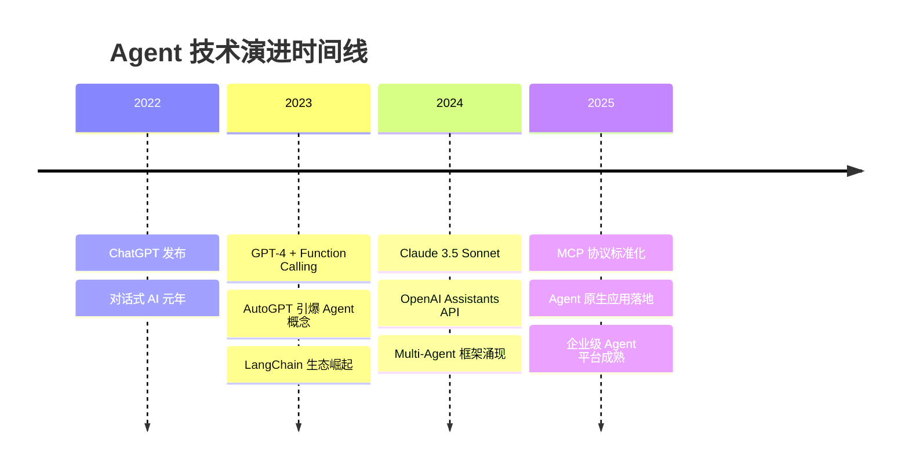
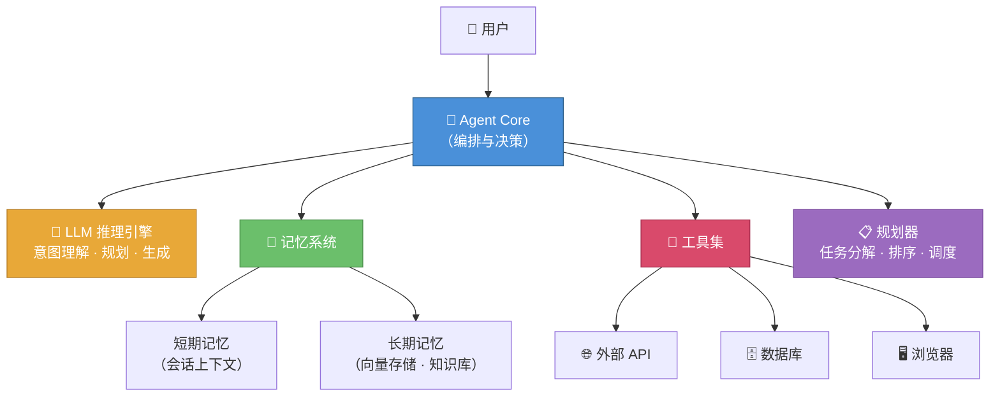
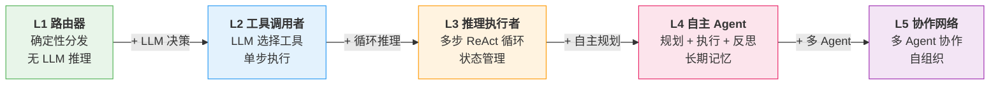
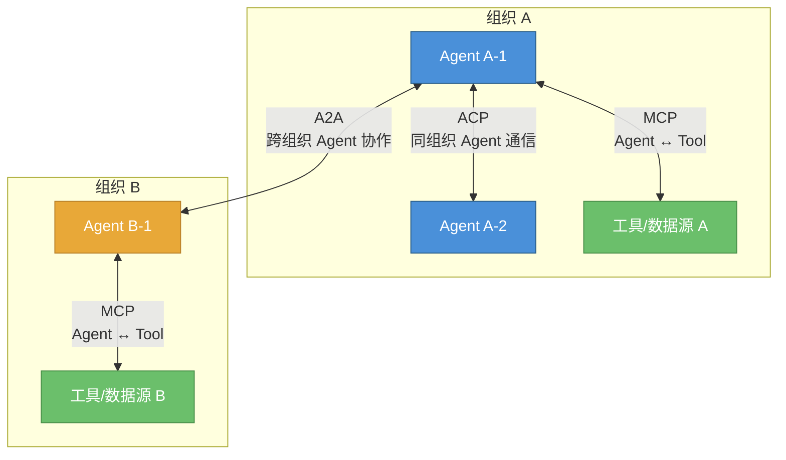

# 第 1 章 Agent 的时代

> **本章你将学到什么**
>
> - AI Agent 的精确定义及其与传统 Chatbot 的本质区别
> - L1–L5 能力光谱：从简单路由器到多 Agent 协作网络的完整分级体系
> - Agent 在 2024–2026 年爆发的三大驱动力：模型能力飞跃、标准协议诞生、工具链成熟
> - Agent 落地面临的核心挑战：可靠性、成本与安全三大鸿沟
> - Agentic Coding 作为 Agent 最成功落地场景的技术演进与工具栈
> - 本书的定位、读者画像与全书结构导览

本章建立 AI Agent 的基本认知框架：什么是 Agent、它与传统软件的本质区别、当前技术生态全景，以及为什么需要一套全新的工程方法论。Agent 的承诺与现实之间存在巨大鸿沟——可靠性不足、成本不可控、安全边界模糊——本书的目标正是系统性地应对这些挑战。本章是全书的起点，不需要特定的前置知识。

---

## 1.1 从 Chatbot 到 Agent：范式转变



**图 1-1 Agent 技术演进时间线**——从 ChatGPT 的对话能力到 Function Calling 的工具使用能力，再到 MCP 的互操作能力，Agent 的能力边界以年为单位持续扩展。


### 1.1.1 对话系统的局限性

自 2022 年 ChatGPT 发布以来，大语言模型（LLM）以惊人的速度渗透到各行各业。然而，纯对话式的交互模式很快暴露出根本性的局限：

- **无法执行操作**：用户说"帮我订一张明天去上海的机票"，Chatbot 只能回复"您可以在携程上搜索…"，而不能真正完成预订
- **缺乏持续性**：每次对话都是独立的，没有跨会话的记忆和状态管理
- **单一模态**：只能处理文本，无法操作文件、调用 API、浏览网页
- **被动响应**：只能回答用户的问题，不能主动发现问题并采取行动

这些局限性催生了一个根本性的认知转变：**我们需要的不是更好的对话系统，而是能够理解意图、规划步骤、调用工具、完成任务的自主系统。**

### 1.1.2 Agent 的定义

在本书的语境中，**AI Agent** 的定义是：

> 一个以大语言模型（LLM）为核心推理引擎，能够自主感知环境、制定计划、调用工具、执行操作，并根据反馈迭代改进的软件系统。

关键特征包括：

| 特征 | Chatbot | AI Agent |
|------|---------|----------|
| 交互模式 | 问答式 | 任务式 |
| 工具使用 | 无 | 多工具集成 |
| 状态管理 | 无状态 | 有状态、持久化 |
| 决策能力 | 单步响应 | 多步规划与执行 |
| 自主性 | 被动 | 主动 |
| 错误处理 | 无 | 自动重试与恢复 |
| 环境交互 | 仅文本 | 文件、API、浏览器、数据库等 |

**术语说明**：本书中，"AI Agent"、"Agent"和"Agentic 系统"含义等价，均指上述定义的自主软件系统。当我们需要特指不包含 LLM 的传统软件代理时，会使用"软件 Agent"或"传统 Agent"加以区分。在行业语境中，"Agentic AI"侧重描述这类系统的自主性特征，与本书中的"AI Agent"所指相同。

**图 1-2 Agent 核心架构概念图**——展示 Agent 的核心组件及其交互关系：



### 1.1.3 Agent 生态爆发

2024-2025 年，Agent 生态呈现爆发式增长：

- **Google** 发布 Agent Development Kit（ADK）和 Agent2Agent（A2A）协议
- **Anthropic** 发布 Model Context Protocol（MCP）和 Claude Agent
- **OpenAI** 发布 Agents SDK 和 Codex Agent
- **Microsoft** 推出 Azure AI Agent Service
- **开源社区**涌现 LangGraph、CrewAI、AutoGen 等框架

Gartner 预测，到 2028 年，至少 15% 的日常工作决策将由 Agentic AI 自主完成，而 2024 年这一数字几乎为零（来源：Gartner, *Predicts 2025: AI Agents*, 2024 年 10 月发布。注：该预测数据出自 Gartner "Top Strategic Technology Trends for 2025" 系列报告，具体引用编号可能因报告版本而异）。

---

## 1.2 Agent 能力光谱

Agent 并非非黑即白的概念，而是存在一个连续的能力光谱。我们定义 5 个级别（L1-L5），帮助团队明确自己正在构建什么级别的 Agent。

### 1.2.1 L1-L5 能力分级

```
L1: 简单路由器     →  根据关键词分发到预设流程
L2: 工具调用者     →  根据意图选择并调用合适的工具
L3: 推理执行者     →  多步推理 + 工具调用 + 状态管理
L4: 自主 Agent    →  自主规划、执行、反思、迭代
L5: 协作网络      →  多 Agent 协作，自组织完成复杂任务
```

**图 1-3 L1–L5 能力光谱图**——从确定性路由到多 Agent 自组织协作，自主性与复杂度逐级提升：



### 1.2.2 各级别详解

**L1: 简单路由器 (Router)**

```typescript
// L1 示例：基于意图分类的路由器
class L1Router {
  private rules: Map<string, string[]> = new Map([
    ['faq', ['怎么', '如何', '什么是', '为什么']],
    ['ticket', ['报修', '故障', '坏了', '不工作']],
    ['transfer', ['转人工', '真人', '投诉', '经理']],
  ]);

  classify(input: string): 'faq' | 'ticket' | 'transfer' {
    for (const [intent, keywords] of this.rules) {
      if (keywords.some((kw) => input.includes(kw))) {
        return intent as 'faq' | 'ticket' | 'transfer';
      }
    }
    return 'faq'; // 默认归类到 FAQ
  }

  route(input: string): string {
    const intent = this.classify(input);
    const handlers: Record<string, string> = {
      faq: 'FAQ 知识库检索流程',
      ticket: '工单创建流程',
      transfer: '人工客服转接流程',
    };
    return `[${intent.toUpperCase()}] 路由到 → ${handlers[intent]}`;
  }
}
```

特点：确定性逻辑、无 LLM 推理、响应快速、可预测

**L2: 工具调用者 (Tool User)**

```typescript
// L2 示例：LLM 驱动的工具选择与调用
interface ToolDefinition {
  name: string;
  description: string;
  parameters: Record<string, unknown>;
}

async function toolUserAgent(
  userQuery: string,
  tools: ToolDefinition[]
): Promise<string> {
  // Step 1: LLM 决策应该调用哪个工具
  const response = await llm.chat({
    messages: [
      {
        role: 'system',
        content: `你是一个工具选择助手。可用工具：${JSON.stringify(tools)}`,
      },
      { role: 'user', content: userQuery },
    ],
    tool_choice: 'auto',
    tools: tools,
  });

  // Step 2: 提取工具调用并执行
  const toolCall = response.tool_calls?.[0];
  if (!toolCall) return response.content;

  const result = await executeTool(toolCall.name, toolCall.arguments);
  return `工具 ${toolCall.name} 返回: ${JSON.stringify(result)}`;
}
```

特点：LLM 决策工具选择、单次工具调用、无状态

**L3: 推理执行者 (Reasoner)**

```typescript
// L3 示例：ReAct（Reason + Act）循环
async function reactAgent(
  task: string,
  tools: ToolDefinition[],
  maxIterations = 10
): Promise<string> {
  const messages: Message[] = [
    { role: 'system', content: REACT_SYSTEM_PROMPT },
    { role: 'user', content: task },
  ];

  for (let i = 0; i < maxIterations; i++) {
    const response = await llm.chat({ messages, tools });

    // 若 LLM 认为任务完成，直接返回最终答案
    if (!response.tool_calls || response.tool_calls.length === 0) {
      return response.content;
    }

    // 执行工具调用，将结果追加到对话历史
    for (const toolCall of response.tool_calls) {
      const result = await executeTool(toolCall.name, toolCall.arguments);
      messages.push({ role: 'assistant', tool_calls: [toolCall] });
      messages.push({
        role: 'tool',
        tool_call_id: toolCall.id,
        content: JSON.stringify(result),
      });
    }
  }

  return '达到最大迭代次数，任务未完成';
}
```

特点：多步推理、状态管理、工具链、错误恢复

**L4: 自主 Agent (Autonomous Agent)**

```typescript
// L4 示例：具有规划和反思能力的自主 Agent
class AutonomousAgent {
  private memory: MemoryStore;
  private planner: Planner;

  constructor(memory: MemoryStore, planner: Planner) {
    this.memory = memory;
    this.planner = planner;
  }

  async execute(goal: string): Promise<string> {
    // Phase 1: 规划——将目标分解为子任务
    const plan = await this.planner.decompose(goal);

    // Phase 2: 逐步执行并收集反馈
    for (const step of plan.steps) {
      const context = await this.memory.recall(step.description);
      const result = await this.executeStep(step, context);

      // Phase 3: 反思——评估结果，决定是否修正计划
      const reflection = await this.reflect(step, result);
      if (reflection.needsReplan) {
        plan.revise(reflection.feedback);
      }

      // 持久化经验到长期记忆
      await this.memory.store({
        step: step.description,
        result: result.summary,
        lesson: reflection.insight,
      });
    }

    return plan.synthesizeFinalResult();
  }

  private async reflect(step: PlanStep, result: StepResult) {
    return llm.chat({
      messages: [
        { role: 'system', content: '评估执行结果，提出改进建议。' },
        { role: 'user', content: `步骤: ${step.description}\n结果: ${result.summary}` },
      ],
    });
  }
}
```

特点：长期记忆、自主规划、反思改进、持续学习

**L5: 协作网络 (Agent Network)**

在 L5 级别，多个专精的 Agent 通过协议互联，形成类似人类组织的协作网络。每个 Agent 有独立的角色和能力，通过消息传递协作完成复杂任务。

```typescript
// L5 示例：Agent 协作网络
class AgentNetwork {
  private agents: Map<string, Agent>;
  private router: MessageRouter;

  constructor(agents: Agent[], router: MessageRouter) {
    this.agents = new Map(agents.map((a) => [a.role, a]));
    this.router = router;
  }

  async solveComplex(task: string): Promise<Result> {
    // Step 1: 协调者 Agent 分解任务并分配角色
    const coordinator = this.agents.get('coordinator')!;
    const taskPlan = await coordinator.decompose(task);

    // Step 2: 并行分发子任务给专精 Agent
    const subtaskPromises = taskPlan.subtasks.map(async (subtask) => {
      const agent = this.agents.get(subtask.assignedRole)!;
      return agent.execute(subtask);
    });
    const results = await Promise.all(subtaskPromises);

    // Step 3: 各 Agent 通过消息路由交换中间结果
    for (const result of results) {
      const dependents = taskPlan.getDependents(result.subtaskId);
      for (const dep of dependents) {
        await this.router.send(dep.assignedRole, {
          type: 'intermediate_result',
          data: result,
        });
      }
    }

    // Step 4: 协调者汇总最终结果
    return coordinator.synthesize(results);
  }
}
```

### 1.2.3 能力评估模型

```typescript
// Agent 能力评估器
enum AgentCapabilityLevel {
  L1_ROUTER = 1,
  L2_TOOL_USER = 2,
  L3_REASONER = 3,
  L4_AUTONOMOUS = 4,
  L5_NETWORK = 5,
}

interface AssessmentResult {
  level: AgentCapabilityLevel;
  scores: Record<string, number>;
  recommendations: string[];
}

class AgentAssessor {
  assess(agent: AgentConfig): AssessmentResult {
    const scores: Record<string, number> = {
      toolIntegration: agent.tools?.length ? Math.min(agent.tools.length / 5, 1) : 0,
      memoryCapability: agent.memory ? (agent.memory.longTerm ? 1.0 : 0.5) : 0,
      planningDepth: agent.planner ? (agent.planner.reflective ? 1.0 : 0.6) : 0,
      multiAgentSupport: agent.collaborators?.length ? 1.0 : 0,
      autonomyLevel: agent.autonomous ? 1.0 : 0,
    };

    const total = Object.values(scores).reduce((s, v) => s + v, 0);
    const level =
      total >= 4 ? AgentCapabilityLevel.L5_NETWORK
      : total >= 3 ? AgentCapabilityLevel.L4_AUTONOMOUS
      : total >= 2 ? AgentCapabilityLevel.L3_REASONER
      : total >= 1 ? AgentCapabilityLevel.L2_TOOL_USER
      : AgentCapabilityLevel.L1_ROUTER;

    const recs: string[] = [];
    if (scores.toolIntegration < 0.5) recs.push('增加工具集成以提升能力等级');
    if (scores.memoryCapability < 0.5) recs.push('引入长期记忆以支撑复杂任务');
    if (scores.planningDepth < 0.5) recs.push('增加规划与反思能力');
    if (scores.multiAgentSupport < 0.5) recs.push('考虑多 Agent 协作以应对复杂场景');

    return { level, scores, recommendations: recs };
  }
}
```

---

## 1.3 为什么是现在？

Agent 概念并非 2023 年才出现——早在 1990 年代，多 Agent 系统（MAS）就是人工智能的核心研究方向。但直到近两年，三个技术拐点的同时到来才让 Agent 从论文走向产品：**(1)** 基础模型的推理能力跨过可用阈值——GPT-4 级别的模型首次具备了在开放域中可靠地分解任务和调用工具的能力；**(2)** 工具调用的标准化——Function Calling 和 MCP 让 Agent 连接外部世界的成本从"每个工具写一套胶水代码"降到了"声明一个 Schema"；**(3)** 推理成本的急剧下降——2024 年到 2025 年间，同等能力模型的 API 价格下降了超过 90%，使得多步推理在经济上变得可行。三个关键因素的交汇使得 2024-2026 年成为 Agent 的引爆点。

### 1.3.1 模型能力的飞跃

| 能力维度 | 说明 | 代表性模型（截至撰写时） |
|---------|------|----------------------|
| 超长上下文窗口 | 从 4K 扩展到百万甚至千万级 token，支持整个代码库或长文档的完整理解 | GPT 系列、Claude 系列、Gemini 系列、Llama 4 系列 |
| 原生多模态推理 | 文本、图像、音频、视频等多模态输入的统一理解与推理 | GPT 系列（文本/图像/音频）、Gemini 系列（文本/图像/音频/视频）、Claude 系列（文本/图像（含 PDF 文档解析）） |
| 原生工具调用 | 模型内置函数调用能力，支持并行调用、结构化输出和标准化协议（如 MCP） | 主流闭源与开源模型均已支持 |
| 深度推理（Chain-of-Thought） | 显式推理链、扩展思考模式，显著提升复杂任务的准确率 | OpenAI o 系列、DeepSeek-R1、Gemini Deep Think 模式等 |
| 开源模型崛起 | MoE 架构在推理效率上实现突破，开源模型在 Agent 场景中日趋实用 | DeepSeek 系列、Llama 4 系列 |
| Agent 专项能力 | Computer Use、自主编排、长时间自主执行等 Agent 原生能力 | Claude 系列（Computer Use + Extended Thinking）、OpenAI Codex 等 |

> **注意**: 上表列出的是截至撰写时主流模型的能力维度总结，具体模型版本、发布日期和定价请参考各厂商官方文档，因为这些信息更新频繁。

上述能力维度在近两年取得了关键突破：上下文窗口从 4K 扩展到 10M tokens（Llama 4 Scout），Gemini 3 Pro 支持 1M 上下文并原生支持 Deep Think 推理模式；原生工具使用能力不再需要 hack，MCP 协议成为行业标准；推理能力出现质的飞跃（o3/o4-mini 推理链、DeepSeek-R1 开源推理模型）；Claude 4 系列原生支持 Agent 编排、Computer Use 与 Extended Thinking；开源模型方面，DeepSeek-V3 采用 MoE 架构（671B 总参数，37B 激活）在推理效率上实现突破[[DeepSeek-V3]](https://api-docs.deepseek.com/news/news251201)，Llama 4 系列同样采用 MoE 架构，Scout 以 109B 参数实现 10M 上下文[[Meta Llama 4]](https://ai.meta.com/blog/llama-4-multimodal-intelligence/)。Agent 基准测试大幅提升：SWE-bench Verified 最高准确率达到约 79.2%（Sonar Foundation Agent），WebArena 最高达到约 71.6%（OpAgent），标志着 AI Agent 在真实软件工程和网页操作任务上已接近实用水平。

### 1.3.2 标准协议的诞生

2024-2025 年，Agent 领域出现了三大标准化协议：

**MCP (Model Context Protocol)** — Anthropic 于 2024 年底推出
- Agent 与工具/数据源之间的标准接口
- 类比：AI 时代的 USB-C
- 解决了工具集成的碎片化问题

**A2A (Agent2Agent Protocol)** — Google 于 2025 年推出
- Agent 与 Agent 之间的通信标准
- 支持跨组织的 Agent 协作
- 基于 Agent Card 发现和 Task 生命周期

**ACP (Agent Communication Protocol)** — IBM 等企业联盟推动
- 企业级的 Agent 通信协议
- 强调安全性和可审计性

**图 1-4 三大协议关系图**——MCP 连接 Agent 与工具，A2A 和 ACP 连接 Agent 与 Agent（分别面向跨组织和同组织场景）：



### 1.3.3 工程化工具链的成熟

框架和工具链的成熟大幅降低了 Agent 开发门槛：

```
开发框架    ：LangGraph, Google ADK, CrewAI, AutoGen
协议工具    ：MCP SDK, A2A SDK
可观测性    ：LangSmith, LangFuse, Phoenix
向量数据库  ：Qdrant, ChromaDB, Weaviate, Pinecone
评测工具    ：promptfoo, Braintrust, GAIA
部署平台    ：Vercel AI SDK, AWS Bedrock Agents
```

---

## 1.4 Agent 的核心挑战

前文勾勒了 Agent 的美好愿景和爆发式增长的生态。然而，正如本章开篇所述，Agent 的承诺与现实之间存在三道巨大鸿沟。理解这些挑战，是本书系统性解决方案的起点。

### 1.4.1 可靠性鸿沟

Agent 的核心引擎——LLM——本质上是一个概率系统。这意味着同样的输入可能产生不同的输出，同样的任务可能在第一次成功、第二次失败。在实验室 demo 中，80% 的成功率令人印象深刻；但在生产环境中，每 5 次操作就有 1 次出错是完全不可接受的。

关键问题包括：

- **幻觉（Hallucination）**：Agent 可能自信地调用不存在的 API、编造参数、虚构执行结果
- **级联失败**：多步推理中，单步错误会沿着执行链放大——如果每步 95% 正确，10 步后整体正确率仅为 60%
- **非确定性行为**：相同的输入在不同时间可能触发不同的工具调用路径，给测试和调试带来极大困难

本书在第 3 章（架构）、第 5 章（上下文工程）和第 15-16 章（评测）中系统地应对可靠性挑战。

### 1.4.2 成本鸿沟

一个典型的 L3 Agent 处理单个任务可能需要 5-20 次 LLM 调用，每次调用消耗数千到数万 token。当 Agent 进入多步推理循环或面对复杂任务时，单次任务的成本可能达到数美元甚至数十美元。对于高频场景（如客服、编码辅助），成本会迅速失控。

成本管理的核心维度：

- **Token 效率**：如何在保持能力的同时减少上下文长度？
- **缓存策略**：哪些中间结果可以缓存以避免重复推理？
- **模型分层**：是否可以用轻量模型处理简单步骤、仅在关键节点使用强模型？
- **循环控制**：如何防止 Agent 陷入无效的推理死循环？

本书在第 19 章（成本优化）中提供完整的成本治理框架。

### 1.4.3 安全鸿沟

Agent 与 Chatbot 最大的区别在于——Agent 可以执行真实操作。一个能调用 API、写入数据库、发送邮件的系统，其安全边界远比一个只输出文本的系统复杂。

核心安全威胁包括：

- **Prompt 注入**：恶意用户通过精心构造的输入劫持 Agent 行为——例如让一个客服 Agent 泄露系统提示词或执行未授权操作
- **过度授权**：Agent 拥有超出任务所需的权限，一旦被劫持后果不可控
- **数据泄露**：Agent 在多步推理中可能将敏感数据暴露给不当的工具或日志系统
- **供应链风险**：通过 MCP 连接的第三方工具可能包含恶意代码或数据投毒

本书在第五部分（第 12-14 章）中深入讨论威胁模型、注入防御和信任架构。

> **小结**：可靠性决定了 Agent 能否用、成本决定了 Agent 用不用得起、安全决定了 Agent 敢不敢用。这三大鸿沟贯穿本书的每一个技术决策——从架构设计到部署运维，我们都会持续回到这三个维度来评估方案的工程质量。

---

## 1.5 本书的定位与结构

### 1.5.1 这本书为谁而写

本书面向以下读者：

- **AI 工程师**：希望系统掌握 Agent 架构设计和工程化实践
- **后端/全栈工程师**：计划在产品中集成 Agent 能力
- **技术管理者**：需要理解 Agent 的能力边界和技术选型
- **AI 产品经理**：希望深入理解 Agent 的技术原理以做出更好的产品决策

### 1.5.2 前置知识

- 熟悉 TypeScript / JavaScript
- 了解 HTTP / REST API 基础
- 对 LLM 有基本认知（Transformer 架构、Prompt Engineering）
- 无需深度学习或机器学习背景

### 1.5.3 全书结构

本书分为 11 个部分，27 章 + 6 个附录，从基础理论到生产实践，覆盖 Agent 工程化的完整知识体系：

| 部分 | 章节 | 核心主题 |
|------|------|---------|
| 一：基础与愿景 | 1-2 | Agent 定义、理论基础 |
| 二：核心架构 | 3-6 | 架构设计、状态、上下文、工具 |
| 三：记忆与知识 | 7-8 | 记忆系统、RAG |
| 四：Multi-Agent | 9-11 | 多 Agent 协作、编排、框架 |
| 五：安全与信任 | 12-14 | 威胁模型、注入防御、信任架构 |
| 六：评测 | 15-16 | 评测体系、Benchmark |
| 七：生产化 | 17-19 | 可观测性、部署、成本 |
| 八：互操作性 | 20-21 | MCP/A2A 协议、平台集成 |
| 九：用户体验 | 22 | AX 设计 |
| 十：案例研究 | 23-25 | 编码助手、客服、数据分析 |
| 十一：未来展望 | 26-27 | 前沿趋势、负责任开发 |


## 1.6 Agentic Coding：Agent 最成功的落地场景

### 1.6.1 从 Vibe Coding 到 Agentic Engineering

2025-2026 年，AI Agent 最成功、最广泛的落地场景并非企业客服或数据分析，而是**软件开发本身**。根据 Anthropic 2026 年《Agentic Coding Trends Report》，92% 的美国开发者每天使用 AI 编码工具，67% 的全球开发者将其纳入日常工作流。

Andrej Karpathy 在 2025 年提出的 "Vibe Coding" 概念——开发者描述意图，AI Agent 完成实现——已从实验阶段进入基础设施级别。2026 年，业界用 **Agentic Engineering** 来描述这一成熟形态：

| 阶段 | 特征 | 代表工具 | 人的角色 |
|------|------|---------|---------|
| L1 自动补全 | 行级/块级代码补全 | GitHub Copilot (2022) | 编写者 |
| L2 对话辅助 | 对话式代码生成和解释 | ChatGPT / Claude (2023) | 指导者 |
| L3 内联编辑 | Agent 直接编辑文件，理解项目上下文 | Cursor / Windsurf (2024) | 审查者 |
| L4 自主 Agent | 端到端完成任务（修 bug、实现功能、写测试） | Claude Code / Codex (2025) | 架构师 |
| L5 Agent 团队 | 多个 Agent 协同——规划、实现、测试、部署 | Multi-Agent workflows (2026) | 产品经理 |

### 1.6.2 Agentic Coding 的技术栈

```typescript
// 2026 年 Agentic Coding 的核心工具栈
interface AgenticCodingStack {
  // 终端优先的 Agent
  terminalAgents: {
    claudeCode: {
      approach: 'Bash + Read + Write + Browser';
      keyInsight: '极简工具集 + 强上下文 = 顶级性能';
      strengths: ['深度代码库理解', '终端原生', 'MCP 生态集成'];
    };
    openaiCodex: {
      approach: '云端沙箱执行';
      keyInsight: '安全隔离 + 异步任务 = 可扩展自动化';
      strengths: ['安全沙箱', '并行多任务', 'GitHub 深度集成'];
    };
  };

  // IDE 集成 Agent
  ideAgents: {
    cursor: { model: '多模型切换'; feature: 'Tab 补全 + Agent 模式' };
    windsurf: { model: '多模型切换'; feature: 'Cascade 多步推理' };
    copilotAgent: { model: 'GPT 系列 + Claude'; feature: 'Agent 模式 + MCP 支持' };
  };

  // 上下文协议
  contextProtocol: {
    mcp: {
      role: '工具与数据源的标准化访问';
      adoption: '行业标准——主流 IDE 和 Agent 均已支持';
    };
  };

  // 知识管理（Skill 层）
  knowledgeLayer: {
    customInstructions: 'CLAUDE.md / .cursorrules / .github/copilot-instructions.md';
    discovery: '文件系统遍历 + 语义匹配';
    examples: ['coding-standards', 'deployment-procedure', 'review-checklist'];
  };
}
```

### 1.6.3 对本书的启示

Agentic Coding 的成功证明了本书核心架构理念的正确性：

1. **Context Engineering > Prompt Engineering**（见第 5 章）：Claude Code 的成功不在于提示词技巧，而在于精心设计的上下文管理——项目文件、Git 历史、终端输出都是上下文的一部分
2. **少量通用工具 > 大量专用工具**（见第 6 章和第 20 章）：Claude Code 仅用 Bash + Read + Write + Browser 四个工具就实现了顶级性能
3. **Skill（知识）+ Tool（能力）的分层架构**（见第 20 章）：`.claude/commands/` 目录下的自定义 Slash Command 本质上就是 Skill

---

## 1.7 本章小结

本章建立了全书的核心概念框架：

1. **AI Agent 是范式转变**：从被动问答到主动执行任务的系统
2. **能力光谱 L1-L5**：Agent 不是二元概念，而是分级的能力体系
3. **三大驱动力**：模型能力飞跃 + 标准协议诞生 + 工具链成熟
4. **三大核心挑战**：可靠性、成本、安全——贯穿全书的工程关注点
5. **Agentic Coding 是最佳实践样本**：从中提炼的架构原则适用于所有 Agent 场景

下一章，我们将深入 Agent 的理论基础，理解 LLM 作为推理引擎的本质，以及确定性与概率性组件如何协同工作。

---

> **延伸阅读**
>
> 1. Lilian Weng, "LLM Powered Autonomous Agents" (2023)
>    https://lilianweng.github.io/posts/2023-06-23-agent/
> 2. Anthropic, "Building effective Agents" (2024)
>    https://www.anthropic.com/research/building-effective-agents
> 3. Chip Huyen, "What are AI Agents?" (2025)
>    https://huyenchip.com/2025/01/07/agents.html
> 4. Google, "Agent Development Kit Documentation" (2025)
>    https://google.github.io/adk-docs/
> 5. Anthropic, "Model Context Protocol Specification" (2024)
>    https://modelcontextprotocol.io/
> 6. Google, "Agent2Agent Protocol" (2025)
>    https://github.com/google/A2A
> 7. Andrew Ng, "Agentic Design Patterns" (2024)
>    https://www.deeplearning.ai/the-batch/agentic-design-patterns-part-1-four-ai-agent-strategies/
> 8. Shunyu Yao et al., "ReAct: Synergizing Reasoning and Acting in Language Models" (2023)
>    https://arxiv.org/abs/2210.03629
> 9. OpenAI, "A Practical Guide to Building Agents" (2025)
>    https://platform.openai.com/docs/guides/agents
> 10. Gartner, "Top Strategic Technology Trends for 2025" (2024)
>     https://www.gartner.com/en/articles/top-technology-trends-2025
