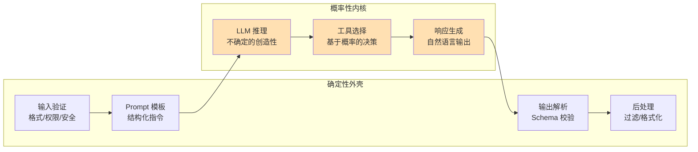
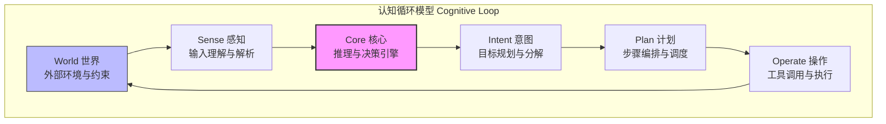

# 第 2 章 理论基础 — 从经典 AI 到 LLM Agent

本章为全书的理论地基。我们从 LLM 的推理能力出发，建立"确定性外壳 / 概率性内核"的核心架构哲学，引入 Context Engineering 的方法论框架，分析推理时计算扩展的最新进展，量化不可靠性税的工程成本，最后追溯经典 AI 理论中对 Agent 设计仍有直接指导价值的形式化定义与决策规划理论。

---

## 2.1 LLM 作为推理引擎

大语言模型的训练目标是"下一个 token 预测"（Next Token Prediction），但涌现出的能力远超简单的文本补全。理解这些能力的边界，是构建可靠 Agent 的前提。

### 2.1.1 Scaling Laws 与涌现能力

Kaplan et al. (2020) 发现模型性能与规模之间存在幂律关系：

$$L(N) \propto N^{-0.076}, \quad L(D) \propto D^{-0.095}, \quad L(C) \propto C^{-0.050}$$

其中 $N$ 为参数量，$D$ 为数据量，$C$ 为计算量。这些 Scaling Laws 揭示了一个关键事实：**模型能力是可预测地随规模提升的**，但边际收益递减。

**涌现能力（Emergent Abilities）** 指在模型规模低于某阈值时几乎不存在，超过阈值后突然出现的能力（Wei et al., 2022）。对 Agent 工程影响最大的涌现能力包括：

- **逻辑推理**：多步逻辑推导与数学求解
- **工具使用**：理解何时以及如何调用外部工具
- **规划能力**：将复杂任务分解为子步骤
- **指令遵循**：精确执行结构化指令

这些能力直接决定了 Agent 的架构选择：模型能力足够时可采用高自主度的 ReAct 循环，能力不足时需用更多确定性代码约束行为。

### 2.1.2 In-Context Learning（上下文学习）

ICL 是 LLM 最令人惊讶的能力之一：模型无需更新参数，仅通过提示中的少量示例就能学习新任务。这是 Agent 系统中 Few-Shot Prompting 和 Context Engineering 的理论基础。

目前对 ICL 有三种主要理论解释：

1. **隐式贝叶斯推断**（Xie et al., 2022）：LLM 在预训练中学习了概念的先验分布，遇到示例时执行贝叶斯更新——$P(\text{concept} \mid \text{examples}) \propto P(\text{examples} \mid \text{concept}) \times P(\text{concept})$
2. **梯度下降模拟**（Akyürek et al., 2023）：Transformer 的前向传播在数学上等价于对上下文示例执行隐式梯度下降
3. **任务识别**：示例帮助模型识别当前任务属于哪种已知模式，从而激活正确的"子程序"

**工程启示**：示例选择策略（相似性检索 vs 多样性采样 vs 课程式排列）对 ICL 效果影响显著，应根据任务类型进行 A/B 测试而非凭直觉选择。

### 2.1.3 Chain-of-Thought 推理

思维链（CoT）推理让 LLM 在给出最终答案前"展示思考过程"（Wei et al., 2022）。CoT 有效的核心原因：

1. **计算复杂度提升**：每个生成的中间 token 相当于一次额外的前向传播，增加了可用计算量
2. **工作记忆外化**：将中间结果外化到文本中，避免在有限隐层维度中保持所有中间状态
3. **推理路径约束**：每一步约束下一步的可能空间，降低推理出错概率

CoT 的四种主要应用模式：

| 模式 | 方法 | 适用场景 |
|------|------|---------|
| Zero-Shot CoT | 添加"让我们一步步思考" | 通用推理任务 |
| Few-Shot CoT | 提供带推理过程的示例 | 领域特定推理 |
| Self-Consistency | 多次 CoT 采样后投票 | 高准确度需求 |
| Structured CoT | 结构化推理框架（如 XML 标签） | Agent 工具决策 |

### 2.1.4 能力边界与理论局限

理解 LLM **不能做什么** 对 Agent 工程师可能更为重要：

**计算复杂度限制**：标准 Transformer 的单次前向传播是固定深度的计算图。Merrill & Sabharwal (2023) 证明，固定精度 Transformer 在不使用 CoT 时只能解决 TC⁰ 类问题——某些需要深度递归的问题理论上超出单次推理能力。

**忠实推理问题**：Turpin et al. (2023) 发现 CoT 中展示的推理过程并不总是反映模型内部的实际决策过程。Agent 系统不能完全信任 LLM 的"思考过程"来判断其可靠性。

**幻觉问题**：LLM 的训练目标（最大化下一个 token 似然）与"生成真实信息"之间存在根本性不对齐。Agent 必须通过工具调用验证和 Guardrails 来缓解。

**上下文窗口利用效率**：Liu et al. (2024) 的 "Lost in the Middle" 研究表明，LLM 对上下文中间位置的信息利用效率远低于首尾位置。简单地将更多信息塞入上下文并不等于 Agent 能有效利用。

> **前向引用**：LLM 能力分析将在第三章指导模型选型，在第四章指导工具设计以弥补 LLM 短板，在第八章构建覆盖这些局限性的评估框架。

---

## 2.2 确定性外壳与概率性内核

LLM 是概率性的——给定相同输入，它可能产生不同输出。但 Agent 系统的外部行为必须是可预测、可审计、可测试的。这一矛盾的解决方案是全书的架构基石：**确定性外壳包裹概率性内核**。


**图 2-1 "确定性外壳 / 概率性内核"架构模式**——用确定性的工程代码包裹不确定的 LLM 推理，确保系统在享受 LLM 灵活性的同时不失可控性。

### 2.2.1 设计原则

- **确定性外壳**：输入验证、输出校验、状态管理、错误处理、审计日志——用传统软件工程方法实现，行为完全确定
- **概率性内核**：推理、决策、文本生成——由 LLM 处理，结果具有随机性

核心思想可以用伪代码表达：

```
function agentStep(input):
    // === 确定性外壳：输入 ===
    validated = validateInput(input)          // Schema 校验，确定性
    context = assembleContext(validated)       // 上下文组装，确定性
    
    // === 概率性内核 ===
    response = llm.generate(context)          // LLM 推理，概率性
    
    // === 确定性外壳：输出 ===
    parsed = parseResponse(response)          // 结构化解析，确定性
    verified = verifyGuardrails(parsed)       // 安全检查，确定性
    newState = updateState(state, verified)   // 状态转移，确定性（纯函数）
    return newState
```

这个模式的关键洞察：**状态管理必须是确定性的**。给定相同的当前状态和相同的 LLM 输出，`updateState` 应该总是产生相同的新状态。这使得 Agent 的行为虽然包含 LLM 的随机性，但状态转移的逻辑是可测试、可回放、可审计的。

### 2.2.2 System 1 与 System 2 思维

借鉴 Daniel Kahneman 的双系统理论，Agent 系统可以设计两种"思维速度"：

| 维度 | System 1（快思考） | System 2（慢思考） |
|------|-------------------|-------------------|
| 速度 | 快（<1s） | 慢（数秒到数分钟） |
| Token 消耗 | 低 | 高 |
| 适用场景 | 简单分类、路由、缓存命中 | 复杂推理、规划、多步问题 |
| Agent 实现 | 直接响应 / 规则匹配 / 小模型 | ReAct / ToT / 多步推理 |
| 典型模型 | Flash / Mini / Haiku | Pro / Opus / Sonnet |

生产级 Agent 应根据任务复杂度动态切换思维模式——简单查询走 System 1 快速响应，复杂任务走 System 2 深度推理。这种分层不仅优化了用户体验（简单问题秒回），也显著降低了运营成本。

### 2.2.3 Token 经济学

Token 消耗直接影响运营成本和架构决策。以 2026Q1 主流模型定价为参考：

| 模型 | 输入价格 ($/1M tokens) | 输出价格 ($/1M tokens) |
|------|----------------------|----------------------|
| GPT-4o | 2.50 | 10.00 |
| GPT-4o-mini | 0.15 | 0.60 |
| Claude Opus 4 | 15.00 | 75.00 |
| Claude Sonnet 4 | 3.00 | 15.00 |
| Claude Haiku 3.5 | 0.80 | 4.00 |
| DeepSeek-R1 | 0.55 | 2.19 |

一个典型的复杂 Agent 任务（10 步 ReAct 循环）可能消耗 50K-200K tokens，成本从几美分到数美元不等。Token 经济学直接驱动了两个架构决策：（1）上下文压缩的工程投入是否值得；（2）何时用小模型替代大模型。

> **前向引用**：确定性外壳的具体实现将在第三章"架构模式"中展开，Token 经济学将在第八章"评估体系"中用于构建成本效率指标。

---

## 2.3 从 Prompt Engineering 到 Context Engineering

### 2.3.1 Prompt Engineering 的局限

在 Agent 系统中，模型看到的远不止一条 Prompt。一次 LLM 调用的上下文可能由六七个来源组装而成：系统提示词、对话历史、工具定义与返回值、RAG 检索结果、Agent 记忆与笔记、其他 Agent 的消息。手动管理这种复杂度是不可行的。

### 2.3.2 定义与演进

"Context Engineering" 由 Shopify CEO **Tobi Lutke** 于 2025 年 6 月提出，主张将关注焦点从"如何写提示词"转向"如何系统性地构建送入模型的上下文"。随后 **Andrej Karpathy** 进一步推广——"Prompt Engineering is dead; Context Engineering is the new game."

Anthropic 的 Zack Witten 给出了精确定义：

> **Context Engineering** 是一门构建动态系统的学科，它在恰当的时间以恰当的格式提供恰当的信息和工具。

### 2.3.3 五大原则概览

| # | 原则 | 核心问题 |
|---|------|---------|
| 1 | 信息密度最大化 | 每个 token 都应有价值，冗余信息浪费成本并稀释有用信息 |
| 2 | 时序相关性 | 最相关的信息放在最近的位置（利用 LLM 对首尾的高注意力） |
| 3 | 结构化组织 | 使用 XML 标签、Markdown 标题等标记明确信息边界 |
| 4 | 动态裁剪 | 根据任务动态调整上下文内容——不同任务需要不同知识 |
| 5 | 隔离与封装 | 不同来源的信息明确标记来源和可信度 |

这五大原则将在第 5 章展开为完整的 **WSCIPO**（Write / Select / Compress / Isolate / Persist / Observe）工程框架，配合 TypeScript 实现。本节仅建立概念基础。

> **前向引用**：Context Engineering 的完整方法论和代码实现详见第五章。

---

## 2.4 推理时计算缩放（Inference-Time Compute Scaling）

2024-2025 年，AI 领域出现了重要的范式转变：从关注训练阶段的计算扩展，转向关注推理阶段的计算扩展。

### 2.4.1 从 Training Scaling 到 Inference Scaling

Training-Time Scaling Laws 揭示了模型性能随训练规模可预测地提升，但边际收益递减。Inference-Time Compute Scaling 提供了另一条路径：在模型参数固定的前提下，通过在推理阶段消耗更多计算（更多 "thinking tokens"）来提升复杂任务表现。

$$\text{Training Scaling:}\quad \text{性能} \propto C_{\text{train}}^{\alpha} \quad (\alpha \approx 0.05\text{-}0.1)$$

$$\text{Inference Scaling:}\quad \text{性能} \propto C_{\text{inference}}^{\beta} \quad (\beta \text{ 随任务变化})$$

**关键洞察**：对于推理密集型任务（数学、代码、规划），$\beta > \alpha$，即推理阶段的计算投入回报更高。

### 2.4.2 Thinking Tokens 与推理模型

推理模型（如 o1/o3、DeepSeek-R1）的核心创新是引入 **Thinking Tokens**——模型先生成内部推理过程，再基于该过程产出最终结果。这本质上是 CoT 的工程化和规模化。

### 2.4.3 主要推理模型格局

| 模型 | 提供者 | 开放性 | 核心机制 | Agent 典型用途 |
|------|--------|--------|---------|--------------|
| o3 | OpenAI | 闭源 API | 内部 CoT，可配置推理预算 | 复杂规划、数学推理 |
| o4-mini | OpenAI | 闭源 API | 轻量级内部 CoT | 高频工具选择、中等推理 |
| GPT-5 | OpenAI | 闭源 API | 推理即默认，自动适配深度 | 通用 Agent（统一端点） |
| DeepSeek-R1 | DeepSeek | 开放权重 | RL 训练 + 蒸馏 | 本地部署、领域定制 |
| Claude (Extended Thinking) | Anthropic | 闭源 API | 可配置 thinking phase | 长链推理、安全关键场景 |

**DeepSeek-R1** 的突破在于证明推理能力可通过**强化学习**（GRPO 算法）而非人工标注来获得，且可通过**蒸馏**转移到小模型——1.5B 到 70B 参数的蒸馏变体在特定任务上展现了超越其参数规模的推理能力。

**GPT-5** 模糊了推理模型与标准模型的界限——将 CoT 推理内置为默认行为，根据查询复杂度自动调节深度，Agent 不再需要维护"简单→快模型、复杂→推理模型"的路由逻辑。

### 2.4.4 对 Agent 架构的影响

1. **动态计算分配**：推理密集步骤（规划、代码生成）分配更多 thinking tokens，简单步骤（格式转换、信息提取）使用快速模式
2. **System 1/2 的工程化**：System 1 对应低 thinking token 预算，System 2 对应高预算，Agent 控制循环可动态切换
3. **成本-质量新维度**：Thinking tokens 按输出价格计费，深度推理可使单次调用成本增加 10-50 倍，需建立推理预算管理
4. **与外部推理循环互补**：模型的内部 CoT 不替代 Agent 的外部推理循环（ReAct 等），两者是互补关系——外部循环负责任务分解和工具编排，内部推理负责每步决策的深度思考

> **前向引用**：推理模型的选型和预算策略将在第三章详细讨论，成本优化将在第八章展开。

---

## 2.5 不可靠性税（Unreliability Tax）

### 2.5.1 概念定义

**不可靠性税**是指 Agent 系统为应对 LLM 不确定性而付出的额外工程成本。这是每个 Agent 工程师都必须正视的"隐性税收"。从决策理论视角看，这是 Agent 在随机性、部分可观测环境中运行的固有成本。

不可靠性税包含五个维度：

- **重试成本**：LLM 输出格式错误需要重试
- **验证成本**：额外的输出验证逻辑
- **降级成本**：维护备用处理路径
- **监控成本**：更多的日志和告警
- **人工介入成本**：HITL（Human-in-the-Loop）审批机制

### 2.5.2 八大缓解策略

| # | 策略 | 方法 | 效果 | 理论基础 |
|---|------|------|------|---------|
| 1 | 结构化输出 | JSON Schema / Zod 约束 | 消除格式错误 | 约束动作空间 |
| 2 | 工具约束 | 限定可选工具集 | 减少错误调用 | 减小动作空间 |
| 3 | 温度控制 | temperature=0 | 提高一致性 | 降低随机性 |
| 4 | 少样本示例 | 提供成功案例 | 引导正确行为 | ICL 理论 |
| 5 | 输出验证 | 运行时类型检查 | 捕获异常输出 | 确定性外壳 |
| 6 | 重试机制 | 指数退避重试 | 容忍临时失败 | 随机过程多次采样 |
| 7 | Self-Consistency | 多次采样取共识 | 提高准确度 | CoT 理论 |
| 8 | 人工审核 | HITL 关键节点 | 兜底安全网 | 效用理论风险管理 |

策略 1-4 是**预防性措施**（降低出错概率），策略 5-8 是**应对性措施**（处理已发生的错误）。成熟的 Agent 系统两类策略均需部署。

用伪代码描述一个典型的不可靠性税应对流程：

```
function reliableAgentCall(input, maxRetries=3):
    for attempt in 1..maxRetries:
        response = llm.generate(input, temperature=0)     // 策略 3
        parsed = tryParseJSON(response)                    // 策略 1+5
        if parsed is valid:
            if passesGuardrails(parsed):                   // 策略 5
                return parsed
            else:
                log("Guardrail violation", parsed)
        else:
            input = appendRetryHint(input, response)       // 策略 6
    
    return humanEscalation(input)                          // 策略 8
```

> **前向引用**：不可靠性税的具体工程应对将贯穿第三章（架构模式中的错误恢复）、第四章（工具调用的重试策略）和第九章（安全与对齐中的 Guardrails 设计）。

---

## 2.6 Agent 形式化定义

在建立了 LLM 能力分析和架构哲学之后，我们回溯经典 AI 理论，为 Agent 建立严格的形式化定义。

### 2.6.1 经典定义

Stuart Russell 和 Peter Norvig 在《Artificial Intelligence: A Modern Approach》中的定义至今仍是标准起点：

> **Agent** 是任何能通过**传感器**感知其**环境**，并通过**执行器**作用于环境的实体。

数学表达为一个函数 $f: \mathcal{P}^* \rightarrow \mathcal{A}$，其中 $\mathcal{P}^*$ 是感知序列集合，$\mathcal{A}$ 是动作集合。**理性 Agent** 在给定感知序列和内置知识的条件下，选择能最大化期望性能度量的动作。

理性不等于全知——当 LLM 产生幻觉时，它并非"不理性"，而是在其"知识"范围内做出了它认为最优的回答。问题出在知识本身，而非推理过程。

### 2.6.2 Agent 类型谱系

| Agent 类型 | 核心机制 | LLM Agent 对应 |
|-----------|---------|---------------|
| 简单反射型 | 条件-动作规则 | 单轮 Prompt + 固定规则 |
| 基于模型的反射型 | 内部状态 + 规则 | 带对话历史的 Chat |
| 基于目标的 | 目标 + 搜索/规划 | ReAct Agent |
| 基于效用的 | 效用函数 + 优化 | 带评分的 Agent 路由 |
| 学习型 | 学习元素 + 性能元素 | 带记忆和反思的 Agent |

### 2.6.3 从经典 Agent 到 LLM Agent 的映射

| 经典概念 | LLM Agent 对应 | 说明 |
|---------|---------------|------|
| 传感器 | 用户输入 + 工具返回值 + RAG 结果 | 感知通道从物理传感器变为信息接口 |
| 执行器 | 工具调用（Tool Use） | 通过 Function Calling 作用于环境 |
| Agent 函数 | System Prompt + LLM + 上下文 | LLM 充当感知→动作的映射函数 |
| 内部状态 | 对话历史 + 记忆系统 | 短期记忆（上下文窗口）+ 长期记忆（向量数据库） |
| 环境模型 | LLM 的世界知识 | 预训练获得的概率世界模型 |
| 性能度量 | 任务成功率 + 用户满意度 + 成本 | 多维评估 |

**关键洞察**：LLM Agent 本质上是经典 Agent 理论的特化实例，其中 LLM 同时扮演了环境模型、推理引擎和（部分的）知识库三重角色。

### 2.6.4 认知循环模型（Cognitive Loop）

我们将 Agent 的感知-思考-行动过程建模为一个六阶段的认知循环：


**图 2-2 认知循环模型（Cognitive Loop）**——描述 Agent 从感知世界到执行操作的完整认知循环，其中 Core（核心）是 LLM 驱动的"概率性大脑"，而外围各层提供确定性的工程保障。

> **注意**：本章的认知循环模型描述 Agent 的感知-思考-行动过程，与第 5 章 WSCIPO 框架（Write/Select/Compress/Isolate/Persist/Observe）是不同的概念。认知循环模型关注 Agent 的认知架构，WSCIPO 关注开发者如何工程化地管理上下文。二者不同但互补。

认知循环模型直接指导了 Agent 的代码架构设计：

| 认知循环层 | 工程实现 | 关键技术 |
|-----------|---------|---------|
| **World** | 环境接口层 | MCP Client、API Gateway |
| **Sense** | 输入处理管线 | 意图分类、实体提取、多模态理解 |
| **Core** | LLM 推理引擎 | Prompt 工程、CoT、ReAct |
| **Intent** | 目标管理模块 | 任务分解、优先级排序 |
| **Plan** | 编排引擎 | DAG 调度、条件分支、循环控制 |
| **Operate** | 工具执行层 | 沙箱隔离、超时控制、结果验证 |

理解这个映射关系至关重要——它帮助你在面对具体技术决策时，始终能回到框架层面思考"我在解决哪个层的问题"。

### 2.6.5 环境特征

Agent 的设计高度依赖于环境特征。大多数 LLM Agent 运行在以下环境中：

- **部分可观测**：Agent 无法看到用户的全部意图，工具返回可能不完整
- **随机性**：LLM 本身是随机的，外部 API 可能失败
- **序贯式**：每步行动影响后续上下文和可用选项
- **动态**：外部世界在 Agent 思考时可能变化
- **离散**：动作空间通常是有限的工具集合
- **可能多 Agent**：复杂系统中常有多个 Agent 协作

> **前向引用**：形式化定义将在第三章具体化为可实现的工程架构，在第八章转化为可度量的性能指标。

---

## 2.7 决策与规划理论概览

本节将经典 AI 中的决策与规划理论进行精炼概述，聚焦于对 LLM Agent 工程有直接指导价值的核心概念。

### 2.7.1 马尔可夫决策过程（MDP）与 POMDP

**MDP** 是描述序贯决策问题的标准数学框架，定义为四元组 $(S, A, T, R)$：

- $S$：状态集合
- $A$：动作集合
- $T: S \times A \times S \rightarrow [0,1]$：转移函数，$T(s, a, s') = P(s' \mid s, a)$
- $R: S \times A \rightarrow \mathbb{R}$：奖励函数

求解目标是找到策略 $\pi: S \rightarrow A$，最大化期望累积折扣回报：

$$V^{\pi}(s) = \mathbb{E}\left[\sum_{t=0}^{\infty} \gamma^t R(s_t, \pi(s_t)) \mid s_0 = s\right]$$

其中 $\gamma \in [0,1)$ 是折扣因子。

**MDP 到 LLM Agent 的映射**：

| MDP 概念 | LLM Agent 对应 |
|----------|---------------|
| 状态 $S$ | 当前对话上下文 + 工具调用结果 + 环境状态 |
| 动作 $A$ | 工具调用 / 直接回复 / 请求澄清 / 委托子 Agent |
| 转移函数 $T$ | LLM 生成 + 工具执行结果（不可精确建模） |
| 奖励 $R$ | 任务完成度 + 用户满意度 - 成本 |
| 策略 $\pi$ | System Prompt + LLM 参数 + 路由逻辑 |
| 折扣因子 $\gamma$ | 对长远目标 vs 即时响应的权衡 |

现实中 LLM Agent 面对**部分可观测**环境，因此更准确的模型是 **POMDP** = $(S, A, T, R, \Omega, O)$，新增观测集合 $\Omega$ 和观测函数 $O$。Agent 需维护**信念状态（Belief State）**—— 对当前状态的概率分布 $b(s) = P(s \mid \text{history})$。

**POMDP 的三个工程启示**：

1. **信息收集动作的价值**：在不确定时主动提问或调用工具验证，本身就是有价值的动作
2. **信念维护的成本**：精确求解 POMDP 是 PSPACE-hard 的。LLM 通过对话历史隐式维护信念状态——近似但实用
3. **探索与利用的权衡**：继续收集信息（探索）还是基于当前信念行动（利用）？这直接体现在 Agent 的迭代次数限制中

### 2.7.2 规划理论

Agent 不仅需要单步决策，还需要**规划**——构造从当前状态到目标状态的动作序列。

**经典规划（STRIPS/PDDL）** 将规划问题形式化为状态空间搜索：给定初始状态、动作定义（含前置条件和效果）和目标状态，找到满足目标的动作序列。

**层次任务网络（HTN）** 采用自顶向下的分解方法——先确定高层策略，再逐步分解为具体步骤，更接近人类解决问题的方式。HTN 与 LLM Agent 的 Plan-and-Execute 模式有天然的对应关系。

LLM Agent 中的四种主要规划范式：

| 范式 | 规划时机 | 优势 | 劣势 | 适用场景 |
|------|---------|------|------|---------|
| ReAct | 每步规划 | 灵活、适应性强 | 缺乏全局视野 | 探索性任务 |
| Plan-and-Execute | 先规划后执行 | 全局最优、高效 | 不适应环境变化 | 结构化任务 |
| Tree-of-Thoughts | 搜索式规划 | 推理质量高 | 计算成本高 | 复杂推理问题 |
| 交错式 | 边执行边修正 | 平衡全局与局部 | 实现复杂 | 动态环境任务 |

### 2.7.3 效用理论与理性决策

**期望效用理论**告诉我们：理性 Agent 应选择能最大化期望效用的动作：

$$a^* = \arg\max_a \sum_s P(s \mid \text{evidence}) \times U(\text{outcome}(s, a))$$

在工程实践中，面对 LLM 的多重不确定性（模型不确定性、环境不确定性、用户意图不确定性），常采用三种策略：

1. **保守策略（Minimax）**：在最坏情况下最大化效用——体现为 Guardrails
2. **满意策略（Satisficing）**：不追求最优，达到"足够好"即可——体现为成功阈值
3. **信息价值策略（Value of Information）**：先收集信息再决策——体现为澄清提问

### 2.7.4 多 Agent 系统理论要点

当系统中存在多个 Agent 时，核心理论工具是**博弈论**：

- **纳什均衡**：没有任何单个 Agent 能通过单方面改变策略来提高收益的稳定状态
- **合作博弈与 Shapley 值**：公平分配联盟收益的公理化方法，可用于评估多 Agent 系统中各 Agent 的贡献度
- **通信协议**：基于言语行为理论（Speech Act Theory）的 Agent 间通信——包括断言（汇报结果）、指令（分发任务）、承诺（接受任务）等

### 2.7.5 认知架构启示

三种经典认知架构对 LLM Agent 设计的核心启发：

| 架构 | 核心理念 | 对 LLM Agent 的启发 |
|------|---------|-------------------|
| **BDI**（信念-愿望-意图） | 意图的承诺机制——一旦采纳意图不轻易放弃 | Agent 应"适度固执"，避免每步都重新评估所有选项 |
| **ACT-R**（自适应思维控制） | 记忆激活模型——$\text{Activation}(i) = \text{BaseLevel}(i) + \sum_j \text{Strength}(j,i)$ | 记忆检索应综合考虑使用频率、新近度和关联强度 |
| **SOAR**（状态-操作符-结果） | 问题空间搜索 + 困境自动创建子目标 | Agent 遇到无法决策时应自动分解为子问题 |

深入理论内容详见附录 F 推荐阅读中的相关论文。

> **前向引用**：决策理论将在第四章指导工具选择策略，规划理论将在第三章具体化为 Orchestrator-Worker 和 Plan-and-Execute 模式，多 Agent 理论将在第六章转化为具体工程模式，认知架构思想将在第五章指导记忆系统设计。

---

## 2.8 本章小结

本章从七个维度为 Agent 工程奠定了理论基础：

1. **LLM 作为推理引擎**（§2.1）：Scaling Laws 决定能力边界，ICL 和 CoT 是 Agent 利用 LLM 的核心机制，理解 LLM 的局限性（幻觉、计算深度限制、上下文利用效率）是设计可靠 Agent 的前提。

2. **确定性外壳与概率性内核**（§2.2）：全书的架构基石——用确定性工程代码包裹概率性 LLM 推理。System 1/2 双系统思维指导动态模型切换，Token 经济学驱动架构的成本优化。

3. **Context Engineering**（§2.3）：从 Prompt Engineering 到 Context Engineering 的范式转移——关注焦点从"如何写提示词"转向"如何系统性地构建上下文"。

4. **推理时计算缩放**（§2.4）：推理模型（o3、DeepSeek-R1、GPT-5、Claude Extended Thinking）通过 Thinking Tokens 在推理阶段投入更多计算来提升质量，深刻改变了 Agent 的规划能力和成本结构。

5. **不可靠性税**（§2.5）：LLM 不确定性带来的隐性工程成本，通过结构化输出、重试机制、人工审核等八大策略缓解。

6. **Agent 形式化定义**（§2.6）：经典 Agent 理论的现代映射，认知循环模型描述感知-思考-行动过程，环境特征分析指导架构选择。

7. **决策与规划理论**（§2.7）：MDP/POMDP 提供序贯决策框架，四种规划范式覆盖不同场景，效用理论指导理性决策，博弈论和认知架构为多 Agent 系统和记忆设计提供理论支撑。

这些理论不是抽象的学术知识，而是你在后续章节中进行每一个工程决策的理论依据。当你在第三章选择架构模式、在第四章设计工具系统、在第五章构建上下文管理、在第六章设计多 Agent 协作时——理论会告诉你为什么某些设计是好的，而另一些注定会失败。

---

> **延伸阅读**
>
> - Stuart Russell & Peter Norvig, *Artificial Intelligence: A Modern Approach* (4th ed., 2020) — Agent 理论经典教材
> - Daniel Kahneman, *Thinking, Fast and Slow* (2011) — 双系统理论
> - Jared Kaplan et al., "Scaling Laws for Neural Language Models" (2020)
> - Jason Wei et al., "Chain-of-Thought Prompting Elicits Reasoning" (2022)
> - Jason Wei et al., "Emergent Abilities of Large Language Models" (2022)
> - Shunyu Yao et al., "ReAct: Synergizing Reasoning and Acting" (2023)
> - Yao et al., "Tree of Thoughts: Deliberate Problem Solving with LLMs" (2023)
> - DeepSeek, "DeepSeek-R1: Incentivizing Reasoning Capability via RL" (2025)
> - Anthropic, "Context Engineering for AI Agents" (2025)
> - Michael Bratman, *Intention, Plans, and Practical Reason* (1987) — BDI 哲学基础
> - John Anderson, *The Architecture of Cognition* (1983) — ACT-R
> - Allen Newell, *Unified Theories of Cognition* (1990) — SOAR
