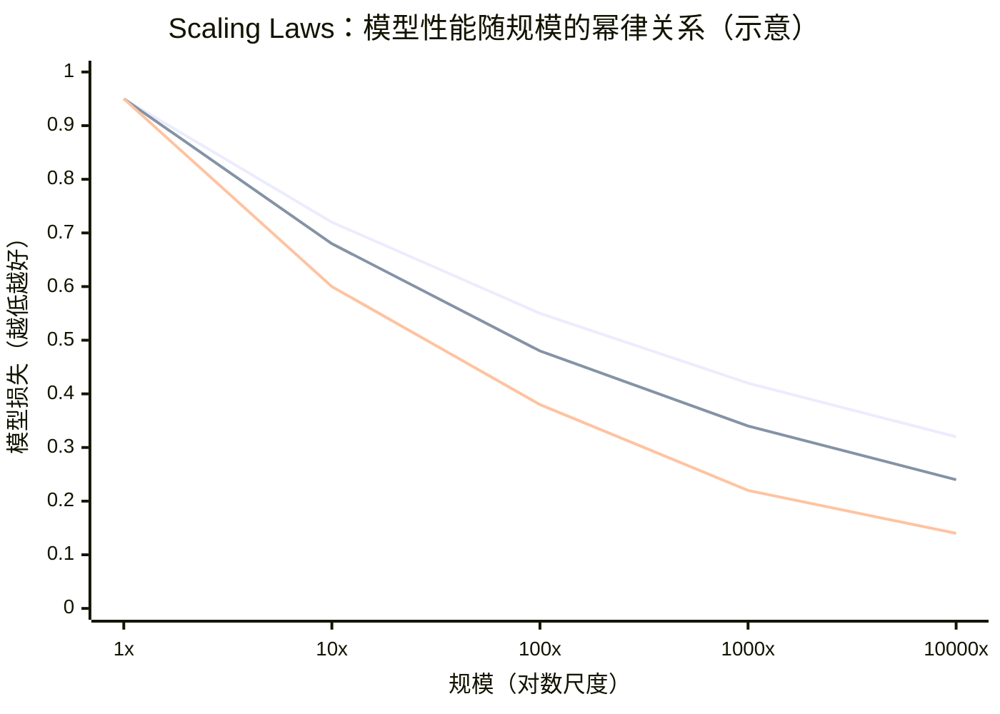
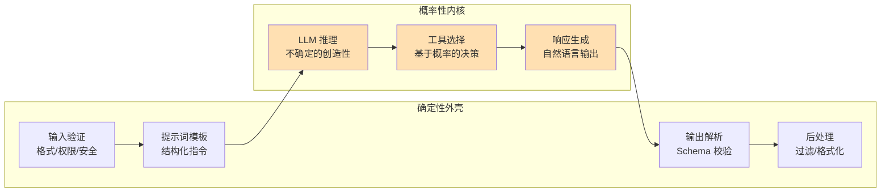
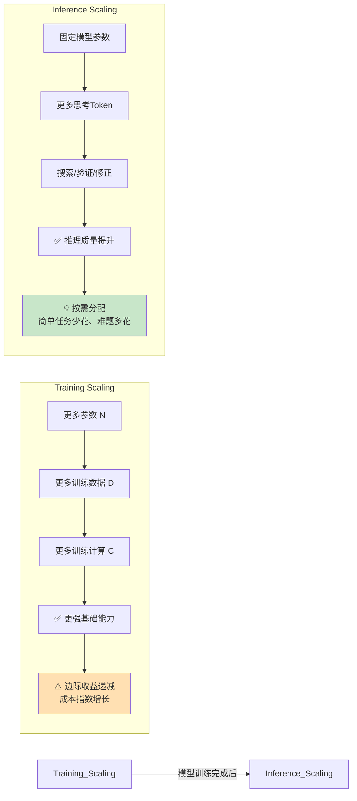
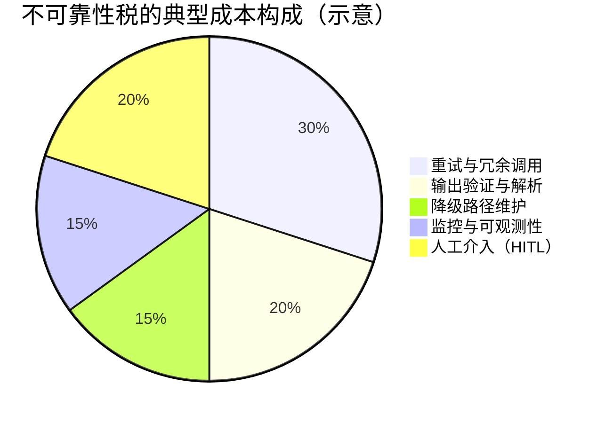
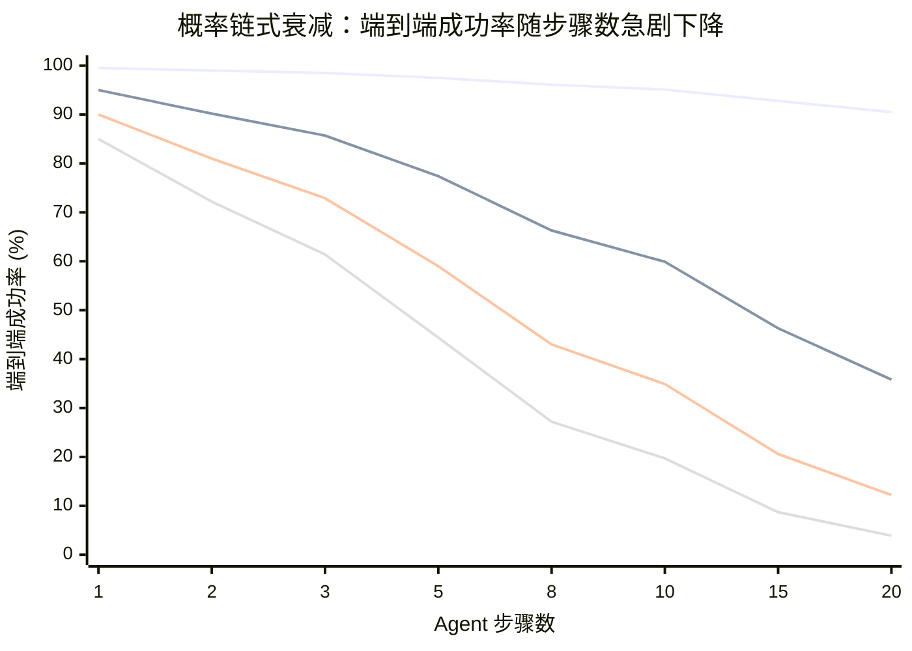
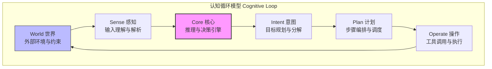

# 第 2 章 理论基础 — LLM 作为推理引擎

> **本章你将学到什么**
>
> 1. LLM 的推理能力边界：Scaling Laws、涌现能力及其学术争议，以及上下文学习（In-Context Learning, ICL）与 Chain-of-Thought 的理论基础
> 2. "确定性外壳 / 概率性内核"这一贯穿全书的核心架构哲学，及其与 System 1/2 双系统思维的对应关系
> 3. 从提示词工程（Prompt Engineering）到 Context Engineering（上下文工程）的范式转移，以及核心原则概览
> 4. 推理时计算缩放（Inference-Time Compute Scaling）的最新进展，包括思考Token（Thinking Tokens）与主流推理模型格局
> 5. 不可靠性税（Unreliability Tax）的量化分析与八大缓解策略
> 6. 经典 AI 理论中 Agent 的形式化定义、认知循环模型与环境特征分析
> 7. 决策与规划理论（MDP/POMDP、规划范式、效用理论、多 Agent 博弈论、认知架构）对工程实践的指导价值

> **本章建议阅读方式**
>
> - **有 AI/ML 背景的读者**：可以快速浏览 §2.1–§2.3 中熟悉的概念，重点关注每节末尾的"工程启示"和"前向引用"。§2.4（推理时计算缩放）和 §2.5（不可靠性税）包含最新工程洞察，建议细读。
> - **软件工程师 / 后端开发者**：建议从 §2.2（确定性外壳与概率性内核）开始，这是全书架构哲学的核心。§2.5 的不可靠性税与日常开发紧密相关。§2.6–§2.7 的理论部分可以先看表格和工程映射，跳过数学公式。
> - **技术管理者 / 架构师**：优先阅读 §2.2（架构哲学）、§2.4.3（模型格局）、§2.5（不可靠性税）和 §2.8（小结），这四节提供了做架构决策所需的核心判断框架。
> - **理论爱好者**：§2.6–§2.7 是全章理论密度最高的部分，从形式化定义到决策规划理论，建议配合延伸阅读中的论文深入理解。

本章为全书的理论地基。我们从 LLM 的推理能力出发，建立"确定性外壳 / 概率性内核"的核心架构哲学，引入 Context Engineering（上下文工程）的方法论框架，分析推理时计算扩展的最新进展，量化不可靠性税的工程成本，最后追溯经典 AI 理论中对 Agent 设计仍有直接指导价值的形式化定义与决策规划理论。

---

## 2.1 LLM 作为推理引擎

大语言模型的训练目标是"下一个 token 预测"（Next Token Prediction），但涌现出的能力远超简单的文本补全。理解这些能力的边界，是构建可靠 Agent 的前提。

### 2.1.1 Scaling Laws 与涌现能力

Kaplan et al. (2020) 发现模型性能与规模之间存在幂律关系：

$$L(N) \propto N^{-0.076}, \quad L(D) \propto D^{-0.095}, \quad L(C) \propto C^{-0.050}$$

其中 $N$ 为参数量，$D$ 为数据量，$C$ 为计算量。这些 Scaling Laws 揭示了一个关键事实：**模型能力是可预测地随规模提升的**，但边际收益递减。


**图 2-1 Scaling Laws 示意图**——模型性能（损失）随参数量、数据量的扩展呈幂律下降。Kaplan et al. (2020) 的原始研究侧重参数量维度，而 Hoffmann et al. (2022) 的 Chinchilla 研究表明参数与数据同步扩展（约 1:20 比例）可获得最优效率。注意：坐标轴为示意性质，旨在建立幂律递减的直觉。

**Chinchilla Scaling Laws 的修正**

值得注意的是，Kaplan et al. (2020) 的原始 Scaling Laws 在资源分配建议上存在显著偏差。Hoffmann et al. (2022) 通过训练超过 400 个不同规模的模型，发表了题为 "Training Compute-Optimal Large Language Models" 的研究（即 Chinchilla 论文），对早期 Scaling Laws 做出了重要修正：

- **Kaplan 的偏差**：原始研究认为在固定计算预算下，应优先增加模型参数量，对训练数据量的要求相对宽松。这一结论导致了 GPT-3（1750 亿参数，仅用 3000 亿 token 训练）等"大参数、少数据"的模型设计路线。
- **Chinchilla 的修正**：Hoffmann et al. 证明，Kaplan 等人严重低估了数据量的重要性。在计算最优（compute-optimal）条件下，模型参数量和训练数据量应当按约 **1:20** 的比例同步扩展——即每增加 1 个参数，应对应增加约 20 个训练 token。以此标准衡量，此前大多数大模型（包括 GPT-3、Gopher 等）都处于"过大参数、训练不足"的状态。Chinchilla（700 亿参数，用 1.4 万亿 token 训练）以不到 Gopher 四分之一的参数量，在多数基准测试上超越了后者。

这一修正对后续的大模型训练产生了深远影响：LLaMA、Mistral 等开源模型和后续闭源模型普遍采用了"更小参数 + 更多数据"的训练策略。对 Agent 工程师而言，Chinchilla 的启示是：**模型的实际能力不仅取决于参数量，更取决于训练是否充分**——在选型时不应仅看参数规模，还应关注模型的训练数据量和训练效率。

**涌现能力（Emergent Abilities）** 指在模型规模低于某阈值时几乎不存在，超过阈值后突然出现的能力（Wei et al., 2022）。对 Agent 工程影响最大的涌现能力包括：

- **逻辑推理**：多步逻辑推导与数学求解
- **工具使用**：理解何时以及如何调用外部工具
- **规划能力**：将复杂任务分解为子步骤
- **指令遵循**：精确执行结构化指令

这些能力直接决定了 Agent 的架构选择：模型能力足够时可采用高自主度的 ReAct 循环，能力不足时需用更多确定性代码约束行为。

**涌现能力的争议与最新认知**

值得注意的是，"涌现能力"这一概念本身在学术界面临严肃质疑。Schaeffer et al. (2024) 在 *Nature* 发表了题为 "Are Emergent Abilities of Large Language Models a Mirage?" 的研究，核心论点包括：

- **度量指标伪影**：所谓的"涌现"现象可能是由非线性或不连续的度量指标（如精确匹配率）人为制造的。当任务使用阶跃式的评估标准时，模型性能看起来会在某个规模阈值处"突然跃升"。
- **连续度量下涌现消失**：当改用连续性度量指标（如 Brier Score 或 Token-level 对数似然）重新评估同一批任务时，模型性能展现出平滑、渐进的提升曲线——"涌现"现象消失了。
- **可预测的改进**：研究者通过选择合适的度量标准，甚至可以让小模型也展现出"涌现"，或让大模型的涌现消失。

**对工程实践的影响**：无论这场理论争论最终结论如何，有一个工程经验是稳健的——**更大的模型在复杂任务上表现更好**，且这种改进是渐进而非阶跃的。对于 Agent 工程师而言，这意味着：不要依赖"某个模型规模的魔法阈值"来做架构决策，而应通过系统性的评估来量化不同模型在目标任务上的实际表现，并据此选型。

### 2.1.2 上下文学习（In-Context Learning, ICL）

ICL 是 LLM 最令人惊讶的能力之一：模型无需更新参数，仅通过提示词中的少量示例就能学习新任务。这是 Agent 系统中少样本提示（Few-Shot Prompting）和 Context Engineering（上下文工程）的理论基础。

目前对 ICL 有三种主要理论解释：

1. **隐式贝叶斯推断**（Xie et al., 2022）：LLM 在预训练中学习了概念的先验分布，遇到示例时执行贝叶斯更新——$P(\text{concept} \mid \text{examples}) \propto P(\text{examples} \mid \text{concept}) \times P(\text{concept})$
2. **梯度下降模拟**（Akyürek et al., 2023）：在线性模型等简化设定下，Transformer 的前向传播在数学上等价于对上下文示例执行隐式梯度下降。需要注意的是，这一等价关系是在受控的理论假设下建立的，在完整的非线性 Transformer 中尚未被严格证明
3. **任务识别**：示例帮助模型识别当前任务属于哪种已知模式，从而激活正确的"子程序"

**工程启示**：示例选择策略（相似性检索 vs 多样性采样 vs 课程式排列）对 ICL 效果影响显著，应根据任务类型进行 A/B 测试而非凭直觉选择。

### 2.1.3 Chain-of-Thought 推理

思维链（CoT）推理让 LLM 在给出最终答案前"展示思考过程"（Wei et al., 2022）。CoT 有效的核心原因：

1. **计算复杂度提升**：每个生成的中间 token 相当于一次额外的前向传播，增加了可用计算量
2. **工作记忆外化**：将中间结果外化到文本中，避免在有限隐层维度中保持所有中间状态
3. **推理路径约束**：每一步约束下一步的可能空间，降低推理出错概率

CoT 的四种主要应用模式：

| 模式 | 方法 | 适用场景 |
|------|------|---------|
| Zero-Shot CoT | 添加"让我们一步步思考" | 通用推理任务 |
| Few-Shot CoT | 提供带推理过程的示例 | 领域特定推理 |
| Self-Consistency | 多次 CoT 采样后投票 | 高准确度需求 |
| Structured CoT | 结构化推理框架（如 XML 标签） | Agent 工具决策 |

### 2.1.4 能力边界与理论局限

理解 LLM **不能做什么** 对 Agent 工程师可能更为重要：

**计算复杂度限制**：标准 Transformer 的单次前向传播是固定深度的计算图。Merrill & Sabharwal (2023) 证明，固定精度 Transformer 在不使用 CoT 时只能解决 TC⁰ 类问题——某些需要深度递归的问题理论上超出单次推理能力。

**忠实推理问题**：Turpin et al. (2023) 发现 CoT 中展示的推理过程并不总是反映模型内部的实际决策过程。Agent 系统不能完全信任 LLM 的"思考过程"来判断其可靠性。

**幻觉问题**：LLM 的训练目标（最大化下一个 token 似然）与"生成真实信息"之间存在根本性不对齐。Agent 必须通过工具调用验证和安全护栏（Guardrails）来缓解。

**上下文窗口利用效率**：Liu et al. (2024) 的 "Lost in the Middle" 研究表明，LLM 对上下文中间位置的信息利用效率远低于首尾位置。简单地将更多信息塞入上下文并不等于 Agent 能有效利用。

**表 2-1 LLM 核心能力与局限性对照**

| | **工程可利用** | **需要工程补偿** |
|---|---|---|
| **推理与决策** | 逻辑推理：多步推导与数学求解；CoT 可显著提升推理质量 | 忠实推理问题：CoT 展示的过程不一定反映真实决策路径（Turpin et al., 2023） |
| **工具与规划** | 工具使用：理解何时/如何调用外部 API；规划能力：任务分解与子步骤编排 | 计算深度限制：单次前向传播仅能解决 TC⁰ 类问题（Merrill & Sabharwal, 2023） |
| **语言与指令** | 指令遵循：精确执行结构化指令；ICL：无需微调即可学习新任务 | 幻觉：训练目标与事实生成不对齐，需工具验证 + 安全护栏（Guardrails） |
| **上下文利用** | 长上下文处理：128K–1M token 窗口支持复杂多轮交互 | 中间位置信息丢失："Lost in the Middle" 效应导致上下文利用不均匀（Liu et al., 2024） |

> **前向引用**：LLM 能力分析将在第 3 章指导模型选型，在第 6 章指导工具设计以弥补 LLM 短板，在第 15 章构建覆盖这些局限性的评估框架。

---

## 2.2 确定性外壳与概率性内核

LLM 是概率性的——给定相同输入，它可能产生不同输出。但 Agent 系统的外部行为必须是可预测、可审计、可测试的。这一矛盾的解决方案是全书的架构基石：**确定性外壳包裹概率性内核**。


**图 2-2 "确定性外壳 / 概率性内核"架构模式**——用确定性的工程代码包裹不确定的 LLM 推理，确保系统在享受 LLM 灵活性的同时不失可控性。

### 2.2.1 设计原则

- **确定性外壳**：输入验证、输出校验、状态管理、错误处理、审计日志——用传统软件工程方法实现，行为完全确定
- **概率性内核**：推理、决策、文本生成——由 LLM 处理，结果具有随机性

核心思想可以用伪代码表达：

```
function agentStep(input):
    // === 确定性外壳：输入 ===
    validated = validateInput(input)          // Schema 校验，确定性
    context = assembleContext(validated)       // 上下文组装，确定性
    
    // === 概率性内核 ===
    response = llm.generate(context)          // LLM 推理，概率性
    
    // === 确定性外壳：输出 ===
    parsed = parseResponse(response)          // 结构化解析，确定性
    verified = verifyGuardrails(parsed)       // 安全检查，确定性
    newState = updateState(state, verified)   // 状态转移，确定性（纯函数）
    return newState
```

这个模式的关键洞察：**状态管理必须是确定性的**。给定相同的当前状态和相同的 LLM 输出，`updateState` 应该总是产生相同的新状态。这使得 Agent 的行为虽然包含 LLM 的随机性，但状态转移的逻辑是可测试、可回放、可审计的。

### 2.2.2 System 1 与 System 2 思维

借鉴 Daniel Kahneman (2011) 的双系统理论，Agent 系统可以设计两种"思维速度"：

| 维度 | System 1（快思考） | System 2（慢思考） |
|------|-------------------|-------------------|
| 速度 | 快（<1s） | 慢（数秒到数分钟） |
| Token 消耗 | 低 | 高 |
| 适用场景 | 简单分类、路由、缓存命中 | 复杂推理、规划、多步问题 |
| Agent 实现 | 直接响应 / 规则匹配 / 小模型 | ReAct / ToT / 多步推理 |
| 典型模型 | Flash / Mini / Haiku | Pro / Opus / Sonnet |

生产级 Agent 应根据任务复杂度动态切换思维模式——简单查询走 System 1 快速响应，复杂任务走 System 2 深度推理。这种分层不仅优化了用户体验（简单问题秒回），也显著降低了运营成本。

### 2.2.3 Token 经济学

Token 消耗直接影响运营成本和架构决策。以 2026Q1 主流模型定价为参考：

| 模型 | 输入价格 ($/1M tokens) | 输出价格 ($/1M tokens) |
|------|----------------------|----------------------|
| GPT-4o | 2.50 | 10.00 |
| GPT-4o-mini | 0.15 | 0.60 |
| Claude Opus 4 | 15.00 | 75.00 |
| Claude Sonnet 4 | 3.00 | 15.00 |
| Claude Haiku 3.5 | 0.80 | 4.00 |
| DeepSeek-R1 | 0.55 | 2.19 |

> **注**：上表定价截至 2026 年 3 月，各供应商定价变化频繁，请参阅官方文档获取最新信息。总体趋势：输入/输出价格每年约下降 50–70%。

一个典型的复杂 Agent 任务（10 步 ReAct 循环）可能消耗 50K-200K tokens，成本从几美分到数美元不等。Token 经济学直接驱动了两个架构决策：（1）上下文压缩的工程投入是否值得；（2）何时用小模型替代大模型。

> **前向引用**：确定性外壳的具体实现将在第 3 章"架构模式"中展开，Token 经济学将在第 19 章"成本工程"中用于构建成本效率指标。

---

## 2.3 从提示词工程（Prompt Engineering）到 Context Engineering（上下文工程）

### 2.3.1 提示词工程的局限

在 Agent 系统中，模型看到的远不止一条提示词。一次 LLM 调用的上下文可能由六七个来源组装而成：系统提示词、对话历史、工具定义与返回值、RAG 检索结果、Agent 记忆与笔记、其他 Agent 的消息。手动管理这种复杂度是不可行的。

### 2.3.2 定义与演进

"Context Engineering（上下文工程）" 由 Shopify CEO **Tobi Lutke** 于 2025 年 6 月提出，主张将关注焦点从"如何写提示词"转向"如何系统性地构建送入模型的上下文"。随后 **Andrej Karpathy** 进一步推广——"Prompt Engineering is dead; Context Engineering is the new game."

Anthropic 的 Zack Witten 给出了精确定义：

> **Context Engineering（上下文工程）** 是一门构建动态系统的学科，它在恰当的时间以恰当的格式提供恰当的信息和工具。

### 2.3.3 核心原则概览

| # | 原则 | 核心问题 |
|---|------|---------|
| 1 | 信息密度最大化 | 每个 token 都应有价值，冗余信息浪费成本并稀释有用信息 |
| 2 | 时序相关性 | 最相关的信息放在最近的位置（利用 LLM 对首尾的高注意力） |
| 3 | 结构化组织 | 使用 XML 标签、Markdown 标题等标记明确信息边界 |
| 4 | 动态裁剪 | 根据任务动态调整上下文内容——不同任务需要不同知识 |
| 5 | 隔离与封装 | 不同来源的信息明确标记来源和可信度 |

这些原则启发了第 5 章的 **WSCIPO**（Write / Select / Compress / Isolate / Persist / Observe）工程框架，配合 TypeScript 实现。本节仅建立概念基础。

> **前向引用**：Context Engineering（上下文工程）的完整方法论和代码实现详见第 5 章。

---

## 2.4 推理时计算缩放（Inference-Time Compute Scaling）

2024-2025 年，AI 领域出现了重要的范式转变：从关注训练阶段的计算扩展，转向关注推理阶段的计算扩展。

### 2.4.1 从 Training Scaling 到 Inference Scaling

Training-Time Scaling Laws 揭示了模型性能随训练规模可预测地提升，但边际收益递减。Inference-Time Compute Scaling 提供了另一条路径：在模型参数固定的前提下，通过在推理阶段消耗更多计算（更多思考Token）来提升复杂任务表现。

$$\text{Training Scaling:}\quad \text{性能} \propto C_{\text{train}}^{\alpha} \quad (\alpha \approx 0.05\text{-}0.1)$$

$$\text{Inference Scaling:}\quad \text{性能} \propto C_{\text{inference}}^{\beta} \quad (\beta \text{ 随任务变化})$$

> **注意**：上述公式是简化表示。实际的 Inference Scaling 行为高度依赖于具体的推理策略（best-of-N、revision、search 等），不同方法的 scaling 曲线差异很大（参见 Snell et al., 2024）。此处用幂律形式仅为建立直觉，不应将其视为精确的预测模型。

**关键洞察**：对于推理密集型任务（数学、代码、规划），$\beta > \alpha$，即推理阶段的计算投入回报更高。


**图 2-3 Training Scaling 与 Inference Scaling 对比**——训练阶段扩展提升基础能力但面临边际递减和成本指数增长，推理阶段扩展则允许在模型固定后按需为复杂任务分配更多计算资源，两者互为补充。

### 2.4.2 思考Token（Thinking Tokens）与推理模型

推理模型（如 o1/o3、DeepSeek-R1）的核心创新是引入 **思考Token（Thinking Tokens）**——模型先生成内部推理过程，再基于该过程产出最终结果。这本质上是 CoT 的工程化和规模化。

**工作机制**：思考Token 的运作方式与标准的 CoT 提示词有本质区别。在传统 CoT 中，推理过程由用户通过提示词（如"让我们一步步思考"）显式触发，推理步骤作为普通输出 token 对用户完全可见。而思考Token 是模型在训练阶段（通常通过强化学习）习得的内生推理能力——模型自动判断何时需要深度思考，在一个专门的"思考阶段"中生成内部推理链，这些推理内容通常对用户不可见或以折叠形式呈现，只有最终结论才作为正式输出返回。

**与普通 CoT 的关键区别**：首先，在**触发方式**上，普通 CoT 依赖提示词工程师手动设计推理引导语，而思考Token 由模型自主激活，不需要也不依赖用户的显式指令。其次，在**推理质量**上，思考Token 模型通过大规模强化学习（如 DeepSeek-R1 的 GRPO 算法、OpenAI o 系列的过程奖励模型）训练，其推理链的结构性、自我纠错能力和深度远超提示词诱导的 CoT。实验表明，在数学竞赛和复杂编程任务中，思考Token 模型的表现可以显著超越相同参数规模下使用传统 CoT 的模型。第三，在**token 消耗模式**上，思考Token 会显著增加输出 token 量（通常是非推理模式的 3-20 倍），且这些 token 按输出价格计费，这直接影响成本预算。

**API 控制方式**：主流推理模型提供了不同粒度的思考控制接口。OpenAI 的 o3/o4-mini 通过 `reasoning_effort` 参数（low/medium/high）控制推理深度，对应不同的思考Token 预算上限。Anthropic 的 Claude Extended Thinking 通过 `thinking` 配置块中的 `budget_tokens` 参数精确设定思考Token 的最大数量，开发者可以在 1024 到模型最大输出长度之间灵活调节。DeepSeek-R1 作为开放权重模型，在本地部署时可通过采样参数和停止条件更直接地控制推理行为。在 Agent 系统中，合理的策略是**根据任务复杂度动态调节推理预算**：简单的信息提取任务设置低预算或直接使用非推理模型，而复杂的规划、代码生成任务则分配高预算以获取更优结果。

### 2.4.3 主要推理模型格局

| 模型 | 提供者 | 开放性 | 核心机制 | Agent 典型用途 |
|------|--------|--------|---------|--------------|
| o3 | OpenAI | 闭源 API | 内部 CoT，可配置推理预算 | 复杂规划、数学推理 |
| o4-mini | OpenAI | 闭源 API | 轻量级内部 CoT | 高频工具选择、中等推理 |
| GPT-5 | OpenAI | 闭源 API | 推理即默认，自动适配深度 | 通用 Agent（统一端点） |
| DeepSeek-R1 | DeepSeek | 开放权重 | RL 训练 + 蒸馏 | 本地部署、领域定制 |
| Claude (Extended Thinking) | Anthropic | 闭源 API | 可配置 thinking phase | 长链推理、安全关键场景 |

**DeepSeek-R1** 的突破在于证明推理能力可通过**强化学习**（GRPO 算法）而非人工标注来获得，且可通过**蒸馏**转移到小模型——1.5B 到 70B 参数的蒸馏变体在特定任务上展现了超越其参数规模的推理能力。

**GPT-5** 模糊了推理模型与标准模型的界限——将 CoT 推理内置为默认行为，根据查询复杂度自动调节深度，Agent 不再需要维护"简单→快模型、复杂→推理模型"的路由逻辑。

### 2.4.4 对 Agent 架构的影响

1. **动态计算分配**：推理密集步骤（规划、代码生成）分配更多思考Token，简单步骤（格式转换、信息提取）使用快速模式
2. **System 1/2 的工程化**：System 1 对应低思考Token 预算，System 2 对应高预算，Agent 控制循环可动态切换
3. **成本-质量新维度**：思考Token 按输出价格计费，深度推理可使单次调用成本增加 10-50 倍，需建立推理预算管理
4. **与外部推理循环互补**：模型的内部 CoT 不替代 Agent 的外部推理循环（ReAct 等），两者是互补关系——外部循环负责任务分解和工具编排，内部推理负责每步决策的深度思考

> **前向引用**：推理模型的选型和预算策略将在第 3 章详细讨论，成本优化将在第 19 章展开。

---

## 2.5 不可靠性税（Unreliability Tax）

### 2.5.1 概念定义

**不可靠性税**是指 Agent 系统为应对 LLM 不确定性而付出的额外工程成本。这是每个 Agent 工程师都必须正视的"隐性税收"。从决策理论视角看，这是 Agent 在随机性、部分可观测环境中运行的固有成本。

不可靠性税包含五个维度：

- **重试成本**：LLM 输出格式错误需要重试
- **验证成本**：额外的输出验证逻辑
- **降级成本**：维护备用处理路径
- **监控成本**：更多的日志和告警
- **人工介入成本**：HITL（Human-in-the-Loop）审批机制


**图 2-4 不可靠性税的成本构成**——五大维度的相对占比（示意性数据，实际比例因系统而异）。重试与人工介入通常是最大的两项隐性成本。

### 2.5.2 量化理解：概率链式衰减

不可靠性税的真正危害在于**概率链式衰减**。考虑一个 10 步 ReAct Agent，假设每步 LLM 调用的格式正确率为 95%（这在实践中已算不错的表现），则：

$$P(\text{10 步全部正确}) = 0.95^{10} \approx 59.9\%$$

也就是说，即使每一步的可靠性高达 95%，一个 10 步 Agent **有超过 40% 的概率至少在某一步出错**。若要达到端到端 99% 的成功率：

$$0.99 = p^{10} \implies p = 0.99^{1/10} \approx 99.9\%$$

每步的可靠性需要提升到 **99.9%**——从 95% 到 99.9% 看似只差 4.9 个百分点，但这意味着错误率要从 5% 降低到 0.1%，即**降低 50 倍**。这就是不可靠性税的核心挑战：**多步系统对单步可靠性的要求是指数级放大的**。这也解释了为何结构化输出、工具约束等"看似简单"的工程措施在实际系统中如此重要——它们将单步可靠性从 95% 推向 99%+ 的区间。


**图 2-5 概率链式衰减曲线**——端到端成功率随 Agent 步骤数的变化。即使单步可靠性高达 95%（在实践中已属良好），10 步后端到端成功率也仅剩约 60%。当单步可靠性降至 90% 时，10 步后成功率骤降至约 35%。这一曲线直观解释了为何多步 Agent 系统对单步可靠性有着远超直觉的苛刻要求。

### 2.5.3 八大缓解策略

| # | 策略 | 方法 | 效果 | 理论基础 |
|---|------|------|------|---------|
| 1 | 结构化输出 | JSON Schema / Zod 约束 | 消除格式错误 | 约束动作空间 |
| 2 | 工具约束 | 限定可选工具集 | 减少错误调用 | 减小动作空间 |
| 3 | 温度控制 | temperature=0 | 提高一致性 | 降低随机性 |
| 4 | 少样本示例 | 提供成功案例 | 引导正确行为 | ICL 理论 |
| 5 | 输出验证 | 运行时类型检查 | 捕获异常输出 | 确定性外壳 |
| 6 | 重试机制 | 指数退避重试 | 容忍临时失败 | 随机过程多次采样 |
| 7 | Self-Consistency | 多次采样取共识 | 提高准确度 | CoT 理论 |
| 8 | 人工审核 | HITL 关键节点 | 兜底安全网 | 效用理论风险管理 |

策略 1-4 是**预防性措施**（降低出错概率），策略 5-8 是**应对性措施**（处理已发生的错误）。成熟的 Agent 系统两类策略均需部署。

用伪代码描述一个典型的不可靠性税应对流程：

```
function reliableAgentCall(input, maxRetries=3):
    for attempt in 1..maxRetries:
        response = llm.generate(input, temperature=0)     // 策略 3
        parsed = tryParseJSON(response)                    // 策略 1+5
        if parsed is valid:
            if passesGuardrails(parsed):                   // 策略 5
                return parsed
            else:
                log("Guardrail violation", parsed)
        else:
            input = appendRetryHint(input, response)       // 策略 6
    
    return humanEscalation(input)                          // 策略 8
```

> **前向引用**：不可靠性税的具体工程应对将贯穿第 3 章（架构模式中的错误恢复）、第 6 章（工具调用的重试策略）和第 12–14 章（安全与信任中的安全护栏设计）。

---

## 2.6 Agent 形式化定义

> **阅读导航**
>
> §2.6 聚焦 Agent 的**结构性定义**——Agent **是什么**；§2.7 聚焦 Agent 的**决策与规划理论**——Agent **如何做**。两节合在一起构成从经典 AI 到 LLM Agent 的完整理论桥梁。
>
> 如果你的背景偏工程实践而非理论研究，可以跳过数学公式，**重点关注每节中的表格和"工程启示"段落**——它们将形式化概念直接映射为可操作的设计决策。需要时可以回头查阅公式细节。

在建立了 LLM 能力分析和架构哲学之后，我们回溯经典 AI 理论，为 Agent 建立严格的形式化定义。

### 2.6.1 经典定义

Stuart Russell 和 Peter Norvig 在《Artificial Intelligence: A Modern Approach》中的定义至今仍是标准起点：

> **Agent** 是任何能通过**传感器**感知其**环境**，并通过**执行器**作用于环境的实体。

数学表达为一个函数 $f: \mathcal{P}^* \rightarrow \mathcal{A}$，其中 $\mathcal{P}^*$ 是感知序列集合，$\mathcal{A}$ 是动作集合。**理性 Agent** 在给定感知序列和内置知识的条件下，选择能最大化期望性能度量的动作。

理性不等于全知——当 LLM 产生幻觉时，它并非"不理性"，而是在其"知识"范围内做出了它认为最优的回答。问题出在知识本身，而非推理过程。

### 2.6.2 Agent 类型谱系

| Agent 类型 | 核心机制 | LLM Agent 对应 |
|-----------|---------|---------------|
| 简单反射型 | 条件-动作规则 | 单轮提示词 + 固定规则 |
| 基于模型的反射型 | 内部状态 + 规则 | 带对话历史的 Chat |
| 基于目标的 | 目标 + 搜索/规划 | ReAct Agent |
| 基于效用的 | 效用函数 + 优化 | 带评分的 Agent 路由 |
| 学习型 | 学习元素 + 性能元素 | 带记忆和反思的 Agent |

### 2.6.3 从经典 Agent 到 LLM Agent 的映射

| 经典概念 | LLM Agent 对应 | 说明 |
|---------|---------------|------|
| 传感器 | 用户输入 + 工具返回值 + RAG 结果 | 感知通道从物理传感器变为信息接口 |
| 执行器 | 工具调用（Tool Use） | 通过 Function Calling 作用于环境 |
| Agent 函数 | 系统提示词 + LLM + 上下文 | LLM 充当感知→动作的映射函数 |
| 内部状态 | 对话历史 + 记忆系统 | 短期记忆（上下文窗口）+ 长期记忆（向量数据库） |
| 环境模型 | LLM 的世界知识 | 预训练获得的概率世界模型 |
| 性能度量 | 任务成功率 + 用户满意度 + 成本 | 多维评估 |

**关键洞察**：LLM Agent 本质上是经典 Agent 理论的特化实例，其中 LLM 同时扮演了环境模型、推理引擎和（部分的）知识库三重角色。

### 2.6.4 认知循环模型（Cognitive Loop）

我们将 Agent 的感知-思考-行动过程建模为一个六阶段的认知循环：


**图 2-6 认知循环模型（Cognitive Loop）**——描述 Agent 从感知世界到执行操作的完整认知循环，其中 Core（核心）是 LLM 驱动的"概率性大脑"，而外围各层提供确定性的工程保障。

> **注意**：本章的认知循环模型描述 Agent 的感知-思考-行动过程，与第 5 章 WSCIPO 框架（Write/Select/Compress/Isolate/Persist/Observe）是不同的概念。认知循环模型关注 Agent 的认知架构，WSCIPO 关注开发者如何工程化地管理上下文。二者不同但互补。

认知循环模型直接指导了 Agent 的代码架构设计：

| 认知循环层 | 工程实现 | 关键技术 |
|-----------|---------|---------|
| **World** | 环境接口层 | MCP Client、API Gateway |
| **Sense** | 输入处理管线 | 意图分类、实体提取、多模态理解 |
| **Core** | LLM 推理引擎 | 提示词工程、CoT、ReAct |
| **Intent** | 目标管理模块 | 任务分解、优先级排序 |
| **Plan** | 编排引擎 | DAG 调度、条件分支、循环控制 |
| **Operate** | 工具执行层 | 沙箱隔离、超时控制、结果验证 |

理解这个映射关系至关重要——它帮助你在面对具体技术决策时，始终能回到框架层面思考"我在解决哪个层的问题"。

### 2.6.5 环境特征

Agent 的设计高度依赖于环境特征。大多数 LLM Agent 运行在以下环境中：

- **部分可观测**：Agent 无法看到用户的全部意图，工具返回可能不完整
- **随机性**：LLM 本身是随机的，外部 API 可能失败
- **序贯式**：每步行动影响后续上下文和可用选项
- **动态**：外部世界在 Agent 思考时可能变化
- **离散**：动作空间通常是有限的工具集合
- **可能多 Agent**：复杂系统中常有多个 Agent 协作

> **前向引用**：形式化定义将在第 3 章具体化为可实现的工程架构，在第 15 章转化为可度量的性能指标。

---

## 2.7 决策与规划理论概览

本节将经典 AI 中的决策与规划理论进行精炼概述，聚焦于对 LLM Agent 工程有直接指导价值的核心概念。

### 2.7.1 马尔可夫决策过程（MDP）与 POMDP

**MDP** 是描述序贯决策问题的标准数学框架，定义为四元组 $(S, A, T, R)$：

- $S$：状态集合
- $A$：动作集合
- $T: S \times A \times S \rightarrow [0,1]$：转移函数，$T(s, a, s') = P(s' \mid s, a)$
- $R: S \times A \rightarrow \mathbb{R}$：奖励函数

求解目标是找到策略 $\pi: S \rightarrow A$，最大化期望累积折扣回报：

$$V^{\pi}(s) = \mathbb{E}\left[\sum_{t=0}^{\infty} \gamma^t R(s_t, \pi(s_t)) \mid s_0 = s\right]$$

其中 $\gamma \in [0,1)$ 是折扣因子。

**MDP 到 LLM Agent 的映射**：

| MDP 概念 | LLM Agent 对应 |
|----------|---------------|
| 状态 $S$ | 当前对话上下文 + 工具调用结果 + 环境状态 |
| 动作 $A$ | 工具调用 / 直接回复 / 请求澄清 / 委托子 Agent |
| 转移函数 $T$ | LLM 生成 + 工具执行结果（不可精确建模） |
| 奖励 $R$ | 任务完成度 + 用户满意度 - 成本 |
| 策略 $\pi$ | 系统提示词 + LLM 参数 + 路由逻辑 |
| 折扣因子 $\gamma$ | 对长远目标 vs 即时响应的权衡 |

现实中 LLM Agent 面对**部分可观测**环境，因此更准确的模型是 **POMDP** = $(S, A, T, R, \Omega, O)$，新增观测集合 $\Omega$ 和观测函数 $O$。Agent 需维护**信念状态（Belief State）**—— 对当前状态的概率分布 $b(s) = P(s \mid \text{history})$。

**POMDP 的三个工程启示**：

1. **信息收集动作的价值**：在不确定时主动提问或调用工具验证，本身就是有价值的动作
2. **信念维护的成本**：精确求解 POMDP 是 PSPACE-hard 的。LLM 通过对话历史隐式维护信念状态——近似但实用
3. **探索与利用的权衡**：继续收集信息（探索）还是基于当前信念行动（利用）？这直接体现在 Agent 的迭代次数限制中

### 2.7.2 规划理论

Agent 不仅需要单步决策，还需要**规划**——构造从当前状态到目标状态的动作序列。

**经典规划（STRIPS/PDDL）** 将规划问题形式化为状态空间搜索：给定初始状态、动作定义（含前置条件和效果）和目标状态，找到满足目标的动作序列。

**层次任务网络（HTN）** 采用自顶向下的分解方法——先确定高层策略，再逐步分解为具体步骤，更接近人类解决问题的方式。HTN 与 LLM Agent 的 Plan-and-Execute 模式有天然的对应关系。

LLM Agent 中的四种主要规划范式：

| 范式 | 规划时机 | 优势 | 劣势 | 适用场景 |
|------|---------|------|------|---------|
| ReAct | 每步规划 | 灵活、适应性强 | 缺乏全局视野 | 探索性任务 |
| Plan-and-Execute | 先规划后执行 | 全局最优、高效 | 不适应环境变化 | 结构化任务 |
| Tree-of-Thoughts | 搜索式规划 | 推理质量高 | 计算成本高 | 复杂推理问题 |
| 交错式 | 边执行边修正 | 平衡全局与局部 | 实现复杂 | 动态环境任务 |

### 2.7.3 效用理论与理性决策

**期望效用理论**告诉我们：理性 Agent 应选择能最大化期望效用的动作：

$$a^* = \arg\max_a \sum_s P(s \mid \text{evidence}) \times U(\text{outcome}(s, a))$$

在工程实践中，面对 LLM 的多重不确定性（模型不确定性、环境不确定性、用户意图不确定性），常采用三种策略：

1. **保守策略（Minimax）**：在最坏情况下最大化效用——体现为安全护栏（Guardrails）
2. **满意策略（Satisficing）**：不追求最优，达到"足够好"即可——体现为成功阈值
3. **信息价值策略（Value of Information）**：先收集信息再决策——体现为澄清提问

### 2.7.4 多 Agent 系统理论要点

当系统中存在多个 Agent 时，核心理论工具是**博弈论**：

- **纳什均衡**：没有任何单个 Agent 能通过单方面改变策略来提高收益的稳定状态
- **合作博弈与 Shapley 值**：公平分配联盟收益的公理化方法，可用于评估多 Agent 系统中各 Agent 的贡献度
- **通信协议**：基于言语行为理论（Speech Act Theory）的 Agent 间通信——包括断言（汇报结果）、指令（分发任务）、承诺（接受任务）等

### 2.7.5 认知架构启示

三种经典认知架构对 LLM Agent 设计的核心启发：

| 架构 | 核心理念 | 对 LLM Agent 的启发 |
|------|---------|-------------------|
| **BDI（Belief-Desire-Intention，信念-愿望-意图）** | 意图的承诺机制——一旦采纳意图不轻易放弃 | Agent 应"适度固执"，避免每步都重新评估所有选项 |
| **ACT-R**（自适应思维控制） | 记忆激活模型——$\text{Activation}(i) = \text{BaseLevel}(i) + \sum_j \text{Strength}(j,i)$ | 记忆检索应综合考虑使用频率、新近度和关联强度 |
| **SOAR**（状态-操作符-结果） | 问题空间搜索 + 困境自动创建子目标 | Agent 遇到无法决策时应自动分解为子问题 |

深入理论内容详见附录 F 推荐阅读中的相关论文。

> **前向引用**：决策理论将在第 6 章指导工具选择策略，规划理论将在第 3 章具体化为 Orchestrator-Worker 和 Plan-and-Execute 模式，多 Agent 理论将在第 9–10 章转化为具体工程模式，认知架构思想将在第 7 章指导记忆系统设计。

---

## 2.8 本章小结

本章从七个维度为 Agent 工程奠定了理论基础：

1. **LLM 作为推理引擎**（§2.1）：Scaling Laws 决定能力边界（Chinchilla 修正了早期对参数量与数据量的失衡认知），ICL 和 CoT 是 Agent 利用 LLM 的核心机制，理解 LLM 的局限性（幻觉、计算深度限制、上下文利用效率）是设计可靠 Agent 的前提。涌现能力存在学术争议，但"更大模型在复杂任务上表现更好"的工程经验仍然稳健。

2. **确定性外壳与概率性内核**（§2.2）：全书的架构基石——用确定性工程代码包裹概率性 LLM 推理。System 1/2 双系统思维指导动态模型切换，Token 经济学驱动架构的成本优化。

3. **Context Engineering（上下文工程）**（§2.3）：从提示词工程到 Context Engineering 的范式转移——关注焦点从"如何写提示词"转向"如何系统性地构建上下文"。

4. **推理时计算缩放**（§2.4）：推理模型（o3、DeepSeek-R1、GPT-5、Claude Extended Thinking）通过思考Token 在推理阶段投入更多计算来提升质量，深刻改变了 Agent 的规划能力和成本结构。

5. **不可靠性税**（§2.5）：LLM 不确定性带来的隐性工程成本，多步系统中概率链式衰减的挑战（10 步 Agent 在单步 95% 可靠性下仅有 ~60% 端到端成功率），通过结构化输出、重试机制、人工审核等八大策略缓解。

6. **Agent 形式化定义**（§2.6）：经典 Agent 理论的现代映射，认知循环模型描述感知-思考-行动过程，环境特征分析指导架构选择。

7. **决策与规划理论**（§2.7）：MDP/POMDP 提供序贯决策框架，四种规划范式覆盖不同场景，效用理论指导理性决策，博弈论和认知架构为多 Agent 系统和记忆设计提供理论支撑。

这些理论不是抽象的学术知识，而是你在后续章节中进行每一个工程决策的理论依据。当你在第 3 章选择架构模式、在第 6 章设计工具系统、在第 5 章构建上下文管理、在第 9–10 章设计多 Agent 协作时——理论会告诉你为什么某些设计是好的，而另一些注定会失败。

**下一章预告**：第 3 章"架构总览"将把本章建立的理论框架转化为可实现的工程架构。我们将看到"确定性外壳 / 概率性内核"如何具体化为分层架构，认知循环模型如何映射到代码模块，以及如何根据 LLM 能力边界和不可靠性税的分析来选择合适的架构模式（单 Agent、多 Agent、Orchestrator-Worker 等）。如果说第 2 章回答的是"为什么"，那么第 3 章将回答"是什么"——Agent 系统的整体结构长什么样。

---

> **延伸阅读**
>
> - Stuart Russell & Peter Norvig, *Artificial Intelligence: A Modern Approach* (4th ed., 2020) — Agent 理论经典教材 `[链接待补充]`
> - Daniel Kahneman, *Thinking, Fast and Slow* (2011) — 双系统理论 `[链接待补充]`
> - Jared Kaplan et al., "Scaling Laws for Neural Language Models" (2020) — [arXiv:2001.08361](https://arxiv.org/abs/2001.08361)
> - Jordan Hoffmann et al., "Training Compute-Optimal Large Language Models" (2022) — [arXiv:2203.15556](https://arxiv.org/abs/2203.15556)
> - Jason Wei et al., "Chain-of-Thought Prompting Elicits Reasoning" (2022) — [arXiv:2201.11903](https://arxiv.org/abs/2201.11903)
> - Jason Wei et al., "Emergent Abilities of Large Language Models" (2022) — [arXiv:2206.07682](https://arxiv.org/abs/2206.07682)
> - Shunyu Yao et al., "ReAct: Synergizing Reasoning and Acting" (2023) — [arXiv:2210.03629](https://arxiv.org/abs/2210.03629)
> - Yao et al., "Tree of Thoughts: Deliberate Problem Solving with LLMs" (2023) — [arXiv:2305.10601](https://arxiv.org/abs/2305.10601)
> - DeepSeek, "DeepSeek-R1: Incentivizing Reasoning Capability via RL" (2025) — [arXiv:2501.12948](https://arxiv.org/abs/2501.12948)
> - Anthropic, "Context Engineering for AI Agents" (2025) — `[链接待补充]`
> - Michael Bratman, *Intention, Plans, and Practical Reason* (1987) — BDI 哲学基础 `[链接待补充]`
> - John Anderson, *The Architecture of Cognition* (1983) — ACT-R `[链接待补充]`
> - Allen Newell, *Unified Theories of Cognition* (1990) — SOAR `[链接待补充]`
> - William Merrill & Ashish Sabharwal, "The Expressive Power of Transformers with Chain of Thought" (2023) — [arXiv:2310.07923](https://arxiv.org/abs/2310.07923)
> - Miles Turpin et al., "Language Models Don't Always Say What They Think: Unfaithful Explanations in Chain-of-Thought Prompting" (2023) — [arXiv:2305.04388](https://arxiv.org/abs/2305.04388)
> - Nelson F. Liu et al., "Lost in the Middle: How Language Models Use Long Contexts" (2024) — [arXiv:2307.03172](https://arxiv.org/abs/2307.03172)
> - Sang Michael Xie et al., "An Explanation of In-context Learning as Implicit Bayesian Inference" (2022) — [arXiv:2111.02080](https://arxiv.org/abs/2111.02080)
> - Ekin Akyürek et al., "What Learning Algorithm is In-Context Learning? Investigations with Linear Models" (2023) — [arXiv:2211.15661](https://arxiv.org/abs/2211.15661)
> - Rylan Schaeffer et al., "Are Emergent Abilities of Large Language Models a Mirage?" *Nature* (2024) — [arXiv:2304.15004](https://arxiv.org/abs/2304.15004)
> - Charlie Snell et al., "Scaling LLM Test-Time Compute Optimally can be More Effective than Scaling Model Parameters" (2024) — [arXiv:2408.03314](https://arxiv.org/abs/2408.03314)
