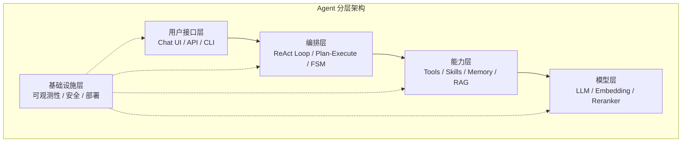
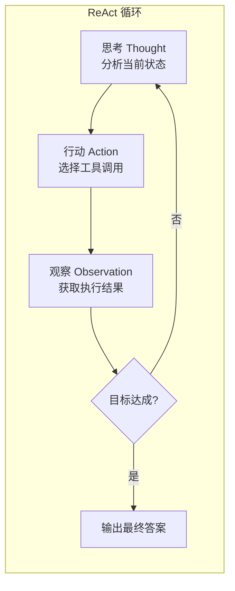

# 第 3 章 架构总览 — Agent 的七层模型

本章提出一个七层参考架构作为全书的组织骨架，每一层解决一类核心问题，层与层之间通过明确定义的接口交互。生产级 Agent 不能只有 LLM 调用而没有状态管理、上下文控制、安全防护和可观测性——缺乏系统性架构设计是大多数 Agent 项目失败的根源。本章还将深入讨论 Agent 控制循环的六种经典模式（从 ReAct 到自适应混合循环），帮助你根据场景选择合适的架构。阅读本章前，建议先了解第 1–2 章的基础概念。

---

## 3.1 七层参考架构



**图 3-1 Agent 七层架构**——每一层的职责必须清晰分离：编排层不应感知具体工具的实现细节，能力层不应关心使用的是哪个 LLM。这种分层确保了各层可独立演进和替换。


在构建生产级 AI Agent 系统时，我们需要一个清晰的分层模型来组织复杂性。类似于 OSI 七层网络模型将网络通信分解为可独立演进的层次，我们提出 **Agent 七层参考架构**，将 Agent 系统的关键关注点分离到七个明确定义的层次中。

每一层都有明确的职责边界、对外接口和对内实现。层与层之间通过定义良好的接口通信，上层依赖下层提供的能力，而下层对上层保持无感知。这种分层设计带来三大好处：**可替换性**（任意一层的实现可以独立替换）、**可测试性**（每层可独立进行单元测试）、**可演进性**（新的模型或工具可以在不影响其他层的情况下接入）。

```
+-----------------------------------------------------------------+
|                  Layer 7 - Orchestration 编排层                  |
|          多 Agent 路由 / 任务分发 / 结果聚合 / 工作流编排         |
+-----------------------------------------------------------------+
|                  Layer 6 - Evaluation 评估层                     |
|          指标采集 / 基准测试 / 回归检测 / 质量守门                |
    // ... 完整实现见 code-examples/ 目录 ...
+-----------------------------------------------------------------+
|                  Layer 1 - Agent Core 核心循环层                  |
|          感知-推理-行动循环 / 模型调用 / 流式处理 / Token 追踪    |
+-----------------------------------------------------------------+
```

下面我们逐层深入分析。


---

### 3.1.1 Layer 1 -- Agent Core 核心循环层

**核心循环层**是整个 Agent 系统的心脏。它实现了经典的 **感知-推理-行动（Perceive-Reason-Act）** 循环，负责与大语言模型（LLM）进行交互，并根据模型的响应决定下一步行动。

核心循环层的职责包括：（1）接收用户输入或上层编排层的指令；（2）组装 prompt 并调用 LLM；（3）解析模型响应，判断是需要调用工具、返回结果还是继续推理；（4）管理循环的终止条件，包括最大迭代次数、Token 预算、超时等。

在生产环境中，核心循环层还需要处理大量的非功能性需求：**错误恢复**（模型调用失败时的指数退避重试）、**流式输出**（实时将生成内容传递给用户）、**Token 追踪**（记录每次调用的 Token 消耗，用于成本控制和性能分析）、以及 **可观测性**（通过结构化日志和 Trace 为调试和监控提供支持）。

以下是一个生产级的核心循环实现：

```typescript
// ============================================================
// Layer 1: Agent Core -- 生产级核心循环
// ============================================================

/** LLM 模型响应的结构化表示 */
interface LLMResponse {
    // ... 完整实现见 code-examples/ 目录 ...
      setTimeout(() => reject(new Error(message)), ms)
    ),
  ]);
}
```


---

### 3.1.2 Layer 2 -- Context Engine 上下文引擎层

**上下文引擎层**是 Agent 系统中最容易被忽视但最影响实际效果的一层。LLM 的上下文窗口是有限的——即使是最新的模型也存在 Token 上限，而真实的 Agent 任务往往需要处理大量的历史对话、工具返回结果、外部文档等信息。上下文引擎的核心使命是：**在有限的窗口中，放入对当前决策最有价值的信息**。

上下文引擎层需要处理三个关键问题：（1）**上下文组装**——将系统 prompt、用户目标、历史消息、工具定义、记忆检索结果等按照优先级和格式要求组装成完整的消息列表；（2）**上下文压缩**——当累积的消息长度接近窗口上限时，智能地压缩或裁剪内容，同时保留关键信息；（3）**上下文注入**——在运行时动态地向上下文中注入新的信息片段（如 RAG 检索结果、实时数据等），而不破坏已有的结构。

一个优秀的上下文引擎还需要考虑 Token 计数的精确性、不同消息类型的优先级排序、以及多轮对话中的信息衰减策略。

```typescript
// ============================================================
// Layer 2: Context Engine -- 上下文引擎
// ============================================================

/** 消息角色与结构 */
interface Message {
    // ... 完整实现见 code-examples/ 目录 ...
    const cjk = (text.match(/[\u4e00-\u9fff]/g) || []).length;
    return Math.ceil(cjk / 2 + (text.length - cjk) / 4);
  }
}
```


---

### 3.1.3 Layer 3 -- Tool System 工具层

**工具层**赋予 Agent 与外部世界交互的能力。如果说 LLM 是 Agent 的"大脑"，那么工具层就是它的"双手"。一个没有工具的 Agent 只能进行纯文本推理；而有了工具层，Agent 可以搜索互联网、查询数据库、调用 API、执行代码等。

工具层的设计需要解决四个核心问题：（1）**注册与发现**——如何让 Agent 知道有哪些工具可用及其功能；（2）**参数校验**——确保 LLM 生成的工具调用参数符合 Schema；（3）**安全执行**——在沙箱中执行工具，防止恶意操作；（4）**结果标准化**——将不同工具的异构返回结果转换为 LLM 可理解的统一格式。

```typescript
// ============================================================
// Layer 3: Tool System -- 工具注册与执行
// ============================================================

/** JSON Schema 子集，用于描述工具参数 */
interface ParameterSchema {
    // ... 完整实现见 code-examples/ 目录 ...
    counter.count += 1;
    return true;
  }
}
```


---

> **知识层（Knowledge Layer）：Skill**
>
> 在工具层之上，Skill 提供了一个知识抽象层——将领域知识、执行策略和工具组合封装为可复用的能力单元。当工具数量超过 15 个时，Skill 路由机制可以显著提升 Agent 的决策准确率。详见第 6 章 §6.8。


### 3.1.4 Layer 4 -- Memory 记忆层

**记忆层**使 Agent 能够跨越单次对话的边界，积累和利用历史经验。记忆系统通常分为三个层次：（1）**工作记忆**——当前对话的上下文，对应上下文引擎中的消息列表；（2）**短期记忆**——最近几次对话的关键信息，存储在内存或缓存中；（3）**长期记忆**——持久化的知识，使用向量数据库实现语义检索。

记忆层的核心挑战是 **检索相关性**——如何从海量历史中快速找到与当前任务最相关的信息。这需要结合语义向量搜索和结构化过滤（时间、标签、重要性等元数据）。

```typescript
// ============================================================
// Layer 4: Memory System -- 记忆系统
// ============================================================

/** 记忆条目 */
interface MemoryEntry {
    // ... 完整实现见 code-examples/ 目录 ...
    const union = new Set([...setA, ...setB]);
    return union.size > 0 ? inter.size / union.size : 0;
  }
}
```


---

### 3.1.5 Layer 5 -- Security 安全层

**安全层**是生产级 Agent 系统中不可或缺的防护网。Agent 不仅要防范传统的注入攻击和越权访问，还要应对 **Prompt Injection**、**工具滥用**、**信息泄露**等 LLM 特有的安全风险。

安全层的职责贯穿 Agent 处理的全生命周期：（1）**输入校验**——检测 Prompt Injection、恶意指令；（2）**工具调用审核**——检查调用是否符合权限策略；（3）**输出净化**——过滤内部信息、隐私数据；（4）**审计日志**——记录所有关键操作。

```typescript
// ============================================================
// Layer 5: Security -- 安全守卫
// ============================================================

/** 安全校验结果 */
interface SecurityCheckResult {
    // ... 完整实现见 code-examples/ 目录 ...
      action, actor, target, riskLevel, decision,
    });
  }
}
```


---

### 3.1.6 Layer 6 -- Evaluation 评估层

**评估层**是 Agent 系统从"能用"走向"好用"的关键保障。Agent 的行为具有非确定性，评估层需要建立系统化的质量度量和基准测试体系。

评估层覆盖三个维度：（1）**实时指标采集**——追踪延迟、Token 消耗、工具成功率等；（2）**离线基准测试**——在标准数据集上运行对比；（3）**回归检测**——模型升级或 Prompt 修改时自动检测质量退化。

```typescript
// ============================================================
// Layer 6: Evaluation -- 评估框架
// ============================================================

/** 评估指标 */
interface Metric {
    // ... 完整实现见 code-examples/ 目录 ...
      compute: (r) => r.steps.length > 0 ? 1 - r.errorCount / r.steps.length : 1,
    });
  }
}
```


---

### 3.1.7 Layer 7 -- Orchestration 编排层

**编排层**负责协调多个 Agent 之间的协作。在复杂任务中，单个 Agent 往往难以胜任。编排层通过 **路由、分发和聚合** 机制，将复杂任务分解给多个专业 Agent，并将结果整合为最终输出。

编排层的三个核心能力：（1）**路由（Route）**——根据任务特征选择最合适的 Agent；（2）**委派（Delegate）**——分配子任务，管理依赖关系和并行执行；（3）**聚合（Aggregate）**——整合各 Agent 的结果。

编排模式的变体包括：**串行管道**（Pipeline）、**并行扇出**（Fan-out/Fan-in）、**层级委派**（Hierarchical）。

```typescript
// ============================================================
// Layer 7: Orchestration -- 多 Agent 编排
// ============================================================

/** Agent 描述信息 */
interface AgentDescriptor {
    // ... 完整实现见 code-examples/ 目录 ...
        throw new Error(`未知聚合策略: ${strategy}`);
    }
  }
}
```


---

### 3.1.8 跨层交互：数据流全景

理解了每一层的职责后，让我们来看它们之间的数据流动。以下图展示了一次完整的 Agent 执行过程中数据的流转路径：

```
用户请求
    |
    v
+--------- Layer 7: Orchestration 编排层 ----------+
|  route(task) --> 选择目标 Agent --> delegate()    |
|                      |                  ^         |
    // ... 完整实现见 code-examples/ 目录 ...
+----------------------------------------------------+
    |
    v
最终响应 --> 用户
```

**关键数据流说明：**

1. **请求入站**：用户请求首先到达 **编排层**（L7），编排层决定路由策略。
2. **安全前置**：在进入核心循环前，请求经过 **安全层**（L5）的输入校验。
3. **上下文组装**：**上下文引擎**（L2）从 **记忆层**（L4）检索相关历史，组装完整上下文。
4. **推理与执行**：**核心循环**（L1）调用 LLM，如需工具则交由 **工具层**（L3）执行。
5. **记忆沉淀**：工具结果和关键推理步骤被写入 **记忆层**（L4）。
6. **输出净化**：最终答案经过 **安全层**（L5）的输出净化后返回。
7. **质量评估**：完成后，**评估层**（L6）对本次执行进行质量评分和回归检测。
8. **结果聚合**：多 Agent 场景下，**编排层**（L7）聚合各 Agent 的结果。


---

## 3.2 Agent Loop 模式

Agent Loop（Agent循环）是 Agent 系统的行为模式——它定义了 Agent 如何组织推理和行动过程。不同的 Loop 模式适用于不同类型的任务，选择合适的模式对效率、可靠性和成本有决定性影响。

本节将深入分析三种经典模式（ReAct、Plan-and-Execute、Adaptive），并扩展引入 Reflective Loop 和 Hybrid 模式。

---

### 3.2.1 ReAct 模式：思考-行动-观察

**ReAct（Reasoning + Acting）** 是最经典的 Agent Loop 模式，由 Yao et al. 于 2022 年提出。其核心思想是让 LLM 在每一步中显式输出 **思考过程（Thought）**，然后决定一个 **行动（Action）**，最后观察行动的 **结果（Observation）**，再基于观察进行下一轮思考。

ReAct 模式的优势在于：（1）**可解释性强**——每一步思考过程都被记录；（2）**灵活性高**——可根据每步观察动态调整策略；（3）**实现简单**——不需要预先制定完整计划。

但 ReAct 也有缺点：（1）**贪心决策**——每一步只看当前状态，缺乏全局规划；（2）**Token 消耗高**——每步都需完整上下文；（3）**容易陷入循环**——在缺乏进展时可能反复执行相同动作。

以下实现增加了结构化的步骤追踪，每步的 Thought、Action、Observation 都被完整记录：

```typescript
// ============================================================
// 3.2.1 ReAct 模式 -- 带完整追踪的实现
// ============================================================

/** ReAct 单步追踪记录 */
interface ReActTrace {
    // ... 完整实现见 code-examples/ 目录 ...
    }
    return { totalSteps: this.traces.length, totalTokens, totalDurationMs, toolsUsed: [...toolsUsed] };
  }
}
```

---

### 3.2.2 Plan-and-Execute 模式：先规划后执行

**Plan-and-Execute** 模式将工作分为两个阶段：**Planner（规划器）** 制定完整计划，**Executor（执行器）** 逐步执行。这种模式借鉴了传统 AI 规划的思想，用 LLM 替代形式化规划算法。

优势：（1）**全局视角**——执行前就考虑了任务完整结构；（2）**Token 效率高**——执行阶段不需每次传入完整任务描述；（3）**可预测性强**——用户可在执行前审查计划。

局限：（1）**计划可能过时**——执行过程中环境可能变化；（2）**规划开销**——简单任务中制定计划反而增加延迟。

为解决计划过时问题，我们引入 **动态重规划** 机制：当执行结果与预期严重偏离时，通过 **DiffPlanMerger** 将新计划与旧计划合并。

```typescript
// ============================================================
// 3.2.2 Plan-and-Execute -- 含动态重规划
// ============================================================

/** 计划步骤 */
interface PlanStep {
    // ... 完整实现见 code-examples/ 目录 ...
      reasoning: `重规划: 保留 ${completed.length} 步，新增 ${newSteps.length} 步`,
    };
  }
}
```

---

### 3.2.3 Adaptive 模式：自适应选择

**Adaptive 模式**是一种元模式——它根据任务特征动态选择最合适的执行模式。通过 **复杂度评估**（基于 Token 数量、工具需求、领域检测、问句类型等 heuristic）在 Direct、ReAct、Plan-and-Execute 之间做出最优选择。

```typescript
// ============================================================
// 3.2.3 Adaptive 模式 -- 智能路由
// ============================================================

/** 任务复杂度等级 */
type ComplexityLevel = "trivial" | "simple" | "moderate" | "complex" | "expert";
    // ... 完整实现见 code-examples/ 目录 ...

    return { answer, assessment, patternUsed: assessment.recommendedPattern };
  }
}
```

---

### 3.2.4 Reflective Loop 模式：自我评估与修正

**Reflective Loop（反思循环）** 是在 ReAct 基础上增加了一个 **自我评估** 环节的高级模式。Agent 在生成初步答案后，不会立即返回，而是先对自己的输出进行质量评估。如果评估结果低于阈值，Agent 会进入修正循环，根据评估反馈改进答案。

这种模式特别适用于对输出质量要求高的场景：代码生成（需要检查语法和逻辑）、报告撰写（需要检查完整性和准确性）、数学推理（需要验证计算结果）。

Reflective Loop 的代价是额外的 LLM 调用（每次反思需要一次评估 + 一次修正），因此需要在质量提升和成本之间取得平衡。通常设置 2-3 次最大反思次数。

```typescript
// ============================================================
// 3.2.4 Reflective Loop -- 自我评估与修正
// ============================================================

/** 反思评估结果 */
interface ReflectionResult {
    // ... 完整实现见 code-examples/ 目录 ...
    ]);
    return response.content;
  }
}
```

---

### 3.2.5 模式对比表

在选择 Agent Loop 模式时，以下对比表提供了快速决策参考：

| 维度 | Direct | ReAct | Plan-and-Execute | Reflective | Hybrid |
|------|--------|-------|-------------------|------------|--------|
| **延迟** | 极低 (1 次 LLM) | 中等 (N 次) | 中高 (规划+执行) | 高 (N+评估) | 可变 |
| **Token 成本** | 最低 | 中等 | 中等偏低 | 高（含评估） | 中等 |
| **可靠性** | 低（无纠错） | 中等 | 较高（有计划） | 最高（自纠错） | 高 |
| **可解释性** | 无 | 高（Thought 链） | 高（计划可见） | 最高（含评估） | 高 |
| **最佳场景** | 简单问答 | 通用任务 | 复杂多步任务 | 高质量输出 | 混合场景 |
| **最差场景** | 需工具任务 | 需全局规划 | 简单任务（浪费） | 低延迟要求 | 过度工程 |
| **典型步数** | 1 | 3-8 | 规划1+执行N | (3-8)*2 | 自适应 |
| **适用复杂度** | 0-15 | 15-60 | 60-80 | 80-100 | 全范围 |

---

### 3.2.6 Hybrid 模式：ReAct + Plan-and-Execute 混合

在实际生产环境中，纯粹的单一模式往往不够灵活。**Hybrid 模式**将 Plan-and-Execute 的全局视角与 ReAct 的灵活执行结合起来：先用 Planner 制定高层计划，然后每个计划步骤内部用 ReAct 循环来执行，允许在步骤级别进行灵活的探索和调整。

这种模式的优势在于既有宏观的任务分解，又保留了微观的执行灵活性。Planner 不需要预测每一个细节，而 ReAct 执行器可以在每个步骤中根据实际情况自主决策。

```typescript
// ============================================================
// 3.2.6 Hybrid 模式 -- Plan + ReAct 混合
// ============================================================

/**
 * HybridAgent -- 计划驱动 + ReAct 执行的混合 Agent
    // ... 完整实现见 code-examples/ 目录 ...

    return { answer: synthesis.content, plan, stepTraces };
  }
}
```


### 3.2.7 Delegation/Handoff 模式：控制权转移

前面介绍的所有 Agent Loop 模式——从 Direct 到 Hybrid——都有一个共同特征：**控制权始终留在同一个 Agent 内部**。无论是 ReAct 的思考-行动循环还是 Plan-and-Execute 的规划-执行循环，驱动循环的始终是同一个 LLM 实例。但在真实的生产系统中，我们经常需要一种不同的控制流模式：**将循环本身转移给另一个 Agent**。

这就是 **Delegation/Handoff 模式**的核心思想——它不是在循环内部增加一个步骤，而是将整个执行循环的控制权转移。

#### 控制流的本质区别

在第二章 2.3.5 节中，我们从理论角度定义了 Delegation 和 Handoff。这里我们关注其**控制流层面的工程含义**：

- **Delegation**：当前 Agent 的循环**暂停**，启动目标 Agent 的循环来处理子任务，子任务完成后控制权**返回**原 Agent，原 Agent 继续自己的循环。这本质上是一次**同步调用**（或带回调的异步调用）。
- **Handoff**：当前 Agent 的循环**终止**，目标 Agent 的循环**接管**整个会话。控制权**不会返回**。这本质上是一次**控制流跳转**（类似于尾调用优化中的 tail call）。

这两种模式在 OpenAI Agents SDK 和 Anthropic 的多 Agent 架构中都有明确体现：

- **OpenAI Agents SDK** 引入了 `Handoff` 原语，允许 Agent 声明式地定义"在什么条件下将对话转交给哪个 Agent"，并支持 `input_filter` 和 `output_filter` 来控制上下文传递。
- **Anthropic 的 Orchestrator-Workers 模式**中，Orchestrator 实质上在对每个 Worker 执行 Delegation——将子任务分发给 Worker，等待结果汇总后继续。

#### 完整实现

以下 `DelegationHandler` 类实现了 Delegation 和 Handoff 的核心控制流逻辑：

```typescript
// ============================================================
// 3.2.7 Delegation/Handoff 模式 -- 控制权转移
// ============================================================

/** Delegation 超时错误 */
class DelegationTimeoutError extends Error {
    // ... 完整实现见 code-examples/ 目录 ...
      this.activeDelegations.delete(delegationId);
    }
  }
}
```

#### 何时使用 Delegation vs Handoff

选择 Delegation 还是 Handoff，取决于任务的**边界清晰度**和**领域专业性**：

| 判断维度 | 选择 Delegation | 选择 Handoff |
|---------|----------------|-------------|
| 子任务边界 | 明确定义、输入输出可序列化 | 模糊、需要多轮交互探索 |
| 领域专业性 | 当前 Agent 理解全局，只是需要帮手 | 目标 Agent 在该领域远优于当前 Agent |
| 控制需求 | 需要对结果做后处理、汇总或验证 | 信任目标 Agent 全权处理 |
| 会话连续性 | 用户不感知 Agent 切换 | 用户可感知且期望与专家对话 |
| 错误恢复 | Delegator 可重试或降级 | 移交后原 Agent 无法干预 |

**典型 Delegation 场景**：Orchestrator Agent 将"根据用户描述生成 SQL 查询"委派给 SQL 专家 Agent，拿到结果后继续执行查询并格式化输出。

**典型 Handoff 场景**：电商客服 Agent 识别到用户要求退款且情绪激动，将会话移交给专业的退款处理 Agent（该 Agent 拥有退款权限和话术模板）。

#### 与其他模式的关系

Delegation/Handoff 并非独立存在——它通常与其他 Agent Loop 模式**组合使用**：

- **Hybrid + Delegation**：Hybrid Agent 的 Planner 生成计划后，将某些步骤 delegate 给专业 Agent 执行，而非全部由内置 ReAct 执行器处理。
- **ReAct + Handoff**：ReAct Agent 在 Thought 阶段判断当前任务超出自身能力，触发 Handoff 将会话转交。
- **Orchestrator-Workers 即 Delegation**：第二章讨论的 Orchestrator-Workers 模式本质上就是结构化的多重 Delegation——Orchestrator 将任务分解后，对每个 Worker 执行一次 Delegation。

> **更新的模式对比**：在 3.2.5 节的模式对比表基础上，Delegation/Handoff 模式的关键特征为——延迟取决于目标 Agent（可变），Token 成本包含上下文传递开销（中等偏高），可靠性取决于目标 Agent 质量与回退策略（中到高），可解释性较高（委派链可追踪），最佳场景为跨领域专业协作，最差场景为简单任务（委派开销大于收益）。
---

## 3.3 状态管理基础



**图 3-2 ReAct 推理-行动循环**——ReAct 是最基础的 Agent 循环模式：思考→行动→观察→再思考。它的优势在于简单透明，每一步决策都有可解释的推理链。但缺点也很明显：循环次数不可控，容易陷入死循环。


Agent 系统的状态管理是一个被严重低估的工程挑战。一个正在执行的 Agent 包含大量的运行时状态：当前执行到哪一步、已经调用了哪些工具、累计消耗了多少 Token、当前的计划是什么、是否遇到了错误等。如何组织和管理这些状态，直接影响系统的可测试性、可调试性和可恢复性。

> **编辑说明**：本节提供状态管理的架构概览，帮助读者理解 Agent 状态的核心概念和 Event Sourcing + Reducer 模式的基本思路。关于 Reducer 中间件、状态转换守卫（`assertTransition`）、检查点与时间旅行调试、分布式同步等深入工程实现，请参阅**第 4 章**。

### 3.3.1 为什么需要不可变状态

在 Agent 系统中采用 **不可变状态（Immutable State）** 模式有三个核心理由：

**1. 可测试性**——不可变状态使得每一次状态转换都是纯函数：给定相同的旧状态和事件，必然产生相同的新状态。这意味着我们可以在不依赖外部环境的情况下，对状态转换逻辑进行完整的单元测试。

**2. 可调试性（Time-travel Debugging）**——由于每次状态变更都产生新的状态快照，我们可以保留完整的状态变更历史。当出现问题时，开发者可以"回到过去"，逐步检查每一次状态变更，精确定位问题发生的位置。

**3. 可审计性**——在生产环境中，我们需要能够回答"Agent 为什么做出这个决定"这样的问题。不可变状态 + 事件日志提供了完整的决策链条，满足了合规审计的要求。

### 3.3.2 Event Sourcing + Reducer 模式

我们采用 **Event Sourcing（事件溯源）** 模式来管理 Agent 状态。核心思想是：不直接修改状态，而是将所有的状态变更记录为一系列不可变的 **事件（Event）**。当前状态始终是对事件序列执行 **Reducer** 函数的结果。

```
事件流:  [E1] -> [E2] -> [E3] -> [E4] -> ... -> [En]
                    |
                    v
Reducer:  state = events.reduce(reducer, initialState)
                    |
                    v
当前状态:  { phase: ..., messages: [...], metrics: { ... } }
```

以下是核心类型定义和 Reducer 模式的简化实现，展示 TASK_STARTED 和 LLM_CALL_END 两个代表性事件的处理逻辑。完整的 12 种事件处理、状态转换守卫和中间件机制，请参阅第 4 章 §4.2。

```typescript
// ============================================================
// 3.3 状态管理 -- Event Sourcing + Reducer
// ============================================================

import { randomUUID } from 'crypto';

    // ... 完整实现见 code-examples/ 目录 ...
    default:
      return state;
  }
}
```

### 3.3.3 EventStore：事件持久化

**EventStore** 负责事件的持久化存储和检索。通过保存完整的事件流，我们可以在任何时候重建 Agent 的状态，也可以进行"time-travel debugging"——回到任意历史时刻查看当时的状态。

```typescript
// ============================================================
// EventStore -- 事件持久化存储
// ============================================================

/**
 * EventStore -- 事件存储
    // ... 完整实现见 code-examples/ 目录 ...
  getEventCount(conversationId: string): number {
    return (this.events.get(conversationId) || []).length;
  }
}
```

### 3.3.4 状态选择器：安全访问状态

**状态选择器（State Selectors）** 提供了一种类型安全且语义清晰的方式来访问状态的特定部分。选择器函数可以被组合和缓存（memoization），避免在频繁的状态访问中进行重复计算。

```typescript
// ============================================================
// State Selectors -- 状态选择器
// ============================================================

/** 获取当前阶段 */
function getPhase(state: AgentState): AgentPhase {
    // ... 完整实现见 code-examples/ 目录 ...
    elapsed: getElapsedTime(state),
    isHealthy: state.error === null && getToolSuccessRate(state) > 0.8,
  };
}
```


---

## 3.4 Agent 生命周期管理

在生产环境中，Agent 不是一个简单的函数调用——它是一个有状态的、长时间运行的实体。理解和管理 Agent 的生命周期，对于构建可靠的系统至关重要。

### 3.4.1 生命周期状态机

Agent 的生命周期可以用以下状态机表示：

```
                   +----------+
            +----->| Created  |
            |      +----+-----+
            |           |  initialize()
            |           v
            |      +----------+
    // ... 完整实现见 code-examples/ 目录 ...
                                v
                           +----------+
                           | Running  |
                           +----------+
```

### 3.4.2 AgentLifecycleManager 实现

```typescript
// ============================================================
// 3.4 Agent 生命周期管理
// ============================================================

/** 生命周期状态 */
type LifecycleState =
    // ... 完整实现见 code-examples/ 目录 ...
    }
    this.cleanupFns = [];
  }
}
```

### 3.4.3 使用示例

```typescript
// 创建生命周期管理器
const lifecycle = new AgentLifecycleManager({
  onInitialize: async () => {
    console.log("初始化资源连接...");
    // 建立数据库连接、加载模型配置等
  },
    // ... 完整实现见 code-examples/ 目录 ...
process.on("SIGTERM", async () => {
  await lifecycle.gracefulShutdown(30_000);
  process.exit(0);
});
```

---

## 3.5 架构决策矩阵

在实际项目中，选择合适的架构模式需要综合考虑多种因素。本节提供系统化的决策指导。

### 3.5.1 决策矩阵表

| 决策维度 | 单步直答 | ReAct Agent | Plan-Execute | Reflective | Multi-Agent |
|---------|----------|-------------|--------------|------------|-------------|
| **任务类型** | 简单问答 | 需工具的通用任务 | 复杂多步任务 | 高质量输出 | 跨领域协作 |
| **延迟要求** | <1s | 3-15s | 10-60s | 15-120s | 30-300s |
| **Token 预算** | <1K | 2-10K | 5-20K | 10-30K | 20-100K |
| **可靠性需求** | 低 | 中 | 高 | 最高 | 高 |
| **可解释性** | 无 | 高 | 高 | 最高 | 中 |
| **实现复杂度** | 极低 | 低 | 中 | 中高 | 高 |
| **运维成本** | 无 | 低 | 中 | 中 | 高 |
| **适用团队规模** | 1人 | 2-3人 | 3-5人 | 3-5人 | 5+人 |
| **典型应用** | FAQ Bot | 客服Agent | 数据分析 | 代码生成 | 企业助手 |

### 3.5.2 架构反模式

在 Agent 系统设计中，以下是需要避免的常见反模式：

**1. God Agent（上帝 Agent）反模式**

将所有能力塞入一个巨大的 Agent 中，导致系统 Prompt 过长、上下文窗口拥挤、行为不可预测。

```
// 反模式：一个 Agent 承担所有职责
"你是一个全能助手，可以写代码、做数据分析、写文章、
翻译文档、做数学题、查天气、订餐厅、管理日程..."
// 结果：Prompt 占据了大量上下文窗口，每种能力的表现都很平庸
```

**解决方案**：采用多 Agent 架构，每个 Agent 专注于一个领域，通过编排层协调。

**2. Chatty Agents（话痨 Agent）反模式**

Agent 之间的通信过于频繁，每一个小决策都需要跨 Agent 协商，导致延迟爆炸和 Token 浪费。

**解决方案**：明确 Agent 之间的接口边界，使用异步消息传递而非同步 RPC，减少不必要的通信。

**3. Tight Coupling（紧耦合）反模式**

Agent 的实现与特定的 LLM 提供商、工具接口或数据格式紧密绑定，导致无法灵活替换。

**解决方案**：使用本章定义的七层架构，通过接口抽象实现层间解耦。例如 Tool 层通过 ToolDefinition 接口与 Agent Core 交互，而非直接调用具体的 API。

**4. No Budget Guard（无预算守卫）反模式**

没有设置 Token 预算或最大迭代次数限制，导致 Agent 在复杂任务上无限循环，产生巨额费用。

**解决方案**：在 Agent Core 中始终设置 `maxIterations` 和 `maxTokenBudget`，并在评估层中监控异常消耗。

### 3.5.3 单体 Agent vs 微服务 Agent

| 维度 | 单体 Agent | 微服务 Agent |
|------|-----------|-------------|
| **部署复杂度** | 低（单一进程） | 高（多服务编排） |
| **扩展性** | 垂直扩展 | 水平扩展 |
| **故障隔离** | 差（一个组件挂全挂） | 好（独立失败域） |
| **开发速度** | 快（早期） | 慢（早期），快（后期） |
| **适用阶段** | MVP、概念验证 | 生产环境、高可用需求 |
| **团队要求** | 1-3 人 | 5+ 人 |

**选择建议**：

- **MVP 阶段**：从单体 Agent 开始，快速验证产品方向。
- **生产阶段**：当流量超过单机承载能力，或需要独立的故障隔离和扩展策略时，逐步拆分为微服务 Agent。
- **混合方案**：核心 Agent Loop 保持单体，将工具执行、记忆存储等无状态组件拆分为独立服务。

---

## 3.6 本章小结

本章建立了 AI Agent 系统的完整架构视图。以下是关键要点的回顾：

**七层参考架构** 将 Agent 系统的复杂性分解为七个清晰的层次：核心循环层负责感知-推理-行动的基本循环；上下文引擎层管理有限的上下文窗口；工具层提供外部交互能力；记忆层实现跨会话的知识积累；安全层保障全链路安全；评估层确保输出质量；编排层协调多 Agent 协作。每一层都有明确的接口定义和职责边界。

**Agent Loop 模式** 提供了五种不同的执行策略：ReAct 以其灵活性和可解释性成为默认选择；Plan-and-Execute 适合需要全局视角的复杂任务；Adaptive 模式通过复杂度评估自动选择最优策略；Reflective Loop 通过自我评估提升输出质量；Hybrid 模式结合了规划和灵活执行的优点。

**状态管理** 采用 Event Sourcing + Reducer 的不可变模式，确保了可测试性、可调试性和可审计性。EventStore 提供了事件持久化和状态重放能力。

**生命周期管理** 通过状态机驱动的 AgentLifecycleManager，提供了从创建到销毁的完整生命周期控制。

**架构决策矩阵** 为实际项目中的技术选型提供了系统化的指导框架。

> **预告**：第四章将深入探讨 **状态管理与数据流**——如何用 Reducer 模式实现确定性状态变迁、中间件链、分布式状态同步与弹性引擎设计。第五章将聚焦 **Context Engineering（上下文工程）**——包括 WSCIPO （参见第 2 章：理论基础） 六大原则、上下文健康检测、三层压缩策略和长对话管理。

---

## 延伸阅读

1. **Yao, S. et al. (2022).** *ReAct: Synergizing Reasoning and Acting in Language Models.* arXiv:2210.03629. -- ReAct 模式的原始论文，提出了将推理链和工具使用交织的方法。

2. **Wang, L. et al. (2023).** *Plan-and-Solve Prompting: Improving Zero-Shot Chain-of-Thought Reasoning by Large Language Models.* ACL 2023. -- Plan-and-Execute 模式的理论基础。

3. **Shinn, N. et al. (2023).** *Reflexion: Language Agents with Verbal Reinforcement Learning.* NeurIPS 2023. -- Reflective Loop 的核心论文，展示了语言 Agent 如何通过自我反思来改进性能。

4. **Xi, Z. et al. (2023).** *The Rise and Potential of Large Language Model Based Agents: A Survey.* arXiv:2309.07864. -- 一篇全面的 LLM Agent 综述，覆盖了架构、能力和应用场景。

5. **Wu, Q. et al. (2023).** *AutoGen: Enabling Next-Gen LLM Applications via Multi-Agent Conversation.* arXiv:2308.08155. -- 微软 AutoGen 框架论文，展示了多 Agent 对话编排的实践。

6. **Anthropic. (2024).** *Building Effective Agents.* Anthropic Research Blog. -- Anthropic 关于构建高效 Agent 的实践指南，包含架构设计和 Prompt 策略。

7. **Fowler, M. (2005).** *Event Sourcing.* martinfowler.com. -- Event Sourcing 模式的经典描述，本章状态管理设计的理论基础。

---

> **下一章**：第四章 状态管理与数据流
