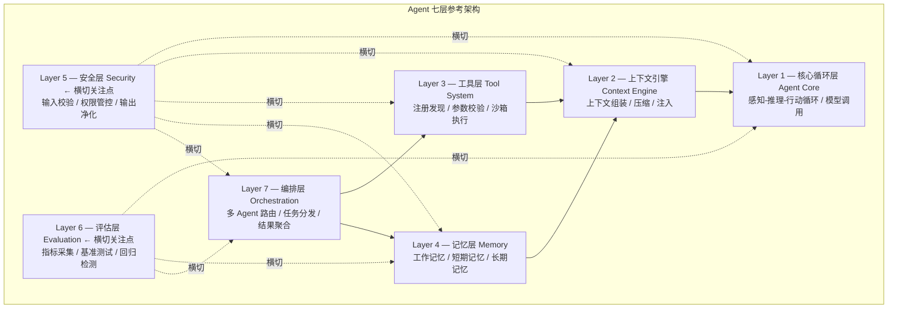
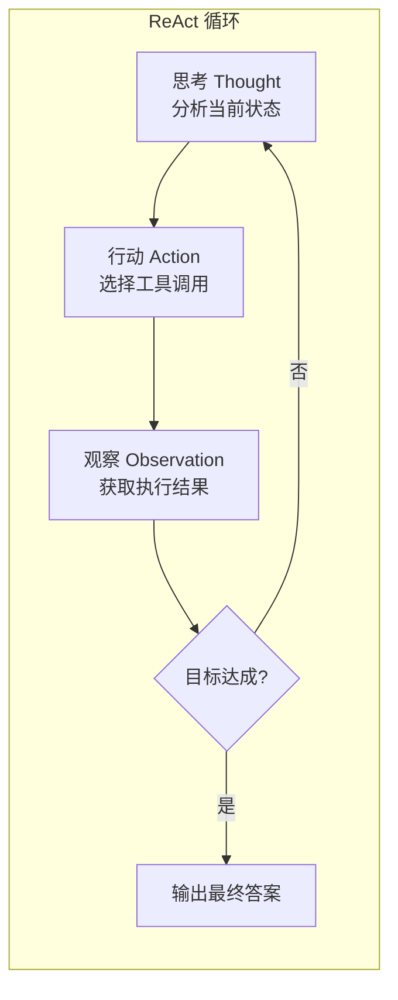

# 第 3 章 架构总览 — Agent 的七层模型

本章提出一个七层参考架构，作为**本书用于组织 Agent 工程知识的参考模型**。它不是行业唯一标准，也不是所有团队都必须逐层照搬的固定模板；它的作用是帮助你在面对复杂 Agent 系统时，把状态、上下文、工具、记忆、安全、评估和编排等问题放到统一视角中理解。生产级 Agent 不能只有 LLM 调用而没有状态管理、上下文控制、安全防护和可观测性——缺乏系统性架构设计，是大多数 Agent 项目失败的根源。

本章还会讨论 Agent 控制循环的多种经典模式，帮助你根据任务复杂度和系统约束选择合适的架构。阅读本章前，建议先了解第 1–2 章的基础概念。

## 本章你将学到什么

1. 为什么需要一个统一的 Agent 架构视角，而不仅仅是"能调用模型和工具"
2. 七层参考架构分别解决什么问题，以及它们之间如何协作
3. 如何从单 Agent 原型逐步演进到更完整的工程系统
4. 什么时候应该采用更复杂的控制循环，什么时候应保持简单

## 本章建议阅读方式

- 如果你是第一次做 Agent：先关注"七层分别解决什么问题"
- 如果你已经有可运行原型：重点关注"状态、上下文、安全、评估、编排"如何补齐
- 如果你在做团队架构设计：把本章当作后续章节的导航图，而不是一次性定型的标准答案

---

## 3.1 七层参考架构


**图 3-1 Agent 七层参考架构**——每一层的职责必须清晰分离。实线箭头表示层间数据流向：编排层通过工具层和记忆层进行任务处理，上下文引擎为核心循环层组装上下文。虚线箭头表示安全层和评估层是**横切关注点**，它们贯穿所有其他层而非固定位于某一层之上。

在构建生产级 AI Agent 系统时，我们需要一个清晰的分层模型来组织复杂性。类似于 OSI 七层网络模型将网络通信分解为可独立演进的层次，我们在本书中提出 **Agent 七层参考架构**，将 Agent 系统的关键关注点分离到七个明确定义的层次中。它更适合作为"分析框架"和"设计清单"，而不是僵化的落地模板。

> **与 OSI 类比的限定说明**：本书的七层模型借鉴了 OSI 模型"职责分层、接口隔离"的思想，但**并非严格的上下层调用关系**。具体而言：安全层（L5）和评估层（L6）是**横切关注点（Cross-cutting Concerns）**——它们不是"安全层调用记忆层、记忆层再调用工具层"这样的线性依赖，而是贯穿整个 Agent 执行流程的守卫和度量机制。这更类似于企业架构中的日志、认证等横切服务，而非 OSI 中物理层到应用层的逐层封装。

每一层都有明确的职责边界、对外接口和对内实现。层与层之间通过定义良好的接口通信，上层依赖下层提供的能力，而下层对上层保持无感知。这种分层设计带来三大好处：**可替换性**（任意一层的实现可以独立替换）、**可测试性**（每层可独立进行单元测试）、**可演进性**（新的模型或工具可以在不影响其他层的情况下接入）。

```
+-----------------------------------------------------------------+
|                  Layer 7 — 编排层 (Orchestration)                |
|          多 Agent 路由 / 任务分发 / 结果聚合 / 工作流编排         |
+-----------------------------------------------------------------+
|                  Layer 6 — 评估层 (Evaluation)  ← 横切关注点     |
|          指标采集 / 基准测试 / 回归检测 / 质量守门                |
+-----------------------------------------------------------------+
|                  Layer 5 — 安全层 (Security)     ← 横切关注点    |
|          输入校验 / Prompt 注入检测 / 权限管控 / 输出净化         |
+-----------------------------------------------------------------+
|                  Layer 4 — 记忆层 (Memory)                       |
|          工作记忆 / 短期记忆 / 长期记忆 / 语义检索               |
+-----------------------------------------------------------------+
|                  Layer 3 — 工具层 (Tool System)                  |
|          工具注册与发现 / 参数校验 / 沙箱执行 / 结果标准化        |
+-----------------------------------------------------------------+
|                  Layer 2 — 上下文引擎 (Context Engine)            |
|          上下文组装 / Token 预算管理 / 压缩 / 动态注入            |
+-----------------------------------------------------------------+
|                  Layer 1 — 核心循环层 (Agent Core)                |
|          感知-推理-行动循环 / 模型调用 / 流式处理 / Token 追踪    |
+-----------------------------------------------------------------+
```

下面我们逐层深入分析。

---

### 3.1.1 Layer 1 -- 核心循环层（Agent Core）

**核心循环层**是整个 Agent 系统的心脏。它实现了经典的 **感知-推理-行动（Perceive-Reason-Act）** 循环，负责与大语言模型（LLM）进行交互，并根据模型的响应决定下一步行动。

核心循环层的职责包括：（1）接收用户输入或上层编排层的指令；（2）组装 prompt 并调用 LLM；（3）解析模型响应，判断是需要调用工具、返回结果还是继续推理；（4）管理循环的终止条件，包括最大迭代次数、Token 预算、超时等。

在生产环境中，核心循环层还需要处理大量的非功能性需求：**错误恢复**（模型调用失败时的指数退避重试）、**流式输出**（实时将生成内容传递给用户）、**Token 追踪**（记录每次调用的 Token 消耗，用于成本控制和性能分析）、以及 **可观测性**（通过结构化日志和 Trace 为调试和监控提供支持）。

下面先给出一个**最小但工程上有意义**的核心循环骨架。阅读时请把注意力放在接口职责和控制边界上，而不要把它当作唯一实现方式：

```typescript
// Layer 1: 核心循环层 -- 最小可运行骨架
interface LLMResponse {
  content: string;
  toolCalls?: { name: string; args: Record<string, unknown> }[];
  tokenUsage: { prompt: number; completion: number };
}

interface AgentCoreConfig {
  maxIterations: number;
  tokenBudget: number;
  retryAttempts: number;
}

async function agentCoreLoop(
  input: string,
  tools: Map<string, (args: any) => Promise<string>>,
  config: AgentCoreConfig
): Promise<string> {
  const messages: { role: string; content: string }[] = [
    { role: "user", content: input },
  ];
  let totalTokens = 0;

  for (let i = 0; i < config.maxIterations; i++) {
    const response = await callLLMWithRetry(messages, config.retryAttempts);
    totalTokens += response.tokenUsage.prompt + response.tokenUsage.completion;

    if (totalTokens > config.tokenBudget) {
      return "[Token 预算耗尽] " + response.content;
    }
    if (!response.toolCalls || response.toolCalls.length === 0) {
      return response.content; // 终止：模型给出最终回答
    }
    // 执行工具调用，将结果追加到消息列表
    for (const call of response.toolCalls) {
      const toolFn = tools.get(call.name);
      const result = toolFn
        ? await toolFn(call.args)
        : `错误：工具 ${call.name} 未注册`;
      messages.push({ role: "tool", content: result });
    }
  }
  return "[达到最大迭代次数] 未能完成任务";
}
```

---

### 3.1.2 Layer 2 -- 上下文引擎（Context Engine）

**上下文引擎**是 Agent 系统中最容易被忽视但最影响实际效果的一层。LLM 的上下文窗口是有限的——即使是最新的模型也存在 Token 上限，而真实的 Agent 任务往往需要处理大量的历史对话、工具返回结果、外部文档等信息。上下文引擎的核心使命是：**在有限的窗口中，放入对当前决策最有价值的信息**。

上下文引擎需要处理三个关键问题：（1）**上下文组装**——将系统 prompt、用户目标、历史消息、工具定义、记忆检索结果等按照优先级和格式要求组装成完整的消息列表；（2）**上下文压缩**——当累积的消息长度接近窗口上限时，智能地压缩或裁剪内容，同时保留关键信息；（3）**上下文注入**——在运行时动态地向上下文中注入新的信息片段（如 RAG 检索结果、实时数据等），而不破坏已有的结构。

一个优秀的上下文引擎还需要考虑 Token 计数的精确性、不同消息类型的优先级排序、以及多轮对话中的信息衰减策略。

```typescript
// Layer 2: 上下文引擎 -- 组装与压缩
interface Message {
  role: "system" | "user" | "assistant" | "tool";
  content: string;
  priority?: number; // 越高越不容易被压缩
}

class ContextEngine {
  private tokenLimit: number;

  constructor(tokenLimit: number = 8192) {
    this.tokenLimit = tokenLimit;
  }

  /** 组装完整上下文，按优先级裁剪以适应 Token 窗口 */
  assemble(
    systemPrompt: string,
    history: Message[],
    injections: Message[] = []
  ): Message[] {
    const system: Message = { role: "system", content: systemPrompt, priority: 100 };
    const all = [system, ...injections, ...history];
    let totalTokens = all.reduce((s, m) => s + this.estimateTokens(m.content), 0);

    // 按优先级从低到高移除，直到满足 Token 限制
    const sorted = [...all].sort((a, b) => (a.priority ?? 0) - (b.priority ?? 0));
    const removed = new Set<Message>();
    while (totalTokens > this.tokenLimit && sorted.length > 0) {
      const victim = sorted.shift()!;
      totalTokens -= this.estimateTokens(victim.content);
      removed.add(victim);
    }
    return all.filter((m) => !removed.has(m));
  }

  private estimateTokens(text: string): number {
    const cjk = (text.match(/[\u4e00-\u9fff]/g) || []).length;
    return Math.ceil(cjk / 2 + (text.length - cjk) / 4);
  }
}
```

---

### 3.1.3 Layer 3 -- 工具层（Tool System）

**工具层**赋予 Agent 与外部世界交互的能力。如果说 LLM 是 Agent 的"大脑"，那么工具层就是它的"双手"。一个没有工具的 Agent 只能进行纯文本推理；而有了工具层，Agent 可以搜索互联网、查询数据库、调用 API、执行代码等。

工具层的设计需要解决四个核心问题：（1）**注册与发现**——如何让 Agent 知道有哪些工具可用及其功能；（2）**参数校验**——确保 LLM 生成的工具调用参数符合 Schema；（3）**安全执行**——在沙箱中执行工具，防止恶意操作；（4）**结果标准化**——将不同工具的异构返回结果转换为 LLM 可理解的统一格式。

```typescript
// Layer 3: 工具层 -- 注册、校验与执行
interface ToolDefinition {
  name: string;
  description: string;
  parameters: Record<string, { type: string; description: string; required?: boolean }>;
  execute: (args: Record<string, unknown>) => Promise<string>;
}

class ToolRegistry {
  private tools = new Map<string, ToolDefinition>();

  register(tool: ToolDefinition): void {
    this.tools.set(tool.name, tool);
  }

  /** 获取所有工具的 Schema（供 LLM 使用） */
  getSchemas(): { name: string; description: string; parameters: object }[] {
    return [...this.tools.values()].map((t) => ({
      name: t.name,
      description: t.description,
      parameters: t.parameters,
    }));
  }

  /** 校验参数并执行工具 */
  async invoke(name: string, args: Record<string, unknown>): Promise<string> {
    const tool = this.tools.get(name);
    if (!tool) return JSON.stringify({ error: `工具 "${name}" 未注册` });

    // 简化的必填参数校验
    for (const [key, schema] of Object.entries(tool.parameters)) {
      if (schema.required && !(key in args)) {
        return JSON.stringify({ error: `缺少必填参数: ${key}` });
      }
    }
    try {
      return await tool.execute(args);
    } catch (err: any) {
      return JSON.stringify({ error: err.message });
    }
  }
}
```

---

> **知识层（Knowledge Layer）：Skill**
>
> 在工具层之上，Skill 提供了一个知识抽象层——将领域知识、执行策略和工具组合封装为可复用的能力单元。当工具数量超过 15 个时，Skill 路由机制可以显著提升 Agent 的决策准确率。详见第 6 章 §6.8。

### 3.1.4 Layer 4 -- 记忆层（Memory）

**记忆层**使 Agent 能够跨越单次对话的边界，积累和利用历史经验。记忆系统通常分为三个层次：（1）**工作记忆**——当前对话的上下文，对应上下文引擎中的消息列表；（2）**短期记忆**——最近几次对话的关键信息，存储在内存或缓存中；（3）**长期记忆**——持久化的知识，使用向量数据库实现语义检索。

记忆层的核心挑战是 **检索相关性**——如何从海量历史中快速找到与当前任务最相关的信息。这需要结合语义向量搜索和结构化过滤（时间、标签、重要性等元数据）。

```typescript
// Layer 4: 记忆层 -- 三层记忆与语义检索
interface MemoryEntry {
  id: string;
  content: string;
  embedding?: number[];
  metadata: { timestamp: number; tags: string[]; importance: number };
}

class MemorySystem {
  private shortTerm: MemoryEntry[] = [];
  private longTerm: MemoryEntry[] = []; // 生产中应使用向量数据库

  /** 存储一条记忆 */
  store(entry: MemoryEntry, tier: "short" | "long" = "short"): void {
    (tier === "short" ? this.shortTerm : this.longTerm).push(entry);
  }

  /** 语义检索：返回与查询最相关的 k 条记忆 */
  async retrieve(queryEmbedding: number[], k: number = 5): Promise<MemoryEntry[]> {
    const scored = this.longTerm
      .filter((e) => e.embedding)
      .map((e) => ({ entry: e, score: this.cosineSim(queryEmbedding, e.embedding!) }))
      .sort((a, b) => b.score - a.score);
    return scored.slice(0, k).map((s) => s.entry);
  }

  private cosineSim(a: number[], b: number[]): number {
    let dot = 0, magA = 0, magB = 0;
    for (let i = 0; i < a.length; i++) {
      dot += a[i] * b[i]; magA += a[i] ** 2; magB += b[i] ** 2;
    }
    return dot / (Math.sqrt(magA) * Math.sqrt(magB) || 1);
  }
}
```

---

### 3.1.5 Layer 5 -- 安全层（Security）

**安全层**是生产级 Agent 系统中不可或缺的防护网。Agent 不仅要防范传统的注入攻击和越权访问，还要应对 **Prompt Injection**、**工具滥用**、**信息泄露**等 LLM 特有的安全风险。

安全层的职责贯穿 Agent 处理的全生命周期：（1）**输入校验**——检测 Prompt Injection、恶意指令；（2）**工具调用审核**——检查调用是否符合权限策略；（3）**输出净化**——过滤内部信息、隐私数据；（4）**审计日志**——记录所有关键操作。

安全层是**横切关注点**——它不只保护某一层，而是贯穿从输入到输出的完整链路。

```typescript
// Layer 5: 安全层 -- 输入校验、权限管控、输出净化
interface SecurityCheckResult {
  passed: boolean;
  riskLevel: "none" | "low" | "medium" | "high" | "critical";
  reason?: string;
}

class SecurityGuard {
  private injectionPatterns = [
    /ignore\s+(all\s+)?previous\s+instructions/i,
    /system\s*:\s*you\s+are\s+now/i,
    /\bDAN\b.*\bjailbreak\b/i,
  ];

  /** 输入校验：检测 Prompt Injection */
  checkInput(input: string): SecurityCheckResult {
    for (const pattern of this.injectionPatterns) {
      if (pattern.test(input)) {
        return { passed: false, riskLevel: "high", reason: "疑似 Prompt Injection" };
      }
    }
    return { passed: true, riskLevel: "none" };
  }

  /** 输出净化：移除内部信息泄露 */
  sanitizeOutput(output: string, sensitiveKeys: string[]): string {
    let sanitized = output;
    for (const key of sensitiveKeys) {
      sanitized = sanitized.replaceAll(key, "[REDACTED]");
    }
    return sanitized;
  }

  /** 工具调用审计 */
  auditToolCall(agent: string, tool: string, args: object): void {
    console.log(JSON.stringify({
      event: "tool_call_audit", agent, tool, args, timestamp: Date.now(),
    }));
  }
}
```

---

### 3.1.6 Layer 6 -- 评估层（Evaluation）

**评估层**是 Agent 系统从"能用"走向"好用"的关键保障。Agent 的行为具有非确定性，评估层需要建立系统化的质量度量和基准测试体系。

评估层覆盖三个维度：（1）**实时指标采集**——追踪延迟、Token 消耗、工具成功率等；（2）**离线基准测试**——在标准数据集上运行对比；（3）**回归检测**——模型升级或 Prompt 修改时自动检测质量退化。

评估层也是**横切关注点**——它不仅评估核心循环层的推理质量，还监控编排层的路由准确率、记忆层的检索命中率等。

```typescript
// Layer 6: 评估层 -- 指标采集与回归检测
interface Metric {
  name: string;
  value: number;
  timestamp: number;
  tags?: Record<string, string>;
}

class EvaluationFramework {
  private metrics: Metric[] = [];

  /** 记录一个指标 */
  record(name: string, value: number, tags?: Record<string, string>): void {
    this.metrics.push({ name, value, timestamp: Date.now(), tags });
  }

  /** 回归检测：对比当前指标与基线，超出阈值则报警 */
  detectRegression(
    baselineAvg: number,
    metricName: string,
    threshold: number = 0.1
  ): { regressed: boolean; currentAvg: number; delta: number } {
    const recent = this.metrics.filter((m) => m.name === metricName);
    const currentAvg =
      recent.length > 0
        ? recent.reduce((s, m) => s + m.value, 0) / recent.length
        : 0;
    const delta = (baselineAvg - currentAvg) / (baselineAvg || 1);
    return { regressed: delta > threshold, currentAvg, delta };
  }

  /** 导出所有指标（供可视化仪表盘使用） */
  exportMetrics(): Metric[] {
    return [...this.metrics];
  }
}
```

---

### 3.1.7 Layer 7 -- 编排层（Orchestration）

**编排层**负责协调多个 Agent 之间的协作。在复杂任务中，单个 Agent 往往难以胜任。编排层通过 **路由、分发和聚合** 机制，将复杂任务分解给多个专业 Agent，并将结果整合为最终输出。

编排层的三个核心能力：（1）**路由（Route）**——根据任务特征选择最合适的 Agent；（2）**委派（Delegate）**——分配子任务，管理依赖关系和并行执行；（3）**聚合（Aggregate）**——整合各 Agent 的结果。

编排模式的变体包括：**串行管道**（Pipeline）、**并行扇出**（Fan-out/Fan-in）、**层级委派**（Hierarchical）。

```typescript
// Layer 7: 编排层 -- 路由、委派与聚合
interface AgentDescriptor {
  id: string;
  name: string;
  capabilities: string[];
  execute: (input: string) => Promise<string>;
}

class Orchestrator {
  private agents: AgentDescriptor[] = [];

  register(agent: AgentDescriptor): void {
    this.agents.push(agent);
  }

  /** 路由：根据任务关键词选择最匹配的 Agent */
  route(task: string): AgentDescriptor | undefined {
    return this.agents.find((a) =>
      a.capabilities.some((cap) => task.toLowerCase().includes(cap))
    );
  }

  /** 扇出：将子任务并行委派给多个 Agent，聚合结果 */
  async fanOut(subtasks: { agentId: string; input: string }[]): Promise<string[]> {
    const promises = subtasks.map(async (st) => {
      const agent = this.agents.find((a) => a.id === st.agentId);
      if (!agent) return `错误: Agent ${st.agentId} 未注册`;
      return agent.execute(st.input);
    });
    return Promise.all(promises);
  }

  /** 串行管道：前一个 Agent 的输出作为后一个的输入 */
  async pipeline(input: string, agentIds: string[]): Promise<string> {
    let current = input;
    for (const id of agentIds) {
      const agent = this.agents.find((a) => a.id === id);
      if (!agent) throw new Error(`Agent ${id} 未注册`);
      current = await agent.execute(current);
    }
    return current;
  }
}
```

---

### 3.1.8 跨层交互：数据流全景

理解了每一层的职责后，让我们来看它们之间的数据流动。以下图展示了一次完整的 Agent 执行过程中数据的流转路径：

```
用户请求
    │
    ▼
┌─────────── Layer 7: 编排层 ───────────┐
│  route(task) → 选择目标 Agent          │
│  delegate() → 分发子任务               │
└──────────────┬────────────────────────┘
               │
    ┌──────────┼─── L5 安全层：输入校验 (横切) ───┐
    │          ▼                                    │
    │  ┌─── Layer 2: 上下文引擎 ───┐               │
    │  │  从 L4 记忆层检索相关历史   │               │
    │  │  组装完整上下文             │               │
    │  └──────────┬────────────────┘               │
    │             ▼                                 │
    │  ┌─── Layer 1: 核心循环层 ───┐               │
    │  │  调用 LLM → 推理           │               │
    │  │  需要工具? → L3 工具层执行  │               │
    │  │  结果 → 写入 L4 记忆层     │               │
    │  │  循环直至完成               │               │
    │  └──────────┬────────────────┘               │
    │             ▼                                 │
    │  L5 安全层：输出净化 (横切)                    │
    └──────────────┬───────────────────────────────┘
               │
    L6 评估层：质量评分与回归检测 (横切)
               │
               ▼
┌─────────── Layer 7: 编排层 ───────────┐
│  aggregate() → 聚合多 Agent 结果       │
└──────────────┬────────────────────────┘
               │
               ▼
           最终响应 → 用户
```

**关键数据流说明：**

1. **请求入站**：用户请求首先到达 **编排层**（L7），编排层决定路由策略。
2. **安全前置**：在进入核心循环层前，请求经过 **安全层**（L5）的输入校验。
3. **上下文组装**：**上下文引擎**（L2）从 **记忆层**（L4）检索相关历史，组装完整上下文。
4. **推理与执行**：**核心循环层**（L1）调用 LLM，如需工具则交由 **工具层**（L3）执行。
5. **记忆沉淀**：工具结果和关键推理步骤被写入 **记忆层**（L4）。
6. **输出净化**：最终答案经过 **安全层**（L5）的输出净化后返回。
7. **质量评估**：完成后，**评估层**（L6）对本次执行进行质量评分和回归检测。
8. **结果聚合**：多 Agent 场景下，**编排层**（L7）聚合各 Agent 的结果。

### 3.1.9 七层-章节映射表

下表将七层模型映射到本书的后续章节，供读者作为导航索引使用：

| 层 | 名称 | 主要章节 |
|---|---|---|
| L1 | 核心循环层（Agent Core） | 第 3 章（本章） |
| L2 | 上下文引擎（Context Engine） | 第 5 章 |
| L3 | 工具层（Tool System） | 第 6 章 |
| L4 | 记忆层（Memory） | 第 7–8 章 |
| L5 | 安全层（Security） | 第 12–14 章 |
| L6 | 评估层（Evaluation） | 第 15–16 章 |
| L7 | 编排层（Orchestration） | 第 9–10 章 |

> 状态管理作为贯穿各层的基础机制，在第 4 章独立展开。

---

## 3.2 Agent Loop 模式

Agent Loop（Agent 循环）是 Agent 系统的行为模式——它定义了 Agent 如何组织推理和行动过程。不同的 Loop 模式适用于不同类型的任务，选择合适的模式对效率、可靠性和成本有决定性影响。

本节将深入分析三种经典模式（ReAct、Plan-and-Execute、Adaptive），并扩展引入 Reflective Loop 和 Hybrid 模式。

---

### 3.2.1 ReAct 模式：思考-行动-观察

**ReAct（Reasoning + Acting）** 是最经典的 Agent Loop 模式，由 Yao et al. 于 2022 年提出。其核心思想是让 LLM 在每一步中显式输出 **思考过程（Thought）**，然后决定一个 **行动（Action）**，最后观察行动的 **结果（Observation）**，再基于观察进行下一轮思考。


**图 3-2 ReAct 推理-行动循环**——ReAct 是最基础的 Agent 循环模式：思考→行动→观察→再思考。它的优势在于简单透明，每一步决策都有可解释的推理链。但缺点也很明显：循环次数不可控，容易陷入死循环。

ReAct 模式的优势在于：（1）**可解释性强**——每一步思考过程都被记录；（2）**灵活性高**——可根据每步观察动态调整策略；（3）**实现简单**——不需要预先制定完整计划。

但 ReAct 也有缺点：（1）**贪心决策**——每一步只看当前状态，缺乏全局规划；（2）**Token 消耗高**——每步都需完整上下文；（3）**容易陷入循环**——在缺乏进展时可能反复执行相同动作。

以下实现增加了结构化的步骤追踪，每步的 Thought、Action、Observation 都被完整记录：

```typescript
// ReAct 模式 -- 带步骤追踪的实现
interface ReActTrace {
  step: number;
  thought: string;
  action?: { tool: string; args: Record<string, unknown> };
  observation?: string;
  tokenUsage: number;
}

class ReActAgent {
  private traces: ReActTrace[] = [];
  private maxSteps: number;

  constructor(maxSteps: number = 8) {
    this.maxSteps = maxSteps;
  }

  async run(
    input: string,
    tools: Map<string, (args: any) => Promise<string>>
  ): Promise<{ answer: string; traces: ReActTrace[] }> {
    const messages = [{ role: "user", content: input }];

    for (let step = 1; step <= this.maxSteps; step++) {
      const response = await callLLM(messages); // 返回 {thought, action?, answer?}
      const parsed = JSON.parse(response.content);
      const trace: ReActTrace = { step, thought: parsed.thought, tokenUsage: response.tokenUsage.completion };

      if (parsed.answer) {
        this.traces.push(trace);
        return { answer: parsed.answer, traces: this.traces };
      }
      // 执行工具并记录观察
      const toolFn = tools.get(parsed.action.tool);
      trace.action = parsed.action;
      trace.observation = toolFn ? await toolFn(parsed.action.args) : "工具未找到";
      this.traces.push(trace);
      messages.push({ role: "assistant", content: JSON.stringify(trace) });
    }
    return { answer: "[达到最大步数]", traces: this.traces };
  }
}
```

---

### 3.2.2 Plan-and-Execute 模式：先规划后执行

**Plan-and-Execute** 模式将工作分为两个阶段：**Planner（规划器）** 制定完整计划，**Executor（执行器）** 逐步执行。这种模式借鉴了传统 AI 规划的思想，用 LLM 替代形式化规划算法。

优势：（1）**全局视角**——执行前就考虑了任务完整结构；（2）**Token 效率高**——执行阶段不需每次传入完整任务描述；（3）**可预测性强**——用户可在执行前审查计划。

局限：（1）**计划可能过时**——执行过程中环境可能变化；（2）**规划开销**——简单任务中制定计划反而增加延迟。

为解决计划过时问题，我们引入 **动态重规划** 机制：当执行结果与预期严重偏离时，触发重新规划。

```typescript
// Plan-and-Execute -- 含动态重规划
interface PlanStep {
  id: number;
  description: string;
  status: "pending" | "running" | "done" | "failed";
  result?: string;
}

class PlanAndExecuteAgent {
  async run(task: string): Promise<{ answer: string; plan: PlanStep[] }> {
    // 阶段 1：规划
    let plan = await this.generatePlan(task);

    // 阶段 2：逐步执行
    for (const step of plan) {
      step.status = "running";
      step.result = await this.executeStep(step.description);
      step.status = "done";

      // 偏离检测 → 动态重规划
      if (await this.shouldReplan(plan, step)) {
        const remaining = plan.filter((s) => s.status === "pending");
        const newSteps = await this.replan(task, plan, step);
        plan = [...plan.filter((s) => s.status === "done"), ...newSteps];
      }
    }
    const answer = await this.synthesize(plan);
    return { answer, plan };
  }

  private async generatePlan(task: string): Promise<PlanStep[]> {
    const response = await callLLM([{ role: "user", content: `为以下任务制定计划:\n${task}` }]);
    return JSON.parse(response.content); // 简化：实际需要健壮解析
  }

  private async shouldReplan(plan: PlanStep[], current: PlanStep): Promise<boolean> {
    return current.result?.includes("失败") || current.result?.includes("不可用") || false;
  }

  private async replan(task: string, plan: PlanStep[], failedStep: PlanStep): Promise<PlanStep[]> { /* 略 */ return []; }
  private async executeStep(description: string): Promise<string> { /* 略 */ return ""; }
  private async synthesize(plan: PlanStep[]): Promise<string> { /* 略 */ return ""; }
}
```

---

### 3.2.3 Adaptive 模式：自适应选择

**Adaptive 模式**是一种元模式——它根据任务特征动态选择最合适的执行模式。通过 **复杂度评估**（基于 Token 数量、工具需求、领域检测、问句类型等 heuristic）在 Direct、ReAct、Plan-and-Execute 之间做出最优选择。

```typescript
// Adaptive 模式 -- 智能路由
type ComplexityLevel = "trivial" | "simple" | "moderate" | "complex" | "expert";

class AdaptiveAgent {
  /** 评估任务复杂度 */
  assess(input: string, availableTools: string[]): { level: ComplexityLevel; score: number } {
    let score = 0;
    if (input.length > 500) score += 20;
    if (input.includes("步骤") || input.includes("分析")) score += 25;
    if (availableTools.length > 5) score += 15;
    if (/\b(比较|对比|评估)\b/.test(input)) score += 20;

    const level: ComplexityLevel =
      score < 15 ? "trivial" : score < 30 ? "simple" : score < 55 ? "moderate" : score < 75 ? "complex" : "expert";
    return { level, score };
  }

  /** 根据复杂度选择模式并执行 */
  async run(input: string, tools: Map<string, (a: any) => Promise<string>>): Promise<string> {
    const { level } = this.assess(input, [...tools.keys()]);
    switch (level) {
      case "trivial":
      case "simple":
        return (await callLLM([{ role: "user", content: input }])).content; // Direct
      case "moderate":
        return (await new ReActAgent(5).run(input, tools)).answer;
      case "complex":
      case "expert":
        return (await new PlanAndExecuteAgent().run(input)).answer;
    }
  }
}
```

---

### 3.2.4 Reflective Loop 模式：自我评估与修正

**Reflective Loop（反思循环）** 是在 ReAct 基础上增加了一个 **自我评估** 环节的高级模式。Agent 在生成初步答案后，不会立即返回，而是先对自己的输出进行质量评估。如果评估结果低于阈值，Agent 会进入修正循环，根据评估反馈改进答案。

这种模式特别适用于对输出质量要求高的场景：代码生成（需要检查语法和逻辑）、报告撰写（需要检查完整性和准确性）、数学推理（需要验证计算结果）。

Reflective Loop 的代价是额外的 LLM 调用（每次反思需要一次评估 + 一次修正），因此需要在质量提升和成本之间取得平衡。通常设置 2-3 次最大反思次数。

```typescript
// Reflective Loop -- 自我评估与修正
interface ReflectionResult {
  score: number;       // 0-1，低于阈值触发修正
  critique: string;    // 具体改进建议
  aspects: { completeness: number; accuracy: number; clarity: number };
}

class ReflectiveAgent {
  private qualityThreshold = 0.8;
  private maxReflections = 3;

  async run(input: string): Promise<{ answer: string; reflections: ReflectionResult[] }> {
    let answer = (await callLLM([{ role: "user", content: input }])).content;
    const reflections: ReflectionResult[] = [];

    for (let i = 0; i < this.maxReflections; i++) {
      const evaluation = await this.evaluate(input, answer);
      reflections.push(evaluation);
      if (evaluation.score >= this.qualityThreshold) break;

      // 基于评估反馈修正答案
      answer = (await callLLM([
        { role: "user", content: input },
        { role: "assistant", content: answer },
        { role: "user", content: `请根据以下反馈改进你的回答：\n${evaluation.critique}` },
      ])).content;
    }
    return { answer, reflections };
  }

  private async evaluate(question: string, answer: string): Promise<ReflectionResult> {
    const prompt = `评估以下回答的质量（0-1分）:\n问题: ${question}\n回答: ${answer}\n输出 JSON: {score, critique, aspects}`;
    const result = (await callLLM([{ role: "user", content: prompt }])).content;
    return JSON.parse(result);
  }
}
```

---

### 3.2.5 模式对比表

在选择 Agent Loop 模式时，以下对比表提供了快速决策参考：

| 维度 | Direct | ReAct | Plan-and-Execute | Reflective | Hybrid |
|------|--------|-------|-------------------|------------|--------|
| **延迟** | 极低 (1 次 LLM) | 中等 (N 次) | 中高 (规划+执行) | 高 (N+评估) | 可变 |
| **Token 成本** | 最低 | 中等 | 中等偏低 | 高（含评估） | 中等 |
| **可靠性** | 低（无纠错） | 中等 | 较高（有计划） | 最高（自纠错） | 高 |
| **可解释性** | 无 | 高（Thought 链） | 高（计划可见） | 最高（含评估） | 高 |
| **最佳场景** | 简单问答 | 通用任务 | 复杂多步任务 | 高质量输出 | 混合场景 |
| **最差场景** | 需工具任务 | 需全局规划 | 简单任务（浪费） | 低延迟要求 | 过度工程 |
| **典型步数** | 1 | 3-8 | 规划1+执行N | (3-8)*2 | 自适应 |
| **适用复杂度** | 0-15 | 15-60 | 60-80 | 80-100 | 全范围 |

---

### 3.2.6 Hybrid 模式：ReAct + Plan-and-Execute 混合

在实际生产环境中，纯粹的单一模式往往不够灵活。**Hybrid 模式**将 Plan-and-Execute 的全局视角与 ReAct 的灵活执行结合起来：先用 Planner 制定高层计划，然后每个计划步骤内部用 ReAct 循环来执行，允许在步骤级别进行灵活的探索和调整。

这种模式的优势在于既有宏观的任务分解，又保留了微观的执行灵活性。Planner 不需要预测每一个细节，而 ReAct 执行器可以在每个步骤中根据实际情况自主决策。

```typescript
// Hybrid 模式 -- Plan + ReAct 混合
class HybridAgent {
  private planner = new PlanAndExecuteAgent();
  private reactExecutor = new ReActAgent(5);

  async run(
    task: string,
    tools: Map<string, (a: any) => Promise<string>>
  ): Promise<{ answer: string; plan: PlanStep[]; stepTraces: ReActTrace[][] }> {
    // 阶段 1：高层规划
    const { plan } = await this.planner.run(task);
    const stepTraces: ReActTrace[][] = [];

    // 阶段 2：每个计划步骤用 ReAct 执行
    for (const step of plan) {
      const { answer, traces } = await this.reactExecutor.run(step.description, tools);
      step.result = answer;
      step.status = "done";
      stepTraces.push(traces);
    }

    // 阶段 3：综合所有步骤结果
    const summary = plan.map((s) => `[${s.id}] ${s.description}: ${s.result}`).join("\n");
    const synthesis = await callLLM([
      { role: "user", content: `基于以下步骤结果回答原始问题:\n${summary}\n\n原始问题: ${task}` },
    ]);
    return { answer: synthesis.content, plan, stepTraces };
  }
}
```

### 3.2.7 Delegation/Handoff 模式：控制权转移

前面介绍的所有 Agent Loop 模式——从 Direct 到 Hybrid——都有一个共同特征：**控制权始终留在同一个 Agent 内部**。无论是 ReAct 的思考-行动循环还是 Plan-and-Execute 的规划-执行循环，驱动循环的始终是同一个 LLM 实例。但在真实的生产系统中，我们经常需要一种不同的控制流模式：**将循环本身转移给另一个 Agent**。

这就是 **Delegation/Handoff 模式**的核心思想——它不是在循环内部增加一个步骤，而是将整个执行循环的控制权转移。

#### 控制流的本质区别

在第二章 2.3.5 节中，我们从理论角度定义了 Delegation 和 Handoff。这里我们关注其**控制流层面的工程含义**：

- **Delegation**：当前 Agent 的循环**暂停**，启动目标 Agent 的循环来处理子任务，子任务完成后控制权**返回**原 Agent，原 Agent 继续自己的循环。这本质上是一次**同步调用**（或带回调的异步调用）。
- **Handoff**：当前 Agent 的循环**终止**，目标 Agent 的循环**接管**整个会话。控制权**不会返回**。这本质上是一次**控制流跳转**（类似于尾调用优化中的 tail call）。

这两种模式在 OpenAI Agents SDK 和 Anthropic 的多 Agent 架构中都有明确体现：

- **OpenAI Agents SDK** 引入了 `Handoff` 原语，允许 Agent 声明式地定义"在什么条件下将对话转交给哪个 Agent"，并支持 `input_filter` 和 `output_filter` 来控制上下文传递。
- **Anthropic 的 Orchestrator-Workers 模式**中，Orchestrator 实质上在对每个 Worker 执行 Delegation——将子任务分发给 Worker，等待结果汇总后继续。

#### 完整实现

以下 `DelegationHandler` 类实现了 Delegation 和 Handoff 的核心控制流逻辑：

```typescript
// Delegation/Handoff 模式 -- 控制权转移
interface DelegationResult {
  success: boolean;
  output: string;
  delegatedTo: string;
  durationMs: number;
}

class DelegationHandler {
  private agents: Map<string, AgentDescriptor>;
  private activeDelegations = new Map<string, { startTime: number; targetAgent: string }>();

  constructor(agents: AgentDescriptor[]) {
    this.agents = new Map(agents.map((a) => [a.id, a]));
  }

  /** Delegation：委派子任务，等待结果返回 */
  async delegate(targetId: string, input: string, timeoutMs = 30_000): Promise<DelegationResult> {
    const agent = this.agents.get(targetId);
    if (!agent) return { success: false, output: `Agent ${targetId} 未找到`, delegatedTo: targetId, durationMs: 0 };

    const delegationId = `del_${Date.now()}`;
    this.activeDelegations.set(delegationId, { startTime: Date.now(), targetAgent: targetId });

    try {
      const output = await Promise.race([
        agent.execute(input),
        new Promise<never>((_, reject) => setTimeout(() => reject(new Error("Delegation 超时")), timeoutMs)),
      ]);
      return { success: true, output, delegatedTo: targetId, durationMs: Date.now() - this.activeDelegations.get(delegationId)!.startTime };
    } catch (err: any) {
      return { success: false, output: err.message, delegatedTo: targetId, durationMs: Date.now() - this.activeDelegations.get(delegationId)!.startTime };
    } finally {
      this.activeDelegations.delete(delegationId);
    }
  }

  /** Handoff：终止当前循环，将会话完全移交给目标 Agent */
  async handoff(targetId: string, sessionContext: string): Promise<string> {
    const agent = this.agents.get(targetId);
    if (!agent) throw new Error(`Handoff 失败: Agent ${targetId} 未注册`);
    // Handoff 后控制权不返回，由目标 Agent 直接对用户响应
    return agent.execute(sessionContext);
  }
}
```

#### 何时使用 Delegation vs Handoff

选择 Delegation 还是 Handoff，取决于任务的**边界清晰度**和**领域专业性**：

| 判断维度 | 选择 Delegation | 选择 Handoff |
|---------|----------------|-------------|
| 子任务边界 | 明确定义、输入输出可序列化 | 模糊、需要多轮交互探索 |
| 领域专业性 | 当前 Agent 理解全局，只是需要帮手 | 目标 Agent 在该领域远优于当前 Agent |
| 控制需求 | 需要对结果做后处理、汇总或验证 | 信任目标 Agent 全权处理 |
| 会话连续性 | 用户不感知 Agent 切换 | 用户可感知且期望与专家对话 |
| 错误恢复 | Delegator 可重试或降级 | 移交后原 Agent 无法干预 |

**典型 Delegation 场景**：Orchestrator Agent 将"根据用户描述生成 SQL 查询"委派给 SQL 专家 Agent，拿到结果后继续执行查询并格式化输出。

**典型 Handoff 场景**：电商客服 Agent 识别到用户要求退款且情绪激动，将会话移交给专业的退款处理 Agent（该 Agent 拥有退款权限和话术模板）。

#### 与其他模式的关系

Delegation/Handoff 并非独立存在——它通常与其他 Agent Loop 模式**组合使用**：

- **Hybrid + Delegation**：Hybrid Agent 的 Planner 生成计划后，将某些步骤 delegate 给专业 Agent 执行，而非全部由内置 ReAct 执行器处理。
- **ReAct + Handoff**：ReAct Agent 在 Thought 阶段判断当前任务超出自身能力，触发 Handoff 将会话转交。
- **Orchestrator-Workers 即 Delegation**：第二章讨论的 Orchestrator-Workers 模式本质上就是结构化的多重 Delegation——Orchestrator 将任务分解后，对每个 Worker 执行一次 Delegation。

> **更新的模式对比**：在 3.2.5 节的模式对比表基础上，Delegation/Handoff 模式的关键特征为——延迟取决于目标 Agent（可变），Token 成本包含上下文传递开销（中等偏高），可靠性取决于目标 Agent 质量与回退策略（中到高），可解释性较高（委派链可追踪），最佳场景为跨领域专业协作，最差场景为简单任务（委派开销大于收益）。

---

## 3.3 状态管理基础

Agent 系统的状态管理是一个被严重低估的工程挑战。一个正在执行的 Agent 包含大量的运行时状态：当前执行到哪一步、已经调用了哪些工具、累计消耗了多少 Token、当前的计划是什么、是否遇到了错误等。如何组织和管理这些状态，直接影响系统的可测试性、可调试性和可恢复性。

本节提供状态管理的核心概念预览，帮助读者建立整体认知。

### 3.3.1 为什么需要不可变状态

在 Agent 系统中采用 **不可变状态（Immutable State）** 模式有三个核心理由：

**1. 可测试性**——不可变状态使得每一次状态转换都是纯函数：给定相同的旧状态和事件，必然产生相同的新状态。这意味着我们可以在不依赖外部环境的情况下，对状态转换逻辑进行完整的单元测试。

**2. 可调试性（Time-travel Debugging）**——由于每次状态变更都产生新的状态快照，我们可以保留完整的状态变更历史。当出现问题时，开发者可以"回到过去"，逐步检查每一次状态变更，精确定位问题发生的位置。

**3. 可审计性**——在生产环境中，我们需要能够回答"Agent 为什么做出这个决定"这样的问题。不可变状态 + 事件日志提供了完整的决策链条，满足了合规审计的要求。

### 3.3.2 Event Sourcing + Reducer 模式

我们采用 **Event Sourcing（事件溯源）** 模式来管理 Agent 状态。核心思想是：不直接修改状态，而是将所有的状态变更记录为一系列不可变的 **事件（Event）**。当前状态始终是对事件序列执行 **Reducer** 函数的结果。

```
事件流:  [E1] -> [E2] -> [E3] -> [E4] -> ... -> [En]
                    |
                    v
Reducer:  state = events.reduce(reducer, initialState)
                    |
                    v
当前状态:  { phase: ..., messages: [...], metrics: { ... } }
```

以下是核心类型定义和 Reducer 模式的简化实现，展示 TASK_STARTED 和 LLM_CALL_END 两个代表性事件的处理逻辑：

```typescript
// 状态管理 -- Event Sourcing + Reducer（概念示例）
type AgentPhase = "idle" | "thinking" | "acting" | "reflecting" | "done" | "error";

interface AgentState {
  conversationId: string;
  phase: AgentPhase;
  messages: { role: string; content: string }[];
  metrics: { totalTokens: number; llmCalls: number; toolCalls: number };
  error: string | null;
}

type AgentEvent =
  | { type: "TASK_STARTED"; conversationId: string; input: string }
  | { type: "LLM_CALL_END"; tokens: number; content: string }
  | { type: "TOOL_CALL_END"; toolName: string; result: string }
  | { type: "TASK_COMPLETED"; finalAnswer: string }
  | { type: "ERROR_OCCURRED"; error: string };

function agentReducer(state: AgentState, event: AgentEvent): AgentState {
  switch (event.type) {
    case "TASK_STARTED":
      return {
        ...state,
        conversationId: event.conversationId,
        phase: "thinking",
        messages: [...state.messages, { role: "user", content: event.input }],
      };
    case "LLM_CALL_END":
      return {
        ...state,
        phase: "acting",
        messages: [...state.messages, { role: "assistant", content: event.content }],
        metrics: { ...state.metrics, totalTokens: state.metrics.totalTokens + event.tokens, llmCalls: state.metrics.llmCalls + 1 },
      };
    case "TASK_COMPLETED":
      return { ...state, phase: "done" };
    case "ERROR_OCCURRED":
      return { ...state, phase: "error", error: event.error };
    default:
      return state;
  }
}
```

完整的状态管理实现，包括 Reducer 中间件、状态转换守卫（`assertTransition`）、EventStore 事件持久化、检查点与时间旅行调试、以及分布式状态同步，将在**第 4 章**详细展开。

---

## 3.4 Agent 生命周期管理

在生产环境中，Agent 不是一个简单的函数调用——它是一个有状态的、长时间运行的实体。理解和管理 Agent 的生命周期，对于构建可靠的系统至关重要。

### 3.4.1 生命周期状态机

Agent 的生命周期可以用以下状态机表示：

```
 Created ──initialize()──> Ready ──start()──> Running
    ^                        |                   |
    |                   shutdown()           pause()/error
    |                        |                   |
    |                        v                   v
    +──── reset() ──── Terminated <─── Paused/Error
```

- **Created**：Agent 实例已创建，但尚未初始化资源（数据库连接、模型客户端等）。
- **Ready**：资源已就绪，等待接收任务。
- **Running**：正在执行任务（核心循环层运行中）。
- **Paused**：执行暂停（等待人工审批、外部回调等）。
- **Error**：遇到不可恢复的错误，需要介入处理。
- **Terminated**：生命周期结束，所有资源已释放。

### 3.4.2 关键工程要点

生命周期管理的核心挑战在于 **优雅关闭（Graceful Shutdown）** 和 **资源回收**：

1. **优雅关闭**——收到终止信号时，Agent 应完成当前正在执行的步骤（而非立即中断），将中间状态持久化到检查点，然后有序释放资源。
2. **资源回收**——注册清理函数（cleanup handlers），确保数据库连接、临时文件、事件监听器等在任何退出路径下都能被正确释放。
3. **暂停与恢复**——长时间任务中的暂停需求（如等待人工审批），要求 Agent 能将当前状态序列化并在恢复时还原执行上下文。

```typescript
// Agent 生命周期管理 -- 核心骨架
type LifecycleState = "created" | "ready" | "running" | "paused" | "error" | "terminated";

class AgentLifecycleManager {
  private state: LifecycleState = "created";
  private cleanupFns: (() => Promise<void>)[] = [];

  /** 注册资源清理函数 */
  onCleanup(fn: () => Promise<void>): void {
    this.cleanupFns.push(fn);
  }

  async initialize(): Promise<void> {
    this.assertState("created");
    // 初始化数据库连接、模型客户端等...
    this.state = "ready";
  }

  async start(): Promise<void> {
    this.assertState("ready");
    this.state = "running";
  }

  async gracefulShutdown(timeoutMs: number = 30_000): Promise<void> {
    this.state = "terminated";
    // 逆序执行清理函数，确保后注册的先清理
    for (const fn of [...this.cleanupFns].reverse()) {
      try { await fn(); } catch (e) { console.error("清理失败:", e); }
    }
    this.cleanupFns = [];
  }

  private assertState(expected: LifecycleState): void {
    if (this.state !== expected) {
      throw new Error(`状态断言失败: 期望 ${expected}，当前 ${this.state}`);
    }
  }
}
```

完整的生命周期管理实现（包括暂停/恢复、检查点序列化、信号处理）同样在**第 4 章**中详细展开。

---

## 3.5 架构决策矩阵

在实际项目中，选择合适的架构模式需要综合考虑多种因素。本节提供系统化的决策指导。

### 3.5.1 决策矩阵表

| 决策维度 | 单步直答 | ReAct Agent | Plan-Execute | Reflective | Multi-Agent |
|---------|----------|-------------|--------------|------------|-------------|
| **任务类型** | 简单问答 | 需工具的通用任务 | 复杂多步任务 | 高质量输出 | 跨领域协作 |
| **延迟要求** | <1s | 3-15s | 10-60s | 15-120s | 30-300s |
| **Token 预算** | <1K | 2-10K | 5-20K | 10-30K | 20-100K |
| **可靠性需求** | 低 | 中 | 高 | 最高 | 高 |
| **可解释性** | 无 | 高 | 高 | 最高 | 中 |
| **实现复杂度** | 极低 | 低 | 中 | 中高 | 高 |
| **运维成本** | 无 | 低 | 中 | 中 | 高 |
| **适用团队规模** | 1人 | 2-3人 | 3-5人 | 3-5人 | 5+人 |
| **典型应用** | FAQ Bot | 客服Agent | 数据分析 | 代码生成 | 企业助手 |

### 3.5.2 架构反模式

在 Agent 系统设计中，以下是需要避免的常见反模式：

**1. God Agent（上帝 Agent）反模式**

将所有能力塞入一个巨大的 Agent 中，导致系统 Prompt 过长、上下文窗口拥挤、行为不可预测。

```
// 反模式：一个 Agent 承担所有职责
"你是一个全能助手，可以写代码、做数据分析、写文章、
翻译文档、做数学题、查天气、订餐厅、管理日程..."
// 结果：Prompt 占据了大量上下文窗口，每种能力的表现都很平庸
```

**解决方案**：采用多 Agent 架构，每个 Agent 专注于一个领域，通过编排层协调。

**2. Chatty Agents（话痨 Agent）反模式**

Agent 之间的通信过于频繁，每一个小决策都需要跨 Agent 协商，导致延迟爆炸和 Token 浪费。

**解决方案**：明确 Agent 之间的接口边界，使用异步消息传递而非同步 RPC，减少不必要的通信。

**3. Tight Coupling（紧耦合）反模式**

Agent 的实现与特定的 LLM 提供商、工具接口或数据格式紧密绑定，导致无法灵活替换。

**解决方案**：使用本章定义的七层架构，通过接口抽象实现层间解耦。例如工具层通过 ToolDefinition 接口与核心循环层交互，而非直接调用具体的 API。

**4. No Budget Guard（无预算守卫）反模式**

没有设置 Token 预算或最大迭代次数限制，导致 Agent 在复杂任务上无限循环，产生巨额费用。

**解决方案**：在核心循环层中始终设置 `maxIterations` 和 `tokenBudget`，并在评估层中监控异常消耗。

### 3.5.3 单体 Agent vs 微服务 Agent

| 维度 | 单体 Agent | 微服务 Agent |
|------|-----------|-------------|
| **部署复杂度** | 低（单一进程） | 高（多服务编排） |
| **扩展性** | 垂直扩展 | 水平扩展 |
| **故障隔离** | 差（一个组件挂全挂） | 好（独立失败域） |
| **开发速度** | 快（早期） | 慢（早期），快（后期） |
| **适用阶段** | MVP、概念验证 | 生产环境、高可用需求 |
| **团队要求** | 1-3 人 | 5+ 人 |

**选择建议**：

- **MVP 阶段**：从单体 Agent 开始，快速验证产品方向。
- **生产阶段**：当流量超过单机承载能力，或需要独立的故障隔离和扩展策略时，逐步拆分为微服务 Agent。
- **混合方案**：核心 Agent Loop 保持单体，将工具执行、记忆存储等无状态组件拆分为独立服务。

---

## 3.6 主流框架与七层模型的映射

不同的 Agent 框架在实现方式上各有侧重，但都可以映射到本章提出的七层参考架构上。下表以三个代表性框架为例，展示它们如何覆盖各层的关键能力：

| 框架 | L1 核心循环层 | L2 上下文引擎 | L3 工具层 | L4 记忆层 | L5 安全层 | L6 评估层 | L7 编排层 |
|-----|-----------|---------|--------|--------|--------|--------|--------|
| **LangGraph** | StateGraph + Nodes | State channels | Tools + ToolNode | Checkpointer | 需自行实现 | LangSmith | Graph 编排 |
| **OpenAI Agents SDK** | Agent Loop (Runner) | Instructions + context | function_calling | 需自行实现 | Guardrails | Tracing | Handoff 原语 |
| **Google ADK** | Agent 基类 | Context / Session | Tools + MCP | Session State | 需自行实现 | Eval 模块 | Multi-Agent Pipeline |

**解读要点**：

- **没有框架完整覆盖全部七层**。安全层和评估层通常需要团队自行补齐，这也是本书在第 12-16 章单独展开这两个主题的原因。
- **核心循环层和工具层**是所有框架的最强项——这是 Agent 框架的"最小可用集"。
- **编排层**的实现差异最大：LangGraph 使用显式的图结构，OpenAI Agents SDK 使用声明式的 Handoff，Google ADK 则倾向于管道式组合。
- 选择框架时，应评估它在你最薄弱的层上提供了多少开箱即用的支持，而非只看核心循环层的便利性。

---

## 本章小结

本章建立了 AI Agent 系统的完整架构视图。第 3 章的任务不是让读者一次性掌握全部实现细节，而是先建立 Agent 工程的总地图：核心循环层、上下文引擎、工具层、记忆层、安全层、评估层与编排层并不是彼此孤立的主题，而是一个系统的不同侧面。后续主干章节，都会回到这张地图上继续展开。

以下是关键要点的回顾：

**七层参考架构** 将 Agent 系统的复杂性分解为七个清晰的层次：核心循环层负责感知-推理-行动的基本循环；上下文引擎管理有限的上下文窗口；工具层提供外部交互能力；记忆层实现跨会话的知识积累；安全层和评估层作为横切关注点保障全链路安全与输出质量；编排层协调多 Agent 协作。每一层都有明确的接口定义和职责边界。

**Agent Loop 模式** 提供了多种不同的执行策略：ReAct 以其灵活性和可解释性成为默认选择；Plan-and-Execute 适合需要全局视角的复杂任务；Adaptive 模式通过复杂度评估自动选择最优策略；Reflective Loop 通过自我评估提升输出质量；Hybrid 模式结合了规划和灵活执行的优点；Delegation/Handoff 则实现了跨 Agent 的控制权转移。

**状态管理** 采用 Event Sourcing + Reducer 的不可变模式，确保了可测试性、可调试性和可审计性。

**架构决策矩阵** 为实际项目中的技术选型提供了系统化的指导框架。

> **预告**：第四章将深入探讨 **状态管理与数据流**——如何用 Reducer 模式实现确定性状态变迁、中间件链、分布式状态同步与弹性引擎设计。第五章将聚焦 **Context Engineering（上下文工程）**——包括 WSCIPO（参见第 2 章：理论基础）六大原则、上下文健康检测、三层压缩策略和长对话管理。

## 建议接着读

如果你希望沿着本书的主干继续推进，建议下一步阅读**第 4 章《状态管理 — 确定性的基石》**。这样可以把本章中关于 Event Sourcing + Reducer 的概念预览，连接到完整的工程实现，包括中间件、检查点、时间旅行和分布式同步。

---

## 延伸阅读

1. **Yao, S. et al. (2022).** *ReAct: Synergizing Reasoning and Acting in Language Models.* arXiv:2210.03629. -- ReAct 模式的原始论文，提出了将推理链和工具使用交织的方法。

2. **Wang, L. et al. (2023).** *Plan-and-Solve Prompting: Improving Zero-Shot Chain-of-Thought Reasoning by Large Language Models.* ACL 2023. -- Plan-and-Execute 模式的理论基础。

3. **Shinn, N. et al. (2023).** *Reflexion: Language Agents with Verbal Reinforcement Learning.* NeurIPS 2023. -- Reflective Loop 的核心论文，展示了语言 Agent 如何通过自我反思来改进性能。

4. **Xi, Z. et al. (2023).** *The Rise and Potential of Large Language Model Based Agents: A Survey.* arXiv:2309.07864. -- 一篇全面的 LLM Agent 综述，覆盖了架构、能力和应用场景。

5. **Wu, Q. et al. (2023).** *AutoGen: Enabling Next-Gen LLM Applications via Multi-Agent Conversation.* arXiv:2308.08155. -- 微软 AutoGen 框架论文，展示了多 Agent 对话编排的实践。

6. **Anthropic. (2024).** *Building Effective Agents.* Anthropic Research Blog. -- Anthropic 关于构建高效 Agent 的实践指南，包含架构设计和 Prompt 策略。

7. **Fowler, M. (2005).** *Event Sourcing.* martinfowler.com. -- Event Sourcing 模式的经典描述，本章状态管理设计的理论基础。

---

> **下一章**：第四章 状态管理与数据流
