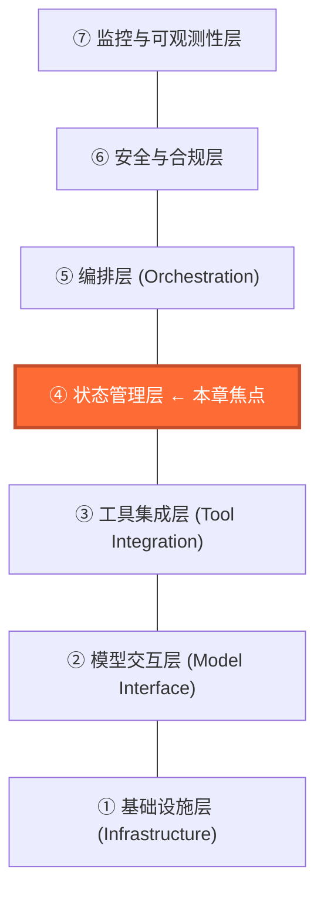
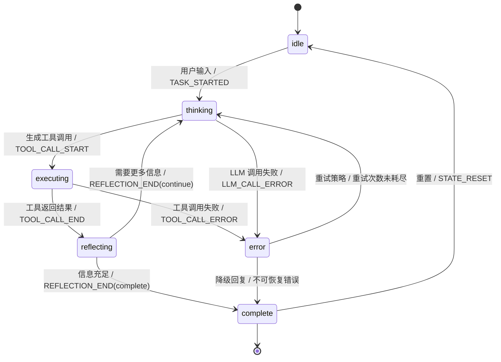
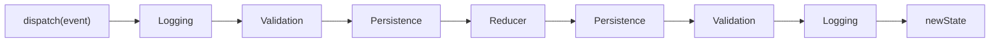
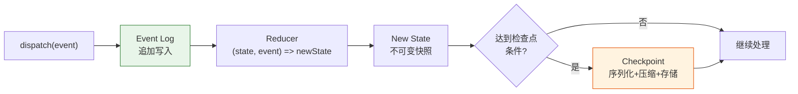
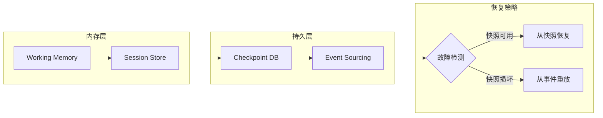
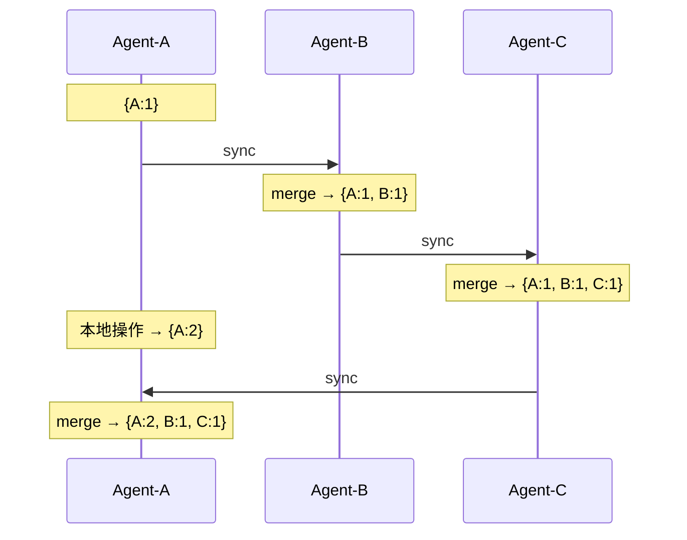
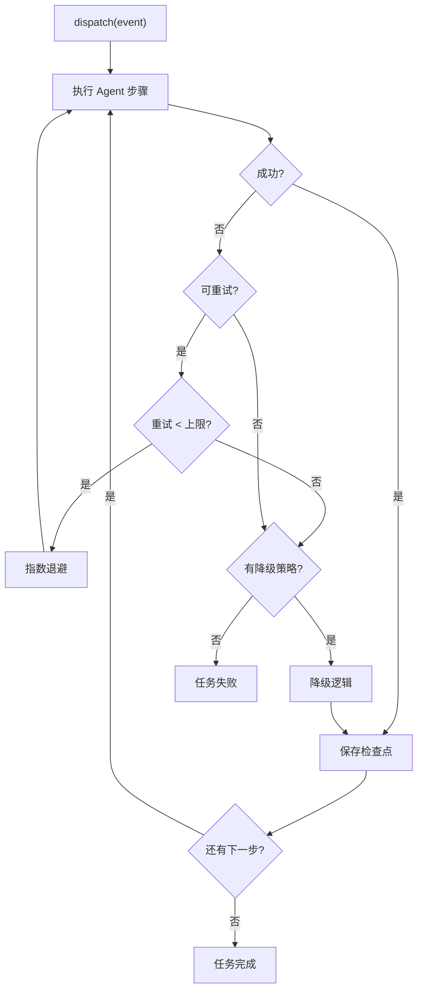
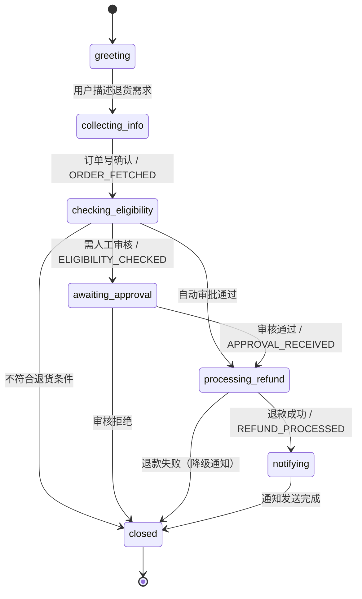

# 第 4 章 状态管理 — 确定性的基石

本章系统性地解决 Agent 状态管理的三个核心挑战：原子性、持久性和一致性。状态竞争导致的幽灵操作、上下文窗口溢出后的失忆、多 Agent 共享状态的不可预测行为——这些生产事故的根因都是状态管理缺失。
本章将从 Reducer + 事件溯源（Event Sourcing）模式出发，逐步构建包含检查点（Checkpoint）、时间旅行调试和分布式同步的工业级状态管理体系。前置依赖：第 3 章的七层架构模型。

为什么状态管理值得单独成章？因为在 Agent 系统的所有技术层中，状态管理是唯一同时服务于开发效率、运行时可靠性和事后可审计性三个目标的基础设施。
一个设计良好的状态管理层，可以让开发者在调试时"回到过去"检查任意中间状态，让系统在崩溃后自动恢复到最近的一致点，让审计人员追溯每一步决策的依据。
反之，一个缺失或粗糙的状态管理层，是 Agent 系统中绝大多数难以复现的 bug、难以排查的故障和难以审计的决策的根源。

---

## 4.1 为什么需要状态管理

### 状态管理在七层架构中的位置

在第 3 章定义的七层架构中，状态管理层位于核心位置——它向上为 Orchestration（编排层）提供确定性的状态读写接口，向下依赖 Persistence（持久层）实现快照和事件日志的落盘。
理解这一位置关系，有助于把握本章内容的边界：我们不涉及编排逻辑（那是第 6 章的内容），也不深入持久化引擎的实现细节（那是基础设施层的职责），而是专注于"如何以确定性的方式管理 Agent 运行时的所有可变数据"。

状态管理层的职责可以精确地概括为三个词：**读取**（为编排层和模型交互层提供当前状态的一致性视图）、**变更**（通过 Reducer 纯函数处理事件，生成新的不可变状态）、**持久**（通过检查点和事件日志实现崩溃恢复）。
这三个职责分别对应本章的三大技术支柱：Selector 模式（4.2.4 节）、Reducer 模式（4.2.3 节）和事件溯源（4.3 节）。


**图 4-0 状态管理在七层架构中的位置**——状态管理层是连接上层编排逻辑与下层工具执行的关键枢纽。所有状态变更都必须经过这一层，确保全局一致性和可追溯性。

### 什么是 Agent 状态

在深入实现之前，我们需要对"Agent 状态"建立精确的概念定义。初学者常将"Agent 状态"简单等同于"对话历史"——这是一个危险的简化。
对话历史只是状态的一部分（而且是最大的一部分），但 Agent 还需要记住"自己正在做什么"（控制流信息）和"自己做得怎么样"（运行时指标）。这三类信息有着截然不同的读写频率、一致性要求和持久化策略。混淆它们是生产事故的主要来源之一。

Agent 状态由三个性质截然不同的子域组成。清晰地区分这三个子域，是做出正确架构决策的前提。

**控制状态（Control State）** 描述 Agent "正在做什么"。核心字段包括 `phase`（当前生命周期阶段，如 idle、thinking、executing）和 `currentTask`（当前执行的任务描述）。
控制状态的特点是：变更频繁（每次状态转换都会修改）、必须严格一致（不允许并发写入导致的脏状态）、是编排层做出下一步决策的直接依据。如果控制状态出错，Agent 可能会跳过关键步骤或陷入死循环。
在实际系统中，控制状态通常占整个 AgentState 对象的不到 5%，但它的正确性决定了其余 95% 数据状态的处理方式。

**数据状态（Data State）** 描述 Agent "持有什么信息"。核心字段包括 `messages`（对话历史）、`toolCalls`（工具调用记录及其结果）和 `error`（当前错误信息）。
数据状态的特点是：体积大（对话历史可能包含数百条消息，每条消息几百到几千 token）、追加为主（消息列表通常只增不减）、是 LLM 推理的输入来源。
数据状态的管理难点在于体积控制——当消息历史超过 token 上限时，需要有策略地压缩而非简单截断（这是第 5 章上下文工程的主题）。
另一个难点是引用完整性：当一条 ToolCall 记录被标记为 `error` 时，对应的 `messages` 中必须有匹配的错误消息，否则 LLM 在下一轮推理时会看到不一致的上下文。

**元数据状态（Metadata State）** 描述 Agent "运行得怎么样"。核心字段包括 `metrics`（token 消耗、工具调用次数等统计量）和 `timestamps`（各阶段的起止时间）。
元数据状态的特点是：不影响 Agent 的行为决策（即使 `totalTokensUsed` 的值错误，Agent 仍然能正确推理）、主要服务于监控、计费和性能优化、可以容忍短暂的不一致。
在性能优化时，元数据状态是最先考虑异步更新或批量更新的候选——它的延迟更新不会导致功能错误，但如果用同步方式处理则会无谓地拖慢关键路径。

理解这三种状态的区分至关重要。许多生产事故的根因是将它们混为一谈：用数据状态的宽松一致性要求去处理控制状态（导致状态机错乱），或者用控制状态的严格同步策略去处理元数据（导致不必要的性能瓶颈）。
举一个具体的例子：某团队将 `totalTokensUsed` 的更新放在 Reducer 的关键路径上，并为它设置了持久化检查点。
结果每次 LLM 调用后都要等待磁盘 I/O 完成才能进入下一步，p99 延迟从 200ms 飙升到 800ms。将 `metrics` 更新改为异步批量写入后，延迟回归正常。
本章后续的 Reducer 设计、检查点策略和分布式同步方案，都会针对这三种状态采取差异化的处理策略。

下表进一步总结了三种状态子域在不同维度上的差异，可作为设计时的快速参考：

| 维度 | 控制状态 | 数据状态 | 元数据状态 |
|------|---------|---------|-----------|
| 核心字段 | phase, currentTask | messages, toolCalls | metrics, timestamps |
| 读写频率 | 每次转换都写 | 追加为主，偶尔压缩 | 每步累加 |
| 一致性要求 | 强一致（不可脏读） | 引用完整性 | 最终一致即可 |
| 持久化策略 | 每次关键转换后 | 增量追加 | 异步批量 |
| 体积占比 | <5% | 80-90% | 5-15% |
| 出错后果 | 状态机死锁或跳步 | LLM 推理基于错误上下文 | 监控数据不准确 |

### 4.1.1 Agent 状态生命周期

一个典型的 Agent 在执行任务时，会经历多种状态。
下面的状态图展示完整的生命周期——注意状态名称与 TypeScript 类型 `AgentPhase` 完全对应（idle、thinking、executing、reflecting、error、complete），确保图表与代码的一致性：


**图 4-1 Agent 状态机全景**——每个 Agent 本质上是一个有限状态机。注意 `error` 状态既可以通过重试回到 `thinking`，也可以在不可恢复时直接进入 `complete`——这个分支是弹性引擎（4.5 节）的核心设计。

这张状态图蕴含了几个重要的设计决策。首先，`thinking` 和 `executing` 是两个独立的阶段，而非合并为一个"working"阶段。
这是因为在 `thinking` 阶段（等待 LLM 响应）和 `executing` 阶段（等待工具调用返回），Agent 面临的错误类型、超时策略和降级方案完全不同——LLM 超时通常可以降低 temperature 重试，而工具调用失败可能需要跳过该工具。
其次，`reflecting` 是一个显式的阶段，而非在 `executing` 之后直接回到 `thinking`。
这为 Agent 提供了"元认知"能力——在反思阶段，Agent 可以评估工具调用的结果质量，决定是继续收集信息还是已经足够做出回答。

第三个重要的设计决策是 `error` 作为一个独立的阶段存在，而非一个可以与其他阶段共存的标志位。这意味着 Agent 在任何时刻只能处于一种状态——要么正在思考，要么正在执行，要么处于错误状态，但不能"一边执行一边处于错误状态"。
这种互斥性简化了状态机的推理——你不需要处理 `phase === 'executing' && hasError === true` 这样的组合状态，所有分支判断都基于单一的 `phase` 字段。
代价是某些场景下需要额外的状态转换（例如，工具调用部分成功部分失败时，需要先转入 `error` 处理失败部分，再回到 `executing` 处理成功部分），但这种显式的状态转换比隐式的标志位组合更容易理解和调试。

对应的 TypeScript 类型定义：

```typescript
/** Agent 的生命周期阶段——与状态图中的节点一一对应 */
type AgentPhase = 'idle' | 'thinking' | 'executing' | 'reflecting' | 'error' | 'complete';
```

### 4.1.2 状态管理方案对比

在选择状态管理方案之前，我们先对比几种常见的策略。这张对比表不是理论推演，而是来自实际项目的经验总结——每种方案我们都在不同规模的 Agent 系统中验证过：

| 方案 | 可重现性 | 并发安全 | 持久化难度 | 适用场景 |
|------|---------|---------|-----------|---------|
| 全局变量/闭包 | 极差 | 无保障 | 手动序列化 | 快速原型 |
| 类实例属性 | 较差 | 需加锁 | 需自定义 | 小型项目 |
| Immutable Map | 可快照 | 天然安全 | 直接序列化 | 中型项目 |
| **Reducer 模式** | **可重放** | **单线程分发** | **事件持久化** | **生产级 Agent** |
| 事件溯源 (ES) | 完整历史 | 追加写入 | 天然持久 | 合规审计场景 |

**表 4-1 五种状态管理方案对比**

选择哪种方案取决于你对以下三个问题的回答：（1）你是否需要在出错后精确回放 Agent 的决策过程？如果是，排除前两种方案。（2）你是否需要支持崩溃恢复和跨进程状态持久化？如果是，排除不可快照的方案。（3）你是否需要完整的操作审计链？
如果是，事件溯源几乎是唯一的选择。对于大多数生产级 Agent 系统，这三个问题的答案都是"是"。

本章选择 **Reducer + 事件溯源** 作为核心方案，原因如下：

- **纯函数更新**：`(state, event) => newState` 保证确定性——给定相同输入，任何人在任何时候都得到相同输出。
- **事件日志**：完整的事件历史支持重放与审计，这在受监管行业是刚性需求。
- **快照友好**：任何时刻的状态都可序列化为检查点，支持崩溃恢复。
- **中间件可插拔**：日志、校验、性能监控都可以通过中间件注入，不污染核心逻辑。

这四个优势不是独立的——它们形成了一个相互增强的闭环。纯函数更新使得状态可快照，可快照使得检查点容易实现，检查点加事件日志构成了崩溃恢复方案，而中间件机制使得日志和检查点可以无侵入地注入。在后续章节中你会反复看到这个闭环的各个环节如何协作。

值得强调的是，Immutable Map 方案对于中型项目（如内部工具型 Agent、不需要审计追踪的场景）已经足够好。不是所有项目都需要完整的事件溯源——过早引入会增加不必要的复杂性。本章的完整方案主要面向生产级、需要合规审计或分布式协作的 Agent 系统。

### 4.1.3 无状态管理的失败场景

以下三个反模式展示了缺乏状态管理的典型后果。它们看起来很基础，但在实际项目中反复出现——尤其是团队从"能跑就行"的原型快速转向生产部署时。

**场景 1（幽灵订单）**：状态散落在闭包变量中，崩溃恢复后 `orderPlaced` 标志重置为 false，导致重复下单。这个问题的本质是：内存中的 boolean 标志没有任何持久化保障。
当进程因 OOM 或部署更新而重启时，所有内存状态归零。
如果 Agent 在 `callOrderAPI` 完成后、`orderPlaced = true` 执行前崩溃（一个极小但非零概率的窗口），重启后会再次调用 `callOrderAPI`。在电商场景中，这意味着用户被重复收费。

**场景 2（失忆 Agent）**：对话历史只存在内存中，进程重启后丢失全部上下文。
更隐蔽的变体是"软失忆"——对话历史超过 token 上限后被简单截断（`history.slice(-10)`），导致 Agent 遗忘了关键的前置约束。
例如，用户在第 3 轮对话中说"所有操作都要在沙箱环境执行"，但这条消息在第 15 轮时被截断丢弃，Agent 随后在生产环境执行了危险操作。

**场景 3（薛定谔的状态）**：多个异步操作并发读-改-写同一变量，产生 Lost Update。
在 Node.js 的事件循环模型中，虽然 JavaScript 是单线程的，但 `await` 会让出控制权——两个并发的 `transfer` 函数各自在 `await` 之前读取 `balance`，都读到 1000，各自减去 100 后写回 900，而不是正确的 800。

```typescript
// ❌ 反模式 1：幽灵订单——崩溃恢复后 orderPlaced 重置为 false
let orderPlaced = false;
async function handleOrder(msg: string) {
  if (!orderPlaced) { await callOrderAPI(msg); orderPlaced = true; } // 崩溃点！
}

// ❌ 反模式 2：失忆——超限截断丢失关键上下文
if (estimateTokens(history) > 4000) history = history.slice(-10);

// ❌ 反模式 3：并发冲突——两个 transfer(100) 并发，1000→900 而非 800
let balance = 1000;
async function transfer(amount: number) {
  const cur = balance; await process(amount); balance = cur - amount;
}
```

根因都是同一个：**没有原子化的状态快照和顺序化的状态变更**。
Reducer 模式通过将所有修改收敛为 `dispatch(event) -> reducer(state, event) -> newState` 这一条唯一路径，从根本上杜绝了这三类问题。
事件溯源进一步确保每次状态变更都被持久化为不可变事件，即使进程崩溃也能通过重放事件恢复到精确的崩溃前状态。

值得一提的是，这些反模式并非来自粗心的开发者——它们来自在截止日期压力下做出的合理的短期决策。反模式 1 的代码只需要 3 行，而完整的事件溯源方案需要数百行。
从"能用就行"到"可靠运行"的跨越，不是代码量的简单增长，而是设计理念的根本转变：从"直接修改状态"转向"通过事件间接修改状态"。这个转变的代价是更多的模板代码和更长的初始开发周期，收益是更少的生产事故和更快的排查速度。
在我们的经验中，对于预期运行超过 3 个月的 Agent 系统，这个投入回报比是正向的。

### 4.1.4 并发与一致性挑战

在真实的 Agent 系统中，以下并发场景极为常见：（1）**并行 Tool 调用**——Agent 同时调用多个 API，每个返回后都需更新状态；（2）**人类介入（Human-in-the-Loop）**——审批可能在任意时刻到达；（3）**多 Agent 协作**——共享状态空间的并发写入；（4）**异步事件流**——Webhook、定时器随时触发状态变更。

这些并发场景中最棘手的是场景 1：并行 Tool 调用。考虑一个旅行规划 Agent 同时查询机票 API 和酒店 API。两个 API 可能在毫秒级间隔内返回，各自触发 `TOOL_CALL_END` 事件。
如果没有顺序化机制，两个事件处理器可能同时读取同一个 `toolCalls` 数组并各自追加结果，导致其中一个结果被覆盖。
Reducer 模式通过事件队列将这些并发事件串行化——无论 API 返回的时序如何，Reducer 始终按队列顺序逐个处理，保证最终状态包含所有工具调用的结果。

场景 2（Human-in-the-Loop）带来了一个额外的复杂性：时间尺度不对称。LLM 推理和工具调用通常在秒级完成，而人工审批可能需要数小时甚至数天。
这意味着 Agent 的状态必须能够跨越长时间窗口持久化——不能假设进程在等待审批期间一直存活。检查点（4.3 节）和事件溯源正是为此设计的：在进入等待审批的状态后立即保存检查点，审批到达时从检查点恢复并继续执行。
Human-in-the-Loop 还引入了"外部事件注入"的需求——审批结果不是由 Agent 内部产生的，而是从外部系统（如审批平台的 Webhook）注入的。
这要求事件队列能够接受外部来源的事件，同时校验其合法性（例如，只有在 `awaiting_approval` 阶段才允许注入 `APPROVAL_RECEIVED` 事件）。

```typescript
class EventQueue {
  private queue: AgentEvent[] = [];
  private processing = false;
  private state: AgentState;
  private readonly reducer: (s: AgentState, e: AgentEvent) => AgentState;

  dispatch(event: AgentEvent): void {
    this.queue.push(event);
    if (!this.processing) this.processQueue();
  }
  private processQueue(): void {
    this.processing = true;
    while (this.queue.length > 0) this.state = this.reducer(this.state, this.queue.shift()!);
    this.processing = false;
  }
}
```

需要注意的是，这里的"顺序化"仅针对状态变更操作，而非 Agent 的全部执行流程。Tool 调用本身仍然可以并行发起——顺序化仅发生在"将工具调用结果写入状态"这一步。这意味着你不会因为引入 Reducer 而丧失并发执行的性能优势。

---

## 4.2 Reducer 模式 — 状态的确定性引擎

### 为什么选择 Reducer 模式

在 Agent 状态管理的技术选型中，Reducer 模式并非唯一选择。理解我们为什么选择它而非其他方案，有助于在不同项目约束下做出正确的架构决策。以下对比三种主流方案的核心差异。

**方案 A：直接 Mutation（可变状态 + 方法调用）。** 这是最直观的做法——定义一个 `AgentState` 类，通过 `setState()` 方法直接修改属性。
优点是代码简单、学习曲线低。致命缺点是：无法追踪"谁在什么时候改了什么"，调试时面对一个错误状态，你不知道它是怎么到达这里的。
在 Agent 场景中，一次任务执行可能涉及 10-50 次状态转换，直接 mutation 使得问题复现几乎不可能。此外，直接 mutation 无法实现时间旅行调试——你没有历史快照可以回退到。

**方案 B：响应式代理（MobX/Vue 风格的 Proxy）。** 使用 ES Proxy 自动追踪状态访问和修改，配合 `computed` 派生属性和 `reaction` 副作用。
这在 UI 框架中表现出色，但在 Agent 场景下有两个问题：（1）隐式依赖追踪使得状态流难以推理——当一个 `computed` 值变化时，很难确定是哪个上游状态触发了变更，这在多步推理的 Agent 中尤为致命；（2）Proxy 的惰性求值与 Agent 的"先规划后执行"模式冲突——Agent 需要在执行工具调用前确定性地知道完整的当前状态，而非在访问时才计算。
响应式方案的优势在于低代码量和高开发效率，如果你的 Agent 逻辑简单且不需要调试追踪，它仍然是一个合理的选择。

**方案 C：Reducer 模式（我们的选择）。
** `(state, event) => newState` 的纯函数签名带来三个关键优势：（1）**完全可重放**——给定初始状态和事件序列，任何人在任何时候都能重现完全相同的最终状态；（2）**事件即日志**——每个 `event` 对象天然就是一条审计记录，无需额外的日志基础设施；（3）**中间件友好**——纯函数可以被任意包装，添加日志、校验、持久化等横切关注点而不污染核心逻辑。
代价是代码量比直接 mutation 多约 30%，且需要定义完整的事件类型系统。对于生产级 Agent，这个代价完全值得。

一个常被忽视的优势是 Reducer 模式对团队协作的友好性。在多人开发的 Agent 项目中，Reducer 的纯函数性质意味着任何开发者都可以独立地阅读和理解某个 case 分支的逻辑，而无需追踪全局状态的修改历史。
新加入团队的成员可以通过阅读事件类型定义（4.2.2 节）快速了解"系统中可能发生什么"，通过阅读 Reducer 的 switch 分支了解"每种事情发生时状态如何变化"。
这种自文档化的特性在 Agent 系统的快速迭代中尤为珍贵——当业务需求变化时，你需要快速判断"添加一种新的工具调用类型"会影响状态管理的哪些部分，Reducer 的显式 case 枚举使这种影响分析变得简单直接。

> **设计决策：为什么不用全局 Redux 式状态树？**
>
> Agent 系统面临两个关键差异：（1）状态更新的粒度不可预测——一次工具调用可能修改单个字段，也可能重写整棵子树；（2）多 Agent 场景下需要隔离与共享并存。因此，更适合采用 **Actor 模型**：每个 Agent 拥有私有状态，通过消息传递实现协作。

### 4.2.1 AgentState 类型定义

设计 AgentState 时，最重要的决策是如何组织状态字段。
一种方案是扁平化——将所有字段放在同一层级，简单直接但可维护性差。
另一种方案是按职责分层——控制状态（驱动行为决策的变量）、数据状态（对话和工具调用的累积记录）、元数据状态（监控和调试用的辅助信息）。
我们选择后者，因为它允许对不同类别的状态采用不同的持久化策略和访问控制：控制状态需要在每步都写入检查点，数据状态可以通过增量方式持久化，元数据状态可以异步写入甚至允许丢失。

在 TypeScript 中，`readonly` 修饰符提供编译时的不可变性保护。
虽然它不能阻止运行时的恶意修改，但足以捕获开发阶段绝大多数意外的直接赋值错误。
对于需要运行时保护的场景（如执行不受信任的插件代码），可以结合 `Object.freeze` 使用。

下面是 AgentState 的核心字段预览，聚焦于控制状态（phase）、数据状态（messages、toolCalls）和元数据状态（metrics）这三个子域：

```typescript
type AgentPhase = 'idle' | 'thinking' | 'executing' | 'reflecting' | 'error' | 'complete';

/** AgentState 核心字段——预览版 */
interface AgentState {
  readonly sessionId: string;
  readonly phase: AgentPhase;                  // 控制状态
  readonly messages: readonly Message[];       // 数据状态
  readonly currentTask: string | null;         // 控制状态
  readonly toolCalls: readonly ToolCall[];     // 数据状态
  readonly error: string | null;
  readonly retryCount: number;
  readonly metrics: {                          // 元数据状态
    readonly totalTokensUsed: number;
    readonly totalToolCalls: number;
    readonly startTime: number;
    readonly lastUpdateTime: number;
  };
  // ...更多字段（metadata 等）见完整定义
}
```

完整定义包括辅助类型 Message 和 ToolCall，以及工厂函数 `createInitialState`。
Message 的 `role` 字段使用四种角色（user、assistant、system、tool），与 OpenAI Chat API 的角色定义对齐，便于在 Reducer 和 LLM 调用之间直接传递。
ToolCall 的 `status` 字段追踪工具调用的完整生命周期（pending -> running -> success/error），这使得 UI 可以实时显示"正在调用搜索 API..."的进度状态：

```typescript
/** 完整定义——含所有辅助类型 */
interface Message {
  readonly role: 'user' | 'assistant' | 'system' | 'tool';
  readonly content: string;
  readonly timestamp: number;
}
interface ToolCall {
  readonly id: string;
  readonly name: string;
  readonly arguments: Record<string, unknown>;
  readonly status: 'pending' | 'running' | 'success' | 'error';
  readonly result?: unknown;
  readonly error?: string;
  readonly startTime: number;
  readonly endTime?: number;
}
function createInitialState(sessionId?: string): AgentState {
  return {
    sessionId: sessionId ?? randomUUID(), phase: 'idle',
    messages: [], toolCalls: [], currentTask: null,
    error: null, retryCount: 0, metadata: {},
    metrics: { totalTokensUsed: 0, totalToolCalls: 0,
               startTime: Date.now(), lastUpdateTime: Date.now() },
  };
}
```

> 💡 完整实现见 [code-examples/02-state-management.ts](../code-examples/02-state-management.ts)

所有字段都使用 `readonly` 修饰符，这不是装饰性的——它是整个 Reducer 模式正确性的基石。
TypeScript 编译器会在你尝试直接修改状态时报错（如 `state.phase = 'thinking'`），强制你通过 Reducer 返回新对象来变更状态。
对于数组类型，`readonly Message[]` 禁止了 `push`、`pop` 等原地修改方法，只能通过展开运算符 `[...state.messages, newMessage]` 创建新数组。
这种编译时约束比运行时的 `Object.freeze` 更高效——后者有性能开销且在深层嵌套时容易遗漏，而 `readonly` 修饰符是零运行时成本的类型系统特性。

### 4.2.2 事件类型：12 种 Discriminated Union

事件类型的设计决定了系统的"词汇表"——Agent 能感知和记录哪些状态变化。
粒度太粗（只有 `STATE_CHANGED`）会丢失追踪精度；粒度太细（每个字段变化一个事件）会让 Reducer 的 switch 分支爆炸。
我们的经验法则是：**一个事件对应一个业务动作**（如"用户发送了消息"），而非一次数据变更（如"messages 数组新增了一个元素"）。
Reducer 负责从一个业务事件推导出所有需要的字段变更。

我们使用 TypeScript 的 **Discriminated Union** 模式定义所有合法事件。每种事件都有唯一的 `type` 字段，覆盖 Agent 生命周期的所有状态转换。
这 12 种事件可以按触发来源分为三组：LLM 相关（TASK_STARTED、LLM_CALL_START/END/ERROR）、Tool 相关（TOOL_CALL_START/END/ERROR）、和流程控制相关（REFLECTION_START/END、ERROR_OCCURRED、TASK_COMPLETED、STATE_RESET）。

```typescript
type AgentEvent =
  | { type: 'TASK_STARTED'; task: string; timestamp: number }
  | { type: 'LLM_CALL_START'; prompt: string; timestamp: number }
  | { type: 'LLM_CALL_END'; response: string; tokensUsed: number; timestamp: number }
  | { type: 'LLM_CALL_ERROR'; error: string; timestamp: number }
  | { type: 'TOOL_CALL_START'; toolId: string; name: string;
      args: Record<string, unknown>; timestamp: number }
  | { type: 'TOOL_CALL_END'; toolId: string; result: unknown; timestamp: number }
  | { type: 'TOOL_CALL_ERROR'; toolId: string; error: string; timestamp: number }
  | { type: 'REFLECTION_START'; timestamp: number }
  | { type: 'REFLECTION_END'; decision: 'continue' | 'complete';
      summary: string; timestamp: number }
  | { type: 'ERROR_OCCURRED'; error: string; recoverable: boolean; timestamp: number }
  | { type: 'TASK_COMPLETED'; result: string; timestamp: number }
  | { type: 'STATE_RESET'; timestamp: number };
```

这 12 种事件的设计遵循了一个重要原则：**事件应描述"发生了什么"，而非"应该做什么"**。例如，`LLM_CALL_END` 记录的是"LLM 返回了这个结果"，而非"请将 LLM 结果写入状态"。
这种命名约定使事件日志成为天然的系统行为记录——你可以直接阅读事件序列来理解 Agent 的行为轨迹，而无需阅读 Reducer 代码。

注意每个事件都包含 `timestamp` 字段。这不仅用于日志排序，更重要的是为向量时钟（4.4 节）和增量检查点（4.6 节）提供时间基准。
`LLM_CALL_END` 事件中包含了 `response`（LLM 的完整输出），这是"结果即事件"策略的体现——4.5 节将详细讨论为什么这对确定性重放至关重要。

### 4.2.3 Reducer 核心实现

Reducer 是一个 **纯函数**：给定当前状态和事件，返回新状态。纯函数意味着三个约束：不读取外部变量（如全局配置、当前时间）、不修改输入参数（状态和事件都是只读的）、不产生副作用（不调用 API、不写文件、不发网络请求）。
任何违反这三个约束的操作都应该在 Reducer 外部完成——通常在中间件或调用方中处理。

以下展示框架和两个最关键的 case——TOOL_CALL_END（触发反思阶段）和 REFLECTION_END（决定是否继续循环）。选择展示这两个 case 是因为它们体现了 Agent 最核心的决策循环：工具返回结果后进入反思，反思后决定是继续收集信息还是给出最终回答：

```typescript
/**
 * Agent 核心 Reducer
 * 注意：metrics 使用增量合并（展开 state.metrics 再覆盖单个字段），
 * 而非 { ...state, ...baseUpdate } 式的整体替换，避免覆盖整个 metrics 对象。
 */
function agentReducer(state: AgentState, event: AgentEvent): AgentState {
  const m = { ...state.metrics, lastUpdateTime: event.timestamp };
  switch (event.type) {
    case 'TASK_STARTED':
      return { ...state, phase: 'thinking', currentTask: event.task,
               error: null, retryCount: 0, metrics: { ...m, startTime: event.timestamp } };
    case 'TOOL_CALL_END':
      return { ...state, phase: 'reflecting', metrics: m,
        toolCalls: state.toolCalls.map(tc => tc.id === event.toolId
          ? { ...tc, status: 'success' as const, result: event.result,
              endTime: event.timestamp } : tc) };
    case 'REFLECTION_END':
      return { ...state, metrics: m,
        phase: event.decision === 'continue' ? 'thinking' : 'complete',
        messages: [...state.messages, { role: 'assistant' as const,
          content: event.summary, timestamp: event.timestamp }] };
    case 'STATE_RESET':
      return createInitialState(state.sessionId);
    // 其余 case: LLM_CALL_START, LLM_CALL_END, LLM_CALL_ERROR,
    //   TOOL_CALL_START, TOOL_CALL_ERROR, REFLECTION_START,
    //   ERROR_OCCURRED, TASK_COMPLETED 结构类似
    default:
      const _exhaustive: never = event;
      throw new Error(`Unhandled: ${(_exhaustive as AgentEvent).type}`);
  }
}
```

> **穷尽性检查**：`default` 分支的 `never` 断言确保添加新事件类型时编译器强制提醒补充处理逻辑。这是一个编译时安全网——如果你在 `AgentEvent` 联合类型中新增了 `TOOL_TIMEOUT`，忘记在 switch 中添加对应 case，TypeScript 会在 `default` 行报类型错误。
>
> **metrics 合并策略**：注意 `const m = { ...state.metrics, lastUpdateTime: event.timestamp }` 这一行。早期版本使用了 `{ ...state, ...baseUpdate }` 模式，其中 `baseUpdate = { metrics: { lastUpdateTime: ... } }`。这会导致 `baseUpdate.metrics` 整体替换 `state.metrics`，丢失 `totalTokensUsed` 等字段。当前的增量合并（先展开旧 metrics，再覆盖单个字段）确保不会丢失未变更的字段。

> 💡 完整 12 个 case 的实现见 [code-examples/02-state-management.ts](../code-examples/02-state-management.ts)

Reducer 的纯函数性质带来了一个强大的测试属性：**确定性重放**。给定一个初始状态和一系列事件，无论执行多少次，`events.reduce(agentReducer, initialState)` 都会产生完全相同的最终状态。
这个属性不仅是事件溯源（4.3 节）的理论基础，也是调试的利器——当生产环境出现状态异常时，你可以导出事件日志，在本地环境中精确重现问题，无需猜测"当时发生了什么"。
需要注意的是，保持这个属性要求 Reducer 中绝对不能包含副作用——不能读取当前时间（应使用事件中的 `timestamp`）、不能生成随机数（应使用事件中的预计算值）、不能调用外部 API。任何违反纯函数性质的操作都会破坏确定性重放。

### 4.2.4 Selector 模式 — 派生状态

许多状态信息不需要存储——它们可以从基础状态计算得出。
当前 token 使用量、工具调用错误率、是否应该触发反思——这些都是基础状态的函数。
如果在每个需要的地方都内联计算，不仅浪费资源，更会在代码中散布重复逻辑。
Selector 模式将这些派生计算集中定义一次，并通过记忆化（memoization）避免重复执行。

Selector 将派生计算提取到纯函数中，通过记忆化避免重复计算。
当 UI 或监控系统频繁查询"最近的 Tool 调用"、"当前 Token 消耗"、"工具调用错误率"等信息时，Selector 比在 Reducer 中内联计算更清晰、更高效。
记忆化的原理很简单：因为 Reducer 每次返回新的不可变状态对象，所以只需比较 `state` 引用是否变化就能判断是否需要重新计算——引用相同意味着状态未变，直接返回缓存结果。

在实际应用中，Selector 的价值不仅在于性能优化。它还提供了一个稳定的查询接口——当底层状态结构发生变化时（例如将 `toolCalls` 从数组重构为 Map），只需修改 Selector 内部的实现，所有消费方代码无需改动。
这种解耦在状态结构频繁演进的早期开发阶段尤为重要。

组合 Selector（Composed Selector）可以进一步提高表达能力和复用性。
例如，`selectActiveTools`（筛选 status 为 running 的工具调用）和 `selectToolDuration`（计算每个工具调用的耗时）可以组合为 `selectSlowRunningTools`（找出运行中且已超过阈值的工具调用）。
这种组合模式使得复杂的状态查询可以从简单的原子查询逐步构建，每一层都可以独立测试和缓存。

```typescript
type Selector<T> = (state: AgentState) => T;
function createMemoizedSelector<T>(fn: Selector<T>): Selector<T> {
  let last: AgentState | null = null, cached: T;
  return (s) => { if (s !== last) { last = s; cached = fn(s); } return cached; };
}
const selectRecentTools = createMemoizedSelector(s => s.toolCalls.slice(-5));
const selectErrorRate = createMemoizedSelector(s => {
  const t = s.toolCalls.length;
  return t === 0 ? 0 : s.toolCalls.filter(c => c.status === 'error').length / t;
});
```

### 4.2.5 中间件模式 — 横切关注点

中间件允许你在事件到达 Reducer **之前**和**之后**注入逻辑。这是经典的"洋葱模型"——事件从最外层中间件进入，逐层传递到 Reducer 核心，处理后的新状态再从内层向外层返回。
每层中间件都有机会在事件处理前后执行逻辑（如计时、校验、持久化），而不污染 Reducer 本身。

中间件模式在 Agent 系统中的典型用途包括：（1）**日志中间件**——记录每个事件的类型、处理前后的 phase 变化和耗时，用于运行时监控和事后分析；（2）**校验中间件**——在 Reducer 执行后检查状态不变量（如 Token 数非负、complete 阶段无 running 状态的工具调用），违反时抛出异常而非放任脏状态传播；（3）**持久化中间件**——在关键事件（如 TASK_COMPLETED）处理后自动触发检查点保存，无需在业务逻辑中手动调用。
通过组合这三类中间件，你可以在不修改 Reducer 核心逻辑的情况下获得完整的运维能力。


**图 4-2 中间件洋葱模型**

中间件的签名和组合逻辑如下。注意 `reduceRight` 的使用——它确保数组中第一个中间件在最外层执行（最先接收事件、最后返回结果）：

```typescript
type Middleware = (
  state: AgentState, event: AgentEvent,
  next: (s: AgentState, e: AgentEvent) => AgentState
) => AgentState;

// 日志：记录事件类型、前后 phase、处理耗时
const loggingMiddleware: Middleware = (state, event, next) => {
  const t = performance.now();
  const r = next(state, event);
  console.log(`${event.type}: ${state.phase}→${r.phase} (${(performance.now()-t).toFixed(1)}ms)`);
  return r;
};
// 校验：Token 非负、complete 时无 running 的 ToolCall、sessionId 不可变
const validationMiddleware: Middleware = (state, event, next) => {
  const r = next(state, event);
  if (r.metrics.totalTokensUsed < 0) throw new Error('Invariant: tokens < 0');
  if (r.phase === 'complete' && r.toolCalls.some(c => c.status === 'running'))
    throw new Error('Invariant: running calls in complete');
  return r;
};

function applyMiddleware(
  reducer: (s: AgentState, e: AgentEvent) => AgentState,
  ...mws: Middleware[]
): (s: AgentState, e: AgentEvent) => AgentState {
  return (s, e) => mws.reduceRight(
    (next, mw) => (ss: AgentState, ee: AgentEvent) => mw(ss, ee, next), reducer
  )(s, e);
}
```

> 💡 完整实现（含性能监控中间件、自动检查点中间件）见 [code-examples/02-state-management.ts](../code-examples/02-state-management.ts)

中间件的执行顺序很重要。推荐的顺序是：日志（最外层，记录所有事件）-> 校验（在 Reducer 之后检查不变量）-> 持久化（在校验通过后保存检查点）。
如果把持久化放在校验之外，可能会将违反不变量的脏状态写入检查点——恢复后系统直接进入非法状态。如果把日志放在校验之内，当校验抛出异常时日志中间件不会记录该事件，导致审计链出现断裂。
这些顺序约束不是显而易见的，建议在代码注释中明确记录中间件的预期顺序及其理由。

在调试阶段，还可以临时插入一个"断点中间件"——当特定条件满足时（如 `event.type === 'TOOL_CALL_ERROR' && state.retryCount >= 3`），暂停事件处理并打印完整的状态快照。
这比在 Reducer 内部设置断点更安全，因为中间件不会修改状态，不存在"调试代码意外影响生产行为"的风险。

---

## 4.3 事件溯源与检查点

### 为什么引入事件溯源

如果 Reducer 模式已经解决了状态更新的确定性问题，为什么还需要事件溯源？这是一个经常被问到的问题，也是许多团队在架构演进中面临的关键决策点。
简短的回答是：Reducer 保证了"每一步都是正确的"，但事件溯源保证了"你能知道走过了哪些步"。两者的组合才构成完整的状态管理解决方案。

Reducer 模式解决了"状态更新的确定性"问题，但它并不天然解决"状态的可追溯性和持久性"。
Reducer 接收事件、产出新状态，但如果你不主动记录这些事件，它们就会在处理后被丢弃——你只剩下最终状态，而丢失了"如何到达这里"的全部信息。在 Agent 场景下，有三个特有的诉求驱使我们在 Reducer 之上引入事件溯源。

**诉求一：可重放调试。** Agent 的行为链条通常很长——一次客服对话可能涉及 8-15 个 thinking-executing-reflecting 循环。
当最终输出出错时，开发者需要回溯到"第 5 轮 LLM 为什么决定调用退货 API"这样的具体决策点。如果只保存最终状态，调试就变成了黑盒猜测。
事件溯源将每一步状态变更记录为不可变事件，使得任何中间状态都可以精确还原——这就是"时间旅行调试"的基础。
在实际开发中，这个能力的价值怎么强调都不过分：一个 Agent 在生产环境中产生了错误回答，你可以在开发环境中加载事件日志，精确重现从第一条用户消息到最终错误回答的全过程，逐步检查每个决策点。

**诉求二：审计追踪。** 在金融、医疗、法律等受监管领域，Agent 的每一个决策都需要可审计。事件溯源天然满足这一需求：事件日志就是一条不可篡改的审计链。
当客户投诉"AI 错误地取消了我的退货"时，你可以通过事件日志精确回放整个决策过程，定位是 LLM 的判断错误还是工具调用的返回值异常。
即使在不受监管的行业，审计能力也能显著降低排查成本——"这个 Agent 为什么调用了 5 次搜索 API"这类问题，有了事件日志就能秒级定位。

**诉求三：分布式同步的基础。** 在多 Agent 协作场景中，各节点需要就"发生了什么"达成共识。直接同步状态快照存在版本冲突的风险——两个 Agent 可能同时修改了不同字段，简单的 Last-Writer-Wins 会丢失更新。
基于事件的同步则不同：每个 Agent 广播自己的事件序列，其他 Agent 按因果顺序重放这些事件，自然地合并状态。这是第 4.4 节分布式状态同步的理论基础。
需要再次强调的是，诉求三仅适用于分布式场景——如果你的 Agent 系统是单节点的，诉求一（可重放调试）和诉求二（审计追踪）已经足以证明事件溯源的价值。

下面的数据流图展示了事件溯源的端到端工作流程：


**图 4-3 事件溯源端到端数据流**——事件被追加写入不可变日志后，经 Reducer 计算出新状态。在特定条件下（每 N 步、关键事件后），状态被序列化为检查点落盘。恢复时从最近检查点加载，再重放后续事件即可还原到任意时刻。

### 状态管理的三个核心权衡

在设计检查点策略时，需要在三对矛盾之间做出明确选择。这些权衡没有"正确答案"——最优解取决于你的具体场景。

**权衡 1：一致性 vs 性能。** 严格的状态一致性意味着每次变更都需要同步落盘——这在分布式环境下代价极高。实践中的折中是采用**最终一致性**：每个 Agent 维护本地状态副本，通过事件总线异步同步，允许短暂的不一致窗口。
对于大多数 Agent 场景（如客服、搜索、内容生成），几秒钟的不一致是完全可接受的。但对于金融交易类 Agent，可能需要更强的一致性保证——此时应考虑使用数据库事务而非内存 Reducer。

**权衡 2：粒度 vs 开销。** 快照粒度越细（如每次工具调用后都做快照），恢复能力越强，但存储和计算开销也越大。
推荐策略是**混合粒度**：对关键决策点（如 TASK_COMPLETED、TOOL_CALL_END）做完整快照，对中间步骤仅记录增量变更（delta）。
具体的触发条件可以通过配置项灵活调整：`checkpointInterval` 控制每隔多少步做一次常规快照，`checkpointOnEvents` 指定哪些事件类型触发即时快照。
在我们的电商客服案例（4.7 节）中，最终的配置是 `checkpointInterval: 3`（每 3 步一次常规快照）加 `checkpointOnEvents: ['APPROVAL_RECEIVED', 'REFUND_PROCESSED', 'TASK_COMPLETED']`（关键业务事件后即时快照）。
这个配置在"最多丢失 2 步工作量"和"I/O 开销可控"之间取得了平衡。

**权衡 3：可观测性 vs 隐私。** 完整的状态日志对调试至关重要，但可能包含用户敏感信息（对话内容、个人数据等）。解决方案是**分层脱敏**：在写入日志前对 `messages` 中的敏感字段进行哈希或掩码处理，同时保留事件类型、时间戳、phase 转换等结构信息支持调试。


**图 4-4 分层状态持久化架构**

### 4.3.1 检查点管理器

事件溯源的一个实际问题是：随着事件积累，从零重放的时间会越来越长。
检查点（Checkpoint）解决了这个问题——定期对状态做快照，恢复时只需从最近快照开始重放后续事件。
在我们的电商案例中，一个完整会话平均产生 30 个事件，从零重放需要 ~200ms，而从检查点恢复只需 ~15ms。

检查点管理器将序列化、存储和保留策略组合为统一接口。核心操作是 `save`（序列化 + 存储 + 清理过期）和 `restore`（加载 + 反序列化 + 完整性校验）。
`save` 方法中的 `stateHash` 字段用于完整性校验——恢复时重新计算哈希并与存储的值比对，任何不一致都意味着检查点数据在存储过程中被损坏，此时应放弃该检查点并尝试加载更早的版本。

```typescript
interface CheckpointMetadata {
  readonly id: string;
  readonly version: number;
  readonly createdAt: number;
  readonly agentSessionId: string;
  readonly eventIndex: number;
  readonly stateHash: string;
  readonly sizeBytes: number;
  readonly tags: readonly string[];
}

interface StorageAdapter {
  save(id: string, data: Uint8Array, meta: CheckpointMetadata): Promise<void>;
  load(id: string): Promise<{ data: Uint8Array; meta: CheckpointMetadata } | null>;
  list(sessionId: string): Promise<CheckpointMetadata[]>;
  delete(id: string): Promise<void>;
}

class CheckpointManager {
  private readonly serializer = new CheckpointSerializer();
  constructor(private storage: StorageAdapter, private retention: RetentionPolicy) {}

  async save(state: AgentState, events: readonly AgentEvent[],
             tags: string[] = []): Promise<CheckpointMetadata> {
    const data = this.serializer.serialize(state);
    const meta: CheckpointMetadata = {
      id: randomUUID(), version: 1, createdAt: Date.now(),
      agentSessionId: state.sessionId, eventIndex: events.length,
      stateHash: this.serializer.hash(state), sizeBytes: data.byteLength, tags,
    };
    await this.storage.save(meta.id, data, meta);
    await this.applyRetention(state.sessionId);
    return meta;
  }

  async restore(id: string): Promise<AgentState | null> {
    const r = await this.storage.load(id);
    if (!r) return null;
    const state = this.serializer.deserialize(r.data);
    if (this.serializer.hash(state) !== r.meta.stateHash)
      throw new Error('Checkpoint integrity check failed');
    return state;
  }

  private async applyRetention(sid: string): Promise<void> {
    const all = await this.storage.list(sid);
    for (const m of all)
      if (!this.retention.shouldRetain(m, all)) await this.storage.delete(m.id);
  }
}
```

> 💡 完整实现（含 FileSystemAdapter、SQLAdapter、CheckpointSerializer、RetentionPolicy）见 [code-examples/02-state-management.ts](../code-examples/02-state-management.ts)

`StorageAdapter` 接口的设计遵循了依赖倒置原则——CheckpointManager 依赖抽象接口而非具体实现。
在开发和测试阶段，可以使用 `InMemoryAdapter`（内存实现，零 I/O）；在单机部署时使用 `FileSystemAdapter`（基于本地文件系统，通过 `flock` 保证并发安全）；在分布式部署时使用 `SQLAdapter`（基于 PostgreSQL 或 SQLite，支持事务性写入）。
切换存储后端只需替换 adapter 实例，无需修改 CheckpointManager 或上层业务代码。

`RetentionPolicy` 控制检查点的生命周期管理。最简单的策略是 `KeepLastN`（保留最近 N 个检查点），适用于大多数场景。
更精细的策略包括：`TimeWindowRetention`（保留最近 T 小时内的所有检查点 + 更早时间段的每日快照）和 `TagBasedRetention`（带 `task-end` 标签的检查点永久保留，中间检查点按时间窗口清理）。
合理的保留策略可以将存储成本控制在可接受范围内——一个日均处理 1 万次对话的 Agent 系统，在 `KeepLastN(5)` 策略下，检查点存储总量稳定在 500MB 左右。

### 4.3.2 时间旅行调试器

想象一个调试场景：用户报告 Agent 在第 47 轮对话中给出了错误的退款金额。
传统方法是翻阅日志、猜测原因、尝试复现——可能耗费数小时。
有了时间旅行调试器，你可以直接跳到第 46 轮的状态快照，检查当时的完整上下文，然后逐步前进观察金额计算是在哪一步偏离的。
更强大的是 fork 功能：从某个决策点创建独立分支，注入不同的事件探索"如果当时做了不同选择会怎样"。

时间旅行调试允许开发者在事件流中前后移动，观察状态随每个事件的变化。
它的价值在生产环境调试中尤为突出：当用户报告 Agent 给出了错误回答，你可以加载该会话的事件日志，在调试器中逐步前进，找到状态开始偏离预期的精确事件——然后检查该事件的负载（LLM 输出或工具调用结果）来定位根因。
`fork` 方法更进一步：你可以在某个决策点创建分支，注入一个"如果 LLM 返回了不同的回答"的假设事件，观察后续状态的变化。这种"假设分析"能力对于理解 Agent 行为的因果链非常有价值。
例如，你可以在 Agent 决定调用搜索 API 的那个决策点 fork，注入一个"搜索返回空结果"的假设事件，观察 Agent 是否有合理的降级路径——如果它会陷入无限重试循环，说明你的错误处理逻辑需要改进。

```typescript
class TimeTravelDebugger {
  private snapshots: Array<{
    event: AgentEvent; stateBefore: AgentState; stateAfter: AgentState
  }> = [];
  private idx = -1;
  private state: AgentState;
  constructor(private reducer: (s: AgentState, e: AgentEvent) => AgentState,
              init: AgentState) { this.state = init; }

  record(event: AgentEvent): AgentState {
    if (this.idx < this.snapshots.length - 1)
      this.snapshots = this.snapshots.slice(0, this.idx + 1);
    const before = this.state, after = this.reducer(this.state, event);
    this.snapshots.push({ event, stateBefore: before, stateAfter: after });
    this.state = after;
    this.idx = this.snapshots.length - 1;
    return after;
  }
  stepBack() {
    if (this.idx < 0) return null;
    const s = this.snapshots[this.idx]; this.state = s.stateBefore; this.idx--; return s;
  }
  stepForward() {
    if (this.idx >= this.snapshots.length - 1) return null;
    this.idx++; const s = this.snapshots[this.idx]; this.state = s.stateAfter; return s;
  }
  fork(): TimeTravelDebugger { return new TimeTravelDebugger(this.reducer, this.state); }
  get currentState(): Readonly<AgentState> { return this.state; }
}
```

> 💡 完整实现（含 jumpTo、allSnapshots）见 [code-examples/02-state-management.ts](../code-examples/02-state-management.ts)

时间旅行调试在团队协作中还有一个被低估的用途：**知识传递**。当新成员加入团队时，让他们通过时间旅行调试器逐步浏览一个真实会话的事件序列，远比阅读架构文档更有效。
他们可以亲眼看到"当用户说了这句话后，Agent 的 phase 从 idle 变为 thinking，messages 数组增加了一条"——这种具象的理解是纯文档无法传达的。
我们在团队内部将这种实践称为"事件漫步"（Event Walk），每个新成员的入职流程都包含至少 3 次"事件漫步"。

---

## 4.4 分布式状态同步

### 适用性讨论：你真的需要分布式状态吗

在讨论向量时钟和冲突解决之前，必须先回答一个更根本的问题：**你的 Agent 系统真的需要分布式状态管理吗？** 答案在大多数情况下是否定的。

当前生产环境中绝大多数成功的 multi-agent 系统（包括 AutoGen、CrewAI、LangGraph 等框架）都采用**中心化编排器（Centralized Orchestrator）**模式：一个主 Agent 持有全局状态，通过消息传递向 Worker Agent 分发子任务，Worker 完成后将结果返回给主 Agent 汇总。
这种模式下，状态管理退化为单节点问题——主 Agent 的 Reducer + 检查点就足够了，无需引入向量时钟、冲突解决等分布式机制。

真正需要分布式状态同步的场景是**对等式（Peer-to-Peer）multi-agent 系统**——多个 Agent 地位平等，各自维护本地状态，通过 gossip 协议交换信息。
典型场景包括：多个 Agent 分别驻守不同的数据源需要协作完成跨源分析；Agent 网络需要在单点故障时自动切换且不存在单一协调者；地理分布式部署下各节点需要本地决策以降低延迟。
这些场景在当前的 Agent 实践中仍然比较少见，但随着 Agent 系统规模的增长，它们的重要性正在上升。

如果你的系统不符合上述场景，**建议跳过本节直接阅读 4.5 节**。过度设计分布式状态管理是 multi-agent 系统中最常见的架构错误之一——它带来的复杂性（向量时钟、冲突解决、最终一致性的 debug 难度）远超其收益。
一个有用的判断标准是：如果你可以画出一个"谁拥有全局状态"的箭头指向某个具体节点，那么你不需要分布式状态——你需要的是一个更健壮的中心节点（通过主从复制实现高可用即可）。
只有当你无法指出这样一个节点（因为不存在或不应该存在）时，才真正需要本节的技术。

即使在确实需要分布式状态的场景中，也应该尽量缩小"需要分布式一致性的状态范围"。一个常见的策略是将 Agent 的状态分为"私有状态"（每个 Agent 独立维护，不需要同步）和"共享状态"（需要跨 Agent 一致性）。
在大多数 multi-agent 系统中，共享状态只占总状态的 10-20%——例如"任务分配表"和"全局进度"需要共享，而"每个 Agent 的对话历史"和"工具调用缓存"可以保持私有。
对这 10-20% 的共享状态使用向量时钟和冲突解决，对其余 80-90% 使用本地 Reducer，可以显著降低分布式状态管理的复杂度和开销。

### 从单 Agent 到多 Agent 的演进

下表总结了状态架构随系统规模演进的经验路径。每个阶段的方案都经过实际项目验证——V1 是大多数团队的起点，V2 覆盖了 80% 的 multi-agent 场景，V3 和 V4 仅在前述特定条件下才有必要：

| 阶段 | 架构模式 | 状态管理方案 | 适用规模 |
|------|---------|------------|---------|
| V1 | 单 Agent | 内存 Map + JSON | 原型验证 |
| V2 | 主从 Agent | 共享 Redis + Pub/Sub | 2-5 Agent |
| V3 | 对等 Agent | 事件溯源 + CQRS | 5-20 Agent |
| V4 | Agent 网络 | 分布式状态机 + Saga | 20+ Agent |

常见错误是在 V1 阶段就引入 V3/V4 的复杂架构。每个阶段的方案都足以支撑对应规模，过早跳级只会增加不必要的运维和调试成本。
从 V1 到 V2 的跃迁通常发生在"需要多个 Agent 协作完成一个任务"的时刻；从 V2 到 V3 的跃迁通常发生在"中心化编排器成为瓶颈或单点故障不可接受"的时刻。

### 4.4.1 向量时钟

在分布式 Agent 系统中，因果关系比物理时间更重要。
考虑这样的场景：Agent A 读取了订单状态后决定发起退款，Agent B 在 A 读取之后修改了订单状态。
即使 B 的修改在物理时间上先于 A 的退款操作，从因果关系看 A 的决策并未考虑 B 的修改——这是一个一致性风险。
物理时钟无法可靠地判断这种因果关系，因为时钟漂移（clock drift）会导致排序错误。

向量时钟用于追踪分布式系统中事件的 **因果关系（Causal Ordering）**。每个节点维护一个逻辑时钟向量，`increment` 在本地操作时递增自身分量，`merge` 在接收同步消息时取各分量最大值，`compare` 判断因果顺序或并发：

```typescript
type ClockOrdering = 'before' | 'after' | 'concurrent' | 'equal';
class VectorClock {
  private clock: Map<string, number>;
  constructor(init?: Map<string, number>) { this.clock = new Map(init ?? []); }
  increment(nodeId: string): VectorClock {
    const n = new Map(this.clock);
    n.set(nodeId, (n.get(nodeId) ?? 0) + 1);
    return new VectorClock(n);
  }
  merge(other: VectorClock): VectorClock {
    const m = new Map(this.clock);
    for (const [k, v] of other.clock) m.set(k, Math.max(m.get(k) ?? 0, v));
    return new VectorClock(m);
  }
  compare(other: VectorClock): ClockOrdering {
    let lt = false, gt = false;
    for (const k of new Set([...this.clock.keys(), ...other.clock.keys()])) {
      const a = this.clock.get(k) ?? 0, b = other.clock.get(k) ?? 0;
      if (a < b) lt = true; if (a > b) gt = true;
    }
    if (!lt && !gt) return 'equal';
    if (lt && !gt) return 'before';
    if (!lt && gt) return 'after';
    return 'concurrent';
  }
}
```

> 💡 完整实现见 [code-examples/02-state-management.ts](../code-examples/02-state-management.ts)

**向量时钟工作示意图**——三个 Agent 的时钟在同步过程中如何演进：


**图 4-5 向量时钟工作示意**——每个 Agent 在本地操作时递增自己的时钟分量，在接收同步消息时取各分量最大值。

#### 向量时钟在 Agent 场景的局限性

向量时钟解决的是**因果排序**问题——它能告诉我们两个事件是"先后发生"还是"并发发生"。但在 Agent 系统中，真正的难题是**语义冲突**。
Agent-A 和 Agent-B 并发调用同一个 LLM，即使输入完全相同，LLM 的输出也可能不同（因为温度参数、采样随机性等因素）。
向量时钟能检测到这是一次并发修改，但无法判断哪个输出"更正确"——这需要领域层面的语义判断，而不是时钟层面的因果排序。因此，向量时钟在 Agent 系统中更多地作为"冲突检测"机制，而非"冲突解决"机制。
实际的解决策略需要由上层的 ConflictResolver 根据业务语义来决定。

在实际应用中，向量时钟最常用于检测"分裂脑"问题：当网络分区导致两个 Agent 子群各自独立运行时，分区恢复后需要通过向量时钟比较来识别哪些状态变更是并发的、需要冲突解决。
如果你的 Agent 系统部署在单个数据中心内且网络分区极为罕见，向量时钟的价值大幅降低——简单的版本号（全序）就足以满足因果排序需求。

此外，向量时钟的空间复杂度与节点数线性相关——每个时钟向量包含 N 个分量（N = Agent 数量）。当 Agent 网络规模超过数百个节点时，时钟向量本身的序列化和传输成本变得不可忽略。
此时可以考虑 Interval Tree Clocks 或 Bloom Clocks 等空间效率更高的替代方案，但它们的实现复杂度也更高。

### 4.4.2 冲突解决策略

当并发修改同一字段时，提供两种策略——Last-Writer-Wins（简单但可能丢失更新）和字段级合并（复杂但信息保全更好）。选择哪种策略取决于你的数据语义：对于 `phase` 这样的标量字段，LWW 是合理的；对于 `messages` 这样的列表字段，合并去重更安全。

实际项目中最常见的做法是**混合策略**：对不同的状态子域应用不同的冲突解决规则。
控制状态使用 LWW（因为 phase 必须是唯一值），数据状态的列表字段使用合并去重（按 `id` 去重后按 `timestamp` 排序），元数据状态使用 max 语义（取较大的 `totalTokensUsed` 和较晚的 `lastUpdateTime`）。
这种混合策略能在保证语义正确性的同时最小化数据丢失。

```typescript
interface ConflictResolver {
  resolve(local: AgentState, remote: AgentState,
          lc: VectorClock, rc: VectorClock): AgentState;
}
/** LWW：时钟大的获胜，并发时按 sessionId 字典序打破平局 */
class LWWResolver implements ConflictResolver {
  resolve(l: AgentState, r: AgentState, lc: VectorClock, rc: VectorClock) {
    const o = lc.compare(rc);
    if (o === 'after' || o === 'equal') return l;
    if (o === 'before') return r;
    return l.sessionId < r.sessionId ? l : r;
  }
}
```

> 💡 完整实现（含 FieldMergeResolver、DistributedStateManager）见 [code-examples/02-state-management.ts](../code-examples/02-state-management.ts)

在 Agent 系统中，最重要的冲突解决原则是**信息保全优先**。当两个 Agent 并发地向 messages 数组追加不同的消息时，正确的做法是保留两条消息（按时间戳排序合并），而非用 LWW 丢弃一条。
只有在语义上不允许并存的字段（如 phase——Agent 不能同时处于 thinking 和 executing 状态）才使用 LWW。这个原则可以通过为每个字段预先定义合并策略来系统化实施，而非在冲突发生时临时决定。

---

## 4.5 弹性 Agent 引擎

### LLM 非确定性与事件溯源重放假设的矛盾

在引入弹性引擎之前，我们必须正视一个根本性的技术矛盾：**事件溯源的核心假设是"重放事件序列可以还原状态"，但 Agent 的执行链中包含 LLM 调用，而 LLM 是非确定性的。**

这意味着什么？假设你从一个检查点恢复，然后重放后续的 5 个事件。如果事件中记录了 LLM 的实际输出（如 `LLM_CALL_END` 包含 `response` 字段），重放时直接使用记录的输出，状态可以正确还原。
但如果你的事件设计仅记录"发起了 LLM 调用"（`LLM_CALL_START`），重放时需要重新调用 LLM，就可能得到完全不同的输出，导致后续状态分叉。
这不是理论风险——即使将 LLM 的 temperature 设为 0，不同时间调用同一模型的同一 prompt 也可能因为模型更新、批处理顺序、浮点精度等因素产生不同输出。

实践中的三种应对策略：

**策略一：结果即事件（推荐）。** 将 LLM 的实际输出作为事件的一部分持久化。本章采用的 `LLM_CALL_END` 事件就包含了 `response` 字段，重放时使用已记录的输出而非重新调用 LLM。
代价是事件体积更大（每个事件可能包含数千 token 的文本），但换来了确定性重放。
这是大多数生产系统的选择。对于一个日均处理 10 万次对话的 Agent 系统，事件日志的存储成本大约增加 3-5 倍，但相比重新调用 LLM 的成本（每次几美分），持久化的存储成本微乎其微。

**策略二：检查点优先。** 尽量依赖检查点而非事件重放来恢复状态。每次 LLM 调用结束后立即保存检查点，恢复时直接加载最近的检查点，只需重放少量确定性事件。代价是更高的存储开销和 I/O 频率。

**策略三：接受非确定性。** 在某些场景下（如创意写作 Agent），非确定性重放是可接受的——用户并不期望每次恢复后 Agent 给出完全相同的回复。此时可以简化事件设计，接受重放结果可能不同。
这种策略在原型阶段很常见，但在生产环境中要谨慎使用，因为它使得 bug 复现变得困难。

弹性引擎采用策略一作为默认方案，同时通过频繁的检查点（策略二）作为安全网。在实际系统中，这两种策略的组合效果如下：每个 `LLM_CALL_END` 事件包含完整的 LLM 输出（策略一），同时每 3 步做一次常规检查点（策略二）。
恢复时先加载最近的检查点，再重放少量包含 LLM 输出的事件——两者结合确保恢复既快速（不需要从头重放所有事件）又确定（重放时不需要重新调用 LLM）。

需要特别指出 Tool 调用的非确定性问题：与 LLM 类似，外部 API 的返回结果也可能因时间不同而变化（如股票价格 API、天气 API）。
因此 `TOOL_CALL_END` 事件同样应包含工具的实际返回值，而非仅记录"调用了什么工具"。这个原则可以概括为：**任何非确定性操作的结果都应该作为事件的一部分被记录**，确保重放时使用记录的结果而非重新执行操作。

### 常见反模式与教训

以下反模式均来自真实项目的事后复盘。将它们列在引擎实现之前，是为了帮助读者在设计阶段就规避这些陷阱：

| 反模式 | 症状 | 修复方案 |
|--------|------|----------|
| **God State** | 单一对象 >1MB，序列化耗时 >100ms | 按关注点拆分为 context / memory / config |
| **隐式状态突变** | 调试时无法复现中间步骤 | 不可变快照 + 事件日志 |
| **过度持久化** | 每步写磁盘导致 p99 >500ms | 批量写入 + WAL |
| **状态泄露** | Agent A 读到 Agent B 的私有上下文 | 按 session_id 隔离命名空间 |

"隐式状态突变"反模式是最难检测的：代码中没有显式的 `state.xxx = yyy` 赋值，但某个被引用的对象在 Reducer 外部被修改了（例如工具调用的结果对象在返回后被异步回调修改）。
TypeScript 的 `readonly` 修饰符只保护浅层属性——如果 `ToolCall.result` 是一个对象引用，`readonly` 不会阻止你修改该对象的内部字段。
生产环境中建议对所有从外部接收的数据（LLM 响应、工具返回值）做深拷贝后再存入状态，或使用 `Object.freeze` 进行运行时保护。

其中"God State"反模式在快速迭代的项目中尤为常见。团队为了快速上线，不断往 AgentState 中添加新字段——从用户画像到产品目录到搜索历史，直到状态对象膨胀到序列化需要上百毫秒。
解决方案不是简单地"拆分对象"，而是回到 4.1 节的三种状态子域分类，按读写模式和一致性要求重新组织数据。
只有在 Reducer 的关键路径上的字段（控制状态 + 当前轮次的数据状态）才应该放在 AgentState 中，其余数据通过按需加载的 Selector 获取。
"过度持久化"反模式则常见于从传统 Web 应用迁移到 Agent 系统的团队——他们习惯了"每次操作都写数据库"的模式，将其照搬到 Agent 的每一步状态变更上。
Agent 的状态变更频率远高于传统 Web 应用（每秒可能有多次 Reducer 执行），每次都同步写磁盘会严重拖慢关键路径。
正确的做法是通过中间件实现异步批量写入，或使用 Write-Ahead Log（WAL）模式——先写入内存中的环形缓冲区，再异步刷新到持久存储。


**图 4-6 弹性引擎执行流程**

### 4.5.1 弹性引擎核心实现

在生产环境中，"正常路径"只占实际执行的一小部分。
LLM API 偶尔超时、工具服务间歇性不可用、网络抖动导致请求丢失——这些"异常"是常态。
弹性引擎将所有这些不确定性封装在引擎层，保持 Reducer 层的纯净。
从 Reducer 的视角看，它只会收到成功的结果事件或最终的失败事件——不知道中间经历了多少次重试。

引擎的核心是 `run` 方法——驱动 Agent 在 thinking-executing-reflecting 循环中运行，直到任务完成或因不可恢复错误退出。
`executeStep` 封装了单轮循环的逻辑（LLM 推理 + 工具调用），每一步都带有指数退避重试和超时保护。降级策略（`degrade`）在所有重试耗尽后作为最后的安全网——例如返回一条友好的错误提示而非让 Agent 崩溃。

降级策略的设计是弹性引擎与普通重试框架的关键区别。
一个典型的降级实现会根据失败发生的阶段采取不同的措施：如果在 `thinking` 阶段（LLM 调用）失败，降级策略可以返回一条预设的"抱歉，我暂时无法处理您的请求"消息；如果在 `executing` 阶段（工具调用）失败，可以跳过该工具并通知 LLM"工具不可用，请使用已有信息回答"。
这种差异化降级确保 Agent 在任何情况下都能给出响应，而非静默失败或返回空结果。

下面的实现中有几个值得注意的设计细节：（1）`checkpointInterval` 控制常规检查点的频率，而 `run` 方法在任务结束时总是做一次带 `task-end` 标签的检查点，确保最终状态一定被持久化；（2）`executeStep` 方法中的工具调用是顺序执行的（`for...of` 循环），而非并行——这简化了错误处理和事件顺序保证，如果你需要并行工具调用，应在 `executeStep` 中使用 `Promise.all` 并在所有结果返回后按确定性顺序 dispatch 事件；（3）`retryWithBackoff` 使用 +-50% 的随机抖动（jitter）来避免惊群效应——当多个 Agent 同时遇到 API 限流时，固定的退避间隔会导致它们在同一时刻重试，加剧限流，抖动使重试时间分散。

```typescript
interface EngineConfig {
  maxRetries: number; initialBackoffMs: number; maxBackoffMs: number;
  backoffMultiplier: number; timeoutMs: number; checkpointInterval: number;
  enableDegradation: boolean;
}
interface AgentCapabilities {
  think(msgs: readonly Message[]): Promise<{
    content: string; tokensUsed: number;
    toolRequests?: { name: string; arguments: Record<string, unknown> }[];
  }>;
  executeTool(name: string, args: Record<string, unknown>): Promise<unknown>;
  isComplete(state: AgentState): boolean;
  degrade?(state: AgentState, error: Error): AgentState;
}

class ResilientAgentEngine {
  private state: AgentState;
  private stepCount = 0;
  constructor(private config: EngineConfig, private cap: AgentCapabilities,
              private ckptMgr: CheckpointManager, private reducer: typeof agentReducer,
              init?: AgentState) { this.state = init ?? createInitialState(); }

  async run(task: string): Promise<AgentState> {
    this.dispatch(createEvent('TASK_STARTED', { task }));
    while (!this.cap.isComplete(this.state) && this.state.phase !== 'complete') {
      try {
        await this.executeStep();
        if (++this.stepCount % this.config.checkpointInterval === 0)
          await this.ckptMgr.save(this.state, []);
      } catch (e) {
        const err = e instanceof Error ? e : new Error(String(e));
        this.dispatch(createEvent('ERROR_OCCURRED', { error: err.message, recoverable: true }));
        if (this.config.enableDegradation && this.cap.degrade) {
          this.state = this.cap.degrade(this.state, err); break;
        }
        break;
      }
    }
    await this.ckptMgr.save(this.state, [], ['task-end']);
    return this.state;
  }

  private async executeStep(): Promise<void> {
    const llm = await this.retryWithBackoff(() => this.cap.think(this.state.messages));
    this.dispatch(createEvent('LLM_CALL_END', {
      response: llm.content, tokensUsed: llm.tokensUsed }));
    for (const req of llm.toolRequests ?? []) {
      const tid = randomUUID();
      this.dispatch(createEvent('TOOL_CALL_START',
        { toolId: tid, name: req.name, args: req.arguments }));
      const res = await this.retryWithBackoff(
        () => this.cap.executeTool(req.name, req.arguments));
      this.dispatch(createEvent('TOOL_CALL_END', { toolId: tid, result: res }));
    }
  }
  // retryWithBackoff: 指数退避 + ±50% 随机抖动，避免惊群效应
  private dispatch(e: AgentEvent) { this.state = this.reducer(this.state, e); }
}
```

> 💡 完整实现（含 ExponentialBackoff、withTimeout、完整使用示例）见 [code-examples/02-state-management.ts](../code-examples/02-state-management.ts)

弹性引擎的设计体现了一个重要的架构原则：**将不确定性隔离在引擎层，保持 Reducer 层的确定性**。Reducer 不知道也不关心工具调用是否失败过、是否经历了重试、是否最终走了降级路径——它只处理到达的事件。
所有关于"失败了怎么办"的逻辑都封装在引擎的 `executeStep` 和 `retryWithBackoff` 中。
这种分离意味着你可以在不修改 Reducer 的情况下更换重试策略（如从指数退避改为固定间隔），也可以在不修改引擎的情况下添加新的事件类型。

---

## 4.6 性能优化

随着 Agent 任务变得复杂，状态对象可能包含数百条消息和数十次 Tool 调用记录。每次 Reducer 执行都创建完整的新对象会带来显著的 GC 压力和序列化开销。本节介绍两种关键优化技术及其基准数据。
重要前提是：**先测量，再优化**。如果你的 Agent 每次任务只处理 10-20 条消息，原生的展开运算符（spread）完全够用，引入结构共享只会增加代码复杂性而无性能收益。

一个实用的判断标准是：当你的 AgentState 序列化后超过 100KB，或者 Reducer 在 profiler 中占据超过 5% 的 CPU 时间时，才值得考虑下面的优化技术。
在此阈值之下，JavaScript 引擎的 JIT 优化和现代硬件的内存带宽足以应对，你的优化精力应该投入到更有影响力的地方（如减少 LLM 调用次数或优化 prompt）。

### 4.6.1 结构共享（Structural Sharing）

结构共享的核心思想是：只复制被修改的路径，未修改的部分通过引用共享。这与 Immer、Immutable.js 等库的原理一致。
当 Reducer 处理一个仅修改 `phase` 字段的事件时，结构共享确保 `messages` 和 `toolCalls` 数组保持原引用不变，避免了不必要的内存分配和后续的垃圾回收。

在 Agent 场景中，结构共享的收益与状态中"不变部分"的占比成正比。
考虑一个处理长对话的 Agent：200 条消息的数组在每次 Reducer 执行时都会被展开复制（`[...state.messages, newMessage]`），即使只是在末尾追加了一条消息。
结构共享允许新数组复用前 200 条消息的内存，仅为第 201 条消息分配新空间。
Immer 库是 JavaScript 生态中最成熟的结构共享实现——它通过 ES Proxy 追踪 `recipe` 函数中的实际修改，只对被触及的路径创建新引用。
使用 Immer 后，Reducer 可以用可变的语法编写（如 `draft.phase = 'thinking'`），由 Immer 在背后生成不可变的新状态。

以下是概念演示。注意这不是一个生产级实现——它展示了 Proxy 拦截写入操作的基本原理，但存在嵌套属性处理的局限性：

```typescript
/**
 * 概念演示：轻量级 produce 函数。
 * ⚠️ 此实现的 Proxy set 无法正确处理嵌套属性
 * （如 draft.metrics.totalTokensUsed = 100 不会被外层 Proxy 捕获）。
 * 生产环境请使用 Immer 库（https://immerjs.github.io/immer/）。
 */
function produce<T extends Record<string, any>>(base: T, recipe: (draft: T) => void): T {
  const modified = new Set<string>(), copies = new Map<string, any>();
  const handler: ProxyHandler<any> = {
    get(t, p: string) {
      const v = t[p];
      if (v && typeof v === 'object' && !Array.isArray(v)) {
        if (!copies.has(p)) copies.set(p, { ...v });
        return new Proxy(copies.get(p), handler);
      }
      return copies.has(p) ? copies.get(p) : v;
    },
    set(_, p: string, v) { modified.add(p); copies.set(p, v); return true; },
  };
  recipe(new Proxy({ ...base }, handler));
  const r = { ...base };
  for (const k of modified) (r as any)[k] = copies.get(k);
  return r;
}
```

### 4.6.2 增量检查点

完整状态序列化在大状态下代价高昂。增量检查点只存储自上次检查点以来的差异（delta），通过比较两个状态对象的引用变化来生成 patch 列表。
这里的关键洞察是：因为 Reducer 产出的是不可变状态，所以 `oldState.messages === newState.messages`（引用相等）意味着消息列表没有变化，可以跳过；只有引用不等的字段才需要计算差异。
对于追加式的 messages 和 toolCalls 字段，只需记录新增的元素（`oldArray.length` 到 `newArray.length` 之间的部分）而非整个数组，可将序列化体积降低 80-95%。

增量检查点在 Agent 场景中有一个天然的优势：由于 Reducer 的不可变状态保证，大部分字段在相邻两步之间不会变化。
一个典型的 `TOOL_CALL_START` 事件只修改 `phase` 和 `toolCalls` 两个字段，其余字段（messages、metrics、error 等）保持原引用不变。
增量检查点只需序列化这两个变化的字段，而非整个 200KB 的状态对象。

增量检查点的恢复需要两步：先加载最近的完整检查点作为基准，然后依次应用后续的增量 delta。这与数据库的 WAL（Write-Ahead Log）机制类似。需要权衡的是：增量链越长，恢复时间越长。
实践中建议每 10 个增量检查点做一次完整快照，将最坏情况的恢复时间控制在可接受范围内。

### 4.6.3 性能基准

以下是在不同优化策略下的基准测试结果（状态包含 200 条消息、100 次 Tool 调用）：

| 操作 | 无优化 | 结构共享 | 增量检查点 | 全部启用 |
|-----|--------|---------|-----------|---------|
| Reducer 执行 (ops/sec) | 12,400 | 89,600 | 12,400 | 87,200 |
| 检查点序列化 (ms/op) | 4.2 | 4.2 | 0.3 | 0.3 |
| 内存占用 (MB, 100 次迭代) | 48 | 12 | 48 | 11 |
| GC 暂停 (ms, p99) | 15 | 3 | 15 | 2.8 |
| **综合提升** | **1x** | **7.2x** | **3.6x** | **~8x** |

> **实验环境**：Node.js v20、Apple M2 Max。实际性能因环境而异，建议在目标环境中自行验证。

**结论**：结构共享在 Reducer 执行频率上带来最显著的提升（7.2x），因为它避免了大量不必要的对象分配；增量检查点则在持久化层面节省约 90% 的 I/O，因为每次只写入变化的字段。
两者优化的是不同维度——前者优化计算，后者优化存储——因此组合使用时效果接近各自效果的叠加。

需要特别指出的是，这些基准测试反映的是"状态管理层本身"的性能。在实际 Agent 系统中，瓶颈几乎总是在 LLM 推理（通常 1-10 秒/次）和工具调用（网络 I/O），而非状态管理。
即使在"无优化"配置下，Reducer 也能以 12,400 ops/sec 的速率执行——远超任何 Agent 需要的吞吐量。
性能优化的真正价值体现在两个场景：（1）批量回放大量事件日志（如测试环境中重放数万条事件进行回归测试），此时 Reducer 执行速度是真正的瓶颈；（2）超大状态对象的序列化（如包含完整知识图谱的 Agent），此时增量检查点可以显著降低 I/O 延迟。

一个实用的优化顺序建议：首先确保 Reducer 中没有意外的副作用或阻塞操作（如同步文件 I/O），这是零成本的"卫生清理"；其次引入增量检查点，这通常能带来最大的端到端性能改善（因为 I/O 是最慢的环节）；最后才考虑结构共享——它的实现复杂度最高，但收益只在 Reducer 本身成为瓶颈时才能体现。
遵循这个顺序可以确保每一步优化都在解决当前最显著的瓶颈。

---

## 4.7 实战案例：电商客服 Agent 的状态设计

前面几节建立了 Agent 状态管理的完整理论体系——Reducer 保证确定性、事件溯源保证可追溯性、检查点保证持久性、中间件保证可扩展性。
但理论和实践之间总有差距：在真实项目中，你会面临需求变更、技术约束和团队协作等教科书中不会讨论的挑战。本节通过一个完整的电商客服 Agent 案例，展示如何将前文的理论和工具应用到实际场景中。
这个 Agent 处理退货退款流程——一个典型的多步骤、需要人机交互、且有合规审计要求的场景。我们将完整呈现从需求分析到状态设计再到实现的全过程，包括两次失败的设计迭代和最终的生产方案。

### 4.7.1 需求背景

为什么选择电商客服作为案例？因为它集中了 Agent 状态管理的几乎所有挑战：多轮对话需要上下文管理、工具调用需要结果追踪、审批流程需要 Human-in-the-Loop、金额操作需要审计追踪、服务不可用需要弹性处理。
如果你的场景比这简单，本案例的很多技术可以简化；如果更复杂，架构模式仍然适用——只需扩展状态类型和事件定义。

某电商平台的退货退款流程涉及以下步骤：（1）接收用户退货请求；（2）查询订单信息确认退货资格；（3）根据退货原因选择处理策略（自动审批 / 人工审核 / 拒绝）；（4）执行退款操作；（5）通知用户结果。
整个流程中，Agent 需要与订单系统、支付系统、通知系统三个外部服务交互，同时保持对话的连贯性。

这个场景对状态管理提出了四个刚性需求：**原子性**（退款操作不能执行一半就中断——用户已扣款但退款未到账是最严重的事故）、**持久性**（等待人工审批期间 Agent 可能被重启，必须能恢复现场——审批等待时间从几分钟到几天不等）、**审计性**（每一步决策都要可追溯——当客户投诉"AI 擅自拒绝了我的退货"时，客服团队需要能够精确还原决策过程）、**隔离性**（同时处理多个退货请求时不能串状态——一个常见的 bug 是 Agent 将用户 A 的订单信息用于用户 B 的退款操作）。

这四个需求恰好对应本章四大技术支柱——Reducer 保证原子性、检查点保证持久性、事件溯源保证审计性、session_id 隔离保证隔离性。

从系统规模来看，这个电商客服 Agent 每天处理约 3000 个退货请求，峰值并发约 200 个同时进行的退货对话。每个对话平均持续 5-15 分钟（不含等待人工审批的时间），涉及 3-8 次工具调用和 5-12 轮对话。
这个规模下，单节点的 Reducer + 检查点架构完全够用，不需要引入分布式状态管理（4.4 节）。但审计追踪是刚性需求——电商平台的消费者保护条例要求保留所有退货决策的完整记录至少 3 年。

### 4.7.2 状态结构设计的三次迭代

实际项目中的状态设计很少一步到位。以下三次迭代记录了我们从原型到生产的完整演进路径，包括每次迭代失败的原因和推动下一次迭代的触发事件。这种"失败驱动的迭代"模式在状态管理设计中非常典型——很多设计问题只有在遇到具体的生产事故后才会暴露。

**V1（失败版本——扁平 JSON 对象）。** 第一版的设计决策很简单："把所有东西放在一个地方，需要什么就读什么"。第一版将所有信息塞入一个扁平 JSON 对象——用户信息、订单信息、对话历史、退货进度全部混在一起。
开发周期只用了两天，因为不需要任何架构设计，直接往一个大 JSON 里塞字段就行。
问题很快暴露：序列化后超过 100KB，每次 LLM 调用都要发送全量状态，造成严重的 token 浪费（约 8000 token/次，其中 70% 是 LLM 不需要看到的订单明细和用户画像）。
更致命的是，当退货流程中断恢复时，扁平结构无法区分"哪些字段是最新的"——因为所有字段都在同一层，没有版本号或时间戳来判断数据的新鲜度。

V1 在原型阶段运行了两周，直到一次生产事故推动了重构：一个等待审批的退货请求在 Agent 重启后恢复执行，但使用了重启前缓存的订单金额（199 元）而非最新的订单金额（用户在等待期间取消了一件商品，金额变为 149 元）。
结果多退了 50 元。虽然金额不大，但暴露了扁平结构在"数据新鲜度"方面的根本缺陷。

**V2（改进版本——领域切片）。
** 吸取 V1 的教训，V2 按领域拆分为四个状态切片：`user_context`（只读，从用户系统加载一次后不再变更）、`order_context`（只读，从订单系统加载一次后快照到状态中）、`conversation`（追加写入的对话历史）、`workflow_state`（退货流程的当前进度，读写频繁）。
LLM 调用时只发送 `conversation` 和 `workflow_state`，其他按需检索。Token 消耗降低 70%（从 8000 降到约 2400 token/次）。

V2 的架构改进用了一周开发时间，主要工作是重构状态结构和修改 LLM 调用时的上下文组装逻辑。上线后效果立竿见影：平均每次对话的 API 成本从 0.12 美元降到 0.04 美元（月度成本节省约 7200 美元）。
然而，V2 的性能和成本问题解决了，但新的问题在上线一个月后浮现：客户投诉量上升，其中约 15% 涉及"退货决策不透明"。
客服团队试图排查 Agent 的决策过程，但发现 V2 缺乏操作历史记录——只有最终状态，没有"Agent 在第 3 步查询了什么、在第 5 步为什么决定需要人工审核"的过程信息。
客服团队不得不手动翻应用日志拼凑事件链，每次排查平均需要 45 分钟。当投诉量增加到每天 20+ 件时，排查成本变得不可接受。

**V3（生产版本——事件溯源）。** V3 在 V2 的切片架构基础上引入事件溯源。
每次状态变更都记录为一条不可变事件（如 `{ type: "APPROVAL_RECEIVED", status: "approved", approver: "human-reviewer-42", timestamp: 1703123456789 }`），支持完整的操作审计和状态回放。
检查点在每个关键阶段转换后自动保存（通过 4.2.5 节的持久化中间件实现），确保即使在最长的审批等待期间 Agent 重启也能精确恢复。

V3 的开发耗时两周，主要工作包括：定义 5 个领域事件类型（4.7.3 节）、编写电商专用 Reducer 的 switch 分支、配置检查点的持久化中间件、以及建立事件日志的查询接口供客服团队使用。开发成本比 V1 高约 3 倍，但在上线后的运维效率收益远超这个投入。

V3 上线后的效果：客服排查时间从平均 45 分钟降到 3 分钟（加载事件日志后逐步回放即可定位问题）；重启恢复成功率从 72% 提升到 99.8%（失败的 0.2% 是因为外部系统不可用，与状态管理无关）；客户投诉中"决策不透明"类别下降了 80%（因为客服现在能够精确解释每一步决策的依据）。

一个意外的收获是，事件日志成为了产品改进的数据源。
通过分析数万条退货对话的事件序列，产品团队发现了两个改进机会：（1）约 35% 的对话在 `collecting_info` 阶段花费了超过 3 分钟，原因是 Agent 需要多次追问才能获取订单号——改为在对话开头主动请求订单号后，这个比例降到了 8%；（2）约 12% 的"需要人工审核"的案例实际上满足自动审批条件，但 LLM 误判了退货原因的分类——调整 System Prompt 后，误判率降到了 3%。
这些洞察来自对事件序列的统计分析，没有事件溯源就不可能获得。

### 4.7.3 最终状态结构与事件定义

```typescript
/** 电商客服 Agent 专用状态——扩展基础 AgentState */
interface EcommerceAgentState extends AgentState {
  readonly workflow: {
    readonly stage: 'greeting' | 'collecting_info' | 'checking_eligibility'
      | 'awaiting_approval' | 'processing_refund' | 'notifying' | 'closed';
    readonly returnReason: string | null;
    readonly orderId: string | null;
    readonly refundAmount: number | null;
    readonly approvalStatus: 'pending' | 'approved' | 'rejected' | null;
  };
  readonly orderSnapshot: {
    readonly orderDate: string;
    readonly items: readonly { name: string; price: number; quantity: number }[];
    readonly totalAmount: number;
    readonly isWithinReturnWindow: boolean;
  } | null;
}

type EcommerceEvent = AgentEvent
  | { type: 'ORDER_FETCHED'; order: EcommerceAgentState['orderSnapshot']; timestamp: number }
  | { type: 'ELIGIBILITY_CHECKED'; eligible: boolean; reason: string; timestamp: number }
  | { type: 'APPROVAL_REQUESTED'; timestamp: number }
  | { type: 'APPROVAL_RECEIVED'; status: 'approved' | 'rejected'; timestamp: number }
  | { type: 'REFUND_PROCESSED'; amount: number; transactionId: string; timestamp: number };
```

状态结构中有几个值得深入讨论的设计选择。
`workflow.stage` 使用字符串字面量联合类型而非数字枚举——这使得事件日志和检查点的 JSON 表示具有自描述性（你在日志中看到 `"stage": "awaiting_approval"` 而非 `"stage": 3`），大幅降低了排查时的认知负担。
`orderSnapshot` 被设为 nullable（`| null`）是因为在 `greeting` 和 `collecting_info` 阶段，Agent 还没有查询订单信息——强制初始化一个空的 orderSnapshot 对象会引入"部分初始化"的 bug 风险。
`EcommerceEvent` 的五个领域事件（ORDER_FETCHED 到 REFUND_PROCESSED）严格对应退货流程中的五个业务里程碑，而非技术操作——这确保了事件日志可以直接作为业务审计链使用，无需二次翻译。

注意 `EcommerceAgentState` 通过 `extends AgentState` 继承了基础的 phase、messages、toolCalls 等字段，同时添加了领域特定的 `workflow` 和 `orderSnapshot`。
这种继承模式使得所有通用的状态管理机制（Reducer、中间件、检查点、时间旅行调试）无需修改即可复用——你只需为新增的事件类型在 Reducer 中添加对应的 case。

### 4.7.4 状态转换图


**图 4-7 电商客服 Agent 状态转换图**——每个箭头上标注了触发事件，与 `EcommerceEvent` 类型一一对应。注意 `checking_eligibility` 有三条出路，体现了退货资格审查的三种结果。

### 4.7.5 关键设计决策

这张状态图中最值得关注的是 `checking_eligibility` 节点的三条出路——它体现了业务规则的编码方式。
自动审批的条件是：退货窗口期内 + 金额低于 200 元 + 退货原因为"质量问题"或"发错商品"；需要人工审核的条件是：金额超过 200 元，或退货原因为"不想要了"（需要人工判断是否符合无理由退货政策）；直接拒绝的条件是：超出退货窗口期。
这些条件在 Reducer 的 `ELIGIBILITY_CHECKED` 事件处理中实现，而非硬编码在 LLM 的 prompt 中——因为退货政策可能随季节变化（如双十一期间延长退货窗口），通过事件驱动的方式可以在不修改 Agent 核心逻辑的情况下调整策略。

以下四个设计决策是在 V3 开发过程中经过反复讨论确定的。每个决策都有明确的理由，也有对应的替代方案和选择依据。

**决策 1：订单信息作为快照而非引用。** 我们在 `ORDER_FETCHED` 事件中将订单信息快照到状态中，而非每次需要时重新查询。
原因是退货流程可能跨越数小时（等待人工审批），期间订单状态可能变化（如用户取消了另一个商品）；而事件溯源要求重放时的确定性——如果重放时重新查询订单 API，可能拿到不同的数据，导致重放结果与原始执行不同。
快照策略的代价是可能使用"过时"的订单数据做决策。为此我们在 `checking_eligibility` 阶段增加了一个"订单信息刷新"步骤——如果快照时间超过 1 小时，重新查询并发出新的 `ORDER_FETCHED` 事件更新快照。
这个"1 小时"的阈值是基于业务分析确定的：订单数据在下单后 1 小时内变化的概率约为 2%（用户追加或取消商品），而等待审批的时间中位数是 4 小时。1 小时的刷新周期在"数据新鲜度"和"API 调用成本"之间取得了合理的平衡。

**决策 2：审批结果与退款操作分离。** `APPROVAL_RECEIVED` 和 `REFUND_PROCESSED` 是两个独立事件，而非合并为一个 `REFUND_COMPLETED`。
这样在审计时可以清楚看到审批与退款之间的时间差，且如果退款执行失败但审批已通过，可以安全地重试退款而无需重新审批。在一次真实事故中，支付系统短暂故障导致 30 个已审批的退款全部执行失败。
因为审批和退款是独立事件，系统在支付恢复后自动从 `processing_refund` 阶段重试，无需重新经历审批流程，避免了审批人员的重复工作。

**决策 3：stage 约束事件合法性。** 只有在 `awaiting_approval` 阶段才能接收 `APPROVAL_RECEIVED` 事件。这种约束在校验中间件中统一拦截，保持 Reducer 的简洁性。
这是 4.2.5 节校验中间件的直接应用。我们还扩展了校验中间件来检查其他非法转换——例如在 `greeting` 阶段直接收到 `REFUND_PROCESSED` 事件（跳过了中间的所有步骤），这通常意味着事件流被外部系统错误地注入了。
校验中间件的实现方式是维护一个 `allowedTransitions` 映射表——键是当前 stage，值是该 stage 允许接收的事件类型列表。不在列表中的事件会被记录为警告并忽略（而非抛出异常导致 Agent 崩溃）。
这种"宽松拒绝"策略比"严格拒绝"更适合生产环境——在外部系统可能发送乱序或重复事件的情况下，Agent 应该具有一定的容错能力。

**决策 4：对话与工作流状态分离。** `messages`（对话历史）和 `workflow`（退货进度）分属不同的状态切片。
LLM 推理时发送 `messages` + `workflow.stage`，而不发送 `orderSnapshot`（仅在需要时通过 Tool 重新加载摘要）。
这将每次 LLM 调用的输入 token 控制在 2000 以内，而 V1 的扁平结构平均消耗 8000 token。
更重要的是，这种分离使得对话历史的压缩策略可以独立于工作流状态——当对话超过 20 轮时，可以安全地摘要早期对话而不影响工作流进度。
在实际测量中，这种分离策略将 Token 使用效率提升了 3.3 倍（每次 LLM 调用平均 2400 token vs V1 的 8000 token），直接反映在 API 成本上。
考虑到该系统日均处理 3000 个退货对话，每个对话平均 8 轮 LLM 调用，Token 节省的累积效果非常可观——月度 LLM API 成本从约 28800 美元降至约 8700 美元。

### 在生产中监控状态健康度

V3 上线后，我们为电商客服 Agent 建立了一套基于状态指标的监控仪表盘，帮助运维团队及时发现异常。以下四个指标被证明最有价值：（1）**阶段停留时间**——每个 `workflow.stage` 的平均和 p99 停留时间。
如果 `checking_eligibility` 的 p99 突然从 2 秒飙升到 30 秒，通常意味着订单 API 变慢了。
（2）**事件频率异常**——正常退货流程产生 8-15 个事件；如果某个 session 产生了 50+ 个事件，通常意味着 Agent 陷入了重试循环或 LLM 在反复调用同一个工具。
（3）**检查点失败率**——如果超过 1% 的检查点保存失败（存储层超时或磁盘满），意味着恢复能力下降。
（4）**状态体积趋势**——跟踪 AgentState 序列化后的平均大小；如果持续增长（如从 10KB 涨到 100KB），可能是消息历史未被正确压缩。

这些指标都可以通过中间件（4.2.5 节）无侵入地采集——在日志中间件中记录事件类型和时间戳，在持久化中间件中记录检查点大小和耗时。
我们还建立了基于事件模式的自动告警：如果一个 session 在 5 分钟内产生了超过 30 个 `LLM_CALL_ERROR` 事件，自动触发限流并通知值班人员（这通常意味着 LLM 服务端出现了系统性故障）；如果一个 session 的 `workflow.stage` 在 `checking_eligibility` 停留超过 60 秒，自动标记为"可能卡住"并推送到监控仪表盘。
这种基于事件流的告警比传统的 metrics 告警更精确，因为它可以匹配复杂的时间序列模式而非仅仅是阈值突破。

### 4.7.6 从案例中提炼的通用原则

在总结通用原则之前，值得回顾一下整个演进过程的时间线：V1 用 2 天开发，运行了 2 周后因金额错误事故推动了重构；V2 用 1 周开发，运行了 1 个月后因审计需求推动了再次重构；V3 用 2 周开发，已稳定运行超过 6 个月。
总共 3 周半的开发投入，换来了 API 成本降低 70%、排查效率提升 15 倍（45 分钟到 3 分钟）、恢复成功率从 72% 提升到 99.8%。这个投入回报比远超预期——但关键是，我们无法在项目启动时就直接跳到 V3。
每次迭代都是由真实的生产问题驱动的，而非预见性的架构设计。这也是为什么我们在本节中详细记录了每次失败的原因——它们代表了"你可能遇到但尚未遇到"的问题。

这个电商客服案例验证了三条可推广到其他 Agent 场景的设计原则：

**原则一：状态切片按读写模式划分，而非按领域划分。
** V2 的切分看似按"用户/订单/对话/工作流"领域划分，但真正驱动切分决策的是读写模式——`user_context` 和 `order_context` 是只读的（一次写入后不再变更），`conversation` 是追加写入的，`workflow_state` 是随机读写的。
不同的读写模式对应不同的一致性策略和持久化频率。这个原则在其他 Agent 场景中同样适用：一个代码审查 Agent 的"仓库元数据"（只读）、"审查评论列表"（追加写入）和"审查进度"（随机读写）也应该按同样的方式分离。

**原则二：事件粒度应匹配业务审计粒度。** 如果合规要求你能回答"审批是谁在什么时候通过的"和"退款是什么时候执行的"这两个独立问题，那么审批和退款就必须是两个独立事件。将它们合并为一个事件会丢失这种审计粒度。
反过来，过细的事件粒度也有代价——如果每次 LLM 输出的每个 token 都是一个事件，事件日志会爆炸。实用的判断标准是：每个事件应该对应一个"业务上有意义的状态变化"。
在我们的电商案例中，最终确定的事件粒度是：LLM 层面的事件（如 LLM_CALL_END）记录完整的输入输出，业务层面的事件（如 ORDER_FETCHED、APPROVAL_RECEIVED）记录业务里程碑。
两者的粒度不同但互补——技术事件用于调试，业务事件用于审计。

**原则三：LLM 输入 = 控制状态 + 最近 N 条数据状态 + 摘要。** 不要将完整的数据状态发给 LLM。控制状态（当前阶段）是必需的，最近的对话轮次是必需的，但历史工具调用结果、完整的订单详情等应该被摘要化或按需加载。
这是状态管理与上下文工程（第 5 章）的接合点。
在我们的电商客服案例中，Agent 的 System Prompt 包含 `workflow.stage` 和 `workflow.returnReason`，消息上下文包含最近 5 轮对话，订单详情仅在 Agent 主动调用查询工具时以工具返回值的形式注入——而非常驻在上下文中。

---

## 4.8 状态管理的测试策略

状态管理是 Agent 系统中最适合自动化测试的模块之一。原因很简单：Reducer 是纯函数，不依赖网络、文件系统或外部服务，测试可以在毫秒级完成且 100% 确定性。
相比之下，测试 LLM 输出质量需要复杂的评估框架，测试工具调用需要 mock 外部 API。如果你只有有限的测试预算，状态管理应该是第一个达到高覆盖率的模块。

### 为什么 Agent 状态管理需要专门的测试方法

传统软件的测试通常围绕"输入-输出对"展开——给定一个输入，验证输出是否正确。但 Agent 状态管理的测试面临三个独特挑战，使得常规的单元测试和集成测试方法不够充分。

**挑战一：状态空间的组合爆炸。** 一个包含 6 种 phase、12 种事件类型的 Agent，理论上的状态转换组合有 72 种（6 x 12）。
加上 retryCount（0-N）、error（null 或各种错误类型）等字段，实际的状态空间远大于此。
穷举所有组合不现实，需要**属性测试（Property-Based Testing）**——定义状态必须满足的不变量（如"Token 使用量单调递增"、"complete 阶段无 running 的工具调用"），让测试框架自动生成大量随机事件序列来验证这些不变量是否始终成立。
这种方法的强大之处在于它能发现开发者未预料到的边界情况——例如"连续 3 次 TOOL_CALL_ERROR 后立即收到 REFLECTION_END"这种在手工测试中几乎不会构造的事件序列。

**挑战二：时序依赖。** Agent 的状态转换具有严格的时序约束——不能在 `idle` 阶段直接跳到 `reflecting`，因为 `reflecting` 需要先有工具调用结果（`executing` 阶段产生）。
测试需要验证所有合法的转换路径都能正确处理，同时确保非法路径被拒绝或安全忽略。这需要**状态机测试**——基于状态图（图 4-1）系统地遍历所有边。
一个实用的技巧是为每种 phase 定义"允许的入站事件集合"，然后用属性测试验证：对于不在集合中的事件，Reducer 要么返回未修改的状态，要么抛出明确的错误，而不是将状态置入一个不合法的中间态。

**挑战三：持久化的幂等性。** 检查点的 save-restore 循环必须是幂等的——保存后恢复的状态必须与原始状态在每个字段上完全一致。
但序列化过程中存在多种精度陷阱：JavaScript 的 `Date.now()` 返回毫秒级整数，但如果你的状态包含 `performance.now()` 返回的浮点数，JSON 序列化可能丢失精度；`Map` 和 `Set` 不被 JSON.stringify 原生支持，需要自定义 reviver；`undefined` 值在 JSON 序列化后会被丢弃（字段本身消失），而非保留为 `undefined`。
这些看似微小的差异会导致恢复后的状态与原始状态在深度比较时不相等。这需要**往返测试（Round-Trip Testing）**——在随机生成的状态上反复执行 serialize-deserialize 循环，验证结果的位完整性。

### 测试策略的分层架构

基于上述三个挑战，推荐采用三层测试策略：

**第一层：Reducer 单元测试。** 为每个事件类型编写至少一个"正常路径"测试用例和一个"边界条件"测试用例。
正常路径验证状态转换的基本正确性（如 `TASK_STARTED` 将 phase 从 `idle` 变为 `thinking`）；边界条件验证异常情况（如在 `complete` 阶段收到 `TASK_STARTED` 是否正确处理）。
这一层的测试数量通常在 30-50 个，执行时间在毫秒级。

**第二层：属性测试。** 定义 5-10 个状态不变量，使用 fast-check 或类似框架自动生成数千个随机事件序列来验证。每个不变量应该简洁且容易验证——"复杂的不变量"往往意味着你的状态设计本身有问题。
典型的不变量包括：Token 使用量单调递增、sessionId 在整个生命周期中不变、complete 阶段无 running 状态的工具调用、error 字段在 phase 为 error 时非 null。
属性测试的一个实际收益是发现"理论上不可能但实践中会发生"的事件序列。
在我们的电商客服案例中，属性测试发现了一个 bug：当 `TOOL_CALL_ERROR` 和 `REFLECTION_END` 几乎同时到达时（并发工具调用 + 反思阶段的竞争），Reducer 会将 phase 设置为 `reflecting` 但 `error` 字段非 null，违反了"reflecting 阶段 error 应为 null"的不变量。
这个 bug 在手工测试中几乎不可能发现。

**第三层：集成测试（端到端）。** 使用模拟的 LLM 和工具，运行完整的 Agent 任务，验证从初始化到完成的完整状态流。这一层的测试数量较少（5-10 个），但每个测试覆盖完整的业务场景。
在电商客服案例中，一个集成测试会模拟"用户发起退货 -> Agent 查询订单 -> 判断需要审批 -> 等待审批 -> 执行退款 -> 通知用户"的完整流程，验证每个阶段的状态转换和事件记录。

集成测试中一个关键的技巧是**快照断言（Snapshot Assertion）**：在首次运行时将完整的事件序列和最终状态保存为 "golden file"，后续运行时与之对比。
这样可以检测到意外的行为变化——如果 Reducer 的修改导致某个事件的处理方式改变，快照断言会立刻告警。快照断言特别适合 Agent 状态管理，因为状态是可序列化的确定性对象，非常适合做精确的结构化比对。
需要注意的是，快照中应排除时间戳等非确定性字段，或使用固定的时间戳工厂。

### 4.8.1 核心测试用例

以下三组测试分别覆盖上述三个挑战。在实际项目中，建议将属性测试配合 fast-check 或 jsverify 等库使用，以自动生成更多随机事件序列：

```typescript
describe('agentReducer 属性测试', () => {
  it('确定性：相同事件序列 → 相同状态', () => {
    const events = [
      createEvent('TASK_STARTED', { task: '测试' }),
      createEvent('LLM_CALL_END', { response: '回复', tokensUsed: 50 }),
      createEvent('TASK_COMPLETED', { result: '完成' }),
    ];
    const run = () => events.reduce(agentReducer, createInitialState('fixed'));
    expect(JSON.stringify(run())).toEqual(JSON.stringify(run()));
  });
  it('Token 使用量单调递增', () => {
    let s = createInitialState(), prev = 0;
    for (const t of [100, 200, 50]) {
      s = agentReducer(s, createEvent('LLM_CALL_END', { response: 'x', tokensUsed: t }));
      expect(s.metrics.totalTokensUsed).toBeGreaterThanOrEqual(prev);
      prev = s.metrics.totalTokensUsed;
    }
  });
});

describe('CheckpointManager 往返测试', () => {
  it('save → restore 位完整', async () => {
    const mgr = new CheckpointManager(new FileSystemAdapter('/tmp/t'), new KeepLastN(10));
    let s = createInitialState('t');
    s = agentReducer(s, createEvent('TASK_STARTED', { task: 'T' }));
    const meta = await mgr.save(s, []);
    expect(JSON.stringify(await mgr.restore(meta.id))).toEqual(JSON.stringify(s));
  });
});

describe('TimeTravelDebugger 一致性', () => {
  it('前进 N 步 + 后退 N 步 = 原始状态', () => {
    const d = new TimeTravelDebugger(agentReducer, createInitialState('tt'));
    const init = JSON.stringify(d.currentState);
    d.record(createEvent('TASK_STARTED', { task: 't' }));
    d.record(createEvent('LLM_CALL_END', { response: 'r', tokensUsed: 50 }));
    d.stepBack(); d.stepBack();
    expect(JSON.stringify(d.currentState)).toEqual(init);
  });
});
```

> 💡 完整测试套件见 [code-examples/02-state-management.ts](../code-examples/02-state-management.ts)

### 测试实践中的常见陷阱

在实际项目中应用上述测试策略时，有几个常见陷阱值得警惕。

**陷阱一：测试中硬编码时间戳。** 许多测试用例在创建事件时使用 `Date.now()` 或固定的时间戳常量。
问题是 `Date.now()` 使测试不确定，而固定常量可能掩盖时间戳相关的 bug（如两个事件使用相同的时间戳导致排序不稳定）。
推荐做法是使用一个单调递增的时间戳工厂：`let clock = 1000; const ts = () => clock++`，确保每个事件的时间戳唯一且有序。

**陷阱二：只测试 happy path 的事件序列。
** 大多数开发者会测试 `TASK_STARTED -> LLM_CALL_END -> TOOL_CALL_START -> TOOL_CALL_END -> TASK_COMPLETED` 这样的正常流程，但遗漏了异常路径的测试。
例如：连续两个 `TASK_STARTED` 会怎样？`TOOL_CALL_END` 在没有对应 `TOOL_CALL_START` 的情况下到达呢？这些边界情况正是属性测试的价值所在——它会自动生成你不会想到的事件序列。

**陷阱三：忽略 Selector 的缓存失效。** 记忆化 Selector 依赖状态引用变化来判断是否需要重新计算。
如果你的 Reducer 意外地返回了一个新的状态对象（引用变化了）但内容完全相同（例如 `{ ...state }` 在没有任何字段变化时），Selector 会不必要地重新计算。
反之，如果 Reducer 在应该返回新对象时返回了旧引用（例如 `default` 分支直接 `return state` 而没有经过新的对象创建），可能导致 Selector 返回过时的缓存值。测试应覆盖这两种情况。

**陷阱四：测试环境与生产环境的序列化差异。
** 测试中通常使用 `JSON.stringify` + `JSON.parse` 进行序列化，但生产环境可能使用 MessagePack、Protocol Buffers 或自定义的二进制格式。
不同的序列化格式对 `undefined`、`NaN`、`Infinity`、`BigInt` 等特殊值的处理方式不同。往返测试应在生产环境使用的实际序列化器上运行，而不仅仅是 JSON。

**陷阱五：在集成测试中遗漏中间件的影响。** 单元测试通常直接调用 `agentReducer(state, event)`，不经过中间件。但在生产环境中，校验中间件可能拦截并拒绝某些事件序列。
如果你的集成测试也绕过了中间件，就可能无法发现"中间件误拦截合法事件"或"中间件未拦截非法事件"的 bug。
建议集成测试使用与生产环境相同的中间件栈——通过 `applyMiddleware(agentReducer, loggingMiddleware, validationMiddleware)` 创建带中间件的 Reducer。

---

## 4.9 与 LangGraph 的对比

在选择 Agent 状态管理方案时，LangGraph 是最常被提及的替代方案。它提供了 **StateGraph + Channels + Checkpointer** 三件套，与本章方案在理念上有显著差异，值得详细对比。
这里的对比基于 LangGraph v0.2（2024 年底的稳定版本），后续版本可能有所变化。

**理念差异。** LangGraph 采用"图即状态机"的声明式方法——你定义节点（Node）和边（Edge），框架自动管理状态流转。开发者关注的是"状态图长什么样"，而非"每个事件如何处理"。
本章采用"事件即真相"的命令式方法——你定义事件类型和 Reducer，手动控制每一步状态转换。声明式方法的优势是开发效率高、状态图可视化好、入门门槛低；命令式方法的优势是控制力强、可扩展性好、调试时更容易追踪问题到具体的事件处理逻辑。

**Channels vs Reducer。
** LangGraph 的 Channel 本质上是一个类型化的状态槽位（slot），支持 `LastValue`（最后写入者获胜）和 `BinaryOperatorAggregate`（如消息列表追加）两种更新语义。
这比 Reducer 更简洁——你不需要为每种更新写 switch case，只需声明槽位的合并策略。但代价是 Channel 不记录更新历史，无法像事件溯源那样回放"这个槽位经历了哪些变更"。
对于需要审计追踪的场景（如本章 4.7 节的电商客服案例），Reducer + 事件日志提供了 Channel 无法替代的能力。
另一个重要差异是错误处理的粒度：在 LangGraph 中，节点函数抛出异常会导致整个图执行终止或跳转到预定义的错误节点；而在 Reducer 模式中，错误被显式建模为事件（`ERROR_OCCURRED`），Reducer 可以根据错误类型和当前阶段做出差异化的处理——某些错误可以被忽略，某些触发重试，某些导致降级。
这种细粒度的错误处理对于生产级 Agent 的可靠性至关重要。

**Checkpointer 对比。** LangGraph 内置了 SQLite/PostgreSQL Checkpointer 的实现，开箱即用，几行配置就能启用持久化。
本章的 StorageAdapter 接口需要自行实现 FileSystemAdapter 或 SQLAdapter。
从工程效率看，LangGraph 明显占优；但从可控性看，自定义实现允许你精确调控检查点粒度（每 N 步 vs 每个关键事件后）、压缩策略（gzip vs zstd）和保留策略（保留最近 N 个 vs 时间窗口），在高吞吐场景下更有优势。

以下是两种方案的量化对比：

| 维度 | 本章方案 (Reducer + ES) | LangGraph (StateGraph) |
|------|----------------------|----------------------|
| 代码量（实现同等功能） | ~800 行 TypeScript | ~200 行 Python |
| 学习曲线 | 中等（需理解事件溯源） | 低（声明式图定义） |
| 调试能力 | 强（时间旅行 + 事件日志） | 中（依赖 LangSmith 平台） |
| 审计追踪 | 原生支持（事件即审计链） | 需额外实现 |
| 检查点灵活性 | 高（自定义粒度/策略） | 中（框架预设策略） |
| 生态成熟度 | 低（需自建） | 高（LangChain 生态） |
| 分布式支持 | 自行实现（本章 4.4 节） | 有限（依赖外部存储） |

**推荐选择策略。** 如果你的 Agent 是单节点、流程固定、不需要审计追踪，优先考虑 LangGraph——它的开发效率更高，生态更成熟。
如果你的场景涉及多 Agent 协作、合规审计、或需要时间旅行调试能力，本章的方案提供了更强的基础。两者并非互斥：你可以在 LangGraph 的节点内部使用本章的 Reducer 来管理复杂的局部状态，获得两种方案的优势。
一个典型的混合架构是：LangGraph 管理节点间的流转和全局检查点，每个节点内部使用 Reducer 管理局部状态并记录事件日志用于审计。

在实际选型中，还需要考虑团队因素。如果团队主要使用 Python 且已经熟悉 LangChain 生态，LangGraph 的学习成本几乎为零。
如果团队使用 TypeScript 或需要在多语言环境中部署（如 Node.js 后端 + Python ML 管道），本章的方案更具可移植性——Reducer 模式的核心概念（纯函数 + 不可变状态 + 事件日志）在任何语言中都可以实现，且不依赖特定框架。
此外，LangGraph 的版本演进较快——从 v0.1 到 v0.2 的 API 变化不小——而本章的方案基于经过数十年验证的设计模式（Reducer、Event Sourcing、CQRS），其核心概念不会随框架版本迁移而过时。

---

## 4.10 本章小结

本章从一个简单的问题出发——"如何管理 Agent 的运行时状态"——逐步构建了一套涵盖确定性更新（Reducer）、可追溯性（事件溯源）、持久性（检查点）、弹性（重试/降级引擎）和性能优化（结构共享/增量快照）的完整体系。
核心理念可以用一句话概括：**所有状态变更都通过事件驱动的纯函数完成，所有事件都被持久化为不可变日志**。这两个约束看似简单，但它们的组合效果是深远的——确定性重放、时间旅行调试、崩溃恢复、审计追踪，都是这两个约束的自然推论。

### 核心要点速查

| 章节 | 核心要点 |
|------|---------|
| 4.1 | 三种状态子域（控制/数据/元数据）；对比五种方案后选择 Reducer + 事件溯源 |
| 4.2 | 12 种事件 Discriminated Union；穷尽性检查；metrics 增量合并；洋葱模型中间件 |
| 4.3 | 事件溯源的三个诉求（调试/审计/同步）；检查点管理器；时间旅行调试 |
| 4.4 | 分布式状态的适用性前提；向量时钟因果排序（仅限 P2P 场景） |
| 4.5 | LLM 非确定性与重放矛盾的三种策略；弹性引擎集成重试/超时/降级 |
| 4.6 | 结构共享 (7.2x)；增量检查点 (~90% I/O 节省)；先测量再优化 |
| 4.7 | 电商客服实战：扁平→切片→事件日志的三次迭代；四条设计决策及三条通用原则 |
| 4.8 | 三种测试挑战（组合爆炸/时序依赖/幂等性）；三层测试策略；属性测试与往返测试 |
| 4.9 | LangGraph StateGraph + Channels + Checkpointer 对比与选择策略 |

### 设计决策检查清单

- [ ] **状态分类**：是否区分了控制状态、数据状态和元数据状态？各自的一致性策略是否明确？
- [ ] **Reducer 纯度**：是否为纯函数？是否存在绕过 Reducer 的直接修改？
- [ ] **穷尽性检查**：`switch` 的 `default` 是否使用了 `never` 断言？
- [ ] **metrics 合并**：是否使用增量合并而非整体替换？
- [ ] **事件日志**：LLM 输出是否作为事件的一部分持久化（结果即事件策略）？
- [ ] **检查点策略**：频率是否在"丢失少量工作"和"I/O 开销"之间平衡？
- [ ] **分布式必要性**：是否真的需要分布式状态？中心化编排器是否足够？
- [ ] **降级方案**：当 LLM 和所有 Tool 都不可用时，Agent 如何表现？
- [ ] **测试覆盖**：是否包含属性测试、往返测试和时间旅行一致性断言？

以上检查清单的使用建议是：在项目的架构评审阶段逐项检查，确保每个问题都有明确的回答（即使回答是"当前阶段不需要"）。将未勾选的项目记录为"技术债务"，并在项目路线图中明确偿还的时间点。
最危险的情况不是某项未实现，而是团队不知道它未实现——这个清单的核心价值是让"已知的缺失"保持可见。

### 下一步

在下一章（第 5 章：**Context Engineering — 上下文工程**）中，我们将利用本章构建的状态管理体系，探讨如何在有限的 Token 预算内高效地组织 Agent 的输入上下文——包括 System Prompt 设计、上下文压缩、结构化笔记（Scratchpad）和 Sub-Agent 上下文隔离。
本章的 `AgentState`、`Reducer`、`CheckpointManager` 和 `ResilientAgentEngine` 将作为后续所有章节的基础设施。

状态管理与上下文工程之间存在一个关键的张力：状态管理追求完整性（记录所有事件、保留所有历史），而上下文工程追求精简性（在有限的 token 窗口内只保留最相关的信息）。
在第 5 章中，我们将探讨如何在这两个目标之间找到平衡——通过 Selector 从完整的 AgentState 中提取 LLM 所需的最小上下文子集，同时保持完整状态的可审计性和可恢复性。

---

本章建立的状态管理体系——从 Reducer 的确定性更新到事件溯源的审计追踪，从检查点的崩溃恢复到弹性引擎的容错机制——为后续章节提供了坚实的基础设施。
在第 5 章中，我们将面对一个新的挑战：如何在状态（尤其是 messages 数组）不断膨胀的情况下，以不超过模型上下文窗口的方式组织 LLM 的输入。
AgentState 中的 messages 字段是状态管理与上下文工程的交汇点——状态管理保证它的完整性和持久性，上下文工程决定它的哪些部分应该被发送给 LLM、哪些应该被摘要化、哪些应该被暂时搁置。

> **章末练习**
>
> 1. 为 `agentReducer` 添加新事件 `TOOL_TIMEOUT`，当 Tool 调用超时后自动取消并转入 error 状态。
> 2. 实现 `RedisAdapter` 作为 `StorageAdapter` 的实现，支持 TTL 和分布式锁。
> 3. 扩展 `FieldMergeResolver`，对 `messages` 字段使用基于内容哈希的 CRDT 合并。
> 4. 为电商客服 Agent 的 `ecommerceReducer` 编写完整的属性测试，验证 workflow.stage 的所有合法转换路径。
> 5. 在 LangGraph 中实现等价的电商客服 Agent，对比两种方案在代码量、可调试性和性能上的差异。
