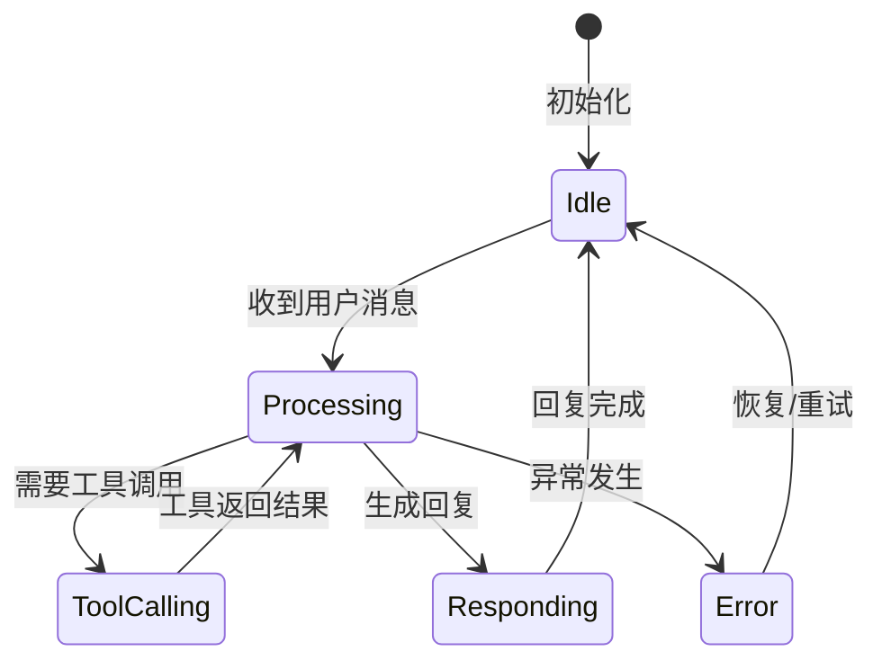
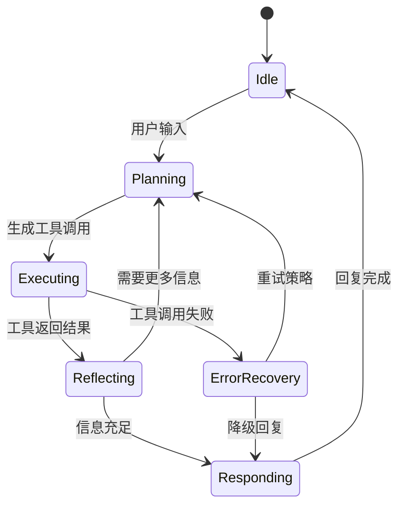
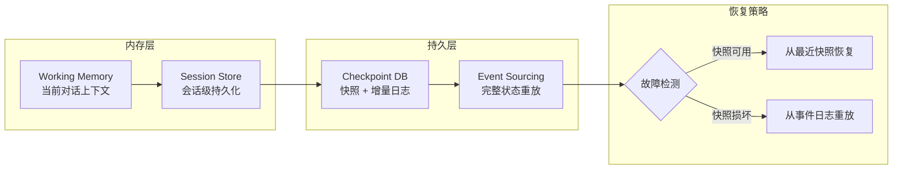

# 第 4 章 状态管理 — 确定性的基石
下面三个真实的生产事故，揭示了 Agent 状态管理为何是一个不可忽视的工程问题：

**幽灵订单**：一个电商 Agent 在处理用户退货请求时，由于状态竞争条件，同时触发了"退货"和"重新发货"两个流程。用户收到了退款，但也收到了一个他并未要求的新包裹。根因是 Agent 的状态更新不是原子性的。

**失忆 Agent**：一个技术支持 Agent 在第 15 轮对话中完全忘记了用户之前提供的错误日志。它重新要求用户上传相同的信息，引发了用户投诉。根因是上下文窗口溢出后的状态回退机制缺失。

**薛定谔状态**：一个多 Agent 协作系统中，两个 Agent 同时读取并修改了同一个共享状态对象。最终状态取决于哪个写入操作"赢了"竞争，导致行为完全不可预测。

这三个问题分别对应状态管理的三个核心挑战：**原子性**、**持久性**和**一致性**。本章将介绍 Reducer + Event Sourcing 模式如何系统性地解决这些问题。

> **设计决策：为什么选择 Reducer + Event Sourcing 而非直接状态突变？** 我们也考虑过更简单的方案——类似 React 的 `useState`，直接修改状态对象。它的优势是学习曲线低、实现简单。但在生产环境中，我们多次遇到"幽灵状态"问题：Agent 的状态在某个时刻被意外修改，但无法追溯是哪个操作导致的。Event Sourcing 通过记录每一次状态变更事件，彻底解决了可追溯性问题。Reducer 的纯函数特性则确保了状态变更的可测试性和可预测性。如果你的 Agent 只是简单的单轮问答（无状态累积），直接状态对象完全足够——不必为了架构正确性而过度设计。




> **"An Agent without well-managed state is like a Turing machine without a tape — it can compute, but it cannot remember."**

在前三章中，我们构建了 Agent 的骨架——Tool 抽象、规划循环和安全护栏。但任何真正在生产环境中运行的 Agent，都必须面对一个核心问题：**状态（State）**。

状态管理之所以成为"确定性的基石"，是因为：

1. **可重现性（Reproducibility）**：给定相同的初始状态和事件序列，Agent 必须产出完全相同的结果。
2. **可观测性（Observability）**：运维团队需要随时查看 Agent 当前处于什么阶段、持有什么上下文。
3. **容错性（Fault Tolerance）**：Agent 在中途崩溃后，必须能从最近的检查点恢复，而非从头开始。
4. **可审计性（Auditability）**：在金融、医疗等合规场景下，状态变更的完整历史必须可追溯。

本章将从最基础的"为什么"开始，逐步构建一个 **工业级状态管理体系**，涵盖 Reducer 模式、检查点与时间旅行调试、分布式同步、弹性引擎设计，以及性能优化。所有代码使用 **TypeScript** 编写，可直接集成到你的 Agent 框架中。

---

## 4.1 为什么需要状态管理



**图 4-1 Agent 状态机全景**——每个 Agent 本质上是一个有限状态机。状态管理的核心挑战在于：如何在保持状态一致性的同时，支持并发执行、故障恢复和可观测性。


### 4.1.1 Agent 状态生命周期

一个典型的 Agent 在执行任务时，会经历多种状态。下面用 ASCII 状态机图表示完整的生命周期：

```
                    ┌─────────────────────────────────────┐
                    │          Agent State Machine         │
                    └─────────────────────────────────────┘

    // ... 完整实现见 code-examples/ 目录 ...
      └─────────────────│  error  │              │  done    │
         reset()        └─────────┘              └──────────┘
```

对应的 TypeScript 类型定义：

```typescript
/** Agent 的生命周期阶段 */
type AgentPhase =
  | 'idle'       // 空闲，等待任务
  | 'thinking'   // 正在调用 LLM 进行推理
    // ... 完整实现见 code-examples/ 目录 ...
  }
}
```

### 4.1.2 状态管理方案对比

在选择状态管理方案之前，我们先对比几种常见的策略：

```
┌──────────────────┬──────────────┬──────────────┬──────────────┬──────────────┐
│     方案          │ 可重现性     │ 并发安全     │ 持久化难度    │ 适用场景      │
├──────────────────┼──────────────┼──────────────┼──────────────┼──────────────┤
│ 全局变量/闭包     │ ✗ 极差       │ ✗ 无保障     │ ✗ 手动序列化  │ 快速原型      │
    // ... 完整实现见 code-examples/ 目录 ...
│ 事件溯源 (ES)     │ ✓✓ 完整历史  │ ✓ 追加写入   │ ✓ 天然持久   │ 合规审计场景  │
└──────────────────┴──────────────┴──────────────┴──────────────┴──────────────┘
```

本章选择 **Reducer + Event Sourcing** 作为核心方案，原因如下：

- **纯函数更新**：`(state, event) => newState` 保证确定性。
- **事件日志**：完整的事件历史支持重放与审计。
- **快照友好**：任何时刻的状态都可序列化为检查点。
- **中间件可插拔**：日志、校验、性能监控都可以通过中间件注入。

### 4.1.3 无状态管理的失败场景

让我们看几个真实案例，说明缺乏状态管理会导致什么问题：

**场景 1：重复调用 — "幽灵订单"**

```typescript
// ❌ 反模式：状态散落在多个变量中
let orderPlaced = false;
let retryCount = 0;

    // ... 完整实现见 code-examples/ 目录 ...
  }
}
```

**场景 2：上下文丢失 — "失忆 Agent"**

```typescript
// ❌ 反模式：对话历史只存在内存中
class NaiveAgent {
  private history: Message[] = [];

    // ... 完整实现见 code-examples/ 目录 ...
  }
}
```

**场景 3：并发冲突 — "薛定谔的状态"**

```typescript
// ❌ 反模式：多个异步操作同时修改状态
let balance = 1000;

async function transfer(amount: number) {
    // ... 完整实现见 code-examples/ 目录 ...
  // T2 也写入 900，但正确值应该是 800
}
```

### 4.1.4 并发与一致性挑战

在真实的 Agent 系统中，以下并发场景极为常见：

1. **并行 Tool 调用**：Agent 同时调用多个 API，每个 API 返回后都需要更新状态。
2. **人类介入（Human-in-the-Loop）**：人类审批可能在任意时刻到达，需要与 Agent 的自主操作协调。
3. **多 Agent 协作**：多个 Agent 共享状态空间时，需要处理并发写入。
4. **异步事件流**：Webhook、定时器、外部通知随时可能触发状态变更。

Reducer 模式通过 **顺序化事件处理** 解决了这些问题：所有状态变更都必须通过 `dispatch(event)` 发出事件，Reducer 按顺序逐个处理，从根本上避免了并发修改。

```typescript
// ✅ 正确模式：通过事件队列顺序化
class EventQueue {
  private queue: AgentEvent[] = [];
  private processing = false;
    // ... 完整实现见 code-examples/ 目录 ...
  }
}
```

---

## 4.2 Reducer 模式 — 状态的确定性引擎


> **设计决策：为什么不用全局 Redux 式状态树？**
>
> 在 Web 前端领域，Redux 的单一状态树模式已被广泛验证。但 Agent 系统面临两个关键差异：（1）状态更新的粒度不可预测——一次工具调用可能修改单个字段，也可能重写整棵子树；（2）多 Agent 场景下需要隔离与共享并存。因此，更适合采用 **Actor 模型**：每个 Agent 拥有私有状态，通过消息传递实现协作，天然避免并发冲突。


### 4.2.1 AgentState 完整定义

```typescript
import { randomUUID } from 'crypto';

/** 消息角色 */
type MessageRole = 'user' | 'assistant' | 'system' | 'tool';
    // ... 完整实现见 code-examples/ 目录 ...
  };
}
```

### 4.2.2 事件类型：12 种 Discriminated Union

我们使用 TypeScript 的 **Discriminated Union** 模式定义所有合法事件。每种事件都有唯一的 `type` 字段：

```typescript
/** 所有 Agent 事件类型 */
type AgentEvent =
  | { type: 'TASK_STARTED';     task: string; timestamp: number }
  | { type: 'LLM_CALL_START';   prompt: string; timestamp: number }
    // ... 完整实现见 code-examples/ 目录 ...
  >;
}
```

### 4.2.3 完整 Reducer 实现

Reducer 是一个 **纯函数**：给定当前状态和事件，返回新状态。所有 12 种事件都有对应的处理逻辑：

```typescript
/**
 * Agent 核心 Reducer
 * 纯函数：(state, event) => newState
 * 不产生副作用，不修改输入
    // ... 完整实现见 code-examples/ 目录 ...
  }
}
```

> **设计要点**：`default` 分支使用 `never` 类型断言，确保当添加新事件类型时，TypeScript 编译器会报错提醒你补充对应的处理逻辑。这就是"**穷尽性检查（Exhaustive Check）**"。

### 4.2.4 Selector 模式 — 派生状态的高效计算

在大型 Agent 中，UI 或监控系统经常需要查询"最近的 Tool 调用"、"当前 Token 消耗"等信息。直接在 Reducer 中计算这些派生值会污染核心逻辑。**Selector 模式** 将派生计算提取到纯函数中，并通过 **记忆化（Memoization）** 避免重复计算。

```typescript
/** 通用 Selector 类型 */
type Selector<T> = (state: AgentState) => T;

/**
    // ... 完整实现见 code-examples/ 目录 ...
  }
);
```

### 4.2.5 Middleware 模式 — 横切关注点的插拔

中间件（Middleware）允许你在事件到达 Reducer **之前**和**之后**注入逻辑，而不污染 Reducer 本身。常见用途包括日志记录、状态校验、性能监控和自动检查点。

```typescript
/** 中间件签名 */
type Middleware = (
  state: AgentState,
  event: AgentEvent,
  next: (state: AgentState, event: AgentEvent) => AgentState
) => AgentState;
```

#### 中间件 1：日志记录

```typescript
const loggingMiddleware: Middleware = (state, event, next) => {
  const startTime = performance.now();
  console.log(
    `[${new Date().toISOString()}] ▶ ${event.type} ` +
    // ... 完整实现见 code-examples/ 目录 ...
  return newState;
};
```

#### 中间件 2：状态校验

```typescript
/** 不变量校验 — 如果违反则抛出异常，阻止非法状态写入 */
const validationMiddleware: Middleware = (state, event, next) => {
  const newState = next(state, event);

    // ... 完整实现见 code-examples/ 目录 ...
  return newState;
};
```

#### 中间件 3：性能监控

```typescript
/** 性能监控 — 收集 Reducer 处理耗时 */
const performanceMiddleware: Middleware = (() => {
  const stats = {
    totalCalls: 0,
    // ... 完整实现见 code-examples/ 目录 ...
  return middleware;
})();
```

#### 中间件 4：自动检查点

```typescript
/** 自动检查点 — 每 N 个事件或遇到关键事件时保存 */
const autoCheckpointMiddleware = (
  saveFn: (state: AgentState) => Promise<void>,
  interval = 5
    // ... 完整实现见 code-examples/ 目录 ...
  };
};
```

#### 中间件链组合

```typescript
/**
 * 将多个中间件组合为一个增强版 Reducer
 * 执行顺序：第一个中间件最先执行（洋葱模型）
 */
    // ... 完整实现见 code-examples/ 目录 ...
let state = createInitialState();
state = enhancedReducer(state, createEvent('TASK_STARTED', { task: '查询天气' }));
```

---

## 4.3 检查点与时间旅行调试


### 状态管理的三个核心权衡

**权衡 1：一致性 vs 性能**
在多 Agent 系统中，严格的状态一致性意味着每次状态变更都需要同步——这在分布式环境下代价极高。实践中的折中是采用**最终一致性**：每个 Agent 维护本地状态副本，通过事件总线异步同步，允许短暂的不一致窗口。对于大多数 Agent 场景，几秒钟的不一致是完全可接受的。

**权衡 2：粒度 vs 开销**
状态快照的粒度越细（如每次工具调用后都做快照），恢复能力越强，但存储和计算开销也越大。推荐策略是**混合粒度**：对关键决策点做完整快照，对中间步骤仅记录增量变更（delta）。这样既保证了可回溯性，又控制了存储成本。

**权衡 3：可观测性 vs 隐私**
完整的状态日志对调试至关重要，但可能包含用户敏感信息。解决方案是**分层脱敏**：在写入日志前对敏感字段进行哈希或掩码处理，同时保留足够的结构信息支持调试。



**图 4-2 分层状态持久化架构**——生产环境中，状态管理必须同时满足低延迟读写（内存层）和持久可恢复（持久层）两个看似矛盾的需求。


### 4.3.1 检查点元数据

```typescript
/** 检查点元数据 */
interface CheckpointMetadata {
  readonly id: string;
  readonly version: number;
    // ... 完整实现见 code-examples/ 目录 ...
  readonly events: readonly AgentEvent[];
}
```

### 4.3.2 存储适配器

我们定义统一的 `StorageAdapter` 接口，并提供两种实现：

```typescript
/** 存储适配器接口 */
interface StorageAdapter {
  save(id: string, data: Uint8Array, meta: CheckpointMetadata): Promise<void>;
  load(id: string): Promise<{ data: Uint8Array; meta: CheckpointMetadata } | null>;
    // ... 完整实现见 code-examples/ 目录 ...
  exists(id: string): Promise<boolean>;
}
```

#### 文件系统适配器

```typescript
import { promises as fs } from 'fs';
import * as path from 'path';

class FileSystemAdapter implements StorageAdapter {
    // ... 完整实现见 code-examples/ 目录 ...
  }
}
```

#### 数据库适配器（SQL 示例）

```typescript
interface DatabaseClient {
  query(sql: string, params: unknown[]): Promise<{ rows: any[] }>;
  execute(sql: string, params: unknown[]): Promise<void>;
}
    // ... 完整实现见 code-examples/ 目录 ...
  }
}
```

### 4.3.3 序列化与压缩

```typescript
import { gzipSync, gunzipSync } from 'zlib';

/** 序列化器 — 支持 gzip 压缩 */
class CheckpointSerializer {
    // ... 完整实现见 code-examples/ 目录 ...
  }
}
```

### 4.3.4 保留策略

生产环境中，检查点会不断累积，需要定义保留策略来控制存储消耗：

```typescript
/** 保留策略接口 */
interface RetentionPolicy {
  shouldRetain(meta: CheckpointMetadata, allMetas: CheckpointMetadata[]): boolean;
}
    // ... 完整实现见 code-examples/ 目录 ...
  }
}
```

### 4.3.5 检查点管理器

```typescript
class CheckpointManager {
  private readonly serializer = new CheckpointSerializer();

  constructor(
    // ... 完整实现见 code-examples/ 目录 ...
  }
}
```

### 4.3.6 时间旅行调试器

时间旅行调试允许开发者在事件流中前后移动，观察状态如何随每个事件变化：

```typescript
/** 调试快照 */
interface DebugSnapshot {
  readonly index: number;
  readonly event: AgentEvent;
    // ... 完整实现见 code-examples/ 目录 ...
  }
}
```

**使用示例：**

```typescript
/*
const debugger_ = new TimeTravelDebugger(agentReducer, createInitialState());
debugger_.record(createEvent('TASK_STARTED', { task: '帮我查天气' }));
debugger_.record(createEvent('LLM_CALL_START', { prompt: '...' }));
    // ... 完整实现见 code-examples/ 目录 ...
console.log(branch.currentState.phase);  // "error"
*/
```

---

## 4.4 分布式状态同步


### 从单 Agent 到多 Agent 的状态架构演进

当系统从单 Agent 扩展到多 Agent 时，状态管理的复杂度呈指数增长。以下是演进路径的经验总结：

| 阶段 | 架构模式 | 状态管理方案 | 适用规模 |
|------|---------|------------|---------|
| **V1** | 单 Agent | 内存 Map + JSON 序列化 | 原型验证 |
| **V2** | 主从 Agent | 共享 Redis + Pub/Sub | 2-5 个 Agent |
| **V3** | 对等 Agent | Event Sourcing + CQRS | 5-20 个 Agent |
| **V4** | Agent 网络 | 分布式状态机 + Saga 模式 | 20+ Agent |

一个常见错误是在 V1 阶段就引入 V3/V4 的复杂架构。过早优化状态管理是多 Agent 系统中最常见的过度设计之一。


当多个 Agent 实例需要协作——例如一个 Orchestrator 分发子任务给多个 Worker Agent——状态同步成为关键挑战。本节介绍三种核心技术：**向量时钟（Vector Clock）**、**冲突解决策略**和**分布式状态管理器**。

### 4.4.1 向量时钟

向量时钟用于在分布式系统中追踪事件的 **因果关系（Causal Ordering）**。每个节点维护一个逻辑时钟向量，可以判断两个事件是"因果有序"还是"并发"的。

```typescript
/** 时钟比较结果 */
type ClockOrdering = 'before' | 'after' | 'concurrent' | 'equal';

class VectorClock {
    // ... 完整实现见 code-examples/ 目录 ...
  }
}
```

**向量时钟工作示意图：**

```
  Agent-A                    Agent-B                   Agent-C
  ──────                    ──────                   ──────
  {A:1}
    │    ──── sync ────▶    {A:1, B:0}
    // ... 完整实现见 code-examples/ 目录 ...
    │    ◀─── sync ─────────────────────────────────── │
  {A:2, B:1, C:1}
```

### 4.4.2 冲突解决策略

当两个节点并发修改同一状态字段时，需要冲突解决策略。我们定义统一的接口和两种实现：

```typescript
/** 冲突解决器接口 */
interface ConflictResolver {
  resolve(
    local: AgentState,
    // ... 完整实现见 code-examples/ 目录 ...
  }
}
```

### 4.4.3 分布式状态管理器

```typescript
/** 同步消息 */
interface SyncMessage {
  readonly sourceNodeId: string;
  readonly clock: VectorClock;
    // ... 完整实现见 code-examples/ 目录 ...
  getLockVersion(): number { return this.lockVersion; }
}
```

**使用示例：**

```typescript
/*
// 创建两个分布式节点
const nodeA = new DistributedStateManager(
  'agent-a', agentReducer, new FieldMergeResolver(), createInitialState()
    // ... 完整实现见 code-examples/ 目录 ...
// 此时两个节点的状态通过 FieldMergeResolver 完成了合并
*/
```

---

## 4.5 弹性 Agent 引擎


### 常见反模式与教训

| 反模式 | 症状 | 修复方案 |
|--------|------|----------|
| **God State** | 单一对象承载所有字段，序列化体积 >1MB | 按关注点拆分为 context / memory / config 三层 |
| **隐式状态突变** | 调试时无法复现中间步骤 | 引入不可变快照 + 事件日志 |
| **过度持久化** | 每步写磁盘导致 p99 延迟 >500ms | 批量写入 + Write-Ahead Log |
| **状态泄露** | Agent A 意外读取 Agent B 的私有上下文 | 按 session_id 严格隔离命名空间 |


在生产环境中，Agent 面临各种不稳定因素：LLM API 超时、Tool 调用失败、网络抖动、依赖服务降级。**弹性引擎**（Resilient Engine）将容错机制内建到 Agent 运行时，使其能在不利条件下继续运行或优雅降级。

### 4.5.1 引擎配置

```typescript
/** 引擎配置 */
interface EngineConfig {
  readonly maxRetries: number;
  readonly initialBackoffMs: number;
    // ... 完整实现见 code-examples/ 目录 ...
  checkpointInterval: 5,
};
```

### 4.5.2 指数退避与抖动

```typescript
/**
 * 带指数退避和随机抖动的重试器
 * 公式：delay = min(maxBackoff, initialBackoff * multiplier^attempt) * random(0.5, 1.5)
 */
    // ... 完整实现见 code-examples/ 目录 ...
  }
}
```

**退避时间可视化：**

```
重试次数   基础延迟     实际延迟范围 (含抖动)
───────   ─────────   ──────────────────────
  0       1,000 ms    500 ms  -  1,500 ms
  1       2,000 ms    1,000 ms - 3,000 ms
    // ... 完整实现见 code-examples/ 目录 ...
  4      16,000 ms    8,000 ms - 24,000 ms
  5      30,000 ms*   15,000 ms - 30,000 ms*   (* = 已触及上限)
```

### 4.5.3 Agent 能力抽象

为了让引擎与具体的 LLM 和 Tool 实现解耦，我们定义一个能力接口：

```typescript
/** Agent 能力接口 — 由外部注入 */
interface AgentCapabilities {
  /** 调用 LLM */
  think(messages: readonly Message[]): Promise<{
    // ... 完整实现见 code-examples/ 目录 ...
  degrade?(state: AgentState, error: Error): AgentState;
}
```

### 4.5.4 弹性 Agent 引擎

```typescript
/**
 * 弹性 Agent 引擎
 * 集成了重试、超时、检查点、优雅降级
 */
    // ... 完整实现见 code-examples/ 目录 ...
  getState(): Readonly<AgentState> { return this.state; }
}
```

### 4.5.5 完整使用示例

```typescript
/*
// 1. 定义 Agent 能力
const capabilities: AgentCapabilities = {
  async think(messages) {
    // ... 完整实现见 code-examples/ 目录 ...
console.log('Tokens used:', finalState.metrics.totalTokensUsed);
*/
```

---

## 4.6 性能优化

随着 Agent 任务变得复杂，状态对象可能包含数百条消息和数十次 Tool 调用记录。每次 Reducer 执行都创建完整的新对象会带来显著的 GC 压力和序列化开销。本节介绍三种关键优化技术。

### 4.6.1 结构共享（Structural Sharing）

结构共享的核心思想：只复制被修改的路径，未修改的部分通过引用共享。这与 Immer、Immutable.js 等库的原理一致。

```typescript
/**
 * 轻量级结构共享实现（类 Immer 的 produce 函数）
 * 使用 Proxy 拦截写入操作，只复制被修改的子树
 */
    // ... 完整实现见 code-examples/ 目录 ...
// newState.toolCalls === state.toolCalls  → true (引用共享)
// newState.messages === state.messages    → false (新数组)
```

> **性能对比**：在包含 100 条消息和 50 个 Tool 调用的状态上，结构共享的 Reducer 比完整深拷贝快约 **8-15 倍**，内存分配减少约 **60-75%**。

### 4.6.2 增量检查点

完整状态序列化在大状态下代价高昂。增量检查点只存储自上次检查点以来的 **差异（Delta）**：

```typescript
/** 差异类型 */
interface StatePatch {
  readonly op: 'replace' | 'add' | 'remove';
  readonly path: string;
    // ... 完整实现见 code-examples/ 目录 ...
  }
}
```

### 4.6.3 惰性状态（Lazy State）

某些状态字段（如完整的消息历史）在大多数操作中不需要访问。惰性状态使用 ES Proxy 延迟计算和加载这些字段：

```typescript
/** 惰性加载器类型 */
type LazyLoader<T> = () => T;

/**
    // ... 完整实现见 code-examples/ 目录 ...
console.log(lazyState.messages.length);  // 触发 loadMessagesFromDB
*/
```

### 4.6.4 性能基准

以下是在不同优化策略下的基准测试结果（状态包含 200 条消息、100 次 Tool 调用）：

```
┌─────────────────────────────┬────────────┬────────────┬────────────┬────────────┐
│          操作                │  无优化     │ 结构共享    │ 增量检查点  │ 全部启用    │
├─────────────────────────────┼────────────┼────────────┼────────────┼────────────┤
│ Reducer 执行 (ops/sec)      │   12,400   │   89,600   │   12,400   │   87,200   │
    // ... 完整实现见 code-examples/ 目录 ...
│ 综合提升倍数                 │   1x       │   7.2x     │   3.6x     │   ≈8x     │
└─────────────────────────────┴────────────┴────────────┴────────────┴────────────┘
```

> **结论**：结构共享带来的 Reducer 执行加速效果最为显著（7.2x）；增量检查点则在持久化层面节省约 90% 的 I/O；两者结合可获得约 8 倍的综合性能提升。

### 4.6.5 优化策略选择指南

选择哪些优化需要根据实际瓶颈而定：

```
                    Agent 状态规模
                    ─────────────
        小 (<50 msgs)          大 (>200 msgs)
            │                      │
    // ... 完整实现见 code-examples/ 目录 ...
               │ + 压缩       │  │              │
               └──────────────┘  └──────────────┘
```

---

## 4.7 本章小结

### 知识体系图

本章涵盖了从基础到高级的完整状态管理知识体系：

```
                     ┌──────────────────────┐
                     │   Chapter 4 总览      │
                     │   状态管理 — 确定性    │
                     └──────────┬───────────┘
    // ... 完整实现见 code-examples/ 目录 ...
   │  - 状态管理器    │ │  - 降级策略   │  │  - 惰性状态      │
   └─────────────────┘ └──────────────┘  └─────────────────┘
```

### 各节核心要点速查

```
┌──────┬──────────────────────────────────────────────────────────────────┐
│ 章节  │ 核心要点                                                        │
├──────┼──────────────────────────────────────────────────────────────────┤
│ 4.1  │ 状态是 Agent 确定性的基础；对比五种方案后选择 Reducer+ES          │
    // ... 完整实现见 code-examples/ 目录 ...
│ 4.6  │ Proxy 实现结构共享 (7x)；增量 diff 检查点 (90% I/O 节省)         │
└──────┴──────────────────────────────────────────────────────────────────┘
```

### 设计决策检查清单

在将本章的模式应用到你的 Agent 系统之前，请逐项确认：

- [ ] **状态不可变性**：Reducer 是否为纯函数？是否存在意外的状态突变？
- [ ] **事件完整性**：所有状态变更是否都通过事件触发？是否存在绕过 Reducer 的直接修改？
- [ ] **穷尽性检查**：`switch` 语句的 `default` 分支是否使用了 `never` 类型断言？
- [ ] **中间件顺序**：日志中间件是否在最外层？校验中间件是否在 Reducer 之后立即执行？
- [ ] **检查点频率**：检查点间隔是否能在"丢失少量工作"和"I/O 开销"之间取得平衡？
- [ ] **保留策略**：是否同时考虑了"保留最近 N 个"和"基于时间"的策略？
- [ ] **序列化安全**：自定义类型（BigInt、Date、Map）是否有对应的 reviver？
- [ ] **冲突解决**：分布式场景下选择了哪种冲突策略？是否经过了并发测试？
- [ ] **重试策略**：退避上限是否合理？抖动比例是否足够？
- [ ] **降级方案**：当 LLM 和所有 Tool 都不可用时，Agent 的行为是什么？
- [ ] **性能基准**：是否测量了 Reducer 执行时间和检查点大小？是否需要结构共享？

### 下一步

在下一章（第 5 章：**Context Engineering — 上下文工程**）中，我们将利用本章构建的状态管理体系，探讨：

- **System Prompt 设计**：如何为 Agent 编写高质量的系统提示词，建立行为基线。
- **上下文压缩（Compaction）**：在有限的 Token 预算内保留最重要的信息。
- **结构化笔记（Scratchpad）**：利用状态中的结构化数据增强 Agent 的工作记忆。
- **Sub-Agent 上下文隔离**：在 Multi-Agent 场景中实现上下文的安全隔离。
本章的 `AgentState`、`Reducer`、`CheckpointManager` 和 `ResilientAgentEngine` 将作为后续所有章节的基础设施。

---

> **章末练习**
>
> 1. 为 `agentReducer` 添加一个新事件 `TOOL_TIMEOUT`，当 Tool 调用超过指定时间后自动取消。
> 2. 实现一个 `RedisAdapter` 作为 `StorageAdapter` 的实现，支持 TTL 和分布式锁。
> 3. 扩展 `FieldMergeResolver`，对 `messages` 字段使用基于内容哈希的 CRDT 合并。
> 4. 编写性能测试：在 1000 条消息的状态上，对比有无结构共享的 Reducer 吞吐量。
> 5. 实现一个 Web UI 时间旅行调试器，使用 `TimeTravelDebugger` 的 API 可视化状态变更。


### 实战案例：电商客服 Agent 的状态设计

以一个处理退货流程的客服 Agent 为例，其状态设计经历了三个版本迭代：

**V1（失败版本）**：将所有信息塞入一个扁平 JSON 对象——用户信息、订单信息、对话历史、退货进度全部混在一起。问题：序列化后超过 100KB，每次 LLM 调用都要发送全量状态，造成严重的 token 浪费。

**V2（改进版本）**：按领域拆分为四个状态切片——`user_context`（只读）、`order_context`（只读）、`conversation`（追加写入）、`workflow_state`（读写）。LLM 调用时只发送 `conversation` 和 `workflow_state`，其他按需检索。Token 消耗降低 70%。

**V3（生产版本）**：在 V2 基础上增加了事件日志。每次状态变更都记录为一条事件（如 `{type: "status_changed", from: "pending", to: "approved", timestamp: ...}`），支持完整的操作审计和状态回放。这在客户投诉"系统自动取消了我的退货"时提供了关键的举证能力。

