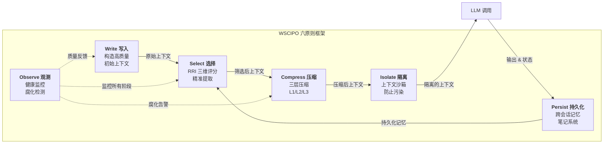
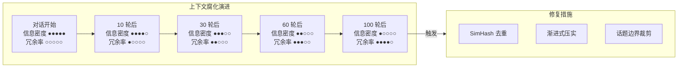
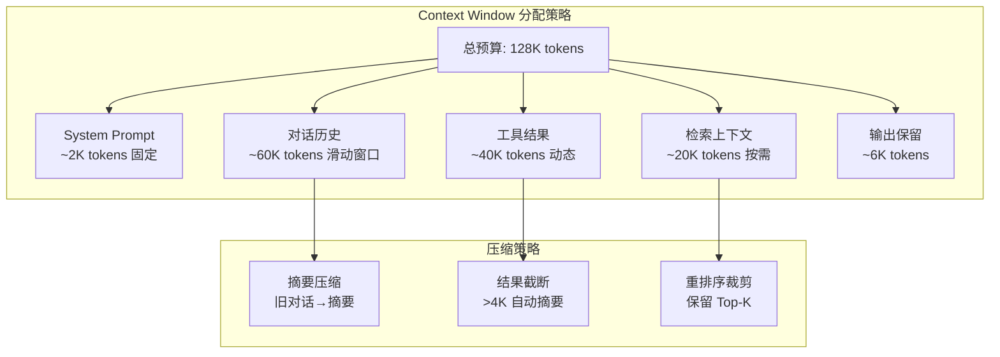
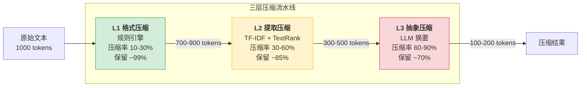
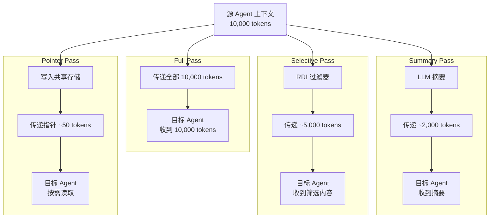
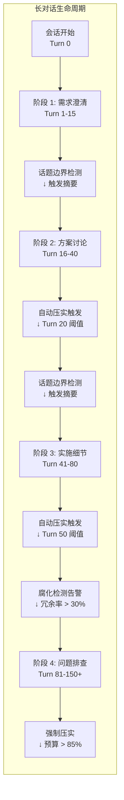

# 第 5 章 Context Engineering — 上下文工程

> **"The hottest new programming language is English — but the real skill is not writing prompts, it's engineering context."**
> — Andrej Karpathy, 2025

本章围绕上下文工程（Context Engineering）展开——构建优秀 Agent 的核心挑战，不是写一条"神奇 Prompt"，而是在正确的时间，将正确的信息放入 LLM 的上下文窗口。本章在现有实践经验的基础上，将上下文管理整理为 WSCIPO 六策略体系（Write、Select、Compress、Isolate、Persist、Observe），讨论上下文腐化（Context Rot）检测、多层压缩、结构化笔记（Structured Notes）和长对话管理等关键主题。前置依赖：第 3 章架构总览和第 4 章状态管理。

## 本章你将学到什么

1. 为什么 Prompt Engineering 不足以支撑生产级 Agent
2. 如何用 WSCIPO 框架系统化管理上下文
3. 如何判断"该写入什么、该丢弃什么、该压缩什么"
4. 如何把上下文问题转化为可监控、可评估的工程问题

## 一个先记住的原则

> 上下文工程的本质，不是"塞进更多信息"，而是"控制信息进入模型的方式、时机和成本"。

---

## 5.1 上下文工程的六大原则

上下文工程不是一项单一技术，而是一套涵盖 **写入、选择、压缩、隔离、持久化、观测** 的系统工程。为避免把上下文问题拆成零散技巧，本章将其整理为 **WSCIPO** 框架。你可以把它理解为一个面向工程实现的检查清单：

| 原则 | 英文 | 核心问题 | 关键指标 |
|------|------|---------|---------|
| 写入 | **W**rite | 如何构造高质量的初始上下文？ | 信噪比、格式一致性 |
| 选择 | **S**elect | 哪些信息值得放入有限窗口？ | 召回率、精准率 |
| 压缩 | **C**ompress | 如何在保留语义的前提下缩减 token？ | 压缩率、信息保留度 |
| 隔离 | **I**solate | 多 Agent 并行时如何防止上下文污染？ | 隔离度、共享效率 |
| 持久化 | **P**ersist | 如何跨会话保存和恢复关键上下文？ | 检索准确率、存储成本 |
| 观测 | **O**bserve | 如何实时监控上下文质量并预警？ | 健康分、异常检出率 |

> **WSCIPO 框架溯源**：LangChain 将上下文工程归纳为 Write/Select/Compress/Isolate 四大策略（WSCI），本书在此基础上增加 Persist（跨会话持久化）和 Observe（运行时可观测性），形成 WSCIPO 六原则框架，以覆盖生产环境中的完整需求。WSCI 聚焦于单次请求内的上下文优化，而 Persist 解决"Agent 如何记住上一次对话的关键结论"，Observe 解决"如何在线上及时发现上下文质量退化"。两个扩展原则是从生产事故中提炼出来的——缺少 Persist，Agent 每次会话从零开始；缺少 Observe，腐化问题在用户投诉后才被发现。

> **术语说明**：本书中 WSCIPO 专指 Context Engineering 的六原则框架（Write、Select、Compress、Isolate、Persist、Observe）。第 2 章中的认知架构模型使用"认知循环模型（Cognitive Loop）"命名，二者不同但互补——认知循环描述 Agent 的感知-思考-行动过程，WSCIPO 指导开发者如何工程化地管理上下文。


**图 5-1 WSCIPO 框架全景图**——六大原则形成一条从写入到观测的数据流水线。Write 生成原始上下文，经过 Select 筛选、Compress 压缩、Isolate 隔离后进入 LLM；LLM 输出经 Persist 持久化后回流为下一轮的候选上下文；Observe 贯穿全流程，持续监控每个阶段的质量指标。

### 5.1.1 Write — 写入：构建高质量初始上下文

写入是上下文工程的第一步。一个好的 System Prompt 不仅仅是"角色扮演"的开场白，更是整个 Agent 行为的锚定点。

#### System Prompt 的结构化设计

先给出一个重要提醒：**System Prompt 只是上下文工程的入口，不是上下文工程的全部。** 很多团队的问题不在于 System Prompt 写得不够"强"，而在于历史消息、工具输出、检索结果和运行时状态被无差别地塞进上下文。

在需要结构化约束时，我们推荐使用 **XML 标签** 来组织 System Prompt，因为：
1. XML 标签在大多数 LLM 中有良好的边界识别能力
2. 结构化格式便于程序化生成和解析
3. 层次化结构自然映射到上下文的逻辑分区

```typescript
// ===== System Prompt Builder =====
// 用 XML 标签构造结构化的 System Prompt

interface Persona {
  role: string;
  expertise: string[];
  tone: string;
}

interface PromptConfig {
  persona: Persona;
  instructions: string[];
  tools: Array<{ name: string; description: string; parameters: string }>;
  examples: Array<{ input: string; output: string }>;
  constraints: string[];
}

class SystemPromptBuilder {
  private config: PromptConfig;

  constructor(config: PromptConfig) {
    this.config = config;
  }

  build(): string {
    const sections: string[] = [];

    // Persona 区块
    sections.push(this.buildSection("persona", [
      `<role>${this.config.persona.role}</role>`,
      `<expertise>${this.config.persona.expertise.join(", ")}</expertise>`,
      `<tone>${this.config.persona.tone}</tone>`,
    ].join("\n")));

    // Instructions 区块
    const instrItems = this.config.instructions
      .map((inst, i) => `  <rule priority="${i + 1}">${inst}</rule>`)
      .join("\n");
    sections.push(this.buildSection("instructions", instrItems));

    // Tools 区块
    const toolItems = this.config.tools.map(t =>
      `  <tool name="${t.name}">\n    <desc>${t.description}</desc>\n    <params>${t.parameters}</params>\n  </tool>`
    ).join("\n");
    sections.push(this.buildSection("available_tools", toolItems));

    // Examples 区块（Few-shot）
    if (this.config.examples.length > 0) {
      const exItems = this.config.examples.map(ex =>
        `  <example>\n    <input>${ex.input}</input>\n    <output>${ex.output}</output>\n  </example>`
      ).join("\n");
      sections.push(this.buildSection("examples", exItems));
    }

    // Constraints 区块
    const conItems = this.config.constraints
      .map(c => `  <constraint>${c}</constraint>`).join("\n");
    sections.push(this.buildSection("constraints", conItems));

    return sections.join("\n\n");
  }

  private buildSection(tag: string, content: string): string {
    return `<${tag}>\n${content}\n</${tag}>`;
  }
}
```

> **设计要点**：XML 标签法的一个重要优势是**可组合性**。不同模块可以独立生成自己的 XML 片段，最终由 Builder 统一拼装。这避免了字符串拼接的混乱，也让 prompt 的版本管理变得可控。

#### Dynamic Context Injection — 动态上下文注入

System Prompt 解决了"静态上下文"的构建问题，但 Agent 系统还需要处理**动态信息**的注入——用户画像、实时数据、会话历史等。

```typescript
// ===== Dynamic Context Injector =====
// 将动态信息按优先级注入上下文窗口

interface ContextSource {
  name: string;
  priority: number;           // 1-10, 越高越重要
  maxTokens: number;          // 该来源的 token 上限
  fetch: () => Promise<string>;
}

class DynamicContextInjector {
  private sources: ContextSource[] = [];
  private totalBudget: number;

  constructor(totalBudget: number) {
    this.totalBudget = totalBudget;
  }

  register(source: ContextSource): void {
    this.sources.push(source);
    this.sources.sort((a, b) => b.priority - a.priority);
  }

  async inject(): Promise<string> {
    const parts: string[] = [];
    let remaining = this.totalBudget;

    for (const source of this.sources) {
      if (remaining <= 0) break;
      const content = await source.fetch();
      const tokens = estimateTokens(content);
      const allowed = Math.min(tokens, source.maxTokens, remaining);

      if (allowed > 0) {
        // 按允许的 token 数截断
        const truncated = content.slice(0, allowed * 4); // 粗略按字符截断
        parts.push(`<context source="${source.name}" priority="${source.priority}">\n${truncated}\n</context>`);
        remaining -= allowed;
      }
    }

    return parts.join("\n\n");
  }
}

/** 估算文本的 token 数（中英文混合） */
function estimateTokens(text: string): number {
  const chinese = (text.match(/[\u4e00-\u9fff]/g) || []).length;
  const other = text.length - chinese;
  return Math.ceil(chinese / 1.5 + other / 4);
}
```

### 5.1.2 Select — 选择：从海量信息中精准提取

当可用上下文远超模型窗口容量时，**选择** 成为关键。这里最常见的失败模式不是"召回不够多"，而是"把不该放进去的信息也放进去了"。选择策略需要综合考虑三个维度：**相关性**（Relevance）、**时效性**（Recency）和**重要性**（Importance）。

> **Lost-in-the-Middle 效应**：Liu et al. (2024) 发现 LLM 对上下文中间位置的信息利用效率显著低于首尾位置（"Lost-in-the-Middle"效应）。工程启示：关键信息应放置在上下文窗口的开头或末尾，避免被埋没在中间。在下方的 `ContextSelector` 实现中，我们在排序后会将最高分项移至首位，次高分项移至末位，以对抗这一效应。

```typescript
// ===== Context Selector =====
// 基于 RRI（Relevance-Recency-Importance）三维评分的上下文选择器

interface ContextItem {
  id: string;
  content: string;
  embedding: number[];
  timestamp: number;
  importance: number;          // 0-1, 预标注的重要性
  source: string;
}

interface RRIWeights {
  relevance: number;           // 语义相关性权重
  recency: number;             // 时效性权重
  importance: number;          // 重要性权重
}

class ContextSelector {
  private weights: RRIWeights;
  private maxItems: number;

  constructor(
    weights: RRIWeights = { relevance: 0.5, recency: 0.3, importance: 0.2 },
    maxItems: number = 20
  ) {
    this.weights = weights;
    this.maxItems = maxItems;
  }

  select(candidates: ContextItem[], queryEmbedding: number[], now: number): ContextItem[] {
    // 1. 计算 RRI 综合得分
    const scored = candidates.map(item => ({
      item,
      score: this.computeRRI(item, queryEmbedding, now),
    }));

    // 2. 按得分降序排列
    scored.sort((a, b) => b.score - a.score);

    // 3. 取 Top-K 并去重（基于内容相似度）
    const selected: typeof scored = [];
    for (const entry of scored) {
      if (selected.length >= this.maxItems) break;
      const isDuplicate = selected.some(s =>
        this.cosineSimilarity(s.item.embedding, entry.item.embedding) > 0.92
      );
      if (!isDuplicate) selected.push(entry);
    }

    // 4. Lost-in-the-Middle 重排：最高分首位，次高分末位
    if (selected.length > 2) {
      const reordered = [selected[0]];
      for (let i = 2; i < selected.length; i += 2) reordered.push(selected[i]);
      for (let i = selected.length % 2 === 0 ? selected.length - 1 : selected.length - 2; i >= 1; i -= 2) {
        reordered.push(selected[i]);
      }
      return reordered.map(s => s.item);
    }

    return selected.map(s => s.item);
  }

  private computeRRI(item: ContextItem, queryEmb: number[], now: number): number {
    const relevance = this.cosineSimilarity(item.embedding, queryEmb);
    const ageHours = (now - item.timestamp) / 3600000;
    const recency = 1 / (1 + Math.log1p(ageHours));  // 对数衰减
    const importance = item.importance;

    return (
      this.weights.relevance * relevance +
      this.weights.recency * recency +
      this.weights.importance * importance
    );
  }

  private cosineSimilarity(a: number[], b: number[]): number {
    let dotProduct = 0;
    let magnitudeA = 0;
    let magnitudeB = 0;
    for (let i = 0; i < a.length; i++) {
      dotProduct += a[i] * b[i];
      magnitudeA += a[i] * a[i];
      magnitudeB += b[i] * b[i];
    }
    magnitudeA = Math.sqrt(magnitudeA);
    magnitudeB = Math.sqrt(magnitudeB);
    return magnitudeA && magnitudeB ? dotProduct / (magnitudeA * magnitudeB) : 0;
  }
}
```

> **实践建议**：三个权重的初始值建议设为 `relevance: 0.5, recency: 0.3, importance: 0.2`，然后根据实际场景进行 A/B 测试微调。对于客服场景，时效性更重要；对于知识问答场景，相关性占主导。

### 5.1.3 Compress — 压缩：在保留语义的前提下缩减 token

压缩是上下文工程中投入产出比最高的环节。一个好的压缩策略可以在减少 50-70% token 消耗的同时，保留 90%+ 的任务相关信息。

```typescript
// ===== Compressor Interface =====
// 定义压缩器的统一接口

interface CompressResult {
  compressed: string;
  originalTokens: number;
  compressedTokens: number;
  ratio: number;                  // 压缩率 = 1 - compressedTokens/originalTokens
  infoRetention: number;          // 信息保留估计 (0-1)
}

interface Compressor {
  name: string;
  compress(text: string, targetTokens?: number): Promise<CompressResult>;
}

// L1 格式压缩示例（规则引擎，无 LLM 调用）
class L1FormatCompressor implements Compressor {
  name = "L1-Format";

  async compress(text: string): Promise<CompressResult> {
    const original = text;
    let result = text;

    // 移除连续空行（保留单个换行）
    result = result.replace(/\n{3,}/g, "\n\n");
    // 移除行尾空白
    result = result.replace(/[ \t]+$/gm, "");
    // 压缩连续空格为单个
    result = result.replace(/ {2,}/g, " ");
    // 移除 Markdown 注释
    result = result.replace(/<!--[\s\S]*?-->/g, "");
    // 移除空的列表项
    result = result.replace(/^[-*]\s*$/gm, "");

    const originalTokens = estimateTokens(original); // 复用上文的 estimateTokens
    const compressedTokens = estimateTokens(result);
    return {
      compressed: result,
      originalTokens,
      compressedTokens,
      ratio: 1 - compressedTokens / Math.max(originalTokens, 1),
      infoRetention: 0.99, // L1 几乎无损
    };
  }
}
```

> **三层压缩架构**将在 5.3 节详细展开，此处仅展示 L1 格式压缩作为示例。

### 5.1.4 Isolate — 隔离：多 Agent 上下文沙箱

在多 Agent 协作系统中，上下文隔离（Context Isolation）至关重要。如果子 Agent 能随意修改共享上下文，系统行为将变得不可预测。

```typescript
// ===== Context Sandbox =====
// 为子 Agent 提供隔离的上下文环境

enum IsolationPolicy {
  Full = "full",                  // 完全隔离，子 Agent 看不到父上下文
  SharedReadOnly = "shared_ro",   // 共享只读，子 Agent 可读不可写父上下文
  Selective = "selective",        // 选择性共享，按白名单共享指定字段
  SummaryOnly = "summary_only",   // 仅共享父上下文的摘要
}

class ContextSandbox {
  private parentContext: Map<string, string>;
  private localContext: Map<string, string> = new Map();
  private policy: IsolationPolicy;
  private whitelist: Set<string>;

  constructor(
    parentContext: Map<string, string>,
    policy: IsolationPolicy,
    whitelist: string[] = []
  ) {
    this.parentContext = parentContext;
    this.policy = policy;
    this.whitelist = new Set(whitelist);
  }

  /** 读取：根据隔离策略决定可见范围 */
  get(key: string): string | undefined {
    // 本地上下文始终可读
    if (this.localContext.has(key)) return this.localContext.get(key);

    switch (this.policy) {
      case IsolationPolicy.Full:
        return undefined; // 完全隔离，不可见
      case IsolationPolicy.SharedReadOnly:
        return this.parentContext.get(key);
      case IsolationPolicy.Selective:
        return this.whitelist.has(key) ? this.parentContext.get(key) : undefined;
      case IsolationPolicy.SummaryOnly:
        return key === "__summary__" ? this.parentContext.get(key) : undefined;
    }
  }

  /** 写入：始终写入本地上下文，不影响父上下文 */
  set(key: string, value: string): void {
    this.localContext.set(key, value);
  }

  /** 导出本地变更（用于 merge-back） */
  exportChanges(): Map<string, string> {
    return new Map(this.localContext);
  }
}
```

> **隔离策略选择指南**：
> - **Full**：用于安全敏感的子任务（如执行用户提交的代码）
> - **SharedReadOnly**：最常用，子 Agent 需要了解全局背景但不应修改
> - **Selective**：子 Agent 只需要特定信息（如只看到用户偏好设置）
> - **SummaryOnly**：子 Agent 任务独立，只需知道大致背景

### 5.1.5 Persist — 持久化：跨会话上下文管理

上下文不应随会话结束而消失。持久化机制让 Agent 能跨会话保持记忆、积累知识。

```typescript
// ===== Context Persistence Layer =====
// 跨会话的上下文存储和检索

interface NoteEntry {
  id: string;
  category: "fact" | "preference" | "decision" | "todo" | "insight";
  content: string;
  timestamp: number;
  sessionId: string;
  confidence: number;          // 置信度 0-1
}

interface VectorStore {
  upsert(id: string, embedding: number[], metadata: NoteEntry): Promise<void>;
  query(embedding: number[], topK: number): Promise<NoteEntry[]>;
}

class ContextPersistenceManager {
  private store: VectorStore;
  private embedder: (text: string) => Promise<number[]>;

  constructor(store: VectorStore, embedder: (text: string) => Promise<number[]>) {
    this.store = store;
    this.embedder = embedder;
  }

  /** 持久化一条笔记 */
  async persist(entry: NoteEntry): Promise<void> {
    const embedding = await this.embedder(entry.content);
    await this.store.upsert(entry.id, embedding, entry);
  }

  /** 语义检索相关笔记 */
  async recall(query: string, topK: number = 5): Promise<NoteEntry[]> {
    const queryEmb = await this.embedder(query);
    return this.store.query(queryEmb, topK);
  }

  /** 从 LLM 输出中自动提取可持久化的笔记 */
  async extractAndPersist(llmOutput: string, sessionId: string): Promise<NoteEntry[]> {
    const categories: Array<{ pattern: RegExp; category: NoteEntry["category"] }> = [
      { pattern: /(?:用户(?:说|提到|确认|要求))(.{10,80})/g, category: "fact" },
      { pattern: /(?:决定|确定|选择)(?:了|：)(.{10,80})/g, category: "decision" },
      { pattern: /(?:待办|TODO|需要(?:后续|之后))(.{10,80})/g, category: "todo" },
    ];

    const entries: NoteEntry[] = [];
    for (const { pattern, category } of categories) {
      let match: RegExpExecArray | null;
      while ((match = pattern.exec(llmOutput)) !== null) {
        const entry: NoteEntry = {
          id: `${sessionId}-${Date.now()}-${entries.length}`,
          category,
          content: match[1].trim(),
          timestamp: Date.now(),
          sessionId,
          confidence: 0.7,
        };
        await this.persist(entry);
        entries.push(entry);
      }
    }
    return entries;
  }
}
```

### 5.1.6 Observe — 观测：上下文质量的实时监控

上下文质量的退化是渐进式的，如果不加以观测，往往在问题严重时才被发现。我们需要一个持续运行的"上下文健康仪表板（Context Health Dashboard）"。

```typescript
// ===== Context Health Dashboard =====
// 上下文质量实时监控系统

interface ContextHealthMetrics {
  tokenUtilization: number;          // token 使用率 (0-1)
  informationDensity: number;        // 信息密度 (unique concepts / total tokens)
  redundancyRate: number;            // 冗余率 (重复信息占比)
  freshnessScore: number;            // 新鲜度 (基于时间戳)
  coherenceScore: number;            // 连贯性 (话题一致性)
}

interface HealthAlert {
  metric: keyof ContextHealthMetrics;
  value: number;
  threshold: number;
  severity: "info" | "warning" | "critical";
  suggestion: string;
}

class ContextHealthDashboard {
  private history: ContextHealthMetrics[] = [];
  private thresholds = {
    tokenUtilization: { warning: 0.8, critical: 0.95 },
    redundancyRate: { warning: 0.3, critical: 0.5 },
    freshnessScore: { warning: 0.4, critical: 0.2 },
    coherenceScore: { warning: 0.5, critical: 0.3 },
  };

  /** 采集一次健康指标快照 */
  measure(messages: Array<{ role: string; content: string; timestamp: number }>,
          totalBudget: number): ContextHealthMetrics {
    const allText = messages.map(m => m.content).join("\n");
    const totalTokens = estimateTokens(allText); // 复用上文的 estimateTokens

    // 信息密度：用唯一 3-gram 数量近似
    const trigrams = new Set<string>();
    const words = allText.split(/\s+/);
    for (let i = 0; i < words.length - 2; i++) {
      trigrams.add(words.slice(i, i + 3).join(" "));
    }
    const informationDensity = trigrams.size / Math.max(totalTokens, 1);

    // 冗余率：相邻消息的 Jaccard 相似度均值
    let totalSim = 0;
    let pairs = 0;
    for (let i = 1; i < messages.length; i++) {
      const setA = new Set(messages[i - 1].content.split(/\s+/));
      const setB = new Set(messages[i].content.split(/\s+/));
      const intersection = [...setA].filter(w => setB.has(w)).length;
      const union = new Set([...setA, ...setB]).size;
      totalSim += union > 0 ? intersection / union : 0;
      pairs++;
    }
    const redundancyRate = pairs > 0 ? totalSim / pairs : 0;

    // 新鲜度：基于最新消息的时间衰减
    const now = Date.now();
    const latest = Math.max(...messages.map(m => m.timestamp));
    const freshnessScore = 1 / (1 + (now - latest) / 3600000);

    // 连贯性：使用滑动窗口词汇重叠近似
    const coherenceScore = this.computeCoherence(messages);

    const metrics: ContextHealthMetrics = {
      tokenUtilization: totalTokens / Math.max(totalBudget, 1),
      informationDensity,
      redundancyRate,
      freshnessScore,
      coherenceScore,
    };
    this.history.push(metrics);
    return metrics;
  }

  /** 根据当前指标生成告警 */
  checkAlerts(metrics: ContextHealthMetrics): HealthAlert[] {
    const alerts: HealthAlert[] = [];
    for (const [key, bounds] of Object.entries(this.thresholds)) {
      const value = metrics[key as keyof ContextHealthMetrics];
      const isInverse = key === "freshnessScore" || key === "coherenceScore";
      const exceeded = isInverse ? value < bounds.critical : value > bounds.critical;
      const warned = isInverse ? value < bounds.warning : value > bounds.warning;

      if (exceeded) {
        alerts.push({ metric: key as keyof ContextHealthMetrics, value,
          threshold: bounds.critical, severity: "critical",
          suggestion: `${key} 已达临界值，建议立即触发压缩或裁剪` });
      } else if (warned) {
        alerts.push({ metric: key as keyof ContextHealthMetrics, value,
          threshold: bounds.warning, severity: "warning",
          suggestion: `${key} 接近阈值，建议启动 L1+L2 预防性压缩` });
      }
    }
    return alerts;
  }

  /** 趋势分析：计算最近 N 次快照的线性回归斜率 */
  trend(metric: keyof ContextHealthMetrics, windowSize: number = 10): number {
    const data = this.history.slice(-windowSize).map(h => h[metric]);
    if (data.length < 2) return 0;
    const n = data.length;
    let sumX = 0, sumY = 0, sumXY = 0, sumXX = 0;
    for (let i = 0; i < n; i++) {
      sumX += i; sumY += data[i]; sumXY += i * data[i]; sumXX += i * i;
    }
    const denom = n * sumXX - sumX * sumX;
    return denom === 0 ? 0 : (n * sumXY - sumX * sumY) / denom;
  }

  private computeCoherence(messages: Array<{ content: string }>): number {
    if (messages.length < 3) return 1;
    const windowSize = 3;
    let coherenceSum = 0;
    let count = 0;
    for (let i = windowSize; i < messages.length; i++) {
      const windowWords = new Set(
        messages.slice(i - windowSize, i).map(m => m.content).join(" ").split(/\s+/)
      );
      const currentWords = new Set(messages[i].content.split(/\s+/));
      const overlap = [...currentWords].filter(w => windowWords.has(w)).length;
      coherenceSum += overlap / Math.max(currentWords.size, 1);
      count++;
    }
    return count > 0 ? coherenceSum / count : 1;
  }
}
```

---

## 5.2 Context Rot — 上下文腐化检测

在实施压缩和管理策略之前，我们首先需要能够**检测**上下文的质量问题。正如软件工程中"你无法优化你没有测量的东西"，上下文工程同样需要先建立检测能力，才能有针对性地应用后续各节的压缩、笔记和长对话管理技术。本节讨论如何发现问题；5.3-5.6 节讨论如何解决问题。

随着对话轮次增加，上下文质量不可避免地退化——我们称之为**上下文腐化**（Context Rot）。腐化有多种表现形式：信息冗余堆积、事实相互矛盾、话题逐渐偏移、陈旧数据误导决策。及早检测腐化并采取修复措施，是保持 Agent 长期有效运行的关键。


**图 5-2 上下文腐化演进示意图**——随对话轮次增加，信息密度持续下降而冗余率持续上升。超过阈值后应自动触发去重、压实和裁剪等修复措施。

### 5.2.1 SimHash 近似去重

在长对话中，用户反复描述同一问题、Agent 反复输出类似建议，会造成严重的**信息冗余**。我们使用 SimHash 算法来高效检测近似重复内容。

SimHash 的核心思想：将文本映射为一个固定长度的二进制指纹，语义相似的文本产生相似的指纹。通过比较两个指纹的**汉明距离**（Hamming Distance，不同位数），可以快速判断文本是否为近似重复。

```typescript
// ===== SimHash 近似重复检测 =====

class SimHasher {
  private hashBits: number;

  constructor(hashBits: number = 64) {
    this.hashBits = hashBits;
  }

  /** 计算文本的 SimHash 指纹 */
  computeHash(text: string): bigint {
    const tokens = this.tokenize(text);
    // 初始化各位的权重向量
    const weights = new Array(this.hashBits).fill(0);

    for (const token of tokens) {
      const hash = this.fnv1aHash(token);
      for (let i = 0; i < this.hashBits; i++) {
        // 如果第 i 位为 1，权重 +1；否则 -1
        if ((hash >> BigInt(i)) & 1n) {
          weights[i] += 1;
        } else {
          weights[i] -= 1;
        }
      }
    }

    // 将权重向量转为二进制指纹：正值为 1，非正值为 0
    let fingerprint = 0n;
    for (let i = 0; i < this.hashBits; i++) {
      if (weights[i] > 0) {
        fingerprint |= 1n << BigInt(i);
      }
    }
    return fingerprint;
  }

  /** 计算两个指纹的汉明距离 */
  hammingDistance(a: bigint, b: bigint): number {
    let xor = a ^ b;
    let distance = 0;
    while (xor > 0n) {
      distance += Number(xor & 1n);
      xor >>= 1n;
    }
    return distance;
  }

  /** 判断两段文本是否为近似重复（汉明距离 <= 阈值） */
  isNearDuplicate(textA: string, textB: string, threshold: number = 3): boolean {
    const hashA = this.computeHash(textA);
    const hashB = this.computeHash(textB);
    return this.hammingDistance(hashA, hashB) <= threshold;
  }

  private tokenize(text: string): string[] {
    // 提取 2-gram 作为特征
    const cleaned = text.toLowerCase().replace(/[^\w\u4e00-\u9fff]+/g, " ").trim();
    const words = cleaned.split(/\s+/);
    const ngrams: string[] = [];
    for (let i = 0; i < words.length - 1; i++) {
      ngrams.push(words[i] + " " + words[i + 1]);
    }
    return ngrams;
  }

  private fnv1aHash(str: string): bigint {
    let hash = 0xcbf29ce484222325n; // FNV offset basis
    for (let i = 0; i < str.length; i++) {
      hash ^= BigInt(str.charCodeAt(i));
      hash = (hash * 0x100000001b3n) & ((1n << 64n) - 1n); // FNV prime, 保持 64 位
    }
    return hash;
  }
}
```

### 5.2.2 多维腐化检测器

仅靠去重不足以覆盖所有腐化类型。我们构建一个**多维检测器**，同时检测五种腐化模式：

| 腐化类型 | 检测方法 | 危害等级 |
|---------|---------|---------|
| 冗余堆积 | SimHash + Jaccard 相似度 | 中 |
| 事实矛盾 | 命题提取 + 语义对比 | 高 |
| 话题偏移 | 滑动窗口 embedding 距离 | 中 |
| 信息过时 | 时间戳 + 外部验证 | 高 |
| 注意力稀释 | 关键信息占比下降 | 中 |

```typescript
// ===== Context Rot Detector =====
// 五维上下文腐化检测

interface RotSignal {
  type: "redundancy" | "contradiction" | "drift" | "staleness" | "dilution";
  severity: number;          // 0-1
  evidence: string;
  recommendation: string;
}

class ContextRotDetector {
  private simHasher = new SimHasher();
  private redundancyThreshold: number;
  private driftThreshold: number;
  private stalenessMaxAge: number; // 毫秒

  constructor(config: {
    redundancyThreshold?: number;
    driftThreshold?: number;
    stalenessMaxAge?: number;
  } = {}) {
    this.redundancyThreshold = config.redundancyThreshold ?? 3;
    this.driftThreshold = config.driftThreshold ?? 0.7;
    this.stalenessMaxAge = config.stalenessMaxAge ?? 3600000; // 1 小时
  }

  /** 执行全维度检测 */
  detect(messages: Array<{ role: string; content: string; timestamp: number }>): RotSignal[] {
    const signals: RotSignal[] = [];
    signals.push(...this.detectRedundancy(messages));
    signals.push(...this.detectDrift(messages));
    signals.push(...this.detectStaleness(messages));
    signals.push(...this.detectDilution(messages));
    return signals;
  }

  /** 冗余检测：使用 SimHash 找出近似重复 */
  private detectRedundancy(messages: Array<{ content: string }>): RotSignal[] {
    const signals: RotSignal[] = [];
    for (let i = 0; i < messages.length; i++) {
      for (let j = i + 1; j < messages.length; j++) {
        if (this.simHasher.isNearDuplicate(
          messages[i].content, messages[j].content, this.redundancyThreshold
        )) {
          signals.push({
            type: "redundancy", severity: 0.6,
            evidence: `消息 #${i} 与 #${j} 近似重复`,
            recommendation: "合并或移除重复消息",
          });
        }
      }
    }
    return signals;
  }

  /** 话题偏移检测：通过滑动窗口词汇重叠度度量 */
  private detectDrift(messages: Array<{ content: string }>): RotSignal[] {
    if (messages.length < 6) return [];
    const windowSize = 3;
    const earlyWords = new Set(
      messages.slice(0, windowSize).map(m => m.content).join(" ").split(/\s+/)
    );
    const lateWords = new Set(
      messages.slice(-windowSize).map(m => m.content).join(" ").split(/\s+/)
    );
    const overlap = [...earlyWords].filter(w => lateWords.has(w)).length;
    const union = new Set([...earlyWords, ...lateWords]).size;
    const similarity = union > 0 ? overlap / union : 0;

    if (similarity < 1 - this.driftThreshold) {
      return [{
        type: "drift", severity: 1 - similarity,
        evidence: `早期与近期话题重叠度仅 ${(similarity * 100).toFixed(0)}%`,
        recommendation: "考虑插入话题摘要或重新锚定上下文",
      }];
    }
    return [];
  }

  /** 过时检测：找出时间戳过老的消息 */
  private detectStaleness(messages: Array<{ timestamp: number; content: string }>): RotSignal[] {
    const now = Date.now();
    return messages
      .filter(m => (now - m.timestamp) > this.stalenessMaxAge)
      .map(m => ({
        type: "staleness" as const, severity: Math.min((now - m.timestamp) / (this.stalenessMaxAge * 3), 1),
        evidence: `消息已过时 ${((now - m.timestamp) / 60000).toFixed(0)} 分钟`,
        recommendation: "验证信息是否仍然有效，或替换为最新数据",
      }));
  }

  /** 注意力稀释检测：关键信息在总上下文中的占比 */
  private detectDilution(messages: Array<{ role: string; content: string }>): RotSignal[] {
    const totalTokens = messages.reduce((sum, m) => sum + estimateTokens(m.content), 0); // 复用上文的 estimateTokens
    const userTokens = messages
      .filter(m => m.role === "user")
      .reduce((sum, m) => sum + estimateTokens(m.content), 0);
    const ratio = totalTokens > 0 ? userTokens / totalTokens : 0;

    // 如果用户的实际输入只占总上下文的很小比例，说明存在稀释
    if (ratio < 0.15 && messages.length > 10) {
      return [{
        type: "dilution", severity: 0.5 + (0.15 - ratio) * 3,
        evidence: `用户输入仅占上下文的 ${(ratio * 100).toFixed(0)}%`,
        recommendation: "压缩 Agent 输出和工具结果，提升信息密度",
      }];
    }
    return [];
  }

  /** 计算综合腐化分数 */
  overallScore(signals: RotSignal[]): number {
    if (signals.length === 0) return 0;
    const avgSeverity = signals.reduce((s, sig) => s + sig.severity, 0) / signals.length;
    const countFactor = Math.min(signals.length / 10, 1);
    return Math.min(avgSeverity * 0.7 + countFactor * 0.3, 1);
  }
}
```

> **实践经验**：在生产环境中，腐化检测应在每 N 轮对话后自动触发（推荐 N=5-10），而不是等到性能明显下降才处理。检测的开销很小（SimHash O(n)，矛盾检测 O(n^2)），但带来的质量收益是巨大的。

---

## 5.3 Three-Tier Compression — 三层压缩架构


**图 5-3 Context Window 预算分配与压缩策略**——Context 工程的核心是在有限的 token 预算内最大化信息密度。最常见的错误是将大量 token 浪费在低信息密度的历史消息上。


**图 5-4 三层压缩策略流水线**——L1（格式压缩）几乎无损且极快；L2（提取压缩）通过关键句提取实现中等压缩；L3（抽象压缩）借助 LLM 实现最高压缩率但有信息损失。三层可按需逐级启用。

压缩是对抗上下文窗口有限性的核心武器。我们设计了一个三层压缩架构，每一层在压缩率和信息保留度之间做不同的取舍：

| 层级 | 名称 | 方法 | 压缩率 | 信息保留 | 延迟 |
|------|------|------|--------|---------|------|
| L1 | 格式压缩 | 规则引擎 | 10-30% | ~99% | <1ms |
| L2 | 提取压缩 | TF-IDF + TextRank | 30-60% | ~85% | ~10ms |
| L3 | 抽象压缩 | LLM 摘要 | 60-90% | ~70% | ~1s |

### 5.3.1 L1 格式压缩 — 零损耗瘦身

L1 压缩只移除对语义无贡献的格式冗余。它的优势是**完全无损**且极快。

```typescript
// ===== L1 Format Compressor =====
// 无损格式压缩，移除不影响语义的冗余字符

class L1FormatCompressor {
  private rules: Array<{
    name: string;
    pattern: RegExp;
    replacement: string;
  }> = [
    { name: "collapse_newlines", pattern: /\n{3,}/g, replacement: "\n\n" },
    { name: "trim_trailing", pattern: /[ \t]+$/gm, replacement: "" },
    { name: "collapse_spaces", pattern: / {2,}/g, replacement: " " },
    { name: "remove_html_comments", pattern: /<!--[\s\S]*?-->/g, replacement: "" },
    { name: "remove_empty_list_items", pattern: /^[-*]\s*$/gm, replacement: "" },
    { name: "normalize_bullets", pattern: /^(\s*)[*+]\s/gm, replacement: "$1- " },
    { name: "strip_zero_width", pattern: /[\u200b\u200c\u200d\ufeff]/g, replacement: "" },
  ];

  compress(text: string): { result: string; appliedRules: string[] } {
    let result = text;
    const appliedRules: string[] = [];

    for (const rule of this.rules) {
      const before = result;
      result = result.replace(rule.pattern, rule.replacement);
      if (result !== before) appliedRules.push(rule.name);
    }

    return { result, appliedRules };
  }
}
```

### 5.3.2 L2 提取压缩 — 关键句提取

L2 压缩通过 **TextRank** 算法提取关键句，保留最有信息量的内容。

```typescript
// ===== L2 Extractive Compressor =====
// 基于 TextRank 的关键句提取

interface ScoredSentence {
  index: number;
  text: string;
  score: number;
}

class L2ExtractiveCompressor {
  private damping = 0.85;
  private iterations = 20;

  compress(text: string, ratio: number = 0.5): string {
    const sentences = this.splitSentences(text);
    if (sentences.length <= 3) return text;

    // 构建相似度矩阵
    const simMatrix = this.buildSimilarityMatrix(sentences);
    // TextRank 迭代
    const scores = this.textRank(simMatrix, sentences.length);

    // 按分数排序，选取 top-K
    const scored: ScoredSentence[] = sentences.map((s, i) => ({
      index: i, text: s, score: scores[i],
    }));
    scored.sort((a, b) => b.score - a.score);
    const keepCount = Math.max(1, Math.ceil(sentences.length * ratio));
    const selected = scored.slice(0, keepCount);

    // 按原始顺序恢复
    selected.sort((a, b) => a.index - b.index);
    return selected.map(s => s.text).join(" ");
  }

  private splitSentences(text: string): string[] {
    return text.split(/(?<=[.!?。！？])\s+/).filter(s => s.trim().length > 0);
  }

  private buildSimilarityMatrix(sentences: string[]): number[][] {
    const n = sentences.length;
    const wordSets = sentences.map(s => new Set(s.toLowerCase().split(/\s+/)));
    const matrix: number[][] = Array.from({ length: n }, () => new Array(n).fill(0));

    for (let i = 0; i < n; i++) {
      for (let j = i + 1; j < n; j++) {
        const intersection = [...wordSets[i]].filter(w => wordSets[j].has(w)).length;
        const denom = Math.log(wordSets[i].size + 1) + Math.log(wordSets[j].size + 1);
        const sim = denom > 0 ? intersection / denom : 0;
        matrix[i][j] = sim;
        matrix[j][i] = sim;
      }
    }
    return matrix;
  }

  private textRank(matrix: number[][], n: number): number[] {
    let scores = new Array(n).fill(1 / n);

    for (let iter = 0; iter < this.iterations; iter++) {
      const newScores = new Array(n).fill(0);
      for (let i = 0; i < n; i++) {
        let sum = 0;
        for (let j = 0; j < n; j++) {
          if (i === j) continue;
          const rowSum = matrix[j].reduce((a, b) => a + b, 0);
          if (rowSum > 0) sum += (matrix[j][i] / rowSum) * scores[j];
        }
        newScores[i] = (1 - this.damping) / n + this.damping * sum;
      }
      scores = newScores;
    }

    return scores;
  }
}
```

### 5.3.3 L3 抽象压缩 — LLM 驱动的语义摘要

L3 压缩是最强力的压缩手段，通过调用 LLM 生成语义摘要。压缩率可达 60-90%，但有信息损失。

```typescript
// ===== L3 Abstractive Compressor =====
// LLM 驱动的语义摘要压缩

interface LLMClient {
  complete(prompt: string, maxTokens: number): Promise<string>;
}

class L3AbstractiveCompressor {
  private llm: LLMClient;

  constructor(llm: LLMClient) {
    this.llm = llm;
  }

  async compress(text: string, targetTokens: number): Promise<string> {
    const originalTokens = estimateTokens(text); // 复用上文的 estimateTokens
    if (originalTokens <= targetTokens) return text;

    const prompt = [
      "<instruction>",
      "将以下内容压缩为精简摘要。要求：",
      "1. 保留所有关键事实、决策和数据",
      "2. 移除重复、客套话和低信息量内容",
      "3. 使用简洁的陈述句",
      `4. 目标长度: 约 ${targetTokens} tokens`,
      "</instruction>",
      "<content>",
      text,
      "</content>",
      "<compressed_summary>",
    ].join("\n");

    return await this.llm.complete(prompt, targetTokens * 2);
  }
}
```

### 5.3.4 三层压缩编排器 — TieredCompressor

三层压缩需要一个编排器来决定何时使用哪一层。

```typescript
// ===== Tiered Compression Orchestrator =====
// 智能选择压缩层级

interface CompressionPlan {
  level: "L1" | "L2" | "L3" | "L1+L2" | "L1+L2+L3";
  estimatedRatio: number;
  estimatedLatency: string;
}

class TieredCompressor {
  private l1: L1FormatCompressor;
  private l2: L2ExtractiveCompressor;
  private l3: L3AbstractiveCompressor;

  constructor(llm: LLMClient) {
    this.l1 = new L1FormatCompressor();
    this.l2 = new L2ExtractiveCompressor();
    this.l3 = new L3AbstractiveCompressor(llm);
  }

  /** 根据当前 token 使用率自动选择压缩策略 */
  plan(currentTokens: number, budgetTokens: number): CompressionPlan {
    const utilization = currentTokens / budgetTokens;
    if (utilization < 0.7) {
      return { level: "L1", estimatedRatio: 0.15, estimatedLatency: "<1ms" };
    } else if (utilization < 0.85) {
      return { level: "L1+L2", estimatedRatio: 0.45, estimatedLatency: "~10ms" };
    } else {
      return { level: "L1+L2+L3", estimatedRatio: 0.75, estimatedLatency: "~1s" };
    }
  }

  /** 按计划执行压缩 */
  async execute(text: string, plan: CompressionPlan, targetTokens?: number): Promise<string> {
    let result = text;

    // 始终先执行 L1
    const l1Result = this.l1.compress(result);
    result = l1Result.result;

    if (plan.level === "L1") return result;

    // L2 提取压缩
    result = this.l2.compress(result, 0.5);

    if (plan.level === "L1+L2") return result;

    // L3 抽象压缩
    const target = targetTokens ?? Math.ceil(estimateTokens(result) * 0.3); // 复用上文的 estimateTokens
    result = await this.l3.compress(result, target);

    return result;
  }
}
```

### 5.3.5 Progressive Compaction — 渐进式压实

渐进式压实（Progressive Compaction）借鉴了日志系统的 **LSM-Tree 思想**：将上下文按"年龄"分层，越旧的层压缩越狠。

```typescript
// ===== Progressive Compactor =====
// 按时间层级渐进式压实上下文

interface AgeZone {
  name: string;
  maxAge: number;              // 最大年龄（轮次）
  compressionLevel: "none" | "L1" | "L1+L2" | "L1+L2+L3";
}

interface TimedMessage {
  turn: number;
  role: string;
  content: string;
}

class ProgressiveCompactor {
  private zones: AgeZone[];
  private compressor: TieredCompressor;

  constructor(compressor: TieredCompressor, zones?: AgeZone[]) {
    this.compressor = compressor;
    this.zones = zones ?? [
      { name: "hot",  maxAge: 5,  compressionLevel: "none" },
      { name: "warm", maxAge: 20, compressionLevel: "L1" },
      { name: "cool", maxAge: 50, compressionLevel: "L1+L2" },
      { name: "cold", maxAge: Infinity, compressionLevel: "L1+L2+L3" },
    ];
  }

  /** 对消息列表执行渐进式压实 */
  async compact(messages: TimedMessage[], currentTurn: number): Promise<string[]> {
    const results: string[] = [];

    for (const msg of messages) {
      const age = currentTurn - msg.turn;
      const zone = this.zones.find(z => age <= z.maxAge) ?? this.zones[this.zones.length - 1];

      if (zone.compressionLevel === "none") {
        results.push(`[${msg.role}] ${msg.content}`);
      } else {
        const plan = { level: zone.compressionLevel as CompressionPlan["level"],
          estimatedRatio: 0, estimatedLatency: "" };
        const compressed = await this.compressor.execute(msg.content, plan);
        results.push(`[${msg.role}|${zone.name}] ${compressed}`);
      }
    }
    return results;
  }
}
```

### 5.3.6 Context Budget Allocator — 上下文预算分配器

在复杂的 Agent 系统中，上下文窗口需要在多个消费者之间分配预算。

```typescript
// ===== Context Budget Allocator =====
// 在多个上下文消费者之间智能分配 token 预算

interface BudgetConsumer {
  name: string;
  minTokens: number;          // 最低需求（不满足则不分配）
  maxTokens: number;          // 最高需求
  priority: number;           // 1-10
  elasticity: number;         // 弹性系数 0-1（越高越可压缩）
  currentTokens: number;      // 当前使用量
}

interface BudgetAllocationResult {
  allocations: Map<string, number>;
  totalAllocated: number;
  surplus: number;
}

class ContextBudgetAllocator {
  private totalBudget: number;
  private consumers: BudgetConsumer[] = [];

  constructor(totalBudget: number) {
    this.totalBudget = totalBudget;
  }

  register(consumer: BudgetConsumer): void {
    this.consumers.push(consumer);
  }

  /** 按优先级和弹性系数分配预算 */
  allocate(): BudgetAllocationResult | null {
    // 1. 检查最低需求是否可满足
    const totalMin = this.consumers.reduce((s, c) => s + c.minTokens, 0);
    if (totalMin > this.totalBudget) return null; // 无法满足最低需求

    // 2. 先分配最低需求
    const allocations = new Map<string, number>();
    this.consumers.forEach(c => allocations.set(c.name, c.minTokens));
    let remaining = this.totalBudget - totalMin;

    // 3. 按优先级降序分配剩余预算
    const sorted = [...this.consumers].sort((a, b) => b.priority - a.priority);
    for (const consumer of sorted) {
      if (remaining <= 0) break;
      const currentAlloc = allocations.get(consumer.name)!;
      const want = consumer.maxTokens - currentAlloc;
      const give = Math.min(want, remaining);
      allocations.set(consumer.name, currentAlloc + give);
      remaining -= give;
    }

    const totalAllocated = [...allocations.values()].reduce((a, b) => a + b, 0);
    return { allocations, totalAllocated, surplus: remaining };
  }

  /** 当预算不足时，按弹性系数压缩各消费者 */
  shrink(overageTokens: number): Map<string, number> {
    const reductions = new Map<string, number>();
    // 按弹性系数降序排列（最弹性的先压缩）
    const sorted = [...this.consumers].sort((a, b) => b.elasticity - a.elasticity);
    let toShrink = overageTokens;

    for (const consumer of sorted) {
      if (toShrink <= 0) break;
      const maxReduction = consumer.currentTokens - consumer.minTokens;
      const reduction = Math.min(Math.ceil(maxReduction * consumer.elasticity), toShrink);
      reductions.set(consumer.name, reduction);
      toShrink -= reduction;
    }
    return reductions;
  }
}
```

> **预算分配的典型配置**：
> - System Prompt: priority=10, elasticity=0.1 (几乎不可压缩)
> - 工具结果: priority=8, elasticity=0.5
> - 对话历史: priority=6, elasticity=0.8 (最可压缩)
> - 持久化笔记: priority=7, elasticity=0.3
> - Few-shot 示例: priority=5, elasticity=0.9

---

## 5.4 Structured Notes — 结构化笔记与 Scratchpad 模式

Agent 在执行复杂任务时，需要一个**持久化的中间状态存储**——类似人类的笔记本。结构化笔记（Structured Notes）和 Scratchpad 模式为 Agent 提供了这种能力。

### 5.4.1 NOTES.md 模式 — Agent 的记事本

**NOTES.md 模式**的核心思想：在每次 LLM 调用之间，维护一份结构化的 Markdown 笔记，记录事实、决策、待办事项和洞察。

```typescript
// ===== Structured Notes Manager =====
// Agent 的结构化笔记系统

enum NoteCategory {
  Fact = "fact",                 // 确认的事实
  Hypothesis = "hypothesis",     // 假设（待验证）
  Decision = "decision",         // 已做的决策
  Todo = "todo",                 // 待办事项
  Insight = "insight",           // 洞察与推断
}

interface NoteItem {
  id: string;
  category: NoteCategory;
  content: string;
  createdAt: number;
  updatedAt: number;
  confidence: number;            // 置信度 0-1
  source: string;                // 来源（哪一轮对话）
}

class NotesManager {
  private notes: Map<string, NoteItem> = new Map();

  add(category: NoteCategory, content: string, source: string, confidence: number = 0.8): string {
    const id = `note-${Date.now()}-${this.notes.size}`;
    this.notes.set(id, {
      id, category, content,
      createdAt: Date.now(), updatedAt: Date.now(),
      confidence, source,
    });
    return id;
  }

  update(id: string, content: string, confidence?: number): boolean {
    const note = this.notes.get(id);
    if (!note) return false;
    note.content = content;
    note.updatedAt = Date.now();
    if (confidence !== undefined) note.confidence = confidence;
    return true;
  }

  getByCategory(category: NoteCategory): NoteItem[] {
    return [...this.notes.values()].filter(n => n.category === category);
  }

  /** 渲染为 Markdown 格式，用于注入到上下文中 */
  renderMarkdown(): string {
    const sections: string[] = ["# Agent Notes\n"];
    const categoryOrder: NoteCategory[] = [
      NoteCategory.Fact, NoteCategory.Decision, NoteCategory.Todo,
      NoteCategory.Hypothesis, NoteCategory.Insight,
    ];

    for (const cat of categoryOrder) {
      const items = this.getByCategory(cat);
      if (items.length === 0) continue;
      sections.push(`## ${this.categoryLabel(cat)}\n`);
      for (const item of items) {
        const conf = item.confidence < 0.7 ? " ⚠️低置信" : "";
        sections.push(`- ${item.content}${conf}`);
      }
      sections.push("");
    }
    return sections.join("\n");
  }

  /** 按 token 预算裁剪笔记（保留高置信、高优先级的条目） */
  trimToBudget(maxTokens: number): string {
    const all = [...this.notes.values()]
      .sort((a, b) => b.confidence - a.confidence);
    const lines: string[] = ["# Agent Notes (trimmed)\n"];
    let tokens = estimateTokens(lines[0]); // 复用上文的 estimateTokens

    for (const item of all) {
      const line = `- [${item.category}] ${item.content}`;
      const lineTokens = estimateTokens(line);
      if (tokens + lineTokens > maxTokens) break;
      lines.push(line);
      tokens += lineTokens;
    }
    return lines.join("\n");
  }

  private categoryLabel(category: NoteCategory): string {
    const labels: Record<NoteCategory, string> = {
      [NoteCategory.Fact]: "已确认事实",
      [NoteCategory.Hypothesis]: "待验证假设",
      [NoteCategory.Decision]: "已做决策",
      [NoteCategory.Todo]: "待办事项",
      [NoteCategory.Insight]: "洞察推断",
    };
    return labels[category] || category;
  }
}
```

### 5.4.2 Scratchpad 模式 — Agent 的思维草稿

Scratchpad 模式为 Agent 提供一个**思维工作区**，让 Agent 在多步推理过程中记录中间结果、计划调整和推理链。

```typescript
// ===== Scratchpad Manager =====
// Agent 的思维草稿工作区

interface ScratchpadSection {
  name: string;
  content: string;
  updatedAt: number;
}

class ScratchpadManager {
  private sections: Map<string, ScratchpadSection> = new Map();
  private maxSections: number;

  constructor(maxSections: number = 10) {
    this.maxSections = maxSections;
  }

  /** 写入或更新一个分区 */
  write(name: string, content: string): void {
    if (!this.sections.has(name) && this.sections.size >= this.maxSections) {
      // 淘汰最旧的分区
      let oldest: string | null = null;
      let oldestTime = Infinity;
      for (const [key, sec] of this.sections) {
        if (sec.updatedAt < oldestTime) {
          oldest = key;
          oldestTime = sec.updatedAt;
        }
      }
      if (oldest) this.sections.delete(oldest);
    }
    this.sections.set(name, { name, content, updatedAt: Date.now() });
  }

  /** 追加内容到指定分区 */
  append(name: string, content: string): void {
    const existing = this.sections.get(name);
    if (existing) {
      existing.content += "\n" + content;
      existing.updatedAt = Date.now();
    } else {
      this.write(name, content);
    }
  }

  /** 读取指定分区 */
  read(name: string): string | undefined {
    return this.sections.get(name)?.content;
  }

  /** 渲染整个 Scratchpad 为注入上下文的格式 */
  render(): string {
    const parts: string[] = ["<scratchpad>"];
    for (const [name, section] of this.sections) {
      parts.push(`<section name="${name}" updated="${new Date(section.updatedAt).toISOString()}">`);
      parts.push(section.content);
      parts.push("</section>");
    }
    parts.push("</scratchpad>");
    return parts.join("\n");
  }

  /** 清除指定分区 */
  clear(name: string): boolean {
    return this.sections.delete(name);
  }
}
```

### 5.4.3 Auto-Update Triggers — 自动更新触发器

笔记和 Scratchpad 不应仅依赖 Agent 主动更新。我们设计一套**自动触发器**，在特定事件发生时自动更新笔记。

```typescript
// ===== Auto-Update Trigger System =====
// 事件驱动的笔记自动更新

enum TriggerEvent {
  ToolCallSuccess = "tool_call_success",
  ToolCallFailure = "tool_call_failure",
  UserConfirmation = "user_confirmation",
  TopicChange = "topic_change",
  PhaseTransition = "phase_transition",
  ErrorOccurred = "error_occurred",
}

type TriggerHandler = (event: TriggerEvent, payload: Record<string, unknown>) => void;

class AutoUpdateTriggerSystem {
  private handlers: Map<TriggerEvent, TriggerHandler[]> = new Map();
  private notes: NotesManager;
  private scratchpad: ScratchpadManager;

  constructor(notes: NotesManager, scratchpad: ScratchpadManager) {
    this.notes = notes;
    this.scratchpad = scratchpad;
    this.registerDefaults();
  }

  /** 注册默认触发规则 */
  private registerDefaults(): void {
    this.on(TriggerEvent.ToolCallSuccess, (_event, payload) => {
      const toolName = payload.toolName as string;
      const result = payload.result as string;
      const summary = result.length > 100 ? result.slice(0, 100) + "..." : result;
      this.notes.add(NoteCategory.Fact, `工具 ${toolName} 返回: ${summary}`, "auto-trigger");
    });

    this.on(TriggerEvent.ToolCallFailure, (_event, payload) => {
      const toolName = payload.toolName as string;
      const error = payload.error as string;
      this.notes.add(NoteCategory.Todo, `重试或替代方案: ${toolName} 失败 — ${error}`, "auto-trigger", 0.9);
      this.scratchpad.append("errors", `[${new Date().toISOString()}] ${toolName}: ${error}`);
    });

    this.on(TriggerEvent.UserConfirmation, (_event, payload) => {
      const fact = payload.confirmedFact as string;
      this.notes.add(NoteCategory.Fact, fact, "user-confirmed", 1.0);
    });

    this.on(TriggerEvent.TopicChange, (_event, payload) => {
      const newTopic = payload.topic as string;
      this.scratchpad.write("current_topic", newTopic);
    });
  }

  on(event: TriggerEvent, handler: TriggerHandler): void {
    if (!this.handlers.has(event)) this.handlers.set(event, []);
    this.handlers.get(event)!.push(handler);
  }

  emit(event: TriggerEvent, payload: Record<string, unknown> = {}): void {
    const handlers = this.handlers.get(event) ?? [];
    for (const handler of handlers) {
      handler(event, payload);
    }
  }
}
```

> **设计哲学**：自动触发器将"记笔记"的负担从 LLM 转移到了确定性代码上。LLM 不需要在每次输出中显式地说"我现在把这个记下来"，框架会自动捕获关键事件并更新笔记。这不仅减少了 LLM 的输出 token，还保证了笔记的完整性和一致性。

---

## 5.5 Context Passing Strategies — 上下文传递策略

在多 Agent 架构中，Agent 之间如何传递上下文是一个核心设计决策。不同的传递策略在**信息保真度**、**token 开销**和**隐私保护**之间有不同的取舍。

### 5.5.1 四种传递模式对比

| 策略 | 传递内容 | Token 开销 | 信息保真度 | 延迟 | 适用场景 |
|------|---------|-----------|-----------|------|---------|
| Full Pass | 完整上下文 | 高 | 100% | 低 | 简单链式调用 |
| Summary Pass | 压缩摘要 | 低 | ~70% | 中（需LLM） | 跨 Agent 协作 |
| Selective Pass | 按需选择 | 中 | ~90% | 低 | 隐私敏感场景 |
| Pointer Pass | 引用指针 | 极低 | ~100%* | 取决于存储 | 大上下文共享 |

*Pointer Pass 的信息保真度依赖于存储系统的持久性。


**图 5-5 四种上下文传递模式对比**——Full Pass 保真度最高但 token 开销大；Summary Pass 通过 LLM 摘要大幅压缩；Selective Pass 按 RRI 评分选择性传递；Pointer Pass 仅传递指针，目标 Agent 按需从共享存储读取。

> **Lost-in-the-Middle 在传递中的应用**：无论选择哪种传递模式，都应注意 Liu et al. (2024) 发现的"Lost-in-the-Middle"效应。在组装传递给目标 Agent 的上下文时，将最关键的任务指令和背景信息放在开头，将次关键但仍必要的约束放在末尾，避免将核心信息埋没在中间位置。

```typescript
// ===== Context Passing Framework =====
// 多 Agent 间的上下文传递

enum PassingStrategy {
  FullPass = "full",
  SummaryPass = "summary",
  SelectivePass = "selective",
  PointerPass = "pointer",
}

interface ContextPassResult {
  strategy: PassingStrategy;
  content: string;            // 实际传递的内容（或指针）
  originalTokens: number;
  passedTokens: number;
}

class ContextPasser {
  private llm: LLMClient;
  private selector: ContextSelector;
  private store: Map<string, string>; // 简化的共享存储

  constructor(llm: LLMClient, selector: ContextSelector) {
    this.llm = llm;
    this.selector = selector;
    this.store = new Map();
  }

  async pass(
    context: string,
    strategy: PassingStrategy,
    options: { targetBudget?: number; filterQuery?: string } = {}
  ): Promise<ContextPassResult> {
    const originalTokens = estimateTokens(context); // 复用上文的 estimateTokens

    switch (strategy) {
      case PassingStrategy.FullPass:
        return { strategy, content: context, originalTokens, passedTokens: originalTokens };

      case PassingStrategy.SummaryPass: {
        const target = options.targetBudget ?? Math.ceil(originalTokens * 0.2);
        const summary = await new L3AbstractiveCompressor(this.llm).compress(context, target);
        return { strategy, content: summary, originalTokens, passedTokens: estimateTokens(summary) };
      }

      case PassingStrategy.SelectivePass: {
        // 将上下文按段落切分为候选项，然后用 RRI 评分筛选
        const paragraphs = context.split(/\n\n+/).filter(p => p.trim());
        const filtered = paragraphs.filter(p => p.length > 20);
        // 简化实现：按长度和位置评分保留前 50%
        const kept = filtered.slice(0, Math.ceil(filtered.length * 0.5));
        const result = kept.join("\n\n");
        return { strategy, content: result, originalTokens, passedTokens: estimateTokens(result) };
      }

      case PassingStrategy.PointerPass: {
        const pointerId = `ctx-${Date.now()}`;
        this.store.set(pointerId, context);
        const pointer = `<context_ref id="${pointerId}" tokens="${originalTokens}" />`;
        return { strategy, content: pointer, originalTokens, passedTokens: estimateTokens(pointer) };
      }
    }
  }

  /** Pointer Pass 的读取端 */
  resolve(pointer: string): string | undefined {
    const match = pointer.match(/id="([^"]+)"/);
    return match ? this.store.get(match[1]) : undefined;
  }
}
```

### 5.5.2 Context Assembly Pipeline — 上下文组装流水线

在实际系统中，一次 LLM 调用的上下文来自多个来源：System Prompt、用户输入、工具结果、历史摘要、笔记等。**上下文组装流水线** 将这些来源统一管理、按优先级拼装。

```typescript
// ===== Context Assembly Pipeline =====
// 多源上下文组装与优化

interface ContextPipelineStage {
  name: string;
  order: number;                     // 执行顺序（越小越先执行）
  process: (ctx: PipelineContext) => Promise<PipelineContext>;
}

interface PipelineContext {
  systemPrompt: string;
  messages: Array<{ role: string; content: string }>;
  toolResults: string[];
  notes: string;
  metadata: Record<string, unknown>;
  tokenBudget: number;
  currentTokens: number;
}

class ContextAssemblyPipeline {
  private stages: ContextPipelineStage[] = [];

  addStage(stage: ContextPipelineStage): void {
    this.stages.push(stage);
    this.stages.sort((a, b) => a.order - b.order);
  }

  async assemble(initial: PipelineContext): Promise<PipelineContext> {
    let ctx = { ...initial };
    for (const stage of this.stages) {
      ctx = await stage.process(ctx);
      // 每阶段后重新计算 token 使用量
      ctx.currentTokens = this.countTokens(ctx);
    }
    return ctx;
  }

  private countTokens(ctx: PipelineContext): number {
    const parts = [
      ctx.systemPrompt,
      ...ctx.messages.map(m => m.content),
      ...ctx.toolResults,
      ctx.notes,
    ];
    return parts.reduce((sum, p) => sum + estimateTokens(p), 0); // 复用上文的 estimateTokens
  }
}

// 预定义的常用阶段
const compressionStage: ContextPipelineStage = {
  name: "auto-compress",
  order: 50,
  process: async (ctx) => {
    if (ctx.currentTokens > ctx.tokenBudget * 0.85) {
      // 对历史消息执行 L1+L2 压缩
      const l1 = new L1FormatCompressor();
      const l2 = new L2ExtractiveCompressor();
      ctx.messages = ctx.messages.map(m => ({
        role: m.role,
        content: l2.compress(l1.compress(m.content).result, 0.6),
      }));
    }
    return ctx;
  },
};

const freshnessStage: ContextPipelineStage = {
  name: "freshness-check",
  order: 30,
  process: async (ctx) => {
    // 标记并过滤过期的工具结果
    ctx.toolResults = ctx.toolResults.filter(result => {
      const ageMatch = result.match(/timestamp[":=]+(\d+)/);
      if (!ageMatch) return true;
      const age = Date.now() - parseInt(ageMatch[1]);
      return age < 3600000; // 1 小时内
    });
    return ctx;
  },
};
```

> **Pipeline 的可扩展性**：开发者可以轻松添加自定义阶段——例如"注入 RAG 检索结果"、"加载用户画像"、"注入实时工具文档"等。每个阶段独立工作，通过共享的 `PipelineContext` 协作。

---

## 5.6 Long Conversation Management — 长对话管理

当对话超过 100+ 轮时，上下文管理面临质的挑战。简单的滑动窗口无法满足需求——用户可能在第 3 轮提到的一个关键约束，在第 150 轮仍然有效。本节探讨长对话的系统化管理方案。


**图 5-6 长对话管理生命周期**——展示阶段检测、话题边界、自动压实和腐化检测等事件在时间轴上的触发时机。随着对话轮次增加，压实力度逐步加强。

### 5.6.1 对话阶段检测

长对话通常包含多个**自然阶段**——需求澄清、方案探讨、实施细节、问题排查等。自动检测阶段边界，有助于为每个阶段维护独立的上下文摘要。

```typescript
// ===== Conversation Phase Detector =====
// 自动检测长对话中的阶段转换

interface ConversationPhase {
  id: string;
  name: string;
  startTurn: number;
  endTurn: number | null;          // null 表示当前阶段
  summary: string;
}

class PhaseDetector {
  private phases: ConversationPhase[] = [];
  private phaseKeywords: Record<string, string[]> = {
    "需求澄清": ["需要", "想要", "目标", "问题是", "希望"],
    "方案探讨": ["方案", "建议", "可以考虑", "对比", "选择"],
    "实施细节": ["代码", "实现", "配置", "步骤", "具体"],
    "问题排查": ["报错", "失败", "异常", "为什么", "不工作"],
    "总结确认": ["总结", "确认", "回顾", "最终"],
  };

  detect(messages: Array<{ role: string; content: string; turn: number }>): ConversationPhase | null {
    if (messages.length < 3) return null;
    const recent = messages.slice(-3).map(m => m.content).join(" ");
    let bestPhase = "";
    let bestScore = 0;

    for (const [phase, keywords] of Object.entries(this.phaseKeywords)) {
      const score = keywords.filter(kw => recent.includes(kw)).length;
      if (score > bestScore) {
        bestScore = score;
        bestPhase = phase;
      }
    }

    if (bestScore < 2) return null; // 未达到切换阈值

    const currentPhase = this.phases[this.phases.length - 1];
    if (currentPhase && currentPhase.name === bestPhase) return null; // 未切换

    // 关闭当前阶段，创建新阶段
    if (currentPhase) currentPhase.endTurn = messages[messages.length - 1].turn;
    const newPhase: ConversationPhase = {
      id: `phase-${this.phases.length}`,
      name: bestPhase,
      startTurn: messages[messages.length - 1].turn,
      endTurn: null,
      summary: "",
    };
    this.phases.push(newPhase);
    return newPhase;
  }

  getPhases(): ConversationPhase[] {
    return [...this.phases];
  }
}
```

### 5.6.2 Topic Boundary Detection — 话题边界检测

话题边界检测（Topic Boundary Detection）比阶段检测更细粒度，它识别对话中**每一次话题切换**。

```typescript
// ===== Topic Boundary Detector =====
// 检测对话中的话题切换边界

interface TopicSegment {
  startTurn: number;
  endTurn: number;
  keywords: string[];
  summary: string;
}

class TopicBoundaryDetector {
  private windowSize: number;
  private threshold: number;

  constructor(windowSize: number = 3, threshold: number = 0.6) {
    this.windowSize = windowSize;
    this.threshold = threshold;
  }

  /** 检测消息序列中的所有话题边界 */
  detectBoundaries(messages: Array<{ content: string; turn: number }>): number[] {
    const boundaries: number[] = [];
    if (messages.length < this.windowSize * 2) return boundaries;

    for (let i = this.windowSize; i < messages.length - this.windowSize + 1; i++) {
      const before = messages.slice(i - this.windowSize, i);
      const after = messages.slice(i, i + this.windowSize);
      const score = this.divergenceScore(before, after);

      if (score > this.threshold) {
        boundaries.push(messages[i].turn);
      }
    }
    return boundaries;
  }

  /** 计算前后窗口的词汇分歧度 */
  private divergenceScore(
    before: Array<{ content: string }>,
    after: Array<{ content: string }>
  ): number {
    const wordsBefore = new Set(before.map(m => m.content).join(" ").toLowerCase().split(/\s+/));
    const wordsAfter = new Set(after.map(m => m.content).join(" ").toLowerCase().split(/\s+/));
    const intersection = [...wordsBefore].filter(w => wordsAfter.has(w)).length;
    const union = new Set([...wordsBefore, ...wordsAfter]).size;
    const jaccard = union > 0 ? intersection / union : 0;
    // 分歧度 = 1 - 相似度
    const score = 1 - jaccard;
    return Math.min(score, 1);
  }
}
```

### 5.6.3 Long Conversation Manager — 长对话管理器

将上述组件整合为一个统一的长对话管理器。

```typescript
// ===== Long Conversation Manager =====
// 统一的长对话管理

interface LongConversationConfig {
  maxHistoryTokens: number;
  compactionThreshold: number;      // 超过此轮次数触发自动压实
  rotCheckInterval: number;         // 每隔多少轮检测腐化
}

interface ManagedMessage {
  turn: number;
  role: string;
  content: string;
  timestamp: number;
  compressed: boolean;
}

class LongConversationManager {
  private messages: ManagedMessage[] = [];
  private compactor: ProgressiveCompactor;
  private rotDetector: ContextRotDetector;
  private phaseDetector: PhaseDetector;
  private topicDetector: TopicBoundaryDetector;
  private notes: NotesManager;
  private config: LongConversationConfig;
  private turnCounter = 0;

  constructor(
    compactor: ProgressiveCompactor,
    rotDetector: ContextRotDetector,
    notes: NotesManager,
    config: LongConversationConfig = {
      maxHistoryTokens: 60000, compactionThreshold: 20, rotCheckInterval: 5,
    }
  ) {
    this.compactor = compactor;
    this.rotDetector = rotDetector;
    this.phaseDetector = new PhaseDetector();
    this.topicDetector = new TopicBoundaryDetector();
    this.notes = notes;
    this.config = config;
  }

  /** 添加新消息并触发自动管理 */
  async addMessage(role: string, content: string): Promise<{
    phaseChange: boolean;
    compacted: boolean;
    rotAlerts: number;
  }> {
    this.turnCounter++;
    this.messages.push({
      turn: this.turnCounter, role, content,
      timestamp: Date.now(), compressed: false,
    });

    let phaseChange = false;
    let compacted = false;
    let rotAlerts = 0;

    // 阶段检测
    const newPhase = this.phaseDetector.detect(
      this.messages.map(m => ({ role: m.role, content: m.content, turn: m.turn }))
    );
    if (newPhase) {
      phaseChange = true;
      this.notes.add(NoteCategory.Fact, `进入阶段: ${newPhase.name}`, `turn-${this.turnCounter}`);
    }

    // 定期腐化检测
    if (this.turnCounter % this.config.rotCheckInterval === 0) {
      const signals = this.rotDetector.detect(this.messages);
      rotAlerts = signals.length;
    }

    // 超过阈值时自动压实
    if (this.turnCounter % this.config.compactionThreshold === 0) {
      await this.autoCompact();
      compacted = true;
    }

    return { phaseChange, compacted, rotAlerts };
  }

  /** 获取当前上下文（在 token 预算内） */
  getContext(): string {
    const parts: string[] = [];
    let tokens = 0;

    // 从最新消息开始，向前填充
    for (let i = this.messages.length - 1; i >= 0; i--) {
      const msg = this.messages[i];
      const msgTokens = estimateTokens(msg.content); // 复用上文的 estimateTokens
      if (tokens + msgTokens > this.config.maxHistoryTokens) break;
      parts.unshift(`[Turn ${msg.turn}|${msg.role}${msg.compressed ? "|compressed" : ""}] ${msg.content}`);
      tokens += msgTokens;
    }

    return parts.join("\n\n");
  }

  private async autoCompact(): Promise<void> {
    const timedMessages = this.messages.map(m => ({
      turn: m.turn, role: m.role, content: m.content,
    }));
    const compacted = await this.compactor.compact(timedMessages, this.turnCounter);
    // 用压缩后的内容替换原始内容
    for (let i = 0; i < this.messages.length && i < compacted.length; i++) {
      if (compacted[i] !== `[${this.messages[i].role}] ${this.messages[i].content}`) {
        this.messages[i].content = compacted[i];
        this.messages[i].compressed = true;
      }
    }
  }

  getState(): { totalTurns: number; messageCount: number; compressedCount: number } {
    return {
      totalTurns: this.turnCounter,
      messageCount: this.messages.length,
      compressedCount: this.messages.filter(m => m.compressed).length,
    };
  }
}
```

### 5.6.4 长对话实战模式

以下是使用 `LongConversationManager` 管理 100+ 轮对话的典型流程：

```typescript
// ===== 长对话管理实战示例 =====

async function longConversationDemo(): Promise<void> {
  // 1. 初始化组件
  const llmClient: LLMClient = {
    complete: async (prompt: string, maxTokens: number) =>
      `[模拟 LLM 响应，最多 ${maxTokens} tokens]`,
  };
  const compressor = new TieredCompressor(llmClient);
  const compactor = new ProgressiveCompactor(compressor);
  const rotDetector = new ContextRotDetector();
  const notes = new NotesManager();

  const manager = new LongConversationManager(compactor, rotDetector, notes, {
    maxHistoryTokens: 60000,
    compactionThreshold: 20,
    rotCheckInterval: 5,
  });

  // 2. 模拟 100 轮对话
  for (let i = 1; i <= 100; i++) {
    const result = await manager.addMessage("user", `用户第 ${i} 轮输入`);
    await manager.addMessage("assistant", `助手第 ${i} 轮回复`);

    if (result.phaseChange) console.log(`Turn ${i}: 检测到阶段切换`);
    if (result.compacted) console.log(`Turn ${i}: 执行了自动压实`);
    if (result.rotAlerts > 0) console.log(`Turn ${i}: 检测到 ${result.rotAlerts} 个腐化信号`);
  }

  // 3. 查看状态
  const state = manager.getState();
  console.log(`Total turns: ${state.totalTurns}`);
  console.log(`Messages: ${state.messageCount}, Compressed: ${state.compressedCount}`);
}
```

---

## 5.7 Context Engineering 反模式

前面各节讨论了上下文工程的最佳实践，但在实际生产环境中，开发者更常遇到的是各种**反模式**（Anti-patterns）。这些反模式往往在小规模测试中不易暴露，却在用户量增长或对话轮次加深后造成严重的质量退化和安全风险。本节系统梳理四种高频反模式，并给出检测与缓解方案。

### 5.7.1 Context Pollution（上下文污染）

**定义**：无关或低质量的信息被注入到上下文中，稀释模型对关键信息的注意力，导致响应质量下降。

**常见成因**：
- **过度热心的工具返回**：RAG 检索返回大量低相关度片段，Tool Use 结果未经裁剪直接注入
- **冗长的 System Prompt**：把所有可能的指令堆叠在一起，而非按场景动态选择
- **未压缩的对话历史**：完整保留数百轮对话，其中大量闲聊和确认消息毫无决策价值

```typescript
// ===== Context Pollution Detector =====

interface PollutionSignal {
  source: "tool" | "history" | "system" | "retrieval";
  content: string;
  relevanceScore: number;   // 0-1, 低于阈值视为污染
  tokenCost: number;
}

class ContextPollutionDetector {
  private threshold: number;

  constructor(threshold: number = 0.3) {
    this.threshold = threshold;
  }

  /** 扫描上下文片段，标记疑似污染 */
  scan(segments: Array<{ source: PollutionSignal["source"]; content: string }>,
       queryContext: string): PollutionSignal[] {
    const queryWords = new Set(queryContext.toLowerCase().split(/\s+/));
    const signals: PollutionSignal[] = [];

    for (const seg of segments) {
      const segWords = new Set(seg.content.toLowerCase().split(/\s+/));
      const overlap = [...segWords].filter(w => queryWords.has(w)).length;
      const relevanceScore = segWords.size > 0 ? overlap / segWords.size : 0;
      const tokenCost = estimateTokens(seg.content); // 复用上文的 estimateTokens

      if (relevanceScore < this.threshold) {
        signals.push({ source: seg.source, content: seg.content.slice(0, 100),
          relevanceScore, tokenCost });
      }
    }
    return signals;
  }

  /** 计算污染造成的 token 浪费 */
  wastedTokens(signals: PollutionSignal[]): number {
    return signals.reduce((sum, s) => sum + s.tokenCost, 0);
  }
}
```

**缓解策略**：采用**选择性注入**——每个上下文片段在注入前必须通过相关度评分（参考 5.1.2 的 RRI 三维评分），低于阈值的片段直接丢弃或降级到备用缓冲区。对工具返回结果，设定最大 token 上限并执行 L1 格式压缩后再注入。

### 5.7.2 Context Leakage（上下文泄漏）

**定义**：敏感信息从一个上下文边界泄漏到另一个边界——例如用户 A 的对话内容出现在用户 B 的上下文中，或子 Agent 的内部推理暴露给终端用户。

**常见成因**：
- **共享内存存储缺乏隔离**：多租户系统中不同用户的记忆写入同一命名空间
- **Prompt Injection 导致的 System Prompt 泄漏**：恶意用户诱导模型输出系统指令
- **工具输出携带跨会话 PII**：数据库查询结果未脱敏，包含其他用户的个人信息

```typescript
// ===== Context Isolation Guard =====

interface BoundaryViolation {
  type: "cross_user" | "cross_session" | "prompt_leak" | "pii_exposure";
  severity: "critical" | "high" | "medium";
  evidence: string;
}

class ContextIsolationGuard {
  private systemPromptFingerprints: string[] = [];
  private piiPatterns: RegExp[] = [
    /\b\d{3}-\d{2}-\d{4}\b/,              // SSN
    /\b[A-Za-z0-9._%+-]+@[A-Za-z0-9.-]+\.[A-Z|a-z]{2,}\b/, // Email
    /\b1[3-9]\d{9}\b/,                    // 中国手机号
    /\b\d{17}[\dXx]\b/,                    // 身份证号
  ];

  /** 注册 System Prompt 指纹（用于泄漏检测） */
  registerSystemPrompt(prompt: string): void {
    // 提取关键短语作为指纹
    const sentences = prompt.split(/[.。\n]+/).filter(s => s.trim().length > 10);
    this.systemPromptFingerprints = sentences
      .map(s => s.trim().toLowerCase().replace(/\s+/g, ""))
      .slice(0, 10);
  }

  /** 检测 LLM 输出是否包含边界违规 */
  check(output: string, currentUserId: string, sessionId: string): BoundaryViolation[] {
    const violations: BoundaryViolation[] = [];

    // Prompt 泄漏检测
    for (const fp of this.systemPromptFingerprints) {
      if (this.containsFingerprint(output, fp)) {
        violations.push({
          type: "prompt_leak", severity: "high",
          evidence: `输出包含 System Prompt 片段: "${fp.slice(0, 30)}..."`,
        });
        break;
      }
    }

    // PII 暴露检测
    for (const pattern of this.piiPatterns) {
      const match = output.match(pattern);
      if (match) {
        violations.push({
          type: "pii_exposure", severity: "critical",
          evidence: `检测到疑似 PII: ${match[0].slice(0, 4)}****`,
        });
      }
    }

    return violations;
  }

  private containsFingerprint(text: string, fp: string): boolean {
    return text.toLowerCase().replace(/\s+/g, "").includes(fp);
  }
}
```

**缓解策略**：严格执行上下文隔离（参考 5.1.4 的四级隔离策略），所有内存存储按 `userId + sessionId` 做命名空间隔离；工具输出在注入上下文前强制经过 PII 扫描和脱敏；System Prompt 的关键指令使用对抗性测试验证不可提取。

### 5.7.3 Token Budget Explosion（Token 预算爆炸）

**定义**：上下文窗口被以超出预期的速度消耗殆尽，通常发生在运行时而非设计时，导致关键信息被截断或 API 调用直接失败。

**常见成因**：
- **递归工具调用产生冗长输出**：Agent 循环调用搜索工具，每次结果都追加到上下文
- **无界对话历史**：缺乏压缩或裁剪策略，对话历史线性增长直至撑满窗口
- **知识库检索未截断**：RAG 返回整篇文档而非相关段落

```typescript
// ===== Token Budget Monitor =====

interface BudgetAlert {
  component: string;
  currentTokens: number;
  budgetTokens: number;
  utilization: number;
  level: "info" | "warning" | "critical";
}

class TokenBudgetMonitor {
  private maxTokens: number;
  private allocations: Map<string, { budget: number; current: number }> = new Map();

  constructor(maxTokens: number) {
    this.maxTokens = maxTokens;
  }

  setBudget(component: string, budgetRatio: number): void {
    this.allocations.set(component, {
      budget: Math.floor(this.maxTokens * budgetRatio),
      current: 0,
    });
  }

  update(component: string, tokens: number): void {
    const alloc = this.allocations.get(component);
    if (alloc) alloc.current = tokens;
  }

  check(): { totalUsed: number; totalBudget: number; alerts: BudgetAlert[] } {
    const alerts: BudgetAlert[] = [];
    let totalUsed = 0;

    for (const [name, alloc] of this.allocations) {
      totalUsed += alloc.current;
      const utilization = alloc.budget > 0 ? alloc.current / alloc.budget : 0;
      if (utilization > 0.9) {
        alerts.push({ component: name, currentTokens: alloc.current,
          budgetTokens: alloc.budget, utilization, level: "critical" });
      } else if (utilization > 0.7) {
        alerts.push({ component: name, currentTokens: alloc.current,
          budgetTokens: alloc.budget, utilization, level: "warning" });
      }
    }

    return { totalUsed, totalBudget: this.maxTokens, alerts };
  }
}
```

**缓解策略**：为每个组件设定独立的 token 预算——推荐分配为 System 15%、History 40%、Tools 30%、Response 15%（参考 5.3.6 的 Context Budget Allocator）。当任一组件达到 70% 预算时触发 L1+L2 压缩，达到 90% 时强制截断并记录告警日志。

### 5.7.4 Stale Context（过期上下文）

**定义**：上下文中包含已过时的信息——过时的工具缓存、失效的指令、不再成立的事实——导致 Agent 基于错误前提做出决策。

**常见成因**：
- **工具结果缓存未刷新**：天气、股价等实时数据的缓存 TTL 设置过长
- **System Prompt 指令过期**：节假日促销规则未及时下线，Agent 仍在引导用户参与已结束的活动
- **陈旧的记忆记录**：用户偏好已改变，但持久化的记忆仍记录旧偏好

> **交叉参考**：5.2 节的 Context Rot 检测机制中，`detectStaleness()` 方法已实现了基于时间戳的过期检测。此处在其基础上构建更完整的新鲜度验证方案。

```typescript
// ===== Context Freshness Validator =====

interface FreshnessRule {
  sourceType: string;       // 上下文来源类型标识
  maxAgeSec: number;        // 最大存活时间（秒）
  refreshStrategy: "refetch" | "invalidate" | "flag";
}

class ContextFreshnessValidator {
  private rules: FreshnessRule[];

  constructor(rules?: FreshnessRule[]) {
    this.rules = rules ?? this.defaultRules();
  }

  /** 检查单条内容是否过期 */
  validate(sourceType: string, timestamp: number): {
    fresh: boolean;
    age: number;
    action: FreshnessRule["refreshStrategy"];
  } {
    const rule = this.rules.find(r => r.sourceType === sourceType);
    if (!rule) return { fresh: true, age: 0, action: "flag" };

    const ageSec = (Date.now() - timestamp) / 1000;
    return {
      fresh: ageSec <= rule.maxAgeSec,
      age: ageSec,
      action: rule.refreshStrategy,
    };
  }

  /** 批量过滤，移除过期内容 */
  filterFresh(items: Array<{ sourceType: string; timestamp: number; content: string }>): {
    fresh: typeof items;
    stale: typeof items;
  } {
    const fresh: typeof items = [];
    const stale: typeof items = [];
    for (const item of items) {
      const result = this.validate(item.sourceType, item.timestamp);
      (result.fresh ? fresh : stale).push(item);
    }
    return { fresh, stale };
  }

  private defaultRules(): FreshnessRule[] {
    return [
      { sourceType: "tool_weather",   maxAgeSec: 1800,  refreshStrategy: "refetch" },    // 30 分钟
      { sourceType: "tool_search",    maxAgeSec: 3600,  refreshStrategy: "refetch" },    // 1 小时
      { sourceType: "user_memory",    maxAgeSec: 86400, refreshStrategy: "flag" },       // 24 小时
      { sourceType: "system_prompt",  maxAgeSec: 0,     refreshStrategy: "invalidate" }, // 每次验证
    ];
  }
}
```

**缓解策略**：为每类上下文来源定义明确的 TTL 规则，在 Context Assembly Pipeline（参考 5.5.2）中增加新鲜度校验环节——过期内容根据策略选择重新获取、标记告警或直接失效。对 System Prompt 采用版本化管理，每次会话启动时校验是否为最新版本。

### 5.7.5 反模式检测清单

下表提供一个快速参考清单，帮助团队在代码评审和上线检查中识别上下文工程的常见反模式：

| 反模式 | 典型症状 | 检测方法 | 解决方案 |
|--------|---------|---------|---------|
| **Context Pollution** | 响应质量随工具调用增多而下降 | `ContextPollutionDetector` 相关度评分 | 选择性注入 + RRI 评分过滤 |
| **Context Leakage** | 用户看到其他人的信息 | `ContextIsolationGuard` 边界校验 | 命名空间隔离 + PII 脱敏 |
| **Token Budget Explosion** | API 报 `context_length_exceeded` | `TokenBudgetMonitor` 组件级监控 | 组件级预算 + 渐进压缩 |
| **Stale Context** | Agent 引用过时信息做决策 | `ContextFreshnessValidator` TTL 校验 | TTL 规则 + 版本化 System Prompt |

> **实践建议**：将上述四个检测器集成到 Context Assembly Pipeline 中，作为上下文注入前的"质量门禁"。任何未通过检测的上下文片段都不应进入最终的 LLM 调用，而是记录到可观测性系统中供事后分析。

---

> **专栏：从 Prompt Engineering 到 Context Engineering — 2026 年的范式转移**
>
> 2026 年初，AI 工程社区形成了一个明确的共识：**Context Engineering（上下文工程）正在取代 Prompt Engineering（提示词工程）**成为构建高质量 AI Agent 的核心技能。两者的根本区别在于：Prompt Engineering 关注"怎么问"（措辞、格式），作用于数百 Token 的单次指令；Context Engineering 关注"给什么信息"（上下文架构），作用于数千到数百万 Token 的整个信息架构。
>
> McMillan（2026）在一项涵盖 9,649 个实验、11 个模型的大规模研究中提供了关键实证：**模型选择带来的性能差距（+21 个百分点）远超任何提示词优化的效果**。数据格式同样是高杠杆决策——XML 格式在结构化数据上始终优于 JSON 和 YAML；而文件组织策略（如领域分区的代码仓库结构）的影响更是超越了单一上下文窗口的范围。
>
> OpenAI 在一个完全由 Codex 智能体驱动的内部项目中验证了这一点：**从智能体的视角来看，它在运行时无法在上下文中访问的任何内容都等同于不存在**。因此他们将代码仓库本身作为唯一的"记录系统"——所有设计决策、架构共识、产品规格都以 Markdown 形式版本化存储，成为智能体可检查、可验证、可修改的上下文工件。
>
> 对 Agent 开发者的实践启示：**花在设计信息架构和检索策略上的时间，比花在优化提示词措辞上的时间回报率高一个数量级**。最好的提示词配合错误的上下文，不如普通的提示词配合精心工程化的上下文。本章前文的 WSCIPO 框架正是为这一范式转移提供的系统化方法论。

---


## 5.8 章节总结与最佳实践

### 核心框架回顾

本章围绕上下文工程的 **WSCIPO** 六大原则，构建了一套完整的技术方案：

| 原则 | 核心实现 | 关键类/接口 |
|------|---------|------------|
| **Write** 写入 | 结构化 System Prompt + 动态注入 | `SystemPromptBuilder`, `DynamicContextInjector` |
| **Select** 选择 | RRI 三维评分 + 多样性保障 | `ContextSelector` |
| **Compress** 压缩 | 三层压缩 (L1/L2/L3) + 渐进式压实 | `TieredCompressor`, `ProgressiveCompactor` |
| **Isolate** 隔离 | 四级隔离策略 + 上下文沙箱 | `ContextSandbox`, `IsolationPolicy` |
| **Persist** 持久化 | 结构化笔记 + 语义检索 | `NotesManager`, `ContextPersistenceManager` |
| **Observe** 观测 | 多维健康检测 + 腐化扫描 | `ContextHealthDashboard`, `ContextRotDetector` |

### 最佳实践清单

**System Prompt 设计**
1. 使用 XML 标签组织 System Prompt，保持结构清晰
2. 将 persona、instructions、tools、examples 分区管理
3. 保持 System Prompt 在总上下文预算的 15-25%

**上下文选择与压缩**
4. 采用 RRI (Relevance-Recency-Importance) 三维评分选择上下文
5. 始终先执行 L1 格式压缩（零成本高收益）
6. 当 token 使用率超过 70% 时启用 L2，超过 85% 启用 L3
7. 长对话使用渐进式压实，按"年龄"对消息分层压缩

**上下文质量保障**
8. 每 5-10 轮自动执行腐化检测
9. 重点监控：冗余率 < 30%，话题偏移距离 < 0.7
10. 发现矛盾信号时立即向用户确认

**多 Agent 协作**
11. 默认使用 SharedReadOnly 隔离策略
12. 跨 Agent 传递优先选择 Summary Pass（平衡成本和保真度）
13. 使用 Context Assembly Pipeline 统一管理多源上下文
14. 为每个上下文消费者设定 token 预算和优先级

**长对话管理**
15. 启用阶段检测，为每个阶段维护独立摘要
16. 话题切换时自动创建新的笔记条目
17. 超过 20 轮对话启用自动压实
18. 保留最近 5 轮消息的原始内容，更早的消息逐步压缩

### 架构决策树

在设计上下文管理方案时，可以按以下决策树选择策略：

```
对话长度预期?
├── < 10 轮: 简单滑动窗口即可
├── 10-50 轮: L1+L2 压缩 + 基础笔记
├── 50-200 轮: 三层压缩 + 结构化笔记 + 阶段检测
└── 200+ 轮: 全套方案 (渐进式压实 + 阶段/话题检测 + 健康监控)

模型上下文窗口大小?
├── < 4K: 激进压缩 (L1+L2+L3)，仅保留最关键信息
├── 4K-16K: 标准方案，三层压缩按需启用
├── 16K-128K: 宽松方案，L1+L2 为主，L3 仅在极端情况使用
└── 128K+: 以选择为主，压缩为辅，重点防止注意力稀释
```

### 下一章预告

在第六章中，我们将深入探讨 **Tool Use — 工具使用**，这是 Agent 与外部世界交互的桥梁。我们将讨论工具描述的最佳实践、工具编排模式、错误处理策略，以及如何构建一个可扩展的工具注册表。上下文工程中学到的预算管理、优先级排序和压缩技术，将直接应用于工具结果的处理。

## 本章小结

上下文工程的重点从来不只是 prompt 写作，而是信息编排。只有当写入、选择、压缩、隔离、持久化与观测形成闭环，模型才有机会在复杂任务中稳定工作。读完本章后，后续再看工具、记忆与 RAG，就更容易理解它们为什么都在为"正确上下文"服务。

## 延伸阅读与参考文献

1. **Andrej Karpathy** (2025). "Context Engineering" 推文系列。重新定义了从 prompt engineering 到 context engineering 的范式转移，指出 "the hottest new programming language is English" 的深层含义不在于自然语言本身，而在于上下文的信息架构。

2. **McMillan, C.** (2026). *How Context Engineering Shapes LLM Agent Performance: An Empirical Study*. 涵盖 9,649 个实验和 11 个模型的大规模研究，首次提供了上下文结构如何影响 Agent 性能的系统性实证数据。核心发现：模型选择（+21 百分点）是最高杠杆因素，数据格式选择（XML vs JSON）和文件组织策略同样产生显著影响。

3. **LangChain Blog** (2025). *Context Engineering for Agents*. 提出 Write/Select/Compress/Isolate (WSCI) 四大上下文工程策略，本书的 WSCIPO 框架在此基础上扩展了 Persist 和 Observe 两个生产级原则。

4. **Liu, N.F. et al.** (2024). *Lost in the Middle: How Language Models Use Long Contexts*. 发现 LLM 对上下文中间位置的信息利用效率显著低于首尾位置（Lost-in-the-Middle 效应），为上下文信息的位置编排提供了实证依据。

5. **Anthropic** (2025). *Building Effective Agents*. 讨论了 Agent 系统中上下文管理的实践模式，包括 System Prompt 设计、工具结果处理和多 Agent 上下文传递策略。

## 建议接着读

如果你希望沿着本书的主干继续推进，建议下一步阅读 第 6 章《工具系统设计 — Agent 的手和脚》。这样可以把本章中的判断框架，继续连接到后续的实现、评估或生产化问题上。
