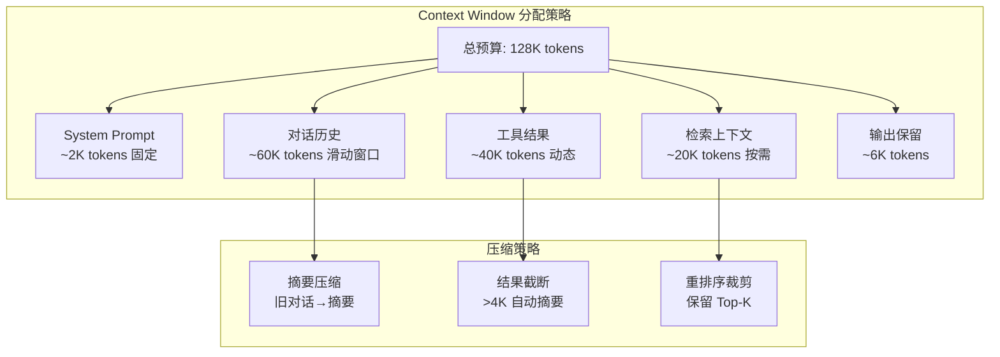

# 第 5 章 Context Engineering — 上下文工程

本章围绕上下文工程（Context Engineering）展开——构建优秀 Agent 的核心挑战，不是写一条“神奇 Prompt”，而是在正确的时间，将正确的信息放入 LLM 的上下文窗口。本章在现有实践经验的基础上，将上下文管理整理为 WSCIPO 六策略体系（Write、Select、Compress、Isolate、Persist、Observe），讨论上下文腐化检测、多层压缩、结构化笔记和长对话管理等关键主题。前置依赖：第 3 章架构总览和第 4 章状态管理。

## 本章你将学到什么

1. 为什么 Prompt Engineering 不足以支撑生产级 Agent
2. 如何用 WSCIPO 框架系统化管理上下文
3. 如何判断“该写入什么、该丢弃什么、该压缩什么”
4. 如何把上下文问题转化为可监控、可评估的工程问题

## 一个先记住的原则

> 上下文工程的本质，不是“塞进更多信息”，而是“控制信息进入模型的方式、时机和成本”。

---

## 5.1 上下文工程的六大原则

上下文工程不是一项单一技术，而是一套涵盖 **写入、选择、压缩、隔离、持久化、观测** 的系统工程。为避免把上下文问题拆成零散技巧，本章将其整理为 **WSCIPO** 框架。你可以把它理解为一个面向工程实现的检查清单：

| 原则 | 英文 | 核心问题 | 关键指标 |
|------|------|---------|---------|
| 写入 | **W**rite | 如何构造高质量的初始上下文？ | 信噪比、格式一致性 |
| 选择 | **S**elect | 哪些信息值得放入有限窗口？ | 召回率、精准率 |
| 压缩 | **C**ompress | 如何在保留语义的前提下缩减 token？ | 压缩率、信息保留度 |
| 隔离 | **I**solate | 多 Agent 并行时如何防止上下文污染？ | 隔离度、共享效率 |
| 持久化 | **P**ersist | 如何跨会话保存和恢复关键上下文？ | 检索准确率、存储成本 |
| 观测 | **O**bserve | 如何实时监控上下文质量并预警？ | 健康分、异常检出率 |

> **术语说明**：本书中 WSCIPO 专指 Context Engineering 的六原则框架（Write、Select、Compress、Isolate、Persist、Observe）。第 2 章中的认知架构模型使用"认知循环模型（Cognitive Loop）"命名，二者不同但互补——认知循环描述 Agent 的感知-思考-行动过程，WSCIPO 指导开发者如何工程化地管理上下文。

### 5.1.1 Write — 写入：构建高质量初始上下文

写入是上下文工程的第一步。一个好的 System Prompt 不仅仅是"角色扮演"的开场白，更是整个 Agent 行为的锚定点。

#### System Prompt 的结构化设计

先给出一个重要提醒：**System Prompt 只是上下文工程的入口，不是上下文工程的全部。** 很多团队的问题不在于 System Prompt 写得不够“强”，而在于历史消息、工具输出、检索结果和运行时状态被无差别地塞进上下文。

在需要结构化约束时，我们推荐使用 **XML 标签** 来组织 System Prompt，因为：
1. XML 标签在大多数 LLM 中有良好的边界识别能力
2. 结构化格式便于程序化生成和解析
3. 层次化结构自然映射到上下文的逻辑分区

```typescript
// ===== System Prompt Builder =====
// 用 XML 标签构造结构化的 System Prompt

interface Persona {
  role: string;
  expertise: string[];
    // ... 对应实现可参考 code-examples/ 目录 ...
};

const builder = new SystemPromptBuilder(config);
const systemPrompt = builder.build();
```

> **设计要点**：XML 标签法的一个重要优势是**可组合性**。不同模块可以独立生成自己的 XML 片段，最终由 Builder 统一拼装。这避免了字符串拼接的混乱，也让 prompt 的版本管理变得可控。

#### Dynamic Context Injection — 动态上下文注入

System Prompt 解决了"静态上下文"的构建问题，但 Agent 系统还需要处理**动态信息**的注入——用户画像、实时数据、会话历史等。

```typescript
// ===== Dynamic Context Injector =====
// 将动态信息按优先级注入上下文窗口

interface ContextSource {
  name: string;
  priority: number;           // 1-10, 越高越重要
    // ... 对应实现可参考 code-examples/ 目录 ...

    return content;
  }
}
```

### 5.1.2 Select — 选择：从海量信息中精准提取

当可用上下文远超模型窗口容量时，**选择** 成为关键。这里最常见的失败模式不是“召回不够多”，而是“把不该放进去的信息也放进去了”。选择策略需要综合考虑三个维度：**相关性**（Relevance）、**时效性**（Recency）和**重要性**（Importance）。

```typescript
// ===== Context Selector =====
// 基于 RRI 三维评分的上下文选择器

interface ContextItem {
  id: string;
  content: string;
    // ... 对应实现可参考 code-examples/ 目录 ...
    const magnitudeB = Math.sqrt(b.reduce((sum, bi) => sum + bi * bi, 0));
    return magnitudeA && magnitudeB ? dotProduct / (magnitudeA * magnitudeB) : 0;
  }
}
```

> **实践建议**：三个权重的初始值建议设为 `relevance: 0.5, recency: 0.3, importance: 0.2`，然后根据实际场景进行 A/B 测试微调。对于客服场景，时效性更重要；对于知识问答场景，相关性占主导。

### 5.1.3 Compress — 压缩：在保留语义的前提下缩减 token

压缩是上下文工程中投入产出比最高的环节。一个好的压缩策略可以在减少 50-70% token 消耗的同时，保留 90%+ 的任务相关信息。

```typescript
// ===== Compressor Interface =====
// 定义压缩器的统一接口

interface CompressResult {
  compressed: string;
  originalTokens: number;
    // ... 对应实现可参考 code-examples/ 目录 ...
    const other = text.length - chinese;
    return Math.ceil(chinese / 1.5 + other / 4);
  }
}
```

> **三层压缩架构**将在 5.3 节详细展开，此处仅展示 L1 格式压缩作为示例。

### 5.1.4 Isolate — 隔离：多 Agent 上下文沙箱

在多 Agent 协作系统中，上下文隔离至关重要。如果子 Agent 能随意修改共享上下文，系统行为将变得不可预测。

```typescript
// ===== Context Sandbox =====
// 为子 Agent 提供隔离的上下文环境

enum IsolationPolicy {
  Full = "full",                  // 完全隔离，子 Agent 看不到父上下文
  SharedReadOnly = "shared_ro",   // 共享只读，子 Agent 可读不可写父上下文
    // ... 对应实现可参考 code-examples/ 目录 ...
        return new Map();
    }
  }
}
```

> **隔离策略选择指南**：
> - **Full**：用于安全敏感的子任务（如执行用户提交的代码）
> - **SharedReadOnly**：最常用，子 Agent 需要了解全局背景但不应修改
> - **Selective**：子 Agent 只需要特定信息（如只看到用户偏好设置）
> - **SummaryOnly**：子 Agent 任务独立，只需知道大致背景

### 5.1.5 Persist — 持久化：跨会话上下文管理

上下文不应随会话结束而消失。持久化机制让 Agent 能跨会话保持记忆、积累知识。

```typescript
// ===== Context Persistence Layer =====
// 跨会话的上下文存储和检索

interface NoteEntry {
  id: string;
  category: "fact" | "preference" | "decision" | "todo" | "insight";
    // ... 对应实现可参考 code-examples/ 目录 ...
      return []; // JSON 解析失败时安全降级
    }
  }
}
```

### 5.1.6 Observe — 观测：上下文质量的实时监控

上下文质量的退化是渐进式的，如果不加以观测，往往在问题严重时才被发现。我们需要一个持续运行的"上下文健康仪表板"。

```typescript
// ===== Context Health Dashboard =====
// 上下文质量实时监控系统

interface ContextHealthMetrics {
  tokenUtilization: number;          // token 使用率 (0-1)
  informationDensity: number;        // 信息密度 (unique concepts / total tokens)
    // ... 对应实现可参考 code-examples/ 目录 ...
    const denom = n * sumXX - sumX * sumX;
    return denom === 0 ? 0 : (n * sumXY - sumX * sumY) / denom;
  }
}
```

---


## 5.2 Context Rot — 上下文腐化检测


> **"上下文就是你所需要的一切"——Context Engineering 的范式转移**
>
> 2025 年，Andrej Karpathy 将 "prompt engineering" 重新定义为 "context engineering"，标志着行业认知的重大转变。Prompt 只是 context 的一小部分；真正决定 Agent 输出质量的是**整个上下文的信息架构**：系统指令的精确度、对话历史的信噪比、检索结果的相关性、工具输出的结构化程度。这就像建筑设计——不是单块砖的质量决定大楼的安全性，而是整体结构的工程性。


随着对话轮次增加，上下文质量不可避免地退化——我们称之为**上下文腐化**（Context Rot）。腐化有多种表现形式：信息冗余堆积、事实相互矛盾、话题逐渐偏移、陈旧数据误导决策。及早检测腐化并采取修复措施，是保持 Agent 长期有效运行的关键。

### 5.2.1 SimHash 近似去重

在长对话中，用户反复描述同一问题、Agent 反复输出类似建议，会造成严重的**信息冗余**。我们使用 SimHash 算法来高效检测近似重复内容。

SimHash 的核心思想：将文本映射为一个固定长度的二进制指纹，语义相似的文本产生相似的指纹。通过比较两个指纹的**汉明距离**（不同位数），可以快速判断文本是否为近似重复。

```typescript
// ===== SimHash 近似重复检测 =====

class SimHasher {
  private hashBits: number;

  constructor(hashBits: number = 64) {
    // ... 对应实现可参考 code-examples/ 目录 ...
    }
    return hash;
  }
}
```

### 5.2.2 多维腐化检测器

仅靠去重不足以覆盖所有腐化类型。我们构建一个**多维检测器**，同时检测五种腐化模式：

| 腐化类型 | 检测方法 | 危害等级 |
|---------|---------|---------|
| 冗余堆积 | SimHash + Jaccard 相似度 | 中 |
| 事实矛盾 | 命题提取 + 语义对比 | 高 |
| 话题偏移 | 滑动窗口 embedding 距离 | 中 |
| 信息过时 | 时间戳 + 外部验证 | 高 |
| 注意力稀释 | 关键信息占比下降 | 中 |

```typescript
// ===== Context Rot Detector =====
// 多维上下文腐化检测

interface RotSignal {
  type: "redundancy" | "contradiction" | "drift" | "staleness" | "dilution";
  severity: number;          // 0-1
    // ... 对应实现可参考 code-examples/ 目录 ...

    return Math.min(avgSeverity * 0.7 + countFactor * 0.3, 1);
  }
}
```

> **实践经验**：在生产环境中，腐化检测应在每 N 轮对话后自动触发（推荐 N=5-10），而不是等到性能明显下降才处理。检测的开销很小（SimHash O(n)，矛盾检测 O(n^2)），但带来的质量收益是巨大的。

---

## 5.3 Three-Tier Compression — 三层压缩架构



**图 5-2 Context Window 预算分配与压缩策略**——Context 工程的核心是在有限的 token 预算内最大化信息密度。最常见的错误是将大量 token 浪费在低信息密度的历史消息上。


压缩是对抗上下文窗口有限性的核心武器。我们设计了一个三层压缩架构，每一层在压缩率和信息保留度之间做不同的取舍：

| 层级 | 名称 | 方法 | 压缩率 | 信息保留 | 延迟 |
|------|------|------|--------|---------|------|
| L1 | 格式压缩 | 规则引擎 | 10-30% | ~99% | <1ms |
| L2 | 提取压缩 | TF-IDF + TextRank | 30-60% | ~85% | ~10ms |
| L3 | 抽象压缩 | LLM 摘要 | 60-90% | ~70% | ~1s |

### 5.3.1 L1 格式压缩 — 零损耗瘦身

L1 压缩只移除对语义无贡献的格式冗余。它的优势是**完全无损**且极快。

```typescript
// ===== L1 Format Compressor =====
// 无损格式压缩，移除不影响语义的冗余字符

class L1FormatCompressor {
  private rules: Array<{
    name: string;
    // ... 对应实现可参考 code-examples/ 目录 ...

    return { result, appliedRules };
  }
}
```

### 5.3.2 L2 提取压缩 — 关键句提取

L2 压缩通过 **TextRank** 算法提取关键句，保留最有信息量的内容。

```typescript
// ===== L2 Extractive Compressor =====
// 基于 TextRank 的关键句提取

interface ScoredSentence {
  index: number;
  text: string;
    // ... 对应实现可参考 code-examples/ 目录 ...

    return scores;
  }
}
```

### 5.3.3 L3 抽象压缩 — LLM 驱动的语义摘要

L3 压缩是最强力的压缩手段，通过调用 LLM 生成语义摘要。压缩率可达 60-90%，但有信息损失。

```typescript
// ===== L3 Abstractive Compressor =====
// LLM 驱动的语义摘要压缩

interface LLMClient {
  complete(prompt: string, maxTokens: number): Promise<string>;
}
    // ... 对应实现可参考 code-examples/ 目录 ...

    return await this.llm.complete(prompt, targetTokens * 2);
  }
}
```

### 5.3.4 三层压缩编排器 — TieredCompressor

三层压缩需要一个编排器来决定何时使用哪一层。

```typescript
// ===== Tiered Compression Orchestrator =====
// 智能选择压缩层级

interface CompressionPlan {
  level: "L1" | "L2" | "L3" | "L1+L2" | "L1+L2+L3";
  estimatedRatio: number;
    // ... 对应实现可参考 code-examples/ 目录 ...
    const other = text.length - chinese;
    return Math.ceil(chinese / 1.5 + other / 4);
  }
}
```

### 5.3.5 Progressive Compaction — 渐进式压实

渐进式压实借鉴了日志系统的 **LSM-Tree 思想**：将上下文按"年龄"分层，越旧的层压缩越狠。

```typescript
// ===== Progressive Compactor =====
// 按时间层级渐进式压实上下文

interface AgeZone {
  name: string;
  maxAge: number;              // 最大年龄（轮次）
    // ... 对应实现可参考 code-examples/ 目录 ...
    const other = text.length - chinese;
    return Math.ceil(chinese / 1.5 + other / 4);
  }
}
```

### 5.3.6 Context Budget Allocator — 上下文预算分配器

在复杂的 Agent 系统中，上下文窗口需要在多个消费者之间分配预算。

```typescript
// ===== Context Budget Allocator =====
// 在多个上下文消费者之间智能分配 token 预算

interface BudgetConsumer {
  name: string;
  minTokens: number;          // 最低需求（不满足则不分配）
    // ... 对应实现可参考 code-examples/ 目录 ...

    return null; // 无法满足，返回 null 表示需要触发压缩
  }
}
```

> **预算分配的典型配置**：
> - System Prompt: priority=10, elasticity=0.1 (几乎不可压缩)
> - 工具结果: priority=8, elasticity=0.5
> - 对话历史: priority=6, elasticity=0.8 (最可压缩)
> - 持久化笔记: priority=7, elasticity=0.3
> - Few-shot 示例: priority=5, elasticity=0.9

---


## 5.4 Structured Notes — 结构化笔记与 Scratchpad 模式

Agent 在执行复杂任务时，需要一个**持久化的中间状态存储**——类似人类的笔记本。结构化笔记（Structured Notes）和 Scratchpad 模式为 Agent 提供了这种能力。

### 5.4.1 NOTES.md 模式 — Agent 的记事本

**NOTES.md 模式**的核心思想：在每次 LLM 调用之间，维护一份结构化的 Markdown 笔记，记录事实、决策、待办事项和洞察。

```typescript
// ===== Structured Notes Manager =====
// Agent 的结构化笔记系统

enum NoteCategory {
  Fact = "fact",                 // 确认的事实
  Hypothesis = "hypothesis",     // 假设（待验证）
    // ... 对应实现可参考 code-examples/ 目录 ...
    };
    return labels[category] || category;
  }
}
```

### 5.4.2 Scratchpad 模式 — Agent 的思维草稿

Scratchpad 模式为 Agent 提供一个**思维工作区**，让 Agent 在多步推理过程中记录中间结果、计划调整和推理链。

```typescript
// ===== Scratchpad Manager =====
// Agent 的思维草稿工作区

interface ScratchpadSection {
  name: string;
  content: string;
    // ... 对应实现可参考 code-examples/ 目录 ...
      }
    }
  }
}
```

### 5.4.3 Auto-Update Triggers — 自动更新触发器

笔记和 Scratchpad 不应仅依赖 Agent 主动更新。我们设计一套**自动触发器**，在特定事件发生时自动更新笔记。

```typescript
// ===== Auto-Update Trigger System =====
// 事件驱动的笔记自动更新

enum TriggerEvent {
  ToolCallSuccess = "tool_call_success",
  ToolCallFailure = "tool_call_failure",
    // ... 对应实现可参考 code-examples/ 目录 ...
      },
    });
  }
}
```

> **设计哲学**：自动触发器将"记笔记"的负担从 LLM 转移到了确定性代码上。LLM 不需要在每次输出中显式地说"我现在把这个记下来"，框架会自动捕获关键事件并更新笔记。这不仅减少了 LLM 的输出 token，还保证了笔记的完整性和一致性。

---

## 5.5 Context Passing Strategies — 上下文传递策略

在多 Agent 架构中，Agent 之间如何传递上下文是一个核心设计决策。不同的传递策略在**信息保真度**、**token 开销**和**隐私保护**之间有不同的取舍。

### 5.5.1 四种传递模式对比

| 策略 | 传递内容 | Token 开销 | 信息保真度 | 延迟 | 适用场景 |
|------|---------|-----------|-----------|------|---------|
| Full Pass | 完整上下文 | 高 | 100% | 低 | 简单链式调用 |
| Summary Pass | 压缩摘要 | 低 | ~70% | 中（需LLM） | 跨 Agent 协作 |
| Selective Pass | 按需选择 | 中 | ~90% | 低 | 隐私敏感场景 |
| Pointer Pass | 引用指针 | 极低 | ~100%* | 取决于存储 | 大上下文共享 |

*Pointer Pass 的信息保真度依赖于存储系统的持久性。

```typescript
// ===== Context Passing Framework =====
// 多 Agent 间的上下文传递

enum PassingStrategy {
  FullPass = "full",
  SummaryPass = "summary",
    // ... 对应实现可参考 code-examples/ 目录 ...
    const other = text.length - chinese;
    return Math.ceil(chinese / 1.5 + other / 4);
  }
}
```

### 5.5.2 Context Assembly Pipeline — 上下文组装流水线

在实际系统中，一次 LLM 调用的上下文来自多个来源：System Prompt、用户输入、工具结果、历史摘要、笔记等。**上下文组装流水线** 将这些来源统一管理、按优先级拼装。

```typescript
// ===== Context Assembly Pipeline =====
// 多源上下文组装与优化

interface ContextPipelineStage {
  name: string;
  order: number;                     // 执行顺序（越小越先执行）
  process: (ctx: PipelineContext) => Promise<PipelineContext>;
}
  // ... 省略 201 行，对应实现可参考 code-examples/ 对应目录

// estimateTokens：引用自附录 G（import { estimateTokens } from 'shared/utils'）
```

> **Pipeline 的可扩展性**：开发者可以轻松添加自定义阶段——例如"注入 RAG 检索结果"、"加载用户画像"、"注入实时工具文档"等。每个阶段独立工作，通过共享的 `PipelineContext` 协作。

---


## 5.6 Long Conversation Management — 长对话管理

当对话超过 100+ 轮时，上下文管理面临质的挑战。简单的滑动窗口无法满足需求——用户可能在第 3 轮提到的一个关键约束，在第 150 轮仍然有效。本节探讨长对话的系统化管理方案。

### 5.6.1 对话阶段检测

长对话通常包含多个**自然阶段**——需求澄清、方案探讨、实施细节、问题排查等。自动检测阶段边界，有助于为每个阶段维护独立的上下文摘要。

```typescript
// ===== Conversation Phase Detector =====
// 自动检测长对话中的阶段转换

interface ConversationPhase {
  id: string;
  name: string;
    // ... 对应实现可参考 code-examples/ 目录 ...
    // 简化实现：实际项目中会分析 embedding 变化
    return null;
  }
}
```

### 5.6.2 Topic Boundary Detection — 话题边界检测

话题边界检测比阶段检测更细粒度，它识别对话中**每一次话题切换**。

```typescript
// ===== Topic Boundary Detector =====
// 检测对话中的话题切换边界

interface TopicSegment {
  startTurn: number;
  endTurn: number;
    // ... 对应实现可参考 code-examples/ 目录 ...

    return Math.min(score, 1);
  }
}
```

### 5.6.3 Long Conversation Manager — 长对话管理器

将上述组件整合为一个统一的长对话管理器。

```typescript
// ===== Long Conversation Manager =====
// 统一的长对话管理

interface LongConversationConfig {
  maxHistoryTokens: number;
  compactionThreshold: number;      // 超过此轮次数触发自动压实
    // ... 对应实现可参考 code-examples/ 目录 ...
    const other = text.length - chinese;
    return Math.ceil(chinese / 1.5 + other / 4);
  }
}
```

### 5.6.4 长对话实战模式

以下是使用 `LongConversationManager` 管理 100+ 轮对话的典型流程：

```typescript
// ===== 长对话管理实战示例 =====

async function longConversationDemo(): Promise<void> {
  // 1. 初始化（假设有一个 LLM client 实例）
  const llmClient: LLMClient = {
    complete: async (prompt: string, maxTokens: number) => {
    // ... 对应实现可参考 code-examples/ 目录 ...
  const state = manager.getState();
  console.log(`Total turns: ${state.totalTurns}`);
  console.log(`Token usage: ${state.tokenUsage.history}/${state.tokenUsage.budget}`);
}
```

---

## 5.7 Context Engineering 反模式

前面各节讨论了上下文工程的最佳实践，但在实际生产环境中，开发者更常遇到的是各种**反模式**（Anti-patterns）。这些反模式往往在小规模测试中不易暴露，却在用户量增长或对话轮次加深后造成严重的质量退化和安全风险。本节系统梳理四种高频反模式，并给出检测与缓解方案。

### 5.7.1 Context Pollution（上下文污染）

**定义**：无关或低质量的信息被注入到上下文中，稀释模型对关键信息的注意力，导致响应质量下降。

**常见成因**：
- **过度热心的工具返回**：RAG 检索返回大量低相关度片段，Tool Use 结果未经裁剪直接注入
- **冗长的 System Prompt**：把所有可能的指令堆叠在一起，而非按场景动态选择
- **未压缩的对话历史**：完整保留数百轮对话，其中大量闲聊和确认消息毫无决策价值

```typescript
// ===== Context Pollution Detector =====

interface PollutionSignal {
  source: "tool" | "history" | "system" | "retrieval";
  content: string;
  relevanceScore: number;   // 0-1, 低于阈值视为污染
    // ... 对应实现可参考 code-examples/ 目录 ...
    const other = text.length - chinese;
    return Math.ceil(chinese / 1.5 + other / 4);
  }
}
```

**缓解策略**：采用**选择性注入**——每个上下文片段在注入前必须通过相关度评分（参考 §5.1.2 的 RRI 三维评分），低于阈值的片段直接丢弃或降级到备用缓冲区。对工具返回结果，设定最大 token 上限并执行 L1 格式压缩后再注入。

### 5.7.2 Context Leakage（上下文泄漏）

**定义**：敏感信息从一个上下文边界泄漏到另一个边界——例如用户 A 的对话内容出现在用户 B 的上下文中，或子 Agent 的内部推理暴露给终端用户。

**常见成因**：
- **共享内存存储缺乏隔离**：多租户系统中不同用户的记忆写入同一命名空间
- **Prompt Injection 导致的 System Prompt 泄漏**：恶意用户诱导模型输出系统指令
- **工具输出携带跨会话 PII**：数据库查询结果未脱敏，包含其他用户的个人信息

```typescript
// ===== Context Isolation Guard =====

interface BoundaryViolation {
  type: "cross_user" | "cross_session" | "prompt_leak" | "pii_exposure";
  severity: "critical" | "high" | "medium";
  evidence: string;
    // ... 对应实现可参考 code-examples/ 目录 ...
  private containsFingerprint(text: string, fp: string): boolean {
    return text.toLowerCase().replace(/\s+/g, "").includes(fp);
  }
}
```

**缓解策略**：严格执行上下文隔离（参考 §5.1.4 的四级隔离策略），所有内存存储按 `userId + sessionId` 做命名空间隔离；工具输出在注入上下文前强制经过 PII 扫描和脱敏；System Prompt 的关键指令使用对抗性测试验证不可提取。

### 5.7.3 Token Budget Explosion（Token 预算爆炸）

**定义**：上下文窗口被以超出预期的速度消耗殆尽，通常发生在运行时而非设计时，导致关键信息被截断或 API 调用直接失败。

**常见成因**：
- **递归工具调用产生冗长输出**：Agent 循环调用搜索工具，每次结果都追加到上下文
- **无界对话历史**：缺乏压缩或裁剪策略，对话历史线性增长直至撑满窗口
- **知识库检索未截断**：RAG 返回整篇文档而非相关段落

```typescript
// ===== Token Budget Monitor =====

interface BudgetAllocation {
  system: number;     // System Prompt 预算比例
  history: number;    // 对话历史预算比例
  tools: number;      // 工具结果预算比例
    // ... 对应实现可参考 code-examples/ 目录 ...

    return { totalUsed, totalBudget: this.maxTokens, alerts };
  }
}
```

**缓解策略**：为每个组件设定独立的 token 预算——推荐分配为 System 15%、History 40%、Tools 30%、Response 15%（参考 §5.3.6 的 Context Budget Allocator）。当任一组件达到 70% 预算时触发 L1+L2 压缩，达到 90% 时强制截断并记录告警日志。

### 5.7.4 Stale Context（过期上下文）

**定义**：上下文中包含已过时的信息——过时的工具缓存、失效的指令、不再成立的事实——导致 Agent 基于错误前提做出决策。

**常见成因**：
- **工具结果缓存未刷新**：天气、股价等实时数据的缓存 TTL 设置过长
- **System Prompt 指令过期**：节假日促销规则未及时下线，Agent 仍在引导用户参与已结束的活动
- **陈旧的记忆记录**：用户偏好已改变，但持久化的记忆仍记录旧偏好

> **交叉参考**：§5.2 的 Context Rot 检测机制中，`detectStaleness()` 方法已实现了基于时间戳的过期检测。此处在其基础上构建更完整的新鲜度验证方案。

```typescript
// ===== Context Freshness Validator =====

interface FreshnessRule {
  sourceType: string;       // 上下文来源类型标识
  maxAgeSec: number;        // 最大存活时间（秒）
  refreshStrategy: "refetch" | "invalidate" | "flag";
    // ... 对应实现可参考 code-examples/ 目录 ...
      { sourceType: "system_prompt",  maxAgeSec: 0,      refreshStrategy: "invalidate" }, // 每次验证
    ];
  }
}
```

**缓解策略**：为每类上下文来源定义明确的 TTL 规则，在 Context Assembly Pipeline（参考 §5.5.2）中增加新鲜度校验环节——过期内容根据策略选择重新获取、标记告警或直接失效。对 System Prompt 采用版本化管理，每次会话启动时校验是否为最新版本。

### 5.7.5 反模式检测清单

下表提供一个快速参考清单，帮助团队在代码评审和上线检查中识别上下文工程的常见反模式：

| 反模式 | 典型症状 | 检测方法 | 解决方案 |
|--------|---------|---------|---------|
| **Context Pollution** | 响应质量随工具调用增多而下降；无关信息出现在回复中 | `ContextPollutionDetector` 相关度评分；监控响应质量指标 | 选择性注入 + RRI 评分过滤 + 工具结果 L1 压缩 |
| **Context Leakage** | 用户反馈看到其他人的信息；System Prompt 内容出现在回复中 | `ContextIsolationGuard` 边界校验；PII 扫描告警 | 命名空间隔离 + PII 脱敏 + 对抗性 Prompt 测试 |
| **Token Budget Explosion** | API 调用频繁报 `context_length_exceeded`；响应突然被截断 | `TokenBudgetMonitor` 组件级预算监控；token 使用率趋势 | 组件级预算分配 + 渐进压缩 + 工具输出上限 |
| **Stale Context** | Agent 引用已过时的信息做决策；用户投诉"记忆"不准确 | `ContextFreshnessValidator` TTL 校验；定期腐化扫描 | TTL 规则 + 版本化 System Prompt + 记忆定期刷新 |

> **实践建议**：将上述四个检测器集成到 Context Assembly Pipeline 中，作为上下文注入前的"质量门禁"。任何未通过检测的上下文片段都不应进入最终的 LLM 调用，而是记录到可观测性系统中供事后分析。

---


## 5.8 Context Engineering 取代 Prompt Engineering：2026 年的范式转移

### 5.8.1 从"怎么问"到"给什么信息"

2026 年初，AI 工程社区形成了一个明确的共识：**Context Engineering（上下文工程）正在取代 Prompt Engineering（提示词工程）** 成为构建高质量 AI Agent 的核心技能。

这两者的根本区别在于：

| 维度 | Prompt Engineering | Context Engineering |
|------|-------------------|-------------------|
| 关注焦点 | **怎么问**（措辞、格式、指令） | **给什么信息**（上下文架构） |
| 作用范围 | 单次指令（数百 Token） | 整个信息架构（数千到数百万 Token） |
| 主要杠杆 | 措辞优化、Few-shot 示例 | 数据格式、检索架构、文件组织 |
| 影响量级 | 边际改进 | 决定性影响（+21% 准确率差距来自模型选择，而非提示词） |
| 适用阶段 | 原型阶段 | 生产阶段 |

McMillan（2026）在一项涵盖 9,649 个实验、11 个模型的大规模研究中，提供了首个关于上下文结构如何影响 LLM Agent 性能的实证数据。

### 5.8.2 关键发现：模型选择 >> 提示词优化

```typescript
// McMillan (2026) 研究的核心发现建模
interface ContextEngineeringFindings {
  // 发现 1：模型选择的影响远超其他因素
  modelSelectionImpact: {
    frontierVsOpenSource: '+21 percentage points';  // 最大单一因素
    description: '模型选择是最高杠杆决策，而非提示词调优';
    // ... 对应实现可参考 code-examples/ 目录 ...
    method: '领域分区的文件结构';
    description: '远超任何单一上下文窗口的容量限制';
  };
}
```

### 5.8.3 Context Engineering 的实践框架

基于最新研究和生产实践，我们将 Context Engineering 的方法论扩展为 **WSCIPO+** 框架：

```typescript
// WSCIPO+ 框架：扩展版上下文工程
class ContextEngineeringFramework {
  // 原始 WSCIPO（本章前文已述）
  // W - Write: 编写系统提示
  // S - Select: 选择相关上下文
  // C - Compress: 压缩上下文
    // ... 对应实现可参考 code-examples/ 目录 ...
    
    return this.prioritize(items, plan.tokenBudget);
  }
}
```


> **实践案例：代码仓库即记录系统**
>
> OpenAI 在一个完全由 Codex 智能体生成代码的内部项目中发现了一个深刻的教训：**从智能体的角度来看，它在运行时无法在上下文中访问的任何内容都是不存在的**。存储在 Google Docs、Slack 聊天记录或团队成员头脑中的知识，对智能体来说等同于不存在。因此，他们将代码仓库本身作为唯一的"记录系统"——所有设计决策、架构共识、产品规格和操作规范都必须以 Markdown 形式版本化到仓库中，成为智能体可检查、可验证、可修改的上下文工件。这为 Context Engineering 提供了一个关键实践原则：**上下文必须是可版本化、可发现、可验证的**，而非散落在各种非结构化渠道中的碎片信息。
### 5.8.4 从 Prompt Engineer 到 Context Engineer

对于 Agent 开发者而言，这一范式转移意味着技能重心的调整：

| 旧范式（Prompt Engineering） | 新范式（Context Engineering） |
|---------------------------|---------------------------|
| 花大量时间优化系统提示的措辞 | 花时间设计信息架构和检索策略 |
| A/B 测试不同的提示模板 | A/B 测试不同的上下文组装策略 |
| 手动编写 Few-shot 示例 | 动态检索最相关的示例 |
| 针对特定模型优化提示 | 设计模型无关的上下文架构 |
| 关注 Token 使用量的上限 | 关注上下文质量与 Token 效率的平衡 |

> **关键认知**：在 Agent 系统中，提示词质量的影响被上下文质量的影响所压倒。最好的提示词配合错误的上下文，不如普通的提示词配合精心工程化的上下文。

---


## 5.9 章节总结与最佳实践

### 核心框架回顾

本章围绕上下文工程的 **WSCIPO** 六大原则，构建了一套完整的技术方案：

| 原则 | 核心实现 | 关键类/接口 |
|------|---------|------------|
| **Write** 写入 | 结构化 System Prompt + 动态注入 | `SystemPromptBuilder`, `DynamicContextInjector` |
| **Select** 选择 | RRI 三维评分 + 多样性保障 | `ContextSelector` |
| **Compress** 压缩 | 三层压缩 (L1/L2/L3) + 渐进压实 | `TieredCompressor`, `ProgressiveCompactor` |
| **Isolate** 隔离 | 四级隔离策略 + 上下文沙箱 | `ContextSandbox`, `IsolationPolicy` |
| **Persist** 持久化 | 结构化笔记 + 语义检索 | `StructuredNotesManager`, `ContextPersistenceManager` |
| **Observe** 观测 | 多维健康检测 + 腐化扫描 | `ContextHealthDashboard`, `ContextRotDetector` |

### 最佳实践清单

**System Prompt 设计**
1. 使用 XML 标签组织 System Prompt，保持结构清晰
2. 将 persona、instructions、tools、examples 分区管理
3. 保持 System Prompt 在总上下文预算的 15-25%

**上下文选择与压缩**
4. 采用 RRI (Relevance-Recency-Importance) 三维评分选择上下文
5. 始终先执行 L1 格式压缩（零成本高收益）
6. 当 token 使用率超过 70% 时启用 L2，超过 85% 启用 L3
7. 长对话使用渐进式压实，按"年龄"对消息分层压缩

**上下文质量保障**
8. 每 5-10 轮自动执行腐化检测
9. 重点监控：冗余率 < 30%，话题偏移距离 < 0.7
10. 发现矛盾信号时立即向用户确认

**多 Agent 协作**
11. 默认使用 SharedReadOnly 隔离策略
12. 跨 Agent 传递优先选择 Summary Pass（平衡成本和保真度）
13. 使用 Context Assembly Pipeline 统一管理多源上下文
14. 为每个上下文消费者设定 token 预算和优先级

**长对话管理**
15. 启用阶段检测，为每个阶段维护独立摘要
16. 话题切换时自动创建新的笔记条目
17. 超过 20 轮对话启用自动压实
18. 保留最近 5 轮消息的原始内容，更早的消息逐步压缩

### 架构决策树

在设计上下文管理方案时，可以按以下决策树选择策略：

```
对话长度预期?
├── < 10 轮: 简单滑动窗口即可
├── 10-50 轮: L1+L2 压缩 + 基础笔记
├── 50-200 轮: 三层压缩 + 结构化笔记 + 阶段检测
└── 200+ 轮: 全套方案 (渐进压实 + 阶段/话题检测 + 健康监控)

    // ... 对应实现可参考 code-examples/ 目录 ...
├── < 4K: 激进压缩 (L1+L2+L3)，仅保留最关键信息
├── 4K-16K: 标准方案，三层压缩按需启用
├── 16K-128K: 宽松方案，L1+L2 为主，L3 仅在极端情况使用
└── 128K+: 以选择为主，压缩为辅，重点防止注意力稀释
```

### 下一章预告

在第六章中，我们将深入探讨 **Tool Use — 工具使用**，这是 Agent 与外部世界交互的桥梁。我们将讨论工具描述的最佳实践、工具编排模式、错误处理策略，以及如何构建一个可扩展的工具注册表。上下文工程中学到的预算管理、优先级排序和压缩技术，将直接应用于工具结果的处理。

## 本章小结

上下文工程的重点从来不只是 prompt 写作，而是信息编排。只有当写入、选择、压缩、隔离、持久化与观测形成闭环，模型才有机会在复杂任务中稳定工作。读完本章后，后续再看工具、记忆与 RAG，就更容易理解它们为什么都在为“正确上下文”服务。

## 建议接着读

如果你希望沿着本书的主干继续推进，建议下一步阅读 第 6 章《工具系统设计 — Agent 的手和脚》。这样可以把本章中的判断框架，继续连接到后续的实现、评估或生产化问题上。

