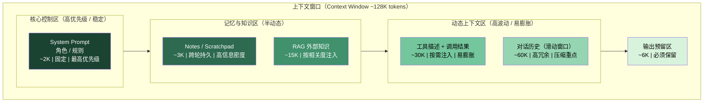
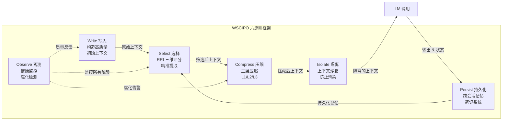
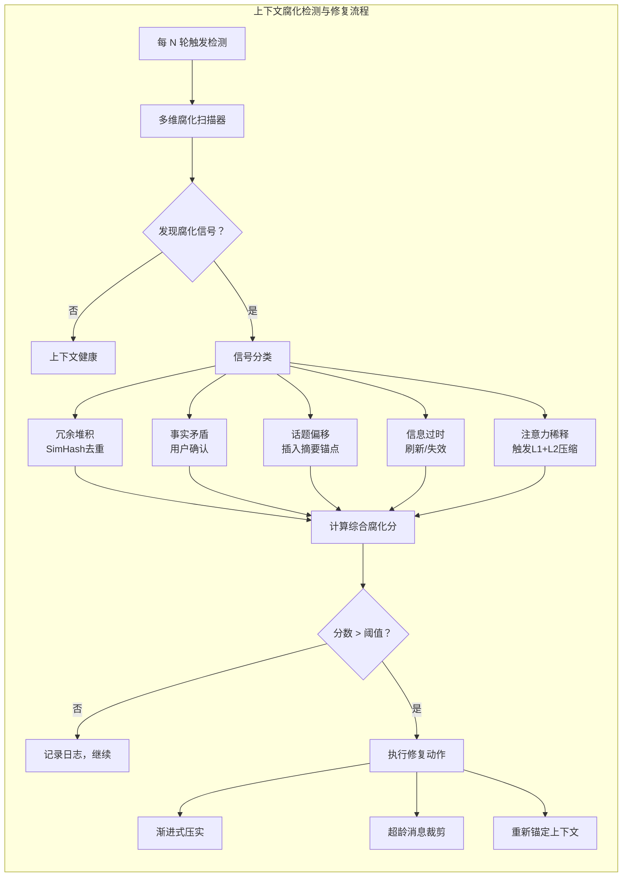
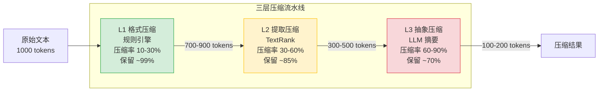
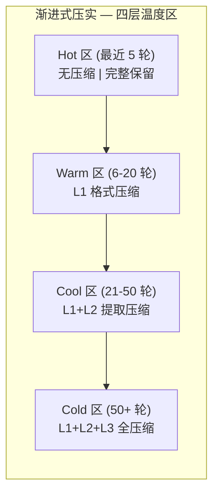
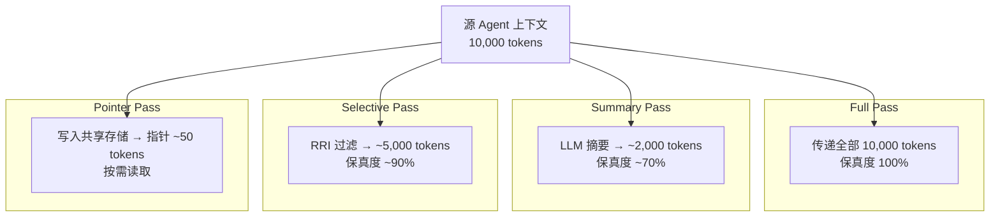
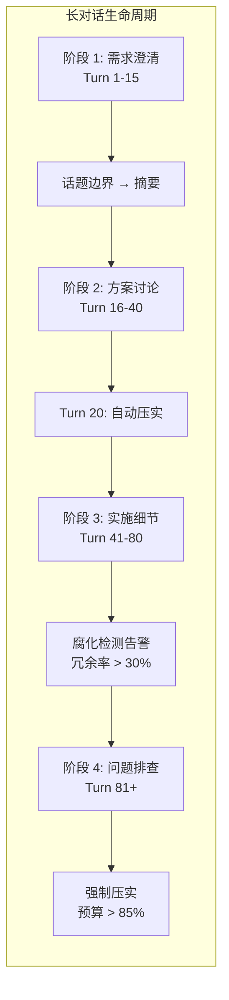

# 第 5 章 Context Engineering — 上下文工程

> **"The hottest new programming language is English — but the real skill is not writing prompts, it's engineering context."**
> — Andrej Karpathy, 2025

本章围绕上下文工程（Context Engineering）展开——构建优秀 Agent 的核心挑战，不是写一条"神奇 Prompt"，而是在正确的时间，将正确的信息放入 LLM 的上下文窗口。本章在现有实践经验的基础上，将上下文工程整理为 WSCIPO 六策略体系（Write、Select、Compress、Isolate、Persist、Observe），讨论上下文腐化（Context Rot）检测、多层压缩、结构化笔记（Structured Notes）和长对话管理等关键主题。前置依赖：第 3 章架构总览和第 4 章状态管理。

如果你曾经在生产环境中运行过一个对话式 Agent，几乎一定遇到过这样的困惑：为什么 Agent 在前 10 轮表现完美，到第 50 轮就开始"胡说八道"？为什么明明在 System Prompt 中写了明确的约束，Agent 有时候却视而不见？为什么两个看起来相似的对话，Agent 给出截然不同的回答？这些问题的根源往往不在模型能力，而在于上下文——Agent 在做决策时"看到了什么信息"。上下文工程正是解决这类问题的系统化方法论。

## 本章你将学到什么

1. 为什么 Prompt Engineering 不足以支撑生产级 Agent，以及 Context Engineering 如何填补这一空白
2. 如何用 WSCIPO 框架系统化管理上下文的全生命周期
3. 如何判断"该写入什么、该丢弃什么、该压缩什么"——每个决策背后的工程权衡
4. 如何把上下文问题转化为可监控、可评估、可自动修复的工程问题
5. 如何在多 Agent 协作场景中安全高效地传递上下文

## 一个先记住的原则

> 上下文工程的本质，不是"塞进更多信息"，而是"控制信息进入模型的方式、时机和成本"。

这个原则贯穿本章始终。当你在后续小节中看到各种具体技术——压缩、选择、隔离、笔记——请始终回到这个原则来审视它们：每一项技术都是在回答"什么信息、以什么形式、在什么时机进入模型"这个核心问题。

---

## 为什么朴素上下文工程会失败

在正式展开 WSCIPO 框架之前，先看一个在生产中反复出现的场景。理解这个场景，是理解本章所有技术方案的前提。

**场景：Agent 在第 50 轮后"失忆"。** 一个编程助手 Agent 在帮助用户重构一个微服务系统。前 20 轮对话中，用户详细描述了架构约束——"支付服务不能直接调用库存服务，必须通过事件总线"。Agent 完美记住了这一点，在第 25 轮生成的代码也正确地使用了事件驱动模式。然而到了第 55 轮，当用户要求"把退款逻辑加上"时，Agent 生成了支付服务直接 RPC 调用库存服务的代码——它"忘记"了那条关键约束。

这并非偶发事件，也不是模型"不够聪明"。朴素做法（即"把所有历史消息按原文塞进上下文窗口"）会系统性地失败，原因有三：

**第一，信息密度持续下降。** 对话越长，闲聊、确认语（"好的"、"收到"、"我理解了"）、重复描述在总 token 中的占比越来越高。到第 50 轮时，真正有决策价值的信息可能只占总上下文的 15%。模型的注意力被大量低信息密度的文本稀释了。这不是理论推导——我们在多个生产系统中观察到，当上下文中"有效信息密度"低于 20% 时，模型的任务完成率会显著下降。

**第二，关键信息被"埋没"。** Liu et al. (2024) 发现了 "Lost-in-the-Middle" 效应：LLM 对上下文开头和结尾的信息利用效率远高于中间位置。在一段 128K token 的上下文中，第 20 轮对话中的关键约束恰好落在最"暗"的中间区域——模型能"看到"这段文字，但几乎不会利用它。这个发现对上下文工程有深远影响：信息在上下文中的**位置**与信息本身的**内容**同样重要。

**第三，窗口溢出时的截断是灾难性的。** 当上下文长度超过模型窗口时，最常见的做法是截断最早的消息。但"最早的消息"往往包含最基础的需求定义和架构约束——这恰恰是最不应该被丢弃的信息。更糟糕的是，截断是无声的——既不会通知用户，也不会告诉模型有信息被丢弃了。

这三个问题不会随着模型窗口变大而自动消失。128K 窗口只是把失败延迟到了更长的对话中，并让当它最终发生时调试变得更加困难。真正的解决方案不是更大的窗口，而是**系统化的上下文工程**——对信息的写入、选择、压缩、隔离、持久化和观测进行端到端的设计。

下面的图展示了上下文窗口内部的逻辑结构。在一次 LLM 调用中，并非所有 token 都是"平等的"——它们来自不同的来源，承担不同的角色，有不同的生命周期和重要性。上下文工程的第一步，就是理解这个分层结构，并为每一层制定不同的管理策略。



**图 5-0 上下文窗口内部结构图** —— 一次 LLM 调用中的上下文由多个来源堆叠组成。System Prompt 在顶层且几乎不可压缩；对话历史占比最大、冗余最多，是压缩的主战场；笔记层提供跨轮次的语义浓缩；工具和 RAG 结果按需注入。上下文工程就是管理这些层之间的 token 预算分配与质量控制。注意预留输出空间（Response）常被忽视——如果不显式预留，模型可能因为输出被截断而产生不完整的回答。

---

## 5.1 上下文工程的六大原则

上下文工程不是一项单一技术，而是一套涵盖 **写入、选择、压缩、隔离、持久化、观测** 的系统工程。为避免把上下文问题拆成零散技巧，本章将其整理为 **WSCIPO** 框架。你可以把它理解为一个面向工程实现的检查清单——每当你设计或审查一个 Agent 系统的上下文工程时，逐项检查这六个维度，就能发现大多数潜在问题。

| 原则 | 英文 | 核心问题 | 关键指标 |
|------|------|---------|---------|
| 写入 | **W**rite | 如何构造高质量的初始上下文？ | 信噪比、格式一致性 |
| 选择 | **S**elect | 哪些信息值得放入有限窗口？ | 召回率、精准率 |
| 压缩 | **C**ompress | 如何在保留语义的前提下缩减 token？ | 压缩率、信息保留度 |
| 隔离 | **I**solate | 多 Agent 并行时如何防止上下文污染？ | 隔离度、共享效率 |
| 持久化 | **P**ersist | 如何跨会话保存和恢复关键上下文？ | 检索准确率、存储成本 |
| 观测 | **O**bserve | 如何实时监控上下文质量并预警？ | 健康分、异常检出率 |

> **WSCIPO 框架溯源**：LangChain 将上下文工程归纳为 Write/Select/Compress/Isolate 四大策略（WSCI），本书在此基础上增加 Persist（跨会话持久化）和 Observe（运行时可观测性），形成 WSCIPO 六原则框架，以覆盖生产环境中的完整需求。WSCI 聚焦于单次请求内的上下文优化，而 Persist 解决"Agent 如何记住上一次对话的关键结论"，Observe 解决"如何在线上及时发现上下文质量退化"。两个扩展原则是从生产事故中提炼出来的——缺少 Persist，Agent 每次会话从零开始；缺少 Observe，腐化问题在用户投诉后才被发现。

> **术语说明**：本书中 WSCIPO 专指 Context Engineering 的六原则框架（Write、Select、Compress、Isolate、Persist、Observe）。第 2 章中的认知架构模型使用"认知循环模型（Cognitive Loop）"命名，二者不同但互补——认知循环描述 Agent 的感知-思考-行动过程，WSCIPO 指导开发者如何工程化地管理上下文。

下图展示 WSCIPO 六个维度之间的数据流关系。注意它不是线性管道——Observe 持续监控所有阶段，Persist 的输出回流到 Select 的输入池，形成闭环。这个闭环特性是 WSCIPO 区别于简单"预处理管道"的关键：上下文质量的维护不是一次性的，而是持续运行的反馈系统。


**图 5-1 WSCIPO 框架全景图** —— 六大原则形成一条从写入到观测的数据流水线。Write 生成原始上下文，经过 Select 筛选、Compress 压缩、Isolate 隔离后进入 LLM；LLM 输出经 Persist 持久化后回流为下一轮的候选上下文；Observe 贯穿全流程，持续监控每个阶段的质量指标。

本节先在概念层面介绍每个原则的核心思想和设计取舍。详细的代码实现将在后续各小节（5.2-5.7）中展开。理解概念层面的"为什么"比记住实现层面的"怎么做"更重要——因为具体实现会随技术演进而变化，但背后的设计原则是稳定的。

### 5.1.1 Write — 写入：构建高质量初始上下文

写入是上下文工程的第一步，也是最容易被低估的一步。很多团队花大量时间优化 System Prompt 的措辞，却忽视了一个更根本的问题：进入上下文窗口的信息，远不止 System Prompt。一个好的 System Prompt 不仅仅是"角色扮演"的开场白，更是整个 Agent 行为的锚定点——它定义了模型应该关注什么、忽略什么、如何组织输出。

**System Prompt 只是上下文工程的入口，不是上下文工程的全部。** 很多团队的问题不在于 System Prompt 写得不够"强"，而在于历史消息、工具输出、检索结果和运行时状态被无差别地塞进上下文。我们在需要结构化约束时，推荐使用 **XML 标签** 来组织 System Prompt，原因有三：XML 标签在大多数 LLM 中有良好的边界识别能力（模型能清晰区分不同区段的内容）；结构化格式便于程序化生成和解析（可以用代码组合不同模块的 Prompt 片段）；层次化结构自然映射到上下文的逻辑分区（persona/instructions/constraints 各司其职）。

```typescript
// System Prompt Builder — 用 XML 标签构造结构化 Prompt
interface PromptConfig {
  persona: { role: string; expertise: string[]; tone: string };
  instructions: string[];
  constraints: string[];
}

class SystemPromptBuilder {
  constructor(private config: PromptConfig) {}

  build(): string {
    return [
      this.wrap("persona", [
        `<role>${this.config.persona.role}</role>`,
        `<expertise>${this.config.persona.expertise.join(", ")}</expertise>`,
        `<tone>${this.config.persona.tone}</tone>`,
      ].join("\n")),
      this.wrap("instructions", this.config.instructions
        .map((inst, i) => `  <rule priority="${i + 1}">${inst}</rule>`).join("\n")),
      this.wrap("constraints", this.config.constraints
        .map(c => `  <constraint>${c}</constraint>`).join("\n")),
    ].join("\n\n");
  }

  private wrap(tag: string, content: string): string {
    return `<${tag}>\n${content}\n</${tag}>`;
  }
}
```

> 💡 完整实现见 [code-examples/03-context-engineering.ts](../code-examples/03-context-engineering.ts)

> **设计要点**：XML 标签法的核心优势是**可组合性**——不同模块可以独立生成自己的 XML 片段，最终由 Builder 统一拼装。这避免了字符串拼接的混乱，也让 Prompt 的版本管理变得可控。需要注意的是，并非所有模型都对 XML 标签有同等的理解能力，在切换模型时需要验证标签边界的识别效果。根据 McMillan (2026) 的实证研究，XML 格式在结构化数据场景中的表现始终优于 JSON 和 YAML。

#### Dynamic Context Injection — 动态上下文注入

System Prompt 解决了"静态上下文"的构建问题，但 Agent 系统还需要处理**动态信息**的注入——用户画像、实时数据、会话历史等。这些信息在每次 LLM 调用时可能不同，不能硬编码在 Prompt 模板中。核心设计思想是将各个来源注册为带优先级的 `ContextSource`，由注入器按优先级顺序在 token 预算内填充。这样做的好处是解耦——每个信息来源独立维护自己的获取逻辑，注入器只负责预算管理和排序。

```typescript
// Dynamic Context Injector — 按优先级注入动态信息
interface ContextSource {
  name: string;
  priority: number;           // 1-10, 越高越重要
  maxTokens: number;
  fetch: () => Promise<string>;
}

class DynamicContextInjector {
  private sources: ContextSource[] = [];
  constructor(private totalBudget: number) {}

  register(source: ContextSource): void {
    this.sources.push(source);
    this.sources.sort((a, b) => b.priority - a.priority);
  }

  async inject(): Promise<string> {
    const parts: string[] = [];
    let remaining = this.totalBudget;
    for (const src of this.sources) {
      if (remaining <= 0) break;
      const content = await src.fetch();
      const allowed = Math.min(estimateTokens(content), src.maxTokens, remaining);
      if (allowed > 0) {
        parts.push(`<context source="${src.name}">\n${content.slice(0, allowed * 4)}\n</context>`);
        remaining -= allowed;
      }
    }
    return parts.join("\n\n");
  }
}
```

> 💡 完整实现见 [code-examples/03-context-engineering.ts](../code-examples/03-context-engineering.ts)

这里的关键设计权衡是**静态优先级 vs. 动态调度**。上述实现采用注册时确定的静态优先级，简单可预测。更高级的方案可以根据当前对话状态动态调整优先级（例如用户刚问了天气相关问题时，天气 API 的优先级临时提升），但这增加了系统复杂度和调试难度。动态调度还引入了一个微妙的风险：如果优先级变化过于频繁，LLM 在相邻两轮中看到的上下文组成可能差异很大，导致行为不一致。建议仅在场景确实需要时引入动态调度，并对优先级变化设置"冷却期"以保证稳定性。

### 5.1.2 Select — 选择：从海量信息中精准提取

当可用上下文远超模型窗口容量时，**选择** 成为关键。这里最常见的失败模式不是"召回不够多"，而是"把不该放进去的信息也放进去了"——这就是上下文污染（Context Pollution）的起源，我们将在 5.7.1 中详细讨论这一反模式。

选择策略需要综合考虑三个维度：**相关性**（Relevance）、**时效性**（Recency）和**重要性**（Importance），简称 RRI 评分。RRI 评分的设计理念是：没有单一维度能做出好的选择。一条信息可能高度相关但已经过时（昨天的天气预报），也可能很新但与当前任务无关（刚收到的无关邮件），还可能相关且新鲜但重要性低（一条闲聊确认消息）。三维加权提供了比单一维度更稳健的选择基础，也让选择策略可以通过调整权重来适配不同场景。

> **Lost-in-the-Middle 效应**：Liu et al. (2024) 发现 LLM 对上下文中间位置的信息利用效率显著低于首尾位置。这意味着即使你选对了信息，如果放在了错误的位置，模型也可能忽略它。工程启示：关键信息应放置在上下文窗口的开头或末尾。在下面的实现中，我们在 RRI 评分排序后会将高分项交替放置在首尾位置（`reorderForMiddle`），以最大化模型对关键信息的利用。

```typescript
// Context Selector — RRI 三维评分 + Lost-in-the-Middle 重排
interface ContextItem {
  id: string; content: string; embedding: number[];
  timestamp: number; importance: number;
}

class ContextSelector {
  constructor(
    private weights = { relevance: 0.5, recency: 0.3, importance: 0.2 },
    private maxItems = 20,
  ) {}

  select(candidates: ContextItem[], queryEmb: number[], now: number): ContextItem[] {
    // 1. RRI 评分
    const scored = candidates.map(item => ({
      item,
      score: this.weights.relevance * cosineSimilarity(item.embedding, queryEmb)
           + this.weights.recency * (1 / (1 + Math.log1p((now - item.timestamp) / 3600000)))
           + this.weights.importance * item.importance,
    }));
    scored.sort((a, b) => b.score - a.score);
    // 2. 去重（embedding 余弦 > 0.92 视为重复）
    const selected = scored.filter((entry, _, arr) =>
      !arr.slice(0, arr.indexOf(entry)).some(
        s => cosineSimilarity(s.item.embedding, entry.item.embedding) > 0.92
      )).slice(0, this.maxItems);
    // 3. Lost-in-the-Middle 重排：高分放首尾，低分放中间
    return this.reorderForMiddle(selected).map(s => s.item);
  }

  private reorderForMiddle(items: typeof []) { /* 首尾交替排列 */ }
}
```

> 💡 完整实现见 [code-examples/03-context-engineering.ts](../code-examples/03-context-engineering.ts)

> **实践建议**：三个权重的初始值建议设为 `relevance: 0.5, recency: 0.3, importance: 0.2`，然后根据实际场景进行 A/B 测试微调。对于客服场景，时效性权重应提高到 0.4 以上（因为用户的最新消息通常最重要）；对于知识问答场景，相关性应占主导（0.6+）。权重调整本身也可以通过线上实验自动化——将权重视为超参数，用用户满意度作为目标函数进行贝叶斯优化。去重阈值 0.92 是一个经验值：低于 0.90 会误删相关但不重复的内容，高于 0.95 则去重效果不明显。

### 5.1.3 Compress — 压缩：在保留语义的前提下缩减 token

压缩是上下文工程中投入产出比最高的环节。一个好的压缩策略可以在减少 50-70% token 消耗的同时，保留 90%+ 的任务相关信息。直觉上这似乎不可能——怎么能丢弃一半的内容却几乎不损失信息？答案在于自然语言的**高冗余性**：日常对话中充斥着填充词、重复表述、格式空白，这些对人类阅读有帮助，但对 LLM 的语义理解贡献极低。

我们设计了三层压缩架构（L1/L2/L3），每一层在压缩率和信息保留度之间做不同取舍。此处先定义压缩器的统一接口，具体实现在 5.3 节展开。统一接口的好处是让上层编排器（5.3.4）可以透明地组合不同层级的压缩器，而不关心具体实现。

```typescript
// 压缩器统一接口
interface CompressResult {
  compressed: string;
  originalTokens: number;
  compressedTokens: number;
  ratio: number;              // 压缩率 = 1 - compressedTokens/originalTokens
  infoRetention: number;      // 信息保留估计 (0-1)
}

interface Compressor {
  name: string;
  compress(text: string, targetTokens?: number): Promise<CompressResult>;
}
```

> **三层压缩架构预览**：L1（格式压缩）几乎无损且极快，移除空白和注释；L2（提取压缩）通过 TextRank 关键句提取实现中等压缩；L3（抽象压缩）借助 LLM 生成语义摘要，压缩率最高但有信息损失风险。5.3 节将详细展开每一层的实现、适用场景和风险。这种分层设计的核心价值在于：大多数情况下 L1 就够了，只在真正需要时才启用更激进（也更有风险）的压缩层。

### 5.1.4 Isolate — 隔离：多 Agent 上下文沙箱

在多 Agent 协作系统中，上下文隔离至关重要。如果子 Agent 能随意修改共享上下文，系统行为将变得不可预测——一个搜索子 Agent 可能无意中用搜索结果覆盖了用户偏好，一个代码执行子 Agent 可能将调试信息污染到主对话流。隔离策略的选择本质上是**安全性 vs. 信息可用性**的取舍——Full 隔离最安全但子 Agent 缺乏上下文可能做出错误决策；SharedReadOnly 是大多数场景的最佳平衡点，既给予子 Agent 足够的背景信息，又防止其修改全局状态。

| 策略 | 子 Agent 可读父上下文？ | 子 Agent 可写父上下文？ | 典型场景 |
|------|----------------------|----------------------|---------|
| **Full** | 否 | 否 | 执行不可信代码 |
| **SharedReadOnly** | 是 | 否 | 最常用，子 Agent 需了解背景 |
| **Selective** | 白名单字段 | 否 | 只需特定信息（如用户偏好） |
| **SummaryOnly** | 仅父上下文摘要 | 否 | 任务独立，只需大致背景 |

```typescript
// Context Sandbox — 隔离策略核心逻辑
enum IsolationPolicy { Full, SharedReadOnly, Selective, SummaryOnly }

class ContextSandbox {
  constructor(
    private parentCtx: Map<string, string>,
    private localCtx: Map<string, string> = new Map(),
    private policy: IsolationPolicy,
    private whitelist: Set<string> = new Set(),
  ) {}

  get(key: string): string | undefined {
    if (this.localCtx.has(key)) return this.localCtx.get(key);
    switch (this.policy) {
      case IsolationPolicy.Full: return undefined;
      case IsolationPolicy.SharedReadOnly: return this.parentCtx.get(key);
      case IsolationPolicy.Selective:
        return this.whitelist.has(key) ? this.parentCtx.get(key) : undefined;
      case IsolationPolicy.SummaryOnly:
        return key === "__summary__" ? this.parentCtx.get(key) : undefined;
    }
  }

  set(key: string, value: string): void { this.localCtx.set(key, value); }
  exportChanges(): Map<string, string> { return new Map(this.localCtx); }
}
```

> 💡 完整实现见 [code-examples/03-context-engineering.ts](../code-examples/03-context-engineering.ts)

一个容易被忽视的细节是 `exportChanges()` 方法——它支持子 Agent 完成任务后将局部状态"合并"回父上下文（merge-back）。这类似 Git 分支的 merge 操作：子 Agent 在隔离的分支上工作，完成后选择性地将成果合并到主干。合并时应由父 Agent 审核变更内容，避免子 Agent 将无关或错误的信息污染全局上下文。在实际实现中，我们建议为 merge-back 设置一个"审核函数"——由父 Agent 决定哪些变更接受、哪些拒绝，就像 code review 中的 approve/reject。

### 5.1.5 Persist — 持久化：跨会话上下文工程

上下文不应随会话结束而消失。一个优秀的编程助手应该记住"这个项目使用 TypeScript + pnpm"，一个客服 Agent 应该记住"这个用户上周投诉了物流延迟"。持久化机制让 Agent 能跨会话保持记忆、积累知识，从而提供越来越个性化的服务。

我们使用 `NoteEntry` 作为持久化的基本单元——全书统一使用这一数据结构，包含分类、内容、时间戳、会话 ID 和置信度。统一的数据结构让持久化存储、检索和更新都可以用通用逻辑处理，避免为每种类型的记忆建立独立的存储系统。

```typescript
// NoteEntry — 持久化笔记的统一数据结构（全书统一使用）
interface NoteEntry {
  id: string;
  category: "fact" | "preference" | "decision" | "todo" | "insight";
  content: string;
  timestamp: number;
  sessionId: string;
  confidence: number;          // 置信度 0-1
}

// Context Persistence Manager — 语义化存取
class ContextPersistenceManager {
  constructor(private store: VectorStore, private embedder: (text: string) => Promise<number[]>) {}
  async persist(entry: NoteEntry): Promise<void> {
    await this.store.upsert(entry.id, await this.embedder(entry.content), entry);
  }
  async recall(query: string, topK = 5): Promise<NoteEntry[]> {
    return this.store.query(await this.embedder(query), topK);
  }
}
```

> 💡 完整实现见 [code-examples/03-context-engineering.ts](../code-examples/03-context-engineering.ts)

持久化设计中最容易被忽视的问题是**过期记忆**。用户在上个月的对话中说"我用的是 Node 16"，但这个月已经升级到 Node 20——如果 Agent 仍然基于旧记忆给出建议，结果可能比没有记忆更糟。这不是假设场景——在生产环境中，过期记忆导致的错误往往比缺少记忆更难调试，因为 Agent 的输出看起来"很自信"（它确实基于某条记忆做出了决策），用户需要更长时间才能发现问题。因此 `NoteEntry` 中的 `confidence` 字段不仅记录初始可信度，还应随时间衰减。5.4 节的结构化笔记系统会进一步讨论这个问题。

另一个关键决策是**持久化粒度**。太粗（整段对话摘要）会丢失细节；太细（每条消息一条记录）会产生海量低价值记录，后续检索时噪音太大。推荐的做法是按**语义事件**持久化——一个决策、一个已确认的事实、一个待办事项各自成为一条 `NoteEntry`。这与人类记笔记的方式一致：你不会把整堂课逐字抄下来，而是记下要点和结论。

### 5.1.6 Observe — 观测：上下文质量的实时监控

上下文质量的退化是渐进式的——就像水温从室温慢慢升高，如果不加以观测，往往在"沸腾"（用户投诉、输出严重偏离）时才被发现。我们需要一个持续运行的"上下文健康仪表板"，在问题恶化之前就发出预警。这个仪表板监控五个关键指标，每个指标都有明确的警告阈值和临界阈值：

| 指标 | 含义 | 警告阈值 | 临界阈值 |
|------|------|---------|---------|
| tokenUtilization | token 使用率 | > 80% | > 95% |
| redundancyRate | 冗余率 | > 30% | > 50% |
| freshnessScore | 新鲜度 | < 0.4 | < 0.2 |
| coherenceScore | 连贯性 | < 0.5 | < 0.3 |
| informationDensity | 信息密度 | — | — |

```typescript
// Context Health Dashboard — 核心指标采集与告警
class ContextHealthDashboard {
  private history: Array<Record<string, number>> = [];

  measure(messages: Array<{ role: string; content: string; timestamp: number }>,
          totalBudget: number): Record<string, number> {
    const allText = messages.map(m => m.content).join("\n");
    const totalTokens = estimateTokens(allText);
    // 信息密度：唯一 3-gram / 总 token
    // 冗余率：相邻消息 Jaccard 相似度均值
    // 新鲜度：最新消息的时间衰减
    // 连贯性：滑动窗口词汇重叠度
    const metrics = { tokenUtilization: totalTokens / totalBudget, /* ... */ };
    this.history.push(metrics);
    return metrics;
  }

  checkAlerts(metrics: Record<string, number>): Array<{ metric: string; severity: string }> {
    // 对比各指标与阈值，生成 warning/critical 告警
    return []; // 实际实现对比上表中的阈值
  }

  trend(metric: string, windowSize = 10): number {
    // 线性回归斜率，判断趋势走向
    const data = this.history.slice(-windowSize).map(h => h[metric] ?? 0);
    // ...线性回归计算...
    return 0;
  }
}
```

> 💡 完整实现见 [code-examples/03-context-engineering.ts](../code-examples/03-context-engineering.ts)

观测层面的关键设计权衡是**采集频率 vs. 计算开销**。每轮都测量所有指标的成本可能过高（特别是信息密度和连贯性计算需要遍历全部消息）；但如果间隔过大，腐化可能在两次采集之间已经恶化到影响用户体验。推荐的折中方案是：在 token 使用率超过 60% 后，每 3-5 轮采集一次；低于 60% 时每 10 轮采集一次。这种自适应频率让系统在"安全区"内低开销运行，在"危险区"内提高警惕。

`trend()` 方法提供了比瞬时值更深层的洞察——不仅看当前值是多少，还看趋势方向是什么。如果冗余率在最近 10 次采集中持续上升，即使尚未达到 30% 的警告阈值，也应提前触发预防性压缩。这就像监控服务器磁盘使用率——当前 50% 不危险，但如果过去一周每天增长 5%，你最好现在就开始清理。

---
## 5.2 Context Rot — 上下文腐化检测

在实施压缩和笔记策略之前，我们首先需要能够**检测**上下文的质量问题。正如软件工程中"你无法优化你没有测量的东西"，上下文工程同样需要先建立检测能力，才能有针对性地应用后续各节的压缩、笔记和长对话管理技术。本节讨论如何发现问题；5.3-5.6 节讨论如何解决问题。

随着对话轮次增加，上下文质量不可避免地退化——我们称之为**上下文腐化**（Context Rot）。这个类比来自"软件腐化"（software rot）——即使不修改代码，软件也会因为环境变化而逐渐不可用。上下文腐化同理：即使不注入新的"错误"信息，仅仅是时间流逝和信息累积本身就会降低上下文质量。腐化有多种表现形式：信息冗余堆积、事实相互矛盾、话题逐渐偏移、陈旧数据误导决策、模型注意力被无关信息稀释。

腐化的一个微妙之处在于，它的每个单独信号看起来都不严重——多一条冗余消息、一个略微偏移的话题——但**累积效应**是致命的。就像软件中的技术债务，上下文腐化是渐进式积累、突然式爆发的。当腐化积累到临界点时，Agent 的行为会"突然"变得不可预测——但实际上问题已经酝酿了很多轮。下图展示了检测与修复的完整流程。


**图 5-2 Context Rot 检测与修复流程图** —— 检测器每隔 N 轮自动扫描五种腐化类型，对每个信号分类评分后计算综合腐化分数。超过阈值时自动触发修复动作（压实、裁剪、重新锚定）。这个流程应集成到 Context Assembly Pipeline（5.5.2）中，作为上下文注入前的质量门禁。

### 5.2.1 SimHash 近似去重

在长对话中，用户反复描述同一问题、Agent 反复输出类似建议，会造成严重的**信息冗余**。冗余不仅浪费宝贵的 token 预算，更会稀释模型的注意力——当同一条信息出现三次时，模型可能把不成比例的注意力分配给这条重复信息，而忽视了只出现一次的关键约束。

我们使用 SimHash 算法来高效检测近似重复内容。SimHash 的核心思想：将文本映射为一个固定长度的二进制指纹，语义相似的文本产生相似的指纹。通过比较两个指纹的**汉明距离**（Hamming Distance，不同位数），可以快速判断文本是否为近似重复。其时间复杂度为 O(n)，远优于逐对比较的 O(n^2) 方案，这在处理上百轮的长对话时至关重要——如果每轮都需要与前面所有轮比较，计算量会迅速变得不可接受。

```typescript
// SimHash — 近似重复检测核心算法
class SimHasher {
  constructor(private hashBits = 64) {}

  computeHash(text: string): bigint {
    const tokens = this.tokenize(text);
    const weights = new Array(this.hashBits).fill(0);
    for (const token of tokens) {
      const hash = this.fnv1aHash(token);
      for (let i = 0; i < this.hashBits; i++)
        weights[i] += (hash >> BigInt(i)) & 1n ? 1 : -1;
    }
    let fp = 0n;
    for (let i = 0; i < this.hashBits; i++)
      if (weights[i] > 0) fp |= 1n << BigInt(i);
    return fp;
  }

  isNearDuplicate(textA: string, textB: string, threshold = 3): boolean {
    const a = this.computeHash(textA), b = this.computeHash(textB);
    let xor = a ^ b, d = 0;
    while (xor > 0n) { d += Number(xor & 1n); xor >>= 1n; }
    return d <= threshold;
  }

  private tokenize(text: string): string[] { /* 提取 2-gram 特征 */ }
  private fnv1aHash(str: string): bigint { /* FNV-1a 64 位哈希 */ }
}
```

> 💡 完整实现见 [code-examples/03-context-engineering.ts](../code-examples/03-context-engineering.ts)

SimHash 的一个重要局限是它基于词袋特征，对**语义级别的重复**（换了措辞但表达相同意思）检测效果有限。例如"明天会下雨"和"预计 24 小时内有降水"在 SimHash 看来是完全不同的文本。在对精度要求较高的场景中，可以将 SimHash 作为快速初筛（O(n) 复杂度淘汰明显重复），再对疑似重复的对使用 embedding 余弦相似度做二次验证（O(k^2) 但 k 已经很小）。这种两级检测方案兼顾了效率和精度。阈值 3（即 64 位指纹中允许最多 3 位不同）是一个保守设置——如果你发现去重不够彻底，可以提高到 5；如果误删太多，降低到 2。

### 5.2.2 多维腐化检测器

仅靠去重不足以覆盖所有腐化类型。冗余只是最容易检测的一种——但矛盾、偏移、过时和稀释同样会严重影响 Agent 质量。我们构建一个**多维检测器**，同时检测五种腐化模式：

| 腐化类型 | 检测方法 | 危害等级 | 修复建议 |
|---------|---------|---------|---------|
| 冗余堆积 | SimHash + Jaccard | 中 | 合并或移除重复消息 |
| 事实矛盾 | 命题提取 + 语义对比 | 高 | 向用户确认最新事实 |
| 话题偏移 | 滑动窗口词汇距离 | 中 | 插入话题摘要锚点 |
| 信息过时 | 时间戳 + 外部验证 | 高 | 刷新数据或标记失效 |
| 注意力稀释 | 用户输入占比下降 | 中 | 压缩 Agent 输出和工具结果 |

```typescript
// Context Rot Detector — 五维腐化检测核心逻辑
interface RotSignal {
  type: "redundancy" | "contradiction" | "drift" | "staleness" | "dilution";
  severity: number;          // 0-1
  evidence: string;
  recommendation: string;
}

class ContextRotDetector {
  private simHasher = new SimHasher();

  detect(messages: Array<{ role: string; content: string; timestamp: number }>): RotSignal[] {
    return [
      ...this.detectRedundancy(messages),  // SimHash 比对
      ...this.detectDrift(messages),       // 早期 vs 近期窗口词汇重叠
      ...this.detectStaleness(messages),   // 时间戳超龄检测
      ...this.detectDilution(messages),    // 用户输入占比 < 15% 告警
    ];
  }

  overallScore(signals: RotSignal[]): number {
    if (!signals.length) return 0;
    const avg = signals.reduce((s, sig) => s + sig.severity, 0) / signals.length;
    return Math.min(avg * 0.7 + Math.min(signals.length / 10, 1) * 0.3, 1);
  }
  // detectRedundancy / detectDrift / detectStaleness / detectDilution 各自 10-15 行
}
```

> 💡 完整实现见 [code-examples/03-context-engineering.ts](../code-examples/03-context-engineering.ts)

检测器各维度之间存在**相互关联**——冗余堆积通常伴随注意力稀释（因为重复内容占用了本该给新信息的空间），话题偏移之后常常出现信息过时（用户已经在讨论新话题，旧话题的信息不再适用）。`overallScore` 综合评分因此不是简单加权，而是同时考虑平均严重度（质量维度）和信号数量（广度维度）。当综合分数超过 0.6 时，建议触发自动修复（L1+L2 压缩 + 去重）；超过 0.8 时，应执行强制压实并通知开发者排查根因。

一个常被问到的问题是：**矛盾检测为什么没有在上述代码中实现？** 因为高质量的矛盾检测需要 LLM 参与——提取命题、比对语义、判断逻辑关系。这意味着每次矛盾检测本身就是一次 LLM 调用，开销不可忽视（每次检测消耗 500-2000 tokens 的输入和输出）。我们的推荐做法是：将矛盾检测从"每 N 轮自动执行"降级为"仅在 overallScore > 0.5 时触发"，作为二级检测手段。这样在大多数情况下（上下文健康时）不会产生额外 LLM 开销，只在出现问题迹象时才投入资源做精细检测。

> **实践经验**：在生产环境中，腐化检测应在每 5-10 轮对话后自动触发，而不是等到性能明显下降才处理。检测本身的开销很小（SimHash O(n)、词汇重叠 O(n)），但带来的质量收益是巨大的——提前发现一次腐化，可能避免后续数十轮的低质量输出。把腐化检测想象成代码中的 linting——它不直接修复问题，但能在问题恶化前发出预警。

---

## 5.3 Three-Tier Compression — 三层压缩架构

### 为什么需要三层压缩

在讨论具体实现之前，先回答一个设计动机问题：**为什么不用一种压缩策略解决所有问题？** 就像软件系统不会只用一层缓存一样，上下文压缩也需要分层设计。

原因是压缩面临一个根本性的三角矛盾——**压缩率**、**信息保留度**和**延迟**无法同时最优化。高压缩率加高保留度需要 LLM 做语义摘要，但延迟达到秒级且产生额外成本。高压缩率加低延迟只能用激进的规则裁剪，信息保留难以保证。高保留度加低延迟只能做轻量格式清理，压缩率有限。这个三角矛盾意味着**不存在万能的压缩方案**——每种方案都是在三个维度之间做取舍。

三层架构的设计灵感来自存储系统中的**缓存层级**思想（L1 Cache / L2 Cache / Main Memory）：越靠近"热数据"的层越快但容量越小，越靠近"冷数据"的层越慢但压缩越深。在上下文工程中，L1 像 CPU 的 L1 Cache——始终开启、零成本、几乎无损；L2 像 L2 Cache——token 压力升高时启用，有适度的信息取舍；L3 像磁盘——只在紧急情况下使用，压缩深度最大但风险也最高。

这三层可以**按需逐级启用**，也可以**组合使用**。关键决策因素是当前的 token 使用率：低于 70% 只用 L1；70%-85% 用 L1+L2；85% 以上用 L1+L2+L3。这个分级策略确保了系统在大多数时候使用最安全的压缩方式，只在真正需要时才承担更高压缩层的风险。


**图 5-3 三层压缩策略流水线** —— L1 几乎无损且极快（绿色）；L2 通过关键句提取实现中等压缩（黄色）；L3 借助 LLM 实现最高压缩率但有信息损失（红色）。颜色从绿到红表示风险递增。三层按 token 使用率逐级启用。

| 层级 | 名称 | 方法 | 压缩率 | 信息保留 | 延迟 |
|------|------|------|--------|---------|------|
| L1 | 格式压缩 | 规则引擎 | 10-30% | ~99% | <1ms |
| L2 | 提取压缩 | TF-IDF + TextRank | 30-60% | ~85% | ~10ms |
| L3 | 抽象压缩 | LLM 摘要 | 60-90% | ~70% | ~1s |

### 5.3.1 L1 格式压缩 — 零损耗瘦身

L1 压缩只移除对语义无贡献的格式冗余：连续空行、行尾空白、多余空格、HTML 注释、零宽字符等。它的优势是**完全无损**且极快——不需要任何语义理解，纯粹的正则表达式替换。L1 实现了 5.1.3 中定义的 `Compressor` 接口。

```typescript
// L1 Format Compressor — 无损格式压缩（实现 Compressor 接口）
class L1FormatCompressor implements Compressor {
  name = "L1-Format";
  private rules = [
    { pattern: /\n{3,}/g,                    replacement: "\n\n" },
    { pattern: /[ \t]+$/gm,                  replacement: "" },
    { pattern: / {2,}/g,                     replacement: " " },
    { pattern: /<!--[\s\S]*?-->/g,           replacement: "" },
    { pattern: /^[-*]\s*$/gm,               replacement: "" },
    { pattern: /[\u200b\u200c\u200d\ufeff]/g, replacement: "" },
  ];

  async compress(text: string): Promise<CompressResult> {
    let result = text;
    for (const rule of this.rules) result = result.replace(rule.pattern, rule.replacement);
    const orig = estimateTokens(text), comp = estimateTokens(result);
    return { compressed: result, originalTokens: orig, compressedTokens: comp,
             ratio: 1 - comp / Math.max(orig, 1), infoRetention: 0.99 };
  }
}
```

> 💡 完整实现见 [code-examples/03-context-engineering.ts](../code-examples/03-context-engineering.ts)

L1 看似简单，但在实际生产中贡献巨大。工具返回的 JSON 通常包含大量缩进空白（一个 4 层嵌套的 JSON 对象，缩进空白可能占 20%+ 的 token）；RAG 检索的网页片段常带有 HTML 注释和零宽字符；用户从其他地方粘贴的内容可能包含各种不可见格式字符。仅靠 L1 就能在这些场景中节省 15-25% 的 token，且完全没有信息损失。**建议在所有 LLM 调用前默认启用 L1**——这是一个零成本的"免费午餐"，没有理由不用。

### 5.3.2 L2 提取压缩 — 关键句提取

L2 压缩通过 **TextRank** 算法提取关键句。TextRank 是 PageRank 在文本上的类比——将每个句子视为图中的节点，句子间的相似度作为边权重，通过迭代传播找到"最具代表性"的句子。直觉上，如果一个句子与很多其他句子相似，说明它承载了文本的核心语义。

```typescript
// L2 Extractive Compressor — TextRank 关键句提取
class L2ExtractiveCompressor {
  compress(text: string, ratio = 0.5): string {
    const sentences = text.split(/(?<=[.!?。！？])\s+/).filter(s => s.trim().length > 0);
    if (sentences.length <= 3) return text;
    const scores = this.textRank(this.buildSimilarityMatrix(sentences), sentences.length);
    const scored = sentences.map((s, i) => ({ index: i, text: s, score: scores[i] }));
    scored.sort((a, b) => b.score - a.score);
    const kept = scored.slice(0, Math.max(1, Math.ceil(sentences.length * ratio)));
    kept.sort((a, b) => a.index - b.index); // 恢复原始顺序
    return kept.map(s => s.text).join(" ");
  }

  private buildSimilarityMatrix(sentences: string[]): number[][] { /* Jaccard 矩阵 */ }
  private textRank(matrix: number[][], n: number): number[] { /* 迭代求解 */ }
}
```

> 💡 完整实现见 [code-examples/03-context-engineering.ts](../code-examples/03-context-engineering.ts)

L2 的主要权衡在于 `ratio` 参数——保留多少比例的原始句子。保留比例设得太低会丢失重要细节，设得太高则压缩效果有限。经验法则是：对工具输出使用 0.3-0.4（工具结果通常包含大量格式化数据和重复结构，冗余较高），对用户输入使用 0.6-0.7（用户措辞通常更精炼，每句话的信息密度更高）。另外，TextRank 的一个缺点是它**偏好长句和高连接度的句子**——这意味着短但关键的指令（"注意：不要使用递归"）可能因为连接度低而被排除。对于已知包含短关键指令的上下文，建议将这类指令标记为"不可压缩"，在 L2 之前提取出来单独保留。

### 5.3.3 L3 抽象压缩 — LLM 驱动的语义摘要

L3 是最强力的压缩手段，通过调用 LLM 生成语义摘要。它能做到 L1 和 L2 做不到的事情：合并分散在多个段落中的相关信息、用更简洁的措辞表达复杂概念、去除需要上下文才能理解的冗余。压缩率可达 60-90%，但有信息损失，且引入了 LLM 调用的延迟和成本。

```typescript
// L3 Abstractive Compressor — LLM 摘要
class L3AbstractiveCompressor {
  constructor(private llm: LLMClient) {}

  async compress(text: string, targetTokens: number): Promise<string> {
    if (estimateTokens(text) <= targetTokens) return text;
    const prompt = `<instruction>
将以下内容压缩为精简摘要。保留所有关键事实、决策和数据。
移除重复和低信息量内容。目标长度: 约 ${targetTokens} tokens。
</instruction>
<content>${text}</content>`;
    return await this.llm.complete(prompt, targetTokens * 2);
  }
}
```

> 💡 完整实现见 [code-examples/03-context-engineering.ts](../code-examples/03-context-engineering.ts)

L3 的最大风险是**幻觉注入**——LLM 在摘要过程中可能"补充"原文中不存在的信息，或对模糊表述做出错误推断。例如，原文说"用户提到了性能问题"，LLM 可能在摘要中写成"用户报告了严重的性能瓶颈"——增加了原文没有的"严重"判断。缓解策略有两种：(1) 在 prompt 中明确要求"仅保留原文信息，不做推断和补充"；(2) 对压缩结果做事实校验——将摘要中的关键命题与原文比对，确保没有新增内容。在高风险场景中（医疗、法律、金融），建议优先使用 L2 而非 L3，或在 L3 输出上标注 `[compressed-by-llm]` 标记以提醒下游模块谨慎使用该信息。

### 5.3.4 三层压缩编排器

编排器根据 token 使用率自动选择压缩层级，是三层压缩的"调度中心"。它把"什么时候用什么层"的决策逻辑集中管理，避免在业务代码中到处散落压缩调用。

```typescript
// Tiered Compressor — 智能选择压缩层级
class TieredCompressor {
  private l1 = new L1FormatCompressor();
  private l2 = new L2ExtractiveCompressor();
  private l3: L3AbstractiveCompressor;
  constructor(llm: LLMClient) { this.l3 = new L3AbstractiveCompressor(llm); }

  plan(currentTokens: number, budget: number) {
    const u = currentTokens / budget;
    return u < 0.7 ? "L1" : u < 0.85 ? "L1+L2" : "L1+L2+L3";
  }

  async execute(text: string, level: string, target?: number): Promise<string> {
    let r = (await this.l1.compress(text)).compressed;
    if (level === "L1") return r;
    r = this.l2.compress(r, 0.5);
    if (level === "L1+L2") return r;
    return this.l3.compress(r, target ?? Math.ceil(estimateTokens(r) * 0.3));
  }
}
```

> 💡 完整实现见 [code-examples/03-context-engineering.ts](../code-examples/03-context-engineering.ts)

编排器的阈值（70% 和 85%）是基于经验设定的。70% 是一个"舒适区"上限——低于这个值时上下文还有足够的空间容纳新信息；超过 85% 时距离窗口溢出只有一步之遥，需要最激进的压缩。在你的具体场景中，这些阈值可能需要根据对话的平均轮次和每轮的 token 增长量来微调。

### 5.3.5 Progressive Compaction — 渐进式压实

渐进式压实借鉴了日志系统的 **LSM-Tree 思想**：将上下文按"年龄"分层，越旧的层压缩越狠。核心洞察是——**越近的消息越可能被直接引用，越远的消息越应该被浓缩为高层语义**。用户不太可能在第 100 轮突然逐字引用第 5 轮的某句话，但很可能引用第 5 轮确立的一个关键决策——关键决策可以用一句话概括，而不需要保留原始的来回讨论过程。


**图 5-4 渐进式压实的 Hot/Warm/Cool/Cold 分层** —— 消息随"年龄"增长从 Hot 区逐步迁移到 Cold 区，每一层使用更激进的压缩策略。这个分层与 5.3 的三层压缩一一对应：Hot 区不压缩，Warm 区用 L1，Cool 区用 L1+L2，Cold 区用 L1+L2+L3。

```typescript
// Progressive Compactor — 按年龄分层压缩
class ProgressiveCompactor {
  private zones = [
    { name: "hot",  maxAge: 5,        level: "none" },
    { name: "warm", maxAge: 20,       level: "L1" },
    { name: "cool", maxAge: 50,       level: "L1+L2" },
    { name: "cold", maxAge: Infinity, level: "L1+L2+L3" },
  ];
  constructor(private compressor: TieredCompressor) {}

  async compact(msgs: Array<{ turn: number; role: string; content: string }>,
                currentTurn: number): Promise<string[]> {
    return Promise.all(msgs.map(async m => {
      const age = currentTurn - m.turn;
      const zone = this.zones.find(z => age <= z.maxAge)!;
      if (zone.level === "none") return `[${m.role}] ${m.content}`;
      return `[${m.role}|${zone.name}] ${await this.compressor.execute(m.content, zone.level)}`;
    }));
  }
}
```

> 💡 完整实现见 [code-examples/03-context-engineering.ts](../code-examples/03-context-engineering.ts)

渐进式压实的一个常见陷阱是**边界消息的突变**——当一条消息从 Hot 区"老化"到 Warm 区时，它会突然被压缩，可能导致 Agent 在相邻两轮之间对同一条消息的理解不一致。例如第 5 轮的消息在第 10 轮还是完整的（age=5，Hot 区边界），到第 11 轮突然变成 L1 压缩版本。缓解方式是在区域边界设置 2-3 轮的"渐变区"，在此范围内同时保留原始内容和压缩版本，让模型平滑过渡。这增加了少量 token 开销，但避免了行为突变。

### 5.3.6 Context Budget Allocator — 上下文预算分配器

在复杂系统中，上下文窗口需要在多个消费者之间分配预算——System Prompt、对话历史、工具结果、RAG 检索、笔记系统都在竞争有限的 token 空间。分配器的核心逻辑是：先满足所有组件的最低需求（确保每个组件都能基本工作），然后按优先级分配剩余预算；当预算不足时，按弹性系数（elasticity）从最"可压缩"的组件开始收缩。

```typescript
// Context Budget Allocator — 多消费者 token 预算分配
class ContextBudgetAllocator {
  private consumers: Array<{
    name: string; minTokens: number; maxTokens: number;
    priority: number; elasticity: number; currentTokens: number;
  }> = [];
  constructor(private totalBudget: number) {}

  allocate(): Map<string, number> | null {
    const totalMin = this.consumers.reduce((s, c) => s + c.minTokens, 0);
    if (totalMin > this.totalBudget) return null;
    const alloc = new Map(this.consumers.map(c => [c.name, c.minTokens]));
    let rem = this.totalBudget - totalMin;
    for (const c of [...this.consumers].sort((a, b) => b.priority - a.priority)) {
      if (rem <= 0) break;
      const give = Math.min(c.maxTokens - alloc.get(c.name)!, rem);
      alloc.set(c.name, alloc.get(c.name)! + give); rem -= give;
    }
    return alloc;
  }
}
```

> 💡 完整实现见 [code-examples/03-context-engineering.ts](../code-examples/03-context-engineering.ts)

> **预算分配的典型配置**：System Prompt (priority=10, elasticity=0.1)——优先级最高、弹性最低，因为 System Prompt 定义了 Agent 的核心行为，不应被压缩；工具结果 (8, 0.5)——重要但可以截取关键部分；持久化笔记 (7, 0.3)——浓缩的高价值信息，弹性较低；对话历史 (6, 0.8)——弹性最高，预算紧张时最先被压缩；Few-shot 示例 (5, 0.9)——有用但非必需。对话历史的弹性系数最高，意味着预算紧张时它最先被压缩——这与渐进式压实的思想一致。当 `allocate()` 返回 `null` 时，表示即使所有组件都压缩到最低需求仍然无法装入窗口——此时应触发紧急策略，比如丢弃 Few-shot 示例或将工具结果替换为摘要。

---

## 5.4 Structured Notes — 结构化笔记与 Scratchpad 模式

Agent 在执行复杂任务时，需要一个**持久化的中间状态存储**——类似人类的笔记本。结构化笔记（Structured Notes）和 Scratchpad 模式为 Agent 提供了这种能力。

为什么不能仅靠对话历史来维持上下文？因为对话历史是**线性的、冗余的、不可编辑的**——你无法"更新"第 5 轮的一条消息来反映第 30 轮的新发现。如果用户在第 5 轮说"用 Node 16"，然后在第 30 轮改口说"升级到 Node 20 了"，对话历史中两条矛盾的信息会同时存在，模型需要自己判断哪条有效。结构化笔记则是**分类的、浓缩的、可更新的**——它充当对话历史的"索引层"，将散落在漫长对话中的关键信息汇聚到一个紧凑的结构中，且支持原地更新。

一个直观的类比是：对话历史像视频录像——完整但冗长、不易检索，你需要从头看起才能找到某个片段；结构化笔记像会议纪要——精炼、有结构、可直接引用，你可以快速定位到"决策事项"或"待办事项"。好的上下文工程应该同时维护两者，在注入 LLM 时以笔记为主、历史为辅——笔记提供关键事实的快照，历史提供最近几轮的详细对话。

### 5.4.1 NOTES.md 模式 — Agent 的记事本

**NOTES.md 模式** 的核心思想：在每次 LLM 调用之间，维护一份结构化的 Markdown 笔记，记录事实、决策、待办事项和洞察。全书统一使用 `NoteEntry` 作为笔记的基本数据结构（见 5.1.5），此处扩展为完整的管理器，支持增删改查和基于 token 预算的智能裁剪。

```typescript
// Notes Manager — 分类笔记的增删改查与裁剪
// 复用 5.1.5 定义的 NoteEntry 接口
enum NoteCategory { Fact = "fact", Hypothesis = "hypothesis",
  Decision = "decision", Todo = "todo", Insight = "insight" }

class NotesManager {
  private notes: Map<string, NoteEntry> = new Map();

  add(cat: NoteCategory, content: string, source: string, confidence = 0.8): string {
    const id = `note-${Date.now()}-${this.notes.size}`;
    this.notes.set(id, { id, category: cat, content,
      timestamp: Date.now(), sessionId: source, confidence });
    return id;
  }

  renderMarkdown(): string {
    const sections = ["# Agent Notes\n"];
    for (const cat of Object.values(NoteCategory)) {
      const items = [...this.notes.values()].filter(n => n.category === cat);
      if (!items.length) continue;
      sections.push(`## ${cat}\n`);
      items.forEach(i => sections.push(`- ${i.content}${i.confidence < 0.7 ? " ⚠️" : ""}`));
    }
    return sections.join("\n");
  }

  trimToBudget(maxTokens: number): string {
    const sorted = [...this.notes.values()].sort((a, b) => b.confidence - a.confidence);
    const lines = ["# Notes (trimmed)\n"]; let t = estimateTokens(lines[0]);
    for (const item of sorted) {
      const line = `- [${item.category}] ${item.content}`;
      if (t + estimateTokens(line) > maxTokens) break;
      lines.push(line); t += estimateTokens(line);
    }
    return lines.join("\n");
  }
}
```

> 💡 完整实现见 [code-examples/03-context-engineering.ts](../code-examples/03-context-engineering.ts)

`trimToBudget` 方法揭示了一个重要设计决策：当 token 预算不足时，笔记按**置信度降序**裁剪——高置信的事实（用户明确确认的，confidence=1.0）比低置信的假设（Agent 自己推断的，confidence=0.6）更值得保留。这与 5.1.2 的 RRI 评分中 importance 维度的思想一脉相承：在资源有限时，优先保留最可靠、最重要的信息。低置信度的笔记旁会附上警告标记，提醒 Agent 在使用时需要额外验证。

### 5.4.2 Scratchpad 模式 — Agent 的思维草稿

Scratchpad 为 Agent 提供**会话内的短期工作区**，用于记录推理中间结果、计划调整和临时假设。与 Notes 的区别是：Notes 是持久化的、跨会话的、按类别组织的长期记忆；Scratchpad 是会话内的、按"分区"组织、可随时覆盖的工作记忆。你可以把 Notes 想象成硬盘，Scratchpad 想象成内存——前者持久但访问速度相对慢，后者快速但会话结束即清空。

```typescript
// Scratchpad Manager — 分区式思维工作区
class ScratchpadManager {
  private sections: Map<string, { content: string; updatedAt: number }> = new Map();
  constructor(private maxSections = 10) {}

  write(name: string, content: string): void {
    if (!this.sections.has(name) && this.sections.size >= this.maxSections) {
      // LRU 淘汰
      const oldest = [...this.sections.entries()].sort((a, b) => a[1].updatedAt - b[1].updatedAt)[0];
      if (oldest) this.sections.delete(oldest[0]);
    }
    this.sections.set(name, { content, updatedAt: Date.now() });
  }

  render(): string {
    const parts = ["<scratchpad>"];
    for (const [name, sec] of this.sections)
      parts.push(`<section name="${name}">\n${sec.content}\n</section>`);
    parts.push("</scratchpad>");
    return parts.join("\n");
  }
}
```

> 💡 完整实现见 [code-examples/03-context-engineering.ts](../code-examples/03-context-engineering.ts)

Scratchpad 的 LRU 淘汰策略确保分区数量有界。`maxSections = 10` 是一个保守默认值——在大多数场景中，Agent 不需要同时维护超过 10 个并行的思维分区。如果你的场景涉及多个并行子任务（比如同时编辑多个文件），可以适当增大这个值。一个有趣的扩展是为每个分区设置 TTL——如果某个分区超过 10 分钟没有更新，自动归档到 Notes 系统中。

### 5.4.3 Auto-Update Triggers — 自动更新触发器

笔记和 Scratchpad 不应仅依赖 Agent 主动更新——让 LLM 输出"我现在应该记一条笔记"既浪费输出 token，又不可靠（LLM 可能忘记记笔记）。自动触发器将"记笔记"的负担从 LLM 转移到确定性代码上——框架自动捕获关键事件并更新笔记，减少 LLM 输出 token 的同时保证笔记完整性。

```typescript
// Auto-Update Trigger — 事件驱动的笔记更新
enum TriggerEvent { ToolCallSuccess, ToolCallFailure, UserConfirmation, TopicChange }

class AutoUpdateTriggerSystem {
  private handlers = new Map<TriggerEvent, Function[]>();
  constructor(private notes: NotesManager, private scratchpad: ScratchpadManager) {
    this.on(TriggerEvent.ToolCallSuccess, (_, p) =>
      notes.add(NoteCategory.Fact, `${p.toolName}: ${p.result?.slice(0, 80)}`, "auto"));
    this.on(TriggerEvent.ToolCallFailure, (_, p) =>
      notes.add(NoteCategory.Todo, `重试 ${p.toolName}: ${p.error}`, "auto", 0.9));
    this.on(TriggerEvent.UserConfirmation, (_, p) =>
      notes.add(NoteCategory.Fact, p.confirmedFact, "user", 1.0));
  }
  on(event: TriggerEvent, handler: Function): void { /* 注册 */ }
  emit(event: TriggerEvent, payload: Record<string, unknown>): void { /* 分发 */ }
}
```

> 💡 完整实现见 [code-examples/03-context-engineering.ts](../code-examples/03-context-engineering.ts)

自动触发器的设计权衡在于**触发灵敏度**。过于灵敏（每个工具调用都记笔记）会产生大量低价值笔记，增加上下文噪音——这反过来又需要更多的压缩和裁剪来处理；过于迟钝则可能遗漏关键事件。推荐做法：对确定性事件（工具失败、用户确认）始终触发，对不确定性事件（话题变化）设置置信度阈值。注意 `UserConfirmation` 事件的 confidence 设为 1.0——用户亲口确认的事实是最可靠的信息来源，在 `trimToBudget` 时应最后被裁剪。

---

## 5.5 Context Passing Strategies — 上下文传递策略

在多 Agent 架构中，Agent 之间如何传递上下文是一个核心设计决策。当一个 Agent 将任务委托给另一个 Agent 时，它需要传递足够的背景信息让目标 Agent 理解任务，但又不能传递太多——过多的上下文既浪费 token，又可能引入无关信息甚至隐私泄漏风险。不同的传递策略在**信息保真度**、**token 开销**和**隐私保护**之间有不同的取舍。选择合适的策略取决于目标 Agent 对源上下文的依赖程度——如果目标 Agent 需要精确引用源上下文中的细节（如代码审查 Agent 需要看到完整代码），应选择 Full Pass 或 Pointer Pass；如果只需要了解大致背景（如翻译 Agent 只需知道文章主题），Summary Pass 更经济。

### 5.5.1 四种传递模式对比

| 策略 | 传递内容 | Token 开销 | 信息保真度 | 适用场景 |
|------|---------|-----------|-----------|---------|
| Full Pass | 完整上下文 | 高 | 100% | 简单链式调用 |
| Summary Pass | 压缩摘要 | 低 | ~70% | 跨 Agent 协作 |
| Selective Pass | 按需选择 | 中 | ~90% | 隐私敏感场景 |
| Pointer Pass | 引用指针 | 极低 | ~100%* | 大上下文共享 |

*Pointer Pass 的保真度依赖于共享存储的持久性和一致性。如果存储中的内容被修改或过期，指针解引用后的内容可能已经不是传递时的版本。


**图 5-5 四种上下文传递模式对比** —— 从 Full Pass 到 Pointer Pass，token 开销递减但实现复杂度递增。Full Pass 最简单但最贵；Pointer Pass 最经济但需要共享存储基础设施。在实际系统中，不同的 Agent 间通信可能使用不同的传递模式——关键路径上使用 Full Pass 保证信息完整，辅助路径上使用 Summary Pass 节省成本。

> **注意 Lost-in-the-Middle**：无论选择哪种传递模式，组装传递给目标 Agent 的上下文时，都应将最关键的任务指令放在开头，次关键的约束放在末尾，避免关键信息落入上下文的"中间盲区"。

```typescript
// Context Passer — 多 Agent 上下文传递（四种策略）
enum PassingStrategy { FullPass, SummaryPass, SelectivePass, PointerPass }

class ContextPasser {
  constructor(private llm: LLMClient, private store = new Map<string, string>()) {}

  async pass(context: string, strategy: PassingStrategy, opts: { targetBudget?: number } = {}) {
    switch (strategy) {
      case PassingStrategy.FullPass:
        return { content: context, passedTokens: estimateTokens(context) };
      case PassingStrategy.SummaryPass:
        const summary = await new L3AbstractiveCompressor(this.llm)
          .compress(context, opts.targetBudget ?? estimateTokens(context) * 0.2);
        return { content: summary, passedTokens: estimateTokens(summary) };
      case PassingStrategy.SelectivePass:
        // 简化版本：按段落保留前 50%。生产环境应使用 RRI 评分。
        const kept = context.split(/\n\n+/).filter(p => p.length > 20)
          .slice(0, Math.ceil(context.split(/\n\n+/).length * 0.5)).join("\n\n");
        return { content: kept, passedTokens: estimateTokens(kept) };
      case PassingStrategy.PointerPass:
        const id = `ctx-${Date.now()}`;
        this.store.set(id, context);
        return { content: `<context_ref id="${id}" />`, passedTokens: 20 };
    }
  }
}
```

> 💡 完整实现见 [code-examples/03-context-engineering.ts](../code-examples/03-context-engineering.ts)

> **关于 SelectivePass 的说明**：上述实现是简化版本，仅按段落位置截取前 50%。这在演示中足够，但在生产环境中会导致后半部分信息被系统性丢弃。生产环境中应对每个段落使用 5.1.2 中的 RRI 评分进行打分，基于相关性、时效性和重要性做出更精准的选择，而非简单的位置截断。RRI 评分还能根据目标 Agent 的任务描述动态调整相关性权重，进一步提升选择质量。

### 5.5.2 Context Assembly Pipeline — 上下文组装流水线

实际系统中，一次 LLM 调用的上下文来自多个来源：System Prompt 是静态的，对话历史是增量的，工具结果是按需注入的，笔记是跨会话的。上下文组装流水线将这些来源统一管理、按优先级拼装，确保最终进入 LLM 的上下文既完整又不超预算。每个阶段独立工作，通过共享的 `PipelineContext` 协作——这种设计让每个阶段可以独立开发、测试和迭代。

```typescript
// Context Assembly Pipeline — 多源上下文组装
interface PipelineContext {
  systemPrompt: string;
  messages: Array<{ role: string; content: string }>;
  toolResults: string[];
  notes: string;
  tokenBudget: number;
  currentTokens: number;
}

class ContextAssemblyPipeline {
  private stages: Array<{ name: string; order: number;
    process: (ctx: PipelineContext) => Promise<PipelineContext> }> = [];

  addStage(stage: typeof this.stages[0]): void {
    this.stages.push(stage);
    this.stages.sort((a, b) => a.order - b.order);
  }

  async assemble(initial: PipelineContext): Promise<PipelineContext> {
    let ctx = { ...initial };
    for (const stage of this.stages) {
      ctx = await stage.process(ctx);
      ctx.currentTokens = [ctx.systemPrompt, ...ctx.messages.map(m => m.content),
        ...ctx.toolResults, ctx.notes].reduce((s, p) => s + estimateTokens(p), 0);
    }
    return ctx;
  }
}
```

> 💡 完整实现见 [code-examples/03-context-engineering.ts](../code-examples/03-context-engineering.ts)

Pipeline 的可扩展性是其核心优势。典型的阶段配置包括："加载用户画像"（order=20）、"注入 RAG 检索结果"（order=25）、"新鲜度校验"（order=30）、"自动压缩"（order=50）、"反模式检测"（order=60）。阶段之间通过 `order` 值控制执行顺序，相互解耦，便于独立测试和迭代。新增一个阶段不需要修改已有代码——只需 `addStage` 注册即可。每个阶段执行后，Pipeline 自动重新计算 `currentTokens`，确保后续阶段可以据此做出正确的预算决策。这种"阶段化 + 自动计量"的设计让上下文工程从"手动拼字符串"升级为"工程化流水线"。

---

## 5.6 Long Conversation Management — 长对话管理

当对话超过 100+ 轮时，上下文工程面临质的挑战。简单的滑动窗口无法满足需求——用户可能在第 3 轮提到的关键约束，在第 150 轮仍然有效。如果滑动窗口只保留最近 20 轮，那条约束早就被丢弃了。

长对话管理的核心矛盾是**遗忘 vs. 溢出**：保留太多历史会撑满窗口（溢出），丢弃太多历史会失去关键信息（遗忘）。渐进式压实（5.3.5）在微观层面缓解了这个问题——通过对不同年龄的消息施加不同力度的压缩，在有限空间内保留更多轮次的信息。本节从宏观层面——阶段检测、话题边界、统一管理——提供更系统的方案。

一个实用的心智模型是：将长对话视为一本"连续写作的书"，每几章讲一个主题。好的上下文工程应该自动为每一章维护目录和摘要（阶段检测），在章节切换时创建书签（话题边界检测），并确保"核心前言"（关键约束和事实）始终可以被快速检索到（笔记持久化）。有了这三层机制，即使对话长达数百轮，Agent 也能快速定位到与当前问题最相关的历史信息。


**图 5-6 长对话管理生命周期** —— 阶段检测、话题边界、自动压实和腐化检测在时间轴上协同工作。注意这些机制不是孤立运行的——话题边界触发阶段摘要生成，腐化检测触发压实，压实释放 token 空间给新内容。

### 5.6.1 对话阶段检测

长对话天然包含多个阶段——需求澄清、方案探讨、实施细节、问题排查。用户通常不会主动声明"现在进入下一个阶段"，但对话内容的关键词分布会发生明显变化。自动检测阶段边界的价值在于：为每个阶段维护独立的上下文摘要，在阶段切换时将上一阶段的详细对话压缩为高层摘要，为新阶段释放 token 空间。

```typescript
// Phase Detector — 基于关键词的阶段检测
class PhaseDetector {
  private phases: Array<{ name: string; startTurn: number; endTurn: number | null }> = [];
  private keywords: Record<string, string[]> = {
    "需求澄清": ["需要", "想要", "目标", "问题是"],
    "方案探讨": ["方案", "建议", "对比", "选择"],
    "实施细节": ["代码", "实现", "配置", "步骤"],
    "问题排查": ["报错", "失败", "异常", "不工作"],
  };

  detect(messages: Array<{ content: string; turn: number }>): string | null {
    if (messages.length < 3) return null;
    const recent = messages.slice(-3).map(m => m.content).join(" ");
    let best = "", bestScore = 0;
    for (const [phase, kws] of Object.entries(this.keywords)) {
      const score = kws.filter(kw => recent.includes(kw)).length;
      if (score > bestScore) { bestScore = score; best = phase; }
    }
    if (bestScore < 2 || this.phases.at(-1)?.name === best) return null;
    if (this.phases.length) this.phases.at(-1)!.endTurn = messages.at(-1)!.turn;
    this.phases.push({ name: best, startTurn: messages.at(-1)!.turn, endTurn: null });
    return best;
  }
}
```

> 💡 完整实现见 [code-examples/03-context-engineering.ts](../code-examples/03-context-engineering.ts)

基于关键词的检测简单有效，适合快速落地。但它有两个明显局限：(1) 关键词需要针对具体场景手动定义，不够通用；(2) 措辞多样化时可能漏检（用户说"哪种方法更好"而不是"方案对比"时可能无法匹配）。更高级的方案可以使用 embedding 距离衡量语义层面的阶段转换——计算最近 5 条消息与之前 5 条消息的 embedding 中心距离，当距离超过阈值时判定为阶段切换。这种方法更鲁棒但增加了计算成本。建议从关键词方案起步，积累真实对话数据后根据需要升级。

### 5.6.2 话题边界检测与长对话管理器

话题边界检测比阶段检测更细粒度——一个"实施细节"阶段内部可能讨论了前端实现和后端 API 两个不同话题。检测器用滑动窗口计算前后消息的词汇分歧度来识别**每一次话题切换**，帮助系统在话题切换点创建摘要"快照"。

长对话管理器将阶段检测、话题边界、腐化检测和渐进式压实整合为一个统一组件——它是前面几节技术的"集大成者"，协调各个子系统协同工作。

```typescript
// Long Conversation Manager — 统一管理器（整合阶段/话题/腐化/压实）
class LongConversationManager {
  private messages: Array<{ turn: number; role: string; content: string;
    timestamp: number; compressed: boolean }> = [];
  private turnCounter = 0;

  constructor(
    private compactor: ProgressiveCompactor,
    private rotDetector: ContextRotDetector,
    private phaseDetector: PhaseDetector,
    private notes: NotesManager,
    private config = { maxHistoryTokens: 60000, compactionThreshold: 20, rotCheckInterval: 5 },
  ) {}

  async addMessage(role: string, content: string) {
    this.turnCounter++;
    this.messages.push({ turn: this.turnCounter, role, content,
      timestamp: Date.now(), compressed: false });
    // 阶段检测 → 笔记
    const phase = this.phaseDetector.detect(
      this.messages.map(m => ({ content: m.content, turn: m.turn })));
    if (phase) this.notes.add(NoteCategory.Fact, `进入阶段: ${phase}`, `turn-${this.turnCounter}`);
    // 定期腐化检测
    const rotAlerts = this.turnCounter % this.config.rotCheckInterval === 0
      ? this.rotDetector.detect(this.messages).length : 0;
    // 自动压实
    if (this.turnCounter % this.config.compactionThreshold === 0) await this.autoCompact();
    return { phaseChange: !!phase, rotAlerts };
  }

  getContext(): string {
    const parts: string[] = []; let t = 0;
    for (let i = this.messages.length - 1; i >= 0; i--) {
      const m = this.messages[i], mt = estimateTokens(m.content);
      if (t + mt > this.config.maxHistoryTokens) break;
      parts.unshift(`[Turn ${m.turn}|${m.role}] ${m.content}`); t += mt;
    }
    return parts.join("\n\n");
  }

  private async autoCompact() { /* 调用 compactor.compact 并更新消息 */ }
}
```

> 💡 完整实现见 [code-examples/03-context-engineering.ts](../code-examples/03-context-engineering.ts)

长对话管理器的一个隐含假设是阶段切换可以由对话内容自动检测。但实际场景中，有些切换是由**外部事件**驱动的——用户切换了浏览器标签页再回来、隔了几个小时继续对话、或者从手机切换到电脑。这些切换在对话内容上可能没有明显标志。建议增加时间间隔检测：如果两条消息间隔超过 30 分钟，强制视为阶段切换并触发摘要生成。这条规则简单但有效——30 分钟的间隔几乎总是意味着用户的思路已经中断，回来后需要重新建立上下文。

`getContext()` 方法从最新消息向前倒序填充，直到达到 token 预算。这确保了最近的消息始终可见，而最久远的消息在预算不足时被截断。结合渐进式压实——远处的消息已经被压缩过了——这个策略能在有限预算内覆盖尽可能多的对话轮次。

---

## 5.7 Context Engineering 反模式与 PE vs CE 对比

前面各节讨论了上下文工程的最佳实践，但实际生产中开发者更常遇到各种**反模式**（anti-pattern）。这些反模式在小规模测试中不易暴露——你用 5 轮对话测试时一切正常，但用户在生产中跑到 50 轮时问题就出现了。本节梳理四大常见反模式及其检测和解决方案，然后通过 PE vs CE 对比阐明上下文工程的范式价值。

### 5.7.1 四大反模式

| 反模式 | 典型症状 | 检测方法 | 解决方案 |
|--------|---------|---------|---------|
| **Context Pollution** | 响应质量随工具调用增多而下降 | 上下文片段相关度评分 < 阈值 | 选择性注入 + RRI 过滤 |
| **Context Leakage** | 用户看到其他人的信息 | PII 扫描 + System Prompt 指纹 | 命名空间隔离 + PII 脱敏 |
| **Token Budget Explosion** | `context_length_exceeded` 错误 | 组件级 token 监控 | 组件级预算 + 渐进压缩 |
| **Stale Context** | Agent 引用过时信息做决策 | TTL 校验 + 时间戳检查 | TTL 规则 + 版本化 Prompt |

**Context Pollution（上下文污染）** 是最常见的反模式，也是最容易被忽视的。其成因通常是过度热心的工具返回——RAG 检索返回大量低相关度片段、Tool Use 结果未经裁剪直接注入（一个 API 返回了 2000 行 JSON，但只有 3 行与当前问题相关）、冗长的 System Prompt 把所有可能的指令堆叠在一起。缓解策略的核心是**"不是所有可用的信息都应该注入"**——每个上下文片段在注入前必须通过相关度评分（参考 5.1.2 的 RRI 评分），低于阈值的直接丢弃或降级到备用缓冲区。记住：一条无关信息的危害可能大于它的缺失——它不仅占用 token，还会稀释模型对相关信息的注意力。

**Context Leakage（上下文泄漏）** 是最危险的反模式，可能导致隐私违规和法律风险。敏感信息从一个边界泄漏到另一个——用户 A 的对话出现在用户 B 的上下文中（多租户系统中的隔离失败），或恶意用户通过 Prompt Injection 诱导模型输出 System Prompt 内容。缓解策略：严格按 `userId + sessionId` 做命名空间隔离（参考 5.1.4 的 ContextSandbox），工具输出注入前强制 PII 扫描（检测并脱敏电话号码、邮箱、身份证号等），System Prompt 的关键指令用对抗性测试验证不可提取。

**Token Budget Explosion（token 预算爆炸）** 通常发生在运行时——递归工具调用产生冗长输出、无界对话历史线性增长、多个 RAG 片段同时注入。这个问题在开发时往往不明显（短对话、少量工具调用），但在生产中随着对话延长和工具使用增多而突然爆发。推荐预算分配：System 15%、History 40%、Tools 30%、Response 15%。任一组件达 70% 触发 L1+L2 压缩，达 90% 强制截断并记录告警。使用 5.3.6 的 ContextBudgetAllocator 可以系统化地管理这个问题。

**Stale Context（过期上下文）** 最隐蔽——Agent 基于过时信息做决策时，输出看起来很"自信"（因为它确实基于某条记忆做出了决策），用户需要更长时间才能发现错误。例如 Agent 记住了用户三个月前使用的技术栈版本，据此推荐的方案可能已经不兼容了。缓解策略：为每类上下文定义 TTL（天气数据 30 分钟、搜索结果 1 小时、用户偏好 24 小时、技术栈版本 30 天），在 Context Assembly Pipeline（5.5.2）中增加新鲜度校验阶段，过期数据自动标记为低置信度或直接移除。

> **实践建议**：将四类检测集成到 Context Assembly Pipeline（5.5.2）中，作为上下文注入前的"质量门禁"。任何未通过检测的片段不应进入 LLM 调用，而是记录到可观测性系统中供后续分析。这就像 CI/CD 中的质量门——不合格的代码不应该被部署到生产环境。

### 5.7.2 从 Prompt Engineering 到 Context Engineering — 范式对比

2026 年初，AI 工程社区形成了一个明确共识：**Context Engineering 正在取代 Prompt Engineering** 成为构建高质量 AI Agent 的核心技能。两者的根本区别不仅在于范围大小，更在于思维方式的转变——从"优化一条指令"到"设计一个信息系统"。Prompt Engineering 关注的是"我怎么措辞让模型更好地理解我的意图"；Context Engineering 关注的是"我怎么设计信息流让模型在任何时候都能获得做出正确决策所需的上下文"。

| 维度 | Prompt Engineering | Context Engineering |
|------|-------------------|-------------------|
| **作用范围** | 单次 LLM 调用的指令 | 整个信息架构（跨轮次、跨会话） |
| **关注粒度** | 数百 token 的措辞优化 | 数千到数百万 token 的结构编排 |
| **核心技术栈** | 提示词模板、Few-shot、CoT | 压缩流水线、预算分配器、笔记系统、腐化检测 |
| **典型角色** | Prompt Writer | Context Architect |
| **优化对象** | "怎么问"——措辞、格式、语气 | "给什么信息"——选择、排列、时机 |
| **生命周期** | 静态模板，偶尔迭代 | 动态系统，持续运行和监控 |
| **可测量性** | 主观评估为主 | 量化指标（token 使用率、信息密度、腐化分） |
| **对性能的影响** | 提示词优化增益有限 | 模型选择 (+21pp) 和数据格式选择影响更大 |

McMillan（2026）在涵盖 9,649 个实验、11 个模型的大规模研究中提供了关键实证：**模型选择带来的性能差距远超任何提示词优化的效果**。具体来说，在相同的上下文和任务下，仅仅切换模型就能带来最多 21 个百分点的性能提升——而最精心优化的提示词措辞通常只带来 2-5 个百分点的改善。数据格式同样是高杠杆决策——XML 在结构化数据上始终优于 JSON 和 YAML（这与我们在 5.1.1 中推荐 XML 标签的理由一致）；文件组织策略的影响更是超越了单一上下文窗口的范围。

OpenAI 在一个完全由 Codex 智能体驱动的内部项目中验证了这一点：从智能体的视角看，**它在运行时无法在上下文中访问的任何内容都等同于不存在**。因此他们将代码仓库本身作为唯一的"记录系统"——所有设计决策、架构共识都以 Markdown 形式版本化存储，成为智能体可检查、可验证、可修改的上下文工件。这是 Context Engineering 理念的极致体现：不是优化提示词，而是优化智能体能够访问到的整个信息环境。

对 Agent 开发者的实践启示：**花在设计信息架构和检索策略上的时间，比花在优化提示词措辞上的时间回报率高一个数量级。** 最好的提示词配合错误的上下文，不如普通的提示词配合精心工程化的上下文。如果你发现自己在反复调整 System Prompt 的措辞以期改善 Agent 行为，不妨退后一步审视：问题可能不在于"怎么说"，而在于"Agent 看到了什么信息"。本章的 WSCIPO 框架正是为这一范式转移提供的系统化方法论。

---

## 5.8 章节总结与最佳实践

### 核心框架回顾

| 原则 | 核心实现 | 关键类/接口 |
|------|---------|------------|
| **Write** 写入 | 结构化 System Prompt + 动态注入 | `SystemPromptBuilder`, `DynamicContextInjector` |
| **Select** 选择 | RRI 三维评分 + 多样性保障 | `ContextSelector` |
| **Compress** 压缩 | 三层压缩 (L1/L2/L3) + 渐进式压实 | `TieredCompressor`, `ProgressiveCompactor` |
| **Isolate** 隔离 | 四级隔离策略 + 上下文沙箱 | `ContextSandbox`, `IsolationPolicy` |
| **Persist** 持久化 | 结构化笔记 + 语义检索 | `NotesManager`, `ContextPersistenceManager` |
| **Observe** 观测 | 多维健康检测 + 腐化扫描 | `ContextHealthDashboard`, `ContextRotDetector` |

### 最佳实践清单

**System Prompt 设计**
1. 使用 XML 标签组织 System Prompt，保持结构清晰
2. 将 persona、instructions、tools、examples 分区管理
3. 保持 System Prompt 在总上下文预算的 15-25%

**上下文选择与压缩**
4. 采用 RRI（Relevance-Recency-Importance）三维评分选择上下文
5. 始终先执行 L1 格式压缩（零成本高收益）
6. 当 token 使用率超过 70% 时启用 L2，超过 85% 启用 L3
7. 长对话使用渐进式压实，按"年龄"对消息分层压缩

**上下文质量保障**
8. 每 5-10 轮自动执行腐化检测
9. 重点监控：冗余率 < 30%，话题偏移距离 < 0.7
10. 发现矛盾信号时立即向用户确认

**多 Agent 协作**
11. 默认使用 SharedReadOnly 隔离策略
12. 跨 Agent 传递优先选择 Summary Pass（平衡成本和保真度）
13. 使用 Context Assembly Pipeline 统一管理多源上下文
14. 为每个上下文消费者设定 token 预算和优先级

**长对话管理**
15. 启用阶段检测，为每个阶段维护独立摘要
16. 话题切换时自动创建新的笔记条目
17. 超过 20 轮对话启用自动压实
18. 保留最近 5 轮消息的原始内容，更早的消息逐步压缩

### 架构决策树

```
对话长度预期?
├── < 10 轮: 简单滑动窗口即可
├── 10-50 轮: L1+L2 压缩 + 基础笔记
├── 50-200 轮: 三层压缩 + 结构化笔记 + 阶段检测
└── 200+ 轮: 全套方案 (渐进式压实 + 阶段/话题检测 + 健康监控)

模型上下文窗口大小?
├── < 4K: 激进压缩 (L1+L2+L3)，仅保留最关键信息
├── 4K-16K: 标准方案，三层压缩按需启用
├── 16K-128K: 宽松方案，L1+L2 为主，L3 仅在极端情况使用
└── 128K+: 以选择为主，压缩为辅，重点防止注意力稀释
```

### 下一章预告

在第六章中，我们将深入探讨 **Tool Use — 工具使用**，这是 Agent 与外部世界交互的桥梁。工具系统与上下文工程有深度关联——工具描述占用上下文预算、工具返回结果需要压缩和过滤、工具调用失败需要记入笔记系统。我们将讨论工具描述的最佳实践、工具编排模式、错误处理策略，以及如何构建一个可扩展的工具注册表。上下文工程中学到的预算管理、优先级排序和压缩技术，将直接应用于工具结果的处理。

## 本章小结

上下文工程的重点从来不只是 prompt 写作，而是信息编排——在正确的时间、以正确的形式、将正确的信息放入模型的上下文窗口。只有当写入、选择、压缩、隔离、持久化与观测形成闭环，模型才有机会在复杂任务中稳定工作。如果本章只记住一件事，那就是：**上下文质量决定了 Agent 质量的上限**——再聪明的模型，面对混乱的上下文也无能为力。读完本章后，后续再看工具、记忆与 RAG，就更容易理解它们为什么都在为"正确上下文"服务。

## 延伸阅读与参考文献

1. **Andrej Karpathy** (2025). "Context Engineering" 推文系列。重新定义了从 prompt engineering 到 context engineering 的范式转移。

2. **McMillan, C.** (2026). *How Context Engineering Shapes LLM Agent Performance: An Empirical Study*. 涵盖 9,649 个实验和 11 个模型的大规模研究。核心发现：模型选择（+21 百分点）是最高杠杆因素。

3. **LangChain Blog** (2025). *Context Engineering for Agents*. 提出 WSCI 四大策略，本书 WSCIPO 框架在此基础上扩展了 Persist 和 Observe。

4. **Liu, N.F. et al.** (2024). *Lost in the Middle: How Language Models Use Long Contexts*. 发现 LLM 对上下文中间位置信息利用效率显著低于首尾位置。

5. **Anthropic** (2025). *Building Effective Agents*. 讨论了 Agent 系统中上下文工程的实践模式。

## 建议接着读

如果你希望沿着本书的主干继续推进，建议下一步阅读 第 6 章《工具系统设计 — Agent 的手和脚》。
