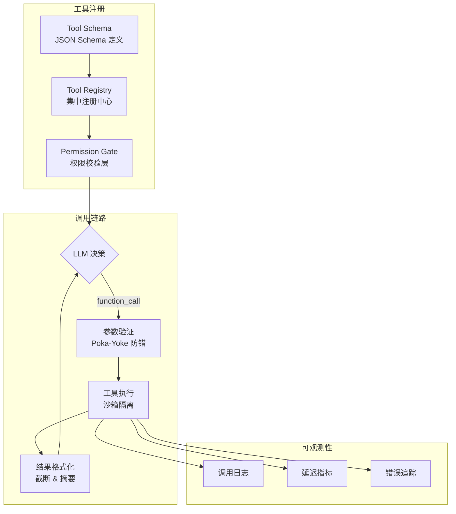
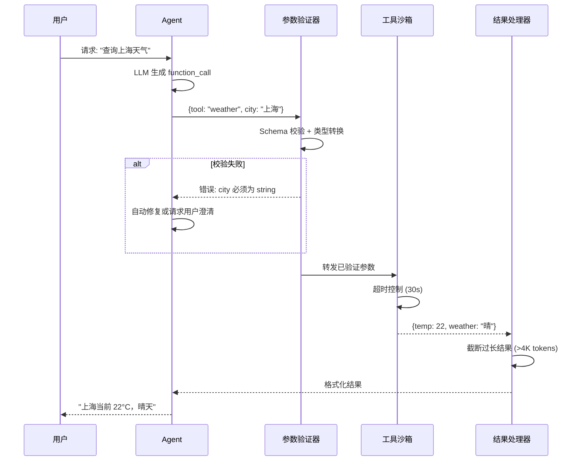
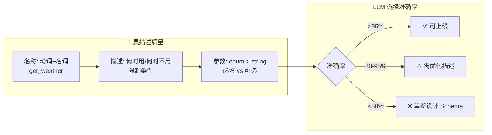
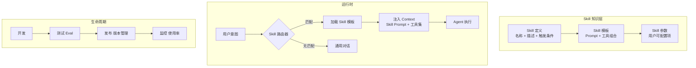

# 第 6 章 工具系统设计 — Agent 的手和脚
工具是 Agent 与外部世界交互的手和脚。没有工具的 Agent 只能思考和说话，有了工具它才能行动——发送邮件、查询数据库、操作文件系统、调用 API。但工具设计的质量直接决定了 Agent 的行为质量：一个描述含糊的工具会让 LLM 在错误的时机调用它；一个缺乏防护的工具可能导致灾难性的副作用。

Anthropic 在其 Agent 设计文档中提出了一个深刻的洞见：**工具的设计应该遵循 ACI（Agent-Computer Interface）原则，就像传统软件遵循 HCI（Human-Computer Interface）原则一样**。区别在于，你的"用户"不再是人类，而是一个通过自然语言理解世界的 LLM。这意味着工具的名称、描述和参数定义必须针对 LLM 的推理方式来优化。

本章首先讨论工具设计哲学（ACI 原则和 Poka-Yoke （参见第 6 章：工具系统设计） 防错设计），然后深入实现层面的关键模式（参数验证、错误处理、并发控制），最后介绍 MCP（Model Context Protocol）生态集成。

```mermaid
sequenceDiagram
    participant U as 用户
    participant A as Agent Core
    participant V as 参数验证
    participant T as 工具执行
    participant E as 错误处理
    // ... 完整实现见 code-examples/ 目录 ...
        T->>E: 错误处理
        E-->>A: 结构化错误+恢复建议
    end
    A-->>U: 最终回复
```


> **"An Agent without tools is just a chatbot with ambitions."**
> — Andrej Karpathy（意译）

大语言模型（LLM）本身是一个"纯思维"的存在——它能推理、规划、生成文本，但无法直接与外部世界交互。工具系统（Tool System）赋予了 Agent "手和脚"，让它能够读取数据库、调用 API、操作文件系统、执行代码，乃至控制物理设备。

本章将从设计哲学出发，系统性地讲解如何构建一个**安全、可扩展、可测试**的工具系统。我们将覆盖以下核心主题：

- **ACI 设计哲学**：如何让 LLM "读懂"工具定义，减少 token 浪费
- **三段式工具描述**：标准化的工具描述框架
- **Poka-Yoke 防错设计**：从权限、速率、成本多维度保护工具执行
- **MCP 深度集成**：与 Model Context Protocol 的完整对接
- **工具编排**：依赖解析、熔断、缓存、重试的完整编排方案
- **工具测试与质量保证**：Mock、Schema 快照测试、性能基准
- **实战：DevOps 工具生态系统**：完整的部署工作流示例

---

## 6.1 ACI 设计哲学



**图 6-1 工具系统全链路架构**——从注册到调用再到可观测性，工具系统的设计必须在灵活性和安全性之间取得平衡。Poka-Yoke 防错机制是最关键的守门人。


### 6.1.1 什么是 ACI？

ACI（Agent-Computer Interface）是 Agent 与外部工具交互的界面设计范式。正如优秀的 GUI 设计让人类用户能直觉地操作计算机，优秀的 ACI 设计让 LLM 能准确地理解和调用工具。

ACI 设计的三大原则：

1. **命名即文档**（Naming as Documentation）：工具名和参数名本身就应传达足够信息
2. **最小认知负荷**（Minimal Cognitive Load）：LLM 无需复杂推理即可正确使用工具
3. **防错优于纠错**（Prevention over Correction）：通过设计消除误用可能性

### 6.1.2 命名规范与验证

工具命名是 ACI 的第一道关卡。一个好的工具名应当是**自描述的**——LLM 看到名字就知道这个工具做什么。

```typescript
/**
 * 工具命名验证器
 * 强制执行 <领域>_<动词>_<宾语> 的命名规范
 * 例如：github_create_issue, k8s_scale_deployment
    // ... 完整实现见 code-examples/ 目录 ...
  tokenCost: number;
}
```

### 6.1.3 Tool Context Cost 分析

每一个注册到 Agent 的工具，其定义（名称 + 描述 + 参数 Schema）都会被注入到 system prompt 中，消耗宝贵的 context window。当工具数量增长到 50+ 时，仅工具定义就可能占据数千 token，严重挤压用户消息和推理空间。

```typescript
/**
 * 工具 Token 成本分析器
 * 精确计算每个工具定义在 context window 中的 token 开销
 */
    // ... 完整实现见 code-examples/ 目录 ...
  contextBudgetUsage: Record<string, number | string>;
}
```

### 6.1.4 自动描述生成器

手动撰写工具描述既耗时又容易不一致。`AutoDescriptionGenerator` 利用 LLM 从代码签名自动生成最优描述。

```typescript
/**
 * 自动工具描述生成器
 * 从 TypeScript 函数签名和 JSDoc 自动生成 LLM-friendly 的工具描述
 */
    // ... 完整实现见 code-examples/ 目录 ...
  }): Promise<{ content: string }>;
}
```

### 6.1.5 工具复杂度分级

不同复杂度的工具需要不同的设计策略。我们将工具分为三个层级：

| 层级 | 类型 | 特征 | 示例 |
|------|------|------|------|
| L1 | Simple（简单工具） | 单次 API 调用，无状态 | `weather_get_current` |
| L2 | Compound（复合工具） | 多步骤，有内部状态 | `git_create_pull_request` |
| L3 | Composite（组合工具） | 编排其他工具 | `deploy_full_stack` |

```typescript
/**
 * 工具复杂度评分系统
 * 帮助开发者理解工具的复杂程度，指导设计决策
 */
    // ... 完整实现见 code-examples/ 目录 ...
  subToolCount: number;
}
```

---

## 6.2 三段式工具描述


> **ACI 设计哲学：像设计 API 一样设计工具接口**
>
> Anthropic 提出的 Agent-Computer Interface (ACI) 理念，将工具设计提升到了与 API 设计同等重要的位置。核心原则是：**工具描述是写给 LLM 的文档**——就像 API 文档是写给开发者的一样。好的工具描述应该包含：（1）明确的使用场景和边界条件；（2）参数类型的严格约束（优先用 enum 替代 string）；（3）返回值的结构说明。实践表明，投入在工具描述上的每一小时，可以节省十倍的调试时间。


### 6.2.1 描述框架

优质的工具描述是 Agent 正确使用工具的基础。我们提出**三段式描述框架**：

```
第一段（WHAT）：一句话说明工具功能
第二段（WHEN）：使用场景、限制条件、与相似工具的区别
第三段（RETURNS）：返回值说明和可能的错误
```

这个框架源自一个关键洞察：**LLM 选择工具时的推理路径是 "我需要做什么 -> 哪个工具能做 -> 它会返回什么"**。三段式描述精确匹配了这个推理路径。

### 6.2.2 不同类型工具的描述示例

**只读工具（Read-only）**

```typescript
const searchDocsTool: ToolDefinition = {
  name: 'knowledge_search_docs',
  description: `在知识库中搜索与查询相关的文档片段。

    // ... 完整实现见 code-examples/ 目录 ...
  },
};
```

**写入工具（Write）**

```typescript
const createIssueTool: ToolDefinition = {
  name: 'github_create_issue',
  description: `在 GitHub 仓库中创建新的 Issue。

    // ... 完整实现见 code-examples/ 目录 ...
  },
};
```

**破坏性工具（Destructive）**

```typescript
const deleteDatabaseTool: ToolDefinition = {
  name: 'db_delete_records',
  description: `【危险操作】从数据库中永久删除匹配条件的记录。

    // ... 完整实现见 code-examples/ 目录 ...
  },
};
```

**长时间运行工具（Long-running）**

```typescript
const deployServiceTool: ToolDefinition = {
  name: 'k8s_deploy_service',
  description: `部署或更新 Kubernetes 服务，这是一个长时间运行的操作（通常 2-10 分钟）。

    // ... 完整实现见 code-examples/ 目录 ...
  },
};
```

### 6.2.3 参数描述最佳实践

参数描述的质量直接影响 LLM 填参的准确率。以下是关键原则：

```typescript
/**
 * 参数描述质量检查器
 * 确保每个参数的描述满足 LLM-friendly 标准
 */
    // ... 完整实现见 code-examples/ 目录 ...
  quality: 'good' | 'fair' | 'poor';
}
```

### 6.2.4 LLM-Friendly 错误消息设计

工具执行失败时返回的错误信息同样重要。LLM 需要理解错误原因才能决定下一步行动。

```typescript
/**
 * LLM 友好的错误消息构建器
 * 生成结构化的错误信息，帮助 LLM 理解错误并采取正确行动
 */
    // ... 完整实现见 code-examples/ 目录 ...
  invalidParams?: Array<{ param: string; reason: string }>;
}
```

---

## 6.3 Poka-Yoke 防错设计



**图 6-2 工具调用时序**——注意三个关键防护点：参数校验、沙箱隔离、结果截断。任何一环缺失都可能导致安全漏洞或 token 浪费。


Poka-Yoke（ポカヨケ）是丰田生产系统中的防错理念——**通过设计使错误不可能发生，而非依赖人的注意力**。在 Agent 工具系统中，LLM 就是那个"可能犯错的操作员"，我们需要通过多层防护让危险操作无法被误触发。

### 6.3.1 核心防护验证器

```typescript
/**
 * Poka-Yoke 防错验证器
 * 在工具执行前进行多维度安全检查
 */
    // ... 完整实现见 code-examples/ 目录 ...
  check(invocation: ToolInvocation): Promise<GuardResult>;
}
```

### 6.3.2 基础防护：参数安全守卫

```typescript
/**
 * 参数安全守卫
 * 检测危险参数模式，防止 SQL 注入、路径遍历等
 */
    // ... 完整实现见 code-examples/ 目录 ...
  }
}
```

### 6.3.3 速率限制守卫

```typescript
/**
 * 速率限制守卫
 * 使用滑动窗口算法限制工具调用频率
 */
    // ... 完整实现见 code-examples/ 目录 ...
  perUser: RateLimit;
}
```

### 6.3.4 输出大小守卫

```typescript
/**
 * 输出大小守卫
 * 防止工具返回过大的结果撑爆 context window
 */
    // ... 完整实现见 code-examples/ 目录 ...
  originalTokens: number;
}
```

### 6.3.5 成本守卫

```typescript
/**
 * 成本守卫
 * 跟踪和限制工具调用产生的费用
 */
    // ... 完整实现见 code-examples/ 目录 ...
  estimate(toolName: string, args: Record<string, unknown>): number;
}
```

### 6.3.6 超时守卫

```typescript
/**
 * 超时守卫
 * 根据工具类型动态设置执行超时时间
 */
    // ... 完整实现见 code-examples/ 目录 ...
  }
}
```

### 6.3.7 工具执行沙箱

```typescript
/**
 * 工具执行沙箱
 * 在隔离环境中执行工具，限制资源使用
 */
    // ... 完整实现见 code-examples/ 目录 ...
  };
}
```

### 6.3.8 基于角色的权限模型

```typescript
/**
 * 工具权限管理器
 * 基于 RBAC（Role-Based Access Control）控制工具访问
 */
    // ... 完整实现见 code-examples/ 目录 ...
  userPermissions: ToolPermission[];
}
```

### 6.3.9 审计日志

```typescript
/**
 * 工具调用审计日志
 * 记录每次工具调用的完整信息，用于审计和调试
 */
    // ... 完整实现见 code-examples/ 目录 ...
  write(entry: AuditLogEntry): Promise<void>;
}
```

### 6.3.10 防护体系集成

将所有守卫组合成完整的防护链：

```typescript
/**
 * 创建完整的防护体系
 * 按照检查优先级排列守卫
 */
    // ... 完整实现见 code-examples/ 目录 ...
  return validator;
}
```

---

## 6.4 MCP 深度集成


### 工具系统的性能优化实践

**1. 工具结果缓存**
相同参数的工具调用结果可以缓存复用。例如，天气 API 的结果在 10 分钟内有效——在此期间重复查询应直接返回缓存结果，既节省 API 成本，又降低延迟。缓存策略需要区分**幂等工具**（查询类，可安全缓存）和**非幂等工具**（写入类，不可缓存）。

**2. 并行工具调用**
当 LLM 同时生成多个独立的工具调用时（如同时查天气和查日历），应当并行执行而非串行。OpenAI 的 parallel function calling 和 Anthropic 的 batch tool use 都支持这一模式。并行执行可以将多工具场景的延迟从串行的 N×T 降低到 max(T1, T2, ..., TN)。

**3. 工具结果流式返回**
对于长时间运行的工具（如代码执行、数据库查询），应支持流式返回中间结果，让用户感知到进展而非等待一个长时间的空白。


### 6.4.1 MCP 协议概述

Model Context Protocol（MCP）是 Anthropic 于 2024 年发布的开放协议，旨在标准化 LLM 应用与外部工具/数据源之间的交互方式 [[MCP Specification]](https://modelcontextprotocol.io/specification/2025-06-18)。MCP 之于 Agent 工具系统，正如 HTTP 之于 Web——它定义了一套通用的通信规范，使得工具提供方和消费方可以解耦开发。

截至 2025 年，MCP 已成为 Agent 工具集成领域的**事实标准**（de-facto standard）。所有主流 IDE 和 Agent 平台（包括 VS Code、JetBrains、Cursor、Windsurf、Claude Desktop 等）均已原生支持 MCP，社区贡献的 MCP Server 超过 10,000 个，覆盖数据库、云服务、开发工具、企业应用等各个领域。

**MCP 的核心价值：**

| 特性 | 描述 |
|------|------|
| 标准化 | 统一的工具描述、调用、响应格式 |
| 可发现性 | 客户端可以动态发现服务端提供的工具 |
| 传输无关 | 支持 stdio（本地进程）和 Streamable HTTP（远程服务）两种传输方式 [[MCP Transports]](https://modelcontextprotocol.io/specification/2025-06-18/basic/transports) |
| 双向通信 | 服务端可以向客户端请求上下文（Sampling） |

**MCP 架构：**

```
Host (LLM 应用)
  +-- MCP Client
        |-- MCP Server A (via stdio)            -> 本地工具
        |-- MCP Server B (via Streamable HTTP)  -> 远程服务
        +-- MCP Server C (via Streamable HTTP)  -> 第三方 API
```

### 6.4.2 MCP 核心类型定义

```typescript
/**
 * MCP 协议核心类型定义
 * 基于 MCP 规范 2025-06-18 版本
 */
    // ... 完整实现见 code-examples/ 目录 ...
  };
}
```

### 6.4.2b MCP Resources 与 Prompts 原语

MCP 协议不仅仅是"工具调用协议"。MCP 2025-06-18 规范定义了三种核心原语（Primitive），构成完整的 Agent-Server 交互模型 [[MCP Specification]](https://modelcontextprotocol.io/specification/2025-06-18)：

| 原语 | 方向 | 控制方 | 用途 |
|------|------|--------|------|
| **Tools** | Server → Client | 模型发起调用 | 执行操作、产生副作用 |
| **Resources** | Server → Client | 应用程序控制 | 向 LLM 上下文注入结构化数据 |
| **Prompts** | Server → Client | 用户触发 | 提供可复用的 Prompt 模板 |

前文已深入讨论了 Tools 原语。本节补充 Resources 和 Prompts 两个同样重要但容易被忽视的原语。

#### Resources 原语

Resources 允许 MCP Server 向客户端暴露 **只读的结构化数据**，供 LLM 作为上下文使用。典型场景包括：数据库 Schema 暴露、配置文件内容、用户画像数据、实时日志流等。与 Tools 不同，Resources 不执行操作、不产生副作用——它们是纯粹的数据源。

```typescript
// ============================================================
// MCP Resources 原语 -- 类型定义
// ============================================================

    // ... 完整实现见 code-examples/ 目录 ...
  params: { uri: string };
}
```

Resource Template 是一种强大的参数化机制。例如，一个数据库 MCP Server 可以暴露模板 `db://{schema}/{table}`，客户端通过填入具体参数（如 `db://public/users`）来读取特定表的 Schema 信息，而不需要为每张表注册独立的资源。

#### Prompts 原语

Prompts 允许 MCP Server 暴露 **可复用的 Prompt 模板**，供用户通过斜杠命令（如 `/review-code`）或 UI 选择触发。这与 Tools 的关键区别在于：Tools 由模型自主决定何时调用，而 Prompts 由用户显式触发。

```typescript
// ============================================================
// MCP Prompts 原语 -- 类型定义
// ============================================================

    // ... 完整实现见 code-examples/ 目录 ...
  }>;
}
```

一个典型的 Prompts 使用场景：代码审查 MCP Server 提供 `review-code` Prompt，用户在 IDE 中输入 `/review-code`，客户端调用 `prompts/get` 获取包含审查规则和输出格式的完整 Prompt 模板，然后将其注入 LLM 上下文。模板中还可以通过嵌入 Resource 引用来自动拉取相关代码文件。

#### 三原语协作模式

三种原语在实际集成中互相配合，形成完整的 Agent-Server 交互链路：

```
┌──────────────────────────────────────────────────────────────────┐
│                      MCP 三原语协作流程                           │
├──────────────────────────────────────────────────────────────────┤
│                                                                  │
    // ... 完整实现见 code-examples/ 目录 ...
│                                                                  │
└──────────────────────────────────────────────────────────────────┘
```

这种分层设计的核心价值在于 **关注点分离**：

- **Prompts** 封装"怎么问"——将领域知识和最佳实践固化为模板，降低用户使用门槛。
- **Resources** 封装"知道什么"——将动态数据以标准接口暴露，避免 LLM 产生幻觉（Hallucination）。
- **Tools** 封装"能做什么"——将操作能力标准化，由模型在充分上下文下自主调用。

> **设计提示**：在实现 MCP Server 时，优先考虑哪些数据适合作为 Resources 暴露（而非硬编码在 Tool 的 description 中），哪些常见工作流适合封装为 Prompts（而非让用户每次手动编写）。三原语的合理划分，能显著降低 Token 消耗并提升 Agent 的一致性表现。

### 6.4.3 Stdio 传输模式实现

Stdio 传输模式适用于本地 MCP Server——通过子进程的标准输入/输出进行通信。

```typescript
import { ChildProcess, spawn } from 'child_process';
import { EventEmitter } from 'events';
import * as readline from 'readline';

    // ... 完整实现见 code-examples/ 目录 ...
  }
}
```

### 6.4.4 SSE 传输模式实现（已废弃）

> **⚠️ 废弃声明**：旧版 HTTP+SSE 双端点传输已在 MCP 2025-06-18 规范修订中标记为 **legacy/deprecated** [[MCP Transports]](https://modelcontextprotocol.io/specification/2025-06-18/basic/transports)。新项目应使用 6.4.4b 节介绍的 Streamable HTTP 传输。以下代码仅供维护旧系统时参考。

SSE（Server-Sent Events）传输曾是远程 MCP Server 的标准传输方式，通过 HTTP 进行通信。该方案使用两个独立端点（`/sse` 用于建立 SSE 长连接，`/messages` 用于发送请求），在部署和连接管理上存在诸多限制。

```typescript
/**
 * MCP SSE 传输层
 * 使用 HTTP POST 发送请求，通过 SSE 接收响应
 */
    // ... 完整实现见 code-examples/ 目录 ...
  }
}
```

### 6.4.4b Streamable HTTP 传输模式（主要传输）

> **当前标准**：Streamable HTTP 是 MCP 2025-06-18 规范指定的**主要远程传输方式**，完全取代了旧版 HTTP+SSE 双端点方案 [[MCP Transports]](https://modelcontextprotocol.io/specification/2025-06-18/basic/transports)。Streamable HTTP 使用单一 HTTP 端点，在同一连接上支持请求-响应和流式两种模式，大幅简化了部署架构。

**Streamable HTTP vs 旧版 SSE 对比**：

| 特性 | 旧版 HTTP+SSE（已废弃） | Streamable HTTP（当前标准） |
|------|-------------|-----------------|
| 端点数量 | 2 个（/sse + /messages） | 1 个（/mcp） |
| 连接管理 | 长连接 SSE 流 | 按需连接，可选流式 |
| 无状态支持 | 否（需持久连接） | 是（支持无状态和有状态两种模式） |
| 恢复能力 | 需重新建连 | 支持会话恢复（Mcp-Session-Id） |
| 部署友好性 | 需 SSE 支持的基础设施 | 标准 HTTP，兼容 CDN/负载均衡 |

```typescript
/**
 * Streamable HTTP Transport（MCP 2025-06-18 规范，主要远程传输方式）
 *
 * 核心改进：
    // ... 完整实现见 code-examples/ 目录 ...
  }
}
```

> **迁移建议**：所有新项目**必须**使用 Streamable HTTP 传输。旧版 HTTP+SSE 传输已在 2025-06-18 规范修订中正式标记为 deprecated，仅建议在维护遗留系统时使用。对于本地 MCP Server（如 IDE 插件），stdio 传输仍是最佳选择 [[MCP Transports]](https://modelcontextprotocol.io/specification/2025-06-18/basic/transports)。

### 6.4.4c MCP 授权框架（OAuth 2.1）

MCP 规范指定了 **OAuth 2.1** 作为远程 MCP Server 的标准授权框架（最初在 2025-03-26 规范修订中引入）[[MCP Specification]](https://modelcontextprotocol.io/specification/2025-06-18)，用于身份验证和权限控制。这意味着所有需要认证的远程 MCP Server 都应遵循统一的 OAuth 2.1 流程，而不是各自实现私有的认证方案。

**授权流程**：

```
┌──────────┐     ┌──────────────┐     ┌──────────────────┐
│ MCP      │     │ Authorization│     │ Remote MCP       │
│ Client   │     │ Server       │     │ Server           │
└────┬─────┘     └──────┬───────┘     └────────┬─────────┘
    // ... 完整实现见 code-examples/ 目录 ...
     │  Bearer Token 验证                      │
     │<──────────────────────────────────────────
```

```typescript
/**
 * MCP OAuth 2.1 授权管理器
 * 实现远程 MCP Server 的认证流程
 */
    // ... 完整实现见 code-examples/ 目录 ...
  }
}
```

> **安全提示**：OAuth 2.1 相比 OAuth 2.0 的主要变化是：(1) **强制 PKCE** 用于所有客户端类型；(2) **禁止隐式授权**（Implicit Flow）；(3) **Refresh Token 需要旋转**（Rotation）或绑定至发送者。这些改进显著提升了 MCP 远程 Server 场景下的安全性。

### 6.4.4d Elicitation（用户信息请求）

MCP 规范包含 Elicitation 能力（2025-03-26 修订引入），允许 MCP Server 在工具执行过程中向用户请求额外信息。这解决了一个常见问题：工具执行时发现需要用户确认或补充输入，但传统 MCP 流程中没有"反向请求"机制。

**典型场景**：
- 文件删除工具请求用户确认："确定要删除这 15 个文件吗？"
- 数据库工具请求凭证："请提供目标数据库的连接密码"
- 部署工具请求选择："检测到 3 个可用环境，请选择部署目标"

```typescript
/**
 * Elicitation 消息类型
 * Server → Client 方向的请求，要求用户提供额外信息
 */
    // ... 完整实现见 code-examples/ 目录 ...
  };
}
```

> **设计要点**：Elicitation 体现了 MCP 的"人在回路"（Human-in-the-Loop）设计哲学。MCP Client（Host 应用）有权决定是否将 Elicitation 请求展示给用户，可以根据安全策略自动拒绝或过滤敏感请求。

### 6.4.5 MCP 客户端实现

```typescript
/**
 * MCP 客户端
 * 封装与单个 MCP Server 的完整交互逻辑
 */
    // ... 完整实现见 code-examples/ 目录 ...
  accessToken?: string;
}
```

### 6.4.6 多 MCP Server 管理器

在实际应用中，一个 Agent 可能同时连接多个 MCP Server（文件系统、数据库、Web 搜索等）。MCPServerManager 统一管理这些连接。

```typescript
/**
 * MCP Server 管理器
 * 管理多个 MCP Server 连接，提供统一的工具发现和调用接口
 */
    // ... 完整实现见 code-examples/ 目录 ...
  toolCount: number;
}
```

### 6.4.7 MCP 错误处理与重连

```typescript
/**
 * 带自动重连功能的 MCP 客户端包装器
 * 处理连接断开、超时、协议错误等异常
 */
    // ... 完整实现见 code-examples/ 目录 ...
  healthCheckIntervalMs: number;
}
```

### 6.4.8 动态工具注册

将 MCP 发现的工具动态注册到 Agent 的工具系统中：

```typescript
/**
 * 动态工具注册表
 * 将 MCP 工具和本地工具统一管理
 */
    // ... 完整实现见 code-examples/ 目录 ...
  duration: number;
}
```

## 6.5 工具编排 — 从单兵作战到协同作战



**图 6-3 工具描述质量评估框架**——工具描述的质量直接决定 LLM 的调用准确率。经验法则：如果一个工具的选择准确率低于 80%，问题几乎总是出在描述而非模型上。


真实的 Agent 任务很少只调用一个工具。部署一个服务可能需要：拉取代码 → 构建镜像 → 推送仓库 → 更新 K8s → 验证健康检查。这就是**工具编排**要解决的问题。

### 6.5.1 编排模式总览

```
┌─────────────────────────────────────────────────┐
│              工具编排模式                          │
├────────────┬──────────────┬─────────────────────┤
│   串行链    │   并行扇出    │     DAG 编排         │
    // ... 完整实现见 code-examples/ 目录 ...
│ 作为下一步输入│ 并行执行      │ 支持条件分支          │
└────────────┴──────────────┴─────────────────────┘
```

### 6.5.2 工具编排器：链式与并行

```typescript
// ---- 工具编排器：支持链式、并行、条件分支 ----

/** 编排步骤定义 */
interface OrchestrationStep {
    // ... 完整实现见 code-examples/ 目录 ...
  }
}
```

### 6.5.3 DAG 执行器：复杂依赖编排

当步骤之间存在任意依赖关系时，我们需要 DAG（有向无环图）执行器。它会自动进行拓扑排序，找出可以并行的步骤批次。

```typescript
// ---- DAG 执行器：基于拓扑排序的依赖编排 ----

interface DAGNode {
  id: string;
    // ... 完整实现见 code-examples/ 目录 ...
  }
}
```

**使用示例：部署流水线**

```typescript
// 定义部署流水线的 DAG 节点
const deploymentDAG: DAGNode[] = [
  {
    id: 'pull-code',
    // ... 完整实现见 code-examples/ 目录 ...
const dagExecutor = new ToolDAGExecutor(toolExecutor);
const results = await dagExecutor.execute(deploymentDAG);
```

### 6.5.4 熔断器模式

当某个工具持续失败时，继续调用只会浪费时间和 token。熔断器在连续失败达到阈值后自动"断路"，快速返回错误，并定期探测恢复。

```typescript
// ---- 熔断器：保护不稳定的外部工具 ----

enum CircuitState {
  CLOSED = 'CLOSED',       // 正常状态，允许调用
    // ... 完整实现见 code-examples/ 目录 ...
  }
}
```

### 6.5.5 工具结果缓存

对于幂等的只读工具（如搜索、查询），缓存结果可以显著减少 API 调用和延迟。

```typescript
// ---- 工具结果缓存：TTL + LRU 淘汰 ----

interface CacheEntry<T = unknown> {
  key: string;
    // ... 完整实现见 code-examples/ 目录 ...
  }
}
```

### 6.5.6 重试策略

不同的失败场景需要不同的重试策略。临时网络问题可以立即重试，而限流错误则需要指数退避。

```typescript
// ---- 重试策略：为不同失败场景选择合适的重试方式 ----

type RetryStrategy = 'immediate' | 'fixed' | 'exponential' | 'exponential_jitter';

    // ... 完整实现见 code-examples/ 目录 ...
  }
}
```

> **编排组合实践**：在生产环境中，熔断器、缓存和重试通常组合使用。典型的调用链路为：`缓存查询 → 重试包装 → 熔断器保护 → 实际工具调用`。这种分层设计让每一层专注于自己的职责，组合后提供了强大的容错能力。


## 6.6 工具测试与质量保障


### 工具数量的"甜蜜点"

一个关键的工程问题是：一个 Agent 应该挂载多少工具？研究和实践表明：

- **5-10 个工具**：LLM 选择准确率 >95%，最佳平衡点
- **10-20 个工具**：准确率下降到 85-90%，需要优化工具描述
- **20+ 个工具**：准确率可能低于 80%，建议引入 Skill 路由或工具分组

当工具数量超过 15 个时，与其继续堆叠工具，不如引入**工具路由层**：先根据用户意图选择工具子集（3-5 个），再由 LLM 在子集中做最终选择。这种两阶段策略在实践中效果显著。


工具是 Agent 与外部世界交互的桥梁，一个有 bug 的工具可能导致 Agent 执行整条链路的失败。本节介绍如何系统性地测试工具。

### 6.6.1 工具 Mock 框架

测试 Agent 工具链时，我们不希望真正调用外部 API。Mock 框架让我们可以模拟各种响应场景。

```typescript
// ---- 工具 Mock 框架：模拟工具行为用于测试 ----

/** Mock 响应定义 */
interface MockResponse {
    // ... 完整实现见 code-examples/ 目录 ...
  }
}
```

**使用示例**

```typescript
// 设置 mock
const mocker = new ToolMocker();

mocker.when('github_search_issues')
    // ... 完整实现见 code-examples/ 目录 ...
mocker.verify('github_create_comment').calledAtLeastOnce();
mocker.verify('slack_send_message').calledTimes(2);
```

### 6.6.2 Schema 快照测试

工具的 JSON Schema 是 Agent 的"API 契约"。任何不经意的 Schema 变更都可能导致 Agent 行为异常。快照测试可以在 CI 中自动捕获这些变更。

```typescript
// ---- Schema 快照测试：捕获不经意的契约变更 ----

interface SchemaSnapshot {
  toolName: string;
    // ... 完整实现见 code-examples/ 目录 ...
  severity?: 'breaking' | 'warning' | 'info';
}
```

### 6.6.3 工具链集成测试

单个工具测试通过不代表工具链能正常工作。集成测试验证多个工具按预期顺序和数据流协作。

```typescript
// ---- 工具链集成测试运行器 ----

interface ChainTestCase {
  name: string;
    // ... 完整实现见 code-examples/ 目录 ...
  }
}
```

### 6.6.4 工具性能基准测试

```typescript
// ---- 工具性能基准测试 ----

interface BenchmarkResult {
  toolName: string;
    // ... 完整实现见 code-examples/ 目录 ...
  }
}
```


## 6.7 实战：DevOps Agent 工具集

本节将前面所有概念融合为一个完整的实战案例——构建一个 DevOps Agent 的工具集。该 Agent 能够自动化处理从代码管理到部署监控的完整流程。

### 6.7.1 GitHub 工具集

```typescript
// ---- DevOps 实战：GitHub 工具集 ----

interface GitHubConfig {
  token: string;
    // ... 完整实现见 code-examples/ 目录 ...
  }
}
```

### 6.7.2 Docker 工具集

```typescript
// ---- DevOps 实战：Docker 工具集 ----

interface DockerConfig {
  socketPath?: string;
    // ... 完整实现见 code-examples/ 目录 ...
  }
}
```

### 6.7.3 Kubernetes 工具集

```typescript
// ---- DevOps 实战：Kubernetes 工具集 ----

interface K8sConfig {
  kubeconfig?: string;
    // ... 完整实现见 code-examples/ 目录 ...
  }
}
```

### 6.7.4 监控告警工具集

```typescript
// ---- DevOps 实战：监控告警工具集 ----

class MonitoringToolkit {
  getToolDefinitions(): ToolDefinition[] {
    // ... 完整实现见 code-examples/ 目录 ...
  }
}
```

### 6.7.5 完整部署工作流

将所有工具集组合为一个完整的部署工作流：

```typescript
// ---- 完整部署工作流：集成所有工具集 ----

class DeploymentWorkflow {
  private orchestrator: ToolOrchestrator;
    // ... 完整实现见 code-examples/ 目录 ...
  }
}
```

---

## 6.8 Skill 工程 — 从工具调用到知识驱动

### 6.8.1 工具泛滥问题

当 Agent 接入的 MCP 工具超过 20 个时，一个反直觉的现象出现了：**决策准确率不升反降**。这不是 LLM 能力的问题，而是信息过载——100 个工具的描述占用约 22,000 个 token，挤占了上下文窗口的大量空间。LLM 被迫在海量工具描述中搜索匹配项，而不是专注于理解用户意图。

Claude Code 的解决方案极具启发性：它只暴露 4 个通用工具（Read、Write、Bash、Search），通过丰富的指令赋予每个工具远超其名称的能力。这揭示了一个关键洞察：**更少的工具 + 更好的指令 > 更多的专用工具**。

### 6.8.2 Skill 的定义与定位

**Skill** 是工具（Tool）之上的知识层，将"做什么"（工具调用）和"怎么做"（领域知识、执行策略、质量标准）打包为可复用的单元。


**图 6-4 Skill 知识层架构**——Skill 是介于"工具"和"Agent"之间的抽象层，将特定领域的 Prompt 模板、工具组合和参数配置封装为可复用的能力单元。

> **Skill vs 动态工具加载**
>
> 一种替代方案是根据对话上下文按需加载工具子集。这能缓解 token 占用问题，但无法解决更深层问题：单个工具缺乏"怎么做"的领域知识。Skill 的核心价值不在于减少工具数量（虽然它也做到了），而在于将碎片化的工具调用组织为**有目的、有策略、有质量标准的行动方案**。当工具数量少于 15 个时，动态加载可能够用；超过这个阈值，Skill 层的投入产出比开始显现。

### 6.8.3 Skill 与 MCP Tool 的本质区别

| 维度 | MCP Tool | Skill |
|------|----------|-------|
| **抽象层级** | 单一操作（读文件、调 API） | 任务流程（代码审查、数据分析） |
| **知识含量** | 只有参数 Schema | 包含领域知识、执行策略、质量标准 |
| **触发方式** | LLM function_call | 意图匹配路由 |
| **上下文影响** | 消耗固定 token（Schema） | 动态注入相关 Prompt + 工具子集 |
| **可组合性** | 通过编排器组合 | 原生支持 Skill 组合和委托 |
| **生命周期** | 注册/注销 | 开发→测试→发布→监控→迭代 |

### 6.8.4 SKILL.md 规范

Skill 的定义采用 Markdown 格式的 `SKILL.md` 文件，包含以下核心字段：

```markdown
---
name: code-review
description: 对代码变更进行安全性、性能和可维护性审查
version: 1.2.0
triggers:
  - "review this code"
  - "检查这段代码"
  - "code review"
tools:
  - file_read
  - git_diff
  - linter_run
---

## 执行策略

1. 获取变更文件列表 (git_diff)
2. 逐文件读取内容 (file_read)
3. 运行静态分析 (linter_run)
4. 按以下维度评审：安全漏洞 > 逻辑错误 > 性能问题 > 代码风格

## 质量标准

- 安全漏洞必须标记为 CRITICAL
- 每个问题附带修复建议和代码示例
- 总结中给出 PASS / NEEDS_WORK / REJECT 评级
```

SKILL.md 的设计哲学是**可读即可用**——它既是给开发者看的文档，也是给 Agent 运行时解析的配置。`triggers` 字段定义了意图匹配规则，`tools` 字段声明了最小工具集，正文部分包含领域知识和执行策略。

### 6.8.5 五种 Skill 设计模式

| 模式 | 说明 | 适用场景 | 示例 |
|------|------|---------|------|
| **Instruction Skill** | 纯指令，无工具调用 | 格式转换、文案生成 | 日报生成 Skill |
| **Tool Orchestration Skill** | 编排多个工具的调用顺序 | 复杂工作流 | DevOps 部署 Skill |
| **Retrieval Skill** | 先检索知识再生成 | 领域问答 | 法规咨询 Skill |
| **Guard Skill** | 守护和校验其他 Skill 的输出 | 安全审查 | 合规检查 Skill |
| **Composite Skill** | 组合多个子 Skill | 端到端流程 | 完整代码审查 Skill |

### 6.8.6 Skill 路由与上下文注入

Skill 系统的运行时核心是两个组件：

**Skill 路由器**：根据用户输入匹配最相关的 Skill。匹配策略从简到复：（1）关键词精确匹配；（2）语义相似度匹配（embedding）；（3）LLM 分类器匹配。推荐从关键词匹配起步，在准确率不足时逐步升级。

**Context 注入器**：匹配成功后，将 Skill 的 Prompt 模板和工具子集注入 Agent 的上下文。关键设计决策是注入位置——Skill Prompt 应放在 System Prompt 之后、对话历史之前，确保它既能被 LLM "看到"，又不会覆盖全局系统指令。

### 6.8.7 从 MCP Server 到 Skill 的迁移

当工具数量超过 15 个时，建议逐步将高频工具组合迁移为 Skill：

1. **识别候选**：分析工具调用日志，找出经常被连续调用的工具组合（如 `git_diff` → `file_read` → `linter_run` 总是一起出现）
2. **提取知识**：将隐含在 Prompt 中的领域知识显式化为 SKILL.md
3. **定义触发器**：基于用户历史查询提取高频意图模式
4. **A/B 测试**：在 Skill 路由和通用工具选择之间做对比测试
5. **渐进推广**：先迁移准确率最高的 Skill，逐步覆盖更多场景


## 6.9 本章小结

本章系统性地介绍了 Agent 工具系统的设计方法论。以下是核心要点回顾：

### 设计原则速查表

| 原则 | 核心思想 | 关键实践 |
|------|---------|---------|
| ACI 优先 | 工具接口为 LLM 设计，而非为人类设计 | 限制名称长度、控制参数数量、优化 token 成本 |
| 三段式描述 | WHAT + WHEN + RETURNS | 每个描述回答三个关键问题，消除歧义 |
| 防呆设计 | 预防错误而非事后补救 | 参数校验、速率限制、输出截断、成本控制 |
| 最小权限 | 工具只拥有必要的权限 | RBAC 模型、操作审计、沙箱执行 |

### 技术栈选型建议

| 场景 | 推荐方案 | 理由 |
|------|---------|------|
| 工具协议 | MCP (Model Context Protocol) | 标准化、跨语言、支持动态发现 |
| 进程内工具 | 直接函数调用 + Schema 验证 | 低延迟、类型安全 |
| 远程工具 | MCP over Streamable HTTP | 单一端点、支持流式和请求-响应、兼容标准 HTTP 基础设施 |
| 工具编排 | DAG 执行器 | 自动并行化、依赖管理、可视化 |
| 容错处理 | 熔断器 + 指数退避重试 | 保护下游服务、避免级联故障 |
| 测试策略 | Mock 框架 + Schema 快照 | 隔离外部依赖、捕获契约变更 |

### 复杂度管理矩阵

| 工具复杂度 | 参数数量 | 嵌套层数 | 建议 |
|-----------|---------|---------|------|
| L1 简单 | 1-3 | 0 | 直接使用 |
| L2 复合 | 4-8 | 1 | 提供参数默认值和示例 |
| L3 组合 | 8+ | 2+ | 拆分为多个 L1/L2 工具 |

### 下一步建议

1. **从小处开始**：先为最高频的 3-5 个工具应用 ACI 规范，观察 Agent 准确率提升
2. **逐步引入防呆**：从参数校验开始，逐步添加速率限制和成本控制
3. **标准化协议**：采用 MCP 作为工具集成的统一协议——MCP 已成为行业事实标准，拥有超过 10,000 个社区 Server，可大幅降低接入成本
4. **持续测试**：将 Schema 快照测试集成到 CI/CD，防止无意的契约破坏
5. **监控先行**：为工具调用添加审计日志和性能指标，用数据驱动优化

> **核心理念**：工具系统的质量直接决定了 Agent 的能力上限。好的工具设计不是让工具"能用"，而是让 Agent "好用"——减少歧义、预防错误、优雅容错。这就是 ACI 设计哲学的精髓。


### 实战案例：从 5 个工具到 50 个工具的演进之路

一个企业内部助手项目的工具系统经历了典型的演进过程：

**阶段 1（5 个工具）**：日历查询、邮件发送、文档搜索、天气查询、翻译。所有工具平铺挂载，LLM 直接选择。选择准确率 98%，无需特殊处理。

**阶段 2（15 个工具）**：增加了 HR 系统、报销系统、会议室预订等。准确率下降到 88%。团队发现问题不在模型，而在工具描述——多个工具的描述过于相似（如"查询"类工具）。优化工具描述后，准确率回升到 94%。

**阶段 3（50 个工具）**：业务方不断提出新工具需求。即使优化描述，准确率也只有 75%。最终引入两层架构：第一层 Skill 路由（8 个 Skill 类别），第二层工具选择（每个 Skill 3-8 个工具）。准确率恢复到 95%，且新增工具只需归入对应 Skill 类别，不影响整体。

这个案例说明：**工具系统的架构必须随规模演进，没有一劳永逸的设计**。

