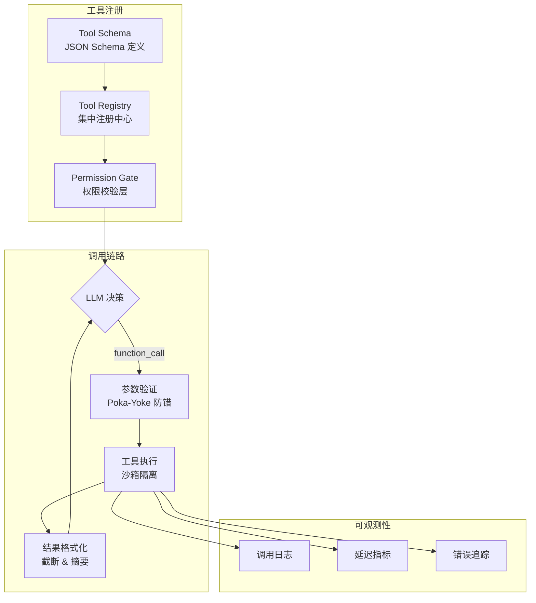
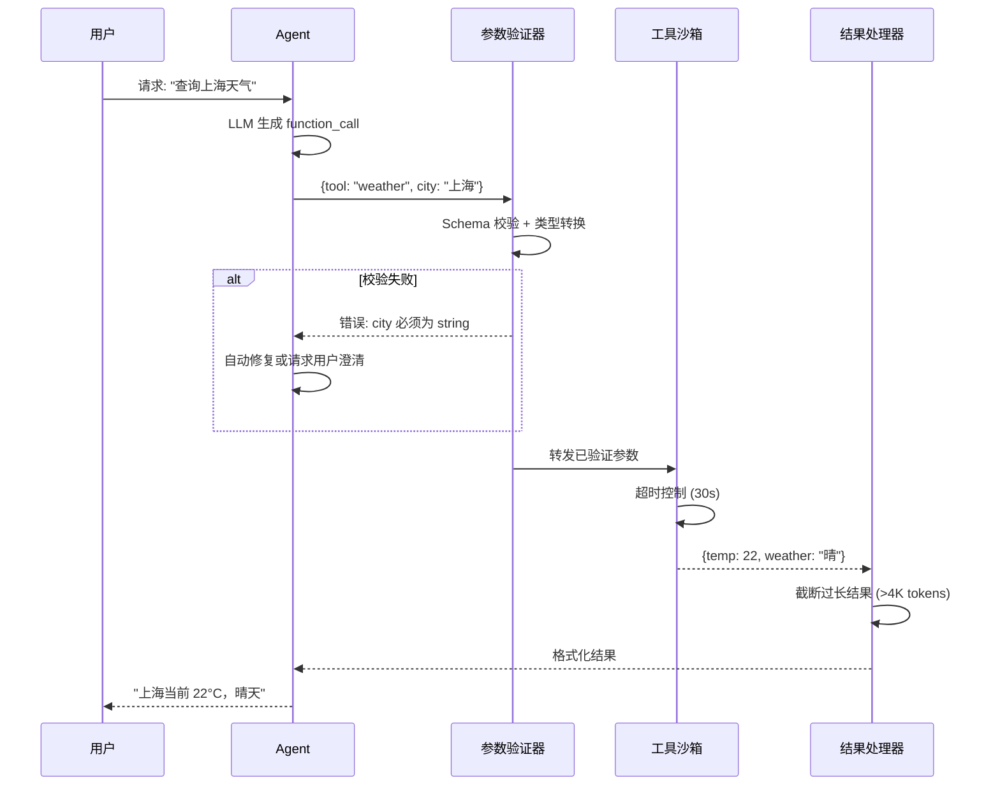
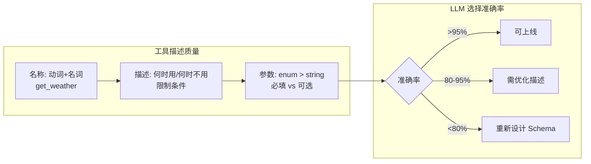
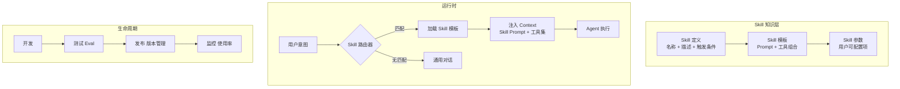

# 第 6 章 工具系统设计 — Agent 的手和脚

本章系统性地讲解 Agent 工具系统的设计与实现，从 Anthropic 提出的 ACI（Agent-Computer Interface）设计哲学到 MCP（Model Context Protocol）深度集成。工具是 Agent 与外部世界交互的唯一通道，工具描述的质量直接决定 Agent 的决策准确率。本章覆盖工具注册与发现、参数校验、错误处理、工具编排、测试保障，以及从工具到 Skill 的演进路径。前置依赖：第 3 章架构总览。

---

## 6.1 ACI 设计哲学


**图 6-1 工具系统全链路架构**——从注册到调用再到可观测性，工具系统的设计必须在灵活性和安全性之间取得平衡。Poka-Yoke 防错机制是最关键的守门人。

### 6.1.1 什么是 ACI？

ACI（Agent-Computer Interface）是 Agent 与外部工具交互的界面设计范式。正如优秀的 GUI 设计让人类用户能直觉地操作计算机，优秀的 ACI 设计让 LLM 能准确地理解和调用工具。

ACI 设计的三大原则：

1. **命名即文档**（Naming as Documentation）：工具名和参数名本身就应传达足够信息
2. **最小认知负荷**（Minimal Cognitive Load）：LLM 无需复杂推理即可正确使用工具
3. **防错优于纠错**（Prevention over Correction）：通过设计消除误用可能性

### 6.1.2 命名规范与验证

工具命名是 ACI 的第一道关卡。一个好的工具名应当是**自描述的**——LLM 看到名字就知道这个工具做什么。推荐采用 `<领域>_<动词>_<宾语>` 的命名规范，例如 `github_create_issue`、`k8s_scale_deployment`。命名验证器应强制执行这一规范，拒绝不符合格式的工具注册。完整的命名验证器实现见代码仓库 `code-examples/ch06-tool-system/tool-naming-validator.ts`。

### 6.1.3 Tool Context Cost 分析

每一个注册到 Agent 的工具，其定义（名称 + 描述 + 参数 Schema）都会被注入到 system prompt 中，消耗宝贵的 context window。当工具数量增长到 50+ 时，仅工具定义就可能占据数千 token，严重挤压用户消息和推理空间。工具 Token 成本分析器可以精确计算每个工具定义的 token 开销，帮助团队在工具数量和上下文预算之间做权衡。完整实现见代码仓库 `code-examples/ch06-tool-system/tool-context-cost.ts`。

### 6.1.4 自动描述生成器

手动撰写工具描述既耗时又容易不一致。`AutoDescriptionGenerator` 利用 LLM 从 TypeScript 函数签名和 JSDoc 自动生成 LLM-friendly 的工具描述，确保描述风格统一且覆盖使用场景、限制条件和返回值说明。完整实现见代码仓库 `code-examples/ch06-tool-system/auto-description-generator.ts`。

### 6.1.5 工具复杂度分级

不同复杂度的工具需要不同的设计策略：

| 层级 | 类型 | 特征 | 示例 |
|------|------|------|------|
| L1 | Simple（简单工具） | 单次 API 调用，无状态 | `weather_get_current` |
| L2 | Compound（复合工具） | 多步骤，有内部状态 | `git_create_pull_request` |
| L3 | Composite（组合工具） | 编排其他工具 | `deploy_full_stack` |

L1 工具可以直接使用；L2 工具应提供参数默认值和示例；L3 工具建议拆分为多个 L1/L2 工具，降低 LLM 的认知负荷。工具复杂度评分系统的完整实现见代码仓库 `code-examples/ch06-tool-system/tool-complexity.ts`。

---

## 6.2 三段式工具描述

> **ACI 设计哲学：像设计 API 一样设计工具接口**
>
> Anthropic 提出的 ACI 理念将工具设计提升到了与 API 设计同等重要的位置。核心原则是：**工具描述是写给 LLM 的文档**。好的工具描述应包含：（1）明确的使用场景和边界条件；（2）参数类型的严格约束（优先用 enum 替代 string）；（3）返回值的结构说明。实践表明，投入在工具描述上的每一小时，可以节省十倍的调试时间。

### 6.2.1 描述框架

优质的工具描述是 Agent 正确使用工具的基础。我们提出**三段式描述框架**：

```
第一段（WHAT）：一句话说明工具功能
第二段（WHEN）：使用场景、限制条件、与相似工具的区别
第三段（RETURNS）：返回值说明和可能的错误
```

这个框架源自一个关键洞察：**LLM 选择工具时的推理路径是 "我需要做什么 → 哪个工具能做 → 它会返回什么"**。三段式描述精确匹配了这个推理路径。

### 6.2.2 不同类型工具的描述要点

不同风险级别的工具需要不同侧重点的描述：

| 工具类型 | 描述侧重点 | 示例 |
|---------|-----------|------|
| **只读工具** | 强调返回值结构和数据范围 | `knowledge_search_docs`：注明返回 snippet 而非全文，标注相关性阈值 |
| **写入工具** | 强调副作用和前置条件 | `github_create_issue`：注明哪些字段是必填的，创建后不可撤销 |
| **破坏性工具** | 以【危险操作】开头，强调不可逆性 | `db_delete_records`：要求明确匹配条件，注明无法恢复 |
| **长时间运行工具** | 注明预期耗时和异步特性 | `k8s_deploy_service`：标注通常需要 2-10 分钟，返回操作 ID 而非最终结果 |

每种类型的完整描述示例见代码仓库 `code-examples/ch06-tool-system/tool-descriptions.ts`。

### 6.2.3 参数描述最佳实践

参数描述的质量直接影响 LLM 填参的准确率。关键原则包括：优先使用 `enum` 约束可选值（而非 `string` + 描述），为可选参数提供合理默认值和使用场景说明，用 `minimum`/`maximum` 约束数值范围，在描述中包含具体示例值。参数描述质量检查器的完整实现见代码仓库 `code-examples/ch06-tool-system/param-quality-checker.ts`。

### 6.2.4 LLM-Friendly 错误消息设计

工具执行失败时返回的错误信息同样重要——LLM 需要理解错误原因才能决定下一步行动。错误消息应包含：错误类型（是参数问题还是服务不可用）、建议的修复动作（重试、换参数、放弃）、以及 LLM 可以直接使用的修复参数示例。完整实现见代码仓库 `code-examples/ch06-tool-system/error-message-builder.ts`。

---

## 6.3 Poka-Yoke 防错设计


**图 6-2 工具调用时序**——注意三个关键防护点：参数校验、沙箱隔离、结果截断。任何一环缺失都可能导致安全漏洞或 token 浪费。

Poka-Yoke（ポカヨケ）是丰田生产系统中的防错理念——**通过设计使错误不可能发生，而非依赖人的注意力**。在 Agent 工具系统中，LLM 就是那个"可能犯错的操作员"，我们需要通过多层防护让危险操作无法被误触发。

### 6.3.1 防护体系总览

完整的 Poka-Yoke 防护体系由七种守卫按优先级组成：

| 守卫 | 职责 | 拦截示例 |
|------|------|---------|
| **参数安全守卫** | 检测 SQL 注入、路径遍历等危险模式 | `"; DROP TABLE users;--"` |
| **速率限制守卫** | 滑动窗口算法限制调用频率 | 同一工具每分钟 > 60 次 |
| **输出大小守卫** | 防止结果撑爆 context window | 返回值 > 4K tokens 时自动截断 |
| **成本守卫** | 跟踪和限制调用费用 | 单次会话费用超过预算阈值 |
| **超时守卫** | 按工具类型动态设置超时 | L1 工具 10s，L3 工具 300s |
| **权限守卫** | 基于 RBAC 控制工具访问 | 普通用户调用 `db_delete_records` |
| **审计日志** | 记录每次调用的完整信息 | 所有写入和破坏性操作 |

这些守卫按照"快速失败"原则排列——成本最低的检查（参数校验）最先执行，成本最高的检查（审计写入）最后执行。任何一层守卫拒绝，请求立即返回，不再执行后续守卫。

### 6.3.2 参数安全守卫：核心实现

参数安全守卫是最关键的防线，它检测输入中的危险模式。以下是核心检测逻辑，展示了如何同时防护 SQL 注入、路径遍历和命令注入三类攻击：

```typescript
// 文件: parameter-safety-guard.ts — 核心危险模式检测
export class ParameterSafetyGuard {
  private readonly patterns = [
    { name: "sql_injection", regex: /(['";]|--|\bUNION\b|\bDROP\b|\bDELETE\b)/i },
    { name: "path_traversal", regex: /\.\.[/\\]/ },
    { name: "command_injection", regex: /[;&|`$]|\b(rm|sudo|chmod)\b/ },
  ];

  check(params: Record<string, unknown>): GuardResult {
    for (const [key, value] of Object.entries(params)) {
      if (typeof value !== "string") continue;
      for (const { name, regex } of this.patterns) {
        if (regex.test(value))
          return { allowed: false, reason: `参数 "${key}" 匹配危险模式: ${name}` };
      }
    }
    return { allowed: true };
  }
}
```

其他守卫（速率限制、输出截断、成本控制、超时、RBAC 权限、审计日志）遵循相同的 `GuardResult` 接口，通过链式组合构成完整防护体系。完整实现见代码仓库 `code-examples/ch06-tool-system/poka-yoke-guards.ts`。

### 6.3.3 基于角色的权限模型

工具权限管理器基于 RBAC 控制工具访问。每个角色定义了允许的工具列表和操作类型（read/write/delete）。关键设计决策：**默认拒绝**——未显式授权的工具调用一律拒绝。破坏性工具（如 `db_delete_records`）要求额外的 `confirm` 权限，即使拥有 `delete` 权限也需要二次确认。

### 6.3.4 工具执行沙箱

沙箱在隔离环境中执行工具，限制 CPU 时间、内存使用和网络访问。沙箱通过 Node.js 的 `vm` 模块或容器隔离实现，确保一个工具的异常行为（如内存泄漏、无限循环）不会影响其他工具和宿主进程。完整实现见代码仓库 `code-examples/ch06-tool-system/tool-sandbox.ts`。

---

## 6.4 MCP 深度集成

### 工具系统的性能优化实践

在深入 MCP 之前，值得强调三个通用的工具系统性能优化策略：

1. **工具结果缓存**：相同参数的幂等工具调用可缓存复用（如天气 API 结果 10 分钟内有效），区分幂等工具（可缓存）和非幂等工具（不可缓存）。
2. **并行工具调用**：当 LLM 同时生成多个独立的工具调用时（如同时查天气和查日历），并行执行可将延迟从 N×T 降低到 max(T1, ..., TN)。
3. **工具结果流式返回**：对长时间运行的工具支持流式返回中间结果，让用户感知到进展。

### 6.4.1 MCP 协议概述

Model Context Protocol（MCP）是 Anthropic 于 2024 年发布的开放协议，旨在标准化 LLM 应用与外部工具/数据源之间的交互方式。MCP 之于 Agent 工具系统，正如 HTTP 之于 Web——定义了一套通用通信规范，使工具提供方和消费方可以解耦开发。

截至 2025 年，MCP 已成为 Agent 工具集成领域的**事实标准**。所有主流 IDE 和 Agent 平台（VS Code、JetBrains、Cursor、Windsurf、Claude Desktop 等）均已原生支持 MCP，社区贡献的 MCP Server 超过 10,000 个。

| 特性 | 描述 |
|------|------|
| 标准化 | 统一的工具描述、调用、响应格式 |
| 可发现性 | 客户端可以动态发现服务端提供的工具 |
| 传输无关 | 支持 stdio（本地进程）和 Streamable HTTP（远程服务） |
| 双向通信 | 服务端可以向客户端请求上下文（Sampling）和用户信息（Elicitation） |

**MCP 架构：**

```
Host (LLM 应用)
  +-- MCP Client
        |-- MCP Server A (via stdio)            -> 本地工具
        |-- MCP Server B (via Streamable HTTP)  -> 远程服务
        +-- MCP Server C (via Streamable HTTP)  -> 第三方 API
```

### 6.4.2 MCP 三原语

MCP 2025-06-18 规范定义了三种核心原语（Primitive），构成完整的 Agent-Server 交互模型：

| 原语 | 方向 | 控制方 | 用途 |
|------|------|--------|------|
| **Tools** | Server → Client | 模型发起调用 | 执行操作、产生副作用 |
| **Resources** | Server → Client | 应用程序控制 | 向 LLM 上下文注入结构化数据（只读） |
| **Prompts** | Server → Client | 用户触发 | 提供可复用的 Prompt 模板 |

**Tools** 是前文已深入讨论的核心原语——模型自主决定何时调用。

**Resources** 允许 MCP Server 暴露只读的结构化数据供 LLM 作为上下文使用。典型场景包括数据库 Schema 暴露、配置文件内容、用户画像数据等。Resources 不执行操作、不产生副作用，是纯粹的数据源。Resource Template 支持参数化（如 `db://{schema}/{table}`），客户端通过填入参数读取特定数据，无需为每个数据项注册独立资源。

**Prompts** 允许 MCP Server 暴露可复用的 Prompt 模板，供用户通过斜杠命令（如 `/review-code`）显式触发。与 Tools 的区别在于：Tools 由模型自主调用，Prompts 由用户显式触发。

三种原语协作时实现**关注点分离**：Prompts 封装"怎么问"，Resources 封装"知道什么"，Tools 封装"能做什么"。

> **设计提示**：实现 MCP Server 时，优先考虑哪些数据适合作为 Resources 暴露（而非硬编码在 Tool description 中），哪些工作流适合封装为 Prompts。三原语的合理划分能显著降低 Token 消耗并提升 Agent 一致性。

### 6.4.3 传输模式

MCP 支持两种传输模式：

**Stdio 传输**适用于本地 MCP Server——通过子进程的标准输入/输出进行 JSON-RPC 通信。这是 IDE 插件和本地工具的最佳选择，延迟极低。

**Streamable HTTP 传输**是 MCP 2025-06-18 规范指定的主要远程传输方式，完全取代了旧版 HTTP+SSE 双端点方案。核心改进：

| 特性 | 旧版 HTTP+SSE（已废弃） | Streamable HTTP（当前标准） |
|------|-------------|-----------------|
| 端点数量 | 2 个（/sse + /messages） | 1 个（/mcp） |
| 连接管理 | 长连接 SSE 流 | 按需连接，可选流式 |
| 无状态支持 | 否 | 是（支持无状态和有状态） |
| 恢复能力 | 需重新建连 | 支持会话恢复（Mcp-Session-Id） |
| 部署友好性 | 需 SSE 基础设施 | 标准 HTTP，兼容 CDN/负载均衡 |

> **迁移建议**：所有新项目**必须**使用 Streamable HTTP 传输。旧版 HTTP+SSE 已在 2025-06-18 规范中正式标记为 deprecated。

完整的 Stdio 和 Streamable HTTP 传输实现见代码仓库 `code-examples/ch06-tool-system/mcp-transports.ts`。

### 6.4.4 MCP 授权与安全

MCP 规范指定 **OAuth 2.1** 作为远程 MCP Server 的标准授权框架。OAuth 2.1 相比 2.0 的主要改进：强制 PKCE 用于所有客户端类型、禁止隐式授权（Implicit Flow）、Refresh Token 需要旋转或绑定至发送者。这些改进显著提升了远程 MCP Server 的安全性。

**Elicitation** 能力允许 MCP Server 在工具执行过程中向用户请求额外信息（如确认删除操作、提供数据库密码、选择部署目标）。这体现了 MCP 的"人在回路"（Human-in-the-Loop）设计哲学——MCP Client 有权决定是否将请求展示给用户，可以根据安全策略自动拒绝敏感请求。

完整的 OAuth 2.1 授权管理器和 Elicitation 处理实现见代码仓库 `code-examples/ch06-tool-system/mcp-auth.ts`。

### 6.4.5 多 MCP Server 管理

在实际应用中，一个 Agent 可能同时连接多个 MCP Server（文件系统、数据库、Web 搜索等）。MCPServerManager 统一管理这些连接，提供统一的工具发现和调用接口。它还负责连接生命周期管理、自动重连、健康检查和动态工具注册——将 MCP 发现的工具动态注册到 Agent 的工具系统中。完整实现见代码仓库 `code-examples/ch06-tool-system/mcp-server-manager.ts`。

---

## 6.5 工具编排 — 从单兵作战到协同作战


**图 6-3 工具描述质量评估框架**——工具描述的质量直接决定 LLM 的调用准确率。经验法则：如果一个工具的选择准确率低于 80%，问题几乎总是出在描述而非模型上。

真实的 Agent 任务很少只调用一个工具。部署一个服务可能需要：拉取代码 → 构建镜像 → 推送仓库 → 更新 K8s → 验证健康检查。这就是**工具编排**要解决的问题。

### 6.5.1 编排模式总览

工具编排有三种基本模式：

| 模式 | 特征 | 适用场景 |
|------|------|---------|
| **串行链** | 前一步输出作为下一步输入 | 线性流水线（构建 → 部署 → 验证） |
| **并行扇出** | 多个独立工具并行执行 | 同时查多个数据源 |
| **DAG 编排** | 任意依赖关系，支持条件分支 | 复杂部署流水线 |

工具编排器实现了链式、并行和条件分支三种模式。DAG 执行器基于拓扑排序自动找出可以并行的步骤批次，在保证依赖关系的前提下最大化并行度。完整实现见代码仓库 `code-examples/ch06-tool-system/tool-orchestrator.ts`。

### 6.5.2 容错机制

编排过程中的容错机制是生产环境的必需品：

- **熔断器模式**：当某个工具持续失败时自动"断路"，快速返回错误，定期探测恢复。避免在已知故障的工具上浪费时间和 token。
- **工具结果缓存**：对幂等只读工具缓存结果（TTL + LRU 淘汰），显著减少 API 调用和延迟。
- **重试策略**：不同失败场景使用不同策略——临时网络问题可立即重试，限流错误需指数退避 + 抖动。

> **编排组合实践**：生产环境中典型的调用链路为 `缓存查询 → 重试包装 → 熔断器保护 → 实际工具调用`。这种分层设计让每一层专注于自己的职责。完整实现见代码仓库 `code-examples/ch06-tool-system/tool-resilience.ts`。

---

## 6.6 工具测试与质量保障

> **工具数量的"甜蜜点"**：研究和实践表明，5-10 个工具时 LLM 选择准确率 >95%；10-20 个工具下降到 85-90%，需优化描述；20+ 个工具可能低于 80%，建议引入 Skill 路由或工具分组。当工具超过 15 个时，与其堆叠工具，不如引入两阶段策略：先按意图选择工具子集（3-5 个），再由 LLM 在子集中做最终选择。

工具是 Agent 与外部世界交互的桥梁，一个有 bug 的工具可能导致整条链路失败。工具测试需要覆盖四个层面：

| 测试类型 | 目的 | 关键技术 |
|---------|------|---------|
| **Mock 测试** | 模拟各种响应场景，不调用真实 API | Mock 框架支持成功/失败/超时/限流等场景 |
| **Schema 快照测试** | 捕获不经意的 Schema 变更 | 工具的 JSON Schema 是 Agent 的"API 契约"，任何变更都需显式审核 |
| **工具链集成测试** | 验证多工具按预期协作 | 端到端验证数据流和错误传播 |
| **性能基准测试** | 建立延迟和吞吐量基线 | 定期运行防止性能退化 |

建议将 Schema 快照测试集成到 CI/CD——每次 Schema 变更都会生成 diff 报告，标注破坏性变更（breaking change）。完整的测试框架实现见代码仓库 `code-examples/ch06-tool-system/tool-testing.ts`。

---

## 6.7 实战：DevOps Agent 工具集

本节将前面所有概念融合为一个完整的实战案例——构建 DevOps Agent 的工具集。该 Agent 能够自动化处理从代码管理到部署监控的完整流程。

### 工具集概览

| 工具集 | 核心工具 | 复杂度 | 关键设计要点 |
|--------|---------|--------|------------|
| **GitHub** | `search_issues`、`create_issue`、`create_pr`、`merge_pr` | L1-L2 | Token 认证、速率限制（5000 req/h）、Webhook 事件处理 |
| **Docker** | `build_image`、`push_image`、`list_containers` | L2 | Socket/HTTP 双模式、构建缓存策略、镜像大小监控 |
| **Kubernetes** | `apply_manifest`、`scale_deployment`、`get_pod_logs` | L2-L3 | kubeconfig 管理、命名空间隔离、滚动更新超时控制 |
| **监控告警** | `query_metrics`、`create_alert`、`get_incidents` | L1-L2 | PromQL 构造、告警去重、On-Call 路由 |

### 完整部署工作流

四个工具集通过 DAG 编排器组合为完整的部署工作流：

```
拉取代码(GitHub) → 构建镜像(Docker) → 推送镜像(Docker)
                                          ↓
                 验证健康检查(Monitoring) ← 部署(K8s)
```

工作流中每个步骤都包裹了熔断器和重试策略。构建和推送步骤使用串行链（有依赖），而部署后的多维度健康检查（HTTP 探针、日志分析、指标验证）使用并行扇出。完整的工具集实现和部署工作流见代码仓库 `code-examples/ch06-tool-system/devops-toolkit/`。

---

## 6.8 Skill 工程 — 从工具调用到知识驱动

### 6.8.1 工具泛滥问题

当 Agent 接入的 MCP 工具超过 20 个时，一个反直觉的现象出现了：**决策准确率不升反降**。这不是 LLM 能力的问题，而是信息过载——100 个工具的描述占用约 22,000 个 token，挤占了上下文窗口的大量空间。LLM 被迫在海量工具描述中搜索匹配项，而不是专注于理解用户意图。

Claude Code 的解决方案极具启发性：它只暴露 4 个通用工具（Read、Write、Bash、Search），通过丰富的指令赋予每个工具远超其名称的能力。这揭示了一个关键洞察：**更少的工具 + 更好的指令 > 更多的专用工具**。

这一洞察在 2026 年初引发了行业级的反思。Perplexity CTO Denis Yarats 公开披露，他们已经"拆除了所有 MCP 服务器"，改用 API/CLI + SKILL.md 的方案——因为 100 个 MCP 工具的 Schema 描述消耗约 50,000 Token，而等效的 SKILL.md 仅需约 200 Token，差距达 250 倍。YC 总裁 Garry Tan、Sentry 创始人 David Cramer 等业界人士随后跟进批评 MCP 在消费级 Agent 场景下"过度设计"。但需要注意的是，MCP 的核心价值在于**跨 Agent 互操作性和标准化发现机制**（参见 6.4 节），这在企业级多 Agent 协作中仍然不可替代。真正的工程答案不是二选一，而是**分层组合**——Skill 层负责知识路由和上下文管理，MCP 层负责底层工具执行和跨系统集成（参见 6.8.5 节 Tool Orchestration Skill 模式）。微软 .NET 团队的 Skills Executor 框架已经验证了这种混合架构的可行性。

### 6.8.2 Skill 的定义与定位

**Skill** 是工具（Tool）之上的知识层，将"做什么"（工具调用）和"怎么做"（领域知识、执行策略、质量标准）打包为可复用的单元。


**图 6-4 Skill 知识层架构**——Skill 是介于"工具"和"Agent"之间的抽象层，将特定领域的 Prompt 模板、工具组合和参数配置封装为可复用的能力单元。

> **Skill vs 动态工具加载**
>
> 一种替代方案是根据对话上下文按需加载工具子集。这能缓解 token 占用问题，但无法解决更深层问题：单个工具缺乏"怎么做"的领域知识。Skill 的核心价值不在于减少工具数量（虽然它也做到了），而在于将碎片化的工具调用组织为**有目的、有策略、有质量标准的行动方案**。当工具数量少于 15 个时，动态加载可能够用；超过这个阈值，Skill 层的投入产出比开始显现。

### 6.8.3 Skill 与 MCP Tool 的本质区别

| 维度 | MCP Tool | Skill |
|------|----------|-------|
| **抽象层级** | 单一操作（读文件、调 API） | 任务流程（代码审查、数据分析） |
| **知识含量** | 只有参数 Schema | 包含领域知识、执行策略、质量标准 |
| **触发方式** | LLM function_call | 意图匹配路由 |
| **上下文影响** | 消耗固定 token（Schema） | 动态注入相关 Prompt + 工具子集 |
| **可组合性** | 通过编排器组合 | 原生支持 Skill 组合和委托 |
| **生命周期** | 注册/注销 | 开发→测试→发布→监控→迭代 |

### 6.8.4 SKILL.md 规范

Skill 的定义采用 Markdown 格式的 `SKILL.md` 文件，包含以下核心字段：

```markdown
---
name: code-review
description: 对代码变更进行安全性、性能和可维护性审查
version: 1.2.0
triggers:
  - "review this code"
  - "检查这段代码"
  - "code review"
tools:
  - file_read
  - git_diff
  - linter_run
---

## 执行策略

1. 获取变更文件列表 (git_diff)
2. 逐文件读取内容 (file_read)
3. 运行静态分析 (linter_run)
4. 按以下维度评审：安全漏洞 > 逻辑错误 > 性能问题 > 代码风格

## 质量标准

- 安全漏洞必须标记为 CRITICAL
- 每个问题附带修复建议和代码示例
- 总结中给出 PASS / NEEDS_WORK / REJECT 评级
```

SKILL.md 的设计哲学是**可读即可用**——它既是给开发者看的文档，也是给 Agent 运行时解析的配置。`triggers` 字段定义了意图匹配规则，`tools` 字段声明了最小工具集，正文部分包含领域知识和执行策略。

### 6.8.5 五种 Skill 设计模式

| 模式 | 说明 | 适用场景 | 示例 |
|------|------|---------|------|
| **Instruction Skill** | 纯指令，无工具调用 | 格式转换、文案生成 | 日报生成 Skill |
| **Tool Orchestration Skill** | 编排多个工具的调用顺序 | 复杂工作流 | DevOps 部署 Skill |
| **Retrieval Skill** | 先检索知识再生成 | 领域问答 | 法规咨询 Skill |
| **Guard Skill** | 守护和校验其他 Skill 的输出 | 安全审查 | 合规检查 Skill |
| **Composite Skill** | 组合多个子 Skill | 端到端流程 | 完整代码审查 Skill |

### 6.8.6 Skill 路由与上下文注入

Skill 系统的运行时核心是两个组件：

**Skill 路由器**：根据用户输入匹配最相关的 Skill。匹配策略从简到复：（1）关键词精确匹配；（2）语义相似度匹配（embedding）；（3）LLM 分类器匹配。推荐从关键词匹配起步，在准确率不足时逐步升级。

**Context 注入器**：匹配成功后，将 Skill 的 Prompt 模板和工具子集注入 Agent 的上下文。关键设计决策是注入位置——Skill Prompt 应放在 System Prompt 之后、对话历史之前，确保它既能被 LLM "看到"，又不会覆盖全局系统指令。

### 6.8.7 从 MCP Server 到 Skill 的迁移

当工具数量超过 15 个时，建议逐步将高频工具组合迁移为 Skill：

1. **识别候选**：分析工具调用日志，找出经常被连续调用的工具组合（如 `git_diff` → `file_read` → `linter_run` 总是一起出现）
2. **提取知识**：将隐含在 Prompt 中的领域知识显式化为 SKILL.md
3. **定义触发器**：基于用户历史查询提取高频意图模式
4. **A/B 测试**：在 Skill 路由和通用工具选择之间做对比测试
5. **渐进推广**：先迁移准确率最高的 Skill，逐步覆盖更多场景


## 6.9 本章小结

### 设计原则速查表

| 原则 | 核心思想 | 关键实践 |
|------|---------|---------|
| ACI 优先 | 工具接口为 LLM 设计，而非为人类设计 | 限制名称长度、控制参数数量、优化 token 成本 |
| 三段式描述 | WHAT + WHEN + RETURNS | 每个描述回答三个关键问题，消除歧义 |
| 防呆设计 | 预防错误而非事后补救 | 参数校验、速率限制、输出截断、成本控制 |
| 最小权限 | 工具只拥有必要的权限 | RBAC 模型、操作审计、沙箱执行 |

### 技术栈选型建议

| 场景 | 推荐方案 | 理由 |
|------|---------|------|
| 工具协议 | MCP (Model Context Protocol) | 标准化、跨语言、支持动态发现 |
| 进程内工具 | 直接函数调用 + Schema 验证 | 低延迟、类型安全 |
| 远程工具 | MCP over Streamable HTTP | 单一端点、支持流式、兼容标准 HTTP 基础设施 |
| 工具编排 | DAG 执行器 | 自动并行化、依赖管理、可视化 |
| 容错处理 | 熔断器 + 指数退避重试 | 保护下游服务、避免级联故障 |
| 测试策略 | Mock 框架 + Schema 快照 | 隔离外部依赖、捕获契约变更 |

### 下一步建议

1. **从小处开始**：先为最高频的 3-5 个工具应用 ACI 规范，观察准确率提升
2. **逐步引入防呆**：从参数校验开始，逐步添加速率限制和成本控制
3. **标准化协议**：采用 MCP 作为统一协议——超过 10,000 个社区 Server 可大幅降低接入成本
4. **持续测试**：将 Schema 快照测试集成到 CI/CD，防止无意的契约破坏
5. **监控先行**：为工具调用添加审计日志和性能指标，用数据驱动优化

> **核心理念**：工具系统的质量直接决定了 Agent 的能力上限。好的工具设计不是让工具"能用"，而是让 Agent "好用"——减少歧义、预防错误、优雅容错。这就是 ACI 设计哲学的精髓。

### 实战案例：从 5 个工具到 50 个工具的演进之路

一个企业内部助手项目的工具系统经历了典型的演进过程：

**阶段 1（5 个工具）**：日历查询、邮件发送、文档搜索、天气查询、翻译。所有工具平铺挂载，LLM 直接选择。选择准确率 98%，无需特殊处理。

**阶段 2（15 个工具）**：增加了 HR 系统、报销系统、会议室预订等。准确率下降到 88%。团队发现问题不在模型，而在工具描述——多个"查询"类工具描述过于相似。优化描述后回升到 94%。

**阶段 3（50 个工具）**：即使优化描述，准确率也只有 75%。最终引入两层架构：第一层 Skill 路由（8 个 Skill 类别），第二层工具选择（每个 Skill 3-8 个工具）。准确率恢复到 95%，且新增工具只需归入对应 Skill 类别。

这个案例说明：**工具系统的架构必须随规模演进，没有一劳永逸的设计**。
