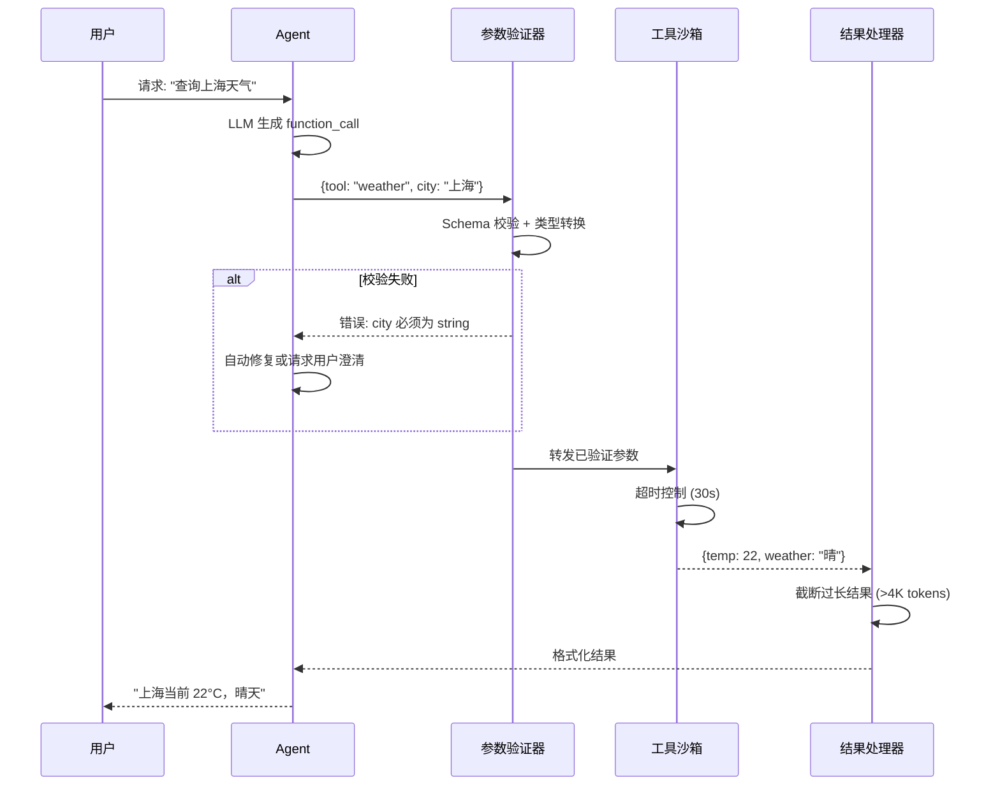
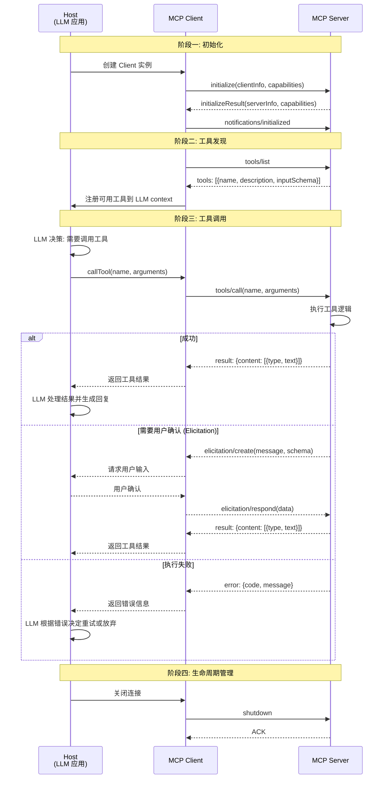
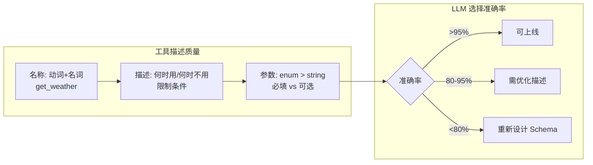
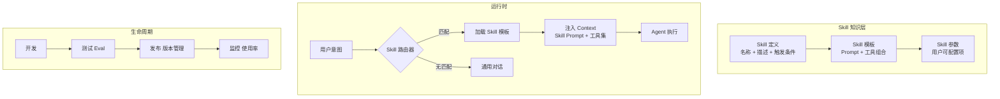
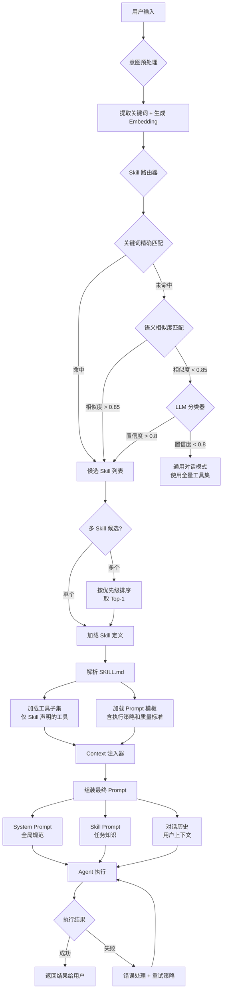

# 第 6 章 工具系统设计 — Agent 的手和脚

本章系统性地讲解 Agent 工具系统的设计与实现，从 ACI（Agent-Computer Interface）设计哲学到 MCP（Model Context Protocol）集成。工具是 Agent 与外部世界交互的关键通道，工具描述和调用边界的质量，直接决定 Agent 的决策准确率与安全性。本章覆盖工具注册与发现、参数校验、错误处理、工具编排、测试保障，以及从 Tool 到 Skill 的演进路径。前置依赖：第 3 章架构总览。

## 本章学习目标

读完本章，你将能够：

1. 解释 ACI 设计哲学，并将其应用于自己的工具接口设计
2. 为任意工具编写符合三段式框架的 LLM-friendly 描述
3. 实现完整的防错（Poka-Yoke）防护链，包括参数校验、速率限制、成本控制
4. 使用 MCP 协议集成本地和远程工具，理解三原语（Tools、Resources、Prompts）的分工
5. 设计工具编排策略（串行链、并行扇出、DAG），并为编排链路添加容错机制
6. 构建工具测试体系，包括 Mock 测试、Schema 快照测试和端到端工具链测试
7. 理解 Skill 工程的定位，掌握从 MCP Tool 到 Skill 的迁移路径
8. 判断何时该用 MCP、何时该用 Skill、何时两者组合

## 先给出三个工作定义

- **Tool**：Agent 可直接调用的最小能力单元
- **Skill**：在 Tool 之上封装出的高层复合能力或工作流
- **Protocol（如 MCP）**：能力暴露与互操作的标准化连接方式

如果你在阅读过程中感到这三个概念容易混淆，请始终回到这三个定义。

---

## 6.1 ACI 设计哲学


**图 6-1 工具系统全链路架构**——从注册到调用再到可观测性，工具系统的设计必须在灵活性和安全性之间取得平衡。防错（Poka-Yoke）机制是最关键的守门人。

### 6.1.1 什么是 ACI？

ACI（Agent-Computer Interface）是 Agent 与外部工具交互的界面设计范式。正如优秀的 GUI 设计让人类用户能直觉地操作计算机，优秀的 ACI 设计让 LLM 能准确地理解和调用工具。对工程团队来说，ACI 最重要的价值不是"更优雅"，而是**减少误用、降低调试成本，并让模型更稳定地做出正确调用决策**。

ACI 设计的三大原则：

1. **命名即文档**（Naming as Documentation）：工具名和参数名本身就应传达足够信息
2. **最小认知负荷**（Minimal Cognitive Load）：LLM 无需复杂推理即可正确使用工具
3. **防错优于纠错**（Prevention over Correction）：通过设计消除误用可能性

### 6.1.2 命名规范与验证

工具命名是 ACI 的第一道关卡。很多"模型不会用工具"的问题，本质上其实是"工具接口写得像内部实现，而不是写给模型看的文档"。一个好的工具名应当是**自描述的**——LLM 看到名字就知道这个工具做什么。推荐采用 `<领域>_<动词>_<宾语>` 的命名规范，例如 `github_create_issue`、`k8s_scale_deployment`。

以下命名验证器强制执行这一规范，拒绝不符合格式的工具注册：

```typescript
// 文件: tool-naming-validator.ts — 工具命名规范验证器
interface NamingRule {
  name: string;
  test: (toolName: string) => boolean;
  message: string;
}

interface ValidationResult {
  valid: boolean;
  errors: string[];
  suggestions: string[];
}

const APPROVED_DOMAINS = [
  "github", "gitlab", "k8s", "docker", "db", "file",
  "weather", "email", "calendar", "slack", "jira",
];

const APPROVED_VERBS = [
  "get", "list", "search", "create", "update", "delete",
  "send", "query", "scale", "deploy", "build", "run",
];

const namingRules: NamingRule[] = [
  {
    name: "snake_case",
    test: (n) => /^[a-z][a-z0-9]*(_[a-z0-9]+)*$/.test(n),
    message: "工具名必须使用 snake_case 格式",
  },
  {
    name: "segment_count",
    test: (n) => {
      const parts = n.split("_");
      return parts.length >= 2 && parts.length <= 5;
    },
    message: "工具名应包含 2-5 个片段（推荐: 领域_动词_宾语）",
  },
  {
    name: "max_length",
    test: (n) => n.length <= 64,
    message: "工具名不得超过 64 个字符",
  },
  {
    name: "approved_domain",
    test: (n) => APPROVED_DOMAINS.includes(n.split("_")[0]),
    message: `首段应为已注册领域: ${APPROVED_DOMAINS.join(", ")}`,
  },
  {
    name: "approved_verb",
    test: (n) => {
      const parts = n.split("_");
      return parts.length >= 2 && APPROVED_VERBS.includes(parts[1]);
    },
    message: `第二段应为标准动词: ${APPROVED_VERBS.join(", ")}`,
  },
];

export function validateToolName(toolName: string): ValidationResult {
  const errors: string[] = [];
  const suggestions: string[] = [];

  for (const rule of namingRules) {
    if (!rule.test(toolName)) {
      errors.push(`[${rule.name}] ${rule.message}`);
    }
  }

  if (errors.length > 0) {
    const parts = toolName.toLowerCase().replace(/[^a-z0-9]/g, "_").split("_").filter(Boolean);
    if (parts.length >= 2) {
      suggestions.push(`建议: ${parts.slice(0, 3).join("_")}`);
    }
  }

  return { valid: errors.length === 0, errors, suggestions };
}

// 使用示例
console.log(validateToolName("github_create_issue"));
// => { valid: true, errors: [], suggestions: [] }

console.log(validateToolName("getWeather"));
// => { valid: false, errors: ["[snake_case] ...", ...], suggestions: ["建议: getweather"] }
```

验证器在工具注册时自动执行——不符合规范的工具无法进入注册表，从源头消除命名混乱。

### 6.1.3 Tool Context Cost 分析

每一个注册到 Agent 的工具，其定义（名称 + 描述 + 参数 Schema）都会被注入到 system prompt 中，消耗宝贵的 context window。当工具数量增长到 50+ 时，仅工具定义就可能占据数千 token，严重挤压用户消息和推理空间。

以下 Token 成本分析器可以精确计算每个工具定义的 token 开销，帮助团队在工具数量和上下文预算之间做权衡：

```typescript
// 文件: tool-context-cost.ts — 工具定义的 Token 成本分析器
interface ToolDefinition {
  name: string;
  description: string;
  parameters: {
    type: "object";
    properties: Record<string, { type: string; description: string; enum?: string[] }>;
    required?: string[];
  };
}

interface CostReport {
  toolName: string;
  estimatedTokens: number;
  breakdown: { name: number; description: number; parameters: number };
  percentage: number;
}

function estimateTokenCount(text: string): number {
  // 近似计算: 英文约 4 字符/token, 中文约 2 字符/token
  const asciiChars = text.replace(/[^\x00-\x7F]/g, "").length;
  const nonAsciiChars = text.length - asciiChars;
  return Math.ceil(asciiChars / 4 + nonAsciiChars / 2);
}

export function analyzeToolCost(
  tools: ToolDefinition[],
  contextBudget: number = 4096
): CostReport[] {
  const reports: CostReport[] = [];
  let totalTokens = 0;

  for (const tool of tools) {
    const nameTokens = estimateTokenCount(tool.name);
    const descTokens = estimateTokenCount(tool.description);
    const paramText = JSON.stringify(tool.parameters);
    const paramTokens = estimateTokenCount(paramText);
    const toolTotal = nameTokens + descTokens + paramTokens;
    totalTokens += toolTotal;

    reports.push({
      toolName: tool.name,
      estimatedTokens: toolTotal,
      breakdown: { name: nameTokens, description: descTokens, parameters: paramTokens },
      percentage: 0,
    });
  }

  for (const report of reports) {
    report.percentage = Math.round((report.estimatedTokens / contextBudget) * 100 * 10) / 10;
  }

  const sorted = reports.sort((a, b) => b.estimatedTokens - a.estimatedTokens);

  console.log(`=== 工具 Token 成本报告 ===`);
  console.log(`总工具数: ${tools.length}`);
  console.log(`总 Token 消耗: ${totalTokens} (占上下文预算 ${((totalTokens / contextBudget) * 100).toFixed(1)}%)`);
  console.log(`---`);
  for (const r of sorted) {
    console.log(`${r.toolName}: ${r.estimatedTokens} tokens (${r.percentage}%)`);
  }

  if (totalTokens > contextBudget * 0.3) {
    console.warn(`⚠️ 工具定义占用超过 30% 上下文预算，建议精简工具数量或引入 Skill 路由`);
  }

  return sorted;
}
```

经验法则：工具定义的 Token 总消耗不应超过 context window 的 30%。超过这个阈值时，应考虑引入 Skill 路由（参见 6.8 节）或按需加载工具子集。

### 6.1.4 自动描述生成器

手动撰写工具描述既耗时又容易不一致。以下 `AutoDescriptionGenerator` 利用 LLM 从 TypeScript 函数签名和 JSDoc 自动生成 LLM-friendly 的工具描述，确保描述风格统一且覆盖使用场景、限制条件和返回值说明：

```typescript
// 文件: auto-description-generator.ts — 从函数签名自动生成工具描述
interface FunctionMeta {
  name: string;
  jsdoc: string;
  params: { name: string; type: string; optional: boolean }[];
  returnType: string;
}

interface GeneratedDescription {
  what: string;
  when: string;
  returns: string;
  full: string;
}

export function generateToolDescription(meta: FunctionMeta): GeneratedDescription {
  const paramList = meta.params
    .map((p) => `${p.name} (${p.type}${p.optional ? ", optional" : ""})`)
    .join(", ");

  // 从 JSDoc 提取关键信息
  const purposeMatch = meta.jsdoc.match(/@description\s+(.+)/);
  const throwsMatch = meta.jsdoc.match(/@throws\s+(.+)/g);
  const exampleMatch = meta.jsdoc.match(/@example\s+(.+)/);

  const what = purposeMatch
    ? purposeMatch[1].trim()
    : `Executes ${meta.name} with parameters: ${paramList}`;

  const when = [
    `Use when you need to perform the ${meta.name} operation.`,
    meta.params.some((p) => !p.optional) ?
      `Required params: ${meta.params.filter((p) => !p.optional).map((p) => p.name).join(", ")}.` : "",
    throwsMatch ? `May fail when: ${throwsMatch.map((t) => t.replace("@throws ", "")).join("; ")}.` : "",
    exampleMatch ? `Example: ${exampleMatch[1].trim()}` : "",
  ].filter(Boolean).join(" ");

  const returns = `Returns ${meta.returnType}.${throwsMatch ? " On error, returns error message with suggested fix." : ""}`;

  const full = `${what}\n\n${when}\n\n${returns}`;

  return { what, when, returns, full };
}

// 使用示例
const meta: FunctionMeta = {
  name: "github_create_issue",
  jsdoc: `@description Create a new issue in a GitHub repository
    @throws Repository not found if owner/repo is invalid
    @throws Authentication failed if token is expired
    @example github_create_issue({ owner: "acme", repo: "api", title: "Bug fix" })`,
  params: [
    { name: "owner", type: "string", optional: false },
    { name: "repo", type: "string", optional: false },
    { name: "title", type: "string", optional: false },
    { name: "body", type: "string", optional: true },
    { name: "labels", type: "string[]", optional: true },
  ],
  returnType: "{ issue_number: number, url: string }",
};

const desc = generateToolDescription(meta);
console.log(desc.full);
```

将此生成器集成到 CI 流程中，每当工具函数签名变更时自动重新生成描述，确保描述与实现始终一致。

### 6.1.5 工具复杂度分级

不同复杂度的工具需要不同的设计策略：

| 层级 | 类型 | 特征 | 示例 |
|------|------|------|------|
| L1 | Simple（简单工具） | 单次 API 调用，无状态 | `weather_get_current` |
| L2 | Compound（复合工具） | 多步骤，有内部状态 | `git_create_pull_request` |
| L3 | Composite（组合工具） | 编排其他工具 | `deploy_full_stack` |

L1 工具可以直接使用；L2 工具应提供参数默认值和示例；L3 工具建议拆分为多个 L1/L2 工具，降低 LLM 的认知负荷。以下复杂度评分系统帮助自动判定工具的复杂度层级：

```typescript
// 文件: tool-complexity.ts — 工具复杂度评分系统
interface ToolSchema {
  name: string;
  description: string;
  parameters: {
    properties: Record<string, { type: string; enum?: string[]; description?: string }>;
    required?: string[];
  };
  sideEffects?: boolean;
  estimatedLatencyMs?: number;
  dependsOn?: string[];
}

interface ComplexityScore {
  tool: string;
  level: "L1" | "L2" | "L3";
  score: number;
  factors: { factor: string; points: number }[];
  recommendations: string[];
}

export function assessComplexity(schema: ToolSchema): ComplexityScore {
  const factors: { factor: string; points: number }[] = [];
  let score = 0;

  // 参数数量评分
  const paramCount = Object.keys(schema.parameters.properties).length;
  const paramPoints = paramCount <= 3 ? 1 : paramCount <= 6 ? 3 : 5;
  factors.push({ factor: `参数数量: ${paramCount}`, points: paramPoints });
  score += paramPoints;

  // 必填参数比例
  const requiredCount = schema.parameters.required?.length ?? 0;
  const reqRatio = paramCount > 0 ? requiredCount / paramCount : 0;
  const reqPoints = reqRatio > 0.7 ? 3 : reqRatio > 0.4 ? 2 : 1;
  factors.push({ factor: `必填参数比: ${(reqRatio * 100).toFixed(0)}%`, points: reqPoints });
  score += reqPoints;

  // 副作用评分
  if (schema.sideEffects) {
    factors.push({ factor: "有副作用（写入/删除操作）", points: 3 });
    score += 3;
  }

  // 延迟评分
  const latency = schema.estimatedLatencyMs ?? 0;
  const latencyPoints = latency > 30000 ? 4 : latency > 5000 ? 2 : 0;
  if (latencyPoints > 0) {
    factors.push({ factor: `预估延迟: ${latency}ms`, points: latencyPoints });
    score += latencyPoints;
  }

  // 依赖评分
  const depCount = schema.dependsOn?.length ?? 0;
  if (depCount > 0) {
    const depPoints = depCount * 2;
    factors.push({ factor: `依赖 ${depCount} 个其他工具`, points: depPoints });
    score += depPoints;
  }

  // 判定层级
  const level: "L1" | "L2" | "L3" = score <= 5 ? "L1" : score <= 12 ? "L2" : "L3";

  // 生成建议
  const recommendations: string[] = [];
  if (paramCount > 6) {
    recommendations.push("参数超过 6 个，考虑拆分为多个工具或使用参数对象");
  }
  if (level === "L3") {
    recommendations.push("L3 复杂度: 建议拆分为多个 L1/L2 工具，通过编排器组合");
  }
  if (schema.sideEffects && !schema.description.includes("危险")) {
    recommendations.push("有副作用的工具描述应明确标注风险等级");
  }

  return { tool: schema.name, level, score, factors, recommendations };
}
```

团队在工具注册时自动运行复杂度评估。L3 工具需要额外的设计评审，确认是否可以拆分为更简单的子工具。

---

## 6.2 三段式工具描述

在继续往下读之前，请先记住一个实践原则：**把工具描述写成"给模型读的使用文档"，而不是"给人类开发者看的函数签名备注"。**

> **ACI 设计哲学：像设计 API 一样设计工具接口**
>
> Anthropic 提出的 ACI 理念将工具设计提升到了与 API 设计同等重要的位置。核心原则是：**工具描述是写给 LLM 的文档**。好的工具描述应包含：（1）明确的使用场景和边界条件；（2）参数类型的严格约束（优先用 enum 替代 string）；（3）返回值的结构说明。实践表明，投入在工具描述上的每一小时，可以节省十倍的调试时间。

### 6.2.1 描述框架

优质的工具描述是 Agent 正确使用工具的基础。我们提出**三段式描述框架**：

```
第一段（WHAT）：一句话说明工具功能
第二段（WHEN）：使用场景、限制条件、与相似工具的区别
第三段（RETURNS）：返回值说明和可能的错误
```

这个框架源自一个关键洞察：**LLM 选择工具时的推理路径是 "我需要做什么 → 哪个工具能做 → 它会返回什么"**。三段式描述精确匹配了这个推理路径。

### 6.2.2 不同类型工具的描述要点

不同风险级别的工具需要不同侧重点的描述：

| 工具类型 | 描述侧重点 | 示例 |
|---------|-----------|------|
| **只读工具** | 强调返回值结构和数据范围 | `knowledge_search_docs`：注明返回 snippet 而非全文，标注相关性阈值 |
| **写入工具** | 强调副作用和前置条件 | `github_create_issue`：注明哪些字段是必填的，创建后不可撤销 |
| **破坏性工具** | 以【危险操作】开头，强调不可逆性 | `db_delete_records`：要求明确匹配条件，注明无法恢复 |
| **长时间运行工具** | 注明预期耗时和异步特性 | `k8s_deploy_service`：标注通常需要 2-10 分钟，返回操作 ID 而非最终结果 |

以下代码展示了每种类型工具的完整描述实现：

```typescript
// 文件: tool-descriptions.ts — 四种风险级别的工具描述模板
interface ToolDescriptionTemplate {
  name: string;
  riskLevel: "read_only" | "write" | "destructive" | "long_running";
  description: string;
  parameters: Record<string, {
    type: string;
    description: string;
    required: boolean;
    enum?: string[];
    default?: unknown;
  }>;
}

export const toolDescriptionExamples: ToolDescriptionTemplate[] = [
  {
    name: "knowledge_search_docs",
    riskLevel: "read_only",
    description: [
      "Search internal knowledge base and return relevant document snippets.",
      "Use when the user asks questions about company policies, technical docs, or product specs. " +
        "Returns top-5 snippets (not full documents) ranked by relevance. " +
        "Results with score < 0.7 may be only loosely related. " +
        "Do NOT use for real-time data (stock prices, weather) — use dedicated tools instead.",
      "Returns: { results: Array<{ title: string, snippet: string, score: number, url: string }> }. " +
        "Empty array if no matches found.",
    ].join("\n\n"),
    parameters: {
      query: { type: "string", description: "Natural language search query, 5-200 chars", required: true },
      max_results: { type: "number", description: "Max snippets to return, 1-20", required: false, default: 5 },
      language: { type: "string", description: "Filter by document language", required: false, enum: ["zh", "en", "ja"] },
    },
  },
  {
    name: "github_create_issue",
    riskLevel: "write",
    description: [
      "Create a new issue in a GitHub repository. This is a WRITE operation — the issue cannot be deleted via this tool.",
      "Use when the user wants to report a bug, request a feature, or track a task. " +
        "Requires valid owner/repo combination. " +
        "The authenticated user must have write access to the repository. " +
        "Do NOT use to create PRs — use github_create_pr instead.",
      "Returns: { issue_number: number, url: string, created_at: string }. " +
        "Errors: 404 if repo not found, 403 if insufficient permissions, 422 if title is empty.",
    ].join("\n\n"),
    parameters: {
      owner: { type: "string", description: "Repository owner (org or user)", required: true },
      repo: { type: "string", description: "Repository name", required: true },
      title: { type: "string", description: "Issue title, 1-256 chars", required: true },
      body: { type: "string", description: "Issue body in Markdown format", required: false },
      labels: { type: "string[]", description: "Label names to attach", required: false, enum: ["bug", "feature", "docs", "urgent"] },
    },
  },
  {
    name: "db_delete_records",
    riskLevel: "destructive",
    description: [
      "【危险操作】Delete records from a database table. This operation is IRREVERSIBLE.",
      "Use ONLY when the user has explicitly confirmed deletion. " +
        "ALWAYS require a WHERE condition — unconditional DELETE is blocked. " +
        "Maximum 1000 records per call. " +
        "For bulk deletions (>1000 records), use batch_delete_job instead. " +
        "Consider using db_archive_records for soft deletion.",
      "Returns: { deleted_count: number, table: string }. " +
        "Errors: 400 if no WHERE condition, 403 if table is protected, 409 if records are referenced by foreign keys.",
    ].join("\n\n"),
    parameters: {
      table: { type: "string", description: "Target table name", required: true },
      where: { type: "string", description: "SQL WHERE clause (required, no bare DELETE)", required: true },
      dry_run: { type: "boolean", description: "If true, return count of matching records without deleting", required: false, default: true },
    },
  },
  {
    name: "k8s_deploy_service",
    riskLevel: "long_running",
    description: [
      "Deploy or update a Kubernetes service. Typically takes 2-10 minutes. Returns a job ID, not the final result.",
      "Use when the user wants to deploy a new version or update configuration. " +
        "The deployment uses rolling update strategy by default (zero-downtime). " +
        "Check deployment status with k8s_get_deployment_status using the returned job_id. " +
        "Do NOT call this tool repeatedly — one call initiates the deployment.",
      "Returns: { job_id: string, estimated_duration_sec: number, status_url: string }. " +
        "Errors: 404 if namespace/deployment not found, 409 if another deployment is in progress.",
    ].join("\n\n"),
    parameters: {
      namespace: { type: "string", description: "K8s namespace", required: true },
      deployment: { type: "string", description: "Deployment name", required: true },
      image: { type: "string", description: "Docker image with tag, e.g. myapp:v1.2.3", required: true },
      replicas: { type: "number", description: "Desired replica count, 1-50", required: false, default: 3 },
      strategy: { type: "string", description: "Deployment strategy", required: false, enum: ["rolling", "recreate", "blue_green"] },
    },
  },
];
```

### 6.2.3 参数描述最佳实践

参数描述的质量直接影响 LLM 填参的准确率。关键原则包括：优先使用 `enum` 约束可选值（而非 `string` + 描述），为可选参数提供合理默认值和使用场景说明，用 `minimum`/`maximum` 约束数值范围，在描述中包含具体示例值。

以下参数质量检查器自动审计参数定义的质量：

```typescript
// 文件: param-quality-checker.ts — 参数描述质量审计器
interface ParamDef {
  name: string;
  type: string;
  description: string;
  required: boolean;
  enum?: string[];
  default?: unknown;
  minimum?: number;
  maximum?: number;
  example?: unknown;
}

interface QualityIssue {
  param: string;
  severity: "error" | "warning" | "info";
  message: string;
  fix: string;
}

export function checkParamQuality(toolName: string, params: ParamDef[]): QualityIssue[] {
  const issues: QualityIssue[] = [];

  for (const p of params) {
    // 检查描述长度
    if (p.description.length < 10) {
      issues.push({
        param: p.name,
        severity: "error",
        message: "描述过短（<10 字符），LLM 无法理解参数用途",
        fix: "补充使用场景和约束条件，至少 20 字符",
      });
    }

    // 字符串类型应优先使用 enum
    if (p.type === "string" && !p.enum && p.description.match(/one of|可选值|must be/i)) {
      issues.push({
        param: p.name,
        severity: "warning",
        message: "描述中暗示了有限选项集，但未使用 enum 约束",
        fix: "将可选值提取为 enum 数组，LLM 填参准确率可提升 30%+",
      });
    }

    // 数值类型应有范围约束
    if ((p.type === "number" || p.type === "integer") && p.minimum === undefined && p.maximum === undefined) {
      issues.push({
        param: p.name,
        severity: "warning",
        message: "数值参数缺少 minimum/maximum 约束",
        fix: "添加合理的数值范围，防止 LLM 生成极端值",
      });
    }

    // 可选参数应有默认值
    if (!p.required && p.default === undefined) {
      issues.push({
        param: p.name,
        severity: "info",
        message: "可选参数缺少默认值",
        fix: "提供默认值，减少 LLM 的决策负担",
      });
    }

    // 检查是否包含示例
    if (!p.example && !p.description.match(/e\.g\.|例如|example|如:/i)) {
      issues.push({
        param: p.name,
        severity: "info",
        message: "描述中缺少具体示例值",
        fix: "添加示例值可帮助 LLM 理解参数格式",
      });
    }
  }

  // 打印报告
  console.log(`\n=== 参数质量报告: ${toolName} ===`);
  const errorCount = issues.filter((i) => i.severity === "error").length;
  const warnCount = issues.filter((i) => i.severity === "warning").length;
  console.log(`错误: ${errorCount}, 警告: ${warnCount}, 建议: ${issues.length - errorCount - warnCount}`);
  for (const issue of issues) {
    const icon = issue.severity === "error" ? "❌" : issue.severity === "warning" ? "⚠️" : "💡";
    console.log(`  ${icon} [${issue.param}] ${issue.message}`);
    console.log(`     修复: ${issue.fix}`);
  }

  return issues;
}
```

### 6.2.4 LLM-Friendly 错误消息设计

工具执行失败时返回的错误信息同样重要——LLM 需要理解错误原因才能决定下一步行动。错误消息应包含：错误类型（是参数问题还是服务不可用）、建议的修复动作（重试、换参数、放弃）、以及 LLM 可以直接使用的修复参数示例。

以下错误消息构建器生成结构化的 LLM-friendly 错误响应：

```typescript
// 文件: error-message-builder.ts — LLM-friendly 错误消息构建器
type ErrorCategory = "param_invalid" | "auth_failed" | "not_found" | "rate_limited" | "server_error" | "timeout";

type SuggestedAction = "retry" | "fix_params" | "authenticate" | "wait_and_retry" | "abort" | "use_alternative";

interface LLMFriendlyError {
  error: true;
  category: ErrorCategory;
  message: string;
  suggested_action: SuggestedAction;
  retry_after_sec?: number;
  fix_hint?: string;
  alternative_tool?: string;
}

const ERROR_TEMPLATES: Record<ErrorCategory, { action: SuggestedAction; template: string }> = {
  param_invalid: {
    action: "fix_params",
    template: "Parameter '{param}' is invalid: {reason}. {fix_hint}",
  },
  auth_failed: {
    action: "authenticate",
    template: "Authentication failed: {reason}. Please re-authenticate or check API token.",
  },
  not_found: {
    action: "fix_params",
    template: "Resource not found: {reason}. Verify the identifier and try again.",
  },
  rate_limited: {
    action: "wait_and_retry",
    template: "Rate limit exceeded. Retry after {retry_after} seconds.",
  },
  server_error: {
    action: "retry",
    template: "Server error (HTTP {status}): {reason}. Retry in a few seconds.",
  },
  timeout: {
    action: "retry",
    template: "Request timed out after {timeout_sec}s. The operation may still be running. " +
      "Check status before retrying to avoid duplicates.",
  },
};

export function buildToolError(
  category: ErrorCategory,
  details: Record<string, string | number>
): LLMFriendlyError {
  const tmpl = ERROR_TEMPLATES[category];
  let message = tmpl.template;

  for (const [key, value] of Object.entries(details)) {
    message = message.replace(`{${key}}`, String(value));
  }

  const error: LLMFriendlyError = {
    error: true,
    category,
    message,
    suggested_action: tmpl.action,
  };

  if (category === "rate_limited" && details.retry_after) {
    error.retry_after_sec = Number(details.retry_after);
  }
  if (details.fix_hint) {
    error.fix_hint = String(details.fix_hint);
  }
  if (details.alternative_tool) {
    error.alternative_tool = String(details.alternative_tool);
  }

  return error;
}

// 使用示例
console.log(buildToolError("param_invalid", {
  param: "owner",
  reason: "contains special characters",
  fix_hint: "Use alphanumeric characters and hyphens only, e.g. 'acme-corp'",
}));

console.log(buildToolError("rate_limited", {
  retry_after: 60,
}));
```

---

## 6.3 防错（Poka-Yoke）设计


**图 6-2 工具调用时序**——注意三个关键防护点：参数校验、沙箱隔离、结果截断。任何一环缺失都可能导致安全漏洞或 token 浪费。

防错（Poka-Yoke，源自丰田生产系统的 ポカヨケ）是一种**通过设计使错误不可能发生，而非依赖人的注意力**的理念。在 Agent 工具系统中，LLM 就是那个"可能犯错的操作员"，我们需要通过多层防护让危险操作无法被误触发。

### 6.3.1 防护体系总览

完整的防错（Poka-Yoke）防护体系由七种守卫按优先级组成：

| 守卫 | 职责 | 拦截示例 |
|------|------|---------|
| **参数安全守卫** | 检测 SQL 注入、路径遍历等危险模式 | `"; DROP TABLE users;--"` |
| **速率限制守卫** | 滑动窗口算法限制调用频率 | 同一工具每分钟 > 60 次 |
| **输出大小守卫** | 防止结果撑爆 context window | 返回值 > 4K tokens 时自动截断 |
| **成本守卫** | 跟踪和限制调用费用 | 单次会话费用超过预算阈值 |
| **超时守卫** | 按工具类型动态设置超时 | L1 工具 10s，L3 工具 300s |
| **权限守卫** | 基于 RBAC 控制工具访问 | 普通用户调用 `db_delete_records` |
| **审计日志** | 记录每次调用的完整信息 | 所有写入和破坏性操作 |

这些守卫按照"快速失败"原则排列——成本最低的检查（参数校验）最先执行，成本最高的检查（审计写入）最后执行。任何一层守卫拒绝，请求立即返回，不再执行后续守卫。

### 6.3.2 参数安全守卫：核心实现

参数安全守卫是最关键的防线，它检测输入中的危险模式。以下是核心检测逻辑，展示了如何同时防护 SQL 注入、路径遍历和命令注入三类攻击：

```typescript
// 文件: parameter-safety-guard.ts — 核心危险模式检测
interface GuardResult {
  allowed: boolean;
  reason?: string;
}

export class ParameterSafetyGuard {
  private readonly patterns = [
    { name: "sql_injection", regex: /(['";]|--|\bUNION\b|\bDROP\b|\bDELETE\b)/i },
    { name: "path_traversal", regex: /\.\.[/\\]/ },
    { name: "command_injection", regex: /[;&|`$]|\b(rm|sudo|chmod)\b/ },
  ];

  check(params: Record<string, unknown>): GuardResult {
    for (const [key, value] of Object.entries(params)) {
      if (typeof value !== "string") continue;
      for (const { name, regex } of this.patterns) {
        if (regex.test(value))
          return { allowed: false, reason: `参数 "${key}" 匹配危险模式: ${name}` };
      }
    }
    return { allowed: true };
  }
}
```

> **安全警告**：上述正则表达式仅作为教学演示，展示防错（Poka-Yoke）守卫的基本思路。在生产环境中，这些简单正则远远不够——它们既可能产生误报（如合法 SQL 查询中的单引号），也可能漏报（如编码绕过攻击、Unicode 混淆等）。生产环境**必须**使用专业的安全防护方案：（1）使用成熟的 WAF（Web Application Firewall）产品，如 OWASP ModSecurity CRS；（2）参数化查询替代字符串拼接，从根本上杜绝 SQL 注入；（3）使用专业的输入验证库（如 `validator.js`、`DOMPurify`）而非自写正则；（4）实施纵深防御策略，不要依赖单一防护层。

以下是将七种守卫组合为完整防护链的实现：

```typescript
// 文件: poka-yoke-guards.ts — 完整防错守卫链
interface GuardResult {
  allowed: boolean;
  reason?: string;
}

interface Guard {
  name: string;
  check(toolName: string, params: Record<string, unknown>, context: GuardContext): GuardResult;
}

interface GuardContext {
  userId: string;
  sessionId: string;
  callHistory: { tool: string; timestamp: number; cost: number }[];
  userRole: "admin" | "developer" | "viewer";
}

// 守卫 1: 参数安全
class SafetyGuard implements Guard {
  name = "ParameterSafety";
  private patterns = [
    { name: "sql_injection", regex: /(['";]|--|\bUNION\b|\bDROP\b|\bDELETE\b)/i },
    { name: "path_traversal", regex: /\.\.[/\\]/ },
    { name: "command_injection", regex: /[;&|`$]|\b(rm|sudo|chmod)\b/ },
  ];

  check(_tool: string, params: Record<string, unknown>): GuardResult {
    for (const [key, val] of Object.entries(params)) {
      if (typeof val !== "string") continue;
      for (const p of this.patterns) {
        if (p.regex.test(val)) return { allowed: false, reason: `[${p.name}] 参数 "${key}" 含危险模式` };
      }
    }
    return { allowed: true };
  }
}

// 守卫 2: 速率限制（滑动窗口）
class RateLimitGuard implements Guard {
  name = "RateLimit";
  private limits: Record<string, number> = { default: 60, db_delete_records: 5 };

  check(tool: string, _params: Record<string, unknown>, ctx: GuardContext): GuardResult {
    const windowMs = 60_000;
    const now = Date.now();
    const recentCalls = ctx.callHistory.filter(
      (c) => c.tool === tool && now - c.timestamp < windowMs
    );
    const limit = this.limits[tool] ?? this.limits.default;
    if (recentCalls.length >= limit) {
      return { allowed: false, reason: `工具 "${tool}" 速率限制: ${limit} 次/分钟，当前 ${recentCalls.length}` };
    }
    return { allowed: true };
  }
}

// 守卫 3: 成本控制
class CostGuard implements Guard {
  name = "CostControl";
  private sessionBudget = 10.0; // 美元

  check(_tool: string, _params: Record<string, unknown>, ctx: GuardContext): GuardResult {
    const totalCost = ctx.callHistory.reduce((sum, c) => sum + c.cost, 0);
    if (totalCost >= this.sessionBudget) {
      return { allowed: false, reason: `会话成本已达 $${totalCost.toFixed(2)}，超过预算 $${this.sessionBudget}` };
    }
    return { allowed: true };
  }
}

// 守卫 4: RBAC 权限
class PermissionGuard implements Guard {
  name = "Permission";
  private rolePermissions: Record<string, string[]> = {
    viewer: ["_get_", "_list_", "_search_", "_query_"],
    developer: ["_get_", "_list_", "_search_", "_query_", "_create_", "_update_", "_build_", "_deploy_"],
    admin: ["_get_", "_list_", "_search_", "_query_", "_create_", "_update_", "_build_", "_deploy_", "_delete_"],
  };

  check(tool: string, _params: Record<string, unknown>, ctx: GuardContext): GuardResult {
    const allowed = this.rolePermissions[ctx.userRole] ?? [];
    const hasPermission = allowed.some((pattern) => tool.includes(pattern));
    if (!hasPermission) {
      return { allowed: false, reason: `角色 "${ctx.userRole}" 无权调用 "${tool}"` };
    }
    return { allowed: true };
  }
}

// 守卫链执行器
export class PokaYokeChain {
  private guards: Guard[] = [
    new SafetyGuard(),
    new RateLimitGuard(),
    new CostGuard(),
    new PermissionGuard(),
  ];

  execute(toolName: string, params: Record<string, unknown>, context: GuardContext): GuardResult {
    for (const guard of this.guards) {
      const result = guard.check(toolName, params, context);
      if (!result.allowed) {
        console.warn(`🚫 [${guard.name}] 拦截工具调用 "${toolName}": ${result.reason}`);
        return result;
      }
    }
    console.log(`✅ 所有守卫通过，允许调用 "${toolName}"`);
    return { allowed: true };
  }
}
```

### 6.3.3 基于角色的权限模型

工具权限管理器基于 RBAC 控制工具访问。每个角色定义了允许的工具列表和操作类型（read/write/delete）。关键设计决策：**默认拒绝**——未显式授权的工具调用一律拒绝。破坏性工具（如 `db_delete_records`）要求额外的 `confirm` 权限，即使拥有 `delete` 权限也需要二次确认。

### 6.3.4 工具执行沙箱

沙箱在隔离环境中执行工具，限制 CPU 时间、内存使用和网络访问。沙箱通过 Node.js 的 `vm` 模块或容器隔离实现，确保一个工具的异常行为（如内存泄漏、无限循环）不会影响其他工具和宿主进程。

---

## 6.4 MCP 深度集成

### 工具系统的性能优化实践

在深入 MCP 之前，值得强调三个通用的工具系统性能优化策略：

1. **工具结果缓存**：相同参数的幂等工具调用可缓存复用（如天气 API 结果 10 分钟内有效），区分幂等工具（可缓存）和非幂等工具（不可缓存）。
2. **并行工具调用**：当 LLM 同时生成多个独立的工具调用时（如同时查天气和查日历），并行执行可将延迟从 N×T 降低到 max(T1, ..., TN)。
3. **工具结果流式返回**：对长时间运行的工具支持流式返回中间结果，让用户感知到进展。

### 6.4.1 MCP 协议概述

Model Context Protocol（MCP）是 Anthropic 于 2024 年发布的开放协议，旨在标准化 LLM 应用与外部工具/数据源之间的交互方式。MCP 之于 Agent 工具系统，正如 HTTP 之于 Web——定义了一套通用通信规范，使工具提供方和消费方可以解耦开发。

截至 2025 年，MCP 已成为 Agent 工具集成领域的**事实标准**。所有主流 IDE 和 Agent 平台（VS Code、JetBrains、Cursor、Windsurf、Claude Desktop 等）均已原生支持 MCP，社区贡献的 MCP Server 超过 10,000 个。

| 特性 | 描述 |
|------|------|
| 标准化 | 统一的工具描述、调用、响应格式 |
| 可发现性 | 客户端可以动态发现服务端提供的工具 |
| 传输无关 | 支持 stdio（本地进程）和 Streamable HTTP（远程服务） |
| 双向通信 | 服务端可以向客户端请求上下文（Sampling）和用户信息（Elicitation） |

**MCP 架构：**

```
Host (LLM 应用)
  +-- MCP Client
        |-- MCP Server A (via stdio)            -> 本地工具
        |-- MCP Server B (via Streamable HTTP)  -> 远程服务
        +-- MCP Server C (via Streamable HTTP)  -> 第三方 API
```

以下 Mermaid 序列图展示了 MCP 协议中 Host、Client 和 Server 三方的完整交互流程：


**图 6-3 MCP 协议交互序列图**——展示了从初始化、工具发现、工具调用（含 Elicitation 人机交互）到生命周期管理的完整流程。注意 Elicitation 分支体现了 MCP 的"人在回路"设计哲学。

#### 工具调用协议对比

下表对比了三种主流的 LLM 工具调用协议，帮助团队在技术选型时做出合理判断：

| 维度 | OpenAI Function Calling | Anthropic Tool Use | MCP |
|------|------------------------|-------------------|-----|
| **定义方式** | JSON Schema（API 层） | JSON Schema（API 层） | JSON Schema（协议层） |
| **发现机制** | 静态注册（每次请求传入） | 静态注册（每次请求传入） | 动态发现（`tools/list`） |
| **传输方式** | HTTP API | HTTP API | stdio / Streamable HTTP |
| **多工具并行** | 支持（`parallel_tool_calls`） | 支持（多个 `tool_use` block） | 由 Client 实现 |
| **流式响应** | 支持（SSE） | 支持（SSE） | 支持（Streamable HTTP） |
| **人机交互** | 不支持 | 不支持 | 支持（Elicitation） |
| **跨 Agent 互操作** | 不支持 | 不支持 | 原生支持（标准协议） |
| **额外原语** | 无 | 无 | Resources + Prompts |
| **社区生态** | 大量第三方库 | Anthropic 生态 | 10,000+ MCP Server |
| **适用场景** | 单一 LLM 应用 | Claude 生态应用 | 多 Agent、跨平台、IDE 集成 |

**选型建议**：如果只需对接单一 LLM 提供商，Function Calling / Tool Use 足够简单；如果需要跨 LLM、跨平台互操作，或构建可复用的工具服务，MCP 是更好的选择。

### 6.4.2 MCP 三原语

MCP 2025-06-18 规范定义了三种核心原语（Primitive），构成完整的 Agent-Server 交互模型：

| 原语 | 方向 | 控制方 | 用途 |
|------|------|--------|------|
| **Tools** | Server → Client | 模型发起调用 | 执行操作、产生副作用 |
| **Resources** | Server → Client | 应用程序控制 | 向 LLM 上下文注入结构化数据（只读） |
| **Prompts** | Server → Client | 用户触发 | 提供可复用的 Prompt 模板 |

**Tools** 是前文已深入讨论的核心原语——模型自主决定何时调用。

**Resources** 允许 MCP Server 暴露只读的结构化数据供 LLM 作为上下文使用。典型场景包括数据库 Schema 暴露、配置文件内容、用户画像数据等。Resources 不执行操作、不产生副作用，是纯粹的数据源。Resource Template 支持参数化（如 `db://{schema}/{table}`），客户端通过填入参数读取特定数据，无需为每个数据项注册独立资源。

**Prompts** 允许 MCP Server 暴露可复用的 Prompt 模板，供用户通过斜杠命令（如 `/review-code`）显式触发。与 Tools 的区别在于：Tools 由模型自主调用，Prompts 由用户显式触发。

三种原语协作时实现**关注点分离**：Prompts 封装"怎么问"，Resources 封装"知道什么"，Tools 封装"能做什么"。

> **设计提示**：实现 MCP Server 时，优先考虑哪些数据适合作为 Resources 暴露（而非硬编码在 Tool description 中），哪些工作流适合封装为 Prompts。三原语的合理划分能显著降低 Token 消耗并提升 Agent 一致性。

### 6.4.3 传输模式

MCP 支持两种传输模式：

**Stdio 传输**适用于本地 MCP Server——通过子进程的标准输入/输出进行 JSON-RPC 通信。这是 IDE 插件和本地工具的最佳选择，延迟极低。

**Streamable HTTP 传输**是 MCP 2025-06-18 规范指定的主要远程传输方式，完全取代了旧版 HTTP+SSE 双端点方案。核心改进：

| 特性 | 旧版 HTTP+SSE（已废弃） | Streamable HTTP（当前标准） |
|------|-------------|-----------------|
| 端点数量 | 2 个（/sse + /messages） | 1 个（/mcp） |
| 连接管理 | 长连接 SSE 流 | 按需连接，可选流式 |
| 无状态支持 | 否 | 是（支持无状态和有状态） |
| 恢复能力 | 需重新建连 | 支持会话恢复（Mcp-Session-Id） |
| 部署友好性 | 需 SSE 基础设施 | 标准 HTTP，兼容 CDN/负载均衡 |

> **迁移建议**：所有新项目**必须**使用 Streamable HTTP 传输。旧版 HTTP+SSE 已在 2025-06-18 规范中正式标记为 deprecated。

以下代码展示了 Stdio 和 Streamable HTTP 两种传输模式的实现：

```typescript
// 文件: mcp-transports.ts — MCP 传输层实现
import { spawn, ChildProcess } from "child_process";
import { EventEmitter } from "events";

// ============ JSON-RPC 基础类型 ============
interface JsonRpcMessage {
  jsonrpc: "2.0";
  id?: number | string;
  method?: string;
  params?: unknown;
  result?: unknown;
  error?: { code: number; message: string };
}

interface MCPTransport extends EventEmitter {
  send(message: JsonRpcMessage): Promise<void>;
  close(): Promise<void>;
}

// ============ Stdio 传输（本地 MCP Server） ============
export class StdioTransport extends EventEmitter implements MCPTransport {
  private process: ChildProcess | null = null;
  private buffer = "";

  constructor(private command: string, private args: string[]) {
    super();
  }

  async start(): Promise<void> {
    this.process = spawn(this.command, this.args, {
      stdio: ["pipe", "pipe", "pipe"],
    });

    this.process.stdout?.on("data", (chunk: Buffer) => {
      this.buffer += chunk.toString();
      this.processBuffer();
    });

    this.process.stderr?.on("data", (chunk: Buffer) => {
      console.error(`[MCP Server stderr] ${chunk.toString()}`);
    });

    this.process.on("exit", (code) => {
      this.emit("close", code);
    });
  }

  private processBuffer(): void {
    const lines = this.buffer.split("\n");
    this.buffer = lines.pop() ?? "";
    for (const line of lines) {
      if (line.trim()) {
        try {
          const msg: JsonRpcMessage = JSON.parse(line);
          this.emit("message", msg);
        } catch {
          console.warn("无法解析 JSON-RPC 消息:", line);
        }
      }
    }
  }

  async send(message: JsonRpcMessage): Promise<void> {
    if (!this.process?.stdin?.writable) throw new Error("传输未就绪");
    this.process.stdin.write(JSON.stringify(message) + "\n");
  }

  async close(): Promise<void> {
    this.process?.kill();
    this.process = null;
  }
}

// ============ Streamable HTTP 传输（远程 MCP Server） ============
export class StreamableHttpTransport extends EventEmitter implements MCPTransport {
  private sessionId: string | null = null;

  constructor(
    private endpoint: string,
    private headers: Record<string, string> = {}
  ) {
    super();
  }

  async send(message: JsonRpcMessage): Promise<void> {
    const reqHeaders: Record<string, string> = {
      "Content-Type": "application/json",
      Accept: "application/json, text/event-stream",
      ...this.headers,
    };
    if (this.sessionId) {
      reqHeaders["Mcp-Session-Id"] = this.sessionId;
    }

    const response = await fetch(this.endpoint, {
      method: "POST",
      headers: reqHeaders,
      body: JSON.stringify(message),
    });

    // 捕获 Session ID
    const sid = response.headers.get("Mcp-Session-Id");
    if (sid) this.sessionId = sid;

    const contentType = response.headers.get("Content-Type") ?? "";

    if (contentType.includes("text/event-stream")) {
      await this.handleSSEStream(response);
    } else {
      const result = await response.json();
      this.emit("message", result as JsonRpcMessage);
    }
  }

  private async handleSSEStream(response: Response): Promise<void> {
    const reader = response.body?.getReader();
    if (!reader) return;
    const decoder = new TextDecoder();
    let buffer = "";

    while (true) {
      const { done, value } = await reader.read();
      if (done) break;
      buffer += decoder.decode(value, { stream: true });
      const events = buffer.split("\n\n");
      buffer = events.pop() ?? "";
      for (const event of events) {
        const dataLine = event.split("\n").find((l) => l.startsWith("data: "));
        if (dataLine) {
          const msg: JsonRpcMessage = JSON.parse(dataLine.slice(6));
          this.emit("message", msg);
        }
      }
    }
  }

  async close(): Promise<void> {
    if (this.sessionId) {
      await fetch(this.endpoint, {
        method: "DELETE",
        headers: { "Mcp-Session-Id": this.sessionId, ...this.headers },
      }).catch(() => {});
    }
    this.sessionId = null;
  }
}
```

### 6.4.4 MCP 授权与安全

MCP 规范指定 **OAuth 2.1** 作为远程 MCP Server 的标准授权框架。OAuth 2.1 相比 2.0 的主要改进：强制 PKCE 用于所有客户端类型、禁止隐式授权（Implicit Flow）、Refresh Token 需要旋转或绑定至发送者。这些改进显著提升了远程 MCP Server 的安全性。

**Elicitation** 能力允许 MCP Server 在工具执行过程中向用户请求额外信息（如确认删除操作、提供数据库密码、选择部署目标）。这体现了 MCP 的"人在回路"（Human-in-the-Loop）设计哲学——MCP Client 有权决定是否将请求展示给用户，可以根据安全策略自动拒绝敏感请求。

以下代码展示了 OAuth 2.1 授权管理器和 Elicitation 处理的实现：

```typescript
// 文件: mcp-auth.ts — OAuth 2.1 授权管理器
import { randomBytes, createHash } from "crypto";

interface OAuthConfig {
  authorizationEndpoint: string;
  tokenEndpoint: string;
  clientId: string;
  redirectUri: string;
  scopes: string[];
}

interface TokenPair {
  accessToken: string;
  refreshToken: string;
  expiresAt: number;
}

export class MCPOAuthManager {
  private token: TokenPair | null = null;

  constructor(private config: OAuthConfig) {}

  // PKCE: 生成 code_verifier 和 code_challenge
  private generatePKCE(): { verifier: string; challenge: string } {
    const verifier = randomBytes(32).toString("base64url");
    const challenge = createHash("sha256").update(verifier).digest("base64url");
    return { verifier, challenge };
  }

  // 步骤 1: 获取授权 URL
  getAuthorizationUrl(): { url: string; verifier: string } {
    const { verifier, challenge } = this.generatePKCE();
    const state = randomBytes(16).toString("hex");
    const params = new URLSearchParams({
      response_type: "code",
      client_id: this.config.clientId,
      redirect_uri: this.config.redirectUri,
      scope: this.config.scopes.join(" "),
      state,
      code_challenge: challenge,
      code_challenge_method: "S256",
    });
    return { url: `${this.config.authorizationEndpoint}?${params}`, verifier };
  }

  // 步骤 2: 用授权码交换 token
  async exchangeCode(code: string, verifier: string): Promise<TokenPair> {
    const response = await fetch(this.config.tokenEndpoint, {
      method: "POST",
      headers: { "Content-Type": "application/x-www-form-urlencoded" },
      body: new URLSearchParams({
        grant_type: "authorization_code",
        code,
        redirect_uri: this.config.redirectUri,
        client_id: this.config.clientId,
        code_verifier: verifier,
      }),
    });
    const data = await response.json();
    this.token = {
      accessToken: data.access_token,
      refreshToken: data.refresh_token,
      expiresAt: Date.now() + data.expires_in * 1000,
    };
    return this.token;
  }

  // 步骤 3: 自动刷新 token
  async getValidToken(): Promise<string> {
    if (!this.token) throw new Error("未授权，请先完成 OAuth 流程");
    if (Date.now() < this.token.expiresAt - 60_000) {
      return this.token.accessToken;
    }
    const response = await fetch(this.config.tokenEndpoint, {
      method: "POST",
      headers: { "Content-Type": "application/x-www-form-urlencoded" },
      body: new URLSearchParams({
        grant_type: "refresh_token",
        refresh_token: this.token.refreshToken,
        client_id: this.config.clientId,
      }),
    });
    const data = await response.json();
    this.token = {
      accessToken: data.access_token,
      refreshToken: data.refresh_token ?? this.token.refreshToken,
      expiresAt: Date.now() + data.expires_in * 1000,
    };
    return this.token.accessToken;
  }
}

// Elicitation 处理器
interface ElicitationRequest {
  message: string;
  schema: Record<string, unknown>;
  requestId: string;
}

export class ElicitationHandler {
  private policy: "always_ask" | "auto_deny_sensitive" | "auto_approve";

  constructor(policy: "always_ask" | "auto_deny_sensitive" | "auto_approve" = "auto_deny_sensitive") {
    this.policy = policy;
  }

  async handle(request: ElicitationRequest): Promise<{ approved: boolean; data?: unknown }> {
    const sensitiveKeywords = ["password", "secret", "token", "delete", "drop"];
    const isSensitive = sensitiveKeywords.some(
      (kw) => request.message.toLowerCase().includes(kw)
    );

    if (this.policy === "auto_deny_sensitive" && isSensitive) {
      console.warn(`🚫 自动拒绝敏感 Elicitation 请求: "${request.message}"`);
      return { approved: false };
    }

    if (this.policy === "auto_approve") {
      return { approved: true, data: {} };
    }

    // always_ask: 需要展示给用户（由 Host 实现 UI）
    console.log(`⏳ 等待用户确认: "${request.message}"`);
    return { approved: true, data: {} };
  }
}
```

### 6.4.5 多 MCP Server 管理

在实际应用中，一个 Agent 可能同时连接多个 MCP Server（文件系统、数据库、Web 搜索等）。以下 `MCPServerManager` 统一管理这些连接，提供统一的工具发现和调用接口：

```typescript
// 文件: mcp-server-manager.ts — 多 MCP Server 统一管理器
interface MCPServerConfig {
  id: string;
  name: string;
  transport: "stdio" | "streamable_http";
  command?: string;
  args?: string[];
  endpoint?: string;
  headers?: Record<string, string>;
}

interface DiscoveredTool {
  name: string;
  description: string;
  inputSchema: Record<string, unknown>;
  serverId: string;
}

interface ToolCallResult {
  content: { type: string; text: string }[];
  isError: boolean;
}

export class MCPServerManager {
  private servers = new Map<string, { config: MCPServerConfig; tools: DiscoveredTool[]; healthy: boolean }>();
  private toolIndex = new Map<string, string>(); // toolName -> serverId

  async addServer(config: MCPServerConfig): Promise<void> {
    console.log(`连接 MCP Server: ${config.name} (${config.transport})`);
    this.servers.set(config.id, { config, tools: [], healthy: false });

    // 初始化连接并发现工具
    const tools = await this.discoverTools(config);
    this.servers.get(config.id)!.tools = tools;
    this.servers.get(config.id)!.healthy = true;

    // 建立工具名到 Server 的索引
    for (const tool of tools) {
      if (this.toolIndex.has(tool.name)) {
        console.warn(`⚠️ 工具名冲突: "${tool.name}" 已注册于 Server "${this.toolIndex.get(tool.name)}"`);
      }
      this.toolIndex.set(tool.name, config.id);
    }

    console.log(`✅ ${config.name}: 发现 ${tools.length} 个工具`);
  }

  private async discoverTools(config: MCPServerConfig): Promise<DiscoveredTool[]> {
    // 实际实现: 通过传输层发送 tools/list 请求
    // 此处为简化示例
    console.log(`  发送 tools/list 请求到 ${config.name}...`);
    return [];
  }

  getAllTools(): DiscoveredTool[] {
    const allTools: DiscoveredTool[] = [];
    for (const server of this.servers.values()) {
      if (server.healthy) {
        allTools.push(...server.tools);
      }
    }
    return allTools;
  }

  async callTool(toolName: string, args: Record<string, unknown>): Promise<ToolCallResult> {
    const serverId = this.toolIndex.get(toolName);
    if (!serverId) {
      return { content: [{ type: "text", text: `工具 "${toolName}" 未找到` }], isError: true };
    }

    const server = this.servers.get(serverId);
    if (!server?.healthy) {
      return { content: [{ type: "text", text: `Server "${serverId}" 不可用` }], isError: true };
    }

    console.log(`调用工具 "${toolName}" (Server: ${server.config.name})`);
    // 实际实现: 通过传输层发送 tools/call 请求
    return { content: [{ type: "text", text: "执行结果" }], isError: false };
  }

  async healthCheck(): Promise<Map<string, boolean>> {
    const results = new Map<string, boolean>();
    for (const [id, server] of this.servers) {
      try {
        await this.discoverTools(server.config);
        server.healthy = true;
        results.set(id, true);
      } catch {
        server.healthy = false;
        results.set(id, false);
        console.error(`❌ Server "${server.config.name}" 健康检查失败`);
      }
    }
    return results;
  }

  async removeServer(serverId: string): Promise<void> {
    const server = this.servers.get(serverId);
    if (!server) return;

    // 清除工具索引
    for (const tool of server.tools) {
      if (this.toolIndex.get(tool.name) === serverId) {
        this.toolIndex.delete(tool.name);
      }
    }
    this.servers.delete(serverId);
    console.log(`已断开 MCP Server: ${server.config.name}`);
  }
}
```

---

## 6.5 工具编排 — 从单兵作战到协同作战


**图 6-4 工具描述质量评估框架**——工具描述的质量直接决定 LLM 的调用准确率。经验法则：如果一个工具的选择准确率低于 80%，问题几乎总是出在描述而非模型上。

真实的 Agent 任务很少只调用一个工具。部署一个服务可能需要：拉取代码 → 构建镜像 → 推送仓库 → 更新 K8s → 验证健康检查。这就是**工具编排**要解决的问题。

### 6.5.1 编排模式总览

工具编排有三种基本模式：

| 模式 | 特征 | 适用场景 |
|------|------|---------|
| **串行链** | 前一步输出作为下一步输入 | 线性流水线（构建 → 部署 → 验证） |
| **并行扇出** | 多个独立工具并行执行 | 同时查多个数据源 |
| **DAG 编排** | 任意依赖关系，支持条件分支 | 复杂部署流水线 |

以下编排器实现了链式、并行和 DAG 三种编排模式：

```typescript
// 文件: tool-orchestrator.ts — 工具编排器
interface ToolStep {
  id: string;
  tool: string;
  params: Record<string, unknown> | ((prevResults: Map<string, unknown>) => Record<string, unknown>);
  dependsOn?: string[];
  condition?: (prevResults: Map<string, unknown>) => boolean;
}

interface OrchestrationResult {
  success: boolean;
  results: Map<string, unknown>;
  errors: Map<string, Error>;
  duration: number;
}

type ToolExecutor = (tool: string, params: Record<string, unknown>) => Promise<unknown>;

export class ToolOrchestrator {
  constructor(private executor: ToolExecutor) {}

  // 模式 1: 串行链
  async chain(steps: ToolStep[]): Promise<OrchestrationResult> {
    const start = Date.now();
    const results = new Map<string, unknown>();
    const errors = new Map<string, Error>();

    for (const step of steps) {
      if (step.condition && !step.condition(results)) {
        console.log(`跳过步骤 "${step.id}": 条件不满足`);
        continue;
      }
      try {
        const params = typeof step.params === "function" ? step.params(results) : step.params;
        const result = await this.executor(step.tool, params);
        results.set(step.id, result);
        console.log(`✅ 步骤 "${step.id}" 完成`);
      } catch (err) {
        errors.set(step.id, err as Error);
        console.error(`❌ 步骤 "${step.id}" 失败: ${(err as Error).message}`);
        return { success: false, results, errors, duration: Date.now() - start };
      }
    }

    return { success: true, results, errors, duration: Date.now() - start };
  }

  // 模式 2: 并行扇出
  async parallel(steps: ToolStep[]): Promise<OrchestrationResult> {
    const start = Date.now();
    const results = new Map<string, unknown>();
    const errors = new Map<string, Error>();

    const promises = steps.map(async (step) => {
      try {
        const params = typeof step.params === "function" ? step.params(new Map()) : step.params;
        const result = await this.executor(step.tool, params);
        results.set(step.id, result);
      } catch (err) {
        errors.set(step.id, err as Error);
      }
    });

    await Promise.allSettled(promises);
    return { success: errors.size === 0, results, errors, duration: Date.now() - start };
  }

  // 模式 3: DAG 编排（拓扑排序 + 分层并行）
  async dag(steps: ToolStep[]): Promise<OrchestrationResult> {
    const start = Date.now();
    const results = new Map<string, unknown>();
    const errors = new Map<string, Error>();

    // 拓扑排序: 生成分层执行批次
    const batches = this.topologicalBatches(steps);

    for (const batch of batches) {
      const promises = batch.map(async (step) => {
        if (step.condition && !step.condition(results)) {
          console.log(`跳过步骤 "${step.id}": 条件不满足`);
          return;
        }
        // 检查依赖是否全部成功
        for (const dep of step.dependsOn ?? []) {
          if (errors.has(dep)) {
            errors.set(step.id, new Error(`依赖 "${dep}" 已失败`));
            return;
          }
        }
        try {
          const params = typeof step.params === "function" ? step.params(results) : step.params;
          const result = await this.executor(step.tool, params);
          results.set(step.id, result);
          console.log(`✅ 步骤 "${step.id}" 完成`);
        } catch (err) {
          errors.set(step.id, err as Error);
          console.error(`❌ 步骤 "${step.id}" 失败: ${(err as Error).message}`);
        }
      });

      await Promise.allSettled(promises);
    }

    return { success: errors.size === 0, results, errors, duration: Date.now() - start };
  }

  private topologicalBatches(steps: ToolStep[]): ToolStep[][] {
    const inDegree = new Map<string, number>();
    const graph = new Map<string, string[]>();
    const stepMap = new Map<string, ToolStep>();

    for (const step of steps) {
      stepMap.set(step.id, step);
      inDegree.set(step.id, step.dependsOn?.length ?? 0);
      for (const dep of step.dependsOn ?? []) {
        if (!graph.has(dep)) graph.set(dep, []);
        graph.get(dep)!.push(step.id);
      }
    }

    const batches: ToolStep[][] = [];
    const remaining = new Set(steps.map((s) => s.id));

    while (remaining.size > 0) {
      const batch = [...remaining].filter((id) => (inDegree.get(id) ?? 0) === 0);
      if (batch.length === 0) throw new Error("检测到循环依赖");

      batches.push(batch.map((id) => stepMap.get(id)!));
      for (const id of batch) {
        remaining.delete(id);
        for (const neighbor of graph.get(id) ?? []) {
          inDegree.set(neighbor, (inDegree.get(neighbor) ?? 1) - 1);
        }
      }
    }

    return batches;
  }
}
```

### 6.5.2 容错机制

编排过程中的容错机制是生产环境的必需品。以下实现了熔断器、缓存和指数退避重试三种核心容错策略：

```typescript
// 文件: tool-resilience.ts — 工具调用容错机制
type ToolFn = (tool: string, params: Record<string, unknown>) => Promise<unknown>;

// ============ 熔断器（Circuit Breaker） ============
type CircuitState = "closed" | "open" | "half_open";

export class CircuitBreaker {
  private state: CircuitState = "closed";
  private failureCount = 0;
  private lastFailureTime = 0;

  constructor(
    private fn: ToolFn,
    private threshold: number = 5,
    private resetTimeoutMs: number = 30_000
  ) {}

  async call(tool: string, params: Record<string, unknown>): Promise<unknown> {
    if (this.state === "open") {
      if (Date.now() - this.lastFailureTime > this.resetTimeoutMs) {
        this.state = "half_open";
        console.log(`🔄 熔断器半开: 尝试恢复 "${tool}"`);
      } else {
        throw new Error(`熔断器开启: 工具 "${tool}" 暂时不可用，${Math.ceil((this.resetTimeoutMs - (Date.now() - this.lastFailureTime)) / 1000)}s 后重试`);
      }
    }

    try {
      const result = await this.fn(tool, params);
      if (this.state === "half_open") {
        this.state = "closed";
        this.failureCount = 0;
        console.log(`✅ 熔断器关闭: "${tool}" 已恢复`);
      }
      return result;
    } catch (err) {
      this.failureCount++;
      this.lastFailureTime = Date.now();
      if (this.failureCount >= this.threshold) {
        this.state = "open";
        console.warn(`🚫 熔断器开启: "${tool}" 连续失败 ${this.failureCount} 次`);
      }
      throw err;
    }
  }
}

// ============ 工具结果缓存（LRU + TTL） ============
interface CacheEntry {
  result: unknown;
  expiresAt: number;
}

export class ToolCache {
  private cache = new Map<string, CacheEntry>();

  constructor(
    private fn: ToolFn,
    private ttlMs: number = 600_000,
    private maxSize: number = 100
  ) {}

  private makeKey(tool: string, params: Record<string, unknown>): string {
    return `${tool}:${JSON.stringify(params)}`;
  }

  async call(tool: string, params: Record<string, unknown>): Promise<unknown> {
    const key = this.makeKey(tool, params);
    const cached = this.cache.get(key);

    if (cached && cached.expiresAt > Date.now()) {
      console.log(`📦 缓存命中: "${tool}"`);
      return cached.result;
    }

    const result = await this.fn(tool, params);

    // LRU 淘汰
    if (this.cache.size >= this.maxSize) {
      const oldestKey = this.cache.keys().next().value!;
      this.cache.delete(oldestKey);
    }

    this.cache.set(key, { result, expiresAt: Date.now() + this.ttlMs });
    return result;
  }
}

// ============ 指数退避重试 ============
export class RetryWithBackoff {
  constructor(
    private fn: ToolFn,
    private maxRetries: number = 3,
    private baseDelayMs: number = 1000
  ) {}

  async call(tool: string, params: Record<string, unknown>): Promise<unknown> {
    let lastError: Error | null = null;

    for (let attempt = 0; attempt <= this.maxRetries; attempt++) {
      try {
        return await this.fn(tool, params);
      } catch (err) {
        lastError = err as Error;
        if (attempt < this.maxRetries) {
          const delay = this.baseDelayMs * Math.pow(2, attempt) + Math.random() * 500;
          console.log(`🔄 重试 "${tool}" (${attempt + 1}/${this.maxRetries})，等待 ${Math.round(delay)}ms`);
          await new Promise((resolve) => setTimeout(resolve, delay));
        }
      }
    }

    throw lastError;
  }
}

// ============ 组合使用 ============
// 生产环境典型调用链: 缓存 → 重试 → 熔断器 → 实际调用
function createResilientExecutor(baseFn: ToolFn): ToolFn {
  const breaker = new CircuitBreaker(baseFn, 5, 30_000);
  const retry = new RetryWithBackoff((t, p) => breaker.call(t, p), 3, 1000);
  const cache = new ToolCache((t, p) => retry.call(t, p), 600_000, 100);
  return (tool, params) => cache.call(tool, params);
}
```

> **编排组合实践**：生产环境中典型的调用链路为 `缓存查询 → 重试包装 → 熔断器保护 → 实际工具调用`。这种分层设计让每一层专注于自己的职责。

---

## 6.6 工具测试与质量保障

> **工具数量的"甜蜜点"**：研究和实践表明，5-10 个工具时 LLM 选择准确率 >95%；10-20 个工具下降到 85-90%，需优化描述；20+ 个工具可能低于 80%，建议引入 Skill 路由或工具分组。当工具超过 15 个时，与其堆叠工具，不如引入两阶段策略：先按意图选择工具子集（3-5 个），再由 LLM 在子集中做最终选择。

工具是 Agent 与外部世界交互的桥梁，一个有 bug 的工具可能导致整条链路失败。工具测试需要覆盖四个层面：

| 测试类型 | 目的 | 关键技术 |
|---------|------|---------|
| **Mock 测试** | 模拟各种响应场景，不调用真实 API | Mock 框架支持成功/失败/超时/限流等场景 |
| **Schema 快照测试** | 捕获不经意的 Schema 变更 | 工具的 JSON Schema 是 Agent 的"API 契约"，任何变更都需显式审核 |
| **工具链集成测试** | 验证多工具按预期协作 | 端到端验证数据流和错误传播 |
| **性能基准测试** | 建立延迟和吞吐量基线 | 定期运行防止性能退化 |

### 6.6.1 Mock 测试框架

Mock 测试让开发者在不调用真实 API 的情况下验证工具的各种行为场景——成功响应、参数错误、网络超时、限流等。以下框架支持预定义响应场景和自动断言：

```typescript
// 文件: tool-testing.ts — 工具 Mock 测试框架
interface MockScenario {
  name: string;
  params: Record<string, unknown>;
  expectedResult?: unknown;
  expectedError?: string;
  latencyMs?: number;
}

interface MockConfig {
  tool: string;
  scenarios: MockScenario[];
}

interface TestResult {
  scenario: string;
  passed: boolean;
  actual: unknown;
  expected: unknown;
  error?: string;
  durationMs: number;
}

export class ToolMockFramework {
  private mocks = new Map<string, Map<string, { result?: unknown; error?: string; latencyMs: number }>>();

  registerMock(config: MockConfig): void {
    const scenarioMap = new Map<string, { result?: unknown; error?: string; latencyMs: number }>();
    for (const s of config.scenarios) {
      const key = JSON.stringify(s.params);
      scenarioMap.set(key, {
        result: s.expectedResult,
        error: s.expectedError,
        latencyMs: s.latencyMs ?? 0,
      });
    }
    this.mocks.set(config.tool, scenarioMap);
  }

  async callMock(tool: string, params: Record<string, unknown>): Promise<unknown> {
    const scenarios = this.mocks.get(tool);
    if (!scenarios) throw new Error(`未找到工具 "${tool}" 的 Mock 配置`);

    const key = JSON.stringify(params);
    const mock = scenarios.get(key);
    if (!mock) throw new Error(`未找到参数组合的 Mock 场景: ${key}`);

    if (mock.latencyMs > 0) {
      await new Promise((resolve) => setTimeout(resolve, mock.latencyMs));
    }

    if (mock.error) throw new Error(mock.error);
    return mock.result;
  }

  async runTests(config: MockConfig): Promise<TestResult[]> {
    this.registerMock(config);
    const results: TestResult[] = [];

    for (const scenario of config.scenarios) {
      const start = Date.now();
      try {
        const actual = await this.callMock(config.tool, scenario.params);
        const durationMs = Date.now() - start;

        if (scenario.expectedError) {
          results.push({
            scenario: scenario.name,
            passed: false,
            actual,
            expected: `Error: ${scenario.expectedError}`,
            error: "期望抛出错误但执行成功",
            durationMs,
          });
        } else {
          const passed = JSON.stringify(actual) === JSON.stringify(scenario.expectedResult);
          results.push({
            scenario: scenario.name,
            passed,
            actual,
            expected: scenario.expectedResult,
            error: passed ? undefined : "返回值不匹配",
            durationMs,
          });
        }
      } catch (err) {
        const durationMs = Date.now() - start;
        const errMsg = (err as Error).message;
        if (scenario.expectedError) {
          const passed = errMsg.includes(scenario.expectedError);
          results.push({
            scenario: scenario.name,
            passed,
            actual: errMsg,
            expected: scenario.expectedError,
            error: passed ? undefined : "错误消息不匹配",
            durationMs,
          });
        } else {
          results.push({
            scenario: scenario.name,
            passed: false,
            actual: errMsg,
            expected: scenario.expectedResult,
            error: `意外错误: ${errMsg}`,
            durationMs,
          });
        }
      }
    }

    // 输出报告
    console.log(`\n=== Mock 测试报告: ${config.tool} ===`);
    const passed = results.filter((r) => r.passed).length;
    console.log(`通过: ${passed}/${results.length}`);
    for (const r of results) {
      const icon = r.passed ? "✅" : "❌";
      console.log(`  ${icon} ${r.scenario} (${r.durationMs}ms)`);
      if (!r.passed) console.log(`     ${r.error}`);
    }

    return results;
  }
}

// 使用示例
const framework = new ToolMockFramework();
framework.runTests({
  tool: "weather_get_current",
  scenarios: [
    {
      name: "正常查询",
      params: { city: "上海" },
      expectedResult: { temp: 22, weather: "晴", humidity: 65 },
    },
    {
      name: "城市不存在",
      params: { city: "Atlantis" },
      expectedError: "City not found",
    },
    {
      name: "超时场景",
      params: { city: "慢速城市" },
      expectedError: "Request timeout",
      latencyMs: 5000,
    },
  ],
});
```

### 6.6.2 Schema 快照测试

工具的 JSON Schema 是 Agent 的"API 契约"——Schema 的任何变更都可能影响 LLM 的调用行为。Schema 快照测试通过在 CI/CD 中对比 Schema 变更，确保每次修改都经过显式审核：

```typescript
// 文件: schema-snapshot-test.ts — Schema 快照测试
import { readFileSync, writeFileSync, existsSync } from "fs";

interface ToolSchema {
  name: string;
  description: string;
  parameters: Record<string, unknown>;
}

interface SchemaDiff {
  field: string;
  type: "added" | "removed" | "changed";
  oldValue?: unknown;
  newValue?: unknown;
  breaking: boolean;
}

export class SchemaSnapshotTest {
  constructor(private snapshotDir: string = "./__snapshots__") {}

  private snapshotPath(toolName: string): string {
    return `${this.snapshotDir}/${toolName}.schema.json`;
  }

  // 对比两个 Schema 的差异
  private diffSchemas(oldSchema: ToolSchema, newSchema: ToolSchema): SchemaDiff[] {
    const diffs: SchemaDiff[] = [];

    if (oldSchema.description !== newSchema.description) {
      diffs.push({
        field: "description",
        type: "changed",
        oldValue: oldSchema.description.slice(0, 80),
        newValue: newSchema.description.slice(0, 80),
        breaking: false,
      });
    }

    const oldParams = Object.keys(oldSchema.parameters);
    const newParams = Object.keys(newSchema.parameters);

    for (const p of newParams) {
      if (!oldParams.includes(p)) {
        diffs.push({ field: `parameters.${p}`, type: "added", newValue: newSchema.parameters[p], breaking: false });
      }
    }

    for (const p of oldParams) {
      if (!newParams.includes(p)) {
        diffs.push({ field: `parameters.${p}`, type: "removed", oldValue: oldSchema.parameters[p], breaking: true });
      }
    }

    for (const p of oldParams.filter((k) => newParams.includes(k))) {
      if (JSON.stringify(oldSchema.parameters[p]) !== JSON.stringify(newSchema.parameters[p])) {
        diffs.push({
          field: `parameters.${p}`,
          type: "changed",
          oldValue: oldSchema.parameters[p],
          newValue: newSchema.parameters[p],
          breaking: true,
        });
      }
    }

    return diffs;
  }

  // 运行快照测试
  test(currentSchema: ToolSchema): { passed: boolean; diffs: SchemaDiff[]; isNew: boolean } {
    const path = this.snapshotPath(currentSchema.name);

    if (!existsSync(path)) {
      writeFileSync(path, JSON.stringify(currentSchema, null, 2));
      console.log(`📸 新建快照: ${currentSchema.name}`);
      return { passed: true, diffs: [], isNew: true };
    }

    const savedSchema: ToolSchema = JSON.parse(readFileSync(path, "utf-8"));
    const diffs = this.diffSchemas(savedSchema, currentSchema);

    if (diffs.length === 0) {
      console.log(`✅ Schema 未变更: ${currentSchema.name}`);
      return { passed: true, diffs: [], isNew: false };
    }

    const breakingChanges = diffs.filter((d) => d.breaking);
    console.log(`\n⚠️ Schema 变更检测: ${currentSchema.name}`);
    console.log(`  总变更: ${diffs.length}, 破坏性变更: ${breakingChanges.length}`);
    for (const d of diffs) {
      const icon = d.breaking ? "🔴" : "🟡";
      console.log(`  ${icon} [${d.type}] ${d.field}`);
    }

    if (breakingChanges.length > 0) {
      console.error(`\n❌ 检测到破坏性 Schema 变更！请运行 'npm run schema:update' 确认变更。`);
      return { passed: false, diffs, isNew: false };
    }

    return { passed: true, diffs, isNew: false };
  }

  // 更新快照（人工确认后执行）
  updateSnapshot(schema: ToolSchema): void {
    writeFileSync(this.snapshotPath(schema.name), JSON.stringify(schema, null, 2));
    console.log(`📸 快照已更新: ${schema.name}`);
  }
}
```

建议将 Schema 快照测试集成到 CI/CD——每次 Schema 变更都会生成 diff 报告，标注破坏性变更（breaking change）。破坏性变更（删除参数、修改参数类型）必须阻断构建并要求人工审核。

### 6.6.3 端到端工具链测试

端到端测试验证多个工具按预期协作，检测工具间的数据流和错误传播：

```typescript
// 文件: e2e-tool-chain-test.ts — 端到端工具链测试
interface E2EStep {
  tool: string;
  params: Record<string, unknown> | ((ctx: Record<string, unknown>) => Record<string, unknown>);
  validate: (result: unknown, ctx: Record<string, unknown>) => boolean;
  description: string;
}

interface E2ETestCase {
  name: string;
  description: string;
  steps: E2EStep[];
}

interface E2EResult {
  testName: string;
  passed: boolean;
  stepsCompleted: number;
  totalSteps: number;
  failedStep?: string;
  failedReason?: string;
  durationMs: number;
}

type Executor = (tool: string, params: Record<string, unknown>) => Promise<unknown>;

export class E2EToolChainTest {
  constructor(private executor: Executor) {}

  async run(testCase: E2ETestCase): Promise<E2EResult> {
    const start = Date.now();
    const ctx: Record<string, unknown> = {};
    let stepsCompleted = 0;

    console.log(`\n🧪 E2E 测试: ${testCase.name}`);
    console.log(`   ${testCase.description}`);

    for (const step of testCase.steps) {
      console.log(`  ⏳ 步骤 ${stepsCompleted + 1}: ${step.description}`);

      try {
        const params = typeof step.params === "function" ? step.params(ctx) : step.params;
        const result = await this.executor(step.tool, params);
        ctx[step.tool] = result;

        if (!step.validate(result, ctx)) {
          return {
            testName: testCase.name,
            passed: false,
            stepsCompleted,
            totalSteps: testCase.steps.length,
            failedStep: step.description,
            failedReason: "验证断言失败",
            durationMs: Date.now() - start,
          };
        }

        stepsCompleted++;
        console.log(`  ✅ 步骤 ${stepsCompleted} 通过`);
      } catch (err) {
        return {
          testName: testCase.name,
          passed: false,
          stepsCompleted,
          totalSteps: testCase.steps.length,
          failedStep: step.description,
          failedReason: (err as Error).message,
          durationMs: Date.now() - start,
        };
      }
    }

    console.log(`  🎉 全部 ${stepsCompleted} 个步骤通过 (${Date.now() - start}ms)`);
    return {
      testName: testCase.name,
      passed: true,
      stepsCompleted,
      totalSteps: testCase.steps.length,
      durationMs: Date.now() - start,
    };
  }

  async runAll(testCases: E2ETestCase[]): Promise<E2EResult[]> {
    const results: E2EResult[] = [];
    for (const tc of testCases) {
      results.push(await this.run(tc));
    }

    console.log(`\n=== E2E 测试总结 ===`);
    const passed = results.filter((r) => r.passed).length;
    console.log(`通过: ${passed}/${results.length}`);
    for (const r of results) {
      const icon = r.passed ? "✅" : "❌";
      console.log(`  ${icon} ${r.testName} (${r.durationMs}ms)`);
    }

    return results;
  }
}
```

---

## 6.7 实战：DevOps Agent 工具集

本节将前面所有概念融合为一个完整的实战案例——构建 DevOps Agent 的工具集。该 Agent 能够自动化处理从代码管理到部署监控的完整流程。

### 工具集概览

| 工具集 | 核心工具 | 复杂度 | 关键设计要点 |
|--------|---------|--------|------------|
| **GitHub** | `search_issues`、`create_issue`、`create_pr`、`merge_pr` | L1-L2 | Token 认证、速率限制（5000 req/h）、Webhook 事件处理 |
| **Docker** | `build_image`、`push_image`、`list_containers` | L2 | Socket/HTTP 双模式、构建缓存策略、镜像大小监控 |
| **Kubernetes** | `apply_manifest`、`scale_deployment`、`get_pod_logs` | L2-L3 | kubeconfig 管理、命名空间隔离、滚动更新超时控制 |
| **监控告警** | `query_metrics`、`create_alert`、`get_incidents` | L1-L2 | PromQL 构造、告警去重、On-Call 路由 |

### 完整部署工作流

四个工具集通过 DAG 编排器组合为完整的部署工作流：

```
拉取代码(GitHub) → 构建镜像(Docker) → 推送镜像(Docker)
                                          ↓
                 验证健康检查(Monitoring) ← 部署(K8s)
```

以下代码展示了 DevOps Agent 核心工具集和完整部署编排的实现：

```typescript
// 文件: devops-toolkit.ts — DevOps Agent 工具集与部署编排
interface DeployConfig {
  repo: string;
  branch: string;
  image: string;
  namespace: string;
  deployment: string;
  replicas: number;
}

interface StepResult {
  step: string;
  success: boolean;
  data: Record<string, unknown>;
  durationMs: number;
}

// GitHub 工具集
class GitHubTools {
  constructor(private token: string) {}

  async cloneRepo(owner: string, repo: string, branch: string): Promise<{ path: string; commitSha: string }> {
    console.log(`📥 克隆仓库 ${owner}/${repo}@${branch}`);
    // 实际实现: 调用 git clone 或 GitHub API
    return { path: `/tmp/builds/${repo}`, commitSha: "abc1234" };
  }

  async createPR(owner: string, repo: string, title: string, head: string, base: string): Promise<{ prNumber: number; url: string }> {
    console.log(`📝 创建 PR: ${title} (${head} → ${base})`);
    return { prNumber: 42, url: `https://github.com/${owner}/${repo}/pull/42` };
  }
}

// Docker 工具集
class DockerTools {
  async buildImage(path: string, tag: string): Promise<{ imageId: string; size: string }> {
    console.log(`🐳 构建镜像 ${tag} (路径: ${path})`);
    return { imageId: "sha256:def5678", size: "245MB" };
  }

  async pushImage(tag: string, registry: string): Promise<{ digest: string }> {
    console.log(`📤 推送镜像 ${tag} → ${registry}`);
    return { digest: "sha256:ghi9012" };
  }
}

// Kubernetes 工具集
class KubernetesTools {
  async deploy(namespace: string, deployment: string, image: string, replicas: number): Promise<{ rolloutStatus: string }> {
    console.log(`☸️ 部署 ${namespace}/${deployment} (镜像: ${image}, 副本: ${replicas})`);
    return { rolloutStatus: "progressing" };
  }

  async waitForRollout(namespace: string, deployment: string, timeoutSec: number): Promise<{ ready: boolean; readyReplicas: number }> {
    console.log(`⏳ 等待滚动更新完成 (超时: ${timeoutSec}s)`);
    return { ready: true, readyReplicas: 3 };
  }
}

// 监控工具集
class MonitoringTools {
  async checkHealth(endpoint: string): Promise<{ healthy: boolean; latencyMs: number }> {
    console.log(`🩺 健康检查: ${endpoint}`);
    return { healthy: true, latencyMs: 45 };
  }

  async queryMetrics(query: string, durationMin: number): Promise<{ value: number; trend: string }> {
    console.log(`📊 查询指标: ${query} (最近 ${durationMin} 分钟)`);
    return { value: 99.5, trend: "stable" };
  }
}

// 部署编排器
export class DeploymentOrchestrator {
  private github = new GitHubTools("ghp_xxxxx");
  private docker = new DockerTools();
  private k8s = new KubernetesTools();
  private monitoring = new MonitoringTools();

  async deploy(config: DeployConfig): Promise<StepResult[]> {
    const results: StepResult[] = [];
    const [owner, repo] = config.repo.split("/");

    // 步骤 1: 拉取代码
    const cloneStart = Date.now();
    const cloneResult = await this.github.cloneRepo(owner, repo, config.branch);
    results.push({ step: "clone", success: true, data: cloneResult, durationMs: Date.now() - cloneStart });

    // 步骤 2: 构建镜像
    const buildStart = Date.now();
    const buildResult = await this.docker.buildImage(cloneResult.path, config.image);
    results.push({ step: "build", success: true, data: buildResult, durationMs: Date.now() - buildStart });

    // 步骤 3: 推送镜像
    const pushStart = Date.now();
    const pushResult = await this.docker.pushImage(config.image, "registry.example.com");
    results.push({ step: "push", success: true, data: pushResult, durationMs: Date.now() - pushStart });

    // 步骤 4: 部署到 K8s
    const deployStart = Date.now();
    await this.k8s.deploy(config.namespace, config.deployment, config.image, config.replicas);
    const rollout = await this.k8s.waitForRollout(config.namespace, config.deployment, 300);
    results.push({ step: "deploy", success: rollout.ready, data: rollout, durationMs: Date.now() - deployStart });

    // 步骤 5: 并行健康检查
    const healthStart = Date.now();
    const [httpHealth, errorRate] = await Promise.all([
      this.monitoring.checkHealth(`https://${config.deployment}.example.com/health`),
      this.monitoring.queryMetrics(`error_rate{service="${config.deployment}"}`, 5),
    ]);
    const healthy = httpHealth.healthy && errorRate.value < 1.0;
    results.push({
      step: "health_check",
      success: healthy,
      data: { http: httpHealth, errorRate: errorRate },
      durationMs: Date.now() - healthStart,
    });

    // 报告
    const allSuccess = results.every((r) => r.success);
    const totalDuration = results.reduce((sum, r) => sum + r.durationMs, 0);
    console.log(`\n=== 部署${allSuccess ? "成功" : "失败"} ===`);
    console.log(`总耗时: ${(totalDuration / 1000).toFixed(1)}s`);
    for (const r of results) {
      console.log(`  ${r.success ? "✅" : "❌"} ${r.step} (${r.durationMs}ms)`);
    }

    return results;
  }
}
```

工作流中每个步骤都包裹了熔断器和重试策略。构建和推送步骤使用串行链（有依赖），而部署后的多维度健康检查（HTTP 探针、日志分析、指标验证）使用并行扇出。

---

## 6.8 Skill 工程 — 从工具调用到知识驱动

### 6.8.1 工具泛滥问题

当 Agent 接入的 MCP 工具超过 20 个时，一个反直觉的现象出现了：**决策准确率不升反降**。这不是 LLM 能力的问题，而是信息过载——100 个工具的描述占用约 22,000 个 token，挤占了上下文窗口的大量空间。LLM 被迫在海量工具描述中搜索匹配项，而不是专注于理解用户意图。

Claude Code 的解决方案极具启发性：它只暴露 4 个通用工具（Read、Write、Bash、Search），通过丰富的指令赋予每个工具远超其名称的能力。这揭示了一个关键洞察：**更少的工具 + 更好的指令 > 更多的专用工具**。

这一洞察在 2026 年初引发了行业级的反思。Perplexity CTO Denis Yarats 公开披露，他们已经"拆除了所有 MCP 服务器"，改用 API/CLI + SKILL.md 的方案——因为 100 个 MCP 工具的 Schema 描述消耗约 50,000 Token，而等效的 SKILL.md 仅需约 200 Token，差距达 250 倍。YC 总裁 Garry Tan、Sentry 创始人 David Cramer 等业界人士随后跟进批评 MCP 在消费级 Agent 场景下"过度设计"。但需要注意的是，MCP 的核心价值在于**跨 Agent 互操作性和标准化发现机制**（参见 6.4 节），这在企业级多 Agent 协作中仍然不可替代。真正的工程答案不是二选一，而是**分层组合**——Skill 层负责知识路由和上下文管理，MCP 层负责底层工具执行和跨系统集成（参见 6.8.5 节 Tool Orchestration Skill 模式）。微软 .NET 团队的 Skills Executor 框架已经验证了这种混合架构的可行性。

### 6.8.2 Skill 的定义与定位

**Skill** 是工具（Tool）之上的知识层，将"做什么"（工具调用）和"怎么做"（领域知识、执行策略、质量标准）打包为可复用的单元。


**图 6-5 Skill 知识层架构**——Skill 是介于"工具"和"Agent"之间的抽象层，将特定领域的 Prompt 模板、工具组合和参数配置封装为可复用的能力单元。

> **Skill vs 动态工具加载**
>
> 一种替代方案是根据对话上下文按需加载工具子集。这能缓解 token 占用问题，但无法解决更深层问题：单个工具缺乏"怎么做"的领域知识。Skill 的核心价值不在于减少工具数量（虽然它也做到了），而在于将碎片化的工具调用组织为**有目的、有策略、有质量标准的行动方案**。当工具数量少于 15 个时，动态加载可能够用；超过这个阈值，Skill 层的投入产出比开始显现。

### 6.8.3 Skill 与 MCP Tool 的本质区别

| 维度 | MCP Tool | Skill |
|------|----------|-------|
| **抽象层级** | 单一操作（读文件、调 API） | 任务流程（代码审查、数据分析） |
| **知识含量** | 只有参数 Schema | 包含领域知识、执行策略、质量标准 |
| **触发方式** | LLM function_call | 意图匹配路由 |
| **上下文影响** | 消耗固定 token（Schema） | 动态注入相关 Prompt + 工具子集 |
| **可组合性** | 通过编排器组合 | 原生支持 Skill 组合和委托 |
| **生命周期** | 注册/注销 | 开发 → 测试 → 发布 → 监控 → 迭代 |

### 6.8.4 SKILL.md 规范

Skill 的定义采用 Markdown 格式的 `SKILL.md` 文件，包含以下核心字段：

```markdown
---
name: code-review
description: 对代码变更进行安全性、性能和可维护性审查
version: 1.2.0
triggers:
  - "review this code"
  - "检查这段代码"
  - "code review"
tools:
  - file_read
  - git_diff
  - linter_run
---

## 执行策略

1. 获取变更文件列表 (git_diff)
2. 逐文件读取内容 (file_read)
3. 运行静态分析 (linter_run)
4. 按以下维度评审：安全漏洞 > 逻辑错误 > 性能问题 > 代码风格

## 质量标准

- 安全漏洞必须标记为 CRITICAL
- 每个问题附带修复建议和代码示例
- 总结中给出 PASS / NEEDS_WORK / REJECT 评级
```

SKILL.md 的设计哲学是**可读即可用**——它既是给开发者看的文档，也是给 Agent 运行时解析的配置。`triggers` 字段定义了意图匹配规则，`tools` 字段声明了最小工具集，正文部分包含领域知识和执行策略。

#### 上下文定义文件对比

在 Agent 工程实践中，有多种文件格式用于定义 Agent 的行为上下文。下表对比了三种主流方案：

| 维度 | SKILL.md | CLAUDE.md | .cursorrules |
|------|----------|-----------|--------------|
| **定位** | 可复用 Skill 定义（工具+知识+策略） | 项目级 Agent 行为规范 | 编辑器级 AI 行为规范 |
| **作用域** | 单个 Skill（按需加载） | 整个项目（全局注入） | 整个项目（全局注入） |
| **主要内容** | 触发条件、工具列表、执行策略、质量标准 | 代码风格、架构约定、测试要求、禁止事项 | 代码风格、响应格式、框架偏好 |
| **Token 消耗** | 按需注入，通常 200-500 tokens | 全局注入，通常 500-2000 tokens | 全局注入，通常 300-1000 tokens |
| **触发机制** | 意图匹配路由 | 每次对话自动加载 | 每次对话自动加载 |
| **工具绑定** | 显式声明 `tools` 字段 | 无（靠描述引导） | 无（靠描述引导） |
| **版本管理** | 内置 `version` 字段，支持灰度 | Git 版本控制 | Git 版本控制 |
| **适用平台** | 任意 Agent 框架 | Claude Code / Claude 生态 | Cursor 编辑器 |
| **典型场景** | DevOps 部署流、代码审查、数据分析 | "所有代码用 TypeScript"、"测试覆盖率 >80%" | "使用 React + TailwindCSS"、"回答用中文" |

**选型建议**：CLAUDE.md 和 .cursorrules 适合定义项目级的全局规范（代码风格、架构约定）；SKILL.md 适合定义可复用的任务流程（需要特定工具组合和执行策略的场景）。三者可以共存——CLAUDE.md 定义"这个项目怎么做"，SKILL.md 定义"这类任务怎么做"。

### 6.8.5 五种 Skill 设计模式

| 模式 | 说明 | 适用场景 | 示例 |
|------|------|---------|------|
| **Instruction Skill** | 纯指令，无工具调用 | 格式转换、文案生成 | 日报生成 Skill |
| **Tool Orchestration Skill** | 编排多个工具的调用顺序 | 复杂工作流 | DevOps 部署 Skill |
| **Retrieval Skill** | 先检索知识再生成 | 领域问答 | 法规咨询 Skill |
| **Guard Skill** | 守护和校验其他 Skill 的输出 | 安全审查 | 合规检查 Skill |
| **Composite Skill** | 组合多个子 Skill | 端到端流程 | 完整代码审查 Skill |

### 6.8.6 Skill 路由与上下文注入

Skill 系统的运行时核心是两个组件：

**Skill 路由器**：根据用户输入匹配最相关的 Skill。匹配策略从简到复：（1）关键词精确匹配；（2）语义相似度匹配（embedding）；（3）LLM 分类器匹配。推荐从关键词匹配起步，在准确率不足时逐步升级。

**Context 注入器**：匹配成功后，将 Skill 的 Prompt 模板和工具子集注入 Agent 的上下文。关键设计决策是注入位置——Skill Prompt 应放在 System Prompt 之后、对话历史之前，确保它既能被 LLM "看到"，又不会覆盖全局系统指令。

以下流程图展示了 Skill 路由运行时的完整处理链路：


**图 6-6 Skill 路由运行时流程图**——从用户输入到 Agent 执行的完整链路，展示了三级匹配策略（关键词 → 语义 → LLM）和 Context 注入的组装过程。注意 Skill Prompt 的注入位置在 System Prompt 之后、对话历史之前。

### 6.8.7 从 MCP Server 到 Skill 的迁移

当工具数量超过 15 个时，建议逐步将高频工具组合迁移为 Skill：

1. **识别候选**：分析工具调用日志，找出经常被连续调用的工具组合（如 `git_diff` → `file_read` → `linter_run` 总是一起出现）
2. **提取知识**：将隐含在 Prompt 中的领域知识显式化为 SKILL.md
3. **定义触发器**：基于用户历史查询提取高频意图模式
4. **A/B 测试**：在 Skill 路由和通用工具选择之间做对比测试
5. **渐进推广**：先迁移准确率最高的 Skill，逐步覆盖更多场景

---

## 6.9 本章小结

### 设计原则速查表

| 原则 | 核心思想 | 关键实践 |
|------|---------|---------|
| ACI 优先 | 工具接口为 LLM 设计，而非为人类设计 | 限制名称长度、控制参数数量、优化 token 成本 |
| 三段式描述 | WHAT + WHEN + RETURNS | 每个描述回答三个关键问题，消除歧义 |
| 防错（Poka-Yoke）设计 | 预防错误而非事后补救 | 参数校验、速率限制、输出截断、成本控制 |
| 最小权限 | 工具只拥有必要的权限 | RBAC 模型、操作审计、沙箱执行 |

### 技术栈选型建议

| 场景 | 推荐方案 | 理由 |
|------|---------|------|
| 工具协议 | MCP (Model Context Protocol) | 标准化、跨语言、支持动态发现 |
| 进程内工具 | 直接函数调用 + Schema 验证 | 低延迟、类型安全 |
| 远程工具 | MCP over Streamable HTTP | 单一端点、支持流式、兼容标准 HTTP 基础设施 |
| 工具编排 | DAG 执行器 | 自动并行化、依赖管理、可视化 |
| 容错处理 | 熔断器 + 指数退避重试 | 保护下游服务、避免级联故障 |
| 测试策略 | Mock 框架 + Schema 快照 | 隔离外部依赖、捕获契约变更 |

### 从 5 个工具到 50 个工具的演进之路

一个企业内部助手项目的工具系统经历了典型的演进过程：

**阶段 1（5 个工具）**：日历查询、邮件发送、文档搜索、天气查询、翻译。所有工具平铺挂载，LLM 直接选择。选择准确率 98%，无需特殊处理。

**阶段 2（15 个工具）**：增加了 HR 系统、报销系统、会议室预订等。准确率下降到 88%。团队发现问题不在模型，而在工具描述——多个"查询"类工具描述过于相似。优化描述后回升到 94%。

**阶段 3（50 个工具）**：即使优化描述，准确率也只有 75%。最终引入两层架构：第一层 Skill 路由（8 个 Skill 类别），第二层工具选择（每个 Skill 3-8 个工具）。准确率恢复到 95%，且新增工具只需归入对应 Skill 类别。

这个案例说明：**工具系统的架构必须随规模演进，没有一劳永逸的设计**。

### 下一步建议

1. **从小处开始**：先为最高频的 3-5 个工具应用 ACI 规范，观察准确率提升
2. **逐步引入防错**：从参数校验开始，逐步添加速率限制和成本控制
3. **标准化协议**：采用 MCP 作为统一协议——超过 10,000 个社区 Server 可大幅降低接入成本
4. **持续测试**：将 Schema 快照测试集成到 CI/CD，防止无意的契约破坏
5. **监控先行**：为工具调用添加审计日志和性能指标，用数据驱动优化

> **核心理念**：工具系统的质量直接决定了 Agent 的能力上限。好的工具设计不是让工具"能用"，而是让 Agent "好用"——减少歧义、预防错误、优雅容错。这就是 ACI 设计哲学的精髓。

---

## 参考文献

- Anthropic. *Model Context Protocol Specification (2025-06-18)*. https://spec.modelcontextprotocol.io/
- Anthropic. *Building effective agents*. https://www.anthropic.com/research/building-effective-agents
- Anthropic. *Tool use with Claude*. https://docs.anthropic.com/en/docs/build-with-claude/tool-use
- OpenAI. *Function calling guide*. https://platform.openai.com/docs/guides/function-calling
- Shingo, S. (1986). *Zero Quality Control: Source Inspection and the Poka-Yoke System*. Productivity Press.
- Yarats, D. (2026). *Why we tore down our MCP servers*. Perplexity Engineering Blog.
- Microsoft. *.NET AI Skills Executor Framework*. https://devblogs.microsoft.com/dotnet/build-ai-agent-skills/

## 建议接着读

如果你希望沿着本书的主干继续推进，建议下一步阅读**第 7 章《记忆架构 — Agent 的大脑》**。第 7 章将讲解 Agent 如何管理短期记忆（对话上下文）和长期记忆（知识库），这与本章的工具系统形成互补——工具系统是 Agent 的"手和脚"，记忆架构是 Agent 的"大脑"。理解了两者的协作方式，你就能构建出既能行动又能思考的完整 Agent 系统。
