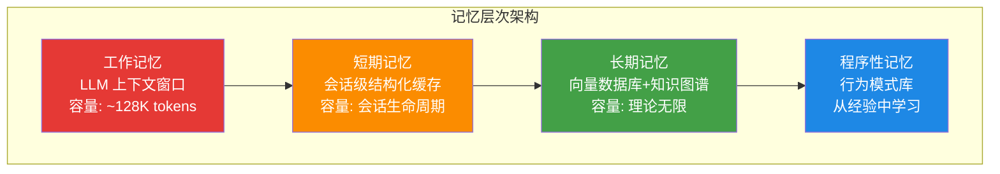
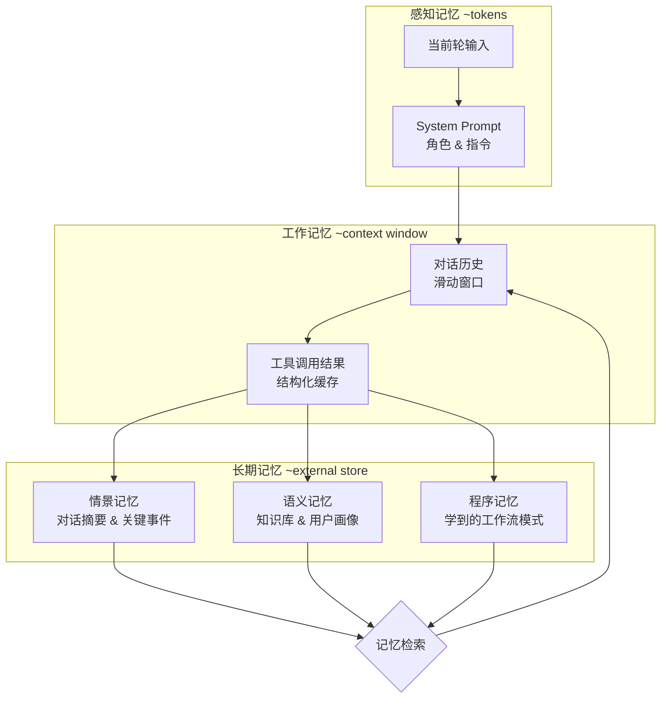

# 第 7 章 记忆架构 — Agent 的大脑
人类之所以能够进行复杂的长期协作，是因为我们拥有多层次的记忆系统：工作记忆让我们追踪当前对话的上下文，情景记忆让我们回忆过去的经历，语义记忆储存我们的知识，程序性记忆让我们无需思考就能执行熟练的操作。

AI Agent 面临着完全相同的需求，但技术约束截然不同。LLM 的上下文窗口是 Agent 的"工作记忆"，但它有严格的容量上限且成本高昂。Agent 没有天生的长期记忆——每次对话开始时，它都是一个"失忆症患者"。如何赋予 Agent 跨会话的记忆能力，同时控制成本和延迟，是本章要解决的核心问题。

本章将记忆系统分为四个层次来讨论：**工作记忆**（当前上下文窗口）、**短期记忆**（会话内的结构化缓存）、**长期记忆**（跨会话的持久化存储）和**程序性记忆**（从经验中学习的行为模式）。每个层次面临不同的工程挑战，需要不同的技术方案。




> "记忆是智慧的根基。没有记忆的 Agent 就像一条金鱼——每一次对话都从零开始。"

## 7.1 概览与认知科学基础

### 7.1.1 为什么 Agent 需要记忆？

在传统的 LLM 应用中，每次 API 调用都是无状态的：模型收到 prompt，生成回复，然后"忘记"一切。这种架构对于简单的问答足够，但对于需要持续交互的 Agent 系统来说远远不够。

考虑一个个人助理 Agent 的场景：

- **第 1 天**：用户说"我对 TypeScript 和系统架构很感兴趣"
- **第 30 天**：用户问"帮我推荐一本好书"
- **无记忆的 Agent**：推荐了一本畅销小说
- **有记忆的 Agent**：推荐了《Designing Data-Intensive Applications》，因为它记得用户的技术偏好

记忆赋予 Agent 三个核心能力：

| 能力 | 描述 | 示例 |
|------|------|------|
| **连续性** | 跨轮次维持上下文 | 记住用户 5 分钟前提到的需求 |
| **个性化** | 积累用户偏好和习惯 | 知道用户喜欢简洁的代码风格 |
| **学习** | 从历史交互中提取经验 | 记住上次部署失败的原因 |

### 7.1.2 认知科学中的记忆模型

Agent 的记忆架构并非凭空设计，而是深度借鉴了认知科学的研究成果。理解这些理论基础有助于我们做出更好的工程决策。

**Atkinson-Shiffrin 多存储模型 (1968)**

```
感觉输入 → [感觉记忆] → 注意 → [短期记忆] → 编码 → [长期记忆]
                ↓ 衰减           ↓ 遗忘              ↓ 检索
               丢失             丢失              提取回短期记忆
```

这个经典模型将记忆分为三个存储：
- **感觉记忆 (Sensory Memory)**：极短暂（<1秒），对应 Agent 接收到但未处理的原始输入
- **短期记忆 (Short-term Memory)**：容量有限（7±2 项），对应 Agent 的工作记忆 / context window
- **长期记忆 (Long-term Memory)**：容量几乎无限，对应 Agent 的持久化存储

**Baddeley 工作记忆模型 (1974, 2000)**

Baddeley 将短期记忆细化为多组件系统：

| 组件 | 功能 | Agent 对应 |
|------|------|-----------|
| 中央执行系统 | 注意力分配与协调 | Planner / Orchestrator |
| 语音回路 | 语言信息的临时存储 | 对话历史 buffer |
| 视觉空间画板 | 视觉信息处理 | 多模态上下文 |
| 情景缓冲区 | 整合多源信息 | 跨模块融合层 |

**Ebbinghaus 遗忘曲线 (1885)**

遗忘不是线性的，而是遵循指数衰减：

```
R(t) = e^(-t/S)
```

其中 `R(t)` 是时间 `t` 后的记忆保留率，`S` 是记忆强度。这意味着：
- 新记忆最容易遗忘（1 小时后忘记 56%）
- 复习可以显著增强 `S`（间隔重复的理论基础）
- Agent 的记忆衰减策略应模拟这一曲线

### 7.1.3 四层记忆架构总览

基于认知科学的启发，我们设计了 Agent 的四层记忆架构：

```
┌──────────────────────────────────────────────────────────┐
│                    Agent 记忆系统                          │
├──────────────────────────────────────────────────────────┤
│  Layer 1: Working Memory (工作记忆)                       │
│  ├─ 容量: 受 context window 限制 (4K - 200K tokens)       │
│  ├─ 时效: 当前推理步骤                                    │
    // ... 完整实现见 code-examples/ 目录 ...
│  ├─ 容量: 理论上无限                                      │
│  ├─ 时效: 持久化存储                                      │
│  └─ 类比: 磁盘 / 数据库                                   │
└──────────────────────────────────────────────────────────┘
```

每一层的设计理念：

```typescript
/**
 * 四层记忆抽象接口
 * 每一层实现不同的存储语义和生命周期管理
 */
interface MemoryLayer<T> {
  /** 层级名称 */
    // ... 完整实现见 code-examples/ 目录 ...
  hitRate: number;
  /** 平均检索延迟（毫秒） */
  avgRetrievalLatencyMs: number;
}
```

### 7.1.4 层间数据流动

记忆在各层之间的流动遵循明确的规则：

```
用户输入
   ↓
[Working Memory] ← 从其他层检索相关记忆
   ↓ 推理完成
[Conversation Memory] ← 存储本轮对话
   ↓ 重要信息提取
[Task Memory] ← 存储任务状态和步骤
   ↓ 任务结束 / 定期巩固
[Long-term Memory] ← 持久化关键知识
```

关键的流动机制：
- **上提 (Promotion)**：重要的短期记忆被提升到长期存储
- **下放 (Retrieval)**：长期记忆被检索回工作记忆用于当前推理
- **压缩 (Compression)**：对话记忆通过摘要压缩后存入长期记忆
- **淘汰 (Eviction)**：低价值记忆被主动清除以释放容量

### 7.1.5 Token 预算规划器

在 LLM 的 context window 中，token 是最宝贵的资源。我们需要一个预算规划器来在各层记忆之间动态分配 token：

```typescript
/**
 * Token 预算配置
 * 定义各记忆层在 context window 中的份额
 */
interface TokenBudgetConfig {
  /** context window 总 token 上限 */
    // ... 完整实现见 code-examples/ 目录 ...
    }
    return lines.join('\n');
  }
}
```


---

## 7.2 四层记忆详解



**图 7-2 三层记忆架构与信息流**——借鉴认知心理学的 Atkinson-Shiffrin 模型，Agent 的记忆系统也呈现出从短期到长期的分层结构。关键设计决策在于：何时将工作记忆中的信息"固化"到长期存储。


### 7.2.1 工作记忆 (Working Memory)

工作记忆是 Agent 在单次推理步骤中使用的"思维空间"。它对应 LLM 的 context window，是所有记忆最终注入的汇聚点。

**核心挑战**：context window 的 token 有限，但需要注入的信息（系统提示、对话历史、任务状态、检索到的长期记忆）往往超过容量。因此，工作记忆的核心职责是**优先级管理**和**智能淘汰**。

```typescript
/** 记忆优先级枚举 — 数值越高，保留优先级越高 */
enum MemoryPriority {
  LOW = 1,       // 背景知识 — 可被淘汰
  NORMAL = 2,    // 一般上下文 — 默认级别
  HIGH = 3,      // 重要信息 — 优先保留
  CRITICAL = 4,  // 关键指令 — 绝不淘汰
    // ... 完整实现见 code-examples/ 目录 ...
  getMetrics(): WorkingMemoryMetrics { return { ...this.metrics }; }
  getUtilization(): number { return this.maxTokens > 0 ? this.currentTokens / this.maxTokens : 0; }
  clear(): void { this.entries.clear(); this.currentTokens = 0; this.metrics.usedTokens = 0; }
}
```

**工作记忆性能分析器**：在生产环境中监控工作记忆的健康状况。

```typescript
/**
 * 工作记忆分析器 — 收集使用模式并生成优化建议
 */
class WorkingMemoryProfiler {
  private snapshots: Array<{
    timestamp: number;
    // ... 完整实现见 code-examples/ 目录 ...

    return suggestions.length > 0 ? suggestions : ['工作记忆状况良好'];
  }
}
```

### 7.2.2 对话记忆 (Conversation Memory)

对话记忆管理单次会话中的完整对话历史。当对话轮次增多时，原始历史可能超出 context window 容量，因此需要智能的窗口管理和摘要策略。

**三种常见策略对比**：

| 策略 | 优点 | 缺点 | 适用场景 |
|------|------|------|---------|
| 滑动窗口 | 实现简单 | 丢失早期上下文 | 闲聊、短对话 |
| 摘要压缩 | 保留全局信息 | 摘要可能丢失细节 | 长对话、复杂任务 |
| 混合策略 | 兼顾两者 | 实现复杂 | 生产环境推荐 |

```typescript
/** 对话消息结构 */
interface ConversationMessage {
  id: string;
  role: 'user' | 'assistant' | 'system';
  content: string;
  timestamp: number;
    // ... 完整实现见 code-examples/ 目录 ...
    const sumTokens = this.summaries.reduce((sum, s) => sum + s.tokenCount, 0);
    return msgTokens + sumTokens;
  }
}
```

**话题边界检测器**：自动识别对话中的话题切换点，提升摘要质量。


> **复用说明**：`TopicBoundaryDetector` 在第 5 章（上下文工程）中首次出现，用于检测上下文中的话题漂移。本章从记忆分层管理的角度重新实现，增加了 `extractKeywords` 和关键词重叠率检测，使其更适用于会话记忆的自动分段场景。
```typescript
/**
 * 话题边界检测器
 * 使用 embedding 相似度 + 关键词变化来检测话题切换
 */
class TopicBoundaryDetector {
  private embeddingService: EmbeddingService;
    // ... 完整实现见 code-examples/ 目录 ...
    const magnitudeB = Math.sqrt(b.reduce((sum, bi) => sum + bi * bi, 0));
    return magnitudeA && magnitudeB ? dotProduct / (magnitudeA * magnitudeB) : 0;
  }
}
```

**对话索引**：为长对话建立快速检索索引。

```typescript
/**
 * 对话索引 — 支持按时间、话题、关键词快速定位历史消息
 */
class ConversationIndex {
  /** 话题到消息 ID 的映射 */
  private topicIndex: Map<string, string[]> = new Map();
    // ... 完整实现见 code-examples/ 目录 ...
    }
    return results;
  }
}
```

### 7.2.3 任务记忆 (Task Memory)

任务记忆跟踪多步骤任务的执行状态。与对话记忆关注"说了什么"不同，任务记忆关注"做了什么、做到哪了、下一步是什么"。

**任务记忆的独特需求**：
- **结构化**：任务有明确的步骤、依赖关系和状态
- **可恢复**：Agent 崩溃后能从断点恢复
- **可审计**：每个步骤的输入输出都可回溯
- **层级化**：复杂任务包含子任务

```typescript
/** 任务步骤状态 */
enum TaskStepStatus {
  PENDING = 'pending',
  IN_PROGRESS = 'in_progress',
  COMPLETED = 'completed',
  FAILED = 'failed',
    // ... 完整实现见 code-examples/ 目录 ...

    return lines.join('\n');
  }
}
```

### 7.2.4 长期记忆 (Long-term Memory)

长期记忆是 Agent 最持久的知识存储。它保存跨会话、跨任务的知识，使 Agent 能够真正"学习"和"成长"。

**存储后端选择**：

| 后端 | 优势 | 劣势 | 最佳场景 |
|------|------|------|---------|
| 向量数据库 | 语义检索强 | 无结构关系 | 知识片段检索 |
| 图数据库 | 关系推理强 | 查询复杂 | 实体关系网络 |
| 关系数据库 | 结构化查询强 | 语义检索弱 | 结构化元数据 |
| 混合存储 | 兼顾各方 | 维护成本高 | 生产系统推荐 |

```typescript
/** 通用记忆条目 — 所有存储后端的统一数据模型 */
interface MemoryEntry {
  id: string;
  /** 记忆内容文本 */
  content: string;
  /** 嵌入向量（用于语义检索） */
    // ... 完整实现见 code-examples/ 目录 ...

    return null; // 不可达
  }
}
```

**记忆重要性评分器**：决定哪些信息值得长期保存。

```typescript
/**
 * 记忆重要性评分器
 * 综合多维度信号计算记忆的长期保存价值
 */
class MemoryImportanceScorer {
  /**
    // ... 完整实现见 code-examples/ 目录 ...
    const magnitudeB = Math.sqrt(b.reduce((sum, bi) => sum + bi * bi, 0));
    return magnitudeA && magnitudeB ? dotProduct / (magnitudeA * magnitudeB) : 0;
  }
}
```

---

## 7.3 记忆巩固与遗忘

### 7.3.1 记忆巩固流水线

记忆巩固是将短期记忆转化为长期记忆的过程。在认知科学中，这个过程发生在睡眠期间；在 Agent 系统中，我们通过定时批处理实现类似的功能。

```typescript
/** 巩固策略 */
enum ConsolidationStrategy {
  /** 直接存储 — 不做任何处理 */
  RAW = 'raw',
  /** 摘要后存储 — 压缩信息 */
  SUMMARIZE = 'summarize',
    // ... 完整实现见 code-examples/ 目录 ...

    return result;
  }
}
```

### 7.3.2 间隔重复调度器

基于 Ebbinghaus 遗忘曲线，我们实现 SM-2 算法的 Agent 适配版本：重要的记忆会被定期"复习"（重新检索和强化），而不重要的记忆逐渐衰减。

```typescript
/** 间隔重复调度记录 */
interface RepetitionSchedule {
  memoryId: string;
  /** 下次复习时间 */
  nextReviewAt: number;
  /** 当前间隔（天） */
    // ... 完整实现见 code-examples/ 目录 ...
      .sort((a, b) => a.nextReviewAt - b.nextReviewAt)
      .map(s => s.memoryId);
  }
}
```

### 7.3.3 睡眠式巩固

模拟人类睡眠期间的记忆巩固过程——在 Agent 空闲时执行批量处理：

```typescript
/**
 * 睡眠式巩固 — Agent 空闲时的批量记忆处理
 * 灵感来自神经科学中的"记忆重放"理论：
 * 睡眠时大脑会"重放"白天的经历，强化重要记忆并建立关联
 */
class SleepConsolidation {
    // ... 完整实现见 code-examples/ 目录 ...
      this.isRunning = false;
    }
  }
}
```

### 7.3.4 记忆垃圾回收

长期运行的 Agent 会积累大量记忆，需要定期清理低价值条目：

```typescript
/** GC 配置 */
interface GCConfig {
  /** 最大记忆条目数 */
  maxEntries: number;
  /** 最大存储大小（字节） */
  maxStorageBytes: number;
    // ... 完整实现见 code-examples/ 目录 ...
      durationMs: Date.now() - startTime,
    };
  }
}
```

### 7.3.5 遗忘曲线管理器

```typescript
/** 遗忘曲线配置 */
interface ForgettingCurveConfig {
  /** 基础衰减速率 */
  baseDecayRate: number;
  /** 每次访问增加的强度 */
  accessStrengthBoost: number;
    // ... 完整实现见 code-examples/ 目录 ...
    }
    return forgotten;
  }
}
```

---

## 7.4 语义记忆与知识提取


### 记忆系统的工程权衡

记忆系统设计中最常被忽视的问题是**遗忘策略**。人类的遗忘是一种特性而非缺陷——它帮助我们过滤噪声、保留关键信息。Agent 同样需要主动遗忘机制：

1. **基于时间的衰减**：越久远的记忆权重越低，适合时效性强的场景（如客服对话）
2. **基于访问频率的淘汰**：类似 LRU 缓存，长期未被检索到的记忆优先丢弃
3. **基于重要性的保留**：由 LLM 评估每条记忆的重要性分数，低于阈值的定期清理

实践中，多数团队在初期会犯"存储一切"的错误。当记忆库膨胀到数十万条时，检索质量急剧下降——不是因为向量搜索变慢，而是因为噪声记忆干扰了相关性排序。


### 7.4.1 从对话中提取结构化知识

Agent 与用户的每次对话都蕴含着可提取的知识。语义记忆提取器将非结构化对话转化为结构化的知识条目。

```typescript
/** 提取的知识条目 */
interface ExtractedKnowledge {
  /** 知识类型 */
  type: 'fact' | 'preference' | 'relationship' | 'event' | 'skill';
  /** 主语（通常是用户或某个实体） */
  subject: string;
    // ... 完整实现见 code-examples/ 目录 ...
      return [];
    }
  }
}
```

### 7.4.2 实体中心记忆

将记忆围绕实体（人、项目、概念）组织，而非简单的时间线：

```typescript
/** 实体定义 */
interface Entity {
  id: string;
  name: string;
  type: 'person' | 'project' | 'concept' | 'organization' | 'location';
  /** 实体别名（用于匹配不同称呼） */
    // ... 完整实现见 code-examples/ 目录 ...

    return detected;
  }
}
```

### 7.4.3 记忆冲突解决

当新信息与已有记忆矛盾时（例如用户更改了偏好），需要冲突检测和解决机制：

```typescript
/** 冲突类型 */
enum ConflictType {
  /** 直接矛盾 — "用户喜欢Java" vs "用户不喜欢Java" */
  CONTRADICTION = 'contradiction',
  /** 信息更新 — "用户住在北京" vs "用户住在上海"（搬家了） */
  UPDATE = 'update',
    // ... 完整实现见 code-examples/ 目录 ...
        return { action: 'ignore' };
    }
  }
}
```

### 7.4.4 用户画像构建

通过长期记忆积累，自动构建用户画像：

```typescript
/** 用户画像数据结构 */
interface UserProfile {
  userId: string;
  /** 基本信息 */
  demographics: {
    name?: string;
    // ... 完整实现见 code-examples/ 目录 ...
      updateCount: 0,
    };
  }
}
```

---

## 7.5 记忆检索优化

### 7.5.1 混合检索策略

单一的向量检索或关键词检索都有局限性。混合检索结合多种策略的优势：

```typescript
/** 检索权重配置 */
interface RetrievalWeights {
  /** 向量相似度权重 */
  vectorSimilarity: number;
  /** 关键词匹配权重 */
  keywordMatch: number;
    // ... 完整实现见 code-examples/ 目录 ...
    const matched = keywords.filter(kw => lowerContent.includes(kw)).length;
    return matched / keywords.length;
  }
}
```

### 7.5.2 查询分解与规划

复杂查询需要先分解为子查询，然后分别检索再合并结果：

```typescript
/** 查询计划 */
interface QueryPlan {
  /** 原始查询 */
  originalQuery: string;
  /** 分解后的子查询 */
  subQueries: Array<{
    // ... 完整实现见 code-examples/ 目录 ...
      };
    }
  }
}
```

### 7.5.3 上下文感知重排

检索结果需要根据当前对话上下文进行重排，确保最相关的记忆被优先注入工作记忆：

```typescript
/**
 * 上下文感知重排器
 * 根据当前对话上下文对检索结果进行二次排序
 */
class ContextualReranker {
  private llmClient: LLMClient;
    // ... 完整实现见 code-examples/ 目录 ...
      return results; // 重排失败时返回原始排序
    }
  }
}
```

### 7.5.4 检索质量评估

```typescript
/** 检索评估用例 */
interface EvaluationCase {
  query: string;
  /** 期望被检索到的记忆 ID 集合 */
  expectedIds: Set<string>;
  /** 可选的记忆 ID（检索到更好，但不是必须） */
    // ... 完整实现见 code-examples/ 目录 ...
      latencyMs: n > 0 ? totalLatency / n : 0,
    };
  }
}
```

---

## 7.6 跨会话记忆持久化

### 7.6.1 分层存储策略

类似 CPU 缓存层级，记忆存储也采用分层策略：热数据放在高速存储，冷数据放在低成本存储。

```typescript
/** 存储层级 */
enum StorageTier {
  /** 热存储 — 内存/Redis，毫秒级访问 */
  HOT = 'hot',
  /** 温存储 — SSD/数据库，十毫秒级访问 */
  WARM = 'warm',
    // ... 完整实现见 code-examples/ 目录 ...

    return { demoted };
  }
}
```

### 7.6.2 序列化与反序列化

记忆的持久化需要可靠的序列化方案：

```typescript
/**
 * 记忆序列化器接口
 */
interface MemorySerializer {
  serialize(entry: MemoryEntry): string;
  deserialize(data: string): MemoryEntry;
    // ... 完整实现见 code-examples/ 目录 ...
  deserialize(data: string): MemoryEntry {
    return JSON.parse(data) as MemoryEntry;
  }
}
```

### 7.6.3 隐私与合规

Agent 的长期记忆可能包含用户的敏感信息，必须遵守隐私法规：

```typescript
/** PII 类型 */
enum PIIType {
  EMAIL = 'email',
  PHONE = 'phone',
  ID_NUMBER = 'id_number',
  ADDRESS = 'address',
    // ... 完整实现见 code-examples/ 目录 ...
  async retrieve(query: MemorySearchQuery): Promise<MemorySearchResult[]> {
    return this.backend.retrieve(query);
  }
}
```

### 7.6.4 Schema 迁移

随着系统演进，记忆的数据结构可能需要升级：

```typescript
/** 迁移定义 */
interface MemoryMigration {
  /** 迁移版本号 */
  version: number;
  /** 迁移描述 */
  description: string;
    // ... 完整实现见 code-examples/ 目录 ...
    meta.importance = String(meta.importance);
    return { ...entry, metadata: meta };
  },
});
```

---


---

## 7.7 实战：个人助理记忆系统

现在，让我们将前面所有的组件整合为一个完整的、可运行的个人助理记忆系统。这个系统展示了四层记忆如何协同工作，以及记忆如何随着时间积累而提升 Agent 的响应质量。

### 7.7.1 辅助类型与接口

首先定义我们在完整系统中需要的辅助接口，这些接口在前面各节中已被引用但尚未集中定义：

```typescript
/**
 * LLM 客户端接口 — 抽象 LLM 调用
 * 实际生产中可对接 OpenAI, Anthropic, 或其他 LLM 服务
 */
interface LLMClient {
  chat(messages: Array<{ role: string; content: string }>): Promise<{ content: string }>;
    // ... 完整实现见 code-examples/ 目录 ...
interface CheckpointSystem {
  save(data: Record<string, unknown>): Promise<string>;
  load(checkpointId: string): Promise<Record<string, unknown>>;
}
```

### 7.7.2 完整的个人助理记忆系统

```typescript
/**
 * PersonalAssistantMemory — 完整的个人助理记忆系统
 *
 * 整合四层记忆 + 语义提取 + 混合检索 + 隐私保护：
 *
 * 生命周期：
    // ... 完整实现见 code-examples/ 目录 ...
      conversationMemory: this.conversationMemory.getStats(),
    };
  }
}
```

### 7.7.3 使用示例：多会话记忆积累

以下示例展示了记忆系统如何在多次会话中积累和利用知识：

```typescript
/**
 * 示例：三次会话展示记忆积累效果
 *
 * 会话 1: 用户表达技术偏好
 * 会话 2: 用户执行编码任务
 * 会话 3: 验证 Agent 已记住之前的信息
    // ... 完整实现见 code-examples/ 目录 ...

  await memory.endSession();
  console.log('\n示例完成：Agent 成功在跨会话间保持了用户记忆。');
}
```

> **关键观察**：在会话 3 中，即使用户没有重复自己的偏好，Agent 依然能够回忆起会话 1 中建立的信息。这就是长期记忆系统的价值——它让 Agent 从"每次重新开始的工具"变成了"了解你的助手"。

---

### 7.7.4 MemGPT 与 Letta：虚拟上下文管理范式

在前面的章节中，我们构建了一套完整的四层记忆架构。然而，业界还有另一种极具影响力的记忆管理范式——将 LLM 的上下文窗口视为**虚拟内存**，由模型自主决定何时换入换出信息。这一思想源自 MemGPT 论文（Packer et al., 2023），后来演化为开源框架 Letta。

#### 起源：从操作系统到 LLM 记忆

MemGPT 论文 *"MemGPT: Towards LLMs as Operating Systems"* 提出了一个关键洞察：LLM 的上下文窗口限制与计算机物理内存限制本质上是同一类问题。操作系统通过虚拟内存机制解决了物理内存不足的问题——同样的思路可以应用于 LLM：

```
┌─────────────────────────────────────────────────────┐
│              MemGPT 虚拟上下文架构                     │
├─────────────────────────────────────────────────────┤
│                                                     │
│   操作系统类比              MemGPT 对应              │
│   ─────────────            ──────────               │
    // ... 完整实现见 code-examples/ 目录 ...
│                                                     │
│   页面调度器        ←→     LLM 自身（通过函数调用）    │
│                                                     │
└─────────────────────────────────────────────────────┘
```

这一类比的精妙之处在于：传统操作系统由内核管理页面调度，而在 MemGPT 中，**LLM 自身就是调度器**——它通过函数调用（tool calls）来决定何时从外部存储读取信息、何时将信息写入持久化存储。

#### 三层记忆结构

MemGPT 将记忆组织为三个层次，每层具有不同的持久性和访问模式：

| 层次 | 位置 | 内容 | 访问方式 |
|------|------|------|----------|
| **Core Memory** | 始终在上下文中 | persona（Agent 人格）+ human（用户信息）块 | 直接读写，每次推理可见 |
| **Recall Memory** | 外部向量数据库 | 完整对话历史，按时间索引 | 通过 `conversation_search` 检索 |
| **Archival Memory** | 外部向量数据库 | 长期知识、文档、用户档案 | 通过 `archival_memory_search` 检索 |

**Core Memory** 是最关键的创新——它是一段始终存在于系统提示中的可编辑文本块。Agent 可以通过 `core_memory_append` 和 `core_memory_replace` 函数实时修改这段文本，相当于 Agent 拥有了一块"随身便签"。

#### 自主式记忆管理

与传统的 RAG 检索不同，MemGPT 的核心理念是**让 LLM 自主管理记忆**。系统为 LLM 提供一组记忆操作函数，LLM 在每次推理时决定是否调用：

```typescript
/**
 * MemGPT 风格的记忆管理器
 * 核心思想：LLM 通过 tool calls 自主管理三层记忆
 */
interface MemGPTStyleMemoryManager {
  // ===== Core Memory：始终在上下文中的可编辑块 =====
    // ... 完整实现见 code-examples/ 目录 ...
  content: string;
  metadata: Record<string, unknown>;
  createdAt: string;
}
```

在实际运行中，LLM 的每次响应都可以包含多个函数调用。例如，当用户提到自己换了新工作时，LLM 可能会：

1. 调用 `core_memory_replace` 更新 human 块中的职业信息
2. 调用 `archival_memory_insert` 将旧职业信息归档
3. 调用 `conversation_search` 查找之前关于工作的讨论
4. 最后生成回复

这种"先管理记忆，再回复用户"的模式让 Agent 能够主动维护自己的知识状态。

#### Letta 框架：从论文到生产

Letta（前身为 MemGPT 开源项目）是 MemGPT 思想的生产级实现，提供了完整的开发框架：

- **服务端架构**：提供 REST API 和 Python/TypeScript SDK，支持多用户多 Agent 部署
- **工具执行沙箱**：Agent 的函数调用在安全沙箱中执行，支持自定义工具
- **多 Agent 支持**：支持 Agent 间通信和协作，共享记忆空间
- **ADE（Agent Development Environment）**：可视化开发环境，便于调试记忆状态

#### 与本书四层记忆模型的对照

MemGPT 的三层结构与本书的四层架构存在清晰的映射关系，也有值得注意的差异：

| MemGPT 层次 | 本书对应层次 | 相似点 | 差异点 |
|-------------|-------------|--------|--------|
| Core Memory | L1 工作记忆 | 都在当前上下文中、容量受限 | MemGPT 允许 LLM 直接编辑；本书侧重优先级淘汰 |
| Recall Memory | L2 对话记忆 | 都存储对话历史、支持搜索 | MemGPT 强调分页检索；本书实现话题感知窗口 |
| Archival Memory | L4 长期记忆 | 都是持久化知识存储 | MemGPT 由 LLM 自主写入；本书通过巩固流水线自动提取 |
| （无直接对应） | L3 任务记忆 | — | 本书独有的任务执行轨迹层 |

两种范式各有优势：MemGPT 的自主管理方式赋予 Agent 更大的灵活性，适合需要深度个性化的长期对话场景；本书的四层架构则提供了更精细的工程控制，适合需要可观测性和可调试性的生产环境。在实践中，两种思路完全可以融合——例如在本书的 L1 工作记忆中引入 MemGPT 风格的可编辑 core memory 块，同时保留 L3 任务记忆的结构化追踪能力。

### 7.7.5 记忆管理平台对比

了解了记忆架构的设计原理和 MemGPT 的创新范式后，让我们看看当前主流的记忆管理平台。这些平台将记忆管理能力封装为开箱即用的服务，可以显著降低 Agent 记忆系统的开发成本。

#### 主流平台概览

| 平台 | 类型 | 核心特性 | 记忆层次 | 开源协议 | 适用场景 |
|------|------|----------|----------|----------|----------|
| **Mem0** | 记忆层 | 多级记忆（User/Session/Agent）、自动提取、Graph Memory | User + Session + Agent | MIT | 个性化助手、跨会话记忆 |
| **Zep** | 知识图谱 | Temporal Knowledge Graph、Graphiti 引擎、双时间建模 | Entity + Relation + Temporal | Apache 2.0 | 企业级 Agent、时间敏感记忆 |
| **Letta** | 虚拟上下文 | 自主内存管理、OS 级抽象、REST API | Core + Recall + Archival | Apache 2.0 | 长期对话、复杂人格 Agent |
| **LangMem** | 记忆工具 | 与 LangGraph 集成、记忆提取工具 | Semantic + Episodic | MIT | LangGraph 生态用户 |

#### 各平台深度解析

**Mem0** 是目前最受关注的记忆管理平台之一（GitHub 约 48K stars），由 Y Combinator S24 孵化。它的核心价值在于提供了开箱即用的多级记忆抽象——User 级记忆跨越所有会话持久存在，Session 级记忆跟踪单次对话上下文，Agent 级记忆维护 Agent 自身的知识和行为模式。Mem0 的 Graph Memory 功能基于知识图谱自动从对话中提取实体和关系，相比纯向量存储能更好地处理结构化知识和多跳推理。

**Zep** 的独特优势在于其 Graphiti 时序知识图谱引擎。传统记忆系统往往忽略信息的时间维度——当用户说"我搬到了上海"时，系统需要知道这是最新事实，而之前"住在北京"的记录应被标记为历史状态而非删除。Zep 通过双时间建模（事实有效时间 + 系统记录时间）优雅地解决了这一问题。这使得 Zep 特别适合企业场景中需要追踪事实变迁的 Agent 应用。

**Letta** 如上一节所述，是 MemGPT 论文的生产级演进。它的独特之处在于 OS 风格的内存管理抽象——让 LLM 自主决定记忆的读写和调度，而非依赖预设的检索规则。这种设计在需要深度个性化和长期角色扮演的场景中表现出色，Agent 能够像人类一样主动"记住"和"回忆"信息。

**LangMem** 是 LangChain 生态中的记忆解决方案，与 LangGraph 状态管理深度集成。它将记忆能力封装为可组合的工具节点，支持语义记忆（事实和知识）和情景记忆（具体经历）的提取与检索。对于已经在使用 LangGraph 构建 Agent 的团队，LangMem 提供了最低摩擦的记忆集成路径。

#### 如何选择记忆管理方案

在选择具体方案时，建议基于以下维度进行评估：

1. **记忆复杂度需求**：如果只需简单的用户偏好记忆，Mem0 的多级抽象足够优雅；如果涉及复杂的事实变迁和时间推理，Zep 的时序图谱更为合适；如果需要 Agent 具备深度自主记忆能力，Letta 的虚拟上下文范式值得考虑。

2. **技术栈匹配**：已使用 LangGraph 的团队可优先评估 LangMem；追求框架无关性的团队可选择 Mem0 或 Zep 的独立 API；需要完整 Agent 框架的团队可考虑 Letta 的全栈方案。

3. **部署与合规要求**：上述平台均为开源，支持私有化部署。但在企业级场景中需关注数据隔离、审计日志、GDPR 合规等能力的成熟度。Zep 和 Mem0 在企业功能上相对完善。

4. **自建 vs 采用**：本章所构建的四层记忆架构提供了完整的自建方案，适合对记忆行为有精细控制需求的团队。而上述平台提供了更快的启动速度和更低的维护成本。在实际工程中，混合方案往往是最佳选择——使用平台处理通用记忆能力，同时自建特定领域的记忆逻辑。


## 7.8 本章小结

本章系统地构建了 Agent 的记忆架构——从认知科学的启发到工程实现的每一个细节。让我们回顾核心要点：

### 架构层次

| 层级 | 组件 | 核心职责 | 关键技术 |
|------|------|----------|----------|
| L1 | PriorityWorkingMemory | 当前推理上下文管理 | 优先级淘汰、注意力权重、利用率监控 |
| L2 | SmartWindowConversationMemory | 会话历史管理 | 话题感知滑动窗口、多策略摘要、搜索索引 |
| L3 | TaskMemoryManager | 任务执行轨迹记录 | 依赖管理、检查点集成、报告导出 |
| L4 | LongTermMemoryStore | 跨会话知识持久化 | 多后端存储、语义去重、重要度衰减 |

### 关键设计原则

1. **层次化管理**：不同类型的信息有不同的生命周期和访问模式，用分层架构匹配不同需求。

2. **主动巩固**：记忆不应只是被动存储——需要主动提取知识、发现关联、解决冲突。MemoryConsolidator 和 SleepConsolidation 实现了类人的记忆整理过程。

3. **智能遗忘**：无限增长的记忆库终将不可维护。基于 Ebbinghaus 遗忘曲线和间隔重复的遗忘机制确保记忆库保持精简高效。

4. **混合检索**：单一的检索方式都有盲区。HybridMemoryRetriever 结合向量相似度、关键词匹配、时间近因和重要度评分，实现全面精准的记忆检索。

5. **隐私优先**：记忆中不可避免地包含用户个人信息。PIIDetector 和 PrivacyCompliantStorage 从设计上保证数据隐私合规。

6. **渐进式画像**：UserProfileBuilder 不要求用户主动告知偏好，而是从每次交互中自动学习和更新，让 Agent 越用越懂你。

### 性能基准参考

| 操作 | 目标延迟 | 关键优化手段 |
|------|----------|------------|
| 工作记忆构建 | < 5ms | 内存操作，预计算注意力权重 |
| 对话记忆添加 | < 10ms | 增量索引更新 |
| 长期记忆检索 (10条) | < 100ms | 向量索引 + 缓存预热 |
| 记忆巩固（单次会话） | < 5s | 批量处理，异步写入 |
| GC 单次运行 | < 30s | 分批扫描，后台运行 |

### 与其他章节的关联

```
第四章 (状态与检查点)  ─────────→  L3 任务记忆的检查点集成
第五章 (上下文工程)    ─────────→  上下文组装过程与 L1 工作记忆交互
第六章 (工具系统设计)  ─────────→  工具调用结果进入 L1 工作记忆，L3 缓存工具输出
第八章 (RAG 知识工程)  ←─────────  RAG 检索结果注入 L4 长期语义记忆
第九章 (Multi-Agent)   ←─────────  共享记忆层实现多 Agent 间信息共享
```

> **下一步**：在第八章中，我们将探讨 RAG 与知识工程——如何通过检索增强生成为 Agent 提供外部知识访问能力。RAG 检索的结果将注入本章的记忆体系，而 MemoryConflictResolver 和 EntityCentricMemory 将为知识去重与冲突解决提供基础。

---

**本章核心代码清单**

| 类/接口 | 所在章节 | 用途 |
|---------|---------|------|
| `TokenBudgetPlanner` | 7.1.5 | Token 预算规划 |
| `PriorityWorkingMemory` | 7.2.1 | 优先级工作记忆管理 |
| `WorkingMemoryProfiler` | 7.2.1 | 工作记忆性能分析 |
| `SmartWindowConversationMemory` | 7.2.2 | 智能窗口对话记忆 |
| `TopicBoundaryDetector` | 7.2.2 | 话题边界检测 |
| `ConversationSummarizer` | 7.2.2 | 多策略对话摘要 |
| `ConversationIndex` | 7.2.2 | 对话搜索索引 |
| `TaskMemoryManager` | 7.2.3 | 任务记忆管理 |
| `TaskMemoryExporter` | 7.2.3 | 任务报告导出 |
| `VectorMemoryStore` | 7.2.4 | 向量存储后端 |
| `GraphMemoryStore` | 7.2.4 | 图存储后端 |
| `MemoryImportanceScorer` | 7.2.4 | 重要度评分 |
| `SemanticDeduplicator` | 7.2.4 | 语义去重 |
| `LongTermMemoryStore` | 7.2.4 | 长期记忆门面 |
| `MemoryConsolidator` | 7.3.1 | 记忆巩固 |
| `SpacedRepetitionScheduler` | 7.3.2 | 间隔重复调度 |
| `SleepConsolidation` | 7.3.3 | 睡眠式批量巩固 |
| `MemoryGarbageCollector` | 7.3.4 | 记忆垃圾回收 |
| `ForgettingCurveManager` | 7.3.5 | 遗忘曲线管理 |
| `SemanticMemoryExtractor` | 7.4.1 | 语义知识提取 |
| `EntityCentricMemory` | 7.4.2 | 实体中心记忆 |
| `MemoryConflictResolver` | 7.4.3 | 记忆冲突解决 |
| `UserProfileBuilder` | 7.4.4 | 用户画像构建 |
| `HybridMemoryRetriever` | 7.5.1 | 混合记忆检索 |
| `MemoryQueryPlanner` | 7.5.2 | 查询规划 |
| `ContextualReranker` | 7.5.3 | 上下文重排序 |
| `RetrievalEvaluator` | 7.5.4 | 检索质量评估 |
| `TieredMemoryStorage` | 7.6.1 | 分层记忆存储 |
| `PIIDetector` | 7.6.3 | PII 检测 |
| `PrivacyCompliantStorage` | 7.6.3 | 隐私合规存储 |
| `MemoryMigrationManager` | 7.6.4 | 记忆 Schema 迁移 |
| `PersonalAssistantMemory` | 7.7.2 | 完整个人助理记忆系统 |
