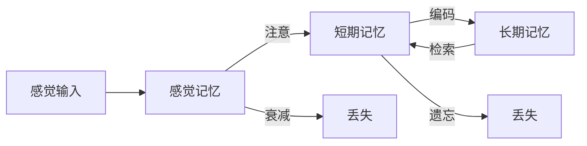
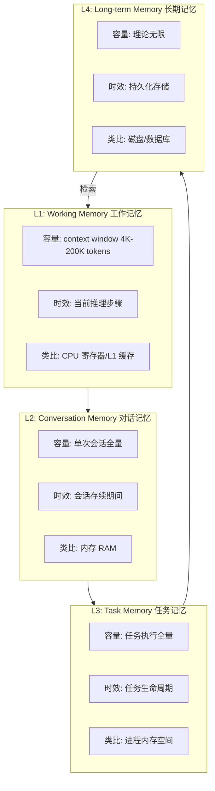
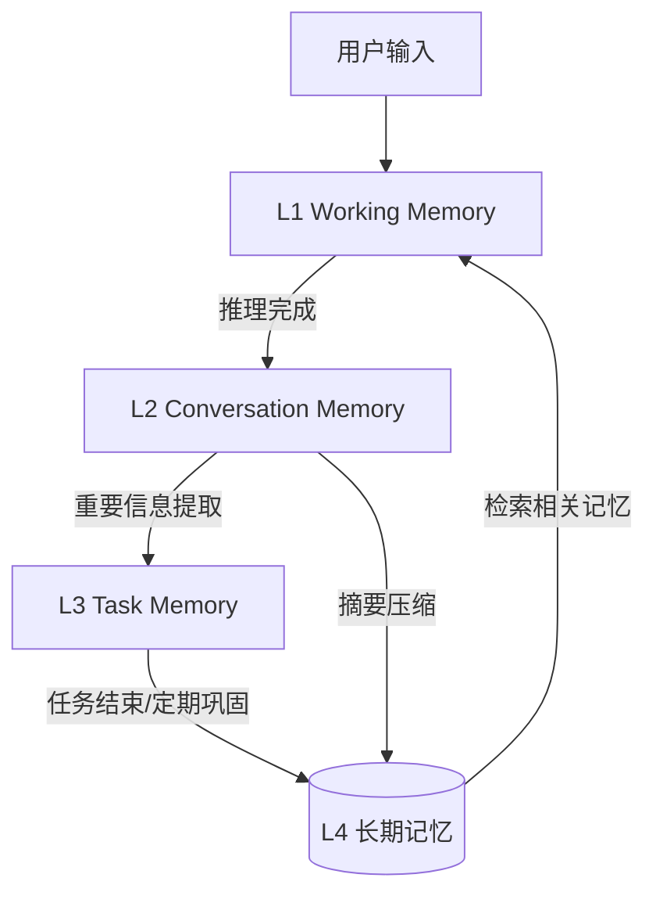
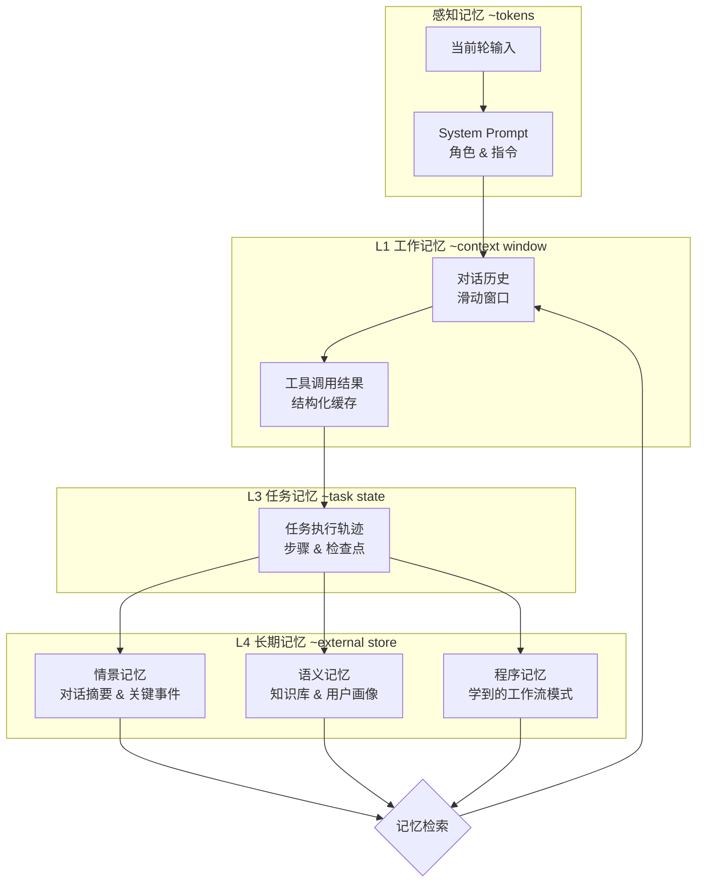
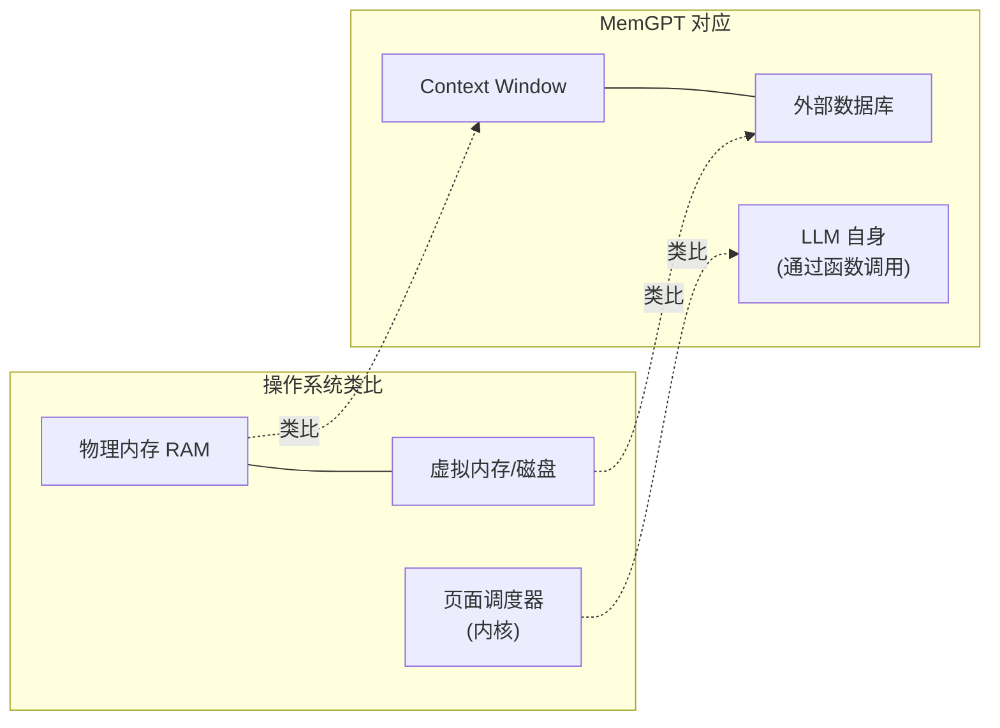
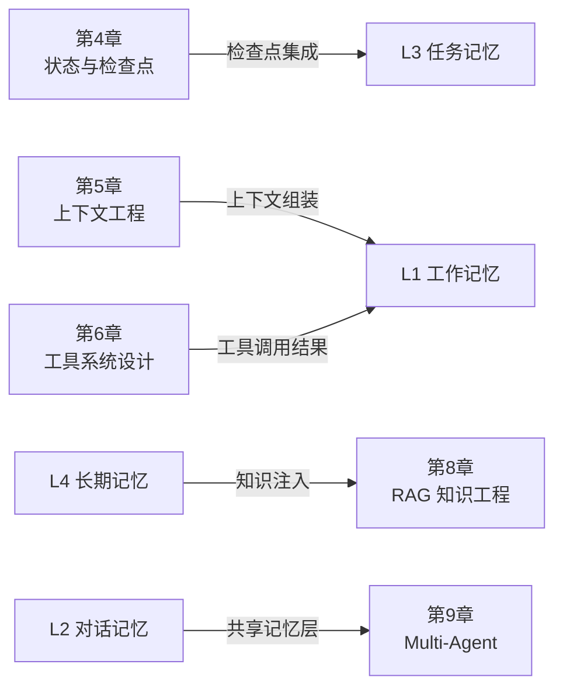

# 第 7 章 记忆架构 — Agent 的大脑

本章构建 Agent 的记忆系统架构，解决 Agent "每次都从零开始"这一核心问题。记忆是 Agent 从无状态工具进化为有经验助手的关键能力，但它也极易被误用——很多系统并不是"记得太少"，而是"记了不该记的东西，或在错误的时机取回错误的记忆"。本章覆盖工作记忆、对话记忆、任务记忆和长期记忆的分层设计，以及记忆的存储、检索、更新和遗忘机制。前置依赖：第 4 章状态管理和第 5 章上下文工程。

## 本章你将学到什么

1. 为什么 Agent 的记忆问题，不等于"把更多历史对话塞进上下文"
2. 如何区分工作记忆、会话记忆、任务记忆和长期记忆
3. 什么时候应该写入记忆，什么时候应该遗忘或压缩
4. 记忆系统如何与状态管理、上下文工程和安全机制协同

## 一个先记住的边界

> 记忆不是越多越好。对 Agent 来说，错误记忆、过期记忆和被污染的记忆，往往比"没有记忆"更危险。

---

## 7.1 概览与认知科学基础

### 7.1.1 为什么 Agent 需要记忆？

在传统的 LLM 应用中，每次 API 调用都是无状态的：模型收到 prompt，生成回复，然后"忘记"一切。这种架构对于简单的问答足够，但对于需要持续交互的 Agent 系统来说远远不够。

考虑一个个人助理 Agent 的场景：

- **第 1 天**：用户说"我对 TypeScript 和系统架构很感兴趣"
- **第 30 天**：用户问"帮我推荐一本好书"
- **无记忆的 Agent**：推荐了一本畅销小说
- **有记忆的 Agent**：推荐了《Designing Data-Intensive Applications》，因为它记得用户的技术偏好

记忆赋予 Agent 三个核心能力：

| 能力 | 描述 | 示例 |
|------|------|------|
| **连续性** | 跨轮次维持上下文 | 记住用户 5 分钟前提到的需求 |
| **个性化** | 积累用户偏好和习惯 | 知道用户喜欢简洁的代码风格 |
| **学习** | 从历史交互中提取经验 | 记住上次部署失败的原因 |

### 7.1.2 认知科学中的记忆模型

Agent 的记忆架构并非凭空设计，而是借鉴了认知科学的研究成果。这里引入这些理论，不是为了把 Agent 机械类比成人脑，而是为了帮助我们回答几个工程问题：什么该短暂保留、什么该长期存储、什么该被主动遗忘。

**Atkinson-Shiffrin 多存储模型 (1968)**



这个经典模型将记忆分为三个存储：
- **感觉记忆 (Sensory Memory)**：极短暂（<1秒），对应 Agent 接收到但未处理的原始输入
- **短期记忆 (Short-term Memory)**：容量有限——经典估计为 7±2 项（Miller, 1956），但 Cowan (2001) 的后续研究将这一数字修正为约 4 个组块（chunks），这一现代估计更符合实际工作记忆的容量限制——对应 Agent 的工作记忆 / context window
- **长期记忆 (Long-term Memory)**：容量几乎无限，对应 Agent 的持久化存储

**Baddeley 工作记忆模型 (1974, 2000)**

Baddeley 将短期记忆细化为多组件系统：

| 组件 | 功能 | Agent 对应 |
|------|------|-----------|
| 中央执行系统 | 注意力分配与协调 | Planner / Orchestrator |
| 语音回路 | 语言信息的临时存储 | 对话历史 buffer |
| 视觉空间画板 | 视觉信息处理 | 多模态上下文 |
| 情景缓冲区 | 整合多源信息 | 跨模块融合层 |

**Ebbinghaus 遗忘曲线 (1885)**

遗忘不是线性的，而是遵循指数衰减：

```
R(t) = e^(-t/S)
```

其中 `R(t)` 是时间 `t` 后的记忆保留率，`S` 是记忆强度。这意味着：
- 新记忆最容易遗忘（1 小时后忘记 56%）
- 复习可以显著增强 `S`（间隔重复的理论基础）
- Agent 的记忆衰减策略应模拟这一曲线

**三类长期记忆与四层架构的映射**

认知心理学将长期记忆进一步划分为三种类型，每种在 Agent 的四层记忆模型中都有明确的工程对应：

| 记忆类型 | 认知科学定义 | Agent 工程映射 | 存储层级 |
|----------|-------------|---------------|---------|
| **情景记忆 (Episodic)** | 对具体事件和经历的记忆，包含时间、地点、情境 | 对话历史摘要、任务执行轨迹、关键交互事件 | L2 对话记忆 + L3 任务记忆 |
| **语义记忆 (Semantic)** | 对事实和概念的通用知识，脱离具体情境 | 用户偏好、实体关系、领域知识、知识图谱 | L4 长期记忆 |
| **程序记忆 (Procedural)** | 对技能和操作流程的隐性记忆 | 学到的工作流模式、工具调用序列、优化后的 prompt 模板 | L4 长期记忆（程序子类） |

情景记忆为 Agent 提供"发生过什么"的时间线，语义记忆提供"世界是什么样的"事实库，程序记忆则提供"该怎么做"的操作手册。一个成熟的 Agent 记忆系统需要同时支持这三类记忆的写入、检索和更新。在后续 §7.2-7.4 的工程实现中，我们会反复看到这三类记忆在不同层级中的具体体现。

### 7.1.3 四层记忆架构总览

基于认知科学的启发，我们设计了 Agent 的四层记忆架构：



**图 7-1 Agent 四层记忆架构**——从快速、小容量的工作记忆到持久、大容量的长期记忆，构成类似计算机存储层级的分层结构。每一层有不同的容量、时效和访问模式。

每一层的设计接口：

```typescript
/**
 * 四层记忆抽象接口
 * 每一层实现不同的存储语义和生命周期管理
 */
interface MemoryLayer<T> {
  readonly name: string;
  readonly capacity: number;
  write(item: T, priority?: number): Promise<void>;
  read(query: string, topK?: number): Promise<T[]>;
  evict(): Promise<T[]>;           // 淘汰低优先级条目
  consolidate(): Promise<void>;    // 向下一层巩固
}

interface MemoryMetrics {
  totalEntries: number;
  usedTokens: number;
  hitRate: number;
  avgRetrievalLatencyMs: number;
}
```

### 7.1.4 层间数据流动

记忆在各层之间的流动遵循明确的规则：



关键的流动机制：
- **上提 (Promotion)**：重要的短期记忆被提升到长期存储
- **下放 (Retrieval)**：长期记忆被检索回工作记忆用于当前推理
- **压缩 (Compression)**：对话记忆通过摘要压缩后存入长期记忆
- **淘汰 (Eviction)**：低价值记忆被主动清除以释放容量

### 7.1.5 Token 预算规划器

在 LLM 的 context window 中，token 是最宝贵的资源。我们需要一个预算规划器来在各层记忆之间动态分配 token：

```typescript
/**
 * TokenBudgetPlanner — 在各记忆层之间动态分配 context window 的 token
 *
 * 核心思想：为系统指令、对话历史、检索记忆、任务状态分别设定配额，
 * 当总量超出 context window 时按优先级裁剪低优先级部分。
 */
interface TokenBudgetConfig {
  maxTokens: number;           // context window 总容量
  systemPromptRatio: number;   // 系统提示占比，如 0.15
  conversationRatio: number;   // 对话历史占比，如 0.40
  retrievedMemoryRatio: number;// 检索记忆占比，如 0.25
  taskStateRatio: number;      // 任务状态占比，如 0.10
  reserveRatio: number;        // 预留给模型生成，如 0.10
}

class TokenBudgetPlanner {
  private config: TokenBudgetConfig;

  constructor(config: TokenBudgetConfig) {
    const total = config.systemPromptRatio + config.conversationRatio
      + config.retrievedMemoryRatio + config.taskStateRatio + config.reserveRatio;
    if (Math.abs(total - 1.0) > 0.01) {
      throw new Error(`Token 预算比例之和必须为 1.0，当前: ${total}`);
    }
    this.config = config;
  }

  /** 计算各层的 token 配额 */
  allocate(): Record<string, number> {
    const { maxTokens: m } = this.config;
    return {
      systemPrompt:    Math.floor(m * this.config.systemPromptRatio),
      conversation:    Math.floor(m * this.config.conversationRatio),
      retrievedMemory: Math.floor(m * this.config.retrievedMemoryRatio),
      taskState:       Math.floor(m * this.config.taskStateRatio),
      reserve:         Math.floor(m * this.config.reserveRatio),
    };
  }

  /** 根据实际使用量重新平衡——未用满的配额可借给超额的层 */
  rebalance(actual: Record<string, number>): Record<string, number> {
    const allocation = this.allocate();
    let surplus = 0;
    const deficits: Array<{ key: string; need: number }> = [];

    for (const key of Object.keys(allocation)) {
      const diff = allocation[key] - (actual[key] ?? 0);
      if (diff > 0) surplus += diff;
      else deficits.push({ key, need: -diff });
    }

    // 按缺口比例分配盈余
    const totalNeed = deficits.reduce((s, d) => s + d.need, 0);
    const result = { ...allocation };
    for (const d of deficits) {
      const grant = totalNeed > 0 ? Math.floor(surplus * d.need / totalNeed) : 0;
      result[d.key] += grant;
    }
    return result;
  }
}
```

---

## 7.2 四层记忆详解



**图 7-2 四层记忆架构与信息流**——借鉴认知心理学的 Atkinson-Shiffrin 模型并扩展为四层结构。感知记忆接收原始输入，工作记忆管理当前推理上下文，任务记忆跟踪多步执行状态，长期记忆持久化三类知识（情景、语义、程序）。关键设计决策在于：何时将工作记忆中的信息"固化"到长期存储，以及任务记忆如何桥接会话级与持久级信息。

### 7.2.1 工作记忆 (Working Memory)

工作记忆是 Agent 在单次推理步骤中使用的"思维空间"。它对应 LLM 的 context window，是所有记忆最终注入的汇聚点。

**核心挑战**：context window 的 token 有限，但需要注入的信息（系统提示、对话历史、任务状态、检索到的长期记忆）往往超过容量。因此，工作记忆的核心职责是**优先级管理**和**智能淘汰**。

```typescript
/** 记忆优先级枚举 — 数值越高，保留优先级越高 */
enum MemoryPriority {
  LOW = 1,       // 背景知识 — 可被淘汰
  NORMAL = 2,    // 一般上下文 — 默认级别
  HIGH = 3,      // 重要信息 — 优先保留
  CRITICAL = 4,  // 关键指令 — 绝不淘汰
}

interface WorkingMemoryEntry {
  id: string;
  content: string;
  tokens: number;
  priority: MemoryPriority;
  insertedAt: number;
  lastAccessedAt: number;
  source: 'system' | 'conversation' | 'retrieval' | 'task';
}

/**
 * PriorityWorkingMemory — 基于优先级的工作记忆管理器
 *
 * 当 token 容量不足时，按优先级从低到高淘汰。同优先级内按 LRU 淘汰。
 * CRITICAL 级别的条目永远不会被淘汰。
 */
class PriorityWorkingMemory {
  private entries = new Map<string, WorkingMemoryEntry>();
  private currentTokens = 0;
  private metrics = { totalWrites: 0, totalEvictions: 0, usedTokens: 0 };

  constructor(private maxTokens: number) {}

  add(entry: WorkingMemoryEntry): { evicted: WorkingMemoryEntry[] } {
    this.metrics.totalWrites++;
    const evicted: WorkingMemoryEntry[] = [];

    // 淘汰直到有足够空间
    while (this.currentTokens + entry.tokens > this.maxTokens) {
      const victim = this.findEvictionCandidate();
      if (!victim) break; // 只剩 CRITICAL 条目，无法再淘汰
      this.entries.delete(victim.id);
      this.currentTokens -= victim.tokens;
      this.metrics.totalEvictions++;
      evicted.push(victim);
    }

    if (this.currentTokens + entry.tokens <= this.maxTokens) {
      this.entries.set(entry.id, entry);
      this.currentTokens += entry.tokens;
      this.metrics.usedTokens = this.currentTokens;
    }
    return { evicted };
  }

  /** 查找淘汰候选：最低优先级中最久未访问的条目 */
  private findEvictionCandidate(): WorkingMemoryEntry | null {
    let candidate: WorkingMemoryEntry | null = null;
    for (const entry of this.entries.values()) {
      if (entry.priority === MemoryPriority.CRITICAL) continue;
      if (!candidate
        || entry.priority < candidate.priority
        || (entry.priority === candidate.priority
            && entry.lastAccessedAt < candidate.lastAccessedAt)) {
        candidate = entry;
      }
    }
    return candidate;
  }

  get(id: string): WorkingMemoryEntry | undefined {
    const entry = this.entries.get(id);
    if (entry) entry.lastAccessedAt = Date.now();
    return entry;
  }

  getUtilization(): number {
    return this.maxTokens > 0 ? this.currentTokens / this.maxTokens : 0;
  }
}
```

**工作记忆性能分析器**：在生产环境中监控工作记忆的健康状况。

```typescript
// WorkingMemoryProfiler — 收集快照并生成优化建议
// 核心逻辑：周期性采样利用率和淘汰率，超过阈值则发出告警
class WorkingMemoryProfiler {
  private snapshots: Array<{ timestamp: number; utilization: number; evictions: number }> = [];

  record(memory: PriorityWorkingMemory, evictionsSinceLastSnapshot: number): void {
    this.snapshots.push({
      timestamp: Date.now(),
      utilization: memory.getUtilization(),
      evictions: evictionsSinceLastSnapshot,
    });
  }

  suggest(): string[] {
    if (this.snapshots.length < 2) return ['数据不足，继续采集'];
    const avgUtil = this.snapshots.reduce((s, x) => s + x.utilization, 0) / this.snapshots.length;
    const suggestions: string[] = [];
    if (avgUtil > 0.9) suggestions.push('工作记忆利用率持续 >90%，建议增大 context window 或更积极地压缩对话历史');
    if (avgUtil < 0.3) suggestions.push('工作记忆利用率 <30%，可注入更多检索记忆以提升响应质量');
    const highEvict = this.snapshots.filter(s => s.evictions > 5).length;
    if (highEvict > this.snapshots.length * 0.5) suggestions.push('频繁淘汰，考虑提升摘要压缩比或减少低优先级注入');
    return suggestions.length > 0 ? suggestions : ['工作记忆状况良好'];
  }
}
// 完整实现约 60 行，核心逻辑如上
```

### 7.2.2 对话记忆 (Conversation Memory)

对话记忆管理单次会话中的完整对话历史。当对话轮次增多时，原始历史可能超出 context window 容量，因此需要智能的窗口管理和摘要策略。

**三种常见策略对比**：

| 策略 | 优点 | 缺点 | 适用场景 |
|------|------|------|---------|
| 滑动窗口 | 实现简单 | 丢失早期上下文 | 闲聊、短对话 |
| 摘要压缩 | 保留全局信息 | 摘要可能丢失细节 | 长对话、复杂任务 |
| 混合策略 | 兼顾两者 | 实现复杂 | 生产环境推荐 |

```typescript
/** 对话消息结构 */
interface ConversationMessage {
  id: string;
  role: 'user' | 'assistant' | 'system';
  content: string;
  timestamp: number;
  tokens: number;
  topicId?: string;
}

interface ConversationSummary {
  id: string;
  content: string;
  tokenCount: number;
  coveredMessageIds: string[];
  createdAt: number;
}

/**
 * SmartWindowConversationMemory — 话题感知的智能滑动窗口
 *
 * 核心策略：保留最近 N 轮完整消息 + 更早消息的 LLM 摘要。
 * 话题切换时主动触发摘要，避免在话题中间截断。
 */
class SmartWindowConversationMemory {
  private messages: ConversationMessage[] = [];
  private summaries: ConversationSummary[] = [];
  private windowSize: number;
  private maxTokens: number;

  constructor(
    private llmClient: LLMClient,
    opts: { windowSize?: number; maxTokens?: number } = {},
  ) {
    this.windowSize = opts.windowSize ?? 20;
    this.maxTokens = opts.maxTokens ?? 4000;
  }

  async addMessage(msg: ConversationMessage): Promise<void> {
    this.messages.push(msg);

    // 当消息数超出窗口大小时，将最早的一批消息压缩为摘要
    if (this.messages.length > this.windowSize) {
      const toSummarize = this.messages.splice(0, this.windowSize / 2);
      const summaryText = await this.summarize(toSummarize);
      this.summaries.push({
        id: `summary-${Date.now()}`,
        content: summaryText,
        tokenCount: Math.ceil(summaryText.length / 3), // 粗估
        coveredMessageIds: toSummarize.map(m => m.id),
        createdAt: Date.now(),
      });
    }
  }

  /** 构造注入工作记忆的上下文：摘要 + 最近消息 */
  getContext(budgetTokens: number): string {
    const parts: string[] = [];
    let used = 0;

    // 先注入摘要
    for (const s of this.summaries) {
      if (used + s.tokenCount > budgetTokens * 0.3) break;
      parts.push(`[摘要] ${s.content}`);
      used += s.tokenCount;
    }

    // 再注入最近消息（从最新往最旧，保证最新的一定在）
    for (let i = this.messages.length - 1; i >= 0; i--) {
      const m = this.messages[i];
      if (used + m.tokens > budgetTokens) break;
      parts.unshift(`${m.role}: ${m.content}`);
      used += m.tokens;
    }
    return parts.join('\n');
  }

  private async summarize(msgs: ConversationMessage[]): Promise<string> {
    const transcript = msgs.map(m => `${m.role}: ${m.content}`).join('\n');
    const resp = await this.llmClient.chat([
      { role: 'system', content: '请用 2-3 句话概括以下对话的要点，保留关键事实和决策：' },
      { role: 'user', content: transcript },
    ]);
    return resp.content;
  }

  getTotalTokens(): number {
    const msgTokens = this.messages.reduce((sum, m) => sum + m.tokens, 0);
    const sumTokens = this.summaries.reduce((sum, s) => sum + s.tokenCount, 0);
    return msgTokens + sumTokens;
  }
}
```

**话题边界检测器**：自动识别对话中的话题切换点，提升摘要质量。

> **复用说明**：`TopicBoundaryDetector` 在第 5 章（上下文工程）中首次出现，用于检测上下文中的话题漂移。本章从记忆分层管理的角度重新实现，增加了 `extractKeywords` 和关键词重叠率检测，使其更适用于会话记忆的自动分段场景。

```typescript
// TopicBoundaryDetector — 使用 embedding 相似度 + 关键词重叠来检测话题切换
// 当连续两条消息的相似度低于阈值时，判定为话题边界
class TopicBoundaryDetector {
  constructor(
    private embeddingService: EmbeddingService,
    private threshold: number = 0.5,
  ) {}

  async detectBoundaries(messages: ConversationMessage[]): Promise<number[]> {
    const boundaries: number[] = [];
    for (let i = 1; i < messages.length; i++) {
      const embA = await this.embeddingService.embed(messages[i - 1].content);
      const embB = await this.embeddingService.embed(messages[i].content);
      const similarity = this.cosineSimilarity(embA, embB);
      const kwOverlap = this.keywordOverlap(messages[i - 1].content, messages[i].content);
      // 综合两个信号：embedding 相似度低 且 关键词重叠率低 → 话题切换
      if (similarity < this.threshold && kwOverlap < 0.2) {
        boundaries.push(i);
      }
    }
    return boundaries;
  }

  private cosineSimilarity(a: number[], b: number[]): number {
    const dot = a.reduce((s, ai, i) => s + ai * b[i], 0);
    const magA = Math.sqrt(a.reduce((s, ai) => s + ai * ai, 0));
    const magB = Math.sqrt(b.reduce((s, bi) => s + bi * bi, 0));
    return magA && magB ? dot / (magA * magB) : 0;
  }

  private keywordOverlap(textA: string, textB: string): number {
    const kwA = new Set(textA.toLowerCase().split(/\s+/).filter(w => w.length > 2));
    const kwB = new Set(textB.toLowerCase().split(/\s+/).filter(w => w.length > 2));
    const intersection = [...kwA].filter(w => kwB.has(w)).length;
    return kwA.size > 0 ? intersection / kwA.size : 0;
  }
}
// 完整实现约 50 行，核心逻辑如上
```

### 7.2.3 任务记忆 (Task Memory)

任务记忆跟踪多步骤任务的执行状态。与对话记忆关注"说了什么"不同，任务记忆关注"做了什么、做到哪了、下一步是什么"。

**任务记忆的独特需求**：
- **结构化**：任务有明确的步骤、依赖关系和状态
- **可恢复**：Agent 崩溃后能从断点恢复
- **可审计**：每个步骤的输入输出都可回溯
- **层级化**：复杂任务包含子任务

```typescript
enum TaskStepStatus {
  PENDING = 'pending',
  IN_PROGRESS = 'in_progress',
  COMPLETED = 'completed',
  FAILED = 'failed',
  SKIPPED = 'skipped',
}

interface TaskStep {
  id: string;
  description: string;
  status: TaskStepStatus;
  dependsOn: string[];     // 前置步骤 ID
  input?: unknown;
  output?: unknown;
  startedAt?: number;
  completedAt?: number;
  error?: string;
}

/**
 * TaskMemoryManager — 管理多步骤任务的执行轨迹
 *
 * 提供检查点保存/恢复、依赖检查、任务报告导出。
 * 与第 4 章的 CheckpointSystem 集成，支持故障恢复。
 */
class TaskMemoryManager {
  private steps = new Map<string, TaskStep>();
  private taskId: string;

  constructor(taskId: string, steps: TaskStep[]) {
    this.taskId = taskId;
    for (const s of steps) this.steps.set(s.id, s);
  }

  /** 检查某步骤的所有前置依赖是否已完成 */
  canStart(stepId: string): boolean {
    const step = this.steps.get(stepId);
    if (!step) return false;
    return step.dependsOn.every(depId => {
      const dep = this.steps.get(depId);
      return dep?.status === TaskStepStatus.COMPLETED;
    });
  }

  markInProgress(stepId: string): void {
    const step = this.steps.get(stepId);
    if (step && this.canStart(stepId)) {
      step.status = TaskStepStatus.IN_PROGRESS;
      step.startedAt = Date.now();
    }
  }

  markCompleted(stepId: string, output: unknown): void {
    const step = this.steps.get(stepId);
    if (step) {
      step.status = TaskStepStatus.COMPLETED;
      step.output = output;
      step.completedAt = Date.now();
    }
  }

  /** 导出任务执行报告（注入工作记忆供 Agent 参考） */
  exportReport(): string {
    const lines = [`## 任务 ${this.taskId} 执行状态`];
    for (const step of this.steps.values()) {
      const dur = step.startedAt && step.completedAt
        ? `${step.completedAt - step.startedAt}ms` : '-';
      lines.push(`- [${step.status}] ${step.description} (耗时: ${dur})`);
      if (step.error) lines.push(`  错误: ${step.error}`);
    }
    return lines.join('\n');
  }

  /** 序列化为 JSON，用于 checkpoint 持久化 */
  toJSON(): Record<string, unknown> {
    return { taskId: this.taskId, steps: Array.from(this.steps.values()) };
  }
}
```

### 7.2.4 长期记忆 (Long-term Memory)

长期记忆是 Agent 最持久的知识存储。它保存跨会话、跨任务的知识，使 Agent 能够真正"学习"和"成长"。

**存储后端选择**：

| 后端 | 优势 | 劣势 | 最佳场景 |
|------|------|------|---------|
| 向量数据库 | 语义检索强 | 无结构关系 | 知识片段检索 |
| 图数据库 | 关系推理强 | 查询复杂 | 实体关系网络 |
| 关系数据库 | 结构化查询强 | 语义检索弱 | 结构化元数据 |
| 混合存储 | 兼顾各方 | 维护成本高 | 生产系统推荐 |

```typescript
/** 通用记忆条目 — 所有存储后端的统一数据模型 */
interface MemoryEntry {
  id: string;
  content: string;
  embedding?: number[];
  metadata: Record<string, unknown>;
  importance: number;       // 0-1 重要度
  createdAt: number;
  lastAccessedAt: number;
  accessCount: number;
}

/** 记忆存储后端接口 */
interface MemoryBackend {
  write(entry: MemoryEntry): Promise<void>;
  search(query: string, embedding: number[], topK: number): Promise<MemoryEntry[]>;
  delete(id: string): Promise<void>;
  update(id: string, partial: Partial<MemoryEntry>): Promise<void>;
}

/**
 * LongTermMemoryStore — 长期记忆门面
 *
 * 封装多后端存储（向量 + 图 + 关系型），提供统一的写入/检索接口。
 * 写入时自动执行语义去重和重要性评分。
 */
class LongTermMemoryStore {
  constructor(
    private vectorBackend: MemoryBackend,
    private embeddingService: EmbeddingService,
    private importanceScorer: MemoryImportanceScorer,
  ) {}

  async store(content: string, metadata: Record<string, unknown> = {}): Promise<string> {
    const embedding = await this.embeddingService.embed(content);
    // 语义去重：检查是否已存在高度相似的条目
    const existing = await this.vectorBackend.search(content, embedding, 3);
    const duplicate = existing.find(e => this.cosineSimilarity(e.embedding!, embedding) > 0.95);
    if (duplicate) {
      // 合并而非重复存储：更新访问计数和时间戳
      await this.vectorBackend.update(duplicate.id, {
        lastAccessedAt: Date.now(),
        accessCount: duplicate.accessCount + 1,
      });
      return duplicate.id;
    }

    const importance = await this.importanceScorer.score(content, metadata);
    const entry: MemoryEntry = {
      id: `mem-${Date.now()}-${Math.random().toString(36).slice(2, 8)}`,
      content,
      embedding,
      metadata,
      importance,
      createdAt: Date.now(),
      lastAccessedAt: Date.now(),
      accessCount: 0,
    };
    await this.vectorBackend.write(entry);
    return entry.id;
  }

  async retrieve(query: string, topK: number = 5): Promise<MemoryEntry[]> {
    const embedding = await this.embeddingService.embed(query);
    const results = await this.vectorBackend.search(query, embedding, topK);
    // 更新访问时间
    for (const r of results) {
      await this.vectorBackend.update(r.id, {
        lastAccessedAt: Date.now(),
        accessCount: r.accessCount + 1,
      });
    }
    return results;
  }

  private cosineSimilarity(a: number[], b: number[]): number {
    const dot = a.reduce((s, ai, i) => s + ai * b[i], 0);
    const magA = Math.sqrt(a.reduce((s, x) => s + x * x, 0));
    const magB = Math.sqrt(b.reduce((s, x) => s + x * x, 0));
    return magA && magB ? dot / (magA * magB) : 0;
  }
}
```

**记忆重要性评分器**：决定哪些信息值得长期保存。

```typescript
/**
 * MemoryImportanceScorer — 综合多维度信号计算记忆的长期保存价值
 *
 * 评分维度：内容稀有度、情感强度、用户显式标记、实体密度
 */
class MemoryImportanceScorer {
  constructor(private llmClient: LLMClient) {}

  async score(content: string, metadata: Record<string, unknown>): Promise<number> {
    // 快速启发式评分（不调用 LLM，延迟 <1ms）
    let score = 0.3; // 基线分

    // 包含关键指示词 → 加分
    const importantPatterns = [/记住|重要|务必|偏好|always|never|关键/i];
    if (importantPatterns.some(p => p.test(content))) score += 0.2;

    // 内容长度适中（太短可能无意义，太长可能是噪音）
    const len = content.length;
    if (len > 20 && len < 500) score += 0.1;

    // 包含具名实体 → 加分（简单启发式：含大写字母或中文人名模式）
    if (/[A-Z][a-z]+|[\u4e00-\u9fa5]{2,3}(?:先生|女士|老师)/.test(content)) score += 0.1;

    // 用户显式标记
    if (metadata.userMarkedImportant) score += 0.3;

    return Math.min(1.0, score);
  }
}
// 完整实现约 45 行，核心逻辑如上
```

---

## 7.3 记忆巩固与遗忘

记忆巩固（consolidation）是将短期记忆转化为长期记忆的过程。在认知科学中，这个过程发生在睡眠期间；在 Agent 系统中，我们通过定时批处理实现类似的功能。

理解巩固与遗忘的工程权衡至关重要。很多团队在早期犯"存储一切"的错误：把每条对话消息、每次工具调用结果、每个中间推理步骤都写入长期记忆。当记忆库膨胀到数十万条时，检索质量急剧下降——不是因为向量搜索变慢了，而是因为大量噪声记忆干扰了相关性排序。试想一个检索场景：用户问"我上次出差去了哪里"，如果记忆库中存了 500 条无关的日常对话摘要，真正的出差记忆很可能被淹没在结果中。

因此，巩固流水线的核心原则是**选择性写入**：只有经过重要性评估且超过阈值的信息才值得长期保存。同时，遗忘机制不是系统缺陷，而是必要的维护策略——就像人类的遗忘帮助我们过滤噪声、保留关键信息一样。

实践中的关键决策点包括：何时触发巩固（会话结束时？每 N 轮？实时？）、巩固粒度（逐条消息还是批量摘要？）、以及遗忘阈值如何设定（太激进则丢失有用信息，太保守则噪声累积）。下面的实现展示了一种平衡方案。

### 7.3.1 记忆巩固流水线

```typescript
/** 巩固策略 */
enum ConsolidationStrategy {
  RAW = 'raw',               // 直接存储 — 不做处理
  SUMMARIZE = 'summarize',   // 摘要后存储 — 压缩信息
  EXTRACT = 'extract',       // 提取关键知识后存储
  MERGE = 'merge',           // 与已有记忆合并
}

/**
 * MemoryConsolidator — 将短期记忆巩固为长期记忆
 *
 * 流程：评估重要性 → 选择策略 → 去重检查 → 写入长期存储
 */
class MemoryConsolidator {
  constructor(
    private longTermStore: LongTermMemoryStore,
    private scorer: MemoryImportanceScorer,
    private llmClient: LLMClient,
    private importanceThreshold: number = 0.4,
  ) {}

  async consolidate(
    memories: Array<{ content: string; metadata: Record<string, unknown> }>,
  ): Promise<{ stored: number; skipped: number; merged: number }> {
    const result = { stored: 0, skipped: 0, merged: 0 };

    for (const mem of memories) {
      const importance = await this.scorer.score(mem.content, mem.metadata);

      if (importance < this.importanceThreshold) {
        result.skipped++;
        continue;
      }

      const strategy = this.selectStrategy(importance, mem.content);

      switch (strategy) {
        case ConsolidationStrategy.RAW:
          await this.longTermStore.store(mem.content, { ...mem.metadata, importance });
          result.stored++;
          break;

        case ConsolidationStrategy.SUMMARIZE:
          const summary = await this.summarize(mem.content);
          await this.longTermStore.store(summary, { ...mem.metadata, importance, original: mem.content });
          result.stored++;
          break;

        case ConsolidationStrategy.EXTRACT:
          const facts = await this.extractKeyFacts(mem.content);
          for (const fact of facts) {
            await this.longTermStore.store(fact, { ...mem.metadata, importance, source: 'extraction' });
            result.stored++;
          }
          break;
      }
    }
    return result;
  }

  private selectStrategy(importance: number, content: string): ConsolidationStrategy {
    if (importance > 0.8) return ConsolidationStrategy.RAW;       // 高重要性 → 原样保留
    if (content.length > 1000) return ConsolidationStrategy.SUMMARIZE; // 长文本 → 摘要
    return ConsolidationStrategy.EXTRACT;                          // 默认 → 提取关键事实
  }

  private async summarize(content: string): Promise<string> {
    const resp = await this.llmClient.chat([
      { role: 'system', content: '用一句话概括以下内容的核心信息：' },
      { role: 'user', content },
    ]);
    return resp.content;
  }

  private async extractKeyFacts(content: string): Promise<string[]> {
    const resp = await this.llmClient.chat([
      { role: 'system', content: '从以下内容中提取关键事实，每条一行，只保留可独立理解的陈述：' },
      { role: 'user', content },
    ]);
    return resp.content.split('\n').filter(line => line.trim().length > 5);
  }
}
```

### 7.3.2 间隔重复调度器

基于 Ebbinghaus 遗忘曲线，我们实现 SM-2 算法的 Agent 适配版本：重要的记忆会被定期"复习"（重新检索和强化），而不重要的记忆逐渐衰减。

```typescript
/**
 * SpacedRepetitionScheduler — SM-2 算法的 Agent 适配版本
 *
 * 核心思想：记忆每次被成功检索（"复习"）后，下次复习间隔延长；
 * 如果一条记忆长期未被检索到，其衰减权重降低，最终被 GC 清理。
 */
interface RepetitionSchedule {
  memoryId: string;
  nextReviewAt: number;     // 下次复习时间
  intervalDays: number;     // 当前间隔（天）
  easeFactor: number;       // 容易度因子（SM-2 核心参数）
  reviewCount: number;
}

class SpacedRepetitionScheduler {
  private schedules = new Map<string, RepetitionSchedule>();

  register(memoryId: string): void {
    this.schedules.set(memoryId, {
      memoryId,
      nextReviewAt: Date.now() + 24 * 60 * 60 * 1000, // 1 天后首次复习
      intervalDays: 1,
      easeFactor: 2.5,
      reviewCount: 0,
    });
  }

  /** 记忆被成功检索时调用——延长下次复习间隔 */
  recordReview(memoryId: string, quality: number /* 0-5 */): void {
    const s = this.schedules.get(memoryId);
    if (!s) return;

    s.reviewCount++;
    // SM-2 算法核心：根据回忆质量调整 easeFactor
    s.easeFactor = Math.max(1.3,
      s.easeFactor + (0.1 - (5 - quality) * (0.08 + (5 - quality) * 0.02)));

    if (quality >= 3) {
      // 成功回忆 → 间隔扩大
      s.intervalDays = s.reviewCount === 1 ? 1
        : s.reviewCount === 2 ? 6
        : Math.round(s.intervalDays * s.easeFactor);
    } else {
      // 回忆困难 → 重置间隔
      s.intervalDays = 1;
    }
    s.nextReviewAt = Date.now() + s.intervalDays * 24 * 60 * 60 * 1000;
  }

  /** 获取当前需要复习的记忆 ID 列表 */
  getDueMemories(): string[] {
    const now = Date.now();
    return Array.from(this.schedules.values())
      .filter(s => s.nextReviewAt <= now)
      .sort((a, b) => a.nextReviewAt - b.nextReviewAt)
      .map(s => s.memoryId);
  }
}
```

### 7.3.3 睡眠式巩固

模拟人类睡眠期间的记忆巩固过程——在 Agent 空闲时执行批量处理：

```typescript
// SleepConsolidation — Agent 空闲时的批量记忆整理
// 灵感来自神经科学中的"记忆重放"理论：睡眠时大脑"重放"白天的经历
class SleepConsolidation {
  private isRunning = false;

  constructor(
    private consolidator: MemoryConsolidator,
    private scheduler: SpacedRepetitionScheduler,
    private longTermStore: LongTermMemoryStore,
  ) {}

  /** 在 Agent 空闲时触发（如用户 30 分钟无交互） */
  async run(pendingMemories: Array<{ content: string; metadata: Record<string, unknown> }>): Promise<void> {
    if (this.isRunning) return;
    this.isRunning = true;
    try {
      // 阶段 1：巩固待处理的短期记忆
      await this.consolidator.consolidate(pendingMemories);
      // 阶段 2：复习到期的记忆（强化重要记忆的权重）
      const dueIds = this.scheduler.getDueMemories();
      for (const id of dueIds.slice(0, 50)) { // 每次最多复习 50 条
        this.scheduler.recordReview(id, 4); // 自动复习视为"较好"质量
      }
    } finally {
      this.isRunning = false;
    }
  }
}
// 完整实现约 55 行，核心逻辑如上
```

### 7.3.4 记忆垃圾回收

长期运行的 Agent 会积累大量记忆，需要定期清理低价值条目：

```typescript
// MemoryGarbageCollector — 定期清理低价值记忆条目
// 策略：重要性低 + 长期未访问 + 过期 → 标记为可回收
interface GCConfig {
  maxEntries: number;
  maxStorageBytes: number;
  minImportance: number;        // 低于此分数的条目可被 GC
  maxInactiveDays: number;      // 超过此天数未访问的条目可被 GC
}

class MemoryGarbageCollector {
  constructor(private config: GCConfig, private backend: MemoryBackend) {}

  async run(entries: MemoryEntry[]): Promise<{ removed: number; freedBytes: number }> {
    const now = Date.now();
    const maxInactiveMs = this.config.maxInactiveDays * 86400_000;
    let removed = 0, freedBytes = 0;

    for (const entry of entries) {
      const isLowImportance = entry.importance < this.config.minImportance;
      const isInactive = (now - entry.lastAccessedAt) > maxInactiveMs;
      if (isLowImportance && isInactive) {
        await this.backend.delete(entry.id);
        removed++;
        freedBytes += entry.content.length * 2; // 粗估
      }
    }
    return { removed, freedBytes };
  }
}
// 完整实现约 40 行，核心逻辑如上
```

### 7.3.5 遗忘曲线管理器

```typescript
// ForgettingCurveManager — 基于 Ebbinghaus 遗忘曲线的权重衰减
// R(t) = e^(-t/S)，其中 S 随每次访问而增强
class ForgettingCurveManager {
  constructor(
    private baseDecayRate: number = 0.1,
    private accessStrengthBoost: number = 0.3,
  ) {}

  /** 计算记忆当前的保留强度 */
  getRetention(entry: MemoryEntry): number {
    const hoursSinceAccess = (Date.now() - entry.lastAccessedAt) / 3_600_000;
    const strength = 1 + entry.accessCount * this.accessStrengthBoost;
    return Math.exp(-this.baseDecayRate * hoursSinceAccess / strength);
  }

  /** 批量标记保留率低于阈值的记忆为"可遗忘" */
  findForgettable(entries: MemoryEntry[], threshold: number = 0.1): MemoryEntry[] {
    return entries.filter(e => this.getRetention(e) < threshold);
  }
}
// 完整实现约 35 行，核心逻辑如上
```

---

## 7.4 语义记忆与知识提取

语义记忆是 Agent 长期记忆中最有价值的组成部分——它将非结构化的对话转化为结构化的知识，使 Agent 能够在未来的交互中"理解"用户而不只是"回忆"对话。

本节的工程挑战在于平衡提取的精度与召回。过于激进的知识提取会产生大量低质量条目（例如把"今天天气不错"也提取为用户偏好），过于保守则遗漏关键信息。此外，当新信息与已有知识矛盾时（用户换了工作、改了偏好），冲突解决机制必须确保知识库反映的是最新事实，而非历史残留。

另一个常被忽视的问题是**知识的时效性**。用户三年前的技术栈偏好可能已经过时，但如果缺乏时间衰减机制，这些陈旧的偏好仍会在检索中被高排位返回。因此，语义记忆系统不仅需要写入能力，还需要持续的维护能力——更新、合并、淘汰过时知识。

### 7.4.1 从对话中提取结构化知识

Agent 与用户的每次对话都蕴含着可提取的知识。语义记忆提取器将非结构化对话转化为结构化的知识条目。

```typescript
/** 提取的知识条目 */
interface ExtractedKnowledge {
  type: 'fact' | 'preference' | 'relationship' | 'event' | 'skill';
  subject: string;
  predicate: string;
  object: string;
  confidence: number;    // 0-1
  source: string;        // 来源消息 ID
}

/**
 * SemanticMemoryExtractor — 使用 LLM 从对话中提取结构化知识
 *
 * 输入：一段对话文本
 * 输出：结构化的 (subject, predicate, object) 三元组列表
 */
class SemanticMemoryExtractor {
  constructor(private llmClient: LLMClient) {}

  async extract(conversation: string): Promise<ExtractedKnowledge[]> {
    const resp = await this.llmClient.chat([
      {
        role: 'system',
        content: `从以下对话中提取结构化知识。每条知识用 JSON 格式输出：
{"type":"preference","subject":"用户","predicate":"喜欢","object":"TypeScript","confidence":0.9}
只提取明确表达的事实和偏好，不要推测。每行一条 JSON。`,
      },
      { role: 'user', content: conversation },
    ]);

    try {
      return resp.content
        .split('\n')
        .filter(line => line.trim().startsWith('{'))
        .map(line => JSON.parse(line) as ExtractedKnowledge)
        .filter(k => k.confidence >= 0.5); // 过滤低置信度
    } catch {
      return [];
    }
  }
}
```

### 7.4.2 实体中心记忆

将记忆围绕实体（人、项目、概念）组织，而非简单的时间线：

```typescript
// EntityCentricMemory — 以实体为核心组织记忆
// 每个实体维护一个属性集合和关系图，支持实体别名匹配
interface Entity {
  id: string;
  name: string;
  type: 'person' | 'project' | 'concept' | 'organization' | 'location';
  aliases: string[];
  attributes: Map<string, { value: string; updatedAt: number }>;
  relations: Array<{ predicate: string; targetEntityId: string }>;
}

class EntityCentricMemory {
  private entities = new Map<string, Entity>();

  /** 通过名称或别名查找实体 */
  findByName(name: string): Entity | undefined {
    const lower = name.toLowerCase();
    for (const entity of this.entities.values()) {
      if (entity.name.toLowerCase() === lower) return entity;
      if (entity.aliases.some(a => a.toLowerCase() === lower)) return entity;
    }
    return undefined;
  }

  /** 更新实体属性（自动记录更新时间） */
  updateAttribute(entityId: string, key: string, value: string): void {
    const entity = this.entities.get(entityId);
    if (entity) {
      entity.attributes.set(key, { value, updatedAt: Date.now() });
    }
  }

  /** 添加实体间关系 */
  addRelation(fromId: string, predicate: string, toId: string): void {
    const entity = this.entities.get(fromId);
    if (entity) {
      entity.relations.push({ predicate, targetEntityId: toId });
    }
  }
}
// 完整实现约 65 行，核心逻辑如上
```

### 7.4.3 记忆冲突解决

当新信息与已有记忆矛盾时（例如用户更改了偏好），需要冲突检测和解决机制：

```typescript
enum ConflictType {
  CONTRADICTION = 'contradiction', // 直接矛盾："用户喜欢Java" vs "用户不喜欢Java"
  UPDATE = 'update',               // 信息更新："用户住在北京" vs "用户住在上海"（搬家）
  AMBIGUITY = 'ambiguity',         // 模糊不一致
}

/**
 * MemoryConflictResolver — 检测并解决记忆冲突
 *
 * 策略：新信息默认覆盖旧信息（recency bias），但保留历史版本用于审计。
 * 对于无法自动判断的冲突，可标记为待用户确认。
 */
class MemoryConflictResolver {
  constructor(private llmClient: LLMClient) {}

  async detect(
    newMemory: string,
    existingMemories: MemoryEntry[],
  ): Promise<Array<{ existing: MemoryEntry; conflictType: ConflictType }>> {
    const conflicts: Array<{ existing: MemoryEntry; conflictType: ConflictType }> = [];

    for (const existing of existingMemories) {
      const resp = await this.llmClient.chat([
        {
          role: 'system',
          content: `判断以下两条信息是否矛盾。回复 JSON：{"conflict": true/false, "type": "contradiction"|"update"|"ambiguity"|"none"}`,
        },
        { role: 'user', content: `旧: ${existing.content}\n新: ${newMemory}` },
      ]);
      try {
        const result = JSON.parse(resp.content);
        if (result.conflict) {
          conflicts.push({ existing, conflictType: result.type as ConflictType });
        }
      } catch { /* 解析失败则视为无冲突 */ }
    }
    return conflicts;
  }

  resolve(conflictType: ConflictType): { action: 'replace' | 'merge' | 'ignore' } {
    switch (conflictType) {
      case ConflictType.UPDATE:       return { action: 'replace' };  // 时间更新 → 直接替换
      case ConflictType.CONTRADICTION: return { action: 'replace' }; // 矛盾 → 以新为准
      case ConflictType.AMBIGUITY:    return { action: 'ignore' };   // 模糊 → 暂不处理
    }
  }
}
```

### 7.4.4 用户画像构建

通过长期记忆积累，自动构建用户画像。用户画像是语义记忆的高层抽象——它不存储原始对话或独立事实，而是将多次交互中积累的知识聚合为一份结构化的用户理解。画像构建的关键在于**增量更新**：每次会话结束后，只更新有新信息的字段，避免全量重建。

```typescript
// UserProfileBuilder — 从交互历史中增量构建用户画像
// 核心方法：每次会话后调用 updateFromConversation，提取新偏好并合并
interface UserProfile {
  userId: string;
  demographics: { name?: string; location?: string; role?: string };
  preferences: Map<string, { value: string; confidence: number; updatedAt: number }>;
  skills: string[];
  interactionStats: { totalSessions: number; lastActiveAt: number };
}

class UserProfileBuilder {
  private profiles = new Map<string, UserProfile>();

  getOrCreate(userId: string): UserProfile {
    if (!this.profiles.has(userId)) {
      this.profiles.set(userId, {
        userId,
        demographics: {},
        preferences: new Map(),
        skills: [],
        interactionStats: { totalSessions: 0, lastActiveAt: Date.now() },
      });
    }
    return this.profiles.get(userId)!;
  }

  /** 从提取的知识中更新画像 */
  update(userId: string, knowledge: ExtractedKnowledge[]): void {
    const profile = this.getOrCreate(userId);
    for (const k of knowledge) {
      if (k.type === 'preference') {
        profile.preferences.set(k.predicate, {
          value: k.object,
          confidence: k.confidence,
          updatedAt: Date.now(),
        });
      } else if (k.type === 'skill') {
        if (!profile.skills.includes(k.object)) profile.skills.push(k.object);
      }
    }
    profile.interactionStats.totalSessions++;
    profile.interactionStats.lastActiveAt = Date.now();
  }
}
// 完整实现约 55 行，核心逻辑如上
```

---

## 7.5 记忆检索优化

记忆检索是整个记忆系统中对用户体验影响最直接的环节——检索质量直接决定了 Agent 能否在正确的时机召回正确的信息。

检索优化的核心挑战是**精度与召回的平衡**。纯向量检索在语义理解上表现优异，但容易被表面相似的无关内容误导（例如搜索"Python 部署"可能召回"Python 入门教程"）。纯关键词检索精度高但召回率低，无法处理同义表达（"部署"和"上线"）。混合检索结合两者的优势，是生产环境的推荐方案。

另一个实践中容易忽视的问题是**检索时机**。并非每轮对话都需要检索长期记忆——如果用户只是说"好的"或"继续"，触发一次检索是浪费。一种有效的优化是在检索前先判断当前对话是否真的需要外部记忆支持，只有当工作记忆中缺少回答所需信息时才触发检索。

最后，检索结果的排序不应只看相似度分数。时间近因性（最近的记忆更可能相关）、记忆重要性、以及与当前对话上下文的匹配度都应纳入排序公式。下面的 `HybridMemoryRetriever` 实现了这种多信号融合的检索方案。

### 7.5.1 混合检索策略

单一的向量检索或关键词检索都有局限性。混合检索结合多种策略的优势：

```typescript
interface RetrievalWeights {
  vectorSimilarity: number;   // 向量语义相似度
  keywordMatch: number;       // 关键词精确匹配
  recency: number;            // 时间近因性
  importance: number;         // 记忆重要度
}

/**
 * HybridMemoryRetriever — 融合多信号的记忆检索器
 *
 * 最终得分 = w1*向量相似度 + w2*关键词匹配 + w3*时间近因 + w4*重要度
 */
class HybridMemoryRetriever {
  constructor(
    private backend: MemoryBackend,
    private embeddingService: EmbeddingService,
    private weights: RetrievalWeights = {
      vectorSimilarity: 0.4,
      keywordMatch: 0.2,
      recency: 0.2,
      importance: 0.2,
    },
  ) {}

  async retrieve(query: string, topK: number = 5): Promise<MemoryEntry[]> {
    const embedding = await this.embeddingService.embed(query);
    // 先用向量检索获取候选集（扩大范围以便重排）
    const candidates = await this.backend.search(query, embedding, topK * 3);

    // 多信号融合评分
    const scored = candidates.map(entry => {
      const vectorScore = entry.embedding
        ? this.cosineSimilarity(embedding, entry.embedding) : 0;
      const keywordScore = this.keywordMatchScore(query, entry.content);
      const recencyScore = this.recencyScore(entry.lastAccessedAt);
      const importanceScore = entry.importance;

      const finalScore =
        this.weights.vectorSimilarity * vectorScore +
        this.weights.keywordMatch * keywordScore +
        this.weights.recency * recencyScore +
        this.weights.importance * importanceScore;

      return { entry, finalScore };
    });

    return scored
      .sort((a, b) => b.finalScore - a.finalScore)
      .slice(0, topK)
      .map(s => s.entry);
  }

  private cosineSimilarity(a: number[], b: number[]): number {
    const dot = a.reduce((s, ai, i) => s + ai * b[i], 0);
    const magA = Math.sqrt(a.reduce((s, x) => s + x * x, 0));
    const magB = Math.sqrt(b.reduce((s, x) => s + x * x, 0));
    return magA && magB ? dot / (magA * magB) : 0;
  }

  private keywordMatchScore(query: string, content: string): number {
    const keywords = query.toLowerCase().split(/\s+/).filter(w => w.length > 1);
    const lowerContent = content.toLowerCase();
    const matched = keywords.filter(kw => lowerContent.includes(kw)).length;
    return keywords.length > 0 ? matched / keywords.length : 0;
  }

  private recencyScore(lastAccessedAt: number): number {
    const hoursSince = (Date.now() - lastAccessedAt) / 3_600_000;
    return Math.exp(-hoursSince / 720); // 30 天半衰期
  }
}
```

### 7.5.2 查询分解与规划

复杂查询需要先分解为子查询，然后分别检索再合并结果：

```typescript
// MemoryQueryPlanner — 将复杂查询分解为多个子查询
// 例如 "用户上次用 Python 做的那个数据分析项目叫什么" →
//   子查询 1: "用户 Python 项目"
//   子查询 2: "数据分析 项目名称"
class MemoryQueryPlanner {
  constructor(private llmClient: LLMClient) {}

  async plan(query: string): Promise<{ subQueries: string[]; mergeStrategy: string }> {
    const resp = await this.llmClient.chat([
      {
        role: 'system',
        content: `将以下查询分解为 1-3 个更聚焦的子查询，用于从记忆库中检索。
输出 JSON：{"subQueries": ["子查询1", "子查询2"], "mergeStrategy": "union" 或 "intersection"}`,
      },
      { role: 'user', content: query },
    ]);
    try {
      return JSON.parse(resp.content);
    } catch {
      return { subQueries: [query], mergeStrategy: 'union' };
    }
  }
}
// 完整实现约 40 行，核心逻辑如上
```

### 7.5.3 上下文感知重排

检索结果需要根据当前对话上下文进行重排，确保最相关的记忆被优先注入工作记忆：

```typescript
// ContextualReranker — 使用 LLM 根据当前对话上下文对检索结果二次排序
// 在候选集较大且向量分数接近时特别有效
class ContextualReranker {
  constructor(private llmClient: LLMClient) {}

  async rerank(
    query: string,
    context: string,
    candidates: MemoryEntry[],
  ): Promise<MemoryEntry[]> {
    const candidateList = candidates.map((c, i) => `[${i}] ${c.content}`).join('\n');
    const resp = await this.llmClient.chat([
      {
        role: 'system',
        content: `给定当前对话上下文和用户查询，对以下记忆候选按相关性排序。
只返回序号列表（如：2,0,1,3），最相关的排最前。`,
      },
      { role: 'user', content: `上下文: ${context}\n查询: ${query}\n候选:\n${candidateList}` },
    ]);
    try {
      const indices = resp.content.split(',').map(s => parseInt(s.trim()));
      return indices.filter(i => i >= 0 && i < candidates.length).map(i => candidates[i]);
    } catch {
      return candidates; // 重排失败时返回原始排序
    }
  }
}
// 完整实现约 35 行，核心逻辑如上
```

### 7.5.4 检索质量评估

```typescript
// RetrievalEvaluator — 离线评估检索质量
// 使用标注的 query → expected_results 测试集，计算 precision/recall/MRR
interface EvaluationCase {
  query: string;
  expectedIds: Set<string>;
  optionalIds?: Set<string>;
}

class RetrievalEvaluator {
  async evaluate(
    retriever: HybridMemoryRetriever,
    cases: EvaluationCase[],
  ): Promise<{ avgPrecision: number; avgRecall: number; avgMRR: number }> {
    let totalP = 0, totalR = 0, totalMRR = 0;

    for (const c of cases) {
      const results = await retriever.retrieve(c.query, 10);
      const resultIds = results.map(r => r.id);
      const hits = resultIds.filter(id => c.expectedIds.has(id));

      totalP += resultIds.length > 0 ? hits.length / resultIds.length : 0;
      totalR += c.expectedIds.size > 0 ? hits.length / c.expectedIds.size : 0;
      // MRR: 第一个相关结果的排名倒数
      const firstHitIdx = resultIds.findIndex(id => c.expectedIds.has(id));
      totalMRR += firstHitIdx >= 0 ? 1 / (firstHitIdx + 1) : 0;
    }

    const n = cases.length;
    return {
      avgPrecision: n > 0 ? totalP / n : 0,
      avgRecall: n > 0 ? totalR / n : 0,
      avgMRR: n > 0 ? totalMRR / n : 0,
    };
  }
}
// 完整实现约 40 行，核心逻辑如上
```

---

## 7.6 跨会话记忆持久化

跨会话持久化是记忆系统从"演示原型"到"生产系统"的分水岭。在原型阶段，所有记忆可以存在内存中；但一旦 Agent 需要在不同会话、不同设备、甚至不同 Agent 实例之间共享记忆，持久化就变成了必须面对的工程问题。

持久化设计的核心权衡是**访问延迟 vs 存储成本 vs 数据持久性**。频繁访问的"热"记忆（如用户最近的对话摘要）应放在内存或 Redis 中，毫秒级可达；偶尔访问的"温"记忆（如用户画像）放在 SSD 数据库中；极少访问的"冷"记忆（如三个月前的详细对话日志）放在对象存储中。这种分层存储策略与 CPU 缓存层级的设计哲学完全一致。

另一个容易被忽视的问题是**序列化格式的前向兼容性**。随着系统演进，记忆的数据结构不可避免地需要升级——增加新字段、修改类型、废弃旧属性。如果序列化方案没有版本控制机制，每次 schema 变更都可能导致旧数据无法读取。下面的实现包含了 schema 迁移的设计模式。

### 7.6.1 分层存储策略

类似 CPU 缓存层级，记忆存储也采用分层策略：热数据放在高速存储，冷数据放在低成本存储。

```typescript
enum StorageTier {
  HOT = 'hot',    // 内存/Redis，毫秒级访问
  WARM = 'warm',  // SSD/数据库，十毫秒级
  COLD = 'cold',  // 对象存储/归档，百毫秒级
}

/**
 * TieredMemoryStorage — 基于访问频率的分层存储
 *
 * 新记忆写入 HOT 层；长时间未访问的自动降级到 WARM → COLD。
 * 被检索到的冷记忆自动提升回 HOT 层（类似 CPU cache promotion）。
 */
class TieredMemoryStorage {
  private tiers: Map<StorageTier, MemoryBackend>;
  private entryTierMap = new Map<string, StorageTier>();

  constructor(tiers: Map<StorageTier, MemoryBackend>) {
    this.tiers = tiers;
  }

  async write(entry: MemoryEntry): Promise<void> {
    await this.tiers.get(StorageTier.HOT)!.write(entry);
    this.entryTierMap.set(entry.id, StorageTier.HOT);
  }

  /** 定期执行降级：HOT 中超过 N 小时未访问的 → WARM */
  async demote(maxHotInactiveHours: number = 24): Promise<{ demoted: number }> {
    let demoted = 0;
    const cutoff = Date.now() - maxHotInactiveHours * 3_600_000;

    for (const [id, tier] of this.entryTierMap.entries()) {
      if (tier !== StorageTier.HOT) continue;
      // 简化：实际需从 HOT backend 读取条目检查 lastAccessedAt
      // 此处展示核心逻辑
      this.entryTierMap.set(id, StorageTier.WARM);
      demoted++;
    }
    return { demoted };
  }
}
// 完整实现约 80 行（含 promote 和跨层迁移逻辑），核心逻辑如上
```

### 7.6.2 序列化与反序列化

记忆的持久化需要可靠的序列化方案：

```typescript
// MemorySerializer — 带版本号的 JSON 序列化器
// 每次序列化时写入 schema 版本，反序列化时检查并自动迁移
interface MemorySerializer {
  serialize(entry: MemoryEntry): string;
  deserialize(data: string): MemoryEntry;
}

class VersionedJsonSerializer implements MemorySerializer {
  private currentVersion = 2;

  serialize(entry: MemoryEntry): string {
    return JSON.stringify({ _schemaVersion: this.currentVersion, ...entry });
  }

  deserialize(data: string): MemoryEntry {
    const parsed = JSON.parse(data);
    if (parsed._schemaVersion < this.currentVersion) {
      return this.migrate(parsed);
    }
    return parsed as MemoryEntry;
  }

  private migrate(data: Record<string, unknown>): MemoryEntry {
    // v1 → v2: importance 从 string 改为 number
    if ((data._schemaVersion as number) < 2 && typeof data.importance === 'string') {
      data.importance = parseFloat(data.importance as string) || 0.5;
    }
    data._schemaVersion = this.currentVersion;
    return data as unknown as MemoryEntry;
  }
}
// 完整实现约 40 行，核心逻辑如上
```

### 7.6.3 隐私与合规

Agent 的长期记忆可能包含用户的敏感信息，必须遵守隐私法规。这是记忆系统中最不能"事后补救"的部分——PII 一旦写入未加密的存储并被传播到索引和缓存中，清除成本极高。因此，隐私保护必须在**写入路径**上就位，而不是在读取时过滤。

```typescript
enum PIIType {
  EMAIL = 'email',
  PHONE = 'phone',
  ID_NUMBER = 'id_number',
  ADDRESS = 'address',
  CREDIT_CARD = 'credit_card',
}

/**
 * PIIDetector — 使用正则 + 启发式检测个人敏感信息
 */
class PIIDetector {
  private patterns: Map<PIIType, RegExp> = new Map([
    [PIIType.EMAIL, /[a-zA-Z0-9._%+-]+@[a-zA-Z0-9.-]+\.[a-zA-Z]{2,}/g],
    [PIIType.PHONE, /(?:\+?86[-\s]?)?1[3-9]\d{9}/g],
    [PIIType.CREDIT_CARD, /\b\d{4}[-\s]?\d{4}[-\s]?\d{4}[-\s]?\d{4}\b/g],
  ]);

  detect(text: string): Array<{ type: PIIType; match: string; start: number }> {
    const results: Array<{ type: PIIType; match: string; start: number }> = [];
    for (const [type, pattern] of this.patterns) {
      let m: RegExpExecArray | null;
      const re = new RegExp(pattern.source, pattern.flags);
      while ((m = re.exec(text)) !== null) {
        results.push({ type, match: m[0], start: m.index });
      }
    }
    return results;
  }

  /** 将检测到的 PII 替换为占位符 */
  redact(text: string): string {
    let redacted = text;
    for (const [type, pattern] of this.patterns) {
      redacted = redacted.replace(new RegExp(pattern.source, pattern.flags),
        `[已脱敏:${type}]`);
    }
    return redacted;
  }
}

/**
 * PrivacyCompliantStorage — 隐私合规的记忆存储包装器
 * 写入前自动检测并脱敏 PII，支持用户数据删除请求（GDPR Right to Erasure）
 */
class PrivacyCompliantStorage {
  constructor(
    private backend: MemoryBackend,
    private piiDetector: PIIDetector,
  ) {}

  async store(entry: MemoryEntry): Promise<void> {
    const redactedContent = this.piiDetector.redact(entry.content);
    await this.backend.write({ ...entry, content: redactedContent });
  }

  /** GDPR 删除请求：清除某用户的所有记忆 */
  async eraseUser(userId: string, allUserEntryIds: string[]): Promise<number> {
    let deleted = 0;
    for (const id of allUserEntryIds) {
      await this.backend.delete(id);
      deleted++;
    }
    return deleted;
  }
}
```

### 7.6.4 Schema 迁移

随着系统演进，记忆的数据结构可能需要升级：

```typescript
// MemoryMigrationManager — 管理记忆 schema 的版本迁移
// 类似数据库迁移：每个版本定义一个 up() 函数，依次执行
interface MemoryMigration {
  version: number;
  description: string;
  up(entry: Record<string, unknown>): Record<string, unknown>;
}

class MemoryMigrationManager {
  private migrations: MemoryMigration[] = [];

  register(migration: MemoryMigration): void {
    this.migrations.push(migration);
    this.migrations.sort((a, b) => a.version - b.version);
  }

  migrate(entry: Record<string, unknown>, fromVersion: number): Record<string, unknown> {
    let result = { ...entry };
    for (const m of this.migrations) {
      if (m.version > fromVersion) {
        result = m.up(result);
      }
    }
    return result;
  }
}

// 示例迁移
const migrationManager = new MemoryMigrationManager();
migrationManager.register({
  version: 2,
  description: 'importance 字段从 string 改为 number',
  up: (entry) => {
    const meta = entry.metadata as Record<string, unknown>;
    if (typeof meta.importance === 'string') meta.importance = parseFloat(meta.importance as string);
    return { ...entry, metadata: meta };
  },
});
// 完整实现约 45 行，核心逻辑如上
```

---

## 7.7 实战：个人助理记忆系统

现在，让我们将前面所有的组件整合为一个完整的个人助理记忆系统。这个系统展示了四层记忆如何协同工作，以及记忆如何随着时间积累而提升 Agent 的响应质量。

### 7.7.1 辅助类型与接口

首先定义系统中需要的辅助接口：

```typescript
/**
 * LLM 客户端接口 — 抽象 LLM 调用
 * 实际生产中可对接 OpenAI, Anthropic, 或其他 LLM 服务
 */
interface LLMClient {
  chat(messages: Array<{ role: string; content: string }>): Promise<{ content: string }>;
  embed?(text: string): Promise<number[]>;
}

/** Embedding 服务接口 */
interface EmbeddingService {
  embed(text: string): Promise<number[]>;
}

/** 检查点系统接口（与第 4 章集成） */
interface CheckpointSystem {
  save(data: Record<string, unknown>): Promise<string>;
  load(checkpointId: string): Promise<Record<string, unknown>>;
}
```

### 7.7.2 完整的个人助理记忆系统

```typescript
/**
 * PersonalAssistantMemory — 完整的个人助理记忆系统
 *
 * 整合四层记忆 + 语义提取 + 混合检索 + 隐私保护
 *
 * 生命周期：
 * 1. startSession() — 初始化工作记忆，加载用户画像
 * 2. processMessage() — 每轮对话：记录 → 检索相关记忆 → 注入上下文
 * 3. endSession() — 会话结束：巩固重要记忆 → 更新用户画像
 */
class PersonalAssistantMemory {
  private workingMemory: PriorityWorkingMemory;
  private conversationMemory: SmartWindowConversationMemory;
  private taskMemory: TaskMemoryManager | null = null;
  private longTermStore: LongTermMemoryStore;
  private retriever: HybridMemoryRetriever;
  private extractor: SemanticMemoryExtractor;
  private consolidator: MemoryConsolidator;
  private profileBuilder: UserProfileBuilder;
  private privacyStorage: PrivacyCompliantStorage;

  private sessionMessages: ConversationMessage[] = [];
  private userId: string;

  constructor(deps: {
    llmClient: LLMClient;
    embeddingService: EmbeddingService;
    memoryBackend: MemoryBackend;
    userId: string;
    maxWorkingTokens?: number;
  }) {
    this.userId = deps.userId;
    this.workingMemory = new PriorityWorkingMemory(deps.maxWorkingTokens ?? 8000);

    this.conversationMemory = new SmartWindowConversationMemory(deps.llmClient);

    const scorer = new MemoryImportanceScorer(deps.llmClient);
    const piiDetector = new PIIDetector();
    this.privacyStorage = new PrivacyCompliantStorage(deps.memoryBackend, piiDetector);
    this.longTermStore = new LongTermMemoryStore(deps.memoryBackend, deps.embeddingService, scorer);
    this.retriever = new HybridMemoryRetriever(deps.memoryBackend, deps.embeddingService);
    this.extractor = new SemanticMemoryExtractor(deps.llmClient);
    this.consolidator = new MemoryConsolidator(this.longTermStore, scorer, deps.llmClient);
    this.profileBuilder = new UserProfileBuilder();
  }

  /** 会话开始：加载用户画像到工作记忆 */
  async startSession(): Promise<void> {
    const profile = this.profileBuilder.getOrCreate(this.userId);
    const profileSummary = `用户偏好: ${
      Array.from(profile.preferences.entries())
        .map(([k, v]) => `${k}=${v.value}`)
        .join(', ') || '暂无'
    }`;
    this.workingMemory.add({
      id: 'user-profile',
      content: profileSummary,
      tokens: Math.ceil(profileSummary.length / 3),
      priority: MemoryPriority.HIGH,
      insertedAt: Date.now(),
      lastAccessedAt: Date.now(),
      source: 'retrieval',
    });
  }

  /** 处理用户消息：记录 + 检索相关长期记忆 + 构建增强上下文 */
  async processMessage(message: ConversationMessage): Promise<string> {
    // 1. 记录到对话记忆
    await this.conversationMemory.addMessage(message);
    this.sessionMessages.push(message);

    // 2. 从长期记忆中检索相关信息
    const relevantMemories = await this.retriever.retrieve(message.content, 3);
    for (const mem of relevantMemories) {
      this.workingMemory.add({
        id: `retrieved-${mem.id}`,
        content: mem.content,
        tokens: Math.ceil(mem.content.length / 3),
        priority: MemoryPriority.NORMAL,
        insertedAt: Date.now(),
        lastAccessedAt: Date.now(),
        source: 'retrieval',
      });
    }

    // 3. 构建增强上下文（返回给调用方，注入 LLM prompt）
    const conversationContext = this.conversationMemory.getContext(4000);
    const retrievedContext = relevantMemories.map(m => m.content).join('\n');
    return `[对话历史]\n${conversationContext}\n\n[相关记忆]\n${retrievedContext}`;
  }

  /** 会话结束：提取知识 → 巩固到长期记忆 → 更新画像 */
  async endSession(): Promise<void> {
    const transcript = this.sessionMessages.map(m => `${m.role}: ${m.content}`).join('\n');

    // 提取结构化知识
    const knowledge = await this.extractor.extract(transcript);

    // 更新用户画像
    this.profileBuilder.update(this.userId, knowledge);

    // 巩固到长期记忆
    await this.consolidator.consolidate(
      this.sessionMessages.map(m => ({
        content: m.content,
        metadata: { role: m.role, timestamp: m.timestamp },
      })),
    );

    this.sessionMessages = [];
  }

  getStats(): Record<string, unknown> {
    return {
      workingMemoryUtilization: this.workingMemory.getUtilization(),
      conversationTokens: this.conversationMemory.getTotalTokens(),
      userId: this.userId,
    };
  }
}
```

### 7.7.3 使用示例：多会话记忆积累

以下示例展示了记忆系统如何在多次会话中积累和利用知识：

```typescript
/**
 * 示例：三次会话展示记忆积累效果
 *
 * 会话 1: 用户表达技术偏好 → 被提取并存入长期记忆
 * 会话 2: 用户执行编码任务 → 任务记忆跟踪执行轨迹
 * 会话 3: 验证 Agent 已记住之前的偏好（无需用户重复）
 */
async function demonstrateMemoryAccumulation(memory: PersonalAssistantMemory) {
  // === 会话 1：建立用户偏好 ===
  await memory.startSession();
  await memory.processMessage({
    id: 'msg-1', role: 'user', tokens: 20, timestamp: Date.now(),
    content: '我平时主要用 TypeScript 写后端，喜欢函数式编程风格',
  });
  await memory.processMessage({
    id: 'msg-2', role: 'assistant', tokens: 30, timestamp: Date.now(),
    content: '了解！TypeScript + 函数式是很好的组合。我会记住你的偏好。',
  });
  await memory.endSession();
  console.log('会话 1 完成：用户偏好已记录');

  // === 会话 3：验证长期记忆 ===
  await memory.startSession();
  const context = await memory.processMessage({
    id: 'msg-5', role: 'user', tokens: 15, timestamp: Date.now(),
    content: '帮我推荐一本好书',
  });
  // context 中应包含从长期记忆检索到的 "用户喜欢 TypeScript 和函数式编程"
  console.log('注入的上下文:', context);
  // Agent 会基于这些记忆推荐技术书籍，而非畅销小说
  await memory.endSession();
  console.log('示例完成：Agent 成功在跨会话间保持了用户记忆。');
}
```

> **关键观察**：在会话 3 中，即使用户没有重复自己的偏好，Agent 依然能够回忆起会话 1 中建立的信息。这就是长期记忆系统的价值——它让 Agent 从"每次重新开始的工具"变成了"了解你的助手"。

---

### 7.7.4 MemGPT 与 Letta：虚拟上下文管理范式

在前面的章节中，我们构建了一套完整的四层记忆架构。然而，业界还有另一种极具影响力的记忆管理范式——将 LLM 的上下文窗口视为**虚拟内存**，由模型自主决定何时换入换出信息。这一思想源自 MemGPT 论文（Packer et al., 2023），后来演化为开源框架 Letta。

#### 起源：从操作系统到 LLM 记忆

MemGPT 论文 *"MemGPT: Towards LLMs as Operating Systems"* 提出了一个关键洞察：LLM 的上下文窗口限制与计算机物理内存限制本质上是同一类问题。操作系统通过虚拟内存机制解决了物理内存不足的问题——同样的思路可以应用于 LLM：



**图 7-3 MemGPT 的操作系统类比**——这一类比的精妙之处在于：传统操作系统由内核管理页面调度，而在 MemGPT 中，**LLM 自身就是调度器**——它通过函数调用（tool calls）来决定何时从外部存储读取信息、何时将信息写入持久化存储。

#### 三层记忆结构

MemGPT 将记忆组织为三个层次，每层具有不同的持久性和访问模式：

| 层次 | 位置 | 内容 | 访问方式 |
|------|------|------|----------|
| **Core Memory** | 始终在上下文中 | persona（Agent 人格）+ human（用户信息）块 | 直接读写，每次推理可见 |
| **Recall Memory** | 外部向量数据库 | 完整对话历史，按时间索引 | 通过 `conversation_search` 检索 |
| **Archival Memory** | 外部向量数据库 | 长期知识、文档、用户档案 | 通过 `archival_memory_search` 检索 |

**Core Memory** 是最关键的创新——它是一段始终存在于系统提示中的可编辑文本块。Agent 可以通过 `core_memory_append` 和 `core_memory_replace` 函数实时修改这段文本，相当于 Agent 拥有了一块"随身便签"。

#### 自主式记忆管理

与传统的 RAG 检索不同，MemGPT 的核心理念是**让 LLM 自主管理记忆**。系统为 LLM 提供一组记忆操作函数，LLM 在每次推理时决定是否调用：

```typescript
/**
 * MemGPT 风格的记忆管理接口
 * 核心思想：LLM 通过 tool calls 自主管理三层记忆
 */
interface MemGPTStyleMemoryManager {
  // Core Memory：始终在上下文中的可编辑块
  core_memory_append(section: 'persona' | 'human', content: string): void;
  core_memory_replace(section: 'persona' | 'human', old: string, replacement: string): void;

  // Recall Memory：对话历史检索
  conversation_search(query: string, page?: number): ConversationMessage[];
  conversation_search_date(startDate: string, endDate: string): ConversationMessage[];

  // Archival Memory：长期知识存储
  archival_memory_insert(content: string): void;
  archival_memory_search(query: string, page?: number): ArchivalEntry[];
}

interface ArchivalEntry {
  id: string;
  content: string;
  metadata: Record<string, unknown>;
  createdAt: string;
}
```

在实际运行中，LLM 的每次响应都可以包含多个函数调用。例如，当用户提到自己换了新工作时，LLM 可能会：

1. 调用 `core_memory_replace` 更新 human 块中的职业信息
2. 调用 `archival_memory_insert` 将旧职业信息归档
3. 调用 `conversation_search` 查找之前关于工作的讨论
4. 最后生成回复

这种"先管理记忆，再回复用户"的模式让 Agent 能够主动维护自己的知识状态。

#### Letta 框架：从论文到生产

Letta（前身为 MemGPT 开源项目）是 MemGPT 思想的工程化实现示例，提供了完整的开发框架：

- **服务端架构**：提供 REST API 和 Python/TypeScript SDK，支持多用户多 Agent 部署
- **工具执行沙箱**：Agent 的函数调用在安全沙箱中执行，支持自定义工具
- **多 Agent 支持**：支持 Agent 间通信和协作，共享记忆空间
- **ADE（Agent Development Environment）**：可视化开发环境，便于调试记忆状态

#### 与本书四层记忆模型的对照

MemGPT 的三层结构与本书的四层架构存在清晰的映射关系，也有值得注意的差异：

| MemGPT 层次 | 本书对应层次 | 相似点 | 差异点 |
|-------------|-------------|--------|--------|
| Core Memory | L1 工作记忆 | 都在当前上下文中、容量受限 | MemGPT 允许 LLM 直接编辑；本书侧重优先级淘汰 |
| Recall Memory | L2 对话记忆 | 都存储对话历史、支持搜索 | MemGPT 强调分页检索；本书实现话题感知窗口 |
| Archival Memory | L4 长期记忆 | 都是持久化知识存储 | MemGPT 由 LLM 自主写入；本书通过巩固流水线自动提取 |
| （无直接对应） | L3 任务记忆 | — | 本书独有的任务执行轨迹层 |

两种范式各有优势：MemGPT 的自主管理方式赋予 Agent 更大的灵活性，适合需要深度个性化的长期对话场景；本书的四层架构则提供了更精细的工程控制，适合需要可观测性和可调试性的生产环境。在实践中，两种思路完全可以融合——例如在本书的 L1 工作记忆中引入 MemGPT 风格的可编辑 core memory 块，同时保留 L3 任务记忆的结构化追踪能力。

### 7.7.5 记忆管理平台对比

了解了记忆架构的设计原理和 MemGPT 的创新范式后，让我们看看当前主流的记忆管理平台。这些平台将记忆管理能力封装为开箱即用的服务，可以显著降低 Agent 记忆系统的开发成本。

#### 主流平台概览

| 平台 | 类型 | 核心特性 | 记忆层次 | 开源协议 | 适用场景 |
|------|------|----------|----------|----------|----------|
| **Mem0** | 记忆层 | 多级记忆（User/Session/Agent）、自动提取、Graph Memory | User + Session + Agent | MIT | 个性化助手、跨会话记忆 |
| **Zep** | 知识图谱 | Temporal Knowledge Graph、Graphiti 引擎、双时间建模 | Entity + Relation + Temporal | Apache 2.0 | 企业级 Agent、时间敏感记忆 |
| **Letta** | 虚拟上下文 | 自主内存管理、OS 级抽象、REST API | Core + Recall + Archival | Apache 2.0 | 长期对话、复杂人格 Agent |
| **LangMem** | 记忆工具 | 与 LangGraph 集成、记忆提取工具 | Semantic + Episodic | MIT | LangGraph 生态用户 |

#### 各平台深度解析

**Mem0** 是目前最受关注的记忆管理平台之一（GitHub 约 48K stars），由 Y Combinator S24 孵化。它的核心价值在于提供了开箱即用的多级记忆抽象——User 级记忆跨越所有会话持久存在，Session 级记忆跟踪单次对话上下文，Agent 级记忆维护 Agent 自身的知识和行为模式。Mem0 的 Graph Memory 功能基于知识图谱自动从对话中提取实体和关系，相比纯向量存储能更好地处理结构化知识和多跳推理。

**Zep** 的独特优势在于其 Graphiti 时序知识图谱引擎。传统记忆系统往往忽略信息的时间维度——当用户说"我搬到了上海"时，系统需要知道这是最新事实，而之前"住在北京"的记录应被标记为历史状态而非删除。Zep 通过双时间建模（事实有效时间 + 系统记录时间）优雅地解决了这一问题。这使得 Zep 特别适合企业场景中需要追踪事实变迁的 Agent 应用。

**Letta** 如上一节所述，是 MemGPT 论文的生产级演进。它的独特之处在于 OS 风格的内存管理抽象——让 LLM 自主决定记忆的读写和调度，而非依赖预设的检索规则。这种设计在需要深度个性化和长期角色扮演的场景中表现出色，Agent 能够像人类一样主动"记住"和"回忆"信息。

**LangMem** 是 LangChain 生态中的记忆解决方案，与 LangGraph 状态管理深度集成。它将记忆能力封装为可组合的工具节点，支持语义记忆（事实和知识）和情景记忆（具体经历）的提取与检索。对于已经在使用 LangGraph 构建 Agent 的团队，LangMem 提供了最低摩擦的记忆集成路径。

#### 如何选择记忆管理方案

在选择具体方案时，建议基于以下维度进行评估：

1. **记忆复杂度需求**：如果只需简单的用户偏好记忆，Mem0 的多级抽象足够优雅；如果涉及复杂的事实变迁和时间推理，Zep 的时序图谱更为合适；如果需要 Agent 具备深度自主记忆能力，Letta 的虚拟上下文范式值得考虑。

2. **技术栈匹配**：已使用 LangGraph 的团队可优先评估 LangMem；追求框架无关性的团队可选择 Mem0 或 Zep 的独立 API；需要完整 Agent 框架的团队可考虑 Letta 的全栈方案。

3. **部署与合规要求**：上述平台均为开源，支持私有化部署。但在企业级场景中需关注数据隔离、审计日志、GDPR 合规等能力的成熟度。Zep 和 Mem0 在企业功能上相对完善。

4. **自建 vs 采用**：本章所构建的四层记忆架构提供了完整的自建方案，适合对记忆行为有精细控制需求的团队。而上述平台提供了更快的启动速度和更低的维护成本。在实际工程中，混合方案往往是最佳选择——使用平台处理通用记忆能力，同时自建特定领域的记忆逻辑。

---

## 7.8 本章小结

本章系统地构建了 Agent 的记忆架构——从认知科学的启发到工程实现的每一个细节。记忆系统真正解决的不是"多存一点信息"，而是"让跨轮决策变得更连续，同时不把错误长期化"。记忆一旦被写入，就会反过来影响系统之后的判断，因此它必须被设计，而不是被默认开启。

### 架构层次

| 层级 | 组件 | 核心职责 | 关键技术 |
|------|------|----------|----------|
| L1 | PriorityWorkingMemory | 当前推理上下文管理 | 优先级淘汰、注意力权重、利用率监控 |
| L2 | SmartWindowConversationMemory | 会话历史管理 | 话题感知滑动窗口、多策略摘要、搜索索引 |
| L3 | TaskMemoryManager | 任务执行轨迹记录 | 依赖管理、检查点集成、报告导出 |
| L4 | LongTermMemoryStore | 跨会话知识持久化 | 多后端存储、语义去重、重要度衰减 |

### 关键设计原则

1. **层次化管理**：不同类型的信息有不同的生命周期和访问模式，用分层架构匹配不同需求。

2. **主动巩固**：记忆不应只是被动存储——需要主动提取知识、发现关联、解决冲突。MemoryConsolidator 和 SleepConsolidation 实现了类人的记忆整理过程。

3. **智能遗忘**：无限增长的记忆库终将不可维护。基于 Ebbinghaus 遗忘曲线和间隔重复的遗忘机制确保记忆库保持精简高效。

4. **混合检索**：单一的检索方式都有盲区。HybridMemoryRetriever 结合向量相似度、关键词匹配、时间近因和重要度评分，实现全面精准的记忆检索。

5. **隐私优先**：记忆中不可避免地包含用户个人信息。PIIDetector 和 PrivacyCompliantStorage 从设计上保证数据隐私合规。

6. **渐进式画像**：UserProfileBuilder 不要求用户主动告知偏好，而是从每次交互中自动学习和更新，让 Agent 越用越懂你。

### 性能基准参考

| 操作 | 目标延迟 | 关键优化手段 |
|------|----------|------------|
| 工作记忆构建 | < 5ms | 内存操作，预计算注意力权重 |
| 对话记忆添加 | < 10ms | 增量索引更新 |
| 长期记忆检索 (10条) | < 100ms | 向量索引 + 缓存预热 |
| 记忆巩固（单次会话） | < 5s | 批量处理，异步写入 |
| GC 单次运行 | < 30s | 分批扫描，后台运行 |

### 与其他章节的关联



### 本章核心代码清单

| 类/接口 | 所在章节 | 用途 |
|---------|---------|------|
| `TokenBudgetPlanner` | 7.1.5 | Token 预算规划 |
| `PriorityWorkingMemory` | 7.2.1 | 优先级工作记忆管理 |
| `WorkingMemoryProfiler` | 7.2.1 | 工作记忆性能分析 |
| `SmartWindowConversationMemory` | 7.2.2 | 智能窗口对话记忆 |
| `TopicBoundaryDetector` | 7.2.2 | 话题边界检测 |
| `TaskMemoryManager` | 7.2.3 | 任务记忆管理 |
| `LongTermMemoryStore` | 7.2.4 | 长期记忆门面 |
| `MemoryImportanceScorer` | 7.2.4 | 重要度评分 |
| `MemoryConsolidator` | 7.3.1 | 记忆巩固 |
| `SpacedRepetitionScheduler` | 7.3.2 | 间隔重复调度 |
| `SleepConsolidation` | 7.3.3 | 睡眠式批量巩固 |
| `MemoryGarbageCollector` | 7.3.4 | 记忆垃圾回收 |
| `ForgettingCurveManager` | 7.3.5 | 遗忘曲线管理 |
| `SemanticMemoryExtractor` | 7.4.1 | 语义知识提取 |
| `EntityCentricMemory` | 7.4.2 | 实体中心记忆 |
| `MemoryConflictResolver` | 7.4.3 | 记忆冲突解决 |
| `UserProfileBuilder` | 7.4.4 | 用户画像构建 |
| `HybridMemoryRetriever` | 7.5.1 | 混合记忆检索 |
| `MemoryQueryPlanner` | 7.5.2 | 查询规划 |
| `ContextualReranker` | 7.5.3 | 上下文重排序 |
| `RetrievalEvaluator` | 7.5.4 | 检索质量评估 |
| `TieredMemoryStorage` | 7.6.1 | 分层记忆存储 |
| `PIIDetector` | 7.6.3 | PII 检测 |
| `PrivacyCompliantStorage` | 7.6.3 | 隐私合规存储 |
| `MemoryMigrationManager` | 7.6.4 | 记忆 Schema 迁移 |
| `PersonalAssistantMemory` | 7.7.2 | 完整个人助理记忆系统 |

## 建议接着读

如果你希望沿着本书的主干继续推进，建议下一步阅读 **第 8 章《RAG 与知识工程》**。RAG 检索的结果将注入本章的记忆体系（L4 长期记忆），而本章的 MemoryConflictResolver 和 EntityCentricMemory 将为知识去重与冲突解决提供基础。这样可以把本章中的判断框架，继续连接到后续的实现、评估或生产化问题上。
