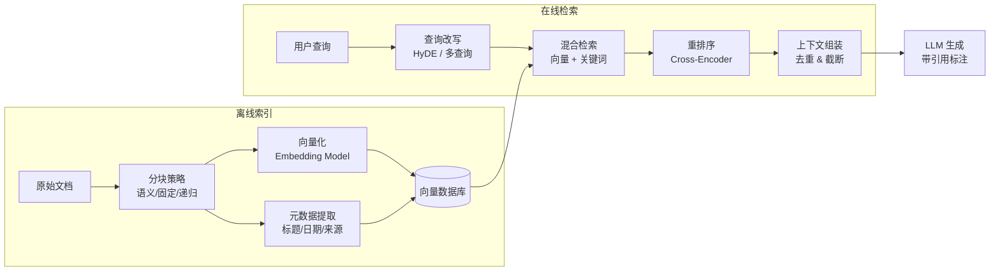
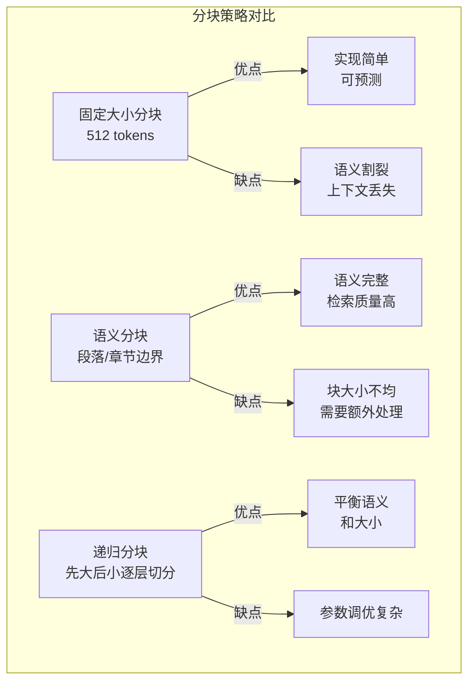

# 第 8 章 RAG 与知识工程

本章深入讲解 RAG（Retrieval-Augmented Generation）的工程化实践，将 Agent 的知识系统从“能用”提升到“好用”。生产级 RAG 的核心挑战不在于基本流程，而在于分块策略、检索质量、幻觉控制和持续评估。前置依赖：第 5 章上下文工程和第 7 章记忆架构。

## 本章你将学到什么

1. 为什么 RAG 的难点不在“能不能检索”，而在“检索出来的内容能否支撑正确决策”
2. 如何把离线索引和在线查询拆开理解
3. 如何区分 RAG、Memory 与 Tool 调用各自解决的问题
4. 如何从工程角度评估检索质量、上下文利用率和回答可信度

## 先给出一个边界判断

- **Memory** 解决“系统记住了什么”
- **RAG** 解决“系统此刻应该查到什么”
- **Tool** 解决“系统此刻应该调用什么能力”

很多失败的 Agent，不是 RAG 不够强，而是把这三件事混在一起了。

---

## 8.1 RAG Pipeline 架构

### 8.1.1 整体架构概览

一个生产级 RAG 系统包含 **离线索引（Offline Indexing）** 和 **在线查询（Online Serving）** 两条独立的 Pipeline。把这两条链路分开理解，是避免“所有问题都堆到检索阶段”这一常见错误的第一步：

```
┌─────────────────────────────────────────────────────────────────────┐
│                     离线索引 Pipeline (Offline)                      │
│                                                                     │
│  ┌──────────┐   ┌──────────┐   ┌───────────┐   ┌───────────────┐  │
│  │ Document  │──>│ Chunking │──>│ Embedding │──>│   Indexing    │  │
│  │ Ingestion │   │ Strategy │   │  Model    │   │ (Vector DB)  │  │
    // ... 对应实现可参考 code-examples/ 目录 ...
│      │           │              │              │            │      │
│      v           v              v              v            v      │
│  [用户问题]  [查询扩展]    [多路召回]     [精排过滤]   [生成回答]   │
└─────────────────────────────────────────────────────────────────────┘
```

### 8.1.2 核心类型定义

下面的类型定义主要用于说明 RAG Pipeline 中不同阶段的职责边界。阅读时，请优先理解“一个阶段解决什么问题”，而不是试图一次性记住所有字段。

```typescript
// ============================================================
// RAG Pipeline 核心类型定义
// ============================================================

/** 文档元数据 */
interface DocumentMetadata {
    // ... 对应实现可参考 code-examples/ 目录 ...
  generatedAnswer: string;
  metrics: StageMetrics[];
  traceId: string;
}
```

### 8.1.3 RAGPipeline 核心实现

```typescript
import { randomUUID } from "crypto";

// ============================================================
// RAGPipeline: 核心 Pipeline 实现
// ============================================================

    // ... 对应实现可参考 code-examples/ 目录 ...
      })
      .join("\n\n---\n\n");
  }
}
```

### 8.1.4 RAGPipelineBuilder: Fluent Builder 模式

在实际项目中，RAG Pipeline 的配置项非常多。使用 Builder 模式可以提供清晰、链式的配置体验：

```typescript
// ============================================================
// RAGPipelineBuilder: 流畅构建器
// ============================================================

class RAGPipelineBuilder {
  private config: Partial<{
    // ... 对应实现可参考 code-examples/ 目录 ...
//   .withReranker(new CrossEncoderReranker({ crossEncoder: cohereReranker }))
//   .withLLMClient(anthropicClient)
//   .withLogLevel("info")
//   .build();
```

### 8.1.5 错误处理策略

生产环境中，RAG Pipeline 的每个阶段都可能失败。下表总结了常见故障及应对策略：

| 阶段 | 可能故障 | 影响 | 处理策略 |
|------|---------|------|---------|
| Document Ingestion | 文件格式解析失败 | 该文档缺失 | 跳过并记录，不阻断批次 |
| Chunking | 文本过短或为空 | 产生无效块 | ChunkValidator 过滤 |
| Embedding | API 超时或限流 | 部分块无向量 | 指数退避重试，最多 3 次 |
| Indexing | 向量库写入失败 | 索引不完整 | 事务性批量写入加回滚 |
| Query Embedding | 模型不可用 | 查询失败 | 降级到 BM25 纯文本检索 |
| Retrieval | 返回空结果 | 无上下文 | 扩展查询词后重试 |
| Reranking | Reranker 超时 | 排序缺失 | 跳过 Reranking，使用原始排序 |
| Generation | LLM 幻觉或拒答 | 答案质量差 | 后置验证加 Faithfulness 检查 |

---

## 8.2 文档分块策略



**图 8-2 RAG 全链路工程架构**——RAG 的性能瓶颈往往不在检索本身，而在分块策略和查询改写。经验表明，优化这两个环节可以带来比更换更大模型更显著的效果提升。


文档分块（Chunking）是 RAG 系统中影响检索质量最关键的环节之一。分块粒度过大会引入噪声，过小则丢失上下文。本节系统讲解六种分块策略及其适用场景。

### 8.2.1 分块策略对比

| 策略 | 优点 | 缺点 | 适用场景 | 推荐块大小 |
|------|------|------|---------|-----------|
| Fixed Size | 实现简单、速度快 | 可能从句子中间截断 | 通用文本、快速原型 | 256-512 token |
| Semantic | 保持语义完整性 | 依赖 Embedding 模型质量 | 长文档、学术论文 | 动态 |
| Recursive | 多级分隔符保留结构 | 配置复杂 | Markdown、代码 | 512-1024 token |
| Parent-Child | 兼顾精确检索和上下文 | 存储开销翻倍 | 技术文档 | 父2048/子256 |
| Agentic | 最高语义质量 | 速度慢、成本高 | 高价值文档 | 由 LLM 决定 |
| Late Chunking | 保留全局注意力信息 | 需特殊模型支持 | 长上下文场景 | 动态 |

### 8.2.2 基础分块器实现

```typescript
// ============================================================
// 基础分块器：固定大小分块
// ============================================================

interface ChunkerConfig {
  chunkSize: number;      // 目标块大小（字符数）
    // ... 对应实现可参考 code-examples/ 目录 ...
    const otherChars = text.length - chineseChars;
    return Math.ceil(chineseChars / 1.5 + otherChars / 4);
  }
}
```

### 8.2.3 语义分块

语义分块通过计算相邻句子的 Embedding 相似度来确定分块边界。当相似度低于阈值时，说明话题发生了转换，应在此处切分：

```typescript
// ============================================================
// 语义分块器：基于 Embedding 相似度切分
// ============================================================

class SemanticChunker implements Chunker {
  private embeddingService: EmbeddingService;
    // ... 对应实现可参考 code-examples/ 目录 ...
      },
    }];
  }
}
```

### 8.2.4 递归分块

递归分块是 LangChain 推广的经典策略，通过多级分隔符逐层切分，优先在高层级结构边界处切分：

```typescript
// ============================================================
// 递归分块器：多级分隔符策略
// ============================================================

class RecursiveChunker implements Chunker {
  private chunkSize: number;
    // ... 对应实现可参考 code-examples/ 目录 ...
    }
    return results;
  }
}
```

### 8.2.5 Parent-Child 分块

Parent-Child 策略同时维护大块（Parent）和小块（Child）。检索时匹配小块以获得精确度，返回时扩展为父块以保证上下文完整性：

```typescript
// ============================================================
// Parent-Child 分块器
// ============================================================

class ParentChildChunker implements Chunker {
  private parentChunkSize: number;
    // ... 对应实现可参考 code-examples/ 目录 ...
    }
    return chunks;
  }
}
```

### 8.2.6 Agentic Chunking: 用 LLM 决定分块边界

Agentic Chunking 是一种前沿方法——让 LLM 自身判断文档的语义边界，实现最高质量的分块：

```typescript
// ============================================================
// Agentic Chunking: 基于 LLM 的智能分块
// ============================================================

class AgenticChunker implements Chunker {
  private llm: LLMClient;
    // ... 对应实现可参考 code-examples/ 目录 ...
      return results;
    }
  }
}
```

### 8.2.7 文档类型适配器

不同文档类型需要不同的解析和分块策略：

```typescript
// ============================================================
// Markdown 专用分块器——保留标题层级结构
// ============================================================

class MarkdownChunker implements Chunker {
  private maxChunkSize: number;
    // ... 对应实现可参考 code-examples/ 目录 ...
    }
    return sections;
  }
}
```

### 8.2.8 ChunkQualityValidator: 分块质量校验

```typescript
// ============================================================
// 分块质量校验器
// ============================================================

interface QualityReport {
  totalChunks: number;
    // ... 对应实现可参考 code-examples/ 目录 ...
    const uniqueWords = new Set(words);
    return uniqueWords.size / words.length < 0.3;
  }
}
```

---

## 8.3 混合检索

单一的向量检索（Dense Retrieval）在面对精确关键词匹配、专有名词查询时表现不佳；而传统的 BM25 检索无法理解语义相似性。混合检索（Hybrid Retrieval）通过融合多种检索策略，取长补短，显著提升召回率和准确性。

### 8.3.1 Query 预处理与扩展

在执行检索之前，对用户原始查询进行预处理可以大幅提升检索效果：

```typescript
// ============================================================
// Query 预处理: 查询扩展、分解与 HyDE
// ============================================================

/** 查询扩展结果 */
interface ExpandedQuery {
    // ... 对应实现可参考 code-examples/ 目录 ...

    return this.llm.generate(prompt, "");
  }
}
```

### 8.3.2 多路召回: Dense + Sparse + RRF 融合

```typescript
// ============================================================
// 混合检索器: Dense + Sparse 多路召回 + RRF 融合
// ============================================================

/** 稀疏检索接口 (BM25 / SPLADE) */
interface SparseRetriever {
    // ... 对应实现可参考 code-examples/ 目录 ...

    return Object.keys(conditions).length > 0 ? conditions : undefined;
  }
}
```

### 8.3.3 Cross-Encoder Reranker

Reranker 使用 Cross-Encoder 模型对 query-document pair 进行精细打分，精度远高于 Bi-Encoder 的向量相似度：

```typescript
// ============================================================
// Cross-Encoder Reranker 实现
// ============================================================

/** Cross-Encoder 模型接口 */
interface CrossEncoderModel {
    // ... 对应实现可参考 code-examples/ 目录 ...
      .sort((a, b) => b.score - a.score)
      .slice(0, this.topK);
  }
}
```

### 8.3.4 Contextual Retrieval

Anthropic 提出的 Contextual Retrieval 方法的核心思想是：在索引阶段，为每个 chunk 前置一段由 LLM 生成的上下文说明，解决 chunk 脱离原文后语义不完整的问题：

```typescript
// ============================================================
// Contextual Retrieval: 上下文增强分块
// ============================================================

class ContextualRetriever {
  private llm: LLMClient;
    // ... 对应实现可参考 code-examples/ 目录 ...

    return this.llm.generate(prompt, "");
  }
}
```

---

## 8.4 GraphRAG



**图 8-3 三种主流分块策略的权衡**——没有"最佳"分块策略，只有最适合你的数据特征的策略。对于结构化文档（技术手册、法律合同），语义分块几乎总是优于固定大小分块。


传统的向量检索将每个 chunk 视为独立单元，无法捕捉实体之间的关系和全局文档结构。GraphRAG 通过构建知识图谱（Knowledge Graph），将文档中的实体和关系显式建模，实现更强大的推理和检索能力。

### 8.4.1 GraphRAG 架构概览

```
┌──────────────────────────────────────────────────────────────┐
│                    GraphRAG 构建流程                          │
│                                                              │
│  文档集合                                                     │
│    │                                                         │
│    v                                                         │
    // ... 对应实现可参考 code-examples/ 目录 ...
│       │ Local Search│                │Global Search│         │
│       │ (实体邻域)  │                │ (社区摘要)  │         │
│       └────────────┘                 └────────────┘         │
└──────────────────────────────────────────────────────────────┘
```

### 8.4.2 知识图谱核心类型

```typescript
// ============================================================
// GraphRAG 核心类型定义
// ============================================================

/** 图谱实体 */
interface GraphEntity {
    // ... 对应实现可参考 code-examples/ 目录 ...
  entities: Map<string, GraphEntity>;
  relations: GraphRelation[];
  communities: GraphCommunity[];
}
```

### 8.4.3 GraphBuilder: 知识图谱构建

```typescript
// ============================================================
// GraphBuilder: 知识图谱构建器
// ============================================================

class GraphBuilder {
  private llm: LLMClient;
    // ... 对应实现可参考 code-examples/ 目录 ...
      this.relations.forEach((r) => (r.weight /= maxWeight));
    }
  }
}
```

### 8.4.4 GraphAugmentedRetriever: Local 与 Global 检索

GraphRAG 提供两种检索模式：

- **Local Search**: 从查询相关的实体出发，沿关系边扩展，获取局部子图上下文。适合具体的事实性问题。
- **Global Search**: 基于社区摘要进行检索，获取全局性概览。适合总结性、宏观性问题。

```typescript
// ============================================================
// GraphAugmentedRetriever: 图谱增强检索
// ============================================================

class GraphAugmentedRetriever {
  private graph: KnowledgeGraph;
    // ... 对应实现可参考 code-examples/ 目录 ...
    const magnitudeB = Math.sqrt(b.reduce((sum, bi) => sum + bi * bi, 0));
    return magnitudeA && magnitudeB ? dotProduct / (magnitudeA * magnitudeB) : 0;
  }
}
```

---

## 8.5 RAG 评估

没有评估就没有改进。RAG 系统的评估需要同时考量检索质量和生成质量两个维度。本节介绍基于 RAGAS 框架的系统性评估方法。

### 8.5.1 评估指标总览

| 指标 | 维度 | 含义 | 计算方式 |
|------|------|------|---------|
| Faithfulness | 生成质量 | 回答是否忠实于检索到的上下文 | 从回答中提取 claims，检查每个 claim 是否能从 context 推导 |
| Answer Relevancy | 生成质量 | 回答是否与问题相关 | 从回答反向生成问题，比较与原问题的相似度 |
| Context Precision | 检索质量 | 排序靠前的结果是否更相关 | 检查标注为相关的 chunk 在结果列表中的位置 |
| Context Recall | 检索质量 | 是否检索到了所有必要的信息 | ground truth 中的 claims 有多少能从 context 中找到 |
| Answer Correctness | 端到端 | 回答的最终正确性 | 与 ground truth 答案对比的 F1 分数 |

### 8.5.2 RAGEvaluator 实现

```typescript
// ============================================================
// RAGEvaluator: RAG 系统评估器
// ============================================================

/** 评估测试用例 */
interface RAGTestCase {
    // ... 对应实现可参考 code-examples/ 目录 ...
    const magnitudeB = Math.sqrt(b.reduce((sum, bi) => sum + bi * bi, 0));
    return magnitudeA && magnitudeB ? dotProduct / (magnitudeA * magnitudeB) : 0;
  }
}
```

### 8.5.3 A/B 测试框架

在优化 RAG 系统时，需要对比不同配置的效果。以下是一个轻量级 A/B 测试框架：

```typescript
// ============================================================
// RAG A/B 测试框架
// ============================================================

interface ABTestConfig {
  name: string;
    // ... 对应实现可参考 code-examples/ 目录 ...
      scoreComparison: comparison,
    };
  }
}
```

---

## 8.6 高级 RAG 模式：从管线到 Agent

传统 RAG 遵循固定的**管线范式**：用户查询 → 检索文档 → 生成回答。这条管线中的每个步骤是预定义的、线性的、一成不变的。2024-2025 年的核心演进方向是让 RAG 系统从“固定管线”进化为**“Agent 驱动的动态系统”**——即 **Agentic RAG** 范式。

> **范式对比**
>
> **传统 RAG（Pipeline 模式）**：query → retrieve → generate。检索是固定步骤，始终执行，策略预设不变。
>
> **Agentic RAG（Agent 模式）**：Agent 将检索视为工具箱中的一组工具，自主决定**何时检索**（是否需要外部知识）、**如何检索**（查询改写、分解、多源路由）、**检索几轮**（单轮 vs 迭代精炼）、以及**如何验证**（对检索结果进行评估、重排、交叉校验）。Agent 对 RAG 应用推理能力，使检索成为灵活的、由推理驱动的策略而非固定步骤。

从 Corrective RAG 到 Self-RAG，再到完整的 Agentic RAG，本节展示了这一演进路径中的关键里程碑。

基础 RAG（Naive RAG）的"检索-生成"单次流程在面对复杂查询时效果有限。本节介绍四种高级 RAG 模式，它们引入了反馈循环、自我评估和动态策略选择。

### 8.6.1 Corrective RAG (CRAG)

CRAG 在检索后增加一个"校正"步骤：如果检索结果质量不佳，系统会自动回退到 Web 搜索或其他数据源补充信息。

```typescript
// ============================================================
// Corrective RAG (CRAG): 带校正的检索增强生成
// ============================================================

/** Web 搜索接口 */
interface WebSearchClient {
    // ... 对应实现可参考 code-examples/ 目录 ...
    const score = parseFloat(response.trim());
    return isNaN(score) ? 0.5 : Math.max(0, Math.min(1, score));
  }
}
```

### 8.6.2 Self-RAG: 自我评估的 RAG

Self-RAG 让 Agent 自主决定**是否需要检索**、**检索结果是否有用**以及**生成的回答是否准确**：

```typescript
// ============================================================
// Self-RAG: 自我评估的检索增强生成
// ============================================================

type RetrievalDecision = "retrieve" | "no_retrieve";
type RelevanceJudgment = "relevant" | "irrelevant";
    // ... 对应实现可参考 code-examples/ 目录 ...

    return this.llm.generate(prompt, "");
  }
}
```

### 8.6.3 Adaptive RAG: 动态策略选择

Adaptive RAG 根据查询的复杂度和类型，动态选择最合适的检索策略：

```typescript
// ============================================================
// Adaptive RAG: 根据查询类型动态选择检索策略
// ============================================================

type QueryComplexity = "simple" | "moderate" | "complex";
type RetrievalStrategy = "direct_llm" | "single_step_rag" | "multi_hop_rag" | "graph_rag";
    // ... 对应实现可参考 code-examples/ 目录 ...

    return this.llm.generate(finalPrompt, "");
  }
}
```

### 8.6.4 Agentic RAG：自主检索与推理

前面介绍的 Corrective RAG、Self-RAG 和 Adaptive RAG 都在检索管线的某个环节引入了"判断"能力。2025 年最重要的演进是把这些零散的判断统一交给一个 **AI Agent**，让它自主决定检索的全部策略——这就是 **Agentic RAG**。

> **核心定义** Agentic RAG = 由 AI Agent 自主驱动的 RAG 管线。Agent 负责四个决策：
> - **WHEN**：是否需要检索（不是每个查询都需要外部知识）
> - **WHAT**：检索什么（查询改写、查询分解）
> - **WHERE**：从哪里检索（跨多个知识源的动态路由）
> - **HOW**：如何组合结果（迭代精炼、交叉验证）

#### 与其他 RAG 模式的对比

| 特性 | Naive RAG | Corrective RAG | Self-RAG | Agentic RAG |
|------|-----------|---------------|---------|------------|
| 检索决策 | 始终检索 | 始终检索 | 自判断 | 自主决策 |
| 检索轮次 | 单轮 | 单轮+修正 | 多轮 | 多轮+迭代 |
| 来源选择 | 固定 | 固定 | 固定 | 动态路由 |
| 结果评估 | 无 | 有 | 有 | 有+反思 |
| 查询理解 | 原始透传 | 原始透传 | 改写 | 分解+改写+路由 |
| 适用复杂度 | 简单事实 | 简单事实 | 中等推理 | 复杂多跳推理 |

关键区别在于：Agentic RAG 不再把检索当作管线中的固定步骤，而是当作 Agent 工具箱中的一组工具，由 Agent 根据推理需要自主调用。

> **实践建议**：在评估 RAG 架构时，应根据查询复杂度选择合适的模式。简单事实查询（“公司的退款政策是什么？”）使用 Naive RAG 即可；需要质量保障的场景使用 CRAG；涉及多跳推理的复杂问题（“比较过去三年的产品策略变化并分析其对营收的影响”）才需要完整的 Agentic RAG。过度使用 Agentic RAG 会增加延迟和成本，而不一定提升回答质量。

#### 架构实现

```typescript
// ============================================================
// Agentic RAG Engine: Agent 自主驱动的检索与推理
// ============================================================

interface KnowledgeSource {
  name: string;
    // ... 对应实现可参考 code-examples/ 目录 ...
  private estimateTokens(text: string): number {
    return Math.ceil(text.length / 3);
  }
}
```

#### 关键设计模式

**检索路由（Retrieval Routing）**：不同类型的查询路由到不同的知识源。事实型查询优先走向量数据库；数据分析型查询路由到 SQL 数据库；需要最新信息的查询路由到 Web 搜索。路由决策本身由 LLM 完成，这也是"Agentic"的核心含义。

**迭代深化（Iterative Deepening）**：第一轮做宽泛检索获取整体上下文，Agent 评估结果后识别信息缺口，生成更有针对性的后续查询。这类似于人类研究者的工作方式——先快速浏览，再深入细节。

**自我反思（Self-Reflection）**：Agent 在生成最终回答前评估检索结果的充分度。如果置信度不够，要么继续检索，要么在回答中明确标注不确定的部分。这避免了传统 RAG 中"有检索结果就一定用"的盲目性。

#### 生产注意事项

在生产环境中部署 Agentic RAG 需要注意以下平衡：

- **Token 预算管理**：每轮 LLM 调用（决策、评估、生成）都消耗 Token。设置严格的预算上限，避免复杂查询触发无限循环检索。
- **延迟与质量的权衡**：迭代检索显著增加端到端延迟。对于延迟敏感的场景，可设置最大轮次为 1-2 轮；对于质量优先的场景（如法律、医疗），允许 3-5 轮迭代。
- **降级策略**：当 Agent 决策模块出错或超时时，自动降级为标准 RAG（直接检索 + 生成），保证系统可用性。
- **决策追踪**：记录每一步的决策理由（`trace`），便于调试和审计。这在受监管行业中尤为重要。

---

## 8.7 生产环境部署

将 RAG 系统从原型推进到生产环境，需要解决规模化索引、向量数据库选型、缓存策略和成本控制等工程难题。

### 8.7.1 规模化索引策略

在生产环境中，文档数量可能达到数百万级。索引策略需要支持批量处理、增量更新和实时索引三种模式：

```typescript
// ============================================================
// 规模化索引管理器
// ============================================================

/** 索引任务 */
interface IndexJob {
    // ... 对应实现可参考 code-examples/ 目录 ...
    }
    return hash.toString(16);
  }
}
```

### 8.7.2 向量数据库选型

| 数据库 | 类型 | 优势 | 劣势 | 适用场景 | 价格模式 |
|--------|------|------|------|---------|---------|
| Pinecone | 全托管 SaaS | 零运维、自动扩缩容 | 供应商锁定、成本不透明 | 快速上线、中小规模 | 按量付费 |
| Weaviate | 开源/云端 | 内置向量化、模块化 | 大规模时内存消耗高 | 需要内置 ML 能力 | 开源免费/云端付费 |
| Milvus | 开源分布式 | 超大规模、高性能 | 运维复杂 | 十亿级向量、企业级 | 开源免费/Zilliz 云 |
| Qdrant | 开源/云端 | Rust 高性能、过滤能力强 | 生态较新 | 需要复杂过滤条件 | 开源免费/云端付费 |
| pgvector | PostgreSQL 扩展 | 与现有 PG 集成 | 大规模性能有限 | 已有 PG、百万级以下 | 随 PG 定价 |
| ChromaDB | 开源嵌入式 | 轻量、开发友好 | 不适合大规模生产 | 原型开发、本地测试 | 开源免费 |

### 8.7.3 多级缓存策略

RAG 系统的响应延迟主要来自 Embedding 计算和 LLM 调用。通过多级缓存可以显著降低延迟和成本：

```typescript
// ============================================================
// RAG 多级缓存系统
// ============================================================

/** 缓存接口 */
interface CacheStore {
    // ... 对应实现可参考 code-examples/ 目录 ...
    }
    return hash.toString(16);
  }
}
```

### 8.7.4 成本优化策略

RAG 系统的主要成本来自三个方面：Embedding API 调用、Reranker 推理和 LLM 生成。以下是成本优化的实践建议：

```typescript
// ============================================================
// 成本感知的 RAG 路由器
// ============================================================

interface CostConfig {
  embeddingCostPer1kTokens: number;   // 美元
    // ... 对应实现可参考 code-examples/ 目录 ...
      costByOperation: costByOp,
    };
  }
}
```

### 8.7.5 完整的生产级 RAG 服务

将前面所有组件整合为一个完整的生产级 RAG 服务：

```typescript
// ============================================================
// 生产级 RAG 服务: 整合所有组件
// ============================================================

interface RAGServiceConfig {
  embeddingService: EmbeddingService;
    // ... 对应实现可参考 code-examples/ 目录 ...
      costSummary,
    };
  }
}
```

### 8.7.6 嵌入模型选型与多向量检索

嵌入模型（Embedding Model）是 RAG 系统的"感知层"——它决定了系统能"看懂"什么。选错模型，后续的检索和生成再精巧也无济于事。本节系统梳理选型维度，并介绍正在改变检索范式的多向量方法。

#### 选型维度

| 维度 | 考量因素 | 推荐 |
|------|----------|------|
| 维度数 | 384 / 768 / 1024 / 1536 / 3072 | 768-1024 性价比最优 |
| 多语言 | 中英混合语料 | multilingual-e5-large, BGE-M3 |
| 领域适配 | 代码 / 法律 / 医学 | 领域微调模型 |
| 推理速度 | 实时交互 vs 离线批量 | 小模型实时，大模型批量 |
| 上下文长度 | 512 / 8192+ token | 长文档用 8K+ 模型 |
| 量化支持 | 二进制 / int8 / float16 | 大规模场景用量化降本 |

#### 主流模型对比（2025-2026）

```typescript
// ============================================================
// 嵌入模型选型参考: 主流模型特性对比
// ============================================================

interface EmbeddingModelSpec {
  name: string;
    // ... 对应实现可参考 code-examples/ 目录 ...
    multilingual: true,
    strengths: ["Task LoRA 适配", "开源", "多任务切换"],
  },
];
```

选型原则：优先在 MTEB（Massive Text Embedding Benchmark）排行榜上验证目标语言和任务类型的表现，再结合成本和部署约束做最终决策。

#### ColBERT：晚期交互检索

传统嵌入模型为每个文档生成**单一向量**——无论文档多长、内容多丰富，都被压缩到一个固定维度的点。这导致了信息瓶颈：多面向的查询难以用单个向量精确匹配。

ColBERT（Contextualized Late Interaction over BERT）采用了完全不同的策略——**为每个 Token 生成独立的向量**，在检索时进行"晚期交互"：

```typescript
// ============================================================
// 单向量 vs 多向量检索: 概念对比
// ============================================================

// ---- 传统单向量模型 ----
interface SingleVectorModel {
    // ... 对应实现可参考 code-examples/ 目录 ...
  }

  return totalScore;
}
```

**MaxSim 的直觉**：查询"TypeScript 的类型推断和编译性能"包含两个意图——"类型推断"和"编译性能"。单向量模型必须用一个向量同时表达两者，往往顾此失彼。ColBERT 让"类型"、"推断"、"编译"、"性能"各自的 Token 向量独立匹配文档中对应的内容，每个意图都能精确对齐。

**ColBERT 的优势**：
- 多面向查询的精确匹配，检索质量显著优于单向量
- Token 级别的细粒度交互，适合长文档场景
- 文档端向量可以预计算和索引，查询延迟可控

**代价**：存储空间大幅增加（每个文档从 1 个向量变为数百个向量），需要专门的索引结构（如 PLAID）支持高效检索。

#### ColPali：多模态文档检索

真实世界的文档不只有纯文本——PDF 中的图表、表格、流程图往往包含关键信息。传统 RAG 依赖 OCR 和布局解析来提取这些内容，但提取质量往往不稳定。

ColPali 将 ColBERT 的多向量思想扩展到视觉领域：直接对文档页面的**截图**生成 Patch 级别的嵌入向量，无需 OCR：

```typescript
// ============================================================
// ColPali: 基于视觉语言模型的多模态文档检索
// ============================================================

interface ColPaliModel {
  // 文档页面截图 → 每个图像 Patch 的向量
    // ... 对应实现可参考 code-examples/ 目录 ...
      return { pageIndex: idx, score };
    })
    .sort((a, b) => b.score - a.score);
}
```

**ColPali 的核心价值**：
- **跳过 OCR**：直接处理页面图像，避免 OCR 错误和布局解析的复杂性
- **理解视觉元素**：图表、表格、公式等视觉信息被原生理解，而非丢失
- **端到端简化**：文档处理管线从"PDF → OCR → 文本分块 → 嵌入"简化为"PDF → 截图 → Patch 嵌入"

**适用场景**：包含大量图表和表格的技术文档、扫描版 PDF、排版复杂的金融报告等。

#### 选型决策树

根据实际场景选择合适的嵌入与检索策略：

```
查询和文档类型?
├── 纯文本，查询简单 → 单向量模型 (text-embedding-3, BGE-M3)
│   └── 成本敏感? → 量化 + Matryoshka 降维
├── 纯文本，查询复杂/多面向 → ColBERT 多向量
│   └── 存储受限? → ColBERTv2 + PLAID 压缩索引
├── 包含图表/表格的文档 → ColPali 多模态
│   └── 混合场景? → ColPali 检索 + 文本精排
└── 代码库 → 代码专用模型 (voyage-code-3)
    └── 多语言代码? → 通用代码模型
```

> **实践建议**：大多数项目应从单向量模型起步（成熟、成本低、生态好），在确认检索质量是瓶颈后再评估 ColBERT 或 ColPali。过早引入多向量方案会增加存储成本和系统复杂度。


---

## 8.8 "RAG 已死"论争：Bash + 文件系统 vs. 向量检索

### 8.8.1 挑战 RAG 的新范式

2025-2026 年，随着 AI Agent 获得直接操作文件系统的能力，社区中出现了一个激进但值得深思的论点：**对于许多场景，Bash + 文件系统就是你需要的全部"RAG"**。

这一观点的核心逻辑是：

1. **Agent 可以直接使用 `grep`、`find`、`cat`、`awk` 等命令检索文件**：无需向量化、无需嵌入模型、无需向量数据库
2. **文件系统本身就是最成熟的"知识库"**：层次化目录结构提供了天然的语义组织
3. **精确匹配 vs. 语义匹配**：对于代码库、配置文件、日志分析等场景，精确的文本搜索比语义相似度更可靠

```typescript
// "Bash as RAG" 模式：Agent 直接操作文件系统进行知识检索
class FileSystemRetriever {
  constructor(private basePath: string) {}
  
  // 精确文本搜索（替代向量检索的场景）
  async grepSearch(query: string, options?: GrepOptions): Promise<SearchResult[]> {
    // ... 对应实现可参考 code-examples/ 目录 ...
    const end = lineNumber + contextLines;
    return bash(`sed -n '${start},${end}p' ${filePath}`);
  }
}
```

### 8.8.2 Claude Code 的实践验证

Anthropic 的 Claude Code 产品提供了这一范式的最佳实践案例。在 Claude Code 中，Agent 主要通过以下方式处理代码库知识：

```typescript
// Claude Code 风格的代码库知识检索
class AgentCodebaseRetriever {
  // 工具 1：精确搜索（替代 RAG 的主要手段）
  async searchCodebase(query: string): Promise<string> {
    // 使用 ripgrep 进行快速全文搜索
    return bash(`rg --type-add 'code:*.{ts,js,py,go,rs}' -t code "${query}" --context 3`);
    // ... 对应实现可参考 code-examples/ 目录 ...
  }
  
  // 无需：向量数据库、嵌入模型、chunk 策略、重排序器
}
```

这种方法在 **Agentic Coding** 场景下表现优异——Claude Code 在 SWE-bench 上的优秀成绩证明了"Bash + 文件系统"足以理解大型代码库。

### 8.8.3 但 RAG 真的死了吗？——场景化分析

"RAG 已死"的论点在特定场景下是正确的，但在另一些场景下则是危险的过度简化：

| 场景 | Bash+文件系统 | 传统 RAG | 推荐方案 |
|------|:----------:|:-------:|---------|
| 代码库检索 | ✅ 更优 | ⚠️ 过度工程 | Bash（grep/rg/find） |
| 日志分析 | ✅ 更优 | ⚠️ 不适合 | Bash（awk/grep/jq） |
| 配置文件查询 | ✅ 更优 | ❌ 浪费 | 直接文件读取 |
| 企业知识库（10万+文档） | ❌ 不可行 | ✅ 必须 | 向量检索+混合搜索 |
| 法律/合规文档 | ⚠️ 精确匹配有限 | ✅ 语义检索关键 | 层次化 RAG + 重排序 |
| 多语言文档 | ❌ grep 无法跨语言 | ✅ 嵌入模型天然支持 | 多语言 RAG |
| 实时数据流 | ❌ 文件系统延迟 | ✅ 增量索引 | 流式 RAG Pipeline |
| 多模态（图片、表格、PDF） | ❌ 不支持 | ✅ 多模态嵌入 | 多模态 RAG |

### 8.8.4 Contextual Retrieval：RAG 的进化而非死亡

即使在传统 RAG 的领地内，范式也在快速进化。Anthropic 在 2024 年末提出的 **Contextual Retrieval** 技术将 RAG 的检索失败率降低了 67%：

```typescript
// Contextual Retrieval：保留文档结构上下文的新型 RAG
class ContextualRetrievalPipeline {
  // 核心创新：chunk 前注入文档上下文
  async contextualizeChunk(chunk: string, fullDocument: string): Promise<string> {
    // 使用 LLM 为每个 chunk 生成位置上下文
    const context = await llm.generate(`
    // ... 对应实现可参考 code-examples/ 目录 ...
    );
    return scored.sort((a, b) => b.score - a.score).slice(0, 10);
  }
}
```

> **数据说话**：根据 Anthropic 的测试，Contextual Retrieval + BM25 混合检索 + Reranking 将检索失败率从 5.7% 降至 1.9%，降幅达 67%。这一成本仅为每百万 Token 约 $1（使用 Prompt Caching）。

### 8.8.5 Agentic RAG：检索即行动

另一个重要的进化方向是 **Agentic RAG**——Agent 不再被动地从向量库中检索，而是主动规划检索策略：

```typescript
// Agentic RAG：Agent 自主规划检索策略
class AgenticRAGAgent {
  private tools: {
    vectorSearch: VectorSearchTool;
    webSearch: WebSearchTool;
    fileSystem: FileSystemTool;
    // ... 对应实现可参考 code-examples/ 目录 ...
    
    return this.synthesize(question, context);
  }
}
```

### 8.8.6 本书的立场与建议

| 原则 | 建议 |
|------|------|
| **务实主义** | 不要为了用 RAG 而用 RAG；如果 `grep` 能解决问题，就用 `grep` |
| **场景匹配** | 代码/配置/日志 → Bash；大规模文档/多语言/多模态 → RAG |
| **持续进化** | 如果选择 RAG，请使用 Contextual Retrieval + 混合检索 + Reranking |
| **Agentic 优先** | 让 Agent 自主选择检索策略，而非硬编码 Pipeline |

---

## 8.9 本章小结

本章系统讲解了 RAG 与知识工程的完整技术栈。回顾核心要点：

### 关键知识点

| 主题 | 核心内容 | 关键收获 |
|------|---------|---------|
| **8.1 Pipeline 架构** | 离线索引 + 在线查询的双 Pipeline 设计 | Builder 模式配置、观测器追踪每个阶段 |
| **8.2 分块策略** | 6 种分块策略的对比与实现 | 没有万能策略，需根据文档类型选择 |
| **8.3 混合检索** | Dense + Sparse + RRF 融合 | HyDE、Contextual Retrieval 等前沿技术 |
| **8.4 GraphRAG** | 知识图谱构建与检索 | Local/Global 双模式检索 |
| **8.5 评估体系** | RAGAS 框架五大指标 | 自动化评估 + A/B 测试 |
| **8.6 高级模式** | CRAG、Self-RAG、Adaptive RAG | 多跳推理、自我校正、动态策略 |
| **8.7 生产部署** | 向量库选型、缓存、成本优化 | 规模化索引、成本感知路由 |
| **8.8 "RAG 已死"论争** | Bash+文件系统 vs. 向量检索的场景化分析 | 务实选择检索策略、Contextual Retrieval、Agentic RAG |

### 最佳实践清单

1. **分块策略选择**: 优先使用 Recursive Chunker 作为基线，再根据效果切换到 Semantic 或 Parent-Child 策略。
2. **混合检索是标配**: 永远不要只用 Dense Retrieval，BM25 + Dense + RRF 的组合在绝大多数场景下优于单一策略。
3. **Reranker 是性价比最高的优化**: 加入 Cross-Encoder Reranker 通常能提升 5-15% 的准确率，成本远低于更换 LLM。
4. **Contextual Retrieval**: Anthropic 的方法简单有效，索引时为每个 chunk 加上上下文前缀即可获得显著提升。
5. **评估驱动优化**: 在修改任何 RAG 配置前，先建立自动化评估 Pipeline，用数据说话。
6. **缓存三级策略**: 查询缓存 -> Embedding 缓存 -> 语义缓存，可以将 90% 的重复查询成本降至接近零。
7. **成本意识**: 生产系统必须有成本监控，根据预算动态调整 Reranker 使用和模型选择。

### 下一步

本章的 RAG 系统为 Agent 提供了强大的外部知识获取能力。下一章（第九章）我们将进入 Multi-Agent 领域，探讨多 Agent 编排基础——包括 ADK 三原语、Agent 间通信机制、共享状态协调与容错恢复。

---

> **本章参考资料**
>
> - Lewis et al., "Retrieval-Augmented Generation for Knowledge-Intensive NLP Tasks" (2020)
> - Gao et al., "Retrieval-Augmented Generation for Large Language Models: A Survey" (2024)
> - Edge et al., "From Local to Global: A Graph RAG Approach to Query-Focused Summarization" (2024)
> - Anthropic, "Introducing Contextual Retrieval" (2024)
> - Es et al., "RAGAS: Automated Evaluation of Retrieval Augmented Generation" (2023)
> - Asai et al., "Self-RAG: Learning to Retrieve, Generate, and Critique through Self-Reflection" (2023)
> - Yan et al., "Corrective Retrieval Augmented Generation" (2024)

## 本章小结

RAG 的重点不是接入检索组件，而是把知识获取链路工程化。离线索引决定知识是否可被高质量召回，在线查询决定知识是否能在正确时机进入当前任务。把 RAG 与记忆、工具区分开来，能帮助系统在长期演进中保持清晰边界。

## 建议接着读

如果你希望沿着本书的主干继续推进，建议下一步阅读 第 10 章《编排模式 — 九种经典 Multi-Agent 架构》。这样可以把本章中的判断框架，继续连接到后续的实现、评估或生产化问题上。

