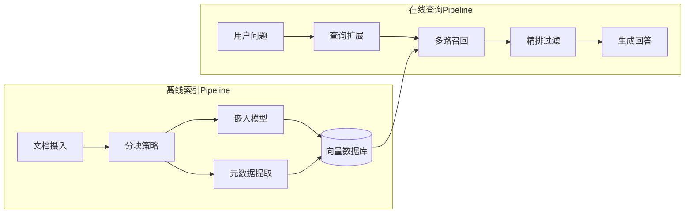
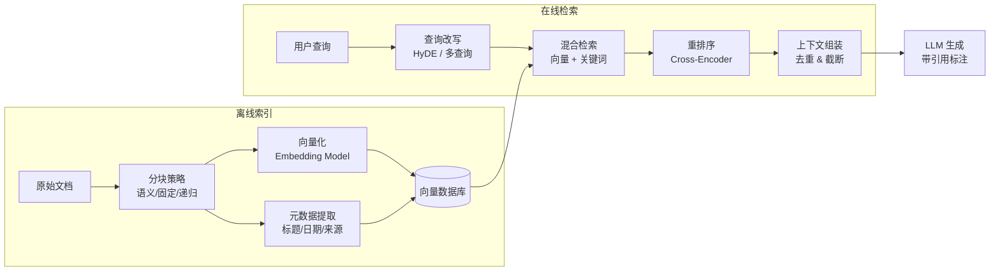
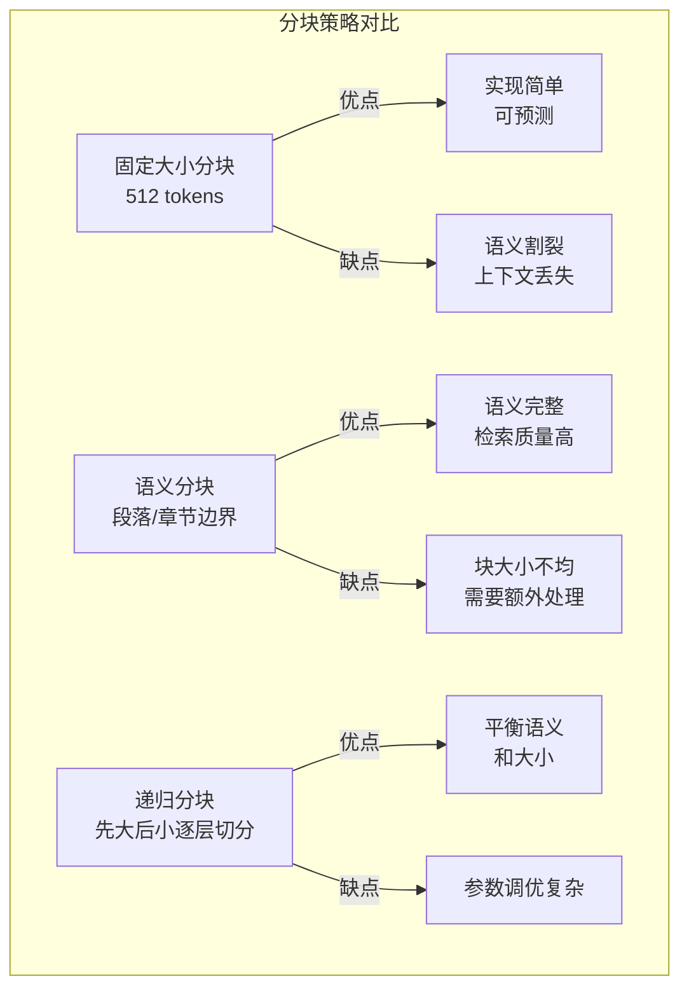
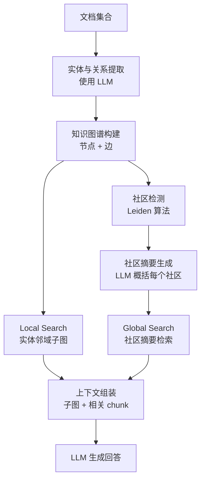

# 第 8 章 RAG 与知识工程

本章深入讲解 RAG（Retrieval-Augmented Generation）的工程化实践，将 Agent 的知识系统从"能用"提升到"好用"。生产级 RAG 的核心挑战不在于基本流程，而在于分块策略、检索质量、幻觉控制和持续评估。前置依赖：第 5 章上下文工程和第 7 章记忆架构。

## 本章你将学到什么

1. 为什么 RAG 的难点不在"能不能检索"，而在"检索出来的内容能否支撑正确决策"
2. 如何把离线索引和在线查询拆开理解
3. 如何区分 RAG、Memory 与 Tool 调用各自解决的问题
4. 如何从工程角度评估检索质量、上下文利用率和回答可信度

## 先给出一个边界判断

- **Memory** 解决"系统记住了什么"
- **RAG** 解决"系统此刻应该查到什么"
- **Tool** 解决"系统此刻应该调用什么能力"

很多失败的 Agent，不是 RAG 不够强，而是把这三件事混在一起了。Memory 是持久化的状态管理，跨会话累积；RAG 是按需的知识检索，每次查询独立；Tool 是能力调用，改变外部世界。三者协作但职责分明，混淆它们会导致架构退化——比如把所有对话历史塞进向量数据库（Memory 和 RAG 混淆），或者把数据库查询结果直接当作 RAG 上下文（Tool 和 RAG 混淆）。

另一种常见的混淆是把 RAG 和微调（Fine-tuning）视为替代方案。实际上两者解决不同的问题：微调改变模型的内在知识和行为模式，适合领域适配和风格调整；RAG 提供外部的、可更新的事实知识，适合需要精确引用和实时信息的场景。大多数生产系统两者都需要——用微调让模型理解领域术语和输出格式，用 RAG 提供具体的事实依据。

清晰的边界判断在架构设计早期就应建立。一个实用的判断方法是问三个问题：这条信息需要跨会话保留吗？（是 → Memory）这条信息需要从外部知识库中按需获取吗？（是 → RAG）这条信息需要通过执行某个操作来获取吗？（是 → Tool）。当一个功能同时涉及多个类别时（比如"记住用户偏好并据此检索推荐文档"），应将其分解为独立的 Memory 写入和 RAG 检索两个步骤，而非构建一个混合组件。

---

## 8.1 RAG Pipeline 架构

### 8.1.1 整体架构概览

一个生产级 RAG 系统包含 **离线索引（Offline Indexing）** 和 **在线查询（Online Serving）** 两条独立的 Pipeline。把这两条链路分开理解，是避免"所有问题都堆到检索阶段"这一常见错误的第一步。离线索引负责将原始文档转化为可检索的结构化表示，这个过程可以容忍较高延迟但要求高质量；在线查询则需要在毫秒级延迟内返回最相关的信息，对速度和精度都有严格要求。


**图 8-1 RAG 双 Pipeline 架构**——离线索引和在线查询是两条独立链路，优化策略完全不同。离线侧追求质量（更好的分块、更准的嵌入），在线侧追求速度（缓存、近似搜索、流式生成）。

在实际项目中，离线索引 Pipeline 通常由数据工程团队维护，在线查询 Pipeline 由后端工程团队维护。两个团队通过向量数据库这一共享接口解耦。这种组织结构上的分工也印证了双 Pipeline 架构的合理性——每个团队专注于自己擅长的优化方向。

两条 Pipeline 的解耦带来了一个关键工程优势：可以独立迭代。你可以在不影响线上服务的情况下重新索引全部文档（比如更换嵌入模型），也可以在不重建索引的情况下优化查询链路（比如加入 Reranker）。这种解耦是 RAG 系统能持续演进的基础。

理解这种解耦还有助于定位问题。当用户报告"检索结果不相关"时，问题可能出在离线侧（分块策略不当、嵌入模型不够好）或在线侧（查询理解不足、排序有误）。如果两条链路混在一起，定位问题的难度会大幅增加。经验表明，约 60% 的检索质量问题根源在离线侧（分块和嵌入），40% 在在线侧（查询理解和排序）。

一个实用的调试流程是：先用固定的测试查询集检查检索结果是否包含已知的正确文档（检索质量）；如果检索正确但回答不对，问题在生成侧（prompt 或 LLM 选择）；如果检索就不对，再区分是分块导致相关内容被切碎了（离线侧），还是查询改写或排序出了问题（在线侧）。这个自上而下的排查方法能快速缩小问题范围。


**图 8-2 RAG 全链路工程架构**——RAG 的性能瓶颈往往不在检索本身，而在分块策略和查询改写。经验表明，优化这两个环节可以带来比更换更大模型更显著的效果提升。

### 8.1.2 核心类型定义

RAG Pipeline 中各阶段通过几个核心数据结构串联。`DocumentChunk` 是最核心的类型——它是分块后的最小检索单元，承载内容、元数据和向量表示。`parentChunkId` 字段支持 Parent-Child 分块策略（§8.2.5），`embedding` 在离线索引时生成。`RetrievalResult` 在检索结果上附加了分数和检索方法信息，支持后续的融合和重排序。`RAGResponse` 封装了完整的查询响应，包含检索到的块、生成的回答以及各阶段的性能指标（延迟、输入输出数量等），为可观测性提供数据支撑。

设计这些类型时的一个重要原则是保持可扩展性。例如，RetrievalResult 中的 retrievalMethod 字段使用联合类型而非枚举，便于后续新增检索方法（如 graph、rewritten 等）而不破坏现有代码。metadata 字段使用开放结构（可选的 tags 数组），允许不同文档类型携带特定的元数据而不需要修改核心接口。

```typescript
interface DocumentChunk {
  id: string;
  documentId: string;
  content: string;
  metadata: { source: string; title: string; documentType: string; tags?: string[] };
  chunkIndex: number;
  parentChunkId?: string;   // Parent-Child 策略中的父块 ID
  embedding?: number[];
  tokenCount: number;
}

interface RetrievalResult {
  chunk: DocumentChunk;
  score: number;
  retrievalMethod: "dense" | "sparse" | "hybrid" | "graph";
  rerankerScore?: number;
}
```

### 8.1.3 RAGPipeline 核心实现

RAGPipeline 是整个系统的主干，按顺序执行查询嵌入、向量检索、重排序和生成四个阶段。理解这段代码的关键不在于语法，而在于四个阶段的职责分离——每个阶段只做一件事，通过标准接口串联。

为什么要把 Reranker 设为可选？因为它是一个成本-质量的旋钮。没有 Reranker 时系统仍能工作（使用向量相似度排序），加上 Reranker 后精度提升但延迟和成本增加。这种"可插拔"设计让系统能根据场景灵活调整。后续 §8.6 将介绍如何通过 Agent 驱动让 Pipeline 变得动态和自适应。

Pipeline 的可配置性可通过 Builder 模式实现：在 `build()` 时验证必要组件（Embedding、VectorStore、LLM）的完整性，避免运行时才发现配置缺失。Builder 模式的好处是让配置意图更清晰——读者一眼就能看出哪些组件是必需的、哪些是可选的。

值得强调的是，Pipeline 中各阶段的执行顺序并非不可调整。在某些场景下，可以跳过 Embedding 阶段直接使用 BM25 检索，或者在重排序之前插入一个基于规则的过滤器（比如只保留最近 30 天的文档）。Pipeline 的价值不在于固定的步骤序列，而在于提供一个清晰的抽象框架，让每个阶段的输入输出契约明确，从而支持灵活的组合和替换。

```typescript
class RAGPipeline {
  constructor(
    private embedding: EmbeddingService, private store: VectorStore,
    private llm: LLMClient, private reranker?: Reranker, private topK = 10
  ) {}

  async query(userQuery: string): Promise<RAGResponse> {
    const metrics: StageMetrics[] = [];
    // 阶段 1-2: 查询嵌入 + 向量检索
    const qEmb = await this.embedding.embed(userQuery);
    let results = await this.store.search(qEmb, this.topK);
    // 阶段 3: 可选重排序（Cross-Encoder 精排）
    if (this.reranker && results.length > 0)
      results = await this.reranker.rerank(userQuery, results, 5);
    // 阶段 4: 上下文组装 + LLM 生成
    const context = results
      .map((r, i) => `[来源 ${i + 1}] (相关度: ${r.score.toFixed(3)})\n${r.chunk.content}`)
      .join("\n\n---\n\n");
    const answer = await this.llm.generate(
      `基于以下参考资料回答问题。如果资料不足以回答，请明确说明。\n\n参考资料:\n${context}\n\n问题: ${userQuery}`,
      "你是一个准确、有帮助的问答助手。只基于提供的参考资料回答。");
    return { query: userQuery, retrievedChunks: results, generatedAnswer: answer,
             metrics, traceId: randomUUID() };
  }
}
// 完整实现含 StageMetrics 计时、Builder 模式约 65 行，核心逻辑如上
```

注意第 4 阶段的 prompt 设计：`"如果资料不足以回答，请明确说明"` 这句约束至关重要——它给了 LLM 一个"逃生出口"，当检索结果确实不相关时，LLM 可以坦诚说"我不知道"，而不是被迫编造答案。这是降低幻觉最简单也最有效的手段之一。

另一个容易被忽视的 prompt 细节是来源标注格式。在上下文组装阶段，为每个 chunk 编号并标注相关度分数，可以帮助 LLM 在生成时引用具体来源。这不仅提高了回答的可信度，也让用户能够追溯信息的出处，是企业级 RAG 系统的基本要求。

### 8.1.4 错误处理策略

生产环境中，RAG Pipeline 的每个阶段都可能失败。关键原则是：**不让单点故障击穿整条链路**。每个阶段都应有降级方案，即使效果下降也要保证系统可用。例如，当 Embedding API 不可用时，可以降级到 BM25 纯文本检索；当 Reranker 超时时，跳过重排直接使用原始排序。这种"优雅降级"在高可用系统中至关重要。

以下是各阶段的故障模式和推荐处理策略。在实际项目中，建议把这些策略编码到 Pipeline 的错误处理逻辑中，而非等到线上故障时再临时处理。

| 阶段 | 可能故障 | 影响 | 处理策略 |
|------|---------|------|---------|
| Document Ingestion | 文件格式解析失败 | 该文档缺失 | 跳过并记录，不阻断批次 |
| Chunking | 文本过短或为空 | 产生无效块 | ChunkValidator 过滤 |
| Embedding | API 超时或限流 | 部分块无向量 | 指数退避重试，最多 3 次 |
| Indexing | 向量库写入失败 | 索引不完整 | 事务性批量写入加回滚 |
| Query Embedding | 模型不可用 | 查询失败 | 降级到 BM25 纯文本检索 |
| Retrieval | 返回空结果 | 无上下文 | 扩展查询词后重试 |
| Reranking | Reranker 超时 | 排序缺失 | 跳过 Reranking，使用原始排序 |
| Generation | LLM 幻觉或拒答 | 答案质量差 | 后置验证加 Faithfulness 检查 |

除了错误处理，可观测性（Observability）也是生产 RAG 系统的必备能力。每次查询都应记录完整的 trace：查询文本、嵌入耗时、检索结果数和分数分布、Reranker 耗时和分数变化、LLM 输入 token 数和生成耗时。这些数据不仅用于事后排查问题，更重要的是用于发现系统性的质量退化——比如某天检索平均分突然下降 10%，可能是嵌入模型的 API 返回了异常结果，或者新索引的文档质量有问题。建议将这些指标接入 Grafana 或类似的监控系统，设置关键指标的告警阈值。


---

## 8.2 文档分块策略

文档分块（Chunking）是 RAG 系统中影响检索质量最关键的环节之一。分块粒度过大会引入噪声——检索到的块中真正相关的内容可能只占一小部分，稀释了信号；分块粒度过小则丢失上下文——一个孤立的句子缺乏足够的语境供 LLM 正确理解和引用。寻找这个平衡点是 RAG 工程化的第一课。

一个常见的误区是把分块当作纯粹的文本处理问题。实际上，分块策略的选择必须考虑下游检索和生成的需求：检索阶段偏好小块（更精确的匹配），生成阶段偏好大块（更完整的上下文）。Parent-Child 策略正是为了调和这一矛盾而设计的。此外，分块策略还与嵌入模型的上下文窗口长度密切相关——如果嵌入模型只支持 512 token，超长的块会被截断，导致信息丢失。

实践中，选择分块策略的第一步是观察数据。技术文档有清晰的标题层级，用递归分块天然合适；学术论文段落完整但主题切换频繁，语义分块更好；合同文本结构严格但句子冗长，固定大小加句子边界检测是安全的起点。不要在没有看过数据的情况下选定策略——这是最常见的错误。


**图 8-3 三种主流分块策略的权衡**——没有"最佳"分块策略，只有最适合你的数据特征的策略。对于结构化文档（技术手册、法律合同），语义分块几乎总是优于固定大小分块。

### 8.2.1 分块策略对比

| 策略 | 优点 | 缺点 | 适用场景 | 推荐块大小 |
|------|------|------|---------|-----------|
| Fixed Size | 实现简单、速度快 | 可能从句子中间截断 | 通用文本、快速原型 | 256-512 token |
| Semantic | 保持语义完整性 | 依赖 Embedding 模型质量 | 长文档、学术论文 | 动态 |
| Recursive | 多级分隔符保留结构 | 配置复杂 | Markdown、代码 | 512-1024 token |
| Parent-Child | 兼顾精确检索和上下文 | 存储开销翻倍 | 技术文档 | 父2048/子256 |
| Agentic | 最高语义质量 | 速度慢、成本高 | 高价值文档 | 由 LLM 决定 |
| Late Chunking | 保留全局注意力信息 | 需特殊模型支持 | 长上下文场景 | 动态 |

表中的推荐块大小仅供参考——实际最优块大小取决于嵌入模型的上下文窗口和数据特征。一个实用的调优方法是从 512 token 开始，在评估集上测试 256、512、1024 三个值，选择 Recall@10 最高的那个。通常较短的块在精确匹配任务上表现更好，较长的块在需要上下文理解的任务上占优。

### 8.2.2 固定大小分块

固定大小分块是最简单也是最常用的基线策略。它的核心逻辑是在固定间隔处切分文本，通过重叠（overlap）来缓解边界处的上下文丢失。虽然简单，但在很多场景下效果足够好——尤其是当文档结构不规则、难以用语义或结构规则切分时。

值得注意的是，"固定大小"并不意味着完全机械地按字符数截断。好的实现会在目标大小附近寻找句子边界（句号、换行符），确保不在句子中间截断。这个小改进能显著减少语义割裂。对于中文文本，还需要特别注意 token 计数的校准——中文约 1.5 个字符对应一个 token，英文约 4 个字符对应一个 token。

重叠窗口（overlap）的大小选择也有讲究。太小（如 10 个字符）几乎没有效果，太大（如块大小的 50%）会导致大量重复内容浪费存储和计算。经验法则是将 overlap 设为块大小的 10-15%。对于需要保持段落连贯性的场景（如法律文本），可以适当增大到 20%。

```typescript
class FixedSizeChunker implements Chunker {
  constructor(private chunkSize = 512, private overlap = 50) {}

  chunk(text: string, metadata: DocumentMetadata): DocumentChunk[] {
    const chunks: DocumentChunk[] = [];
    let start = 0, index = 0;
    while (start < text.length) {
      let end = Math.min(start + this.chunkSize, text.length);
      // 在目标大小附近寻找句子边界，避免从句子中间截断
      if (end < text.length) {
        const boundary = Math.max(text.lastIndexOf("。", end), text.lastIndexOf("\n", end));
        if (boundary > start + 50) end = boundary + 1;
      }
      const content = text.slice(start, end).trim();
      if (content.length >= 50)
        chunks.push({ id: `chunk-${index}`, documentId: metadata.source,
          content, metadata, chunkIndex: index++,
          tokenCount: Math.ceil(content.length / 3) });
      start = end - this.overlap;
    }
    return chunks;
  }
}
```

### 8.2.3 语义分块

语义分块通过计算相邻句子的 Embedding 相似度来确定分块边界。当相似度低于阈值时，说明话题发生了转换，应在此处切分。这种方法的优势在于产出的每个块都围绕单一主题，检索时匹配精度更高。代价是需要为每个句子计算 Embedding，索引速度较慢。

语义分块特别适合长篇非结构化文本，例如学术论文、会议纪要和新闻报道。对于已有清晰结构（标题、章节）的文档，递归分块通常是更好的选择，因为文档结构本身就提供了语义边界信号。阈值的选择需要根据嵌入模型和语料特征调优——通常从 0.75 开始，选取 10 份代表性文档人工标注理想的分块边界，然后调整阈值使自动分块结果与人工标注尽量一致。

语义分块的另一个工程考量是批量 Embedding 的成本。对于一篇 5000 句的长文档，需要计算 5000 个句子的嵌入向量，这在 API 调用模式下可能产生不小的费用。一种优化方法是先用轻量级的句子相似度模型（如 all-MiniLM-L6-v2，384 维）做初步的语义分块，再对分块结果用高质量模型（如 text-embedding-3-large，3072 维）计算最终的检索嵌入。

核心算法是：先将文本按句子切分，批量计算所有句子的嵌入向量，然后遍历相邻句子对的余弦相似度，低于阈值处标记为断点，最后按断点将句子分组为块。

```typescript
class SemanticChunker implements Chunker {
  constructor(private embeddingService: EmbeddingService, private threshold = 0.75) {}

  async chunk(text: string, metadata: DocumentMetadata): Promise<DocumentChunk[]> {
    const sentences = text.split(/(?<=[。！？.!?\n])\s*/g).filter(s => s.trim());
    const embeddings = await this.embeddingService.embedBatch(sentences);
    const breakpoints: number[] = [];
    for (let i = 0; i < embeddings.length - 1; i++)
      if (this.cosine(embeddings[i], embeddings[i + 1]) < this.threshold)
        breakpoints.push(i + 1);
    // 按断点分组为语义完整的块，过滤过短片段
    const chunks: DocumentChunk[] = [];
    let start = 0;
    for (const bp of [...breakpoints, sentences.length]) {
      const content = sentences.slice(start, bp).join(" ").trim();
      if (content.length > 50) chunks.push(/* 构造 DocumentChunk */);
      start = bp;
    }
    return chunks;
  }
  // 完整实现含 cosine 辅助方法约 45 行，核心逻辑如上
}
```

### 8.2.4 递归分块

递归分块是 LangChain 推广的经典策略，通过多级分隔符逐层切分，优先在高层级结构边界处切分。它的核心直觉是：标题分隔 > 段落分隔 > 句子分隔 > 字符分隔。这确保了在块大小允许的范围内，尽可能保留文档的层级结构。

递归策略的另一个优势是确定性——相同的输入总是产生相同的输出，不依赖外部模型。这使得它在调试和回归测试中非常方便。大多数生产系统都以递归分块作为默认基线，在确认效果不足后再尝试语义分块或 Parent-Child 策略。

递归分块的一个实用技巧是在分隔符列表中加入领域特定的标记。例如，处理 API 文档时，可以将 HTTP 方法标记（如 GET、POST）作为高优先级分隔符；处理代码注释时，可以将 JSDoc 标签（如 @param、@returns）作为分隔符。这种定制能显著提升特定领域的分块质量。

实现的核心是一个递归函数：对于当前文本，尝试用最高优先级的分隔符切分；如果某个片段仍超过目标大小，递归地用下一级分隔符继续切分；当所有分隔符用尽时，按固定大小硬切。分隔符的优先级是可配置的——对于 Markdown 文档，推荐 `["\n## ", "\n### ", "\n\n", "\n", "。", " "]`；对于代码文件，推荐 `["\nfunction ", "\nclass ", "\n\n", "\n"]`。

```typescript
class RecursiveChunker implements Chunker {
  private separators = ["\n## ", "\n### ", "\n\n", "\n", "。", ". ", " "];
  constructor(private chunkSize = 512, private overlap = 50) {}

  chunk(text: string, metadata: DocumentMetadata): DocumentChunk[] {
    return this.split(text, 0).map((content, i) => ({
      id: `chunk-${i}`, documentId: metadata.source,
      content, metadata, chunkIndex: i, tokenCount: Math.ceil(content.length / 3),
    }));
  }

  private split(text: string, sepIdx: number): string[] {
    if (text.length <= this.chunkSize) return [text];
    if (sepIdx >= this.separators.length) return this.hardSplit(text);
    const parts = text.split(this.separators[sepIdx]).filter(p => p.trim());
    const results: string[] = [];
    let cur = "";
    for (const part of parts) {
      if ((cur + part).length <= this.chunkSize) cur += this.separators[sepIdx] + part;
      else {
        if (cur) results.push(cur);
        cur = part.length > this.chunkSize ? "" : part;
        if (part.length > this.chunkSize) results.push(...this.split(part, sepIdx + 1));
      }
    }
    if (cur) results.push(cur);
    return results;
  }
  // 完整实现含 hardSplit 约 40 行，核心逻辑如上
}
```

### 8.2.5 Parent-Child 分块

Parent-Child 策略同时维护大块（Parent，约 2048 token）和小块（Child，约 256 token）。检索时匹配小块以获得精确度，返回时扩展为父块以保证上下文完整性。这是解决"检索精度 vs. 生成上下文"矛盾的优雅方案。

实现时的关键决策是父块和子块的大小比。经验法则是父块为子块的 4-8 倍。太小则扩展后上下文仍然不足，太大则引入过多噪声。在检索流程中，向量库中只索引子块的 Embedding，检索命中后通过 `parentChunkId` 找回父块的完整内容，将父块内容（而非子块内容）送入 LLM。这种设计的额外好处是可以去重：同一父块下的多个子块被命中时，只需要发送一次父块内容，避免上下文窗口中的重复信息。

实现核心是：先按父块大小切分文档，为每个父块生成 `parentId`；然后将每个父块进一步按子块大小切分，子块通过 `parentChunkId` 关联父块。索引时对子块建立嵌入索引，检索命中后回溯到父块。

Parent-Child 策略的一个常见实现错误是在向量库中同时索引父块和子块。这会导致检索结果中父块和子块同时出现，浪费上下文窗口空间。正确的做法是只索引子块，父块仅存储在关系型数据库或文档存储中，通过 ID 关联查询。

### 8.2.6 Agentic Chunking

Agentic Chunking 让 LLM 自身判断文档的语义边界。人类在阅读文档时能自然感知"这里话题变了"，LLM 也具备这种能力。通过让 LLM 标注语义边界（输出 JSON 标注每个"话题转换点"的前后文本片段），可以产出比任何规则或统计方法更准确的分块结果。

代价是显而易见的：每个文档都需要一次完整的 LLM 调用，索引速度慢、成本高。因此 Agentic Chunking 通常只用于高价值、低更新频率的文档集合——例如法律合同、核心产品文档、知识库的基础条目。对于大批量日常文档，递归或语义分块仍是更实际的选择。实现时必须对 LLM 输出的 JSON 解析失败做回退处理——当解析失败时，自动降级到 RecursiveChunker，确保系统可靠性。

Agentic Chunking 的另一个应用场景是作为分块策略的标注工具。即使你不打算在生产中使用 Agentic Chunking（因为成本太高），也可以用它在少量文档上生成高质量的分块标注，然后用这些标注来评估和调优其他分块策略的参数。这种用 LLM 标注来指导传统方法调优的思路在 RAG 工程中有广泛的应用价值。

### 8.2.7 Late Chunking 技术

Late Chunking（晚分块）是 2024 年由 Jina AI 提出的新方法，解决了传统分块策略中的一个根本性问题：**先切分再嵌入会丢失全局上下文信息**。

传统流程是先将文档切成小块，再分别对每个块计算 Embedding。每个块的 Embedding 只能"看到"块内的文本，无法感知块在整个文档中的位置和角色。例如，一个块包含"该方法在上述实验中表现最佳"，但"上述实验"的具体内容在前一个块中——传统嵌入无法建立这种跨块引用。

Late Chunking 反转了这个流程：先将整个文档输入长上下文嵌入模型（如 jina-embeddings-v3，支持 8192 token），获得每个 token 的上下文化表示，然后再按边界切分并对每个块内的 token 向量取均值。这样每个块的 Embedding 都包含了全局注意力信息，代词引用、上下文依赖等问题自然解决。

Late Chunking 的前提是嵌入模型支持足够长的上下文窗口。目前 jina-embeddings-v3 和 nomic-embed-text-v1.5 等模型已支持这一方法。对于超过模型上下文窗口的文档，仍然需要先粗切再用 Late Chunking 处理每个大段。这一技术的工程落地目前还在早期，但其"先理解全局再切分"的思路代表了分块技术的进化方向。

从工程角度看，Late Chunking 的另一个优势是简化了超参数调优。传统分块需要仔细调整块大小、重叠窗口和分隔符列表，不同参数组合对检索质量的影响难以预测。Late Chunking 将这些决策推迟到嵌入之后，块大小的选择对最终嵌入质量的影响较小，因为每个 token 的表示已经包含了全局信息。

### 8.2.8 分块质量校验

分块质量校验是一个经常被忽视但至关重要的环节。低质量的块（过短、内容重复、纯格式符号）不仅浪费存储和计算资源，还会在检索时作为噪声干扰结果排序。一个有效的校验器应检查三个维度：块大小是否在合理范围内（50-3000 字符）、内容是否高度重复（唯一词比例低于 30% 视为重复）、以及块分布是否合理（P50 和 P90 之间的差异不应过大）。

在生产系统中，每次重建索引后都应运行质量校验，并将指标纳入监控面板。常见的质量问题包括：Markdown 文档中的纯链接块、代码文件中的空白或注释块、PDF 提取后的页眉页脚重复块。这些问题可以通过简单的正则规则和统计方法自动检测和过滤。

选择分块策略后，如何评估其效果？最直接的方法是检索回归测试：准备一组代表性的查询和已知相关的文档片段，分别用不同分块策略索引后执行检索，比较 Recall@10（前 10 个结果中包含相关片段的比例）。经验表明，从 Fixed Size 切换到 Recursive 通常能提升 5-10% 的 Recall，加入 Parent-Child 再提升 3-5%。但这些数字因数据而异，务必在自己的数据集上验证。另一个有用的诊断手段是查看检索失败案例——那些查询应该命中但没有命中的文档，手动检查其分块结果是否合理，往往能快速发现分块策略的具体问题。


---

## 8.3 混合检索

单一的向量检索（Dense Retrieval）在面对精确关键词匹配、专有名词查询时表现不佳；而传统的 BM25 检索无法理解语义相似性。混合检索（Hybrid Retrieval）通过融合多种检索策略，取长补短，显著提升召回率和准确性。

理解混合检索为什么有效，需要认识到 Dense 和 Sparse 检索的失败模式是互补的。Dense 检索在语义匹配上很强——它能理解"如何提升网页加载速度"和"前端性能优化最佳实践"指的是同一件事。但对于精确术语（如产品型号"RTX-4090"、法律条款编号"第 17.3.2 条"），Dense 检索容易失焦，返回语义相关但不精确的结果。Sparse 检索在精确匹配上无可替代，但无法理解同义词和释义。

RRF（Reciprocal Rank Fusion）融合的本质是：当两种方法对同一个结果达成共识（都认为它相关）时，它的真实相关概率很高；当只有一种方法命中时，仍然给予一定的信用。这种基于排名而非分数的融合方法，巧妙地规避了不同检索通道分数尺度不可比的问题。RRF 公式简洁优雅——对于每个文档，其融合分数为 `sum(weight_i / (k + rank_i))`，参数 `k`（通常取 60）控制排名的影响衰减速度。

混合检索的工程实现还需要考虑两个实际问题。第一是索引维护：Dense 检索需要向量索引，Sparse 检索需要倒排索引，两者必须同步更新。当新增文档时，必须确保两个索引同时包含该文档，否则 RRF 融合的结果会有偏差。第二是延迟控制：虽然两个检索通道可以并行执行，但最终延迟取决于较慢的那个。如果 BM25 通常在 5ms 内返回而 Dense 检索需要 50ms，那么并行化并不能降低用户感知的延迟。

### 8.3.1 Query 预处理与扩展

在执行检索之前，对用户原始查询进行预处理可以大幅提升检索效果。用户输入的查询往往是简短、模糊的，而文档中的相关内容可能使用完全不同的措辞。查询扩展通过三种手段弥合这一鸿沟。

**多查询扩展**：生成多个语义等价但措辞不同的查询变体，然后对每个变体独立检索并合并结果。这增加了匹配不同文档表述的概率。例如，原始查询"如何优化数据库查询"可以扩展为"提升 SQL 查询性能的方法"、"数据库慢查询优化技巧"、"减少数据库查询延迟"。

**查询分解**：将复合问题拆解为独立的子问题。例如"比较 React 和 Vue 的性能和生态"可以拆解为"React 性能特点"、"Vue 性能特点"、"React 生态现状"、"Vue 生态现状"四个子查询，分别检索后综合回答。

**HyDE（假设性文档嵌入）**：让 LLM 先生成一个"假设性回答"，然后用这个回答的 Embedding 去检索。直觉是：假设性回答虽然可能不准确，但它使用的词汇和表述方式更接近真实文档，因此能检索到更相关的结果。HyDE 在复杂、专业性强的查询上效果尤为明显。三种方法可以组合使用——先分解，再对每个子查询做多查询扩展和 HyDE，最后合并所有检索结果。

查询预处理中的常见陷阱值得警惕。过度扩展会引入噪声——如果从一个查询生成了 10 个变体，每个变体检索 20 个结果，总共 200 个候选中大部分可能是不相关的，反而增加了后续 Reranker 的负担。建议将变体数量控制在 3-5 个。HyDE 的另一个风险是假设性回答可能误导方向——如果 LLM 生成的假设性回答本身就是错的（比如编造了不存在的概念），用它的 Embedding 去检索会偏离正确方向。因此 HyDE 更适合 LLM 有一定领域知识但需要精确事实支撑的场景，不适合完全陌生的领域。

### 8.3.2 SPLADE 稀疏检索

传统 BM25 基于精确的词项匹配，无法处理同义词和语义变体。SPLADE（SParse Lexical AnD Expansion）是一种学习型稀疏检索方法，它通过 BERT 类模型为查询和文档生成稀疏向量——不仅包含原文中出现的词项，还包含语义相关的"扩展"词项。

SPLADE 的优势在于：保留了稀疏检索的可解释性和倒排索引的高效性，同时通过学习型扩展弥补了 BM25 的词汇鸿沟问题。例如，查询"如何提升网页加载速度"在 SPLADE 中会被扩展为包含"性能优化"、"CDN"、"缓存"等相关词项的稀疏向量，从而检索到使用不同术语的相关文档。

在实际部署中，SPLADE 可以替代 BM25 作为混合检索中的稀疏检索组件。Pinecone、Qdrant 等向量数据库已支持稀疏向量的原生存储和检索，使 SPLADE 的集成变得简单。不过，SPLADE 模型的训练和推理成本高于 BM25，适合对检索质量有较高要求的场景。对于预算有限或查询量极大的场景，BM25 仍然是务实的选择。

SPLADE 与 Dense Retrieval 的关系值得特别说明。两者并非替代关系，而是互补的。Dense Retrieval 捕捉深层语义相似性，SPLADE 捕捉词汇级的精确匹配和浅层语义扩展。在混合检索架构中，将 BM25 替换为 SPLADE 通常能带来 3-8% 的召回率提升，代价是需要额外的 SPLADE 模型推理。对于中等规模、高质量要求的 RAG 系统，这个投入通常是值得的。

### 8.3.3 多路召回: Dense + Sparse + RRF 融合

混合检索的核心实现需要协调多个检索通道，并通过 RRF 将结果融合。实现中的两个关键细节：第一，两个通道应并行执行（`Promise.all`）以降低延迟；第二，"双路命中加成"——当 Dense 和 Sparse 都认为一个文档相关时，其 RRF 分数自然更高，这种共识机制是混合检索效果好的根本原因。

```typescript
class HybridRetriever {
  constructor(
    private embedding: EmbeddingService, private vectorStore: VectorStore,
    private sparse: SparseRetriever,
    private denseWeight = 0.5, private sparseWeight = 0.5, private rrfK = 60
  ) {}

  async search(query: string, topK = 10): Promise<RetrievalResult[]> {
    const qEmb = await this.embedding.embed(query);
    const [denseResults, sparseResults] = await Promise.all([
      this.vectorStore.search(qEmb, topK * 2),
      this.sparse.search(query, topK * 2),
    ]);
    // RRF 融合：基于排名而非分数，规避跨通道分数不可比的问题
    const scoreMap = new Map<string, { result: RetrievalResult; rrfScore: number }>();
    for (const [results, weight] of [[denseResults, this.denseWeight], [sparseResults, this.sparseWeight]] as const) {
      (results as RetrievalResult[]).forEach((r: RetrievalResult, rank: number) => {
        const s = (weight as number) / (this.rrfK + rank + 1);
        const existing = scoreMap.get(r.chunk.id);
        if (existing) existing.rrfScore += s;
        else scoreMap.set(r.chunk.id, { result: r, rrfScore: s });
      });
    }
    return Array.from(scoreMap.values())
      .sort((a, b) => b.rrfScore - a.rrfScore).slice(0, topK)
      .map(({ result, rrfScore }) => ({ ...result, score: rrfScore, retrievalMethod: "hybrid" as const }));
  }
}
```
在调优 RRF 参数时，denseWeight 和 sparseWeight 的比值比绝对值更重要。对于以语义匹配为主的场景（如客服问答），Dense 权重可以适当提高到 0.6-0.7；对于以精确匹配为主的场景（如法律条款检索），Sparse 权重应提高到 0.6-0.7。参数 k 的选择相对稳定，大多数场景下 60 是一个合理的默认值。


### 8.3.4 Cross-Encoder Reranker

Reranker 使用 Cross-Encoder 模型对 query-document pair 进行精细打分，精度远高于 Bi-Encoder 的向量相似度。原因在于架构差异：Bi-Encoder 分别编码 query 和 document，在向量空间中计算相似度——这很快（O(1) 查找），但信息交互有限；Cross-Encoder 将 query 和 document 拼接后联合编码，让每个 token 都能与另一侧的所有 token 做注意力交互——这很慢（O(n) 推理），但精度高得多。

在生产系统中，典型做法是先用 Bi-Encoder（或混合检索）快速召回 50-100 个候选，再用 Cross-Encoder 精排到 5-10 个。这个"粗排-精排"的两阶段架构是信息检索领域数十年实践的结晶，也是 RAG 系统中性价比最高的单项优化——加入 Reranker 通常能提升 5-15% 的检索准确率，成本远低于更换更大的 LLM。

选择 Reranker 模型时需要在精度和延迟之间权衡。小型 Cross-Encoder（如 ms-marco-MiniLM-L-6-v2）延迟约 10ms/对，适合实时场景；大型模型（如 bge-reranker-v2-m3）精度更高但延迟约 50ms/对。此外，Cohere Rerank 等 API 服务提供了零部署的重排序能力。批量打分时应控制 batch size 以平衡内存和吞吐。

一个经常被问到的问题是：如果已经用了 Cross-Encoder Reranker，还需要混合检索吗？答案是需要的。Reranker 只能对已经召回的候选进行重排序，不能发现被遗漏的相关文档。如果初始召回阶段就没有检索到某个相关文档，Reranker 再精确也无济于事。因此，混合检索提高的是召回率（Recall），Reranker 提高的是精确率（Precision），两者解决的是不同层面的问题。

```typescript
class CrossEncoderReranker implements Reranker {
  constructor(private crossEncoder: CrossEncoderModel, private batchSize = 32) {}

  async rerank(query: string, results: RetrievalResult[], topK = 5): Promise<RetrievalResult[]> {
    if (results.length === 0) return [];
    const docs = results.map(r => r.chunk.content);
    const allScores: number[] = [];
    for (let i = 0; i < docs.length; i += this.batchSize) {
      const scores = await this.crossEncoder.score(query, docs.slice(i, i + this.batchSize));
      allScores.push(...scores);
    }
    return results
      .map((r, i) => ({ ...r, rerankerScore: allScores[i], score: allScores[i] }))
      .sort((a, b) => b.score - a.score).slice(0, topK);
  }
}
```

### 8.3.5 Contextual Retrieval

Anthropic 提出的 Contextual Retrieval 方法解决了分块后的核心痛点：chunk 脱离原文后语义不完整。一个典型的例子是，某个 chunk 的内容是"该公司在 2023 年第三季度实现了 15% 的营收增长"——但"该公司"指的是哪家公司？在原文中这很清楚（前文提到了公司名），但在孤立的 chunk 中这个信息丢失了。

Contextual Retrieval 的解法是：在索引阶段，为每个 chunk 前置一段由 LLM 生成的上下文说明。这段说明概括了 chunk 在原文档中的位置、所属章节、讨论的实体等关键上下文。检索时，查询同时匹配 chunk 内容和上下文前缀，大幅提升了检索精度。

根据 Anthropic 的测试数据，Contextual Retrieval 结合 BM25 混合检索和 Reranking，将检索失败率从 5.7% 降至 1.9%——降幅达 67%。使用 Prompt Caching 后，上下文生成的成本约为每百万 token $1，性价比很高。这是一个投入产出比极高的优化，建议所有 RAG 系统都考虑采用。

实现的核心是在索引阶段为每个 chunk 调用一次 LLM，将文档全文（或摘要）和当前 chunk 一起发送，让 LLM 生成 1-2 句话的上下文前缀，然后将前缀和原始内容拼接后计算嵌入向量。对于大规模文档集合，建议使用 Prompt Caching（相同文档的多个 chunk 共享文档级 prompt 前缀）来控制成本。

Contextual Retrieval 的一个局限性是它假设文档级别的上下文对每个 chunk 都有用。对于高度异构的文档（如一个包含多个不相关主题的会议纪要），文档级上下文可能反而引入噪声。在这种情况下，可以先对文档进行主题分割，再对每个主题段落独立生成上下文前缀。

```typescript
class ContextualRetriever {
  constructor(private llm: LLMClient, private chunker: Chunker,
              private embedding: EmbeddingService) {}

  async indexDocument(text: string, metadata: DocumentMetadata): Promise<DocumentChunk[]> {
    const chunks = this.chunker.chunk(text, metadata);
    const enriched: DocumentChunk[] = [];
    for (const chunk of chunks) {
      const context = await this.llm.generate(
        `<document>\n${text.slice(0, 6000)}\n</document>\n` +
        `<chunk>\n${chunk.content}\n</chunk>\n` +
        `用 1-2 句话简述这个片段在文档中的位置和上下文。`, "");
      const enrichedContent = `${context}\n\n---\n\n${chunk.content}`;
      const emb = await this.embedding.embed(enrichedContent);
      enriched.push({ ...chunk, content: enrichedContent, embedding: emb });
    }
    return enriched;
  }
}
```


---

## 8.4 GraphRAG

传统的向量检索将每个 chunk 视为独立单元，无法捕捉实体之间的关系和全局文档结构。当用户提出需要跨文档推理的问题（如"公司 A 和公司 B 在供应链上有什么关联？"），即使检索到了两家公司各自的 chunk，也缺乏关系信息来回答这个问题。

GraphRAG 通过构建知识图谱（Knowledge Graph），将文档中的实体和关系显式建模。实体是节点（人物、组织、概念），关系是边（合作、收购、依赖）。这种结构化表示使得系统能沿着关系边进行推理，回答传统向量检索无法处理的关系型和聚合型问题。

值得注意的是，GraphRAG 并非要取代向量检索，而是与之互补。对于简单的事实查询（"退款政策是什么"），向量检索已经足够好，GraphRAG 反而是过度工程。GraphRAG 的价值体现在需要跨实体推理、需要理解文档全局结构、需要回答"比较"和"关联"类问题的场景。构建成本也不容忽视——每个 chunk 都需要一次 LLM 调用来提取实体和关系，对于大规模文档集合这可能意味着数千次 LLM 调用。

### 8.4.1 架构概览

GraphRAG 的构建分为四个阶段：从文档中提取实体和关系、构建图结构、社区检测（识别主题聚类，通常使用 Leiden 算法）和生成社区摘要。检索时提供两种模式：**Local Search** 从特定实体出发沿关系边扩展（适合具体事实问题），**Global Search** 基于社区摘要回答全局性问题（适合总结性问题）。

值得注意的是，社区检测（Community Detection）是 GraphRAG 区别于传统知识图谱问答的关键创新。传统方法直接在图上做子图匹配或路径搜索，而 GraphRAG 通过社区检测将图划分为语义相关的群组，为每个群组生成摘要。这使得 Global Search 能够回答需要综合理解大量实体的宏观问题，而不仅仅是点对点的关系查询。


**图 8-4 GraphRAG 构建与检索流程**——GraphRAG 的核心价值在于将文档中的隐含关系显式化。构建阶段使用 LLM 提取实体和关系，检索阶段通过图遍历获取结构化上下文。

### 8.4.2 知识图谱构建

图谱构建的关键步骤是实体和关系的提取——每个 chunk 通过 LLM 调用识别其中的实体（名称、类型、描述）和关系（源实体、目标实体、关系类型）。提取质量直接决定了图谱的可用性，因此 prompt 的设计至关重要。

提取 prompt 的设计有几个经验法则。第一，明确限定实体类型（如只提取人物、组织、技术、产品四类实体），避免 LLM 过度提取导致图谱中充斥低价值节点。第二，要求 LLM 同时输出置信度分数，后续可以过滤低置信度的提取结果。第三，对于关系提取，提供少量示例（few-shot）比纯指令（zero-shot）效果显著更好。

在实践中，需要对提取结果进行去重和归一化处理：同一个实体可能在不同 chunk 中以不同名称出现（如"微软"和"Microsoft"），需要合并为同一个节点。关系也需要归一化——"A 收购了 B"和"B 被 A 收购"应合并为同一条关系边。这种归一化可以通过简单的规则（统一转小写、去空格）或 LLM 辅助的实体消歧来实现。构建完成后，需要验证图谱的质量：检查孤立节点（没有任何关系的实体可能是提取噪声）和高度中心化的节点（过度泛化的实体如"公司"、"产品"应被过滤或降权）。

```typescript
class GraphBuilder {
  private entities = new Map<string, GraphEntity>();
  private relations: GraphRelation[] = [];

  async extractFromChunk(chunk: DocumentChunk): Promise<void> {
    const prompt = `从以下文本中提取实体和关系。输出 JSON:
{"entities":[{"name":"...","type":"...","description":"..."}],
 "relations":[{"source":"...","target":"...","type":"..."}]}
文本: ${chunk.content}`;
    try {
      const { entities, relations } = JSON.parse(await this.llm.generate(prompt, ""));
      for (const e of entities) {
        const id = e.name.toLowerCase().replace(/\s+/g, "_");
        const existing = this.entities.get(id);
        if (existing) existing.sourceChunkIds.push(chunk.id);
        else this.entities.set(id, { id, ...e, sourceChunkIds: [chunk.id] });
      }
      this.relations.push(...relations.map((r: any) => ({
        ...r, weight: 1,
        source: r.source.toLowerCase().replace(/\s+/g, "_"),
        target: r.target.toLowerCase().replace(/\s+/g, "_"),
      })));
    } catch { /* JSON 解析失败，跳过该 chunk */ }
  }
  // 完整实现含 getGraph、社区检测、实体消歧约 70 行，核心逻辑如上
}
```

图谱构建不是一次性工作——随着新文档的加入，图谱需要持续更新。增量更新的挑战在于新提取的实体和关系可能与已有节点重复或冲突。一个实用的策略是维护实体别名表：每个规范实体名对应一组已知的别名和变体，新提取的实体先在别名表中查找，匹配到已有实体则合并，否则作为新实体加入。社区检测也需要定期重新运行——随着图谱规模增长，原有的社区划分可能不再合理。建议设置阈值（如新增 10% 的节点后）触发社区重建。

### 8.4.3 Local 与 Global 检索

**Local Search** 从查询相关的种子实体出发，沿关系边扩展 N 跳（通常 2-3 跳），收集路径上的实体描述和关系描述作为上下文。适合具体的事实性问题。Local Search 的质量取决于种子实体的选择——通过将查询与所有实体的 Embedding 匹配来确定种子，如果初始匹配不准确，后续的图遍历会在错误方向上展开。

**Global Search** 基于社区摘要进行检索——社区是通过图聚类算法自动识别的主题群组。适合总结性、宏观性问题，如"这个领域的主要参与者有哪些？"。

选择哪种模式取决于查询类型。实践中可以让 LLM 先判断查询类型再路由。对于混合型查询，可以同时执行两种检索并合并结果。

GraphRAG 的实际部署经验表明，它在三类场景中价值最高：第一，多跳推理——传统 RAG 几乎无法处理，但图遍历天然支持；第二，聚合分析——Global Search 通过社区摘要直接回答宏观性问题；第三，溯源追踪——沿关系边回溯即可重建推理路径。对于不属于这三类的查询，标准向量检索通常更高效。因此，GraphRAG 最好作为 Adaptive RAG（§8.6.4）中的一个可选策略，而非默认策略。在成本控制方面，图谱构建的 LLM 调用成本是最大的开支项——每个 chunk 一次提取调用，对于 10 万 chunk 的知识库意味着 10 万次 LLM 调用。建议先在小规模子集上验证 GraphRAG 的增量价值，确认值得后再扩展到全量。


---

## 8.5 RAG 评估

没有评估就没有改进。RAG 系统的优化往往是在黑暗中摸索——你修改了分块策略，但检索质量到底是提升了还是下降了？你加了 Reranker，但端到端的回答准确率有没有变化？没有系统性的评估框架，这些问题无法回答。

RAG 评估的挑战在于它涉及两个维度：**检索质量**（是否找到了正确的文档）和**生成质量**（是否基于检索到的文档给出了正确的回答）。一个系统可能检索很准但生成不忠实（幻觉），也可能检索不佳但 LLM 凭借自身知识给出了碰巧正确的回答。必须分别评估这两个维度，才能定位问题所在。

在生产环境中，建议构建一个包含 50-200 个标注样本的评估集（Golden Test Set），覆盖常见查询类型和边界情况。每次修改 RAG 配置后都运行一遍评估，确保改动是正向的。这个评估集应随着系统演进持续更新——新出现的失败案例应加入评估集，作为回归测试的一部分。

评估集的构建方法有两种：人工标注和合成生成。人工标注质量最高但成本大，适合核心场景；合成生成（让 LLM 基于文档自动生成 query-answer 对）速度快但质量参差不齐，适合覆盖长尾场景。实践中建议两者结合：核心场景人工标注 50-100 对，长尾场景合成生成 200-500 对，共同组成评估集。

### 8.5.1 评估指标总览

| 指标 | 维度 | 含义 | 计算方式 |
|------|------|------|---------|
| Faithfulness | 生成质量 | 回答是否忠实于检索到的上下文 | 从回答中提取 claims，检查每个 claim 是否能从 context 推导 |
| Answer Relevancy | 生成质量 | 回答是否与问题相关 | 从回答反向生成问题，比较与原问题的相似度 |
| Context Precision | 检索质量 | 排序靠前的结果是否更相关 | 检查标注为相关的 chunk 在结果列表中的位置 |
| Context Recall | 检索质量 | 是否检索到了所有必要的信息 | ground truth 中的 claims 有多少能从 context 中找到 |
| Answer Correctness | 端到端 | 回答的最终正确性 | 与 ground truth 答案对比的 F1 分数 |

Faithfulness 是最重要的指标——它直接衡量 RAG 系统是否在"编造"信息。如果 Faithfulness 低，说明 LLM 没有忠实引用检索到的内容，而是在幻觉。这通常意味着检索质量太差（LLM 被迫"编造"），或者 system prompt 中对忠实度的约束不够强。Faithfulness 低的另一个常见原因是上下文窗口太长——当 LLM 面对大量检索结果时，容易"迷失"在中间部分（Lost in the Middle 现象），忽略中间的关键信息而依赖自身知识。

Context Precision 和 Context Recall 是检索质量的核心指标，往往比生成质量指标更具可操作性。如果 Context Recall 低，说明相关文档没有被检索到——应优化分块策略或嵌入模型。如果 Context Precision 低，说明检索到了太多不相关的文档——应加入 Reranker 或收紧相似度阈值。生成质量指标（Faithfulness、Answer Relevancy）更多反映的是 LLM 和 prompt 的质量，优化路径不同。

### 8.5.2 RAGEvaluator 实现

以下评估器实现了 RAGAS 框架中最核心的 Faithfulness 指标。它通过提取回答中的事实声明（claims）并验证其是否被上下文支持来计算——这是一个 LLM-as-Judge 的方法。需要注意的是，LLM-as-Judge 方法本身也有局限：评估 LLM 可能产生误判。因此，自动化评估应与人工抽检结合使用——建议每周随机抽取 10-20 个查询进行人工评估，校准自动指标的准确性。

```typescript
class RAGEvaluator {
  constructor(private llm: LLMClient, private embedding: EmbeddingService) {}

  async evaluateFaithfulness(answer: string, chunks: RetrievalResult[]): Promise<number> {
    const context = chunks.map(c => c.chunk.content).join("\n\n");
    const resp = await this.llm.generate(
      `提取回答中的事实声明，判断每个是否被参考资料支持。
输出 JSON: {"claims":[{"claim":"...","supported":true/false}]}
回答: ${answer}\n参考资料: ${context}`, "");
    try {
      const { claims } = JSON.parse(resp);
      return claims.length ? claims.filter((c: any) => c.supported).length / claims.length : 1;
    } catch { return 0.5; }
  }
  // 完整实现含 evaluateRelevancy、evaluateContextPrecision、evaluate 约 55 行，核心逻辑如上
}
```

评估实践中的几个常见陷阱值得注意。第一，评估集偏差——如果评估集只包含简单事实查询，而忽略了推理型、比较型和否定型查询，评估结果会过于乐观。建议按查询类型分层采样，确保每种类型至少有 10 个样本。第二，指标膨胀——Faithfulness 为 1.0 并不意味着回答完美，它只是说明回答中的每个声明都能从上下文中找到支持；但如果回答遗漏了关键信息（低 Recall），Faithfulness 仍然是满分。因此必须同时看多个指标，不能只盯一个。第三，评估 LLM 的一致性——同一对 query-answer 用不同温度的 LLM 评估，可能得到不同的 Faithfulness 分数。建议将评估 LLM 的温度设为 0 以提高一致性。

### 8.5.3 A/B 测试框架

在优化 RAG 系统时，需要对比不同配置的效果。关键是在同一组测试样本上运行两个配置，然后对比每个指标的均值和方差。只有当改进幅度超过指标波动范围时，才能确信改动是有效的。常见的对比维度包括：不同分块策略、有无 Reranker、不同嵌入模型、不同 top-K 值等。

A/B 测试的一个常见陷阱是只看均值不看方差。如果方案 A 的平均 Faithfulness 是 0.85 但方差很大（有些查询低至 0.3），方案 B 的平均是 0.82 但方差很小（最低也有 0.7），方案 B 可能在生产中更可靠。因此建议同时报告均值、P5（最差 5%）和 P95（最好 5%），全面评估方案的稳定性。此外，测试样本应覆盖不同类型的查询（事实型、推理型、比较型），避免在某类查询上过拟合。

除了离线 A/B 测试，线上 A/B 测试对于成熟的 RAG 系统同样重要。将少量真实流量（如 5%）路由到新配置，收集用户的隐式反馈（如点击率、追问率、负面反馈率），可以捕捉到离线评估无法发现的问题。例如，某个配置在离线指标上略优，但在线上却导致用户追问率上升——这可能是因为离线评估集没有覆盖到的某类查询在线上占比很高。


---

## 8.6 高级 RAG 模式：从管线到 Agent

传统 RAG 遵循固定的**管线范式**：用户查询 -> 检索文档 -> 生成回答。这条管线中的每个步骤是预定义的、线性的、一成不变的。2024-2025 年的核心演进方向是让 RAG 系统从"固定管线"进化为**"Agent 驱动的动态系统"**——即 **Agentic RAG** 范式。

> **范式对比**
>
> **传统 RAG（Pipeline 模式）**：query -> retrieve -> generate。检索是固定步骤，始终执行，策略预设不变。
>
> **Agentic RAG（Agent 模式）**：Agent 将检索视为工具箱中的一组工具，自主决定**何时检索**（是否需要外部知识）、**如何检索**（查询改写、分解、多源路由）、**检索几轮**（单轮 vs 迭代精炼）、以及**如何验证**（对检索结果进行评估、重排、交叉校验）。

从 Corrective RAG 到 Self-RAG，再到完整的 Agentic RAG，本节展示了这一演进路径中的关键里程碑。每种模式解决的问题不同，复杂度也不同——理解它们的适用边界比了解实现细节更重要。

### 8.6.1 Long-Context LLM vs RAG：是否还需要 RAG？

随着 LLM 上下文窗口从 4K 急剧扩展到 100K 甚至 1M+ token（如 Gemini 的 2M token 窗口），一个自然的问题出现了：**是否可以直接把所有文档塞进上下文窗口，从而跳过 RAG 的复杂工程？**

这个问题没有简单的是或否的答案，取决于具体场景。

**Long-Context LLM 更优的场景**：文档总量较小（< 200 页），需要跨文档综合推理，对延迟不敏感，文档内容频繁变化难以维护索引。例如，分析一份 50 页的合同并回答综合性问题，直接输入全文比 RAG 更可靠——RAG 可能因为分块而丢失关键的上下文关联。

**RAG 仍然必要的场景**：知识库规模大（数万到数百万文档），超出任何模型的上下文窗口；需要精确的来源引用和可审计性；对成本敏感——即使模型支持 1M token，每次查询都填满窗口的成本极高（约 $15/次 vs RAG 的 $0.01/次）；需要实时更新的知识——RAG 的增量索引比重新组装长上下文更高效。

**实践中的混合策略**：最务实的做法是将 RAG 和 Long-Context 结合——用 RAG 从大规模知识库中检索候选文档，然后将检索到的完整文档（而非小块）放入长上下文窗口，让 LLM 在完整文档内进行精细推理。这避免了 RAG 分块导致的上下文碎片化，同时保持了大规模知识库的可扩展性。Google 在 Gemini 的 RAG 最佳实践中也推荐了这种混合方法。

还有一个微妙但重要的考量：可审计性。RAG 系统天然支持来源追溯——每个生成的回答都能指向具体的文档片段。Long-Context 方案虽然也能实现引用标注，但当整个上下文窗口包含数百页文档时，定位具体来源的准确性会下降。在合规要求严格的场景（如金融、医疗、法律），RAG 的来源追溯能力是不可替代的优势。

### 8.6.2 Corrective RAG (CRAG)

CRAG 在检索后增加一个"校正"步骤：如果检索结果质量不佳，系统会自动回退到 Web 搜索或其他数据源补充信息。传统 RAG 的一个常见失败模式是：向量库中没有相关文档，但检索仍然返回了"最相似"的结果——这些结果可能与查询毫不相关，却被 LLM 当作事实引用，导致严重的幻觉。CRAG 通过显式的相关性评估阻断了这条幻觉路径。

实现的核心是：检索后计算结果的平均相关度分数，低于阈值（通常从 0.6 开始调整）时触发补充搜索。CRAG 的价值在于它用最小的实现成本（不到 50 行代码）显著降低了幻觉风险，是最"实惠"的 RAG 增强模式。

CRAG 的阈值设定需要根据实际数据调优。阈值过高会导致过多的查询触发 Web 搜索，增加延迟和成本；阈值过低则失去了校正的意义。建议先在评估集上统计检索分数的分布，将阈值设在有效召回和无效召回的分界点附近。另外，Web 搜索本身也可能返回不相关的结果，因此合并后的上下文也应经过相关性过滤。

```typescript
class CorrectiveRAG {
  constructor(
    private pipeline: RAGPipeline,
    private webSearch: { search(q: string): Promise<string[]> },
    private llm: LLMClient, private threshold = 0.6
  ) {}

  async query(userQuery: string): Promise<RAGResponse> {
    const response = await this.pipeline.query(userQuery);
    const avgScore = response.retrievedChunks.reduce((s, r) => s + r.score, 0)
                     / (response.retrievedChunks.length || 1);
    if (avgScore >= this.threshold) return response;  // 质量达标，直接返回
    // 质量不达标，补充 Web 搜索并重新生成
    const webResults = await this.webSearch.search(userQuery);
    const combined = response.retrievedChunks.map(r => r.chunk.content).join("\n\n")
                     + "\n\n[Web 补充]\n" + webResults.slice(0, 3).join("\n\n");
    const corrected = await this.llm.generate(
      `参考资料:\n${combined}\n\n问题: ${userQuery}`,
      "优先使用知识库内容，Web 内容作为补充。");
    return { ...response, generatedAnswer: corrected };
  }
}
```

### 8.6.3 Self-RAG: 自我评估的 RAG

Self-RAG 让 Agent 自主决定**是否需要检索**、**检索结果是否有用**以及**生成的回答是否准确**。与 CRAG 的固定流程不同，Self-RAG 在每个决策点都调用 LLM 进行判断，形成一个自我反思循环。

Self-RAG 的一个重要优势是减少了不必要的检索。对于简单的常识问题（如"水的沸点是多少"），检索反而可能引入噪声。Self-RAG 的第一个判断步骤——"是否需要检索"——就能过滤掉这类查询，既节省了检索成本，也避免了噪声干扰。代价是每个决策点都需要一次 LLM 调用，总延迟和成本增加。因此 Self-RAG 最适合对回答质量要求很高、但对延迟相对宽容的场景，如专业咨询、法律合规检查等。

Self-RAG 的实现复杂度主要在于三个判断步骤的 prompt 设计。每个判断步骤都需要一个精心设计的 prompt，输出格式必须是结构化的（通常是 JSON），以便程序解析。判断步骤的准确性直接决定了 Self-RAG 的整体效果——如果是否需要检索的判断经常出错，要么浪费检索资源，要么遗漏关键信息。

核心流程包含三个决策点：(1) 判断是否需要检索外部资料；(2) 对每个检索到的 chunk 判断是否与查询相关，过滤不相关的结果；(3) 生成回答后，验证回答是否被上下文支持，如果验证失败则在回答中标注不确定性。这种"质疑自己"的能力是 Self-RAG 相比 Naive RAG 的核心优势。

### 8.6.4 Adaptive RAG: 动态策略选择

Adaptive RAG 根据查询的复杂度和类型，动态选择最合适的检索策略。简单事实查询直接用 LLM 回答（无需检索），中等复杂度查询用标准 RAG，复杂的多跳推理查询用 GraphRAG 或迭代检索。这种动态路由避免了"一刀切"的问题。

路由决策本身可以很简单。在实践中，简单的启发式规则往往就够了：单一实体查询 → 直接 LLM；包含"什么是"、"如何"的查询 → 标准 RAG；包含"比较"、"分析"、"关联"的查询 → GraphRAG。只有当启发式规则不够用时才升级为 LLM 分类。Adaptive RAG 的核心价值不在于路由算法的复杂度，而在于"不同查询用不同策略"这个思路本身——避免对所有查询使用同等复杂度（和同等成本）的处理流程。

Adaptive RAG 的路由准确性可以通过分析查询日志来持续改进。记录每个查询的路由决策和最终的回答质量评分，就能发现路由规则的盲区——比如某类查询被路由到简单模式但回答质量持续偏低，说明它应该升级到标准 RAG 模式。这种数据驱动的路由优化是 Adaptive RAG 从原型到生产的关键步骤。

### 8.6.5 Agentic RAG：自主检索与推理

前面介绍的 CRAG、Self-RAG 和 Adaptive RAG 都在检索管线的某个环节引入了"判断"能力。Agentic RAG 把这些零散的判断统一交给一个 **AI Agent**，让它自主决定检索的全部策略。

> **核心定义** Agentic RAG = 由 AI Agent 自主驱动的 RAG 管线。Agent 负责四个决策：
> - **WHEN**：是否需要检索（不是每个查询都需要外部知识）
> - **WHAT**：检索什么（查询改写、查询分解）
> - **WHERE**：从哪里检索（跨多个知识源的动态路由）
> - **HOW**：如何组合结果（迭代精炼、交叉验证）

关键区别在于：Agentic RAG 不再把检索当作管线中的固定步骤，而是当作 Agent 工具箱中的一组工具，由 Agent 根据推理需要自主调用。

Agentic RAG 的这四个决策维度可以逐步引入，不需要一次性实现全部。最简单的起步是只实现 WHEN——让 Agent 判断是否需要检索，对于不需要检索的查询直接回答。下一步加入 WHAT——查询改写和分解。再加入 WHERE——多源路由。最后加入 HOW——迭代精炼和交叉验证。每一步都能带来可衡量的效果提升，同时控制实现复杂度。

| 特性 | Naive RAG | Corrective RAG | Self-RAG | Agentic RAG |
|------|-----------|---------------|---------|------------|
| 检索决策 | 始终检索 | 始终检索 | 自判断 | 自主决策 |
| 检索轮次 | 单轮 | 单轮+修正 | 多轮 | 多轮+迭代 |
| 来源选择 | 固定 | 固定 | 固定 | 动态路由 |
| 结果评估 | 无 | 有 | 有 | 有+反思 |
| 适用复杂度 | 简单事实 | 简单事实 | 中等推理 | 复杂多跳推理 |

Agentic RAG 的实现核心是一个"规划-执行-评估"循环。每次迭代中，Agent 评估当前已收集的信息是否足够回答问题；如果不够则规划下一步检索动作（从哪个知识源、用什么查询），执行后再评估。循环最多执行 N 次（通常 3-5 次），通过 Token 预算控制总成本。

```typescript
class AgenticRAGEngine {
  constructor(
    private llm: LLMClient, private sources: KnowledgeSource[],
    private maxIter = 3, private tokenBudget = 8000
  ) {}

  async query(userQuery: string): Promise<RAGResponse> {
    let context: string[] = [], tokens = 0;
    for (let i = 0; i < this.maxIter; i++) {
      const sourceList = this.sources.map(s => `- ${s.name}: ${s.description}`).join("\n");
      const plan = JSON.parse(await this.llm.generate(
        `问题: ${userQuery}\n已收集 ${context.length} 段信息\n可用知识源:\n${sourceList}\n` +
        `输出 JSON: {"action":"search"|"answer","targetSource":"...","refinedQuery":"..."}`, ""));
      if (plan.action === "answer") break;
      const source = this.sources.find(s => s.name === plan.targetSource);
      if (!source) continue;
      const results = await source.search(plan.refinedQuery ?? userQuery, 5);
      for (const r of results) {
        if (tokens + r.chunk.content.length / 3 > this.tokenBudget) break;
        context.push(`[${source.name}] ${r.chunk.content}`);
        tokens += r.chunk.content.length / 3;
      }
    }
    const answer = await this.llm.generate(
      `参考资料:\n${context.join("\n\n---\n\n")}\n\n问题: ${userQuery}`, "准确回答，标注来源。");
    return { query: userQuery, retrievedChunks: [], generatedAnswer: answer,
             metrics: [], traceId: `agentic-${Date.now()}` };
  }
}
```

在生产环境中部署 Agentic RAG 需要注意四个关键问题：**Token 预算管理**（设置严格上限避免无限循环检索导致成本失控）；**延迟与质量的权衡**（延迟敏感场景限制最大迭代次数为 1-2）；**降级策略**（Agent 决策超时时自动降级为标准 RAG，保证服务可用性）；**决策追踪**（记录每步的规划决策和理由，用于事后调试和审计）。

Agentic RAG 的一个常见反模式是无限制的迭代检索。如果 Agent 在每次迭代后仍然认为信息不够，它会持续检索，消耗大量 Token 和时间。除了 Token 预算限制外，建议加入信息增益检测——如果连续两次检索返回的新信息与已收集的信息高度重复（余弦相似度 > 0.9），则强制终止检索循环。

> **实践建议**：简单事实查询用 Naive RAG；需要质量保障的场景用 CRAG；涉及多跳推理的复杂问题才需要 Agentic RAG。过度使用 Agentic RAG 会增加延迟和成本，而不一定提升回答质量。选择模式时应基于实际的查询分布——如果 80% 的查询是简单事实查询，那么为所有查询启用 Agentic RAG 是浪费。


---

## 8.7 生产环境部署

将 RAG 系统从原型推进到生产环境，需要解决规模化索引、向量数据库选型、缓存策略和成本控制等工程难题。这些问题在原型阶段往往不可见——当你只有几百个文档时，一切都运行良好；当文档数量增长到数十万、查询 QPS 上升到数百时，各种瓶颈开始暴露。

生产化的核心原则是**分层设计**：存储层（向量数据库）、计算层（嵌入和重排序）、服务层（API 和缓存）各自独立。每一层都可以独立扩展和替换，不影响其他层。这种分层架构的成熟度直接决定了系统的可维护性和演进速度。

### 8.7.1 规模化索引策略

在生产环境中，文档数量可能达到数百万级。索引策略需要支持三种模式：**批量索引**（首次导入或全量重建）、**增量索引**（新增或更新的文档）和**实时索引**（即时生效的紧急更新）。增量索引是最常用的模式——通过文档内容的 hash 值判断是否需要重新索引，避免对未变更的文档做重复工作。

一个常被忽视的问题是索引一致性。当你更换了嵌入模型后，旧模型生成的向量和新模型生成的向量在同一向量空间中不可比。因此更换模型意味着全量重建索引。建议在索引元数据中记录嵌入模型的版本，以便检测不一致。另一个实践是维护"影子索引"——在不影响线上服务的情况下用新模型重建索引，验证通过后一次性切换。

索引的存储成本也不容忽视。以 1536 维的 float32 向量为例，100 万个向量需要约 6GB 的纯向量存储，加上元数据和索引结构，实际占用可达 15-20GB。如果使用 int8 量化可以将向量存储缩减 75%，而检索精度损失通常不超过 2%。对于千万级规模的向量库，量化几乎是必选项。

### 8.7.2 向量数据库选型

向量数据库的选择是 RAG 生产化中最关键的决策之一，因为迁移成本极高。选择时需要综合考虑规模、运维能力、集成需求和预算。

| 数据库 | 类型 | 优势 | 劣势 | 适用场景 |
|--------|------|------|------|---------|
| Pinecone | 全托管 SaaS | 零运维、自动扩缩容 | 供应商锁定 | 快速上线、中小规模 |
| Weaviate | 开源/云端 | 内置向量化、模块化 | 大规模时内存消耗高 | 需要内置 ML 能力 |
| Milvus | 开源分布式 | 超大规模、高性能 | 运维复杂 | 十亿级向量、企业级 |
| Qdrant | 开源/云端 | Rust 高性能、过滤能力强 | 生态较新 | 需要复杂过滤条件 |
| pgvector | PostgreSQL 扩展 | 与现有 PG 集成 | 大规模性能有限 | 已有 PG、百万级以下 |
| ChromaDB | 开源嵌入式 | 轻量、开发友好 | 不适合大规模生产 | 原型开发、本地测试 |

对于大多数团队，推荐的路径是：原型阶段用 ChromaDB 快速验证，小规模生产用 pgvector（利用现有 PostgreSQL 基础设施），大规模生产在 Pinecone（零运维）和 Qdrant/Milvus（可控性强）之间选择。选型时不要只看性能基准——运维成本、社区活跃度和 SDK 成熟度同样重要。

一个容易被忽略的选型因素是过滤能力。很多 RAG 场景需要在向量检索的同时施加元数据过滤条件——例如只检索最近 30 天的文档、只检索特定部门的知识库。不同向量数据库对过滤的支持差异很大：Qdrant 原生支持丰富的过滤条件且性能影响小，pgvector 的过滤依赖 SQL WHERE 子句但大规模时可能有性能问题。在选型前务必用实际的过滤场景做测试。

### 8.7.3 多级缓存策略

RAG 系统的响应延迟主要来自 Embedding 计算和 LLM 调用。通过多级缓存可以显著降低延迟和成本。

**L1 查询缓存**（精确匹配）：相同的查询直接返回缓存结果，TTL 通常设为 5 分钟。企业内部知识库系统通常有 30-50% 的命中率。

**L2 Embedding 缓存**：避免对相同文本重复计算嵌入向量。这在增量索引时尤其有用——未变更的 chunk 不需要重新嵌入。

**L3 语义缓存**：匹配语义相似的查询。例如"退款流程是什么"和"如何申请退款"语义相近，可以复用同一个缓存结果。实现方式是将查询的 Embedding 存入向量库，检索时先在缓存向量库中搜索，相似度超过 0.95 即命中。

这三级缓存的组合可以将 60-90% 的重复查询成本降至接近零。缓存失效策略也很关键：文档更新时应主动清除相关的查询缓存和语义缓存，避免返回过时的答案。一个常见的失误是只在文档更新时清除精确匹配缓存，而忘记清除语义缓存——导致语义相似的新查询仍返回旧答案。

语义缓存的实现需要额外注意一个细节：缓存的相似度阈值不宜设得太低。如果阈值为 0.85，那么如何退款可能匹配到如何换货的缓存结果——这两个查询语义相近但答案不同。在客户服务等对准确性要求高的场景，建议将阈值设为 0.95 以上，宁可少命中也不能返回错误的缓存答案。

### 8.7.4 成本优化策略

RAG 系统的主要成本来自三个方面：Embedding API 调用、Reranker 推理和 LLM 生成。成本优化的核心思路是**按查询价值分配资源**——不是每个查询都需要最高质量的检索和生成。

简单查询（短查询、常见问题）可以走经济模式：不使用 Reranker，使用小模型生成。复杂查询走高级模式：多路召回 + Reranker + 大模型生成。这种分层处理可以在不显著影响用户体验的前提下将平均成本降低 40-60%。

此外，还有几个高杠杆的成本优化技巧：使用嵌入模型的量化版本（int8/binary）可以将存储和计算成本降低 50-75%，精度损失通常不超过 2%；使用 Matryoshka Embedding（支持截断维度的嵌入）可以在不重新训练的情况下将维度从 1536 降至 768 甚至 256；批量处理离线索引以利用 API 的批量折扣。

成本优化的另一个维度是减少不必要的 LLM 调用。对于检索结果为空或质量极低的查询，可以直接返回预设的兜底回答（如抱歉，我没有找到相关信息，建议您联系人工客服），而非浪费一次 LLM 调用来生成类似的回答。这个简单的短路优化在高流量系统中可以节省 10-20% 的 LLM 调用成本。

### 8.7.5 嵌入模型选型与多向量检索

嵌入模型（Embedding Model）是 RAG 系统的"感知层"——它决定了系统能"看懂"什么。选错模型，后续的检索和生成再精巧也无济于事。选型时需要考虑五个维度：维度数（768-1024 性价比最优）、多语言支持（中英混合场景用 multilingual-e5-large 或 BGE-M3）、领域适配（代码/法律/医学需要领域微调模型）、推理速度（实时交互用小模型，离线批量用大模型）、以及上下文长度（长文档用 8K+ 模型）。选型原则是：优先在 MTEB 排行榜上验证目标语言和任务类型的表现，再结合成本和部署约束做最终决策。

**ColBERT：晚期交互检索**。传统嵌入模型为每个文档生成单一向量——无论文档多长多丰富，都被压缩到一个固定维度的点。这导致了信息瓶颈：多面向的查询难以用单个向量精确匹配。ColBERT（Contextualized Late Interaction over BERT）为每个 Token 生成独立的向量，在检索时进行"晚期交互"（MaxSim 操作）——查询中的每个 token 找到文档中最匹配的 token，最终分数是所有 token 最佳匹配的总和。这使得多面向查询（如"TypeScript 的类型推断和编译性能"）的每个意图都能精确对齐。代价是存储空间大幅增加（每文档从 1 个向量变为数百个向量）。大多数项目应从单向量模型起步，在确认检索质量是瓶颈后再评估 ColBERT。

ColBERT 的存储开销是其最大的实际限制。一个 512 token 的文档在 ColBERT 下需要存储 512 个 128 维的向量，总计约 256KB——比单向量模型的 6KB 大了 40 多倍。对于百万级文档集合，这意味着数百 GB 的额外存储需求。PLAID 等优化方案通过向量量化和残差压缩将存储降低了 10 倍左右，使 ColBERT 在中等规模场景下变得可行。

**ColPali：多模态文档检索**。真实世界的文档不只有纯文本——PDF 中的图表、表格、流程图往往包含关键信息。ColPali 将 ColBERT 的多向量思想扩展到视觉领域：直接对文档页面的截图生成 Patch 级别的嵌入向量，无需 OCR。核心价值在于跳过 OCR 避免提取错误、原生理解图表和表格。适用于包含大量图表的技术文档、扫描版 PDF、排版复杂的金融报告。

多模态检索的一个实际挑战是评估。传统的文本检索评估指标（如 NDCG、Recall@K）假设相关性是基于文本内容的，但当检索结果包含图表和表格时，判断相关性需要视觉理解能力。目前的做法是人工标注多模态评估集，成本较高但不可避免。随着视觉 LLM 的进步，自动化的多模态评估有望成为可能。

**选型决策树**：纯文本简单查询选单向量模型（text-embedding-3, BGE-M3）；纯文本复杂查询选 ColBERT；包含图表的文档选 ColPali；代码库选代码专用模型（voyage-code-3）。过早引入多向量方案会增加存储成本和系统复杂度——先验证单向量是否够用。

---

## 8.8 "RAG 已死"论争：Bash + 文件系统 vs. 向量检索

### 8.8.1 挑战 RAG 的新范式

2025-2026 年，随着 AI Agent 获得直接操作文件系统的能力，社区中出现了一个激进但值得深思的论点：**对于许多场景，Bash + 文件系统就是你需要的全部"RAG"**。

这一观点的核心逻辑是：Agent 可以直接使用 `grep`、`find`、`cat`、`awk` 等命令检索文件，无需向量化、嵌入模型和向量数据库。文件系统本身的层次化目录结构就提供了天然的语义组织。对于代码库、配置文件、日志分析等场景，精确的文本搜索比语义相似度更可靠、更快速、更可解释。

这一范式转变的技术基础是 Agent 的工具使用能力日益成熟。早期的 RAG 系统需要在应用层面预定义检索逻辑，因为 LLM 无法自主操作外部工具。随着 Function Calling 和 Tool Use 能力的增强，Agent 可以像人类开发者一样在终端中组合使用多种搜索命令：先用 find 定位目标目录，再用 grep -r 搜索关键词，然后用 cat 读取完整文件，最后用 head -n 50 查看特定部分。这种迭代式、交互式的检索方式比一次性的向量检索更灵活，也更贴合 Agentic 的理念。

### 8.8.2 Claude Code 的实践验证

Anthropic 的 Claude Code 产品提供了这一范式的最佳实践案例。Claude Code 中，Agent 主要通过 ripgrep（`rg`）进行全文搜索、通过 `find` 定位文件、通过 `cat`/`head`/`tail` 读取内容。没有向量数据库，没有嵌入模型，没有分块策略。这种方法在 Agentic Coding 场景下表现优异——Claude Code 在 SWE-bench 上的优秀成绩证明了"Bash + 文件系统"足以理解大型代码库。

关键洞察是：对于结构化的、以精确匹配为主的知识，传统的文本搜索工具比语义检索更可靠、更快速、更可解释。Agent 可以通过迭代搜索（先搜索函数名，再搜索调用方，再搜索测试用例）构建出比单次向量检索更完整的上下文。这实际上是一种"Agentic 检索"——Agent 自主决定搜索策略，只是工具从向量数据库换成了 Bash 命令。

这种方法的隐含前提是 Agent 具备足够的领域知识来制定有效的搜索策略。在代码库中，Agent 知道要搜索函数定义、导入语句、测试文件等特定模式。但在通用文档场景中，Agent 可能不知道应该搜索什么关键词，此时向量检索的语义理解能力就变得不可替代。因此，Bash 方法的有效性高度依赖于知识的结构化程度和 Agent 的领域认知。

### 8.8.3 场景化分析

"RAG 已死"的论点在特定场景下是正确的，但在另一些场景下则是危险的过度简化。

| 场景 | Bash+文件系统 | 传统 RAG | 推荐方案 |
|------|:----------:|:-------:|---------|
| 代码库检索 | 更优 | 过度工程 | Bash（grep/rg/find） |
| 日志分析 | 更优 | 不适合 | Bash（awk/grep/jq） |
| 配置文件查询 | 更优 | 浪费 | 直接文件读取 |
| 企业知识库（10万+文档） | 不可行 | 必须 | 向量检索+混合搜索 |
| 法律/合规文档 | 精确匹配有限 | 语义检索关键 | 层次化 RAG + 重排序 |
| 多语言文档 | grep 无法跨语言 | 嵌入模型天然支持 | 多语言 RAG |
| 实时数据流 | 文件系统延迟 | 增量索引 | 流式 RAG Pipeline |
| 多模态（图片、表格、PDF） | 不支持 | 多模态嵌入 | 多模态 RAG |

从表中可以看出，Bash 方法的优势集中在结构化、文本形式的知识上，而 RAG 的优势在于非结构化、大规模、多模态的知识。一个有趣的中间地带是结构化文档（如 API 文档、配置文件手册）——它们既有清晰的结构可供 grep 搜索，又有足够的文本量值得建立语义索引。对于这类文档，混合方案（结构化搜索加语义补充）通常效果最好。

核心的判断标准是：你的知识是否以文件形式存在且主要需要精确匹配？如果是，Bash 足矣。你的知识是否分散在大量文档中且需要语义理解？那么 RAG 不可替代。大多数生产系统实际上两种需求都有——Agent 应同时拥有向量检索工具和文件系统工具，根据查询类型自主选择。

值得补充的是，文件系统方法在实时性上有天然优势。向量索引需要离线构建，新增文档到可检索之间存在延迟（分钟到小时级）。而文件系统搜索是即时的——文件一旦写入磁盘就可以被 grep 到。对于需要检索最新信息的场景（如实时日志分析、刚提交的代码变更），文件系统方法的实时性是向量检索难以匹敌的。

### 8.8.4 RAG 的进化方向

RAG 并未死亡，而是在快速进化。如 §8.3.5 所述的 Contextual Retrieval 技术将检索失败率降低了 67%，证明了在正确的工程实践下，RAG 仍然是大规模知识检索的最佳方案。同时，如 §8.6.5 所述的 Agentic RAG 将检索从固定管线升级为 Agent 自主驱动的动态系统，使 RAG 能适应更复杂的推理需求。

更值得关注的趋势是 RAG 和文件系统检索的融合。未来的 Agent 很可能同时拥有向量检索工具和文件系统工具，根据查询类型自主选择。这不是"RAG 已死"，而是"检索策略变成了 Agent 的动态决策"——这恰恰是 Agentic RAG 的愿景。

从工程实践的角度看，这场论争的最大价值在于提醒我们审视默认假设。过去几年，用 RAG 几乎成了所有知识密集型 AI 应用的默认选择，就像十年前用微服务成为所有后端系统的默认选择一样。但并非所有场景都需要 RAG 的全套基础设施——有时候一个精心组织的文件目录加上 grep 就能解决 80% 的问题，而 RAG 系统的构建和维护成本远高于此。工程决策应基于场景而非惯性。

### 8.8.5 本书的立场与建议

| 原则 | 建议 |
|------|------|
| **务实主义** | 不要为了用 RAG 而用 RAG；如果 `grep` 能解决问题，就用 `grep` |
| **场景匹配** | 代码/配置/日志 → Bash；大规模文档/多语言/多模态 → RAG |
| **持续进化** | 如果选择 RAG，请使用 Contextual Retrieval + 混合检索 + Reranking |
| **Agentic 优先** | 让 Agent 自主选择检索策略，而非硬编码 Pipeline |

---

## 8.9 本章小结

本章系统讲解了 RAG 与知识工程的完整技术栈。RAG 的重点不是接入检索组件，而是把知识获取链路工程化。离线索引决定知识是否可被高质量召回，在线查询决定知识是否能在正确时机进入当前任务。把 RAG 与记忆、工具区分开来，能帮助系统在长期演进中保持清晰边界。

回顾本章内容，一个贯穿始终的主题是工程权衡。分块策略在精度和上下文之间权衡，混合检索在速度和覆盖率之间权衡，Reranker 在精度和延迟之间权衡，Agentic RAG 在灵活性和成本之间权衡。不存在适合所有场景的最佳 RAG 系统，只有针对特定场景的最优配置。理解这些权衡，并建立评估体系来量化每个决策的影响，是 RAG 工程化的核心能力。

### 关键知识点

| 主题 | 核心内容 | 关键收获 |
|------|---------|---------|
| **8.1 Pipeline 架构** | 离线索引 + 在线查询的双 Pipeline 设计 | Builder 模式配置、错误处理与降级策略 |
| **8.2 分块策略** | 6 种分块策略 + Late Chunking | 没有万能策略，需根据文档类型选择 |
| **8.3 混合检索** | Dense + Sparse + RRF 融合 | HyDE、SPLADE、Contextual Retrieval |
| **8.4 GraphRAG** | 知识图谱构建与检索 | Local/Global 双模式检索 |
| **8.5 评估体系** | RAGAS 框架五大指标 | 自动化评估 + A/B 测试 |
| **8.6 高级模式** | CRAG、Self-RAG、Adaptive RAG、Agentic RAG | Long-Context vs RAG 的权衡 |
| **8.7 生产部署** | 向量库选型、缓存、成本优化 | 嵌入模型选型、ColBERT/ColPali |
| **8.8 "RAG 已死"论争** | Bash+文件系统 vs. 向量检索的场景化分析 | 务实选择检索策略 |

### 最佳实践清单

1. **分块策略选择**: 优先使用 Recursive Chunker 作为基线，再根据效果切换到 Semantic 或 Parent-Child 策略。
2. **混合检索是标配**: 永远不要只用 Dense Retrieval，BM25 + Dense + RRF 的组合在绝大多数场景下优于单一策略。
3. **Reranker 是性价比最高的优化**: 加入 Cross-Encoder Reranker 通常能提升 5-15% 的准确率，成本远低于更换 LLM。
4. **Contextual Retrieval**: Anthropic 的方法简单有效，索引时为每个 chunk 加上上下文前缀即可获得显著提升。
5. **评估驱动优化**: 在修改任何 RAG 配置前，先建立自动化评估 Pipeline，用数据说话。
6. **缓存三级策略**: 查询缓存 -> Embedding 缓存 -> 语义缓存，可以将 60-90% 的重复查询成本降至接近零。
7. **成本意识**: 生产系统必须有成本监控，根据预算动态调整 Reranker 使用和模型选择。

### 下一步

本章的 RAG 系统为 Agent 提供了强大的外部知识获取能力。下一章（第 9 章）我们将进入 Multi-Agent 领域，探讨多 Agent 编排基础——包括 ADK 三原语、Agent 间通信机制、共享状态协调与容错恢复。

---

> **本章参考资料**
>
> - Lewis et al., "Retrieval-Augmented Generation for Knowledge-Intensive NLP Tasks" (2020)
> - Gao et al., "Retrieval-Augmented Generation for Large Language Models: A Survey" (2024)
> - Edge et al., "From Local to Global: A Graph RAG Approach to Query-Focused Summarization" (2024)
> - Anthropic, "Introducing Contextual Retrieval" (2024)
> - Es et al., "RAGAS: Automated Evaluation of Retrieval Augmented Generation" (2023)
> - Asai et al., "Self-RAG: Learning to Retrieve, Generate, and Critique through Self-Reflection" (2023)
> - Yan et al., "Corrective Retrieval Augmented Generation" (2024)
> - Formal et al., "SPLADE: Sparse Lexical and Expansion Model for First Stage Ranking" (2021)
> - Günther et al., "Late Chunking: Contextual Chunk Embeddings Using Long-Context Embedding Models" (2024)
> - Khattab & Zaharia, "ColBERT: Efficient and Effective Passage Search via Contextualized Late Interaction over BERT" (2020)
> - Faysse et al., "ColPali: Efficient Document Retrieval with Vision Language Models" (2024)
