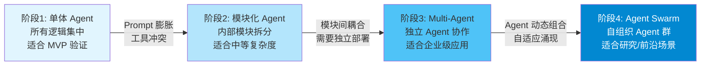
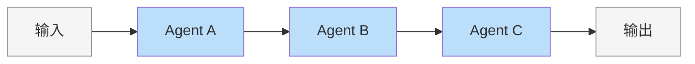
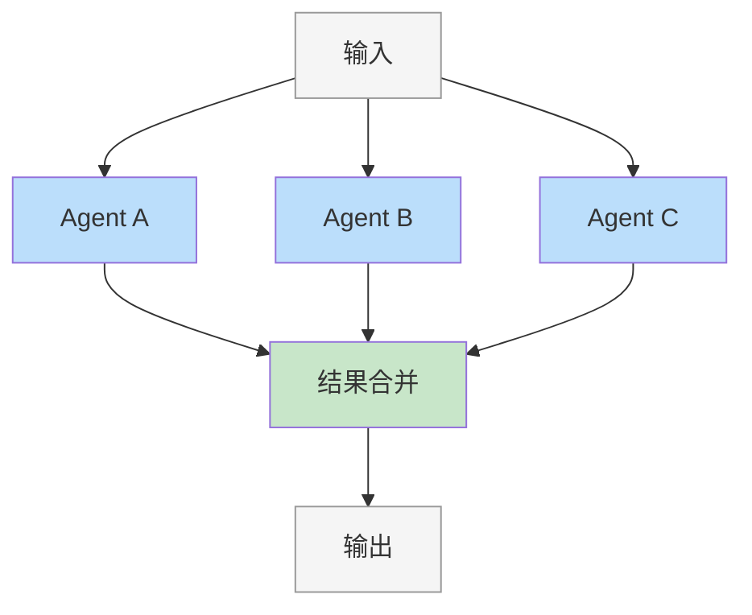
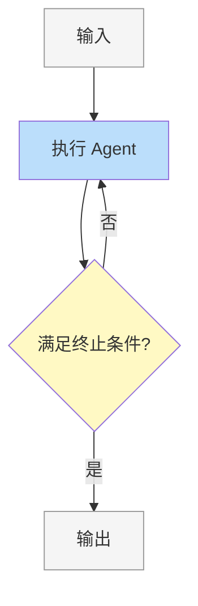
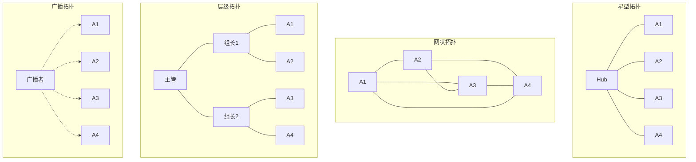
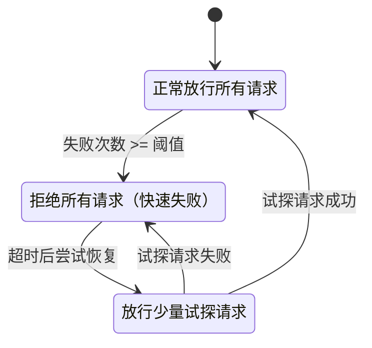
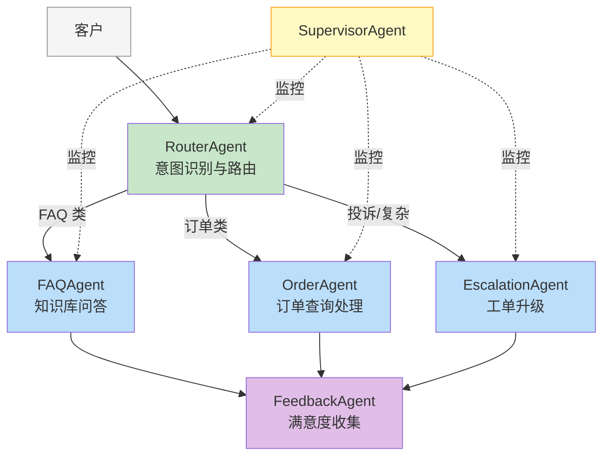

# 第 9 章 Multi-Agent 基础

本章讲解多 Agent 系统（Multi-Agent System, MAS）的基础理论与核心设计模式。当单个 Agent 的能力边界无法覆盖复杂任务时，多 Agent 协作成为必然选择——但也引入了通信、协调和一致性的新挑战。我们将从"为什么需要 Multi-Agent"出发，依次建立通信协议、身份与能力发现、共享状态管理、容错恢复等工程基础设施，最后通过一个完整的客服 Multi-Agent 系统将所有概念串联起来。

本章是第四部分"Multi-Agent"的第一章，聚焦于**基础概念与核心基础设施**。具体的编排模式实现与进阶工程实践将在第 10 章展开。

前置依赖：第 3–6 章的单 Agent 架构基础。

---

## 9.1 为什么需要 Multi-Agent

### 9.1.1 单体 Agent 的天花板

一个典型的单体 Agent 架构如下：用户输入 → LLM 推理 → 工具调用 → 输出结果。这个模式在简单场景下运行良好，但当面对以下挑战时就会力不从心：

1. **Prompt 膨胀**：当 Agent 需要处理客服、订单、退款、技术支持等多种场景时，System Prompt 会变得极其冗长，导致 LLM 性能下降。实测表明，当 System Prompt 超过 4000 Token 时，工具选择准确率平均下降 15–25%。
2. **工具冲突**：不同领域的工具可能有命名冲突或语义重叠，LLM 难以正确选择。例如，客服场景的 `search` 和技术支持的 `search` 指向完全不同的数据源。
3. **上下文窗口限制**：即使最先进的模型也有上下文长度限制，单个 Agent 无法承载所有信息。当对话历史、工具定义、领域知识同时塞入一个上下文窗口时，"针在草堆中"问题会显著恶化。
4. **单点故障**：一个 Agent 出错，整个系统崩溃，没有降级方案。
5. **难以扩展**：新增能力意味着修改已有的复杂 Prompt，回归测试成本极高。

这些问题的共性在于：**单体架构将所有复杂度压缩到了一个决策点上**。这与软件工程中从单体应用到微服务的演进逻辑完全一致——当单一组件承载过多职责时，拆分就成为必然。

### 9.1.2 Single Agent vs Multi-Agent 对比

下表从多个维度对比了两种架构：

| 维度 | Single Agent | Multi-Agent |
|------|-------------|-------------|
| **复杂度管理** | 所有逻辑集中在一个 Prompt，复杂度 O(n²) 增长 | 每个 Agent 职责单一，复杂度 O(n) 线性增长 |
| **可扩展性** | 新增能力需修改核心 Prompt，牵一发而动全身 | 新增 Agent 即可，对现有系统零侵入 |
| **可靠性** | 单点故障，一处出错全盘崩溃 | 故障隔离，单个 Agent 失败不影响整体 |
| **成本** | 每次调用都携带完整上下文，Token 消耗大 | 各 Agent 仅携带必要上下文，Token 更节省 |
| **开发效率** | 团队无法并行开发，互相阻塞 | 不同团队负责不同 Agent，并行开发 |
| **调试难度** | 日志集中但混杂，定位问题如大海捞针 | 各 Agent 日志独立，但链路追踪更复杂 |
| **一致性** | 天然一致，同一 LLM 调用 | 需要显式协调机制保证一致性 |
| **延迟** | 单次 LLM 调用 | 可能涉及多次 LLM 调用，但可并行化 |

需要特别注意的是"调试难度"和"一致性"两行：Multi-Agent 并非在所有维度上都优于 Single Agent。它用**分布式系统的复杂度**换取了**单点复杂度的降低**。这是一个工程权衡，而非无条件的升级。

### 9.1.3 什么时候不需要 Multi-Agent

Multi-Agent 并非银弹。以下场景中，单体 Agent 可能是更好的选择：

- **简单任务**：如果任务流程固定、工具数量少于 5 个，单体 Agent 足矣。
- **低延迟要求**：Multi-Agent 的协调开销（Agent 间消息传递、路由决策、状态同步）可能带来 200–500ms 的额外延迟，无法满足实时性要求。
- **预算有限**：多个 Agent 意味着更多的 LLM 调用，成本成倍增加。一个 3-Agent 管线的 Token 消耗通常是单体的 2–4 倍。
- **团队规模小**：如果只有 1–2 个开发者，维护多个 Agent 的开销可能得不偿失。
- **原型阶段**：先用单体 Agent 验证想法，确认可行后再拆分。

> **设计原则**：遵循 YAGNI（You Aren't Gonna Need It）。在单体 Agent 确实遇到瓶颈时再考虑拆分，不要过早优化。

### 9.1.4 Multi-Agent 六项设计原则

当通过上一节的评估确定确实需要 Multi-Agent 架构时，请遵循以下六项设计原则。这六项原则贯穿本章和后续章节的全部内容，是 Multi-Agent 系统设计的"宪法"。

**原则一：渐进复杂（Progressive Complexity）**

即使决定采用 Multi-Agent，也应从最少数量的 Agent 开始。先用 2 个 Agent 验证架构，确认收益后再逐步增加。每新增一个 Agent 都应有明确的、可衡量的理由。Anthropic 在其工程博客中将此称为"构建有效 Agent 的首要原则"——先从单 Agent + 工具系统开始，仅在复杂度确实需要时才引入 Multi-Agent。

**原则二：单一职责（Single Responsibility）**

每个 Agent 只负责一个明确的领域，且做到最好。一个处理订单的 Agent 不应该同时处理用户认证；一个"研究员 Agent"不应该同时承担写作任务。当你发现需要给一个 Agent 添加第二个"角色"时，就是拆分的信号。

**原则三：显式通信（Explicit Communication）**

Agent 之间通过结构化消息通信，不直接引用彼此的内部状态。所有消息必须可序列化、可审计。避免通过共享可变状态"隐式通信"——这是分布式系统中最常见的 Bug 来源。

**原则四：故障隔离（Fault Isolation）**

一个 Agent 的失败不应导致整个系统崩溃。每个 Agent 都应有独立的超时和重试机制。在六项原则中，这一项优先级最高，因为生产系统的可用性直接决定用户信任。

**原则五：可替换性（Replaceability）**

任何 Agent 都应该可以被另一个实现相同接口的 Agent 替换，不影响系统整体。这要求每个 Agent 对外暴露明确的能力描述（AgentCard）和消息协议，就像微服务的 API 契约一样。

**原则六：人类在环（Human-in-the-Loop）**

关键决策点必须有人工审核机制，特别是涉及不可逆操作（发送邮件、修改数据库、财务操作）时。Multi-Agent 系统的自动化程度越高，人工审核的安全网就越重要。

> **优先级排序**：故障隔离 > 单一职责 > 人类在环 > 显式通信 > 可替换性 > 渐进复杂。实际工程中资源有限时，请按此顺序取舍。

### 9.1.5 架构演进路径

Agent 架构的演进通常经历四个阶段。绝大多数生产系统处于阶段 2–3，阶段 4 目前仍以学术研究为主。



**图 9-1 Agent 架构四阶段演进**——从单体到群体的演进不是线性升级，而是根据实际需求选择最合适的阶段。

从阶段 1 到阶段 2 的演进通常是最有价值的一步：将单体 Agent 的 System Prompt 按领域拆分为内部模块，共享同一个 LLM 调用但使用不同的 Prompt 模板。这一步几乎没有架构开销，却能显著改善工具选择准确率。从阶段 2 到阶段 3 则是真正的架构跃迁，需要引入本章讨论的所有基础设施。

下面我们用 TypeScript 定义一个基础的 Agent 接口，后续所有代码都将基于此接口构建。这个接口刻意保持最小化——只包含 Multi-Agent 协作必需的字段：

```typescript
/** Agent 能力描述卡片，用于注册与发现 */
interface AgentCard {
  id: string;
  name: string;
  description: string;
  capabilities: string[];
  inputSchema?: Record<string, unknown>;
  outputSchema?: Record<string, unknown>;
}

/** Agent 间传递的标准消息格式 */
interface AgentMessage {
  id: string;
  from: string;
  to: string;
  type: "request" | "response" | "event" | "error";
  payload: Record<string, unknown>;
  timestamp: number;
  correlationId?: string;  // 用于追踪请求-响应对
}

/** Agent 执行结果 */
interface AgentResult {
  success: boolean;
  data: Record<string, unknown>;
  error?: string;
  metadata?: { latencyMs: number; tokensUsed: number };
}

/** 所有 Agent 必须实现的基础接口 */
interface IAgent {
  readonly card: AgentCard;
  execute(input: AgentMessage): Promise<AgentResult>;
  healthCheck(): Promise<boolean>;
}
```

这个接口设计体现了 §9.1.4 的多项原则：`AgentCard` 支持可替换性（原则五），`AgentMessage` 强制显式通信（原则三），`healthCheck()` 为故障隔离（原则四）提供基础。

---

## 9.2 三基本编排原语

基于 §9.1.4 提出的六项设计原则，特别是"渐进复杂"原则，我们从最简单的编排构建块开始。Google 的 Agent Development Kit（ADK）提出了三种基础的 Agent 编排原语——Sequential、Parallel、Loop。这三种原语像乐高积木一样，可以组合出几乎所有的 Multi-Agent 工作流。

本节给出每种原语的**概念定义与适用场景**。详细实现模式与工程实践见第 10 章。

### 9.2.1 Sequential：流水线编排

Sequential（顺序编排）将多个 Agent 按顺序串联，前一个 Agent 的输出作为下一个 Agent 的输入，形成一条处理流水线。



**适用场景**：任务具有严格的线性依赖——后续步骤的输入依赖前置步骤的输出。典型例子包括"调研 → 撰写 → 审校"管线、"提取 → 翻译 → 校对"管线。

**设计权衡**：Sequential 的优势是逻辑清晰、易于调试、每一步都可审计。劣势是整体延迟等于各步骤延迟之和（串行瓶颈），且中间某一步失败会阻塞整条管线。错误处理策略（中断 vs 跳过 vs 回退）是 Sequential 编排的核心设计决策，将在第 10 章详细讨论。

### 9.2.2 Parallel：并行执行

Parallel（并行编排）让多个 Agent 同时执行任务，最后将结果合并。



**适用场景**：多个子任务之间没有依赖关系，可以独立执行。典型例子包括多视角分析（乐观分析 + 悲观分析 + 中性分析）、多源数据采集（同时查询多个 API）、投票式决策（多个 Agent 独立判断后取多数）。

**设计权衡**：Parallel 可以大幅降低端到端延迟——总延迟等于最慢 Agent 的延迟而非各 Agent 延迟之和。但它引入了新的复杂度：结果合并策略（取最快/取最优/合并全部/投票表决）是 Parallel 编排的核心设计决策。此外，并行执行意味着更高的瞬时资源消耗和更多的并发 LLM 调用，需要注意 API 速率限制。

### 9.2.3 Loop：迭代优化

Loop（循环编排）让一个或多个 Agent 反复执行，直到满足某个终止条件。



**适用场景**：任务需要迭代优化直到收敛。典型例子包括"写作 → 评审 → 修改"循环、"代码生成 → 测试 → 修复"循环、"搜索 → 分析 → 补充搜索"循环。

**设计权衡**：Loop 是三种原语中最强大但也最危险的。它的强大在于能实现质量渐进提升——每次迭代都比上一次更好。它的危险在于可能无限循环：如果终止条件设计不当（阈值过高、评估函数不收敛），Agent 会陷入死循环，白白消耗 Token。因此，Loop 编排**必须**设置 `maxIterations` 硬上限，并配合质量评分函数判断是否收敛。第 10 章将详细讨论终止条件设计与渐进式质量标准。

### 9.2.4 原语组合

三种原语的真正力量在于**组合**。例如，一个完整的内容生成管线可以表示为：

```
Sequential([
  ParallelAgent([ResearcherA, ResearcherB]),  // 并行调研
  WriterAgent,                                 // 串行撰写
  LoopAgent(ReviewerAgent, maxIter=3),         // 循环审校
])
```

这种嵌套组合能力使得三种原语足以覆盖绝大多数 Multi-Agent 工作流。更复杂的动态编排（运行时决定下一步调用哪个 Agent）将在第 10 章介绍。

---

## 9.3 通信机制

Multi-Agent 系统中，Agent 之间如何高效、可靠地传递信息是核心问题。通信机制的选择直接影响系统的耦合度、可扩展性和调试难度。

本节介绍三种基础通信模式：**Direct Message（直接消息）**、**Blackboard（黑板）** 和 **Event Stream（事件流）**。这三种模式不是互斥的——一个生产系统中往往同时使用多种通信模式，根据不同的交互场景选择最合适的方式。

### 9.3.1 通信拓扑

在讨论具体通信协议之前，我们先了解 Agent 之间的连接结构——即通信拓扑。拓扑的选择决定了消息如何流转、瓶颈在哪里、系统如何扩展。



**图 9-2 四种基本通信拓扑**

| 拓扑 | 特点 | 适用场景 | 风险 |
|------|------|---------|------|
| **星型** | 所有消息经过中心节点 | Orchestrator 模式，流程确定 | 中心节点成为瓶颈和单点故障 |
| **网状** | 任意 Agent 可直接通信 | Peer-to-Peer 协商，动态协作 | 连接数 O(n²) 增长，复杂度高 |
| **层级** | 分层委托，逐级分解 | 大型组织结构，复杂任务分解 | 层级过深导致延迟增大 |
| **广播** | 一对多单向通知 | 事件通知、状态广播 | 消息洪水风险 |

在实践中，星型拓扑最为常用（对应 Orchestrator 模式），因为它最容易理解、调试和审计。当星型的中心节点成为瓶颈时，可以演进为层级拓扑（多级 Orchestrator）。网状拓扑虽然灵活，但在生产系统中应谨慎使用——调试 Agent 间的全互联通信极其困难。

### 9.3.2 Direct Message：点对点通信

Direct Message 是最简单直观的通信方式：Agent A 直接向 Agent B 发送消息，并等待回复。它对应星型或网状拓扑中的一条边。

下面的 `MessageBus` 实现是本章所有通信模式的基础。它提供 Agent 注册、消息投递、超时处理和死信队列功能。注意消息如何通过 `correlationId` 实现请求-响应配对——这是分布式追踪的基础：

```typescript
type MessageHandler = (msg: AgentMessage) => Promise<AgentMessage | void>;

class MessageBus {
  private handlers = new Map<string, MessageHandler>();
  private deadLetters: AgentMessage[] = [];
  private messageLog: AgentMessage[] = [];

  /** 注册 Agent 的消息处理函数 */
  register(agentId: string, handler: MessageHandler): void {
    if (this.handlers.has(agentId)) {
      throw new Error(`Agent ${agentId} already registered`);
    }
    this.handlers.set(agentId, handler);
  }

  unregister(agentId: string): void {
    this.handlers.delete(agentId);
  }

  /** 发送消息并等待响应，支持超时 */
  async send(message: AgentMessage, timeoutMs = 30_000): Promise<AgentMessage | null> {
    this.messageLog.push(message);

    const handler = this.handlers.get(message.to);
    if (!handler) {
      this.deadLetters.push(message);
      console.warn(`[MessageBus] No handler for ${message.to}, message sent to dead letter queue`);
      return null;
    }

    try {
      const result = await Promise.race([
        handler(message),
        new Promise<never>((_, reject) =>
          setTimeout(() => reject(new Error(`Timeout after ${timeoutMs}ms`)), timeoutMs)
        ),
      ]);

      if (result) {
        result.correlationId = message.id;
        this.messageLog.push(result);
      }
      return result ?? null;
    } catch (error) {
      const errorMsg: AgentMessage = {
        id: crypto.randomUUID(),
        from: "system",
        to: message.from,
        type: "error",
        payload: { error: String(error), originalMessageId: message.id },
        timestamp: Date.now(),
        correlationId: message.id,
      };
      this.deadLetters.push(message);
      return errorMsg;
    }
  }

  /** 广播消息给所有已注册的 Agent（除发送者外） */
  async broadcast(message: AgentMessage): Promise<(AgentMessage | null)[]> {
    const targets = [...this.handlers.keys()].filter((id) => id !== message.from);
    return Promise.all(
      targets.map((to) => this.send({ ...message, to, id: crypto.randomUUID() }))
    );
  }

  getDeadLetters(): AgentMessage[] { return [...this.deadLetters]; }
  getMessageLog(): AgentMessage[] { return [...this.messageLog]; }
}
```

`MessageBus` 的设计决策值得讨论：为什么使用同步的 `send` + 超时而非纯异步回调？因为在大多数 Multi-Agent 场景中，调用方需要等待被调用 Agent 的结果才能继续——这是 Sequential 编排的基础。对于不需要等待响应的场景（事件通知），我们在 §9.3.4 提供 Event Stream 方案。

### 9.3.3 Blackboard：共享黑板

Blackboard 模式让多个 Agent 通过读写一个共享的数据结构来协作。就像一群专家围绕一块白板工作：每个人把自己的发现写上去，其他人读取后做进一步分析。与 Direct Message 不同，Blackboard 中的 Agent 不需要知道彼此的存在——它们只需要知道如何读写黑板。

下面的实现使用分区（section）来组织数据，并通过版本号实现乐观并发控制。当两个 Agent 同时修改同一数据时，版本号冲突会阻止后写入者覆盖前写入者的数据：

```typescript
interface BlackboardEntry<T = unknown> {
  id: string;
  section: string;
  authorId: string;
  data: T;
  version: number;
  timestamp: number;
}

type BlackboardListener = (entry: BlackboardEntry) => void;

class Blackboard {
  private entries = new Map<string, BlackboardEntry>();
  private listeners = new Map<string, BlackboardListener[]>();

  /** 写入数据，使用乐观并发控制 */
  write<T>(section: string, id: string, authorId: string, data: T, expectedVersion?: number): BlackboardEntry<T> {
    const key = `${section}:${id}`;
    const existing = this.entries.get(key);

    if (expectedVersion !== undefined && existing && existing.version !== expectedVersion) {
      throw new Error(
        `Version conflict on ${key}: expected ${expectedVersion}, actual ${existing.version}`
      );
    }

    const entry: BlackboardEntry<T> = {
      id, section, authorId, data,
      version: (existing?.version ?? 0) + 1,
      timestamp: Date.now(),
    };
    this.entries.set(key, entry as BlackboardEntry);

    // 通知该 section 的所有订阅者
    (this.listeners.get(section) ?? []).forEach((fn) => fn(entry as BlackboardEntry));
    return entry;
  }

  /** 读取指定条目 */
  read<T>(section: string, id: string): BlackboardEntry<T> | undefined {
    return this.entries.get(`${section}:${id}`) as BlackboardEntry<T> | undefined;
  }

  /** 读取整个 section */
  readSection(section: string): BlackboardEntry[] {
    return [...this.entries.values()].filter((e) => e.section === section);
  }

  /** 订阅 section 变更 */
  subscribe(section: string, listener: BlackboardListener): () => void {
    const list = this.listeners.get(section) ?? [];
    list.push(listener);
    this.listeners.set(section, list);
    return () => {
      const idx = list.indexOf(listener);
      if (idx >= 0) list.splice(idx, 1);
    };
  }
}
```

Blackboard 模式最适合"知识共建"场景：多个 Agent 各自贡献发现，逐步构建起对问题的完整理解。例如在医疗诊断场景中，影像分析 Agent、检验数据 Agent、病史分析 Agent 各自将结论写入黑板，最终由诊断 Agent 综合所有发现给出判断。

**与 Direct Message 的对比**：Blackboard 的耦合度更低（Agent 不需要知道彼此），但可观测性更差（谁在什么时候读了什么难以追踪）。在需要严格审计的场景中，优先使用 Direct Message。

### 9.3.4 Event Stream：事件流

Event Stream 模式让 Agent 通过发布/订阅事件来通信。发布者不需要知道谁会处理事件，实现最松散的耦合。

> **接口演化说明**：第 4 章的 `AgentEvent` 使用 12 种判别联合类型（discriminated union），适合单 Agent 内部的强类型状态变迁。本章的 `AgentEvent` 采用泛型结构（`eventType: string` + `payload: Record<string, unknown>`），因为 Multi-Agent 场景中事件类型需要跨 Agent 边界动态扩展，强类型联合在此场景下过于僵硬。

```typescript
interface AgentEvent {
  eventId: string;
  eventType: string;
  sourceAgentId: string;
  timestamp: number;
  payload: Record<string, unknown>;
}

type EventHandler = (event: AgentEvent) => Promise<void>;

interface Subscription {
  id: string;
  eventPattern: string | RegExp;
  handler: EventHandler;
  subscriberId: string;
}

class EventStream {
  private subscriptions: Subscription[] = [];
  private eventLog: AgentEvent[] = [];

  /** 订阅事件，支持字符串精确匹配和正则模式匹配 */
  subscribe(subscriberId: string, eventPattern: string | RegExp, handler: EventHandler): string {
    const sub: Subscription = {
      id: crypto.randomUUID(),
      eventPattern,
      handler,
      subscriberId,
    };
    this.subscriptions.push(sub);
    return sub.id;
  }

  unsubscribe(subscriptionId: string): void {
    this.subscriptions = this.subscriptions.filter((s) => s.id !== subscriptionId);
  }

  /** 发布事件，通知所有匹配的订阅者 */
  async publish(event: AgentEvent): Promise<void> {
    this.eventLog.push(event);

    const matched = this.subscriptions.filter((sub) => {
      if (typeof sub.eventPattern === "string") return sub.eventPattern === event.eventType;
      return sub.eventPattern.test(event.eventType);
    });

    // 并行通知所有匹配的订阅者，单个失败不影响其他
    await Promise.allSettled(matched.map((sub) => sub.handler(event)));
  }

  /** 查询事件历史，支持按类型和时间范围过滤 */
  query(filter: { eventType?: string; since?: number; limit?: number }): AgentEvent[] {
    let results = this.eventLog;
    if (filter.eventType) results = results.filter((e) => e.eventType === filter.eventType);
    if (filter.since) results = results.filter((e) => e.timestamp >= filter.since);
    if (filter.limit) results = results.slice(-filter.limit);
    return results;
  }
}
```

Event Stream 适合以下场景：状态变更通知（Agent 完成任务后广播事件）、监控与审计（所有事件自动记录）、松耦合集成（新 Agent 只需订阅感兴趣的事件即可加入系统）。它的劣势是事件丢失风险（如果订阅者在事件发布时不在线）和调试困难（事件的因果链需要通过 correlationId 人工追踪）。

### 9.3.5 三种通信模式对比

| 维度 | Direct Message | Blackboard | Event Stream |
|------|---------------|------------|-------------|
| **耦合度** | 中（需知道目标 Agent） | 低（只需知道 Section） | 最低（只需知道事件类型） |
| **同步性** | 同步请求-响应 | 同步读写 | 异步发布-订阅 |
| **可审计性** | 高（消息日志完整） | 中（写入可追踪，读取难追踪） | 高（事件日志完整） |
| **典型拓扑** | 星型/网状 | 不限 | 广播 |
| **最佳场景** | Agent 间直接协作 | 知识共建 | 状态通知、松耦合集成 |

### 9.3.6 A2A 协议与标准化

随着 Multi-Agent 系统在工业界的快速普及，Agent 间通信的标准化需求日益迫切。Google 在 2025 年提出的 **A2A（Agent-to-Agent）协议**是这一方向的重要尝试。A2A 基于 HTTP + JSON-RPC，定义了 Agent 发现（`/.well-known/agent.json`）、任务生命周期管理（Task 对象的创建/查询/取消）、流式通信（SSE）等标准化接口。

A2A 与本章讨论的通信机制有以下对应关系：

- A2A 的 **AgentCard** 对应 §9.4 的 AgentCard 概念，用于能力发现
- A2A 的 **Task** 对象对应 `AgentMessage` 的请求-响应生命周期
- A2A 的 **SSE 推送**对应 Event Stream 的发布-订阅模式

A2A 的核心价值在于**跨组织/跨平台的 Agent 互操作**——让不同公司开发的 Agent 能够通过统一协议协作。在单一系统内部，本章介绍的轻量级通信机制通常已经足够。当你的 Multi-Agent 系统需要与外部 Agent 交互时，应考虑实现 A2A 兼容层。

---

## 9.4 Agent 身份、能力与注册发现

在包含多个 Agent 的系统中，每个 Agent 需要有清晰的"身份证"——描述它是谁、能做什么、擅长什么。没有身份标识，Orchestrator 无法决定将任务分配给谁；没有能力描述，系统无法在运行时动态路由。

本节涵盖三个核心概念：**AgentCard**（Agent 的名片）、**AgentRegistry**（Agent 注册中心）和 **CapabilityRouter**（基于能力的任务路由）。它们共同构成了 Multi-Agent 系统的"服务发现"层——与微服务架构中的服务注册中心（Consul、Eureka）角色类似。

### 9.4.1 AgentCard：Agent 的名片

AgentCard 是 Agent 对外暴露的元信息，包括身份标识、能力列表、可用性状态和版本信息。它是 §9.1.4 中"可替换性"原则的工程实现——两个 AgentCard 相同的 Agent 可以互相替换。

```typescript
interface AgentCapability {
  name: string;            // 能力名称，如 "text_translation"
  description: string;     // 能力描述
  proficiency: number;     // 熟练度 0-1
  inputFormats: string[];  // 支持的输入格式
  outputFormats: string[]; // 支持的输出格式
}

interface AgentCard {
  id: string;
  name: string;
  description: string;
  version: string;
  capabilities: AgentCapability[];
  status: "available" | "busy" | "offline" | "degraded";
  maxConcurrency: number;
  metadata?: Record<string, unknown>;
}
```

### 9.4.2 AgentRegistry：注册与发现

AgentRegistry 管理所有 Agent 的注册、注销、心跳检测和能力查询。下面的实现包含了心跳超时检测——如果一个 Agent 超过指定时间没有发送心跳，它会被自动标记为离线：

```typescript
interface RegistryEntry {
  card: AgentCard;
  registeredAt: number;
  lastHeartbeat: number;
  agent: IAgent;
}

class AgentRegistry {
  private agents = new Map<string, RegistryEntry>();
  private heartbeatIntervalMs: number;
  private heartbeatTimer?: ReturnType<typeof setInterval>;

  constructor(heartbeatIntervalMs = 30_000) {
    this.heartbeatIntervalMs = heartbeatIntervalMs;
  }

  /** 注册 Agent */
  register(agent: IAgent): void {
    const entry: RegistryEntry = {
      card: agent.card,
      registeredAt: Date.now(),
      lastHeartbeat: Date.now(),
      agent,
    };
    this.agents.set(agent.card.id, entry);
    console.log(`[Registry] Registered: ${agent.card.name} (${agent.card.id})`);
  }

  /** 注销 Agent */
  unregister(agentId: string): void {
    this.agents.delete(agentId);
  }

  /** 更新心跳 */
  heartbeat(agentId: string): void {
    const entry = this.agents.get(agentId);
    if (entry) entry.lastHeartbeat = Date.now();
  }

  /** 按能力查找 Agent，返回按熟练度排序的匹配列表 */
  findByCapability(capabilityName: string): { agent: IAgent; proficiency: number }[] {
    const results: { agent: IAgent; proficiency: number }[] = [];

    for (const entry of this.agents.values()) {
      if (entry.card.status !== "available") continue;

      const cap = entry.card.capabilities.find(
        (c) => c.name === capabilityName || c.name.includes(capabilityName)
      );
      if (cap) {
        results.push({ agent: entry.agent, proficiency: cap.proficiency });
      }
    }

    return results.sort((a, b) => b.proficiency - a.proficiency);
  }

  /** 获取所有可用 Agent */
  getAvailable(): IAgent[] {
    return [...this.agents.values()]
      .filter((e) => e.card.status === "available")
      .map((e) => e.agent);
  }

  /** 启动心跳检测：将超时 Agent 标记为 offline */
  startHeartbeatCheck(): void {
    this.heartbeatTimer = setInterval(() => {
      const now = Date.now();
      for (const entry of this.agents.values()) {
        if (now - entry.lastHeartbeat > this.heartbeatIntervalMs * 3) {
          entry.card.status = "offline";
          console.warn(`[Registry] Agent ${entry.card.name} marked offline (heartbeat timeout)`);
        }
      }
    }, this.heartbeatIntervalMs);
  }

  stopHeartbeatCheck(): void {
    if (this.heartbeatTimer) clearInterval(this.heartbeatTimer);
  }
}
```

心跳超时阈值设为 `heartbeatIntervalMs * 3`（即连续 3 次心跳缺失才判定离线），这是分布式系统中常见的做法——避免因一次网络抖动就误判 Agent 状态。在生产环境中，心跳间隔通常设为 10–30 秒。

### 9.4.3 CapabilityRouter：基于能力的任务路由

CapabilityRouter 将 AgentRegistry 的能力查询与任务分发结合起来。它根据任务描述匹配所需能力，然后从注册中心找到最合适的 Agent：

```typescript
interface RoutingRule {
  taskPattern: RegExp;
  requiredCapabilities: string[];
  priority: number;
}

class CapabilityRouter {
  private rules: RoutingRule[] = [];
  private registry: AgentRegistry;

  constructor(registry: AgentRegistry) {
    this.registry = registry;
  }

  addRule(rule: RoutingRule): void {
    this.rules.push(rule);
    this.rules.sort((a, b) => b.priority - a.priority); // 高优先级在前
  }

  /** 根据任务描述路由到最合适的 Agent */
  route(taskDescription: string): { agent: IAgent | null; reason: string } {
    for (const rule of this.rules) {
      if (!rule.taskPattern.test(taskDescription)) continue;

      // 对每个所需能力，找到最佳 Agent
      for (const cap of rule.requiredCapabilities) {
        const matches = this.registry.findByCapability(cap);
        if (matches.length > 0) {
          return {
            agent: matches[0].agent,
            reason: `Matched rule "${rule.taskPattern}" → capability "${cap}" → ${matches[0].agent.card.name}`,
          };
        }
      }
    }

    return { agent: null, reason: "未匹配到任何路由规则" };
  }
}
```

CapabilityRouter 的设计权衡：当前实现使用简单的正则匹配 + 熟练度排序。在生产系统中，可以将任务描述通过 Embedding 向量化后与能力描述做语义匹配，以处理同义词和模糊描述。但这会引入额外的延迟和对 Embedding 模型的依赖——再次体现"渐进复杂"原则。

---

## 9.5 共享状态与协调

当多个 Agent 需要协作完成同一个任务时，不可避免地需要共享某些状态。如何安全、高效地管理共享状态是 Multi-Agent 系统的关键挑战——这与分布式系统中的并发控制问题本质相同。

§9.3 的三种通信模式解决了 Agent 间"如何传递消息"的问题，但没有解决"如何共享和同步数据"的问题。考虑这个场景：一个客服系统中，RouterAgent 识别了用户意图并将其写入共享上下文，OrderAgent 和 FAQAgent 都需要读取这个意图来决定自己的行为。如果两个 Agent 同时修改同一个上下文字段（比如 "currentIntent"），谁的写入会被保留？

本节介绍三个层次的解决方案：**SharedStateManager**（带版本控制的共享状态）、**ConsensusManager**（多 Agent 投票决策）和 **ConflictResolver**（冲突检测与解决）。

### 9.5.1 SharedStateManager：共享状态管理器

SharedStateManager 在 Blackboard 的基础上增加了版本控制、变更审计和路径级读写。每次写入都会递增版本号并记录完整的变更历史，支持事后审计和冲突检测：

```typescript
interface StateChange {
  changeId: string;
  agentId: string;
  path: string;
  oldValue: unknown;
  newValue: unknown;
  version: number;
  timestamp: number;
}

class SharedStateManager {
  private state: Record<string, unknown> = {};
  private version = 0;
  private changelog: StateChange[] = [];

  /** 读取指定路径的值，支持点号分隔的嵌套路径 */
  get(path: string): unknown {
    const keys = path.split(".");
    let current: unknown = this.state;
    for (const key of keys) {
      if (current === null || current === undefined) return undefined;
      current = (current as Record<string, unknown>)[key];
    }
    return current;
  }

  /** 写入值，使用乐观并发控制 */
  set(agentId: string, path: string, value: unknown, expectedVersion?: number): number {
    if (expectedVersion !== undefined && expectedVersion !== this.version) {
      throw new Error(
        `Version conflict: expected ${expectedVersion}, actual ${this.version}. ` +
        `Agent ${agentId} should re-read state before retrying.`
      );
    }

    const oldValue = this.get(path);
    this.version++;

    // 执行嵌套路径写入
    const keys = path.split(".");
    let current = this.state as Record<string, unknown>;
    for (let i = 0; i < keys.length - 1; i++) {
      if (!(keys[i] in current)) current[keys[i]] = {};
      current = current[keys[i]] as Record<string, unknown>;
    }
    current[keys[keys.length - 1]] = value;

    // 记录变更
    this.changelog.push({
      changeId: crypto.randomUUID(),
      agentId, path, oldValue, newValue: value,
      version: this.version,
      timestamp: Date.now(),
    });

    return this.version;
  }

  /** 获取当前版本号 */
  getVersion(): number { return this.version; }

  /** 获取指定 Agent 的变更历史 */
  getChangesBy(agentId: string): StateChange[] {
    return this.changelog.filter((c) => c.agentId === agentId);
  }

  /** 获取指定路径的变更历史 */
  getChangesAt(path: string): StateChange[] {
    return this.changelog.filter((c) => c.path === path || c.path.startsWith(path + "."));
  }
}
```

### 9.5.2 ConsensusManager：多 Agent 投票决策

在某些场景中，多个 Agent 需要就某个决定达成一致——例如"是否将这个用户工单升级为紧急？"。ConsensusManager 实现了一个简化的投票共识协议：提案发起者发起投票，达到法定人数（quorum）且赞成率超过阈值即通过：

```typescript
enum ProposalStatus { PENDING = "pending", ACCEPTED = "accepted", REJECTED = "rejected", TIMEOUT = "timeout" }

interface Vote {
  voterId: string;
  approve: boolean;
  reason?: string;
  timestamp: number;
}

interface Proposal<T = unknown> {
  id: string;
  proposerId: string;
  description: string;
  data: T;
  status: ProposalStatus;
  votes: Vote[];
  quorum: number;          // 最少投票数
  approvalThreshold: number; // 赞成率阈值 0-1
  createdAt: number;
  expiresAt: number;
}

class ConsensusManager {
  private proposals = new Map<string, Proposal>();

  /** 创建提案 */
  propose<T>(proposerId: string, description: string, data: T, quorum: number, approvalThreshold = 0.5, ttlMs = 60_000): string {
    const id = crypto.randomUUID();
    this.proposals.set(id, {
      id, proposerId, description, data,
      status: ProposalStatus.PENDING,
      votes: [],
      quorum,
      approvalThreshold,
      createdAt: Date.now(),
      expiresAt: Date.now() + ttlMs,
    });
    return id;
  }

  /** 对提案投票 */
  vote(proposalId: string, voterId: string, approve: boolean, reason?: string): Proposal | null {
    const proposal = this.proposals.get(proposalId);
    if (!proposal || proposal.status !== ProposalStatus.PENDING) return null;

    // 检查是否已过期
    if (Date.now() > proposal.expiresAt) {
      proposal.status = ProposalStatus.TIMEOUT;
      return proposal;
    }

    // 防止重复投票
    if (proposal.votes.some((v) => v.voterId === voterId)) return proposal;

    proposal.votes.push({ voterId, approve, reason, timestamp: Date.now() });

    // 检查是否达到法定人数
    if (proposal.votes.length >= proposal.quorum) {
      const approveCount = proposal.votes.filter((v) => v.approve).length;
      const approvalRate = approveCount / proposal.votes.length;
      proposal.status = approvalRate >= proposal.approvalThreshold
        ? ProposalStatus.ACCEPTED
        : ProposalStatus.REJECTED;
    }

    return proposal;
  }

  getProposal(id: string): Proposal | undefined { return this.proposals.get(id); }
}
```

### 9.5.3 冲突解决策略

即使有版本控制，并发写入冲突仍然可能发生（两个 Agent 同时读取了同一版本的状态，然后各自提交修改）。以下是四种常见的冲突解决策略及其适用场景：

```typescript
enum ConflictStrategy {
  LAST_WRITER_WINS = "last_writer_wins",   // 最后写入者胜出，最简单
  PRIORITY_BASED = "priority_based",       // 按 Agent 优先级决定
  MERGE = "merge",                         // 尝试合并两个修改
  ARBITRATION = "arbitration",             // 交给仲裁者决定
}

interface ConflictRecord {
  path: string;
  agentA: string;
  agentB: string;
  valueA: unknown;
  valueB: unknown;
  timestamp: number;
  resolvedBy: ConflictStrategy;
  resolvedValue: unknown;
}

class ConflictResolver {
  private history: ConflictRecord[] = [];

  resolve(
    path: string,
    agentA: string, valueA: unknown,
    agentB: string, valueB: unknown,
    strategy: ConflictStrategy,
    agentPriorities?: Map<string, number>
  ): unknown {
    let resolved: unknown;

    switch (strategy) {
      case ConflictStrategy.LAST_WRITER_WINS:
        resolved = valueB; // 按时间序，后到的胜出
        break;
      case ConflictStrategy.PRIORITY_BASED:
        const pA = agentPriorities?.get(agentA) ?? 0;
        const pB = agentPriorities?.get(agentB) ?? 0;
        resolved = pA >= pB ? valueA : valueB;
        break;
      case ConflictStrategy.MERGE:
        // 对于对象类型尝试浅合并，否则 fallback 到 last writer wins
        if (typeof valueA === "object" && typeof valueB === "object" && valueA && valueB) {
          resolved = { ...valueA as object, ...valueB as object };
        } else {
          resolved = valueB;
        }
        break;
      default:
        resolved = valueB;
    }

    this.history.push({
      path, agentA, agentB, valueA, valueB,
      timestamp: Date.now(),
      resolvedBy: strategy,
      resolvedValue: resolved,
    });
    return resolved;
  }

  getHistory(): ConflictRecord[] { return [...this.history]; }
}
```

**策略选择指南**：

- **Last Writer Wins**：最简单，适合低冲突频率、数据丢失可接受的场景（如日志、计数器）。
- **Priority Based**：适合有明确 Agent 层级的场景（Supervisor 的写入优先于 Worker）。
- **Merge**：适合对象类型的状态，不同 Agent 修改不同字段时可以无损合并。
- **Arbitration**：适合关键业务决策，交给仲裁 Agent（通常是 Orchestrator）裁定。

---

## 9.6 容错与恢复

在多 Agent 协作中，单点故障是不可避免的。与单体架构中的错误处理不同，Multi-Agent 系统需要**系统级**的容错机制——当某个 Agent 失败时，整个系统应该能够优雅地降级而非完全崩溃。

这一要求直接源于 §9.1.4 的"故障隔离"原则（最高优先级），并将其从抽象原则落地为具体实现。本节介绍三个核心容错模式，它们构成了一个三层防护体系：**熔断器（Circuit Breaker）** 防止级联故障 → **监督者（Supervisor）** 自动恢复 → **优雅降级（Graceful Degradation）** 提供保底服务。

### 9.6.1 熔断器模式（Circuit Breaker）

熔断器模式源自电气工程，当检测到下游 Agent 异常时自动"断开"请求，防止级联故障。它的核心是一个三状态有限状态机：



- **Closed（关闭）**：正常状态，所有请求照常通过。每次失败递增计数器。
- **Open（打开）**：熔断状态，所有请求立即被拒绝（抛出 `CircuitOpenError`），避免继续向故障 Agent 发送请求。
- **Half-Open（半开）**：恢复探测状态，允许少量请求通过以测试 Agent 是否已恢复。

下面是完整的熔断器实现。关键设计决策：使用滑动窗口（而非累积计数器）来统计失败率，避免旧的失败记录永久影响判断：

```typescript
enum CircuitState { CLOSED = "closed", OPEN = "open", HALF_OPEN = "half_open" }

class CircuitOpenError extends Error {
  constructor(agentId: string) {
    super(`Circuit is OPEN for agent ${agentId}, request rejected`);
    this.name = "CircuitOpenError";
  }
}

class CircuitBreaker {
  private state = CircuitState.CLOSED;
  private failureCount = 0;
  private successCount = 0;
  private lastFailureTime = 0;
  private readonly agentId: string;
  private readonly failureThreshold: number;
  private readonly resetTimeoutMs: number;
  private readonly halfOpenMaxAttempts: number;

  constructor(agentId: string, failureThreshold = 3, resetTimeoutMs = 30_000, halfOpenMaxAttempts = 2) {
    this.agentId = agentId;
    this.failureThreshold = failureThreshold;
    this.resetTimeoutMs = resetTimeoutMs;
    this.halfOpenMaxAttempts = halfOpenMaxAttempts;
  }

  /** 包装 Agent 调用，自动应用熔断逻辑 */
  async call<T>(fn: () => Promise<T>): Promise<T> {
    // 检查是否应从 OPEN 转为 HALF_OPEN
    if (this.state === CircuitState.OPEN) {
      if (Date.now() - this.lastFailureTime >= this.resetTimeoutMs) {
        this.state = CircuitState.HALF_OPEN;
        this.successCount = 0;
        console.log(`[CircuitBreaker:${this.agentId}] OPEN → HALF_OPEN`);
      } else {
        throw new CircuitOpenError(this.agentId);
      }
    }

    try {
      const result = await fn();
      this.onSuccess();
      return result;
    } catch (error) {
      this.onFailure();
      throw error;
    }
  }

  private onSuccess(): void {
    if (this.state === CircuitState.HALF_OPEN) {
      this.successCount++;
      if (this.successCount >= this.halfOpenMaxAttempts) {
        this.state = CircuitState.CLOSED;
        this.failureCount = 0;
        console.log(`[CircuitBreaker:${this.agentId}] HALF_OPEN → CLOSED`);
      }
    } else {
      this.failureCount = Math.max(0, this.failureCount - 1); // 成功时递减失败计数
    }
  }

  private onFailure(): void {
    this.failureCount++;
    this.lastFailureTime = Date.now();

    if (this.state === CircuitState.HALF_OPEN) {
      this.state = CircuitState.OPEN;
      console.log(`[CircuitBreaker:${this.agentId}] HALF_OPEN → OPEN (probe failed)`);
    } else if (this.failureCount >= this.failureThreshold) {
      this.state = CircuitState.OPEN;
      console.log(`[CircuitBreaker:${this.agentId}] CLOSED → OPEN (threshold reached)`);
    }
  }

  getState(): CircuitState { return this.state; }
}
```

> **调参经验**：`resetTimeoutMs` 应根据 Agent 的平均恢复时间设置。对于 LLM Agent（可能遇到 API 限流），建议 30–60 秒；对于工具调用 Agent（可能遇到网络超时），5–10 秒即可。`failureThreshold` 通常设为 3–5 次。

### 9.6.2 监督者模式（Supervisor Agent）

监督者模式借鉴了 Erlang/OTP 的 Supervisor Tree 思想：每个 Agent 都由一个 Supervisor 管理，Supervisor 负责监控 Agent 健康、在故障时执行恢复策略。这是比熔断器更高层次的容错——熔断器只是"断开"故障 Agent，Supervisor 则尝试"修复"它。

```typescript
enum RestartStrategy {
  ONE_FOR_ONE = "one_for_one",     // 只重启失败的 Agent
  ONE_FOR_ALL = "one_for_all",     // 一个失败则全部重启
  REST_FOR_ONE = "rest_for_one",   // 重启失败 Agent 及其之后注册的所有 Agent
}

interface SupervisedAgent {
  agent: IAgent;
  breaker: CircuitBreaker;
  restartCount: number;
  maxRestarts: number;
  factory: () => IAgent; // 用于创建 Agent 新实例
}

class SupervisorAgent {
  private children = new Map<string, SupervisedAgent>();
  private strategy: RestartStrategy;
  private healthCheckTimer?: ReturnType<typeof setInterval>;

  constructor(private name: string, strategy = RestartStrategy.ONE_FOR_ONE) {
    this.strategy = strategy;
  }

  /** 注册受监督的 Agent */
  supervise(agent: IAgent, factory: () => IAgent, maxRestarts = 5): void {
    this.children.set(agent.card.id, {
      agent,
      breaker: new CircuitBreaker(agent.card.id),
      restartCount: 0,
      maxRestarts,
      factory,
    });
  }

  /** 通过 Supervisor 调用 Agent，自动应用熔断和恢复 */
  async callAgent(agentId: string, message: AgentMessage): Promise<AgentResult> {
    const child = this.children.get(agentId);
    if (!child) throw new Error(`Agent ${agentId} is not supervised by ${this.name}`);

    try {
      return await child.breaker.call(() => child.agent.execute(message));
    } catch (error) {
      if (error instanceof CircuitOpenError) {
        // 熔断器打开，尝试重启 Agent
        await this.restartAgent(agentId);
        // 重启后重试一次
        return child.agent.execute(message);
      }
      throw error;
    }
  }

  /** 重启 Agent */
  private async restartAgent(agentId: string): Promise<void> {
    const child = this.children.get(agentId);
    if (!child) return;

    if (child.restartCount >= child.maxRestarts) {
      console.error(`[Supervisor:${this.name}] Agent ${agentId} exceeded max restarts (${child.maxRestarts})`);
      throw new Error(`Agent ${agentId} permanently failed after ${child.maxRestarts} restarts`);
    }

    child.restartCount++;
    console.log(`[Supervisor:${this.name}] Restarting ${agentId} (attempt ${child.restartCount}/${child.maxRestarts})`);

    // 使用工厂函数创建新实例
    const newAgent = child.factory();
    child.agent = newAgent;
    child.breaker = new CircuitBreaker(agentId); // 重置熔断器

    // 如果策略是 ONE_FOR_ALL，重启所有 Agent
    if (this.strategy === RestartStrategy.ONE_FOR_ALL) {
      for (const [id, c] of this.children) {
        if (id !== agentId) {
          c.agent = c.factory();
          c.breaker = new CircuitBreaker(id);
          console.log(`[Supervisor:${this.name}] Also restarting ${id} (ONE_FOR_ALL strategy)`);
        }
      }
    }
  }

  /** 启动定期健康检查 */
  startHealthCheck(intervalMs = 15_000): void {
    this.healthCheckTimer = setInterval(async () => {
      for (const [id, child] of this.children) {
        try {
          const healthy = await child.agent.healthCheck();
          if (!healthy) {
            console.warn(`[Supervisor:${this.name}] Agent ${id} unhealthy, initiating restart`);
            await this.restartAgent(id);
          }
        } catch {
          console.warn(`[Supervisor:${this.name}] Health check failed for ${id}`);
        }
      }
    }, intervalMs);
  }

  stopHealthCheck(): void {
    if (this.healthCheckTimer) clearInterval(this.healthCheckTimer);
  }

  getStatus(): Record<string, { state: string; restarts: number }> {
    const status: Record<string, { state: string; restarts: number }> = {};
    for (const [id, child] of this.children) {
      status[id] = { state: child.breaker.getState(), restarts: child.restartCount };
    }
    return status;
  }
}
```

Supervisor 的 `factory` 模式是关键设计决策：不是直接"重启"Agent（这在 JavaScript 中没有明确语义），而是用工厂函数创建全新的 Agent 实例。这确保了重启后的 Agent 处于干净的初始状态，不会携带导致前次失败的脏状态。

### 9.6.3 优雅降级（Graceful Degradation）

当系统部分功能不可用时，优雅降级确保核心功能继续运行。它的核心思想是预定义多个"服务级别"，当检测到组件故障时自动切换到更低但仍可用的服务级别：

```typescript
enum ServiceLevel {
  FULL = "full",           // 完整功能
  DEGRADED = "degraded",   // 部分功能降级
  MINIMAL = "minimal",     // 最小功能集
  EMERGENCY = "emergency", // 紧急模式
}

interface DegradationRule {
  trigger: string;             // 触发条件描述
  check: () => boolean;        // 触发条件检查函数
  targetLevel: ServiceLevel;
  disableFeatures: string[];   // 需要禁用的功能列表
  message: string;
}

class GracefulDegradationManager {
  private currentLevel = ServiceLevel.FULL;
  private rules: DegradationRule[] = [];
  private disabledFeatures = new Set<string>();

  addRule(rule: DegradationRule): void {
    this.rules.push(rule);
  }

  /** 评估所有规则，更新服务级别 */
  evaluate(): ServiceLevel {
    let worstLevel = ServiceLevel.FULL;

    for (const rule of this.rules) {
      if (rule.check()) {
        // 取最差的服务级别
        if (this.levelSeverity(rule.targetLevel) > this.levelSeverity(worstLevel)) {
          worstLevel = rule.targetLevel;
        }
        rule.disableFeatures.forEach((f) => this.disabledFeatures.add(f));
        console.warn(`[Degradation] Rule triggered: ${rule.message}`);
      }
    }

    if (worstLevel !== this.currentLevel) {
      console.warn(`[Degradation] Service level: ${this.currentLevel} → ${worstLevel}`);
      this.currentLevel = worstLevel;
    }
    return this.currentLevel;
  }

  /** 检查某个功能是否可用 */
  isFeatureEnabled(featureName: string): boolean {
    return !this.disabledFeatures.has(featureName);
  }

  private levelSeverity(level: ServiceLevel): number {
    const order = { full: 0, degraded: 1, minimal: 2, emergency: 3 };
    return order[level] ?? 0;
  }

  getCurrentLevel(): ServiceLevel { return this.currentLevel; }
}
```

以下是一个配置降级规则的例子，展示三层防护如何协同工作：

```typescript
// 配置示例：将熔断器状态与降级规则关联
const degradation = new GracefulDegradationManager();
const llmBreaker = new CircuitBreaker("llm-agent");
const dbBreaker = new CircuitBreaker("db-agent");

// 规则 1：LLM Agent 不可用时，降级到关键词匹配
degradation.addRule({
  trigger: "llm_circuit_open",
  check: () => llmBreaker.getState() === CircuitState.OPEN,
  targetLevel: ServiceLevel.DEGRADED,
  disableFeatures: ["ai_response", "sentiment_analysis"],
  message: "LLM Agent 不可用，降级到关键词匹配模式",
});

// 规则 2：数据库 Agent 不可用时，禁用数据依赖功能
degradation.addRule({
  trigger: "db_circuit_open",
  check: () => dbBreaker.getState() === CircuitState.OPEN,
  targetLevel: ServiceLevel.MINIMAL,
  disableFeatures: ["order_query", "user_profile", "history_lookup"],
  message: "数据库 Agent 不可用，禁用数据依赖功能",
});
```

> **关键洞察**：容错设计的核心原则是"失败是常态，而非例外"。在 Multi-Agent 系统中，永远假设任何 Agent 都可能在任何时刻失败，并为此做好准备。三层防护体系的投资回报率极高：
> - **熔断器**：实现成本最低，效果最立竿见影——防止一个 Agent 的故障拖慢整个系统。
> - **监督者**：实现成本中等，提供自动恢复能力——多数暂时性故障（网络超时、API 限流）可以通过重启自愈。
> - **优雅降级**：实现成本最高（需要预定义所有降级路径），但提供最强的可用性保障——即使多个 Agent 同时失败，系统仍能提供基本服务。

---

## 9.7 实战：客服 Multi-Agent 系统

本节将前面介绍的所有概念整合为一个完整的客服 Multi-Agent 系统。该系统处理客户咨询，包括 FAQ 问答、订单查询、工单升级和满意度反馈，展示 Multi-Agent 架构在真实场景中的应用。

我们刻意保持每个 Agent 的实现简洁（使用规则引擎而非真实 LLM 调用），以突出**架构设计**而非业务逻辑。在实际项目中，每个 Agent 内部会接入 LLM 推理、向量检索等能力。

### 9.7.1 系统架构



**图 9-3 客服 Multi-Agent 系统架构**——RouterAgent 采用星型拓扑居中调度，SupervisorAgent 以旁路方式监控所有 Agent 健康。

### 9.7.2 共享上下文定义

所有 Agent 共享一个 `CustomerServiceContext`，通过 `SharedStateManager` 管理。上下文中包含了客户信息、对话历史、当前意图等跨 Agent 共享的数据：

```typescript
interface CustomerServiceContext {
  sessionId: string;
  customerId: string;
  customerName: string;
  currentIntent: string;
  conversationHistory: Array<{ role: string; content: string; agentId?: string; timestamp: number }>;
  resolvedByAgent?: string;
  escalated: boolean;
  satisfaction?: number;
}
```

### 9.7.3 RouterAgent -- 意图识别与路由

RouterAgent 是系统的入口，负责将用户消息路由到合适的专业 Agent。这里使用关键词匹配作为意图识别的简化实现：

```typescript
class RouterAgent implements IAgent {
  readonly card: AgentCard = {
    id: "router", name: "RouterAgent",
    description: "意图识别与任务路由",
    version: "1.0",
    capabilities: [{ name: "intent_routing", description: "意图识别", proficiency: 0.9, inputFormats: ["text"], outputFormats: ["routing_decision"] }],
    status: "available",
    maxConcurrency: 100,
  };

  private routes = new Map<string, { keywords: string[]; agentId: string }>([
    ["faq", { keywords: ["怎么", "如何", "什么是", "能不能", "可以吗", "退货", "退款政策"], agentId: "faq-agent" }],
    ["order", { keywords: ["订单", "物流", "快递", "发货", "到货", "编号"], agentId: "order-agent" }],
    ["escalation", { keywords: ["投诉", "不满意", "差评", "经理", "人工", "太慢", "骗人"], agentId: "escalation-agent" }],
  ]);

  async execute(input: AgentMessage): Promise<AgentResult> {
    const text = String(input.payload.text ?? "");
    let matchedAgent = "faq-agent"; // 默认路由

    for (const [intent, route] of this.routes) {
      if (route.keywords.some((kw) => text.includes(kw))) {
        matchedAgent = route.agentId;
        break;
      }
    }

    return {
      success: true,
      data: { intent: matchedAgent.replace("-agent", ""), targetAgent: matchedAgent, originalText: text },
      metadata: { latencyMs: 2, tokensUsed: 0 },
    };
  }

  async healthCheck(): Promise<boolean> { return true; }
}
```

### 9.7.4 FAQAgent -- 知识库问答

FAQAgent 使用简单的关键词匹配从预建知识库中检索答案。在生产环境中，这里会替换为 RAG（Retrieval-Augmented Generation）管线：

```typescript
class FAQAgent implements IAgent {
  readonly card: AgentCard = {
    id: "faq-agent", name: "FAQAgent",
    description: "知识库问答",
    version: "1.0",
    capabilities: [{ name: "faq_answering", description: "FAQ 问答", proficiency: 0.85, inputFormats: ["text"], outputFormats: ["text"] }],
    status: "available",
    maxConcurrency: 50,
  };

  private knowledgeBase = [
    { keywords: ["退货", "退款"], answer: "您可以在收到商品后 7 天内申请退货，请在「我的订单」中点击「申请退货」按钮。退款将在 3-5 个工作日内原路返回。" },
    { keywords: ["配送", "快递", "送达"], answer: "我们支持顺丰、京东物流等多家快递，普通订单 2-3 天送达，加急订单次日达。" },
    { keywords: ["会员", "VIP"], answer: "会员分为银卡、金卡、钻石三个等级。年消费满 1000 元升银卡，满 5000 元升金卡，满 20000 元升钻石。" },
  ];

  async execute(input: AgentMessage): Promise<AgentResult> {
    const text = String(input.payload.text ?? "");
    const match = this.knowledgeBase.find((entry) =>
      entry.keywords.some((kw) => text.includes(kw))
    );

    return {
      success: true,
      data: {
        answer: match?.answer ?? "抱歉，我暂时无法回答这个问题。让我为您转接人工客服。",
        matched: !!match,
        source: "knowledge_base",
      },
      metadata: { latencyMs: 15, tokensUsed: 0 },
    };
  }

  async healthCheck(): Promise<boolean> { return true; }
}
```

### 9.7.5 系统组装与运行

下面的代码展示如何将所有组件组装为一个完整的系统。注意 Supervisor、MessageBus、EventStream 如何与业务 Agent 协同工作：

```typescript
class CustomerServiceSystem {
  private messageBus = new MessageBus();
  private eventStream = new EventStream();
  private supervisor = new SupervisorAgent("cs-supervisor");
  private state = new SharedStateManager();
  private router = new RouterAgent();
  private faqAgent = new FAQAgent();
  // ... OrderAgent, EscalationAgent, FeedbackAgent 结构类似

  async initialize(): Promise<void> {
    // 注册到消息总线
    this.messageBus.register("router", (msg) => this.router.execute(msg));
    this.messageBus.register("faq-agent", (msg) => this.faqAgent.execute(msg));

    // 注册到 Supervisor
    this.supervisor.supervise(this.router, () => new RouterAgent());
    this.supervisor.supervise(this.faqAgent, () => new FAQAgent());

    // 启动健康检查
    this.supervisor.startHealthCheck(30_000);

    console.log("[CustomerServiceSystem] Initialized and ready.");
  }

  /** 处理用户消息的主入口 */
  async handleMessage(sessionId: string, userText: string): Promise<string> {
    // 1. 路由
    const routeMsg: AgentMessage = {
      id: crypto.randomUUID(), from: "user", to: "router",
      type: "request", payload: { text: userText }, timestamp: Date.now(),
    };
    const routeResult = await this.supervisor.callAgent("router", routeMsg);
    const targetAgent = String(routeResult.data.targetAgent);

    // 2. 发给目标 Agent
    const taskMsg: AgentMessage = {
      id: crypto.randomUUID(), from: "router", to: targetAgent,
      type: "request", payload: { text: userText, intent: routeResult.data.intent },
      timestamp: Date.now(), correlationId: routeMsg.id,
    };
    const result = await this.messageBus.send(taskMsg);

    // 3. 发布事件用于监控
    await this.eventStream.publish({
      eventId: crypto.randomUUID(), eventType: "task.completed",
      sourceAgentId: targetAgent, timestamp: Date.now(),
      payload: { sessionId, intent: routeResult.data.intent, success: true },
    });

    return String(result?.payload?.answer ?? result?.payload?.error ?? "系统异常，请稍后重试");
  }

  async shutdown(): Promise<void> {
    this.supervisor.stopHealthCheck();
    console.log("[CustomerServiceSystem] Shutdown complete.");
  }
}

// 运行示例
async function demo() {
  const system = new CustomerServiceSystem();
  await system.initialize();

  console.log("\n--- 场景 1: FAQ 查询 ---");
  const r1 = await system.handleMessage("s001", "请问怎么退货？");
  console.log("回复:", r1);

  console.log("\n--- 场景 2: 订单查询 ---");
  const r2 = await system.handleMessage("s002", "我的订单 ORD-12345 到哪了？");
  console.log("回复:", r2);

  await system.shutdown();
}
```

> **架构复盘**：这个客服系统代码量不大，但完整展示了 Multi-Agent 的核心要素：
>
> 1. **路由器模式**（RouterAgent）— 星型拓扑的中心节点，集中式任务分发
> 2. **专业化 Agent**（FAQ/Order/Escalation/Feedback）— 单一职责原则的体现
> 3. **监督与容错**（SupervisorAgent + CircuitBreaker）— 三层防护中的前两层
> 4. **事件驱动**（EventStream）— 松耦合的监控与审计通道
> 5. **共享状态**（SharedStateManager）— 跨 Agent 的上下文传递
>
> 如果要将此系统推向生产，还需要补充：持久化存储（对话历史和状态不能只在内存中）、分布式部署（Agent 分布在不同进程/容器中）、可观测性（OpenTelemetry trace + metrics）、安全边界（Agent 间的认证与授权）。这些进阶主题将在第 10 章展开。

---

## 9.8 本章小结

本章系统性地介绍了 Multi-Agent 系统的设计与实现基础。基于 §9.1.4 提出的六项设计原则（渐进复杂、单一职责、显式通信、故障隔离、可替换性、人类在环），我们依次构建了通信机制、身份与能力发现、共享状态管理和容错恢复等核心基础设施，并通过一个完整的客服系统将所有概念串联。

### 核心概念速查表

| 概念 | 类/模式 | 核心职责 | 适用场景 |
|------|---------|---------|---------|
| 编排原语 | Sequential | 顺序执行 Agent 管线 | 有依赖的多步任务 |
| 编排原语 | Parallel | 并行执行 + 结果合并 | 独立子任务加速 |
| 编排原语 | Loop | 迭代优化直到收敛 | 质量渐进提升 |
| 通信机制 | `MessageBus` | 点对点类型化消息 | Agent 间直接协作 |
| 通信机制 | `Blackboard` | 共享读写空间 | 多 Agent 知识共建 |
| 通信机制 | `EventStream` | 发布-订阅事件流 | 松耦合异步通知 |
| 服务发现 | `AgentRegistry` | Agent 注册与发现 | 动态 Agent 管理 |
| 服务发现 | `CapabilityRouter` | 基于能力路由 | 自动任务分发 |
| 状态管理 | `SharedStateManager` | 版本控制 + 变更审计 | 共享数据一致性 |
| 状态管理 | `ConsensusManager` | 投票共识协议 | 多 Agent 集体决策 |
| 状态管理 | `ConflictResolver` | 冲突检测与解决 | 并发写入冲突 |
| 容错机制 | `CircuitBreaker` | 熔断保护 | 防止级联故障 |
| 容错机制 | `SupervisorAgent` | 监督与恢复 | Agent 生命周期管理 |
| 容错机制 | `GracefulDegradation` | 优雅降级 | 部分故障下保底服务 |

### Multi-Agent 架构决策树

在实际项目中选择架构时，可以参照以下决策路径：

1. 任务是否可以由单个 Agent 完成？**是** → 使用 Single Agent（不要过度设计）。
2. 任务之间是否存在依赖？**是且为线性** → Sequential；**是但非线性** → 考虑 DAG 编排（第 10 章）。
3. 任务是否可以并行？**是** → Parallel。
4. 任务是否需要迭代优化？**是** → Loop。
5. 系统的容错级别？**开发/测试** → 基本错误处理即可；**生产非关键** → CircuitBreaker + 重试；**生产关键业务** → SupervisorAgent + GracefulDegradation。

### 从 Single Agent 到 Multi-Agent 的迁移清单

当你考虑将 Single Agent 重构为 Multi-Agent 时，请逐项确认：

- [ ] 已识别出 3 个以上独立的功能模块
- [ ] 至少 2 个模块可以并行执行
- [ ] 模块之间的接口（输入/输出）已明确定义
- [ ] 已选择合适的通信机制（Direct / Blackboard / Event）
- [ ] 已设计错误处理策略（每个 Agent 的故障影响范围）
- [ ] 已考虑状态管理方案（共享 vs 独立）
- [ ] 已建立监控和日志体系
- [ ] 已进行性能基准测试（Multi-Agent 开销 vs Single Agent）
- [ ] 团队具备维护多服务架构的能力

### 常见反模式

| 反模式 | 描述 | 正确做法 |
|--------|------|---------|
| **过度拆分** | 将简单任务拆成 10+ 个 Agent | 遵循"不需要就不拆"原则 |
| **God Router** | 路由器承担过多业务逻辑 | 路由器只做路由，业务逻辑下沉到专业 Agent |
| **共享一切** | 所有 Agent 共享同一个巨大状态对象 | 最小化共享，明确数据所有权 |
| **同步阻塞** | 所有通信都是同步请求-响应 | 区分同步和异步场景，合理使用事件驱动 |
| **忽略容错** | 假设 Agent 永不失败 | 始终设计熔断、重试和降级策略 |
| **消息洪水** | Agent 之间无节制地发送消息 | 设置消息速率限制，使用批处理 |

### 性能考量

> **经验法则：**
> - 2–5 个 Agent 的系统，通信开销通常 < 5% 总延迟
> - 5–15 个 Agent 的系统，通信开销可能达到 10–20%
> - 超过 15 个 Agent，必须引入消息队列和异步处理
> - 始终对比 Multi-Agent 与 Single Agent 的端到端延迟，确保拆分带来的收益大于开销

### 下一章预告

在第 10 章中，我们将从基础设施层上升到**编排模式层**，深入探讨：

- **Sequential/Parallel/Loop 的完整工程实现**：错误处理策略、状态累积、结果合并算法、终止条件设计
- **动态 Agent 编排**：基于 LLM 的运行时编排决策
- **DAG 编排**：比三原语更灵活的有向无环图工作流
- **Agent-as-a-Service**：将 Agent 部署为独立微服务
- **安全与权限**：Multi-Agent 系统中的认证、授权与审计
- **大规模部署**：从实验到生产的工程化最佳实践

---

*"Multi-Agent 系统的本质不是让更多 Agent 一起工作，而是让正确的 Agent 在正确的时机做正确的事。"*
