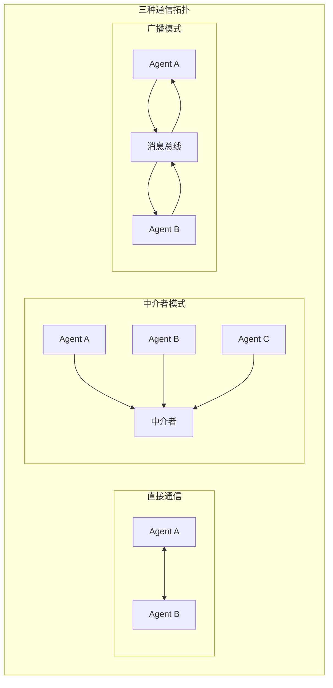

# 第 9 章 Multi-Agent 基础
单个 Agent 的能力终究有限，就像一个人无法同时担任架构师、开发者、测试工程师和运维专家。当任务的复杂度超过单一 Agent 的能力边界时，多个专业化 Agent 的协作成为自然选择。

但 Multi-Agent 系统的复杂度不是线性增长的——它是指数级的。两个 Agent 之间只有 1 条通信链路，三个 Agent 有 3 条，十个 Agent 有 45 条。每条链路都可能产生误解、冲突和延迟。设计 Multi-Agent 系统的核心挑战不是"如何让多个 Agent 各自工作"，而是"如何让它们有效协作而不陷入混乱"。

本章从三个层次讨论 Multi-Agent 的基础问题：**通信机制**（Agent 之间如何交换信息）、**协调策略**（如何分配任务和解决冲突）和**共享状态管理**（如何在保持自主性的同时维护一致性）。




> **"一个人可以走得很快，但一群人可以走得更远。"**
> —— 非洲谚语，同样适用于 AI Agent

在前面的章节中，我们深入探讨了如何构建一个功能强大的单体 Agent——它能理解意图、调用工具、管理记忆、规划任务。然而，随着业务场景的复杂度不断攀升，单一 Agent 不可避免地会面临能力瓶颈。本章将带你走进 **Multi-Agent（多智能体）** 的世界，学习如何让多个 Agent 协同工作，共同完成复杂任务。

我们将从"为什么"出发，深入理解 Multi-Agent 的核心原语、通信机制、身份管理、状态协调和容错策略，最后通过一个完整的客服系统实战案例将所有知识串联起来。

---

## 9.1 为什么需要 Multi-Agent

### 9.1.1 单体 Agent 的天花板

一个典型的单体 Agent 架构如下：用户输入 → LLM 推理 → 工具调用 → 输出结果。这个模式在简单场景下运行良好，但当面对以下挑战时就会力不从心：

1. **Prompt 膨胀**：当 Agent 需要处理客服、订单、退款、技术支持等多种场景时，System Prompt 会变得极其冗长，导致 LLM 性能下降。
2. **工具冲突**：不同领域的工具可能有命名冲突或语义重叠，LLM 难以正确选择。
3. **上下文窗口限制**：即使最先进的模型也有上下文长度限制，单个 Agent 无法承载所有信息。
4. **单点故障**：一个 Agent 出错，整个系统崩溃，没有降级方案。
5. **难以扩展**：新增能力意味着修改已有的复杂 Prompt，回归测试成本极高。

### 9.1.2 Single Agent vs Multi-Agent 对比

下表从多个维度对比了两种架构：

| 维度 | Single Agent | Multi-Agent |
|------|-------------|-------------|
| **复杂度管理** | 所有逻辑集中在一个 Prompt，复杂度 O(n²) 增长 | 每个 Agent 职责单一，复杂度 O(n) 线性增长 |
| **可扩展性** | 新增能力需修改核心 Prompt，牵一发而动全身 | 新增 Agent 即可，对现有系统零侵入 |
| **可靠性** | 单点故障，一处出错全盘崩溃 | 故障隔离，单个 Agent 失败不影响整体 |
| **成本** | 每次调用都携带完整上下文，Token 消耗大 | 各 Agent 仅携带必要上下文，Token 更节省 |
| **开发效率** | 团队无法并行开发，互相阻塞 | 不同团队负责不同 Agent，并行开发 |
| **调试难度** | 日志集中但混杂，定位问题如大海捞针 | 各 Agent 日志独立，但链路追踪更复杂 |
| **一致性** | 天然一致，同一 LLM 调用 | 需要显式协调机制保证一致性 |
| **延迟** | 单次 LLM 调用 | 可能涉及多次 LLM 调用，但可并行化 |

### 9.1.3 什么时候不需要 Multi-Agent

Multi-Agent 并非银弹。以下场景中，单体 Agent 可能是更好的选择：

- **简单任务**：如果任务流程固定、工具数量少于 5 个，单体 Agent 足矣。
- **低延迟要求**：Multi-Agent 的协调开销可能无法满足实时性要求。
- **预算有限**：多个 Agent 意味着更多的 LLM 调用，成本成倍增加。
- **团队规模小**：如果只有 1-2 个开发者，维护多个 Agent 的开销可能得不偿失。
- **原型阶段**：先用单体 Agent 验证想法，确认可行后再拆分。

> **设计原则**：遵循 YAGNI（You Aren't Gonna Need It）。在单体 Agent 确实遇到瓶颈时再考虑拆分，不要过早优化。

### 9.1.4 Multi-Agent 设计原则

当通过上一节的评估确定确实需要 Multi-Agent 架构时，请遵循以下设计原则：

**原则零：从简单开始（Simple First）**

即使决定采用 Multi-Agent，也应从最少数量的 Agent 开始。先用 2 个 Agent 验证架构，确认收益后再逐步增加。每新增一个 Agent 都应有明确的、可衡量的理由。

**原则一：单一职责（Single Responsibility）**

每个 Agent 只负责一个明确的领域。一个处理订单的 Agent 不应该同时处理用户认证。

**原则二：松耦合（Loose Coupling）**

Agent 之间通过消息通信，不直接引用彼此的内部状态。更换或升级某个 Agent 不应影响其他 Agent。

**原则三：清晰接口（Clear Interfaces）**

每个 Agent 对外暴露明确的能力描述（AgentCard）和消息协议，就像微服务的 API 契约一样。

**原则四：容错设计（Fail-Safe）**

假设任何 Agent 都可能失败，系统必须有降级方案。永远不要让一个 Agent 的故障拖垮整个系统。

### 9.1.5 架构演进路径

Agent 架构的演进通常经历四个阶段：

```
┌─────────────┐    ┌─────────────┐    ┌─────────────┐    ┌─────────────┐
│   Monolith   │    │   Modular    │    │   Multi-     │    │    Agent     │
│    Agent     │ →  │    Agent     │ →  │   Agent      │ →  │    Swarm     │
│             │    │             │    │   System     │    │             │
│ 所有逻辑集中  │    │ 内部模块拆分  │    │ 独立Agent协作 │    │ 自组织Agent群 │
│ 在单一Prompt │    │ 但同一进程   │    │ 消息通信     │    │ 动态涌现行为  │
└─────────────┘    └─────────────┘    └─────────────┘    └─────────────┘
    阶段1              阶段2              阶段3              阶段4
  适合MVP验证       适合中等复杂度       适合企业级应用       适合研究/前沿场景
```

下面我们用 TypeScript 定义一个基础的 Agent 接口，后续所有代码都将基于此接口构建：

```typescript
/**
 * Agent 的基础接口定义
 * 所有 Agent 都必须实现该接口，确保统一的交互协议
 */
interface AgentConfig {
  /** Agent 唯一标识 */
  id: string;
  /** Agent 名称，用于日志和调试 */
  // ... 省略 118 行，完整实现见 code-examples/ 对应目录

  /** 辅助睡眠函数 */
  protected sleep(ms: number): Promise<void> {
    return new Promise((resolve) => setTimeout(resolve, ms));
  }
}
```

---

## 9.2 Google ADK 三原语：Sequential、Parallel、Loop

Google 的 Agent Development Kit（ADK）提出了三种基础的 Agent 编排原语。这三种原语像乐高积木一样，可以组合出几乎所有的 Multi-Agent 工作流。我们将在本节深入实现每一种原语，并探讨其高级用法。

### 9.2.1 SequentialAgent：流水线编排

SequentialAgent 将多个 Agent 按顺序串联，前一个 Agent 的输出作为下一个 Agent 的输入，形成一条处理流水线。

**核心概念：**

```
输入 → [Agent A] → [Agent B] → [Agent C] → 输出
         ↓上下文传递↓    ↓上下文传递↓
```

#### 基础实现

```typescript
/**
 * 错误处理策略枚举
 * 定义当某个步骤失败时的处理方式
 */
enum ErrorHandlingPolicy {
  /** 立即停止流水线，返回错误 */
  STOP = "stop",
  /** 跳过失败步骤，继续执行下一步 */
  // ... 省略 200 行，完整实现见 code-examples/ 对应目录
    if (step.errorPolicy === ErrorHandlingPolicy.RETRY) {
      return step.agent.executeWithRetry(input);
    }
    return step.agent.execute(input);
  }
}
```

#### SequentialAgentWithState：带状态累积的流水线

在许多实际场景中，后续步骤需要访问前面所有步骤的中间结果。以下是增强版本，支持类型安全的状态传递：

```typescript
/**
 * 类型安全的流水线状态
 */
interface PipelineState<T extends Record<string, unknown> = Record<string, unknown>> {
  originalInput: AgentInput;
  intermediateResults: Map<string, AgentOutput>;
  customData: T;
  metadata: {
  // ... 省略 148 行，完整实现见 code-examples/ 对应目录
      required: false,
    },
  ],
  { extractedText: "", translatedText: "", proofreadText: "", qualityScore: 0 }
);
*/
```

### 9.2.2 ParallelAgent：并行执行

ParallelAgent 让多个 Agent 同时执行任务，最后将结果合并。这在需要多视角分析、数据并行处理等场景中非常有用。

**核心概念：**

```
         ┌→ [Agent A] →┐
输入 ──→ ├→ [Agent B] →├──→ 结果合并 → 输出
         └→ [Agent C] →┘
```

#### 结果合并策略与完整实现

```typescript
/**
 * 并行执行的结果合并策略
 */
enum MergeStrategy {
  /** 取第一个完成的结果（适合速度优先场景） */
  FIRST_WINS = "first_wins",
  /** 等所有完成，取多数一致的结果（适合准确性优先） */
  MAJORITY_VOTE = "majority_vote",
  // ... 省略 221 行，完整实现见 code-examples/ 对应目录
      const score = scorer(result);
      if (score > bestScore) { bestScore = score; bestResult = result; }
    }
    return { ...bestResult, tokensUsed: totalTokens, data: { ...bestResult.data, mergeStrategy: "quality_score", bestScore } };
  }
}
```

### 9.2.3 LoopAgent：迭代优化

LoopAgent 让一个或多个 Agent 反复执行，直到满足某个终止条件。这在需要迭代优化的场景中非常常见，比如写作→评审→修改、代码→测试→修复等。

**核心概念：**

```
        ┌─────────────────────────┐
        ↓                         │
输入 → [Agent] → 评估 → 满足? ──否──┘
                          │
                         是
                          ↓
                        输出
```

#### 完整实现

```typescript
/**
 * 循环终止条件
 */
interface LoopTermination {
  maxIterations: number;
  maxTokens: number;
  maxTimeMs: number;
  shouldStop: (
  // ... 省略 153 行，完整实现见 code-examples/ 对应目录
      status: finalResult?.status ?? "error",
      durationMs: Date.now() - startTime,
      tokensUsed: totalTokens,
    };
  }
}
```

#### ProgressiveLoopAgent：渐进式质量要求

每次迭代提出更高的质量标准，让 Agent 逐步完善输出：

```typescript
interface QualityLevel {
  name: string;
  requirement: string;
  minScore: number;
}

/**
  // ... 省略 7 行
      durationMs: Date.now() - startTime,
      tokensUsed: totalTokens,
    };
  }
}
```

---

## 9.3 通信机制

Multi-Agent 系统中，Agent 之间如何高效、可靠地传递信息是核心问题。本节介绍三种基础通信模式：**Direct Message（直接消息）**、**Blackboard（黑板）** 和 **Event Stream（事件流）**。

### 9.3.1 Direct Message：点对点通信

Direct Message 是最简单直观的通信方式：Agent A 直接向 Agent B 发送消息，并等待回复。

#### 类型化消息协议

```typescript
enum MessagePriority {
  LOW = 0, NORMAL = 1, HIGH = 2, CRITICAL = 3,
}

interface BaseMessage {
  messageId: string;
  senderId: string;
  receiverId: string;
  // ... 省略 73 行，完整实现见 code-examples/ 对应目录
  static deserialize(json: string): AgentMessage {
    const message = JSON.parse(json) as AgentMessage;
    MessageValidator.validate(message);
    return message;
  }
}
```

#### DirectMessageBus：消息总线

```typescript
type MessageHandler = (message: AgentMessage) => Promise<AgentMessage | void>;

/**
 * DirectMessageBus：点对点消息总线
 *
 * 提供 Agent 之间的直接通信能力：
 * - 请求-响应模式（send + wait for reply）
 * - 单向通知模式（fire and forget）
  // ... 省略 69 行，完整实现见 code-examples/ 对应目录
  }

  getDeadLetters(): AgentMessage[] { return [...this.deadLetterQueue]; }
  clearDeadLetters(): void { this.deadLetterQueue = []; }
  get registeredAgentCount(): number { return this.handlers.size; }
}
```

### 9.3.2 Blackboard：共享黑板

Blackboard 模式让多个 Agent 通过读写一个共享的数据结构来协作。就像一群专家围绕一块白板工作：每个人把自己的发现写上去，其他人读取后做进一步分析。

```typescript
interface BlackboardEntry<T = unknown> {
  id: string;
  section: BlackboardSection;
  authorId: string;
  data: T;
  confidence: number;
  createdAt: number;
  updatedAt: number;
  // ... 省略 154 行，完整实现见 code-examples/ 对应目录
    for (const sec of Object.values(BlackboardSection)) {
      s[sec] = Array.from(this.entries.values()).filter((e) => e.section === sec).length;
    }
    return s;
  }
}
```

### 9.3.3 Event Stream：事件流

Event Stream 模式让 Agent 通过发布/订阅事件来通信。发布者不需要知道谁会处理事件，实现更松散的耦合。

> **接口演化说明**：第 4 章的 `AgentEvent` 使用 12 种判别联合类型（discriminated union），适合单 Agent 内部的强类型状态变迁。本章的 `AgentEvent` 采用泛型结构（`eventType: string + payload: Record<string, unknown>`），因为 Multi-Agent 场景中事件类型需要跨 Agent 边界动态扩展，强类型联合在此场景下过于僵硬。

```typescript
interface AgentEvent {
  eventId: string;
  eventType: string;
  sourceAgentId: string;
  timestamp: number;
  payload: Record<string, unknown>;
  metadata?: { correlationId?: string; causationId?: string; tags?: string[] };
}
  // ... 省略 76 行，完整实现见 code-examples/ 对应目录

  getDeadLetters(): AgentEvent[] { return [...this.deadLetterQueue]; }
  clearDeadLetters(): void { this.deadLetterQueue = []; }
  get logSize(): number { return this.eventLog.length; }
  get subscriberCount(): number { return this.subscriptions.length; }
}
```

#### EventRouter：高级事件路由

```typescript
interface RoutingRule {
  name: string;
  priority: number;
  condition: (event: AgentEvent) => boolean;
  targetHandlers: EventHandler[];
  stopOnMatch: boolean;
}
  // ... 省略 7 行
      }
      if (!handled && this.defaultHandler) await this.defaultHandler(event);
    });
  }
}
```

---

## 9.4 Agent 身份与能力

在包含多个 Agent 的系统中，每个 Agent 需要有清晰的"身份证"——描述它是谁、能做什么、擅长什么。这就是 **AgentCard** 的作用。

### 9.4.1 AgentCard：Agent 的名片

```typescript
interface AgentCapability {
  name: string;
  description: string;
  proficiency: number;
  inputFormats: string[];
  outputFormats: string[];
}
  // ... 省略 7 行
    lastActiveAt: Date.now(),
    tags: [],
    ...partial,
  };
}
```

### 9.4.2 AgentRegistry：Agent 注册与发现

```typescript
interface CapabilityMatch {
  agent: AgentCard;
  score: number;
  matchedCapabilities: string[];
}

/**
 * AgentRegistry：Agent 注册中心
  // ... 省略 81 行，完整实现见 code-examples/ 对应目录
      active: all.filter((a) => a.status === "active").length,
      inactive: all.filter((a) => a.status === "inactive").length,
      capabilities: this.capabilityIndex.size,
    };
  }
}
```

### 9.4.3 CapabilityRouter：基于能力的任务路由

```typescript
interface TaskCapabilityMapping {
  taskPattern: RegExp;
  requiredCapabilities: string[];
  priority: number;
}

class CapabilityRouter {
  // ... 省略 7 行
      }
    }
    return { agent: null, capabilities: [], reason: "未匹配到任何路由规则" };
  }
}
```

---

## 9.5 共享状态与协调

当多个 Agent 需要协作完成同一个任务时，不可避免地需要共享某些状态。如何安全、高效地管理共享状态是 Multi-Agent 系统的关键挑战。

### 9.5.1 SharedStateManager：共享状态管理器

```typescript
interface StateChange {
  changeId: string;
  agentId: string;
  path: string;
  oldValue: unknown;
  newValue: unknown;
  timestamp: number;
  version: number;
  // ... 省略 90 行，完整实现见 code-examples/ 对应目录
      if (!(keys[i] in cur) || typeof cur[keys[i]] !== "object") cur[keys[i]] = {};
      cur = cur[keys[i]] as Record<string, unknown>;
    }
    cur[keys[keys.length - 1]] = value;
  }
}
```

### 9.5.2 简化共识协议：多 Agent 决策

```typescript
enum ProposalStatus { PENDING = "pending", ACCEPTED = "accepted", REJECTED = "rejected", TIMEOUT = "timeout" }

interface Proposal<T = unknown> {
  id: string;
  proposerId: string;
  content: T;
  description: string;
  // ... 省略 7 行
      return { accepted: false, status: ProposalStatus.REJECTED };
    }
    return { accepted: false, status: ProposalStatus.PENDING };
  }
}
```

### 9.5.3 冲突解决策略

```typescript
enum ConflictResolutionStrategy {
  LAST_WRITER_WINS = "last_writer_wins",
  PRIORITY_BASED = "priority_based",
  MERGE = "merge",
  ARBITRATION = "arbitration",
}

  // ... 省略 7 行
      return { ...base, newValue: merged };
    }
    return conflicts.sort((a, b) => b.timestamp - a.timestamp)[0];
  }
}
```

---


## 9.6 容错与恢复

在多 Agent 协作中，单点故障是不可避免的。与单体架构中的错误处理不同，Multi-Agent 系统需要**系统级**的容错机制——当某个 Agent 失败时，整个系统应该能够优雅地降级而非完全崩溃。

本节介绍三个核心容错模式：**熔断器（Circuit Breaker）**、**监督者（Supervisor）** 和 **优雅降级（Graceful Degradation）**。

### 9.6.1 熔断器模式（Circuit Breaker）

熔断器模式源自电气工程，当检测到下游服务异常时自动"断开"请求，防止级联故障。在 Multi-Agent 系统中，熔断器保护调用链不受单个 Agent 故障的拖累。

**状态机模型：**

```
     成功         失败次数 >= 阈值
  ┌────────┐    ┌──────────────┐
  │        ▼    │              ▼
  │     CLOSED ─┘           OPEN
  │        ▲                  │
  │        │                  │ 超时后允许一次尝试
  │     成功│                  ▼
  │        │             HALF_OPEN
  │        └──────────────────┘
  │                失败时回到 OPEN
  └────────────────────────────┘
```

```typescript
// ========================================
// 9.6.1 CircuitBreaker 实现
// ========================================

enum CircuitState {
  CLOSED = "CLOSED",         // 正常通行
  OPEN = "OPEN",             // 熔断，拒绝所有请求
  HALF_OPEN = "HALF_OPEN",   // 探测阶段，允许单个请求通过
  // ... 省略 153 行，完整实现见 code-examples/ 对应目录
class CircuitOpenError extends Error {
  constructor(message: string) {
    super(message);
    this.name = "CircuitOpenError";
  }
}
```

> **设计要点：** 熔断器的 `resetTimeout` 应根据 Agent 的平均恢复时间设置。对于 LLM Agent，建议 30-60 秒；对于工具调用 Agent，5-10 秒即可。`failureThreshold` 通常设为 3-5 次。

### 9.6.2 监督者模式（Supervisor Agent）

监督者模式借鉴了 Erlang/OTP 的 Supervisor Tree 思想：每个 Agent 都由一个 Supervisor 管理，Supervisor 负责监控 Agent 健康、在故障时执行替换或重启策略。

```typescript
// ========================================
// 9.6.2 SupervisorAgent 实现
// ========================================

/** 重启策略 */
enum RestartStrategy {
  ONE_FOR_ONE = "ONE_FOR_ONE",     // 只重启失败的 Agent
  ONE_FOR_ALL = "ONE_FOR_ALL",     // 所有 Agent 一起重启
  // ... 省略 191 行，完整实现见 code-examples/ 对应目录
        circuit: state.config.circuitBreaker.getStats(),
      });
    }
    return status;
  }
}
```

### 9.6.3 优雅降级（Graceful Degradation）

当系统部分功能不可用时，优雅降级确保核心功能继续运行，而非全面停机。

```typescript
// ========================================
// 9.6.3 GracefulDegradationManager
// ========================================

enum ServiceLevel {
  FULL = "FULL",           // 全功能
  DEGRADED = "DEGRADED",   // 部分功能降级
  MINIMAL = "MINIMAL",     // 最小功能集
  // ... 省略 115 行，完整实现见 code-examples/ 对应目录
class FeatureDisabledError extends Error {
  constructor(message: string) {
    super(message);
    this.name = "FeatureDisabledError";
  }
}
```

**使用示例：配置降级规则**

```typescript
const degradation = new GracefulDegradationManager();
const supervisor = new SupervisorAgent("main-supervisor");

// 规则 1：当 LLM Agent 不可用时，降级到关键词匹配
degradation.addRule({
  condition: () => {
    const status = supervisor.getStatus();
  // ... 省略 7 行
  fallbackBehavior: new Map([
    ["order-query", async () => ({ message: "订单查询暂时不可用，请稍后重试。" })],
  ]),
  message: "Database Agent unhealthy, disabling data-dependent features",
});
```

> **关键洞察：** 容错设计的核心原则是"失败是常态，而非例外"。在 Multi-Agent 系统中，永远假设任何 Agent 都可能在任何时刻失败，并为此做好准备。三层防护体系：熔断器（防止级联）→ 监督者（自动恢复）→ 优雅降级（保底服务）。

---


## 9.7 实战：客服 Multi-Agent 系统

本节将前面介绍的所有概念整合为一个完整的客服 Multi-Agent 系统。该系统处理客户咨询，包括 FAQ 问答、订单查询、工单升级和满意度反馈，展示 Multi-Agent 架构在真实场景中的应用。

### 9.7.1 系统架构

```
                         ┌──────────────┐
                         │   Customer   │
                         └──────┬───────┘
                                │
                         ┌──────▼───────┐
                         │  RouterAgent │  意图识别 + 路由
                         └──────┬───────┘
  // ... 省略 7 行
                   └────────────┼────────────┘
                                │
                         ┌──────▼───────┐
                         │FeedbackAgent │  满意度收集
                         └──────────────┘
```

### 9.7.2 共享上下文定义

```typescript
// ========================================
// 9.7.2 客服系统共享上下文
// ========================================

interface CustomerServiceContext {
  sessionId: string;
  customerId: string;
  // ... 省略 7 行
  content: string;
  confidence: number;
  suggestedNextAgent?: string;
  metadata?: Record<string, unknown>;
}
```

### 9.7.3 FAQAgent — 知识库问答

```typescript
// ========================================
// 9.7.3 FAQAgent 实现
// ========================================

interface FAQEntry {
  id: string;
  question: string;
  answer: string;
  // ... 省略 82 行，完整实现见 code-examples/ 对应目录
    return text
      .replace(/[^\w\u4e00-\u9fff]/g, " ")
      .split(/\s+/)
      .filter((w) => w.length > 0);
  }
}
```

### 9.7.4 OrderAgent — 订单处理

```typescript
// ========================================
// 9.7.4 OrderAgent 实现
// ========================================

interface Order {
  orderId: string;
  customerId: string;
  status: "pending" | "shipped" | "delivered" | "cancelled" | "refunding";
  // ... 省略 164 行，完整实现见 code-examples/ 对应目录
      cancelled: "已取消",
      refunding: "退款中",
    };
    return map[status] ?? status;
  }
}
```

### 9.7.5 EscalationAgent — 工单升级

```typescript
// ========================================
// 9.7.5 EscalationAgent 实现
// ========================================

interface Ticket {
  ticketId: string;
  customerId: string;
  customerName: string;
  // ... 省略 126 行，完整实现见 code-examples/ 对应目录
      medium: "🟡 中",
      low: "🟢 低",
    };
    return map[priority];
  }
}
```

### 9.7.6 FeedbackAgent — 满意度收集

```typescript
// ========================================
// 9.7.6 FeedbackAgent 实现
// ========================================

interface FeedbackRecord {
  sessionId: string;
  customerId: string;
  rating: number;              // 1-5
  // ... 省略 127 行，完整实现见 code-examples/ 对应目录
      .sort((a, b) => b.count - a.count)
      .slice(0, 10);

    return { averageRating: avg, totalFeedbacks: total, ratingDistribution: distribution, topTags };
  }
}
```

### 9.7.7 RouterAgent — 意图识别与路由

```typescript
// ========================================
// 9.7.7 RouterAgent 实现
// ========================================

interface RoutingRule {
  intent: CustomerIntent;
  targetAgent: string;
  priority: number;
  // ... 省略 111 行，完整实现见 code-examples/ 对应目录
        }
      }
    }
    return this.defaultAgent;
  }
}
```

### 9.7.8 系统组装与运行

```typescript
// ========================================
// 9.7.8 CustomerServiceSystem 完整组装
// ========================================

class CustomerServiceSystem {
  private router: RouterAgent;
  private supervisor: SupervisorAgent;
  private degradation: GracefulDegradationManager;
  // ... 省略 190 行，完整实现见 code-examples/ 对应目录
  /** 关闭系统 */
  shutdown(): void {
    this.supervisor.stop();
    console.log("[CustomerServiceSystem] Shutdown complete.");
  }
}
```

**运行示例：**

```typescript
async function demo() {
  const system = new CustomerServiceSystem();

  // 场景 1: FAQ 查询
  console.log("\n--- 场景 1: FAQ 查询 ---");
  const r1 = await system.handleMessage("C001", "张三", "请问怎么退货？");
  console.log("回复:", r1);
  // ... 省略 7 行

  system.shutdown();
}

demo().catch(console.error);
```

**预期输出（简化）：**

```
[CustomerServiceSystem] Initialized and ready.

--- 场景 1: FAQ 查询 ---
[RouterAgent] Detected intent: FAQ for query: "请问怎么退货？..."
[RouterAgent] Routing to: FAQAgent
回复: 您可以在收货后7天内申请退货。请进入「我的订单」选择对应订单...

  // ... 省略 7 行
[RouterAgent] Detected intent: FEEDBACK for query: "谢谢你们的帮助..."
[RouterAgent] Routing to: FeedbackAgent
回复: 感谢您的反馈！您的意见对我们非常重要...

[CustomerServiceSystem] Shutdown complete.
```

> **架构复盘：** 这个客服系统虽然代码量不大，但完整展示了 Multi-Agent 的核心要素：
> 1. **路由器模式**（RouterAgent）— 集中式任务分发
> 2. **专业化 Agent**（FAQ/Order/Escalation/Feedback）— 职责单一
> 3. **监督与容错**（SupervisorAgent + CircuitBreaker）— 故障自愈
> 4. **优雅降级**（GracefulDegradationManager）— 保底服务
> 5. **事件驱动**（EventStream）— 异步解耦
> 6. **共享状态**（SharedStateManager）— 上下文传递

---


## 9.8 本章小结

本章系统性地介绍了 Multi-Agent 系统的设计与实现。从基础概念到完整实战，我们覆盖了构建生产级 Multi-Agent 系统所需的全部核心知识。

### 核心概念速查表

| 概念 | 类/模式 | 核心职责 | 适用场景 |
|------|---------|---------|---------|
| 编排原语 | `SequentialAgent` | 顺序执行 Agent 管线 | 有依赖的多步任务 |
| 编排原语 | `ParallelAgent` | 并行执行 + 结果合并 | 独立子任务加速 |
| 编排原语 | `LoopAgent` | 迭代优化直到收敛 | 质量渐进提升 |
| 通信机制 | `DirectMessageBus` | 点对点类型化消息 | Agent 间直接协作 |
| 通信机制 | `Blackboard` | 共享读写空间 | 多 Agent 知识共建 |
| 通信机制 | `EventStream` | 发布-订阅事件流 | 松耦合异步通知 |
| 服务发现 | `AgentRegistry` | Agent 注册与发现 | 动态 Agent 管理 |
| 服务发现 | `CapabilityRouter` | 基于能力路由 | 自动任务分发 |
| 状态管理 | `SharedStateManager` | 乐观并发控制 | 共享数据一致性 |
| 状态管理 | `DistributedLock` | 分布式互斥锁 | 临界区保护 |
| 状态管理 | `ConsensusManager` | 投票共识协议 | 多 Agent 集体决策 |
| 状态管理 | `ConflictResolver` | 冲突检测与解决 | 并发写入冲突 |
| 容错机制 | `CircuitBreaker` | 熔断保护 | 防止级联故障 |
| 容错机制 | `SupervisorAgent` | 监督与恢复 | Agent 生命周期管理 |
| 容错机制 | `GracefulDegradation` | 优雅降级 | 部分故障下保底服务 |

### Multi-Agent 架构决策树

在实际项目中选择架构时，可以参照以下决策路径：

```
任务是否可以由单个 Agent 完成？
├── 是 → 使用 Single Agent（不要过度设计）
└── 否 → 任务之间是否存在依赖？
    ├── 是 → 是否为线性依赖（A→B→C）？
    │   ├── 是 → SequentialAgent
    │   └── 否 → 混合编排（Sequential + Parallel）
    └── 否 → 是否需要结果合并？
  // ... 省略 13 行

容错级别选择：
├── 开发/测试环境 → 基本错误处理即可
├── 生产环境（非关键） → CircuitBreaker + 重试
└── 生产环境（关键业务） → SupervisorAgent + GracefulDegradation
```

### 设计原则回顾

0. **Simple First**：先从单 Agent + 工具系统开始，仅在复杂度确实需要时才引入 Multi-Agent。[[Building effective agents - Anthropic]](https://www.anthropic.com/engineering/building-effective-agents)
1. **单一职责**：每个 Agent 只做一件事，做到最好。
2. **松耦合**：Agent 之间通过消息通信，避免直接依赖。
3. **故障隔离**：单个 Agent 的失败不应导致整个系统崩溃。
4. **可观测性**：所有 Agent 交互都应该可追踪、可审计。
5. **渐进复杂度**：从简单架构开始，按需演进。

### 从 Single Agent 到 Multi-Agent 的迁移清单

当你考虑将 Single Agent 重构为 Multi-Agent 时，请逐项确认：

- [ ] 已识别出 3 个以上独立的功能模块
- [ ] 至少 2 个模块可以并行执行
- [ ] 模块之间的接口（输入/输出）已明确定义
- [ ] 已选择合适的通信机制（Direct / Blackboard / Event）
- [ ] 已设计错误处理策略（每个 Agent 的故障影响范围）
- [ ] 已考虑状态管理方案（共享 vs 独立）
- [ ] 已建立监控和日志体系
- [ ] 已进行性能基准测试（Multi-Agent 开销 vs Single Agent）
- [ ] 团队具备维护多服务架构的能力

### 常见反模式

| 反模式 | 描述 | 正确做法 |
|--------|------|---------|
| **过度拆分** | 将简单任务拆成 10+ 个 Agent | 遵循"不需要就不拆"原则 |
| **God Router** | 路由器承担过多业务逻辑 | 路由器只做路由，业务逻辑下沉到专业 Agent |
| **共享一切** | 所有 Agent 共享同一个巨大状态对象 | 最小化共享，明确数据所有权 |
| **同步阻塞** | 所有通信都是同步请求-响应 | 区分同步和异步场景，合理使用事件驱动 |
| **忽略容错** | 假设 Agent 永不失败 | 始终设计熔断、重试和降级策略 |
| **消息洪水** | Agent 之间无节制地发送消息 | 设置消息速率限制，使用批处理 |

### 性能考量

```typescript
// Multi-Agent 系统性能监控要点

interface MultiAgentMetrics {
  // 延迟指标
  routingLatency: number;        // 路由决策耗时
  agentExecutionLatency: number; // Agent 执行耗时
  communicationOverhead: number; // 通信开销
  // ... 省略 10 行
  // 资源指标
  activeAgentCount: number;      // 活跃 Agent 数
  pendingMessages: number;       // 待处理消息数
  sharedStateSize: number;       // 共享状态大小
}
```

> **经验法则：**
> - 2-5 个 Agent 的系统，通信开销通常 < 5% 总延迟
> - 5-15 个 Agent 的系统，通信开销可能达到 10-20%
> - 超过 15 个 Agent，必须引入消息队列和异步处理
> - 始终对比 Multi-Agent 与 Single Agent 的端到端延迟

### 下一章预告

在第 10 章中，我们将深入探讨 **Multi-Agent 进阶模式**，包括：

- **Agent-as-a-Service**：将 Agent 部署为独立微服务
- **动态 Agent 编排**：基于 LLM 的运行时编排决策
- **Agent 间学习**：Agent 如何从彼此的经验中学习
- **安全与权限**：Multi-Agent 系统中的认证、授权与审计
- **大规模部署**：从实验到生产的工程化最佳实践

---

*"Multi-Agent 系统的本质不是让更多 Agent 一起工作，而是让正确的 Agent 在正确的时机做正确的事。"*

