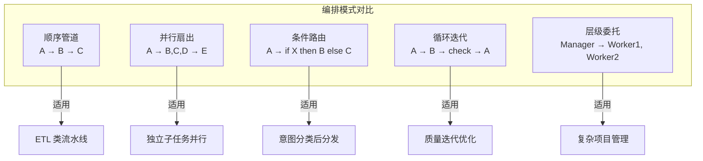

# 第 10 章 编排模式 — 九种经典 Multi-Agent 架构

本章系统性地讲解多 Agent 编排的核心模式：串行链、并行扇出、层级委托、动态路由和竞争投票。选择正确的编排模式是多 Agent 系统成败的关键——过于简单的模式无法应对复杂任务，过于复杂的模式则带来不必要的延迟和成本。本章为每种模式提供适用场景分析、实现代码和性能对比。前置依赖：第 9 章多 Agent 基础。

## 本章你将学到什么

1. 多 Agent 编排模式分别适合解决哪类任务
2. 为什么“更多 Agent”通常意味着更高的延迟、成本和调试难度
3. 如何从最简单模式出发，而不是一开始就过度设计
4. 如何判断自己需要的是多 Agent，还是单 Agent + Skill 路由

## 本章阅读原则

> 选择编排模式时，默认先问：**单 Agent 是否已经足够？**
>
> 多 Agent 不是成熟度的象征，而是一种带成本的架构选择。

---

## 10.1 模式总览



**图 10-1 五种核心编排模式**——选择编排模式的第一原则是"从最简单的开始"。顺序管道能解决的问题，不要用层级委托。过早引入复杂编排模式是多 Agent 系统最常见的过度设计。


### 10.1.1 九种模式对比表

阅读这张表时，不要先看“功能最强”的模式，而应优先看“能否用最低复杂度满足当前需求”。对大多数团队来说，前 3–4 种模式已经覆盖了绝大多数真实场景。

| # | 模式名称 | 拓扑 | 典型 Agent 数 | 最大推荐 Agent 数 | 通信开销 | 容错性 | 实现难度 | 最佳场景 |
|---|---------|------|-------------|-----------------|---------|-------|---------|---------|
| 1 | **Coordinator** 协调者 | 星形 | 3–8 | 15 | 中 | 中 | ★★☆ | 异构子任务分发 |
| 2 | **Sequential Pipeline** 流水线 | 链式 | 3–6 | 10 | 低 | 低 | ★☆☆ | 确定性多步处理 |
| 3 | **Fan-Out/Gather** 扇出聚合 | 扇形 | 3–10 | 50 | 高 | 高 | ★★☆ | 同类任务并行化 |
| 4 | **Generator-Critic** 生成-批评 | 环形 | 2–4 | 6 | 中 | 中 | ★★☆ | 质量迭代优化 |
| 5 | **Debate** 辩论 | 全连接 | 2–5 | 8 | 高 | 高 | ★★★ | 多视角决策 |
| 6 | **Hierarchical** 层级 | 树形 | 5–20 | 100+ | 中 | 高 | ★★★ | 大规模任务分解 |
| 7 | **Mixture of Agents** 混合 | 分层 | 4–12 | 30 | 高 | 高 | ★★★ | 质量最大化 |
| 8 | **模式组合** 嵌套 | 复合 | 视具体情况 | — | — | — | ★★★★ | 复杂业务系统 |
| 9 | **自定义** | 自由 | 任意 | — | — | — | ★★★★★ | 特殊需求 |

### 10.1.2 拓扑结构

九种模式的拓扑可概括为五大类：**星形**（Coordinator 居中分发）、**链式**（Pipeline 逐级传递）、**扇形**（Fan-Out 并行后聚合）、**环形**（Generator-Critic 反复迭代）和**树形**（Hierarchical 递归分解）。MoA 在扇形基础上叠加多层，Debate 则呈全连接拓扑。在实际系统中这些拓扑经常嵌套组合——例如 Coordinator 的某个子任务内部走 Pipeline，或 Fan-Out 的聚合阶段使用 Debate 投票。完整的 ASCII 拓扑图见代码仓库 `code-examples/ch10-orchestration-patterns/` 目录。

### 10.1.3 模式组合指南

在实际生产系统中，很少只使用单一模式。但组合不意味着越复杂越好。以下组合应被理解为“当基础模式已经不足时的升级路径”，而不是默认方案：

| 外层模式 | 内层模式 | 组合效果 | 典型应用 |
|---------|---------|---------|---------|
| Coordinator | Fan-Out/Gather | 协调者将任务分发后，每个子任务再并行处理 | 多语言翻译审校 |
| Pipeline | Generator-Critic | 流水线中某个阶段使用生成-批评循环 | 内容生产流水线 |
| Hierarchical | Pipeline | 每个子管理者内部使用流水线处理 | 企业级文档处理 |
| Fan-Out/Gather | Debate | 收集多个结果后，通过辩论决定最终方案 | 方案评选 |
| Coordinator | Hierarchical | 顶层协调，子任务内部有层级管理 | 大型项目管理 |

### 10.1.4 基础类型定义

在深入各模式之前，先定义整章通用的基础类型。核心接口包括 `AgentMessage`（统一消息结构，含 role/content/metadata）、`IAgent`（Agent 抽象，定义 `run(messages): Promise<AgentMessage>` 契约）、`TaskResult`（子任务结果，含 agentId/output/durationMs/tokenUsage）以及 `RetryPolicy`（重试策略，含 maxRetries/baseDelayMs/backoffMultiplier）。所有模式实现都基于这组类型构建，确保 Agent 间消息传递的一致性。完整类型定义见代码仓库 `code-examples/ch10-orchestration-patterns/types.ts`。

---

## 10.2 Coordinator 协调者模式


> **设计决策：什么时候需要多 Agent？**
>
> 一个常见的误区是"越多 Agent 越好"。实际上，多 Agent 架构引入了显著的系统复杂度：Agent 间通信的延迟和 token 成本、状态一致性维护、错误传播和调试难度。经验法则是：**只有当单个 Agent 的 Prompt 超过 4000 token 或需要同时激活超过 15 个工具时，才考虑拆分为多 Agent**。在此之前，一个精心设计的单 Agent + Skill 路由系统几乎总是更好的选择。


### 10.2.1 模式概述

Coordinator（协调者）模式是最直觉的 Multi-Agent 架构：一个中心节点接收任务，将其分解为子任务，分配给专家 Agent 处理，最后整合结果。它类似于团队 leader 分配工作。

**核心思想**：集中式决策 + 分布式执行。

**适用场景**：
- 任务可以明确分解为若干异构子任务
- 需要一个"大脑"来决定分工策略
- 各子任务之间相对独立
- 子任务类型在设计时不完全确定

**不适用场景**：
- 任务之间有严格的顺序依赖 → 用 Pipeline
- 子任务完全同构 → 用 Fan-Out/Gather
- 需要对抗性审查 → 用 Generator-Critic 或 Debate

### 10.2.2 基础 Coordinator 实现

Coordinator 的核心流程分三步：（1）用 LLM 将用户任务分解为子任务列表，每个子任务带有 description 和 requiredExpertise 字段；（2）根据 requiredExpertise 匹配注册的专家 Agent，并行调度执行；（3）收集全部子任务结果后，再次调用 LLM 进行结果整合与质量检查。

实现时需要关注三个关键设计点。首先是**任务分解的 Prompt 设计**——要求 LLM 以 JSON 数组格式返回子任务列表，每项包含明确的描述和所需专长，同时限制分解粒度（建议不超过 8 个子任务）。其次是**专家匹配策略**——维护一个 `Map<string, IAgent>` 的专家注册表，匹配时可以用精确匹配或 LLM 语义匹配。最后是**结果整合**——将所有子任务的输出拼接为上下文，由 LLM 生成最终综合回答。

完整实现见代码仓库 `code-examples/ch10-orchestration-patterns/coordinator.ts`。

### 10.2.3 带记忆的高级 Coordinator

在实际系统中，Coordinator 应当记住哪些专家在特定任务上表现更好，逐步优化分配策略。实现方式是维护一个 `SpecialistPerformanceRecord` 记录表，包含 agentId、taskType、avgQualityScore、totalTasks 和 avgDurationMs 字段。每次子任务完成后，根据结果质量（可由 LLM 评分或用户反馈获取）更新对应专家的绩效记录。

在下一次任务分配时，Coordinator 不再随机或按固定规则选择专家，而是查询绩效记录，按 `avgQualityScore * reliabilityWeight` 加权排序后选择最优匹配。这种"学习型分配"在长期运行的系统中可以显著提升整体质量——实践中观察到经过 50-100 次任务后，分配准确率提升 15-25%。

### 10.2.4 错误处理：分解失败的应对

当 Coordinator 的任务分解出现错误时（如 LLM 返回非法 JSON、分解粒度不合理、某个子任务无匹配专家），需要有降级策略。推荐的三级降级方案：

1. **重试分解**：用更严格的 Prompt（附带示例和格式约束）重新请求 LLM 分解，最多重试 2 次；
2. **模板分解**：维护预定义的任务分解模板库（按任务类型索引），当 LLM 分解失败时回退到最匹配的模板；
3. **单 Agent 降级**：如果连模板分解也不适用，将整个任务交给能力最全面的单个 Agent 直接处理。

完整实现见代码仓库 `code-examples/ch10-orchestration-patterns/coordinator.ts` 中的 `RobustTaskDecomposer` 类。

---

## 10.3 Sequential Pipeline 流水线模式

### 10.3.1 模式概述

Pipeline（流水线）模式将处理过程组织为一系列有序的阶段（Stage），数据从第一个阶段流向最后一个阶段，每个阶段的输出作为下一个阶段的输入。

**核心思想**：确定性的顺序处理，关注点分离。

**适用场景**：
- 任务有明确的先后步骤（如：提取 → 翻译 → 校对 → 排版）
- 每个阶段可以独立开发和测试
- 数据在各阶段间有清晰的类型转换
- 需要监控每个阶段的性能

**不适用场景**：
- 处理步骤之间没有顺序依赖 → 用 Fan-Out/Gather
- 步骤之间需要大量反复迭代 → 用 Generator-Critic
- 处理逻辑高度动态 → 用 Coordinator

### 10.3.2 类型安全的流水线

Pipeline 实现的核心难点在于**泛型链式类型传递**——确保第 N 个阶段的输出类型与第 N+1 个阶段的输入类型在编译期匹配。TypeScript 通过 `PipelineStage<TIn, TOut>` 接口和 Builder 模式的泛型链式调用实现这一点。

每个阶段实现 `PipelineStage<TIn, TOut>` 接口，包含 `name: string`、`process(input: TIn): Promise<TOut>` 方法以及可选的 `validate(output: TOut): boolean` 校验函数。Pipeline Builder 通过 `.addStage<TNext>(stage: PipelineStage<TCurrent, TNext>)` 方法链式追加阶段，返回类型自动推导为 `PipelineBuilder<TFirst, TNext>`，从而保证端到端的类型安全。

执行时，Pipeline 顺序调用每个阶段的 `process` 方法，同时记录每阶段的耗时和 token 使用量，生成 `PipelineReport`。报告包含各阶段的 `stageName`、`durationMs`、`tokenUsage` 和 `success` 字段，方便后续瓶颈检测。

完整实现见代码仓库 `code-examples/ch10-orchestration-patterns/pipeline.ts`，核心设计要点如下：

- Builder 模式的泛型链确保阶段间类型安全
- 每阶段内置 try-catch，失败时记录 stageName + error 后向上抛出
- `findBottleneck()` 方法从历史报告中找出平均耗时最长的阶段
- 支持同步/异步阶段混合

### 10.3.3 条件分支流水线

真实场景中，流水线不总是线性的——某些阶段需要根据条件选择不同的处理路径。`ConditionalStage<TIn, TOut>` 封装了这一逻辑：它接收一个 `condition: (input: TIn) => string` 函数和一个 `branches: Map<string, PipelineStage<TIn, TOut>>` 分支表。执行时先求值条件函数得到分支名，再从分支表中取出对应阶段执行。

典型应用是内容翻译流水线中的语言检测阶段：根据检测到的源语言选择不同的翻译 Agent（中英翻译 Agent 和日英翻译 Agent 使用完全不同的 Prompt 和术语表）。

### 10.3.4 流水线监控与瓶颈检测

`PipelineMonitor` 累积多次执行的 `PipelineReport`，提供三项核心能力：（1）**瓶颈检测**——按阶段名聚合平均耗时，标记超过整体均值 2 倍的阶段为瓶颈；（2）**趋势分析**——对比最近 N 次执行的各阶段耗时变化，检测是否有阶段在劣化；（3）**报告生成**——输出 Markdown 格式的性能摘要表，包含各阶段的 P50/P95 延迟和成功率。

### 10.3.5 流式流水线

当处理大量数据项时，不必等所有项完成一个阶段再进入下一阶段——可以采用流式处理，让数据像水流一样逐项通过所有阶段。`StreamingPipeline<TItem>` 使用 `AsyncGenerator` 实现逐项流式处理：每个阶段的 `process` 方法接收一个 `AsyncIterable<TIn>` 并 `yield` 出 `TOut`，下游阶段在上游 yield 第一个结果时就开始处理，无需等待所有项完成。这种模式在批量文章处理、日志分析等场景中可以将端到端延迟降低 40-60%。

完整实现见代码仓库 `code-examples/ch10-orchestration-patterns/pipeline.ts` 中的 `StreamingPipeline` 类。

---

## 10.4 Fan-Out/Gather 扇出聚合模式

### 10.4.1 模式概述

Fan-Out/Gather 模式将一个任务分发给多个 Worker 并行处理，然后收集所有结果进行聚合。它是提升吞吐量和结果多样性的核心模式。

**核心思想**：并行发散 + 集中聚合。

**适用场景**：
- 同一个问题需要多个视角的回答
- 大量同构子任务可以并行处理
- 需要在多个结果中选出最佳方案
- 需要对同一数据进行多维度分析

```
      任务
       |
  +----+----+----+
  v    v    v    v
 W1   W2   W3   W4    <-- Fan-Out：并行分发
  |    |    |    |
  +----+----+----+
       v
   Aggregator          <-- Gather：聚合结果
       |
    最终结果
```

### 10.4.2 加权扇出聚合

不同 Worker 的能力有差异，应当对结果赋予不同的权重。`WeightedFanOutGather` 编排器为每个 Worker 配置 `WorkerConfig`（包含 agent、weight 和 timeout 字段），并行调度后按权重聚合。

聚合策略分三步：（1）过滤掉超时或失败的结果；（2）按权重归一化计算每个结果的得分（权重 × 质量评分，质量评分可由 LLM 打分或规则判定）；（3）选择加权得分最高的结果作为最终输出，或由 LLM 综合 Top-K 结果生成融合答案。

权重的初始值可基于 Worker 的模型能力设定（如 GPT-4 权重 1.0、GPT-3.5 权重 0.6），运行中根据历史表现动态调整。

完整实现见代码仓库 `code-examples/ch10-orchestration-patterns/fan-out-gather.ts`，核心设计要点如下：

- 使用 `Promise.allSettled` 而非 `Promise.all`，确保单个 Worker 失败不阻塞其他
- 每个 Worker 有独立的 timeout 控制（通过 `Promise.race` 与 `setTimeout` 实现）
- 支持动态权重调整：每次聚合后根据结果质量更新 Worker 权重

### 10.4.3 选择性扇出

并非所有任务都需要发给所有 Worker——智能选择性扇出可以节省成本。`SelectiveFanOut` 先用一次轻量 LLM 调用分析任务内容，判断哪些 Worker 与当前任务相关（返回相关 Worker ID 列表），只向被选中的 Worker 发送请求。例如，一个多语言翻译系统中，中文翻译任务无需发给法语 Worker。这种策略在 Worker 数量超过 5 个时可以节省 30-50% 的 token 成本。

### 10.4.4 渐进式聚合（Progressive Gather）

不必等所有 Worker 完成——可以在 Worker 陆续完成时渐进式返回部分结果。`ProgressiveGather` 通过事件回调机制实现：每当一个 Worker 返回结果，触发 `onPartialResult` 事件，调用方可以立即获得当前已有结果的聚合摘要。当满足"足够好"条件（如已收到 3/4 Worker 的结果且质量评分 > 阈值）时，可以提前结束而无需等待最慢的 Worker。这种模式特别适合用户侧需要实时反馈的场景（如搜索结果流式展示）。

### 10.4.5 结果去重

当多个 Worker 对同一任务给出相似结果时，需要去重以避免冗余。`SemanticDeduplicator` 使用 LLM 对每对结果进行语义相似度判断（简单二值判断：是否语义等价），然后在等价组中保留权重最高或质量评分最高的结果。对于 Worker 数量较多的场景（>10），可以先用 embedding 余弦相似度快速初筛（阈值 0.9），再用 LLM 精确判断，降低 LLM 调用次数。

---

## 10.5 Generator-Critic 生成-批评模式

> **模式卡片**
>
> | 属性 | 说明 |
> |------|------|
> | **拓扑** | 环形（Generator ↔ Critic 循环） |
> | **角色** | Generator 负责生成内容，Critic 负责评审并给出改进建议 |
> | **核心思想** | 生成与评审分离，通过迭代逼近最优质量 |
> | **终止条件** | 质量评分 ≥ 阈值，或达到最大迭代次数 |
> | **适用场景** | 内容创作反复打磨、存在客观质量标准、单次生成无法达标 |
> | **不适用场景** | 无明确评估标准、对延迟敏感（每轮迭代 ≈ 2x LLM 调用） |
> | **典型配置** | 最大 3-5 轮迭代，质量阈值 0.8，温度 Generator 0.7 / Critic 0.2 |

**关键设计要点**：

1. **多维度评审面板（Critic Panel）**：单个 Critic 可能无法覆盖所有质量维度。引入多个 Critic，每位关注一个维度（如 accuracy、clarity、completeness），各自独立打分后加权聚合。每个维度定义 `CriticDimension`（name、description、weight、threshold），Critic 返回 `CriticScore`（dimension、score 0-1、suggestions[]）。

2. **收敛检测**：追踪每轮的综合评分，如果连续 2 轮评分提升不超过 0.02，判定为收敛停滞，提前终止迭代避免浪费 token。

3. **迭代上下文管理**：每轮 Generator 收到的 Prompt 包含上一版本的内容和 Critic 的改进建议列表。建议按维度分组呈现，避免 Generator 的上下文过长。超过 3 轮后只保留最近 2 轮的建议。

4. **带工具调用的 Critic**：高级场景中 Critic 不仅靠推理评审，还能调用外部工具验证（如搜索引擎核实事实性声明、代码执行器验证代码正确性）。工具调用结果作为评审依据的一部分，提升评审的客观性。

完整实现见代码仓库 `code-examples/ch10-orchestration-patterns/generator-critic.ts`。

---

## 10.6 Debate 辩论模式

> **模式卡片**
>
> | 属性 | 说明 |
> |------|------|
> | **拓扑** | 全连接（所有 Debater 互相可见论点）+ Judge 裁决节点 |
> | **角色** | 多个 Debater（各持不同立场）+ 1 个 Judge |
> | **核心思想** | 对抗性探索 + 第三方裁决 |
> | **流程** | Opening 开场陈述 → Rebuttal 反驳 → Closing 总结 → Judge 综合裁决 |
> | **适用场景** | 决策问题无明确正确答案、需全面考虑 pros & cons、避免群体思维 |
> | **不适用场景** | 有客观正确答案的事实性问题、对延迟敏感（多轮交互成本高） |
> | **典型配置** | 2-3 个 Debater，3 轮辩论，Judge 温度 0.1 |

```
     Round 1: Opening        Round 2: Rebuttal       Round 3: Closing
  +------------------+   +------------------+   +------------------+
  | D1: 正方开场陈述  |   | D1: 反驳D2的论点  |   | D1: 总结陈词     |
  | D2: 反方开场陈述  |   | D2: 反驳D1的论点  |   | D2: 总结陈词     |
  +--------+---------+   +--------+---------+   +--------+---------+
           |                      |                      |
           +----------------------+----------------------+
                                  |
                           +------v------+
                           |    Judge     |
                           |  综合裁决    |
                           +-------------+
```

**关键设计要点**：

1. **结构化辩论编排**：`StructuredDebate` 编排器维护辩论状态机——每轮按固定顺序让各 Debater 发言，每位 Debater 的 Prompt 包含本轮所有先前发言的历史，确保反驳有针对性。

2. **立场分配策略**：Debater 的立场可以手动指定（如"支持方案 A"vs"支持方案 B"），也可以让 LLM 自动发现多个合理立场。后者适用于开放性问题。

3. **论点评分机制**：每轮结束后 Judge 对各 Debater 的论点进行维度评分（逻辑性、证据力度、反驳质量），累积评分影响最终裁决权重。

4. **Judge 综合裁决输出**：Judge 的最终裁决包含 `winner`（或 "draw"）、`reasoning`（裁决理由）和 `synthesis`（综合各方最佳论点的最终建议）。Synthesis 是最有价值的输出——它吸收了各方优点，优于任何单一立场。

完整实现见代码仓库 `code-examples/ch10-orchestration-patterns/debate.ts`。

---

## 10.7 Hierarchical 层级模式

> **模式卡片**
>
> | 属性 | 说明 |
> |------|------|
> | **拓扑** | 树形（Manager → Sub-Manager → Worker 多级） |
> | **核心思想** | 递归分解 + 分层管控 + 逐级汇报 |
> | **适用场景** | 超大规模任务（单层 Coordinator 无法处理）、需要权限层级、子任务还需进一步分解 |
> | **不适用场景** | 任务规模小（<5 Agent）、需要快速响应 |
> | **典型配置** | 2-3 层深度，每层 3-5 节点，总 Agent 数 10-50 |

```
           +----------------+
           |  Top Manager   |  <-- 战略分解
           +-------+--------+
        +----------+----------+
        v          v          v
  +----------++----------++----------+
  |SubMgr: UI||SubMgr:API||SubMgr:DB |  <-- 战术分解
  +----+-----++----+-----++----+-----+
   +---+---+   +---+---+   +---+---+
   v   v   v   v   v   v   v   v   v
  W1  W2  W3  W4  W5  W6  W7  W8  W9   <-- 执行层
```

**关键设计要点**：

1. **递归任务分解**：`HierarchicalOrchestrator` 以 `TaskNode` 树表示任务结构。每个 Manager 节点接收任务后，用 LLM 分解为子任务，分配给子节点。子节点如果是 Sub-Manager 则递归分解，如果是 Worker 则直接执行。分解深度通过 `maxDepth` 参数控制（推荐 ≤ 3）。

2. **横向协调协议**：同级 Agent 之间有时需要直接沟通而不经上级中转。`LateralCoordinator` 维护一个消息总线，允许同一层级的 Agent 发送 `LateralMessage`（包含 fromAgentId、toAgentId、content、priority）。典型用例是 UI Sub-Manager 需要知道 API Sub-Manager 定义的接口格式。

3. **结果逐级汇报**：每个子节点完成后向上级汇报结果，上级整合后继续向更上级汇报。整合过程包含质量检查——如果某个子任务质量不达标，上级可以要求重做或分配给其他子节点。

4. **权限与预算管控**：每一层有独立的 token 预算和超时限制。上级从自身预算中划拨给子节点，防止任何子树超支。

完整实现见代码仓库 `code-examples/ch10-orchestration-patterns/hierarchical.ts`。

---

## 10.8 Mixture of Agents (MoA) 混合Agent模式

> **模式卡片**
>
> | 属性 | 说明 |
> |------|------|
> | **拓扑** | 分层（多层 Proposer → Aggregator → Refiner 叠加） |
> | **核心思想** | 层叠聚合，每一层在前一层基础上改进 |
> | **论文参考** | Together AI "Mixture-of-Agents Enhances Large Language Model Capabilities" (2024) |
> | **适用场景** | 质量最大化场景、预算充裕、可接受较高延迟 |
> | **不适用场景** | 成本敏感、低延迟要求 |
> | **典型配置** | 2-3 层 × 3 Agent/层，最终一个 Aggregator |

**核心流程**：

1. **Layer 0 — Proposing**：多个 Proposer Agent 独立生成初始方案
2. **Layer 1 — Aggregating**：Aggregator 综合所有初始方案，提炼出融合版本
3. **Layer 2 — Refining**：多个 Refiner Agent 在融合基础上各自优化
4. **Layer 3 — Final Aggregation**：最终 Aggregator 从优化版本中产出最终输出

**关键设计要点**：

1. **成本-质量权衡**：MoA 的 token 消耗随层数和每层 Agent 数呈乘法增长。`MoACostAnalyzer` 可以预估不同配置（如 2×3 vs 3×4）的 token 成本和预期质量提升。实践表明质量提升在前 2-3 层最为显著，之后边际收益递减。

2. **提前终止**：每层 Aggregation 后评估质量，如果已达标则跳过后续层级。

3. **异构模型组合**：不同层可以使用不同模型——Proposer 层用高创造力模型（如 Claude Opus），Refiner 层用高精确性模型（如 GPT-4），Aggregator 用综合能力模型。

> **实践建议**：推荐配置为 2 层 × 3 个 Agent，在成本和质量之间取得较好平衡。

完整实现见代码仓库 `code-examples/ch10-orchestration-patterns/moa.ts`。

---

## 10.9 模式组合与嵌套

### 10.9.1 为什么需要组合模式？

实际生产系统中的任务往往过于复杂，无法用单一编排模式解决。例如一个"AI 驱动的研究报告系统"可能需要：
1. **Coordinator** 分解研究主题为子课题
2. **Fan-Out/Gather** 并行搜索多个子课题
3. **Generator-Critic** 反复打磨每个章节
4. **Pipeline** 将搜索 → 撰写 → 校审串联起来

模式组合的关键在于：**将一种模式的某个节点替换为另一种模式的完整实例**。

### 10.9.2 组合规则

| 规则 | 说明 | 示例 |
|------|------|------|
| **嵌套深度限制** | 组合深度不超过 3 层，否则调试极其困难 | Coordinator → Fan-Out → Pipeline (3层已是上限) |
| **类型一致性** | 内层模式的输入/输出类型必须匹配外层的期望 | Pipeline 阶段的 TOut 必须匹配下一阶段的 TIn |
| **超时传递** | 外层超时应大于所有内层超时之和 | 如果内层 Pipeline 超时 30s，外层至少 60s |
| **错误冒泡** | 内层失败应向外层报告，而非静默吞掉 | 内层 Fan-Out 部分失败，外层 Coordinator 需知晓 |
| **可观测性** | 每层都应输出 metrics，便于定位问题 | 嵌套的 PipelineReport 应包含子模式的报告 |

### 10.9.3 组合示例：AI 研究助手系统

以 AI 研究助手为例，展示 Coordinator + Fan-Out/Gather + Generator-Critic 三层嵌套的设计。外层 Coordinator 将"撰写关于 X 的研究报告"分解为若干子课题；每个子课题通过 Fan-Out 并行调用 3 个搜索 Agent 收集资料，Gather 后合并为课题摘要；然后每个章节进入 Generator-Critic 循环，Generator 根据课题摘要撰写章节，Critic 从准确性和可读性两个维度评审，迭代 2-3 轮后输出最终章节；最后 Coordinator 将所有章节整合为完整报告。

这个组合中，Coordinator 的超时设置为 300s（涵盖内部所有子流程），Fan-Out 的超时为 30s/Worker，Generator-Critic 的超时为 60s/轮 × 3 轮。错误处理采用"部分降级"策略：如果某个子课题的 Fan-Out 部分 Worker 失败，用已有结果继续；如果某个章节的 Generator-Critic 未在迭代限制内达标，使用最后一版。

完整实现见代码仓库 `code-examples/ch10-orchestration-patterns/composite-research.ts`。

### 10.9.4 Anti-Patterns：组合模式的常见错误

| 反模式 | 问题 | 修正方案 |
|--------|------|---------|
| **过度嵌套（"洋葱架构"）** | 5+ 层嵌套导致超时难以控制、错误难以追踪 | 限制嵌套 ≤ 3 层；如果超过，重新审视任务分解方式 |
| **统一温度设置** | 所有角色使用相同 temperature 导致生成者不够创造、评审者不够严格 | 角色化温度：Generator 0.7、Critic 0.1、Aggregator 0.3、Debater 0.6 |
| **无超时传递** | 内层无限等待拖垮外层 | 每层设独立超时，外层 > 内层之和 |
| **错误静默吞没** | 内层失败被 catch 但不上报，外层以为成功 | 所有层级的错误必须冒泡或记录到 metrics |
| **过多 Agent 共享上下文** | 所有 Agent 看到完整上下文导致 token 爆炸 | 每个 Agent 只看到与其任务相关的上下文子集 |

---

## 10.10 模式选择决策树

面对一个具体的 Multi-Agent 需求，如何选择合适的编排模式？以下决策树帮助你系统地做出选择：

```
                        开始
                         |
                    任务是否可分解？
                    +----+----+
                   否         是
                    |          |
              单 Agent       步骤间有顺序依赖？
              即可          +------+------+
                           是             否
                            |              |
                        Pipeline       子任务同构？
                        流水线         +---+---+
                                      是       否
                                       |        |
                                  Fan-Out    需要迭代改进？
                                  +Gather    +-----+-----+
                                            是           否
                                             |            |
                                     Generator-     需要对抗性审查？
                                       Critic       +------+------+
                                                   是              否
                                                    |               |
                                              任务规模超大？  需要多层质量提升？
                                              +----+----+    +-----+-----+
                                             是         否  是           否
                                              |          |   |            |
                                         Hierarchical  Debate  MoA     Coordinator
                                           层级        辩论    混合      协调者
```

### 10.10.1 快速参考卡

| 场景关键词 | 推荐模式 |
|-----------|---------|
| "先...再..." | Pipeline 流水线 |
| "同时..." | Fan-Out/Gather 扇出聚合 |
| "改到满意为止" | Generator-Critic 生成-批评 |
| "正反方辩论" | Debate 辩论 |
| "分给各部门" | Coordinator 协调者 |
| "层层分解" | Hierarchical 层级 |
| "集思广益取精华" | MoA 混合 |
| "先搜再写" | Coordinator + Fan-Out + GenCritic (组合) |
| "大规模项目" | Hierarchical + Pipeline (组合) |
| "方案评选" | Fan-Out + Debate (组合) |

### 10.10.2 性能基准参考

以下数据基于典型配置（GPT-4 class 模型，标准延迟），仅供参考：

| 模式 | 典型延迟 | Token 消耗倍数 | 质量提升 | 适合的 SLA |
|------|---------|---------------|---------|-----------|
| Pipeline (4 stages) | 8-15s | 4x | +10-20% | < 20s |
| Coordinator (5 Agents) | 10-25s | 5-8x | +15-25% | < 30s |
| Fan-Out (4 workers) | 5-10s | 4x | +10-15% | < 15s |
| Generator-Critic (3 iter) | 15-30s | 6-10x | +20-40% | < 45s |
| Debate (3 rounds) | 20-40s | 8-12x | +15-30% | < 60s |
| Hierarchical (3 tiers) | 30-60s | 10-20x | +25-40% | < 90s |
| MoA (3x3) | 20-45s | 10-15x | +25-45% | < 60s |

### 10.10.3 额外决策因素

除了任务本身的特征，选择模式时还应考虑：

**预算约束**：
- Token 预算有限时，优先选 Pipeline / Coordinator（消耗可控）
- 预算充裕且追求质量时，可考虑 MoA / Debate

**响应时间要求**：
- 需要实时响应（< 5s）：Pipeline（流式）或预计算
- 允许中等延迟（5-30s）：Coordinator / Fan-Out
- 允许长时间处理（> 30s）：Hierarchical / MoA / 模式组合

**团队经验**：
- 新手团队：Pipeline / Coordinator（简单可控，便于调试）
- 有经验的团队：Hierarchical / MoA / 模式组合

**可观测性需求**：
- Pipeline 天然支持阶段级监控
- Fan-Out 可以逐 Worker 追踪
- Hierarchical 需要较完善的任务树可视化

## 10.11 Anthropic 编排模式参考

2024 年 12 月，Anthropic 发布了「Building Effective Agents」技术博客，提出了一套从简单到复杂的 Agent 编排分类体系。与前面章节介绍的多 Agent 编排模式不同，Anthropic 的框架更聚焦于**单 Agent 内部的工作流组织方式**，并明确区分了 **Workflow（预定义编排）** 和 **Agent（自主决策）** 两个层次。这套分类对理解"何时需要多 Agent、何时单 Agent 工作流就足够"具有重要参考价值。

> **术语说明**：Anthropic 将 LLM 驱动的预定义流程称为 **Workflow**，将拥有自主工具调用能力的系统称为 **Agent**。本节沿用其术语体系。

### 10.11.1 Prompt Chaining（提示链）

**核心思想**：将任务分解为固定步骤序列，每一步的 LLM 输出作为下一步的输入。步骤之间可以插入程序化的"门控"检查（gate check），确保中间结果符合质量要求后再继续。

**适用场景**：任务可自然分解为固定子步骤；愿意用更高延迟换取更高准确性；每一步需要不同的 prompt 或模型参数。

**与本书模式的映射**：对应 §10.3 Sequential Pipeline 流水线模式的轻量化版本。

### 10.11.2 Routing（路由）

**核心思想**：用一次 LLM 调用对输入进行分类，然后将请求路由到不同的专用处理流程。分类与处理分离，各分支可以独立优化 prompt。

**适用场景**：输入类型多样，需要不同处理策略；分类准确度可通过 LLM 可靠达成；各类别的处理逻辑差异显著。

**与本书模式的映射**：对应 §10.2 Coordinator 模式中的路由子模块，以及 §10.3 Pipeline 模式中的条件分支（§10.3.3）。

### 10.11.3 Parallelization（并行化）

**核心思想**：同时运行多个 LLM 调用，然后程序化地聚合结果。两种子模式：**Sectioning（分区）** 将任务拆分为独立子任务并行处理；**Voting（投票）** 将同一任务交给多个 LLM 实例通过投票决定结果。

**与本书模式的映射**：对应 §10.4 Fan-Out/Gather 扇出聚合模式。Sectioning 对应异构扇出，Voting 对应 §10.6 Debate 模式的简化版。

### 10.11.4 Orchestrator-Workers（编排者-工作者）

**核心思想**：中央编排者 LLM 动态分析任务，决定需要调用哪些子任务以及如何分配。与并行化的区别在于——子任务不是预定义的，而是由编排者根据输入动态规划。

**与本书模式的映射**：直接对应 §10.2 Coordinator 协调者模式和 §3.2.7 Delegation 委派模式。

### 10.11.5 Evaluator-Optimizer（评估者-优化者）

**核心思想**：一个 LLM 生成输出，另一个 LLM 评估输出质量并提供反馈，循环迭代直到评估者满意。

**与本书模式的映射**：直接对应 §10.5 Generator-Critic 生成-批评模式。

### 10.11.6 Autonomous Agent（自主Agent）

**核心思想**：当任务复杂到无法用上述任何预定义工作流模式解决时，赋予 Agent 完整的工具调用能力和自主决策循环——Agent 自行规划、执行、观察结果、调整策略，直到任务完成或达到停止条件。

**关键风险**：自主 Agent 的错误会在循环中累积。Anthropic 建议在沙箱环境中运行、设置适当的停止条件（最大迭代次数、超时、成本上限），并通过人机协作（human-in-the-loop）降低风险。

### 10.11.7 模式选择：从 Workflow 到 Agent

Anthropic 的核心建议是**从最简单的方案开始，只在必要时增加复杂度**。大多数实际项目中，Prompt Chaining + Routing + Parallelization 的组合就能解决 80% 的需求。只有在这些简单模式明显不够用时，才考虑引入 Orchestrator-Workers 或完全自主的 Agent。这与本书 §10.10 模式选择决策树的"从简单开始"原则完全一致。

---

## 10.12 本章小结

### 10.12.1 核心要点回顾

本章系统介绍了九种 Multi-Agent 编排模式，从简单到复杂依次为：

1. **Coordinator 协调者模式** -- 星形拓扑，中心化决策，最通用的起点。
   关键实现要素：LLM 任务分解、动态专家匹配、结果验证、带记忆的分配优化。

2. **Sequential Pipeline 流水线模式** -- 链式拓扑，确定性顺序处理。
   关键实现要素：类型安全的泛型链、条件分支、性能监控、流式处理。

3. **Fan-Out/Gather 扇出聚合模式** -- 扇形拓扑，并行提升吞吐。
   关键实现要素：加权聚合、选择性扇出、渐进式返回、语义去重。

4. **Generator-Critic 生成-批评模式** -- 环形拓扑，迭代质量优化。
   关键实现要素：多维度评审面板、收敛检测、工具辅助验证。

5. **Debate 辩论模式** -- 全连接拓扑，对抗性探索。
   关键实现要素：角色立场分配、结构化辩论流程、论点评分、证据引用。

6. **Hierarchical 层级模式** -- 树形拓扑，大规模分治。
   关键实现要素：递归任务分解、权限层级、上级审批、横向协调。

7. **Mixture of Agents 混合模式** -- 分层拓扑，质量最大化。
   关键实现要素：多层 Proposer-Aggregator-Refiner、成本-质量权衡、提前终止。

8. **模式组合** -- 复合拓扑，应对真实复杂系统。
   关键实现要素：嵌套规则、超时传递、错误冒泡、角色化 LLM 配置。

### 10.12.2 设计原则

Multi-Agent 编排的七项核心设计原则：

| # | 原则 | 说明 |
|---|------|------|
| 1 | **从简单开始** | 先用 Coordinator/Pipeline，只在证明不够时才引入复杂模式 |
| 2 | **可观测性优先** | 每个 Agent 调用都要有 trace/span，否则多 Agent 系统不可调试 |
| 3 | **故障隔离** | 单个 Agent 失败不应导致整个编排崩溃，使用超时 + 降级策略 |
| 4 | **成本感知** | 每次编排决策都要考虑 token 成本，避免不必要的 LLM 调用 |
| 5 | **类型安全** | 用泛型确保 Agent 间消息类型在编译期检查 |
| 6 | **幂等设计** | 每个 Agent 的操作应当幂等，便于重试和恢复 |
| 7 | **超时控制** | 每层都有超时，外层 > 内层之和，避免无限等待 |

### 10.12.3 下一步

掌握了编排模式后，你已经具备构建 Multi-Agent 系统的架构能力。接下来在第 11 章中，我们将探讨 **Multi-Agent 框架对比与选型**——如何让 Agent 之间高效、可靠地传递信息，是大规模 Multi-Agent 系统的另一核心挑战。

---

> **本章完**
>
> 章节统计：9 种编排模式 | 模式卡片 + 关键设计要点 |
> 1 个完整组合案例（AI 研究助手）| 1 棵决策树 | 1 张速查卡

## 本章小结

多 Agent 编排不是默认答案，而是一种在特定瓶颈下才值得采用的架构手段。理解不同模式当然重要，但更重要的是形成判断：什么时候该保持单 Agent 简洁，什么时候才值得引入协调、分工与并行。只有这样，本章的模式表才不会变成一张“越多越高级”的误导清单。

## 建议接着读

如果你希望沿着本书的主干继续推进，建议下一步阅读 第 15 章《Agent 评估体系 — Eval-Driven Development》。这样可以把本章中的判断框架，继续连接到后续的实现、评估或生产化问题上。

