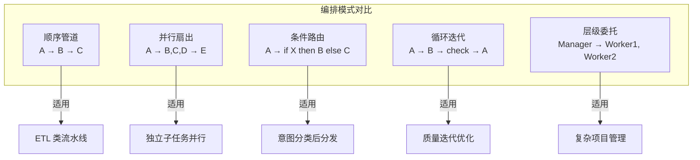

# 第 10 章 编排模式 — 九种经典 Multi-Agent 架构
如果第 9 章回答的是"Multi-Agent 系统的基本元素是什么"，本章要回答的是"如何将这些元素组织成有效的协作结构"。

软件工程中有 GoF 设计模式，分布式系统中有 Saga、CQRS、Event Sourcing 等架构模式。Multi-Agent 系统同样需要一套经过验证的编排模式，帮助架构师在面对具体场景时快速选择合适的协作结构。本章总结了九种经典的 Multi-Agent 编排模式，它们覆盖了从简单流水线到复杂自适应网络的完整复杂度谱系。

每种模式我们都将讨论：它适合什么场景、不适合什么场景、实现的核心要点、以及与其他模式的组合方式。

```mermaid
graph LR
    subgraph 复杂度递增
        P1[顺序流水线] --> P2[并行扇出]
        P2 --> P3[路由分发]
        P3 --> P4[循环精炼]
        P4 --> P5[层次委托]
    // ... 完整实现见 code-examples/ 目录 ...
        P8 --> P9[自适应网络]
    end
    style P1 fill:#c8e6c9
    style P9 fill:#ffcdd2
```

> **选型建议**：大多数生产系统只需要前三种模式（顺序、并行、路由）就能覆盖 80% 的场景。只有在明确证明简单模式不够用时，才考虑引入更复杂的编排——每增加一层复杂度，调试和维护成本都会显著上升。


> **"单个 Agent 是工匠，编排模式才是流水线。"**
>
> 当任务复杂度超越单 Agent 能力边界时，我们需要将多个 Agent 组织成协作系统。
> 本章系统介绍九种经典 Multi-Agent 编排模式，每种模式都有明确的适用场景、
> 拓扑结构和 TypeScript 生产级实现。掌握这些模式后，你可以像搭积木一样
> 组合出任意复杂度的 Agent 系统。

---

## 10.1 模式总览



**图 10-1 五种核心编排模式**——选择编排模式的第一原则是"从最简单的开始"。顺序管道能解决的问题，不要用层级委托。过早引入复杂编排模式是多 Agent 系统最常见的过度设计。


### 10.1.1 九种模式对比表

| # | 模式名称 | 拓扑 | 典型 Agent 数 | 最大推荐 Agent 数 | 通信开销 | 容错性 | 实现难度 | 最佳场景 |
|---|---------|------|-------------|-----------------|---------|-------|---------|---------|
| 1 | **Coordinator** 协调者 | 星形 | 3–8 | 15 | 中 | 中 | ★★☆ | 异构子任务分发 |
| 2 | **Sequential Pipeline** 流水线 | 链式 | 3–6 | 10 | 低 | 低 | ★☆☆ | 确定性多步处理 |
| 3 | **Fan-Out/Gather** 扇出聚合 | 扇形 | 3–10 | 50 | 高 | 高 | ★★☆ | 同类任务并行化 |
| 4 | **Generator-Critic** 生成-批评 | 环形 | 2–4 | 6 | 中 | 中 | ★★☆ | 质量迭代优化 |
| 5 | **Debate** 辩论 | 全连接 | 2–5 | 8 | 高 | 高 | ★★★ | 多视角决策 |
| 6 | **Hierarchical** 层级 | 树形 | 5–20 | 100+ | 中 | 高 | ★★★ | 大规模任务分解 |
| 7 | **Mixture of Agents** 混合 | 分层 | 4–12 | 30 | 高 | 高 | ★★★ | 质量最大化 |
| 8 | **模式组合** 嵌套 | 复合 | 视具体情况 | — | — | — | ★★★★ | 复杂业务系统 |
| 9 | **自定义** | 自由 | 任意 | — | — | — | ★★★★★ | 特殊需求 |

### 10.1.2 拓扑结构图

以下 ASCII 图展示了每种模式的核心拓扑：

```
┌──────────────────────────────────────────────────────────────────────┐
│  ① Coordinator 协调者模式（星形）                                      │
│                                                                      │
│              ┌────────────┐                                          │
│              │ Coordinator │                                          │
│              └─────┬──────┘                                          │
    // ... 完整实现见 code-examples/ 目录 ...
│                     ┌────────▼────────┐                              │
│   Layer 3:          │Final Aggregator │                              │
│                     └─────────────────┘                              │
└──────────────────────────────────────────────────────────────────────┘
```

### 10.1.3 模式组合指南

在实际生产系统中，很少只使用单一模式。以下是常见的组合策略：

| 外层模式 | 内层模式 | 组合效果 | 典型应用 |
|---------|---------|---------|---------|
| Coordinator | Fan-Out/Gather | 协调者将任务分发后，每个子任务再并行处理 | 多语言翻译审校 |
| Pipeline | Generator-Critic | 流水线中某个阶段使用生成-批评循环 | 内容生产流水线 |
| Hierarchical | Pipeline | 每个子管理者内部使用流水线处理 | 企业级文档处理 |
| Fan-Out/Gather | Debate | 收集多个结果后，通过辩论决定最终方案 | 方案评选 |
| Coordinator | Hierarchical | 顶层协调，子任务内部有层级管理 | 大型项目管理 |

### 10.1.4 基础类型定义

在深入各模式之前，先定义整章通用的基础类型：

```typescript
/** 第 10 章通用类型定义 */

// Agent 基础消息结构
interface AgentMessage {
  role: 'user' | 'assistant' | 'system';
  content: string;
    // ... 完整实现见 code-examples/ 目录 ...
    }
  }
  throw new Error(`[${label}] 超过最大重试次数 ${policy.maxRetries}: ${lastError?.message}`);
}
```

---

## 10.2 Coordinator 协调者模式


> **设计决策：什么时候需要多 Agent？**
>
> 一个常见的误区是"越多 Agent 越好"。实际上，多 Agent 架构引入了显著的系统复杂度：Agent 间通信的延迟和 token 成本、状态一致性维护、错误传播和调试难度。经验法则是：**只有当单个 Agent 的 Prompt 超过 4000 token 或需要同时激活超过 15 个工具时，才考虑拆分为多 Agent**。在此之前，一个精心设计的单 Agent + Skill 路由系统几乎总是更好的选择。


### 10.2.1 模式概述

Coordinator（协调者）模式是最直觉的 Multi-Agent 架构：一个中心节点接收任务，
将其分解为子任务，分配给专家 Agent 处理，最后整合结果。它类似于团队 leader
分配工作。

**核心思想**：集中式决策 + 分布式执行。

**适用场景**：
- 任务可以明确分解为若干异构子任务
- 需要一个"大脑"来决定分工策略
- 各子任务之间相对独立
- 子任务类型在设计时不完全确定

**不适用场景**：
- 任务之间有严格的顺序依赖 → 用 Pipeline
- 子任务完全同构 → 用 Fan-Out/Gather
- 需要对抗性审查 → 用 Generator-Critic 或 Debate

### 10.2.2 基础 Coordinator 实现

```typescript
/**
 * 基础协调者 Agent
 * 使用 LLM 进行任务分解，将子任务分配给专家 Agent，整合最终结果
 */
class CoordinatorAgent {
  constructor(
    // ... 完整实现见 code-examples/ 目录 ...
      { temperature: 0.3 }
    );
  }
}
```

### 10.2.3 带记忆的高级 Coordinator

在实际系统中，Coordinator 应当记住哪些专家在特定任务上表现更好，
逐步优化分配策略：

```typescript
/**
 * 带历史记忆的协调者
 * 记录每个专家在不同任务类型上的表现，优化后续分配
 */
interface SpecialistPerformanceRecord {
  agentId: string;
    // ... 完整实现见 code-examples/ 目录 ...
    return Array.from(this.performanceLog.values())
      .sort((a, b) => b.avgQualityScore - a.avgQualityScore);
  }
}
```

### 10.2.4 错误处理：分解失败的应对

当 Coordinator 的任务分解出现错误时，需要有降级策略：

```typescript
/**
 * 健壮的任务分解器，带降级策略
 */
class RobustTaskDecomposer {
  constructor(
    private readonly llm: LLMClient,
    // ... 完整实现见 code-examples/ 目录 ...

    return JSON.parse(response);
  }
}
```

---

## 10.3 Sequential Pipeline 流水线模式

### 10.3.1 模式概述

Pipeline（流水线）模式将处理过程组织为一系列有序的阶段（Stage），
数据从第一个阶段流向最后一个阶段，每个阶段的输出作为下一个阶段的输入。

**核心思想**：确定性的顺序处理，关注点分离。

**适用场景**：
- 任务有明确的先后步骤（如：提取 → 翻译 → 校对 → 排版）
- 每个阶段可以独立开发和测试
- 数据在各阶段间有清晰的类型转换
- 需要监控每个阶段的性能

**不适用场景**：
- 处理步骤之间没有顺序依赖 → 用 Fan-Out/Gather
- 步骤之间需要大量反复迭代 → 用 Generator-Critic
- 处理逻辑高度动态 → 用 Coordinator

### 10.3.2 类型安全的流水线

```typescript
/**
 * 类型安全的流水线构建器
 * 利用 TypeScript 的泛型链式传递，确保阶段间类型匹配
 */

// 流水线阶段接口
    // ... 完整实现见 code-examples/ 目录 ...
    if (reports.length === 0) return 'none';
    return reports.reduce((a, b) => (a.durationMs > b.durationMs ? a : b)).stageName;
  }
}
```

### 10.3.3 条件分支流水线

真实场景中，流水线不总是线性的——某些阶段需要根据条件选择不同的处理路径：

```typescript
/**
 * 条件分支阶段
 * 根据输入内容动态选择不同的处理阶段
 */
class ConditionalStage<TIn, TOut> implements PipelineStage<TIn, TOut> {
  readonly name: string;
    // ... 完整实现见 code-examples/ 目录 ...
        }],
      ])
    )
  );
```

### 10.3.4 流水线监控与瓶颈检测

```typescript
/**
 * 流水线监控器
 * 跟踪阶段耗时、检测瓶颈、生成性能报告
 */
class PipelineMonitor {
  private history: PipelineReport[] = [];
    // ... 完整实现见 code-examples/ 目录 ...
      ),
    ].join('\n');
  }
}
```

### 10.3.5 流式流水线

当处理大量数据项时，不必等所有项完成一个阶段再进入下一阶段——
可以采用流式处理，让数据像水流一样逐项通过所有阶段：

```typescript
/**
 * 流式流水线
 * 使用 AsyncGenerator 实现逐项流式处理
 */
class StreamingPipeline<TItem> {
  private stages: Array<{
    // ... 完整实现见 code-examples/ 目录 ...
    (result, idx) => console.log(`第 ${idx} 篇处理完成: ${result.title}`)
  );
  console.log(`共处理 ${results.length} 篇文章`);
}
```

---

## 10.4 Fan-Out/Gather 扇出聚合模式

### 10.4.1 模式概述

Fan-Out/Gather 模式将一个任务分发给多个 Worker 并行处理，
然后收集所有结果进行聚合。它是提升吞吐量和结果多样性的核心模式。

**核心思想**：并行发散 + 集中聚合。

**适用场景**：
- 同一个问题需要多个视角的回答
- 大量同构子任务可以并行处理
- 需要在多个结果中选出最佳方案
- 需要对同一数据进行多维度分析

```
      任务
       |
  +----+----+----+
  v    v    v    v
 W1   W2   W3   W4    <-- Fan-Out：并行分发
  |    |    |    |
  +----+----+----+
       v
   Aggregator          <-- Gather：聚合结果
       |
    最终结果
```

### 10.4.2 加权扇出聚合

不同 Worker 的能力有差异，应当对结果赋予不同的权重：

```typescript
/**
 * 加权扇出聚合编排器
 * 支持为每个 Worker 分配权重，聚合时考虑权重
 */
interface WorkerConfig {
  agent: IAgent;
    // ... 完整实现见 code-examples/ 目录 ...

    return bestAnswer;
  }
}
```

### 10.4.3 选择性扇出

并非所有任务都需要发给所有 Worker——智能选择性扇出可以节省成本：

```typescript
/**
 * 选择性扇出：根据任务内容，只向相关 Worker 发送请求
 */
class SelectiveFanOut {
  constructor(
    private readonly llm: LLMClient,
    // ... 完整实现见 code-examples/ 目录 ...

    return Promise.all(promises);
  }
}
```

### 10.4.4 渐进式聚合（Progressive Gather）

不必等所有 Worker 完成——可以在 Worker 陆续完成时渐进式返回部分结果：

```typescript
/**
 * 渐进式聚合
 * Worker 完成即触发更新，逐步优化答案
 */
type GatherEventHandler = (event: {
  type: 'partial' | 'complete';
    // ... 完整实现见 code-examples/ 目录 ...
        valid.map(r => `[${r.agentId}]: ${r.output}`).join('\n'),
    }], { temperature: 0.2, maxTokens: 500 });
  }
}
```

### 10.4.5 结果去重

当多个 Worker 对同一任务给出相似结果时，需要去重以避免冗余：

```typescript
/**
 * 语义去重器
 * 使用 LLM 判断结果之间的语义相似度，去除重复项
 */
class SemanticDeduplicator {
  constructor(private readonly llm: LLMClient) {}
    // ... 完整实现见 code-examples/ 目录 ...
      return results;
    }
  }
}
```

---

## 10.5 Generator-Critic 生成-批评模式

### 10.5.1 模式概述

Generator-Critic 模式由两个角色组成：Generator 负责生成内容，
Critic 负责评审并提供改进建议，两者循环迭代直到质量达标。

**核心思想**：生成与评审分离，通过迭代逼近最优质量。

**适用场景**：
- 内容创作（文章、代码、设计方案）需要反复打磨
- 存在客观的质量标准可以评估
- 单次生成无法达到质量要求
- 需要从多个维度评估和改进

```
  +-----------------------------------+
  |                                   |
  |   +-----------+     draft/v(n)    |
  |   | Generator  |------------------>|
  |   +-----^-----+                   |
  |         |                   +-----v-----+
    // ... 完整实现见 code-examples/ 目录 ...
  |                                   |
  |   终止条件：score >= threshold    |
  |              OR iterations >= max |
  +-----------------------------------+
```

### 10.5.2 多维度评审面板

单个 Critic 可能无法覆盖所有质量维度——引入评审面板（Critic Panel），
每位 Critic 关注不同方面：

```typescript
/**
 * 评审维度定义
 */
interface CriticDimension {
  name: string;          // 维度名，如 "accuracy", "clarity", "completeness"
  description: string;   // 评审标准描述
    // ... 完整实现见 code-examples/ 目录 ...
        .flatMap(s => s.suggestions.map(sug => `  -> [${s.dimension}] ${sug}`)),
    ].join('\n');
  }
}
```

### 10.5.3 Generator-Critic 迭代循环

```typescript
/**
 * 完整的生成-批评迭代循环
 * 包含收敛检测和质量追踪
 */
class GeneratorCriticLoop {
  private iterationHistory: IterationRecord[] = [];
    // ... 完整实现见 code-examples/ 目录 ...

    return ['质量趋势:', ...lines].join('\n');
  }
}
```

### 10.5.4 带工具调用的 Critic

高级 Critic 不仅靠推理评审，还能调用工具来验证事实性声明：

```typescript
/**
 * 带工具调用能力的 Critic
 * 能够使用搜索、代码执行等工具验证 Generator 的输出
 */
interface CriticTool {
  name: string;
    // ... 完整实现见 code-examples/ 目录 ...
    }], { temperature: 0.1 });
    return response.trim().toLowerCase().includes('true');
  }
}
```

---

## 10.6 Debate 辩论模式

### 10.6.1 模式概述

Debate 模式让多个 Agent 就同一问题进行结构化辩论，
通过对抗性讨论充分暴露各种观点和盲点，最后由 Judge 综合评判。

**核心思想**：对抗性探索 + 第三方裁决。

**适用场景**：
- 决策问题没有明确的"正确答案"
- 需要全面考虑 pros & cons
- 专家之间可能存在真正的分歧
- 避免群体思维（groupthink）

```
     Round 1: Opening        Round 2: Rebuttal       Round 3: Closing
  +------------------+   +------------------+   +------------------+
  | D1: 正方开场陈述  |   | D1: 反驳D2的论点  |   | D1: 总结陈词     |
  | D2: 反方开场陈述  |   | D2: 反驳D1的论点  |   | D2: 总结陈词     |
  +--------+---------+   +--------+---------+   +--------+---------+
           |                      |                      |
           +----------------------+----------------------+
                                  |
                           +------v------+
                           |    Judge     |
                           |  综合裁决    |
                           +-------------+
```

### 10.6.2 结构化辩论编排器

```typescript
/**
 * 辩论者角色定义
 */
interface DebaterRole {
  id: string;
  name: string;
    // ... 完整实现见 code-examples/ 目录 ...
  console.log(`胜者: ${result.verdict.winner}`);
  console.log(`理由: ${result.verdict.reasoning}`);
  console.log(`综合结论: ${result.verdict.synthesis}`);
}
```

---

## 10.7 Hierarchical 层级模式

### 10.7.1 模式概述

Hierarchical（层级）模式模拟了企业管理层级结构：
顶层 Manager 将大任务分解为子任务，分配给 Sub-Manager 或 Worker；
Sub-Manager 可以进一步分解并向下委派，形成树形任务执行结构。

**核心思想**：递归分解 + 分层管控 + 逐级汇报。

**适用场景**：
- 超大规模任务，单层 Coordinator 无法处理
- 需要明确的权限层级和决策边界
- 子任务本身还需要进一步分解
- 需要中间层的质量把关

```
           +----------------+
           |  Top Manager   |  <-- 战略分解
           +-------+--------+
        +----------+----------+
        v          v          v
  +----------++----------++----------+
  |SubMgr: UI||SubMgr:API||SubMgr:DB |  <-- 战术分解
  +----+-----++----+-----++----+-----+
   +---+---+   +---+---+   +---+---+
   v   v   v   v   v   v   v   v   v
  W1  W2  W3  W4  W5  W6  W7  W8  W9   <-- 执行层
```

### 10.7.2 层级编排器实现

```typescript
/**
 * 层级任务节点
 */
interface TaskNode {
  id: string;
  description: string;
    // ... 完整实现见 code-examples/ 目录 ...
    }
    return output;
  }
}
```

### 10.7.3 横向协调

在层级模式中，同级 Agent 之间有时需要直接沟通，而不必通过共同上级中转：

```typescript
/**
 * 横向协调协议
 * 允许同一层级的 Agent 之间直接交换信息
 */
interface LateralMessage {
  fromAgentId: string;
    // ... 完整实现见 code-examples/ 目录 ...
  getLog(): LateralMessage[] {
    return [...this.messageLog];
  }
}
```

---

## 10.8 Mixture of Agents (MoA) 混合Agent模式

### 10.8.1 模式概述

Mixture of Agents（MoA）受 Mixture of Experts 启发，
通过多层结构组合多个 LLM/Agent 的输出来提升整体质量。
核心思路是：多个 Proposer 独立生成方案，Aggregator 综合提炼，
然后多个 Refiner 在综合基础上进一步优化，最终再次聚合。

**核心思想**：层叠聚合，每一层都在前一层基础上改进。

**论文参考**：Together AI 的 "Mixture-of-Agents Enhances Large Language Model Capabilities" (2024)

```
  Layer 0 (Proposing):
    +----------+  +----------+  +----------+
    |Proposer 1|  |Proposer 2|  |Proposer 3|
    +----+-----+  +----+-----+  +----+-----+
         +--------------+--------------+
                 +------v------+
    // ... 完整实现见 code-examples/ 目录 ...
         +--------------+--------------+
              +---------v---------+
  Layer 3:    | Final Aggregator  |
              +-------------------+
```

### 10.8.2 MoA 编排器实现

```typescript
/**
 * MoA 层定义
 */
interface MoALayer {
  name: string;
  agents: IAgent[];               // 本层参与的 Agent
    // ... 完整实现见 code-examples/ 目录 ...
    const score = parseFloat(response.trim());
    return isNaN(score) ? 0.5 : Math.min(1, Math.max(0, score));
  }
}
```

### 10.8.3 成本-质量权衡分析

MoA 模式的最大挑战是成本——每增加一层或一个 Agent，token 消耗都会倍增：

```typescript
/**
 * MoA 成本-质量分析器
 * 帮助决定最优的层数和每层 Agent 数
 */
class MoACostAnalyzer {
  /** 估算不同配置的成本 */
    // ... 完整实现见 code-examples/ 目录 ...

    return lines.join('\n');
  }
}
```

> **实践建议**：MoA 模式的质量提升通常在前 2-3 层最为显著，
> 之后边际收益递减。推荐配置为 2 层 x 3 个 Agent，在成本和质量之间取得较好平衡。

---

## 10.9 模式组合与嵌套

### 10.9.1 为什么需要组合模式？

实际生产系统中的任务往往过于复杂，无法用单一编排模式解决。
例如一个"AI 驱动的研究报告系统"可能需要：
1. **Coordinator** 分解研究主题为子课题
2. **Fan-Out/Gather** 并行搜索多个子课题
3. **Generator-Critic** 反复打磨每个章节
4. **Pipeline** 将搜索 -> 撰写 -> 校审串联起来

模式组合的关键在于：**将一种模式的某个节点替换为另一种模式的完整实例**。

### 10.9.2 组合规则

| 规则 | 说明 | 示例 |
|------|------|------|
| **嵌套深度限制** | 组合深度不超过 3 层，否则调试极其困难 | Coordinator -> Fan-Out -> Pipeline (3层已是上限) |
| **类型一致性** | 内层模式的输入/输出类型必须匹配外层的期望 | Pipeline 阶段的 TOut 必须匹配下一阶段的 TIn |
| **超时传递** | 外层超时应大于所有内层超时之和 | 如果内层 Pipeline 超时 30s，外层至少 60s |
| **错误冒泡** | 内层失败应向外层报告，而非静默吞掉 | 内层 Fan-Out 部分失败，外层 Coordinator 需知晓 |
| **可观测性** | 每层都应输出 metrics，便于定位问题 | 嵌套的 PipelineReport 应包含子模式的报告 |

### 10.9.3 组合模式：研究系统实现

以下是一个完整的组合示例——AI 研究助手系统，
使用 Coordinator + Fan-Out/Gather + Generator-Critic 三层嵌套：

```typescript
/**
 * 研究系统的数据类型
 */
interface ResearchTopic {
  title: string;
  subQuestions: string[];
    // ... 完整实现见 code-examples/ 目录 ...
      },
    };
  }
}
```

### 10.9.4 Anti-Patterns：组合模式的常见错误

```typescript
/**
 * 反模式示例与修正
 */

// ----- 反模式 1：过度嵌套（"洋葱架构"）-----
// 问题：5 层嵌套导致超时难以控制、错误难以追踪
    // ... 完整实现见 code-examples/ 目录 ...
  critic:      { temperature: 0.1, maxTokens: 1000 },  // 严格评审
  aggregator:  { temperature: 0.3, maxTokens: 3000 },  // 稳定聚合
  debater:     { temperature: 0.6, maxTokens: 2000 },  // 有创意但不过度
} as const;
```

---

## 10.10 模式选择决策树

面对一个具体的 Multi-Agent 需求，如何选择合适的编排模式？
以下决策树帮助你系统地做出选择：

```
                        开始
                         |
                    任务是否可分解？
                    +----+----+
                   否         是
                    |          |
    // ... 完整实现见 code-examples/ 目录 ...
             是         否  是         否
              |          |   |          |
           Debate    Fan-Out MoA    Coordinator
           辩论      +Gather  混合     协调者
```

### 10.10.1 快速参考卡

为了便于日常查阅，这里给出一张速查卡：

```
+-------------+------------------------------------------------------+
|                    编排模式速查卡                                     |
+-------------+------------------------------------------------------+
| 场景关键词    | 推荐模式                                            |
+-------------+------------------------------------------------------+
| "先...再..."  | Pipeline 流水线                                     |
    // ... 完整实现见 code-examples/ 目录 ...
| "先搜再写"    | Coordinator + Fan-Out + GenCritic (组合)             |
| "大规模项目"  | Hierarchical + Pipeline (组合)                       |
| "方案评选"    | Fan-Out + Debate (组合)                              |
+-------------+------------------------------------------------------+
```

### 10.10.2 性能基准参考

以下数据基于典型配置（GPT-4 class 模型，标准延迟），仅供参考：

| 模式 | 典型延迟 | Token 消耗倍数 | 质量提升 | 适合的 SLA |
|------|---------|---------------|---------|-----------|
| Pipeline (4 stages) | 8-15s | 4x | +10-20% | < 20s |
| Coordinator (5 Agents) | 10-25s | 5-8x | +15-25% | < 30s |
| Fan-Out (4 workers) | 5-10s | 4x | +10-15% | < 15s |
| Generator-Critic (3 iter) | 15-30s | 6-10x | +20-40% | < 45s |
| Debate (3 rounds) | 20-40s | 8-12x | +15-30% | < 60s |
| Hierarchical (3 tiers) | 30-60s | 10-20x | +25-40% | < 90s |
| MoA (3x3) | 20-45s | 10-15x | +25-45% | < 60s |

### 10.10.3 额外决策因素

除了任务本身的特征，选择模式时还应考虑：

**预算约束**：
- Token 预算有限时，优先选 Pipeline / Coordinator（消耗可控）
- 预算充裕且追求质量时，可考虑 MoA / Debate

**响应时间要求**：
- 需要实时响应（< 5s）：Pipeline（流式）或预计算
- 允许中等延迟（5-30s）：Coordinator / Fan-Out
- 允许长时间处理（> 30s）：Hierarchical / MoA / 模式组合

**团队经验**：
- 新手团队：Pipeline / Coordinator（简单可控，便于调试）
- 有经验的团队：Hierarchical / MoA / 模式组合

**可观测性需求**：
- Pipeline 天然支持阶段级监控
- Fan-Out 可以逐 Worker 追踪
- Hierarchical 需要较完善的任务树可视化

## 10.11 Anthropic 编排模式参考

2024 年 12 月，Anthropic 发布了「Building Effective Agents」技术博客，提出了一套从简单到复杂的 Agent 编排分类体系。与前面章节介绍的多 Agent 编排模式不同，Anthropic 的框架更聚焦于**单 Agent 内部的工作流组织方式**，并明确区分了 **Workflow（预定义编排）** 和 **Agent（自主决策）** 两个层次。这套分类对理解"何时需要多 Agent、何时单 Agent 工作流就足够"具有重要参考价值。

> **术语说明**：Anthropic 将 LLM 驱动的预定义流程称为 **Workflow**，将拥有自主工具调用能力的系统称为 **Agent**。本节沿用其术语体系。

### 10.11.1 Prompt Chaining（提示链）

**核心思想**：将任务分解为固定步骤序列，每一步的 LLM 输出作为下一步的输入。步骤之间可以插入程序化的"门控"检查（gate check），确保中间结果符合质量要求后再继续。

**适用场景**：
- 任务可自然分解为固定的子步骤
- 愿意用更高延迟换取更高准确性
- 每一步需要不同的 prompt 或模型参数

**与本书模式的映射**：对应 §10.3 Sequential Pipeline 流水线模式的轻量化版本。

```typescript
/** Prompt Chaining — 带门控检查的提示链 */
class PromptChain {
  private steps: ChainStep[] = [];

  addStep(prompt: string, gate?: (output: string) => boolean): this {
    this.steps.push({ prompt, gate });
    // ... 完整实现见 code-examples/ 目录 ...
  .addStep(
    '审查以下营销文案是否合规，返回 PASS 或 FAIL 及原因：{{input}}',
    (output) => output.startsWith('PASS')
  );
```

### 10.11.2 Routing（路由）

**核心思想**：用一次 LLM 调用对输入进行分类，然后将请求路由到不同的专用处理流程。分类与处理分离，各分支可以独立优化 prompt。

**适用场景**：
- 输入类型多样，需要不同处理策略
- 分类准确度可通过 LLM 可靠达成
- 各类别的处理逻辑差异显著

**与本书模式的映射**：对应 §10.2 Coordinator 模式中的路由子模块，以及 §10.3 Pipeline 模式中的条件分支。

```typescript
// 路由模式核心：分类 → 分发
async function routeRequest(input: string, llm: LLMClient) {
  const category = await llm.classify(input, [
    'billing', 'technical_support', 'account_management', 'general_inquiry'
  ]);

    // ... 完整实现见 code-examples/ 目录 ...
  };

  return handlers[category](input);
}
```

### 10.11.3 Parallelization（并行化）

**核心思想**：同时运行多个 LLM 调用，然后程序化地聚合结果。两种子模式：

- **Sectioning（分区）**：将任务拆分为独立子任务并行处理，每个子任务关注不同方面。例如：同时检查代码的安全性、性能和可读性。
- **Voting（投票）**：将同一任务交给多个 LLM 实例（或不同 prompt），通过投票机制决定最终结果。适合需要高置信度的判断场景。

**适用场景**：
- 子任务之间无依赖关系
- 需要多角度审查或高置信度判断
- 延迟预算允许但需要更高质量

**与本书模式的映射**：对应 §10.4 Fan-Out/Gather 扇出聚合模式。Sectioning 对应异构扇出，Voting 对应 §10.6 Debate 模式的简化版。

### 10.11.4 Orchestrator-Workers（编排者-工作者）

**核心思想**：中央编排者 LLM 动态分析任务，决定需要调用哪些子任务以及如何分配。与并行化的区别在于——子任务不是预定义的，而是由编排者根据输入动态规划。

**适用场景**：
- 无法提前预知需要哪些子步骤
- 不同输入需要不同的子任务组合
- 需要在运行时动态调整策略

**与本书模式的映射**：直接对应 §10.2 Coordinator 协调者模式和 §3.2.7 Delegation 委派模式。这是 Anthropic 体系中最接近本书多 Agent 编排的模式。

### 10.11.5 Evaluator-Optimizer（评估者-优化者）

**核心思想**：一个 LLM 生成输出，另一个 LLM 评估输出质量并提供反馈，生成者根据反馈迭代改进，循环直到评估者满意。

**适用场景**：
- 有明确的质量标准可以用 LLM 评估
- 迭代改进能显著提升输出质量
- 可以接受多轮 LLM 调用的延迟和成本

**与本书模式的映射**：直接对应 §10.5 Generator-Critic 生成-批评模式。

### 10.11.6 Autonomous Agent（自主Agent）

**核心思想**：当任务复杂到无法用上述任何预定义工作流模式解决时，赋予 Agent 完整的工具调用能力和自主决策循环——Agent 自行规划、执行、观察结果、调整策略，直到任务完成或达到停止条件。

**适用场景**：
- 开放式问题，无法提前规划所有步骤
- 需要根据中间结果动态调整策略
- 可以容忍较高的成本和延迟，但需要高质量的最终结果

**关键风险**：自主 Agent 的错误会在循环中累积。Anthropic 建议在沙箱环境中运行、设置适当的停止条件（最大迭代次数、超时、成本上限），并通过人机协作（human-in-the-loop）降低风险。

### 10.11.7 模式选择：从 Workflow 到 Agent

Anthropic 的核心建议是**从最简单的方案开始，只在必要时增加复杂度**。以下决策树综合了 Anthropic 的建议与本书的编排模式：

```
                 任务需求分析
                      |
            任务步骤是否固定？
            +--------+--------+
           是                  否
            |                   |
    // ... 完整实现见 code-examples/ 目录 ...
                                                                    是                  否
                                                                     |                   |
                                                            Evaluator-Optimizer   Autonomous Agent
                                                             （评估者-优化者）     （自主智能体）
```

> **实践建议**：大多数实际项目中，Prompt Chaining + Routing + Parallelization 的组合就能解决 80% 的需求。只有在这些简单模式明显不够用时，才考虑引入 Orchestrator-Workers 或完全自主的 Agent。这与本书 §10.10 模式选择决策树的"从简单开始"原则完全一致。

---


---

## 10.12 本章小结

### 10.12.1 核心要点回顾

本章系统介绍了九种 Multi-Agent 编排模式，从简单到复杂依次为：

1. **Coordinator 协调者模式** -- 星形拓扑，中心化决策，最通用的起点。
   关键实现要素：LLM 任务分解、动态专家匹配、结果验证、带记忆的分配优化。

2. **Sequential Pipeline 流水线模式** -- 链式拓扑，确定性顺序处理。
   关键实现要素：类型安全的泛型链、条件分支、性能监控、流式处理。

3. **Fan-Out/Gather 扇出聚合模式** -- 扇形拓扑，并行提升吞吐。
   关键实现要素：加权聚合、选择性扇出、渐进式返回、语义去重。

4. **Generator-Critic 生成-批评模式** -- 环形拓扑，迭代质量优化。
   关键实现要素：多维度评审面板、收敛检测、工具辅助验证。

5. **Debate 辩论模式** -- 全连接拓扑，对抗性探索。
   关键实现要素：角色立场分配、结构化辩论流程、论点评分、证据引用。

6. **Hierarchical 层级模式** -- 树形拓扑，大规模分治。
   关键实现要素：递归任务分解、权限层级、上级审批、横向协调。

7. **Mixture of Agents 混合模式** -- 分层拓扑，质量最大化。
   关键实现要素：多层 Proposer-Aggregator-Refiner、成本-质量权衡、提前终止。

8. **模式组合** -- 复合拓扑，应对真实复杂系统。
   关键实现要素：嵌套规则、超时传递、错误冒泡、角色化 LLM 配置。

### 10.12.2 设计原则

在构建 Multi-Agent 系统时，始终牢记以下原则：

```typescript
/**
 * Multi-Agent 编排设计原则
 */
const ORCHESTRATION_PRINCIPLES = {
  // 1. 从简单开始，按需增加复杂度
  simplicity: '先用 Coordinator/Pipeline，只在证明不够时才引入复杂模式',
    // ... 完整实现见 code-examples/ 目录 ...

  // 7. 超时控制
  timeoutControl: '每层都有超时，外层 > 内层之和，避免无限等待',
} as const;
```

### 10.12.3 下一步

掌握了编排模式后，你已经具备构建 Multi-Agent 系统的架构能力。
接下来在第 11 章中，我们将探讨 **Multi-Agent 框架对比与选型**——
如何让 Agent 之间高效、可靠地传递信息，是大规模 Multi-Agent 系统的另一核心挑战。

---

> **本章完**
>
> 章节统计：9 种编排模式 | 15+ 个生产级 TypeScript 实现 |
> 1 个完整组合案例（AI 研究助手）| 1 棵决策树 | 1 张速查卡
