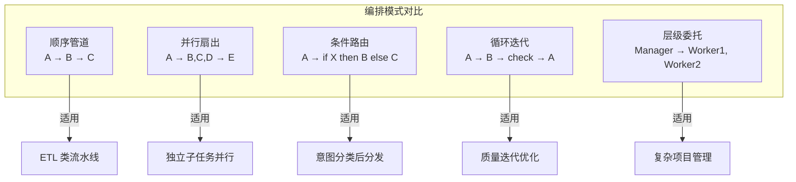
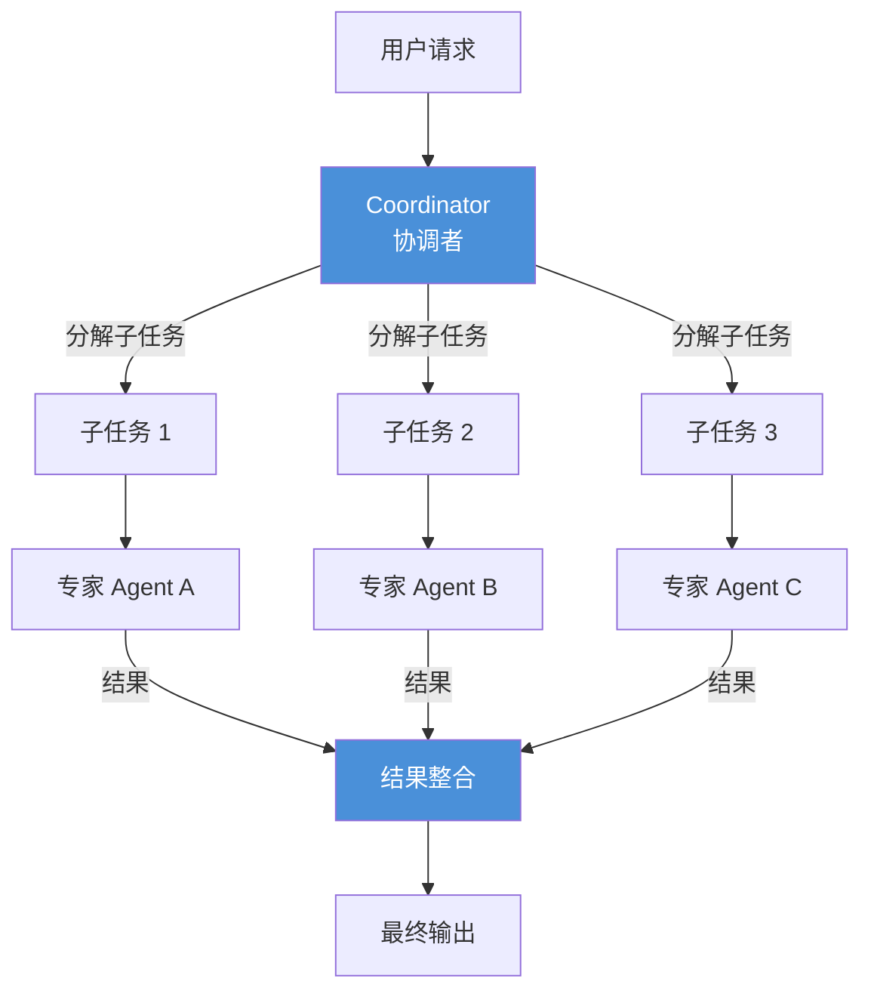
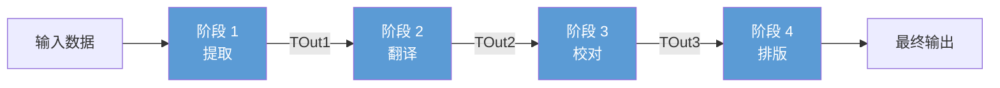
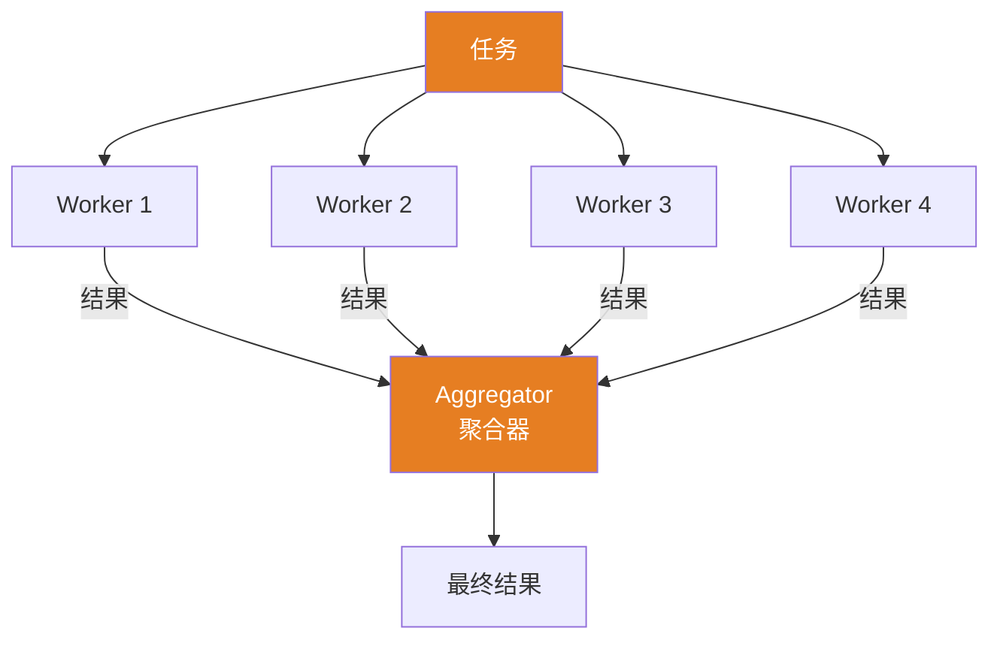
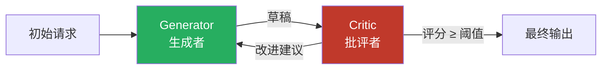
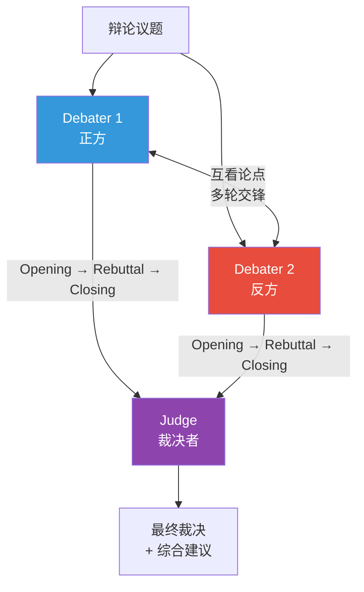
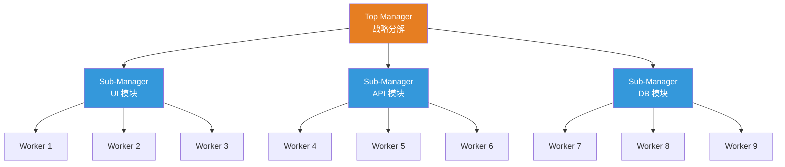
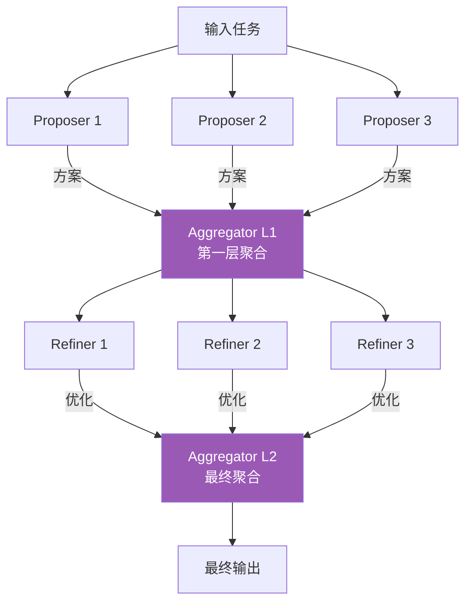
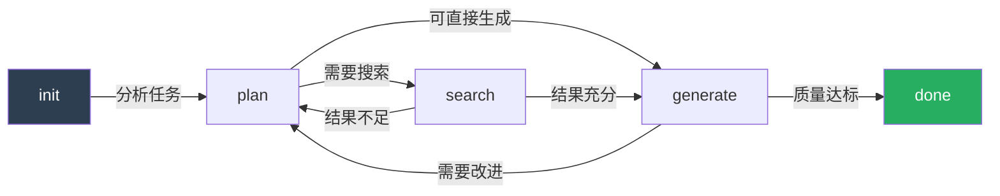
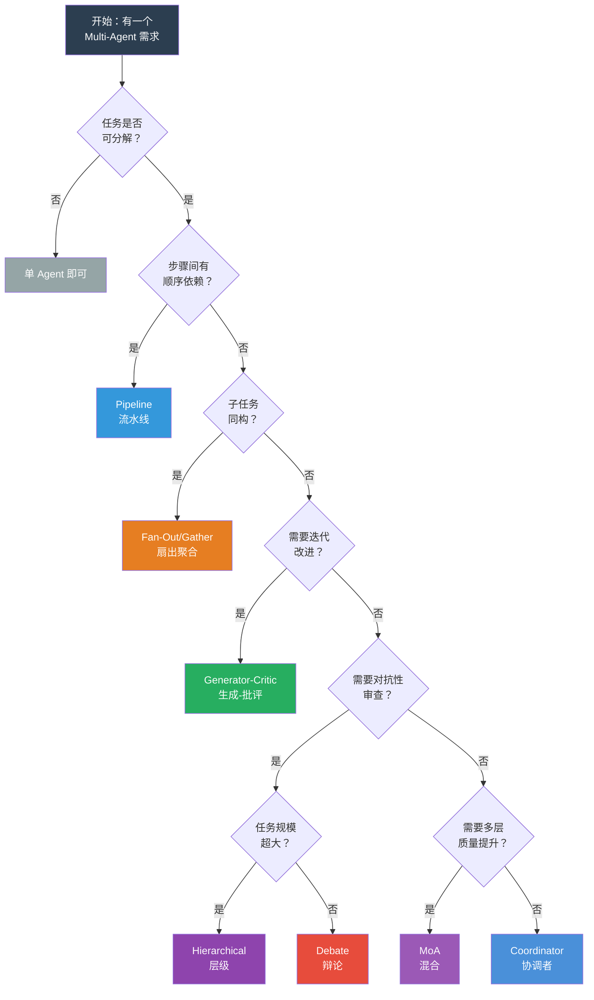

# 第 10 章 编排模式 — 九种经典 Multi-Agent 架构

第 9 章介绍了多 Agent 系统的三个基础原语：**委派（Delegation）**、**消息传递（Messaging）** 和 **共享状态（Shared State）**。这三个原语是所有多 Agent 协作的底层机制——委派决定"谁做什么"，消息传递解决"如何沟通"，共享状态回答"信息存在哪里"。掌握了这些原语之后，下一个问题是：**如何将多个 Agent 组织成一个有效的协作结构？** 这正是编排模式要解决的问题。

本章系统性地讲解九种经典的多 Agent 编排模式：Coordinator 协调者、Sequential Pipeline 流水线、Fan-Out/Gather 扇出聚合、Generator-Critic 生成-批评、Debate 辩论、Hierarchical 层级、Mixture of Agents 混合、模式组合以及自定义模式。每种模式本质上是对第 9 章三个原语的一种特定组合方式——Pipeline 强调顺序委派和链式消息传递，Fan-Out 强调并行委派和聚合状态，Hierarchical 则在树形结构中递归运用这三个原语。选择正确的编排模式是多 Agent 系统成败的关键——过于简单的模式无法应对复杂任务，过于复杂的模式则带来不必要的延迟和成本。本章为每种模式提供拓扑图、核心实现代码和适用场景分析。

前置依赖：第 9 章多 Agent 基础。

## 本章你将学到什么

1. 多 Agent 编排模式分别适合解决哪类任务
2. 为什么"更多 Agent"通常意味着更高的延迟、成本和调试难度
3. 如何从最简单模式出发，而不是一开始就过度设计
4. 如何判断自己需要的是多 Agent，还是单 Agent + Skill 路由

## 本章阅读原则

> 选择编排模式时，默认先问：**单 Agent 是否已经足够？**
>
> 多 Agent 不是成熟度的象征，而是一种带成本的架构选择。

---

## 10.1 模式总览



**图 10-1 五种核心编排模式**——选择编排模式的第一原则是"从最简单的开始"。顺序管道能解决的问题，不要用层级委托。过早引入复杂编排模式是多 Agent 系统最常见的过度设计。

### 10.1.1 九种模式对比表

阅读这张表时，不要先看"功能最强"的模式，而应优先看"能否用最低复杂度满足当前需求"。对大多数团队来说，前 3--4 种模式已经覆盖了绝大多数真实场景。

| # | 模式名称 | 拓扑 | 典型 Agent 数 | 最大推荐 Agent 数 | 通信开销 | 容错性 | 实现难度 | 最佳场景 |
|---|---------|------|-------------|-----------------|---------|-------|---------|---------|
| 1 | **Coordinator** 协调者 | 星形 | 3--8 | 15 | 中 | 中 | ★★☆ | 异构子任务分发 |
| 2 | **Sequential Pipeline** 流水线 | 链式 | 3--6 | 10 | 低 | 低 | ★☆☆ | 确定性多步处理 |
| 3 | **Fan-Out/Gather** 扇出聚合 | 扇形 | 3--10 | 50 | 高 | 高 | ★★☆ | 同类任务并行化 |
| 4 | **Generator-Critic** 生成-批评 | 环形 | 2--4 | 6 | 中 | 中 | ★★☆ | 质量迭代优化 |
| 5 | **Debate** 辩论 | 全连接 | 2--5 | 8 | 高 | 高 | ★★★ | 多视角决策 |
| 6 | **Hierarchical** 层级 | 树形 | 5--20 | 100+ | 中 | 高 | ★★★ | 大规模任务分解 |
| 7 | **Mixture of Agents** 混合 | 分层 | 4--12 | 30 | 高 | 高 | ★★★ | 质量最大化 |
| 8 | **模式组合** 嵌套 | 复合 | 视具体情况 | — | — | — | ★★★★ | 复杂业务系统 |
| 9 | **自定义** | 自由 | 任意 | — | — | — | ★★★★★ | 特殊需求 |

### 10.1.2 拓扑结构

九种模式的拓扑可概括为五大类：**星形**（Coordinator 居中分发）、**链式**（Pipeline 逐级传递）、**扇形**（Fan-Out 并行后聚合）、**环形**（Generator-Critic 反复迭代）和**树形**（Hierarchical 递归分解）。MoA 在扇形基础上叠加多层，Debate 则呈全连接拓扑。在实际系统中这些拓扑经常嵌套组合——例如 Coordinator 的某个子任务内部走 Pipeline，或 Fan-Out 的聚合阶段使用 Debate 投票。

### 10.1.3 模式组合指南

在实际生产系统中，很少只使用单一模式。但组合不意味着越复杂越好。以下组合应被理解为"当基础模式已经不足时的升级路径"，而不是默认方案：

| 外层模式 | 内层模式 | 组合效果 | 典型应用 |
|---------|---------|---------|---------|
| Coordinator | Fan-Out/Gather | 协调者将任务分发后，每个子任务再并行处理 | 多语言翻译审校 |
| Pipeline | Generator-Critic | 流水线中某个阶段使用生成-批评循环 | 内容生产流水线 |
| Hierarchical | Pipeline | 每个子管理者内部使用流水线处理 | 企业级文档处理 |
| Fan-Out/Gather | Debate | 收集多个结果后，通过辩论决定最终方案 | 方案评选 |
| Coordinator | Hierarchical | 顶层协调，子任务内部有层级管理 | 大型项目管理 |

### 10.1.4 基础类型定义

在深入各模式之前，先定义整章通用的基础类型。所有模式实现都基于这组类型构建，确保 Agent 间消息传递的一致性。

```typescript
// ---- 通用消息结构 ----
interface AgentMessage {
  role: "user" | "assistant" | "system" | "tool";
  content: string;
  metadata?: {
    agentId?: string;
    timestamp?: number;
    tokenUsage?: { prompt: number; completion: number };
    traceId?: string;          // 分布式追踪 ID
  };
}

// ---- Agent 抽象接口 ----
interface IAgent {
  readonly id: string;
  readonly capabilities: string[];   // 该 Agent 的专长标签
  run(messages: AgentMessage[]): Promise<AgentMessage>;
}

// ---- 编排结果 ----
interface OrchestratorResult<T = string> {
  success: boolean;
  output: T;
  totalDurationMs: number;
  totalTokenUsage: { prompt: number; completion: number };
  agentResults: TaskResult[];       // 各子任务明细
  traceId: string;
}

// ---- 子任务结果 ----
interface TaskResult {
  agentId: string;
  taskDescription: string;
  output: string;
  durationMs: number;
  tokenUsage: { prompt: number; completion: number };
  success: boolean;
  error?: string;
}

// ---- 任务上下文（跨 Agent 共享） ----
interface TaskContext {
  originalQuery: string;
  conversationHistory: AgentMessage[];
  sharedMemory: Map<string, unknown>;  // 共享键值存储
  budget: { maxTokens: number; usedTokens: number; maxDurationMs: number };
}

// ---- 重试策略 ----
interface RetryPolicy {
  maxRetries: number;
  baseDelayMs: number;
  backoffMultiplier: number;        // 指数退避乘数
}
```

---

## 10.2 Coordinator 协调者模式

> **设计决策：什么时候需要多 Agent？**
>
> 一个常见的误区是"越多 Agent 越好"。实际上，多 Agent 架构引入了显著的系统复杂度：Agent 间通信的延迟和 token 成本、状态一致性维护、错误传播和调试难度。经验法则是：**只有当单个 Agent 的 Prompt 超过 4000 token 或需要同时激活超过 15 个工具时，才考虑拆分为多 Agent**。在此之前，一个精心设计的单 Agent + Skill 路由系统几乎总是更好的选择。

### 10.2.1 模式概述

Coordinator（协调者）模式是最直觉的 Multi-Agent 架构：一个中心节点接收任务，将其分解为子任务，分配给专家 Agent 处理，最后整合结果。它类似于团队 leader 分配工作。

**核心思想**：集中式决策 + 分布式执行。



**图 10-2 Coordinator 星形拓扑** —— 协调者居中，负责任务分解、专家分配和结果整合。

### 10.2.2 核心实现

Coordinator 的核心流程分三步：（1）用 LLM 将用户任务分解为子任务列表；（2）根据专长匹配注册的专家 Agent，并行调度执行；（3）收集全部子任务结果后，由 LLM 进行结果整合。

```typescript
class Coordinator {
  private experts: Map<string, IAgent> = new Map();
  private fallbackAgent!: IAgent;
  private llm!: IAgent;

  registerExpert(expertise: string, agent: IAgent): void {
    this.experts.set(expertise, agent);
  }

  async orchestrate(
    query: string, ctx: TaskContext
  ): Promise<OrchestratorResult> {
    // 第 1 步：LLM 分解任务
    const subtasks = await this.decompose(query);

    // 第 2 步：匹配专家并行执行
    const promises = subtasks.map(async (task) => {
      const agent = this.experts.get(task.requiredExpertise);
      if (!agent) return this.fallbackAgent.run(
        [{ role: "user", content: task.description }]);
      return agent.run([{ role: "user", content: task.description }]);
    });
    const results = await Promise.allSettled(promises);

    // 第 3 步：整合结果
    const fulfilled = results
      .filter((r): r is PromiseFulfilledResult<AgentMessage> =>
        r.status === "fulfilled")
      .map(r => r.value.content);

    return this.synthesize(query, fulfilled, ctx);
  }

  private async decompose(query: string): Promise<SubTask[]> {
    // 调用 LLM 输出 JSON 格式子任务列表
    const response = await this.llm.run([{
      role: "system",
      content: `将任务分解为子任务，返回 JSON 数组。
        每项: { "description": "...", "requiredExpertise": "..." }
        最多 8 个子任务。`
    }, { role: "user", content: query }]);
    return JSON.parse(response.content);
  }
}
```

### 10.2.3 带记忆的高级 Coordinator

在实际系统中，Coordinator 应当记住哪些专家在特定任务上表现更好，逐步优化分配策略。实现方式是维护一个 `SpecialistPerformanceRecord` 记录表，包含 agentId、taskType、avgQualityScore、totalTasks 和 avgDurationMs 字段。每次子任务完成后，根据结果质量（可由 LLM 评分或用户反馈获取）更新对应专家的绩效记录。

在下一次任务分配时，Coordinator 不再随机或按固定规则选择专家，而是查询绩效记录，按 `avgQualityScore * reliabilityWeight` 加权排序后选择最优匹配。这种"学习型分配"在长期运行的系统中可以显著提升整体质量——实践中观察到经过 50-100 次任务后，分配准确率提升 15-25%。

### 10.2.4 错误处理：分解失败的应对

当 Coordinator 的任务分解出现错误时（如 LLM 返回非法 JSON、分解粒度不合理、某个子任务无匹配专家），需要有降级策略。推荐的三级降级方案：

1. **重试分解**：用更严格的 Prompt（附带示例和格式约束）重新请求 LLM 分解，最多重试 2 次；
2. **模板分解**：维护预定义的任务分解模板库（按任务类型索引），当 LLM 分解失败时回退到最匹配的模板；
3. **单 Agent 降级**：如果连模板分解也不适用，将整个任务交给能力最全面的单个 Agent 直接处理。

**适用场景**：
- 任务可以明确分解为若干异构子任务
- 需要一个"大脑"来决定分工策略
- 各子任务之间相对独立
- 子任务类型在设计时不完全确定

---

## 10.3 Sequential Pipeline 流水线模式

### 10.3.1 模式概述

Pipeline（流水线）模式将处理过程组织为一系列有序的阶段（Stage），数据从第一个阶段流向最后一个阶段，每个阶段的输出作为下一个阶段的输入。这是最简单、最可预测的编排模式——当你的任务有明确的先后步骤（如"提取 → 翻译 → 校对 → 排版"）时，Pipeline 几乎总是第一选择。

**核心思想**：确定性的顺序处理，关注点分离。



**图 10-3 Pipeline 链式拓扑** —— 数据从左到右逐阶段流转，每阶段输出类型与下一阶段输入类型严格匹配。

### 10.3.2 核心实现

Pipeline 实现的核心在于**泛型链式类型传递**——确保第 N 个阶段的输出类型与第 N+1 个阶段的输入类型在编译期匹配。

```typescript
interface PipelineStage<TIn, TOut> {
  name: string;
  process(input: TIn): Promise<TOut>;
  validate?(output: TOut): boolean;
}

interface StageReport {
  stageName: string;
  durationMs: number;
  success: boolean;
  error?: string;
}

class Pipeline {
  private stages: PipelineStage<any, any>[] = [];

  addStage<TIn, TOut>(stage: PipelineStage<TIn, TOut>): this {
    this.stages.push(stage);
    return this;
  }

  async execute<TFirst, TLast>(input: TFirst): Promise<{
    output: TLast;
    report: StageReport[];
  }> {
    let current: unknown = input;
    const report: StageReport[] = [];

    for (const stage of this.stages) {
      const start = Date.now();
      try {
        current = await stage.process(current);
        if (stage.validate && !stage.validate(current)) {
          throw new Error(`阶段 "${stage.name}" 校验失败`);
        }
        report.push({
          stageName: stage.name, durationMs: Date.now() - start,
          success: true,
        });
      } catch (error) {
        report.push({
          stageName: stage.name, durationMs: Date.now() - start,
          success: false, error: String(error),
        });
        throw error;  // 向上游报告，中断流水线
      }
    }
    return { output: current as TLast, report };
  }
}
```

### 10.3.3 条件分支流水线

真实场景中，流水线不总是线性的——某些阶段需要根据条件选择不同的处理路径。`ConditionalStage<TIn, TOut>` 封装了这一逻辑：它接收一个 `condition: (input: TIn) => string` 函数和一个 `branches: Map<string, PipelineStage<TIn, TOut>>` 分支表。执行时先求值条件函数得到分支名，再从分支表中取出对应阶段执行。

典型应用是内容翻译流水线中的语言检测阶段：根据检测到的源语言选择不同的翻译 Agent（中英翻译 Agent 和日英翻译 Agent 使用完全不同的 Prompt 和术语表）。

### 10.3.4 流水线监控与瓶颈检测

`PipelineMonitor` 累积多次执行的 `StageReport`，提供三项核心能力：（1）**瓶颈检测**——按阶段名聚合平均耗时，标记超过整体均值 2 倍的阶段为瓶颈；（2）**趋势分析**——对比最近 N 次执行的各阶段耗时变化，检测是否有阶段在劣化；（3）**报告生成**——输出 Markdown 格式的性能摘要表，包含各阶段的 P50/P95 延迟和成功率。

### 10.3.5 流式流水线

当处理大量数据项时，不必等所有项完成一个阶段再进入下一阶段——可以采用流式处理，让数据像水流一样逐项通过所有阶段。使用 `AsyncGenerator` 实现逐项流式处理：每个阶段的 `process` 方法接收一个 `AsyncIterable<TIn>` 并 `yield` 出 `TOut`，下游阶段在上游 yield 第一个结果时就开始处理，无需等待所有项完成。这种模式在批量文章处理、日志分析等场景中可以将端到端延迟降低 40-60%。

**适用场景**：
- 任务有明确的先后步骤（如：提取 → 翻译 → 校对 → 排版）
- 每个阶段可以独立开发和测试
- 数据在各阶段间有清晰的类型转换
- 需要监控每个阶段的性能

---

## 10.4 Fan-Out/Gather 扇出聚合模式

### 10.4.1 模式概述

Fan-Out/Gather 模式将一个任务分发给多个 Worker 并行处理，然后收集所有结果进行聚合。它是提升吞吐量和结果多样性的核心模式。

**核心思想**：并行发散 + 集中聚合。



**图 10-4 Fan-Out/Gather 扇形拓扑** —— 任务并行分发给多个 Worker，结果在 Aggregator 处汇聚。

### 10.4.2 核心实现

Fan-Out/Gather 的核心难点在于**容错聚合**——使用 `Promise.allSettled` 而非 `Promise.all`，确保单个 Worker 失败不阻塞其他 Worker，并支持按权重对结果进行加权聚合。

```typescript
interface WorkerConfig {
  agent: IAgent;
  weight: number;          // 结果聚合权重
  timeoutMs: number;       // 单 Worker 超时
}

class FanOutGather {
  constructor(
    private workers: WorkerConfig[],
    private aggregatorLLM: IAgent
  ) {}

  async execute(task: string): Promise<AgentMessage> {
    // Fan-Out：并行分发，每个 Worker 有独立超时
    const promises = this.workers.map(({ agent, timeoutMs }) =>
      Promise.race([
        agent.run([{ role: "user", content: task }]),
        this.timeout(timeoutMs),
      ])
    );
    const settled = await Promise.allSettled(promises);

    // 过滤成功结果并附带权重
    const weighted = settled
      .map((r, i) => ({ result: r, weight: this.workers[i].weight }))
      .filter((item): item is {
        result: PromiseFulfilledResult<AgentMessage>;
        weight: number;
      } => item.result.status === "fulfilled");

    // Gather：将加权结果交给 Aggregator LLM 综合
    const summaryPrompt = weighted
      .map((w, i) =>
        `[结果${i + 1}, 权重${w.weight}]\n${w.result.value.content}`)
      .join("\n---\n");

    return this.aggregatorLLM.run([{
      role: "user",
      content: `综合以下加权结果，生成最终答案：\n${summaryPrompt}`,
    }]);
  }

  private timeout(ms: number): Promise<never> {
    return new Promise((_, reject) =>
      setTimeout(() => reject(new Error("Worker 超时")), ms));
  }
}
```

### 10.4.3 选择性扇出

并非所有任务都需要发给所有 Worker——智能选择性扇出可以节省成本。先用一次轻量 LLM 调用分析任务内容，判断哪些 Worker 与当前任务相关（返回相关 Worker ID 列表），只向被选中的 Worker 发送请求。例如，一个多语言翻译系统中，中文翻译任务无需发给法语 Worker。这种策略在 Worker 数量超过 5 个时可以节省 30-50% 的 token 成本。

### 10.4.4 渐进式聚合（Progressive Gather）

不必等所有 Worker 完成——可以在 Worker 陆续完成时渐进式返回部分结果。通过事件回调机制实现：每当一个 Worker 返回结果，触发 `onPartialResult` 事件，调用方可以立即获得当前已有结果的聚合摘要。当满足"足够好"条件（如已收到 3/4 Worker 的结果且质量评分 > 阈值）时，可以提前结束而无需等待最慢的 Worker。这种模式特别适合用户侧需要实时反馈的场景（如搜索结果流式展示）。

### 10.4.5 结果去重

当多个 Worker 对同一任务给出相似结果时，需要去重以避免冗余。使用 LLM 对每对结果进行语义相似度判断（简单二值判断：是否语义等价），然后在等价组中保留权重最高或质量评分最高的结果。对于 Worker 数量较多的场景（>10），可以先用 embedding 余弦相似度快速初筛（阈值 0.9），再用 LLM 精确判断，降低 LLM 调用次数。

**适用场景**：
- 同一个问题需要多个视角的回答
- 大量同构子任务可以并行处理
- 需要在多个结果中选出最佳方案
- 需要对同一数据进行多维度分析

---

## 10.5 Generator-Critic 生成-批评模式

> **模式卡片**
>
> | 属性 | 说明 |
> |------|------|
> | **拓扑** | 环形（Generator ↔ Critic 循环） |
> | **角色** | Generator 负责生成内容，Critic 负责评审并给出改进建议 |
> | **核心思想** | 生成与评审分离，通过迭代逼近最优质量 |
> | **终止条件** | 质量评分 ≥ 阈值，或达到最大迭代次数 |
> | **适用场景** | 内容创作反复打磨、存在客观质量标准、单次生成无法达标 |
> | **不适用场景** | 无明确评估标准、对延迟敏感（每轮迭代 ≈ 2x LLM 调用） |
> | **典型配置** | 最大 3-5 轮迭代，质量阈值 0.8，温度 Generator 0.7 / Critic 0.2 |



**图 10-5 Generator-Critic 环形拓扑** —— 生成者和批评者形成反馈环，迭代至质量达标或次数耗尽。

### 10.5.1 核心实现

Generator-Critic 模式的关键在于**迭代控制**和**收敛检测**——不仅要在质量达标时停止，还要检测连续改进幅度，避免无效迭代浪费 token。

```typescript
interface CriticResult {
  score: number;           // 0-1 综合评分
  suggestions: string[];   // 改进建议列表
  dimensions: { name: string; score: number }[];
}

class GeneratorCritic {
  private lastSuggestions = "";

  constructor(
    private generator: IAgent,
    private critic: IAgent,
    private config: {
      maxIterations: number;    // 最大迭代次数，推荐 3-5
      qualityThreshold: number; // 达标阈值，推荐 0.8
      convergenceDelta: number; // 收敛判定阈值，推荐 0.02
    }
  ) {}

  async execute(task: string): Promise<{
    output: string; iterations: number;
  }> {
    let draft = "";
    let prevScore = 0;

    for (let i = 0; i < this.config.maxIterations; i++) {
      // 生成（首轮用原始任务，后续附带改进建议）
      const genPrompt = i === 0
        ? task
        : `根据以下建议改进：\n${draft}\n建议：${this.lastSuggestions}`;
      const genResult = await this.generator.run(
        [{ role: "user", content: genPrompt }]);
      draft = genResult.content;

      // 批评：返回评分和改进建议
      const criticResult = await this.evaluate(draft, task);

      // 终止条件 1：质量达标
      if (criticResult.score >= this.config.qualityThreshold) {
        return { output: draft, iterations: i + 1 };
      }
      // 终止条件 2：收敛停滞（连续提升不超过 delta）
      if (i > 0 &&
          criticResult.score - prevScore < this.config.convergenceDelta) {
        return { output: draft, iterations: i + 1 };
      }
      prevScore = criticResult.score;
      this.lastSuggestions = criticResult.suggestions.join("\n");
    }
    return { output: draft, iterations: this.config.maxIterations };
  }

  private async evaluate(
    draft: string, task: string
  ): Promise<CriticResult> {
    const result = await this.critic.run([{
      role: "user",
      content: `评审以下内容（任务：${task}）。返回 JSON：
        { "score": 0-1, "suggestions": [...], "dimensions": [...] }
        内容：${draft}`,
    }]);
    return JSON.parse(result.content);
  }
}
```

### 10.5.2 关键设计要点

1. **多维度评审面板（Critic Panel）**：单个 Critic 可能无法覆盖所有质量维度。引入多个 Critic，每位关注一个维度（如 accuracy、clarity、completeness），各自独立打分后加权聚合。每个维度定义 `CriticDimension`（name、description、weight、threshold），Critic 返回 `CriticScore`（dimension、score 0-1、suggestions[]）。

2. **收敛检测**：追踪每轮的综合评分，如果连续 2 轮评分提升不超过 0.02，判定为收敛停滞，提前终止迭代避免浪费 token。

3. **迭代上下文管理**：每轮 Generator 收到的 Prompt 包含上一版本的内容和 Critic 的改进建议列表。建议按维度分组呈现，避免 Generator 的上下文过长。超过 3 轮后只保留最近 2 轮的建议。

4. **带工具调用的 Critic**：高级场景中 Critic 不仅靠推理评审，还能调用外部工具验证（如搜索引擎核实事实性声明、代码执行器验证代码正确性）。工具调用结果作为评审依据的一部分，提升评审的客观性。

**适用场景**：
- 内容创作需要反复打磨（文章、代码、方案）
- 存在可量化的质量标准
- 单次生成质量不足，需要迭代改进
- 可接受 2-3 倍的延迟换取质量提升

---

## 10.6 Debate 辩论模式

> **模式卡片**
>
> | 属性 | 说明 |
> |------|------|
> | **拓扑** | 全连接（所有 Debater 互相可见论点）+ Judge 裁决节点 |
> | **角色** | 多个 Debater（各持不同立场）+ 1 个 Judge |
> | **核心思想** | 对抗性探索 + 第三方裁决 |
> | **流程** | Opening 开场陈述 → Rebuttal 反驳 → Closing 总结 → Judge 综合裁决 |
> | **适用场景** | 决策问题无明确正确答案、需全面考虑 pros & cons、避免群体思维 |
> | **不适用场景** | 有客观正确答案的事实性问题、对延迟敏感（多轮交互成本高） |
> | **典型配置** | 2-3 个 Debater，3 轮辩论，Judge 温度 0.1 |



**图 10-6 Debate 全连接拓扑** —— 辩手互相看到论点进行多轮交锋，Judge 综合裁决。

### 10.6.1 核心实现

Debate 模式的核心在于**结构化辩论编排**——维护辩论状态机，按固定阶段（Opening → Rebuttal → Closing）推进，每位 Debater 的 Prompt 包含完整的辩论历史。

```typescript
type DebatePhase = "opening" | "rebuttal" | "closing";

interface DebateConfig {
  topic: string;
  debaters: { agent: IAgent; stance: string }[];
  judge: IAgent;
  rounds: number;         // 推荐 2-3
}

class StructuredDebate {
  private transcript: {
    debaterId: string; phase: DebatePhase; content: string;
  }[] = [];

  async execute(config: DebateConfig): Promise<{
    winner: string | "draw"; synthesis: string;
  }> {
    const phases: DebatePhase[] = ["opening", "rebuttal", "closing"];

    for (const phase of phases) {
      for (const debater of config.debaters) {
        const history = this.transcript
          .map(t => `[${t.debaterId}-${t.phase}] ${t.content}`)
          .join("\n");
        const result = await debater.agent.run([{
          role: "system",
          content: `你是辩论${debater.stance}方。当前阶段：${phase}。`,
        }, {
          role: "user",
          content: `议题：${config.topic}\n辩论记录：\n${history}\n请发言：`,
        }]);
        this.transcript.push({
          debaterId: debater.agent.id,
          phase,
          content: result.content,
        });
      }
    }

    // Judge 综合裁决
    const fullTranscript = this.transcript
      .map(t => `[${t.debaterId}-${t.phase}] ${t.content}`)
      .join("\n");
    const verdict = await config.judge.run([{
      role: "user",
      content: `根据辩论记录做出裁决，输出 JSON：
        { "winner": "...", "reasoning": "...", "synthesis": "..." }
        辩论记录：\n${fullTranscript}`,
    }]);
    return JSON.parse(verdict.content);
  }
}
```

### 10.6.2 关键设计要点

1. **立场分配策略**：Debater 的立场可以手动指定（如"支持方案 A"vs"支持方案 B"），也可以让 LLM 自动发现多个合理立场。后者适用于开放性问题。

2. **论点评分机制**：每轮结束后 Judge 对各 Debater 的论点进行维度评分（逻辑性、证据力度、反驳质量），累积评分影响最终裁决权重。

3. **Judge 综合裁决输出**：Judge 的最终裁决包含 `winner`（或 "draw"）、`reasoning`（裁决理由）和 `synthesis`（综合各方最佳论点的最终建议）。Synthesis 是最有价值的输出——它吸收了各方优点，优于任何单一立场。

**适用场景**：
- 决策问题无明确正确答案
- 需要全面考虑 pros & cons
- 避免群体思维和确认偏差
- 方案评选、风险评估、战略决策

---

## 10.7 Hierarchical 层级模式

> **模式卡片**
>
> | 属性 | 说明 |
> |------|------|
> | **拓扑** | 树形（Manager → Sub-Manager → Worker 多级） |
> | **核心思想** | 递归分解 + 分层管控 + 逐级汇报 |
> | **适用场景** | 超大规模任务（单层 Coordinator 无法处理）、需要权限层级、子任务还需进一步分解 |
> | **不适用场景** | 任务规模小（<5 Agent）、需要快速响应 |
> | **典型配置** | 2-3 层深度，每层 3-5 节点，总 Agent 数 10-50 |



**图 10-7 Hierarchical 树形拓扑** —— Top Manager 做战略分解，Sub-Manager 做战术分解，Worker 执行具体任务。

### 10.7.1 核心实现

Hierarchical 模式的核心在于**递归任务分解**——每个 Manager 节点接收任务后，判断是否需要继续分解，形成任务树后自底向上执行和汇报。

```typescript
interface TaskNode {
  id: string;
  description: string;
  assignedAgent: IAgent;
  children: TaskNode[];
  depth: number;
  result?: TaskResult;
}

class HierarchicalOrchestrator {
  constructor(
    private maxDepth: number = 3,
    private budgetPerLevel: Map<number, {
      tokens: number; timeoutMs: number;
    }>
  ) {}

  async execute(
    task: string, manager: IAgent, depth = 0
  ): Promise<string> {
    if (depth >= this.maxDepth) {
      // 叶节点：直接执行
      const result = await manager.run(
        [{ role: "user", content: task }]);
      return result.content;
    }

    // 当前层 Manager 分解任务
    const subtasks = await this.decompose(manager, task);

    // 递归执行子任务（可并行）
    const budget = this.budgetPerLevel.get(depth + 1);
    const results = await Promise.allSettled(
      subtasks.map(sub =>
        Promise.race([
          this.execute(sub.description, sub.assignedAgent, depth + 1),
          this.timeout(budget?.timeoutMs ?? 30_000),
        ])
      )
    );

    // 逐级汇报：Manager 整合子结果
    const summaries = results
      .map((r, i) => r.status === "fulfilled"
        ? `[${subtasks[i].id}] ${r.value}`
        : `[${subtasks[i].id}] 失败`)
      .join("\n");

    const synthesis = await manager.run([{
      role: "user",
      content: `整合以下子任务结果：\n${summaries}`,
    }]);
    return synthesis.content;
  }

  private timeout(ms: number): Promise<never> {
    return new Promise((_, reject) =>
      setTimeout(() => reject(new Error("超时")), ms));
  }
}
```

### 10.7.2 关键设计要点

1. **横向协调协议**：同级 Agent 之间有时需要直接沟通而不经上级中转。维护一个消息总线，允许同一层级的 Agent 发送 `LateralMessage`（包含 fromAgentId、toAgentId、content、priority）。典型用例是 UI Sub-Manager 需要知道 API Sub-Manager 定义的接口格式。

2. **结果逐级汇报**：每个子节点完成后向上级汇报结果，上级整合后继续向更上级汇报。整合过程包含质量检查——如果某个子任务质量不达标，上级可以要求重做或分配给其他子节点。

3. **权限与预算管控**：每一层有独立的 token 预算和超时限制。上级从自身预算中划拨给子节点，防止任何子树超支。

**适用场景**：
- 超大规模任务（10+ Agent 协作）
- 任务需要多级分解（如企业级项目管理）
- 需要权限隔离和预算管控
- 子任务之间有层级关系

---

## 10.8 Mixture of Agents (MoA) 混合 Agent 模式

> **模式卡片**
>
> | 属性 | 说明 |
> |------|------|
> | **拓扑** | 分层（多层 Proposer → Aggregator → Refiner 叠加） |
> | **核心思想** | 层叠聚合，每一层在前一层基础上改进 |
> | **论文参考** | Together AI "Mixture-of-Agents Enhances Large Language Model Capabilities" (2024) |
> | **适用场景** | 质量最大化场景、预算充裕、可接受较高延迟 |
> | **不适用场景** | 成本敏感、低延迟要求 |
> | **典型配置** | 2-3 层 × 3 Agent/层，最终一个 Aggregator |



**图 10-8 MoA 分层拓扑** —— 多层 Proposer-Aggregator-Refiner 叠加，逐层提升质量。

### 10.8.1 核心实现

MoA 的核心在于**多层聚合管线**——每一层由多个并行 Agent 产出方案，Aggregator 综合后传递给下一层继续优化。

```typescript
interface MoALayerConfig {
  agents: IAgent[];        // 该层的并行 Agent
  aggregator: IAgent;      // 该层的聚合 Agent
}

class MixtureOfAgents {
  constructor(
    private layers: MoALayerConfig[],
    private earlyStopThreshold: number = 0.9
  ) {}

  async execute(task: string): Promise<{
    output: string; layersUsed: number;
  }> {
    let currentInput = task;

    for (let i = 0; i < this.layers.length; i++) {
      const layer = this.layers[i];

      // 该层所有 Agent 并行处理
      const results = await Promise.allSettled(
        layer.agents.map(agent =>
          agent.run([{ role: "user", content: currentInput }])
        )
      );
      const proposals = results
        .filter((r): r is PromiseFulfilledResult<AgentMessage> =>
          r.status === "fulfilled")
        .map(r => r.value.content);

      // Aggregator 综合本层结果
      const aggregated = await layer.aggregator.run([{
        role: "user",
        content: `综合以下 ${proposals.length} 个方案：
          ${proposals.map((p, j) => `\n[方案${j + 1}]\n${p}`).join("\n")}`,
      }]);

      // 提前终止：如果质量已达标，跳过后续层
      const quality = await this.evaluateQuality(aggregated.content);
      if (quality >= this.earlyStopThreshold) {
        return { output: aggregated.content, layersUsed: i + 1 };
      }
      currentInput = aggregated.content;
    }
    return { output: currentInput, layersUsed: this.layers.length };
  }

  private async evaluateQuality(content: string): Promise<number> {
    // 质量评估逻辑（可用 LLM 打分或规则判定）
    return 0;  // 占位，实际实现需调用评估 Agent
  }
}
```

### 10.8.2 关键设计要点

1. **成本-质量权衡**：MoA 的 token 消耗随层数和每层 Agent 数呈乘法增长。实践表明质量提升在前 2-3 层最为显著，之后边际收益递减。

2. **提前终止**：每层 Aggregation 后评估质量，如果已达标则跳过后续层级。

3. **异构模型组合**：不同层可以使用不同模型——Proposer 层用高创造力模型（如 Claude Opus），Refiner 层用高精确性模型（如 GPT-4），Aggregator 用综合能力模型。

> **实践建议**：推荐配置为 2 层 × 3 个 Agent，在成本和质量之间取得较好平衡。

**适用场景**：
- 质量是第一优先级，预算充裕
- 需要综合多个模型的优势
- 可接受较高延迟（20-45 秒）
- 高价值任务（如关键文档生成、重要决策支持）

---

## 10.9 模式组合与嵌套

### 10.9.1 为什么需要组合模式？

实际生产系统中的任务往往过于复杂，无法用单一编排模式解决。例如一个"AI 驱动的研究报告系统"可能需要：
1. **Coordinator** 分解研究主题为子课题
2. **Fan-Out/Gather** 并行搜索多个子课题
3. **Generator-Critic** 反复打磨每个章节
4. **Pipeline** 将搜索 → 撰写 → 校审串联起来

模式组合的关键在于：**将一种模式的某个节点替换为另一种模式的完整实例**。

### 10.9.2 组合规则

| 规则 | 说明 | 示例 |
|------|------|------|
| **嵌套深度限制** | 组合深度不超过 3 层，否则调试极其困难 | Coordinator → Fan-Out → Pipeline (3层已是上限) |
| **类型一致性** | 内层模式的输入/输出类型必须匹配外层的期望 | Pipeline 阶段的 TOut 必须匹配下一阶段的 TIn |
| **超时传递** | 外层超时应大于所有内层超时之和 | 如果内层 Pipeline 超时 30s，外层至少 60s |
| **错误冒泡** | 内层失败应向外层报告，而非静默吞掉 | 内层 Fan-Out 部分失败，外层 Coordinator 需知晓 |
| **可观测性** | 每层都应输出 metrics，便于定位问题 | 嵌套的 PipelineReport 应包含子模式的报告 |

### 10.9.3 核心实现

模式组合的核心在于**统一接口**——每种模式都实现 `IOrchestrator` 接口，使得模式可以像乐高积木一样自由组合。

```typescript
interface IOrchestrator {
  execute(task: string, ctx: TaskContext): Promise<OrchestratorResult>;
}

class CompositeOrchestrator implements IOrchestrator {
  constructor(
    private outer: IOrchestrator,
    private innerFactory: (subtask: string) => IOrchestrator
  ) {}

  async execute(
    task: string, ctx: TaskContext
  ): Promise<OrchestratorResult> {
    // 外层分解任务
    const outerResult = await this.outer.execute(task, ctx);

    // 对每个子结果用内层模式进一步处理
    const refinedResults = await Promise.allSettled(
      outerResult.agentResults.map(sub => {
        const inner = this.innerFactory(sub.taskDescription);
        return inner.execute(sub.output, ctx);
      })
    );

    // 整合内层结果
    return this.merge(outerResult, refinedResults);
  }

  private merge(
    outer: OrchestratorResult,
    inner: PromiseSettledResult<OrchestratorResult>[]
  ): OrchestratorResult {
    // 整合逻辑：合并 metrics、汇总成功/失败
    return outer; // 简化示意
  }
}
```

### 10.9.4 组合示例：AI 研究助手系统

以 AI 研究助手为例，展示 Coordinator + Fan-Out/Gather + Generator-Critic 三层嵌套的设计。外层 Coordinator 将"撰写关于 X 的研究报告"分解为若干子课题；每个子课题通过 Fan-Out 并行调用 3 个搜索 Agent 收集资料，Gather 后合并为课题摘要；然后每个章节进入 Generator-Critic 循环，Generator 根据课题摘要撰写章节，Critic 从准确性和可读性两个维度评审，迭代 2-3 轮后输出最终章节；最后 Coordinator 将所有章节整合为完整报告。

这个组合中，Coordinator 的超时设置为 300s（涵盖内部所有子流程），Fan-Out 的超时为 30s/Worker，Generator-Critic 的超时为 60s/轮 × 3 轮。错误处理采用"部分降级"策略：如果某个子课题的 Fan-Out 部分 Worker 失败，用已有结果继续；如果某个章节的 Generator-Critic 未在迭代限制内达标，使用最后一版。

### 10.9.5 Anti-Patterns：组合模式的常见错误

| 反模式 | 问题 | 修正方案 |
|--------|------|---------|
| **过度嵌套（"洋葱架构"）** | 5+ 层嵌套导致超时难以控制、错误难以追踪 | 限制嵌套 ≤ 3 层；如果超过，重新审视任务分解方式 |
| **统一温度设置** | 所有角色使用相同 temperature 导致生成者不够创造、评审者不够严格 | 角色化温度：Generator 0.7、Critic 0.1、Aggregator 0.3、Debater 0.6 |
| **无超时传递** | 内层无限等待拖垮外层 | 每层设独立超时，外层 > 内层之和 |
| **错误静默吞没** | 内层失败被 catch 但不上报，外层以为成功 | 所有层级的错误必须冒泡或记录到 metrics |
| **过多 Agent 共享上下文** | 所有 Agent 看到完整上下文导致 token 爆炸 | 每个 Agent 只看到与其任务相关的上下文子集 |

**适用场景**：
- 单一模式无法覆盖完整业务流程
- 不同阶段适合不同编排策略
- 需要灵活组装和替换子模式

---

## 10.10 自定义模式

当九种标准模式及其组合仍无法满足特殊需求时，可以基于 `IOrchestrator` 接口构建自定义编排逻辑。自定义模式的核心实现思路是：在编排器内部维护一个状态机，根据当前状态和 Agent 返回结果动态决定下一步操作。



**图 10-9 自定义状态机拓扑** —— 基于状态机的动态编排，根据运行时条件灵活切换策略。

```typescript
class CustomOrchestrator implements IOrchestrator {
  private stateHandlers: Map<string,
    (ctx: TaskContext) => Promise<string>> = new Map();

  registerState(
    name: string,
    handler: (ctx: TaskContext) => Promise<string>
  ): void {
    this.stateHandlers.set(name, handler);
  }

  async execute(
    task: string, ctx: TaskContext
  ): Promise<OrchestratorResult> {
    let currentState = "init";
    const maxTransitions = 20;  // 防止无限循环

    for (let i = 0; i < maxTransitions; i++) {
      const handler = this.stateHandlers.get(currentState);
      if (!handler) throw new Error(`未注册状态: ${currentState}`);
      currentState = await handler(ctx);
      if (currentState === "done") break;
    }
    return this.buildResult(ctx);
  }

  private buildResult(ctx: TaskContext): OrchestratorResult {
    return {
      success: true,
      output: ctx.sharedMemory.get("finalOutput") as string,
      totalDurationMs: 0, totalTokenUsage: { prompt: 0, completion: 0 },
      agentResults: [], traceId: "",
    };
  }
}
```

**适用场景**：
- 编排逻辑高度动态，无法预定义固定拓扑
- 需要基于运行时条件频繁切换策略
- 特殊领域的独特协作模式

---

## 10.11 模式选择决策树

面对一个具体的 Multi-Agent 需求，如何选择合适的编排模式？以下决策树帮助你系统地做出选择：



**图 10-10 模式选择决策树** —— 从"任务是否可分解"开始，逐步缩小到最合适的模式。默认从最简单的模式开始，只在证明不够时才引入复杂模式。

### 10.11.1 快速参考卡

| 场景关键词 | 推荐模式 |
|-----------|---------|
| "先...再..." | Pipeline 流水线 |
| "同时..." | Fan-Out/Gather 扇出聚合 |
| "改到满意为止" | Generator-Critic 生成-批评 |
| "正反方辩论" | Debate 辩论 |
| "分给各部门" | Coordinator 协调者 |
| "层层分解" | Hierarchical 层级 |
| "集思广益取精华" | MoA 混合 |
| "先搜再写" | Coordinator + Fan-Out + GenCritic (组合) |
| "大规模项目" | Hierarchical + Pipeline (组合) |
| "方案评选" | Fan-Out + Debate (组合) |

### 10.11.2 性能基准参考

以下数据基于典型配置（GPT-4 class 模型，标准延迟），仅供参考：

| 模式 | 典型延迟 | Token 消耗倍数 | 质量提升 | 适合的 SLA |
|------|---------|---------------|---------|-----------|
| Pipeline (4 stages) | 8-15s | 4x | +10-20% | < 20s |
| Coordinator (5 Agents) | 10-25s | 5-8x | +15-25% | < 30s |
| Fan-Out (4 workers) | 5-10s | 4x | +10-15% | < 15s |
| Generator-Critic (3 iter) | 15-30s | 6-10x | +20-40% | < 45s |
| Debate (3 rounds) | 20-40s | 8-12x | +15-30% | < 60s |
| Hierarchical (3 tiers) | 30-60s | 10-20x | +25-40% | < 90s |
| MoA (3x3) | 20-45s | 10-15x | +25-45% | < 60s |

### 10.11.3 额外决策因素

除了任务本身的特征，选择模式时还应考虑：

**预算约束**：
- Token 预算有限时，优先选 Pipeline / Coordinator（消耗可控）
- 预算充裕且追求质量时，可考虑 MoA / Debate

**响应时间要求**：
- 需要实时响应（< 5s）：Pipeline（流式）或预计算
- 允许中等延迟（5-30s）：Coordinator / Fan-Out
- 允许长时间处理（> 30s）：Hierarchical / MoA / 模式组合

**团队经验**：
- 新手团队：Pipeline / Coordinator（简单可控，便于调试）
- 有经验的团队：Hierarchical / MoA / 模式组合

**可观测性需求**：
- Pipeline 天然支持阶段级监控
- Fan-Out 可以逐 Worker 追踪
- Hierarchical 需要较完善的任务树可视化

## 10.12 Anthropic 编排模式参考

2024 年 12 月，Anthropic 发布了「Building Effective Agents」技术博客，提出了一套从简单到复杂的 Agent 编排分类体系。与前面章节介绍的多 Agent 编排模式不同，Anthropic 的框架更聚焦于**单 Agent 内部的工作流组织方式**，并明确区分了 **Workflow（预定义编排）** 和 **Agent（自主决策）** 两个层次。这套分类对理解"何时需要多 Agent、何时单 Agent 工作流就足够"具有重要参考价值。

> **术语说明**：Anthropic 将 LLM 驱动的预定义流程称为 **Workflow**，将拥有自主工具调用能力的系统称为 **Agent**。本节沿用其术语体系。

### 10.12.1 Prompt Chaining（提示链）

**核心思想**：将任务分解为固定步骤序列，每一步的 LLM 输出作为下一步的输入。步骤之间可以插入程序化的"门控"检查（gate check），确保中间结果符合质量要求后再继续。

**适用场景**：任务可自然分解为固定子步骤；愿意用更高延迟换取更高准确性；每一步需要不同的 prompt 或模型参数。

**与本书模式的映射**：对应 §10.3 Sequential Pipeline 流水线模式的轻量化版本。

### 10.12.2 Routing（路由）

**核心思想**：用一次 LLM 调用对输入进行分类，然后将请求路由到不同的专用处理流程。分类与处理分离，各分支可以独立优化 prompt。

**适用场景**：输入类型多样，需要不同处理策略；分类准确度可通过 LLM 可靠达成；各类别的处理逻辑差异显著。

**与本书模式的映射**：对应 §10.2 Coordinator 模式中的路由子模块，以及 §10.3 Pipeline 模式中的条件分支（§10.3.3）。

### 10.12.3 Parallelization（并行化）

**核心思想**：同时运行多个 LLM 调用，然后程序化地聚合结果。两种子模式：**Sectioning（分区）** 将任务拆分为独立子任务并行处理；**Voting（投票）** 将同一任务交给多个 LLM 实例通过投票决定结果。

**与本书模式的映射**：对应 §10.4 Fan-Out/Gather 扇出聚合模式。Sectioning 对应异构扇出，Voting 对应 §10.6 Debate 模式的简化版。

### 10.12.4 Orchestrator-Workers（编排者-工作者）

**核心思想**：中央编排者 LLM 动态分析任务，决定需要调用哪些子任务以及如何分配。与并行化的区别在于——子任务不是预定义的，而是由编排者根据输入动态规划。

**与本书模式的映射**：直接对应 §10.2 Coordinator 协调者模式。

### 10.12.5 Evaluator-Optimizer（评估者-优化者）

**核心思想**：一个 LLM 生成输出，另一个 LLM 评估输出质量并提供反馈，循环迭代直到评估者满意。

**与本书模式的映射**：直接对应 §10.5 Generator-Critic 生成-批评模式。

### 10.12.6 Autonomous Agent（自主 Agent）

**核心思想**：当任务复杂到无法用上述任何预定义工作流模式解决时，赋予 Agent 完整的工具调用能力和自主决策循环——Agent 自行规划、执行、观察结果、调整策略，直到任务完成或达到停止条件。

**关键风险**：自主 Agent 的错误会在循环中累积。Anthropic 建议在沙箱环境中运行、设置适当的停止条件（最大迭代次数、超时、成本上限），并通过人机协作（human-in-the-loop）降低风险。

### 10.12.7 模式选择：从 Workflow 到 Agent

Anthropic 的核心建议是**从最简单的方案开始，只在必要时增加复杂度**。大多数实际项目中，Prompt Chaining + Routing + Parallelization 的组合就能解决 80% 的需求。只有在这些简单模式明显不够用时，才考虑引入 Orchestrator-Workers 或完全自主的 Agent。这与本书 §10.11 模式选择决策树的"从简单开始"原则完全一致。

---

## 10.13 本章小结

### 10.13.1 核心要点回顾

本章系统介绍了九种 Multi-Agent 编排模式，从简单到复杂依次为：

1. **Coordinator 协调者模式** -- 星形拓扑，中心化决策，最通用的起点。
   关键实现要素：LLM 任务分解、动态专家匹配、结果验证、带记忆的分配优化。

2. **Sequential Pipeline 流水线模式** -- 链式拓扑，确定性顺序处理。
   关键实现要素：类型安全的泛型链、条件分支、性能监控、流式处理。

3. **Fan-Out/Gather 扇出聚合模式** -- 扇形拓扑，并行提升吞吐。
   关键实现要素：加权聚合、选择性扇出、渐进式返回、语义去重。

4. **Generator-Critic 生成-批评模式** -- 环形拓扑，迭代质量优化。
   关键实现要素：多维度评审面板、收敛检测、工具辅助验证。

5. **Debate 辩论模式** -- 全连接拓扑，对抗性探索。
   关键实现要素：角色立场分配、结构化辩论流程、论点评分、证据引用。

6. **Hierarchical 层级模式** -- 树形拓扑，大规模分治。
   关键实现要素：递归任务分解、权限层级、上级审批、横向协调。

7. **Mixture of Agents 混合模式** -- 分层拓扑，质量最大化。
   关键实现要素：多层 Proposer-Aggregator-Refiner、成本-质量权衡、提前终止。

8. **模式组合** -- 复合拓扑，应对真实复杂系统。
   关键实现要素：嵌套规则、超时传递、错误冒泡、角色化 LLM 配置。

9. **自定义模式** -- 自由拓扑，基于状态机的动态编排。
   关键实现要素：状态注册、转换上限、统一 IOrchestrator 接口。

### 10.13.2 模式选择指南

选择编排模式的核心原则：**从简单开始，只在证明不够时才引入复杂度。** 大多数团队使用 Pipeline + Coordinator 就能覆盖 80% 的真实场景。只有在单一模式明确不足时，才考虑 Generator-Critic、Debate 或模式组合。

### 10.13.3 设计原则

Multi-Agent 编排的七项核心设计原则：

| # | 原则 | 说明 |
|---|------|------|
| 1 | **从简单开始** | 先用 Coordinator/Pipeline，只在证明不够时才引入复杂模式 |
| 2 | **可观测性优先** | 每个 Agent 调用都要有 trace/span，否则多 Agent 系统不可调试 |
| 3 | **故障隔离** | 单个 Agent 失败不应导致整个编排崩溃，使用超时 + 降级策略 |
| 4 | **成本感知** | 每次编排决策都要考虑 token 成本，避免不必要的 LLM 调用 |
| 5 | **类型安全** | 用泛型确保 Agent 间消息类型在编译期检查 |
| 6 | **幂等设计** | 每个 Agent 的操作应当幂等，便于重试和恢复 |
| 7 | **超时控制** | 每层都有超时，外层 > 内层之和，避免无限等待 |

### 10.13.4 建议接着读

掌握了编排模式后，你已经具备构建 Multi-Agent 系统的架构能力。接下来在第 11 章中，我们将探讨 **Multi-Agent 框架对比与选型**——如何选择合适的框架来实现本章介绍的各种编排模式，是将架构设计落地为可运行系统的关键一步。

---

> **本章完**
>
> 章节统计：9 种编排模式 | 拓扑图 + 核心实现代码 + 适用场景 |
> 1 个完整组合案例（AI 研究助手）| 1 棵 Mermaid 决策树 | 1 张速查卡
