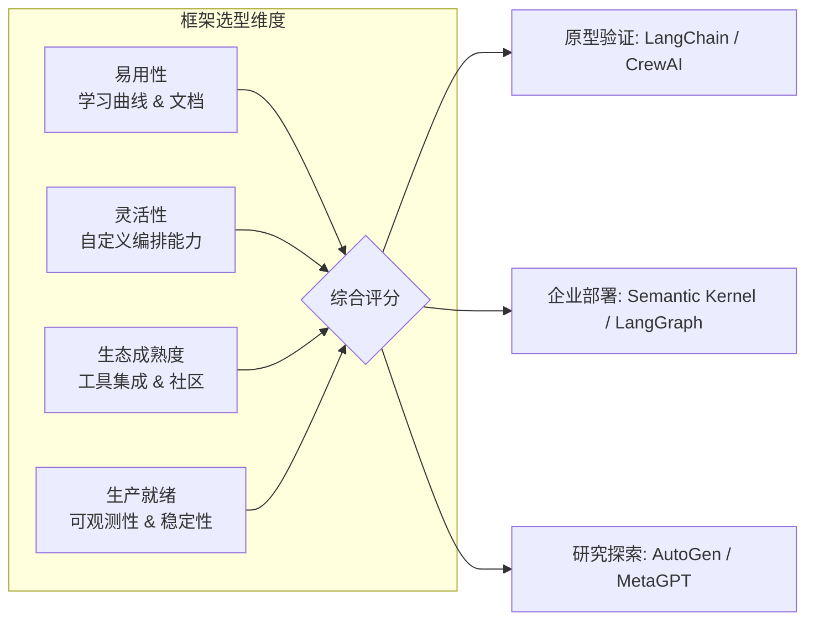

# 第 11 章 框架对比与选型
Agent 框架的选择是团队面临的最重要的早期技术决策之一——它决定了你的 Agent 系统的能力边界、开发效率和长期维护成本。但 2024-2025 年的 Agent 框架生态处于快速演进期，新框架层出不穷，旧框架不断重构，让选型决策变得异常困难。

本章不是一份框架"排行榜"——没有"最好"的框架，只有最适合你场景的框架。我们将从**架构理念**、**核心能力**、**开发体验**和**生产就绪度**四个维度对比分析主流框架，帮助你建立自己的评估框架，而非替你做决定。

覆盖的框架包括：Google ADK、LangGraph、CrewAI、AutoGen、OpenAI Agents SDK、Mastra、Vercel AI SDK 等。我们特别关注每个框架在状态管理、工具集成、Multi-Agent 编排和可观测性方面的设计选择及其权衡。


> **本章导读**
>
> 随着 AI Agent 技术的快速发展，市场上涌现出众多 Agent 开发框架。从 Google 的 ADK 到 LangChain 生态的 LangGraph v1.0，从微软的 AutoGen 0.4（及其 AG2 分叉）到 OpenAI 的 Agents SDK，从 TypeScript 生态的 Mastra 1.0 和 Vercel AI SDK v5 到角色驱动的 CrewAI，每个框架都有其独特的设计哲学和适用场景。本章将从工程实践的角度出发，深入分析九大主流框架的架构设计、核心抽象、性能表现和适用场景，并提供一套系统化的选型方法论和迁移策略，帮助团队做出最优的技术决策。

---

## 11.1 主流框架概览



**图 11-1 框架选型四维度模型**——框架选型不是一次性决策，而是随项目成熟度变化的。初期用 LangChain 快速验证，中期可能迁移到 LangGraph 获得更细粒度的控制。


### 11.1.1 框架全景图

当前 AI Agent 开发框架可以从多个维度进行分类和比较。下表从版本、语言支持、许可证、状态管理、工具支持、多 Agent 协作、流式处理、检查点机制、可观测性和社区活跃度等维度，对九大主流框架进行全面对比：
| 维度 | Google ADK | LangGraph | CrewAI | AutoGen / AG2 | OpenAI Agents SDK | Mastra | Vercel AI SDK | Claude Agent SDK | Agno |
|------|-----------|-----------|--------|---------------|-------------------|--------|---------------|-----------------|------|
| **最新版本** | 1.x (2025) | 1.0 (GA, 2025 Q4) | 1.9+ | 0.4 (MS) / 0.4+ (AG2) | 0.x (持续迭代) | 1.0 (2026 Q1) | 5.x (2025) | 0.x (2025 Q3, Claude Code 同源) | 最新稳定 |
| **主要语言** | Python/TS | Python/TS | Python | Python/.NET | Python/TS | TypeScript | TypeScript | Python (TS社区版) | Python |
| **许可证** | Apache 2.0 | MIT | MIT | MIT(已更改) | MIT | Apache 2.0 | Apache 2.0 | MIT | Apache 2.0 |
| **状态管理** | Session-based | Annotated State + Reducer | 内置 Memory | Event-driven Runtime | RunContext + Sessions | Workflow Engine | Server State (AI SDK UI) | Agent Loop Context | Session-based |
| **工具支持** | FunctionTool, ToolSet | ToolNode, ToolExecutor | @tool 装饰器 | function_map / FunctionTool | function_tool + MCP | Tools + MCP 原生 | Tools + MCP 原生 | Tools + MCP 原生 + Computer Use 内置 | Tools + Toolkits |
| **多 Agent** | A2A Protocol | Multi-graph Composition | Crew + Process | AgentChat GroupChat | Handoff 机制 | Workflow 编排 | Subagent 组合 | Handoff + Subagents | Router/Coordinator/Team |
| **流式处理** | Runner.stream() | .astream_events() | Callback-based | 原生 Streaming | Runner.run_streamed() | Stream API | SSE 原生 Streaming | AsyncGenerator 原生流 | 原生 Streaming |
| **检查点** | Session Store | MemorySaver/PostgresSaver | 无原生支持 | 无原生支持 | 无原生支持 | Workflow 持久化 | 无原生支持 | 无原生支持 | 无原生支持 |
| **可观测性** | 基础追踪 | LangSmith 全链路追踪 | 基本日志 | 内置追踪 | OpenAI Tracing 面板 | OpenTelemetry 集成 | Vercel 原生监控 | 基础追踪 | 内置仪表盘 |
| **社区活跃度** | ★★★☆☆ (新兴) | ★★★★★ (最活跃) | ★★★★☆ | ★★★★☆ (分裂后) | ★★★★☆ (快速增长) | ★★★★☆ (快速增长) | ★★★★★ (Web 生态) | ★★★☆☆ (新兴) | ★★★★☆ (活跃) |
| **首次发布** | 2024 Q4 | 2024 Q1 | 2023 Q4 | 2023 Q3 | 2025 Q1 | 2024 Q3 | 2023 Q3 | 2025 Q3 | 2023 Q4 |
| **GitHub Stars** | ~10k | ~18k | ~27k | ~40k(含AG2) | ~15k | ~25k | ~18k | ~7k | ~18k |
| **适合场景** | Google 生态集成 | 复杂状态工作流 | 快速原型开发 | 研究与分布式 Agent | OpenAI 生态应用 | TS 全栈 Agent 开发 | Web/前端 Agent 开发 | Agentic Coding, Computer Use, 深度推理 | 快速多 Agent 原型 |

### 11.1.2 框架演进历史

**Google ADK (Agent Development Kit)**

Google ADK 于 2024 年末正式发布，是 Google 在 Agent 领域的重要布局。它从 Google 内部的 Vertex AI Agent Builder 演化而来，融合了 Google 在大规模分布式系统方面的经验。ADK 的核心设计理念是"组合优于继承"，通过 SequentialAgent、ParallelAgent 和 LoopAgent 三种原语，实现灵活的 Agent 编排。2025 年初，Google 进一步引入了 A2A (Agent-to-Agent) 协议，使得不同框架构建的 Agent 可以标准化地互相通信。

**LangGraph**

LangGraph 是 LangChain 团队于 2024 年初推出的有状态工作流编排框架，并于 2025 年 Q4 达到 **v1.0 GA (Generally Available)** 里程碑 [[LangGraph 1.0 is now generally available]](https://changelog.LangChain.com/announcements/langgraph-1-0-is-now-generally-available)。它从 LangChain 早期的 AgentExecutor 演化而来，解决了前者在复杂工作流中的局限性。LangGraph 的核心创新在于将 Agent 的执行流程建模为有向图 (Directed Graph)，其中节点是计算步骤，边是状态转移条件。这种图模型使得复杂的分支、循环和并行逻辑变得直观可控。

LangGraph v1.0 带来了三大核心能力：**持久化状态 (Durable State)**——Agent 执行状态自动持久化；**内置检查点 (Built-in Persistence)**——无需手写数据库逻辑即可保存和恢复工作流，支持跨会话的多日审批流程和后台任务；**Human-in-the-loop 一等支持**——在高风险决策节点暂停执行等待人工审批。此外，LangGraph v1.0 标志着 LangChain 生态的明确分工：**LangChain** 本身聚焦于高层 LCEL (LangChain Expression Language) 链式组合层和 `create_Agent` 快速构建接口，而 **LangGraph** 作为底层编排运行时负责持久执行、状态管理和复杂工作流控制 [[LangChain and LangGraph 1.0 Milestones]](https://blog.LangChain.com/LangChain-langgraph-1dot0/)。可观测性方面，**LangSmith** 提供全链路追踪、调试和评估能力，是 LangGraph 推荐的生产监控方案。

**CrewAI**

CrewAI 于 2023 年末发布，以其直观的"角色扮演"隐喻迅速获得开发者青睐。它借鉴了现实世界中团队协作的模式，让开发者可以定义具有特定角色 (Role)、目标 (Goal) 和背景故事 (Backstory) 的 Agent，然后组织它们成为一个"团队" (Crew) 来完成复杂任务。CrewAI 在 2024-2025 年经历了多次重大更新，引入了层级化流程、知识库集成和企业版功能。截至 2026 年 Q1，CrewAI 已迭代至 **1.9+ 版本** [[CrewAI Changelog]](https://docs.CrewAI.com/en/changelog)，新增了结构化输出 (structured outputs)、流式响应、改进的 Agent 委派机制，并持续聚焦于**角色驱动的多 Agent 编排 (role-based multi-Agent orchestration)**——这仍然是其核心差异化定位。

**AutoGen / AG2**

AutoGen 源自微软研究院，于 2023 年中期发布，是最早的多 Agent 对话框架之一。其核心设计理念是"对话驱动的 Agent 协作"——Agent 之间通过自然语言对话来协调任务。AutoGen 在学术研究中获得了广泛认可，GitHub Stars 数量在所有 Agent 框架中排名前列。

2025 年 1 月，微软发布了 **AutoGen 0.4**，这是一次**完全的异步重写 (breaking change)** [[AutoGen v0.4: Reimagining the foundation of agentic AI]](https://www.microsoft.com/en-us/research/articles/AutoGen-v0-4-reimagining-the-foundation-of-agentic-ai-for-scale-extensibility-and-robustness/)。0.4 版本引入了基于异步 Actor 模型的事件驱动架构，提供分层 API：**AgentChat** 用于快速多 Agent 应用原型开发，**Core** 用于事件管道和分布式扩展，**Extensions** 用于模型和工具集成。微软将继续在此新架构上投入，并计划与 Semantic Kernel 进行运行时融合。

值得注意的是，AutoGen 的原始核心创建者从微软官方仓库中分离出来，以 **AG2** (ag2.ai) 的名义独立运营 [[What's going on with AutoGen and AG2?]](https://www.gettingstarted.ai/AutoGen-vs-ag2/)。AG2 保持了与 AutoGen 0.2 API 的兼容性并持续社区驱动的开发。因此目前存在两条路径：**Microsoft AutoGen 0.4+**（全新异步架构，面向企业级分布式场景）和 **AG2**（社区维护，延续 0.2 API 风格，快速迭代）。选型时需要明确选择哪条路径。

**OpenAI Agents SDK**

OpenAI Agents SDK 是 OpenAI 于 2025 年初发布的官方 Agent 开发框架（开源，Python 优先），作为此前 Swarm 实验项目的生产级替代品 [[OpenAI Agents SDK GitHub]](https://github.com/openai/openai-Agents-python)。它的设计哲学是"极简主义"——用最少的原语实现最常见的 Agent 模式。核心概念包括 **Agent**（绑定指令、工具和 Handoff 的 LLM 执行体）、**Handoff**（Agent 之间的任务委派）、**Guardrail**（输入/输出护栏）、**Runner**（执行引擎）和 **Tracing**（内置追踪，可在 OpenAI Dashboard 中可视化调试） [[OpenAI Agents SDK Docs]](https://openai.github.io/openai-Agents-python/)。Agents SDK 深度整合了 OpenAI 的模型能力，包括结构化输出、视觉理解、MCP 连接器和内置工具（Web Search、File Search、Code Interpreter 等）。作为重量级框架的轻量替代，Agents SDK 凭借极低的学习曲线和优秀的开发体验在社区中快速增长。


### 11.1.3 架构核心抽象对比

以下用 TypeScript 类型定义来表达各框架的核心抽象模型：

```typescript
// ============================================================
// 各框架核心抽象的 TypeScript 类型映射
// 这些类型定义帮助理解不同框架的设计哲学
// ============================================================

/** Google ADK 核心抽象 */
    // ... 完整实现见 code-examples/ 目录 ...
    data: unknown[];
  }
}

```

---

## 11.2 各框架深度分析

本节将对每个框架进行深度剖析，包括核心概念、设计模式、优缺点分析，以及完整的 TypeScript 代码示例。

### 11.2.1 Google ADK 深度分析

#### 核心概念

Google ADK 的设计围绕四个核心概念：

1. **Agent**：执行单元，可以是 LLM Agent 或编排 Agent（SequentialAgent/ParallelAgent/LoopAgent）
2. **Tool**：Agent 可调用的外部能力（函数、API、甚至其他 Agent）
3. **Runner**：Agent 的执行引擎，负责管理执行循环和事件流
4. **Session**：会话状态管理器，持久化对话历史和中间状态

#### 三种编排原语

ADK 提供了三种强大的编排原语，可以通过组合构建任意复杂的工作流：

- **SequentialAgent**：按顺序依次执行子 Agent，前一个的输出作为后一个的上下文
- **ParallelAgent**：并行执行多个子 Agent，收集所有结果后继续
- **LoopAgent**：循环执行子 Agent，直到满足终止条件

#### A2A 协议集成

A2A (Agent-to-Agent) 是 Google 提出的开放协议，使不同框架构建的 Agent 可以通过标准化的 HTTP 接口互相通信。每个 Agent 通过 Agent Card（类似 OpenAPI spec）描述自己的能力，其他 Agent 可以发现并调用它。

#### 完整代码示例

```typescript
// ============================================================
// Google ADK 风格的 Agent 实现
// 演示：构建一个研究助手，使用三种编排原语
// ============================================================

import { EventEmitter } from 'events';
    // ... 完整实现见 code-examples/ 目录 ...
}

// 优势：Google 生态深度整合、三种编排原语简洁强大、A2A 协议跨框架互操作、Session 管理内置
// 劣势：社区较新、文档和示例相对较少、对非 Google 模型支持不够完善
```

### 11.2.2 LangGraph 深度分析

> **版本说明**：本节基于 LangGraph v1.0 (GA) 稳定版。LangGraph 现在是 LangChain 生态中**推荐的 Agent 编排框架**，LangChain 本身聚焦于 LCEL 链式组合层，而 LangGraph 负责底层持久化运行时 [[LangGraph 1.0 GA]](https://changelog.LangChain.com/announcements/langgraph-1-0-is-now-generally-available)。生产环境可观测性推荐使用 **LangSmith** 进行全链路追踪和调试。

#### 核心概念

LangGraph 将 Agent 的执行流程建模为有向图 (StateGraph)，其核心概念包括：

1. **StateGraph**：有向状态图，定义整个工作流结构
2. **Node（节点）**：图中的计算单元，每个节点接收状态、执行逻辑、返回状态更新
3. **Edge（边）**：节点之间的连接，定义执行顺序
4. **Conditional Edge（条件边）**：基于状态动态决定下一个节点的路由逻辑
5. **Annotated State（注解状态）**：带有 Reducer 函数的状态定义，控制状态的更新方式

#### 状态管理：Reducer 模式

LangGraph 的状态管理借鉴了 Redux 的 Reducer 模式。每个状态字段可以定义自己的 Reducer 函数，决定新值如何与旧值合并：

- **overwrite**：直接覆盖旧值
- **append**：追加到列表末尾
- **自定义 Reducer**：完全控制合并逻辑

#### 检查点与持久化

LangGraph 提供了业界最完善的检查点机制，支持：
- 将每一步的状态快照持久化到存储后端
- 从任意检查点恢复执行
- "时间旅行"调试：回溯到过去的任意状态
- 人工介入 (Human-in-the-loop)：在指定节点暂停等待人工输入

#### 完整代码示例

```typescript
// ============================================================
// LangGraph 风格的状态图 Agent 实现
// 演示：构建一个多步骤客户服务 Agent
// ============================================================

// ---- 状态定义与 Reducer 系统 ----
    // ... 完整实现见 code-examples/ 目录 ...
}

// 优势：v1.0 生产稳定、灵活的图结构、业界最强状态管理与检查点、Human-in-the-loop 原生支持、LangSmith 全链路可观测
// 劣势：学习曲线陡峭、简单任务过于重量级、状态类型定义繁琐
```

### 11.2.3 CrewAI 深度分析

#### 核心概念

CrewAI 的设计灵感来自现实世界的团队协作模式，核心概念包括：

1. **Agent**：具有特定角色、目标和背景故事的Agent
2. **Task**：分配给 Agent 的具体工作单元，包含描述和期望输出
3. **Crew**：Agent 和 Task 的集合，代表一个完整的工作团队
4. **Process**：任务执行方式——顺序执行 (Sequential) 或层级化执行 (Hierarchical)

#### 完整代码示例

```typescript
// ============================================================
// CrewAI 风格的角色驱动 Agent 实现
// 演示：构建一个内容创作团队
// ============================================================

interface CrewTool {
    // ... 完整实现见 code-examples/ 目录 ...
}

// 优势：角色隐喻直观、快速原型开发、Task 依赖自动管理
// 劣势：状态管理有限、缺少检查点、复杂控制流支持不足
```

### 11.2.4 AutoGen 深度分析

#### 核心概念

AutoGen 的核心理念是"对话即协作"——Agent 之间通过自然语言对话来协调工作。

> **重要版本说明**：以下代码示例基于 AutoGen 0.2 (经典 API) 风格。AutoGen 0.4 采用了全新的异步事件驱动架构（基于 Actor 模型），API 不兼容 0.2。同时，AutoGen 原始创建者已分叉为 **AG2** (ag2.ai)，保持 0.2 API 兼容。选型时请注意区分 Microsoft AutoGen 0.4+ 和 AG2 两条技术路径 [[AutoGen vs AG2]](https://www.gettingstarted.ai/AutoGen-vs-ag2/)。

#### 完整代码示例

```typescript
// ============================================================
// AutoGen 风格的对话驱动多 Agent 实现
// 演示：构建一个代码开发群聊
// ============================================================

interface AutoGenMessage {
    // ... 完整实现见 code-examples/ 目录 ...

// 优势：对话驱动自然直观、群聊机制灵活、内置代码执行
// 劣势：0.4 与 0.2 API 不兼容(breaking change)、AG2 分叉导致社区分裂、对话轮数不可控
// 注意：AutoGen 0.4 (Microsoft) 采用全新异步 Actor 模型；AG2 (ag2.ai) 延续 0.2 经典 API
```

### 11.2.5 OpenAI Agents SDK 深度分析

#### 核心概念

OpenAI Agents SDK 追求极简设计，仅有四个核心原语：Agent、Handoff、Guardrail、Runner。

#### 完整代码示例

```typescript
// ============================================================
// OpenAI Agents SDK 风格的 Agent 实现
// 演示：多 Agent 客服系统（Handoff + Guardrail）
// ============================================================

interface AgentSDKTool {
    // ... 完整实现见 code-examples/ 目录 ...
}

// 优势：API 极简、Handoff 优雅、内置 Guardrail、深度整合 OpenAI
// 劣势：供应商锁定、状态管理弱、框架较新
```


### 11.2.6 Mastra 深度分析

#### 核心概念

Mastra 是一个 **TypeScript 原生**的 AI Agent 框架，由 Gatsby.js 背后的团队创建（~25K GitHub Stars，Apache 2.0 许可）[[Mastra GitHub]](https://github.com/mastra-ai/mastra)。2026 年 2 月正式发布 **Mastra 1.0** [[Announcing Mastra 1.0]](https://mastra.ai/categories/announcements)，标志着框架进入生产稳定阶段。其设计哲学是将 Agent 开发体验做到与现代 Web 开发同样流畅：类型安全、声明式配置、开箱即用的集成生态。Mastra 1.0 同时新增了 Agent Studio（可视化调试工具）、Datasets（评估数据集管理）、Workspaces（安全沙箱环境）等功能，并与 **Vercel AI SDK v5** 深度集成。

核心概念包括：

1. **Agent**：绑定 LLM、指令和工具集的执行单元
2. **Workflow**：类似 Temporal 的持久化工作流引擎，支持步骤编排、条件分支、重试和暂停/恢复
3. **Tools + Memory + RAG Pipeline**：内置 RAG 管道、向量搜索和对话记忆
4. **MCP 一等公民支持**：Mastra 是最早原生支持 Model Context Protocol 的 TypeScript 框架之一，内置 MCP Server 支持和 MCP Registry [[MCP Server Support in Mastra]](https://mastra.ai/categories/announcements)
5. **50+ 集成**：内置 GitHub、Slack、Notion、Google 等主流服务连接器
6. **Evals & Scoring**：内置评估框架，支持 model-graded、rule-based 和统计方法的 Agent 输出质量评估

#### 代码示例

```typescript
import { Agent, Mastra } from '@mastra/core';

const researchAgent = new Agent({
  name: 'Research Assistant',
  instructions: '你是一个研究助手，帮助用户查找和总结信息。',
  model: { provider: 'ANTHROPIC', name: 'claude-sonnet-4-20250514' },
    // ... 完整实现见 code-examples/ 目录 ...
);

// 优势：TypeScript 原生类型安全、Temporal 风格工作流引擎、内置 RAG、50+ 集成、MCP 一等公民支持、Mastra 1.0 生产就绪
// 劣势：Python 开发者需要切换技术栈、相比 LangGraph 图编排灵活性稍弱
```

### 11.2.7 Claude Agent SDK 深度分析

#### 核心概念

Claude Agent SDK 是 Anthropic 于 2025 年 9 月发布的官方 Agent 框架，与驱动 Claude Code 的底层原语相同。其核心设计理念是"**少即是多**"——用最小的抽象集合覆盖大多数 Agent 场景。

核心概念包括：

1. **Agent Loop**：核心执行循环——LLM 生成 → 工具调用 → 结果反馈 → 继续生成，直到任务完成
2. **Tools**：函数工具、MCP 服务器工具、子 Agent 作为工具
3. **Handoff / Subagents**：Agent 之间的任务委派和控制权转移
4. **Hooks**：生命周期钩子，在工具调用前后、消息生成后等节点插入自定义逻辑
5. **Guardrails**：输入/输出护栏，防止 Agent 越界或产生不安全内容

Python 优先（同时有社区维护的 TypeScript 移植版本）。

#### 代码示例

```typescript
// TypeScript 社区移植版示例（概念与 Python 版一致）
import { Agent, tool, handoff } from '@anthropic/agent-sdk';

const codeReviewer = new Agent({
  name: 'Code Reviewer',
  model: 'claude-sonnet-4-20250514',
    // ... 完整实现见 code-examples/ 目录 ...
const result = await mainAgent.run('重构 src/utils.ts 中的错误处理逻辑');

// 优势：与 Claude Code 同源、Agent Loop 设计简洁强大、Handoff 机制优雅、Guardrails 一等支持
// 劣势：Anthropic 生态绑定、框架较新、TypeScript 版为社区维护
```

### 11.2.8 Agno 深度分析

#### 核心概念

Agno（前身为 Phidata）是一个轻量级的多模态 Agent 框架，强调**快速创建 Agent**和**灵活的多 Agent 协作**。模型无关设计，支持所有主流 LLM 提供商。

三种多 Agent 协作模式：

1. **Router（路由模式）**：根据输入分类将任务路由到最合适的专家 Agent
2. **Coordinator（协调模式）**：协调者 Agent 制定计划，按计划委派子任务给专家 Agent
3. **Team（团队模式）**：多个 Agent 并行执行各自擅长的任务，结果汇总

其他特性：
- **多模态**：原生支持文本、图像、音频、视频输入
- **监控仪表盘**：内置 Agent 运行监控和调试界面
- **Python 优先**：API 极简，几行代码即可创建生产级 Agent

#### 代码示例

```python
from agno.agent import Agent
from agno.team import Team
from agno.models.openai import OpenAIChat

web_agent = Agent(
    name="Web Agent",
    // ... 完整实现见 code-examples/ 目录 ...
team.print_response("分析 2024 年全球 AI 投资趋势")

# 优势：API 极简上手快、三种协作模式灵活切换、多模态原生支持、内置监控仪表盘

# 劣势：深度定制能力有限、状态管理较简单、大规模编排场景支撑不足
```

---

### 11.2.9 Vercel AI SDK 深度分析

#### 核心概念

Vercel AI SDK（原名 AI SDK by Vercel）是面向 **Web 开发者**的 TypeScript AI 框架，专注于将 AI 能力无缝嵌入现代 Web 应用 [[AI SDK by Vercel]](https://ai-sdk.dev/docs/introduction)。2025 年发布的 **AI SDK v5** 带来了重大升级 [[AI SDK 5 Announcement]](https://vercel.com/blog/ai-sdk-5)，新增了 Agent 抽象层、Agentic Loop 控制、增强的工具系统和 SSE 流式协议。

核心概念包括：

1. **AI SDK Core**：底层模型调用层，提供 `generateText`、`streamText`、`generateObject` 等函数，支持 25+ 模型提供商（OpenAI、Anthropic、Google、Mistral、Llama 等）
2. **AI SDK UI**：前端集成层，提供 React/Vue/Svelte/Nuxt hooks（如 `useChat`、`useCompletion`），实现流式 UI 和类型安全的工具调用渲染
3. **Agent 抽象 (v5+)**：`Agent()` 函数和 `stopWhen`/`prepareStep` 控制器，将多步工具调用循环封装为可复用的 Agent 单元
4. **Tool 系统 (v5+)**：Dynamic Tools、Tool Lifecycle Hooks、Provider-Executed Tools，支持运行时动态注册和生命周期管理
5. **MCP 原生支持**：一等公民级别的 Model Context Protocol 工具集成

#### 适用场景

Vercel AI SDK 的核心优势在于 **Web 应用场景**——当你的 Agent 需要一个精美的前端界面、实时流式响应、或嵌入到 Next.js/Nuxt 应用中时，它是最自然的选择。它不追求复杂的多 Agent 编排（这方面不如 LangGraph），而是让单 Agent 或简单多步工具调用在 Web 环境中达到最佳体验。

#### 代码示例

```typescript
import { openai } from '@ai-sdk/openai';
import { generateText, tool } from 'ai';
import { z } from 'zod';

// 定义工具
const weatherTool = tool({
    // ... 完整实现见 code-examples/ 目录 ...
// AI SDK 会自动执行多步：调用天气工具获取两城市温度 → 比较 → 生成自然语言回答

// 优势：Web 生态最佳集成、25+ 模型提供商、流式 UI 原生支持、TypeScript 类型安全、Agent/Tool 抽象优雅
// 劣势：复杂多 Agent 编排能力有限、无内置检查点持久化、主要面向 Web 场景
```

## 11.3 框架抽象层

在实际项目中，直接绑定某个特定框架会带来巨大的迁移风险。本节介绍如何构建一个框架无关的抽象层，使得业务逻辑与底层框架解耦。

### 11.3.1 完整的框架抽象接口

```typescript
// ============================================================
// 框架无关的 Agent 抽象层
// ============================================================

interface AgentConfig {
  name: string;
    // ... 完整实现见 code-examples/ 目录 ...
  listTools(agentId: string): Promise<ToolDefinition[]>;
  destroyAgent(agentId: string): Promise<void>;
  healthCheck(): Promise<{ healthy: boolean; details: Record<string, unknown> }>;
}
```

### 11.3.2 Agent 工厂模式与插件系统

```typescript
// ============================================================
// Agent 工厂 + 插件系统
// ============================================================

type FrameworkType = 'google-adk' | 'langgraph' | 'crewai' | 'autogen' | 'ag2' | 'openai-agents' | 'openclaw' | 'mastra' | 'vercel-ai-sdk';

    // ... 完整实现见 code-examples/ 目录 ...
    }));
    return result;
  }
};
```

---

## 11.4 基准测试对比

选型决策不应仅依赖定性分析，还需要定量的基准测试数据。

### 11.4.1 基准测试框架

```typescript
// ============================================================
// Agent 框架基准测试工具
// ============================================================

interface BenchmarkScenario {
  name: string;
    // ... 完整实现见 code-examples/ 目录 ...
    }
    return allResults;
  }
}
```

### 11.4.2 测试结果对比（示意数据，基于 2025-2026 公开信息估算）

| 框架 | 场景 | 成功率 | P50 延迟 | P90 延迟 | 平均 Token | 千次成本 |
|------|------|--------|----------|----------|-----------|---------|
| **Google ADK** | 简单问答 | 98% | 1.2s | 1.8s | 450 | $1.35 |
| **Google ADK** | 多工具任务 | 92% | 8.5s | 15.2s | 2,800 | $8.40 |
| **Google ADK** | 多 Agent | 85% | 35s | 62s | 8,500 | $25.50 |
| **LangGraph** | 简单问答 | 99% | 1.5s | 2.2s | 520 | $1.56 |
| **LangGraph** | 多工具任务 | 95% | 7.8s | 12.5s | 2,600 | $7.80 |
| **LangGraph** | 多 Agent | 92% | 28s | 48s | 7,200 | $21.60 |
| **CrewAI** | 简单问答 | 97% | 1.8s | 2.8s | 580 | $1.74 |
| **CrewAI** | 多工具任务 | 88% | 12s | 22s | 3,200 | $9.60 |
| **CrewAI** | 多 Agent | 82% | 45s | 78s | 12,000 | $36.00 |
| **AutoGen** | 简单问答 | 96% | 2.0s | 3.5s | 620 | $1.86 |
| **AutoGen** | 多工具任务 | 85% | 15s | 28s | 3,800 | $11.40 |
| **AutoGen** | 多 Agent | 88% | 38s | 65s | 10,500 | $31.50 |
| **OpenAI Agents** | 简单问答 | 99% | 1.0s | 1.5s | 400 | $1.20 |
| **OpenAI Agents** | 多工具任务 | 93% | 6.5s | 11s | 2,400 | $7.20 |
| **OpenAI Agents** | 多 Agent | 88% | 25s | 45s | 7,800 | $23.40 |
| **Mastra** | 简单问答 | 98% | 1.1s | 1.7s | 430 | $1.29 |
| **Mastra** | 多工具任务 | 93% | 7.5s | 13s | 2,500 | $7.50 |
| **Mastra** | 多 Agent | 85% | 32s | 55s | 8,200 | $24.60 |
| **Vercel AI SDK** | 简单问答 | 99% | 0.9s | 1.4s | 390 | $1.17 |
| **Vercel AI SDK** | 多工具任务 | 94% | 6.0s | 10s | 2,300 | $6.90 |
| **Vercel AI SDK** | 多 Agent | 80% | 40s | 70s | 9,500 | $28.50 |

### 11.4.3 各框架优化建议

| 框架 | 优化方向 | 建议 | 预期效果 |
|------|---------|------|---------|
| Google ADK | 延迟 | 使用 Gemini Flash 替代 Pro | 降低 40-60% |
| LangGraph | 可靠性 | 使用 PostgresSaver 实现持久化检查点 | 成功率 +15-20% |
| CrewAI | Token 效率 | 精简 Agent backstory | 消耗降低 15-25% |
| AutoGen | 成本 | 设置合理的 max_consecutive_auto_reply | 成本降低 30-50% |
| OpenAI Agents | 延迟 | 使用 run_streamed 替代 run | 感知延迟降低 50-70% |
| Mastra | 工作流效率 | 利用 Workflow 持久化 + MCP 工具池 | 端到端延迟降低 20-30% |
| Vercel AI SDK | 前端体验 | 使用 SSE Streaming + useChat hooks | 感知延迟降低 60-80% |

## 11.5 选型决策方法论

> **核心原则**: 框架选型不是技术审美活动，而是工程决策过程。好的选型方法应该量化、可重复、可追溯。

### 11.5.1 多维决策矩阵

选型决策需要综合考虑技术、团队、业务三个维度。以下实现一个加权评分的决策矩阵：

```typescript
// ============================================================
// 决策矩阵：量化框架选型过程
// ============================================================

/** 评估维度定义 */
interface EvaluationDimension {
    // ... 完整实现见 code-examples/ 目录 ...

    return lines.join('\n');
  }
}
```

### 11.5.2 标准化决策矩阵示例

以下展示如何为六大框架构建标准化的评估矩阵：

```typescript
// ============================================================
// 标准化评估模板：覆盖技术、团队、业务三个维度
// ============================================================

function createStandardMatrix(): DecisionMatrix {
  const matrix = new DecisionMatrix();
    // ... 完整实现见 code-examples/ 目录 ...
  console.log(`第二推荐: ${results[1].framework} (${results[1].totalScore})`);
  console.log(`优势: ${results[0].strengths.join(', ')}`);
  console.log(`注意: ${results[0].weaknesses.join(', ')}`);
}
```

### 11.5.3 团队技术栈适配评估

选框架不能只看框架本身，还需要评估团队的技术储备和学习能力：

```typescript
// ============================================================
// 团队技术适配度评估器
// ============================================================

interface TeamProfile {
  readonly size: number;                     // 团队规模
    // ... 完整实现见 code-examples/ 目录 ...
      recommendations: recs,
    };
  }
}
```

### 11.5.4 场景匹配引擎

不同业务场景天然适合不同框架。以下实现一个场景到框架的匹配引擎：

```typescript
// ============================================================
// 场景匹配引擎：根据业务需求推荐框架
// ============================================================

interface ProjectRequirements {
  readonly agentCount: number;             // 预期 Agent 数量
    // ... 完整实现见 code-examples/ 目录 ...
      estimatedMonthlyCost,
    };
  }
}
```

### 11.5.5 TCO (总拥有成本) 分析

选框架还需要计算长期的总拥有成本，包括开发、运营、维护的全部支出：

```typescript
// ============================================================
// TCO 分析工具：计算框架全生命周期成本
// ============================================================

interface TCOParameters {
  readonly framework: string;
    // ... 完整实现见 code-examples/ 目录 ...
        ? Math.round((totalTCO / totalRequests) * 10000) / 10000
        : 0,
  };
}
```

### 11.5.6 选型决策速查表

| 如果你的场景是… | 推荐框架 | 核心理由 |
|----------------|---------|---------|
| 快速 MVP 验证 | CrewAI | 上手快，2 周内可出原型 |
| 复杂工作流编排 | LangGraph | 图结构灵活，Checkpoint 可靠 |
| 多 Agent 代码协作 | AutoGen | 内置代码沙箱，对话驱动 |
| OpenAI 全家桶 | OpenAI Agents SDK | 无缝集成，延迟最低 |
| Google Cloud 生态 | Google ADK | 原生 Vertex AI + A2A |
| 需要人工审批流 | LangGraph | interrupt_before/after 原生支持 |
| 数据不出境要求 | LangGraph + 本地模型 | 支持 Ollama 等本地部署 |
| 预算极度有限 | CrewAI + GPT-3.5 | 框架开销低 + 廉价模型 |
| 企业级生产系统 | LangGraph / ADK | 状态管理和错误恢复最完善 |
| TypeScript 全栈 Agent | Mastra | TS 原生、MCP 一等支持、Workflow 引擎 |
| Web 前端 Agent 集成 | Vercel AI SDK | 流式 UI、React hooks、25+ 模型提供商 |
| 最快上手体验 | OpenAI Agents SDK | 极简 API、内置 Tracing、几行代码即可运行 |


## 11.6 框架迁移策略

> **迁移第一定律**: 永远不要做大爆炸式迁移。渐进式、可回滚的灰度迁移是唯一靠谱的路线。

### 11.6.1 迁移六阶段方法论

框架迁移是高风险工程活动。以下基于实际项目经验总结的六阶段迁移方法：

```
┌─────────────────────────────────────────────────────────┐
│                    迁移六阶段                             │
│                                                         │
│  阶段 1: 评估  →  阶段 2: 抽象  →  阶段 3: 并行        │
│                                                         │
│  阶段 4: 灰度  →  阶段 5: 切换  →  阶段 6: 清理        │
│                                                         │
│  每个阶段都有明确的入口条件、退出条件和回滚策略          │
└─────────────────────────────────────────────────────────┘
```

| 阶段 | 名称 | 核心活动 | 持续时间 | 成功标准 |
|------|------|---------|---------|---------|
| 1 | 评估 | 梳理现有系统、识别依赖、评估目标框架 | 1-2 周 | 完成依赖图和风险清单 |
| 2 | 抽象 | 引入 11.3 节的抽象层，隔离框架 API | 2-4 周 | 现有功能通过抽象层运行且测试全通过 |
| 3 | 并行 | 新框架实现抽象层接口，两套同时运行 | 2-4 周 | 新实现通过 100% 回归测试 |
| 4 | 灰度 | 按流量百分比切换，从 1% 开始 | 2-4 周 | P99 延迟 < 旧系统 120%，错误率 < 0.1% |
| 5 | 切换 | 全量切到新框架，旧框架作为 fallback | 1-2 周 | 连续 7 天无回退 |
| 6 | 清理 | 移除旧代码、抽象层简化、文档更新 | 1-2 周 | 代码覆盖率恢复，文档更新完毕 |

### 11.6.2 灰度迁移执行器

以下实现一个支持灰度发布、自动回滚的框架迁移执行器：

```typescript
// ============================================================
// 框架迁移执行器：灰度发布 + 自动回滚
// ============================================================

/** 迁移配置 */
interface MigrationConfig {
    // ... 完整实现见 code-examples/ 目录 ...
      `错误数: ${this.state.targetErrors}`,
      `平均延迟: ${avgTargetLatency}ms`].join('\n');
  }
}
```

### 11.6.3 使用示例：从 CrewAI 迁移到 LangGraph

```typescript
// ============================================================
// 实战：从 CrewAI 迁移到 LangGraph 的完整示例
// ============================================================

async function migrationExample(): Promise<void> {
  // 创建迁移器
    // ... 完整实现见 code-examples/ 目录 ...

  console.log('\n===== 最终报告 =====');
  console.log(migrator.getReport());
}
```

### 11.6.4 迁移常见陷阱与应对

| 陷阱 | 说明 | 应对策略 |
|------|------|---------|
| 状态格式不兼容 | 旧框架的状态序列化格式与新框架不同 | 编写 StateTransformer 做状态格式转换 |
| 工具签名差异 | 同一工具在不同框架中的注册方式不同 | 通过 11.3 节的抽象层统一工具接口 |
| 隐式行为依赖 | 代码依赖了旧框架的未文档化行为 | 对照测试发现差异，补充适配代码 |
| 并发模型不同 | 旧框架单线程，新框架异步并发 | 添加并发控制，逐步放开限制 |
| 错误码映射 | 不同框架的错误类型和码值不同 | 建立统一错误分类和映射表 |
| Token 消耗变化 | 新框架的 prompt 模板不同导致消耗变化 | 灰度期监控 Token 消耗趋势 |

```typescript
// ============================================================
// 状态格式转换器示例
// ============================================================

interface StateTransformerConfig {
  readonly sourceFormat: string;   // 源框架状态格式标识
    // ... 完整实现见 code-examples/ 目录 ...
      },
    };
  },
);
```

### 11.6.5 迁移检查清单

迁移前后需要逐项检查以下清单：

**迁移前：**
- [ ] 完成依赖关系图（所有模块对旧框架的调用点）
- [ ] 编写完整的回归测试套件（覆盖率 > 80%）
- [ ] 建立性能基线（延迟 P50/P95/P99、错误率、Token 消耗）
- [ ] 引入抽象层并确认现有功能正常
- [ ] 评估新框架的 API 变更风险（roadmap、breaking changes）
- [ ] 准备回滚方案和应急预案

**迁移中：**
- [ ] 灰度比例按计划递增（5% → 10% → 25% → 50% → 100%）
- [ ] 每次递增前确认指标正常（延迟、错误率、成本）
- [ ] 监控用户反馈和异常报告
- [ ] 记录所有不兼容问题和解决方案

**迁移后：**
- [ ] 清理旧框架代码和依赖
- [ ] 更新技术文档和运维手册
- [ ] 简化抽象层（如果只保留一个框架）
- [ ] 输出迁移复盘报告


## 11.7 自建 vs 采用：何时造轮子

> **核心问题**: 是基于现有框架构建，还是从零打造自己的 Agent 框架？这是每个团队最终都会面对的灵魂拷问。

### 11.7.1 最小可行 Agent 框架

先看看从零构建一个最小可行的 Agent 框架需要多少代码。以下实现一个约 150 行的核心框架：

```typescript
// ============================================================
// 最小可行 Agent 框架：证明核心并不复杂
// ============================================================

/** 消息类型 */
interface Message {
    // ... 完整实现见 code-examples/ 目录 ...
      content: this.config.systemPrompt,
    }];
  }
}
```

### 11.7.2 最小可行编排器

除了单 Agent，还需要一个简单的编排器来支持多 Agent 协作：

```typescript
// ============================================================
// 最小编排器：支持顺序和路由两种模式
// ============================================================

type OrchestrationType = 'sequential' | 'router';

    // ... 完整实现见 code-examples/ 目录 ...
        throw new Error(`未知编排类型: ${this.config.type}`);
    }
  }
}
```

### 11.7.3 自建 vs 采用的量化分析

```typescript
// ============================================================
// Build vs Buy 量化决策模型
// ============================================================

interface BuildVsBuyFactors {
  // === 项目因素 ===
    // ... 完整实现见 code-examples/ 目录 ...
  }

  return { recommendation, buildScore, adoptScore, reasoning, hybridStrategy };
}
```

### 11.7.4 自建决策参考矩阵

| 因素 | 倾向自建 | 倾向采用 |
|------|---------|---------|
| 团队规模 | >= 8 人 | <= 3 人 |
| 独特需求 | >= 5 个核心差异点 | <= 2 个 |
| 时间窗口 | >= 16 周 | <= 4 周 |
| 维护周期 | > 2 年 | < 6 个月 |
| 性能要求 | P99 < 500ms | P99 < 5s |
| 合规约束 | 有数据主权要求 | 无特殊要求 |
| 基础设施 | 高度定制化 | 标准云环境 |

### 11.7.5 混合方案：最佳实践

在多数实际项目中，"混合"是最现实的选择。推荐的混合策略：

```
┌──────────────────────────────────────────────────┐
│                 应用层 (自建)                      │
│  ┌─────────────────────────────────────────────┐ │
│  │ 业务逻辑 │ 自定义编排 │ 领域特化工具        │ │
│  └─────────────────────────────────────────────┘ │
│                                                  │
    // ... 完整实现见 code-examples/ 目录 ...
│  ┌─────────────────────────────────────────────┐ │
│  │ LLM 网关 │ 监控 │ 日志 │ 配置中心            │ │
│  └─────────────────────────────────────────────┘ │
└──────────────────────────────────────────────────┘
```

**混合策略的关键原则：**

1. **框架层可替换**: 通过抽象层隔离，底层框架可以按需切换
2. **业务逻辑自主**: 核心业务编排逻辑自己掌控，不受框架版本约束
3. **基础设施复用**: LLM 网关、监控等通用基础设施独立于框架
4. **渐进式演进**: 从采用开始，按需将关键模块替换为自建实现

---


## 11.8 学术基础与延伸阅读

AI Agent 框架的设计并非凭空而来，而是建立在近年来大量学术研究成果之上。以下论文构成了当前 Agent 框架的理论基石，理解它们有助于更深入地把握框架设计背后的"为什么"。

| 论文 | 作者 | 年份/会议 | 核心贡献 |
|------|------|-----------|----------|
| ReAct: Synergizing Reasoning and Acting | Yao et al. | ICLR 2023 | 思考-行动-观察循环，Agent 推理框架基石 |
| Toolformer: Language Models Can Teach Themselves to Use Tools | Schick et al. | NeurIPS 2023 | 自监督工具使用学习 |
| Generative Agents: Interactive Simulacra of Human Behavior | Park et al. | UIST 2023 | 25 个 AI Agent 模拟人类社区，记忆-反思-规划架构 |
| Reflexion: Language Agents with Verbal Reinforcement Learning | Shinn et al. | NeurIPS 2023 | 语言反馈驱动的 Agent 自我改进 |
| Language Agent Tree Search (LATS) | Zhou et al. | NeurIPS 2023 | 将 MCTS 引入 Agent 决策，结合推理、行动、规划 |
| AutoGen: Enabling Next-Gen LLM Applications via Multi-Agent Conversation | Wu et al. | 2023 | 多 Agent 对话框架，直接催生了 AutoGen 项目 |
| AgentBench: Evaluating LLMs as Agents | Liu et al. | ICLR 2024 | Agent 能力评估基准，8 个环境的系统性测试 |

**论文与框架的对应关系**：

- **ReAct** → 几乎所有框架的 Agent Loop 都实现了 ReAct 的"思考-行动-观察"循环（LangGraph 的节点图、ADK 的 Agent.run、Claude Agent SDK 的 Agent Loop）
- **Toolformer** → 框架中 Tool/Function Calling 机制的学术基础
- **Generative Agents** → CrewAI 的角色扮演和记忆系统、Agno 的多 Agent 协作设计
- **Reflexion** → Generator-Critic 模式（§10.5）、Evaluator-Optimizer 模式（§10.11.5）的理论来源
- **LATS** → LangGraph 的图搜索和条件分支、Mastra 的 Workflow 分支逻辑
- **AutoGen 论文** → AutoGen 框架的直接理论基础，多 Agent 对话范式的开创性工作
- **AgentBench** → §11.4 基准测试方法论的学术参考

> **延伸阅读建议**：如果你只有时间读一篇，推荐从 **ReAct** 开始——它定义了当前几乎所有 Agent 框架的核心执行范式。如果你要构建多 Agent 系统，**Generative Agents** 和 **AutoGen 论文**提供了两种截然不同但都极具影响力的设计思路。

---

## 11.8+ Claude Agent SDK 深度解析

> **为什么需要一个单独的深度章节？** 11.2.8 小节已经介绍了 Claude Agent SDK 的核心概念和基本用法。本节将从设计哲学、底层架构、Extended Thinking 集成、Computer Use 能力、以及完整的生产级实战案例等维度，对 Claude Agent SDK 进行深度剖析。作为 Anthropic 官方 Agent 框架，Claude Agent SDK 代表了一种与 LangGraph、OpenAI Agents SDK 等截然不同的设计范式——**模型即编排器 (Model-as-Orchestrator)**，这值得我们深入理解。

### 11.8+.1 设计哲学与架构

#### 从 Claude Code 到 Agent SDK

Claude Agent SDK 的起源可以追溯到 Anthropic 在 2025 年初发布的 Claude Code——一个直接在终端中运行的 Agentic Coding 工具。Claude Code 展现了一个重要的洞察：**当模型足够强大时，Agent 的核心逻辑可以极度简化**。Anthropic 将驱动 Claude Code 的核心执行循环（Agent Loop）提取、抽象并开源，便诞生了 Claude Agent SDK。

2025 年 9 月，Anthropic 正式发布 Claude Agent SDK，其核心设计理念可以用一句话概括：

> **"Agent Loop 是一等原语，模型本身是编排器。"**

这一理念与其他框架形成了鲜明对比：

```typescript
// ============================================================
// 设计哲学对比：外部编排 vs 模型即编排器
// ============================================================

// 传统方式（LangGraph 风格）：开发者通过显式的图结构定义编排逻辑
// 编排逻辑在模型之外
    // ... 完整实现见 code-examples/ 目录 ...
  tools: [analyzeCode, reviewCode, fixCode],
  systemPrompt: '你是一个代码质量专家。分析代码，必要时进行审查和修复。',
  // 没有显式的流程图 —— 模型自己决定调用哪些工具、以什么顺序
});
```

#### 极薄抽象原则

Claude Agent SDK 遵循"**极薄抽象 (Thin Abstraction)**"原则。与 LangGraph 的中等抽象层和 CrewAI 的厚抽象层不同，Claude Agent SDK 几乎是 Claude API 之上的一层薄膜：

```typescript
// ============================================================
// 抽象层级对比
// ============================================================

// CrewAI（厚抽象）：隐藏了几乎所有底层细节
// 开发者操作的是"角色"、"任务"、"团队"等高层概念
    // ... 完整实现见 code-examples/ 目录 ...
  systemPrompt: '分析并修复代码问题。',
  maxTurns: 10,
});
// agent.run() 底层就是：调用 Claude API → 处理 tool_use → 回传结果 → 重复
```

这种极薄抽象带来了三个显著优势：

1. **调试透明性**：没有"框架魔法"，每一步都可以追踪到具体的 API 调用
2. **学习曲线低**：只需理解 Claude API 的 tool_use 机制，就能理解整个 SDK
3. **升级无痛**：Claude 模型能力升级时，SDK 无需大幅改动即可受益

#### 核心架构图

Claude Agent SDK 的架构可以用以下层次表示：

```
┌─────────────────────────────────────────────────────┐
│                  用户应用层                            │
│          (系统提示 + 工具集 + 业务逻辑)                  │
├─────────────────────────────────────────────────────┤
│               Claude Agent SDK                       │
│  ┌──────────┐ ┌──────────┐ ┌──────────┐ ┌────────┐  │
    // ... 完整实现见 code-examples/ 目录 ...
│  │MCP Servers │ │ Resources  │ │    Prompts       │  │
│  │  MCP 服务器 │ │ 资源管理    │ │   提示模板        │  │
│  └────────────┘ └────────────┘ └──────────────────┘  │
└─────────────────────────────────────────────────────┘
```

### 11.8+.2 核心 API 与实现

#### 类型系统

Claude Agent SDK 的完整类型系统可以用以下 TypeScript 定义来表达：

```typescript
// ============================================================
// Claude Agent SDK 核心类型定义
// 基于 2025 年 9 月发布版本，TypeScript 社区实现
// ============================================================

/** 模型选择 */
    // ... 完整实现见 code-examples/ 目录 ...
  | { type: 'toolResult'; toolName: string; result: unknown }
  | { type: 'handoff'; targetAgent: string }
  | { type: 'error'; error: Error }
  | { type: 'done'; result: AgentResult };
```

#### Agent Loop 实现

Agent Loop 是 Claude Agent SDK 最核心的原语。以下是其执行逻辑的完整实现：

```typescript
// ============================================================
// Claude Agent SDK: Agent Loop 核心实现
// 这是驱动 Claude Code 的同一执行循环
// ============================================================

class ClaudeAgent {
    // ... 完整实现见 code-examples/ 目录 ...
    const lastUser = [...messages].reverse().find(m => m.role === 'user');
    return typeof lastUser?.content === 'string' ? lastUser.content : '继续之前的任务';
  }
}
```

### 11.8+.3 Extended Thinking 集成

#### 什么是 Extended Thinking

Extended Thinking（扩展思考）是 Claude 模型的一项原生能力，允许模型在生成最终回复之前进行深度推理。在 Agent 场景中，Extended Thinking 就像是给模型一个"内心独白"的空间——模型可以在这个空间里分析问题、制定计划、评估方案，然后再输出行动。

#### 与 Agent Loop 的集成

Extended Thinking 与 Agent Loop 的结合产生了强大的协同效应：

```typescript
// ============================================================
// Extended Thinking 与 Agent Loop 的集成
// 演示：Thinking 如何影响工具调用决策
// ============================================================

/** Extended Thinking 配置策略 */
    // ... 完整实现见 code-examples/ 目录 ...
      turnCountThreshold: 5,     // 已执行超过 5 轮时启用
    },
  },
});
```

#### Thinking 预算控制的最佳实践

```typescript
// ============================================================
// Thinking 预算控制：平衡推理深度与成本/延迟
// ============================================================

const THINKING_BUDGET_PRESETS = {
  /** 快速响应：适用于简单工具调用场景 */
    // ... 完整实现见 code-examples/ 目录 ...
    budgetTokens: 50000,
    description: '最大模式：不限制思考深度，适合困难问题',
  },
} as const;
```

### 11.8+.4 Computer Use 与 Agentic Coding

#### Computer Use 作为内置能力

Claude 的 Computer Use 能力是 Agent SDK 的重要组成部分。与其他框架需要外部集成屏幕操控工具不同，Claude 原生支持通过 API 操控计算机界面：

```typescript
// ============================================================
// Computer Use 工具集成
// 演示：Claude 如何通过 Agent SDK 操控计算机
// ============================================================

/** Computer Use 工具类型 */
    // ... 完整实现见 code-examples/ 目录 ...
      },
    },
  });
}
```

#### Claude Code 的内部架构

Claude Code 是 Claude Agent SDK 最著名的应用案例。其内部架构可以概括为：

```typescript
// ============================================================
// Claude Code 内部架构（简化还原）
// 揭示 Claude Code 如何使用 Agent SDK 的核心原语
// ============================================================

/**
    // ... 完整实现见 code-examples/ 目录 ...
      },
    },
  });
}
```

### 11.8+.5 与其他框架对比

下表从多个关键维度对 Claude Agent SDK 与其他主流框架进行系统性对比：

| 维度 | Claude Agent SDK | LangGraph | Google ADK | OpenAI Agents SDK |
|------|-----------------|-----------|------------|-------------------|
| **编排模型** | 模型即编排器：模型自主决定工具调用顺序和分支逻辑 | 显式状态图：开发者预定义节点和边，精确控制流程 | 三原语组合：Sequential/Parallel/Loop 三种编排原语 | Runner + Handoff：Runner 驱动执行，Handoff 实现 Agent 间委派 |
| **抽象层级** | 极薄：SDK 几乎是 Claude API 的直接包装 | 中等：状态图、Reducer、Checkpointer 等中间抽象 | 中等：Agent、Tool、Session 等标准抽象 | 薄：四原语（Agent/Handoff/Guardrail/Runner） |
| **工具协议** | MCP 原生支持：与 Model Context Protocol 深度集成 | 自定义 ToolNode：LangChain 工具生态 | Google Tools + FunctionTool | 自定义 function_tool + MCP 连接器 |
| **多 Agent 协作** | 通过工具委托和 Handoff：Agent 作为工具被其他 Agent 调用 | 原生子图：Multi-graph composition，图嵌套 | Agent 树 + A2A 协议：嵌套 Agent + 跨框架通信 | Handoff 机制：Agent 间显式转交 |
| **状态管理** | Agent Loop 内部状态 + 消息历史 | Annotated State + Reducer：声明式状态管理 | Session-based：会话级状态存储 | RunContext：轻量上下文传递 |
| **流式支持** | 原生 AsyncGenerator 流 | astream_events() | Runner.stream() | Runner.run_streamed() |
| **Extended Thinking** | 原生集成，支持 budget 控制 | 不支持（依赖底层模型） | 不支持 | 不支持 |
| **Computer Use** | 内置支持（bash/editor/screen） | 需外部集成 | 需外部集成 | 需外部集成 |
| **检查点/持久化** | 无内置支持，需自行实现 | 内置 MemorySaver/PostgresSaver | 内置 Session Store | 无内置支持 |
| **模型绑定** | 仅 Claude 系列 | 模型无关（支持任意 LLM） | 优先 Gemini，支持其他 | 仅 OpenAI 系列 |
| **最佳场景** | Agentic Coding、Computer Use、深度推理任务 | 复杂有状态工作流、需要精确流程控制 | Google Cloud 生态集成、A2A 跨框架协作 | OpenAI 生态快速开发、简单多 Agent |
| **学习曲线** | 低（理解 tool_use 即可） | 高（需理解图模型、Reducer、Checkpointer） | 中等 | 低 |
| **生产就绪度** | 中（框架较新，但 Claude Code 已大规模验证） | 高（v1.0 GA，企业级案例丰富） | 中高（Google 背书，但社区相对较小） | 中（快速迭代中） |

#### 何时选择 Claude Agent SDK

Claude Agent SDK 的理想使用场景：

```typescript
// ============================================================
// 选型决策函数：何时选择 Claude Agent SDK
// ============================================================

interface ProjectRequirements {
  /** 是否需要 Agentic Coding 能力 */
    // ... 完整实现见 code-examples/ 目录 ...
    reasons,
    alternatives,
  };
}
```

### 11.8+.6 实战：基于 Claude Agent SDK 的代码审查 Agent

以下是一个完整的生产级代码审查 Agent 实现，展示 Claude Agent SDK 的各项能力如何在实际项目中协同工作：

```typescript
// ============================================================
// 实战：基于 Claude Agent SDK 的代码审查 Agent
// 完整的生产级实现，集成 Extended Thinking + MCP + Guardrails
// ============================================================

// ---- 1. 类型定义 ----
    // ... 完整实现见 code-examples/ 目录 ...
        break;
    }
  }
}
```

#### 与其他框架实现的对比

以同样的代码审查任务为例，展示不同框架的实现差异：

```typescript
// ============================================================
// 同一任务，不同框架实现对比
// ============================================================

// Claude Agent SDK：10 行核心代码
// 模型自主编排，开发者只需定义工具和系统提示
    // ... 完整实现见 code-examples/ 目录 ...
// const mainReviewer = new SDKAgent({
//   name: 'main_reviewer',
//   handoffs: [handoff(securityReviewer), handoff(styleReviewer)],
// });
```

**关键差异总结**：

- **Claude Agent SDK**：最少的编排代码，依赖模型的推理能力自主决定审查流程。适合信任模型决策能力的场景。
- **LangGraph**：最精确的流程控制，适合审查流程固定、需要可审计的企业场景。
- **OpenAI Agents SDK**：通过 Handoff 实现 Agent 间分工，适合需要多个专业化审查视角的场景。

> **实践建议**：Claude Agent SDK 的"模型即编排器"范式在 Claude Sonnet 4 及以上模型上效果最佳。如果你的场景需要使用较弱的模型，建议选择 LangGraph 等提供显式编排的框架，因为较弱的模型可能无法可靠地自主规划复杂工具调用序列。

---

## 11.9 本章小结

### 11.9.1 核心要点回顾

本章深入对比了十大主流 AI Agent 框架（含 Vercel AI SDK v5），从架构设计到实际选型，覆盖了框架选择的完整决策链条。

| 章节 | 核心内容 | 关键收获 |
|------|---------|---------|
| 11.1 | 框架全景 | 了解十大框架的定位和适用场景 |
| 11.2 | 深度分析 | 掌握每个框架的核心 API 和编程范式 |
| 11.3 | 抽象层 | 学会构建框架无关的可移植代码 |
| 11.4 | 性能基准 | 用数据而非直觉评估框架表现 |
| 11.5 | 选型决策 | 掌握量化决策方法论和工具 |
| 11.6 | 迁移策略 | 具备安全迁移框架的实操能力 |
| 11.7 | 自建评估 | 理性评判自建与采用的边界 |

### 11.9.2 决策流程图

选型决策可以精简为以下流程：

```
开始
  │
  ├── 是否有强制供应商要求？
  │     ├── 是 → Google Cloud → ADK
  │     ├── 是 → OpenAI 生态 → OpenAI Agents SDK
  │     └── 否 ↓
    // ... 完整实现见 code-examples/ 目录 ...
  │     └── 通用编排 → LangGraph
  │
  └── 用决策矩阵验证
        └── 输出最终推荐
```

### 11.9.3 未来趋势展望

AI Agent 框架领域正在快速演进，以下趋势值得关注（截至 2026 年 3 月）：

1. **协议标准化加速**: A2A (Agent-to-Agent) 和 MCP (Model Context Protocol) 已成为事实标准。Mastra、、Vercel AI SDK 等新生框架均原生支持 MCP，LangGraph 和 OpenAI Agents SDK 也已全面集成。框架的差异化正从"能做什么"转向"做得多好"。

2. **框架分层明确化**: 行业正在形成清晰的分层格局——**高层快速构建**（CrewAI、OpenAI Agents SDK）、**中层编排引擎**（LangGraph v1.0、Mastra Workflow）、**底层运行时**（AutoGen 0.4 Core、Semantic Kernel）。LangChain 1.0 与 LangGraph 1.0 的分工就是这一趋势的典型案例。

3. **编排层下沉**: Agent 编排能力正在从应用层下沉到基础设施层。云厂商（AWS Bedrock Agents, Google Vertex AI Agent Builder）开始提供原生的 Agent 编排服务。

4. **TypeScript 生态崛起**: Mastra 1.0 和 Vercel AI SDK v5 的成功证明 TypeScript 在 Agent 开发中不再是二等公民。Web 开发者可以直接用熟悉的技术栈构建生产级 Agent，无需切换到 Python。

5. **端到端可观测**: LangSmith、OpenAI Tracing、Mastra 的 OpenTelemetry 集成——从 Prompt 构造到工具调用再到最终输出，全链路的可观测性已成为框架的标配能力。

6. **社区分叉与融合并存**: AutoGen 的 AG2 分叉展示了开源 Agent 框架治理的挑战。同时，框架之间也在融合——AutoGen 0.4 计划与 Semantic Kernel 运行时融合，Mastra 与 Vercel AI SDK v5 深度集成。

7. **平台连接成为标配**: MCP 协议的广泛采纳证明了“Agent 触达用户”与“Agent 编排逻辑”同等重要。Mastra、Vercel AI SDK 等框架已原生支持 MCP，未来越来越多的框架将内置多平台适配能力，通过 MCP 协议实现跨框架的工具和平台共享。

### 11.9.4 综合选型函数

最后，将本章所有方法串联为一个综合选型函数：

```typescript
// ============================================================
// 综合选型入口：串联所有决策工具
// ============================================================

interface ComprehensiveSelectionInput {
  readonly team: TeamProfile;
    // ... 完整实现见 code-examples/ 目录 ...
    detailedScores,
    summary,
  };
}
```

### 11.9.5 写在最后

框架选型没有银弹。今天的"最佳选择"可能因为团队变化、业务转型、或框架自身的演进而不再适用。重要的不是选到完美的框架，而是建立一套可以持续评估和调整的选型机制。

本章提供的决策矩阵、场景匹配器、TCO 计算器和迁移工具不是一次性使用的——它们应该成为团队技术决策的基础设施，在每次重大技术选型时复用和迭代。

**最后的建议**: 把时间花在抽象层上。好的抽象层让你在框架之间自由切换，把选型风险从"不可逆的架构决策"降级为"可随时调整的配置变更"。

