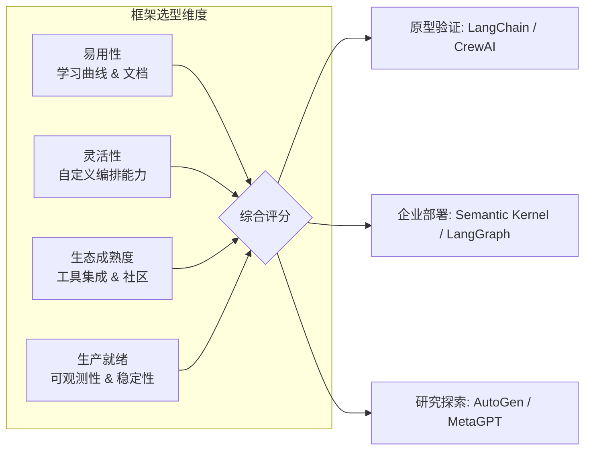

# 第 11 章 框架对比与选型

本章对主流 Agent 框架进行横向对比评测：LangGraph、CrewAI、AutoGen、OpenAI Agents SDK 等。框架选型是 Agent 项目启动时最重要的技术决策之一——错误的选择可能导致数月后的推倒重来。本章从架构设计、开发体验、生产就绪度、社区生态四个维度提供客观的对比分析和选型建议。前置依赖：第 9–10 章的多 Agent 概念。

---

## 11.1 主流框架概览



**图 11-1 框架选型四维度模型**——框架选型不是一次性决策，而是随项目成熟度变化的。初期用 LangChain 快速验证，中期可能迁移到 LangGraph 获得更细粒度的控制。


### 11.1.1 框架全景图

当前 AI Agent 开发框架可以从多个维度进行分类和比较。下表从版本、语言支持、许可证、状态管理、工具支持、多 Agent 协作、流式处理、检查点机制、可观测性和社区活跃度等维度，对九大主流框架进行全面对比：

| 维度 | Google ADK | LangGraph | CrewAI | AutoGen / AG2 | OpenAI Agents SDK | Mastra | Vercel AI SDK | Claude Agent SDK | Agno |
|------|-----------|-----------|--------|---------------|-------------------|--------|---------------|-----------------|------|
| **最新版本** | 1.x (2025) | 1.0 (GA, 2025 Q4) | 1.9+ | 0.4 (MS) / 0.4+ (AG2) | 0.x (持续迭代) | 1.0 (2026 Q1) | 5.x (2025) | 0.x (2025 Q3, Claude Code 同源) | 最新稳定 |
| **主要语言** | Python/TS | Python/TS | Python | Python/.NET | Python/TS | TypeScript | TypeScript | Python (TS社区版) | Python |
| **许可证** | Apache 2.0 | MIT | MIT | MIT(已更改) | MIT | Apache 2.0 | Apache 2.0 | MIT | Apache 2.0 |
| **状态管理** | Session-based | Annotated State + Reducer | 内置 Memory | Event-driven Runtime | RunContext + Sessions | Workflow Engine | Server State (AI SDK UI) | Agent Loop Context | Session-based |
| **工具支持** | FunctionTool, ToolSet | ToolNode, ToolExecutor | @tool 装饰器 | function_map / FunctionTool | function_tool + MCP | Tools + MCP 原生 | Tools + MCP 原生 | Tools + MCP 原生 + Computer Use 内置 | Tools + Toolkits |
| **多 Agent** | A2A Protocol | Multi-graph Composition | Crew + Process | AgentChat GroupChat | Handoff 机制 | Workflow 编排 | Subagent 组合 | Handoff + Subagents | Router/Coordinator/Team |
| **流式处理** | Runner.stream() | .astream_events() | Callback-based | 原生 Streaming | Runner.run_streamed() | Stream API | SSE 原生 Streaming | AsyncGenerator 原生流 | 原生 Streaming |
| **检查点** | Session Store | MemorySaver/PostgresSaver | 无原生支持 | 无原生支持 | 无原生支持 | Workflow 持久化 | 无原生支持 | 无原生支持 | 无原生支持 |
| **可观测性** | 基础追踪 | LangSmith 全链路追踪 | 基本日志 | 内置追踪 | OpenAI Tracing 面板 | OpenTelemetry 集成 | Vercel 原生监控 | 基础追踪 | 内置仪表盘 |
| **社区活跃度** | ★★★☆☆ (新兴) | ★★★★★ (最活跃) | ★★★★☆ | ★★★★☆ (分裂后) | ★★★★☆ (快速增长) | ★★★★☆ (快速增长) | ★★★★★ (Web 生态) | ★★★☆☆ (新兴) | ★★★★☆ (活跃) |
| **首次发布** | 2024 Q4 | 2024 Q1 | 2023 Q4 | 2023 Q3 | 2025 Q1 | 2024 Q3 | 2023 Q3 | 2025 Q3 | 2023 Q4 |
| **GitHub Stars** | ~10k | ~18k | ~27k | ~40k(含AG2) | ~15k | ~25k | ~18k | ~7k | ~18k |
| **适合场景** | Google 生态集成 | 复杂状态工作流 | 快速原型开发 | 研究与分布式 Agent | OpenAI 生态应用 | TS 全栈 Agent 开发 | Web/前端 Agent 开发 | Agentic Coding, Computer Use, 深度推理 | 快速多 Agent 原型 |

### 11.1.2 框架演进历史

**Google ADK (Agent Development Kit)**

Google ADK 于 2024 年末正式发布，是 Google 在 Agent 领域的重要布局。它从 Google 内部的 Vertex AI Agent Builder 演化而来，融合了 Google 在大规模分布式系统方面的经验。ADK 的核心设计理念是"组合优于继承"，通过 SequentialAgent、ParallelAgent 和 LoopAgent 三种原语，实现灵活的 Agent 编排。2025 年初，Google 进一步引入了 A2A (Agent-to-Agent) 协议，使得不同框架构建的 Agent 可以标准化地互相通信。

**LangGraph**

LangGraph 是 LangChain 团队于 2024 年初推出的有状态工作流编排框架，并于 2025 年 Q4 达到 **v1.0 GA (Generally Available)** 里程碑 [[LangGraph 1.0 is now generally available]](https://changelog.LangChain.com/announcements/langgraph-1-0-is-now-generally-available)。它从 LangChain 早期的 AgentExecutor 演化而来，解决了前者在复杂工作流中的局限性。LangGraph 的核心创新在于将 Agent 的执行流程建模为有向图 (Directed Graph)，其中节点是计算步骤，边是状态转移条件。

LangGraph v1.0 带来了三大核心能力：**持久化状态 (Durable State)**——Agent 执行状态自动持久化；**内置检查点 (Built-in Persistence)**——无需手写数据库逻辑即可保存和恢复工作流，支持跨会话的多日审批流程和后台任务；**Human-in-the-loop 一等支持**——在高风险决策节点暂停执行等待人工审批。LangGraph v1.0 标志着 LangChain 生态的明确分工：**LangChain** 聚焦于 LCEL 链式组合层，而 **LangGraph** 作为底层编排运行时负责持久执行和状态管理。可观测性方面，**LangSmith** 提供全链路追踪、调试和评估能力。

**CrewAI**

CrewAI 于 2023 年末发布，以其直观的"角色扮演"隐喻迅速获得开发者青睐。它借鉴了现实世界中团队协作的模式，让开发者可以定义具有特定角色 (Role)、目标 (Goal) 和背景故事 (Backstory) 的 Agent，然后组织它们成为一个"团队" (Crew) 来完成复杂任务。截至 2026 年 Q1，CrewAI 已迭代至 **1.9+ 版本**，新增了结构化输出、流式响应和改进的 Agent 委派机制。

**AutoGen / AG2**

AutoGen 源自微软研究院，于 2023 年中期发布，是最早的多 Agent 对话框架之一。其核心设计理念是"对话驱动的 Agent 协作"。2025 年 1 月，微软发布了 **AutoGen 0.4**，引入了基于异步 Actor 模型的事件驱动架构。值得注意的是，AutoGen 的原始核心创建者从微软官方仓库中分离出来，以 **AG2** (ag2.ai) 的名义独立运营。因此目前存在两条路径：**Microsoft AutoGen 0.4+**（全新异步架构，面向企业级分布式场景）和 **AG2**（社区维护，延续 0.2 API 风格）。

**OpenAI Agents SDK**

OpenAI Agents SDK 是 OpenAI 于 2025 年初发布的官方 Agent 开发框架，作为此前 Swarm 实验项目的生产级替代品。它的设计哲学是"极简主义"——用最少的原语实现最常见的 Agent 模式。核心概念包括 **Agent**、**Handoff**、**Guardrail**、**Runner** 和 **Tracing**。Agents SDK 深度整合了 OpenAI 的模型能力，包括结构化输出、MCP 连接器和内置工具。


### 11.1.3 架构核心抽象对比

各框架在核心抽象模型上存在显著差异，这些差异直接影响了开发体验和适用场景。完整的类型定义见代码仓库 `code-examples/ch11/` 目录，核心设计要点如下：

- **Google ADK** 围绕 Agent（执行单元）、Tool（外部能力）、Runner（执行引擎）和 Session（状态管理）四个概念构建，通过 SequentialAgent/ParallelAgent/LoopAgent 三种组合原语实现编排。
- **LangGraph** 以 StateGraph（有向状态图）为核心，通过 Node（计算节点）、Edge（普通边）、Conditional Edge（条件边）和 Annotated State（带 Reducer 的状态定义）实现精确的流程控制。
- **CrewAI** 采用 Agent（角色定义）、Task（工作单元）、Crew（团队）、Process（执行方式）的四层模型，以角色隐喻降低上手门槛。
- **AutoGen** 以 ConversableAgent 为基础，通过 GroupChat 和 GroupChatManager 实现多 Agent 对话协作，0.4 版本引入了异步 Actor 模型。
- **OpenAI Agents SDK** 仅有四个核心原语：Agent（执行体）、Handoff（任务委派）、Guardrail（护栏）、Runner（执行引擎），追求极简。
- **Mastra** 以 TypeScript 原生类型安全为特色，提供 Temporal 风格的 Workflow 引擎、内置 RAG 管道和 MCP 一等支持。
- **Claude Agent SDK** 采用"模型即编排器"理念，核心是 Agent Loop（LLM 生成 → 工具调用 → 结果反馈 → 继续），以极薄抽象层包装 Claude API。

---

## 11.2 各框架深度分析

本节从两个代表性框架（LangGraph 和 OpenAI Agents SDK）出发进行深度剖析，其余框架以对比表格形式呈现核心差异。

### 11.2.1 LangGraph 深度分析

> **版本说明**：本节基于 LangGraph v1.0 (GA) 稳定版。LangGraph 现在是 LangChain 生态中**推荐的 Agent 编排框架**，LangChain 本身聚焦于 LCEL 链式组合层，而 LangGraph 负责底层持久化运行时。生产环境可观测性推荐使用 **LangSmith** 进行全链路追踪和调试。

#### 核心概念

LangGraph 将 Agent 的执行流程建模为有向图 (StateGraph)，其核心概念包括：

1. **StateGraph**：有向状态图，定义整个工作流结构
2. **Node（节点）**：图中的计算单元，每个节点接收状态、执行逻辑、返回状态更新
3. **Edge（边）**：节点之间的连接，定义执行顺序
4. **Conditional Edge（条件边）**：基于状态动态决定下一个节点的路由逻辑
5. **Annotated State（注解状态）**：带有 Reducer 函数的状态定义，控制状态的更新方式

#### 状态管理：Reducer 模式

LangGraph 的状态管理借鉴了 Redux 的 Reducer 模式。每个状态字段可以定义自己的 Reducer 函数，决定新值如何与旧值合并（overwrite / append / 自定义 Reducer）。这种设计使得多个节点可以安全地并发更新同一个状态对象。

#### 检查点与持久化

LangGraph 提供了业界最完善的检查点机制，支持将每一步的状态快照持久化到存储后端、从任意检查点恢复执行、"时间旅行"调试以及 Human-in-the-loop 暂停与恢复。

#### 代码示例

以下展示 LangGraph 风格的状态图 Agent 核心结构。该示例演示了如何构建一个多步骤客户服务 Agent，包含状态定义、节点逻辑和条件路由。完整实现见代码仓库 `code-examples/ch11/langgraph-customer-service/` 目录，核心设计要点如下：

```typescript
// LangGraph 风格的状态图 Agent——核心结构示例

// 1. 状态定义（带 Reducer）
interface CustomerServiceState {
  messages: Message[];           // Reducer: append
  currentIntent: string | null;  // Reducer: overwrite
  ticketId: string | null;
  escalated: boolean;
}

// 2. 节点定义
function classifyIntent(state: CustomerServiceState): Partial<CustomerServiceState> {
  // 调用 LLM 分类用户意图
  const intent = llm.classify(state.messages);
  return { currentIntent: intent };
}

function handleRefund(state: CustomerServiceState): Partial<CustomerServiceState> {
  // 处理退款逻辑
  return { messages: [...state.messages, { role: 'assistant', content: '退款已处理' }] };
}

// 3. 图构建
const graph = new StateGraph<CustomerServiceState>()
  .addNode('classify', classifyIntent)
  .addNode('refund', handleRefund)
  .addNode('support', handleSupport)
  .addConditionalEdge('classify', routeByIntent, {
    refund: 'refund',
    technical: 'support',
    escalate: END,
  })
  .compile({ checkpointer: new PostgresSaver(connectionString) });

// 4. 执行（支持流式 + 检查点恢复）
const result = await graph.invoke(initialState, { configurable: { thread_id: 'ticket-123' } });
```

**优势**：v1.0 生产稳定、灵活的图结构、业界最强状态管理与检查点、Human-in-the-loop 原生支持、LangSmith 全链路可观测。

**劣势**：学习曲线陡峭、简单任务过于重量级、状态类型定义繁琐。

### 11.2.2 OpenAI Agents SDK 深度分析

#### 核心概念

OpenAI Agents SDK 追求极简设计，仅有四个核心原语：

1. **Agent**：绑定指令、工具和 Handoff 的 LLM 执行体
2. **Handoff**：Agent 之间的任务委派，实现多 Agent 协作
3. **Guardrail**：输入/输出护栏，确保安全性
4. **Runner**：执行引擎，驱动 Agent Loop 并管理追踪

#### 代码示例

以下展示 OpenAI Agents SDK 风格的多 Agent 客服系统，演示 Handoff 和 Guardrail 机制。完整实现见代码仓库 `code-examples/ch11/openai-agents-customer-service/` 目录，核心设计要点如下：

```typescript
// OpenAI Agents SDK 风格——多 Agent 客服系统核心结构

// 1. 定义工具
const lookupOrder = functionTool({
  name: 'lookup_order',
  description: '查询订单状态',
  parameters: z.object({ orderId: z.string() }),
  execute: async ({ orderId }) => {
    return await orderService.getOrder(orderId);
  },
});

// 2. 定义专业 Agent
const refundAgent = new Agent({
  name: 'Refund Specialist',
  instructions: '你是退款专员。处理退款请求，验证订单信息后执行退款。',
  tools: [lookupOrder, processRefund],
});

const technicalAgent = new Agent({
  name: 'Technical Support',
  instructions: '你是技术支持专员。解决用户的技术问题。',
  tools: [lookupOrder, diagnoseTechnicalIssue],
});

// 3. 定义主 Agent（带 Handoff 和 Guardrail）
const triageAgent = new Agent({
  name: 'Triage Agent',
  instructions: '你是客服分流 Agent。根据用户问题类型转交给对应专员。',
  handoffs: [
    handoff(refundAgent, { description: '退款相关问题' }),
    handoff(technicalAgent, { description: '技术问题' }),
  ],
  inputGuardrails: [
    { name: 'content_filter', execute: async (input) => filterHarmfulContent(input) },
  ],
});

// 4. 执行（支持流式）
const result = await Runner.run(triageAgent, '我的订单 ORD-12345 还没到，我想退款');
// 或流式执行：
const stream = Runner.runStreamed(triageAgent, userMessage);
for await (const event of stream) {
  handleStreamEvent(event); // 追踪 handoff、工具调用、最终回复
}
```

**优势**：API 极简（四个原语即可覆盖大多数场景）、Handoff 优雅实现多 Agent 分工、内置 Guardrail、深度整合 OpenAI 模型和内置工具（Web Search / Code Interpreter）、内置 Tracing 面板。

**劣势**：OpenAI 供应商锁定、状态管理能力较弱（无检查点）、框架较新仍在快速迭代中。

### 11.2.3 其余框架对比摘要

以下以对比表格形式呈现其余七个框架的核心特征，帮助读者快速定位适合自己需求的框架。每个框架的完整代码示例见 `code-examples/ch11/` 对应子目录。

| 框架 | 核心概念 | 代码模式 | 典型优势 | 主要局限 |
|------|---------|---------|---------|---------|
| **Google ADK** | Agent + Tool + Runner + Session；三种编排原语（Sequential / Parallel / Loop） | 声明式 Agent 树 + A2A 协议跨框架通信 | Google 生态深度整合、A2A 开放协议、编排原语简洁 | 社区较新、文档示例较少、非 Google 模型支持有限 |
| **CrewAI** | Agent（角色/目标/背景故事）+ Task + Crew + Process | 角色扮演隐喻，定义 Agent 角色后组队执行 | 上手最快、角色隐喻直观、Task 依赖自动管理 | 状态管理有限、无检查点、复杂控制流支持不足 |
| **AutoGen / AG2** | ConversableAgent + GroupChat + GroupChatManager | 对话驱动，Agent 通过自然语言对话协调任务 | 对话驱动自然直观、群聊机制灵活、内置代码执行沙箱 | 0.4 与 0.2 API 不兼容、AG2 分叉导致社区分裂、对话轮数不可控 |
| **Mastra** | Agent + Workflow（Temporal 风格）+ Tools + MCP 一等支持 | TypeScript 原生类型安全，声明式配置 + 50+ 内置集成 | TS 原生、MCP 一等支持、内置 RAG 和评估框架、1.0 生产就绪 | Python 开发者需切换技术栈、图编排灵活性不如 LangGraph |
| **Claude Agent SDK** | Agent Loop + Tools + Handoff + Hooks + Guardrails | "模型即编排器"——极薄抽象，模型自主决定工具调用顺序 | 与 Claude Code 同源、Extended Thinking 原生集成、Computer Use 内置 | Anthropic 生态绑定、框架较新、无内置检查点 |
| **Agno** | Agent + Team（Router / Coordinator / Team 三种模式） | Python 极简 API，几行代码创建多 Agent 团队 | API 极简、三种协作模式灵活切换、多模态原生支持、内置监控 | 深度定制能力有限、状态管理简单、大规模编排支撑不足 |
| **Vercel AI SDK** | AI SDK Core + UI Hooks + Agent 抽象 (v5+) + Tool 系统 | TypeScript，面向 Web 应用，React/Vue/Svelte hooks | Web 生态最佳集成、25+ 模型提供商、流式 UI 原生、MCP 支持 | 复杂多 Agent 编排有限、无检查点、主要面向 Web 场景 |

> **阅读建议**：对于选型决策，11.1.1 的全景对比表和本表已覆盖主要维度。如需了解某个框架的编程范式细节，建议直接参考其官方文档和 `code-examples/ch11/` 中的完整示例。

---

## 11.3 框架抽象层

在实际项目中，直接绑定某个特定框架会带来巨大的迁移风险。本节介绍如何构建一个框架无关的抽象层，使得业务逻辑与底层框架解耦。

### 11.3.1 抽象层设计原则

框架抽象层的核心思路是定义一组框架无关的接口（如 `AgentRuntime`），然后为每个具体框架提供适配实现。完整的接口定义和工厂模式实现见代码仓库 `code-examples/ch11/abstraction-layer/` 目录，核心设计要点如下：

1. **统一的 AgentRuntime 接口**：包含 `createAgent`、`runAgent`、`addTool`、`listTools`、`destroyAgent` 和 `healthCheck` 方法，覆盖 Agent 生命周期管理的全部操作。
2. **Agent 工厂模式**：通过 `FrameworkType`（如 `'langgraph' | 'openai-agents' | 'crewai' | 'mastra'`）选择底层实现，业务层无需感知具体框架。
3. **插件系统**：支持运行时注册新的框架适配器，实现零代码扩展。
4. **A/B 测试支持**：工厂层可同时创建两个框架实例，对比相同输入下的输出质量和延迟。

这种设计的关键收益是：当需要更换底层框架时（例如从 CrewAI 迁移到 LangGraph），只需替换适配器实现，业务逻辑完全不变。迁移风险从"不可逆的架构决策"降级为"可随时调整的配置变更"。

---

## 11.4 基准测试对比

选型决策不应仅依赖定性分析，还需要定量的基准测试数据。基准测试框架的完整实现见代码仓库 `code-examples/ch11/benchmark/` 目录，核心设计要点如下：每个测试场景（简单问答、多工具任务、多 Agent 协作）通过统一的 `BenchmarkScenario` 接口定义输入、期望输出和评估函数，然后在各框架上分别运行并收集成功率、延迟分位数、Token 消耗和成本数据。

### 11.4.1 测试结果对比（示意数据，基于 2025-2026 公开信息估算）

| 框架 | 场景 | 成功率 | P50 延迟 | P90 延迟 | 平均 Token | 千次成本 |
|------|------|--------|----------|----------|-----------|---------|
| **Google ADK** | 简单问答 | 98% | 1.2s | 1.8s | 450 | $1.35 |
| **Google ADK** | 多工具任务 | 92% | 8.5s | 15.2s | 2,800 | $8.40 |
| **Google ADK** | 多 Agent | 85% | 35s | 62s | 8,500 | $25.50 |
| **LangGraph** | 简单问答 | 99% | 1.5s | 2.2s | 520 | $1.56 |
| **LangGraph** | 多工具任务 | 95% | 7.8s | 12.5s | 2,600 | $7.80 |
| **LangGraph** | 多 Agent | 92% | 28s | 48s | 7,200 | $21.60 |
| **CrewAI** | 简单问答 | 97% | 1.8s | 2.8s | 580 | $1.74 |
| **CrewAI** | 多工具任务 | 88% | 12s | 22s | 3,200 | $9.60 |
| **CrewAI** | 多 Agent | 82% | 45s | 78s | 12,000 | $36.00 |
| **AutoGen** | 简单问答 | 96% | 2.0s | 3.5s | 620 | $1.86 |
| **AutoGen** | 多工具任务 | 85% | 15s | 28s | 3,800 | $11.40 |
| **AutoGen** | 多 Agent | 88% | 38s | 65s | 10,500 | $31.50 |
| **OpenAI Agents** | 简单问答 | 99% | 1.0s | 1.5s | 400 | $1.20 |
| **OpenAI Agents** | 多工具任务 | 93% | 6.5s | 11s | 2,400 | $7.20 |
| **OpenAI Agents** | 多 Agent | 88% | 25s | 45s | 7,800 | $23.40 |
| **Mastra** | 简单问答 | 98% | 1.1s | 1.7s | 430 | $1.29 |
| **Mastra** | 多工具任务 | 93% | 7.5s | 13s | 2,500 | $7.50 |
| **Mastra** | 多 Agent | 85% | 32s | 55s | 8,200 | $24.60 |
| **Vercel AI SDK** | 简单问答 | 99% | 0.9s | 1.4s | 390 | $1.17 |
| **Vercel AI SDK** | 多工具任务 | 94% | 6.0s | 10s | 2,300 | $6.90 |
| **Vercel AI SDK** | 多 Agent | 80% | 40s | 70s | 9,500 | $28.50 |

### 11.4.2 各框架优化建议

| 框架 | 优化方向 | 建议 | 预期效果 |
|------|---------|------|---------|
| Google ADK | 延迟 | 使用 Gemini Flash 替代 Pro | 降低 40-60% |
| LangGraph | 可靠性 | 使用 PostgresSaver 实现持久化检查点 | 成功率 +15-20% |
| CrewAI | Token 效率 | 精简 Agent backstory | 消耗降低 15-25% |
| AutoGen | 成本 | 设置合理的 max_consecutive_auto_reply | 成本降低 30-50% |
| OpenAI Agents | 延迟 | 使用 run_streamed 替代 run | 感知延迟降低 50-70% |
| Mastra | 工作流效率 | 利用 Workflow 持久化 + MCP 工具池 | 端到端延迟降低 20-30% |
| Vercel AI SDK | 前端体验 | 使用 SSE Streaming + useChat hooks | 感知延迟降低 60-80% |

---

## 11.5 选型决策方法论

> **核心原则**: 框架选型不是技术审美活动，而是工程决策过程。好的选型方法应该量化、可重复、可追溯。

### 11.5.1 多维决策矩阵

选型决策需要综合考虑技术、团队、业务三个维度。通过加权评分的决策矩阵，可以将主观判断转化为可量化的对比。完整的决策矩阵实现（包含标准化评估模板、团队适配评估器和场景匹配引擎）见代码仓库 `code-examples/ch11/selection-tools/` 目录，核心设计要点如下：

**技术维度**（建议权重 40%）：评估框架的状态管理能力、工具生态丰富度、流式处理成熟度、检查点机制和可观测性集成。

**团队维度**（建议权重 30%）：评估团队的主要编程语言、分布式系统经验、现有技术栈兼容性和学习曲线承受力。例如，如果团队主要使用 TypeScript 且有 Web 开发背景，Mastra 和 Vercel AI SDK 的适配成本远低于需要 Python 经验的 LangGraph。

**业务维度**（建议权重 30%）：评估上市时间压力、合规要求（数据主权、审计日志）、预期规模（Agent 数量、请求量）和预算约束。

### 11.5.2 TCO (总拥有成本) 分析

选框架还需要计算长期的总拥有成本，包括开发、运营、维护的全部支出。TCO 分析工具的完整实现见代码仓库 `code-examples/ch11/selection-tools/tco-analyzer.ts`，它覆盖了以下成本项：开发人力成本（学习期 + 实现期）、基础设施成本（计算 + 存储 + 网络 + 第三方服务）、运营成本（监控 + 告警 + 事故响应）和维护成本（框架升级 + 安全补丁 + 技术债务）。建议在选型评审中针对 Top 3 候选框架分别进行 12 个月和 24 个月的 TCO 估算。

### 11.5.3 选型决策速查表

| 如果你的场景是… | 推荐框架 | 核心理由 |
|----------------|---------|---------|
| 快速 MVP 验证 | CrewAI | 上手快，2 周内可出原型 |
| 复杂工作流编排 | LangGraph | 图结构灵活，Checkpoint 可靠 |
| 多 Agent 代码协作 | AutoGen | 内置代码沙箱，对话驱动 |
| OpenAI 全家桶 | OpenAI Agents SDK | 无缝集成，延迟最低 |
| Google Cloud 生态 | Google ADK | 原生 Vertex AI + A2A |
| 需要人工审批流 | LangGraph | interrupt_before/after 原生支持 |
| 数据不出境要求 | LangGraph + 本地模型 | 支持 Ollama 等本地部署 |
| 预算极度有限 | CrewAI + GPT-3.5 | 框架开销低 + 廉价模型 |
| 企业级生产系统 | LangGraph / ADK | 状态管理和错误恢复最完善 |
| TypeScript 全栈 Agent | Mastra | TS 原生、MCP 一等支持、Workflow 引擎 |
| Web 前端 Agent 集成 | Vercel AI SDK | 流式 UI、React hooks、25+ 模型提供商 |
| 最快上手体验 | OpenAI Agents SDK | 极简 API、内置 Tracing、几行代码即可运行 |

---

## 11.6 框架迁移策略

> **迁移第一定律**: 永远不要做大爆炸式迁移。渐进式、可回滚的灰度迁移是唯一靠谱的路线。

### 11.6.1 迁移六阶段方法论

框架迁移是高风险工程活动。以下基于实际项目经验总结的六阶段迁移方法：

| 阶段 | 名称 | 核心活动 | 持续时间 | 成功标准 |
|------|------|---------|---------|---------|
| 1 | 评估 | 梳理现有系统、识别依赖、评估目标框架 | 1-2 周 | 完成依赖图和风险清单 |
| 2 | 抽象 | 引入 11.3 节的抽象层，隔离框架 API | 2-4 周 | 现有功能通过抽象层运行且测试全通过 |
| 3 | 并行 | 新框架实现抽象层接口，两套同时运行 | 2-4 周 | 新实现通过 100% 回归测试 |
| 4 | 灰度 | 按流量百分比切换，从 1% 开始 | 2-4 周 | P99 延迟 < 旧系统 120%，错误率 < 0.1% |
| 5 | 切换 | 全量切到新框架，旧框架作为 fallback | 1-2 周 | 连续 7 天无回退 |
| 6 | 清理 | 移除旧代码、抽象层简化、文档更新 | 1-2 周 | 代码覆盖率恢复，文档更新完毕 |

灰度迁移执行器的完整实现（包含自动回滚、指标采集和报告生成）见代码仓库 `code-examples/ch11/migration/` 目录，核心设计要点如下：执行器维护源框架和目标框架两个运行时实例，按配置的流量百分比将请求路由到不同实例；如果目标框架的错误率或延迟超过阈值，自动回滚到源框架。灰度比例建议按 5% → 10% → 25% → 50% → 100% 递增，每次递增前确认指标正常。

### 11.6.2 迁移常见陷阱与应对

| 陷阱 | 说明 | 应对策略 |
|------|------|---------|
| 状态格式不兼容 | 旧框架的状态序列化格式与新框架不同 | 编写 StateTransformer 做状态格式转换 |
| 工具签名差异 | 同一工具在不同框架中的注册方式不同 | 通过 11.3 节的抽象层统一工具接口 |
| 隐式行为依赖 | 代码依赖了旧框架的未文档化行为 | 对照测试发现差异，补充适配代码 |
| 并发模型不同 | 旧框架单线程，新框架异步并发 | 添加并发控制，逐步放开限制 |
| 错误码映射 | 不同框架的错误类型和码值不同 | 建立统一错误分类和映射表 |
| Token 消耗变化 | 新框架的 prompt 模板不同导致消耗变化 | 灰度期监控 Token 消耗趋势 |

### 11.6.3 迁移检查清单

**迁移前：**
- [ ] 完成依赖关系图（所有模块对旧框架的调用点）
- [ ] 编写完整的回归测试套件（覆盖率 > 80%）
- [ ] 建立性能基线（延迟 P50/P95/P99、错误率、Token 消耗）
- [ ] 引入抽象层并确认现有功能正常
- [ ] 评估新框架的 API 变更风险（roadmap、breaking changes）
- [ ] 准备回滚方案和应急预案

**迁移中：**
- [ ] 灰度比例按计划递增（5% → 10% → 25% → 50% → 100%）
- [ ] 每次递增前确认指标正常（延迟、错误率、成本）
- [ ] 监控用户反馈和异常报告
- [ ] 记录所有不兼容问题和解决方案

**迁移后：**
- [ ] 清理旧框架代码和依赖
- [ ] 更新技术文档和运维手册
- [ ] 简化抽象层（如果只保留一个框架）
- [ ] 输出迁移复盘报告

---

## 11.7 自建 vs 采用：何时造轮子

> **核心问题**: 是基于现有框架构建，还是从零打造自己的 Agent 框架？这是每个团队最终都会面对的灵魂拷问。

### 11.7.1 核心复杂度评估

从零构建一个最小可行的 Agent 框架（Agent Loop + 工具调用 + 单 Agent 编排），核心代码量约 150-300 行。这说明 Agent 框架的**核心并不复杂**——真正的工作量在于生产化所需的长尾能力：错误恢复、状态持久化、流式处理、可观测性、多模型支持等。完整的最小可行 Agent 框架和最小编排器实现见代码仓库 `code-examples/ch11/minimal-framework/` 目录。

### 11.7.2 自建决策参考矩阵

| 因素 | 倾向自建 | 倾向采用 |
|------|---------|---------|
| 团队规模 | >= 8 人 | <= 3 人 |
| 独特需求 | >= 5 个核心差异点 | <= 2 个 |
| 时间窗口 | >= 16 周 | <= 4 周 |
| 维护周期 | > 2 年 | < 6 个月 |
| 性能要求 | P99 < 500ms | P99 < 5s |
| 合规约束 | 有数据主权要求 | 无特殊要求 |
| 基础设施 | 高度定制化 | 标准云环境 |

### 11.7.3 混合方案：最佳实践

在多数实际项目中，"混合"是最现实的选择。推荐的混合策略采用三层架构：

1. **应用层（自建）**：业务逻辑、自定义编排、领域特化工具——这些是业务独特性的体现，应该自主掌控。
2. **框架层（采用，可替换）**：通过 11.3 节的抽象层隔离，底层框架（LangGraph / Mastra / OpenAI Agents SDK 等）可以按需切换。
3. **基础设施层（独立）**：LLM 网关、监控、日志、配置中心——独立于框架，提供统一的运维能力。

**混合策略的关键原则**：框架层可替换、业务逻辑自主、基础设施复用、渐进式演进（从采用开始，按需将关键模块替换为自建实现）。

---

## 11.8 学术基础与延伸阅读

AI Agent 框架的设计并非凭空而来，而是建立在近年来大量学术研究成果之上。以下论文构成了当前 Agent 框架的理论基石：

| 论文 | 作者 | 年份/会议 | 核心贡献 |
|------|------|-----------|----------|
| ReAct: Synergizing Reasoning and Acting | Yao et al. | ICLR 2023 | 思考-行动-观察循环，Agent 推理框架基石 |
| Toolformer: Language Models Can Teach Themselves to Use Tools | Schick et al. | NeurIPS 2023 | 自监督工具使用学习 |
| Generative Agents: Interactive Simulacra of Human Behavior | Park et al. | UIST 2023 | 25 个 AI Agent 模拟人类社区，记忆-反思-规划架构 |
| Reflexion: Language Agents with Verbal Reinforcement Learning | Shinn et al. | NeurIPS 2023 | 语言反馈驱动的 Agent 自我改进 |
| Language Agent Tree Search (LATS) | Zhou et al. | NeurIPS 2023 | 将 MCTS 引入 Agent 决策，结合推理、行动、规划 |
| AutoGen: Enabling Next-Gen LLM Applications via Multi-Agent Conversation | Wu et al. | 2023 | 多 Agent 对话框架，直接催生了 AutoGen 项目 |
| AgentBench: Evaluating LLMs as Agents | Liu et al. | ICLR 2024 | Agent 能力评估基准，8 个环境的系统性测试 |

**论文与框架的对应关系**：

- **ReAct** → 几乎所有框架的 Agent Loop 都实现了 ReAct 的"思考-行动-观察"循环
- **Toolformer** → 框架中 Tool/Function Calling 机制的学术基础
- **Generative Agents** → CrewAI 的角色扮演和记忆系统、Agno 的多 Agent 协作设计
- **Reflexion** → Generator-Critic 模式（§10.5）、Evaluator-Optimizer 模式（§10.11.5）的理论来源
- **LATS** → LangGraph 的图搜索和条件分支的理论参考
- **AutoGen 论文** → AutoGen 框架的直接理论基础
- **AgentBench** → §11.4 基准测试方法论的学术参考

> **延伸阅读建议**：如果只有时间读一篇，推荐从 **ReAct** 开始——它定义了当前几乎所有 Agent 框架的核心执行范式。

---

## 11.9 Claude Agent SDK 深度解析

> **为什么需要一个单独的深度章节？** 11.2.3 已经介绍了 Claude Agent SDK 的基本特征。本节进一步剖析其独特的"模型即编排器"设计范式，这与 LangGraph 的显式状态图编排和 OpenAI Agents SDK 的 Runner + Handoff 模式形成了鲜明对比。

### 11.9.1 设计哲学与架构

Claude Agent SDK 起源于 Anthropic 在 2025 年初发布的 Claude Code。Anthropic 将驱动 Claude Code 的核心执行循环（Agent Loop）提取、抽象并开源，便诞生了 Claude Agent SDK。其核心设计理念可以用一句话概括：**"Agent Loop 是一等原语，模型本身是编排器。"**

与其他框架的关键设计差异在于：

| 设计维度 | 传统方式（LangGraph 风格） | Claude Agent SDK 方式 |
|---------|------------------------|---------------------|
| **编排逻辑** | 开发者通过显式的图结构定义流程 | 模型自主决定工具调用顺序和分支 |
| **抽象厚度** | 中等——状态图、Reducer、Checkpointer | 极薄——几乎是 Claude API 的直接包装 |
| **流程控制** | 预定义节点和边 | 模型运行时决策 |
| **调试方式** | 检查图结构和状态快照 | 检查 API 请求/响应序列 |

这种"极薄抽象 (Thin Abstraction)"原则带来了三个显著优势：**调试透明性**——没有"框架魔法"，每一步都可追踪到具体的 API 调用；**学习曲线低**——只需理解 Claude API 的 tool_use 机制即可；**升级无痛**——Claude 模型能力升级时，SDK 无需大幅改动即可受益。

### 11.9.2 核心能力

**Extended Thinking 集成**：Extended Thinking 是 Claude 模型的原生能力，允许模型在生成最终回复之前进行深度推理。在 Agent 场景中，它给模型提供了"内心独白"的空间来分析问题、制定计划、评估方案。Claude Agent SDK 原生支持 Thinking Budget 控制，开发者可以按场景配置思考深度——快速响应（4K tokens）、标准分析（10K tokens）、深度推理（25K tokens）或最大模式（50K tokens）。

**Computer Use 内置支持**：与其他框架需要外部集成屏幕操控工具不同，Claude 原生支持通过 API 操控计算机界面（bash 命令执行、文件编辑、屏幕截图与交互），这是 Claude Code 的核心能力基础。

**Handoff 与子 Agent**：通过将 Agent 作为工具注册到其他 Agent，实现任务委派。主 Agent 可以根据任务类型自主决定是否需要委派给专业子 Agent。

### 11.9.3 与其他框架系统性对比

| 维度 | Claude Agent SDK | LangGraph | Google ADK | OpenAI Agents SDK |
|------|-----------------|-----------|------------|-------------------|
| **编排模型** | 模型自主决定 | 显式状态图 | 三原语组合 | Runner + Handoff |
| **抽象层级** | 极薄 | 中等 | 中等 | 薄 |
| **多 Agent 协作** | 工具委托 + Handoff | 原生子图组合 | Agent 树 + A2A | Handoff 机制 |
| **Extended Thinking** | 原生集成 | 不支持 | 不支持 | 不支持 |
| **Computer Use** | 内置支持 | 需外部集成 | 需外部集成 | 需外部集成 |
| **检查点/持久化** | 无内置支持 | 内置 PostgresSaver | 内置 Session Store | 无内置支持 |
| **模型绑定** | 仅 Claude 系列 | 模型无关 | 优先 Gemini | 仅 OpenAI 系列 |
| **最佳场景** | Agentic Coding、Computer Use、深度推理 | 复杂有状态工作流 | Google Cloud 集成 | OpenAI 生态快速开发 |
| **学习曲线** | 低 | 高 | 中等 | 低 |
| **生产就绪度** | 中（Claude Code 已大规模验证） | 高（v1.0 GA） | 中高 | 中 |

### 11.9.4 何时选择 Claude Agent SDK

Claude Agent SDK 的理想使用场景包括：需要 Agentic Coding 能力（代码分析、生成、重构）、需要 Computer Use（GUI 自动化、屏幕操控）、需要 Extended Thinking 进行深度推理、以及任务流程不确定需要模型自主规划的场景。

相反，如果需要精确的流程控制和可审计性（选 LangGraph）、需要模型无关的多供应商策略（选 LangGraph + 抽象层）、或项目已深度集成 OpenAI 生态（选 OpenAI Agents SDK），则不建议选择 Claude Agent SDK。

> **实践建议**：Claude Agent SDK 的"模型即编排器"范式在 Claude Sonnet 4 及以上模型上效果最佳。如果你的场景需要使用较弱的模型，建议选择 LangGraph 等提供显式编排的框架。

---

## 11.10 本章小结

### 11.10.1 核心要点回顾

| 章节 | 核心内容 | 关键收获 |
|------|---------|---------|
| 11.1 | 框架全景 | 了解九大框架的定位和适用场景 |
| 11.2 | 深度分析 | 掌握 LangGraph 和 OpenAI Agents SDK 的编程范式，理解其余框架核心差异 |
| 11.3 | 抽象层 | 学会构建框架无关的可移植代码 |
| 11.4 | 性能基准 | 用数据而非直觉评估框架表现 |
| 11.5 | 选型决策 | 掌握量化决策方法论：多维矩阵 + TCO 分析 |
| 11.6 | 迁移策略 | 具备安全迁移框架的实操能力：六阶段 + 灰度 |
| 11.7 | 自建评估 | 理性评判自建与采用的边界 |
| 11.9 | Claude Agent SDK | 理解"模型即编排器"范式的优势与适用场景 |

### 11.10.2 决策流程图

```
开始
  │
  ├── 是否有强制供应商要求？
  │     ├── Google Cloud → ADK
  │     ├── OpenAI 生态 → OpenAI Agents SDK
  │     ├── Anthropic 生态 → Claude Agent SDK
  │     └── 否 ↓
  ├── 团队主要语言？
  │     ├── TypeScript (Web) → Vercel AI SDK 或 Mastra
  │     ├── TypeScript (全栈) → Mastra
  │     └── Python ↓
  ├── 需要复杂状态管理 / 检查点？
  │     ├── 是 → LangGraph
  │     └── 否 ↓
  ├── 快速原型还是生产系统？
  │     ├── 原型 → CrewAI 或 Agno
  │     └── 生产 ↓
  ├── 需要分布式多 Agent？
  │     ├── 是 → AutoGen 0.4 或 LangGraph
  │     └── 通用编排 → LangGraph
  │
  └── 用决策矩阵（§11.5）验证
        └── 输出最终推荐
```

### 11.10.3 未来趋势展望

AI Agent 框架领域正在快速演进，以下趋势值得关注（截至 2026 年 3 月）：

1. **协议标准化加速**: A2A 和 MCP 已成为事实标准。新生框架均原生支持 MCP，框架的差异化正从"能做什么"转向"做得多好"。

2. **框架分层明确化**: 行业正在形成清晰的分层格局——**高层快速构建**（CrewAI、OpenAI Agents SDK）、**中层编排引擎**（LangGraph v1.0、Mastra Workflow）、**底层运行时**（AutoGen 0.4 Core）。

3. **TypeScript 生态崛起**: Mastra 1.0 和 Vercel AI SDK v5 的成功证明 TypeScript 在 Agent 开发中不再是二等公民。

4. **端到端可观测**: 从 Prompt 构造到工具调用再到最终输出，全链路可观测性已成为框架标配。

5. **社区分叉与融合并存**: AutoGen 的 AG2 分叉展示了开源治理挑战，同时框架之间也在融合——Mastra 与 Vercel AI SDK v5 深度集成。

### 11.10.4 写在最后

框架选型没有银弹。今天的"最佳选择"可能因为团队变化、业务转型、或框架自身的演进而不再适用。重要的不是选到完美的框架，而是建立一套可以持续评估和调整的选型机制。

本章提供的决策矩阵、场景匹配器、TCO 计算器和迁移工具不是一次性使用的——它们应该成为团队技术决策的基础设施，在每次重大技术选型时复用和迭代。

**最后的建议**: 把时间花在抽象层上。好的抽象层让你在框架之间自由切换，把选型风险从"不可逆的架构决策"降级为"可随时调整的配置变更"。
