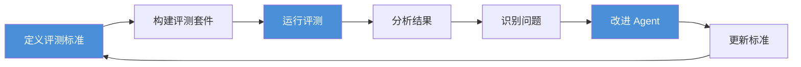
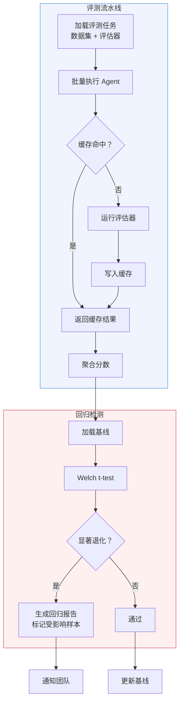

# 第 15 章 Agent 评估体系 — Eval-Driven Development

本章构建 Agent 评估的完整体系——从离线基准测试到在线质量监控。Agent 的非确定性特质使得传统软件测试方法不再适用，因此你需要一套专为 Agent 设计的评估方法论。本章覆盖评估维度定义、自动化评估管线、LLM-as-Judge、人工评估协议和持续质量监控。前置依赖：第 3 章架构总览（理解 Agent 的完整执行流程）。

## 为什么这一章是全书主干

很多团队会先做 Prompt、做工具、做工作流，最后才想起“如何判断它到底变好了没有”。这正是 Agent 工程最常见的失控源头之一：

- 没有统一的“好”定义
- 没有稳定的回归基线
- 没有把线上问题反哺回测试集
- 只能靠主观体验判断改动是否有效

因此，本章不只是一个质量保障章节，它实际上决定了前面所有设计是否能被持续迭代。

## 本章你将学到什么

1. 为什么 Agent 开发必须把评估前置，而不是事后补救
2. 如何从主观感觉转向可执行的评测标准
3. 如何建立最小可运行的 eval harness
4. 如何把离线评估和线上监控接起来

---

## 15.1 Eval-Driven Development 方法论

### 15.1.1 为什么需要评估先行

传统软件开发中，先写代码再写测试（或 TDD 中先写测试再写代码）。但 Agent 开发有其独特性：**我们往往不确定 Agent 的最佳行为模式是什么**。这意味着，如果没有评估先行，你很容易陷入“改了一堆 Prompt 和流程，但不知道到底有没有变好”的状态。Eval-Driven Development（EDD）主张：

1. **先定义"好"的标准**：在编写 Agent 逻辑之前，先明确什么样的输出是优秀的
2. **构建评测套件**：将标准转化为可执行的评测用例
3. **迭代优化**：通过评测结果指导 Prompt 调优、工具设计和架构改进
4. **持续监控**：在生产环境中持续运行评测，捕捉退化

核心洞察是：**Agent 的"正确性"是一个光谱，而非二元判断**。量化光谱上的位置，才能有效改进 Agent。

### 15.1.2 评估飞轮

EDD 形成一个正反馈循环——飞轮每转一次，评测标准更精确（因为对"好"的定义更清晰了）、评测用例更丰富（来自生产环境的真实案例）、Agent 行为更可靠（通过数据驱动的优化）。



### 15.1.3 成熟度模型

Agent 评估不是一蹴而就的工程。下表定义了五个成熟度等级，帮助团队规划演进路径：

| 等级 | 名称 | 核心能力 | 典型投入 |
|------|------|---------|---------|
| L0 | Ad-hoc | 无系统化评估，依赖手动测试 | — |
| L1 | Basic | 基础自动化测试，黄金测试集，工具 Mock | 1-2 周 |
| L2 | Structured | 多维度评估体系，LLM-as-Judge，指标追踪 | 2-4 周 |
| L3 | Continuous | CI/CD 集成，自动回归检测，基线对比 | 1-2 月 |
| L4 | Optimizing | A/B 测试，生产评估闭环，自动测试生成 | 持续 |

成熟度评估遵循**木桶原理**——整体等级取所有维度的最低值。一个团队即使有完善的 LLM-as-Judge（L2），但缺乏 CI/CD 集成（L0），整体仍然只能算 L0。

```typescript
// 成熟度评估器的核心逻辑
// 这里的代码用于说明“如何把实践项映射到成熟度等级”，而不是生产环境中的唯一实现方式

enum EvalMaturityLevel {
  AD_HOC = 0, BASIC = 1, STRUCTURED = 2,
  CONTINUOUS = 3, OPTIMIZING = 4,
}

class EvalMaturityAssessor {
  private practices: EvalPractice[] = [];

  async assess(): Promise<MaturityAssessment> {
    const dimensionResults = new Map<string, MaturityDimension>();
    for (const practice of this.practices) {
      const passed = await practice.check();
      // 按维度聚合，取每个维度达到的最高等级
      this.updateDimension(dimensionResults, practice, passed);
    }
    const dimensions = Array.from(dimensionResults.values());
    // 木桶原理：取所有维度的最低等级
    const overallLevel = Math.min(
      ...dimensions.map(d => d.currentLevel)
    );
    return { overallLevel, dimensions, score: this.calcScore(dimensions) };
  }
}
```

### 15.1.4 EDD 实践原则

五条核心原则贯穿本章始终：

1. **评测先于实现**：在写第一行 Agent 代码之前，先定义评测用例
2. **评测即文档**：评测用例是 Agent 预期行为的最精确描述
3. **持续性大于完美性**：一个不完美但持续运行的评测体系，优于一个完美但只运行一次的评测
4. **多维度覆盖**：不要只测"对不对"，还要测"好不好"、"快不快"、"安全不安全"
5. **数据驱动决策**：所有关于 Agent 的决策（Prompt 修改、工具选择、架构调整）都应有评测数据支撑

---

## 15.2 评测维度与指标体系

### 15.2.1 四维评估模型

Agent 评测需要从四个互补维度进行：

| 维度 | 核心问题 | 典型指标 | 权重参考 |
|------|----------|----------|---------|
| **任务完成度** | Agent 完成了任务吗？ | 成功率、部分完成率、工具选择准确率 | 35% |
| **输出质量** | 输出质量如何？ | 准确率、计划质量、自我纠错率 | 30% |
| **执行效率** | 资源消耗合理吗？ | Token 消耗中位数、工具调用次数、P95 延迟 | 20% |
| **安全合规** | 行为安全吗？ | 越界率、信息泄露率、拒绝准确率 | 15% |

这四个维度之间存在张力——提高质量可能需要更多 Token（降低效率），过于激进的安全策略可能拒绝正常任务（降低完成度）。**好的评测体系需要让这些张力可见**，帮助团队做出明智的权衡决策。

### 15.2.2 指标层次与归一化

每个维度下包含多个具体指标，每个指标有独立的阈值和评分标准。关键设计决策是**如何将异构指标归一化到 0-1 区间**，使得跨维度比较成为可能。

对于"越高越好"的指标（如成功率），使用分段线性插值：

```
score = 0.75 + 0.25 × (raw - good_threshold) / (excellent_threshold - good_threshold)
```

对于"越低越好"的指标（如 Token 消耗），反转阈值后使用相同公式。

```typescript
// 指标归一化与维度评估
// 对应实现可参考 code-examples/ch15/eval-dimension-framework.ts

interface MetricDefinition {
  id: string;
  name: string;
  higherIsBetter: boolean;
  thresholds: {
    excellent: number;  // ≥ 此值得 1.0
    good: number;       // ≥ 此值得 0.75+
    acceptable: number; // ≥ 此值得 0.5+
    poor: number;       // ≥ 此值得 0.25+
  };
  weight: number;  // 维度内权重
  calculator: (samples: EvalSample[]) => number;
}

class EvalDimensionFramework {
  private dimensions: Map<string, EvalDimension> = new Map();

  evaluate(samples: EvalSample[]): OverallEvalResult {
    let overallWeighted = 0;
    const dimScores: DimensionScore[] = [];
    for (const [, dim] of this.dimensions) {
      const ds = this.evaluateDimension(dim, samples);
      dimScores.push(ds);
      overallWeighted += ds.score * dim.weight;
    }
    return {
      overallScore: overallWeighted,
      overallGrade: this.scoreToGrade(overallWeighted),
      dimensionScores: dimScores,
      passed: dimScores.every(ds => ds.passed),
    };
  }

  private normalizeScore(metric: MetricDefinition, raw: number): number {
    const { thresholds, higherIsBetter } = metric;
    if (higherIsBetter) {
      if (raw >= thresholds.excellent) return 1.0;
      if (raw >= thresholds.good)
        return 0.75 + 0.25 * (raw - thresholds.good)
          / (thresholds.excellent - thresholds.good);
      // ... 同理向下分段
    }
    // "越低越好"反转处理
    // ...
  }
}
```

### 15.2.3 指标注册中心

在大型项目中，不同团队可能定义不同的评估指标。`MetricRegistry` 提供集中的注册、查询和变更通知机制，确保指标定义的一致性和可发现性。核心能力包括：按维度/标签查询指标、批量计算、导出定义（用于跨团队共享）、变更监听（用于自动更新仪表盘）。

> **与第 6 章的关联**：工具选择准确率（`tc-tool-selection-accuracy`）直接衡量第 6 章工具系统设计的效果。一个好的工具描述和路由机制应该让 Agent 在 95% 以上的情况下选择正确的工具。

---

## 15.3 工具 Mock 系统

### 15.3.1 为什么需要工具 Mock

Agent 的核心能力是调用外部工具（参见第 6 章）。但在评测场景中，直接调用真实工具存在四个问题：

1. **不可重复**：外部 API 响应随时间变化
2. **成本高昂**：每次评测消耗真实 API 配额
3. **速度慢**：网络延迟和 API 限流影响评测效率
4. **无法测试边界**：难以模拟网络超时、服务降级等异常

工具 Mock 系统通过确定性模拟解决这些问题。

### 15.3.2 Mock 系统架构

Mock 系统支持四种运行模式，复杂度递增：

| 模式 | 说明 | 适用场景 |
|------|------|---------|
| **Rules** | 预定义匹配规则 + 固定响应 | 开发期快速迭代 |
| **Recording** | 代理真实调用并录制结果 | 首次构建 Mock 数据 |
| **Playback** | 回放录制的真实调用结果 | 回归测试 |
| **Hybrid** | 先查录制，未命中则 fallback 到规则 | 生产级评测 |

```typescript
// Mock 系统核心架构
// 对应实现可参考 code-examples/ch15/tool-mock-system.ts

class AdvancedToolMockSystem {
  private mode: MockMode = MockMode.RULES;
  private rules: MockRule[] = [];
  private activePlaybackSession: RecordingSession | null = null;

  async call(toolName: string, input: unknown): Promise<unknown> {
    // 1. 错误注入检查
    if (this.shouldInjectError(toolName)) {
      throw this.createInjectedError();
    }
    // 2. 模拟延迟
    await this.simulateLatency();
    // 3. 按模式路由
    switch (this.mode) {
      case MockMode.RECORDING:
        return this.executeAndRecord(toolName, input);
      case MockMode.PLAYBACK:
        return this.executePlayback(toolName, input);
      case MockMode.HYBRID:
        return this.executeHybrid(toolName, input);
      case MockMode.RULES:
      default:
        return this.executeWithRules(toolName, input);
    }
  }
}
```

### 15.3.3 错误注入与延迟模拟

生产环境中，工具调用失败是常态而非异常。Mock 系统的错误注入模块支持五种错误类型：超时（`ETIMEOUT`）、网络错误（`ENETWORK`）、限流（`ERATELIMIT`）、服务端错误（`ESERVER`）和自定义错误。延迟模拟支持三种分布——均匀分布（适合快速测试）、正态分布（最接近真实场景）和指数分布（模拟长尾延迟）。

关键配置参数：

```typescript
interface ErrorInjectionConfig {
  probability: number;      // 0-1，错误注入概率
  errorType: 'timeout' | 'network' | 'rate-limit' | 'server-error';
  toolFilter?: string[];    // 只对指定工具注入
  consecutiveErrors?: number; // 连续错误次数
}

interface LatencySimulationConfig {
  baseLatency: number;         // 基础延迟 (ms)
  jitter: number;              // 抖动范围 (ms)
  distribution: 'uniform' | 'normal' | 'exponential';
  slowRequestProbability: number;  // 慢请求概率
  slowRequestMultiplier: number;   // 慢请求延迟倍数
}
```

### 15.3.4 场景构建器：Fluent API

复杂评测场景需要多个工具协调 Mock。`MockScenarioBuilder` 提供声明式 Fluent API，让测试场景读起来像一个故事：

```typescript
// 场景构建示例：天气查询 Agent
const scenario = new MockScenarioBuilder('weather-assistant', '天气查询助手')
  .describe('模拟天气查询 Agent 的完整工具调用链')
  .whenTool('geocode')
    .withInputContaining({ city: '北京' })
    .respondsWith({ lat: 39.9042, lng: 116.4074 })
    .withDelay(50)
    .and()
  .whenTool('weather_api')
    .withAnyInput()
    .respondsWith({ temperature: 22, humidity: 45, description: '晴朗' })
    .and()
  .build();

// 预定义模板："重试后成功"场景
const retryScenario = MockScenarioBuilder.retrySuccess(
  'database_query', 2, { results: [{ id: 1, name: 'test' }] }
);
```

> **设计哲学**：每个测试场景应当读起来像一个故事——"当调用 geocode 工具时，返回北京坐标；当调用天气 API 时，返回晴朗天气"。这种可读性对维护大量评测用例至关重要。

---

## 15.4 LLM-as-Judge 评估框架

### 15.4.1 为什么用 LLM 当裁判

传统评测方法（精确匹配、BLEU、ROUGE）在评估 Agent 输出时面临根本局限：**Agent 的输出空间是开放的**，同一任务可能有无数种正确答案。人工评测虽准确，但成本高、速度慢、无法规模化。

| 方法 | 准确性 | 成本 | 速度 | 可扩展性 |
|------|--------|------|------|----------|
| 精确匹配 | 低（开放任务） | 极低 | 极快 | 极好 |
| 传统 NLP 指标 | 中 | 低 | 快 | 好 |
| LLM-as-Judge | 高 | 中 | 中 | 好 |
| 人工评测 | 极高 | 极高 | 慢 | 差 |

LLM-as-Judge 取得了准确性和可扩展性的平衡，但有三个已知偏差需要系统性处理：

- **位置偏差（Position Bias）**：两个输出并列时，LLM 倾向偏好第一个
- **冗长偏差（Verbosity Bias）**：更长的输出获得更高评分
- **自我偏好（Self-Enhancement Bias）**：LLM 偏好自己风格的输出

### 15.4.2 基础 LLM 裁判

LLM 裁判的核心是一个结构化的评判 Prompt，包含评分标准（Rubric）、待评内容和输出格式要求：

```typescript
// LLM 裁判核心逻辑
// 对应实现可参考 code-examples/ch15/llm-judge.ts

class LLMJudge {
  private provider: LLMProvider;
  private criteria: JudgeCriterion[];

  async judge(
    input: string, output: string, reference?: string
  ): Promise<JudgeResult> {
    const prompt = this.buildJudgePrompt(input, output, reference);
    const response = await this.provider.complete(prompt, {
      temperature: 0.1,  // 低温度保持一致性
      maxTokens: 2000,
    });
    return this.parseJudgeResponse(response);
  }

  private buildJudgePrompt(
    input: string, output: string, reference?: string
  ): string {
    let prompt = `${this.systemPrompt}\n\n## 评分标准\n\n`;
    for (const c of this.criteria) {
      prompt += `### ${c.name}（权重: ${c.weight}）\n`;
      for (const [score, desc] of Object.entries(c.rubric)) {
        prompt += `- ${score}分: ${desc}\n`;
      }
    }
    prompt += `\n## 待评估内容\n`;
    prompt += `### 用户输入\n${input}\n`;
    prompt += `### Agent 输出\n${output}\n`;
    if (reference) prompt += `### 参考答案\n${reference}\n`;
    prompt += `\n请以 JSON 格式输出评分结果。`;
    return prompt;
  }
}
```

### 15.4.3 评审团与多数投票

单个 LLM 裁判可能存在偏差，通过多裁判共识可显著提高可靠性。`JudgePanel` 支持五种共识策略：

| 策略 | 说明 | 适用场景 |
|------|------|---------|
| `majority-vote` | 分数四舍五入后多数投票 | 离散评分（1-5） |
| `weighted-average` | 按裁判权重加权平均 | 连续评分 |
| `median` | 取中位数 | 抗异常值 |
| `min` / `max` | 最保守/最乐观 | 安全相关评判 |

当裁判之间的**分歧度**（标准差）超过阈值时，自动标记为需要人工审核。分歧度的计算：

```
disagreement = stddev(裁判们的归一化分数)
```

### 15.4.4 偏差校准器

偏差校准分三步：

1. **检测**：将同一对输出以 A-B 和 B-A 两种顺序呈现给裁判，统计位置偏好率。偏差强度 = |首位偏好率 - 次位偏好率|。类似地，用等质量的长短输出对检测冗长偏差。

2. **校准**：使用一组人工标注的样本（已知分数），为每个裁判建立评分分布（均值 μ、标准差 σ）。然后用 Z-Score 归一化消除系统性偏差：

   ```
   calibrated_score = sigmoid((raw_score - μ) / σ)
   ```

3. **缓解**：在评审团中启用随机顺序呈现，或在 Rubric 中明确"简洁性"标准来对抗冗长偏差。

### 15.4.5 评判 Prompt 工程最佳实践

四条核心原则：

1. **明确的 Rubric**：每个分数段有具体、可操作的描述（如"5 分：完全正确完成所有要求，没有遗漏"而非"优秀"）
2. **Chain-of-Thought 评判**：要求裁判先分析再给分——先理解意图，再逐条评估，最后综合判断
3. **反偏差提示**：明确告知裁判"不要因为输出更长就给更高分"、"关注事实正确性而非文字优美"
4. **Reference-Free 策略**：当没有标准答案时，评估输出的内在一致性、事实性、有用性和安全性

---

## 15.5 评测流水线

### 15.5.1 从原型到生产

一个生产级评测流水线需要解决四个工程问题：

- **并行执行**：大规模评测需并行运行以提升效率
- **结果缓存**：避免重复计算昂贵的 LLM 评判
- **回归检测**：自动发现性能退化
- **统计显著性**：确保评测结果差异不是随机波动



### 15.5.2 生产级评测流水线

流水线的核心设计决策是**批量并行 + 指数退避重试**：

```typescript
// 生产级评测流水线
// 对应实现可参考 code-examples/ch15/production-eval-pipeline.ts

class ProductionEvalPipeline {
  private cache: EvalCache;

  async run(
    task: EvalTask,
    agentExecutor: (sample: EvalSample) => Promise<AgentResult>
  ): Promise<EvalRunResult> {
    const batches = this.createBatches(task.dataset, task.config.concurrency);
    const sampleResults: SampleResult[] = [];

    for (const batch of batches) {
      const results = await Promise.allSettled(
        batch.map(sample => this.evaluateSample(sample, task, agentExecutor))
      );
      sampleResults.push(...this.collectResults(results));
    }

    return this.aggregate(sampleResults, task);
  }

  private async evaluateSample(
    sample: EvalSample, task: EvalTask,
    executor: (s: EvalSample) => Promise<AgentResult>
  ): Promise<SampleResult> {
    const agentResult = await this.withTimeout(executor(sample), task.config.timeout);
    const scores: EvalScore[] = [];

    for (const evaluator of task.evaluators) {
      const cacheKey = this.buildCacheKey(sample.id, evaluator.id, agentResult);
      const cached = task.config.cacheEnabled
        ? await this.cache.get(cacheKey) : null;
      if (cached) { scores.push(cached); continue; }

      // 指数退避重试
      const score = await this.retryWithBackoff(
        () => evaluator.evaluate(sample, agentResult),
        task.config.retries
      );
      scores.push(score);
      if (task.config.cacheEnabled) {
        await this.cache.set(cacheKey, score, task.config.cacheTTL);
      }
    }
    return { sampleId: sample.id, success: true, scores };
  }
}
```

### 15.5.3 回归检测与统计显著性

回归检测的核心问题是：**分数下降是真实退化，还是随机波动？**

我们使用 **Welch's t-test** 进行判断。Welch's t-test 不要求两组数据等方差，比 Student's t-test 更稳健：

```
t = |mean_A - mean_B| / sqrt(var_A/n_A + var_B/n_B)
```

自由度通过 Welch-Satterthwaite 近似计算。当 t 值超过临界值（α=0.05 时约为 1.96），认为差异显著。

回归检测器还支持**趋势分析**——检查连续多次运行是否持续恶化，防止缓慢退化被忽略。

---

## 15.6 端到端评测

### 15.6.1 为什么需要端到端评测

单独评估 Agent 的各组件是必要但不充分的。Agent 的真正价值体现在**从用户输入到最终输出的完整交互过程**中。端到端评测要回答：

- 多轮对话中，Agent 是否保持上下文一致性？
- 工具调用序列是否最优？
- 中间步骤出错时，Agent 能否自我纠正？

### 15.6.2 轨迹评估

轨迹评估（Trajectory Evaluation）不仅评估最终输出，还评估到达输出的**完整行动路径**。这对理解 Agent 的决策质量至关重要。

六个评估子维度：

| 子维度 | 权重 | 说明 |
|--------|------|------|
| 路径效率 | 20% | 是否采用最优路径（实际步骤数 / 最优步骤数） |
| 步骤覆盖率 | 30% | 关键步骤完成比例 |
| 顺序正确性 | 15% | 有序步骤是否按正确顺序执行 |
| 冗余度（反向） | 15% | 不必要步骤的比例，越低越好 |
| 自纠错能力 | 10% | 识别并纠正自身错误的能力 |
| 回退效率 | 10% | 遇到错误时回退到正确路径的效率 |

**Reference-Free 轨迹评估**：当没有标准轨迹时，基于轨迹的内在特征进行评估——步骤间的连贯性（合理的状态转换）、进展性（是否朝目标推进）、效率（无冗余步骤）和可恢复性（错误后能否恢复）。

```typescript
// 轨迹评估核心逻辑
// 对应实现可参考 code-examples/ch15/trajectory-evaluator.ts

class TrajectoryEvaluator {
  evaluate(
    actual: TrajectoryStep[], reference: ReferenceTrajectory
  ): TrajectoryEvalResult {
    const analysis = this.analyzeTrajectory(actual, reference);
    return {
      pathEfficiency: analysis.optimalLength / Math.max(analysis.actualLength, 1),
      stepCoverage: analysis.coveredRequired.length / analysis.totalRequired,
      redundancy: analysis.redundantSteps.length / analysis.actualLength,
      selfCorrectionAbility: this.calcSelfCorrection(actual),
      // ...
    };
  }

  // 无参考轨迹评估
  evaluateReferenceFree(actual: TrajectoryStep[]) {
    return {
      coherence: this.assessCoherence(actual),      // 步骤转换合理性
      progressivity: this.assessProgressivity(actual), // 工具多样性
      efficiency: this.assessEfficiency(actual),      // 有效步骤比例
      recoverability: this.calcSelfCorrection(actual),
    };
  }
}
```

---

## 15.7 人工评测

### 15.7.1 何时需要人工评测

自动化评测不是万能的。五个场景仍然需要人工介入：

1. **建立评测基线**：首次构建评测体系时，人工标注校准自动化评测
2. **主观质量判断**：语言流畅度、创意性等难以自动化评估的维度
3. **偏差审计**：定期检查 LLM-as-Judge 是否引入系统性偏差
4. **安全审查**：高风险场景需人工确认 Agent 行为安全性
5. **边缘案例仲裁**：自动化评测分歧较大的样本需人工裁决

### 15.7.2 质量控制机制

人工评测的质量依赖三道防线：

**黄金标准题（Gold Standard）**：在标注任务中按 10% 比例插入已知答案的题目。标注者在黄金标准题上的正确率低于 80% 时，该批次标注被退回。

**标注者间一致性（Inter-Annotator Agreement）**：使用 Cohen's Kappa 衡量两位标注者的一致性。Kappa 消除了偶然一致的影响：

```
κ = (Po - Pe) / (1 - Pe)
```

其中 Po 是观察一致率，Pe 是偶然一致的期望比例。κ 的解释：

| κ 范围 | 一致性程度 |
|--------|-----------|
| < 0 | 差于偶然 |
| 0.01-0.20 | 轻微一致 |
| 0.21-0.40 | 公平一致 |
| 0.41-0.60 | 中等一致 |
| 0.61-0.80 | 高度一致 |
| 0.81-1.00 | 几乎完全一致 |

生产级人工评测系统应要求 κ ≥ 0.6（中等一致）。当一致性不达标时，自动将任务标记为"争议"状态并升级。

**聚合策略**：对完成的标注采用 Trimmed Mean（去掉最高和最低分后取平均），减少极端值的影响。当标注者 ≥ 4 人时效果最佳。

---

## 15.8 CI/CD 集成

### 15.8.1 评测即门禁

在传统软件开发中，单元测试是 CI/CD 的门禁。对于 Agent 系统，**评测是更高层次的门禁**。任何可能影响 Agent 行为的变更——Prompt 修改、工具更新、模型升级——都应通过评测门禁。

门禁分为两级：

| 级别 | 适用场景 | 最低总分 | 最大回归 | 最低通过率 |
|------|---------|---------|---------|----------|
| **默认门禁** | PR 合入 | 70% | 5% | 80% |
| **严格门禁** | 生产发布 | 85% | 2% | 95% |

严格门禁额外要求：安全相关测试 100% 通过（零容忍策略）。

### 15.8.2 GitHub Actions 集成模式

推荐的 CI 工作流：

```yaml

# .github/workflows/agent-eval.yml
name: Agent Evaluation
on:
  pull_request:
    branches: [main]
  push:
    branches: [main]

jobs:
  eval:
    runs-on: ubuntu-latest
    timeout-minutes: 30
    steps:
      - uses: actions/checkout@v4
      - uses: actions/setup-node@v4
        with:
          node-version: '20'
      - run: npm ci
      - name: Run Agent Evaluation
        env:
          OPENAI_API_KEY: ${{ secrets.OPENAI_API_KEY }}
          EVAL_BASELINE_REF: ${{ github.base_ref || 'main' }}
        run: npx tsx scripts/run-eval.ts
      - name: Upload Eval Report
        if: always()
        uses: actions/upload-artifact@v4
        with:
          name: eval-report
          path: eval-results/
      - name: Comment PR with Results
        if: github.event_name == 'pull_request'
        uses: actions/github-script@v7
        with:
          script: |
            const fs = require('fs');
            const report = fs.readFileSync('eval-results/summary.md', 'utf-8');
            github.rest.issues.createComment({
              owner: context.repo.owner,
              repo: context.repo.repo,
              issue_number: context.issue.number,
              body: report
            });
```

CI 评测入口脚本的核心逻辑：加载测试套件 → 选择门禁策略（默认 or 严格） → 运行评测 → 写入报告 → 非零退出码阻断部署。

### 15.8.3 紧急覆盖机制

生产环境偶尔需要在评测未完全通过时紧急发布。门禁系统支持手动覆盖（Override），但要求：

- 覆盖者必须提供书面原因（记录在发布日志中）
- 覆盖事件触发告警通知整个团队
- 覆盖后的发布自动标记为"需补评测"，下次 CI 必须补齐

---

## 15.9 评测数据管理

### 15.9.1 测试用例生命周期

评测数据是 Agent 评测体系中最宝贵的资产。测试用例经历五阶段生命周期：

```
Draft → Review → Active → Deprecated → Archived
```

状态转换有严格规则：只有 Active 状态的用例才能进入评测数据集；Deprecated 的用例不能直接删除（保留审计轨迹），只能归档。

### 15.9.2 分层采样

大规模测试集不可能每次全量运行。分层采样（Stratified Sampling）确保各类别的代表性——按难度、分类或标签分层，每层按比例或均匀采样，保证每层至少有最小数量的样本。支持可复现的种子随机数，确保相同配置产生相同采样结果。

### 15.9.3 从生产日志生成测试用例

最有价值的测试用例往往来自生产环境的真实交互。自动生成流程分五步：

1. **筛选候选**：选取有用户反馈（高分作正例、低分作反例）或有工具调用的日志
2. **PII 清洗**：正则匹配移除邮箱、电话、身份证号、银行卡号等敏感信息
3. **去重**：基于 n-gram Jaccard 相似度去重，阈值 0.85
4. **生成测试用例**：自动分类（信息检索、计算分析、文件操作等）、评估难度
5. **数据增强**（可选）：通过 LLM 生成改写、简化、复杂化和边缘场景变体

> **数据治理要点**：PII 清洗是不可跳过的步骤。即使是内部评测，也应避免测试数据中包含用户个人信息。

---

## 15.10 评估平台生态与选型

### 15.10.1 主流平台对比

| 平台 | 类型 | 核心特性 | 开源 | 最佳场景 |
|------|------|----------|------|----------|
| **Braintrust** | CI/CD 评估 | 实验追踪, 对比分析, 数据集管理 | 否 | CI/CD 集成 |
| **Langfuse** | 可观测+评估 | OTel 集成, Trace 分析, Prompt 管理 | MIT | 全栈可观测+评估 |
| **promptfoo** | CLI 红队测试 | 命令行工具, 安全测试, 回归测试 | MIT | 安全测试和 Prompt 工程 |
| **Arize Phoenix** | 追踪+评估 | OTel 原生, Span 级评估, 检索评估 | Apache 2.0 | 生产追踪+离线评估 |

### 15.10.2 选型决策框架

不追求"最好的"，而追求"最匹配的"：

- **需要 CI/CD 集成** → Braintrust，原生 GitHub/GitLab CI 支持
- **需要全栈可观测+评估** → Langfuse，开发+生产一体化
- **需要安全/红队测试** → promptfoo，CLI 工作流最高效
- **需要生产追踪+离线评估** → Arize Phoenix，OTel 原生架构

实践中常组合使用：Langfuse 做日常评测 + promptfoo 做安全红队测试。关键原则：**选择一个平台作为评估数据的 Single Source of Truth**，其他工具作为补充。

> **避免锁定**：优先选择支持 OTel 标准或提供开放 API 的方案，确保评估数据可导出。平台是工具，方法论才是核心资产。

---

## 15.11 评估反模式

在实施 Agent 评估体系的过程中，以下反模式值得警惕：

### 反模式 1：Eval Theatre（评估戏剧）

**症状**：团队有大量评测用例和漂亮的仪表盘，但评测结果从不实际影响决策。PR 评测报告无人查看，评测分数下降时无人响应。

**根因**：评测体系与开发流程脱节。评测是"做给领导看的"而非"用来指导工程的"。

**处方**：将评测接入 CI/CD 门禁（15.8 节），让评测分数直接决定 PR 能否合入。没有人忽略阻断部署的红色报告。

### 反模式 2：Golden Path Addiction（黄金路径成瘾）

**症状**：评测只覆盖 Agent 的"快乐路径"——标准输入、理想工具响应、无错误场景。测试套件通过率 99%，但生产环境故障率居高不下。

**根因**：缺乏错误注入和边缘场景测试。

**处方**：使用 Mock 系统的错误注入功能（15.3.3 节），系统性地测试超时、限流、部分失败等场景。评测套件的"困难"和"专家"级用例占比应不低于 30%。

### 反模式 3：Judge Shopping（裁判选购）

**症状**：团队尝试多个 LLM-as-Judge 配置，最终选择了给分最高的那个。评测分数很好看，但实际用户满意度没有提升。

**根因**：把评测当作 KPI 优化而非质量工具。

**处方**：定期用人工评测校准 LLM-as-Judge（15.7 节），确保自动化评分与人工评分的相关性。校准数据应来自生产环境的真实样本，而非人工构造的理想样本。

### 反模式 4：Metric Tunnel Vision（指标隧道视野）

**症状**：过度优化单一指标（如任务成功率），忽略其他维度。Agent 学会了"讨好评测"——比如通过极保守的策略避免错误，但用户体验大幅下降。

**根因**：评测维度不全面，或维度间的张力不可见。

**处方**：使用四维评估模型（15.2.1 节），确保效率和安全维度有足够权重。在仪表盘中同时展示所有维度的变化趋势，让权衡关系一目了然。

### 反模式 5：Stale Test Suite（测试集僵化）

**症状**：测试集创建后几乎不更新。Agent 能力已经进化了三代，但评测用例还是第一版的。评测分数持续 99%，团队对评测的信任度为零。

**根因**：缺乏从生产数据反馈到测试集的闭环。

**处方**：使用生产日志自动生成测试用例（15.9.3 节），确保测试集持续吸纳真实世界的新场景。为测试用例设置生命周期管理（15.9.1 节），定期淘汰过时用例。

---

## 15.12 本章小结

本章构建了完整的 Agent 评估工程体系，从方法论到工具链覆盖了 Eval-Driven Development 的全生命周期：

1. **EDD 方法论**将评估前置到开发流程的每一步，形成"评估 → 改进 → 再评估"的飞轮
2. **四维评测框架**（任务完成度、输出质量、执行效率、安全合规）提供全面的评估视角，让维度间的张力可见
3. **工具 Mock 系统**通过四种模式（规则/录制/回放/混合）和错误注入，解决 Agent 评测中的外部依赖问题
4. **LLM-as-Judge** 通过多裁判共识和偏差校准，实现可规模化的自动化评判
5. **生产级评测流水线**支持并行执行、结果缓存、Welch's t-test 回归检测
6. **端到端评测**通过轨迹评估衡量推理过程质量，不仅看结果还看路径
7. **人工评测**通过 Cohen's Kappa 一致性检验和黄金标准题确保标注质量
8. **CI/CD 集成**让评估成为发布流程的质量门禁
9. **评测数据管理**实现从生产日志自动生成测试用例的闭环
10. **平台选型**应基于核心需求匹配，优先选择支持 OTel 标准的开放方案

评测体系不是一次性建设，而是随 Agent 能力演进持续迭代的基础设施。

> **下一章预告**：第 16 章将把本章的评测方法论应用到行业标准基准测试中，深入实现 GAIA、SWE-bench、τ-bench 等 Benchmark 的完整运行框架。

## 本章小结

评估体系之所以是主干章节，不是因为它提供了更多指标，而是因为它决定了前面所有设计是否可验证、后面所有上线动作是否可负责。没有评估闭环，Agent 工程就很容易陷入“不断改、却不知道是否更好”的状态。EDD 的价值，正在于把这种不确定性转化为可以持续比较的工程过程。

## 建议接着读

如果你希望沿着本书的主干继续推进，建议下一步阅读 第 17 章《可观测性工程 — 追踪、指标与日志》。这样可以把本章中的判断框架，继续连接到后续的实现、评估或生产化问题上。

