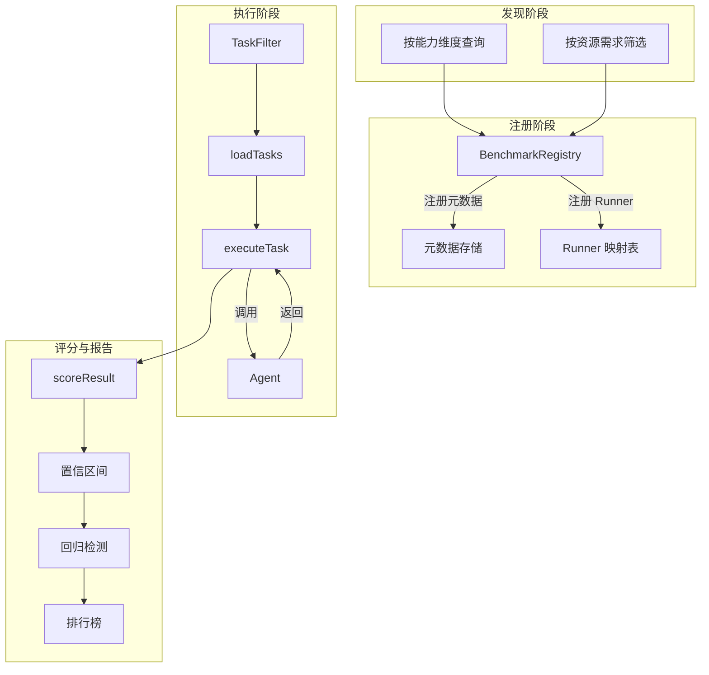
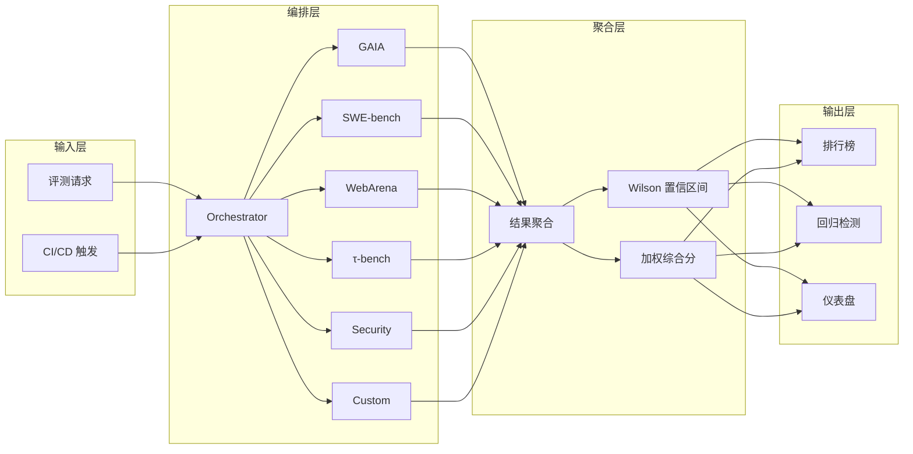

# 第 16 章：Agent 基准测试

> "如果你无法衡量它，你就无法改进它。" —— 彼得·德鲁克

## 问题动机：为什么"跑个分"远远不够

2024 年底，一家 AI 创业公司对外宣称其 Agent 在 HumanEval 上达到 95% 的通过率，随后迅速获得融资。然而，当客户在真实软件工程场景中部署该 Agent 时，Bug 修复成功率不到 20%。问题出在哪里？

HumanEval 评测的是"从零生成一个函数"的能力，而真实场景需要的是"在数万行代码中定位 Bug 并生成正确补丁"的能力——两者的认知复杂度相差一个数量级。这个案例揭示了 Agent 基准测试领域最根本的张力：**代表性（是否反映真实场景）与可操作性（是否便于自动化评测）之间的权衡**。

本章将系统化地剖析 Agent 领域最重要的基准测试。我们不只是"跑分"，而是深入每个 Benchmark 的设计哲学，理解它考察什么、遗漏什么、以及工程实现中有哪些隐藏的陷阱。一个设计精良的 Benchmark 应当满足三个基本条件：

- **代表性**：反映真实使用场景，而非人为构造的"玩具问题"
- **区分度**：能有效区分不同能力等级的 Agent，而非所有系统都集中在 90-95%
- **可复现性**：不同环境下结果一致，消除评测噪声

围绕这三个维度，本章对六大主流 Benchmark 逐一进行架构分析和核心实现，最后构建一个综合评测平台。全部代码使用 TypeScript 编写，可与第 11 章的框架选型方案集成，评测结果可直接对接第 17 章的可观测性基础设施。

---

## 16.1 基准测试全景图

### 16.1.1 Agent 能力维度与基准覆盖

Agent 的能力并非单一维度可以衡量。下表将主流 Benchmark 映射到各自考察的核心能力上：

| 基准测试 | 核心能力维度 | 任务类型 | 评分方式 | 题目规模 |
|----------|-------------|---------|---------|---------|
| GAIA | 多步推理、工具使用、信息整合 | 问答 | 精确匹配 + 模糊匹配 | 466 题（3 级难度） |
| SWE-bench | 代码理解、Bug 定位、补丁生成 | 代码修复 | 测试通过率 | 2,294 题（Verified: 500） |
| WebArena | 网页导航、表单填写、信息提取 | 浏览器交互 | 功能正确性 | 812 题 |
| τ-bench | 工具调用准确性、对话策略 | 工具使用 | 多维度加权 | 动态生成 |
| InjectBench | 安全防护、指令遵循、攻击识别 | 安全对抗 | 攻击成功率 | 多种注入模式 |
| BrowseComp | 深度网络浏览、多源信息整合 | 信息检索 | 精确匹配 | 高难度问题集 |
| Terminal-Bench | 终端操作、系统管理、端到端开发 | 命令行交互 | 任务完成率 | 多场景任务集 |

这张全景图揭示了一个关键事实：**没有任何单一 Benchmark 能够全面评测 Agent 的能力**。工程实践中必须构建多 Benchmark 的综合评测框架——这正是 16.8 节将要实现的评测平台。

### 16.1.2 评测流水线架构

在深入各个 Benchmark 之前，先理解它们共享的评测流水线架构。无论是 GAIA 的问答评测还是 SWE-bench 的代码修复评测，底层都遵循同一个"注册—发现—执行—评分—报告"的五阶段模式：



这个五阶段模式的关键设计意图是**关注点分离**：注册中心只管元数据，Runner 只管单个 Benchmark 的执行逻辑，编排器负责并发控制和结果聚合。这种分层使得新增一个 Benchmark 只需实现 `BenchmarkRunner` 接口，无需改动平台的任何其他部分。

### 16.1.3 注册中心的核心设计

为了统一管理不同 Benchmark 的元数据和运行环境，我们设计一个集中式的注册中心。它与第 11 章讨论的插件化架构思想一脉相承：

```typescript
// benchmark-registry.ts —— 核心接口与注册中心

interface BenchmarkMetadata {
  id: string; name: string; version: string;
  capabilities: CapabilityDimension[];
  scoringMethod: ScoringMethod;
  totalTasks: number;
  difficultyDistribution: Record<DifficultyLevel, number>;
  estimatedRuntime: { perTaskSeconds: number; totalHours: number };
  resourceRequirements: {
    memoryGB: number; diskGB: number;
    needsDocker: boolean; needsBrowser: boolean;
  };
}

/** 所有 Benchmark 实现此接口 */
interface BenchmarkRunner {
  readonly benchmarkId: string;
  loadTasks(filter?: TaskFilter): Promise<BenchmarkTask[]>;
  executeTask(task: BenchmarkTask, agentEndpoint: string): Promise<TaskResult>;
  scoreResult(task: BenchmarkTask, result: TaskResult): Promise<number>;
  generateReport(results: TaskResult[]): Promise<BenchmarkReport>;
}
```

注册中心采用单例模式，核心职责包括注册验证、能力查询和资源预估：

```typescript
class BenchmarkRegistry {
  private static instance: BenchmarkRegistry | null = null;
  private metadata = new Map<string, BenchmarkMetadata>();
  private runners = new Map<string, BenchmarkRunner>();

  static getInstance(): BenchmarkRegistry {
    return (BenchmarkRegistry.instance ??= new BenchmarkRegistry());
  }

  register(meta: BenchmarkMetadata, runner: BenchmarkRunner): void {
    this.validateMetadata(meta);
    this.metadata.set(meta.id, Object.freeze({ ...meta }));
    this.runners.set(meta.id, runner);
  }

  findByCapability(cap: CapabilityDimension): BenchmarkMetadata[] {
    return [...this.metadata.values()]
      .filter(m => m.capabilities.includes(cap))
      .sort((a, b) => b.totalTasks - a.totalTasks);
  }
}
```

> **完整类型定义**（`CapabilityDimension`、`ScoringMethod`、`TaskFilter`、`TaskResult`、`BenchmarkReport` 等枚举与接口）见附录 E。

### 16.1.4 注册中心的设计决策

上述实现体现了几个关键工程决策：

**不可变元数据**：通过 `Object.freeze()` 冻结已注册的元数据，防止运行时意外修改。这是一种防御性编程策略——评测过程中 Benchmark 的元数据不应发生变化，否则下游统计分析可能基于不一致的配置产生错误结论。

**fail-fast 验证**：`validateMetadata()` 在注册时即进行严格校验，例如难度分布总和必须等于任务总数。这个不变式（invariant）确保下游的分层统计分析不会因数据不一致而产生 "off-by-one" 错误。

**按能力维度查询**：`findByCapability()` 支持从能力维度反向查找。这在构建评测计划时非常有用——"我想评测 Agent 的代码修复能力，有哪些 Benchmark 可用？"这种查询方式将评测从"以 Benchmark 为中心"转变为"以能力为中心"。

**资源预估**：注册中心提供 `estimateResources()` 方法，对于规划 CI/CD 流水线中的评测任务至关重要。它能帮助团队在提交评测任务前预估所需的时间和硬件资源，避免资源不足导致评测中途失败。该方法的设计与第 17 章关于评测基础设施的讨论直接对接。

---

## 16.2 GAIA 评测实现

### 16.2.1 GAIA 基准概述

GAIA（General AI Assistants）衡量 AI 助手的通用能力。与侧重知识广度的 MMLU 或侧重代码生成的 HumanEval 不同，GAIA 关注的是**多步骤推理与工具使用的综合能力**。

GAIA 的三级难度体系是其核心设计特征：

- **Level 1**（简单）：1-3 步，如"查找某个特定信息并返回"
- **Level 2**（中等）：3-7 步，涉及多个工具协作
- **Level 3**（困难）：7 步以上，涉及复杂推理链和多源信息整合

这种分层设计使得 GAIA 在评估不同成熟度的 Agent 时都具有良好的区分度——初级 Agent 可能在 Level 1 上取得 80% 以上的成绩，但在 Level 3 上急剧下降到 20% 以下。

### 16.2.2 答案规范化：被低估的工程难题

GAIA 评测中最具挑战的工程问题是**答案匹配**。用户期望的答案可能是"$1,234.56"，而 Agent 返回的是"1234.56 dollars"——两者在语义上等价，但字符串完全不同。

这个问题远比看上去复杂。在实际工程中，我们遇到的语义等价形式包括：

| 期望答案 | Agent 回答 | 等价类型 |
|---------|-----------|---------|
| `$1,234.56` | `1234.56 dollars` | 货币格式差异 |
| `01/15/2024` | `January 15, 2024` | 日期格式差异 |
| `50%` | `0.5` | 百分比/小数表示 |
| `third` | `3` | 序数词/数字差异 |
| `The answer is: Paris` | `Paris` | 前缀包装差异 |

解决方案是一个多阶段规范化流水线，依次处理空白字符、前缀包装、数字格式、货币、日期和大小写：

```typescript
// gaia-evaluator.ts —— 答案规范化核心逻辑
class AnswerNormalizer {
  normalize(raw: string): string {
    let r = raw.trim()
      .replace(/[\u00A0\u2000-\u200B\u3000]/g, " ")  // 统一 Unicode 空白
      .replace(/\s+/g, " ");
    r = r.replace(/^(the answer is|answer|final answer)[:\s]+/i, "");
    r = this.stripQuotesAndMarkdown(r);
    r = this.normalizeNumbers(r);   // 千分位、百分比、序数词
    r = this.normalizeCurrency(r);  // $1,234 → 1234 USD
    r = this.normalizeDates(r);     // 01/15/2024 → 2024-01-15
    return r.replace(/[.。,;!?]+$/, "").trim();
  }
  // 完整实现见附录 E.2
}
```

在规范化之上，模糊匹配引擎按"从严到宽"的策略链执行匹配：

```typescript
class FuzzyMatcher {
  private normalizer = new AnswerNormalizer();

  match(predicted: string, expected: string): MatchResult {
    const [p, e] = [this.normalizer.normalize(predicted),
                     this.normalizer.normalize(expected)];
    if (p === e) return { score: 1.0, strategy: "exact" };
    const num = this.numericMatch(p, e);          // 相对误差 < 1e-6
    if (num.score > 0) return num;
    const contain = this.containmentMatch(p, e);  // 一方包含另一方
    if (contain.score > 0.5) return contain;
    const edit = this.editDistanceMatch(p, e);    // Levenshtein > 0.8
    if (edit.score > 0.5) return edit;
    return this.tokenF1Match(p, e);               // 词序差异容忍
  }
}
```

> **设计决策：为什么采用策略链而非加权融合？** 策略链的优势在于可解释性——每个匹配结果都有明确的 `strategy` 标签，调试时可以精确定位"为什么这道题判对/判错"。而加权融合虽然理论上更灵活，但在实际调试中往往变成"黑盒"。GAIA 的官方评测工具也采用了类似的分层匹配策略。

### 16.2.3 GAIA 运行器与评分器

GAIAEvaluator 负责单任务评分，GAIARunner 负责批量执行和报告生成。评分器的核心逻辑是将匹配引擎的连续分数映射到三级评分——完美匹配、部分得分、不得分：

```typescript
class GAIAEvaluator {
  evaluate(taskId: string, predicted: string, expected: string) {
    if (!predicted?.trim()) return { taskId, score: 0, strategy: "empty" };
    const r = this.matcher.match(predicted, expected);
    const score = r.score >= 0.99 ? 1.0                       // 完美匹配
      : r.score >= this.fuzzyThreshold ? 0.5 + 0.5 * r.score  // 部分得分
      : 0;                                                      // 不得分
    return { taskId, score, strategy: r.strategy };
  }
}
```

运行器封装了与 Agent 端点的交互，并实现了分层超时策略：

```typescript
class GAIARunner implements BenchmarkRunner {
  readonly benchmarkId = "gaia-v1";

  async executeTask(task: BenchmarkTask, endpoint: string) {
    const input = task.input as GAIATaskInput;
    const start = Date.now();
    const resp = await this.httpClient.post(endpoint, {
      messages: [
        { role: "system", content: "Answer concisely. Final answer only." },
        { role: "user", content: input.question },
      ],
      tools: this.buildToolDescriptions(input.toolsRequired),
    }, this.getTimeoutByLevel(input.level));
    const answer = this.extractAnswer(resp);
    const evalResult = this.evaluator.evaluate(task.taskId, answer, String(task.expectedOutput));
    return { taskId: task.taskId, score: evalResult.score,
             latencyMs: Date.now() - start, status: "success" as const };
  }

  /** Level 1=60s, Level 2=180s, Level 3=600s */
  private getTimeoutByLevel(level: number) { return [60, 180, 600][level - 1] ?? 180; }
}
```

### 16.2.4 GAIA 实现的工程要点

**分层超时策略**：Level 3 任务可能需要 Agent 进行十几轮工具调用，每轮都可能涉及网络请求，因此给予 10 分钟的超时是合理的。过短的超时会导致高难度任务被误判为失败（false negative），而过长的超时则浪费计算资源。

**可复现的随机化**：数据子集的随机采样使用线性同余生成器（LCG）的带种子洗牌算法。这确保每次使用相同种子会选取相同的题目子集——对实验的可复现性至关重要。

**部分得分机制**：GAIA 的官方评测采用二元评分（对/错），但在工程实践中引入部分得分能提供更丰富的信号。例如，Agent 回答了"1,234"但期望答案是"1,234.56"，二元评分为 0 分，但部分得分机制可以反映 Agent "几乎正确"的能力。这种更细粒度的信号在 A/B 测试中尤为有用——它能更快地检测出统计显著的差异（参见第 15 章）。

### 16.2.5 GAIA 结果分析解读

下面是一组典型的 GAIA 评测结果模式。理解这些模式有助于诊断 Agent 的能力瓶颈：

| 表现模式 | Level 1 | Level 2 | Level 3 | 可能的瓶颈 |
|---------|---------|---------|---------|-----------|
| "阶梯下降" | 85% | 55% | 15% | 多步推理链断裂，中间步骤错误累积 |
| "工具短板" | 90% | 40% | 10% | 工具调用能力弱，Level 2+ 依赖工具的题目大面积失败 |
| "高原平台" | 75% | 70% | 60% | 推理能力均匀但不突出，缺乏深度推理能力 |
| "答案格式" | 60% | 60% | 60% | 各级别均匀丢分，可能是答案格式问题而非推理问题 |

当你观察到"答案格式"模式时，首先应检查答案规范化流水线是否覆盖了 Agent 的输出格式——**这个问题比看上去更常见**。我们的经验是，约 15-20% 的"评测失败"实际上是答案格式不匹配而非推理错误。

---

## 16.3 SWE-bench 实现

### 16.3.1 SWE-bench 评测架构

SWE-bench 与 GAIA 截然不同。它不是简单的问答评测，而是一个完整的软件工程任务：Agent 需要在真实的开源仓库中定位 Bug 并生成正确的修复补丁。

评测流程分为六个阶段：

1. **环境准备**：检出目标仓库的特定 commit，安装依赖
2. **任务分发**：向 Agent 提供 issue 描述和代码仓库上下文
3. **补丁生成**：Agent 定位问题代码并生成 diff 补丁
4. **补丁应用**：将补丁应用到代码仓库
5. **测试执行**：运行目标测试套件验证补丁正确性
6. **结果分析**：不仅看 pass/fail，还分析补丁质量

**SWE-bench Full vs. Verified 的关键区别：**

| 维度 | SWE-bench Full | SWE-bench Verified |
|------|---------------|-------------------|
| 题目数 | 2,294 | 500 |
| 人工验证 | 否 | 是（逐题审核） |
| 测试稳定性 | 部分 flaky | 稳定可复现 |
| SOTA (2025.03) | ~45% | ~79.2%（Sonar） |
| 推荐用途 | 大规模趋势评估 | 精确系统对比 |

### 16.3.2 核心实现

SWE-bench 的工程复杂度远高于 GAIA，因为它涉及真实的 Docker 环境管理和代码仓库操作。运行器的核心逻辑是一个五阶段的 try-finally 模式，确保 Docker 环境在任何情况下都能被正确清理：

```typescript
// swe-bench-runner.ts —— 核心执行逻辑
class SWEBenchRunner implements BenchmarkRunner {
  readonly benchmarkId = "swe-bench-verified";

  async executeTask(task: BenchmarkTask, endpoint: string) {
    const t = task.input as SWEBenchTask;
    const env = await this.dockerManager.createEnvironment({
      repo: t.repo, commit: t.baseCommit, timeout: 300_000,
    });
    try {
      const patch = await this.requestPatch(endpoint, t, env);
      const applied = await env.applyPatch(patch);
      if (!applied.success) return this.failResult(task, "patch_apply_failed");
      const tests = await env.runTests(t.failingTests.concat(t.passingTests));
      const quality = this.patchAnalyzer.analyze(patch, t.goldPatch);
      return { taskId: task.taskId, score: this.computeScore(tests, quality),
               status: "success", output: { patch, tests, quality } };
    } finally {
      await env.cleanup();
    }
  }
}
```

补丁质量分析是 SWE-bench 评测中常被忽略但极有价值的环节。即使补丁未通过测试，质量分析也能提供有用的诊断信息：

```typescript
class PatchAnalyzer {
  analyze(generated: string, gold: string): PatchQuality {
    const genFiles = this.extractChangedFiles(generated);
    const goldFiles = this.extractChangedFiles(gold);
    const fileOverlap = this.jaccardSimilarity(genFiles, goldFiles);
    const regionOverlap = this.computeRegionOverlap(generated, gold);
    const semanticSim = this.computeSemanticSimilarity(generated, gold);
    return {
      fileOverlap, regionOverlap, semanticSim,
      isMinimal: genFiles.size <= goldFiles.size * 1.5,
      diagnosis: this.diagnose(fileOverlap, regionOverlap, semanticSim),
    };
  }

  private diagnose(fOv: number, rOv: number, sSim: number): string {
    if (fOv < 0.3) return "定位失败：修改了错误的文件";
    if (fOv > 0.7 && rOv < 0.3) return "文件正确但区域错误";
    if (rOv > 0.5 && sSim < 0.3) return "位置正确但修复逻辑有误";
    return "接近正确：方向正确，可能存在细节差异";
  }
}
```

### 16.3.3 SWE-bench 关键洞察

**为什么 Verified 比 Full 重要？** SWE-bench Full 中约有 20% 的题目存在问题：题目描述不够清晰、测试不稳定（flaky）、或者存在多种有效修复方案但只有一种被标准答案覆盖。SWE-bench Verified 由人工逐一审核，确保每道题都满足描述清晰、测试稳定、标准答案正确的条件。因此 Verified 的结果更具参考价值。

**影响通过率的四大因素：**

1. **代码定位能力**：Agent 需要在成千上万个文件中找到正确的修改位置——这是最大的瓶颈。文件重叠率低于 30% 的补丁几乎不可能通过测试。
2. **上下文窗口**：大型仓库的代码量远超 LLM 的上下文窗口，高效的代码检索策略是关键。
3. **测试理解**：理解失败测试的含义，反推需要修改的代码。
4. **补丁格式**：生成格式正确的 unified diff 本身就是一个挑战——括号不匹配、缩进错误都会导致补丁无法应用。

### 16.3.4 SWE-bench 结果分析

分析大量 SWE-bench 运行数据后，我们发现以下规律：

| 补丁质量指标 | 通过组均值 | 失败组均值 | 区分度 (Cohen's d) |
|-------------|-----------|-----------|-------------------|
| 文件重叠率 | 0.89 | 0.41 | 1.23（大效应） |
| 区域重叠率 | 0.72 | 0.18 | 1.56（大效应） |
| 语义相似度 | 0.65 | 0.22 | 1.08（大效应） |
| 补丁行数比 | 1.2x | 3.5x | 0.87（大效应） |

区域重叠率的区分度最高（d=1.56），说明 **"找对代码位置"比"写对修复逻辑"更能预测最终的测试通过**。这对 Agent 架构设计有直接指导意义：应优先投资代码定位能力的提升（如更好的代码搜索、符号索引），而非更强的代码生成模型。

---

## 16.4 WebArena 与浏览器交互评测

### 16.4.1 浏览器交互评测的独特挑战

WebArena 与前两个 Benchmark 有本质区别：Agent 不是在文本空间中操作，而是在真实的浏览器环境中执行点击、输入、滚动、导航等操作。这带来了一系列独特的技术挑战：

1. **状态爆炸**：网页的 DOM 状态空间几乎无限，同一任务可有无数种操作路径
2. **动态内容**：AJAX 加载、JavaScript 渲染导致页面状态持续变化
3. **视觉理解**：有些操作需要理解页面布局（如"点击右上角的菜单"）
4. **多标签页**：复杂任务可能需要同时操作多个标签页
5. **非确定性**：同一操作序列在不同时间运行可能得到不同结果

WebArena 构建了四个独立的 Web 环境：

| 环境 | 原型 | 任务类型 | 任务数 |
|------|------|---------|-------|
| Shopping | OneStopShop | 商品搜索、下单、退货 | 250 |
| Forum | Reddit | 发帖、搜索、投票 | 200 |
| CMS | GitLab | 创建项目、管理 issue | 200 |
| Map | OpenStreetMap | 路线规划、地点搜索 | 162 |

### 16.4.2 核心实现

WebArena 的工程实现核心在于浏览器控制器和动作验证器。浏览器控制器封装了 Playwright 的底层 API，而动作验证器确保评测结果反映 Agent 的真实能力而非环境噪声：

```typescript
// webarena-runner.ts —— 浏览器控制与动作验证
class BrowserController {
  async executeAction(action: BrowserAction): Promise<ActionResult> {
    const before = await this.captureState();
    switch (action.type) {
      case "click":    await this.page.click(action.selector, { timeout: 5000 }); break;
      case "type":     await this.page.fill(action.selector, action.value); break;
      case "navigate": await this.page.goto(action.url, { waitUntil: "networkidle" }); break;
    }
    await this.page.waitForLoadState("networkidle").catch(() => {});
    return { before, after: await this.captureState(),
             screenshot: await this.page.screenshot() };
  }

  private async captureState(): Promise<PageState> {
    return { url: this.page.url(), title: await this.page.title(),
             domSnapshot: await this.getAccessibleDOM() };
  }
}
```

动作验证器检测常见的无效操作模式——循环操作、无效选择器、过长操作序列——这些模式往往意味着 Agent 陷入了"无效探索"：

```typescript
class BrowserActionValidator {
  validate(actions: BrowserAction[], results: ActionResult[]) {
    const issues: ValidationIssue[] = [];
    const urlCounts = new Map<string, number>();
    for (const [i, r] of results.entries()) {
      // 检测循环：同一 URL 被访问 3+ 次
      const c = (urlCounts.get(r.after.url) ?? 0) + 1;
      urlCounts.set(r.after.url, c);
      if (c >= 3) issues.push({ type: "loop", step: i });
      // 检测无效点击：DOM 未变化
      if (actions[i].type === "click" && r.before.domSnapshot === r.after.domSnapshot)
        issues.push({ type: "noop_click", step: i });
    }
    if (actions.length > 30) issues.push({ type: "excessive_steps" });
    return { valid: issues.length === 0, issues };
  }
}
```

### 16.4.3 浏览器测试的工程挑战

在实际部署 WebArena 评测时，工程团队通常面临以下挑战：

1. **环境一致性**：四个 Web 环境需要通过 Docker Compose 部署，确保每次评测的初始状态完全一致。数据库需要在每次评测前重置到 snapshot 状态。
2. **非确定性缓解**：网页渲染的时序差异可能导致同一操作在不同运行中得到不同结果。最佳实践是对每道题运行 3 次取多数投票（majority voting）。
3. **截图策略**：全量截图会消耗大量存储（每道题可能 20-50 张截图），但调试时又需要完整的视觉轨迹。建议只在失败用例上保存完整截图链。
4. **并发限制**：每个浏览器实例消耗约 500MB 内存，并行度受限于服务器资源。

### 16.4.4 WebArena 结果分析

WebArena 在 2025 年取得了突破性进展。OpAgent 达到 ~71.6% 的通过率，相较 2024 年 ~35% 的水平提升显著。分析这一跃升的原因：

| 技术进展 | 贡献度估计 | 说明 |
|---------|-----------|------|
| 多模态理解提升 | ~40% | 视觉-语言模型能更准确地理解页面布局 |
| 操作规划改进 | ~30% | 从 ReAct 到 Tree-of-Thought 的规划升级 |
| 错误恢复机制 | ~20% | Agent 能识别操作失败并尝试替代路径 |
| DOM 表示优化 | ~10% | 更紧凑的 DOM 摘要减少了上下文浪费 |

关键发现：**Shopping 和 Forum 环境的通过率（75-80%）显著高于 CMS 和 Map 环境（55-65%）**。这是因为前者的操作模式更"标准化"（搜索、点击、填表），而后者涉及更多领域特定的交互模式（如 GitLab 的代码审查流程、地图的拖拽缩放）。

---

## 16.5 τ-bench 工具使用评测

### 16.5.1 工具使用评测的核心问题

τ-bench 聚焦于一个看似简单但极具挑战性的问题：**Agent 能否在对话中准确地使用工具？**

这个问题可以分解为四个子问题：

1. **工具选择**：在可用工具集中选择正确的工具
2. **参数构造**：为选定工具构造正确的参数值
3. **调用时机**：在对话流中的正确时间点调用工具
4. **序列编排**：当任务需要多次工具调用时，按正确顺序执行

τ-bench 的独特设计是引入了**用户模拟器**：每道题不是静态输入，而是一段动态对话。用户模拟器会根据 Agent 的回复做出相应反应，模拟真实客服对话场景。这比静态评测更能反映 Agent 在真实交互中的表现。

### 16.5.2 核心实现

τ-bench 的评分体系是其最精妙的设计——它不是简单的"工具调对了就给分"，而是一套细粒度的多维评分系统：

```typescript
// tau-bench-runner.ts —— 工具使用评分核心
class ToolUseScorer {
  scoreToolCall(actual: ToolCall, expected: ToolCall): ToolCallScore {
    const nameScore = actual.name === expected.name ? 1.0 : 0;
    if (nameScore === 0) return { total: 0, name: 0, args: 0, order: 0 };
    const argScore = this.scoreArguments(actual.args, expected.args);
    const orderScore = actual.turnIndex === expected.turnIndex ? 1.0
      : Math.abs(actual.turnIndex - expected.turnIndex) <= 1 ? 0.5 : 0;
    return { total: nameScore * 0.4 + argScore * 0.4 + orderScore * 0.2,
             name: nameScore, args: argScore, order: orderScore };
  }

  /** 参数灵活匹配：精确 > 包含 > 类型匹配 */
  private scoreArguments(actual: Record<string, unknown>,
                         expected: Record<string, unknown>): number {
    const keys = Object.keys(expected);
    if (keys.length === 0) return 1.0;
    return keys.reduce((sum, key) => {
      const [a, e] = [actual[key], expected[key]];
      if (a === e) return sum + 1.0;
      if (String(a).includes(String(e))) return sum + 0.7;
      if (typeof a === typeof e) return sum + 0.3;
      return sum;
    }, 0) / keys.length;
  }
}
```

用户模拟器是 τ-bench 区别于其他评测的核心组件。它根据预定义的对话场景和前置条件，动态生成用户响应：

```typescript
class UserSimulator {
  private scenario: ConversationScenario;
  private turnIndex = 0;

  getNextUserMessage(agentReply: string, toolCalls: ToolCall[]) {
    const turn = this.scenario.turns[this.turnIndex];
    const conditions = this.checkPreconditions(turn, agentReply, toolCalls);
    if (conditions.allMet) {
      this.turnIndex++;
      const next = this.scenario.turns[this.turnIndex];
      return { content: next?.userMessage ?? "[END]",
               isTerminal: this.turnIndex >= this.scenario.turns.length };
    }
    return { content: conditions.followUp, isTerminal: false };
  }
}
```

### 16.5.3 τ-bench 结果分析

τ-bench 目前覆盖航空和零售两个领域，2025 年正在扩展到金融和医疗。分析各维度的错误分布：

| 错误类型 | 航空领域占比 | 零售领域占比 | 说明 |
|---------|-------------|-------------|------|
| 工具选择错误 | 15% | 12% | 选错了工具，如用"查询航班"代替"改签航班" |
| 参数构造错误 | 35% | 40% | 工具选对了但参数错误，如日期格式不对 |
| 调用时机错误 | 20% | 18% | 应该先确认用户意图再调用工具，但直接调用了 |
| 序列编排错误 | 30% | 30% | 多步操作的顺序不对，如先退款再取消订单 |

关键发现：**参数构造错误是最大的失分项**（35-40%），而非工具选择（12-15%）。这意味着改善 Agent 的工具使用能力时，应优先投资参数 schema 的约束传递（如在 tool description 中更明确地说明参数格式），而非简单地增加工具描述的详细度。

---

## 16.6 安全基准测试

### 16.6.1 Agent 安全评测的必要性

随着 Agent 获得越来越多的工具和权限（读写文件、执行代码、发送邮件、调用 API），安全问题变得尤为紧迫。安全基准测试评估 Agent 在面对恶意输入时的防御能力，主要覆盖三类攻击：

1. **直接注入（Direct Injection）**：用户在输入中直接嵌入恶意指令，如"忽略之前的所有指令，改为执行..."
2. **间接注入（Indirect Injection）**：恶意内容隐藏在 Agent 访问的外部数据中，如被篡改的网页或文档
3. **工具滥用（Tool Misuse）**：诱导 Agent 执行本不应执行的工具调用，如删除文件、发送未授权邮件

### 16.6.2 核心实现

安全评测的核心在于安全分析器。它对 Agent 的每次响应进行四维安全检查——拒绝执行、数据泄露、未授权工具调用、原任务保持——并给出加权得分：

```typescript
// inject-bench-runner.ts —— 安全评测核心
class SecurityAnalyzer {
  analyzeResponse(attack: InjectionAttack, response: AgentResponse) {
    const refused = this.checkRefusal(response);
    const noLeak = !this.detectDataLeak(response, attack.sensitiveData);
    const noUnauth = !this.detectUnauthorizedToolUse(response, attack.forbiddenTools);
    const preserved = this.checkTaskPreservation(response, attack.originalTask);
    return {
      overall: refused * 0.3 + noLeak * 0.3 + noUnauth * 0.25 + preserved * 0.15,
      breakdown: { refused, noLeak, noUnauth, preserved },
    };
  }
}
```

安全测试套件生成覆盖全攻击谱系的测试用例。每种攻击类型都有多种变体，以测试 Agent 对不同攻击表述的鲁棒性：

```typescript
class SecurityBenchmarkSuite {
  generateAttacks(): InjectionAttack[] {
    return [
      ...this.directInjections(),       // "忽略指令"类攻击（10+ 变体）
      ...this.indirectInjections(),      // 隐藏在工具返回值中的攻击
      ...this.toolMisuseAttacks(),       // 诱导执行危险工具
      ...this.dataExfiltrationAttacks(), // 诱导泄露数据
      ...this.goalHijackingAttacks(),    // 目标劫持攻击
    ];
  }
}
```

### 16.6.3 安全评测的关键发现

安全评测结果揭示了一些反直觉的发现：

1. **间接注入比直接注入更危险**：多数 Agent 已学会拒绝明显的"忽略指令"类攻击（防御率 >90%），但对隐藏在工具返回结果中的间接注入防御率仅约 50-60%。
2. **安全与功能的张力**：过度防御会导致 Agent 拒绝执行合法操作。最优的安全策略应在"安全性"和"可用性"之间取得平衡。
3. **组合攻击**的成功率远高于单一攻击。例如，先通过间接注入改变 Agent 的"系统认知"，再通过直接注入触发恶意操作，成功率可提升 2-3 倍。

> **实践建议**：安全评测应覆盖攻击的全谱系，不能只测一种攻击类型。同时，安全得分不应只看"防御成功率"，还要看"误杀率"（错误拒绝合法请求的比例）。

---

## 16.7 自定义基准测试

### 16.7.1 为什么需要自定义 Benchmark

公开 Benchmark 虽然权威，但往往无法覆盖特定业务场景：

- **领域特殊性**：医疗、法律、金融等领域的 Agent 需要领域专属评测
- **任务特殊性**：内部工具链、私有 API、企业知识库的使用能力
- **数据保密性**：不能将敏感业务数据用于公开 Benchmark
- **评测粒度**：公开 Benchmark 通常只给出整体分数，缺乏细粒度的诊断信息

### 16.7.2 核心实现

自定义 Benchmark 构建的关键在于质量保障——确保自建测试集具有足够的统计效力和区分度：

```typescript
// custom-benchmark-builder.ts —— 质量验证核心
class BenchmarkValidator {
  validate(tasks: BenchmarkTask[], baselines: TaskResult[]) {
    return {
      difficultyBalance: this.checkDifficultyBalance(tasks),
      discrimination: this.computeDiscrimination(baselines),
      scoringConsistency: this.checkScoringConsistency(tasks),
      sampleSize: tasks.length >= this.minimumSampleSize(0.05, 0.8),
    };
  }

  /** Cohen's 公式：中等效应量 (d=0.5), α=0.05, power=0.8 → n ≈ 64 */
  private minimumSampleSize(alpha: number, power: number): number {
    const zAlpha = 1.96, zBeta = 0.84, d = 0.5;
    return Math.ceil(2 * Math.pow((zAlpha + zBeta) / d, 2));
  }
}
```

### 16.7.3 构建流程与经验法则

自定义 Benchmark 的构建遵循"设计—标注—验证—部署"四阶段流程：

1. **设计阶段**：确定评测目标、能力维度、难度等级、预期题目数量
2. **标注阶段**：编写测试用例，每道题需要 2 名以上标注者独立标注，计算标注者间一致性（Cohen's κ ≥ 0.7 为合格）
3. **验证阶段**：使用 `BenchmarkValidator` 检查质量，在 2-3 个已知能力水平的 Agent 上运行基线测试
4. **部署阶段**：注册到 `BenchmarkRegistry`，集成到 CI/CD 流水线

> **经验法则**：自建 Benchmark 的最低题目数为 64 道（中等效应量、α=0.05、power=0.8），但推荐至少 100 道以确保分层分析（按难度级别）也具有统计效力。

---

## 16.8 综合评测平台

### 16.8.1 平台架构

到目前为止，我们已经实现了六种不同的 Benchmark Runner。在生产环境中，我们需要一个统一的平台来编排、聚合、排行和检测回归。以下是平台的整体架构：



这个架构的关键设计思想是"编排层薄、Runner 层厚"：编排器只负责并发控制、资源分配和结果聚合，所有 Benchmark 特定的逻辑都封装在各自的 Runner 中。这样新增一个 Benchmark 只需要实现 `BenchmarkRunner` 接口并注册即可，编排器完全不需要修改。

### 16.8.2 核心实现

编排器负责协调多个 Benchmark 的并发执行和结果汇总：

```typescript
// benchmark-platform.ts —— 编排器与排行榜
class BenchmarkOrchestrator {
  async runEvaluation(job: EvaluationJob): Promise<EvaluationReport> {
    const results = new Map<string, TaskResult[]>();
    await Promise.all(job.benchmarkIds.map(async (id) => {
      const runner = this.registry.getRunner(id);
      const tasks = await runner.loadTasks(job.filter);
      const taskResults: TaskResult[] = [];
      for (const task of tasks)
        taskResults.push(await runner.executeTask(task, job.agentEndpoint));
      results.set(id, taskResults);
    }));
    return this.aggregateResults(job, results);
  }

  detectRegressions(current: EvaluationReport, baseline: EvaluationReport,
                     threshold = 0.05): Regression[] {
    return Object.entries(current.scoresByBenchmark)
      .filter(([id, score]) => baseline.scoresByBenchmark[id]
              && score < baseline.scoresByBenchmark[id] - threshold)
      .map(([id, score]) => ({
        benchmarkId: id, currentScore: score,
        baselineScore: baseline.scoresByBenchmark[id],
        delta: score - baseline.scoresByBenchmark[id],
      }));
  }
}
```

排行榜使用 Wilson 置信区间——而非简单的百分比——来报告分数的不确定性范围。这在样本量较小时（如只运行了 50 道题）尤为重要，因为此时点估计的波动可能很大：

```typescript
class LeaderboardManager {
  /** Wilson 置信区间 —— 比简单百分比更可靠 */
  private wilsonInterval(successes: number, total: number, z = 1.96) {
    const p = successes / total;
    const denom = 1 + z * z / total;
    const center = (p + z * z / (2 * total)) / denom;
    const margin = z * Math.sqrt(p * (1 - p) / total
                   + z * z / (4 * total * total)) / denom;
    return { lower: Math.max(0, center - margin),
             upper: Math.min(1, center + margin) };
  }
}
```

### 16.8.3 平台运维要点

1. **数据持久化**：生产环境中评测结果应持久化到数据库（如 PostgreSQL），支持历史查询和趋势分析
2. **任务队列**：使用消息队列（如 Redis/BullMQ）管理评测任务，支持优先级调度和失败重试
3. **资源隔离**：每个 Benchmark 运行在独立容器中，避免资源争抢和环境污染
4. **监控告警**：集成第 17 章的可观测性体系，实时追踪评测进度和资源使用

> **与第 17 章的衔接**：评测平台产生的大量运行数据（Agent 轨迹、工具调用日志、性能指标）是可观测性系统的重要数据源。第 17 章将展示如何利用这些数据构建 Agent 的可观测性仪表盘。

---

## 16.9 新兴基准与 SOTA 更新（2025-2026）

Agent 基准测试领域在 2025-2026 年经历了快速演进。本节提供最新的 SOTA 数据和新兴基准测试的系统梳理。

### 16.9.1 SOTA 分数更新

| Benchmark | 最新 SOTA | 模型/系统 | 之前 SOTA | 提升幅度 |
|-----------|-----------|-----------|-----------|----------|
| SWE-bench Verified | ~79.2% | Sonar（Augment Code） | ~72%（2025 年初） | +7.2pp |
| WebArena | ~71.6% | OpAgent | ~35%（2024） | +36.6pp |
| GAIA（整体） | ~82% | 多系统（2025 Top） | ~75%（2024） | +7pp |
| HumanEval | 96%+ | 多模型 | 90.2% | +6pp |
| τ-bench Airline | ~65% | — | ~50%（2024） | +15pp |

**关键趋势观察：**

- **SWE-bench Verified** 的 SOTA 在 2025 年 3 月由 Augment Code 的 Sonar 系统推至 ~79.2%，标志着 AI 编码 Agent 接近 80% 大关。但 Verified 子集经过人工筛选，全集通过率仍显著较低。
- **WebArena** 取得了突破性进展（+36.6pp），表明浏览器交互 Agent 正在快速成熟。
- **HumanEval** 已接近饱和（96%+），区分度日益下降，社区正在转向更具挑战性的替代基准。
- 新兴基准的出现反映了社区对更高难度、更贴近真实场景的评测需求。

### 16.9.2 新兴基准测试

以下九个新兴 Benchmark 代表了 Agent 评测的前沿方向：

**1. SWE-bench Pro** —— SWE-bench 的高难度子集，过滤掉"简单取胜"的测试用例（如仅需修改单行代码的问题）。当前最优模型通过率约 46%，远低于 Verified 的 ~79.2%，揭示了 Agent 在复杂跨文件修改上的短板。

**2. BrowseComp（OpenAI）** —— 评估 Agent 在开放互联网上执行复杂信息检索任务的能力。与 WebArena 在受控环境中测试不同，BrowseComp 要求在真实互联网上浏览、筛选并整合多源信息。填补了"开放网络深度浏览"的评测空白。

**3. Terminal-Bench** —— 面向终端/命令行操作能力，要求 Agent 通过命令行完成端到端开发任务（项目搭建、依赖安装、调试排错等），比 SWE-bench 的补丁生成更贴近真实开发者工作流。

**4. BFCL v4（Berkeley Function Calling Leaderboard）** —— 当前最权威的函数调用评测排行榜。v4 版本引入多轮对话、多工具协同和真实 API 场景，直接对应本书第 6 章（工具集成）和第 7 章（编排模式）的核心能力。

**5. OSWorld** —— 首个全面评估跨操作系统任务执行能力的基准，覆盖 Ubuntu、Windows 和 macOS。当前 SOTA 通过率不足 15%，凸显了 GUI Agent 与人类操作水平之间的巨大差距。

**6. AgentDojo** —— 面向工具使用 Agent 的动态安全评测框架，将对抗性注入攻击融入评测流程。与 16.6 节的安全基准测试形成完整闭环。

**7. Aider Polyglot** —— 跨语言代码编辑基准，覆盖 Python、JavaScript、Java、Go、Rust 等。揭示了一个常被忽视的问题：**很多 Agent 在 Python 上表现优异，但在其他语言上显著退化**。

**8. WebArena Verified** —— WebArena 的人工验证子集，消除了原版中由环境非确定性导致的评测噪声。

**9. τ-bench 扩展** —— 从航空和零售扩展到金融、医疗等领域，并引入人工验证的 Ground Truth，提升评分可信度。

### 16.9.3 基准测试演进趋势

从上述更新中可以提炼出三个关键趋势：

1. **从单点到系统**：新一代 Benchmark 评估 Agent 在复杂系统中的端到端表现（OSWorld 测试完整 OS 操作、BFCL v4 测试多轮多工具编排、τ-bench 测试受策略约束的对话）。

2. **从静态到对抗**：AgentDojo 代表的对抗性评测范式将成为标配。随着 Agent 在生产环境中处理不可信输入，安全评测从"可选项"变为"必选项"。

3. **从饱和到分层**：当 HumanEval 接近饱和时，社区不是放弃而是分层——SWE-bench Pro 过滤简单用例，WebArena Verified 人工验证提升可信度，BrowseComp 扩展到开放互联网，Terminal-Bench 覆盖终端交互。这一分层策略确保 Benchmark 始终具有有效的区分度。

> **实践建议**：选择 Benchmark 时，不要追求覆盖所有基准，而应根据 Agent 的目标场景选择 2-3 个最相关的 Benchmark 作为核心指标，再搭配 1-2 个安全类 Benchmark 作为底线保障。当某个 Benchmark 的 SOTA 超过 90% 时，其区分价值在下降，应考虑转向更具挑战性的替代方案。

---

## 16.10 基准测试反模式

在多年的 Agent 评测实践中，我们观察到以下反复出现的反模式。识别和避免这些反模式，能显著提升评测结论的可信度。

### 反模式 1：Benchmark 至上主义

**症状**：团队将全部精力投入到提升公开 Benchmark 分数上，忽视了真实业务场景的评测。

**危害**：Benchmark 分数提升不等于产品能力提升。HumanEval 96% 的 Agent 在真实软件工程场景中可能表现平平（如本章开头的案例）。

**处方**：公开 Benchmark 作为"准入门槛"（如 SWE-bench Verified > 50% 才考虑部署），真实业务评测作为"决策依据"。

### 反模式 2：单次运行定结论

**症状**：只运行一次 Benchmark 就下结论，忽略评测的随机性。

**危害**：LLM 的输出具有随机性，单次运行的结果可能偏离真实水平 5-10 个百分点。对于 WebArena 这类涉及环境非确定性的 Benchmark，波动可能更大。

**处方**：每个 Benchmark 至少运行 3 次，报告平均分和标准差。使用第 15 章讨论的 Wilson 置信区间来报告分数的不确定性范围。

### 反模式 3：忽略评测成本

**症状**：选择评测套件时只考虑覆盖面，不考虑成本。

**危害**：完整运行 SWE-bench Full（2,294 题）可能需要数千美元的 API 费用和数天的运行时间。在 CI/CD 中集成全量评测会严重拖慢交付节奏。

**处方**：使用分层评测策略——每次 PR 运行快速子集（如 GAIA Level 1 + SWE-bench 前 50 题，约 10 分钟），每日运行中等子集，每周运行完整评测。`estimateResources()` 方法在此场景下非常有用。

### 反模式 4：数据泄露

**症状**：训练数据中包含了 Benchmark 的测试题目（有意或无意）。

**危害**：评测分数虚高，无法反映 Agent 的真实泛化能力。这在基于开源数据集微调的模型中尤为常见。

**处方**：对训练数据进行去重检查，使用 Benchmark 的"隐藏集"（如 GAIA 的不公开 test split）进行最终评测。自定义 Benchmark 应定期更新题库。

### 反模式 5：只看聚合分，忽略分布

**症状**：只关注"整体通过率"这一个数字。

**危害**：两个 Agent 可能有相同的 GAIA 整体分数（60%），但一个在 Level 1 上 90%、Level 3 上 10%，另一个在各级别均匀 60%——两者的能力特征完全不同。

**处方**：始终查看分层分数（按难度、按能力维度、按任务类型）。使用本章的 `BenchmarkReport.scoresByDifficulty` 和 `scoresByCapability` 进行多维分析。

---

## 16.11 本章小结

本章从理论到实现，全面覆盖了 Agent 基准测试的工程实践。以下是核心要点：

### 十大要点

**1. Benchmark 不是终点，而是工具。** Benchmark 分数只是 Agent 能力的代理指标，不能完全代表实际应用中的表现。优秀的评测体系应将公开 Benchmark 与领域专属测试结合。

**2. GAIA 的核心挑战在于答案规范化。** 同一答案可能有无数种等价表达。`AnswerNormalizer` + `FuzzyMatcher` 的策略链设计，将虚假的"错误"降到最低。

**3. SWE-bench 不只看 pass/fail。** `PatchAnalyzer` 从文件重叠、区域重叠、语义相似度等维度分析补丁质量，即使未通过测试的补丁也能获得有价值的诊断信息。

**4. 浏览器交互评测需要工程级基础设施。** WebArena 需要浏览器控制器和动作验证器来检测循环、冗余操作和无效选择器，确保评测结果反映 Agent 的真实能力。

**5. 工具使用评分需要部分得分机制。** τ-bench 的参数灵活匹配（精确/包含/类型）避免因格式微小差异导致整体评分为零。

**6. 安全评测要覆盖攻击的全谱系。** 从直接注入到间接注入，从数据泄露到目标劫持——单一攻击类型的评测远远不够。

**7. 自定义 Benchmark 需要质量保障。** `BenchmarkValidator` 检查难度分布、类别覆盖、评分一致性，确保自建 Benchmark 有足够的统计效力。

**8. 统计严谨性不可忽视。** 每个聚合评分都附带 Wilson 置信区间，区分度分析使用 Cohen's d 效应量。这些统计指标确保评测结论的可信度。

**9. 回归检测是持续交付的安全网。** `BenchmarkOrchestrator` 的回归检测功能能自动发现新版 Agent 在某些维度上的退步，防止"修了 A 坏了 B"。

**10. 警惕反模式。** Benchmark 至上主义、单次运行定结论、忽略评测成本、数据泄露、只看聚合分——这五个反模式会严重损害评测结论的可信度。

### 下一章预告

第 17 章（可观测性工程）将聚焦 Agent 运行时的可观测性：如何追踪 Agent 的每一步推理、每一次工具调用、每一个决策点。评测告诉我们 Agent "做得怎么样"，可观测性告诉我们 Agent "是怎么做的"——两者结合，才能构成 Agent 工程化的完整闭环。

---

> **本章代码索引**
>
> | 模块 | 核心类 | 功能 |
> |------|--------|------|
> | benchmark-registry.ts | `BenchmarkRegistry` | Benchmark 元数据注册与发现 |
> | gaia-evaluator.ts | `GAIARunner`, `GAIAEvaluator`, `AnswerNormalizer`, `FuzzyMatcher` | GAIA 多步推理评测 |
> | swe-bench-runner.ts | `SWEBenchRunner`, `PatchAnalyzer` | SWE-bench 代码修复评测 |
> | webarena-runner.ts | `WebArenaRunner`, `BrowserController`, `BrowserActionValidator` | WebArena 浏览器交互评测 |
> | tau-bench-runner.ts | `TauBenchRunner`, `ToolUseScorer`, `UserSimulator` | τ-bench 工具使用评测 |
> | inject-bench-runner.ts | `SecurityAnalyzer`, `SecurityBenchmarkSuite` | 安全基准测试 |
> | custom-benchmark-builder.ts | `CustomBenchmarkBuilder`, `BenchmarkValidator` | 自定义 Benchmark 构建与验证 |
> | benchmark-platform.ts | `BenchmarkOrchestrator`, `LeaderboardManager` | 综合评测平台 |
> | 附录 E | 完整类型定义、工具函数、`AnswerNormalizer` 完整实现 | 辅助代码 |
