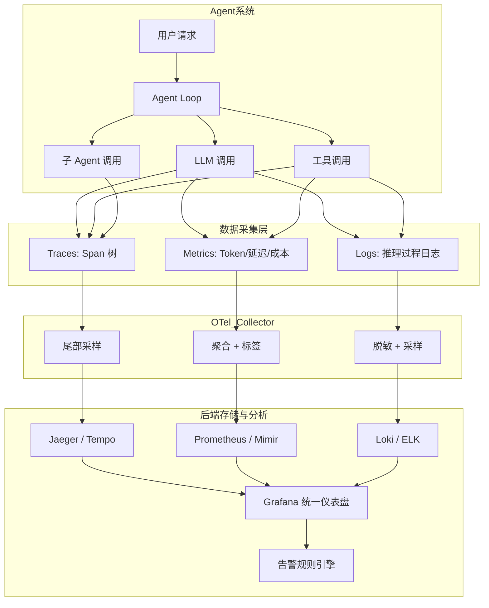
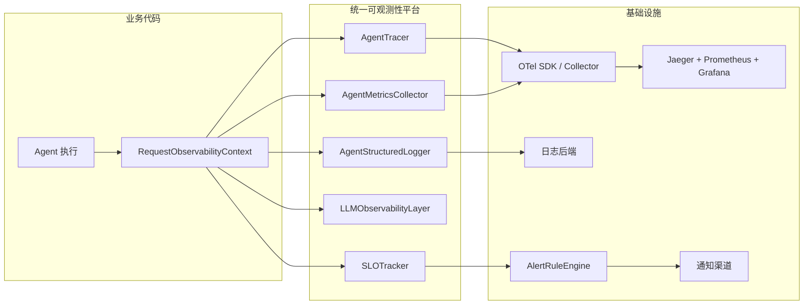

# 第 17 章：可观测性工程 — 追踪、指标与日志

> **"你无法调试你无法观测的东西。"**

## 17.1 从"能跑"到"能看"：Agent 可观测性的必要性

把一个 Agent 系统推上线并不是终点，而是新挑战的起点。传统后端服务的运维经验在 Agent 系统面前会暴露出大量盲区：一个看起来"成功返回"的请求，可能内部经历了 12 轮无意义循环、消耗了 $2.50 的 Token 成本，最终给出了一个质量堪忧的回答。如果没有完善的可观测性体系，你甚至不知道这件事正在发生。

传统 APM（Application Performance Monitoring）的核心假设是请求路径确定、延迟分布集中、错误类型有限。Agent 系统打破了这三条假设。考虑一个用户请求"帮我分析上季度销售数据并生成报告"：Agent 需要自主决策调用哪些工具、以什么顺序执行；每一次 LLM 推理的结果不可预测——相同的输入可能产生完全不同的执行路径；在多 Agent 架构中，任务可能被分发到多个子 Agent，形成复杂的协作链路。这些特性使得可观测性从"运维辅助"升级为"系统刚需"。

本章将构建一套专为 AI Agent 设计的可观测性平台。我们不仅覆盖追踪、指标、日志三大支柱，更要解决 Agent 系统的独有难题：非确定性执行路径追踪、LLM 黑盒推理的间接观测、多 Agent 协作链路的上下文传播、以及 Token 成本的精确归因。在第 14 章中我们建立了 Agent 信任架构的约束边界；本章的可观测性体系正是对那些约束的持续验证——通过数据证明 Agent 确实"在做正确的事"。

我们先从 Agent 与传统服务在可观测性维度上的本质差异讲起。

---

## 17.2 可观测性三大支柱

### 17.2.1 传统 APM 与 Agent 可观测性的对比

| 维度 | 传统 APM | Agent 系统需求 |
|------|---------|---------------|
| 执行路径 | 确定性、可预测 | 非确定性、每次可能不同 |
| 延迟分布 | 毫秒级、分布集中 | 秒到分钟级、分布离散 |
| 成本模型 | 按计算资源计费 | 按 Token 用量计费，且不同模型价格差异 10 倍以上 |
| 错误类型 | 异常、超时、HTTP 错误码 | 幻觉（Hallucination）、推理错误、工具滥用、无限循环 |
| 因果分析 | 服务依赖图明确 | Agent 自主决策，因果链需要从推理日志重建 |
| 质量衡量 | 可用性、延迟、吞吐量 | 任务完成质量、答案准确性、决策合理性 |

这张对比表揭示的核心信息是：Agent 的"成功"不再是二元判断。一个请求可能"完成了但质量不高""部分完成""完成了但花费过多资源"。可观测性系统必须能量化这个连续谱。

### 17.2.2 三大支柱在 Agent 系统中的重新诠释

| 支柱 | 传统定义 | Agent 系统中的扩展 | 典型调查问题 |
|------|---------|-------------------|-------------|
| **Traces** | 分布式请求链路追踪 | Agent 决策链路追踪：request → Agent_loop → llm_call → tool_call → sub_Agent | "这个任务为什么调用了 5 次搜索工具？" |
| **Metrics** | 计数器、直方图、摘要 | Token 消耗、任务成功率、决策路径分布、工具调用频率、成本归因 | "过去一小时的平均 Token 消耗为什么翻倍了？" |
| **Logs** | 应用日志、错误日志 | LLM 交互日志、Agent 推理过程日志、工具输入输出日志（含脱敏） | "Agent 在第三轮迭代中为什么选择了错误的工具？" |

这三者不是孤立存在的——通过 **Trace ID** 和 **Correlation ID** 关联在一起，形成多维度的观测体系。一个典型的调查路径是：从**指标**发现异常（Token 消耗突增） → 通过**追踪**定位到具体请求链路 → 通过**日志**查看链路中每一步的详细推理过程。

下面的架构图展示了三大支柱在 Agent 系统中的数据流向：



### 17.2.3 五大独特挑战

在深入技术实现之前，我们需要明确 Agent 系统在可观测性方面面对的核心挑战：

**挑战一：非确定性执行路径。** 同一个用户请求在不同时间执行可能走完全不同的代码路径。传统追踪系统假设路径是稳定的，但 Agent 系统中每次 LLM 推理都可能产生不同的决策。这意味着我们不能仅追踪"请求经过了哪些服务"，还需追踪"Agent 做了哪些决策以及为什么"。

**挑战二：LLM 黑盒性。** LLM 调用是 Agent 系统中最核心的组件，但它本身是一个黑盒。我们无法观测模型内部的推理过程，只能通过输入（Prompt）和输出（Completion）来推断。这要求可观测性设计中特别关注 LLM 调用的上下文记录——在保证脱敏的前提下，尽可能多地保留输入输出的摘要信息。

**挑战三：多 Agent 协作的链路追踪。** 当多个 Agent 协作完成一个任务时，追踪上下文需要在 Agent 之间正确传播。这类似于微服务架构中的分布式追踪，但增加了 Agent 自主决策带来的动态路由复杂性。

**挑战四：成本归因。** 每次 LLM 调用都有真金白银的成本。不同的模型（GPT-4 vs GPT-4o-mini）、不同的上下文长度、不同的输出长度，成本差异可达 100 倍。可观测性系统需要能够精确追踪和归因这些成本——按请求、按用户、按任务类型、按模型。

**挑战五：质量作为连续谱。** 传统系统的成功是二元的——请求要么成功要么失败。但 Agent 的质量是连续谱：任务可能"完成了但质量不高""部分完成""完成了但花费过多资源"。可观测性系统必须能够追踪这些中间状态。

### 17.2.4 可观测性成熟度模型

基于上述挑战，我们定义一个四级成熟度模型，帮助团队评估和改进其 Agent 可观测性体系：

| 等级 | 名称 | 描述 | 关键能力 |
|------|------|------|---------|
| L1 | 基础日志 | 有日志记录，但缺乏结构化和关联性 | 文本日志、基础错误监控 |
| L2 | 结构化观测 | 结构化日志 + 基础指标 + 简单追踪 | JSON 日志、请求级追踪、Token 计数 |
| L3 | 深度洞察 | 完整三大支柱 + Agent 专属指标 + 成本追踪 | 决策链路追踪、成本归因、告警体系 |
| L4 | 智能分析 | 行为分析 + 异常检测 + 自动修复 | 决策模式分析、异常自动检测、自愈能力 |

成熟度评估的核心原则是**木桶原理**——总体等级取所有维度（日志、追踪、指标、告警）中的最低等级。一个追踪做到 L3 但日志还停留在 L1 的系统，总体成熟度只能算 L1。实际评估时，可以按四个维度分别打分，优先提升最薄弱的环节。

```typescript
// 成熟度评估器核心逻辑（木桶原理）
// 完整实现见 code-examples/ch17/maturity-assessor.ts

function assessMaturity(capabilities: ObservabilityCapabilities): MaturityReport {
  const dimensions = [
    assessDimension("日志能力", capabilities, ["hasBasicLogging", "hasStructuredLogs", "hasCostAttribution", "hasBehaviorAnalysis"]),
    assessDimension("追踪能力", capabilities, ["hasErrorMonitoring", "hasRequestTracing", "hasDistributedTracing", "hasSessionReplay"]),
    assessDimension("指标能力", capabilities, ["hasErrorMonitoring", "hasBasicMetrics", "hasAgentSpecificMetrics", "hasAnomalyDetection"]),
    assessDimension("告警与响应", capabilities, ["hasErrorMonitoring", "hasTokenCounting", "hasAlertSystem", "hasAutoRemediation"]),
  ];
  // 总体等级 = min(各维度等级)
  const overallLevel = Math.min(...dimensions.map(d => d.currentLevel));
  return { overallLevel, dimensions, recommendations: generateRecommendations(dimensions) };
}
```

> **设计决策：为什么使用木桶原理？** 可观测性的四个维度是互补而非替代关系。一个只有追踪但没有告警的系统，在发生问题时仍然是盲人——追踪数据只有在被发现和分析时才有价值。木桶原理确保团队不会在某个维度过度投资而忽视其他维度。

---

## 17.3 分布式追踪

分布式追踪是理解 Agent 系统行为的最强大工具。通过为每一次用户请求建立完整的 Span 树，我们可以精确还原 Agent 的决策过程、定位性能瓶颈、分析成本构成。

### 17.3.1 OpenTelemetry GenAI 语义约定

OpenTelemetry 的 GenAI 语义约定（Semantic Conventions for GenAI）已于 2025 年达到 **stable** 状态，为 LLM 调用和 Agent 操作定义了标准化的属性命名。`gen_ai.*` 命名空间下的核心属性——包括 `gen_ai.system`、`gen_ai.request.model`、`gen_ai.usage.input_token` / `gen_ai.usage.output_token` 等——已被正式纳入 OpenTelemetry 规范并保证向后兼容。

遵循这些约定的价值在于**跨系统互操作性**。在此之前，Langfuse、Arize Phoenix、OpenLLMetry 等可观测性工具各自期望不同的属性名称，团队不得不为每个平台编写适配层。GenAI 语义约定通过统一的命名空间解决了这个问题——任何遵循该约定的 Exporter 和分析工具都能自动识别和解析属性，无需额外映射。

以下是 Agent 系统中最关键的语义属性：

| 属性名 | 类型 | 说明 | 示例值 |
|--------|------|------|--------|
| `gen_ai.system` | string | AI 系统标识 | `"openai"`, `"anthropic"` |
| `gen_ai.request.model` | string | 请求的模型名称 | `"gpt-4-turbo"` |
| `gen_ai.response.model` | string | 实际响应的模型 | `"gpt-4-turbo-2024-04-09"` |
| `gen_ai.usage.input_token` | int | 输入 Token 数量 | `1523` |
| `gen_ai.usage.output_token` | int | 输出 Token 数量 | `847` |
| `gen_ai.usage.cost_usd` | float | 总成本（美元） | `0.0847` |
| `gen_ai.Agent.name` | string | Agent 名称 | `"research-Agent"` |
| `gen_ai.Agent.loop.iteration` | int | 当前循环迭代次数 | `3` |
| `gen_ai.tool.name` | string | 工具名称 | `"web_search"` |
| `gen_ai.prompt.template` | string | Prompt 模板标识 | `"Agent_system_v3"` |
| `gen_ai.prompt.version` | string | Prompt 版本 | `"2024.03.15"` |

> **迁移提示：** 如果你的系统仍在使用旧的自定义属性名（如 `Agent.name`、`llm.duration_ms`），可以通过 OpenTelemetry Collector 的 `transform` processor 同时输出新旧两套属性名实现平滑过渡。详细迁移指南参考 [OpenTelemetry GenAI Semantic Conventions](https://opentelemetry.io/docs/specs/semconv/gen-ai/) 官方文档。

### 17.3.2 Agent 追踪的 Span 层级设计

Agent 追踪的核心是设计合理的 Span 层级。与传统微服务"service → handler → DB query"的层级不同，Agent 的 Span 树需要反映其"循环推理 + 工具调用"的执行模型：

```
agent_request (根 Span，SpanKind=SERVER)
├── agent_loop_iteration_1 (SpanKind=INTERNAL)
│   ├── llm_call (SpanKind=CLIENT)
│   ├── tool_call: web_search (SpanKind=CLIENT)
│   └── tool_call: calculator (SpanKind=CLIENT)
├── agent_loop_iteration_2
│   ├── llm_call
│   └── sub_agent_call: data_analyst (SpanKind=PRODUCER)
│       ├── agent_loop_iteration_1
│       │   ├── llm_call
│       │   └── tool_call: sql_query
│       └── agent_loop_iteration_2
│           └── llm_call (最终回答)
└── agent_loop_iteration_3
    └── llm_call (汇总最终回答)
```

每一层 Span 记录的关键属性不同：根 Span 记录任务级信息（taskId、taskType、userId）；iteration Span 记录决策信息（decision、reasoning）；llm_call Span 记录模型调用的全部细节（Token 用量、成本、延迟分解）；tool_call Span 记录工具的输入输出大小和成功状态。

```typescript
// Agent 追踪器核心接口
// 完整实现见 code-examples/ch17/agent-tracer.ts

class AgentTracer {
  startRequestSpan(params: { taskId: string; taskType: string; input: string }): Span {
    return this.tracer.startSpan("agent_request", {
      kind: SpanKind.SERVER,
      attributes: {
        "gen_ai.agent.name": this.agentName,
        "gen_ai.agent.task.id": params.taskId,
        "gen_ai.agent.task.type": params.taskType,
      },
    });
  }

  endLLMCallSpan(span: Span, result: LLMCallInfo): void {
    span.setAttributes({
      "gen_ai.response.model": result.model,
      "gen_ai.usage.input_tokens": result.inputTokens,
      "gen_ai.usage.output_tokens": result.outputTokens,
      "gen_ai.usage.cost_usd": result.costUsd,
      "gen_ai.response.finish_reason": result.finishReason,
    });
    // 累计成本到 Baggage，跨 Span 传播
    if (this.baggage) {
      this.baggage.costSpentUsd = (this.baggage.costSpentUsd ?? 0) + result.costUsd;
    }
    span.setStatus({ code: SpanStatusCode.OK });
    span.end();
  }
}
```

### 17.3.3 Agent 专用采样策略

Agent 系统的遥测数据量巨大——一个包含 5 轮迭代、3 次工具调用的请求可能产生 10+ 个 Span。如果对所有请求全量采样，存储和分析成本会急剧膨胀。但简单的概率采样又可能丢失关键的错误链路。

解决方案是**分层采样策略**：

| 采样类别 | 采样率 | 触发条件 |
|---------|--------|---------|
| 错误链路 | 100% | Span 名称包含 error/alert/slow |
| 高成本调用 | 100% | `gen_ai.usage.cost_usd > 0.10` |
| 循环过多 | 100% | `gen_ai.Agent.loop.iteration > 5` |
| 正常链路 | 10% | 默认概率采样 |

```typescript
// Agent 专用采样器
// 完整实现见 code-examples/ch17/agent-sampler.ts

class AgentSampler implements Sampler {
  shouldSample(context, traceId, spanName, spanKind, attributes): SamplingResult {
    // 规则 1：错误相关 Span 始终采样
    if (["error", "alert", "slow"].some(p => spanName.toLowerCase().includes(p))) {
      return { decision: SamplingDecision.RECORD_AND_SAMPLED, attributes: { "sampling.reason": "pattern_match" } };
    }
    // 规则 2：高成本调用始终采样
    const cost = attributes["gen_ai.usage.cost_usd"];
    if (typeof cost === "number" && cost > 0.1) {
      return { decision: SamplingDecision.RECORD_AND_SAMPLED, attributes: { "sampling.reason": "high_cost" } };
    }
    // 规则 3：循环过多始终采样
    const iterations = attributes["gen_ai.agent.loop.iteration"];
    if (typeof iterations === "number" && iterations > 5) {
      return { decision: SamplingDecision.RECORD_AND_SAMPLED, attributes: { "sampling.reason": "many_iterations" } };
    }
    // 规则 4：正常链路按概率采样
    return this.hashTraceId(traceId) < this.normalSamplingRate
      ? { decision: SamplingDecision.RECORD_AND_SAMPLED, attributes: { "sampling.reason": "probabilistic" } }
      : { decision: SamplingDecision.NOT_RECORD };
  }
}
```

> **Head Sampling vs Tail Sampling：** 上述采样器是 Head Sampler（在 Span 创建时决策）。其局限是创建 Span 时可能还不知道整条链路是否包含错误。更精确的做法是使用 OpenTelemetry Collector 的 Tail Sampling（在整条 Trace 收齐后再决策），代价是 Collector 需要缓存更多数据。实践中推荐组合使用：应用端 Head Sampling 控制大部分流量，Collector 端 Tail Sampling 兜底捞回有价值的链路。

### 17.3.4 多 Agent 分布式追踪

在多 Agent 架构中，追踪上下文需要在 Agent 之间正确传播。这通过 W3C TraceContext 标准和 OpenTelemetry Baggage 实现：

1. **父 Agent** 从当前 Span 提取 `traceparent` header（格式：`00-{traceId}-{spanId}-{traceFlags}`）
2. 将 `traceparent` 连同 Agent Baggage（taskId、costSpentUsd 等）作为消息 header 传递给子 Agent
3. **子 Agent** 接收 header 后注入到本地上下文，创建的 Span 自动成为父 Span 的子节点

这样在 Jaeger/Tempo 中查看 Trace 时，跨 Agent 的调用链路会呈现为一棵完整的 Span 树，而不是多条断裂的独立 Trace。

Baggage 中的 `costSpentUsd` 字段尤为重要——它允许子 Agent 知道父链路已经花费了多少钱，据此做出成本感知的决策（例如，如果父链路已经花了 $0.80，子 Agent 可以选择使用更便宜的模型）。

### 17.3.5 追踪数据分析

收集追踪数据只是第一步。真正的价值在于从数据中提取洞察。追踪分析器应覆盖四个维度：

- **性能分析**：计算延迟分位数（P50/P95/P99），识别 P95 以上的慢请求，分析 LLM 调用时间占比
- **成本分析**：统计平均/最高请求成本，识别超过均值 3 倍的异常请求，按模型分解成本分布
- **决策模式分析**：统计工具使用频率分布，计算平均迭代次数，识别重复决策模式
- **异常检测**：监控错误率，检测特定工具的失败率飙升，识别连续工具调用的并行化机会

```typescript
// 追踪分析器核心方法
// 完整实现见 code-examples/ch17/trace-analyzer.ts

class TraceAnalyzer {
  analyze(traces: TraceRecord[]): TraceInsight[] {
    return [
      ...this.analyzePerformance(traces),   // 延迟分位数、慢请求瓶颈
      ...this.analyzeCost(traces),           // 成本分布、按模型归因
      ...this.analyzeDecisionPatterns(traces), // 工具频率、迭代次数分布
      ...this.detectAnomalies(traces),       // 错误率、工具失败模式
      ...this.identifyOptimizations(traces), // 并行化机会
    ].sort((a, b) => severityOrder[a.severity] - severityOrder[b.severity]);
  }
}
```

---

## 17.4 指标体系

指标是可观测性体系中最适合"持续监控"的支柱。与追踪（聚焦单个请求全貌）和日志（聚焦离散事件详情）不同，指标提供的是**聚合的、时间序列化的**系统运行状态视图。

### 17.4.1 四大指标类别

Agent 系统的指标体系需要覆盖四个面向不同受众的类别：

| 类别 | 目标受众 | 核心问题 | 典型指标 |
|------|---------|---------|---------|
| **业务指标** | 产品经理、业务方 | Agent 是否完成了用户的任务？ | 任务完成率、用户满意度、任务类型分布 |
| **性能指标** | SRE、运维工程师 | Agent 的响应速度和吞吐量如何？ | 延迟分位数(P50/P95/P99)、吞吐量(RPM)、并发数、迭代次数 |
| **资源指标** | 架构师、财务 | Agent 消耗了多少资源和成本？ | Token 消耗(输入/输出)、API 调用次数、每任务成本 |
| **质量指标** | AI 工程师 | Agent 的推理和决策质量如何？ | 幻觉率、工具选择准确率、重试率、循环超限率 |

注意**性能指标的 Histogram Bucket 设计**与传统服务不同。传统 HTTP 服务的延迟 bucket 通常是 `[5, 10, 25, 50, 100, 250, 500, 1000]`ms，但 Agent 系统的延迟范围大得多，应使用 `[100, 500, 1000, 2000, 5000, 10000, 30000, 60000, 120000]`ms 的 bucket 配置。迭代次数也需要专门的 bucket：`[1, 2, 3, 5, 7, 10, 15, 20]`。

```typescript
// Agent 指标收集器核心定义
// 完整实现见 code-examples/ch17/agent-metrics.ts

class AgentMetricsCollector {
  // 业务指标
  readonly taskTotal = new Counter("agent_task_total", "Agent 处理的任务总数");
  readonly taskSuccessTotal = new Counter("agent_task_success_total", "成功完成的任务数");

  // 性能指标（注意 Agent 专用的 bucket 边界）
  readonly requestDuration = new Histogram("agent_request_duration_ms", "端到端延迟",
    [100, 500, 1000, 2000, 5000, 10000, 30000, 60000, 120000]);
  readonly agentLoopIterations = new Histogram("agent_loop_iterations", "循环迭代次数",
    [1, 2, 3, 5, 7, 10, 15, 20]);

  // 资源指标
  readonly tokenUsage = new Counter("agent_token_usage_total", "Token 消耗总量");
  readonly tokenCostUsd = new Counter("agent_token_cost_usd_total", "Token 消耗成本");

  // 质量指标
  readonly toolCallErrors = new Counter("agent_tool_call_errors_total", "工具调用错误总数");
  readonly loopExceeded = new Counter("agent_loop_exceeded_total", "循环超限次数");

  recordTaskExecution(params: TaskExecutionParams): void {
    // 一次性记录所有维度的指标...
  }
}
```

### 17.4.2 SLO/SLI 定义

Agent 系统的 SLO（服务水平目标）需要比传统服务覆盖更多维度。以下是推荐的三层 SLO 定义：

| SLO | SLI（度量指标） | 目标 | 评估窗口 | 说明 |
|-----|----------------|------|---------|------|
| 任务可用性 | 成功完成的任务 / 总任务数 | ≥ 95% | 30 天 | Agent 能够成功处理用户任务的比率 |
| 响应延迟 | P95 延迟 ≤ 30s 的请求比率 | ≥ 90% | 30 天 | Agent 场景 30 秒对应传统服务的 200ms |
| 成本效率 | 单任务成本 ≤ $0.50 的比率 | ≥ 95% | 30 天 | 防止个别高成本请求拖垮预算 |

**错误预算（Error Budget）** 是 SLO 的核心运营机制。以任务可用性 95% SLO 为例，30 天窗口内允许 5% 的失败率，即错误预算为 5%。当错误预算消耗过快时（Burn Rate），应触发告警：

- **Critical**：Burn Rate ≥ 14.4x（1 小时内将耗尽月度错误预算）
- **Warning**：Burn Rate ≥ 6x（6 小时内将耗尽）

### 17.4.3 Grafana 仪表盘设计

Agent 监控仪表盘建议分为五行布局，从上到下呈现从宏观到微观的信息层次：

**第一行 — 核心 KPI（6 个 Stat/Gauge 面板）：** 任务成功率、请求吞吐量(RPM)、P95 延迟、实时成本($/小时)、并发请求数、错误预算剩余

**第二行 — 延迟分布（2 个 TimeSeries）：** 请求延迟分位数(P50/P95/P99) 和按模型的 LLM 调用延迟

**第三行 — Token 和成本（3 个面板）：** Token 消耗趋势(输入/输出)、按模型的成本分布(BarChart)、每任务平均成本趋势

**第四行 — 工具调用（2 个面板）：** 工具调用频率 Top 10 和工具调用错误率

**第五行 — 质量指标（2 个面板）：** Agent 迭代次数分布(Heatmap) 和质量指标趋势(循环超限/LLM 重试/幻觉检测)

核心 PromQL 示例：

```

# 任务成功率（5 分钟滑动窗口）
sum(rate(agent_task_success_total{agent="$agent"}[5m]))
  / sum(rate(agent_task_total{agent="$agent"}[5m]))

# 实时成本（转换为每小时美元）
sum(rate(agent_token_cost_usd_total{agent="$agent"}[5m])) * 3600

# 请求延迟 P95
histogram_quantile(0.95,
  sum(rate(agent_request_duration_ms_bucket{agent="$agent"}[5m])) by (le))

# 每任务平均成本
sum(rate(agent_token_cost_usd_total{agent="$agent"}[5m]))
  / sum(rate(agent_task_total{agent="$agent"}[5m]))
```

> 完整的 Grafana 仪表盘 JSON 配置见 `code-examples/ch17/grafana-dashboard.json`，可直接导入使用。

---

## 17.5 结构化日志

日志是可观测性三大支柱中最古老也最直观的一种。但在 Agent 系统中，简单的文本日志远远不够——我们需要**结构化的、关联的、可搜索的**日志体系，同时解决 Agent 系统特有的两个问题：敏感数据脱敏和高吞吐下的日志采样。

### 17.5.1 日志级别的 Agent 语义

传统日志级别（DEBUG/INFO/WARN/ERROR/FATAL）在 Agent 系统中需要被赋予新的语义含义：

| 级别 | Agent 语义 | 生产环境建议 |
|------|-----------|-------------|
| DEBUG | Agent 决策过程细节、Prompt 完整内容、工具输入输出原文 | 关闭（仅调试时开启） |
| INFO | Agent 生命周期事件、工具调用摘要、任务完成通知 | 开启（受采样控制） |
| WARN | Agent 重试、降级、接近预算限制、迭代次数偏多 | 开启 |
| ERROR | 工具调用失败、LLM 异常、任务失败 | 始终开启 |
| FATAL | Agent 崩溃、不可恢复错误、安全边界违规 | 始终开启 |

### 17.5.2 敏感数据脱敏

Agent 日志中可能包含用户输入、API 密钥、个人身份信息等敏感内容。所有日志输出前必须经过脱敏处理。推荐的默认脱敏规则：

| 规则名 | 匹配模式 | 替换为 |
|--------|---------|-------|
| API Key | `sk-...` 或 `api_key=...` (≥20 字符) | `[REDACTED_API_KEY]` |
| Email | 邮箱地址正则 | `[REDACTED_EMAIL]` |
| 手机号(CN) | `1[3-9]\d{9}` | `[REDACTED_PHONE]` |
| 身份证(CN) | `\d{17}[\dXx]` | `[REDACTED_ID]` |
| Bearer Token | `Bearer [token]` | `Bearer [REDACTED_TOKEN]` |
| 信用卡号 | `\d{4}[\s-]?\d{4}[\s-]?\d{4}[\s-]?\d{4}` | `[REDACTED_CARD]` |

```typescript
// 结构化日志器核心设计
// 完整实现见 code-examples/ch17/structured-logger.ts

class AgentStructuredLogger {
  // 创建带上下文的子日志器（每个请求一个）
  withContext(context: LogContext): AgentStructuredLogger { /* ... */ }

  // Agent 专用日志方法
  logIterationStart(iteration: number, maxIterations: number): void { /* ... */ }
  logDecision(decision: string, reasoning: string): void { /* ... */ }
  logLLMCall(params: LLMCallParams): void { /* ... */ }
  logToolCall(params: ToolCallParams): void { /* ... */ }  // 自动脱敏输入输出
  logSecurityEvent(eventType: string, details: Record<string, unknown>): void { /* ... */ }

  private log(level: LogLevel, message: string, data?: Record<string, unknown>): void {
    if (level < this.minLevel) return;
    if (level < LogLevel.ERROR && !this.shouldLog(eventType)) return;  // 采样控制
    const entry = {
      timestamp: new Date().toISOString(),
      level: LogLevel[level],
      message: this.maskSensitiveData(message),  // 脱敏
      service: this.serviceName,
      context: this.globalContext,
      data: this.maskSensitiveDataInObject(data),
    };
    for (const handler of this.outputHandlers) handler(entry);
  }
}
```

### 17.5.3 日志采样策略

在高吞吐场景下（例如每秒处理 100 个 Agent 请求），每个请求产生 15-20 条日志意味着每秒 1500-2000 条日志。存储和查询成本可能远超预期。

推荐的日志采样策略：

- **始终记录**：ERROR/FATAL 级别、安全相关事件、告警触发事件
- **窗口限流**：每种事件类型在 60 秒内最多记录 100 条（超过部分丢弃）
- **Trace 关联保留**：当一条请求链路被追踪系统采样时，该请求的所有日志都保留

### 17.5.4 常见调查场景的查询模式

日志系统的价值在查询时体现。以下是 Agent 系统中最常见的日志查询场景：

```

# 场景 1：查找特定请求的所有日志（Loki）
{service="agent-service"} |= `correlation_id="req-20240315-001"`

# 场景 2：查找过去 1 小时内所有工具调用失败的日志
{service="agent-service"} | json | data_event="agent.tool.call" | data_success="false"

# 场景 3：查找安全事件
{service="agent-service"} | json | data_event="agent.security"

# 场景 4：查找 Token 消耗最高的请求（ELK 聚合）
GET agent-logs/_search
{
  "size": 0,
  "aggs": {
    "by_correlation": {
      "terms": { "field": "context.correlationId.keyword", "size": 10 },
      "aggs": { "total_tokens": { "sum": { "field": "data.inputTokens" } } }
    }
  }
}
```

---

## 17.6 LLM 调用可观测性

LLM 调用是 Agent 系统中最核心、最昂贵、也最不透明的环节。一个典型的 Agent 执行过程中，60%-90% 的延迟和成本来自 LLM 调用。针对 LLM 调用的深度可观测性不是锦上添花，而是必不可少的基础设施。

### 17.6.1 LLM 调用的独特观测维度

与普通 API 调用不同，LLM 调用需要关注以下独特维度：

| 维度 | 说明 | 为什么重要 |
|------|------|-----------|
| Token 用量 | 输入/输出 Token 数量及分布 | 直接决定成本和延迟 |
| 延迟分解 | TTFT(首字延迟)、生成速度(token/s)、总延迟 | 用户体验和容量规划 |
| 模型版本 | 请求模型 vs 实际响应模型 | 模型切换后的质量回归检测 |
| Prompt 版本 | 使用的 Prompt 模板和版本 | Prompt 工程迭代的效果追踪 |
| 完成原因 | stop, length, content_filter 等 | 识别截断、过滤等质量问题 |
| 成本归因 | 单次调用成本、按任务/用户归因 | 成本优化和预算管理 |

### 17.6.2 LLM 可观测性包装层

推荐采用装饰器/包装层模式（Wrapper Pattern）将可观测性逻辑与业务逻辑解耦。核心设计思路是：业务代码只需提供一个普通的 LLM 调用函数，包装层自动添加计时、Token 计数、成本计算、日志记录和 Span 标注。

```typescript
// LLM 可观测性包装层
// 完整实现见 code-examples/ch17/llm-observability.ts

class LLMObservabilityLayer {
  async wrapLLMCall(
    callFn: (request: LLMRequest) => Promise<LLMResponse>,
    request: LLMRequest,
    context: { traceId?: string; agentName?: string }
  ): Promise<{ response: LLMResponse; record: LLMCallRecord }> {
    const startTime = Date.now();
    try {
      const response = await callFn(request);
      const totalMs = Date.now() - startTime;
      const costUsd = this.calculateCost(request.model, response.usage.inputTokens, response.usage.outputTokens);
      const record = { /* 构造完整的调用记录 */ };
      this.storeRecord(record);
      this.logger.logLLMCall({ model: response.model, durationMs: totalMs, costUsd, ... });
      return { response, record };
    } catch (error) {
      this.logger.error("LLM 调用失败", error, { model: request.model, durationMs: Date.now() - startTime });
      throw error;
    }
  }
}
```

### 17.6.3 模型价格配置与成本计算

成本计算需要维护一份模型价格表（每 1000 Token 的价格）。注意两个细节：

1. **请求模型 vs 实际模型**：调用 `gpt-4-turbo` 时，实际响应的可能是 `gpt-4-turbo-2024-04-09`。价格应基于实际响应模型。
2. **输入输出价格差异大**：多数模型的输出价格是输入价格的 2-5 倍。成本计算公式为：

```
cost = (inputTokens / 1000) * inputPer1kTokens + (outputTokens / 1000) * outputPer1kTokens
```

当前主流模型参考价格（截至 2025 年）：

| 模型 | 输入价格 ($/1K token) | 输出价格 ($/1K token) |
|------|----------------------|----------------------|
| GPT-4 Turbo | 0.01 | 0.03 |
| GPT-4o | 0.005 | 0.015 |
| GPT-4o-mini | 0.00015 | 0.0006 |
| Claude 3 Opus | 0.015 | 0.075 |
| Claude 3 Sonnet | 0.003 | 0.015 |
| Claude 3 Haiku | 0.00025 | 0.00125 |

### 17.6.4 LLM 性能分析与优化建议

基于收集的 LLM 调用数据，性能分析器可以自动识别四类优化机会：

**成本优化：** 如果 GPT-4 调用的平均输出只有 200 Token 且调用量超过 100 次，说明这些简单任务可能不需要高端模型——降级到 GPT-4o-mini 可节省约 90% 成本。如果平均输入 Token 超过 3000，可能包含了不必要的上下文——审查 System Prompt 长度并实现上下文窗口滑动。

**延迟优化：** P95 延迟超过 10 秒的模型需要关注。如果 P99/P95 比值超过 3，说明存在严重的长尾延迟——分析长尾请求的共同特征（输入长度、工具调用数），考虑超时后自动重试到备用模型。

**质量优化：** 如果超过 5% 的调用因达到 `max_token` 限制而被截断（`finish_reason=length`），Agent 可能收到不完整的响应——增加 `max_token` 或优化 Prompt 使 LLM 生成更简洁的回复。

**可靠性优化：** 错误率超过 1% 的模型需要配置指数退避重试和备用模型故障转移。

---

## 17.7 Agent 行为分析

收集了追踪、指标和日志之后，下一个层次是从数据中提取**行为洞察**。行为分析超越了"是否成功"的判断，深入理解 Agent 的决策模式、工具使用习惯、以及执行路径特征。

### 17.7.1 四个核心分析维度

- **决策路径频率**：Agent 最常走的执行路径是什么？例如"llm → tool:search → llm → tool:calc → llm"出现了 150 次，而"llm → tool:search → llm"出现了 80 次。路径频率分析可以发现冗余步骤。
- **工具使用模式**：哪些工具组合最常一起使用？`web_search` 之后最常调用的是 `summarize` 还是 `calculate`？工具的前驱/后继关系可以用于优化工具编排。
- **错误模式聚类**：错误不是随机的——它们往往聚集在特定的工具、特定的输入类型、或特定的迭代次数上。通过将错误按工具+错误类型聚类，可以快速识别系统性问题。
- **会话回放**：最强大的调试工具。能够完整还原一次 Agent 执行的全过程，像观看录像回放一样理解 Agent 的行为。

### 17.7.2 会话回放设计

会话回放器将 Agent 的执行步骤转换为时间线事件，支持以下事件类型：

| 事件类型 | 标识 | 内容 |
|---------|------|------|
| 系统事件 | `[SYS]` | 会话开始/结束、状态汇总 |
| LLM 请求 | `[LLM>]` | 模型名称、输入预览 |
| LLM 响应 | `[<LLM]` | 输出预览、Token 用量、成本 |
| 工具调用 | `[TL>]` | 工具名称、输入 |
| 工具响应 | `[<TL]` | 输出或错误信息 |
| 决策 | `[DEC]` | Agent 的决策内容和推理 |
| 输出 | `[OUT]` | 最终输出内容 |

```
=== Agent 执行时间线 ===
[     0ms] [SYS]  system               | 会话开始 | Agent: research-agent | 任务: task-001
[    12ms] [LLM>] research-agent       | 调用 LLM: gpt-4-turbo
[  2352ms] [<LLM] gpt-4-turbo          | 需要搜索2024年Q1的AI投资数据...
                                        | ↳ 耗时: 2340ms | Token: 1770 | 成本: $0.0236
[  2400ms] [TL>]  research-agent       | 调用工具: web_search
[  3650ms] [<TL]  web_search           | 返回 42 条结果
                                        | ↳ 耗时: 1250ms
[  3700ms] [LLM>] research-agent       | 调用 LLM: gpt-4-turbo
[ 12220ms] [<LLM] gpt-4-turbo          | 生成分析报告...
                                        | ↳ 耗时: 8520ms | Token: 6050 | 成本: $0.0725
[ 12250ms] [OUT]  research-agent       | AI行业趋势简报已生成...
[ 12250ms] [SYS]  system               | 会话结束 | 状态: 成功 | 耗时: 12250ms | 成本: $0.0961
```

> 完整的行为分析器和会话回放器实现见 `code-examples/ch17/behavior-analyzer.ts` 和 `code-examples/ch17/session-replayer.ts`。

---

## 17.8 告警与事件响应

### 17.8.1 Agent 专属告警场景

传统告警围绕可用性和延迟。Agent 系统引入了一系列新的告警场景：

| 告警场景 | 触发条件 | 严重性 | 建议响应 |
|---------|---------|--------|---------|
| Agent 无限循环 | 单请求迭代次数 > max_iterations | Critical | 立即终止请求，检查 Prompt |
| Token 预算耗尽 | 单任务 Token 消耗超过预算 | Warning | 降级模型或终止任务 |
| 工具调用风暴 | 短时间内工具调用频率异常 | Warning | 限流、检查 Agent 逻辑 |
| LLM 幻觉检测 | 输出包含已知幻觉模式 | Warning | 标记输出需人工审核 |
| 成本异常飙升 | 小时成本超过日均 3 倍标准差 | Critical | 暂停非关键请求，排查原因 |
| 多 Agent 死锁 | 多个 Agent 循环等待 | Emergency | 打断循环，人工介入 |
| 安全边界违规 | Agent 尝试执行未授权操作 | Emergency | 立即阻止，通知安全团队 |
| 模型服务降级 | LLM API 错误率 > 5% | Critical | 切换到备用模型 |

### 17.8.2 告警规则设计原则

设计告警规则时应遵循三个原则：

**原则一：持续时间要求（for duration）。** 避免瞬时波动触发告警。例如"任务失败率 > 10%"应要求持续 5 分钟才触发，而不是一个失败请求就告警。

**原则二：组合条件优于单一阈值。** 单一指标的阈值告警容易误报。例如"严重劣化"告警应组合"失败率 > 20% AND P95 延迟 > 30s"——只有两个条件同时满足才触发。

**原则三：异常检测优于固定阈值。** 对于成本这类天然存在周期波动的指标，固定阈值很难设定。使用移动平均 + 标准差的异常检测（如"超过移动平均的 3 倍标准差"）更加鲁棒。

```typescript
// 告警规则引擎支持的条件类型
// 完整实现见 code-examples/ch17/alert-engine.ts

type AlertCondition =
  | { type: "threshold"; metric: string; operator: "gt" | "lt"; value: number }
  | { type: "rate"; metric: string; windowSeconds: number; operator: "gt" | "lt"; value: number }
  | { type: "anomaly"; metric: string; windowSize: number; deviations: number }
  | { type: "composite"; operator: "and" | "or"; conditions: AlertCondition[] };

// 推荐的 Agent 默认告警规则
const defaultRules = [
  { id: "high_failure_rate", condition: { type: "threshold", metric: "failure_rate", operator: "gt", value: 0.1 }, forDuration: 300 },
  { id: "token_cost_anomaly", condition: { type: "anomaly", metric: "token_cost", windowSize: 60, deviations: 3 }, forDuration: 180 },
  { id: "loop_excessive", condition: { type: "threshold", metric: "avg_iterations", operator: "gt", value: 7 }, forDuration: 600 },
  { id: "severe_degradation", condition: { type: "composite", operator: "and", conditions: [
    { type: "threshold", metric: "failure_rate", operator: "gt", value: 0.2 },
    { type: "threshold", metric: "p95_latency_ms", operator: "gt", value: 30000 },
  ]}, forDuration: 120 },
];
```

### 17.8.3 Runbook：从告警到修复

每条告警规则都应有配套的 Runbook（运维手册）。Runbook 包含三部分：

1. **诊断步骤**：如何确认问题范围和根因。例如"Agent 任务失败率过高"的诊断步骤：检查 Grafana 仪表盘确认趋势 → 查看失败任务的追踪链路 → 检查 LLM API 服务状态 → 检查工具服务健康 → 确认是否有最近的代码/Prompt 变更。

2. **修复步骤**：按优先级排列的修复动作。例如：LLM API 问题 → 切换备用模型；特定工具失败 → 临时禁用并回退；Prompt 变更导致 → 回滚到上一版本。

3. **升级策略**：5 分钟未解决 → 通知团队负责人；30 分钟未解决 → 通知工程 VP；影响 > 50% 用户 → 启动重大事件响应流程。

**关键告警应配备自动化修复（Auto-Remediation）。** 例如，成本异常飙升时自动将非关键请求路由到更便宜的模型；严重劣化时自动启用熔断器暂停非关键请求。自动化修复不替代人工判断，但能在人工响应之前争取宝贵的缓冲时间。

### 17.8.4 值班轮换的特殊考虑

Agent 系统的值班与传统服务有一个关键区别：Agent 问题通常需要同时具备**系统运维**和 **AI/Prompt 工程**知识的人来响应。推荐的值班编制：

- **Primary on-call**（SRE）：负责系统级问题（服务不可用、资源耗尽、网络异常）
- **Secondary on-call**（后端工程师）：负责业务逻辑问题（工具集成、数据处理）
- **AI Expert on-call**（AI/Prompt 工程师）：负责 Agent 行为问题（Prompt 退化、幻觉、决策异常）

Critical 及以上级别的告警应同时通知 Primary 和 AI Expert；Emergency 级别应通知全部三人。

---

## 17.9 可观测性平台集成

### 17.9.1 统一平台架构

到目前为止，我们已经构建了追踪、指标、日志、LLM 可观测性、行为分析和告警等独立组件。统一平台将它们整合，提供一站式的初始化和使用体验。

平台初始化时创建所有组件实例并注入依赖关系；运行时通过 `RequestObservabilityContext` 为每个请求提供封装好的可观测性操作（recordLLMCall、recordToolCall、recordIteration、complete/fail）。业务代码只需调用这些高层方法，底层的 Span 创建、指标记录、日志输出、SLO 追踪都自动完成。



```typescript
// 统一平台使用示例
// 完整实现见 code-examples/ch17/observability-platform.ts

const platform = new ObservabilityPlatform({
  serviceName: "my-agent-service",
  serviceVersion: "2.1.0",
  environment: "production",
  tracing: { enabled: true, samplingRate: 0.1, exporterEndpoint: "http://otel-collector:4318" },
  metrics: { enabled: true, exportIntervalSeconds: 15 },
  logging: { enabled: true, minLevel: LogLevel.INFO, enableSampling: true },
  llmObservability: { enabled: true, recordFullPrompts: false },
  alerting: { enabled: true, evaluationIntervalSeconds: 30 },
  behaviorAnalysis: { enabled: true, maxSessions: 5000 },
});

// 处理请求
const ctx = platform.createRequestContext({
  taskId: "task-001", taskType: "research", userId: "user-123",
  input: "分析最近的AI行业趋势",
});

try {
  ctx.recordIteration(1, "search_web");
  ctx.recordLLMCall({ model: "gpt-4-turbo", inputTokens: 1500, outputTokens: 250, costUsd: 0.0225, ... });
  ctx.recordToolCall({ toolName: "web_search", durationMs: 800, success: true, ... });
  ctx.recordIteration(2, "generate_report");
  ctx.recordLLMCall({ model: "gpt-4-turbo", inputTokens: 4000, outputTokens: 1800, costUsd: 0.094, ... });
  ctx.complete("AI行业趋势简报已生成...");
} catch (error) {
  ctx.fail(error);
}
```

### 17.9.2 OpenTelemetry Collector 配置

OTel Collector 是数据采集管线的核心枢纽。以下是为 Agent 工作负载优化的配置要点：

**接收器（Receivers）：** OTLP gRPC(4317) + HTTP(4318) 双协议；Prometheus scrape 采集应用侧指标。

**处理器（Processors）关键配置：**
- `memory_limiter`：limit_mib=1024, spike_limit_mib=256，保护 Collector 不 OOM
- `batch`：send_batch_size=512, timeout=5s，减少网络开销
- `tail_sampling`：错误 Trace 100% 保留、延迟 > 10s 100% 保留、高成本链路 100% 保留、其余按配置比率采样

**导出器（Exporters）：** OTLP → Jaeger/Tempo（追踪）；Prometheus remote write（指标）；Loki（日志）。

```yaml

# OTel Collector 核心配置摘要

# 完整配置见 code-examples/ch17/otel-collector-config.yaml

processors:
  tail_sampling:
    decision_wait: 30s
    num_traces: 50000
    policies:
      - name: error-policy        # 错误 Trace 全采
        type: status_code
        status_code: { status_codes: [ERROR] }
      - name: latency-policy      # 高延迟 Trace 全采
        type: latency
        latency: { threshold_ms: 10000 }
      - name: high-cost-policy    # 高成本 Trace 全采
        type: string_attribute
        string_attribute: { key: "sampling.reason", values: ["high_cost", "many_iterations"] }
      - name: probabilistic       # 其余按概率采样
        type: probabilistic
        probabilistic: { sampling_percentage: 10 }

service:
  pipelines:
    traces:
      receivers: [otlp]
      processors: [memory_limiter, tail_sampling, batch, attributes]
      exporters: [otlp/jaeger]
    metrics:
      receivers: [otlp, prometheus]
      processors: [memory_limiter, batch]
      exporters: [prometheus]
    logs:
      receivers: [otlp]
      processors: [memory_limiter, batch]
      exporters: [loki]
```

### 17.9.3 可观测性成本估算

可观测性本身也有成本。一个每小时处理 100 个请求的 Agent 服务，按典型配置估算：

| 组件 | 数据量/月 | 单价估算 | 月成本 |
|------|----------|---------|-------|
| 追踪（10% 采样） | ~58 万 Span | $0.20 / 百万 Span | ~$0.12 |
| 指标（50 时间序列） | 50 TS | $0.10 / TS / 月 | ~$5.00 |
| 日志 | ~32 GB | $0.50 / GB | ~$16.00 |
| **合计** | | | **~$21** |

如果全量采样追踪，成本会增加 10 倍。这就是为什么智能采样策略至关重要——错误全采 + 正常按比率采样可以在保留关键调试信息的同时将追踪成本控制在可接受范围内。

> **成本与价值的权衡：** 对于月 LLM 调用成本 $500 的系统，$21 的可观测性成本占比 4%，完全合理。但如果 LLM 成本只有 $50/月，可观测性成本占比 42% 就需要简化——可以关闭行为分析、降低日志保留天数、增大采样间隔。

---

## 17.10 可观测性反模式

在构建 Agent 可观测性体系的过程中，以下五个反模式是团队最常踩的坑：

### 反模式一：指标海洋（Metric Ocean）

**症状：** 定义了 200+ 个指标，但没有人定期看仪表盘，告警疲劳严重。

**根因：** "记录一切"的思维惯性——把能想到的指标都加上，却没有回答"谁会看这个指标？看了之后能做什么决策？"。

**对策：** 从 SLO 出发反推必要指标。每个指标都应该能回答一个具体问题，或者直接关联到某条告警规则。如果一个指标 30 天内没有人查看过，考虑下线它。

### 反模式二：全量日志不采样（Log Everything）

**症状：** 日志存储成本每月数百美元，查询延迟高达分钟级，团队宁可直接看代码也不愿查日志。

**根因：** 担心丢失关键日志而不敢采样。

**对策：** 分层采样策略——错误/安全日志全量保留，INFO 级日志窗口限流，DEBUG 级日志仅在需要时通过动态开关打开。同时确保被采样保留的链路的所有日志都保留（而不是随机丢失同一请求的部分日志）。

### 反模式三：追踪孤岛（Trace Island）

**症状：** 单个 Agent 的追踪看得清楚，但跨 Agent 调用的链路断裂——子 Agent 的 Trace 找不到父链路。

**根因：** 多 Agent 架构中忘记传播 W3C TraceContext header，或使用了不同的追踪系统。

**对策：** 强制要求所有 Agent 间通信携带 `traceparent` header。在 code review 和集成测试中验证跨 Agent 的 Trace 连续性。

### 反模式四：告警即文档（Alert as Documentation）

**症状：** 告警触发后值班人员不知道该怎么办，每次都需要"资深工程师凭经验判断"。

**根因：** 有告警规则但没有配套的 Runbook。

**对策：** 每条告警规则必须有对应的 Runbook（诊断步骤 + 修复步骤 + 升级策略）。Runbook 应该足够具体，让任何一位值班人员（哪怕是第一次值班的新人）都能按步骤操作。关键路径的修复步骤应自动化。

### 反模式五：成本盲区（Cost Blindness）

**症状：** 月底收到 LLM API 账单才发现成本超支 3 倍，无法归因到具体的 Agent、任务或用户。

**根因：** 可观测性体系中缺少成本维度。追踪了延迟和错误率，但没有追踪每次 LLM 调用的 Token 成本。

**对策：** 在 LLM 调用的 Span 上标注 `gen_ai.usage.cost_usd`，在指标中维护 `Agent_token_cost_usd_total` 计数器（按模型、Agent、任务类型分标签），在仪表盘的第一行放置实时成本面板。设置成本异常告警（基于移动平均的异常检测），避免"月底惊喜"。

---

## 17.11 本章小结

本章系统性地构建了一套专为 AI Agent 设计的可观测性工程体系。从传统 APM 的不足出发，深入 Agent 系统的特殊需求，最终实现了涵盖追踪、指标、日志、LLM 观测、行为分析和告警的完整平台。

### 十大核心要点

1. **Agent 可观测性 ≠ 传统 APM。** Agent 系统的非确定性执行路径、LLM 黑盒推理和 Token 成本模型，要求重新设计可观测性策略。传统的请求延迟和错误率监控只是起点。

2. **三大支柱缺一不可。** 追踪提供因果链路视图，指标提供聚合趋势视图，日志提供离散事件详情。三者通过 Trace ID 关联，形成完整的多维观测能力。

3. **OpenTelemetry GenAI 语义约定是互操作性基础。** 采用 `gen_ai.*` 标准命名空间确保跨系统兼容。Span 层级（request → loop → llm_call → tool_call → sub_Agent）是 Agent 追踪的核心数据模型。

4. **智能采样至关重要。** 错误全采 + 高成本全采 + 正常按概率采样的分层策略，在控制成本的同时保留关键调试信息。Head Sampling 与 Tail Sampling 组合使用效果最佳。

5. **成本追踪是核心维度。** 每次 LLM 调用都需精确计算和归因成本——从单次调用到单个任务到单个用户。成本面板应出现在仪表盘第一行。

6. **四维指标体系。** 业务指标（任务成功率）、性能指标（延迟分位数）、资源指标（Token 消耗和成本）、质量指标（迭代次数、工具错误率）。SLO/SLI 量化服务水平，错误预算机制驱动运营决策。

7. **结构化日志 + 脱敏是底线。** Agent 日志中可能包含用户输入和 API 密钥。所有日志输出前必须经过脱敏处理。高吞吐场景需要分层采样控制存储成本。

8. **行为分析超越简单监控。** 决策路径频率、工具使用模式和错误模式聚类提供深层洞察。会话回放是事后分析的终极工具。

9. **告警 + Runbook + 自动化 = 完整的事件响应。** Agent 系统需要专属告警场景。每条告警配套 Runbook，关键场景实现自动化响应。值班编制需要包含 AI Expert 角色。

10. **可观测性本身也有成本。** 通过采样策略、数据保留策略和成本估算，确保可观测性投入与其带来的价值成正比。

### 与其他章节的关联

- **第 3 章（Agent 架构总览）**：可观测性的 Span 层级基于第 3 章定义的感知-推理-行动循环构建。
- **第 14 章（Agent 信任架构）**：可观测性是信任体系的验证层——追踪数据验证安全边界，指标检测违规行为，日志提供审计证据。
- **第 15 章（评估系统）**：评估系统（第 15 章）关注离线质量，可观测性关注在线运行状态。两者的数据可以打通——线上异常可以自动转化为评估测试用例。
- **第 18 章（部署架构与运维）**：本章的健康检查端点、Prometheus 指标导出和 Grafana 仪表盘将在第 18 章的 Kubernetes 部署配置中深度集成，实现"部署即可观测"。

> **下一章预告**：在第 18 章中，我们将把本章的可观测性体系与生产部署架构结合，探讨 Agent 系统的容器化部署、自动扩缩容、蓝绿发布和完整的 CI/CD 流程。
