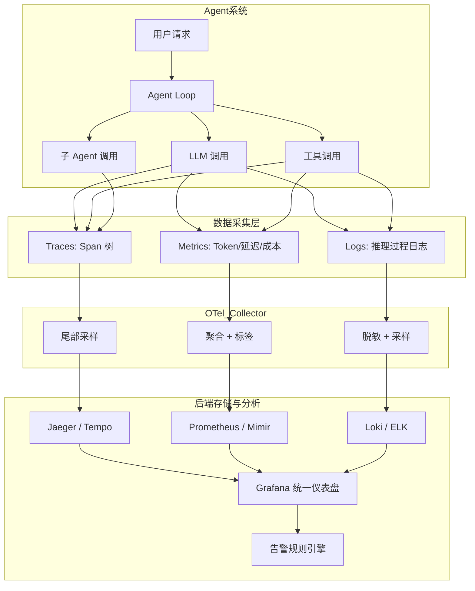
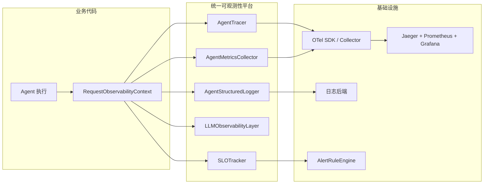

# 第 17 章 可观测性工程 — 追踪、指标与日志

本章构建一套专为 AI Agent 设计的可观测性平台。Agent 系统打破了传统 APM 的三条核心假设——请求路径确定、延迟分布集中、错误类型有限——使得可观测性从“运维辅助”升级为“系统刚需”。本章覆盖追踪、指标、日志三大支柱在 Agent 场景下的重新诠释，以及非确定性路径追踪、Token 成本归因和多 Agent 链路上下文传播。前置依赖：第 3 章架构总览。

## 本章你将学到什么

1. 为什么 Agent 的“成功返回”并不等于系统运行良好
2. 传统 APM 在 Agent 场景下为什么不够用
3. 如何建立最小可行的 Traces / Metrics / Logs 体系
4. 如何把质量、成本和行为路径纳入同一套观测框架

## 一个先记住的判断

> 如果你无法回答“这个 Agent 为什么做出这个决定、花了多少钱、失败在哪里”，那它就还没有真正进入可运维状态。

## 本章在主线里的位置

前面的章节主要在设计“系统应该如何工作”，而从第 17 章开始，关注点切换为“系统上线后如何被理解、被诊断、被持续改进”。

这也是为什么本书把可观测性放在部署之前：如果一个 Agent 已经运行，却没人能说清它为何成功、为何失败、成本为何飙升，那么谈再高级的扩缩容和平台化都为时过早。

因此，本章可以看作从“构建系统”进入“经营系统”的分界线。

---

## 17.1 从"能跑"到"能看"：Agent 可观测性的必要性

把一个 Agent 系统推上线并不是终点，而是新挑战的起点。对 Agent 来说，“能跑”只是最低要求；真正困难的是系统上线后你是否还能理解它、诊断它并持续改进它。一个看起来"成功返回"的请求，可能内部经历了 12 轮无意义循环、消耗了 $2.50 的 Token 成本，最终给出了一个质量堪忧的回答。如果没有完善的可观测性体系，你甚至不知道这件事正在发生。

传统 APM 的核心假设是请求路径确定、延迟分布集中、错误类型有限。Agent 系统打破了这三条假设——Agent 需要自主决策调用哪些工具、以什么顺序执行；每一次 LLM 推理的结果不可预测；在多 Agent 架构中任务可能被分发到多个子 Agent 形成复杂协作链路。

本章将构建一套专为 AI Agent 设计的可观测性平台，解决 Agent 系统的独有难题：非确定性执行路径追踪、LLM 黑盒推理的间接观测、多 Agent 协作链路的上下文传播、以及 Token 成本的精确归因。在第 14 章中我们建立了 Agent 信任架构的约束边界；本章的可观测性体系正是对那些约束的持续验证。

---

## 17.2 可观测性三大支柱

### 17.2.1 传统 APM 与 Agent 可观测性的对比

| 维度 | 传统 APM | Agent 系统需求 |
|------|---------|---------------|
| 执行路径 | 确定性、可预测 | 非确定性、每次可能不同 |
| 延迟分布 | 毫秒级、分布集中 | 秒到分钟级、分布离散 |
| 成本模型 | 按计算资源计费 | 按 Token 用量计费，不同模型价格差异 10 倍以上 |
| 错误类型 | 异常、超时、HTTP 错误码 | 幻觉、推理错误、工具滥用、无限循环 |
| 因果分析 | 服务依赖图明确 | Agent 自主决策，因果链需要从推理日志重建 |
| 质量衡量 | 可用性、延迟、吞吐量 | 任务完成质量、答案准确性、决策合理性 |

核心信息：Agent 的"成功"不再是二元判断。一个请求可能"完成了但质量不高""部分完成""完成了但花费过多资源"。可观测性系统必须能量化这个连续谱。

### 17.2.2 三大支柱在 Agent 系统中的重新诠释

| 支柱 | Agent 系统中的扩展 | 典型调查问题 |
|------|-------------------|-------------|
| **Traces** | Agent 决策链路追踪：request → agent_loop → llm_call → tool_call → sub_agent | "这个任务为什么调用了 5 次搜索工具？" |
| **Metrics** | Token 消耗、任务成功率、决策路径分布、工具调用频率、成本归因 | "过去一小时的平均 Token 消耗为什么翻倍了？" |
| **Logs** | LLM 交互日志、Agent 推理过程日志、工具输入输出日志（含脱敏） | "Agent 在第三轮迭代中为什么选择了错误的工具？" |

三者通过 **Trace ID** 关联，形成多维度观测体系。最实用的落地方式，通常不是一次性把所有指标都接齐，而是先建立一条最小调查链路：从**指标**发现异常 → 通过**追踪**定位具体请求链路 → 通过**日志**查看每一步的详细推理过程。



### 17.2.3 五大独特挑战

1. **非确定性执行路径**：同一请求每次可能走完全不同的代码路径。需追踪"Agent 做了哪些决策以及为什么"。
2. **LLM 黑盒性**：只能通过输入（Prompt）和输出（Completion）推断。要求尽可能保留输入输出的摘要信息（需脱敏）。
3. **多 Agent 协作的链路追踪**：追踪上下文需在 Agent 间正确传播，类似微服务分布式追踪但增加了动态路由复杂性。
4. **成本归因**：不同模型、上下文长度、输出长度的成本差异可达 100 倍。需按请求、用户、任务类型、模型精确归因。
5. **质量作为连续谱**：任务可能"完成了但质量不高""部分完成""完成了但花费过多"。需追踪中间状态。

### 17.2.4 可观测性成熟度模型

| 等级 | 名称 | 关键能力 |
|------|------|---------|
| L1 | 基础日志 | 文本日志、基础错误监控 |
| L2 | 结构化观测 | JSON 日志、请求级追踪、Token 计数 |
| L3 | 深度洞察 | 决策链路追踪、成本归因、告警体系 |
| L4 | 智能分析 | 决策模式分析、异常自动检测、自愈能力 |

成熟度评估遵循**木桶原理**——总体等级取所有维度（日志、追踪、指标、告警）中的最低等级。可观测性四个维度是互补而非替代关系，木桶原理确保团队不会在某个维度过度投资而忽视其他维度。完整的成熟度评估器实现见代码仓库 `code-examples/ch17/maturity-assessor.ts`。

---

## 17.3 分布式追踪

分布式追踪是理解 Agent 系统行为的最强大工具。通过为每一次用户请求建立完整的 Span 树，可以精确还原 Agent 的决策过程、定位性能瓶颈、分析成本构成。

### 17.3.1 OpenTelemetry GenAI 语义约定

OpenTelemetry 的 GenAI 语义约定已于 2025 年达到 **stable** 状态。`gen_ai.*` 命名空间下的核心属性已被正式纳入规范并保证向后兼容。

遵循这些约定的价值在于**跨系统互操作性**——Langfuse、Arize Phoenix、OpenLLMetry 等工具各自期望不同属性名称，GenAI 语义约定通过统一命名空间解决了这个问题。

| 属性名 | 类型 | 说明 | 示例值 |
|--------|------|------|--------|
| `gen_ai.system` | string | AI 系统标识 | `"openai"`, `"anthropic"` |
| `gen_ai.request.model` | string | 请求的模型名称 | `"gpt-4-turbo"` |
| `gen_ai.response.model` | string | 实际响应的模型 | `"gpt-4-turbo-2024-04-09"` |
| `gen_ai.usage.input_token` | int | 输入 Token 数量 | `1523` |
| `gen_ai.usage.output_token` | int | 输出 Token 数量 | `847` |
| `gen_ai.usage.cost_usd` | float | 总成本（美元） | `0.0847` |
| `gen_ai.agent.name` | string | Agent 名称 | `"research-agent"` |
| `gen_ai.agent.loop.iteration` | int | 当前循环迭代次数 | `3` |
| `gen_ai.tool.name` | string | 工具名称 | `"web_search"` |
| `gen_ai.prompt.template` | string | Prompt 模板标识 | `"agent_system_v3"` |

### 17.3.2 Agent 追踪的 Span 层级设计

Agent 的 Span 树需要反映"循环推理 + 工具调用"的执行模型：

```
agent_request (根 Span，SpanKind=SERVER)
├── agent_loop_iteration_1 (SpanKind=INTERNAL)
│   ├── llm_call (SpanKind=CLIENT)
│   ├── tool_call: web_search (SpanKind=CLIENT)
│   └── tool_call: calculator (SpanKind=CLIENT)
├── agent_loop_iteration_2
│   ├── llm_call
│   └── sub_agent_call: data_analyst (SpanKind=PRODUCER)
│       ├── agent_loop_iteration_1
│       │   ├── llm_call
│       │   └── tool_call: sql_query
│       └── agent_loop_iteration_2
│           └── llm_call (最终回答)
└── agent_loop_iteration_3
    └── llm_call (汇总最终回答)
```

每层 Span 记录不同关键属性：根 Span 记录任务级信息；iteration Span 记录决策信息；llm_call Span 记录 Token 用量、成本和延迟分解；tool_call Span 记录输入输出大小和成功状态。以下是 Agent 追踪器的核心方法，展示了如何在 Span 上标注 GenAI 语义属性并通过 Baggage 跨 Span 传播累计成本：

```typescript
// 文件: agent-tracer.ts — 核心追踪方法
class AgentTracer {
  startRequestSpan(params: { taskId: string; taskType: string }): Span {
    return this.tracer.startSpan("agent_request", {
      kind: SpanKind.SERVER,
      attributes: {
        "gen_ai.agent.name": this.agentName,
        "gen_ai.agent.task.id": params.taskId,
        "gen_ai.agent.task.type": params.taskType,
      },
    });
  }

  endLLMCallSpan(span: Span, result: LLMCallInfo): void {
    span.setAttributes({
      "gen_ai.response.model": result.model,
      "gen_ai.usage.input_tokens": result.inputTokens,
      "gen_ai.usage.output_tokens": result.outputTokens,
      "gen_ai.usage.cost_usd": result.costUsd,
      "gen_ai.response.finish_reason": result.finishReason,
    });
    // 累计成本到 Baggage，跨 Span 传播
    if (this.baggage) {
      this.baggage.costSpentUsd = (this.baggage.costSpentUsd ?? 0) + result.costUsd;
    }
    span.setStatus({ code: SpanStatusCode.OK });
    span.end();
  }
}
```

### 17.3.3 Agent 专用采样策略

Agent 系统遥测数据量巨大——一个包含 5 轮迭代、3 次工具调用的请求可能产生 10+ Span。简单的概率采样会丢失关键错误链路。解决方案是**分层采样**：

| 采样类别 | 采样率 | 触发条件 |
|---------|--------|---------|
| 错误链路 | 100% | Span 名称包含 error/alert/slow |
| 高成本调用 | 100% | `gen_ai.usage.cost_usd > 0.10` |
| 循环过多 | 100% | `gen_ai.agent.loop.iteration > 5` |
| 正常链路 | 10% | 默认概率采样 |

> **Head Sampling vs Tail Sampling：** 应用端 Head Sampling 控制大部分流量，OTel Collector 端 Tail Sampling 兜底捞回有价值的链路。组合使用效果最佳。完整的采样器实现见代码仓库 `code-examples/ch17/agent-sampler.ts`。

### 17.3.4 多 Agent 分布式追踪

在多 Agent 架构中，追踪上下文通过 W3C TraceContext 标准和 OpenTelemetry Baggage 在 Agent 间传播：

1. **父 Agent** 从当前 Span 提取 `traceparent` header
2. 将 `traceparent` 连同 Baggage（taskId、costSpentUsd 等）作为消息 header 传递给子 Agent
3. **子 Agent** 注入 header 到本地上下文，创建的 Span 自动成为父 Span 的子节点

Baggage 中的 `costSpentUsd` 字段允许子 Agent 知道父链路已花费多少，据此做出成本感知的决策（如选择更便宜的模型）。

### 17.3.5 追踪数据分析

追踪分析器应覆盖四个维度：**性能分析**（延迟分位数、LLM 时间占比）、**成本分析**（平均/最高请求成本、按模型分解）、**决策模式分析**（工具使用频率、平均迭代次数）、**异常检测**（工具失败率飙升、并行化机会）。完整实现见代码仓库 `code-examples/ch17/trace-analyzer.ts`。

---

## 17.4 指标体系

指标提供**聚合的、时间序列化的**系统运行状态视图，最适合持续监控。

### 17.4.1 四大指标类别

| 类别 | 目标受众 | 核心问题 | 典型指标 |
|------|---------|---------|---------|
| **业务指标** | 产品经理 | Agent 是否完成了任务？ | 任务完成率、用户满意度 |
| **性能指标** | SRE | 响应速度和吞吐量如何？ | P50/P95/P99 延迟、RPM、迭代次数 |
| **资源指标** | 架构师/财务 | 消耗了多少资源和成本？ | Token 消耗、API 调用次数、每任务成本 |
| **质量指标** | AI 工程师 | 推理和决策质量如何？ | 幻觉率、工具选择准确率、循环超限率 |

注意 **Histogram Bucket 设计**与传统服务不同：Agent 延迟 bucket 应使用 `[100, 500, 1000, 2000, 5000, 10000, 30000, 60000, 120000]`ms（传统 HTTP 通常 `[5, 10, 25, 50, 100, 250, 500, 1000]`ms）。迭代次数 bucket：`[1, 2, 3, 5, 7, 10, 15, 20]`。

完整的指标收集器实现（含所有四类指标的 Counter、Histogram、Gauge 定义）见代码仓库 `code-examples/ch17/agent-metrics.ts`。

### 17.4.2 SLO/SLI 定义

| SLO | SLI | 目标 | 评估窗口 |
|-----|-----|------|---------|
| 任务可用性 | 成功完成的任务 / 总任务数 | >= 95% | 30 天 |
| 响应延迟 | P95 延迟 <= 30s 的请求比率 | >= 90% | 30 天 |
| 成本效率 | 单任务成本 <= $0.50 的比率 | >= 95% | 30 天 |

**错误预算（Error Budget）** 是 SLO 的核心运营机制。以 95% 可用性为例，30 天内允许 5% 的失败率。当消耗过快时（Burn Rate），触发告警：Critical = 14.4x（1 小时内耗尽月度预算），Warning = 6x（6 小时内耗尽）。

### 17.4.3 Grafana 仪表盘设计

Agent 监控仪表盘建议五行布局，从宏观到微观：

- **第一行 — 核心 KPI**（6 个 Stat/Gauge）：任务成功率、RPM、P95 延迟、实时成本($/h)、并发数、错误预算剩余
- **第二行 — 延迟分布**：请求延迟分位数 + 按模型的 LLM 调用延迟
- **第三行 — Token 和成本**：Token 消耗趋势、按模型成本分布、每任务平均成本
- **第四行 — 工具调用**：调用频率 Top 10 + 工具错误率
- **第五行 — 质量指标**：迭代次数分布(Heatmap) + 质量趋势

核心 PromQL：

```promql
# 任务成功率（5 分钟窗口）
sum(rate(agent_task_success_total{agent="$agent"}[5m]))
  / sum(rate(agent_task_total{agent="$agent"}[5m]))

# 实时成本（转换为每小时美元）
sum(rate(agent_token_cost_usd_total{agent="$agent"}[5m])) * 3600

# P95 延迟
histogram_quantile(0.95,
  sum(rate(agent_request_duration_ms_bucket{agent="$agent"}[5m])) by (le))
```

完整的 Grafana 仪表盘 JSON 配置见 `code-examples/ch17/grafana-dashboard.json`。

---

## 17.5 结构化日志

Agent 系统需要**结构化的、关联的、可搜索的**日志体系，同时解决敏感数据脱敏和高吞吐日志采样两个问题。

### 17.5.1 日志级别的 Agent 语义

| 级别 | Agent 语义 | 生产环境 |
|------|-----------|---------|
| DEBUG | 决策过程细节、Prompt 完整内容、工具输入输出原文 | 关闭 |
| INFO | 生命周期事件、工具调用摘要、任务完成通知 | 开启（受采样控制） |
| WARN | 重试、降级、接近预算限制、迭代次数偏多 | 开启 |
| ERROR | 工具调用失败、LLM 异常、任务失败 | 始终开启 |
| FATAL | 崩溃、不可恢复错误、安全边界违规 | 始终开启 |

### 17.5.2 敏感数据脱敏

所有日志输出前必须经过脱敏处理。推荐默认规则：

| 规则 | 匹配模式 | 替换 |
|------|---------|------|
| API Key | `sk-...` 或 `api_key=...` (>=20 字符) | `[REDACTED_API_KEY]` |
| Email | 邮箱地址正则 | `[REDACTED_EMAIL]` |
| 手机号(CN) | `1[3-9]\d{9}` | `[REDACTED_PHONE]` |
| Bearer Token | `Bearer [token]` | `Bearer [REDACTED_TOKEN]` |
| 信用卡号 | 16 位卡号模式 | `[REDACTED_CARD]` |

### 17.5.3 日志采样策略

高吞吐场景下（每秒 100 请求，每请求 15-20 条日志），推荐策略：

- **始终记录**：ERROR/FATAL 级别、安全事件、告警触发
- **窗口限流**：每种事件类型在 60 秒内最多 100 条
- **Trace 关联保留**：请求链路被追踪系统采样时，该请求的所有日志保留

Agent 结构化日志器提供带上下文的子日志器（每个请求一个）和 Agent 专用日志方法（logIterationStart、logDecision、logLLMCall、logToolCall、logSecurityEvent），自动执行脱敏和采样控制。完整实现见代码仓库 `code-examples/ch17/structured-logger.ts`。

---

## 17.6 LLM 调用可观测性

LLM 调用是 Agent 系统中最核心、最昂贵、也最不透明的环节——60%-90% 的延迟和成本来自 LLM 调用。

### 17.6.1 LLM 调用的独特观测维度

| 维度 | 说明 | 重要性 |
|------|------|--------|
| Token 用量 | 输入/输出 Token 数量 | 直接决定成本和延迟 |
| 延迟分解 | TTFT(首字延迟)、生成速度(token/s) | 用户体验和容量规划 |
| 模型版本 | 请求模型 vs 实际响应模型 | 质量回归检测 |
| Prompt 版本 | Prompt 模板和版本号 | 迭代效果追踪 |
| 完成原因 | stop, length, content_filter | 识别截断和过滤 |
| 成本归因 | 单次调用成本、按任务/用户归因 | 预算管理 |

### 17.6.2 LLM 可观测性包装层

推荐装饰器/包装层模式将可观测性逻辑与业务逻辑解耦——业务代码只需提供普通的 LLM 调用函数，包装层自动添加计时、Token 计数、成本计算、日志记录和 Span 标注。完整实现见代码仓库 `code-examples/ch17/llm-observability.ts`。

### 17.6.3 模型价格与成本计算

成本计算公式：`cost = (inputTokens / 1000) * inputPrice + (outputTokens / 1000) * outputPrice`。注意：请求模型 vs 实际模型可能不同；输出价格通常是输入的 2-5 倍。

主流模型参考价格（截至 2025 年）：

| 模型 | 输入 ($/1K token) | 输出 ($/1K token) |
|------|-------------------|-------------------|
| GPT-4 Turbo | 0.01 | 0.03 |
| GPT-4o | 0.005 | 0.015 |
| GPT-4o-mini | 0.00015 | 0.0006 |
| Claude 3 Opus | 0.015 | 0.075 |
| Claude 3 Sonnet | 0.003 | 0.015 |
| Claude 3 Haiku | 0.00025 | 0.00125 |

### 17.6.4 LLM 性能分析与优化建议

基于收集的数据，性能分析器可自动识别四类优化机会：

- **成本优化**：如果 GPT-4 调用平均输出只有 200 Token 且调用量超过 100 次，降级到 GPT-4o-mini 可节省约 90%。如果平均输入 Token 超过 3000，审查 System Prompt 长度。
- **延迟优化**：P99/P95 比值超过 3 说明存在严重长尾延迟——分析长尾请求共同特征，考虑超时后重试到备用模型。
- **质量优化**：超过 5% 调用因 `finish_reason=length` 被截断——增加 `max_token` 或优化 Prompt。
- **可靠性优化**：错误率超过 1% 的模型需配置指数退避重试和备用模型故障转移。

---

## 17.7 Agent 行为分析

行为分析超越"是否成功"的判断，深入理解 Agent 的决策模式和执行路径特征。四个核心分析维度：

- **决策路径频率**：最常走的执行路径是什么？路径频率分析可发现冗余步骤。
- **工具使用模式**：哪些工具组合最常一起使用？前驱/后继关系可用于优化编排。
- **错误模式聚类**：按工具+错误类型聚类，快速识别系统性问题。
- **会话回放**：完整还原一次执行的全过程，是事后分析的终极工具。

### 会话回放示例

```
=== Agent 执行时间线 ===
[     0ms] [SYS]  system               | 会话开始 | Agent: research-agent
[    12ms] [LLM>] research-agent       | 调用 LLM: gpt-4-turbo
[  2352ms] [<LLM] gpt-4-turbo          | 需要搜索数据...
                                        | -> 耗时: 2340ms | Token: 1770 | 成本: $0.0236
[  2400ms] [TL>]  research-agent       | 调用工具: web_search
[  3650ms] [<TL]  web_search           | 返回 42 条结果 | -> 耗时: 1250ms
[  3700ms] [LLM>] research-agent       | 调用 LLM: gpt-4-turbo
[ 12220ms] [<LLM] gpt-4-turbo          | 生成分析报告...
                                        | -> 耗时: 8520ms | Token: 6050 | 成本: $0.0725
[ 12250ms] [SYS]  system               | 会话结束 | 耗时: 12250ms | 总成本: $0.0961
```

完整的行为分析器和会话回放器实现见 `code-examples/ch17/behavior-analyzer.ts`。

---

## 17.8 告警与事件响应

### 17.8.1 Agent 专属告警场景

| 告警场景 | 触发条件 | 严重性 | 建议响应 |
|---------|---------|--------|---------|
| Agent 无限循环 | 迭代次数 > max_iterations | Critical | 终止请求，检查 Prompt |
| Token 预算耗尽 | 单任务消耗超预算 | Warning | 降级模型或终止 |
| 工具调用风暴 | 短时间调用频率异常 | Warning | 限流，检查逻辑 |
| 成本异常飙升 | 小时成本 > 日均 3 倍标准差 | Critical | 暂停非关键请求 |
| 多 Agent 死锁 | 循环等待 | Emergency | 打断循环，人工介入 |
| 安全边界违规 | 尝试未授权操作 | Emergency | 阻止，通知安全团队 |
| 模型服务降级 | LLM API 错误率 > 5% | Critical | 切换备用模型 |

### 17.8.2 告警规则设计原则

1. **持续时间要求**：避免瞬时波动触发告警。"失败率 > 10%"应要求持续 5 分钟。
2. **组合条件优于单一阈值**："严重劣化"应组合"失败率 > 20% AND P95 延迟 > 30s"。
3. **异常检测优于固定阈值**：成本等有周期波动的指标使用移动平均 + 标准差检测更鲁棒。

### 17.8.3 Runbook：从告警到修复

每条告警规则都应有配套 Runbook（诊断步骤 + 修复步骤 + 升级策略）。Runbook 应足够具体让新人也能按步骤操作。关键路径的修复应自动化——例如成本异常时自动将非关键请求路由到更便宜的模型。

**值班编制**需要三个角色：Primary on-call（SRE，系统级问题）、Secondary on-call（后端工程师，业务逻辑问题）、AI Expert on-call（AI/Prompt 工程师，Agent 行为问题）。Critical 及以上同时通知 Primary 和 AI Expert。

完整的告警规则引擎实现见代码仓库 `code-examples/ch17/alert-engine.ts`。

---

## 17.9 可观测性平台集成

### 17.9.1 统一平台架构

统一平台将追踪、指标、日志、LLM 可观测性、行为分析和告警整合，提供一站式初始化和使用体验。运行时通过 `RequestObservabilityContext` 为每个请求提供封装好的操作（recordLLMCall、recordToolCall、recordIteration、complete/fail），业务代码只需调用高层方法，底层的 Span、指标、日志、SLO 追踪自动完成。



完整实现见代码仓库 `code-examples/ch17/observability-platform.ts`。

### 17.9.2 OpenTelemetry Collector 配置

OTel Collector 关键配置要点：

- **接收器**：OTLP gRPC(4317) + HTTP(4318) 双协议
- **处理器**：`memory_limiter`（1024MB）、`batch`（512条/5s）、`tail_sampling`（错误全采、高延迟全采、高成本全采、其余 10%）
- **导出器**：OTLP → Jaeger/Tempo、Prometheus remote write、Loki

完整 Collector 配置见 `code-examples/ch17/otel-collector-config.yaml`。

### 17.9.3 可观测性成本估算

每小时 100 请求的 Agent 服务，按典型配置：

| 组件 | 月成本估算 |
|------|----------|
| 追踪（10% 采样） | ~$0.12 |
| 指标（50 时间序列） | ~$5.00 |
| 日志 (~32 GB) | ~$16.00 |
| **合计** | **~$21** |

全量采样追踪成本增加 10 倍。对于月 LLM 成本 $500 的系统，$21 的可观测性成本占比 4%。如果 LLM 成本只有 $50/月，则需简化——关闭行为分析、降低日志保留天数。

---

## 17.10 可观测性反模式

**反模式一：指标海洋。** 定义 200+ 指标但无人看仪表盘。对策：从 SLO 反推必要指标，30 天无人查看的指标考虑下线。

**反模式二：全量日志不采样。** 存储成本数百美元/月，查询延迟分钟级。对策：分层采样——错误全量，INFO 限流，DEBUG 动态开关。

**反模式三：追踪孤岛。** 单个 Agent 追踪清楚但跨 Agent 链路断裂。对策：强制所有 Agent 间通信携带 `traceparent` header。

**反模式四：告警即文档。** 告警触发后值班人员不知如何操作。对策：每条告警配套 Runbook。

**反模式五：成本盲区。** 月底才发现成本超支 3 倍。对策：在 LLM Span 上标注 `gen_ai.usage.cost_usd`，仪表盘第一行放实时成本面板，设置移动平均异常检测告警。

---

## 17.11 本章小结

### 十大核心要点

1. **Agent 可观测性不等于传统 APM**——非确定性路径、LLM 黑盒和 Token 成本模型要求重新设计。
2. **三大支柱缺一不可**——追踪、指标、日志通过 Trace ID 关联形成完整多维观测。
3. **OpenTelemetry GenAI 语义约定是互操作性基础**——采用 `gen_ai.*` 标准命名空间。
4. **智能采样至关重要**——错误全采 + 高成本全采 + 正常按比率采样。
5. **成本追踪是核心维度**——每次 LLM 调用需精确计算和归因成本。
6. **四维指标体系**——业务、性能、资源、质量，SLO/SLI 量化服务水平。
7. **结构化日志 + 脱敏是底线**——所有日志输出前必须脱敏处理。
8. **行为分析超越简单监控**——决策路径频率、工具使用模式、会话回放。
9. **告警 + Runbook + 自动化 = 完整事件响应**——值班需包含 AI Expert 角色。
10. **可观测性本身也有成本**——通过采样和保留策略确保投入与价值成正比。

### 与其他章节的关联

- **第 3 章**：Span 层级基于感知-推理-行动循环构建
- **第 14 章**：可观测性是信任体系的验证层
- **第 15 章**：线上异常可自动转化为评估测试用例
- **第 18 章**：健康检查、指标导出和仪表盘将在 K8s 部署中深度集成

> **下一章预告**：在第 18 章中，我们将把本章的可观测性体系与生产部署架构结合，探讨 Agent 系统的容器化部署、自动扩缩容、蓝绿发布和完整的 CI/CD 流程。

## 本章小结

可观测性让 Agent 从“能运行”走向“能经营”。追踪、指标与日志并不是为了多收集数据，而是为了让系统出现波动时能快速定位原因、衡量影响并推动改进。对 Agent 来说，这一能力尤为关键，因为它的错误往往不是单点故障，而是决策链路中的逐步偏移。

## 建议接着读

如果你希望沿着本书的主干继续推进，建议下一步阅读 第 18 章《部署架构与运维》。这样可以把本章中的判断框架，继续连接到后续的实现、评估或生产化问题上。

