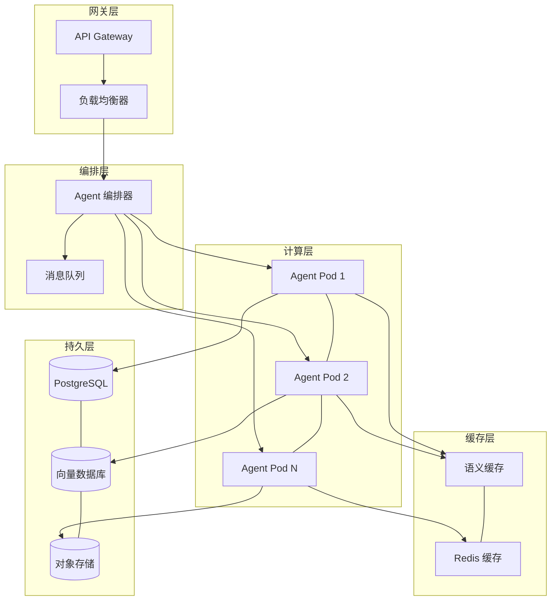
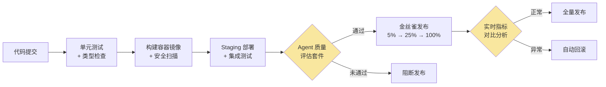
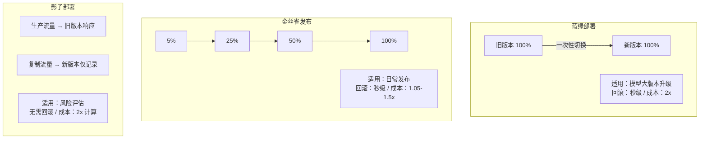

# 第 18 章 部署架构与运维

本章讲解 Agent 系统的部署与运维工程——从开发环境到生产环境的完整交付流程。Agent 的非确定性行为使得传统的 CI/CD 管线和发布策略需要根本性调整。本章覆盖容器化部署、灰度发布、回滚策略、自动扩缩容和生产环境的故障诊断与恢复。前置依赖：第 17 章可观测性工程。

---

## 18.1 Agent 部署架构

### 18.1.1 部署拓扑概览

AI Agent 系统的部署架构远比传统 Web 服务复杂。一个在浏览器端看似简单的"帮我查一下上周的销售报告"请求，在后端可能触发意图解析、知识库检索、SQL 工具调用、结果格式化等多个异步步骤，每一步都涉及不同的计算特征和资源需求。

一个典型的 Agent 部署拓扑需要考虑以下五个维度：

1. **计算层**：Agent 推理服务需要与传统 API 服务不同的资源配比——CPU 密集度低但内存需求高，且单次请求耗时长
2. **缓存层**：语义缓存减少对 LLM 的重复调用（参见第 19 章：成本工程）
3. **编排层**：多 Agent 协作场景下的编排与路由
4. **持久层**：Agent 状态、对话历史与知识库的存储
5. **网关层**：统一的 API 网关与流量管理

下面的架构图展示了这五层如何协同工作：



在这个五层拓扑中，每一层都有明确的职责边界。网关层负责 TLS 终止、认证鉴权和流量整形；编排层决定请求如何路由到具体的 Agent 实例；计算层是 Agent 推理的核心执行单元；缓存层通过语义匹配减少重复计算；持久层存储对话历史、知识库和备份数据。这种分层设计使得每一层可以独立扩缩容。

**设计决策：为什么选择 Kubernetes 而非纯 Serverless？** Agent 工作负载的长连接、有状态和高延迟方差特性，使得 Serverless 的冷启动惩罚和执行时限成为严重瓶颈。Kubernetes 的 Pod 模型允许精确控制资源配比、维持常驻进程避免冷启动、并通过自定义指标实现 Agent 感知的弹性伸缩。Serverless 的适用场景和混合部署策略见 18.9 节。

### 18.1.2 部署配置类型体系

类型安全的配置定义是避免运行时错误的第一道防线。以下是 Agent 部署配置的核心类型，`AgentSpecificConfig` 中的每个字段都反映了 Agent 特有的运行时约束：

```typescript
// 文件: agent-deployment-config.ts — Agent 部署配置核心类型
export interface AgentSpecificConfig {
  modelProvider: string;
  modelName: string;
  maxConcurrentRequests: number;
  requestTimeoutMs: number;        // 通常 30-60s，远高于传统 API 的 3-5s
  maxTokensPerRequest: number;
  semanticCacheEnabled: boolean;
  circuitBreakerEnabled: boolean;
  rateLimitPerMinute: number;
  memoryBackend: "redis" | "postgres" | "dynamodb";
}
```

`requestTimeoutMs` 通常设为 30-60 秒（传统 API 一般 3-5 秒），因为单次 Agent 请求可能包含多轮 LLM 调用。完整类型定义（含 `ResourceConfig`、`AutoScalingConfig` 等）见代码仓库 `code-examples/ch18-deployment/agent-deployment-config.ts`。

### 18.1.3 Kubernetes 部署器

部署器将配置验证、YAML 清单生成、集群部署整合为统一的五步流程。配置验证环节包含大量 Agent 特有的校验逻辑——超时阈值合理性、弹性组件配置完整性、生产环境的高可用要求。在我们的实践中，约 40% 的部署失败可以在配置验证这一步被拦截。

部署器的五步协议为：验证配置 → 确保命名空间 → 创建 PVC → 生成并应用部署清单（Deployment + Service + Ingress + HPA）→ 等待就绪。其中验证步骤会检查环境与超时阈值的合理性组合——某团队曾因忘记将 `requestTimeoutMs` 从开发环境的 5 秒调整为生产环境的 60 秒，导致所有多步推理请求超时。完整实现见代码仓库 `code-examples/ch18-deployment/k8s-agent-deployer.ts`。

---

## 18.2 弹性模式

弹性（Resilience）是 Agent 系统在面对各种故障时仍能提供服务的能力。Agent 系统面临比传统 Web 服务更复杂的故障模式——LLM API 限流（429 错误可能持续数分钟）、模型响应超时（单次调用 10 秒以上）、工具调用失败、Token 预算耗尽等。这些故障发生频率高且恢复时间不确定，要求弹性机制能够快速响应并优雅降级。

本节实现五种核心弹性模式，并通过编排器将它们组合为统一的弹性层。

### 18.2.1 语义缓存

语义缓存是降低 LLM 调用成本的关键技术，通过向量相似度匹配复用历史响应，可减少 30-60% 的重复调用。与传统的精确匹配缓存不同，语义缓存通过 Embedding 向量的余弦相似度实现"近似命中"。完整的语义缓存架构设计（含 LRU 淘汰、TTL 过期、命中率追踪、预热策略）与生产级实现详见 **第 19 章 §19.4.2 SemanticCostCache**。

### 18.2.2 分层熔断器

为什么 Agent 需要"分层"熔断器？考虑 Agent 同时依赖 OpenAI、Anthropic 和本地模型三个 LLM 提供商的场景。每个依赖的故障特征不同——OpenAI 的 429 限流通常 60 秒后恢复，而本地模型的 OOM 可能需要 Pod 重启。单一熔断器无法为每个依赖设置独立的阈值。

我们的设计引入父子层级关系：顶层"LLM 服务"熔断器打开时所有子级自动被拒绝；单个子级的熔断不影响其他子级。熔断器运行在三种状态之间：**CLOSED**（正常放行）→ **OPEN**（全部拒绝）→ **HALF_OPEN**（探测恢复），状态转换基于滑动时间窗口内的失败率和慢调用率。

在一次 OpenAI 大规模限流事件中，OpenAI 子级熔断器在 10 秒内打开，请求自动路由到 Anthropic 子级，用户几乎无感知。完整实现（含滑动窗口、慢调用检测、层级指标汇总）见代码仓库 `code-examples/ch18-deployment/hierarchical-circuit-breaker.ts`。

### 18.2.3 分布式限流器

Agent 系统的限流需求比传统 API 更细粒度——不仅限制总请求量，还要按用户、按模型、按工具分别设限。我们实现了两种互补算法：**滑动窗口**精确控制每分钟请求数（对齐 LLM API 的 RPM 限制），**令牌桶**允许短时突发流量。核心限流逻辑通过 Redis Lua 脚本实现原子性操作，Redis 不可用时自动降级为本地限流——限流器自身的故障不应阻塞正常业务。完整实现见代码仓库 `code-examples/ch18-deployment/distributed-rate-limiter.ts`。

### 18.2.4 重试与退避策略

调用 LLM API 或外部工具时，临时性故障的发生频率远高于传统 API 调用。退避策略的选择直接影响故障恢复期间的表现：固定延迟重试导致"惊群效应"，指数退避的多实例同步重试仍有问题。**去相关抖动（Decorrelated Jitter）** 是 Agent 场景下的最佳选择——每次重试的延迟基于上一次延迟随机计算，使不同实例的重试时间自然错开。AWS 的研究数据表明，去相关抖动相比全抖动可将 P99 完成时间降低 40%。完整实现见代码仓库 `code-examples/ch18-deployment/retry-backoff.ts`。

### 18.2.5 舱壁模式

舱壁模式通过隔离不同类型的工作负载防止故障蔓延——为不同 LLM 提供商分配独立的并发池。假设 OpenAI API 出现严重延迟，没有舱壁保护的系统会让大量请求阻塞在 OpenAI 调用上，耗尽全局连接池，导致 Anthropic 和本地模型调用也被拖慢。通过为每个提供商设置独立的 `maxConcurrent` 限制，OpenAI 的延迟只影响分配给它的那部分并发配额。超出限制的请求进入等待队列，队列满时直接拒绝——快速失败优于无限等待。完整实现见代码仓库 `code-examples/ch18-deployment/bulkhead.ts`。

### 18.2.6 弹性编排器

五种弹性模式必须协同工作，编排顺序至关重要。我们的弹性编排器遵循"快速失败"原则，默认执行顺序为：

1. **缓存** → 最快返回路径，命中则跳过后续所有步骤
2. **限流** → 防止系统过载，拒绝超额请求
3. **熔断** → 隔离已知故障的下游服务
4. **舱壁** → 控制并发，防止资源耗尽
5. **重试** → 处理临时性故障

任何一层可独立启用或禁用——开发环境可能只需重试，生产环境启用全部五层。一个常见错误是将熔断器放在缓存之前——导致缓存中有可用结果时，熔断器打开仍拒绝请求。正确的"缓存优先"顺序确保缓存命中不受熔断状态影响。完整实现见代码仓库 `code-examples/ch18-deployment/resilience-orchestrator.ts`。

---

## 18.3 自动扩缩容

Agent 工作负载具有显著的突发性和不可预测性。更关键的是，Agent 的"负载"无法用传统的 CPU/内存利用率准确衡量——一个正在等待 LLM API 响应的 Pod 可能 CPU 利用率极低，但所有并发槽位都被长时间的 LLM 调用占用，无法接受新请求。

### 18.3.1 多信号自动扩缩容器

`AgentAutoScaler` 综合六维信号做出扩缩容决策：

| 信号 | 权重 | 方向判定 | 为何重要 |
|------|------|---------|---------|
| CPU 利用率 | 0.25 | >70% 扩容 / <35% 缩容 | 基础资源指标 |
| 请求队列深度 | 0.25 | >10 扩容 / <2 缩容 | Agent 特有的积压信号 |
| P95 响应延迟 | 0.20 | >5s 扩容 / <1s 缩容 | SLA 保障信号 |
| 内存利用率 | 0.15 | >80% 扩容 / <40% 缩容 | 内存压力信号 |
| 错误率 | 0.10 | >5% 扩容 | 健康状况信号 |
| 预测负载 | 0.05 | >1.2 扩容 / <0.5 缩容 | 基于历史模式的前瞻信号 |

**请求队列深度**是 Agent 系统最有价值的扩缩容信号。当队列积压时，即使 CPU 利用率不高，也说明并发处理能力已饱和。

扩缩容器内置三个防护机制：**紧急模式**在错误率超过 panic 阈值时绕过冷却期立即扩容；**稳定化窗口**在缩容决策时取窗口内最大值，防止因指标短时波动导致不必要的缩容；**冷却期**确保两次操作之间有足够间隔让系统达到新稳态。

**设计决策：为什么不直接使用 Kubernetes HPA？** HPA 原生只支持 CPU 和内存两个指标，虽然可以通过 Custom Metrics API 扩展，但缺少信号融合、稳定化窗口和紧急模式等 Agent 场景必需的能力。推荐将 `AgentAutoScaler` 作为决策层，通过 K8s API 执行实际的副本数调整。完整实现见代码仓库 `code-examples/ch18-deployment/agent-auto-scaler.ts`。

### 18.3.2 KEDA 集成模式

对于已采用 KEDA 的团队，可通过 Prometheus 触发器将 Agent 特有指标接入事件驱动扩缩容：

```yaml
# KEDA ScaledObject — Agent 场景典型配置
apiVersion: keda.sh/v1alpha1
kind: ScaledObject
metadata:
  name: agent-service-scaledobject
spec:
  scaleTargetRef: { name: agent-service }
  minReplicaCount: 2
  maxReplicaCount: 30
  cooldownPeriod: 120
  fallback: { failureThreshold: 3, replicas: 3 }
  triggers:
    - type: prometheus
      name: agent-queue-depth
      metadata:
        query: avg(agent_request_queue_depth{deployment="agent-service"})
        threshold: "5"
    - type: prometheus
      name: agent-response-latency
      metadata:
        query: histogram_quantile(0.95, sum(rate(agent_response_duration_seconds_bucket[5m])) by (le))
        threshold: "5"
    - type: cron
      name: business-hours-scale
      metadata: { timezone: Asia/Shanghai, start: "0 8 * * 1-5", end: "0 20 * * 1-5", desiredReplicas: "5" }
```

注意 `fallback.replicas: 3`——当 Prometheus 不可用时 KEDA 回退到 3 个副本而非缩容到 0，这是生产环境中至关重要的安全网。`cron` 触发器在工作日 8:00-20:00 预先扩容到 5 个副本，避免早高峰的流量冲击。

---

## 18.4 部署策略

部署策略必须考虑两个传统 Web 服务不太关心的问题：**长连接会话的优雅迁移** 和 **模型行为一致性验证**。Agent 新版本可能包含模型升级、Prompt 调整或工具配置变更，这些变化不会导致 HTTP 500，但可能产生质量回归。传统的基于错误率和延迟的验证指标无法捕获这类问题。

下面的 CI/CD Pipeline 中，黄色环节是 Agent 特有的验证步骤：



### 18.4.1 蓝绿部署

蓝绿部署通过维护两套完全独立的环境，在验证通过后一次性切换流量。优势是切换和回滚都瞬间完成；劣势是需要双倍基础设施成本。对 Agent 系统，蓝绿部署特别适合模型大版本升级（如 GPT-3.5 → GPT-4）、Prompt 模板重大重构、以及合规要求严格的场景。

核心流程：在非活跃环境部署新版本 → 运行健康检查和 Agent 质量评估 → 一次性切换流量 → 保留旧环境用于快速回滚。

```typescript
// 文件: blue-green-deployer.ts — 核心流程
export class BlueGreenDeployer {
  async deployNewVersion(version: string): Promise<boolean> {
    const target = this.state.activeSlot === "blue" ? "green" : "blue";
    await this.k8sClient.deployVersion(target, version);
    if (!(await this.validate(target)).passed) return false;
    await this.k8sClient.switchTraffic(target);
    this.state.activeSlot = target;
    return true;
  }
  async rollback(): Promise<boolean> {
    const prev = this.state.activeSlot === "blue" ? "green" : "blue";
    await this.k8sClient.switchTraffic(prev);
    this.state.activeSlot = prev;
    return true;
  }
}
```

### 18.4.2 金丝雀发布

金丝雀发布是 Agent 系统最安全的日常部署策略。它通过多阶段逐步放量（默认 5% → 25% → 50% → 100%），在每个阶段自动分析指标，任何异常立即回滚。其对 Agent 的特殊价值在于：即使模型行为变化不会导致显式错误，金丝雀阶段的指标对比（响应质量评分、用户满意度、对话完成率等）也能捕获微妙的质量回归。分析逻辑将金丝雀版本的错误率与基线版本对比——超过 1.5 倍则判定异常；P95 延迟超过基线 1.3 倍同样触发回滚。完整实现见代码仓库 `code-examples/ch18-deployment/canary-deployment-controller.ts`。

### 18.4.3 发布策略对比



**推荐**：日常发布使用金丝雀策略；模型大版本升级先用影子部署评估质量差异，确认无回归后再用蓝绿部署切换。

---

## 18.5 配置管理

Agent 系统的配置管理需要处理比传统应用更复杂的场景。频率差异是核心矛盾：代码变更可能一周一次，而 Prompt 调优可能一天多次。

### 18.5.1 Agent 配置管理器

配置管理器采用五级层级覆盖策略：`default < environment < cluster < application < override`。高层级自动覆盖低层级，使运维人员可以在不修改代码的情况下调整 Agent 行为。`default` 层定义通用默认参数；`environment` 层为生产环境设置更保守的值；`application` 层为特定 Agent 设置专属参数；`override` 层供紧急情况临时覆盖。配置管理器还内置快照和回滚能力——每次重大变更前自动创建快照，出问题时一键恢复。

特性开关的灰度百分比功能尤为实用。例如灰度测试新 Prompt 模板时设置 `rolloutPercentage: 10`，让 10% 的用户使用新模板。通过 `userId` 的哈希取模确保同一用户在多次请求中看到一致的行为——这对 Agent 多轮对话一致性至关重要。完整实现见代码仓库 `code-examples/ch18-deployment/agent-config-manager.ts`。

### 18.5.2 模型版本管理器

模型切换可能导致行为变化——从 GPT-3.5 切换到 GPT-4，即使代码完全不变，也可能导致回答风格、工具调用策略和推理路径发生显著变化。模型版本管理器的核心能力包括：多版本并行运行（A/B 测试）、基于灰度百分比的流量分配、按任务类型和用户群体的智能路由、以及版本切换的审计日志。选择模型时综合考虑能力匹配、成本约束和延迟要求——简单的意图分类用低成本模型，复杂的多步推理路由到高能力模型。完整实现见代码仓库 `code-examples/ch18-deployment/model-version-manager.ts`。

---

## 18.6 灾备与恢复

Agent 系统的灾备设计面临独特挑战：除了传统的数据备份，还需要考虑 Agent 状态（对话上下文、工具执行进度、推理计划）的持久化与恢复。丢失一个传统 Web 会话意味着用户需要重新登录；丢失一个 Agent 会话意味着用户需要重新描述一个可能花了十分钟才阐述清楚的复杂任务。

### 18.6.1 灾备策略选择

我们的灾备管理器支持四种策略，按成本和恢复速度递增排列：

| 策略 | RTO | 成本 | 适用场景 |
|------|-----|------|---------|
| Pilot Light | 15-30 分钟 | 最低 | 非核心业务、开发环境 |
| Warm Standby | 5-15 分钟 | 中等 | 大多数 Agent 系统的推荐起步方案 |
| Active-Passive | 1-5 分钟 | 较高 | SLA 要求严格的企业级 Agent |
| Active-Active | 接近零 | 最高 | 关键任务系统 |

即使选择了 Pilot Light 方案，也应至少每月进行一次灾备演练——未经验证的灾备计划在真正需要时往往会失败。灾备管理器的核心流程是：持续健康检查 → 检测主区域连续失败 → 选择最佳目标区域 → 估算数据丢失量 → 提升新主区域 → 尝试最终数据同步。完整实现见代码仓库 `code-examples/ch18-deployment/disaster-recovery-manager.ts`。

### 18.6.2 Agent 状态备份

Agent 状态比传统数据库记录更复杂——包含结构化的对话历史、半结构化的工具执行快照、以及非结构化的工作记忆。

备份策略上推荐**增量备份 + 定期全量备份**的组合：每次 Agent 状态变更时写入增量日志（append-only），每 6 小时执行一次全量快照。恢复时先加载最近的全量快照，再重放之后的增量日志，即可恢复到任意时间点。这种设计借鉴了数据库 WAL（Write-Ahead Log）的经典思路。增量日志使用 Protobuf 序列化以减小体积，全量快照使用 gzip 压缩后存入对象存储。完整实现见代码仓库 `code-examples/ch18-deployment/agent-state-backup.ts`。

---

## 18.7 运维自动化

Agent 系统的运维复杂度远超传统服务——不仅关注"服务是否可用"，还需要关注"回答质量是否正常"、"LLM 成本是否在预算内"、"模型提供商是否限流"等 Agent 特有维度。

### 18.7.1 运维自动化引擎

运维自动化引擎由三个核心模块组成：**事件驱动的自愈机制**、**ChatOps 命令集成**和**自动化 Runbook 执行**。

自愈机制的设计哲学是"快速恢复优于完美诊断"。当检测到错误率突增时，自愈规则立即执行预设动作（重启异常 Pod → 扩容 → 切换备用模型 → 通知运维人员），每个规则都有冷却期和每小时最大执行次数限制，防止自愈动作本身引发级联故障。

ChatOps 集成让运维人员在即时通讯工具中直接操控系统。常用命令包括：`/Agent status` 查看状态、`/Agent scale <deployment> <replicas>` 手动扩缩容、`/Agent heal <rule-id>` 手动触发自愈。ChatOps 的最大价值不仅是便利性——它还自动记录每个操作的执行者、时间和上下文，为事后复盘提供完整审计轨迹。完整实现见代码仓库 `code-examples/ch18-deployment/agent-ops-automation.ts`。

### 18.7.2 容量规划器

Agent 系统的成本结构独特——LLM API 调用费用可能占总运营成本的 60-80%。容量规划必须同时考虑基础设施容量和 API 调用预算。规划器通过分析历史数据的趋势和周期性模式预测未来 7-30 天的资源需求，并给出扩容建议和成本估算。完整实现见代码仓库 `code-examples/ch18-deployment/capacity-planner.ts`。

---

## 18.8 生产就绪检查清单

在 Agent 系统上线前，需要通过全面的生产就绪检查。在我们的实践中，跳过这一步的团队平均在上线后 72 小时内遇到第一次生产事故。

检查器涵盖八大类别共 20+ 项检查。核心判定规则：任何 CRITICAL 级别检查未通过，系统即判定为"未就绪"，应阻止上线。

**安全性**：TLS/SSL 证书 [CRITICAL]、LLM API 密钥自动轮换 [CRITICAL]、RBAC 权限控制 [CRITICAL]、Agent 输入验证和注入防护 [CRITICAL]、输出内容安全过滤 [HIGH]、NetworkPolicy [HIGH]。

**可靠性**：就绪探针 [CRITICAL]、存活探针 [CRITICAL]、高可用副本数 ≥ 2 [CRITICAL]、熔断器配置 [HIGH]、PDB [HIGH]。

**可观测性**：监控系统接入 [CRITICAL]、告警配置（≥ 5 条，含 ≥ 2 条关键告警）[CRITICAL]、日志集中收集 [HIGH]、分布式追踪（参见第 17 章）[HIGH]、运维仪表盘 [MEDIUM]。

**灾备**：数据备份（24 小时内有最新备份）[CRITICAL]、灾备恢复计划 [HIGH]。

**性能**：资源配额 [HIGH]、水平自动扩缩容 [HIGH]、速率限制 [HIGH]。

**成本 / 合规 / 运维**：每日成本监控和预算告警 [MEDIUM]、启动探针避免慢启动误杀 [HIGH]、Runbook 文档和 On-Call 值班制度 [HIGH]。

建议将检查器集成到 CI/CD Pipeline 中，任何 CRITICAL 检查不通过即阻断流水线。完整实现见代码仓库 `code-examples/ch18-deployment/production-readiness-checker.ts`。

---

## 18.9 替代部署模型：Serverless 与 Edge-Cloud

Kubernetes 原生部署是 Agent 系统的首选架构，但 Serverless 和 Edge-Cloud 在特定场景下有独特优势。本节将这两种替代模型的核心思路和架构模式做统一介绍。

### 18.9.1 Serverless Agent 部署

Serverless 以按需付费和零运维吸引了大量团队，但 Agent 的执行特征与 Serverless 设计假设存在根本性张力：

| 挑战 | 影响 | 平台限制 |
|------|------|---------|
| 执行时限 | Agent 多轮推理 5-15 分钟 | Lambda 15min, Cloud Functions 9min |
| 冷启动 | SDK/Prompt/连接初始化慢 | 1-5s 首次启动延迟 |
| 无状态 | 需跨调用保持对话上下文 | 函数实例间无共享内存 |
| 载荷限制 | LLM 响应可能很大 | 6MB 同步 / 256KB 异步 |

业界发展出四种架构模式来应对这些挑战：

1. **Step Functions 编排**：将 Agent Loop 分解为状态机，每步作为独立 Lambda，彻底解决执行时限。代价是开发复杂度增加。
2. **Streaming 流式响应**：使用 Lambda Response Streaming 或 WebSocket API Gateway 绕过同步超时，最适合对话式 Agent。
3. **外部状态存储**：DynamoDB/Redis 存储对话历史和中间结果，每次调用加载/持久化。最简单但序列化开销增加延迟。
4. **混合部署**：短任务走 Serverless 享受弹性和成本优势，长任务路由到 ECS/Fargate 长运行容器。实践中最务实的选择。

Serverless Agent 的关键设计要点：`safetyMarginMs` 确保在 Lambda 超时前 30 秒主动暂停并持久化状态，避免被强制终止导致数据丢失；`maxIterationsPerInvocation` 限制单次调用的迭代次数，配合 Step Functions 实现跨调用长流程编排。完整实现见代码仓库 `code-examples/ch18-deployment/serverless-agent-handler.ts`。

### 18.9.2 Edge-Cloud 协同部署

随着 AI Agent 向移动端和 IoT 设备渗透，纯云端部署面临延迟敏感、隐私合规和离线可用性三重挑战。Edge-Cloud 协同架构在设备端运行小模型处理简单任务，将复杂任务路由到云端大模型。

**三层协作架构：**

- **Edge 层（设备端）**：运行 1-7B 参数量化模型（如 Phi-3-mini、Gemma-2B），负责意图分类、简单槽位填充和离线应急。本地推理延迟低于 200ms，敏感数据无需离开设备。
- **Cloud 层（云端）**：运行完整规模大模型（GPT-4、Claude），负责复杂多步推理、多工具编排和长文本生成。
- **协调层（路由决策）**：Edge 端轻量级路由器，根据任务复杂度、延迟要求、隐私级别和网络状况做实时路由。路由器推理开销必须极低（<5ms）。

路由器的决策遵循严格优先级链：离线时强制 Edge → 需要云端专属工具时强制 Cloud → 隐私敏感数据优先本地 → 超出 Edge 能力边界走 Cloud → 最后比较延迟选择更快路径。

**四个核心工程挑战：**

1. **模型同步**：差量更新策略仅下载权重变化部分，Wi-Fi 后台静默更新。Edge/Cloud 使用统一 Prompt 模板版本号。
2. **上下文交接**：Edge/Cloud 模型内部表示不兼容，只能传递文本级对话历史。建议实现对话摘要压缩后传输。
3. **带宽约束**：gzip 压缩 + 上下文裁剪（只传最近 N 轮）+ 渐进式传输（先发关键信息）。
4. **一致性保证**：统一会话状态存储 + 路由决策时考虑会话连续性（同一会话尽量保持在同一处理层级）。

完整实现见代码仓库 `code-examples/ch18-deployment/edge-cloud-router.ts`。

---

## 18.10 反模式与陷阱

在 Agent 部署实践中，以下反模式频繁出现且代价高昂：

**反模式一：用 CPU 利用率驱动扩缩容。** Agent 的 CPU 可能只有 20%，但请求队列已积压到 50+——因为大部分时间在等待 LLM API 响应。正确做法是以请求队列深度和并发连接数作为主要扩缩容信号（见 18.3 节）。

**反模式二：全局共享单一熔断器。** 一个工具服务的故障会导致所有 LLM 调用被拒绝。正确做法是使用分层熔断器（见 18.2.2 节）。

**反模式三：忽略 Agent 状态的灾备。** 团队精心设计了数据库备份，却忘记了对话上下文和工具执行进度。一次区域故障导致数千个会话丢失。正确做法见 18.6.2 节。

**反模式四：Prompt 变更走常规代码发布流程。** Prompt 修改频率远高于代码变更，如果每次走完整 CI/CD 会严重拖慢迭代。正确做法是通过配置管理器支持 Prompt 热更新（见 18.5 节）。

**反模式五：在 Serverless 上直接运行长流程 Agent。** Lambda 的 15 分钟时限看似足够，但没有超时保护的 Agent 会在时限到达时被强制终止，丢失所有中间状态。正确做法是实现主动暂停和状态持久化（见 18.9.1 节）。

---

## 18.11 本章小结

本章系统地探讨了 AI Agent 系统从实验室到生产环境的部署架构与运维实践。核心要点：

1. **Kubernetes 原生部署是首选架构**，通过类型安全的配置体系和五步部署协议实现声明式、可重复的部署流程。
2. **语义缓存是最有价值的优化手段之一**，完整实现详见第 19 章 §19.4.2。
3. **弹性模式需要分层编排**，将缓存、限流、熔断、舱壁和重试按"快速失败"原则编排。
4. **Agent 扩缩容需要业务级指标**——请求队列深度、P95 延迟和 Token 消耗速率是最有价值的信号。
5. **金丝雀发布是最安全的日常部署策略**，能捕获模型行为变化导致的微妙质量回归。
6. **配置管理需要层级覆盖和动态更新**，使 Prompt 调优和模型切换无需重部署。
7. **灾备设计必须包含 Agent 状态备份**——对话上下文和工具执行进度是有状态资产。
8. **自愈机制是降低运维负担的关键**，配合 ChatOps 实现快速诊断。
9. **容量规划应基于数据而非直觉**，必须同时考虑基础设施和 API 调用预算。
10. **上线前全面检查是质量最后防线**——八大类别 20+ 项检查，CRITICAL 不通过即阻止上线。
11. **Serverless 部署需要架构适配**——Step Functions 编排、外部状态存储和混合部署路由。
12. **Edge-Cloud 协同是 Agent 走向端侧的必经之路**——基于多维信号做实时路由决策。

### 下一章预告

在下一章（第 19 章：成本工程）中，我们将深入探讨 Agent 系统的成本优化策略。本章介绍的语义缓存、模型版本管理和容量规划将作为成本工程的重要基础。

---

> **架构师笔记**：部署和运维是一项持续改进的工作，而非一次性任务。建议团队定期（至少每季度一次）重新运行生产就绪检查，根据业务发展和技术演进持续完善部署架构与运维实践。
