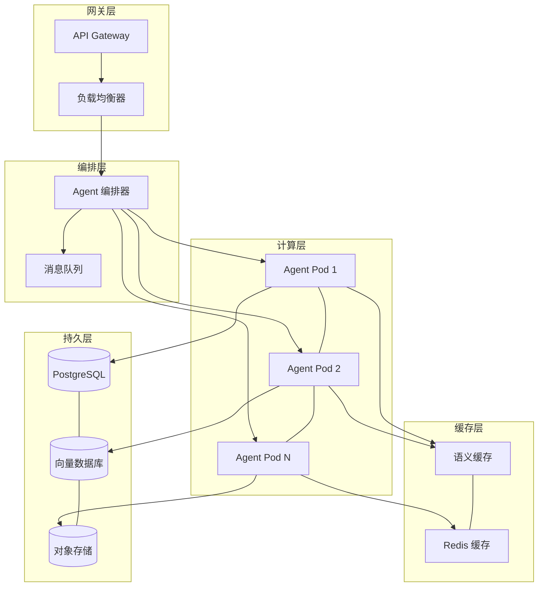
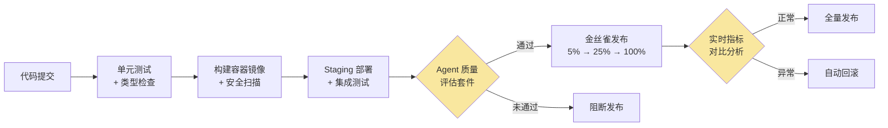
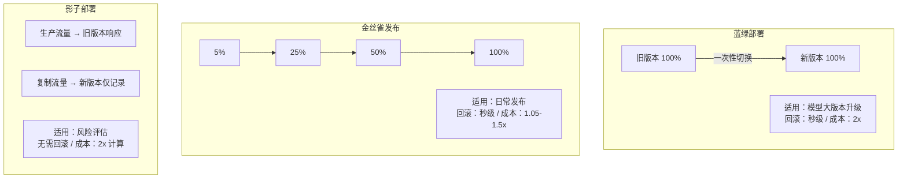

# 第 18 章：部署架构与运维

> **"构建 AI Agent 只是起点，让它在生产环境中稳定、高效、可持续地运行才是真正的工程挑战。"**

## 问题与动机

一个在开发者笔记本上运行良好的 Agent 原型，距离生产部署还有多远？答案往往令人沮丧：非常远。

传统 Web 服务的部署经过二十年的工程实践已经高度成熟——容器化、CI/CD、蓝绿部署、自动扩缩容——这些技术栈可以几乎开箱即用。但 AI Agent 系统打破了传统部署的多项基本假设。首先，Agent 的资源消耗模式与传统服务截然不同：一次 LLM 调用可能消耗数秒的计算时间和数千 Token 的内存，而传统 API 请求通常在毫秒级完成。这意味着常规的 CPU/内存利用率指标无法真实反映 Agent 的负载状况。其次，Agent 的行为不确定性远高于传统服务——同一个请求在不同时间可能触发不同数量的工具调用和推理轮次，导致延迟方差极大，这对健康检查、超时配置和扩缩容策略都提出了全新挑战。

更棘手的是 Agent 系统的有状态特性。一个多轮对话的 Agent 需要在请求之间维护对话上下文、工具执行进度甚至推理计划——这些状态不能像传统会话那样简单地存入 Redis。Agent 状态的丢失意味着用户需要重新开始整个对话流程，体验成本远高于普通 Web 应用的会话丢失。

本章正是为解决这些问题而写。我们将从 Kubernetes 原生的部署拓扑设计出发，逐步构建弹性模式、自动扩缩容、部署策略、配置管理、灾备恢复和运维自动化等生产级能力。每个主题都将阐明设计动机和权衡取舍，而非仅仅展示配置代码。在第 17 章（可观测性工程）中，我们学习了如何深入洞察 Agent 系统的运行状态；本章将聚焦于如何基于这些洞察来构建可靠的部署与运维体系。

本章涵盖以下核心主题：

- **部署架构**：Kubernetes 原生的 Agent 部署拓扑设计
- **弹性模式**：语义缓存、熔断器、限流器与弹性编排
- **自动扩缩容**：基于多信号的智能扩缩容策略
- **部署策略**：蓝绿部署、金丝雀发布与影子部署
- **配置管理**：动态配置、特性开关与模型版本管理
- **灾备与恢复**：多区域容灾与状态备份
- **运维自动化**：ChatOps、自愈系统与容量规划
- **生产就绪检查**：全方位的上线前检查清单

---

## 18.1 Agent 部署架构

### 18.1.1 部署拓扑概览

AI Agent 系统的部署架构远比传统 Web 服务复杂。一个在浏览器端看似简单的"帮我查一下上周的销售报告"请求，在后端可能触发意图解析、知识库检索、SQL 工具调用、结果格式化等多个异步步骤，每一步都涉及不同的计算特征和资源需求。

一个典型的 Agent 部署拓扑需要考虑以下五个维度：

1. **计算层**：Agent 推理服务需要与传统 API 服务不同的资源配比——CPU 密集度低但内存需求高，且单次请求耗时长
2. **缓存层**：语义缓存减少对 LLM 的重复调用（参见第 19 章：成本工程）
3. **编排层**：多 Agent 协作场景下的编排与路由
4. **持久层**：Agent 状态、对话历史与知识库的存储
5. **网关层**：统一的 API 网关与流量管理

下面的架构图展示了这五层如何协同工作：



在这个五层拓扑中，每一层都有明确的职责边界。网关层负责 TLS 终止、认证鉴权和流量整形；编排层决定请求如何路由到具体的 Agent 实例，并管理异步任务队列；计算层是 Agent 推理的核心执行单元；缓存层通过语义匹配和会话缓存减少重复计算；持久层存储需要长期保留的对话历史、知识库和备份数据。这种分层设计使得每一层可以独立扩缩容——例如，在请求高峰期可以单独扩展计算层的 Pod 数量，而无需同步扩展持久层。

**设计决策：为什么选择 Kubernetes 而非纯 Serverless？** Agent 工作负载的长连接、有状态和高延迟方差特性，使得 Serverless 的冷启动惩罚和执行时限成为严重瓶颈。Kubernetes 的 Pod 模型允许我们精确控制资源配比、维持常驻进程避免冷启动、并通过自定义指标实现 Agent 感知的弹性伸缩。我们将在 18.9 节讨论 Serverless 的适用场景和混合部署策略。

### 18.1.2 部署配置类型体系

在实际部署中，类型安全的配置定义是避免运行时错误的第一道防线。以下是 Agent 部署配置的核心类型，重点展示 Agent 与传统服务的差异之处——`AgentSpecificConfig` 中的每个字段都反映了 Agent 特有的运行时约束：

```typescript
// 文件: agent-deployment-config.ts — Agent 部署配置核心类型
export interface AgentSpecificConfig {
  modelProvider: string;
  modelName: string;
  maxConcurrentRequests: number;
  requestTimeoutMs: number;        // 通常 30-60s，远高于传统 API 的 3-5s
  maxTokensPerRequest: number;
  semanticCacheEnabled: boolean;   // 降低 LLM 重复调用成本
  circuitBreakerEnabled: boolean;  // 隔离 LLM API 故障
  rateLimitPerMinute: number;      // 控制 LLM API 调用预算
  memoryBackend: "redis" | "postgres" | "dynamodb";
}
// 完整类型定义（含 ResourceConfig、AutoScalingConfig 等）
// 见 code-examples/ch18-deployment/agent-deployment-config.ts
```

`requestTimeoutMs` 通常设为 30-60 秒（传统 API 一般 3-5 秒），因为单次 Agent 请求可能包含多轮 LLM 调用。`semanticCacheEnabled` 和 `circuitBreakerEnabled` 是 Agent 系统在生产环境必须考虑的弹性选项，我们将在 18.2 节详细讨论。

### 18.1.3 Kubernetes 部署器

有了类型化的配置定义，部署器将配置验证、YAML 清单生成、集群部署整合为统一的五步流程。其中配置验证环节是 Agent 部署区别于传统部署的关键——它包含了大量 Agent 特有的校验逻辑，例如超时阈值合理性、弹性组件配置完整性、以及生产环境的高可用要求。在我们的实践中，约 40% 的部署失败可以在配置验证这一步被拦截。

```typescript
// 文件: k8s-agent-deployer.ts — 五步部署协议
export class K8sAgentDeployer {
  validateConfig(config: AgentDeploymentConfig): ValidationResult {
    const errors: string[] = [], warnings: string[] = [];
    if (config.agentConfig.requestTimeoutMs < 1000)
      warnings.push("Agent 超时建议 ≥ 1000ms");
    if (config.environment === "production") {
      if (config.replicas < 2) warnings.push("生产环境建议 ≥ 2 副本");
      if (!config.agentConfig.circuitBreakerEnabled)
        warnings.push("生产环境强烈建议启用熔断器");
    }
    return { valid: errors.length === 0, errors, warnings };
  }

  async deploy(config: AgentDeploymentConfig): Promise<DeploymentResult> {
    // 五步：验证 → 命名空间 → PVC → 部署清单 → 等待就绪
    const v = this.validateConfig(config);
    if (!v.valid) return this.failResult(v);
    await this.ensureNamespace(config.namespace, config.environment);
    await this.applyManifests(config);  // Deployment + Service + Ingress + HPA
    return this.buildResult(config, await this.waitForReady(config.name));
  }
  // 完整实现见 code-examples/ch18-deployment/k8s-agent-deployer.ts
}
```

这里有一个实际案例值得分享：某团队在生产部署时忘记将 `requestTimeoutMs` 从开发环境的 5 秒调整为生产环境的 60 秒，导致所有多步推理的 Agent 请求超时。配置验证器能够通过检查环境与超时阈值的合理性组合来拦截这类问题。

---

## 18.2 弹性模式

弹性（Resilience）是 Agent 系统在面对各种故障时仍能提供服务的能力。传统 Web 服务的弹性设计主要关注网络抖动和下游服务不可用；Agent 系统则面临更复杂的故障模式——LLM API 限流（429 错误可能持续数分钟）、模型响应超时（单次调用 10 秒以上）、工具调用失败（外部 API 不可用）、Token 预算耗尽（月度 API 配额用完）等。这些故障发生频率高且恢复时间不确定，要求弹性机制能够快速响应并优雅降级。

本节将逐一实现五种核心弹性模式，并在最后通过编排器将它们组合为统一的弹性层。

### 18.2.1 语义缓存

> **语义缓存**是降低 LLM 调用成本的关键技术，通过向量相似度匹配复用历史响应，可减少 30-60% 的重复调用。与传统的精确匹配缓存不同，语义缓存通过 Embedding 向量的余弦相似度来判断请求是否可以命中缓存，从而在语义层面实现"近似命中"。完整的语义缓存架构设计（含 LRU 淘汰、TTL 过期、命中率追踪、预热策略）与生产级实现详见 **第 19 章 §19.4.2 SemanticCostCache**。

### 18.2.2 分层熔断器

熔断器（Circuit Breaker）是保护 Agent 系统免受下游服务故障连锁影响的核心组件。为什么 Agent 需要"分层"熔断器而非单一熔断器？考虑这样的场景：Agent 同时依赖 OpenAI、Anthropic 和本地模型三个 LLM 提供商，以及搜索、数据库等多个工具服务。每个依赖的故障特征和恢复时间都不同——OpenAI 的 429 限流通常 60 秒后恢复，而本地模型的 OOM 可能需要 Pod 重启才能恢复。单一熔断器无法为每个依赖设置独立的阈值和超时。

我们的设计引入了父子层级关系：当顶层的"LLM 服务"熔断器打开时，所有子级自动被拒绝，避免请求在多个不可用的提供商之间徒劳重试；而单个子级的熔断不影响其他子级。

熔断器运行在三种状态之间：**CLOSED**（正常放行）→ **OPEN**（全部拒绝）→ **HALF_OPEN**（探测恢复）。状态转换基于滑动时间窗口内的失败率和慢调用率，而非简单的连续失败计数——这能更好地应对间歇性故障。

```typescript
// 文件: hierarchical-circuit-breaker.ts — 核心执行逻辑
export class HierarchicalCircuitBreaker {
  async execute<T>(fn: () => Promise<T>): Promise<T> {
    if (this.parent?.getState() === "OPEN")
      throw new CircuitBreakerError(`父级已打开`, this.parent.getName());
    if (this.state === "OPEN") {
      if (Date.now() - this.stateChangedAt > this.config.timeoutMs)
        this.transitionTo("HALF_OPEN");
      else throw new CircuitBreakerError(`熔断器已打开`, this.name);
    }
    try {
      const result = await fn();
      this.recordSuccess(Date.now() - performance.now());
      return result;
    } catch (error) {
      this.recordFailure(Date.now() - performance.now());
      throw error;
    }
  }
  // 完整实现（含滑动窗口、慢调用检测、层级指标汇总）
  // 见 code-examples/ch18-deployment/hierarchical-circuit-breaker.ts
}
```

在实际生产中，分层熔断器的价值在一次 OpenAI 大规模限流事件中得到了充分验证。当 OpenAI API 连续返回 429 时，OpenAI 子级熔断器在 10 秒内打开，请求自动路由到 Anthropic 子级，用户几乎无感知。如果使用的是全局单一熔断器，整个 LLM 服务都会被熔断，所有用户都将看到服务不可用的错误。

### 18.2.3 分布式限流器

在分布式环境中，限流器需要跨多个实例共享状态。Agent 系统的限流需求比传统 API 更细粒度——不仅要限制总请求量，还要按用户、按模型、按工具分别设限，防止单个高消耗用户耗尽所有 LLM 预算。

我们实现了两种互补的限流算法：**滑动窗口**适合精确控制每分钟请求数（对齐 LLM API 的 RPM 限制），**令牌桶**适合允许短时突发流量（如用户短时间内连续发起多轮对话）。核心限流逻辑通过 Redis Lua 脚本实现原子性操作。当 Redis 不可用时，限流器自动降级为本地限流——这是一个重要的设计决策：限流器自身的故障不应该阻塞正常业务。

```typescript
// 文件: distributed-rate-limiter.ts — 核心限流逻辑
export class DistributedRateLimiter {
  async checkLimit(key: string): Promise<RateLimitResult> {
    try {
      return this.redis
        ? await this.checkDistributed(key)
        : this.checkLocal(key);         // Redis 不可用时降级
    } catch {
      return { allowed: true, remaining: this.config.maxRequests };
    }
  }
  // 完整实现（含 Lua 脚本、令牌桶、本地降级）
  // 见 code-examples/ch18-deployment/distributed-rate-limiter.ts
}
```

### 18.2.4 重试与退避策略

在调用 LLM API 或外部工具时，临时性故障（429 限流、503 服务不可用、网络超时）的发生频率远高于传统 API 调用。合理的重试策略是 Agent 系统可靠性的基础保障。

退避策略的选择直接影响系统在故障恢复期间的表现。固定延迟重试会导致"惊群效应"——当 LLM API 从限流中恢复时，所有重试请求同时涌入，立即触发再次限流。指数退避缓解了这一问题，但多个实例使用相同的退避间隔仍会产生同步重试。**去相关抖动（Decorrelated Jitter）** 是 Agent 场景下的最佳选择：每次重试的延迟基于上一次延迟随机计算，使不同实例的重试时间自然错开。AWS 的研究数据表明，去相关抖动相比全抖动（Full Jitter）可以将 P99 完成时间降低 40%。

```typescript
// 文件: retry-backoff.ts — 退避策略计算
export class RetryWithBackoff {
  private calculateDelay(attempt: number, prevDelay: number): number {
    switch (this.config.backoffStrategy) {
      case "exponential-jitter":
        return Math.min(
          this.config.initialDelayMs * Math.pow(2, attempt - 1)
            * (0.5 + Math.random() * 0.5),
          this.config.maxDelayMs);
      case "decorrelated-jitter":
        return Math.min(
          Math.random() * (prevDelay * 3 - this.config.initialDelayMs)
            + this.config.initialDelayMs,
          this.config.maxDelayMs);
    }
  }
  // 完整实现见 code-examples/ch18-deployment/retry-backoff.ts
}
```

### 18.2.5 舱壁模式

舱壁模式（Bulkhead Pattern）通过隔离不同类型的工作负载来防止故障蔓延。名称来源于船舶的水密隔舱——一个舱室进水不会导致整艘船沉没。

在 Agent 系统中，舱壁模式的典型应用场景是：为不同 LLM 提供商分配独立的并发池。假设 OpenAI 的 API 出现严重延迟，没有舱壁保护的系统会让大量请求阻塞在 OpenAI 调用上，耗尽全局连接池，导致本可正常响应的 Anthropic 和本地模型调用也被拖慢。通过为每个提供商设置独立的 `maxConcurrent` 限制，OpenAI 的延迟只影响分配给它的那部分并发配额。超出并发限制的请求进入等待队列，队列满时直接拒绝——快速失败优于无限等待。

```typescript
// 文件: bulkhead.ts — 核心并发控制
export class Bulkhead {
  async execute<T>(fn: () => Promise<T>): Promise<T> {
    if (this.activeCalls < this.config.maxConcurrent)
      return this.executeImmediately(fn);
    if (this.queue.length >= this.config.maxQueueSize)
      throw new BulkheadError(`舱壁已满`);
    return this.enqueueWithTimeout(fn, this.config.queueTimeoutMs);
  }
  // 完整实现见 code-examples/ch18-deployment/bulkhead.ts
}
```

### 18.2.6 弹性编排器

以上五种弹性模式各自解决不同的故障场景，但在实际系统中它们必须协同工作。编排的顺序至关重要——错误的顺序会导致重复计费（先重试后缓存）或无效保护（先舱壁后限流）。

我们的弹性编排器遵循"快速失败"原则，默认执行顺序为：

1. **缓存** → 最快返回路径，命中则跳过后续所有步骤
2. **限流** → 防止系统过载，拒绝超额请求
3. **熔断** → 隔离已知故障的下游服务
4. **舱壁** → 控制并发，防止资源耗尽
5. **重试** → 处理临时性故障

这种编排设计使得任何一层都可以独立启用或禁用——开发环境可能只需要重试，而生产环境启用全部五层。通过 `executionOrder` 配置项，团队还可以根据具体场景调整执行顺序。

```typescript
// 文件: resilience-orchestrator.ts — 编排核心
export class ResilienceOrchestrator {
  private order = ["cache", "rateLimiter", "circuitBreaker", "bulkhead", "retry"];
  async execute<T>(ctx: ExecutionContext, fn: () => Promise<T>): Promise<T> {
    let cur = fn;
    for (const step of [...this.order].reverse()) {
      const wrapped = cur;
      cur = () => this.applyStep(step, ctx, wrapped);
    }
    return cur();
  }
  // 完整实现见 code-examples/ch18-deployment/resilience-orchestrator.ts
}
```

一个常见的错误是将熔断器放在缓存之前——这会导致即使缓存中有可用结果，熔断器打开时仍然拒绝请求。正确的"缓存优先"顺序确保了缓存命中不受熔断状态影响。

---

## 18.3 自动扩缩容

AI Agent 工作负载具有显著的突发性和不可预测性。一个用户对话可能触发多次 LLM 调用和工具执行，导致资源消耗远超传统 API 服务。更关键的是，Agent 的"负载"无法用传统的 CPU/内存利用率来准确衡量——一个正在等待 LLM API 响应的 Pod 可能 CPU 利用率极低，但实际上已经无法接受新请求，因为所有并发槽位都被长时间的 LLM 调用占用了。

这要求自动扩缩容策略必须能够感知 Agent 特有的业务指标。

### 18.3.1 多信号自动扩缩容器

我们的 `AgentAutoScaler` 综合六维信号来做出扩缩容决策，每个信号都有独立的权重和阈值：

| 信号 | 权重 | 方向判定 | 为何重要 |
|------|------|---------|---------|
| CPU 利用率 | 0.25 | >70% 扩容 / <35% 缩容 | 基础资源指标 |
| 请求队列深度 | 0.25 | >10 扩容 / <2 缩容 | Agent 特有的积压信号 |
| P95 响应延迟 | 0.20 | >5s 扩容 / <1s 缩容 | SLA 保障信号 |
| 内存利用率 | 0.15 | >80% 扩容 / <40% 缩容 | 内存压力信号 |
| 错误率 | 0.10 | >5% 扩容 | 健康状况信号 |
| 预测负载 | 0.05 | >1.2 扩容 / <0.5 缩容 | 基于历史模式的前瞻信号 |

其中，**请求队列深度**是 Agent 系统最有价值的扩缩容信号。当队列开始积压时，即使 CPU 利用率不高，也说明当前实例的并发处理能力已经饱和——通常是因为大量请求正在等待 LLM API 的响应。

扩缩容器还内置了三个防护机制：**紧急模式**在错误率超过 panic 阈值时绕过所有冷却期立即扩容；**稳定化窗口**在缩容决策时取窗口内最大值，防止因指标短时波动导致不必要的缩容；**冷却期**确保两次扩缩容操作之间有足够的间隔，让系统有时间达到新的稳态。

```typescript
// 文件: agent-auto-scaler.ts — 核心决策逻辑
export class AgentAutoScaler {
  async evaluate(): Promise<ScalingDecision> {
    const signals = await this.collectSignals();
    const current = await this.metricsProvider.getCurrentReplicas();
    // 紧急模式：错误率超标 → 立即扩容
    if (signals.find(s => s.name === "error_rate"
        && s.value >= this.config.panicThreshold))
      return this.panicScale(current, signals);
    // 加权计算 → 稳定化窗口 → 冷却期检查
    const desired = this.calculateDesiredReplicas(current, signals);
    const stabilized = this.stabilize(desired, current);
    return this.buildDecision(stabilized, current, signals);
  }
  // 完整实现见 code-examples/ch18-deployment/agent-auto-scaler.ts
}
```

**设计决策：为什么不直接使用 Kubernetes HPA？** HPA 原生只支持 CPU 和内存两个指标，虽然可以通过 Custom Metrics API 扩展，但缺少信号融合、稳定化窗口和紧急模式等 Agent 场景必需的能力。我们推荐将 `AgentAutoScaler` 作为决策层，通过 K8s API 执行实际的副本数调整——既利用 K8s 的声明式基础设施，又获得 Agent 感知的智能决策。

### 18.3.2 KEDA 集成模式

对于已经采用 KEDA（Kubernetes Event Driven Autoscaling）的团队，可以通过 KEDA 的 Prometheus 触发器将 Agent 特有指标接入事件驱动扩缩容。以下是一个典型配置，结合了队列深度、响应延迟和工作时间预调度三个触发器：

```yaml

# KEDA ScaledObject — Agent 场景典型配置
apiVersion: keda.sh/v1alpha1
kind: ScaledObject
metadata:
  name: agent-service-scaledobject
spec:
  scaleTargetRef: { name: agent-service }
  minReplicaCount: 2
  maxReplicaCount: 30
  cooldownPeriod: 120
  fallback: { failureThreshold: 3, replicas: 3 }  # 指标失败时的安全副本数
  triggers:
    - type: prometheus
      name: agent-queue-depth
      metadata:
        query: avg(agent_request_queue_depth{deployment="agent-service"})
        threshold: "5"
    - type: prometheus
      name: agent-response-latency
      metadata:
        query: histogram_quantile(0.95, sum(rate(agent_response_duration_seconds_bucket[5m])) by (le))
        threshold: "5"
    - type: cron
      name: business-hours-scale
      metadata: { timezone: Asia/Shanghai, start: "0 8 * * 1-5", end: "0 20 * * 1-5", desiredReplicas: "5" }
```

注意 `fallback.replicas: 3` 这个配置——当 Prometheus 不可用时，KEDA 会回退到 3 个副本，而不是缩容到 0。这是一个容易被忽略但在生产环境中至关重要的安全网。`cron` 触发器在工作日 8:00-20:00 预先扩容到 5 个副本，避免早高峰的流量冲击。

---

## 18.4 部署策略

部署策略决定了新版本如何替代旧版本。对 Agent 系统而言，部署策略必须考虑两个传统 Web 服务不太关心的问题：**长连接会话的优雅迁移** 和 **模型行为一致性验证**。

一个正在处理多轮对话的 Agent 实例不能被简单地终止——用户的对话上下文会丢失。同时，Agent 的新版本可能包含模型升级、Prompt 调整或工具配置变更，这些变化不会导致显式错误（HTTP 500），但可能产生质量回归（回答准确率下降）。传统的基于错误率和延迟的部署验证指标无法捕获这类问题。

下面的流程图展示了我们推荐的 CI/CD Pipeline，其中黄色环节是 Agent 特有的验证步骤：



**Agent 质量评估套件**使用预设的 benchmark 对话集验证回答质量；**实时指标对比分析**将金丝雀版本的 Agent 输出质量指标与基线版本进行统计对比。这两个黄色环节是 Agent CI/CD 区别于传统 Web 服务 CI/CD 的关键差异点。

### 18.4.1 蓝绿部署

蓝绿部署通过维护两套完全独立的环境（蓝色和绿色），在验证通过后一次性切换流量。优势是切换瞬间完成、回滚同样瞬间；劣势是需要双倍的基础设施成本。

对 Agent 系统而言，蓝绿部署特别适合模型大版本升级（如 GPT-3.5 → GPT-4）、Prompt 模板重大重构、以及合规要求严格的场景。其核心流程是：在非活跃环境部署新版本 → 运行健康检查和 Agent 质量评估 → 一次性切换流量 → 保留旧环境用于快速回滚。

```typescript
// 文件: blue-green-deployer.ts — 核心流程
export class BlueGreenDeployer {
  async deployNewVersion(version: string): Promise<boolean> {
    const target = this.state.activeSlot === "blue" ? "green" : "blue";
    await this.k8sClient.deployVersion(target, version);
    if (!(await this.validate(target)).passed) return false;
    await this.k8sClient.switchTraffic(target);  // 一次性切换
    this.state.activeSlot = target;
    return true;
  }
  async rollback(): Promise<boolean> {
    const prev = this.state.activeSlot === "blue" ? "green" : "blue";
    await this.k8sClient.switchTraffic(prev);     // 秒级回滚
    this.state.activeSlot = prev;
    return true;
  }
  // 完整实现见 code-examples/ch18-deployment/blue-green-deployer.ts
}
```

### 18.4.2 金丝雀发布控制器

金丝雀发布是 Agent 系统最安全的日常部署策略。它通过多阶段逐步放量（默认 5% → 25% → 50% → 100%），在每个阶段自动分析指标，任何异常立即回滚。与蓝绿部署的"全或无"切换不同，金丝雀发布将风险窗口缩小到一个极小的流量比例。

金丝雀发布对 Agent 的特殊价值在于：即使模型行为变化不会导致显式错误，金丝雀阶段的指标对比（响应质量评分、用户满意度、对话完成率等）也能捕获微妙的质量回归。分析逻辑将金丝雀版本的错误率与基线版本对比——超过 1.5 倍则判定为异常；P95 延迟超过基线 1.3 倍同样触发回滚。

```typescript
// 文件: canary-deployment-controller.ts — 多阶段放量核心
export class CanaryDeploymentController {
  async executeCanary(version: string): Promise<CanaryResult> {
    for (const { weight, durationMs } of this.stages) {
      await this.setCanaryWeight(version, weight);
      if (durationMs > 0) {
        const ok = await this.analyzeVsBaseline(durationMs);
        if (!ok) { await this.rollbackCanary(); return { success: false }; }
      }
    }
    return { success: true };
  }
  // 完整实现见 code-examples/ch18-deployment/canary-deployment-controller.ts
}
```

### 18.4.3 发布策略对比

选择哪种部署策略取决于变更的风险级别和业务约束。下图对比了三种主要策略在 Agent 场景下的适用性：



**我们的推荐**：日常发布使用金丝雀策略；模型大版本升级先用影子部署评估质量差异，确认无回归后再用蓝绿部署切换。这种组合策略在保障安全性的同时最小化了发布延迟。

---

## 18.5 配置管理

Agent 系统的配置管理需要处理比传统应用更复杂的场景：模型参数、提示词模板、工具配置、特性开关等都需要支持动态更新而无需重新部署。一个 Prompt 模板的微调、一个模型参数的修改、一个工具开关的切换——这些在传统应用中可能需要完整的发布流程，在 Agent 系统中则需要实时生效。频率差异是核心矛盾：代码变更可能一周一次，而 Prompt 调优可能一天多次。

### 18.5.1 Agent 配置管理器

我们的配置管理器采用五级层级覆盖策略：`default < environment < cluster < application < override`。高层级的配置自动覆盖低层级，使得运维人员可以在不修改应用代码的情况下调整 Agent 行为。

典型使用场景是：`default` 层定义通用默认参数（如 `maxTokensPerRequest: 4096`）；`environment` 层为生产环境设置更保守的值（如 `rateLimitPerMinute: 500`）；`application` 层为特定 Agent 设置专属参数；`override` 层供运维人员在紧急情况下临时覆盖任何配置。配置管理器还内置了快照和回滚能力——每次重大配置变更前自动创建快照，出问题时一键恢复。

```typescript
// 文件: agent-config-manager.ts — 层级配置管理
export class AgentConfigManager {
  get<T>(key: string, defaultValue?: T): T {
    for (const layer of ["override", "application", "cluster", "environment", "default"])
      if (this.layers.get(layer as ConfigLayer)?.has(key))
        return this.layers.get(layer as ConfigLayer)!.get(key)!.value as T;
    if (defaultValue !== undefined) return defaultValue;
    throw new Error(`配置键 "${key}" 未找到`);
  }
  isFeatureEnabled(flagName: string, ctx?: { userId?: string }): boolean {
    const flag = this.featureFlags.get(flagName);
    if (!flag?.enabled) return false;
    if (flag.rolloutPercentage < 100 && ctx?.userId)
      return this.hash(ctx.userId + flagName) % 100 < flag.rolloutPercentage;
    return true;
  }
  // 完整实现见 code-examples/ch18-deployment/agent-config-manager.ts
}
```

特性开关的灰度百分比功能尤为实用。例如，当需要灰度测试新的 Prompt 模板时，可以设置 `rolloutPercentage: 10`，让 10% 的用户使用新模板。通过 `userId` 的哈希取模确保同一用户在多次请求中看到一致的行为——这对 Agent 的多轮对话一致性至关重要。

### 18.5.2 模型版本管理器

Agent 系统中模型版本的管理至关重要——模型切换可能导致行为变化，需要严格的版本控制和灰度发布。一个从 GPT-3.5 切换到 GPT-4 的变更，即使代码完全不变，也可能导致 Agent 的回答风格、工具调用策略和推理路径发生显著变化。

模型版本管理器的核心能力包括：多版本并行运行（A/B 测试）、基于灰度百分比的流量分配、按任务类型和用户群体的智能路由、以及版本切换的审计日志。选择模型时综合考虑能力匹配、成本约束和延迟要求——例如简单的意图分类任务可以用低成本的 GPT-3.5-turbo，而复杂的多步推理任务则路由到 GPT-4。

```typescript
// 文件: model-version-manager.ts — 模型选择逻辑
export class ModelVersionManager {
  selectModel(ctx: ModelSelectionContext): ModelVersion {
    return this.getActiveVersions()
      .filter(v => this.meetsCapabilities(v, ctx.requiredCapabilities))
      .filter(v => v.costPer1kTokens <= (ctx.maxCost ?? Infinity))
      .reduce((best, v) => this.weightedSelect(best, v, ctx.userId), null!);
  }
  // 完整实现见 code-examples/ch18-deployment/model-version-manager.ts
}
```

---

## 18.6 灾备与恢复

Agent 系统的灾备设计面临独特挑战：除了传统的数据备份，还需要考虑 Agent 状态（对话上下文、工具执行进度、推理计划）的持久化与恢复。丢失一个传统 Web 会话意味着用户需要重新登录；丢失一个 Agent 会话意味着用户需要重新描述一个可能花了十分钟才阐述清楚的复杂任务。这种体验成本的差异要求我们将 Agent 状态视为一等公民纳入灾备计划。

### 18.6.1 灾备恢复管理器

我们的灾备管理器支持四种策略，按成本和恢复速度递增排列：

- **Pilot Light**（成本最低）：备用区域只保持最小规模运行，故障时扩容并切换。RTO 约 15-30 分钟。适合非核心业务和开发环境。
- **Warm Standby**（均衡方案）：备用区域运行生产 1/3 规模的完整系统，故障时扩容并切换。RTO 约 5-15 分钟。这是大多数 Agent 系统的推荐起步方案。
- **Active-Passive**（较快恢复）：备用区域运行完整规模但不接收流量，故障时直接切换。RTO 约 1-5 分钟。适合 SLA 要求严格的企业级 Agent。
- **Active-Active**（最快恢复）：多区域同时提供服务，故障时自动路由到健康区域。RTO 接近零。成本最高，适合关键任务系统。

选择哪种策略取决于业务的 RTO/RPO 要求和成本预算。值得注意的是，即使选择了 Pilot Light 方案，也应该至少每月进行一次灾备演练——未经验证的灾备计划在真正需要时往往会失败。

灾备管理器的核心流程是：持续健康检查 → 检测主区域连续失败 → 选择最佳目标区域（优先延迟低、负载低）→ 估算数据丢失量 → 提升新主区域 → 尝试最终数据同步。

```typescript
// 文件: disaster-recovery-manager.ts — 故障转移核心
export class DisasterRecoveryManager {
  async failover(failedRegionId: string): Promise<FailoverRecord> {
    const target = this.selectBestTarget(failedRegionId);
    if (!target) throw new Error("没有可用的目标区域");
    const lag = await this.healthChecker.getReplicationLag(this.primary, target);
    target.isPrimary = true;
    await this.replicator.syncData(this.primary, target).catch(() => {});
    return { success: true, dataLossEstimate: `约 ${lag}ms`, toRegion: target.id };
  }
  // 完整实现见 code-examples/ch18-deployment/disaster-recovery-manager.ts
}
```

### 18.6.2 Agent 状态备份

Agent 的对话上下文和工具执行状态需要定期备份。Agent 状态比传统数据库记录更复杂——它包含结构化的对话历史、半结构化的工具执行快照、以及非结构化的工作记忆。

备份策略上，我们推荐**增量备份 + 定期全量备份**的组合：每次 Agent 状态变更时写入增量日志（append-only），每 6 小时执行一次全量快照。恢复时先加载最近的全量快照，再重放之后的增量日志，即可恢复到任意时间点。这种设计借鉴了数据库 WAL（Write-Ahead Log）的经典思路，在备份开销和恢复粒度之间取得了良好平衡。增量日志使用 Protobuf 序列化以减小体积，全量快照使用 gzip 压缩后存入对象存储。

```typescript
// 文件: agent-state-backup.ts — 备份恢复核心
export class AgentStateBackup {
  async incrementalBackup(sessions: AgentSessionState[]): Promise<BackupMetadata> {
    const changed = sessions.filter(s => s.lastActivityAt > this.lastBackupTime);
    await this.storage.putObject(this.buildKey("incr"), await this.compress(changed));
    return { backupType: "incremental", sessionCount: changed.length };
  }
  async restoreToPoint(targetTime: number): Promise<RestoreResult> {
    const full = await this.findLatestFullBackupBefore(targetTime);
    const incrs = await this.findIncrementalsBetween(full.timestamp, targetTime);
    return this.applyIncrementals(await this.loadFull(full), incrs);
  }
  // 完整实现见 code-examples/ch18-deployment/agent-state-backup.ts
}
```

---

## 18.7 运维自动化

Agent 系统的运维复杂度远超传统服务。一个传统 Web 服务的运维主要关注"服务是否可用"；Agent 系统的运维还需要关注"回答质量是否正常"、"LLM 成本是否在预算内"、"模型提供商是否限流"等 Agent 特有的运维维度。手工处理这些问题既慢又容易出错，自动化是降低运维负担的必经之路。

### 18.7.1 运维自动化引擎

我们的运维自动化引擎由三个核心模块组成：**事件驱动的自愈机制**、**ChatOps 命令集成**和**自动化 Runbook 执行**。

自愈机制的设计哲学是"快速恢复优于完美诊断"。当检测到 Agent 服务错误率突增时，自愈规则会立即执行一系列预设动作（重启异常 Pod → 扩容 → 切换备用模型 → 通知运维人员），而不是等待人工介入。每个自愈规则都有冷却期和每小时最大执行次数限制，防止自愈动作本身引发级联故障。

一个典型的自愈规则配置如下：当 `alert` 类型事件的严重级别达到 `critical` 时，依次执行 `restart_pod`（超时 30 秒）→ `scale_up`（增加 2 个副本）→ `notify`（通知 Slack 频道）。冷却期 5 分钟，每小时最多执行 3 次。

ChatOps 集成让运维人员可以在即时通讯工具中直接操控系统。常用命令包括：`/Agent status` 查看系统状态、`/Agent scale <deployment> <replicas>` 手动扩缩容、`/Agent heal <rule-id>` 手动触发自愈规则、`/Agent events` 查看最近事件。ChatOps 的最大价值不仅仅是便利性——它还自动记录了每个操作的执行者、时间和上下文，为事后复盘提供完整的审计轨迹。

```typescript
// 文件: agent-ops-automation.ts — 自愈执行核心
export class AgentOpsAutomation {
  async handleEvent(event: OpsEvent): Promise<void> {
    for (const rule of this.healingRules.values()) {
      if (!rule.enabled || !this.matchesRule(event, rule)) continue;
      if (this.isInCooldown(rule) || this.exceededHourlyLimit(rule)) continue;
      for (const action of rule.actions) {
        if (!await this.executor[action.type](action.parameters)) break;
      }
    }
  }
  // 完整实现见 code-examples/ch18-deployment/agent-ops-automation.ts
}
```

### 18.7.2 容量规划器

容量规划是预防性运维的核心。Agent 系统的成本结构独特——LLM API 调用费用可能占总运营成本的 60-80%，远超计算资源费用。因此，容量规划必须同时考虑基础设施容量（CPU、内存、副本数）和 API 调用预算（每月 Token 消耗量、调用次数）。

容量规划器通过分析历史数据的趋势和周期性模式（工作日 vs 周末、上午高峰 vs 凌晨低谷），预测未来 7-30 天的资源需求，并给出具体的扩容建议和成本估算。准确的容量预测不仅避免了因资源不足导致的服务降级，还防止了过度配置带来的成本浪费——对于 LLM API 费用高昂的 Agent 系统，这种平衡尤为关键。

```typescript
// 文件: capacity-planner.ts — 容量预测
export class CapacityPlanner {
  async generatePlan(lookbackDays: number, forecastDays: number) {
    const data = await this.loadHistoricalMetrics(lookbackDays);
    return {
      currentUtilization: this.getCurrentUtilization(),
      projectedPeakLoad: this.projectPeak(data, forecastDays),
      recommendations: this.generateRecommendations(data, forecastDays),
      estimatedMonthlyCost: this.estimateCost(data, forecastDays),
    };
  }
  // 完整实现见 code-examples/ch18-deployment/capacity-planner.ts
}
```

---

## 18.8 生产就绪检查清单

在 Agent 系统上线前，需要通过一套全面的生产就绪检查，确保系统在安全性、性能、可观测性和灾备等各方面都已达标。这不是一个可选步骤——在我们的实践中，跳过生产就绪检查的团队平均在上线后 72 小时内遇到第一次生产事故。

### 18.8.1 生产就绪检查器

我们的检查器涵盖八大类别，共计 20+ 项检查。核心判定规则是：任何 CRITICAL 级别的检查未通过，系统即判定为"未就绪"，应阻止上线。以下是各类别的关键检查项：

**安全性（Security）**
- TLS/SSL 证书配置 [CRITICAL]
- LLM API 密钥自动轮换 [CRITICAL]
- Kubernetes RBAC 权限控制 [CRITICAL]
- Agent 输入验证和注入防护 [CRITICAL]
- Agent 输出内容安全过滤 [HIGH]
- 网络策略（NetworkPolicy）[HIGH]

**可靠性（Reliability）**
- 就绪探针（readinessProbe）[CRITICAL]
- 存活探针（livenessProbe）[CRITICAL]
- 高可用副本数（≥ 2）[CRITICAL]
- 熔断器配置 [HIGH]
- Pod 中断预算（PDB）[HIGH]

**可观测性（Observability）**
- 监控系统接入 [CRITICAL]
- 告警配置（≥ 5 条，含 ≥ 2 条关键告警）[CRITICAL]
- 日志集中收集 [HIGH]
- 分布式追踪集成（参见第 17 章）[HIGH]
- 运维仪表盘 [MEDIUM]

**灾备（Disaster Recovery）**
- 数据备份（24 小时内有最新备份）[CRITICAL]
- 灾备恢复计划 [HIGH]

**性能（Performance）**
- 资源配额（ResourceQuota + LimitRange）[HIGH]
- 水平自动扩缩容（HPA 或 KEDA）[HIGH]
- 速率限制 [HIGH]

**成本 / 合规 / 运维**
- 每日成本监控和预算告警 [MEDIUM]
- 启动探针（startupProbe）避免慢启动误杀 [HIGH]
- Runbook 文档和 On-Call 值班制度 [HIGH]

检查器的输出包含每项检查的结果、未通过项的修复建议（remediation），以及按优先级排序的待办清单，方便团队有序地解决上线阻塞项。建议将这个检查器集成到 CI/CD Pipeline 中，在部署到生产环境之前自动执行——任何 CRITICAL 检查不通过即阻断流水线。

```typescript
// 文件: production-readiness-checker.ts — 检查执行框架
export class ProductionReadinessChecker {
  async runFullCheck(): Promise<ReadinessSummary> {
    const results = [
      ...await this.runSecurityChecks(),       // 6 项
      ...await this.runReliabilityChecks(),     // 5 项
      ...await this.runObservabilityChecks(),   // 5 项
      ...await this.runPerformanceChecks(),     // 3 项
      ...await this.runDRChecks(),              // 2 项
      ...await this.runCostAndOpsChecks(),      // 3 项
    ];
    return { ...this.summarize(results),
      overallReady: results.filter(r => r.severity === "CRITICAL" && !r.passed).length === 0 };
  }
  // 完整实现见 code-examples/ch18-deployment/production-readiness-checker.ts
}
```

---

## 18.9 Serverless Agent 部署模式

Serverless 架构以其按需付费、零运维的特性吸引了大量团队，但 AI Agent 的执行特征——多轮推理、长时间运行、有状态交互——与 Serverless 的设计假设存在根本性张力。本节深入分析这些挑战，并提供经过生产验证的架构模式。

### 18.9.1 五大核心挑战

| 挑战 | 影响 | Lambda/Cloud Functions 限制 |
|------|------|---------------------------|
| 执行时限 | Agent 多轮推理需要 5-15 分钟 | Lambda 15min, Cloud Functions 9min |
| 冷启动 | 模型客户端初始化慢 | 1-5s 首次启动延迟 |
| 无状态 | Agent 需要跨调用保持状态 | 函数实例间无共享内存 |
| 载荷限制 | LLM 响应可能很大 | 6MB 同步 / 256KB 异步 |
| 并发控制 | 工具并行调用 | 默认 1000 并发 |

执行时限是最严峻的约束。一个典型的 ReAct Agent 执行 5 轮迭代，每轮包含一次 LLM 调用（2-10 秒）和一次工具调用（1-30 秒），总耗时轻松超过 1 分钟，复杂任务可达 10 分钟以上。冷启动问题在 Agent 场景中尤为突出——初始化 SDK、加载 Prompt 模板、建立数据库连接等操作叠加后，首次调用延迟可达 3-5 秒。

### 18.9.2 架构模式

针对上述挑战，业界发展出四种主流架构模式：

**模式一：Step Functions / Workflows 编排。** 将 Agent Loop 分解为状态机，每个步骤作为独立的 Lambda 函数。这种模式彻底解决了执行时限问题——每个步骤只需几十秒，而整个工作流可以运行长达一年。代价是开发复杂度增加，状态机的定义和调试需要额外的工具链支持。

**模式二：Streaming 流式响应。** 使用 Lambda Response Streaming 或 WebSocket API Gateway 绕过同步超时限制。客户端建立长连接，Agent 的每一步推理结果实时推送。这种模式最适合对话式 Agent，用户可以看到 Agent 的"思考过程"。

**模式三：外部状态存储。** 使用 DynamoDB 或 Redis 存储 Agent 的对话历史和中间推理结果。每次函数调用时加载状态，执行后持久化。这是最简单的适配方案，但频繁的状态序列化/反序列化会增加延迟。

**模式四：混合部署。** 短任务（意图分类、简单问答）走 Serverless 路径享受弹性和成本优势；长任务（多轮推理、复杂编排）路由到 ECS/Fargate 长运行容器。这种模式在实践中被证明是最务实的选择——它不强求用单一方案解决所有问题，而是让每种工作负载运行在最适合的基础设施上。

### 18.9.3 Serverless Agent 实现

以下是一个结合外部状态管理和 Step Functions 编排思路的 Lambda 兼容 Agent 处理器。核心设计有三个要点：`safetyMarginMs` 确保在 Lambda 超时前 30 秒主动暂停并持久化状态，避免被强制终止导致数据丢失；`maxIterationsPerInvocation` 限制单次调用的迭代次数，配合 Step Functions 实现跨调用的长流程编排；工具调用根据预估耗时分为同步执行和异步编排两条路径。

```typescript
// Serverless Agent Handler — Lambda 兼容的核心执行逻辑
class ServerlessAgentHandler {
  private readonly safetyMarginMs = 30_000;       // 超时前 30s 主动暂停
  private readonly maxItersPerInvocation = 3;

  async handle(event: AgentLambdaEvent, ctx: LambdaContext) {
    const state = event.action === "start"
      ? await this.initState(event) : await this.stateStore.load(event.sessionId!);
    const result = await this.agentLoop(state, ctx);
    await this.stateStore.save(state);             // 无论结果都持久化
    return this.buildResponse(state, result);
  }

  private async agentLoop(state: AgentState, ctx: LambdaContext) {
    for (let i = 0; i < this.maxItersPerInvocation && state.status === "running"; i++) {
      if (ctx.getRemainingTimeInMillis() < this.safetyMarginMs)
        return { nextAction: "continue" };         // 主动暂停，状态已持久化
      const decision = await this.llmDecide(state);
      if (decision.type === "final_answer") { state.status = "completed"; return { output: decision.content }; }
      if (decision.type === "tool_call") await this.executeTool(state, decision);
    }
    return { nextAction: "continue" };             // 迭代用尽，等待下次调用
  }
  // 完整实现见 code-examples/ch18-deployment/serverless-agent-handler.ts
}
```

---

## 18.10 Edge-Cloud 协同部署架构

随着 AI Agent 向移动端和 IoT 设备渗透，纯云端部署模式面临延迟敏感、隐私合规和离线可用性三重挑战。Edge-Cloud 协同架构通过在设备端运行小模型处理简单任务，将复杂任务路由到云端大模型，在响应速度、数据隐私和推理能力之间取得平衡。

### 18.10.1 分层架构

Edge-Cloud Agent 系统分为三个协作层次：

**Edge 层（设备端）。** 运行 1-7B 参数的量化模型（如 Phi-3-mini、Gemma-2B），负责意图分类、简单槽位填充和离线应急响应。核心价值：本地推理延迟低于 200ms，用户敏感数据无需离开设备，网络断开时仍可提供基础能力。当前的移动端 NPU 已经能够流畅运行 3B 参数以下的量化模型，这使得 Edge 层不再是理论概念，而是工程可行的方案。

**Cloud 层（云端）。** 运行完整规模的大模型（GPT-4、Claude、Gemini Pro），负责复杂的多步推理、多工具编排和长文本生成。Cloud 层是系统推理能力的上限。

**协调层（路由决策）。** 运行在 Edge 端的轻量级路由器，根据任务复杂度、延迟要求、隐私级别和网络状况做出实时路由决策。路由器本身的推理开销必须极低（<5ms），否则会抵消 Edge 部署的延迟优势。

### 18.10.2 决策路由实现

路由器的决策逻辑遵循严格的优先级链——硬约束先于软优化：离线时强制 Edge → 需要云端专属工具时强制 Cloud → 隐私敏感数据优先本地 → 超出 Edge 能力边界走 Cloud → 最后比较延迟选择更快的路径。

```typescript
// Edge-Cloud Router — 决策优先级链
class EdgeCloudRouter {
  route(task: TaskProfile, device: DeviceContext): RoutingDecision {
    if (device.networkType === "offline")
      return { target: "edge", reason: "offline_forced", confidence: 1.0 };
    const cloudOnly = task.requiresTools.filter(t => !this.edgeCapableTools.has(t));
    if (cloudOnly.length > 0)
      return { target: "cloud", reason: `requires: ${cloudOnly}`, confidence: 1.0 };
    if (task.privacySensitive && task.estimatedComplexity !== "high")
      return { target: "edge", reason: "privacy_local", confidence: 0.9 };
    if (task.estimatedComplexity === "high")
      return { target: "cloud", reason: "exceeds_edge", confidence: 0.85 };
    const edgeMs = this.estimateEdgeLatency(task, device);
    const cloudMs = device.networkLatencyMs * 2 + this.estimateCloudMs(task);
    return edgeMs < cloudMs
      ? { target: "edge", confidence: 0.8 }
      : { target: "cloud", confidence: 0.75 };
  }
  // 完整实现见 code-examples/ch18-deployment/edge-cloud-router.ts
}
```

### 18.10.3 关键挑战与应对策略

Edge-Cloud 协同部署在工程实践中面临四个核心挑战：

**模型同步。** Edge 端模型需要定期更新。推荐差量更新策略——仅下载权重变化部分，通过 Wi-Fi 后台静默更新。Edge 和 Cloud 应使用统一的 Prompt 模板版本号确保行为一致性。

**上下文交接。** Edge 模型的内部表示与 Cloud 模型不兼容，只能传递文本级对话历史。建议实现对话摘要压缩——多轮对话压缩为结构化摘要后再传输，既减少传输数据量，又避免超出 Cloud 模型的上下文窗口。

**带宽约束。** 蜂窝网络上行带宽有限（1-5 Mbps）。应对策略：gzip 压缩、上下文裁剪（只传最近 N 轮）、渐进式传输（先发关键信息，Cloud 端开始推理后再补充）。

**一致性保证。** 同一用户的连续请求可能分别由 Edge 和 Cloud 处理。缓解方案：统一会话状态存储 + 路由决策时考虑会话连续性（同一会话尽量保持在同一个处理层级）。

---

## 18.11 反模式与陷阱

在 Agent 部署的实践中，以下反模式频繁出现且代价高昂：

**反模式一：用 CPU 利用率驱动扩缩容。** 这是从传统 Web 服务迁移而来的最常见错误。Agent 的 CPU 利用率可能只有 20%，但请求队列已经积压到 50+——因为大部分时间在等待 LLM API 响应。正确做法是以请求队列深度和并发连接数作为主要扩缩容信号（见 18.3 节）。

**反模式二：全局共享单一熔断器。** 所有外部依赖共用一个熔断器意味着：一个工具服务的故障会导致所有 LLM 调用被拒绝。正确做法是使用分层熔断器，为每个依赖设置独立的熔断策略（见 18.2.2 节）。

**反模式三：忽略 Agent 状态的灾备。** 团队精心设计了数据库的多区域备份，却忘记了 Agent 的对话上下文和工具执行进度。一次区域故障导致数千个进行中的会话丢失。正确做法是将 Agent 状态视为一等公民纳入灾备计划（见 18.6.2 节）。

**反模式四：Prompt 变更走常规代码发布流程。** Prompt 的修改频率远高于代码变更（有时一天多次），如果每次都走完整 CI/CD 流水线，会严重拖慢迭代速度。正确做法是通过配置管理器支持 Prompt 热更新（见 18.5 节），同时保留版本历史和回滚能力。

**反模式五：在 Serverless 上直接运行长流程 Agent。** Lambda 的 15 分钟执行时限看似足够，但没有超时保护的 Agent 会在时限到达时被强制终止，丢失所有中间状态。正确做法是实现主动暂停和状态持久化机制（见 18.9.3 节的 `safetyMarginMs` 设计）。

---

## 18.12 本章小结

本章系统地探讨了 AI Agent 系统从实验室到生产环境的部署架构与运维实践。以下是十二条核心要点：

### 十二大核心要点

**1. Kubernetes 原生部署是 Agent 系统的首选架构。** Agent 工作负载需要精细的资源管理、弹性伸缩和服务发现。通过类型安全的配置体系和五步部署协议，实现声明式的、可重复的部署流程。

**2. 语义缓存是 Agent 系统最有价值的优化手段之一。** 通过向量相似度匹配实现"近似命中"，可在保证质量的前提下显著降低 LLM 调用成本。完整实现详见第 19 章 §19.4.2。

**3. 弹性模式需要分层编排，而非独立使用。** 弹性编排器将缓存、限流、熔断、舱壁和重试按照"快速失败"原则编排，确保最快的返回路径最先被检查。

**4. Agent 扩缩容需要业务级指标，而非仅靠 CPU/内存。** 请求队列深度、P95 延迟和 Token 消耗速率是 Agent 系统最有价值的扩缩容信号。

**5. 金丝雀发布是 Agent 最安全的日常部署策略。** 通过多阶段逐步放量和与基线版本的实时指标对比，能够捕获模型行为变化导致的微妙质量回归。

**6. 配置管理需要支持层级覆盖和动态更新。** 五级配置层级和特性开关使得 Prompt 调优和模型切换无需重部署即可生效。

**7. 灾备设计必须包含 Agent 状态的备份与恢复。** Agent 的对话上下文和工具执行进度是有状态资产，灾备计划必须覆盖这些组件。

**8. 自愈机制是降低运维负担的关键。** 事件驱动的自愈规则在人工介入之前自动恢复常见故障，配合 ChatOps 实现快速诊断。

**9. 容量规划应基于数据而非直觉。** Agent 系统的成本结构独特（LLM API 费用 >> 计算资源费用），容量规划必须同时考虑基础设施和 API 调用预算。

**10. 上线前的全面检查是质量的最后防线。** 八大类别 20+ 项检查覆盖安全、可靠、可观测等全方位维度，任何关键检查未通过都应阻止上线。

**11. Serverless 部署需要架构适配而非简单迁移。** 通过 Step Functions 编排、外部状态存储和混合部署路由，在享受 Serverless 弹性优势的同时规避其局限。

**12. Edge-Cloud 协同是 Agent 走向端侧的必经之路。** 基于任务复杂度、隐私敏感度和网络状况的多维信号做出实时路由决策，在延迟、隐私和能力之间取得平衡。

### 下一章预告

在下一章（第 19 章：成本工程）中，我们将深入探讨 Agent 系统的成本优化策略。LLM API 调用费用通常是 Agent 系统最大的运营成本，我们将学习如何通过智能路由、缓存优化、Token 管理和成本预算控制来构建高效且经济的 Agent 系统。本章介绍的语义缓存、模型版本管理和容量规划将作为成本工程的重要基础。

---

> **架构师笔记**：部署和运维是一项持续改进的工作，而非一次性任务。建议团队定期（至少每季度一次）重新运行生产就绪检查，根据业务发展和技术演进持续完善部署架构与运维实践。
