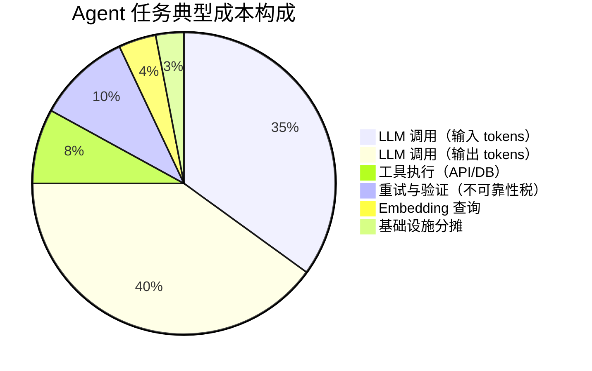
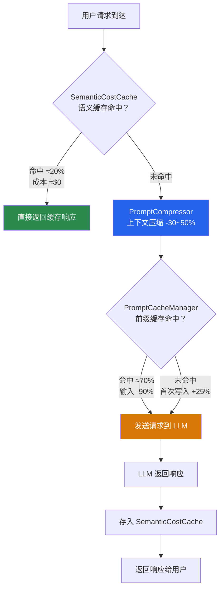

# 第 19 章 成本工程 — Agent 经济学

本章系统性地解决 Agent 系统的成本控制问题。一次复杂的 Agent 任务可能消耗数千次 API 调用，没有成本工程的 Agent 系统在规模化时将面临不可控的账单。本章覆盖 Token 成本建模、多模型路由策略、缓存优化、预算控制机制和成本归因分析。前置依赖：第 17 章可观测性（成本监控依赖指标体系）。

---

## 19.1 Agent 成本模型

### 19.1.1 2026 主流模型定价全景

要优化成本，首先需要精确了解每一分钱花在了哪里。以下是 2026 年主流大语言模型（LLM）的定价数据（美元/百万 token）：

| 模型 | 输入 | 输出 | 缓存输入 | 批处理输入 | 批处理输出 |
|------|------|------|---------|-----------|-----------|
| Claude Opus 4 | 15 | 75 | 1.5 | 7.5 | 37.5 |
| Claude Sonnet 4 | 3 | 15 | 0.3 | 1.5 | 7.5 |
| Claude Haiku 3.5 | 0.8 | 4 | 0.08 | 0.4 | 2 |
| GPT-4o | 2.5 | 10 | 1.25 | 1.25 | 5 |
| GPT-4o-mini | 0.15 | 0.6 | 0.075 | 0.075 | 0.3 |
| o3-mini | 1.1 | 4.4 | 0.55 | 0.55 | 2.2 |
| Gemini 2.0 Flash | 0.1 | 0.4 | 0.025 | 0.05 | 0.2 |
| Gemini 2.5 Pro | 1.25 | 10 | 0.315 | 0.625 | 5 |
| DeepSeek-V3 | 0.27 | 1.10 | — | — | — |
| DeepSeek-R1 | 0.55 | 2.19 | — | — | — |

这张价格表揭示了几个关键事实：

1. **旗舰与轻量模型之间存在 10–100 倍的价差。** Claude Opus 的输出价格（$75/MTok）是 GPT-4o-mini（$0.6/MTok）的 125 倍。这意味着把 10% 的请求从 Opus 路由到 Mini，就能节省相当可观的成本。

2. **缓存折扣是最慷慨的优惠。** Anthropic 的缓存读取价格仅为原价的 10%（即 90% 折扣），这使得长系统提示词的重复发送成本从"主要开销"变为"几乎可忽略"。

3. **批处理统一 50% 折扣。** 所有主流提供商的批处理 API 都提供约 50% 的折扣，且不影响输出质量——唯一代价是延迟。

4. **开源模型正在价格维度形成降维打击。** DeepSeek-V3 的输入价格（$0.27/MTok）仅为 GPT-4o（$2.5/MTok）的十分之一，且在多项基准上表现接近。

### 19.1.2 单次 LLM 调用成本计算

理解定价表之后，我们需要一个精确的成本计算模型。单次 LLM 调用的成本由输入 token、输出 token、缓存命中情况和调用模式共同决定：

```typescript
function calculateCallCost(params: {
  model: string; inputTokens: number; outputTokens: number;
  cachedInputTokens?: number; isBatchRequest?: boolean;
}): number {
  const pricing = MODEL_PRICING[params.model];
  const { inputTokens, outputTokens, cachedInputTokens = 0, isBatchRequest = false } = params;
  const nonCachedTokens = inputTokens - cachedInputTokens;

  if (isBatchRequest) {
    return (nonCachedTokens * pricing.batch_input + outputTokens * pricing.batch_output) / 1_000_000;
  }
  return (
    nonCachedTokens * pricing.input +
    cachedInputTokens * (pricing.cached_input ?? pricing.input) +
    outputTokens * pricing.output
  ) / 1_000_000;
}
```

一个直观的例子：某 Agent 使用 Claude Sonnet，系统提示词 3,000 tokens（全部缓存命中），用户输入 500 token，输出 800 token。

- 无缓存成本：`(3500 × 3 + 800 × 15) / 1M = $0.0225`
- 有缓存成本：`(3000 × 0.3 + 500 × 3 + 800 × 15) / 1M = $0.0138`
- 节省：38.7%

这看似微不足道，但乘以日均 100,000 次调用和 30 天，差异就是 **$26,100/月**。

### 19.1.3 Agent 任务全成本模型

单次 LLM 调用只是冰山一角。一个完整的 Agent 任务通常包含多次调用、工具执行、重试和验证。在实际的生产环境中，各成本组成的典型占比如下：



这个成本构成图传递了一个重要信息：**输出 token 是最大的成本来源。** 对于使用旗舰模型（如 Claude Opus，输出价 $75/MTok）的场景，输出成本可能占到总 LLM 成本的 70% 以上。这意味着：

- **控制输出长度** 比控制输入长度更重要。在 Prompt 中明确要求"简洁回答"或设置 `max_token` 上限，往往比压缩输入更有效。
- **模型路由的核心杠杆在输出端。** 将简单任务路由到轻量模型，主要节省的是高昂的输出价格差。
- **缓存只能优化输入侧成本。** Prompt Caching 对输入 token 效果显著，但对输出 token 无能为力——这是其能力边界。

---

## 19.2 不可靠性税：重试与验证的隐性成本

### 19.2.1 不可靠性税的本质

在 Agent 系统中，LLM 调用并非总能一次成功。模型可能产生格式错误的 JSON、不符合约束的输出、或完全偏离指令的回答。每一次重试都意味着额外的 token 消耗；每一次验证调用都增加成本负担。我们将这种由不可靠性引发的额外开销称为 **"不可靠性税"（Unreliability Tax）**。

不可靠性税的核心公式：

$$
E[\text{cost}] = C_{\text{base}} \times \sum_{i=0}^{m} r^i + \sum_{j=1}^{k} C_{\text{val}_j} \times P(\text{reach}_j)
$$

其中 $C_{\text{base}}$ 是单次调用基础成本，$r$ 是单次失败概率，$m$ 是最大重试次数，$C_{\text{val}_j}$ 是第 $j$ 级验证的成本。

直觉上，如果一个 LLM 调用有 20% 的概率失败并需要重试，最多重试 3 次，那么期望成本不是 1 倍基础成本，而是 $1 + 0.2 + 0.04 + 0.008 = 1.248$ 倍。再加上每次调用后的验证开销（可能是一个轻量级 LLM 调用来检查输出格式），实际成本可能达到基础成本的 1.5–2.0 倍。

以下是不同失败率下不可靠性税倍数的速查表：

| 单次失败率 | 最大重试 3 次 | 含验证（每次 +15% 成本） | 等效加价 |
|-----------|-------------|----------------------|---------|
| 5%        | 1.053×      | 1.211×               | +21%    |
| 10%       | 1.111×      | 1.278×               | +28%    |
| 20%       | 1.248×      | 1.435×               | +44%    |
| 30%       | 1.390×      | 1.599×               | +60%    |
| 50%       | 1.750×      | 2.013×               | +101%   |

**关键发现：当失败率达到 50% 时，不可靠性税让你的 LLM 成本翻倍。** 这就是为什么投资于更好的 Prompt Engineering、结构化输出约束（如 JSON Schema）和输出验证，不仅是质量问题，更是成本问题。

### 19.2.2 降低不可靠性税的策略

降税的手段按投资回报率排序：

1. **结构化输出约束**（投入低，回报高）：使用提供商的 JSON Mode 或 Tool Use，将格式错误率从 15%–30% 降至 1%–3%。这是最应优先实施的措施。

2. **分级验证流水线**（投入中，回报高）：不要用大模型验证大模型。先用正则/JSON Schema 做格式校验（成本≈0），再用规则引擎做业务逻辑校验（成本低），只有前两级都通过但仍有疑问时才调用 LLM 做语义验证。

3. **失败模式分析**（投入低，回报中）：记录每次重试的失败原因。如果 80% 的重试都是因为同一种格式错误，修复 Prompt 比优化重试策略更有效。

```typescript
/** 分级验证流水线——按成本从低到高执行 */
async function tieredValidation(output: string, schema: JSONSchema) {
  // Level 1: 格式校验（成本 ≈ 0）
  const formatCheck = validateJsonSchema(output, schema);
  if (!formatCheck.valid) return { valid: false, level: 1, reason: formatCheck.error };

  // Level 2: 规则引擎校验（成本极低）
  const ruleCheck = applyBusinessRules(JSON.parse(output));
  if (!ruleCheck.valid) return { valid: false, level: 2, reason: ruleCheck.error };

  // Level 3: 语义校验——仅在必要时调用轻量 LLM（成本高）
  if (requiresSemanticCheck(output)) {
    const check = await llmSemanticValidation(output);
    return { valid: check.passed, level: 3, reason: check.feedback };
  }
  return { valid: true, level: 2, reason: "passed" };
}
```

### 19.2.3 蒙特卡洛成本模拟

对于复杂的多步 Agent 工作流，解析公式难以覆盖所有情况（步骤依赖、条件分支、不同步骤的失败率差异）。蒙特卡洛模拟是更实用的工具。其独特价值在于能揭示 **尾部风险**：p95 和 p99 的成本往往是均值的 2–3 倍。正确的做法是用 p95 做预算规划，用 p99 设告警阈值。

```typescript
/** 蒙特卡洛模拟 Agent 任务的期望成本 */
function simulateAgentCost(
  steps: { baseCost: number; failRate: number; maxRetries: number }[],
  simulations = 10_000
): { mean: number; p50: number; p95: number; p99: number } {
  const results: number[] = [];
  for (let i = 0; i < simulations; i++) {
    let total = 0;
    for (const step of steps) {
      let attempts = 0, success = false;
      while (!success && attempts <= step.maxRetries) {
        total += step.baseCost;
        success = Math.random() > step.failRate;
        attempts++;
      }
    }
    results.push(total);
  }
  results.sort((a, b) => a - b);
  return {
    mean: results.reduce((s, v) => s + v, 0) / results.length,
    p50:  results[Math.floor(results.length * 0.5)],
    p95:  results[Math.floor(results.length * 0.95)],
    p99:  results[Math.floor(results.length * 0.99)],
  };
}
```

---

## 19.3 智能模型路由：任务-模型最优匹配

### 19.3.1 路由的核心思想

并非所有 Agent 任务都需要最强大（也最昂贵）的模型。一个"查询当前时间"的请求和一个"分析合同法律风险"的请求，对模型能力的要求天差地别，但如果不加区分地使用同一个旗舰模型，就是在为简单任务支付不必要的溢价。

**智能模型路由** 的目标是：根据任务的复杂度、质量要求和成本约束，自动选择最具性价比的模型。其核心假设是——对于大多数生产流量，60%–80% 的请求属于"简单"或"中等"复杂度，完全可以用轻量模型高质量完成。

路由决策需要在三个维度上权衡：

| 维度 | 说明 | 典型权衡 |
|------|------|---------|
| **质量** | 模型输出满足业务需求的概率 | 旗舰模型 >95%，轻量模型 85%–92% |
| **成本** | 单次调用的 token 费用 | 旗舰模型 $0.02–$0.10，轻量模型 $0.001–$0.005 |
| **延迟** | 首 token 时间 + 生成速度 | 旗舰模型 1–3s，轻量模型 200–500ms |

最优路由策略通常不是静态的，而是需要根据实时反馈持续调整。

### 19.3.2 任务复杂度分类器

路由的第一步是快速评估任务复杂度。我们定义四个等级——`simple`（简单提取/格式化）、`moderate`（单步推理/摘要）、`complex`（多步推理/创作）、`expert`（高风险决策/复杂代码生成）——并基于请求特征进行分类：

```typescript
function classifyComplexity(features: {
  inputTokens: number; requiresReasoning: boolean;
  toolCallsExpected: number; domainSpecificity: "general" | "specialized" | "expert";
  hasCodeGeneration: boolean; qualityThreshold: number;
}): { level: string; suggestedModels: string[] } {
  const { inputTokens, requiresReasoning, toolCallsExpected,
          domainSpecificity, hasCodeGeneration, qualityThreshold } = features;

  if (inputTokens < 500 && !requiresReasoning && toolCallsExpected === 0)
    return { level: "simple", suggestedModels: ["gpt-4o-mini", "claude-haiku-3.5"] };
  if (domainSpecificity === "expert" || (hasCodeGeneration && qualityThreshold > 0.9))
    return { level: "expert", suggestedModels: ["claude-opus-4", "gpt-4o"] };
  if (requiresReasoning || toolCallsExpected >= 3)
    return { level: "complex", suggestedModels: ["claude-sonnet-4", "gpt-4o"] };
  return { level: "moderate", suggestedModels: ["claude-sonnet-4", "gpt-4o-mini"] };
}
```

> **设计决策**：为什么用规则而不是 ML 模型做复杂度分类？规则系统的优势在于可解释性和零额外成本——用 LLM 来决定该用哪个 LLM，本身就是一笔额外开销。实践中，基于规则的分类器通常能达到 85%–90% 的准确率。当边界情况增多时，再引入微调的小模型（成本 $0.0001/次）也不迟。

### 19.3.3 模型路由器

路由器接收分类结果，结合成本约束和历史质量数据做出最终模型选择。核心逻辑是按"性价比"（质量/成本）排序候选模型，过滤低于质量底线的候选：

```typescript
class ModelRouter {
  route(complexity: string, costBudget: number, qualityFloor: number): {
    selectedModel: string; estimatedCost: number; fallbackModel: string;
  } {
    const candidates = this.getCandidates(complexity);
    const viable = candidates
      .filter(c => c.quality >= qualityFloor && c.cost <= costBudget)
      .sort((a, b) => (b.quality / b.cost) - (a.quality / a.cost));

    if (viable.length === 0) return this.fallbackRoute(complexity, qualityFloor);
    return {
      selectedModel: viable[0].model,
      estimatedCost: viable[0].cost,
      fallbackModel: viable[1]?.model ?? viable[0].model,
    };
  }
  // getCandidates / fallbackRoute 完整实现见附录 A
}
```

### 19.3.4 自适应路由与 Thompson Sampling

静态路由表的问题在于：模型的实际质量会随 Prompt 迭代和数据分布漂移而变化。Thompson Sampling 是一种经典的多臂老虎机算法，特别适合"探索-利用"权衡——对数据充足的模型，采样集中在真实质量附近（利用）；对数据不足的模型，采样方差大，有更高概率被选中（探索）。经过约 1,000 次请求的学习期后，路由分布通常会稳定下来。

```typescript
class ThompsonSamplingRouter {
  private stats = new Map<string, { successes: number; failures: number }>();

  selectModel(candidates: string[]): string {
    let bestModel = candidates[0], bestSample = -1;
    for (const model of candidates) {
      const { successes = 0, failures = 0 } = this.stats.get(model) ?? {};
      const sample = betaSample(successes + 1, failures + 1);
      if (sample > bestSample) { bestSample = sample; bestModel = model; }
    }
    return bestModel;
  }

  recordOutcome(model: string, success: boolean): void {
    const s = this.stats.get(model) ?? { successes: 0, failures: 0 };
    success ? s.successes++ : s.failures++;
    this.stats.set(model, s);
  }
}
```

### 19.3.5 路由策略 A/B 测试

路由策略的变更是高风险操作——错误的路由可能导致质量大幅下降或成本飙升。建议通过灰度验证：对照组（50%）使用当前策略，实验组（50%）使用新策略，评估成本节省率、质量分数均值、P95 延迟和用户满意度。**决策规则**：实验组成本降低 ≥10% 且质量损失 ≤2% 时全量切换。

> **反模式警告**：不要在没有 A/B 测试的情况下全量切换路由策略。某团队将所有流量从 Sonnet 切到 Haiku 以"节省成本"，用户投诉率上升了 15%，回滚后又多花了一周修复数据。

---

## 19.4 Prompt 优化与缓存

即便选择了最具性价比的模型，Prompt 本身仍然是成本的最大来源。一个典型的企业级 Agent 系统中，系统提示词往往长达 2,000–8,000 token，而这些提示词在每次请求中都会重复发送。如果 Agent 每天处理 100,000 次请求，仅系统提示词的重复传输就意味着数十亿 token 的浪费。

本节围绕三个核心组件展开：**PromptCacheManager**（提供商原生缓存，90% 输入折扣）、**SemanticCostCache**（语义相似度缓存完整响应，消除重复调用）、**PromptCompressor**（发送前智能压缩上下文，减少 token 消耗）。三者协同可将 Prompt 相关成本降低 40%–70%。

### 19.4.1 PromptCacheManager：原生缓存机制集成

Anthropic 的 Prompt Caching 对缓存命中的 token 只收原价 10%（90% 折扣）。OpenAI 的 Automatic Prompt Caching 提供 50% 折扣。关键在于"前缀匹配"——缓存只对从消息序列开头开始的连续相同内容生效，因此需要精心设计消息结构：**稳定前缀 + 动态后缀**。

```
消息结构（从上到下为发送顺序）：

┌────────────────────────────────┐
│  系统提示词 — 角色定义         │  ◄── 几乎不变，最适合缓存
│  系统提示词 — 知识库/规则      │
│  cache_control: ephemeral  ◄──│  ◄── 在稳定内容末尾标记
├────────────────────────────────┤
│  对话历史（最近 N 轮）         │  ◄── 每次请求不同，无法缓存
│  用户当前输入                  │
└────────────────────────────────┘
```

以下是 Anthropic 缓存集成的核心调用方式：

```typescript
// 将系统提示词标记为可缓存——只需添加 cache_control 字段
const systemBlocks = [{
  type: "text",
  text: longSystemPrompt,  // 包含角色定义 + 知识库 + 规则，共 6000 tokens
  cache_control: { type: "ephemeral" },  // 标记缓存点
}];

// API 响应中的 usage 字段会显示缓存命中情况：
// { cache_read_input_tokens: 6000, input_tokens: 200, output_tokens: 300 }
```

**各提供商缓存能力对比：**

| 特性 | Anthropic | OpenAI | Google |
|------|----------|--------|--------|
| 缓存机制 | 显式标记 | 自动前缀匹配 | 显式上下文缓存 |
| 读取折扣 | 90%（仅收 10%） | 50% | 75% |
| 写入溢价 | +25%（首次写入） | 无 | 无（有存储费） |
| 最小缓存量 | 1,024 token | 1,024 token | 32,768 token |
| TTL | 5 分钟（自动续期） | 自动管理 | 需手动管理 |

> **设计决策**：Anthropic 缓存首次写入有 25% 溢价，只有缓存被读取 3–4 次后才能回本。对于日均请求 <50 次的低频 Agent，Anthropic 缓存可能反而增加成本，此时 OpenAI 的自动缓存（无写入溢价）可能更合适。

### 19.4.2 SemanticCostCache：语义相似度响应缓存

PromptCacheManager 优化的是"相同前缀的重复发送"，但如果两个用户问了语义相近但措辞不同的问题（如"退货流程是什么"和"怎么退货"），前缀缓存帮不上忙。SemanticCostCache 通过 embedding 向量比较语义相似度，如果新查询与缓存中某个查询的相似度超过阈值（如 0.95），直接返回缓存响应，完全跳过 LLM 调用。

```typescript
class SemanticCostCache {
  private cache: Map<string, { embedding: number[]; response: string; cost: number; ttl: number }>;

  async lookup(query: string): Promise<{ hit: boolean; response?: string; savedCost?: number }> {
    const queryEmbedding = await this.embed(query);  // 成本 ≈ $0.00002
    for (const [, entry] of this.cache) {
      if (Date.now() > entry.ttl) continue;
      if (cosineSimilarity(queryEmbedding, entry.embedding) >= this.threshold) {
        return { hit: true, response: entry.response, savedCost: entry.cost };
      }
    }
    return { hit: false };
  }

  store(query: string, embedding: number[], response: string, cost: number): void {
    const costMultiplier = Math.min(cost / 0.01, 10); // 高成本响应缓存更久
    this.cache.set(query, { embedding, response, cost, ttl: Date.now() + 3600_000 * costMultiplier });
  }
}
```

**阈值选择是关键设计决策。** 阈值过低导致语义偏差较大的查询命中，返回不精确的响应；过高则命中率不足。经验数据：

| 场景 | 推荐阈值 | 典型命中率 | 质量影响 |
|------|---------|-----------|---------|
| FAQ / 客服 | 0.93–0.95 | 25%–40% | <1% |
| 知识库查询 | 0.95–0.97 | 15%–25% | <2% |
| 代码生成 | 0.97–0.99 | 5%–10% | <1% |
| 创意写作 | 不建议使用 | — | 高（用户期望多样性） |

### 19.4.3 PromptCompressor：上下文窗口优化

当 Agent 需要将大量检索文档塞入上下文窗口时，token 数量可能急剧膨胀。PromptCompressor 通过三种策略减少输入 token 数：（1）**冗余检测与去除**——识别检索结果中的重叠段落，合并重复内容；（2）**重要性排序截断**——按与查询的相关性排序，截断低相关性内容；（3）**摘要压缩**——对过长段落用轻量模型生成摘要替代原文。

实践中三种策略的组合通常能实现 30%–50% 的 token 压缩率，且对回答质量的影响在 1%–3% 以内。

### 19.4.4 三层缓存协同

三个组件并非互斥，而是构成了一条从粗到细的优化流水线：



一个典型的企业知识库场景中，语义缓存消除 20% 请求，Prompt 压缩减少 35% 输入 token，前缀缓存对剩余请求提供 90% 输入折扣，**综合节省率约 55%–65%**。

---

## 19.5 批处理与异步优化

### 19.5.1 批处理：最安全的成本优化

成本优化的另一个重要维度是请求的调度方式。大多数 LLM 提供商的批处理 API 价格为实时 API 的 50%——**不牺牲任何质量，只增加延迟。** 这使得批处理成为所有成本优化手段中风险最低的一种。

关键挑战在于：并非所有请求都能等待。用户实时对话必须立即响应，但后台文档分析、批量数据处理、报告生成等任务完全可以延迟。BatchRequestManager 的核心职责是将请求分流到正确的执行通道——实时请求走全价 API，可延迟请求聚合后走 Batch API。

### 19.5.2 优先级调度引擎

实际 Agent 系统中，请求优先级并非非黑即白。我们引入三级优先级：

- **realtime**：用户正在等待的交互式请求，走实时 API
- **nearline**：分钟级延迟可接受（如后台摘要生成），尝试搭上当前批次
- **background**：小时级延迟可接受（如日报生成、数据标注），始终走批处理

关键指标是 **批处理覆盖率**——走批处理通道的请求占总请求的比例。每提高 10 个百分点的覆盖率，就能额外节省约 5% 的总成本。建议团队定期审查请求优先级分布，将尽可能多的请求标记为 `nearline` 或 `background`。

### 19.5.3 批处理成本节省实例

以下是案例一（企业知识库 Agent）中批处理优化的实际计算：

| 项目 | 数据 |
|------|------|
| 原始状态 | 日均 15,000 请求全部走实时 API，月度成本 $18,375（已经过路由和缓存优化） |
| realtime（用户在线提问）| 60% → 9,000 请求/天 |
| nearline + background | 40% → 6,000 请求/天，走 Batch API（50% 折扣） |
| 批处理后总成本 | 实时 $11,025 + 批处理 $3,675 = **$14,700/月** |
| 节省 | $3,675/月（20% 额外节省） |

> **关键洞察**：批处理优化的 ROI 极高，因为它是纯粹的价格折扣，不涉及任何质量损失。唯一的代价是延迟。

---

## 19.6 成本监控与告警

### 19.6.1 为什么需要专门的成本监控

正如第 17 章强调的："无法度量的东西无法优化"。缺乏实时成本监控时，前述所有优化机制都无法持续发挥作用。

一个真实的教训：某团队在一次"无害"的系统提示词更新中，将一段冗余说明从 200 token 扩展到 2,000 tokens（为了"让 Agent 更好地理解上下文"）。由于没有成本监控，这个变更在两周后的月度账单中才被发现——多花了 $12,000。如果有实时的 token 消耗看板和异常告警，这笔损失可以在几小时内被阻止。

### 19.6.2 CostMonitoringSystem：多维度成本追踪

企业级 Agent 平台的成本追踪需要支持多个维度的切片与下钻：按 Agent、按团队、按模型、按时间段。核心需要记录每次 LLM 调用的 Agent/team/user/model 信息、输入输出 token 数、缓存命中数和实际成本，并支持多维聚合查询。

建议暴露以下 Prometheus 指标（与第 17 章可观测性框架集成）：

- `Agent_cost_total{Agent, model, team}` — 累计成本
- `Agent_token_total{Agent, model, direction}` — 累计 token 消耗
- `Agent_cache_hit_ratio{Agent, cache_type}` — 缓存命中率
- `Agent_budget_utilization{Agent, period}` — 预算使用率

同时设置预算阈值告警：当任何 Agent 的预算使用率超过 70% 时发出预警，超过 90% 时发出严重告警。

### 19.6.3 CostAnomalyDetector：统计异常检测

CostAnomalyDetector 使用移动平均 + 标准差的统计方法检测成本异常。这种方法在实践中非常有效，因为 Agent 系统的成本分布通常是相对稳定的——一旦出现偏离（Prompt 膨胀、模型误路由、恶意调用），统计指标会立即反映出来。

核心算法：维护一个滑动窗口（如 24 小时 × 6 = 144 个 10 分钟桶），计算均值和标准差，用 Z-Score 判定异常严重程度。

三级告警的响应机制：

| 级别 | 触发条件 | 通知渠道 | 响应 SLA |
|------|---------|---------|---------|
| 信息（3σ） | 成本偏离均值 3 个标准差 | Slack 通知 | 工作日内关注 |
| 警告（4σ） | 成本偏离均值 4 个标准差 | Slack + 邮件 | 4 小时内响应 |
| 严重（5σ） | 成本偏离均值 5 个标准差 | PagerDuty + 自动限流 | 15 分钟内响应 |

> 此告警体系与第 17 章 §17.3.3 的 `AlertRuleEngine` 集成，复用告警路由、分组、去重和静默能力。

---

## 19.7 预算治理

### 19.7.1 多级预算分配

当 Agent 系统服务于多个团队时，预算管理不再是单纯的技术问题，而是一个组织治理问题。核心问题包括：谁有权设置和修改预算？超支时应该阻断服务还是降级服务？成本应该按请求发起者还是服务提供者归因？

BudgetGovernanceSystem 实现了组织 → 团队 → Agent → 用户的层次化预算体系，并为超支场景提供五种策略：

| 策略 | 适用场景 | 用户体验 | 成本控制力 |
|------|---------|---------|-----------|
| `hard_block` | 合规严格的金融/医疗 | 服务中断 | 最强 |
| `soft_warn` | 内部工具、研发环境 | 不中断，通知管理层 | 弱 |
| `approval_required` | 大企业、多审批流程 | 等待审批 | 强 |
| `auto_downgrade` | 面向消费者的产品 | 质量微降但不中断 | 中 |
| `burst_allow` | 初创公司、弹性预算 | 不中断 | 弱（事后对账） |

> **设计决策**：选择哪种策略应由业务方而非技术方决定。建议实施前与业务方和财务方对齐：超支时阻断服务的业务损失 vs. 超支的财务损失，哪个更大？答案因场景而异。

`auto_downgrade` 策略值得特别讨论。它在预算即将耗尽时自动将请求路由到更便宜的模型（如从 Sonnet 降级到 Haiku），保证服务不中断但质量会下降。关键配置参数是 **质量底线**（quality floor）——降级后的模型质量不得低于此阈值，否则宁可阻断也不返回低质量结果。这个阈值需要根据业务场景设定，不存在通用的"正确值"。

### 19.7.2 成本归因引擎

在多 Agent 协作的场景中，一个用户请求可能经过多个 Agent 的处理链。CostAllocationEngine 支持三种归因模型：

- **请求者归因**：成本归属于发起请求的用户/团队。简单直接，但可能导致调用方不愿使用复杂的跨团队 Agent 能力。
- **提供者归因**：成本归属于提供服务的 Agent 所属团队。激励提供方优化成本，但可能导致团队不愿开放自己的 Agent 给外部调用。
- **比例分摊**：按各 Agent 在处理链中的 token 消耗比例分摊。最公平，但实现复杂度最高。

成本归因的准确性直接决定了治理的有效性。在多 Agent 协作链日益普遍的今天——这也是第 20 章将深入讨论的主题——建议团队在 Agent 互操作协议中明确归因规则，将其作为契约的一部分。

---

## 19.8 成本优化案例分析

理论和代码固然重要，但真正能说服决策者投入成本优化的，永远是看得见的数字。本节通过三个真实世界的案例分析，展示本章各项技术如何协同工作。

### 19.8.1 案例一：企业知识库 Agent —— 从 $50K 到 $8K 的四层优化

**场景描述**

一家中型科技公司部署了企业知识库 Agent，用于回答员工关于公司政策、技术文档、流程规范等问题。Agent 最初使用 Claude Opus 作为唯一模型，因为业务方对回答质量有极高要求。

**优化前状态**

| 参数 | 值 |
|------|-----|
| 模型 | Claude Opus ($15/MTok 输入, $75/MTok 输出) |
| 日均请求量 | 15,000 次 |
| 平均输入 token | 4,500（系统提示词 3,000 + 检索文档 1,000 + 用户问题 500） |
| 平均输出 token | 800 |
| **月度成本** | **输入 $30,375 + 输出 $27,000 = $57,375 ≈ $50K+/月** |

这个数字让 CFO 在月度评审中亮起了红灯。工程团队接到了"在不显著影响回答质量的前提下将成本降低 80%"的目标。

**数据先行**

工程团队没有急于动手，而是先花一周部署成本监控（19.6 节），分析了请求复杂度分布和查询重复率。数据揭示了三个关键事实：

1. **62% 的请求是简单查询**（"公司 Wi-Fi 密码是什么""年假有多少天"），完全不需要 Opus
2. **18% 的查询在语义上高度重复**——不同员工用不同措辞问同一个问题
3. **35% 的输入 token 是重复的系统提示词和检索框架文本**

**四层优化方案及成果**

| 优化层 | 手段 | 月度节省 | 累计成本 | 质量影响 |
|-------|------|---------|---------|---------|
| 基线 | — | — | $57,375 | — |
| Layer 1 | 模型路由：62% simple + 28% moderate → Sonnet，10% complex → Opus | ~$41K | ~$16,200 | -2.7% |
| Layer 2 | 语义缓存（阈值 0.94）：18% 命中率 | ~$2,900 | ~$13,300 | <1% |
| Layer 3 | Prompt 压缩：输入 token -35% | ~$1,500 | ~$11,800 | <1% |
| Layer 4 | 批处理：20% 后台请求走 Batch API | ~$1,300 | **~$10,500** | 0% |

最终月度成本约 $8,000–$10,500（含基础设施开销），**总节省 83%–86%**，实施周期 3 周。

> **关键教训**：最大的节省来自模型路由（72%），因为大多数请求根本不需要旗舰模型。但如果不先做数据分析（"62% 是简单查询"），团队不可能有信心做出这个决策。**成本优化的第一步永远是度量，而不是动手。**

### 19.8.2 案例二：多模态内容审核 Agent —— 路由节省 70%，质量损失仅 4%

**场景描述**

一个 UGC 平台需要对用户上传的文本内容进行合规审核。初始方案使用 GPT-4o 对所有内容进行审核。

**优化前状态**

| 参数 | 值 |
|------|-----|
| 模型 | GPT-4o ($2.5/MTok 输入, $10/MTok 输出) |
| 日均审核量 | 500,000 条 |
| 平均输入 token | 600（审核指令 200 + 内容 400） |
| 平均输出 token | 150（审核结果 + 理由） |
| **月度成本** | **$45,000/月** |

**核心洞察与分层路由方案**

内容审核场景有天然的分层结构——大多数内容是明显合规的，只有少数需要深入分析。这与安全领域的"漏斗模型"一脉相承：用低成本手段过滤大量明显 case，只将可疑内容升级到高成本手段。

- **Layer 1 初筛（GPT-4o-mini）**：处理全部 500K 条/天，判定"明确合规"/"明确违规"/"需要深审"三类，约 85% 内容在此层结束。月成本 $2,700。
- **Layer 2 深审（GPT-4o）**：仅处理 15% "需要深审"的内容（75K 条/天），提供详细违规分析。月成本 $10,688。
- **优化后总计**：$13,388/月，**节省 $31,612（70.2%）**。

**质量验证（10,000 条人工标注数据）**

| 指标 | 纯 GPT-4o | 分层路由 | 差异 |
|------|----------|---------|------|
| 整体准确率 | 96.2% | 92.1% | -4.1% |
| 误放率（漏判违规） | 1.8% | 3.2% | +1.4% |
| 误判率（错判合规内容） | 2.0% | 4.7% | +2.7% |

4.1% 的准确率下降是否可接受？该平台信安团队评估后认为：增加的误放内容可通过用户举报机制补充覆盖，而 $31K/月的节省（年化 $370K+）足以雇佣额外的人工审核员处理边缘案例。

> **关键教训**：成本优化决策不纯粹是工程决策，它涉及业务权衡。工程团队的职责是提供准确的数据（"4.1% 质量下降换取 70% 成本节省"），最终取舍应由业务方决定。

### 19.8.3 案例三：客服 Agent 的 Prompt Caching —— 67% 成本节省，零质量损失

**场景描述**

一个电商平台的客服 Agent 使用 Claude Sonnet，系统提示词包含商品知识库（2,000+ token）、退换货政策（1,500+ token）、优惠活动（1,000+ token）和回答准则（1,500+ token），共计约 6,000 token。每次对话的用户输入平均仅 200 token。

**优化前状态**

| 参数 | 值 |
|------|-----|
| 模型 | Claude Sonnet ($3/MTok 输入, $15/MTok 输出) |
| 日均对话量 | 80,000 次（含多轮） |
| 平均输入 token | 6,200（系统提示词 6,000 + 用户消息 200） |
| 平均输出 token | 300 |
| **月度成本** | **输入 $44,640 + 输出 $10,800 = $55,440/月** |

输入成本占总成本的 80.5%，系统提示词又占输入的 96.8%。几乎所有输入成本都花在了每次请求重复发送同一段系统提示词上——这是 Prompt Caching 的理想场景。

**Prompt Caching 优化**

核心改动极其简单：在系统提示词的最后一个 content block 上添加 `cache_control: { type: "ephemeral" }` 标记。API 会自动缓存这些稳定的前缀内容，后续请求对缓存命中的 token 只收 10% 费用。

```
优化前每次请求输入成本: 6200 × $3 / 1M = $0.0186
优化后每次请求输入成本: (6000 × $0.3 + 200 × $3) / 1M = $0.0024
月度输入成本节省: ($0.0186 - $0.0024) × 80,000 × 30 = $38,880
```

**最终成果**

| 指标 | 值 |
|------|-----|
| 优化前 | $55,440/月 |
| 优化后 | ~$18,000/月（含缓存写入溢价） |
| **节省率** | **67.5%** |
| 质量影响 | **0%**（数学上完全等价，缓存不改变模型行为） |
| 实施周期 | **2 天** |

这是三个案例中 ROI 最高的优化——2 天实施，零质量损失，年化节省 $450K。

> **关键教训**：零质量损失的优化应最先实施。Prompt Caching 只需添加 `cache_control` 标记，实施成本几乎为零，但收益巨大。对任何使用长系统提示词的 Agent，这应是第一个部署的优化。

### 19.8.4 案例对比与关键洞察

| 维度 | 案例一：企业知识库 | 案例二：内容审核 | 案例三：客服 Agent |
|------|-----------------|-----------------|------------------|
| 优化前 | $57,375/月 | $45,000/月 | $55,440/月 |
| 优化后 | ~$8,000/月 | ~$13,388/月 | ~$18,000/月 |
| **节省率** | **86%** | **70%** | **67.5%** |
| 主要手段 | 模型路由 (72%) | 分层路由 (100%) | Prompt Caching (100%) |
| 质量影响 | -2.7% | -4.1% | 0% |
| 实施周期 | 3 周 | 2 周 | 2 天 |

**四条核心洞察：**

1. **没有"银弹"——每种手段的效果取决于场景。** 高重复系统提示词 → Caching 最有效。请求复杂度差异大 → 路由最有效。大量非实时请求 → 批处理最有效。选择优化策略前，先做数据分析。

2. **组合优化的收益是相乘递减，而非线性叠加。** 先做路由省 72%，再做缓存只是在剩余 28% 上省——优化顺序影响总收益，建议先做收益最大的。

3. **零质量损失的优化应排在最前面。** Prompt Caching（0% 损失，67% 节省）和批处理（0% 损失，50% 折扣）应在任何有质量风险的优化之前实施。

4. **质量监控必须与成本优化同步部署。** 没有 A/B 测试验证的成本优化是在黑盒中操作——你不知道省下的钱换来了多少质量损失，直到用户投诉。

---

## 19.9 推测解码（Speculative Decoding）

前面的优化手段都是在"减少 token 数量"或"降低单价"层面做文章。推测解码（Speculative Decoding）是一种不同的路径：它直接加速推理过程本身，在**数学上无损**地将推理速度提升 2–3 倍。

### 19.9.1 原理：小模型草稿，大模型验证

推测解码的核心思想极其优雅：用一个小而快的"草稿模型"先快速生成一批候选 token，然后让大的"目标模型"在一次前向传播中并行验证这些候选 token。由于 Transformer 注意力机制天然支持并行计算，验证 K 个 token 的成本与生成 1 个 token 几乎相同。

关键的数学保证在于**拒绝采样**：对于每个候选 token，如果目标模型的概率 ≥ 草稿模型的概率则直接接受，否则以概率比接受。这个过程保证最终输出的概率分布与单独使用目标模型完全一致——**数学上无损**。

### 19.9.2 性能收益与适用条件

| 指标 | 典型值 | 说明 |
|------|--------|------|
| 加速比 | 2–3× | vLLM 报告最高可达 2.8× |
| 草稿模型接受率 | 70%–85% | 取决于草稿与目标模型的对齐程度 |
| 候选长度 K | 3–8 token | 通常 K=5 是较好的平衡点 |
| 延迟降低 | 50%–70% | 对交互式场景改善明显 |

最有效的三个条件：（1）草稿模型接受率 >70%；（2）目标模型远大于草稿模型；（3）延迟敏感的交互场景。

### 19.9.3 主要变体

| 变体 | 原理 | 优势 | 典型实现 |
|------|------|------|----------|
| Standard Speculative | 独立小模型作为草稿 | 通用灵活 | vLLM, TGI |
| Self-Speculative | 大模型浅层作为草稿 | 无需额外模型 | Draft & Verify |
| Medusa | 多解码头并行预测 | 更高并行度 | Medusa v2 |
| EAGLE | 特征级推测验证 | 接受率 85%+ | EAGLE-2 |
| Lookahead | Jacobi 迭代并行生成 | 无需草稿模型 | Lookahead Decoding |

### 19.9.4 对 Agent 的特殊意义

推测解码对 Agent 场景有特殊价值：Agent 大量输出结构化 JSON（函数名、参数），这类输出高度可预测，草稿模型接受率通常 >85%。此外，Agent 的多步推理中每一步延迟都会累积，推测解码将每步延迟降低 50%+ 意味着整体任务完成时间大幅缩短。

---

## 19.10 成本优化反模式

在观察了大量团队的成本优化实践后，以下几种常见的反模式值得警惕：

### 反模式一："先优化再度量"

**症状**：团队在没有成本监控数据的情况下凭直觉决定优化方向。最常见的表现是"我觉得模型太贵了，换个便宜的"。

**问题**：你不知道钱花在哪里。也许 80% 的成本来自 3 个特定 Agent 的系统提示词重复发送——这时 Prompt Caching 的 ROI 远高于模型降级。

**正确做法**：先部署 19.6 节的成本监控，收集至少一周数据，再制定优化方案。

### 反模式二：全量切换模型而不做 A/B 测试

**症状**：为节省成本，将所有流量从旗舰模型一次性切换到轻量模型。

**问题**：质量下降的影响往往不是线性的。可能 95% 的请求表现良好，但 5% 的边界案例质量暴跌，导致用户投诉集中爆发。

**正确做法**：灰度切换（5% → 20% → 50% → 100%），每一步都验证质量指标。

### 反模式三：忽略不可靠性税

**症状**：成本预算只考虑理想情况下的 token 消耗，完全忽略重试和验证的额外开销。

**问题**：当失败率达到 20% 时，实际成本比预算高 44%（见 19.2.1 节速查表）。

**正确做法**：用蒙特卡洛模拟的 P95 值做预算，而非均值。

### 反模式四：过度优化导致系统脆弱

**症状**：叠加了 5 种以上的优化策略，每一层都有自己的配置参数和失败模式。

**问题**：优化链越长，故障点越多。缓存失效 → 路由异常 → 批处理超时 → 降级触发 → 告警风暴。维护优化系统的时间可能超过了节省的成本。

**正确做法**：遵循"二八原则"——先实施能带来 80% 收益的 2 种优化（通常是 Caching + 路由），在它们稳定运行后再考虑更多。

### 反模式五：把成本优化当成一次性项目

**症状**：团队花了一个月做了一轮优化，然后再也不碰。

**问题**：模型定价在变、流量模式在变、Prompt 在迭代、新模型在发布。六个月前的最优策略今天可能已经过时。

**正确做法**：建立持续迭代的运营机制——周度审查告警，月度对账调整，季度评估新模型。

---

## 19.11 本章小结

本章从"成本是 Agent 系统的隐形技术债务"这一核心命题出发，构建了一套完整的成本工程体系。

### 十大核心要点

**要点一：成本优化是系统工程，而非单点技巧。** 模型路由（19.3）、Prompt 缓存（19.4）、批处理（19.5）、成本监控（19.6）、预算治理（19.7）构成一个有机整体：监控提供数据基础，路由据此决策，缓存和批处理执行优化，预算治理确保组织层面可控。

**要点二：零质量损失的优化应最先实施。** 优先级排序：

| 优先级 | 手段 | 质量影响 | 典型节省 |
|-------|------|---------|---------|
| 第一（零损失） | Prompt Caching | 0% | 60%–80% 输入成本 |
| 第一（零损失） | 批处理调度 | 0% | 50% |
| 第一（零损失） | Prompt 去冗余 | 0% | 10%–30% |
| 第二（极低损失） | 上下文压缩 | <1% | 30%–50% |
| 第二（极低损失） | 语义缓存 | <2% | 15%–40% |
| 第三（需监控） | 模型路由 | 2%–5% | 40%–70% |
| 第三（需监控） | 模型降级 | 5%–10% | 50%–80% |

**要点三：Prompt Caching 的投资回报率最高。** 实施成本最低（添加 `cache_control` 标记），收益最高（案例三展示了 2 天实施、67% 节省、零质量损失）。

**要点四：语义缓存是高重复场景的杀手级武器。** 客服、FAQ、知识库等场景中，15%–40% 的查询在语义上高度重复，SemanticCostCache 将这些请求的边际成本降至接近零。

**要点五：批处理是最被低估的优化手段。** 只要请求不需要实时响应，就能以 50% 价格获得完全相同的结果。

**要点六：成本异常检测是预算安全的最后防线。** 移动平均 + 标准差统计方法配合三级告警，可在几分钟内发现成本异常。

**要点七：预算治理是组织问题，不只是技术问题。** 五种超支策略反映不同组织文化，技术架构选择应服务于组织治理目标。

**要点八：成本归因的准确性决定治理的有效性。** 在多 Agent 协作链中，应在互操作协议中明确归因规则。

**要点九：成本优化是持续迭代过程。** 周度审查告警，月度对账调整，季度评估新模型，年度审查架构。

**要点十：成本工程与可观测性工程、部署运维是三位一体。** 本章的成本监控与第 17 章共享 Prometheus/Grafana 基础设施；预算执行与第 18 章的速率限制器协同；批处理调度与第 18 章的异步任务队列天然契合。

### 展望第 20 章：Agent 互操作协议

当 Agent 系统扩大到多个团队、多个组织协作时，成本管理的复杂度进一步升级。第 20 章将讨论 Agent 互操作协议（MCP、A2A 等标准）引入的跨组织成本结算需求：Agent A 调用 Agent B 时成本如何分摊？如何建立标准化的成本计量协议？如何在互操作协议中嵌入成本约束？本章建立的 CostAllocationEngine 和 BudgetGovernanceSystem 将成为第 20 章跨 Agent 成本结算的技术基础。
