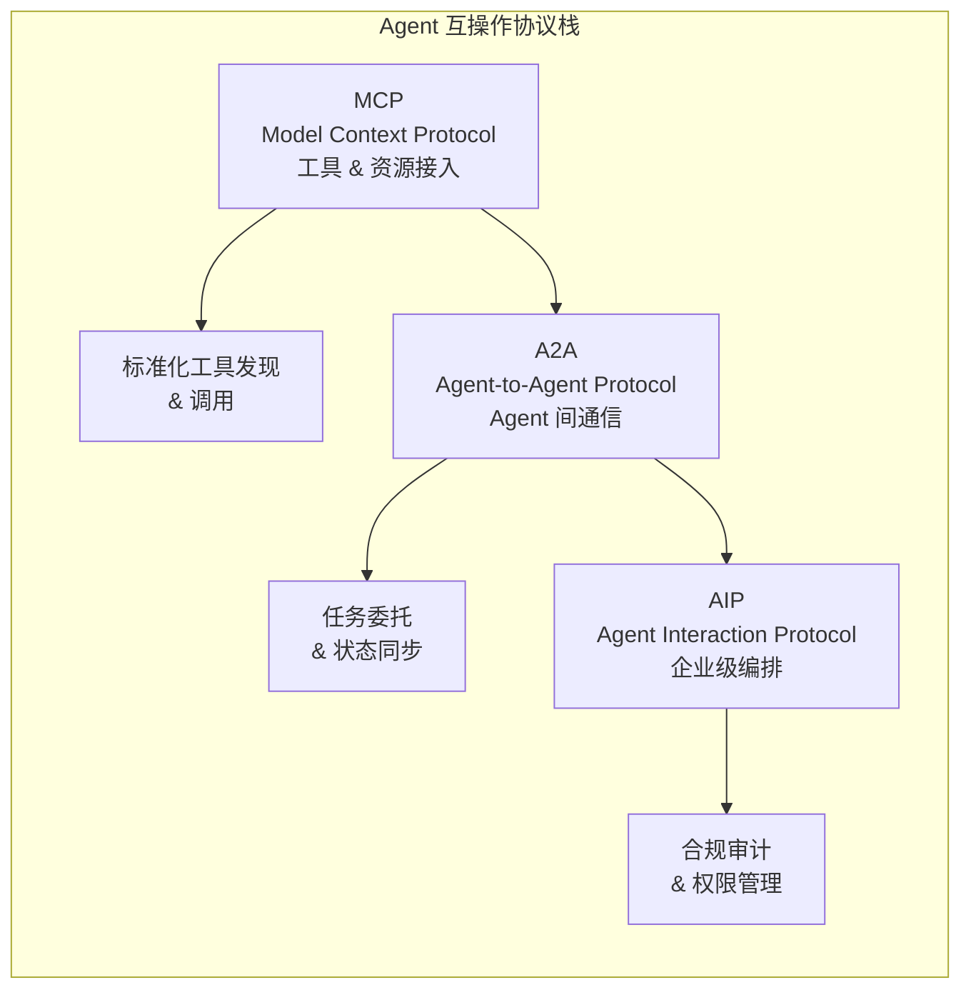

# 第 20 章：Agent 互操作协议
当你的 Agent 需要调用另一个团队的 Agent 时，你才会真正理解互操作协议的价值。没有标准协议，每一次跨团队 Agent 集成都是一个定制项目——私有 API、定制数据格式、手动对接。这不可扩展。

2024-2025 年，多个 Agent 互操作协议并行发展，形成了一个令人困惑但充满活力的生态：**MCP**（Model Context Protocol）聚焦工具和数据源接入，**A2A**（Agent2Agent）解决 Agent 间通信，**ANP**（Agent Network Protocol）面向开放互联网上的 Agent 发现和协作，**ACP**（Agent Communication Protocol）则试图统一企业内部的 Agent 通信。

本章首先对比分析这四种协议的设计理念和适用场景，然后深入讨论协议集成的工程实践。值得注意的是，这些协议不是互相替代的关系——一个成熟的 Agent 系统很可能需要同时支持多种协议。

```mermaid
graph TB
    subgraph 协议层次
        MCP[MCP<br>工具与数据源接入] --> Agent[Agent 核心]
        A2A[A2A<br>Agent 间通信] --> Agent
        ANP[ANP<br>开放网络发现] --> Agent
        ACP[ACP<br>企业内部通信] --> Agent
    // ... 完整实现见 code-examples/ 目录 ...
    style MCP fill:#1565c0,color:#fff
    style A2A fill:#2e7d32,color:#fff
    style ANP fill:#ef6c00,color:#fff
    style ACP fill:#6a1b9a,color:#fff
```


> **"孤立的Agent只是玩具，互联的Agent才是基础设施。"**

在前面的章节中，我们深入探讨了工具系统设计（第 6 章）、Multi-Agent 编排基础（第 9 章）等核心主题。这些内容聚焦于单一系统内部的 Agent 能力构建。然而，当 Agent 需要跨越组织边界、与异构系统交互、在开放网络中发现并协作时，标准化的互操作协议成为不可或缺的基础设施。

2025 年是 Agent 互操作协议的分水岭之年。三大事件重塑了协议格局：

1. **MCP 捐赠 AAIF**（2025 年 12 月）：Anthropic 将 Model Context Protocol 捐赠给 Linux Foundation 旗下的 AI Application Infrastructure Foundation（AAIF），从企业主导走向社区治理。
2. **ACP 合并入 A2A**（2025 年 8 月）：IBM 主导的 Agent Communication Protocol 正式合并入 Google 发起的 Agent-to-Agent Protocol，在 Linux Foundation 治理下形成统一的 Agent 间通信标准 [[A2A Protocol]](https://github.com/google-a2a/A2A)。
3. **ANP 崛起**（2025 年）：Agent Network Protocol 作为中国社区发起的跨平台 Agent 通信开放协议进入公众视野，填补了开放互联网中不同厂商 Agent 互发现与互通信的空白 [[Agent Network Protocol]](https://github.com/Agent-network-protocol/ANP)。

本章将深入剖析这三大协议——MCP、A2A、ANP——的架构设计、实现细节和互操作模式，并通过完整的 TypeScript 实现帮助读者掌握协议工程的核心技能。

---

## 20.1 协议生态全景（2025）



**图 20-1 三层互操作协议栈**——MCP 解决的是"Agent 如何连接工具"，A2A 解决的是"Agent 之间如何协作"，AIP 则在企业场景下增加了治理和合规层。三者互补而非竞争。


### 20.1.1 三大协议的定位

Agent 互操作协议按通信对象和场景可以划分为三个层次：

| 维度 | MCP | A2A | ANP |
|------|-----|-----|-----|
| **全称** | Model Context Protocol | Agent-to-Agent Protocol | Agent Network Protocol |
| **通信模式** | Agent ↔ Tool/Resource（客户端-服务端） | Agent ↔ Agent（对等） | Agent ↔ Agent（去中心化发现） |
| **治理组织** | Linux Foundation AAIF（2025.12） | Linux Foundation（2025.08 吸收 ACP/BeeAI） | 开源社区 |
| **发起方** | Anthropic（2024） | Google（2025，捐赠 Linux Foundation），IBM ACP 合并 | 中国开源社区发起（2025） |
| **核心场景** | 工具调用、资源访问、上下文注入 | 跨 Agent 任务委托与协作 | 去中心化 Agent 发现与路由 |
| **传输协议** | Streamable HTTP（推荐）+ OAuth 2.1、stdio | HTTP + SSE | DID + P2P 消息 |
| **发现机制** | 服务端声明能力 | Agent Card（JSON） | DID Document + 能力描述协议 |
| **安全模型** | TLS + OAuth 2.1（远程） | OAuth 2.1 + Agent Card 验证 | DID 认证 + 端到端加密 |
| **适用边界** | 单 Agent 增强能力 | 组织内/跨组织 Agent 协作 | 开放互联网跨厂商 Agent 互发现与通信 |

### 20.1.2 协议演进时间线

```
2024.06  ── Anthropic 发布 MCP 初始规范（stdio + HTTP/SSE 传输）
2024.11  ── Google 发布 A2A v1 草案
2025.03  ── IBM 发布 ACP v1，侧重企业合规与审计
2025.05  ── MCP 引入 Streamable HTTP 传输，替代 SSE
2025.08  ── ACP 正式合并入 A2A（Linux Foundation 治理）
    // ... 完整实现见 code-examples/ 目录 ...
2025.09  ── ANP 发布首个规范草案（DID 身份 + 去中心化发现）
2025.12  ── MCP 捐赠给 Linux Foundation AAIF
         ── 三大协议形成互补生态格局
```

### 20.1.3 协议关系模型

三大协议并非竞争关系，而是互补的分层架构：

```
┌─────────────────────────────────────────────────────┐
│                    应用层（Agent 业务逻辑）             │
├─────────────────────────────────────────────────────┤
│  ANP 层：去中心化发现 ─── "我如何找到合适的 Agent？"     │
├─────────────────────────────────────────────────────┤
    // ... 完整实现见 code-examples/ 目录 ...
├─────────────────────────────────────────────────────┤
│                    传输层（HTTP, WebSocket, P2P）       │
└─────────────────────────────────────────────────────┘
```

### 20.1.4 协议注册表实现

在实际工程中，一个 Agent 系统往往需要同时支持多种协议。我们首先实现一个 `ProtocolRegistry`，作为协议管理的核心组件：

```typescript
// ============================================================
// 协议注册表 —— 管理系统中所有可用的互操作协议
// ============================================================

/** 协议类型枚举 */
    // ... 完整实现见 code-examples/ 目录 ...
  requireDecentralized: true,
});
console.log(`去中心化发现推荐协议: ${discoveryProtocol?.type}`); // anp
```

### 20.1.5 ACP 合并始末

IBM 在 2025 年 3 月发布 Agent Communication Protocol（ACP，源自 BeeAI 项目），侧重于企业级 Agent 通信需求，特别是审计追踪、合规元数据和多方信任机制。然而，ACP 和 Google 的 A2A 在 Agent 间通信这一核心场景上存在高度重叠。

经过数月的社区讨论，两个项目在 Linux Foundation 的协调下于 2025 年 8 月完成合并。合并的关键决策包括：

- **协议名称**：保留 A2A（Agent-to-Agent Protocol），因其已获得更广泛的生态采用。
- **核心架构**：保留 A2A 的 Agent Card + Task 生命周期模型。
- **企业特性**：将 ACP 的审计追踪、合规元数据、多方信任等能力作为 A2A 的可选扩展模块整合。
- **治理模型**：由 Linux Foundation 统一治理，IBM 和 Google 共同担任技术指导委员会成员。

这次合并的意义在于：开发者不再需要在 ACP 和 A2A 之间做选择——A2A 同时覆盖了轻量级 Agent 协作和企业级合规需求。

---

## 20.2 MCP 深入


> **MCP 的设计哲学：从"每家一套 SDK"到"一个协议连接一切"**
>
> 在 MCP 出现之前，每个工具提供商都需要为每个 Agent 框架开发专用 SDK——N 个工具 × M 个框架 = N×M 个集成。MCP 将这个 O(N×M) 问题降维为 O(N+M)：工具提供商只需实现一个 MCP Server，Agent 框架只需实现一个 MCP Client。这与 USB 协议统一外设接口、LSP 协议统一编辑器插件的思路如出一辙。协议的核心设计决策包括：基于 JSON-RPC 2.0 的传输层、capabilities 声明式能力发现、以及 resources/tools/prompts 三大原语。


Model Context Protocol（MCP）是 Agent 与外部工具、资源交互的标准化协议（关于 MCP 的工具系统集成细节，参见第 6 章 6.4 节）。2024 年由 Anthropic 发布，2025 年 12 月捐赠给 Linux Foundation 旗下的 AI Application Infrastructure Foundation（AAIF），标志着 MCP 从单一企业主导迈向开放社区治理。

### 20.2.1 MCP 架构概览

MCP 采用客户端-服务端架构，核心组件包括：

```
┌──────────────────┐         ┌──────────────────┐
│   MCP Client     │         │   MCP Server     │
│  （嵌入 Agent）   │◄───────►│  （提供能力）      │
│                  │  传输层   │                  │
│  - 发起请求       │         │  - Tools（工具）   │
    // ... 完整实现见 code-examples/ 目录 ...
        │                            │
        └───────── Streamable HTTP ──┘
                  （推荐传输方式）
```

**三大原语（Primitives）：**

1. **Tools（工具）**：可执行的函数，Agent 可以调用它们完成特定任务（如搜索、计算、API 调用）。
2. **Resources（资源）**：可读取的数据源，Agent 可以获取上下文信息（如文件内容、数据库记录）。
3. **Prompts（提示模板）**：预定义的交互模板，帮助用户以标准化方式与 Agent 交互。

### 20.2.2 Streamable HTTP 传输

2025 年 5 月，MCP 引入 Streamable HTTP 作为新的推荐传输方式，替代了此前的 HTTP + Server-Sent Events (SSE) 方案。Streamable HTTP 的核心改进在于：

- **单一端点**：所有请求通过一个 HTTP 端点处理（不再需要单独的 SSE 端点）。
- **按需流式**：服务端可以选择直接返回 JSON 响应，或升级为 SSE 流——由响应的 `Content-Type` 决定。
- **会话管理**：通过 `Mcp-Session-Id` 头实现有状态会话，同时也支持无状态模式。
- **OAuth 2.1 授权**：远程 Server 场景支持 OAuth 2.1 授权框架（强制 PKCE），详见第 6 章 6.4.4c 节。
- **向后兼容**：客户端和服务端可以协商传输能力，平滑过渡。

```typescript
// ============================================================
// Streamable HTTP 传输实现
// ============================================================

import { EventEmitter } from "events";
    // ... 完整实现见 code-examples/ 目录 ...
    }
  }
}
```

### 20.2.3 MCP Server 完整实现

一个 MCP Server 需要处理三大原语的注册和请求路由。以下是完整的服务端实现：

```typescript
// ============================================================
// MCP Server 完整实现 —— 支持 Tools、Resources、Prompts
// ============================================================

/** 工具定义 */
    // ... 完整实现见 code-examples/ 目录 ...
    ],
  }),
});
```

### 20.2.4 MCP Client 实现

```typescript
// ============================================================
// MCP Client 实现 —— 支持传输协商和完整的三原语操作
// ============================================================

/** 客户端配置 */
    // ... 完整实现见 code-examples/ 目录 ...

  await client.disconnect();
}
```

### 20.2.5 MCP 服务发现与生命周期

MCP 服务的发现和管理是生产部署中的关键挑战。以下实现了一个 MCP 服务生命周期管理器：

```typescript
// ============================================================
// MCP 服务生命周期管理
// ============================================================

/** 服务状态 */
    // ... 完整实现见 code-examples/ 目录 ...
    }
  }
}
```

### 20.2.6 MCP 安全模型

MCP 的安全模型围绕四个层面展开（详见第 6 章 6.4.4c 节关于 MCP OAuth 2.1 授权框架的深入讨论）：

1. **传输安全**：Streamable HTTP 强制使用 TLS 加密。
2. **授权框架**：远程 MCP Server 场景采用 OAuth 2.1 授权（强制 PKCE、禁止隐式授权、Refresh Token 旋转），与第 6 章的 MCP 授权实现保持一致。
3. **服务端认证**：客户端验证服务端身份，防止 MCP Server 投毒攻击。
4. **权限控制**：工具和资源的访问权限由服务端管理。

```typescript
// ============================================================
// MCP 安全配置
// ============================================================

interface MCPSecurityConfig {
    // ... 完整实现见 code-examples/ 目录 ...
    );
  }
}
```

### 20.2.7 MCP 治理变更：从 Anthropic 到 AAIF

2025 年 12 月，Anthropic 将 MCP 捐赠给 Linux Foundation 旗下新成立的 AI Application Infrastructure Foundation（AAIF）。这一决策的背景和影响：

**为什么捐赠？**

- MCP 作为基础设施协议，需要中立治理以获得更广泛的行业信任。
- 避免"供应商锁定"的质疑——多家 LLM 提供商（OpenAI、Google、微软）已表态支持 MCP。
- AAIF 提供了标准化的贡献者协议（CLA）、RFC 流程和版本治理。

**对开发者的影响：**

- MCP 规范的演进将通过 AAIF 的 RFC 流程进行，而非 Anthropic 单方面决定。
- SDK 仓库从 `github.com/anthropic/mcp-*` 迁移到 `github.com/aaif/mcp-*`（旧仓库设置重定向）。
- 协议版本号统一采用 ISO 日期格式（如 `2025-06-18`）。

---

## 20.3 A2A 深入


### 协议选型实践指南

面对 MCP、A2A、AIP 等多种协议，团队应该如何选择？

**场景 1：Agent 需要连接外部工具/API**
→ 首选 MCP。它已成为工具接入的事实标准，拥有最大的预建 Server 生态。

**场景 2：多个 Agent 需要协作完成任务**
→ 如果 Agent 都在同一框架内 → 使用框架自带的消息传递机制（如 LangGraph 的 State Channel）
→ 如果跨框架/跨组织 → 使用 A2A 协议

**场景 3：企业级部署需要审计和治理**
→ 在 MCP/A2A 基础上叠加 AIP 的治理层，或者使用企业 Agent 平台（如 Semantic Kernel + Azure AI Agent Service）自带的治理能力。

**常见误区**：不要试图在项目初期就"统一所有协议"。先用最简单的方式跑通核心流程（通常是直接 API 调用），再在需要标准化的时候引入协议层。过早引入协议抽象是一种过度设计。


Agent-to-Agent Protocol（A2A）是 Agent 间任务委托与协作的标准化协议。由 Google 于 2024 年底发起，后由 Google 捐赠给 Linux Foundation 进行中立治理。2025 年 8 月，IBM 主导的 Agent Communication Protocol（ACP/BeeAI）正式合并入 A2A 后，A2A 成为涵盖轻量级协作和企业级合规需求的统一 Agent 间通信标准 [[A2A Protocol]](https://github.com/google-a2a/A2A)。A2A 以 Agent Card 作为 Agent 发现的核心机制，聚焦于跨 Agent 的任务委托与实时协作。

### 20.3.1 A2A 与 ACP 合并后的架构

合并后的 A2A 协议架构包含以下核心组件：

```
┌────────────────────────────────────────────────────────────────┐
│                      A2A 协议栈（v2.0, 含 ACP 特性）              │
├────────────────────────────────────────────────────────────────┤
│                                                                │
│  ┌──────────────┐    ┌──────────────┐    ┌──────────────────┐  │
    // ... 完整实现见 code-examples/ 目录 ...
├────────────────────────────────────────────────────────────────┤
│                     HTTP/HTTPS 传输层                           │
└────────────────────────────────────────────────────────────────┘
```

### 20.3.2 Agent Card 完整规范

Agent Card 是 A2A 中 Agent 的"名片"，通过 `/.well-known/Agent.json` 路径暴露，描述 Agent 的能力、认证方式和交互协议：

```typescript
// ============================================================
// A2A Agent Card 完整类型定义
// ============================================================

/** Agent Card —— A2A Agent 的身份与能力声明 */
    // ... 完整实现见 code-examples/ 目录 ...

/** 内容模态 */
type ContentMode = "text" | "image" | "audio" | "video" | "file";
```

### 20.3.3 Task 生命周期

A2A 的核心交互模型是 Task——一个有状态的工作单元，在客户端 Agent 和远程 Agent 之间流转：

```
                submitted
                    │
                    ▼
              ┌──────────┐
              │ working   │◄──────────────┐
    // ... 完整实现见 code-examples/ 目录 ...
                             ▲    │
                             │    │ (用户提供额外输入)
                             └────┘
```

**状态说明：**
- `submitted`：任务已提交，等待 Agent 处理。
- `working`：Agent 正在处理任务。
- `input-needed`：Agent 需要额外输入才能继续（类似人机交互中的 clarification）。
- `completed`：任务成功完成。
- `failed`：任务执行失败。

### 20.3.4 A2A Client 完整实现

```typescript
// ============================================================
// A2A Client —— 完整的 Agent 间通信客户端
// ============================================================

/** 任务状态 */
    // ... 完整实现见 code-examples/ 目录 ...
    return { Authorization: `Bearer ${this.accessToken}` };
  }
}
```

### 20.3.5 A2A Server 与 Task Manager 实现

```typescript
// ============================================================
// A2A Server —— 包含 Agent Card 服务和任务管理
// ============================================================

/** 任务处理器 */
    // ... 完整实现见 code-examples/ 目录 ...
  translationHandler,
  true  // 启用审计（ACP 特性）
);
```

### 20.3.6 ACP 企业特性在 A2A 中的体现

ACP 合并入 A2A 后，以下企业级特性成为 A2A 的可选扩展模块：

```typescript
// ============================================================
// A2A 企业扩展（源自 ACP）
// ============================================================

/** 合规元数据 */
    // ... 完整实现见 code-examples/ 目录 ...
    return Math.round((completedTasks / total) * 100);
  }
}
```

---

## 20.4 ANP 协议

Agent Network Protocol（ANP）是 2025 年由中国开源社区发起的跨平台 Agent 通信开放协议，专注于解决开放互联网上不同厂商、不同组织的 Agent 之间的发现、身份验证与消息交换问题 [[Agent Network Protocol]](https://github.com/Agent-network-protocol/ANP)。与 MCP（Agent↔Tool，侧重工具集成）和 A2A（Agent↔Agent，侧重企业内/跨组织协作）不同，ANP 填补了开放网络中 Agent 互发现、互认证的空白——无需中央注册表，任何 Agent 可以通过去中心化身份（DID）自主地发布能力、发现同伴、建立信任通道。三者互为补充：MCP 处理工具集成层，A2A 处理企业级 Agent 间协作层，ANP 则处理开放互联网上的 Agent 网络层。

### 20.4.1 ANP 核心概念

ANP 的设计哲学深受 Web3 去中心化理念影响，包含三个核心概念：

1. **去中心化身份（DID）**：每个 Agent 拥有一个全局唯一的去中心化标识符（Decentralized Identifier），不依赖中央权威机构。
2. **Agent 描述协议**：Agent 通过标准化的描述文档（类似 DID Document）向网络广播自身能力。
3. **消息路由**：基于 DID 的端到端加密消息传递，支持直接通信和中继转发。

```
┌─────────────────────────────────────────────────────────┐
│                    ANP 协议架构                           │
├─────────────────────────────────────────────────────────┤
│                                                         │
│  ┌──────────┐   发现   ┌──────────┐   发现   ┌────────┐ │
    // ... 完整实现见 code-examples/ 目录 ...
│  传输层: WebSocket / WebRTC / HTTP                       │
│  安全层: DID Authentication + E2E Encryption              │
└─────────────────────────────────────────────────────────┘
```

### 20.4.2 DID 身份系统

DID（Decentralized Identifier）是 W3C 标准化的去中心化标识符。在 ANP 中，每个 Agent 的 DID 格式如下：

```
did:web:agent.example.com    —— 基于 Web 域名的 DID
did:key:z6Mkf...             —— 基于公钥的 DID
did:peer:2.Ez6L...           —— 用于点对点通信的临时 DID
```

```typescript
// ============================================================
// ANP DID 身份系统实现
// ============================================================

/** DID 方法类型 */
    // ... 完整实现见 code-examples/ 目录 ...
    }
  }
}
```

### 20.4.3 ANP 发现服务

ANP 的发现机制基于分布式哈希表（DHT），Agent 可以将自身描述发布到网络中，也可以根据能力、标签等条件搜索其他 Agent：

```typescript
// ============================================================
// ANP 发现服务 —— 去中心化 Agent 发现
// ============================================================

/** 发现查询 */
    // ... 完整实现见 code-examples/ 目录 ...
    }
  }
}
```

### 20.4.4 ANP 消息路由

ANP 的消息路由系统负责在 Agent 之间建立端到端加密的通信通道：

```typescript
// ============================================================
// ANP 消息路由器
// ============================================================

/** ANP 消息 */
    // ... 完整实现见 code-examples/ 目录 ...
    };
  });
}
```

### 20.4.5 ANP 与中心化发现的比较

| 维度 | A2A（中心化发现） | ANP（去中心化发现） |
|------|-------------------|---------------------|
| **发现机制** | Agent Card 通过 well-known URL | DHT 分布式哈希表 |
| **身份管理** | 依赖 OAuth/TLS 证书 | DID 自主身份 |
| **可用性** | 依赖服务端在线 | P2P 网络容错 |
| **隐私性** | 中等（需暴露端点） | 高（可使用 did:peer） |
| **延迟** | 低（直接 HTTP） | 较高（DHT 查询） |
| **适用场景** | 企业内部、已知合作方 | 开放网络、未知 Agent |
| **治理** | Linux Foundation | 社区驱动 |
| **成熟度** | 生产就绪 | 早期阶段 |

---

## 20.5 协议互操作

在真实的 Agent 系统中，MCP、A2A、ANP 三大协议往往需要协同工作。一个典型的场景：Agent 通过 ANP 发现协作伙伴，通过 A2A 委托任务，而被委托的 Agent 通过 MCP 调用底层工具完成具体工作。本节实现协议间的桥接和统一网关。

### 20.5.1 协议桥接：MCP ↔ A2A

当一个 A2A Agent 收到任务请求，需要调用 MCP 工具来完成工作时，需要协议桥接层来翻译请求格式：

```typescript
// ============================================================
// 协议桥接 —— MCP Tool Call ↔ A2A Task
// ============================================================

/** 桥接映射规则 */
    // ... 完整实现见 code-examples/ 目录 ...
    return null;
  }
}
```

### 20.5.2 统一 Agent 网关

统一网关是三协议互操作的核心组件，对外暴露统一接口，内部根据请求类型分发到对应的协议处理器：

```typescript
// ============================================================
// 统一 Agent 网关 —— 同时支持 MCP、A2A、ANP
// ============================================================

/** 网关配置 */
    // ... 完整实现见 code-examples/ 目录 ...
    );
  }
}
```

### 20.5.3 协议协商器

在多协议环境中，自动选择最优协议是一个重要的工程决策。以下实现了一个协议协商器：

```typescript
// ============================================================
// 协议协商器 —— 自动选择最优通信协议
// ============================================================

/** 协商请求 */
    // ... 完整实现见 code-examples/ 目录 ...
  });
  console.log(`发现服务 → ${discoveryResult.recommendedProtocol} (${discoveryResult.reasoning})`);
}
```

---

## 20.6 协议安全

Agent 互操作协议的安全性直接决定了 Agent 系统的可信度。本节深入分析三大协议的安全模型，并实现统一的安全管理器。

### 20.6.1 安全威胁全景

```
┌─────────────────────────────────────────────────────────────┐
│                  Agent 互操作安全威胁模型                      │
├─────────────────────────────────────────────────────────────┤
│                                                             │
│  MCP 威胁                                                   │
    // ... 完整实现见 code-examples/ 目录 ...
│  └── 密钥泄露：Agent 私钥被窃取导致身份被盗                    │
│                                                             │
└─────────────────────────────────────────────────────────────┘
```

### 20.6.2 统一安全管理器

```typescript
// ============================================================
// 统一协议安全管理器
// ============================================================

/** 安全事件类型 */
    // ... 完整实现见 code-examples/ 目录 ...
    blacklistedDIDs: [],
  },
};
```

---

## 20.7 协议选型指南

面对 MCP、A2A、ANP 三大协议，工程团队常常陷入选型困境。本节提供系统化的决策框架和实现参考。

### 20.7.1 决策树

```
你的 Agent 需要做什么？
│
├── 调用外部工具/获取数据 ──────────────────→ MCP
│   ├── 工具在本地进程中？ ─→ MCP (stdio 传输)
│   └── 工具是远程服务？ ──→ MCP (Streamable HTTP)
    // ... 完整实现见 code-examples/ 目录 ...
└── 复合场景 ──────────────→ 组合使用
    ├── ANP 发现 + A2A 协作 + MCP 工具
    └── 使用 UnifiedAgentGateway
```

### 20.7.2 实现复杂度对比

| 维度 | MCP | A2A | ANP |
|------|-----|-----|-----|
| **最小可用实现** | ~200 行 | ~400 行 | ~600 行 |
| **SDK 成熟度** | 高（官方 TypeScript/Python） | 中（Google 示例） | 低（社区早期） |
| **学习曲线** | 低（JSON-RPC + 3 原语） | 中（状态机 + SSE） | 高（DID + DHT + 密码学） |
| **部署复杂度** | 低（单进程或 HTTP） | 中（需要 OAuth + 端点） | 高（需要 DHT 网络） |
| **调试工具** | MCP Inspector | A2A Playground | 有限 |
| **生产案例** | 大量 | 增长中 | 早期试验 |

### 20.7.3 性能特征

```typescript
// ============================================================
// 协议性能基准测试框架
// ============================================================

interface BenchmarkResult {
    // ... 完整实现见 code-examples/ 目录 ...
    return report;
  }
}
```

### 20.7.4 迁移路径

从传统集成方式迁移到标准化协议的建议路径：

```
阶段 1：MCP 化（2-4 周）
├── 将现有 REST API 封装为 MCP Server
├── 将文件系统访问封装为 MCP Resource
├── 将常用提示封装为 MCP Prompt
└── 验收：Agent 可通过 MCP 访问所有现有工具
    // ... 完整实现见 code-examples/ 目录 ...
├── 配置协议桥接规则
├── 实现安全策略
└── 验收：单一入口支持所有协议
```

### 20.7.5 协议顾问实现

```typescript
// ============================================================
// 协议顾问 —— 基于项目特征推荐协议组合
// ============================================================

/** 项目特征 */
    // ... 完整实现见 code-examples/ 目录 ...
  console.log(advisor.quickRecommend("多个 Agent 需要企业级合规的协作"));
  console.log(advisor.quickRecommend("在开放网络中发现合适的 Agent"));
}
```

---


## 20.8 "MCP 已死"论争与 Skill 范式的崛起

### 20.8.1 争论的起源

2025 年末至 2026 年初，AI Agent 社区爆发了一场激烈的"MCP 已死"论争。这场争论的核心观点是：随着 Agent 获得直接执行 Bash 命令和文件系统操作的能力，通过 MCP 暴露的数百个工具变得冗余——一个 Bash 工具就能替代 50+ 个 MCP 工具。

争论的导火索来自多个方面：

1. **Claude Code 的示范效应**：Anthropic 自家的 Claude Code 产品仅通过少量核心工具（Bash、文件读写、浏览器）就实现了强大的 Agent 能力，无需依赖大量 MCP Server
2. **Token 经济学的压力**：每个 MCP 工具的 schema 描述都会消耗上下文窗口中的 Token，50 个 MCP 工具可能占用数千 Token，而一个 Bash 工具仅需约 100 Token
3. **Skill 规范的出现**：Block（Square）开源项目 Goose 提出的 Skill 规范——以 Markdown 文件封装领域知识和工作流程，按需加载到 Agent 上下文中

### 20.8.2 Skill 范式详解

Skill 是一种以 Markdown 文件（通常命名为 `SKILL.md`）封装的可复用知识包，它教会 Agent **如何**完成特定任务，而非直接提供工具能力。

```typescript
// Skill 的核心数据模型
interface Skill {
  name: string;           // 技能标识符
  description: string;    // 触发条件描述
  instructions: string;   // Markdown 格式的详细指令
    // ... 完整实现见 code-examples/ 目录 ...
    };
  }
}
```

一个典型的 Skill 文件示例：

````markdown
---
name: square-integration
description: How to integrate with our Square payment account
---

# Square Integration

  // ... 省略 7 行
```typescript
const customer = await squareup.customers.create({
  email: user.email,
  metadata: { userId: user.id }
});
```

### Error Handling
- `card_declined`: Show user-friendly message, suggest different payment method
- `rate_limit`: Implement exponential backoff
````

### 20.8.3 "GitHub Actions 与 Bash"类比

Goose 项目负责人 Angie Jones 提出了一个精辟的类比来澄清 Skill 与 MCP 的关系：

> "说 Skill 杀死了 MCP，就像说 GitHub Actions 杀死了 Bash 一样荒谬。Bash 仍然在执行实际的命令。GitHub Actions 改变的是表达方式，而非执行方式。YAML 组织了执行流程，并没有替代执行本身。"

  // ... 省略 7 行
    
    // 2. 用 MCP 能力层执行具体操作
    return this.executeWithGuidance(relevantSkill, task);
  }
}
```

### 20.8.4 "MCP 已死"的真正含义

经过社区的深入讨论，"MCP 已死"论争逐渐收敛出以下共识：

    // ... 完整实现见 code-examples/ 目录 ...

**SDP 模式**：在 Agent 与大量 MCP Server 之间插入一个发现层，Agent 只需要一个 `skill_search` 工具即可按需找到并连接合适的 MCP Server：

```typescript
// SDP：技能发现协议
class SkillDiscoveryProtocol {
  private registry: MCPServerRegistry;
  
  // Agent 唯一需要的入口工具
  async skillSearch(query: string): Promise<DiscoveredSkill[]> {
    // 语义搜索可用的 MCP Server 及其工具
  // ... 省略 10 行
  async skillInvoke(serverName: string, toolName: string, args: any): Promise<any> {
    const connection = await this.registry.connect(serverName);
    return connection.callTool(toolName, args);
  }
}
```

**MCP Apps 模式**：将 MCP Server、Skill 文件、UI 组件打包为可分发的应用单元：

```typescript
// MCP App 的 manifest 定义
interface MCPAppManifest {
  name: string;
  version: string;
  description: string;
  
  // MCP Server 配置
  // ... 省略 7 行
    filesystem?: { paths: string[]; access: 'read' | 'write' };
    network?: { domains: string[] };
    shell?: { allowed: boolean; restricted_commands?: string[] };
  };
}