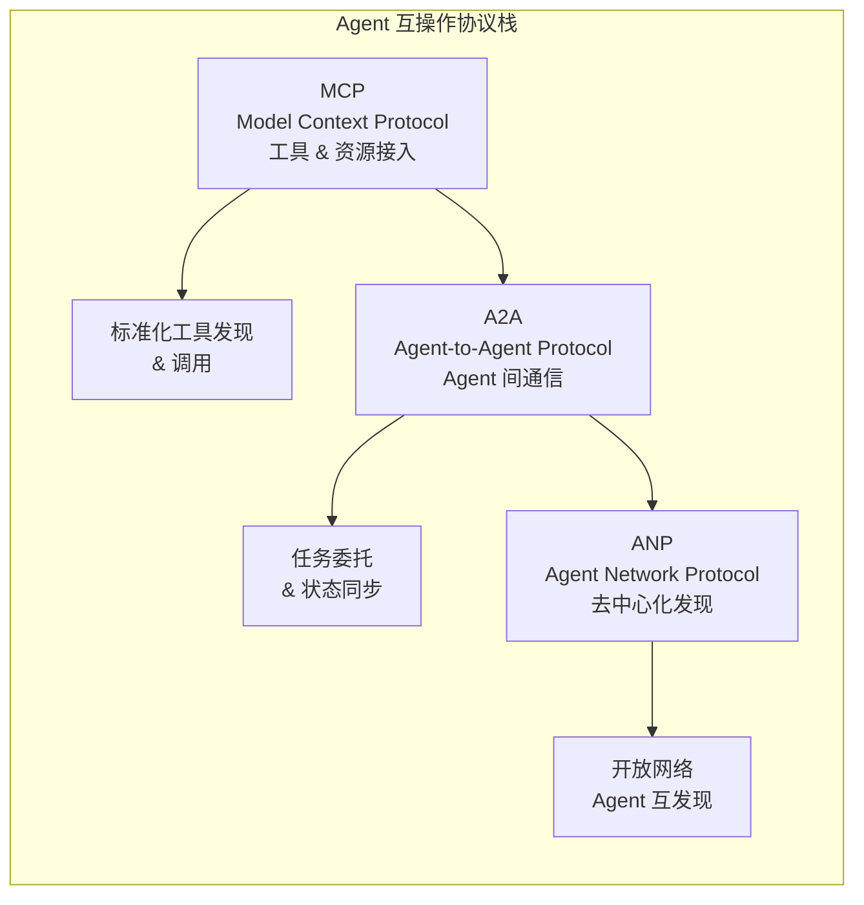

# 第 20 章 Agent 互操作协议

本章讲解 Agent 互操作性的协议层——重点关注 MCP（Model Context Protocol）和 A2A（Agent2Agent）这两类代表性方向。协议标准化是 Agent 生态从“孤岛”走向“互联”的关键基础设施，但它也是全书中时效性最高的主题之一。因此，本章的阅读重点应放在：**协议分别解决什么问题、适用边界是什么、在工程上什么时候值得引入**，而不是把某个版本的治理格局当作长期不变的事实。前置依赖：第 6 章工具系统设计。

> **时效性说明**：本章中涉及协议生态、治理组织、时间线的描述，均应理解为“截至书稿当前版本的整理结果”。如后续规范、组织关系或传输方式发生变化，应以协议官方文档和仓库更新为准。

---

## 20.1 协议生态全景（截至当前书稿版本）



### 20.1.1 三大协议的定位

| 维度 | MCP | A2A | ANP |
|------|-----|-----|-----|
| **全称** | Model Context Protocol | Agent-to-Agent Protocol | Agent Network Protocol |
| **通信模式** | Agent ↔ Tool/Resource（客户端-服务端） | Agent ↔ Agent（对等） | Agent ↔ Agent（去中心化发现） |
| **治理组织** | Linux Foundation AAIF（2025.12） | Linux Foundation（2025.08 吸收 ACP/BeeAI） | 开源社区 |
| **发起方** | Anthropic（2024） | Google（2025），IBM ACP 合并 | 中国开源社区（2025） |
| **核心场景** | 工具调用、资源访问、上下文注入 | 跨 Agent 任务委托与协作 | 去中心化 Agent 发现与路由 |
| **传输协议** | Streamable HTTP + OAuth 2.1、stdio | HTTP + SSE | DID + P2P 消息 |
| **发现机制** | 服务端声明能力 | Agent Card（JSON） | DID Document + 能力描述 |
| **适用边界** | 单 Agent 增强能力 | 组织内/跨组织协作 | 开放互联网跨厂商互发现 |

### 20.1.2 协议演进时间线

```
2024.06  ── Anthropic 发布 MCP 初始规范（stdio + HTTP/SSE 传输）
2024.11  ── Google 发布 A2A v1 草案
2025.03  ── IBM 发布 ACP v1，侧重企业合规与审计
2025.05  ── MCP 引入 Streamable HTTP 传输，替代 SSE
2025.08  ── ACP 正式合并入 A2A（Linux Foundation 治理）
2025.09  ── ANP 发布首个规范草案（DID 身份 + 去中心化发现）
2025.12  ── MCP 捐赠给 Linux Foundation AAIF
         ── 三大协议形成互补生态格局
```

### 20.1.3 协议关系模型

在工程实践中，更重要的问题不是“哪一个协议最先进”，而是“我的系统到底需要解决哪一种连接问题”。从这个角度看，这三类协议更适合被理解为互补分层：

- **MCP 层**："Agent 如何使用工具？"——解决 Agent 与外部工具/资源的标准化连接
- **A2A 层**："Agent 之间如何协作？"——解决跨 Agent 的任务委托、状态同步和能力发现
- **ANP 层**："如何在开放网络中找到合适的 Agent？"——解决去中心化身份和 P2P 发现

在实际工程中，一个 Agent 系统往往需要同时支持多种协议。协议注册表（`ProtocolRegistry`）作为管理核心组件，根据通信需求（工具调用、Agent 协作、去中心化发现）自动选择最合适的协议。完整实现见代码仓库 `code-examples/ch20-protocols/protocol-registry.ts`。

### 20.1.4 ACP 合并始末

> 这一节属于高时效性内容。正式出版时，建议将其视为“版本化背景资料”，而不是本章的永久主结论。

IBM 在 2025 年 3 月发布 Agent Communication Protocol（ACP），侧重企业级审计追踪、合规元数据和多方信任。然而 ACP 和 A2A 在核心场景上高度重叠。2025 年 8 月在 Linux Foundation 协调下完成合并：保留 A2A 名称和核心架构（Agent Card + Task 生命周期），将 ACP 的企业特性作为可选扩展模块，由 Linux Foundation 统一治理。开发者不再需要在两者间选择。

---

## 20.2 MCP 深入

> **MCP 的设计哲学：从"每家一套 SDK"到"一个协议连接一切"**
>
> 在 MCP 出现之前，N 个工具 x M 个框架 = N*M 个集成。MCP 将问题降维为 O(N+M)：工具提供商实现一个 MCP Server，Agent 框架实现一个 MCP Client。这与 USB 统一外设接口、LSP 统一编辑器插件的思路如出一辙。

MCP 相关生态的演进速度很快，因此这里更值得关注的是它的设计哲学和三大原语，而不是某个阶段性的组织归属。关于 MCP 的工具系统集成细节参见第 6 章 6.4 节。

### 20.2.1 MCP 架构概览

MCP 采用客户端-服务端架构，**三大原语**：

1. **Tools（工具）**：可执行的函数，Agent 调用完成特定任务
2. **Resources（资源）**：可读取的数据源，Agent 获取上下文信息
3. **Prompts（提示模板）**：预定义交互模板，标准化用户与 Agent 的交互

传输方式支持 stdio（本地进程）和 Streamable HTTP（远程服务）。三大原语的详细设计见第 6 章 6.4.2 节。

### 20.2.2 Streamable HTTP 传输

2025 年 5 月引入的 Streamable HTTP 替代了旧版 HTTP+SSE 方案。核心改进：单一端点（不再需要独立 SSE 端点）、按需流式（服务端选择直接返回 JSON 或升级为 SSE 流）、通过 `Mcp-Session-Id` 支持有状态和无状态两种模式、OAuth 2.1 授权（详见第 6 章 6.4.4c 节）。完整的 Streamable HTTP 传输实现见代码仓库 `code-examples/ch20-protocols/mcp-streamable-http.ts`。

### 20.2.3 MCP Server 与 Client

MCP Server 处理三大原语的注册和请求路由——注册 Tools 时提供函数名、Schema 和执行逻辑；注册 Resources 时提供 URI 模板和读取逻辑；注册 Prompts 时提供模板参数和渲染逻辑。MCP Client 负责传输协商、能力发现和调用封装。

完整的 MCP Server 和 Client 实现见代码仓库 `code-examples/ch20-protocols/mcp-server.ts` 和 `code-examples/ch20-protocols/mcp-client.ts`。

### 20.2.4 MCP 服务发现与安全

**服务发现**：MCP 服务生命周期管理器处理 Server 的注册、健康检查、自动重连和优雅关闭。

**安全模型**围绕四层展开：传输安全（TLS）、授权框架（OAuth 2.1，强制 PKCE）、服务端认证（防 Server 投毒）、权限控制（工具和资源访问权限）。详见第 6 章 6.4.4c 节。

### 20.2.5 MCP 治理变更：从 Anthropic 到 AAIF

2025 年 12 月 Anthropic 将 MCP 捐赠给 AAIF。核心影响：规范演进通过 AAIF RFC 流程进行（非 Anthropic 单方面决定）、SDK 仓库迁移到 `github.com/aaif/mcp-*`、协议版本号统一采用 ISO 日期格式（如 `2025-06-18`）。

---

## 20.3 A2A 深入

> **协议选型实践指南**
>
> - **Agent 需要连接外部工具** → MCP（事实标准，最大预建 Server 生态）
> - **多个 Agent 需要协作** → 同框架用框架自带消息机制，跨框架/跨组织用 A2A
> - **企业级审计和治理** → A2A 企业扩展模块，或企业 Agent 平台自带治理
> - **常见误区**：不要在项目初期就"统一所有协议"。先用最简单方式跑通核心流程，需要标准化时再引入协议层。

A2A 由 Google 于 2024 年底发起，2025 年 8 月吸收 IBM ACP 后成为统一的 Agent 间通信标准。以 Agent Card 作为发现核心机制，聚焦跨 Agent 任务委托与实时协作。

### 20.3.1 A2A 架构与 Agent Card

合并后的 A2A 包含三个核心组件：**Agent Card**（身份与能力声明）、**Task Manager**（任务生命周期管理）、**Enterprise Extensions**（审计日志、合规元数据，源自 ACP）。

Agent Card 通过 `/.well-known/Agent.json` 暴露，描述 Agent 的能力、认证方式和交互协议。它是 A2A 的"名片"——包含 Agent 名称、描述、端点 URL、认证方案、支持的内容模态（text/image/audio/video/file）、以及可处理的 Skill 列表。

### 20.3.2 Task 生命周期

A2A 的核心交互模型是 Task——一个有状态的工作单元：

```
submitted → working → completed
                  ↘ → failed
                  ↘ → input-needed ←→ working（用户提供额外输入后恢复）
```

- `submitted`：任务已提交，等待处理
- `working`：Agent 正在处理
- `input-needed`：需要额外输入才能继续（类似 Human-in-the-Loop）
- `completed`/`failed`：终态

### 20.3.3 A2A Client 与 Server

A2A Client 负责发现远程 Agent（获取 Agent Card）、提交任务、轮询/订阅任务状态更新。A2A Server 托管 Agent Card 并管理任务生命周期——接收任务请求、分发给处理器、通过 SSE 推送状态变更。

ACP 合并后的企业扩展功能以可选模块形式集成：合规元数据（数据分类、保留策略）、审计日志（操作记录、审计追踪）、SLA 指标（可用性目标、响应时间）。完整实现见代码仓库 `code-examples/ch20-protocols/a2a-client.ts` 和 `code-examples/ch20-protocols/a2a-server.ts`。

---

## 20.4 ANP 协议

Agent Network Protocol（ANP）由中国开源社区于 2025 年发起，专注于开放互联网上不同厂商 Agent 之间的发现、身份验证与消息交换。与 MCP（Agent↔Tool）和 A2A（企业级 Agent 协作）不同，ANP 填补了开放网络中 Agent 互发现、互认证的空白。

### 20.4.1 核心概念

ANP 的设计受 Web3 去中心化理念影响：

1. **去中心化身份（DID）**：每个 Agent 拥有全局唯一标识符，不依赖中央权威。格式如 `did:web:agent.example.com`、`did:key:z6Mkf...`、`did:peer:2.Ez6L...`
2. **Agent 描述协议**：通过标准化描述文档向网络广播自身能力
3. **消息路由**：基于 DID 的端到端加密消息传递，支持直接通信和中继转发

### 20.4.2 ANP 与中心化发现的比较

| 维度 | A2A（中心化发现） | ANP（去中心化发现） |
|------|-------------------|---------------------|
| 发现机制 | Agent Card via well-known URL | DHT 分布式哈希表 |
| 身份管理 | 依赖 OAuth/TLS 证书 | DID 自主身份 |
| 隐私性 | 中等（需暴露端点） | 高（可使用 did:peer） |
| 延迟 | 低（直接 HTTP） | 较高（DHT 查询） |
| 适用场景 | 企业内部、已知合作方 | 开放网络、未知 Agent |
| 成熟度 | 生产就绪 | 早期阶段 |

完整的 ANP DID 身份系统、发现服务和消息路由实现见代码仓库 `code-examples/ch20-protocols/anp-*.ts`。

---

## 20.5 协议互操作

在真实系统中，三大协议往往需要协同工作。典型场景：Agent 通过 ANP 发现协作伙伴 → 通过 A2A 委托任务 → 被委托 Agent 通过 MCP 调用工具完成工作。

### 20.5.1 协议桥接与统一网关

**MCP ↔ A2A 桥接**：当 A2A Agent 收到任务需要调用 MCP 工具时，桥接层将 A2A Task 请求转换为 MCP Tool Call，并将结果反向映射回 A2A Task 状态。

**统一 Agent 网关**对外暴露统一接口，内部根据请求类型分发到 MCP、A2A 或 ANP 处理器。路由规则：包含 tool call 的请求 → MCP；包含 task delegation 的请求 → A2A；包含 DID 的请求 → ANP。

### 20.5.2 协议协商器

多协议环境下自动选择最优协议的决策逻辑：

- 目标是已知 Agent → 检查 Agent Card → 使用 A2A
- 目标是工具/资源 → 使用 MCP
- 目标未知需发现 → 使用 ANP
- 需要企业审计 → 优先 A2A（含企业扩展）

完整实现见代码仓库 `code-examples/ch20-protocols/unified-gateway.ts`。

---

## 20.6 协议安全

Agent 互操作协议的安全性直接决定系统可信度。

### 20.6.1 安全威胁全景

| 协议 | 核心威胁 | 防护措施 |
|------|---------|---------|
| **MCP** | Server 投毒（恶意工具描述）、Token 窃取、参数注入 | 服务端签名验证、TLS + OAuth 2.1、参数 Schema 校验 |
| **A2A** | Agent 冒充（伪造 Agent Card）、任务篡改、中间人攻击 | Agent Card 签名、Task 签名链、mTLS |
| **ANP** | Sybil 攻击（伪造大量 DID）、DHT 投毒、密钥泄露 | DID 信誉系统、DHT 验证节点、密钥轮换 |

### 20.6.2 统一安全策略

统一安全管理器为三种协议提供一致的安全策略：请求验证（签名校验、Token 验证、DID 认证）、威胁检测（异常请求模式识别）、安全事件记录和响应。完整实现见代码仓库 `code-examples/ch20-protocols/security-manager.ts`。

---

## 20.7 协议选型指南

### 20.7.1 决策树

```
你的 Agent 需要做什么？
├── 调用外部工具/获取数据 → MCP
│   ├── 本地进程？ → MCP (stdio)
│   └── 远程服务？ → MCP (Streamable HTTP)
├── 与其他 Agent 协作 → A2A
│   ├── 同一组织？ → A2A 基础版
│   └── 跨组织 + 合规？ → A2A + 企业扩展
├── 开放网络发现 Agent → ANP
└── 复合场景 → ANP 发现 + A2A 协作 + MCP 工具
```

### 20.7.2 实现复杂度对比

| 维度 | MCP | A2A | ANP |
|------|-----|-----|-----|
| 最小可用实现 | ~200 行 | ~400 行 | ~600 行 |
| SDK 成熟度 | 高（官方 TS/Python） | 中（Google 示例） | 低（社区早期） |
| 学习曲线 | 低（JSON-RPC + 3 原语） | 中（状态机 + SSE） | 高（DID + DHT + 密码学） |
| 调试工具 | MCP Inspector | A2A Playground | 有限 |
| 生产案例 | 大量 | 增长中 | 早期试验 |

### 20.7.3 迁移路径

从传统集成迁移到标准化协议的建议路径：

**阶段 1：MCP 化（2-4 周）**——将现有 REST API 封装为 MCP Server，文件系统封装为 Resource，常用提示封装为 Prompt。

**阶段 2：A2A 化（4-8 周）**——为 Agent 定义 Agent Card，实现 Task 生命周期管理，添加企业扩展（如需合规）。

**阶段 3：统一网关（2-4 周）**——部署 UnifiedAgentGateway，配置协议桥接规则和安全策略。

完整的协议顾问（根据项目特征推荐协议组合）实现见代码仓库 `code-examples/ch20-protocols/protocol-advisor.ts`。

---

## 20.8 "MCP 已死"论争与 Skill 范式的崛起

### 20.8.1 争论的起源

2025 年末至 2026 年初，社区爆发了"MCP 已死"论争。核心观点：Agent 获得直接执行 Bash 命令的能力后，MCP 暴露的数百个工具变得冗余。导火索包括：Claude Code 仅通过少量核心工具（Bash、文件读写）就实现了强大 Agent 能力；每个 MCP 工具 schema 消耗上下文 Token（50 个工具可能占用数千 Token）；Block/Goose 项目提出的 Skill 规范——以 Markdown 封装领域知识按需加载。

### 20.8.2 Skill 范式

Skill 是以 Markdown 文件（`SKILL.md`）封装的可复用知识包，教会 Agent **如何**完成特定任务，而非直接提供工具能力。Skill 文件包含触发条件描述、详细操作指令、代码示例和错误处理策略。Skill 路由器在运行时根据用户意图匹配相关 Skill，将知识注入 Agent 上下文。

### 20.8.3 "GitHub Actions 与 Bash"类比

Goose 项目负责人 Angie Jones 的精辟类比："说 Skill 杀死了 MCP，就像说 GitHub Actions 杀死了 Bash 一样荒谬。Bash 仍然在执行命令。GitHub Actions 改变的是表达方式，而非执行方式。"

Skill 是知识层（决定做什么），MCP 是能力层（执行具体操作）。两者互补：Skill 路由器通过语义匹配找到相关领域知识，然后用 MCP 工具执行具体操作。

### 20.8.4 共识与演进方向

社区共识：MCP 并未死亡，但 Agent 与工具的交互模式正在从"硬编码工具列表"向"按需发现+知识引导"演进。两个新兴模式：

**SDP（Skill Discovery Protocol）**：在 Agent 与大量 MCP Server 之间插入发现层，Agent 只需一个 `skill_search` 工具即可按需找到合适的 MCP Server。

**MCP Apps**：将 MCP Server、Skill 文件、UI 组件打包为可分发的应用单元，类似移动端 App 的安装体验。

## 本章小结

本章内容应放回整本书的主线中理解：它不是孤立专题，而是在回答 Agent 工程链路中的一个关键问题。只有把这一章与前后章节连接起来，读者才更容易形成可迁移的工程判断。

## 建议接着读

如果你希望沿着本书的主干继续推进，建议下一步阅读 第 26 章《前沿趋势》。这样可以把本章中的判断框架，继续连接到后续的实现、评估或生产化问题上。

