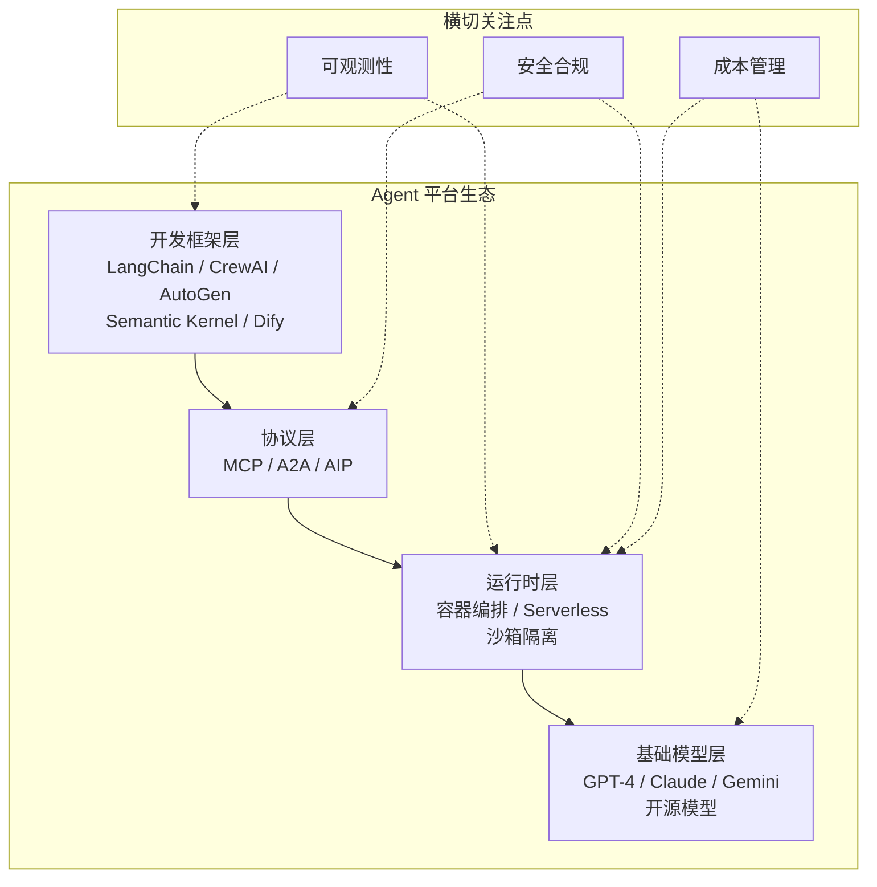
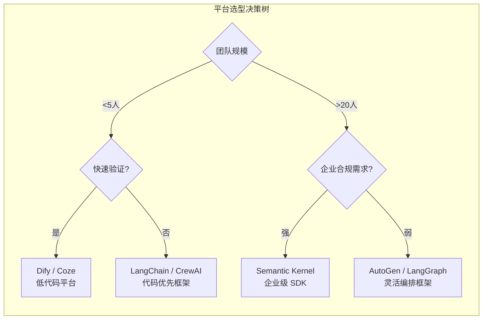

# 第 21 章：Agent 生态与平台
构建一个 Agent 和运营一个 Agent 平台是两个完全不同的工程问题。Agent 开发者关心的是"如何让我的 Agent 更聪明"；平台运营者关心的是"如何让成百上千个 Agent 安全、高效、可管理地运行"。

Agent 生态系统正在快速分层：**底层**是模型提供商和基础设施（OpenAI、Anthropic、Google Cloud）；**中间层**是开发框架和编排平台（LangGraph、Google ADK、Microsoft Copilot Studio）；**上层**是 Agent 应用市场和行业解决方案。每一层都有不同的技术挑战和商业逻辑。

本章从平台架构师的视角出发，讨论 Agent 平台的核心组件：注册与发现、Marketplace、平台适配器、模型网关和企业集成。我们也将介绍几个代表性的商业平台（Microsoft Copilot Studio、Salesforce Agentforce）和新兴产品（OpenAI Codex、Manus），分析它们的设计选择和市场定位。


> **"单个 Agent 是工具，Agent 平台是基础设施，Agent 生态是护城河。"**

在前面的章节中，我们深入探讨了 Agent 的核心能力——从记忆、规划到工具调用。第 20 章介绍了 Agent 互操作协议，为 Agent 之间的通信奠定了基础。本章将视角拉高到**平台级别**，探讨如何构建一个完整的 Agent 生态系统：从平台架构、注册发现、应用市场，到企业级集成模式。

本章的核心问题是：**如何让成百上千个 Agent 在一个统一的平台上协同运作，同时满足企业级的安全、合规和可扩展性要求？**

我们将构建以下关键组件：

- **Agent 平台架构**：运行时、注册中心、网关、监控的完整生命周期管理
- **注册与发现**：企业级的 Agent 注册、健康检查和能力发现机制
- **Agent Marketplace**：包含安全审查、依赖管理和计费模型的应用市场
- **平台适配器**：连接 Slack、Teams、Email 等多个外部平台的统一适配层
- **Agent Mesh**：借鉴服务网格思想的 Agent 通信基础设施
- **模型网关**：统一多模型提供商访问的中心化网关
- **编排平台**：低代码/无代码的 Agent 工作流引擎
- **企业集成**：SSO、数据治理、合规审计的企业级集成模式

---

## 21.1 Agent 平台架构



**图 21-1 Agent 平台技术栈全景**——选择平台时，不应只关注框架层的易用性，还需评估其在协议支持、运行时安全和可观测性方面的成熟度。


### 21.1.1 平台全景

一个生产级 Agent 平台由以下核心组件构成：

```
┌─────────────────────────────────────────────────────────────────┐
│                      Agent 平台全景图                            │
├─────────────────────────────────────────────────────────────────┤
│                                                                 │
│  ┌──────────┐  ┌──────────┐  ┌──────────┐  ┌──────────┐       │
    // ... 完整实现见 code-examples/ 目录 ...
│  └───────────────────────────────────────────────────┘        │
│                                                                │
└────────────────────────────────────────────────────────────────┘
```

### 21.1.2 平台核心类型定义

```typescript
// ============================================================
// 平台核心类型定义
// ============================================================

/** 平台组件的统一生命周期接口 */
    // ... 完整实现见 code-examples/ 目录 ...
  category: 'pii' | 'credentials' | 'financial' | 'health';
  severity: 'low' | 'medium' | 'high' | 'critical';
}
```

### 21.1.3 AgentPlatform 核心实现

```typescript
// ============================================================
// AgentPlatform：平台核心，管理所有组件的生命周期
// ============================================================

import { EventEmitter } from 'events';
    // ... 完整实现见 code-examples/ 目录 ...
  uptime: number;
  metrics: ComponentMetrics;
}
```

### 21.1.4 平台健康检查器

```typescript
// ============================================================
// 平台健康检查器：定期检查所有组件的健康状态
// ============================================================

class PlatformHealthChecker {
    // ... 完整实现见 code-examples/ 目录 ...
  components: Record<string, { healthy: boolean; lastCheck: number }>;
  timestamp: number;
}
```

### 21.1.5 多租户管理

多租户是企业级 Agent 平台的核心能力。不同的租户（组织、团队、客户）需要在共享基础设施上获得**资源隔离**、**数据隔离**和**配置隔离**。

```typescript
// ============================================================
// TenantManager：多租户管理器，实现资源隔离与配额控制
// ============================================================

class TenantManager implements Lifecycle {
    // ... 完整实现见 code-examples/ 目录 ...
    return Math.floor(this.tokens);
  }
}
```

### 21.1.6 平台启动示例

```typescript
// ============================================================
// 平台启动示例：展示完整的组件注册与启动流程
// ============================================================

async function bootstrapPlatform(): Promise<AgentPlatform> {
    // ... 完整实现见 code-examples/ 目录 ...

  return platform;
}
```

> **与第 20 章的衔接**：第 20 章定义的 Agent 互操作协议（A2A、MCP 等）是 Agent 之间通信的**语言**；本章的 AgentPlatform 则是这些 Agent 运行和通信的**场地**。平台提供运行时环境、资源管理和生命周期控制，而互操作协议提供消息格式和通信规范。

---

## 21.2 Agent 注册与发现


### 主流框架的工程实践对比

选择 Agent 框架时，团队应重点考察以下实践维度而非仅看 GitHub stars：

**调试体验**：LangChain 的 LangSmith 提供了业界最完善的 trace 可视化；AutoGen 的调试依赖日志输出，对复杂多 Agent 场景不够直观；Semantic Kernel 继承了 .NET 生态的成熟调试工具链。

**错误处理**：CrewAI 的高层抽象在 happy path 上体验良好，但当底层出错时，堆栈追踪往往难以定位根因。LangGraph 由于基于显式状态机，错误定位相对容易。

**性能开销**：框架自身的 overhead 在简单场景（1-2 步工具调用）中可以忽略，但在复杂场景（10+ 步、多 Agent 协作）中可能达到 10-20% 的额外延迟和 token 消耗。如果团队有性能敏感的场景，建议在选型阶段就做端到端 benchmark。

**迁移成本**：从框架 A 迁移到框架 B 的成本取决于对框架抽象的耦合程度。最佳实践是在框架之上建立一层薄适配层，将业务逻辑与框架 API 解耦。


### 21.2.1 从简单注册表到企业级服务

在生产环境中，Agent 注册系统需要远超简单 `Map<string, Agent>` 的能力：

- **健康检查**：持续监控 Agent 是否可用
- **能力发现**：根据所需能力动态查找合适的 Agent
- **版本管理**：支持同一 Agent 的多版本并存
- **依赖追踪**：理解 Agent 之间的依赖关系
- **Agent Card**：结构化描述 Agent 的元数据（参见第 20 章 A2A 协议中的 Agent Card 概念）

### 21.2.2 Agent Manifest 规范

Agent Manifest 是描述 Agent 能力、依赖和运行需求的结构化文档，类似 `package.json` 之于 Node.js 包。

```typescript
// ============================================================
// Agent Manifest：Agent 的结构化元数据描述
// ============================================================

/** Agent Manifest —— Agent 的"身份证" */
    // ... 完整实现见 code-examples/ 目录 ...
  limits: Record<string, number>;
  features: string[];
}
```

### 21.2.3 Manifest 验证器

```typescript
// ============================================================
// ManifestValidator：验证 Agent Manifest 的完整性和合规性
// ============================================================

class ManifestValidator {
    // ... 完整实现见 code-examples/ 目录 ...
  warnings: ValidationWarning[];
  score: number; // 0-100
}
```

### 21.2.4 AgentRegistryService 企业级实现

```typescript
// ============================================================
// AgentRegistryService：企业级 Agent 注册与发现服务
// ============================================================

interface RegisteredAgent {
    // ... 完整实现见 code-examples/ 目录 ...
  capabilityCount: number;
  categoryCount: number;
}
```

### 21.2.5 注册与发现使用示例

```typescript
// ============================================================
// 使用示例：注册、发现和解析 Agent
// ============================================================

async function registryDemo(): Promise<void> {
    // ... 完整实现见 code-examples/ 目录 ...

  await registry.stop();
}
```

> **与第 11 章的关联**：第 11 章在框架对比与选型中讨论了不同 Agent 框架的能力差异。本节的 Agent Manifest 和能力发现机制，可以作为统一描述和比较不同框架所构建 Agent 的标准化方式。无论使用 LangChain、AutoGen 还是自研框架，Agent 都可以通过 Manifest 注册到统一的注册中心。

---

## 21.3 Agent Marketplace



**图 21-2 Agent 平台选型决策树**——没有"最好"的框架，只有最匹配团队阶段和场景需求的选择。初创团队优先验证速度，企业团队优先治理能力。


### 21.3.1 Marketplace 架构概述

Agent Marketplace（应用市场）是 Agent 生态系统的**商业枢纽**。它让 Agent 开发者能够发布、分发和变现自己的 Agent，同时让用户能够方便地发现、试用和部署所需的 Agent。

```
┌─────────────────────────────────────────────────────────────┐
│                   Agent Marketplace 架构                     │
├─────────────────────────────────────────────────────────────┤
│                                                             │
│  ┌──────────────────────────────────────────────────┐      │
    // ... 完整实现见 code-examples/ 目录 ...
│  └─────────────────────────────────────────────────┘      │
│                                                            │
└────────────────────────────────────────────────────────────┘
```

### 21.3.2 Marketplace 核心类型

```typescript
// ============================================================
// Agent Marketplace 核心类型定义
// ============================================================

/** Marketplace 中的 Agent 列表项 */
    // ... 完整实现见 code-examples/ 目录 ...
  changes: string[];
  breaking: boolean;
}
```

### 21.3.3 AgentMarketplace 实现

```typescript
// ============================================================
// AgentMarketplace：应用市场核心服务
// ============================================================

class AgentMarketplace implements Lifecycle {
    // ... 完整实现见 code-examples/ 目录 ...
    this.documents.delete(agentId);
  }
}
```

### 21.3.4 Agent 包管理器

Agent 包管理器负责依赖解析、版本兼容性检查和安装编排。

```typescript
// ============================================================
// AgentPackageManager：依赖解析与安装编排
// ============================================================

class AgentPackageManager {
    // ... 完整实现见 code-examples/ 目录 ...
  required: string;
  installed: string;
}
```

### 21.3.5 安全审查流水线

所有提交到 Marketplace 的 Agent 必须经过多阶段的安全审查。

```typescript
// ============================================================
// SecurityReviewPipeline：多阶段安全审查流水线
// ============================================================

interface SecurityReviewResult {
    // ... 完整实现见 code-examples/ 目录 ...
    };
  }
}
```

### 21.3.6 计费模型

```typescript
// ============================================================
// 计费模型：支持多种变现方式
// ============================================================

interface BillingRecord {
    // ... 完整实现见 code-examples/ 目录 ...
  byAgent: Record<string, number>;
  totalCalls: number;
}
```


### 21.3.7 实战案例：Smithery.ai — MCP Server 注册中心

在第 20 章中我们深入探讨了 MCP（Model Context Protocol）协议的技术细节。随着 MCP 生态的爆发式增长，一个关键问题浮出水面：**如何发现和管理数以千计的 MCP Server？** Smithery.ai 正是解决这一问题的事实标准（de facto）注册中心，其角色类似于 npm 之于 Node.js 包、Docker Hub 之于容器镜像。

**平台定位与规模**

截至 2025 年中，Smithery 已收录 **3,000+ MCP Server**，涵盖数据库连接器、API 集成、文件系统工具、搜索引擎等各类能力。开发者可以通过 Web 界面浏览、搜索和评估 MCP Server，也可以通过 CLI 直接安装。

**CLI 驱动的安装体验**

Smithery 提供了类似 npm 的命令行工具，实现一键安装和配置：

```bash

# 安装 MCP Server 到本地开发环境
npx @smithery/cli install @anthropic/filesystem-server

# 安装并指定运行模式
    // ... 完整实现见 code-examples/ 目录 ...

# 更新所有已安装的 Server
npx @smithery/cli update --all
```

**部署模式**

Smithery 支持两种部署模式，适应不同的安全和性能需求：

```typescript
// ============================================================
// Smithery MCP Server 部署模式
// ============================================================

/** Smithery 部署配置 */
    // ... 完整实现见 code-examples/ 目录 ...
  /** 兼容的 MCP 协议版本 */
  mcpVersion: string;
}
```

**安全考量**

作为开放的注册中心，Smithery 面临与 npm 类似的供应链安全挑战。社区已报告过部分 MCP Server 存在**路径遍历漏洞**（path traversal），攻击者可能通过恶意 Server 读取宿主机的敏感文件。安全建议：

- **最小权限原则**：仅授予 MCP Server 必要的文件系统和网络权限
- **沙箱运行**：在容器或受限进程中运行第三方 Server
- **审查源码**：安装前检查 Server 的权限声明和代码实现
- **关注安全评分**：优先选择 Smithery 安全评分较高的 Server
- **锁定版本**：避免自动更新引入未审查的变更

> **与 21.3.5 的联系：** Smithery 的安全挑战正是本节 `SecurityReviewPipeline` 要解决的问题。企业如果要大规模采用 MCP Server，建议在 Smithery 之上叠加自建的安全审查流程。

---

## 21.4 平台适配器

### 21.4.1 为什么需要平台适配器

Agent 最终需要通过具体的**渠道**与用户交互。不同的渠道（Slack、Teams、Email、Web 等）有着完全不同的消息格式、认证方式和交互模型。平台适配器的核心职责是：

1. **消息规范化**：将各平台的消息格式转换为统一的内部格式
2. **事件路由**：将平台事件路由到正确的 Agent
3. **生命周期管理**：统一管理多个适配器的启停
4. **Webhook 管理**：处理各平台的 Webhook 注册和验证

```
┌─────────────────────────────────────────────────────────────┐
│                   平台适配器架构                              │
├─────────────────────────────────────────────────────────────┤
│                                                             │
│  外部平台            适配器层              内部统一格式       │
    // ... 完整实现见 code-examples/ 目录 ...
│                                    └──────────────────┘    │
│                                                             │
└─────────────────────────────────────────────────────────────┘
```

> **平台适配的启示**：将“平台适配”做到极致是 Agent 工程化的重要方向。通过 Gateway 守护进程 + Plugin 架构，可以开箱即用地支持 20+ 消息平台（Slack、Discord、Teams、WeChat、Telegram 等）。结合 MCP 兼容工具，Agent 可以通过统一的 Plugin 接口连接任意渠道。如果你的 Agent 需要快速对接大量消息平台，Gateway 架构是值得参考的模式。

### 21.4.2 统一消息模型

```typescript
// ============================================================
// 统一消息模型：所有平台适配器输出的规范化格式
// ============================================================

/** 规范化消息：所有平台消息转换后的统一格式 */
    // ... 完整实现见 code-examples/ 目录 ...
  deliveredAt?: number;
  editedAt?: number;
}
```

### 21.4.3 PlatformAdapter 接口与基础类

```typescript
// ============================================================
// PlatformAdapter 接口与 AbstractAdapter 基础类
// ============================================================

/** 平台适配器接口 */
    // ... 完整实现见 code-examples/ 目录 ...
    return new Promise(resolve => setTimeout(resolve, ms));
  }
}
```

### 21.4.4 Slack 适配器

```typescript
// ============================================================
// SlackAdapter：Slack 平台适配器
// ============================================================

interface SlackAdapterConfig extends BaseAdapterConfig {
    // ... 完整实现见 code-examples/ 目录 ...
    };
  }
}
```

### 21.4.5 Microsoft Teams 适配器

```typescript
// ============================================================
// TeamsAdapter：Microsoft Teams 适配器
// ============================================================

interface TeamsAdapterConfig extends BaseAdapterConfig {
    // ... 完整实现见 code-examples/ 目录 ...
    };
  }
}
```

### 21.4.6 Email 适配器

```typescript
// ============================================================
// EmailAdapter：Email 适配器
// ============================================================

interface EmailAdapterConfig extends BaseAdapterConfig {
    // ... 完整实现见 code-examples/ 目录 ...
    return html;
  }
}
```

### 21.4.7 WebSocket 适配器

```typescript
// ============================================================
// WebSocketAdapter：WebSocket 实时通信适配器
// ============================================================

interface WebSocketAdapterConfig extends BaseAdapterConfig {
    // ... 完整实现见 code-examples/ 目录 ...
    }
  }
}
```

### 21.4.8 AdapterManager：统一管理所有适配器

```typescript
// ============================================================
// AdapterManager：统一管理所有平台适配器
// ============================================================

class AdapterManager implements Lifecycle {
    // ... 完整实现见 code-examples/ 目录 ...
    console.warn(`[EventRouter] 消息 ${message.messageId} 未匹配任何路由规则`);
  }
}
```

---

## 21.5 Agent Mesh

### 21.5.1 从服务网格到 Agent 网格

服务网格（Service Mesh）是微服务架构中的基础设施层，负责处理服务间通信。Agent Mesh 将这一理念引入 Agent 系统：

- **Sidecar 模式**：每个 Agent 旁附加一个代理，拦截所有出入流量
- **流量管理**：金丝雀发布、A/B 测试、负载均衡
- **可观测性**：自动注入追踪、指标收集
- **策略执行**：认证、授权、限流

```
┌─────────────────────────────────────────────────────────────┐
│                    Agent Mesh 架构                           │
├─────────────────────────────────────────────────────────────┤
│                                                             │
│  ┌─────────────────────────────────────────────────┐       │
    // ... 完整实现见 code-examples/ 目录 ...
│  └───────────────────────────────────────────────────┘       │
│                                                             │
└─────────────────────────────────────────────────────────────┘
```

### 21.5.2 AgentMesh 核心实现

```typescript
// ============================================================
// AgentMesh：Agent 网格核心
// 断路器实现（CircuitBreaker）来自第 18 章 §18.2.2
// ============================================================

    // ... 完整实现见 code-examples/ 目录 ...
  circuitBreakerState: string;
  joinedAt: number;
}
```

### 21.5.3 AgentSidecar 实现

```typescript
// ============================================================
// AgentSidecar：Agent 侧车代理
// ============================================================

interface SidecarConfig {
    // ... 完整实现见 code-examples/ 目录 ...
    return request;
  }
}
```

### 21.5.4 断路器

> **断路器（Circuit Breaker）**是保护 Agent 系统免受下游服务故障级联影响的核心弹性模式。在 Agent Mesh 中，每个节点通过断路器监控对其他节点的调用成功率：当失败率超过阈值时断路器"打开"，拒绝后续请求以防止雪崩；经过冷却期后进入"半开"状态，允许少量探测请求通过以检测服务是否恢复。`AgentMesh` 中使用的 `CircuitBreakerConfig`（`failureThreshold`、`resetTimeoutMs`、`halfOpenRequests`）定义了断路器的核心参数。完整的生产级分层断路器实现（含父子层级级联熔断、慢调用率检测、滑动窗口统计）详见 **第 18 章 §18.2.2 分层熔断器（`HierarchicalCircuitBreaker`）**。

### 21.5.5 流量管理器

```typescript
// ============================================================
// AgentTrafficManager：流量管理（金丝雀、A/B 测试）
// ============================================================

interface TrafficRule {
    // ... 完整实现见 code-examples/ 目录 ...
  successes: number;
  avgLatencyMs: number;
}
```

---

## 21.6 模型网关

### 21.6.1 为什么需要统一模型网关

在一个 Agent 平台中，不同的 Agent 可能使用不同的模型提供商（OpenAI、Anthropic、Google、本地部署模型等）。直接对接每个提供商会导致：

- **接口碎片化**：每个提供商的 API 格式不同
- **运维复杂度**：密钥管理、限流策略分散
- **成本失控**：无法统一追踪和控制模型调用费用
- **可靠性风险**：单点故障无法自动切换

模型网关（Model Gateway）是一个中心化的模型访问层，对上层 Agent 提供统一 API，对下层管理多个模型提供商。

```
┌─────────────────────────────────────────────────────────────┐
│                    模型网关架构                               │
├─────────────────────────────────────────────────────────────┤
│                                                             │
│  Agent A    Agent B    Agent C    Agent D    Agent E        │
    // ... 完整实现见 code-examples/ 目录 ...
│ Adapter  Adapter   Adapter  Adapter   Adapter              │
│                                                             │
└─────────────────────────────────────────────────────────────┘
```

### 21.6.2 模型网关类型定义

```typescript
// ============================================================
// 模型网关类型定义
// ============================================================

/** 模型提供商标识 */
    // ... 完整实现见 code-examples/ 目录 ...
  fallbackUsed: boolean;
  originalProvider?: ModelProvider;
}
```

### 21.6.3 ProviderAdapter 接口与实现

```typescript
// ============================================================
// ProviderAdapter：模型提供商适配器
// ============================================================

/** 模型提供商适配器接口 */
    // ... 完整实现见 code-examples/ 目录 ...
    return { remainingRequests: 10000, remainingTokens: 1500000, resetAt: 0 };
  }
}
```

### 21.6.4 FallbackChainExecutor

```typescript
// ============================================================
// FallbackChainExecutor：降级链执行器
// ============================================================

interface FallbackChain {
    // ... 完整实现见 code-examples/ 目录 ...
  fallbackUsed: boolean;
  error?: string;
}
```

### 21.6.5 ModelGateway 完整实现

```typescript
// ============================================================
// ModelGateway：统一模型网关
// ============================================================

class ModelGateway implements Lifecycle {
    // ... 完整实现见 code-examples/ 目录 ...
    this.cache.clear();
  }
}
```

### 21.6.6 模型网关使用示例

```typescript
// ============================================================
// 模型网关使用示例
// ============================================================

async function modelGatewayDemo(): Promise<void> {
    // ... 完整实现见 code-examples/ 目录 ...

  await gateway.stop();
}
```

---

## 21.7 Agent 编排平台

### 21.7.1 低代码编排的价值

对于非技术用户或快速原型场景，通过代码编排 Agent 工作流门槛过高。Agent 编排平台提供**可视化、声明式**的工作流定义方式：

- **DAG 工作流**：有向无环图定义任务依赖
- **条件分支**：根据中间结果动态选择路径
- **并行执行**：无依赖的任务自动并行
- **错误处理**：重试、超时、降级的统一配置
- **模板库**：常用模式的预置模板

### 21.7.2 工作流定义类型

```typescript
// ============================================================
// 工作流定义类型系统
// ============================================================

/** 工作流定义 */
    // ... 完整实现见 code-examples/ 目录 ...
  defaultValue?: unknown;
  description: string;
}
```

### 21.7.3 WorkflowExecutor 实现

```typescript
// ============================================================
// WorkflowExecutor：工作流执行引擎
// ============================================================

/** 工作流执行状态 */
    // ... 完整实现见 code-examples/ 目录 ...
  input: Record<string, unknown>,
  execution: WorkflowExecution
) => Promise<unknown>;
```

### 21.7.4 工作流模板库

```typescript
// ============================================================
// 工作流模板库：常用 Agent 编排模式
// ============================================================

class WorkflowTemplateLibrary {
    // ... 完整实现见 code-examples/ 目录 ...
    });
  }
}
```


### 21.7.5 商业平台：Microsoft Copilot Studio

除了自建编排平台，企业也可以选择商业化的 Agent 构建平台。**Microsoft Copilot Studio**（原 Power Virtual Agents 的演进）是目前企业级 Agent 构建领域最成熟的低代码平台之一。

**平台定位**

Copilot Studio 面向**企业 IT 团队和业务分析师**，提供无代码/低代码的 Agent 构建界面。其核心优势在于与 Microsoft 365 生态的深度集成——Agent 可以直接访问 SharePoint 文档、Outlook 邮件、Teams 对话和 Dynamics 365 数据。

**核心能力**

```typescript
// ============================================================
// Microsoft Copilot Studio 能力模型
// ============================================================

/** Copilot Studio Agent 定义 */
    // ... 完整实现见 code-examples/ 目录 ...
  /** Teams 中的 @mention 触发 */
  teamsAtMention?: boolean;
}
```

**核心特性：**

- **Custom Copilots**：基于企业私有知识库构建的定制化 AI 助手
- **Plugin 生态**：复用 Power Platform 1,400+ 企业连接器（SAP、ServiceNow、Salesforce 等）
- **Teams 深度集成**：Agent 作为 Teams App 直接嵌入协作流程
- **Generative AI 编排**：内置 GPT 模型支持，支持 Orchestrator 自动路由到合适的知识源或插件
- **安全与治理**：继承 Azure AD 权限体系，DLP 策略自动生效

**定价模型**

Copilot Studio 采用**按用户/月**的订阅模式，约 **$200/用户/月**（包含 25,000 条消息）。对于已经大量投资 Microsoft 生态的企业，这一价格在减少自建成本的同时提供了快速上线的路径。

> **适用场景：** 企业内部 IT 帮助台、HR 自助服务、知识库问答、审批流程自动化。如果你的组织已深度使用 Microsoft 365，Copilot Studio 是 Agent 落地的低阻力路径。

### 21.7.6 商业平台：Salesforce Agentforce

**Salesforce Agentforce**（2024 年 9 月发布）是 CRM 巨头 Salesforce 推出的 AI Agent 平台，目标是将 Agent 嵌入客户关系管理的每个环节。

**平台架构**

Agentforce 的核心是 **Atlas Reasoning Engine**——一个结合了链式推理（chain-of-thought）与 CRM 数据上下文的推理引擎。Agent 在回答客户问题或执行操作时，会自动关联客户的历史订单、服务记录、偏好等结构化数据。

```typescript
// ============================================================
// Salesforce Agentforce 架构模型
// ============================================================

/** Agentforce Agent 配置 */
    // ... 完整实现见 code-examples/ 目录 ...
  /** Agent 触发此 Action 时需要的参数 */
  inputSchema: Record<string, unknown>;
}
```

**预置 Agent 类型：**

- **Service Agent**：替代传统 Chatbot，处理客户服务请求，支持自动退款、订单查询、预约变更
- **Sales Agent**：辅助销售团队，自动生成客户画像、推荐跟进策略、撰写个性化邮件
- **Commerce Agent**：电商场景下的购物助手，基于浏览历史和购买记录推荐商品
- **Marketing Agent**：自动生成营销活动内容、优化投放策略

**定价演进**

Agentforce 的定价策略经历了一次重要转型：
- **2024 年 9 月**（发布时）：按对话计费，**$2/次对话**
- **2025 年 5 月**：转向 **Flex Credits 消费模型**，统一积分兑换各类 AI 服务

这一转变反映了 Agent 平台定价的行业趋势——从简单的按次计费转向更灵活的消费式计费，让客户能在不同 AI 功能之间灵活分配预算。

> **适用场景：** 已部署 Salesforce CRM 的企业，需要在客户服务、销售和电商环节引入 AI Agent。Agentforce 的最大优势在于与 CRM 数据的原生集成——Agent 天然理解客户上下文，无需额外的数据管道。

---

## 21.8 企业集成模式

### 21.8.1 企业级 Agent 系统的特殊要求

将 Agent 系统部署到企业环境，需要满足一系列额外的非功能性要求：

- **身份认证与授权**：SSO/SAML/OIDC 集成，基于角色的访问控制
- **数据治理**：数据分类、数据防泄漏（DLP）、数据驻留
- **审计合规**：完整的操作审计日志，满足 SOC 2、GDPR 等合规要求
- **密钥管理**：安全的 API 密钥和凭据管理
- **网络安全**：VPC 隔离、TLS 加密、IP 白名单

### 21.8.2 企业集成管理器

```typescript
// ============================================================
// EnterpriseIntegrationManager：企业集成统一管理
// ============================================================

interface EnterpriseConfig {
    // ... 完整实现见 code-examples/ 目录 ...
    return this.complianceChecker.runFullCheck();
  }
}
```

### 21.8.3 认证提供者

```typescript
// ============================================================
// AuthProvider：统一身份认证
// ============================================================

interface AuthSession {
    // ... 完整实现见 code-examples/ 目录 ...
    return Array.from(permissions);
  }
}
```

### 21.8.4 数据分类引擎

```typescript
// ============================================================
// DataClassificationEngine：自动数据分类与 DLP
// ============================================================

type DataClassificationLevel = 'public' | 'internal' | 'confidential' | 'restricted';
    // ... 完整实现见 code-examples/ 目录 ...
  classification: ClassificationResult;
  reason?: string;
}
```

### 21.8.5 审计日志系统

```typescript
// ============================================================
// AuditLogger：审计日志系统
// ============================================================

interface AuditEvent {
    // ... 完整实现见 code-examples/ 目录 ...
  anomalies: string[];
  generatedAt: number;
}
```

### 21.8.6 合规检查器

```typescript
// ============================================================
// ComplianceChecker：合规检查器
// ============================================================

interface ComplianceReport {
    // ... 完整实现见 code-examples/ 目录 ...
    }
  }
}
```

### 21.8.7 企业集成使用示例

```typescript
// ============================================================
// 企业集成使用示例
// ============================================================

async function enterpriseIntegrationDemo(): Promise<void> {
    // ... 完整实现见 code-examples/ 目录 ...

  await manager.stop();
}
```

> **与第 22 章的衔接**：本节讨论的企业集成模式从**系统层面**保障了 Agent 平台的安全和合规。第 22 章"Agent Experience 设计"将从**用户体验层面**探讨如何让 Agent 在满足这些企业约束的同时，依然提供流畅、直觉的交互体验。好的 AX 设计需要在安全控制与用户便利之间找到平衡——例如，DLP 拦截不应让用户感到困惑，权限不足时应给出清晰的引导。

---

## 21.9 新兴 Agent 产品与平台

除了上述通用平台架构和企业集成模式，2025–2026 年涌现了一批值得关注的 Agent 产品和平台特性。它们代表了 Agent 技术从基础设施走向终端用户的关键趋势。

### 21.9.1 OpenAI Codex

**[[OpenAI Codex]](https://openai.com/index/introducing-codex/)** 是 OpenAI 推出的全自主编码 Agent 平台。与早期的代码补全工具不同，Codex 是一个完整的 Agent 系统：

- **云端沙箱执行**：每个任务在隔离的云端沙箱中运行，Agent 可以自主读写文件、运行测试、安装依赖
- **后台自主运行**：用户提交任务后，Codex 在后台独立工作，完成后通知用户审查结果
- **端到端软件工程**：支持从需求理解、代码编写、测试验证到 PR 创建的完整开发流程
- **多文件协调修改**：能够理解项目结构，跨多个文件进行协调一致的修改

Codex 的架构设计体现了 Agent 系统的一个关键理念：**将 Agent 放入受控的执行环境中，赋予其足够的工具和权限来自主完成复杂任务，同时通过沙箱隔离确保安全性**。这与本章 21.1 节讨论的平台运行时管理思路一致。

### 21.9.2 Claude CoWork

**Claude CoWork** 是 Anthropic 推出的多 Agent 协作工作区功能。它允许用户在与 Claude 的对话中，将子任务委派给多个并行运行的子 Agent：

- **任务委派**：主 Agent（Claude）可以根据用户请求，自动将子任务分配给专门的子 Agent
- **并行执行**：多个子 Agent 可以同时工作，各自负责不同的子任务（如分别研究不同主题、分析不同数据源）
- **结果汇总**：子 Agent 完成后，主 Agent 汇总各子 Agent 的结果，生成统一的最终输出
- **用户可见性**：用户可以实时观察各子 Agent 的工作进度和中间结果

CoWork 是第 9–10 章讨论的多 Agent 架构模式在商业产品中的直接体现——特别是 **Orchestrator-Worker 模式**的落地实现。它降低了多 Agent 协作的使用门槛，让非技术用户也能受益于并行化的 Agent 工作流。

### 21.9.3 Microsoft Connected Agents

**[[Microsoft Connected Agents]](https://www.microsoft.com/en-us/microsoft-copilot/blog/copilot-studio/introducing-connected-Agents-for-copilot-studio/)** 是 Azure AI Foundry 推出的 Agent 互操作特性，旨在解决企业中不同团队、不同平台构建的 Agent 之间的协作问题：

- **跨平台互操作**：允许在 Copilot Studio 中构建的 Agent 与其他框架（如 LangChain、Semantic Kernel）构建的 Agent 相互发现和调用
- **统一注册与发现**：通过 Azure AI Foundry 的 Agent 注册中心，企业内所有 Agent 可被统一管理和发现
- **安全委派**：Agent 之间的调用遵循企业安全策略，包括身份验证、权限控制和审计日志
- **生态连接**：支持将第三方 Agent 接入 Microsoft 365 Copilot 生态，扩展 Copilot 的能力边界

这一特性与本章 21.5 节讨论的 Agent Mesh 概念高度契合，也与第 20 章的 Agent 互操作协议形成互补——Connected Agents 提供了协议的商业化落地方案。

### 21.9.4 Manus

**[[Manus]](https://manus.im/)** 是 2025 年创立的 AI Agent 产品，以其面向消费者的通用 Agent 能力引发了广泛关注：

- **通用任务执行**：Manus 定位为"通用 AI Agent"，能够处理从信息研究、数据分析到内容创作的多种任务
- **自主浏览与操作**：Agent 可以自主浏览网页、填写表单、与在线服务交互
- **端到端交付物**：不只是给出建议或文本回复，而是直接生成可用的交付物（文档、表格、报告等）
- **异步任务模式**：支持提交任务后在后台运行，完成后通知用户——类似 Codex 的异步模式

Manus 的意义在于展示了 **Agent 作为消费级产品**的可能性。相比面向开发者的 Agent 框架和面向企业的 Agent 平台，Manus 证明了 Agent 技术可以直接服务于终端用户，这一趋势值得所有 Agent 工程团队关注。

> **新兴平台启示**：上述四个产品/特性共同指向 Agent 技术的两大趋势：（1）**自主性增强**——Agent 从辅助工具进化为能独立完成复杂任务的自主系统；（2）**协作成为标配**——多 Agent 协作不再是研究课题，而是商业产品的核心卖点。这也预示着本书第 9–10 章讨论的多 Agent 模式将在未来几年变得更加重要。

---

## 21.10 本章小结

本章从**平台架构**到**企业集成**，全面探讨了构建生产级 Agent 生态系统所需的各个层面。让我们回顾核心要点：

### 十大要点

**1. 平台即基础设施**

Agent 平台不是简单的 Agent 运行容器，而是一套完整的基础设施——涵盖运行时管理、组件生命周期、多租户隔离和资源配额。`AgentPlatform` 类通过拓扑排序确保组件按正确顺序启动，通过回滚机制保证启动失败时的安全回退。

**2. 注册与发现是生态的神经系统**

企业级 `AgentRegistryService` 远超简单的 `Map` 注册表。它需要：Agent Manifest 验证、能力索引、版本管理、健康检查、负载均衡式的实例解析。`AgentManifest` 作为 Agent 的"身份证"，标准化描述了能力、依赖、安全要求和运行时需求。

**3. Marketplace 是生态的商业引擎**

应用市场不仅是分发渠道，还是质量和安全的把关者。`SecurityReviewPipeline` 的多阶段审查（完整性检查 → 权限审查 → 漏洞扫描 → 数据合规 → 静态分析 → 信任评估）确保只有安全的 Agent 才能进入生态。`AgentPackageManager` 的依赖解析则保证安装的一致性。

**4. 适配器模式统一多平台差异**

`PlatformAdapter` 接口和 `MessageNormalizer` 将 Slack、Teams、Email、WebSocket 等平台的消息格式归一化为统一的 `NormalizedMessage`。`AdapterManager` 统一管理所有适配器的生命周期，`EventRouter` 基于规则将消息路由到正确的 Agent。社区中已有多个开源项目实现了 20+ 平台的开箱即用适配，可作为平台适配层的参考实现。

**5. Agent Mesh 借鉴服务网格的成熟模式**

将 Sidecar 模式引入 Agent 系统，`AgentSidecar` 自动注入认证、限流、日志和追踪。断路器（详见第 18 章 §18.2.2 `HierarchicalCircuitBreaker`）防止级联失败。这种基础设施级的关注点分离让 Agent 开发者专注于业务逻辑。

**6. 流量管理支撑灰度发布**

`AgentTrafficManager` 支持金丝雀发布（按百分比分流）、A/B 测试（多版本对比）和基于 Header 的路由。这让新版本 Agent 能够安全地逐步上线，出现问题时快速回滚。

**7. 模型网关统一多提供商访问**

`ModelGateway` 对上提供统一 API，对下管理 OpenAI、Anthropic、Google、DeepSeek、智谱（GLM）等多个提供商。`FallbackChainExecutor` 实现自动降级，单一提供商故障不会影响整体可用性。`CostTracker` 实现精确到请求级别的成本追踪。

**8. 编排平台降低使用门槛**

`WorkflowExecutor` 支持 DAG 工作流的声明式定义和自动执行。支持顺序、并行、条件分支和人工审核环等常见编排模式。模板库 (`WorkflowTemplateLibrary`) 提供开箱即用的最佳实践。

**9. 企业集成不是可选项**

SSO/OIDC 认证、数据分类与 DLP、审计日志、合规检查——这些在企业部署中都是**必须**的。`DataClassificationEngine` 自动识别身份证号、手机号、API 密钥等敏感信息。`AuditLogger` 记录每一次关键操作。`ComplianceChecker` 持续验证 SOC 2、GDPR 等合规要求。

**10. 生态构建是飞轮效应**

平台提供基础设施 → 开发者构建 Agent → Marketplace 分发 Agent → 用户使用 Agent → 更多用户吸引更多开发者 → 生态壮大。本章构建的各个组件共同支撑这个飞轮：Registry 让 Agent 可发现，Marketplace 让 Agent 可分发，Gateway 让 Agent 可靠运行，Enterprise Integration 让 Agent 可信赖。

### 各组件协作关系

```
┌────────────────────────────────────────────────────────────┐
│                   协作关系总览                               │
├────────────────────────────────────────────────────────────┤
│                                                            │
│  开发者                                                    │
    // ... 完整实现见 code-examples/ 目录 ...
│         AuthProvider  DLP     AuditLogger                  │
│                                                            │
└────────────────────────────────────────────────────────────┘
```

### 下一章预告

第 22 章"Agent Experience 设计"将聚焦于 Agent 系统的用户体验层面。我们将探讨：

- **AX（Agent Experience）设计原则**：如何设计直觉、可信赖的 Agent 交互
- **对话设计模式**：多轮对话、主动推送、错误恢复的最佳实践
- **反馈与控制**：如何让用户理解和控制 Agent 的行为
- **可解释性**：让 Agent 的决策过程透明
- **渐进式信任建立**：从辅助工具到自主代理的信任阶梯

在本章构建的坚实平台基础之上，第 22 章将赋予这些 Agent 以"温度"——让技术能力转化为优秀的用户体验。

---
