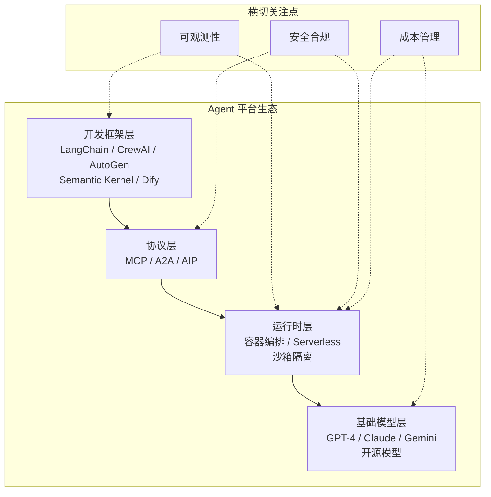
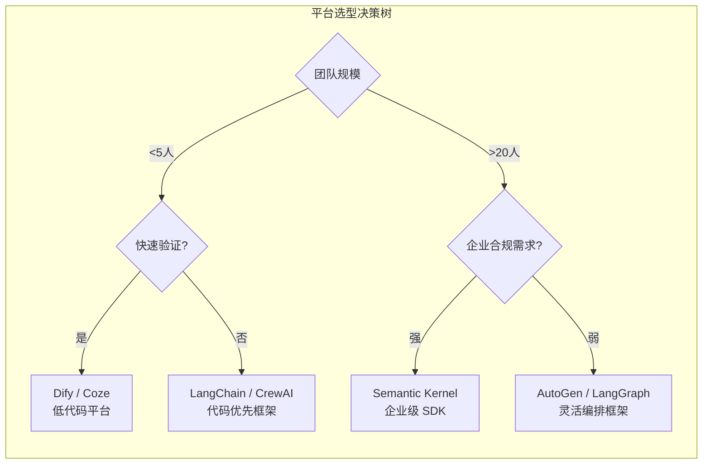

# 第 21 章 Agent 生态与平台

本章全景式地分析 Agent 生态系统与平台——从云厂商到开源社区，从开发框架到部署平台。理解生态格局有助于做出正确的技术选型和投资决策。本章覆盖主流 Agent 平台对比、生态系统成熟度评估、平台锁定风险分析和混合架构策略。前置依赖：第 20 章协议与标准。

---

## 21.1 Agent 平台架构

**图 21-1 Agent 平台技术栈全景**——选择平台时，不应只关注框架层的易用性，还需评估其在协议支持、运行时安全和可观测性方面的成熟度。

### 21.1.1 平台核心组件

一个生产级 Agent 平台由以下核心组件构成：

| 组件 | 职责 | 关键能力 |
|------|------|---------|
| **Agent 运行时** | 执行 Agent 逻辑，管理生命周期 | 沙箱隔离、资源限制、优雅停机 |
| **注册与发现** | 管理 Agent 元数据，支持能力查找 | Manifest 验证、版本管理、健康检查 |
| **模型网关** | 统一多模型提供商访问 | 负载均衡、降级链、成本追踪 |
| **协议网关** | 处理 MCP/A2A 等协议通信 | 消息路由、协议转换、安全策略 |
| **平台适配器** | 连接外部渠道（Slack/Teams/Email） | 消息规范化、Webhook 管理 |
| **编排引擎** | DAG 工作流定义与执行 | 条件分支、并行执行、错误处理 |
| **企业集成** | SSO/DLP/审计/合规 | 身份认证、数据分类、操作审计 |
| **Marketplace** | Agent 发布、分发与变现 | 安全审查、依赖解析、计费模型 |

完整的平台类型定义（`AgentPlatform`、`Lifecycle` 接口、`TenantManager` 多租户管理器等）见代码仓库 `code-examples/ch21/platform-core/` 目录，核心设计要点如下：

- **`AgentPlatform`** 通过拓扑排序确保组件按依赖顺序启动，启动失败时自动回滚已启动的组件。
- **`TenantManager`** 实现多租户的资源隔离（计算、存储、API 调用配额）和 Token Bucket 限流。
- 每个组件实现统一的 `Lifecycle` 接口（`start` / `stop` / `healthCheck`），平台统一管理所有组件的生命周期。

### 21.1.2 框架选型工程实践

选择 Agent 框架时，团队应重点考察以下实践维度而非仅看 GitHub stars：

**调试体验**：LangChain 的 LangSmith 提供了业界最完善的 trace 可视化；AutoGen 的调试依赖日志输出，对复杂多 Agent 场景不够直观；Semantic Kernel 继承了 .NET 生态的成熟调试工具链。

**错误处理**：CrewAI 的高层抽象在 happy path 上体验良好，但当底层出错时，堆栈追踪往往难以定位根因。LangGraph 由于基于显式状态机，错误定位相对容易。

**性能开销**：框架自身的 overhead 在简单场景中可以忽略，但在复杂场景（10+ 步、多 Agent 协作）中可能达到 10-20% 的额外延迟和 token 消耗。

**迁移成本**：最佳实践是在框架之上建立一层薄适配层，将业务逻辑与框架 API 解耦（参见 §11.3 框架抽象层）。

> **与第 20 章的衔接**：第 20 章定义的 Agent 互操作协议（A2A、MCP 等）是 Agent 之间通信的**语言**；本章的 AgentPlatform 则是这些 Agent 运行和通信的**场地**。

---

## 21.2 Agent 注册与发现

### 21.2.1 从简单注册表到企业级服务

在生产环境中，Agent 注册系统需要远超简单 `Map<string, Agent>` 的能力：健康检查、能力发现、版本管理、依赖追踪，以及结构化的 **Agent Card**（参见第 20 章 A2A 协议）。

### 21.2.2 Agent Manifest 规范

Agent Manifest 是描述 Agent 能力、依赖和运行需求的结构化文档，类似 `package.json` 之于 Node.js 包。一个完整的 Manifest 包含以下关键字段：

| 字段 | 说明 | 示例 |
|------|------|------|
| `id` / `name` | 唯一标识和人类可读名称 | `@org/code-reviewer` |
| `version` | 语义化版本号 | `2.1.0` |
| `capabilities` | Agent 能力列表（名称 + 描述 + 输入输出 schema） | `[{ name: 'code_review', ... }]` |
| `dependencies` | 依赖的其他 Agent 或 MCP Server | `[{ agentId: '@org/linter', version: '^1.0' }]` |
| `runtime` | 运行时需求（内存、CPU、GPU、环境变量） | `{ memory: '2Gi', cpu: '1000m' }` |
| `security` | 安全要求（权限、数据分类、网络策略） | `{ permissions: ['fs:read'], dataClassification: 'internal' }` |

完整的 Manifest 类型定义、验证器和企业级 `AgentRegistryService`（包含能力索引、语义搜索和负载均衡式实例解析）见代码仓库 `code-examples/ch21/registry/` 目录。

> **与第 11 章的关联**：本节的 Agent Manifest 和能力发现机制，可以作为统一描述和比较不同框架所构建 Agent 的标准化方式。无论使用 LangChain、AutoGen 还是自研框架，Agent 都可以通过 Manifest 注册到统一的注册中心。

---

## 21.3 Agent Marketplace

**图 21-2 Agent 平台选型决策树**——没有"最好"的框架，只有最匹配团队阶段和场景需求的选择。

### 21.3.1 Marketplace 架构概述

Agent Marketplace（应用市场）是 Agent 生态系统的**商业枢纽**，让开发者能够发布、分发和变现 Agent，同时让用户能够发现、试用和部署所需的 Agent。Marketplace 的核心职责包括：

| 职责 | 说明 |
|------|------|
| **发布管理** | Agent 提交、版本管理、上下架控制 |
| **安全审查** | 多阶段审查流水线（完整性 → 权限 → 漏洞扫描 → 数据合规 → 静态分析 → 信任评估） |
| **依赖解析** | 包管理器式的依赖解析和兼容性检查 |
| **计费模型** | 按调用次数、订阅制、免费增值等多种变现方式 |
| **搜索发现** | 基于能力、分类、评分的 Agent 搜索 |

完整的 Marketplace 类型定义、安全审查流水线（`SecurityReviewPipeline`）和包管理器（`AgentPackageManager`）实现见代码仓库 `code-examples/ch21/marketplace/` 目录。

### 21.3.2 实战案例：Smithery.ai — MCP Server 注册中心

随着 MCP 生态的爆发式增长，**如何发现和管理数以千计的 MCP Server** 成为关键问题。Smithery.ai 是解决这一问题的事实标准注册中心，其角色类似于 npm 之于 Node.js 包。

**平台规模**：截至 2025 年中，Smithery 已收录 **3,000+ MCP Server**，涵盖数据库连接器、API 集成、文件系统工具、搜索引擎等各类能力。

**安装体验**：Smithery 提供了类似 npm 的 CLI 工具（`npx @smithery/cli install @anthropic/filesystem-server`），支持一键安装、配置和更新。

**部署模式**：支持两种模式——**本地运行**（MCP Server 作为本地进程，适合开发调试）和 **Smithery 托管**（Server 运行在 Smithery 云端，通过代理连接，适合免运维场景）。

**安全考量**：作为开放注册中心，Smithery 面临与 npm 类似的供应链安全挑战。社区已报告过部分 MCP Server 存在路径遍历漏洞。安全建议包括：最小权限原则、沙箱运行、安装前审查源码、关注安全评分、锁定版本。企业如果要大规模采用 MCP Server，建议在 Smithery 之上叠加自建的安全审查流程（参见 `SecurityReviewPipeline`）。

---

## 21.4 平台适配器

### 21.4.1 为什么需要平台适配器

Agent 最终需要通过具体的**渠道**与用户交互。不同的渠道（Slack、Teams、Email、Web 等）有着完全不同的消息格式、认证方式和交互模型。平台适配器的核心职责包括：消息规范化（各平台格式 → 统一的 `NormalizedMessage`）、事件路由（将平台事件路由到正确的 Agent）、生命周期管理（统一管理多个适配器的启停）和 Webhook 管理。

### 21.4.2 适配器架构

适配器层采用统一的 `PlatformAdapter` 接口和 `AbstractAdapter` 基础类设计。每个具体适配器（Slack、Teams、Email、WebSocket 等）实现平台特定的消息收发逻辑，同时通过 `MessageNormalizer` 将消息转换为统一格式。`AdapterManager` 统一管理所有适配器实例，`EventRouter` 基于规则将消息路由到目标 Agent。

以下表格总结了各平台适配器的核心差异：

| 平台 | 消息格式 | 认证方式 | 交互模型 | 特殊能力 |
|------|---------|---------|---------|---------|
| **Slack** | Block Kit JSON | OAuth 2.0 + Bot Token | 事件订阅 + Slash 命令 | 线程回复、Emoji 反应、文件上传 |
| **Teams** | Adaptive Card | Azure AD + Bot Framework | Activity Handler | @mention 触发、Tab 集成、Meeting 扩展 |
| **Email** | MIME (text/html) | IMAP/SMTP + OAuth | 轮询/推送 | 附件处理、HTML 富文本、线程化 |
| **WebSocket** | 自定义 JSON | Token / Session | 全双工实时 | 低延迟推送、连接状态管理 |

完整的适配器接口定义、各平台实现和 `AdapterManager` 见代码仓库 `code-examples/ch21/adapters/` 目录。

> **平台适配的启示**：将"平台适配"做到极致是 Agent 工程化的重要方向。通过 Gateway 守护进程 + Plugin 架构，可以开箱即用地支持 20+ 消息平台。结合 MCP 兼容工具，Agent 可以通过统一的 Plugin 接口连接任意渠道。

---

## 21.5 Agent Mesh

### 21.5.1 从服务网格到 Agent 网格

服务网格（Service Mesh）是微服务架构中的基础设施层，负责处理服务间通信。Agent Mesh 将这一理念引入 Agent 系统，提供：

- **Sidecar 模式**：每个 Agent 旁附加一个代理（`AgentSidecar`），拦截所有出入流量，自动注入认证、限流、日志和追踪
- **流量管理**：`AgentTrafficManager` 支持金丝雀发布（按百分比分流）、A/B 测试（多版本对比）和基于 Header 的路由
- **弹性保护**：断路器防止级联失败（完整的分层断路器实现见第 18 章 §18.2.2）
- **可观测性**：自动注入 OpenTelemetry 追踪 span 和指标收集

这种基础设施级的关注点分离让 Agent 开发者专注于业务逻辑，而通信安全、流量控制、可观测性等横切关注点由 Mesh 层统一处理。完整的 `AgentMesh`、`AgentSidecar` 和 `AgentTrafficManager` 实现见代码仓库 `code-examples/ch21/mesh/` 目录。

---

## 21.6 模型网关

### 21.6.1 为什么需要统一模型网关

在一个 Agent 平台中，不同的 Agent 可能使用不同的模型提供商（OpenAI、Anthropic、Google、本地部署模型等）。直接对接每个提供商会导致接口碎片化、运维复杂度高、成本失控和可靠性风险。模型网关（Model Gateway）是一个中心化的模型访问层，对上层 Agent 提供统一 API，对下层管理多个模型提供商。

### 21.6.2 模型网关核心能力

| 能力 | 说明 | 实现方式 |
|------|------|---------|
| **统一 API** | 屏蔽各提供商 API 差异 | `ProviderAdapter` 接口 + 各提供商适配器 |
| **智能路由** | 按模型能力、延迟、成本选择最优提供商 | 路由策略配置 + 实时性能数据 |
| **降级链** | 主提供商故障时自动切换到备选 | `FallbackChainExecutor`，支持多级降级 |
| **成本追踪** | 精确到请求级别的 Token 消耗和费用统计 | `CostTracker`，按模型、Agent、租户聚合 |
| **语义缓存** | 相似请求复用响应，降低成本和延迟 | 向量相似度匹配 + TTL 缓存 |
| **限流与配额** | 防止单一 Agent 或租户耗尽资源 | Token Bucket + 租户级配额 |

完整的模型网关实现（`ModelGateway`、`ProviderAdapter` 接口及各提供商适配器、`FallbackChainExecutor`）见代码仓库 `code-examples/ch21/model-gateway/` 目录。

---

## 21.7 Agent 编排平台

### 21.7.1 低代码编排的价值

对于非技术用户或快速原型场景，通过代码编排 Agent 工作流门槛过高。Agent 编排平台提供**可视化、声明式**的工作流定义方式，支持 DAG 工作流、条件分支、并行执行、错误处理（重试/超时/降级）和模板库。完整的工作流类型系统（`WorkflowDefinition`）、执行引擎（`WorkflowExecutor`）和模板库（`WorkflowTemplateLibrary`）见代码仓库 `code-examples/ch21/orchestration/` 目录。

### 21.7.2 商业平台概览

除了自建编排平台，企业也可以选择商业化的 Agent 构建平台：

**Microsoft Copilot Studio**

Copilot Studio（原 Power Virtual Agents 的演进）面向企业 IT 团队和业务分析师，提供无代码/低代码的 Agent 构建界面。核心优势在于与 Microsoft 365 生态的深度集成——Agent 可以直接访问 SharePoint 文档、Outlook 邮件、Teams 对话和 Dynamics 365 数据。核心特性包括：Custom Copilots（基于企业知识库的定制化 AI 助手）、Plugin 生态（复用 Power Platform 1,400+ 企业连接器）、Teams 深度集成、Generative AI 编排和 Azure AD 安全治理。定价约 **$200/用户/月**（包含 25,000 条消息）。

> **适用场景**：企业内部 IT 帮助台、HR 自助服务、知识库问答、审批流程自动化。适合已深度使用 Microsoft 365 的组织。

**Salesforce Agentforce**

Agentforce（2024 年 9 月发布）是 CRM 巨头 Salesforce 推出的 AI Agent 平台。其核心是 **Atlas Reasoning Engine**——一个结合了链式推理与 CRM 数据上下文的推理引擎。Agent 在处理客户问题时，会自动关联客户的历史订单、服务记录和偏好等结构化数据。预置 Agent 类型包括 Service Agent（客户服务）、Sales Agent（销售辅助）、Commerce Agent（电商购物）和 Marketing Agent（营销自动化）。定价从最初的按对话计费（$2/次）转向 **Flex Credits 消费模型**，反映了 Agent 平台定价的行业趋势——从简单按次计费转向更灵活的消费式计费。

> **适用场景**：已部署 Salesforce CRM 的企业。Agentforce 的最大优势在于与 CRM 数据的原生集成——Agent 天然理解客户上下文，无需额外的数据管道。

---

## 21.8 企业集成模式

### 21.8.1 企业级 Agent 系统的特殊要求

将 Agent 系统部署到企业环境，需要满足一系列额外的非功能性要求：

| 要求 | 具体内容 | 关键实现 |
|------|---------|---------|
| **身份认证与授权** | SSO/SAML/OIDC 集成，基于角色的访问控制 | `AuthProvider` 统一身份认证 |
| **数据治理** | 数据分类、数据防泄漏（DLP）、数据驻留 | `DataClassificationEngine` 自动识别敏感信息 |
| **审计合规** | 完整的操作审计日志，满足 SOC 2、GDPR | `AuditLogger` 记录每一次关键操作 |
| **合规检查** | 持续验证合规状态 | `ComplianceChecker` 生成合规报告 |
| **密钥管理** | 安全的 API 密钥和凭据管理 | 集成 Vault / KMS |
| **网络安全** | VPC 隔离、TLS 加密、IP 白名单 | 基础设施层配置 |

`EnterpriseIntegrationManager` 统一管理以上所有企业集成组件。`DataClassificationEngine` 通过正则模式和上下文分析自动识别身份证号、手机号、API 密钥、银行卡号等敏感信息，支持 `public / internal / confidential / restricted` 四级数据分类。`ComplianceChecker` 针对 SOC 2、GDPR、HIPAA 等合规框架持续验证系统状态，生成可审计的合规报告。

完整的企业集成管理器、认证提供者、数据分类引擎、审计日志系统和合规检查器实现见代码仓库 `code-examples/ch21/enterprise/` 目录。

> **与第 22 章的衔接**：本节从**系统层面**保障了 Agent 平台的安全和合规。第 22 章"Agent Experience 设计"将从**用户体验层面**探讨如何让 Agent 在满足这些企业约束的同时，依然提供流畅、直觉的交互体验。

---

## 21.9 新兴 Agent 产品与平台

2025–2026 年涌现了一批值得关注的 Agent 产品和平台特性，代表了 Agent 技术从基础设施走向终端用户的关键趋势。

### 21.9.1 OpenAI Codex

**[[OpenAI Codex]](https://openai.com/index/introducing-codex/)** 是 OpenAI 推出的全自主编码 Agent 平台。与早期的代码补全工具不同，Codex 是一个完整的 Agent 系统：云端沙箱执行（每个任务在隔离环境中运行）、后台自主运行（用户提交任务后 Agent 独立工作）、端到端软件工程（从需求理解到 PR 创建）、多文件协调修改。Codex 的架构体现了一个关键理念：**将 Agent 放入受控的执行环境中，赋予其足够的工具和权限来自主完成复杂任务，同时通过沙箱隔离确保安全性**。

### 21.9.2 Claude CoWork

**Claude CoWork** 是 Anthropic 推出的多 Agent 协作工作区功能。它允许用户将子任务委派给多个并行运行的子 Agent，主 Agent 汇总结果生成统一输出。CoWork 是第 9–10 章讨论的 **Orchestrator-Worker 模式**在商业产品中的直接体现，降低了多 Agent 协作的使用门槛。

### 21.9.3 Microsoft Connected Agents

**[[Microsoft Connected Agents]](https://www.microsoft.com/en-us/microsoft-copilot/blog/copilot-studio/introducing-connected-Agents-for-copilot-studio/)** 是 Azure AI Foundry 推出的 Agent 互操作特性，解决企业中不同团队、不同平台构建的 Agent 之间的协作问题：跨平台互操作、统一注册与发现、安全委派和生态连接。这一特性与本章 §21.5 的 Agent Mesh 概念高度契合，也与第 20 章的 Agent 互操作协议形成互补。

### 21.9.4 Manus

**[[Manus]](https://manus.im/)** 定位为"通用 AI Agent"，能够处理从信息研究、数据分析到内容创作的多种任务，支持自主浏览网页、填写表单、生成可用的交付物（文档、表格、报告等）。Manus 展示了 **Agent 作为消费级产品**的可能性——Agent 技术可以直接服务于终端用户，这一趋势值得所有 Agent 工程团队关注。

> **新兴平台启示**：上述产品共同指向两大趋势：（1）**自主性增强**——Agent 从辅助工具进化为能独立完成复杂任务的自主系统；（2）**协作成为标配**——多 Agent 协作不再是研究课题，而是商业产品的核心卖点。

---

## 21.10 本章小结

### 核心要点

| 要点 | 说明 |
|------|------|
| **平台即基础设施** | Agent 平台涵盖运行时管理、多租户隔离、资源配额，`AgentPlatform` 通过拓扑排序和回滚机制保证可靠启动 |
| **注册与发现是生态的神经系统** | `AgentManifest` 标准化描述能力和依赖，`AgentRegistryService` 提供能力索引和语义搜索 |
| **Marketplace 是商业引擎** | 多阶段安全审查 + 依赖解析 + 多种计费模型，确保生态质量和商业可持续性 |
| **适配器模式统一多平台** | `PlatformAdapter` 接口 + `MessageNormalizer` 将 Slack/Teams/Email/WebSocket 消息归一化 |
| **Agent Mesh 借鉴服务网格** | Sidecar 自动注入认证/限流/追踪，断路器（§18.2.2）防止级联失败 |
| **模型网关统一多提供商** | 统一 API + 降级链 + 成本追踪，单一提供商故障不影响整体可用性 |
| **编排平台降低门槛** | DAG 工作流声明式定义，商业平台（Copilot Studio、Agentforce）加速企业落地 |
| **企业集成不是可选项** | SSO/DLP/审计/合规在企业部署中是必须的 |
| **生态构建是飞轮效应** | 平台 → 开发者 → Agent → 用户 → 更多开发者 → 生态壮大 |

### 下一章预告

第 22 章"Agent Experience 设计"将聚焦于 Agent 系统的用户体验层面——AX 设计原则、对话设计模式、反馈与控制、可解释性、渐进式信任建立。在本章构建的坚实平台基础之上，第 22 章将赋予这些 Agent 以"温度"——让技术能力转化为优秀的用户体验。
