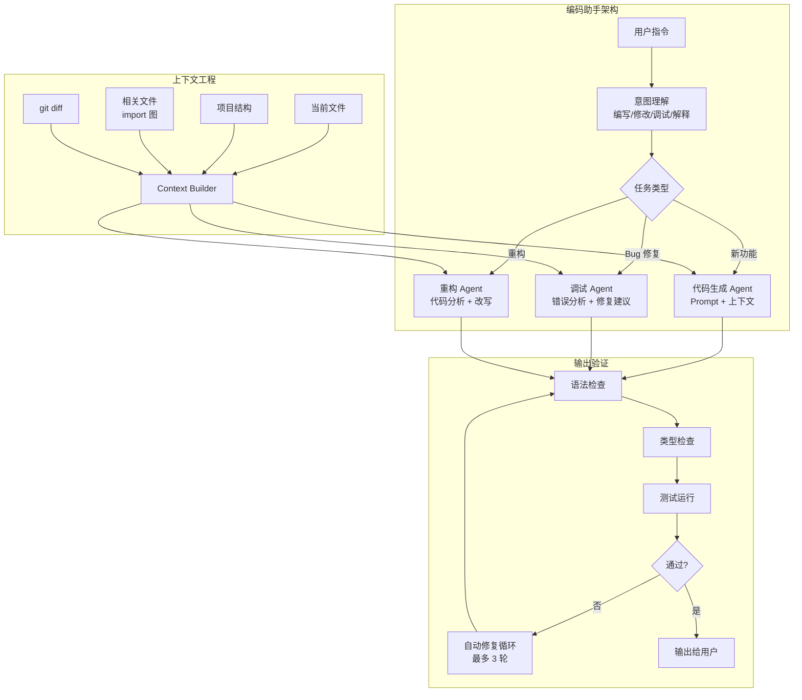
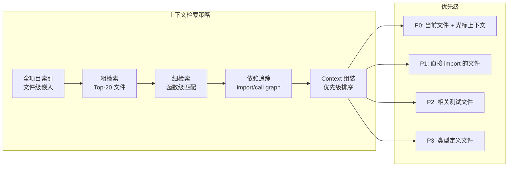

# 第 23 章 实战案例——智能编码助手

本章以编码助手为案例，完整展示一个生产级 Agent 从需求分析到上线运营的全过程。编码助手是当前最成熟的 Agent 应用场景之一，Cursor、GitHub Copilot、Claude Code 等产品已经验证了其商业价值。本章将前述章节的架构模式、安全策略、评估方法整合为一个端到端实现。前置依赖：Part 1–9 的核心概念。

---

## 23.1 项目概述与目标



**图 23-1 编码助手系统架构**——编码助手的核心挑战不在于代码生成本身，而在于上下文工程——如何在有限的 token 预算内提供最相关的项目上下文。


智能编码助手是最成功的 AI Agent 应用之一。从 GitHub Copilot 到 Cursor，编码助手已经从简单的自动补全进化为具备项目级理解能力的智能开发伙伴。

### 23.1.1 能力矩阵

| 能力层级 | 描述 | 示例 |
|---------|------|------|
| L1 代码补全 | 行级/块级补全 | Tab 补全、snippet 建议 |
| L2 代码生成 | 函数级生成 | 根据注释生成完整函数 |
| L3 代码理解 | 项目级理解 | 跨文件重构、架构分析 |
| L4 任务执行 | 端到端任务 | 从 issue 到 PR 的完整流程 |
| L5 协作开发 | 自主开发者 | 独立完成 feature 开发 |

### 23.1.2 系统架构

```
┌─────────────────────────────────────────────────┐
│                  IDE Extension                   │
│  ┌──────────┐ ┌──────────┐ ┌──────────────────┐│
│  │Code Panel │ │Chat View │ │ Inline Suggest   ││
│  └──────────┘ └──────────┘ └──────────────────┘│
    // ... 完整实现见 code-examples/ 目录 ...
│  │  Index   │ │          │ │                   ││
│  └──────────┘ └──────────┘ └──────────────────┘│
└─────────────────────────────────────────────────┘
```

## 23.2 代码库索引系统


### 编码助手的关键设计决策

**决策 1：流式输出 vs 完整输出**
编码助手几乎必须采用流式输出——用户期望看到代码"逐行写出"，这不仅降低了感知延迟，还允许用户在生成过程中提前判断方向是否正确并及时中断。但流式输出也带来了挑战：如何在部分生成的代码上运行语法检查？实践中的折中方案是"延迟验证"——累积到完整语句或代码块后再触发增量检查。

**决策 2：Apply 模式 vs Diff 模式**
直接输出完整代码（Apply）简单但浪费 token；输出 diff 节省 token 但容易因行号偏移导致应用失败。主流方案是"搜索-替换"模式：输出需要替换的代码片段和替换后的内容，由工具端执行精确匹配和替换。


### 23.2.1 代码库索引器

```typescript
interface FileNode {
  path: string;
  language: string;
  symbols: Symbol[];
  imports: Import[];
    // ... 完整实现见 code-examples/ 目录 ...
    return results.filter(s => { tokenCount += s.tokenEstimate; return tokenCount <= budget; });
  }
}
```

## 23.3 代码生成与编辑



**图 23-2 编码助手上下文检索策略**——Cursor、GitHub Copilot 等产品的核心竞争力差异，很大程度上体现在上下文检索策略的精细度上。


### 23.3.1 Diff 生成器

编码助手的核心能力是精确地生成代码变更。与生成完整文件不同，Diff 模式只描述需要修改的部分：

```typescript
interface CodeEdit {
  file: string;
  edits: EditOperation[];
}

    // ... 完整实现见 code-examples/ 目录 ...
    return readFile(file, 'utf-8');
  }
}
```

### 23.3.2 自动化测试运行

```typescript
class TestRunner {
  async runRelevantTests(edits: CodeEdit[]): Promise<TestResult> {
    // 确定受影响的测试文件
    const affectedTests = await this.findAffectedTests(edits);
    
    // ... 完整实现见 code-examples/ 目录 ...
    return testFiles;
  }
}
```

## 23.4 多 Agent 协作流程


### 编码助手的评估体系

编码助手的质量评估比通用 Agent 更复杂，因为"好代码"本身就是多维的：

| 评估维度 | 指标 | 测量方式 |
|---------|------|---------|
| **正确性** | 编译通过率、测试通过率 | 自动化 CI |
| **相关性** | 是否解决了用户的实际问题 | 人工评审 + A/B 测试 |
| **代码质量** | 可读性、是否遵循项目规范 | Linter 分数 + 人工评审 |
| **效率** | 生成速度、首 token 延迟 | 自动化计时 |
| **安全性** | 是否引入已知漏洞 | SAST 扫描 |
| **采纳率** | 用户实际使用生成代码的比例 | 产品埋点 |

其中**采纳率**是最重要的北极星指标——它综合反映了正确性、相关性和代码质量。行业标杆：GitHub Copilot 的代码建议采纳率约 30-35%。


### 23.4.1 从 Issue 到 Pull Request

```typescript
class CodingAgent {
  private planner: TaskPlanner;
  private coder: DiffGenerator;
  private reviewer: CodeReviewer;
  private tester: TestRunner;
    // ... 完整实现见 code-examples/ 目录 ...
    ].join('\n\n');
    return { branch: branchName, title, body, files: edits.map(e => e.file), isDraft: true };
  }
```

## 23.5 上下文工程实践

### 23.5.1 动态上下文选择策略

```typescript
class CodingContextManager {
  // 根据任务类型动态选择上下文策略
  selectStrategy(task: CodingTask): ContextStrategy {
    switch (task.type) {
      case 'completion':
    // ... 完整实现见 code-examples/ 目录 ...
    }
  }
}
```

## 23.6 性能优化与用户体验

### 23.6.1 关键性能指标

| 指标 | 目标值 | 优化策略 |
|------|--------|---------|
| 补全延迟 | < 200ms | 预测性预加载、模型缓存 |
| 生成延迟 | < 2s (首 token) | 流式输出、推测解码 |
| 索引速度 | < 30s (10万行) | 增量索引、并行解析 |
| 接受率 | > 30% | 上下文质量优化 |
| 代码质量 | 0 type error | 实时类型检查集成 |

### 23.6.2 度量与持续改进

```typescript
class CodingAssistantMetrics {
  track(event: AssistantEvent): void {
    switch (event.type) {
      case 'suggestion_shown':
        this.record('suggestions_total', 1);
    // ... 完整实现见 code-examples/ 目录 ...
    return result;
  }
}
```

## 23.7 小结

智能编码助手的核心挑战在于：

1. **上下文精确性**：在有限的 token 预算内提供最相关的代码上下文
2. **编辑精确性**：生成的代码变更必须在语法和语义上正确
3. **反馈循环**：通过测试验证和用户反馈持续改进
4. **延迟敏感**：开发者体验对延迟极其敏感，需要精心优化

编码助手是 Agent 技术的最佳试验场——它需要工具使用、上下文工程、多步推理、反馈循环等所有核心能力的协同工作。


## 23.8 Agentic Coding 范式：从自动补全到自主 Agent

### 23.8.1 编程助手的演进路径

编程助手经历了四个清晰的代际演进，每一代都重新定义了人机协作的边界：

```
第一代（2021-2022）：自动补全
├── 代表：GitHub Copilot v1
├── 能力：行内 / 块级代码补全
├── 交互：Tab 接受或忽略
└── 局限：无上下文理解，建议质量不稳定
    // ... 完整实现见 code-examples/ 目录 ...
├── 能力：从 Issue 到 PR 的端到端自主完成
├── 交互：任务描述 → 自主规划、实现、测试、提交
└── 特征：长时运行、自主决策、人类监督式协作
```

### 23.8.2 L1-L5 编码能力分级详解

本书第 1 章定义了 Agent 通用的 L1-L5 能力分级。在编程助手领域，这一分级有其特定的内涵：

| 级别 | 能力 | 典型任务 | 人类参与度 | 代表产品 |
|------|------|---------|-----------|---------|
| L1 代码补全 | 行级 / 块级补全 | 补完当前行、补全函数体 | 95%——每行审核 | Copilot v1 |
| L2 代码生成 | 函数级 / 文件级生成 | 根据注释或描述生成完整函数 | 80%——逐函数审核 | Copilot Chat |
| L3 项目理解 | 跨文件编辑、重构 | 多文件重命名、接口变更传播 | 50%——审核关键变更 | Cursor、Windsurf |
| L4 任务执行 | 从 Issue 到 PR | 理解需求 → 规划 → 实现 → 测试 | 20%——审核最终 PR | Claude Code、Codex |
| L5 协作开发 | 自主特性开发 | 参与设计讨论、独立完成 feature | 5%——架构决策 | 尚未完全实现 |

> **设计决策：渐进自主（Progressive Autonomy）**
>
> 生产级编码助手不应固定在某个级别，而应根据任务复杂度和风险等级动态调整自主程度。简单的格式化、重命名操作可以 L4 级自主完成；涉及数据库 schema 变更或 API 破坏性改动的任务则应回退到 L2-L3，要求人类逐步确认。这种渐进自主策略在第 14 章信任架构中有详细讨论。

### 23.8.3 Agentic Coding 的工程挑战

从对话式编码到 Agentic Coding 的跃迁，带来了一系列新的工程挑战：

```typescript
// Agentic Coding 核心挑战与解决策略
interface AgenticCodingChallenges {
  // 挑战 1：确定性要求——代码必须编译通过、测试通过
  determinism: {
    problem: '自然语言的模糊性 vs 代码的精确性';
    // ... 完整实现见 code-examples/ 目录 ...
    solution: '命令白名单 + 沙箱执行 + 人工确认高危操作';
  };
}
```

## 23.9 Repository Intelligence：项目级理解

### 23.9.1 代码库全局理解系统

Repository Intelligence 是第四代编码助手的核心能力——Agent 不再只理解光标附近的代码，而是理解整个项目的架构、约定和设计意图：

```typescript
interface RepositoryUnderstanding {
  // 项目结构
  structure: {
    framework: string;          // 'Next.js' | 'Express' | 'NestJS' | ...
    language: string;           // 'TypeScript' | 'Python' | ...
    // ... 完整实现见 code-examples/ 目录 ...
    }));
  }
}
```

### 23.9.2 上下文预算分配策略

编码助手面临的核心难题是 token 预算有限（通常 8K-32K 用于上下文），但需要展示的信息可能远超预算。因此需要精细的预算分配策略：

```typescript
interface ContextBudget {
  total: number;
  allocation: {
    currentFile: number;      // 当前编辑文件
    importedTypes: number;    // 引入的类型定义
    // ... 完整实现见 code-examples/ 目录 ...
    return readFile(path, 'utf-8');
  }
}
```

### 23.9.3 项目约定感知（Convention-Aware Generation）

生成的代码必须与项目现有代码风格一致，否则即使功能正确也会被开发者拒绝：

```typescript
interface ProjectConventions {
  naming: {
    components: 'PascalCase';
    functions: 'camelCase';
    constants: 'UPPER_SNAKE_CASE';
    // ... 完整实现见 code-examples/ 目录 ...
    };
  }
}
```

## 23.10 多文件编辑工作流

### 23.10.1 编辑计划生成与执行

当 Agent 需要修改多个文件时，必须制定一个全局一致的编辑计划，而不是逐文件独立修改：

```typescript
interface EditPlan {
  id: string;
  description: string;
  steps: EditStep[];
  dependencyOrder: string[];  // 步骤执行顺序（考虑依赖关系）
    // ... 完整实现见 code-examples/ 目录 ...
    return `Completed ${results.length}/${plan.steps.length} steps successfully.`;
  }
}
```

### 23.10.2 编辑格式：Search/Replace 与 Diff

生产级编码助手通常使用两种编辑格式，各有优劣：

| 格式 | 优点 | 缺点 | 适用场景 |
|------|------|------|---------|
| **Search/Replace** | 位置无关（不依赖行号）、抗干扰 | 搜索内容需足够唯一 | 小范围精确修改 |
| **Unified Diff** | 标准格式、人类可读 | 依赖行号、容易偏移 | 大范围修改、代码审查 |
| **Full File** | 最简单、无歧义 | Token 消耗大、可能丢失内容 | 新建文件、小文件 |
| **AST Transform** | 语义级精确 | 实现复杂、语言相关 | 重命名、类型变更 |

```typescript
// Search/Replace 编辑格式实现
interface SearchReplaceEdit {
  file: string;
  search: string;   // 要搜索的精确内容
  replace: string;   // 替换后的内容
    // ... 完整实现见 code-examples/ 目录 ...
    return count;
  }
}
```

## 23.11 与 Git 和 CI/CD 集成

### 23.11.1 Git 工作流集成

```typescript
class GitIntegration {
  private execGit(command: string, cwd: string): string {
    const { execSync } = require('child_process');
    return execSync(`git ${command}`, { cwd, encoding: 'utf-8' }).trim();
  }
    // ... 完整实现见 code-examples/ 目录 ...
    return null;
  }
}
```

### 23.11.2 CI/CD 管线集成

```typescript
interface CIIntegration {
  // 在 CI 中运行 Agent 生成的变更
  runInCI(pr: PullRequest): Promise<CIResult>;
  // 基于 CI 结果自动修复
  autoFixFromCI(ciResult: CIResult): Promise<CodeEdit[]>;
    // ... 完整实现见 code-examples/ 目录 ...
    return [];
  }
}
```

## 23.12 评估体系

### 23.12.1 编码助手评估指标全景

| 评估维度 | 指标 | 描述 | 业界基准 |
|---------|------|------|---------|
| **代码正确性** | pass@k | k 次生成中至少 1 次通过测试的概率 | HumanEval pass@1 ≈ 90%+ |
| **任务完成** | SWE-bench | 真实 GitHub Issue 解决率 | Verified: 60-80% |
| **编辑精确性** | Exact Match | 生成的 Diff 与参考 Diff 完全匹配 | 40-60% |
| **用户接受率** | Acceptance Rate | 用户接受 Agent 建议的比例 | > 30% 为良好 |
| **效率提升** | Time Saved | 使用 Agent vs 手动完成的时间差 | 30-55% 时间节省 |
| **代码质量** | Quality Score | 生成代码的可维护性、可读性评分 | 无统一基准 |
| **安全性** | Vulnerability Rate | 生成代码中安全漏洞的比例 | < 1% |
| **延迟** | P50/P95 Latency | 从请求到首 Token / 完整响应 | P50 < 200ms (补全) |

### 23.12.2 自动化评估管线

```typescript
interface CodingBenchmark {
  name: string;
  tasks: CodingTask[];
  evaluator: TaskEvaluator;
}
    // ... 完整实现见 code-examples/ 目录 ...
    return 4.2; // 示例：4.2/5
  }
}
```

## 23.13 安全考量与沙箱设计

### 23.13.1 编码 Agent 安全威胁模型

编码助手具有独特的安全风险——它可以访问文件系统、执行终端命令、提交代码：

| 威胁 | 描述 | 缓解措施 |
|------|------|---------|
| **恶意代码注入** | Agent 生成包含后门的代码 | 代码审查 + 安全扫描 |
| **供应链攻击** | Agent 引入恶意依赖包 | 依赖白名单 + 漏洞扫描 |
| **数据泄露** | Agent 将代码库内容发送到外部 | 网络隔离 + 出口过滤 |
| **权限提升** | Agent 执行超权限操作 | 最小权限 + 命令白名单 |
| **破坏性操作** | Agent 删除文件或 force push | 操作确认 + 不可逆操作阻止 |
| **Prompt 注入** | 恶意代码注释诱导 Agent 行为 | 输入净化 + 指令隔离 |

```typescript
class CodingAgentSandbox {
  private allowedCommands: Set<string>;
  private blockedPatterns: RegExp[];
  private maxFileSize: number;

    // ... 完整实现见 code-examples/ 目录 ...
    };
  }
}
```

## 23.14 实际部署考量

### 23.14.1 生产环境部署清单

```markdown

## 编码助手生产部署清单

### 基础设施
- [ ] LLM API 配置（主模型 + 回退模型）
    // ... 完整实现见 code-examples/ 目录 ...
- [ ] 用户满意度调查
- [ ] 每周质量审查流程
- [ ] 模型版本升级流程
```

### 23.14.2 成本优化策略

| 优化策略 | 描述 | 预期节省 |
|---------|------|---------|
| **Token 缓存** | 相同上下文的重复查询缓存 | 20-40% |
| **模型分层** | 补全用小模型、复杂任务用大模型 | 30-50% |
| **增量索引** | 只重新索引变更的文件 | 70% 索引成本 |
| **请求合并** | 短时间内多次请求合并为一次 | 15-25% |
| **上下文裁剪** | 精确选择相关上下文，减少 token 浪费 | 20-30% |
| **预测性取消** | 用户继续输入时取消进行中的请求 | 10-20% |

```typescript
class CostOptimizer {
  private cache: Map<string, { result: string; timestamp: number }> = new Map();
  private readonly CACHE_TTL = 5 * 60 * 1000; // 5 分钟

  // 模型路由：根据任务复杂度选择模型
    // ... 完整实现见 code-examples/ 目录 ...
    }
  }
}
```

## 23.15 案例研究：构建一个 Mini Claude Code

### 23.15.1 端到端实现

下面我们构建一个简化版的 Claude Code 风格编码 Agent，展示核心架构的完整连接：

```typescript
class MiniClaudeCode {
  private indexer: CodebaseIndexer;
  private contextBuilder: SmartContextBuilder;
  private diffGenerator: DiffGenerator;
  private testRunner: TestRunner;
    // ... 完整实现见 code-examples/ 目录 ...
    }
  }
}
```

## 23.16 小结

智能编码助手是 AI Agent 技术最成功、最前沿的应用领域。本章从架构到实现、从评估到部署，完整呈现了一个生产级编码助手的设计要点：

1. **Repository Intelligence** 是核心能力——Agent 必须理解项目的架构、约定和设计意图，而不仅仅是光标附近的几行代码

2. **上下文工程是关键瓶颈**——在有限的token 预算内精确选择最相关的代码上下文，直接决定了生成质量。动态预算分配策略根据任务类型（补全、重构、调试、新功能）调整上下文组成

3. **编辑精确性要求严格**——与自然语言生成不同，代码编辑必须精确到字符级别。Search/Replace 模式、Diff 模式、AST 级变换各有适用场景

4. **安全沙箱不可或缺**——编码 Agent 拥有文件系统和终端访问权限，必须通过命令白名单、路径限制、安全扫描等手段防范风险

5. **反馈循环驱动质量**——编译检查 → 类型检查 → 测试运行 → 代码审查，每一层反馈都帮助 Agent 自我修正

6. **渐进自主是正确策略**——不是所有任务都需要 L4 级自主；根据任务复杂度和风险等级动态调整人机协作比例

7. **成本控制贯穿始终**——模型分层、Token 缓存、增量索引、请求合并等策略组合使用，确保在可接受的成本范围内提供最佳体验

编码助手是 Agent 工程的最佳练兵场——它同时需要上下文工程（第 5 章）、工具系统（第 6 章）、记忆管理（第 7 章）、信任架构（第 14 章）、评估体系（第 15-16 章）和成本工程（第 19 章）的综合运用。掌握编码助手的设计，就掌握了 Agent 工程的核心能力。
