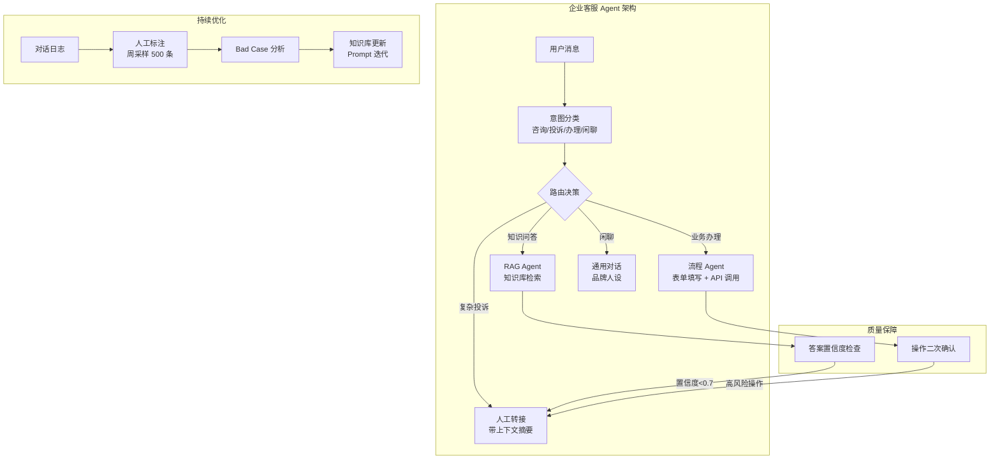
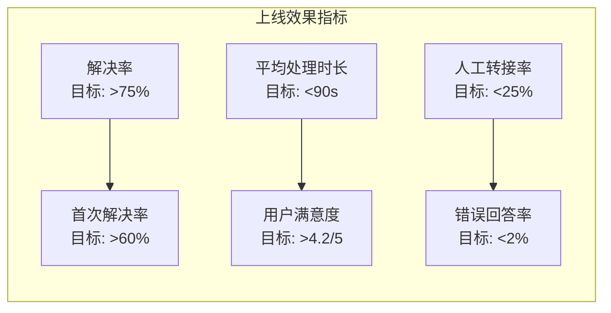

# 第 24 章 实战案例——企业客服系统

本章以企业客服 Agent 为案例，展示如何在合规要求严格的企业环境中构建可靠的 Agent 系统。客服场景的独特挑战在于：高并发、强合规、多轮对话、情感敏感和与遗留系统的深度集成。本章覆盖意图识别、知识库集成、人工转接策略、合规审计和客户满意度优化的完整实现。前置依赖：Part 1–9 的核心概念。

---

## 24.1 项目背景与挑战



**图 24-1 企业客服 Agent 系统架构**——企业客服场景的核心设计原则是"宁可转人工，不可答错"。置信度阈值和人工转接机制是系统的安全阀。


企业客服是 AI Agent 最早落地、规模最大的应用场景。与简单的 FAQ 机器人不同，现代智能客服需要处理复杂的多轮对话、跨系统操作和情感关怀。

### 24.1.1 核心挑战

| 挑战维度 | 具体问题 | 解决策略 |
|---------|---------|---------|
| 意图理解 | 用户表述模糊、多意图混合 | 层级意图分类 + 澄清对话 |
| 知识管理 | 产品信息频繁更新 | RAG + 知识图谱 + 自动同步 |
| 系统集成 | 跨多个后端系统操作 | MCP 工具标准化 + 事务管理 |
| 情感处理 | 用户情绪化、投诉升级 | 情感分析 + 动态升级策略 |
| 合规要求 | 金融/医疗等行业监管 | 输出过滤 + 审计追踪 |

## 24.2 系统架构设计


### 从 Demo 到生产的三个关键跨越

**跨越 1：从"能回答"到"敢回答"**
Demo 阶段，客服 Agent 只需展示它能回答问题。但生产环境要求的是：它能**正确**回答，并且在不确定时**主动拒绝**。这需要引入答案置信度评估机制——通常通过 LLM 自评 + 检索相关性分数的加权来实现。

**跨越 2：从单轮到多轮**
真实客服场景中，60% 以上的对话需要多轮交互才能解决。多轮对话的挑战在于：如何在不丢失上下文的前提下，准确追踪用户意图的变化（例如从"查询余额"转变为"投诉扣费"）。

**跨越 3：从通用到合规**
企业客服必须遵守行业法规（如金融行业的适当性义务、医疗行业的免责声明）。这些合规要求不能仅依赖 Prompt——需要在输出层增加规则引擎进行强制校验。


### 24.2.1 整体架构

```
┌─────────────────────────────────────────────────────┐
│                  Omni-Channel Gateway                │
│  ┌────────┐ ┌────────┐ ┌────────┐ ┌──────────────┐│
│  │  Web   │ │  App   │ │ WeChat │ │   Phone/IVR  ││
│  └────────┘ └────────┘ └────────┘ └──────────────┘│
    // ... 完整实现见 code-examples/ 目录 ...
│  │Agent     │ │Agent     │   │ ├────────────────┤ │
│  └──────────┘ └──────────┘   │ │ Audit Logger   │ │
└─────────────────────────────────────────────────────┘
```

## 24.3 意图分类与路由



**图 24-2 客服 Agent 核心指标体系**——注意错误回答率和用户满意度之间的张力：过度保守（频繁转人工）会降低解决率和满意度，过度激进会提高错误率。找到平衡点需要持续的 A/B 测试。


### 24.3.1 层级意图分类器

```typescript
interface IntentResult {
  primaryIntent: string;
  secondaryIntent?: string;
  confidence: number;
  entities: Record<string, string>;
    // ... 完整实现见 code-examples/ 目录 ...
    }
    return { ...response, content: sanitized };
  }
```

## 24.4 工单管理系统


### 客服 Agent 上线清单

基于多个企业客服 Agent 项目的经验，以下是上线前必须完成的检查项：

**知识库质量**
- [ ] 知识库覆盖率 >90%（按历史工单 Top 100 问题统计）
- [ ] 每条知识至少有 2 个变体查询可以召回
- [ ] 知识更新流程已建立（负责人 + 更新频率 + 审核机制）

**安全合规**
- [ ] 敏感词过滤规则已配置（行业特定 + 通用）
- [ ] 高风险操作已配置人工确认（退款、修改账户等）
- [ ] 隐私数据脱敏处理已实现（身份证、银行卡号等）

**兜底机制**
- [ ] 置信度阈值已根据测试数据校准（建议起步值 0.7）
- [ ] 人工转接流程已打通（含上下文摘要传递）
- [ ] 3 次澄清仍无法理解时自动转人工

**监控告警**
- [ ] 错误回答率实时监控（阈值：>5% 告警）
- [ ] 人工转接率趋势监控（突增可能表示知识库缺口）
- [ ] 用户满意度日报自动生成


### 24.4.1 智能工单处理

```typescript
interface Ticket {
  id: string;
  customerId: string;
  category: string;
  priority: 'P0' | 'P1' | 'P2' | 'P3';
    // ... 完整实现见 code-examples/ 目录 ...
    return slaMatrix[category]?.[priority] ?? slaMatrix.general.medium;
  }
}
```

## 24.5 质量保障体系

### 24.5.1 输出质量守卫

```typescript
class QualityGuard {
  private rules: QualityRule[];
  
  async validate(response: AgentResponse, context: CustomerSession): Promise<ValidationResult> {
    const results: RuleResult[] = [];
    // ... 完整实现见 code-examples/ 目录 ...
    }
  }
];
```

## 24.6 关键度量与运营

### 24.6.1 运营指标看板

| 指标类别 | 指标名称 | 目标值 | 计算方式 |
|---------|---------|--------|---------|
| 效率 | 自动解决率 | > 70% | 无人工介入的已解决会话占比 |
| 效率 | 平均处理时长 | < 3min | 从首条消息到解决的时长 |
| 质量 | 客户满意度 | > 4.5/5 | 会话后满意度评分 |
| 质量 | 首次解决率 | > 85% | 一次交互解决问题的比例 |
| 安全 | 幻觉（Hallucination）率 | < 1% | 引用错误信息的回复占比 |
| 安全 | 升级准确率 | > 95% | 正确升级到人工的比例 |

## 24.7 小结

企业客服 Agent 的成功关键：

1. **精确的意图理解**：多层级分类 + 实体抽取 + 情感分析
2. **可靠的知识管理**：RAG 确保回答有据可查，质量守卫防止幻觉
3. **灵活的升级机制**：AI 处理常规问题，人工处理复杂情况
4. **完善的运营体系**：持续监控、A/B 测试、反馈驱动改进


## 24.8 知识库与 RAG 集成

### 24.8.1 企业知识库架构

企业客服的核心能力是基于准确的知识回答问题。RAG（检索增强生成）是实现这一目标的关键技术。与通用 RAG 不同，客服场景的 RAG 需要处理多源、多格式、频繁更新的企业知识：

```typescript
interface KnowledgeSource {
  id: string;
  type: 'faq' | 'product_doc' | 'policy' | 'announcement' | 'training_script';
  name: string;
  updateFrequency: 'realtime' | 'daily' | 'weekly' | 'manual';
    // ... 完整实现见 code-examples/ 目录 ...
    return { toAdd: incoming, toUpdate: [], toRemove: [] };
  }
}
```

### 24.8.2 回答生成与引用标注

客服系统生成的每个回答都必须有据可查，避免幻觉：

```typescript
class AnswerGenerator {
  private model: LLMClient;
  private knowledgeBase: EnterpriseKnowledgeBase;

  async generateAnswer(
    // ... 完整实现见 code-examples/ 目录 ...
    return avgRelevance * 0.6 + citationCoverage * 0.4;
  }
}
```

## 24.9 多轮对话管理

### 24.9.1 对话状态机

复杂客服场景需要管理多轮对话的状态，确保在上下文切换时不丢失信息：

```typescript
type ConversationState =
  | 'greeting'
  | 'intent_identification'
  | 'information_gathering'
  | 'solution_providing'
    // ... 完整实现见 code-examples/ 目录 ...
    return extracted;
  }
}
```

### 24.9.2 对话摘要与上下文压缩

长对话需要定期压缩历史消息，避免超出 token 限制：

```typescript
class ConversationSummarizer {
  private model: LLMClient;

  async summarize(messages: Message[]): Promise<ConversationSummary> {
    if (messages.length <= 6) {
    // ... 完整实现见 code-examples/ 目录 ...
    return `[对话摘要] ${summary.summary}\n\n[以下为近期对话]`;
  }
}
```

## 24.10 情感分析与升级策略

### 24.10.1 实时情感监测

```typescript
interface SentimentSignal {
  score: number;        // -1 (极度负面) 到 +1 (极度正面)
  emotion: 'happy' | 'neutral' | 'frustrated' | 'angry' | 'anxious' | 'disappointed';
  trend: 'improving' | 'stable' | 'deteriorating';
  urgency: 'low' | 'medium' | 'high' | 'critical';
    // ... 完整实现见 code-examples/ 目录 ...
    return triggers;
  }
}
```

### 24.10.2 智能升级决策引擎

```typescript
interface EscalationDecision {
  shouldEscalate: boolean;
  reason: string;
  priority: 'P0' | 'P1' | 'P2' | 'P3';
  targetTeam: string;
    // ... 完整实现见 code-examples/ 目录 ...
    return order[priority] ?? 99;
  }
}
```

## 24.11 多渠道支持

### 24.11.1 全渠道消息适配

```typescript
interface ChannelAdapter {
  name: string;
  capabilities: ChannelCapability[];
  normalize(rawMessage: any): StandardMessage;
  format(response: AgentResponse): ChannelSpecificMessage;
    // ... 完整实现见 code-examples/ 目录 ...
    return `<speak>${text.replace(/。/g, '<break time="300ms"/>。')}</speak>`;
  }
}
```

## 24.12 合规与审计

### 24.12.1 审计日志系统

```typescript
interface AuditEntry {
  id: string;
  timestamp: number;
  sessionId: string;
  customerId: string;
    // ... 完整实现见 code-examples/ 目录 ...
    return durations.length > 0 ? durations.reduce((a, b) => a + b, 0) / durations.length : 0;
  }
}
```

### 24.12.2 PII 检测与脱敏

```typescript
class PIIDetector {
  private patterns: { name: string; regex: RegExp; replacement: string }[] = [
    { name: '手机号', regex: /1[3-9]\d{9}/g, replacement: '1**********' },
    { name: '身份证号', regex: /[1-9]\d{5}(?:19|20)\d{2}(?:0[1-9]|1[0-2])(?:0[1-9]|[12]\d|3[01])\d{3}[\dXx]/g, replacement: '******************' },
    { name: '银行卡号', regex: /\b\d{16,19}\b/g, replacement: '****-****-****-****' },
    // ... 完整实现见 code-examples/ 目录 ...
    return sanitized;
  }
}
```

## 24.13 成本分析与 ROI

### 24.13.1 AI 客服 vs 传统客服成本对比

| 成本项 | 传统呼叫中心 | AI 客服 Agent | 混合模式 |
|--------|-------------|--------------|---------|
| **座席人力成本** | ¥8,000-15,000/人/月 | ¥0 | ¥8,000-15,000 (减少 60-70%) |
| **LLM API 成本** | ¥0 | ¥0.5-2/会话 | ¥0.5-2/会话 |
| **向量数据库** | ¥0 | ¥2,000-5,000/月 | ¥2,000-5,000/月 |
| **基础设施** | ¥50,000+/月 | ¥15,000-30,000/月 | ¥40,000-60,000/月 |
| **培训成本** | ¥3,000-5,000/人 | ¥0 (知识库更新) | ¥1,000-2,000/人 |
| **扩容边际成本** | 线性增长 | 近零边际成本 | 较低增长 |
| **7×24 覆盖** | 3倍人力成本 | 无额外成本 | 仅夜间 AI 覆盖 |
| **多语言支持** | 每语言额外团队 | LLM 原生支持 | 混合 |

### 24.13.2 ROI 计算模型

```typescript
interface CostModel {
  monthly: {
    humanAgents: number;          // 人工座席数量
    humanCostPerAgent: number;    // 每位座席月成本
    aiApiCostPerSession: number;  // AI 每会话 API 成本
    // ... 完整实现见 code-examples/ 目录 ...
    return Math.ceil(buildCost / monthlySaving);
  }
}
```

## 24.14 运营指标监控系统

### 24.14.1 实时监控仪表盘

```typescript
interface DashboardMetrics {
  realtime: {
    activeSessions: number;
    queueLength: number;
    averageWaitTime: number;     // 秒
    // ... 完整实现见 code-examples/ 目录 ...
    return [0, 0, 0, 0, 0, 0, 0]; // 简化实现
  }
}
```

## 24.15 完整系统集成

### 24.15.1 企业客服 Agent 主流程

```typescript
class EnterpriseCustomerServiceAgent {
  private conversationManager: ConversationManager;
  private knowledgeBase: EnterpriseKnowledgeBase;
  private answerGenerator: AnswerGenerator;
  private sentimentAnalyzer: SentimentAnalyzer;
    // ... 完整实现见 code-examples/ 目录 ...
    return replies;
  }
}
```

## 24.16 小结

企业客服 Agent 是 AI Agent 技术在商业场景中最成熟的应用之一。本章从架构到实现、从技术到运营，完整呈现了一个生产级客服系统的设计要点：

1. **知识库是基石**——RAG 架构确保回答有据可查。混合检索（向量 + 关键词 + 结构化）、引用标注、过期内容过滤、权限控制，每一层都是防止幻觉的屏障

2. **多轮对话管理是核心**——状态机驱动的对话管理、槽位填充、话题切换检测、上下文压缩，确保长对话中信息不丢失

3. **情感分析驱动服务质量**——实时情感监测不仅用于升级决策，更用于调整回答语气和风格。趋势分析比单点分析更有价值

4. **智能升级是安全网**——多规则并行评估确保关键场景不被遗漏。升级不是失败，而是系统设计的重要组成部分。高质量的交接摘要让人工客服能够无缝接手

5. **全渠道适配是标配**——同一个 Agent 核心通过适配器模式服务于 Web、微信、电话、邮件等多个渠道，每个渠道有其特定的能力约束和格式要求

6. **合规审计贯穿始终**——PII 脱敏、审计日志、合规报告不是事后补充，而是架构的一部分。特别是金融和医疗行业，合规是上线的前提

7. **成本可控是前提**——AI 客服的核心价值在于大幅降低边际成本。清晰的 ROI 模型帮助团队做出正确的投资决策

8. **数据驱动持续改进**——通过指标监控发现知识库盲区、优化意图分类、调整升级阈值，形成持续改进的飞轮

> **设计决策：渐进式 AI 接管**
>
> 部署企业客服 Agent 时，建议采用渐进式策略而非一次性全量替换：
>
> - **第一阶段（月 1-2）**：AI 仅处理 FAQ 类简单问题（约占总量 30-40%），所有非确定性回答转人工
> - **第二阶段（月 3-4）**：AI 扩展到订单查询、状态跟踪等需要工具调用的场景（约占总量 50-60%）
> - **第三阶段（月 5-6）**：AI 处理投诉初筛、退款审核等复杂场景（约占总量 70-80%）
> - **第四阶段（持续）**：基于数据分析持续优化，AI 自动识别新的可自动化场景
>
> 每个阶段都应有明确的质量指标（CSAT > 4.2、幻觉率 < 1%、升级准确率 > 95%）作为晋级条件。这与第 14 章信任架构中讨论的渐进信任模型一脉相承。

### 24.16.1 生产部署清单

```markdown

## 企业客服 Agent 上线清单

### 知识库
- [ ] FAQ 知识库已导入并经过人工审核
    // ... 完整实现见 code-examples/ 目录 ...
- [ ] 渠道特定限制已处理（字数限制、格式限制）
- [ ] 跨渠道会话连续性已测试
- [ ] 高并发压力测试通过
```

企业客服 Agent 的核心价值不仅在于降低成本，更在于**标准化和一致性**——AI 不会因为情绪波动、知识盲区或疲劳而提供不一致的服务。当然，这种一致性必须建立在准确的知识库、可靠的质量守卫和完善的升级机制之上。正如本书反复强调的：**确定性外壳 （参见第 2 章：确定性外壳 / 概率性内核）包裹概率性内核**——在客服场景中，这个外壳就是知识库验证、PII 脱敏、合规过滤和升级规则；内核则是 LLM 的自然语言理解和生成能力。
