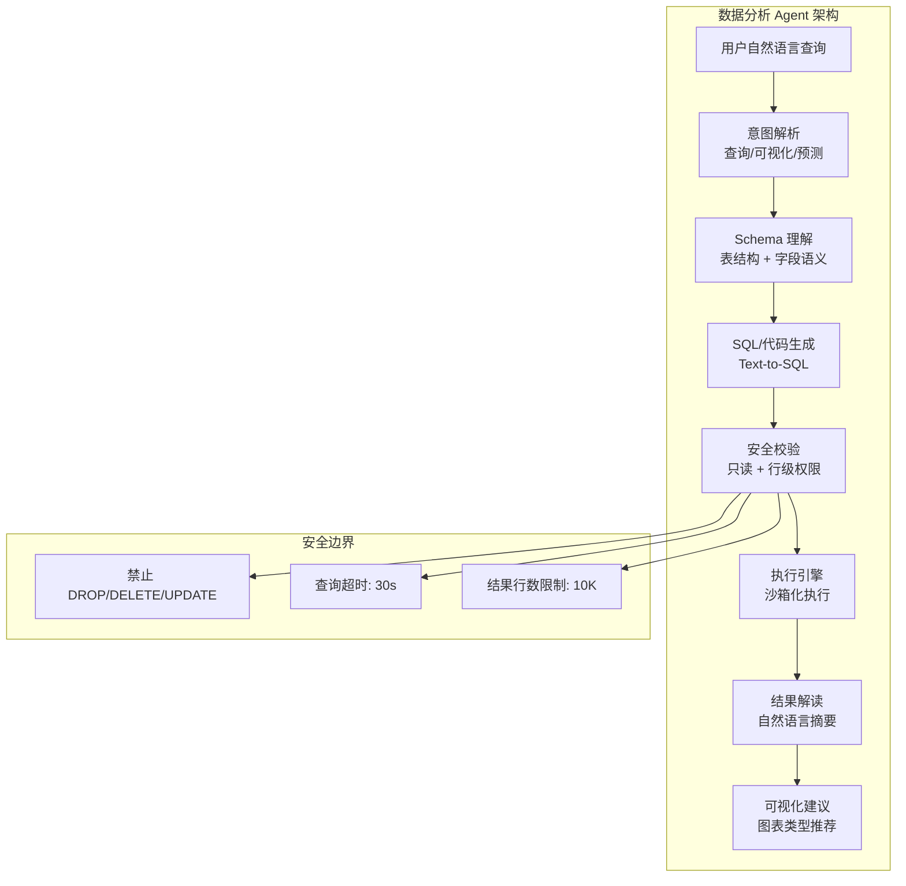
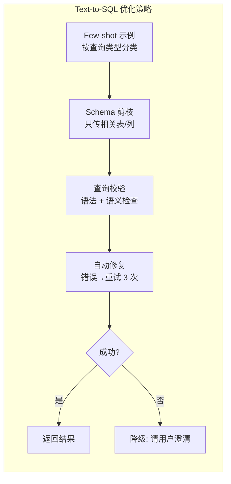

# 第 25 章 实战案例——数据分析 Agent

本章以数据分析 Agent 为案例，展示如何构建能够自主完成数据探索、分析和可视化的 Agent 系统。数据分析场景的独特挑战在于：结果正确性至关重要（幻觉不可接受）、需要动态生成和执行代码、数据安全和隐私保护要求高。本章覆盖自然语言转 SQL、代码沙箱执行、结果验证和交互式探索的完整实现。前置依赖：Part 1–9 的核心概念。

---

## 25.1 项目概述



**图 25-1 数据分析 Agent 系统架构**——数据分析 Agent 的核心是 Text-to-SQL，但真正的难点在于 Schema 理解和安全控制。一个能生成正确 SQL 但缺少权限控制的 Agent，是比没有 Agent 更危险的存在。


数据分析 Agent 让非技术用户能够通过自然语言查询和分析数据。它需要理解用户意图、生成正确的查询语句、执行分析并以直观的方式呈现结果。

### 25.1.1 核心能力

```
用户输入: "上个月华北区销售额同比增长了多少？环比呢？"
    ↓
┌─────────────────────────────┐
│  1. 意图解析                │ → 同比/环比计算
    // ... 完整实现见 code-examples/ 目录 ...
│  6. 洞察总结                │ → 自然语言解释
└─────────────────────────────┘
```

## 25.2 Text-to-SQL 引擎


### 生产环境中的 Text-to-SQL 经验

**经验 1：Few-shot 示例的选择比数量更重要**
盲目增加 few-shot 示例数量不仅浪费 token，还可能引入噪声。有效的做法是：维护一个按查询模式分类的示例库（聚合查询、连接查询、子查询、窗口函数等），根据用户查询动态检索最相关的 3-5 个示例。

**经验 2：Schema 剪枝是性能关键**
一个包含 200 张表的数据库，全量 Schema 可能超过 50K tokens。必须实现智能 Schema 剪枝：（1）根据查询关键词匹配相关表；（2）根据外键关系自动包含关联表；（3）只保留被选中表的列信息。剪枝后的 Schema 通常不超过 3K tokens。

**经验 3：错误修复循环是必须的**
即使是最优秀的模型，Text-to-SQL 的首次成功率也很难超过 85%。引入"生成→执行→错误分析→重试"的自动修复循环，可以将端到端成功率提升到 95% 以上。关键是将 SQL 执行错误信息（如"列 xyz 不存在"）反馈给 LLM，让它自行修正。


### 数据分析 Agent 的核心挑战

**挑战 1：Schema 理解的"最后一公里"**
即使将完整的数据库 Schema 传给 LLM，它仍然难以理解业务语义。例如，字段名 `cr_dt` 是 "创建日期"还是"信用日期"？列 `status` 的值 `1/2/3` 分别代表什么含义？解决方案是在 Schema 中补充语义标注（列注释、枚举值说明、常用查询示例），这些元数据的质量直接决定了 Text-to-SQL 的准确率。

**挑战 2：查询歧义的处理**
"上个月销量最高的产品"——这里的"销量"是指订单数还是销售额？"最高"是 Top 1 还是 Top 10？优秀的数据分析 Agent 不会猜测，而是在歧义无法解消时主动向用户确认。这需要一个"歧义检测→澄清→重新生成"的交互闭环。


### 25.2.1 Schema 感知的 SQL 生成

```typescript
interface DatabaseSchema {
  tables: TableDefinition[];
  relationships: Relationship[];
  commonQueries: QueryTemplate[];
    // ... 完整实现见 code-examples/ 目录 ...
  }
}
```

## 25.3 可视化推荐引擎



**图 25-2 Text-to-SQL 优化策略链**——Text-to-SQL 的准确率从 70% 提升到 90% 的关键不在于模型，而在于 Schema 剪枝和 few-shot 示例的质量。


### 25.3.1 智能图表选择

```typescript
interface ChartRecommendation {
  chartType: 'bar' | 'line' | 'pie' | 'scatter' | 'heatmap' | 'table' | 'kpi_card';
  config: ChartConfig;
  reasoning: string;
    // ... 完整实现见 code-examples/ 目录 ...
  }
}
```

## 25.4 洞察生成器

### 25.4.1 自动数据洞察

```typescript
class InsightGenerator {
  private model: LLMClient;
  
  async generateInsights(
    // ... 完整实现见 code-examples/ 目录 ...
  }
}
```

## 25.5 完整分析流程

### 25.5.1 分析 Agent 编排

```typescript
class DataAnalysisAgent {
  private sqlEngine: TextToSQLEngine;
  private executor: SQLExecutor;
  private chartRecommender: ChartRecommender;
    // ... 完整实现见 code-examples/ 目录 ...
  }
}
```

## 25.6 安全与权限控制

### 25.6.1 查询安全层

```typescript
// ✅ 检查 SQL 语句类型，而非全文搜索关键字
// 避免误报：例如 "SELECT * FROM order_updates" 不会因包含 UPDATE 而被拦截
const DANGEROUS_STATEMENT_PATTERNS = [
  /^\s*(DROP|DELETE|INSERT|UPDATE|ALTER|CREATE|TRUNCATE|EXEC|EXECUTE)\b/i,
    // ... 完整实现见 code-examples/ 目录 ...
  }
}
```

> **生产环境建议：** 上述基于正则表达式的语句类型检查适用于教学演示和简单场景。在生产环境中，应使用成熟的 SQL AST（抽象语法树）解析库——例如 [`node-sql-parser`](https://github.com/taozhi8833998/node-sql-parser)——对 SQL 进行完整解析，精确识别语句类型、子查询和嵌套结构，从而彻底杜绝各类绕过手段（如 `; DROP TABLE ...` 拼接注入、CTE 内嵌写操作等）。

## 25.7 小结

数据分析 Agent 的核心设计原则：

1. **Schema 感知**：深度理解数据库结构，生成准确的 SQL
2. **业务语义映射**：将业务术语正确映射到数据库概念
3. **安全第一**：只读沙箱、权限控制、结果集限制
4. **自然交互**：数据洞察用自然语言呈现，可视化直观易懂
5. **迭代分析**：通过 follow-up 问题支持深度探索


## 25.8 迭代分析工作流

### 25.8.1 会话式 BI 交互模式

数据分析 Agent 与传统 BI 工具的核心差异在于其**会话式、迭代式**的交互模式。用户不需要一次性精确描述需求，而是通过多轮对话逐步深入：

```
用户: 上个月各产品线的收入情况
Agent: [生成 SQL → 执行 → 柱状图] 上月收入排名前三的产品线是...
用户: 为什么 B 产品线下降了这么多？
Agent: [识别为深入分析 → 生成同比/环比 SQL → 折线图] B 产品线下降主要集中在...
    // ... 完整实现见 code-examples/ 目录 ...
用户: 华东区 B 产品线的客户流失情况呢？
Agent: [跨主题跳转 → 关联客户表 → 漏斗图] 过去三个月客户流失率...
```

```typescript
interface AnalysisSession {
  id: string;
  userId: string;
  history: AnalysisTurn[];
    // ... 完整实现见 code-examples/ 目录 ...
  }
}
```

### 25.8.2 分析记忆与上下文管理

```typescript
class AnalysisContextManager {
  // 从对话历史中提取和维护分析上下文
  extractFilters(history: AnalysisTurn[]): Filter[] {
    const filters: Filter[] = [];
    // ... 完整实现见 code-examples/ 目录 ...
  }
}
```

## 25.9 数据可视化引擎

### 25.9.1 图表配置生成器

```typescript
interface ChartConfig {
  type: string;
  title: string;
  data: any[];
    // ... 完整实现见 code-examples/ 目录 ...
  }
}
```

## 25.10 数据访问控制与安全

### 25.10.1 行列级权限控制

```typescript
interface DataAccessPolicy {
  userId: string;
  role: 'analyst' | 'manager' | 'director' | 'admin';
  allowedDatabases: string[];
    // ... 完整实现见 code-examples/ 目录 ...
  }
}
```

### 25.10.2 SQL 注入防御

```typescript
class SQLInjectionDefender {
  private readonly DANGEROUS_PATTERNS: { pattern: RegExp; description: string }[] = [
    { pattern: /;\s*(DROP|DELETE|INSERT|UPDATE|ALTER|CREATE|TRUNCATE)/i, description: '多语句注入' },
    { pattern: /UNION\s+SELECT/i, description: 'UNION 注入' },
    // ... 完整实现见 code-examples/ 目录 ...
  }
}
```

## 25.11 与 BI 工具集成

### 25.11.1 连接器架构

```typescript
interface BIConnector {
  name: string;
  type: 'tableau' | 'metabase' | 'superset' | 'grafana' | 'custom';
  
    // ... 完整实现见 code-examples/ 目录 ...
  }
}
```

## 25.12 评估体系

### 25.12.1 数据分析 Agent 评估维度

| 评估维度 | 指标 | 描述 | 目标值 |
|---------|------|------|--------|
| **SQL 正确性** | Execution Accuracy | SQL 能否正确执行不报错 | > 95% |
| **结果正确性** | Result Accuracy | 查询结果与标准答案的匹配度 | > 85% |
| **语义理解** | Intent Match | 是否正确理解用户意图 | > 90% |
| **时间推断** | Temporal Accuracy | 时间表达的解析准确率 | > 95% |
| **可视化** | Chart Appropriateness | 推荐的图表类型是否合适 | > 80% |
| **洞察质量** | Insight Relevance | 生成的洞察是否有价值 | 人工评分 > 4/5 |
| **安全性** | Injection Prevention | SQL 注入防御有效率 | 100% |
| **延迟** | E2E Latency | 从问题到结果的端到端延迟 | < 5s (P95) |

### 25.12.2 自动化评估管线

```typescript
interface TextToSQLBenchmark {
  id: string;
  question: string;             // 自然语言问题
  expectedSQL: string;          // 参考 SQL
    // ... 完整实现见 code-examples/ 目录 ...
  }
}
```

## 25.13 案例：构建对话式 BI Agent

### 25.13.1 端到端完整实现

```typescript
class ConversationalBISystem {
  private agent: ConversationalBIAgent;
  private accessController: DataAccessController;
  private injectionDefender: SQLInjectionDefender;
    // ... 完整实现见 code-examples/ 目录 ...
  }
}
```

## 25.14 小结

数据分析 Agent 将自然语言与数据查询之间的鸿沟架起了一座桥梁。本章从核心引擎到完整系统，全面呈现了生产级数据分析 Agent 的设计：

1. **Text-to-SQL 是基础能力**——Schema 感知、业务术语映射、相似查询示例是提升生成准确率的三大支柱

2. **会话式分析是核心体验**——支持下钻、对比、跨主题切换的多轮分析会话，让非技术用户也能进行复杂数据探索

3. **智能可视化提升理解效率**——基于数据特征和分析意图自动推荐最合适的图表类型，配合自动标注最大值、最小值等关键点

4. **安全是不可妥协的底线**——SQL 注入防御、行列级权限控制、查询参数化、结果集限制，多层防御确保数据安全

5. **洞察生成增加分析价值**——不只是展示数据，更要解读数据。自动发现异常、趋势和关联，提供可操作的商业建议

6. **与 BI 生态集成扩大价值**——分析结果可以一键导出到 Metabase、Tableau 等现有 BI 工具，避免信息孤岛

7. **评估体系确保质量**——从 SQL 执行正确性到结果语义等价性，多维度自动化评估确保 Agent 持续改进

> **设计决策：数据分析 Agent 的信任建设**
>
> 数据分析场景对准确性要求极高——错误的数据洞察可能导致错误的商业决策。因此，本章实现了多层信任建设机制：
>
> - **SQL 可审查**：每次查询都展示生成的 SQL，让分析师可以验证查询逻辑
> - **引用标注**：洞察中的每个数据点都可追溯到原始查询结果
> - **置信度标注**：对不确定的分析结果明确标注置信度
> - **渐进复杂度**：从简单查询开始建立信任，再逐步处理复杂分析
>
> 这与第 14 章信任架构中讨论的渐进信任模型一脉相承——让用户先在低风险场景中验证 Agent 的能力，再逐步授予更高的自主权。

## 25.15 高级分析能力

### 25.15.1 异常检测与归因分析

数据分析 Agent 的高级能力之一是自动检测数据中的异常，并推断其可能的原因：

```typescript
interface AnomalyDetectionResult {
  anomalies: Anomaly[];
  overallHealthScore: number;  // 0-1，数据整体健康度
}
    // ... 完整实现见 code-examples/ 目录 ...
  }
}
```

### 25.15.2 预测分析

```typescript
class ForecastEngine {
  // 简单的时间序列预测（移动平均 + 季节性分解）
  forecast(
    historicalData: TimeSeriesPoint[],
    // ... 完整实现见 code-examples/ 目录 ...
  }
}
```

### 25.15.3 自然语言报告生成

```typescript
class ReportGenerator {
  private model: LLMClient;

  async generateReport(
    // ... 完整实现见 code-examples/ 目录 ...
  }
}
```

## 25.16 生产部署清单

```markdown

## 数据分析 Agent 上线清单

### 数据层
    // ... 完整实现见 code-examples/ 目录 ...
- [ ] 用户查询日志分析管线已就位
- [ ] 知识库缺口自动发现已启用
```

数据分析 Agent 的最终目标是让每一位业务人员都拥有自己的"数据分析师"——他们只需要用自然语言提出问题，Agent 就能提供有深度、有洞察、可操作的分析结果。从 Text-to-SQL 到智能可视化，从异常检测到预测分析，本章展示的技术栈为实现这一目标提供了完整的工程蓝图。


### 实战案例：某电商平台的数据分析 Agent

一个面向运营团队的数据分析 Agent，在上线前后积累了以下经验：

**上线前的关键优化**：
- 将 200+ 张表的 Schema 通过语义标注压缩为"业务域-表-核心列"三层索引，使 Schema 检索延迟从 2s 降到 200ms
- 为 Top 50 高频查询建立了"金标"SQL 模板，LLM 可以直接引用而非从零生成
- 实现了查询结果的自动可视化推荐：聚合数据→柱状图，时序数据→折线图，占比数据→饼图

**上线后的意外发现**：
- 运营人员最常用的功能不是复杂分析，而是"用自然语言写 SQL 然后导出 Excel"——简单但高频
- 最困难的查询不是复杂 SQL，而是涉及业务逻辑的查询（如"有效用户"的定义在不同部门有不同标准）
- 引入"查询确认"步骤后，用户满意度从 3.8 提升到 4.3（让用户先确认 SQL 语义再执行）
