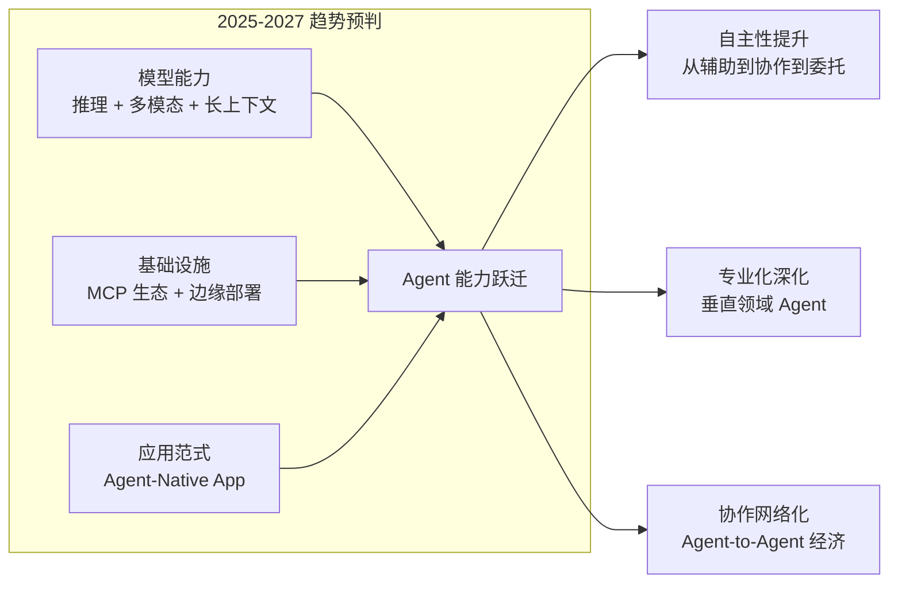

# 第 26 章 前沿趋势与未来方向

本章讨论正在重塑 Agent 工程的一些结构性趋势——推理型 Agent、多模态能力、Agent 原生应用和去中心化协作。需要特别强调的是：**本章不是稳定主干知识，而是面向未来 1–3 年的工程判断与趋势整理**。因此，阅读时更应关注“哪些信号值得持续观察”“哪些趋势已经影响当前工程实践”，而不是把其中的具体时间预测或产品格局视为确定结论。前置依赖：全书基础概念。

> **阅读建议**：如果你当前的目标是把系统做出来并稳定上线，请优先完成第 3–19 章，再回到本章补充趋势视角。

---

## 26.1 推理型 Agent



**图 26-1 Agent 技术趋势全景**——未来 2-3 年，Agent 技术的核心演进方向可以概括为三个词：更自主、更专业、更协作。


### 26.1.1 从 Fast Thinking 到 Deep Reasoning

无论具体模型名字如何变化，过去一年的共同趋势都很明确：模型正在从“快速响应”走向“更长链路、更高成本、但也更可控的深度推理”。在工程上，这意味着系统设计需要重新平衡延迟、成本、可靠性与自主性。

```typescript
interface ReasoningAgent {
  // 传统模式：快速反应
  fastThink(input: string): Promise<string>;
  
  // 推理模式：深度思考
  deepReason(input: string, config: ReasoningConfig): Promise<ReasoningResult>;
    // ... 对应实现可参考 code-examples/ 目录 ...
  private async assessComplexity(problem: string): Promise<number> { return 0.5; }
  private async fastThink(problem: string): Promise<ReasoningResult> { return {} as ReasoningResult; }
  private async deepReason(problem: string, config: ReasoningConfig): Promise<ReasoningResult> { return {} as ReasoningResult; }
}
```

### 26.1.2 推理能力的工程化应用

| 场景 | 快速模式 | 推理模式 | 提升幅度 |
|------|---------|---------|---------|
| 代码生成 | 模板匹配 | 架构设计→分步实现 | +40% 正确率 |
| 数据分析 | 直接查询 | 假设→验证→迭代 | +35% 洞察深度 |
| 问题诊断 | 关键词匹配 | 根因分析→方案推演 | +50% 首次解决率 |
| 规划任务 | 线性分解 | 多路径评估→最优选择 | +30% 效率 |

## 26.2 Harness Engineering：Agent 工程的新范式

### 26.2.1 从模型竞赛到系统工程

本章使用 **Harness Engineering**（约束工程）这一术语，来概括一种正在变得越来越重要的工程倾向：团队之间的差异，越来越少地来自“谁选了更强的模型”，越来越多地来自“谁构建了更强的约束、评估和反馈闭环”。为了避免误解，这里更应把它理解为一种方法论归纳，而不是依赖某一家厂商定义的固定术语。

> **"The new moat is your Agent harness, not model quality."**
> ——新的护城河不是模型质量，而是你的 Agent 约束系统。

这一判断的背景是模型能力持续靠近、产品形态快速迭代，以及团队竞争优势逐渐转向系统工程质量。当 Claude Opus 4.6、Gemini 3、GLM-5 等模型在推理、编码、长上下文等核心指标上趋于接近（参见 26.5 节），团队很难再通过「选一个更好的模型」来获得持久的竞争优势。真正拉开差距的，是围绕模型构建的**约束系统、反馈回路、文档规范和生命周期管理**——即 Harness。

这与本书第 2 章提出的**「确定性外壳 （参见第 2 章：确定性外壳 / 概率性内核） + 概率性内核」**架构哲学高度一致。如果说那是一个架构原则，那 Harness Engineering 就是将这个原则落地为一套完整工程纪律的方法论。确定性外壳的职责——输入验证、输出校验、状态管理、错误处理、审计日志——正是 Harness 的核心组成部分。

### 26.2.2 Harness 的四大支柱

Harness Engineering 由四个相互支撑的工程支柱构成：

**一、约束设计（Constraint Design）**

约束设计是 Harness 的第一道防线。它不是限制 Agent 的能力，而是为 Agent 的行为划定安全、可预测的边界。正如第 14 章信任架构中讨论的权限控制体系，约束设计将信任原则工程化：

```typescript
interface HarnessConfig {
  constraints: {
    // 输出格式约束：强制 Agent 返回结构化数据
    outputSchema: JSONSchema;
    // 行为边界：Agent 不能执行的操作
    forbiddenActions: string[];
    // ... 对应实现可参考 code-examples/ 目录 ...
    // 幻觉（Hallucination）检测
    hallucinationChecker: HallucinationDetector;
  };
}
```

**二、反馈回路（Feedback Loops）**

Agent 系统与传统软件最大的区别在于其行为的概率性——相同的输入可能产生不同的输出。因此 Harness 必须内建持续反馈机制，将每一次 Agent 交互转化为系统改进的信号：

- **人工审核回路（Human-in-the-Loop）**：高风险操作需经人工确认，审核结果反馈至提示词优化管线
- **自动化评估（Automated Evaluation）**：正如第 15 章评估体系中所讨论的，对 Agent 输出进行多维度自动评分
- **持续改进管线（Continuous Improvement）**：将失败案例、边缘情况自动归档为测试用例，驱动提示词和约束的迭代

**三、文档即接口（Documentation as Interface）**

在 Harness Engineering 的理念中，文档不是事后补充的说明书，而是系统行为的正式契约：

- **工具 Schema 文档化**：每个 MCP 工具的输入输出、副作用、错误码都必须有机器可读的规范。正如第 6 章工具系统设计中强调的，良好的工具描述直接决定了 Agent 的调用准确率
- **系统提示词即合同**：System Prompt 不是随手写的提示语，而是 Agent 行为的正式规约，需要版本控制和变更审核
- **行为规格说明（Behavioral Specification）**：Agent 在各类场景下「应该做什么」和「绝不能做什么」的明确声明

**四、生命周期管理（Lifecycle Management）**

生产环境中的 Agent 不是部署完就结束的静态系统，而是需要持续运维的活体：

```typescript
interface AgentLifecycleManager {
  // 版本管理：每个 Agent 配置（提示词 + 约束 + 工具集）都是一个不可变版本
  versioning: {
    createVersion(config: HarnessConfig): AgentVersion;
    rollback(targetVersion: string): Promise<void>;
    diff(v1: string, v2: string): ConfigDiff;
    // ... 对应实现可参考 code-examples/ 目录 ...
    healthCheck: () => Promise<HealthStatus>;
    circuitBreaker: CircuitBreakerConfig;
  };
}
```

### 26.2.3 实践启示

Harness Engineering 给团队带来的最重要认知转变是**投资重心的迁移**：与其花 80% 的精力在模型选型和提示词调优上，不如将至少 50% 的工程投入放在约束系统、评估管线、版本管理和反馈回路上。模型可以替换，Harness 才是沉淀组织知识和工程能力的载体。

正如第 18 章部署运维和第 19 章成本工程中讨论的，生产级 Agent 系统的复杂性远超模型本身——而 Harness Engineering 正是对这种复杂性的系统性回应。

## 26.3 Agentic Engineering：从 Vibe Coding 到工程纪律

### 26.3.1 Vibe Coding 的兴起与局限

2024-2025 年，随着 AI 编码助手（GitHub Copilot、Cursor、Windsurf 等）的全面普及，一种被称为 **Vibe Coding** 的开发模式迅速蔓延：开发者通过自然语言提示让 AI 生成代码，凭直觉和感觉（vibe）验收结果，甚至不完全理解生成的代码就直接提交。

Vibe Coding 在原型阶段效率惊人，但在生产系统中暴露出严重问题：

- **质量不可控**：生成的代码缺乏一致的架构风格和错误处理
- **调试困难**：开发者无法有效排查自己不完全理解的代码
- **安全隐患**：AI 生成的代码可能包含未被察觉的漏洞或反模式
- **知识断层**：团队对自身系统的理解逐渐退化

### 26.3.2 Agentic Engineering 的定义

2025 年下半年，Z.ai 等团队开始系统性地提出 **Agentic Engineering**（Agent 化工程）的概念——一种专业化的、以 AI Agent 为协作对象的软件开发方法论。它不是排斥 AI 辅助，而是将 AI 辅助纳入严格的工程框架中：

> Agentic Engineering 是与 AI Agent 系统性协作的专业纪律，强调规约先行、评估驱动、人机协同的开发模式。

其四大核心原则：

**一、规约先行（Specification-First）**

在让 Agent 生成任何代码之前，先定义清晰的行为规约：

```typescript
// 规约先行的 Agent 开发流程
interface AgentDevelopmentSpec {
  // 1. 行为规约：Agent 应该做什么
  behaviorSpec: {
    capabilities: string[];       // 核心能力列表
    inputConstraints: Schema;     // 输入约束
    // ... 对应实现可参考 code-examples/ 目录 ...
    costBudget: number;
    safetyChecklist: string[];
  };
}
```

**二、测试驱动 Agent 开发（Test-Driven Agent Development）**

正如第 15-16 章讨论的评估体系，Agentic Engineering 要求为 Agent 行为编写自动化评估套件，且评估先于实现：

- **行为测试**：给定输入，Agent 的输出是否满足规约
- **边界测试**：Agent 在模糊输入、对抗性输入下是否安全退化
- **回归测试**：配置变更后，Agent 在已知场景下表现是否稳定
- **性能基准**：延迟、成本、token 消耗是否在预算内

**三、人类监督架构（Human Oversight Architecture）**

Agentic Engineering 不追求完全自治，而是设计精细的人机协作拓扑，正如第 14 章信任架构中提出的分级信任模型：

- **审批工作流**：高风险操作进入人工审批队列
- **升级路径**：Agent 在置信度不足时主动升级给人类
- **审计追踪**：所有 Agent 决策都有完整的可追溯记录
- **紧急制停**：人类随时可以中断 Agent 执行并接管

**四、可组合性（Composability）**

Agent 应该从定义良好的、可复用的组件构建，而非每次都从零开始。正如第 9-10 章讨论的 Multi-Agent 架构和编排模式：

- **标准化接口**：每个 Agent 组件遵循统一的输入输出协议
- **关注点分离**：规划、执行、评估、监控各司其职
- **配置化组装**：通过声明式配置组合 Agent 能力，而非硬编码

### 26.3.3 Agentic Engineering 与 Harness Engineering 的关系

Agentic Engineering 和 Harness Engineering 是互补而非竞争的概念。Harness Engineering 聚焦于 Agent 的**运行时约束系统**——如何让已部署的 Agent 可靠运行；Agentic Engineering 聚焦于 Agent 的**开发方法论**——如何从开发阶段就确保质量。二者结合，覆盖了 Agent 从开发到运维的完整生命周期。

## 26.4 平台连接与 Agent 部署革命

Agent 的价值不仅在于推理能力，更在于触达用户的能力。随着 Agent 生态的成熟，“平台连接”已成为与“推理编排”同等重要的工程议题：

| 层次 | 代表技术 | 作用 |
|------|----------|------|
| 推理框架 | LangGraph / CrewAI / AutoGen | Agent 的推理、编排和状态管理 |
| 工具协议 | MCP | Agent 与工具/数据源的标准化接口 |
| 部署框架 | Gateway + Plugin 架构 | Agent 到各类平台和渠道的无缝部署 |
| 协作协议 | A2A | 跨组织的 Agent 发现与协作 |

Gateway + Plugin 架构是这一趋势的典型代表。通过一个中心化的 Gateway 守护进程，统一处理 Agent 与外部平台之间的协议转换、认证管理、消息路由和状态同步，可以让同一个 Agent 同时部署到微信、Slack、Discord、Web、API 等多个渠道。

这种架构的成功印证了一个更大的趋势——Agent 框架正在从「全栈式」走向「专业化」。这与传统软件工程的演进路径一致：早期的 Web 框架试图包揽一切，最终让位于专注路由的、专注 ORM 的、专注前端的各类库。Agent 领域正在经历相同的解耦过程。

## 26.5 模型格局 2026：同质化加速

### 26.5.1 新一代模型能力对比

2026 年初，几款标志性模型的发布让模型格局发生了显著变化：

| 模型 | 发布时间 | 上下文窗口 | 核心特点 | 代表性基准 |
|------|---------|-----------|---------|-----------|
| **Claude Opus 4.6** | 2026.02 | 1M token | 原生 Agent 团队、MCP 原生支持、业界领先编码能力 | SWE-bench 80%+ |
| **Gemini 3** | 2025.12 | 2M token | Deep Think 模式、Google Antigravity 项目集成 | MMLU-Pro 92% |
| **GLM-5** | 2026.02 | 256K token | 开源、SWE-bench 77.8%、与闭源模型竞争力相当 | SWE-bench 77.8% |
| **DeepSeek-V3.2** | 2025.11 | 128K token | 开源推理模型、成本极低 | MATH-500 96% |

几个值得注意的趋势：

**一、上下文窗口的实用化**

1M-2M token 的上下文窗口意味着 Agent 可以在单次会话中「看到」整个中型代码库或数十份文档。这直接改变了第 7 章记忆架构和第 8 章 RAG 的工程权衡——部分过去必须依赖检索增强的场景，现在可以直接「塞入上下文」。但这并不意味着 RAG 过时了：成本控制（第 19 章）和信息新鲜度仍然是 RAG 的核心价值。

**二、Agent 能力的原生化**

Claude Opus 4.6 引入的「原生 Agent 团队」功能标志着一个重要转变：多 Agent 协作不再仅仅是框架层的编排（如第 9 章讨论的模式），而是开始下沉到模型层面。模型提供商正在将 Agent 设计模式内化为模型能力，这为开发者提供了开箱即用的多 Agent 支持，同时也引发了框架层与模型层职责边界的重新思考。

**三、开源模型的崛起**

GLM-5 在 SWE-bench 上达到 77.8% 的成绩，与闭源模型的差距缩小到历史最低。开源模型的竞争力提升加速了模型同质化趋势——这进一步验证了 26.2 节 Harness Engineering 的核心论断：当模型不再是稀缺资源时，约束系统才是真正的护城河。

### 26.5.2 模型同质化与工程策略

模型同质化对 Agent 工程实践有深刻影响：

```typescript
// 面向模型同质化时代的 Agent 架构
interface ModelAgnosticAgent {
  // 模型抽象层：Agent 逻辑不绑定特定模型
  modelProvider: {
    primary: ModelConfig;
    fallbacks: ModelConfig[];    // 多模型回退链
    // ... 对应实现可参考 code-examples/ 目录 ...
      (a.benchmarkScore / a.costPerToken) - (b.benchmarkScore / b.costPerToken)
    )[candidates.length - 1];
  }
}
```

这种模型无关的架构设计意味着：团队可以在不修改核心逻辑的前提下，随时切换到性价比更优的模型——而这恰恰需要强健的 Harness 作为保障。

## 26.6 具身智能与世界模型

### 26.6.1 物理世界交互

```typescript
interface EmbodiedAgent {
  // 感知
  perceive(sensors: SensorData): Promise<WorldState>;
  // 规划
  plan(goal: string, worldState: WorldState): Promise<ActionSequence>;
  // 执行
    // ... 对应实现可参考 code-examples/ 目录 ...
  async learn(experience: Experience): Promise<void> {}
  private async generateCandidatePlans(goal: string, state: WorldState): Promise<ActionSequence[]> { return []; }
  private calculateReward(state: WorldState, goal: string): number { return 0; }
}
```

## 26.7 Agent 市场与经济系统

### 26.7.1 Agent 即服务

```typescript
interface AgentMarketplace {
  // 发布 Agent
  publish(agent: AgentManifest): Promise<string>;
  // 发现 Agent
  discover(query: string, filters?: DiscoverFilters): Promise<AgentListing[]>;
  // 组合 Agent
    // ... 对应实现可参考 code-examples/ 目录 ...
  basePrice: number;
  currency: string;
  volumeDiscounts?: VolumeDiscount[];
}
```

### 26.7.2 Agent 经济模型

```
┌──────────────────────────────────────────────┐
│              Agent Marketplace                │
│                                              │
│  ┌──────────┐    ┌──────────┐               │
│  │ Provider │───→│ Registry │               │
│  │  Agents  │    │ & Rating │               │
    // ... 对应实现可参考 code-examples/ 目录 ...
│  └────────┘                                  │
│                                              │
│  Trust Layer: Reputation + Audit + SLA       │
└──────────────────────────────────────────────┘
```

## 26.8 长时运行 Agent

### 26.8.1 持久化执行架构

传统 Agent 是会话级的——用户请求来了处理完就结束。未来的 Agent 将是持久运行的，能够跨越小时、天甚至周的时间跨度完成复杂任务：

```typescript
interface LongRunningAgent {
  // 启动长期任务
  startTask(task: LongTermTask): Promise<TaskHandle>;
  // 暂停/恢复
  suspend(handle: TaskHandle): Promise<Checkpoint>;
  resume(checkpoint: Checkpoint): Promise<TaskHandle>;
    // ... 对应实现可参考 code-examples/ 目录 ...
  private async executeStep(step: TaskStep, handle: TaskHandle): Promise<void> {}
  private async reportProgress(handle: TaskHandle, current: number, total: number): Promise<void> {}
  private notifyFailure(handle: TaskHandle, error: Error): void {}
}
```

## 26.9 多模态 Agent

| 模态 | 输入能力 | 输出能力 | 代表场景 |
|------|---------|---------|---------|
| 视觉 | 图片理解、OCR、视频分析 | 图像生成、UI 设计 | 设计助手 |
| 语音 | 语音识别、情感分析 | 语音合成、音乐生成 | 语音助手 |
| 代码 | 代码理解、AST 分析 | 代码生成、重构 | 编程助手 |
| 数据 | 表格理解、图表分析 | 可视化、报表 | 数据分析 |
| 3D | 场景理解、物体识别 | 3D 建模、场景生成 | 空间计算 |

## 26.10 Agent 基础设施趋势

### 26.10.1 未来技术栈

```
2024-2025:
  ├── 推理模型成为标配 (o1/o3, DeepSeek-R1)
  ├── MCP 协议标准化
  ├── Agent 可观测性成熟
  ├── 单 Agent 产品爆发
  └── Vibe Coding 流行，暴露质量隐患
    // ... 对应实现可参考 code-examples/ 目录 ...
  ├── 具身智能突破
  ├── 模型无关架构成为默认选择
  ├── Agent-Agent 自主协作
  └── 通用 Agent 雏形
```


## 26.11 Agentic Coding：重塑软件工程经济学

根据 Anthropic《2026 Agentic Coding Trends Report》，Agent 编码正在引发软件工程领域的八大趋势：

### 26.11.1 八大趋势概览

| # | 趋势 | 核心变化 |
|---|------|---------|
| 1 | 软件开发生命周期剧变 | AI 从辅助工具变为开发平台 |
| 2 | 单 Agent 进化为协调团队 | Multi-Agent 编码工作流成为标准 |
| 3 | 长时运行 Agent 构建完整系统 | 从分钟级任务到小时/天级项目 |
| 4 | 人类监督通过智能协作扩展 | Agent 主动请求审查、报告进度 |
| 5 | Agentic Coding 扩展到新界面和用户 | 非技术人员也能"编程" |
| 6 | 生产力增益重塑软件开发经济学 | 更少开发者完成更多工作 |
| 7 | 非技术用例跨组织扩展 | 市场、法务、财务部门使用 Agent |
| 8 | 双重用途风险需要安全优先架构 | Agent 生成的代码需要新的安全审计方法 |

### 26.11.2 "Repository Intelligence" 的出现

Agent 不再仅仅理解单个文件，而是理解整个代码仓库的架构、依赖关系和设计意图。这是 2026 年最重要的技术突破之一：

```typescript
// Repository Intelligence：Agent 对代码库的全局理解
class RepositoryIntelligence {
  async analyzeRepository(repoPath: string): Promise<RepoUnderstanding> {
    // 1. 项目结构理解
    const structure = await this.mapProjectStructure(repoPath);
    
    // ... 对应实现可参考 code-examples/ 目录 ...
    
    return { structure, dependencies, patterns, intent };
  }
}
```

## 26.12 小结

AI Agent 领域正在从「能用」走向「好用」，从「单一任务」走向「通用能力」。2026 年的前沿趋势清晰地指向一个核心主题：**工程胜过模型**。

Harness Engineering 的提出标志着行业共识的形成——在模型同质化的时代，约束系统、反馈回路和生命周期管理才是真正的竞争壁垒。Agentic Engineering 则从开发方法论层面回应了 Vibe Coding 泛滥带来的质量危机，为 Agent 开发建立了专业纪律。Gateway + Plugin 等架构模式的流行证明了 Agent 基础设施正在走向专业化分工，MCP 工具生态的成熟则大幅降低了 Agent 能力扩展的门槛。

与此同时，推理能力的持续提升、上下文窗口的跨越式增长、开源模型的崛起，都在从底层推动 Agent 能力的普惠化。这些趋势共同指向本书贯穿始终的核心理念：**确定性外壳包裹概率性内核**——模型越强大、越普及，我们越需要严谨的工程方法来驾驭它。

工程师需要保持技术敏锐度，但更重要的是建立系统性的工程思维——投资于约束系统、评估管线、部署基础设施和开发纪律，在实战中积累组织级的 Agent 工程能力，为已经到来的 Agent 时代做好准备。


## 26.13 世界模型与 Agent 规划革命

### 26.13.1 从语言模型到世界模型

26.6 节简要介绍了具身智能的接口定义。本节将深入探讨世界模型（World Model）的内部机制——这被广泛认为是 Agent 从"对话工具"进化为"自主行动者"的关键缺失拼图。

**什么是世界模型？** 世界模型是 Agent 内部维护的一个对外部环境的可计算表示，它使 Agent 能够：

1. **预测**：在不实际执行动作的情况下，预测动作的后果
2. **规划**：通过在内部模拟中"试错"来选择最优行动序列
3. **反事实推理**：评估"如果当时采取不同行动会怎样"
4. **因果推断**：区分相关性和因果关系

这与 LLM 的能力形成本质区别——LLM 擅长语言层面的推理（"如果 A 则 B"的自然语言推导），但缺乏对物理世界、代码执行环境、数据库状态等领域的结构化建模能力。

```typescript
// 世界模型的核心架构
interface WorldModel<TState, TAction> {
  // 状态转移函数：给定当前状态和动作，预测下一状态
  transition(state: TState, action: TAction): Promise<TransitionResult<TState>>;
  
  // 奖励/评价函数：评估某个状态对于目标的好坏
    // ... 对应实现可参考 code-examples/ 目录 ...
  epistemic: number;    // 知识不足导致的不确定性（可通过更多数据消除）
  total: number;
  suggestion: 'proceed' | 'gather_more_info' | 'ask_human';
}
```

### 26.13.2 分层世界模型架构

现实中的 Agent 需要在多个抽象层次上理解世界。一个数据分析 Agent 需要理解 SQL 执行语义（低层）、业务指标含义（中层）和组织目标（高层）。分层世界模型通过将环境建模为多层抽象来解决这一问题：

```typescript
class HierarchicalWorldModel<TState, TAction> {
  private layers: WorldModelLayer[];
  
  constructor(
    private physicalLayer: WorldModelLayer,   // 物理/执行层
    private semanticLayer: WorldModelLayer,   // 语义/含义层
    // ... 对应实现可参考 code-examples/ 目录 ...
  private applyPrediction(state: MultiLevelState, prediction: MultiLevelPrediction): MultiLevelState {
    return state;
  }
}
```

### 26.13.3 世界模型在不同 Agent 领域的应用

| Agent 类型 | 物理层建模 | 语义层建模 | 策略层建模 |
|-----------|-----------|-----------|-----------|
| 编程 Agent | AST 变换、编译结果、测试通过率 | 代码语义、API 契约、架构影响 | 需求满足度、技术债务影响 |
| 数据分析 Agent | SQL 执行结果、数据分布 | 业务指标含义、趋势方向 | 决策支持价值、洞察深度 |
| 客服 Agent | 系统查询结果、工单状态 | 用户意图、情绪变化 | 客户满意度、问题解决率 |
| 具身 Agent | 物理运动、碰撞检测 | 场景语义、物体关系 | 任务目标达成、安全约束 |
| 金融 Agent | 交易执行、市场行情 | 风险暴露、合规状态 | 投资目标、风险偏好满足 |

### 26.13.4 Monte Carlo Tree Search (MCTS) 与 Agent 规划

推理模型（如 o1/o3）的内部机制被广泛推测使用了类似 MCTS 的搜索策略。Agent 开发者可以在规划层面显式运用这一思想：

```typescript
class MCTSPlanner {
  private worldModel: WorldModel<any, any>;
  private explorationWeight: number = 1.414; // UCB1 探索系数
  
  async plan(
    rootState: any,
    // ... 对应实现可参考 code-examples/ 目录 ...
  
  isLeaf(): boolean { return this.children.length === 0; }
  isFullyExpanded(): boolean { return false; /* 省略 */ }
}
```

> **设计决策：何时需要显式世界模型？**
>
> 并非所有 Agent 都需要显式的世界模型。对于简单的 ReAct 循环（第 3 章）、确定性工作流（第 10 章），LLM 的隐式推理能力已经足够。显式世界模型在以下场景中价值最大：
>
> - **动作不可逆且代价高昂**（如金融交易、数据库迁移、物理机器人操作）
> - **规划深度 > 5 步**（LLM 的隐式规划在长序列上容易退化）
> - **需要多方案并行评估**（MCTS 等搜索算法需要模拟器支持）
> - **安全关键场景**（世界模型可以在执行前检测危险状态）
>
> 参见第 14 章信任架构中关于"预飞检查"（pre-flight check）的讨论——世界模型是最彻底的预飞检查形式。

### 26.13.5 世界模型的训练与获取

一个实际的工程挑战是：世界模型从何而来？

| 获取方式 | 描述 | 适用场景 | 局限 |
|---------|------|---------|------|
| **手工编码** | 开发者根据领域知识编写规则 | 规则清晰的封闭域（棋类、配置管理） | 无法扩展到复杂开放域 |
| **从日志学习** | 从历史执行日志中学习状态转移模式 | 有丰富历史数据的系统（CI/CD、数据库操作） | 需要大量高质量日志 |
| **LLM 模拟** | 使用 LLM 作为通用世界模拟器 | 语言交互场景（对话、文本处理） | 物理精度低、幻觉风险 |
| **混合模式** | 确定性规则 + LLM 推理 + 历史统计 | 生产级 Agent 系统 | 工程复杂度高 |

```typescript
// 混合世界模型：结合规则、统计和 LLM
class HybridWorldModel implements WorldModel<SystemState, AgentAction> {
  constructor(
    private rules: DeterministicRules,      // 确定性规则（如 SQL 语法验证）
    private statistics: StatisticalModel,   // 统计模型（如历史成功率）
    private llm: LLMSimulator              // LLM 模拟器（处理开放域推理）
    // ... 对应实现可参考 code-examples/ 目录 ...
  private reconcile(predicted: SystemState, observation: Observation): SystemState {
    return {} as SystemState;
  }
}
```

## 26.14 自我改进型 Agent

### 26.14.1 从静态部署到持续进化

传统 Agent 在部署后本质上是静态的——系统提示词、工具集和约束规则由开发者手工维护，模型权重由提供商固定。自我改进型 Agent（Self-Improving Agent）的愿景是让 Agent 能够基于运行时经验自主提升自身能力。

这并非科幻：多个前沿研究方向已在探索不同层面的自我改进：

| 改进层面 | 机制 | 当前成熟度 | 风险等级 |
|---------|------|-----------|---------|
| **提示词优化** | 自动搜索更优的系统提示词 | 高 | 低 |
| **工具发现** | Agent 自主发现并学会使用新工具 | 中 | 中 |
| **策略学习** | 从成功/失败经验中学习更优的行动策略 | 中 | 中 |
| **知识积累** | 将解决过的问题转化为可复用知识 | 中 | 低 |
| **自我代码修改** | Agent 修改自己的代码 | 低 | 极高 |
| **目标调整** | Agent 自主调整自己的目标 | 极低 | 极高 |

```typescript
// 自我改进型 Agent 的分层架构
interface SelfImprovingAgent {
  // L1: 提示词自优化（最安全，已可生产使用）
  promptOptimizer: PromptOptimizer;
  
  // L2: 经验学习系统（中等风险，需要人类监督）
    // ... 对应实现可参考 code-examples/ 目录 ...
  private async identifyRootCause(trajectory: ActionTrajectory, failure: FailureAnalysis): Promise<any> { return {}; }
  private computeRelevance(exp: any, task: Task, state: any): number { return 0; }
  private computeFreshness(learnedAt: Date): number { return 0; }
}
```

### 26.14.2 自我改进的安全约束

自我改进是 Agent 安全领域最令人担忧的能力之一。不受约束的自我改进可能导致目标漂移（Agent 的优化目标偏离人类意图）、奖励黑客（Agent 找到满足评估指标但违背实际目标的捷径）或能力外溢（Agent 获得了超出预期的能力）。

```typescript
class ImprovementGuard {
  private approvedCapabilities: Set<string>;
  private improvementBudget: ImprovementBudget;
  private humanOversight: HumanOversightChannel;
  
  // 在允许任何自我改进之前进行安全检查
    // ... 对应实现可参考 code-examples/ 目录 ...
  }
  private async assessCapabilityChange(proposal: ImprovementProposal): Promise<any> { return {}; }
  private async checkPostImprovementAlignment(proposal: ImprovementProposal): Promise<any> { return {}; }
}
```

> **设计决策：渐进式自我改进策略**
>
> 在生产环境中，建议采用渐进式策略部署自我改进能力：
>
> | 阶段 | 允许的改进类型 | 人类参与度 | 适用时期 |
> |------|-------------|-----------|---------|
> | Phase 1 | 仅提示词优化、Few-shot 选择 | 所有改进需人工批准 | 系统上线前 6 个月 |
> | Phase 2 | + 工具配置调整、策略微调 | 低风险自动批准，高风险人工批准 | 6-18 个月 |
> | Phase 3 | + 经验学习、知识积累 | 仅超出边界的改进需人工批准 | 18 个月+ |
> | Phase 4 | + 工具发现与创造 | 全自动 + 事后审计 | 远期目标 |
>
> 绝不建议在当前技术条件下允许 Agent 修改自身代码或调整自身目标。参见第 27 章关于负责任开发的讨论。

## 26.15 Agent-Native 操作系统

### 26.15.1 从工具调用到环境原生

当前的 Agent 通过 MCP/A2A 等协议与操作系统和应用程序交互，本质上是在"模拟人类操作"——像人类一样点击按钮、输入文本、调用 API。Agent-Native OS 的愿景是构建一个从底层就为 Agent 设计的计算环境，让 Agent 以"一等公民"的身份操作系统。

```
当前模式（Agent 模拟人类操作）:
┌─────────────┐     ┌──────────┐     ┌──────────────┐
│   Agent     │────→│ MCP/API  │────→│  操作系统     │
│ (模拟用户)   │     │ (适配层)  │     │  (为人类设计) │
└─────────────┘     └──────────┘     └──────────────┘

    // ... 对应实现可参考 code-examples/ 目录 ...
│             │     │  │ Agent 原生进程管理     │     │
│             │     │  │ Agent 原生通信协议     │     │
│             │     │  └─────────────────────┘     │
└─────────────┘     └──────────────────────────────┘
```

### 26.15.2 Agent-Native OS 的核心组件

```typescript
// Agent-Native 操作系统的抽象接口
interface AgentNativeOS {
  // 1. 意图式文件系统：基于语义而非路径操作文件
  fileSystem: IntentBasedFileSystem;
  
  // 2. 能力式权限模型：比传统 RBAC 更灵活
    // ... 对应实现可参考 code-examples/ 目录 ...
  
  // 优雅终止
  gracefulShutdown(process: AgentProcess, reason: string): Promise<ShutdownResult>;
}
```

### 26.15.3 Agent-Native 应用的重新设计

在 Agent-Native OS 上运行的应用程序将与传统应用有本质区别：

| 维度 | 传统应用 | Agent-Native 应用 |
|------|---------|------------------|
| **用户界面** | GUI/CLI（为人类设计） | 语义接口（为 Agent 设计） |
| **数据访问** | SQL/API（结构化查询） | 意图查询（自然语言 + 结构化混合） |
| **错误处理** | 错误码 + 消息 | 上下文丰富的错误解释 + 建议修复方案 |
| **权限模型** | 用户名/密码 + RBAC | 能力令牌 + 委托 + 衰减 |
| **状态管理** | 会话/数据库 | 可检查点、可迁移的持久化状态 |
| **协作模式** | 异步消息/共享数据库 | 结构化协议 + 意图协商 |
| **可观测性** | 日志 + 指标 | 语义轨迹 + 决策解释 + 因果图 |

### 26.15.4 当前进展与挑战

Agent-Native OS 目前仍处于早期探索阶段，但已有数个值得关注的项目和研究方向：

- **Computer Use Agent**（Anthropic）: Claude 直接通过屏幕截图和鼠标键盘操作来使用计算机，是向 Agent-Native 交互的过渡形态
- **Open Interpreter**: 让 LLM 直接在本地环境中执行代码和系统命令
- **E2B (Every2Bot)**: 提供为 Agent 优化的云端沙箱环境
- **学术研究**: Stanford 的 ALOHA、UC Berkeley 的 Agent-Computer Interface 等项目正在探索更原生的 Agent-OS 交互范式

主要挑战包括：安全隔离（如何防止 Agent 越权）、性能开销（语义解析的延迟）、向后兼容（如何与现有应用共存）和标准化（需要行业共识）。

## 26.16 Agent 经济学：市场动力学深度分析

### 26.16.1 从工具到经济实体

26.7 节定义了 Agent 市场的基础接口。本节深入分析 Agent 作为经济实体参与市场时涌现出的复杂动力学。

当 Agent 可以提供服务、消费服务、签订协议并管理资金时，我们实质上是在构建一个新型经济系统。这个系统的参与者不是人类个体或传统企业，而是自主 Agent——这带来了全新的经济学问题。

```typescript
// Agent 经济体的核心组件
interface AgentEconomy {
  // 1. 服务市场：Agent 发布和消费服务
  serviceMarket: ServiceMarket;
  
  // 2. 信用体系：Agent 的可信度评估
    // ... 对应实现可参考 code-examples/ 目录 ...
  private calculateSLAPremium(sla: any): number { return 0; }
  private meetMinimumRequirements(bid: AgentBid, task: TaskSpec): boolean { return true; }
  private scoreBid(bid: AgentBid, task: TaskSpec): number { return 0; }
}
```

### 26.16.2 Agent 经济的潜在市场失灵

与人类经济系统类似，Agent 经济也面临市场失灵的风险——但表现形式有所不同：

| 失灵类型 | 人类经济中的表现 | Agent 经济中的表现 | 应对策略 |
|---------|----------------|------------------|---------|
| **垄断** | 大公司控制市场 | 高信用 Agent 形成马太效应 | 新入者扶持机制、信用分上限 |
| **信息不对称** | 卖方知道质量、买方不知道 | Agent 声称的能力 vs 实际能力 | 强制基准测试、第三方审计 |
| **外部性** | 污染等负面外部性 | Agent 行为影响其他 Agent（如爬虫耗尽 API 限额） | 资源配额、影响评估 |
| **共谋** | 企业之间暗中协调价格 | Agent 间自主学习到共谋策略 | 行为模式监控、反共谋算法 |
| **竞底** | 为了竞争降低安全标准 | Agent 为了降低成本牺牲质量/安全 | 最低质量标准、安全基线强制 |

```typescript
// 市场监管沙箱
class RegulatorySandbox {
  // 监测市场健康度
  async monitorMarketHealth(): Promise<MarketHealthReport> {
    return {
      // 竞争指标
    // ... 对应实现可参考 code-examples/ 目录 ...
  private enforceQualityBaseline(agents: string[]): InterventionResult { return {} as InterventionResult; }
  private promoteCompetition(market: string): InterventionResult { return {} as InterventionResult; }
  private escalateToHuman(anomaly: MarketAnomaly): InterventionResult { return {} as InterventionResult; }
}
```

## 26.17 监管格局与合规工程

### 26.17.1 全球 Agent 监管图谱

AI Agent 的监管环境正在快速演变。与传统 AI 模型不同，Agent 的自主行动能力给监管带来了全新挑战——监管者不仅需要关注模型的输出质量，还需要关注 Agent 的行为边界、决策透明度和责任归属。

| 地区 | 核心法规 | 对 Agent 的关键要求 | 实施时间 |
|------|---------|-------------------|---------|
| **欧盟** | EU AI Act | 高风险分类、透明性义务、人类监督、技术文档 | 2024-2026 分阶段 |
| **美国** | Executive Order 14110 + NIST AI 600-1 | 安全评估、红队测试、风险管理框架 | 2024 起指导性 |
| **中国** | 生成式 AI 管理办法 + 算法推荐管理规定 | 内容合法、数据合规、算法备案、AI 标识 | 2023 起强制 |
| **英国** | Pro-Innovation AI Regulation | 行业主导、沙箱测试、比例原则 | 2024 起框架性 |
| **日本** | AI Guidelines for Business | 自律型规范、社会原则、治理建议 | 2024 起指导性 |

### 26.17.2 EU AI Act 对 Agent 开发的深度影响

EU AI Act 是目前全球范围内对 AI 系统影响最深远的立法。对 Agent 开发者而言，以下几个条款尤为关键：

**Art. 6 + Annex III: 高风险 AI 系统分类**

许多 Agent 应用场景可能被归类为高风险：

```typescript
// EU AI Act 高风险分类评估器
class EUAIActRiskClassifier {
  // 评估 Agent 是否属于高风险 AI 系统
  async classify(agent: AgentDescription): Promise<RiskClassification> {
    const annexIIICriteria = [
      {
    // ... 对应实现可参考 code-examples/ 目录 ...
  private isInLawEnforcement(agent: AgentDescription): boolean { return false; }
  private isInJudiciary(agent: AgentDescription): boolean { return false; }
  private interactsDirectlyWithHumans(agent: AgentDescription): boolean { return true; }
}
```

**Art. 14: 人类监督（Human Oversight）的工程实现**

EU AI Act 的人类监督要求与本书第 14 章讨论的信任架构高度一致。Art. 14 明确要求高风险 AI 系统必须能被人类"有效监督"，这在 Agent 工程中转化为以下技术要求：

```typescript
interface EUAIActHumanOversight {
  // 14.4(a): 使监督者能正确理解 AI 系统的能力和限制
  capabilityDisclosure: {
    // Agent 必须能解释自己能做什么和不能做什么
    explainCapabilities(): string[];
    explainLimitations(): string[];
    // ... 对应实现可参考 code-examples/ 目录 ...
    // 停止后的安全状态
    getPostStopSafeState(): SystemState;
  };
}
```

### 26.17.3 中国 Agent 监管要求

中国的 AI 监管体系以《生成式人工智能服务管理暂行办法》为核心，结合《算法推荐管理规定》和《互联网信息服务深度合成管理规定》形成了多层次的监管框架。对 Agent 开发者的核心要求：

| 法规 | 核心要求 | Agent 工程实践 |
|------|---------|--------------|
| 生成式 AI 办法 Art. 4 | 社会主义核心价值观 | 内容过滤器和价值观对齐 |
| 生成式 AI 办法 Art. 7 | 训练数据合法性 | 数据溯源和许可管理 |
| 生成式 AI 办法 Art. 8 | AI 生成内容标识 | 输出水印和来源标注 |
| 算法推荐规定 Art. 17 | 算法备案 | 算法描述文档和备案登记 |
| 深度合成规定 Art. 16 | 深度合成内容标识 | 生成内容的显著标识 |
| 个人信息保护法 Art. 24 | 自动化决策透明性 | 决策解释和拒绝自动化决策的权利 |

### 26.17.4 合规即代码（Compliance as Code）

面对快速变化的监管环境，手工追踪合规要求不可持续。"合规即代码"的理念是将法规要求转化为可执行的自动化检查：

```typescript
// 合规即代码框架
class ComplianceAsCode {
  private rules: ComplianceRule[] = [];
  
  // 注册合规规则
  registerRule(rule: ComplianceRule): void {
    // ... 对应实现可参考 code-examples/ 目录 ...
      estimatedRemediationEffort: '2-4 周开发 + 合规审计',
    };
  }
});
```

## 26.18 开放问题与研究前沿

### 26.18.1 核心未解问题

尽管 Agent 技术在 2024-2026 年间取得了惊人进展，但仍有一系列核心问题悬而未决。这些问题不仅是学术研究的前沿，更直接影响着工程实践的天花板。

**问题一：Agent 的可靠性上限在哪里？**

当前最先进的 Agent 在 SWE-bench 上的成功率约为 80%——这意味着每 5 个真实的 GitHub issue 中，Agent 仍有 1 个无法正确解决。更关键的是，在生产环境中，Agent 的可靠性通常远低于基准测试成绩（第 16 章讨论的"基准-现实差距"）。

| 基准成绩 | 现实场景表现 | 差距来源 |
|---------|------------|---------|
| SWE-bench 80% | 生产 bug 修复 ~50% | 代码库复杂度、上下文长度、模糊需求 |
| HumanEval 95% | 完整功能开发 ~60% | 多文件协调、测试覆盖、架构一致性 |
| MATH 96% | 业务数据分析 ~70% | 数据质量、业务语义、多步骤推理 |
| 客服基准 90% | 实际客户满意 ~75% | 情绪复杂度、超出知识库、多轮理解 |

如何缩小这一差距？这需要同时在模型能力（减少幻觉、提升长上下文推理）和工程架构（更好的约束系统、评估管线）两个方向持续投入。

**问题二：Multi-Agent 系统的涌现行为如何控制？**

第 9-10 章讨论了 Multi-Agent 架构的设计模式。但随着 Agent 数量增加和交互复杂度提升，系统可能表现出超出单个 Agent 行为范围的涌现行为（emergent behavior）——这些行为既可能是有价值的创新（如 Agent 自发地发现更高效的协作模式），也可能是危险的失控（如 Agent 之间形成循环依赖或共谋行为）。

```typescript
// 涌现行为监控器
class EmergentBehaviorMonitor {
  private baselineBehaviors: BehaviorProfile[] = [];
  
  // 检测 Multi-Agent 系统中的涌现行为
  async detectEmergentBehavior(
    // ... 对应实现可参考 code-examples/ 目录 ...
  private async measureCollaborationDeviation(state: MultiAgentSystemState): Promise<any> { return {}; }
  private assessOverallRisk(patterns: EmergentPattern[]): string { return 'low'; }
  private generateRecommendations(patterns: EmergentPattern[]): string[] { return []; }
}
```

**问题三：Agent 的责任归属如何确定？**

当 Agent 做出错误决策造成损失时，责任由谁承担？这不仅是法律问题，更是工程设计问题——系统的责任架构需要从设计阶段就考虑清楚。

```
责任归属决策树：

Agent 造成损失
    │
    ├── Agent 在设计边界内操作？
    │   ├── 是 → 系统设计方/部署方承担主要责任
    // ... 对应实现可参考 code-examples/ 目录 ...
    └── 人类监督者是否介入？
        ├── 有人类监督但未阻止 → 监督者承担部分责任
        ├── 无人类监督（全自动） → 部署方承担完全责任
        └── 人类覆盖了 Agent 建议后出问题 → 覆盖者承担责任
```

### 26.18.2 技术研究前沿

以下研究方向有望在未来 3-5 年内产生重大突破，直接影响 Agent 工程实践：

| 研究方向 | 当前状态 | 预期突破时间 | 工程影响 |
|---------|---------|------------|---------|
| **形式化验证 for Agent** | 早期探索 | 2027-2028 | 在部署前数学证明 Agent 不会违反安全属性 |
| **因果推理集成** | 学术研究 | 2026-2027 | Agent 能区分相关性和因果关系，减少虚假推理 |
| **持续学习（无遗忘）** | 中期研究 | 2027-2029 | Agent 能从新数据持续学习而不忘记旧知识 |
| **可证明的对齐** | 早期理论 | 2028+ | 数学上保证 Agent 的目标与人类意图一致 |
| **去中心化 Agent 网络** | 协议设计中 | 2026-2027 | Agent 无需中央协调即可安全协作 |
| **Agent 压缩与蒸馏** | 活跃研究 | 2026 | 在边缘设备上运行高能力 Agent |
| **多模态世界模型** | 中期研究 | 2027-2028 | Agent 对物理世界的理解能力质的飞跃 |
| **Agent 记忆的长期巩固**| 早期探索 | 2027-2028 | 类似人类记忆的选择性保留和遗忘机制 |

### 26.18.3 给工程师的行动建议

面对快速演变的前沿趋势，工程师可以采取以下策略：

**短期（6-12 个月）——跟上当前最佳实践：**

1. **掌握 Harness Engineering 思维**（26.2 节）：将 50%+ 的工程投入从模型调优转向约束系统
2. **建立评估先行的开发纪律**（Agentic Engineering，26.3 节）：每个 Agent 功能先写评估再写实现
3. **关注 MCP 工具生态**（26.4 节）：利用标准化工具降低集成成本
4. **构建模型无关架构**（26.5 节）：确保核心逻辑不绑定特定模型

**中期（1-2 年）——为下一代技术做准备：**

5. **探索世界模型**（26.13 节）：在高风险场景中引入显式世界模型，提升规划可靠性
6. **实验自我改进能力**（26.14 节）：从最安全的提示词自优化开始，逐步扩展
7. **合规工程化**（26.17 节）：将合规要求编码为自动化检查，而非手工审查
8. **关注涌现行为**（26.18 节）：为 Multi-Agent 系统建立行为监控基线

**长期（2-5 年）——参与塑造未来：**

9. **关注 Agent-Native OS 的演进**（26.15 节）：这可能彻底改变 Agent 的开发和部署模式
10. **参与标准制定**：MCP、A2A 等协议仍在快速演化，工程师的实践反馈对标准质量至关重要
11. **建设 Agent 安全实践社区**：安全是集体责任，分享失败案例和防御策略对整个行业有益
12. **保持对 AGI/ASI 议题的关注**：虽然通用人工智能仍是远期目标，但每一步进展都可能改变 Agent 的能力边界

## 26.19 更新后的小结

AI Agent 领域正在从「能用」走向「好用」，从「单一任务」走向「通用能力」。本章在 26.12 节原有小结的基础上，进一步展开了六大前沿方向的深度分析：

**世界模型与 Agent 规划**（26.13 节）揭示了 Agent 从"反应式"进化为"预见式"的技术路径。分层世界模型和 MCTS 规划为高风险、长序列任务提供了更可靠的决策基础。

**自我改进型 Agent**（26.14 节）探讨了 Agent 持续进化的可能性和风险。从提示词自优化到经验学习，自我改进能力正在分层解锁，但必须在严格的安全约束下进行。

**Agent-Native 操作系统**（26.15 节）展望了一个为 Agent 原生设计的计算环境。意图式文件系统、能力式权限模型和可迁移进程将彻底改变 Agent 与系统的交互方式。

**Agent 经济学**（26.16 节）深入分析了 Agent 作为经济实体参与市场时的复杂动力学，包括信用体系、动态定价和市场失灵的应对策略。

**监管格局与合规工程**（26.17 节）系统梳理了全球 Agent 监管图谱，特别是 EU AI Act 对 Agent 开发的深度影响，并提出了"合规即代码"的工程方法论。

**开放问题与研究前沿**（26.18 节）识别了可靠性上限、涌现行为控制和责任归属三大核心未解问题，并为工程师提供了短中长期的行动建议。

这些趋势共同指向本书贯穿始终的核心理念：**确定性外壳包裹概率性内核**——模型越强大、越普及，我们越需要严谨的工程方法来驾驭它。未来属于那些既懂模型能力、又精通约束工程的团队。
